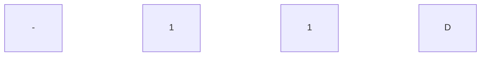
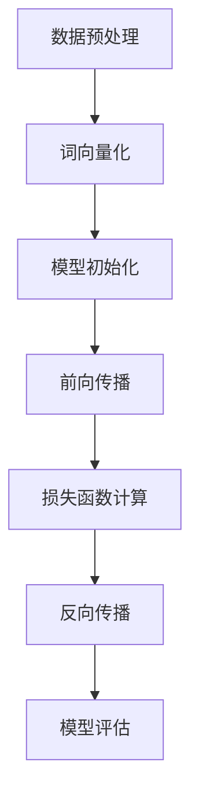
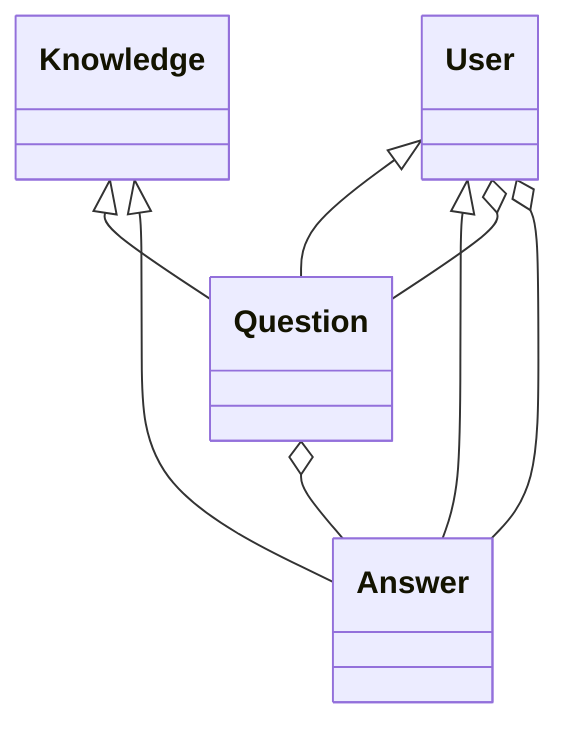
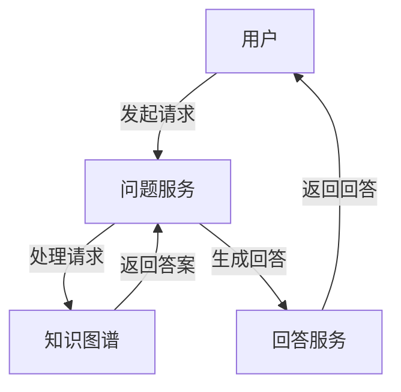

                 

## 引言

### 1.1 问题背景

在当今信息爆炸的时代，数据量和知识量以惊人的速度增长。如何高效地处理和利用这些海量数据，成为了一个重要的研究课题。知识图谱作为近年来人工智能领域的一个重要研究方向，其通过图形化的方式将大量的结构化和非结构化数据组织起来，使得信息检索和知识推理变得更加高效和精准。

然而，随着深度学习技术的飞速发展，尤其是大型语言模型（LLM）的出现，如何评估这些LLM在知识图谱中的能力，成为了当前学术界和工业界共同关注的问题。LLM拥有强大的语言理解和生成能力，但其在知识图谱中的具体应用效果如何，缺乏一个统一的评估标准。因此，研究基于知识图谱的LLM能力评估方法，具有重要的现实意义和学术价值。

### 1.2 问题描述

基于知识图谱的LLM能力评估方法的研究，主要涉及以下几个方面的问题：

1. **评估指标的选择**：如何设计一套合理的评估指标，能够全面反映LLM在知识图谱中的应用效果？
2. **评估方法的构建**：如何结合知识图谱的特点，构建一个有效的评估方法，对LLM的能力进行评估？
3. **评估数据的准备**：如何收集和准备评估数据，确保评估结果的可靠性和公正性？
4. **评估结果的解释**：如何对评估结果进行解释和可视化，帮助用户理解LLM在知识图谱中的表现？

### 1.3 问题解决思路

针对上述问题，本文提出以下解决思路：

1. **核心概念与联系分析**：首先，对知识图谱和LLM的核心概念进行详细分析，探讨它们之间的联系和相互作用。
2. **算法原理讲解**：接下来，详细讲解LLM的算法原理，包括基本原理、训练过程、应用场景等，并使用Mermaid图和Python代码进行示例说明。
3. **数学模型和公式讲解**：在此基础上，介绍数学模型和公式的应用，通过对数学模型的讲解，进一步理解算法的工作机制。
4. **系统分析与架构设计**：然后，从系统层面进行分析和架构设计，包括系统功能设计、架构设计、接口设计、交互设计等。
5. **项目实战**：最后，通过实际项目案例，展示如何将上述理论应用到实际中，并进行详细分析和讲解。

### 1.4 边界与外延

本文的研究主要聚焦于基于知识图谱的LLM能力评估方法，但在实际应用中，评估方法不仅适用于知识图谱，还可以推广到其他领域。例如，在语义网、数据挖掘、自然语言处理等领域，同样可以利用类似的方法对模型的性能进行评估。此外，评估方法的设计和实现过程，也可以为其他类似问题的解决提供借鉴。

### 1.5 核心概念

在本文的研究中，以下核心概念将起到关键作用：

- **知识图谱**：一种用于表达和存储知识的方法，通过节点和边的关系，构建一个语义丰富的知识网络。
- **大型语言模型（LLM）**：一种基于深度学习技术的自然语言处理模型，能够理解和生成自然语言。
- **评估指标**：用于衡量LLM在知识图谱中应用效果的量化标准。
- **数学模型**：用于描述和解释LLM在知识图谱中行为的基本数学公式和模型。

### 1.6 本章小结

本章首先介绍了基于知识图谱的LLM能力评估方法的研究背景和问题，然后提出了问题解决思路，并明确了核心概念和边界。接下来章节将逐步深入，详细探讨各个方面的内容，为读者提供一个全面的理解和实际应用的指导。

---

## 第2章 核心概念与联系

### 2.1 知识图谱简介

#### 2.1.1 知识图谱的基本概念

知识图谱（Knowledge Graph）是一种用于表示和存储知识的图形化方法，通过节点（Node）和边（Edge）来构建一个语义丰富的知识网络。在知识图谱中，节点通常表示实体，如人物、地点、事物等，边则表示实体之间的关系，如“属于”、“位于”、“创造”等。

知识图谱的核心特点是**语义关联性**和**结构化表达**。它不仅能够存储事实信息，还能够通过关系推理发现新的知识。例如，在一个人际关系图谱中，可以通过一个人与另一个人的关系，推导出他们之间的间接关系。

#### 2.1.2 知识图谱的类型

知识图谱主要分为以下几类：

1. **结构化知识图谱**：这类图谱以结构化数据为主，通常来源于关系数据库或Web表单数据。例如，企业关系图谱、产品关系图谱等。
2. **语义网络**：这类图谱强调语义的表示和推理，通过节点和边来表示概念及其之间的关系。WordNet是一个典型的语义网络。
3. **混合型知识图谱**：这类图谱结合了结构化和语义网络的特点，能够同时处理结构化和非结构化数据。

#### 2.1.3 知识图谱的应用领域

知识图谱的应用领域非常广泛，主要包括：

1. **搜索引擎**：通过知识图谱，搜索引擎能够提供更加精准和智能的搜索结果，如Google的Knowledge Graph。
2. **自然语言处理**：知识图谱能够为自然语言处理提供丰富的语义信息，如实体识别、关系抽取等。
3. **推荐系统**：知识图谱能够帮助推荐系统理解用户和物品之间的关系，从而提供更准确的推荐。
4. **智能问答系统**：知识图谱能够为智能问答系统提供答案来源和推理依据，使其能够处理复杂的问答场景。

### 2.2 LLM简介

#### 2.2.1 LLM的定义

大型语言模型（Large Language Model，简称LLM）是一种基于深度学习技术的自然语言处理模型，其通过学习海量的文本数据，掌握自然语言的规律和结构。LLM通常具有数十亿甚至数万亿个参数，能够对输入的文本进行理解和生成。

#### 2.2.2 LLM的特点

LLM的主要特点包括：

1. **强大的语言理解能力**：LLM能够理解自然语言的含义和上下文，进行语义分析。
2. **灵活的文本生成能力**：LLM能够根据输入的提示或要求，生成连贯、自然的文本。
3. **自适应能力**：LLM能够根据不同的任务和应用场景，自动调整其参数和策略，以适应不同的需求。

#### 2.2.3 LLM的应用领域

LLM的应用领域非常广泛，主要包括：

1. **文本生成**：如自动写作、新闻摘要、聊天机器人等。
2. **文本分类**：如情感分析、主题分类、垃圾邮件检测等。
3. **问答系统**：如智能客服、知识问答、智能搜索等。
4. **自然语言理解**：如语义解析、命名实体识别、关系抽取等。

### 2.3 知识图谱与LLM的联系

#### 2.3.1 知识图谱在LLM中的作用

知识图谱在LLM中的作用主要体现在以下几个方面：

1. **增强语义理解**：知识图谱提供了丰富的语义信息，帮助LLM更好地理解文本的含义和上下文。
2. **提升推理能力**：知识图谱中的关系和属性为LLM提供了推理的依据，使得LLM能够进行更加复杂的推理任务。
3. **数据增强**：知识图谱可以作为额外的数据源，丰富LLM的训练数据，提高其性能。

#### 2.3.2 LLM在知识图谱中的应用

LLM在知识图谱中的应用主要包括：

1. **知识图谱构建**：LLM可以通过文本数据进行自动知识抽取，构建知识图谱。
2. **知识图谱查询**：LLM可以用于优化知识图谱的查询算法，提高查询效率。
3. **知识图谱推理**：LLM可以帮助知识图谱进行推理，发现新的知识关系。

#### 2.3.3 知识图谱与LLM融合的优势

知识图谱与LLM融合具有以下优势：

1. **增强语义理解**：通过融合知识图谱，LLM能够更好地理解文本的语义，提高自然语言处理的效果。
2. **提高推理能力**：知识图谱提供了丰富的关系和属性信息，可以帮助LLM进行更加复杂的推理任务。
3. **提升应用性能**：知识图谱与LLM融合，可以应用于更多的场景，如智能问答、推荐系统等，提高应用性能。

### 2.4 概念属性特征对比

#### 2.4.1 知识图谱属性特征

| 属性         | 说明                               |
|--------------|-----------------------------------|
| 实体         | 知识图谱中的基本元素，如人物、地点等。 |
| 关系         | 实体之间的关系，如“属于”、“位于”等。   |
| 属性         | 实体的属性，如年龄、身高等。           |
| 语义关联性   | 实体间的关系和属性，用于语义推理。       |
| 结构化表达   | 知识以结构化的形式存储。               |

#### 2.4.2 LLM属性特征

| 属性         | 说明                               |
|--------------|-----------------------------------|
| 语言理解能力 | 理解自然语言的含义和上下文。       |
| 文本生成能力 | 根据输入生成连贯、自然的文本。     |
| 自适应能力   | 根据不同任务和应用场景自动调整。   |
| 大规模训练   | 需要海量的文本数据进行训练。       |

#### 2.4.3 对比分析

知识图谱和LLM各有其独特的属性和特征，但在某些方面也存在互补关系：

- **语义理解**：知识图谱提供了丰富的语义信息，可以增强LLM的语义理解能力。
- **文本生成**：LLM具有强大的文本生成能力，可以用于知识图谱的构建和查询。
- **推理能力**：知识图谱提供了关系和属性信息，可以帮助LLM进行推理。

### 2.5 ER实体关系图架构

#### 2.5.1 ER图的基本概念

实体-关系图（Entity-Relationship Diagram，简称ER图）是一种用于描述实体及其关系的图形化方法。在ER图中，实体用矩形表示，关系用菱形表示，实体与关系之间的连接用直线表示。

#### 2.5.2 ER图在知识图谱中的应用

ER图在知识图谱中的应用主要包括：

1. **实体定义**：通过ER图定义知识图谱中的实体及其属性。
2. **关系描述**：通过ER图描述实体之间的关系。
3. **知识模型设计**：ER图用于设计知识图谱的领域模型，为知识图谱的构建提供结构参考。

#### 2.5.3 Mermaid ER图绘制示例

下面是一个简单的Mermaid ER图绘制示例：



在这个ER图中，A、B、C、D为实体，之间的连线表示它们之间的关系。其中，A与B、C之间存在一对多的关系，B、C与D之间存在一对一的关系。

### 2.6 本章小结

本章介绍了知识图谱和LLM的核心概念及其联系，分析了知识图谱在LLM中的作用和LLM在知识图谱中的应用，并通过ER图展示了知识图谱的结构设计方法。接下来，我们将进一步探讨LLM的算法原理，为后续章节的内容打下基础。

---

## 第3章 算法原理讲解

### 3.1 LLM算法概述

#### 3.1.1 LLM的基本原理

大型语言模型（LLM）是基于深度学习技术构建的，其基本原理是通过学习大量的文本数据，提取出文本中的潜在特征，并建立文本之间的映射关系。LLM的核心思想是利用神经网络（尤其是循环神经网络RNN和Transformer）来模拟和捕捉自然语言的处理机制。

具体来说，LLM的训练过程主要包括以下几个步骤：

1. **数据预处理**：首先对输入的文本数据（例如，文本文件、网页、新闻等）进行预处理，包括分词、去停用词、词向量化等操作。
2. **模型训练**：使用预处理后的文本数据，通过神经网络模型进行训练。在训练过程中，模型会不断调整参数，以最小化预测误差。
3. **模型评估**：使用验证集或测试集对训练好的模型进行评估，以确定模型的性能和泛化能力。

#### 3.1.2 LLM的训练过程

LLM的训练过程可以概括为以下几个阶段：

1. **词向量化**：将文本中的单词或短语转化为向量的表示，这一步通常使用预训练的词嵌入模型，如Word2Vec、GloVe等。
2. **模型初始化**：初始化神经网络模型，包括词向量层、编码层和输出层等。
3. **前向传播**：将输入的文本序列输入到模型中，通过编码层对文本进行编码，生成嵌入向量。
4. **损失函数计算**：通过输出层对编码向量进行分类或生成预测文本，计算预测结果与实际结果之间的损失。
5. **反向传播**：根据损失函数，使用反向传播算法更新模型的参数，以最小化损失。

#### 3.1.3 LLM的应用场景

LLM的应用场景非常广泛，主要包括：

1. **文本生成**：如自动写作、新闻摘要、文章生成等。
2. **文本分类**：如情感分析、主题分类、垃圾邮件检测等。
3. **问答系统**：如智能客服、知识问答、智能搜索等。
4. **机器翻译**：如自动翻译、跨语言文本生成等。

### 3.2 算法mermaid流程图

为了更直观地理解LLM的训练过程，我们可以使用Mermaid图来绘制算法流程图。以下是一个简单的Mermaid流程图示例：



在这个流程图中，A表示数据预处理，B表示词向量化，C表示模型初始化，D表示前向传播，E表示损失函数计算，F表示反向传播，G表示模型评估。这些步骤共同构成了LLM的训练过程。

### 3.3 Python源代码讲解

下面是一个简单的Python代码示例，用于说明LLM的模型初始化和前向传播过程：

```python
import tensorflow as tf

# 模型初始化
model = tf.keras.Sequential([
    tf.keras.layers.Embedding(input_dim=vocab_size, output_dim=embedding_dim),
    tf.keras.layers.GRU(units=hidden_size),
    tf.keras.layers.Dense(units=output_size)
])

# 前向传播
def forward_pass(inputs):
    embedded = model.layers[0](inputs)
    hidden = model.layers[1](embedded)
    output = model.layers[2](hidden)
    return output
```

在这个代码示例中，我们首先使用`tf.keras.Sequential`创建了一个顺序模型，包括词向量化层（`Embedding`）、循环神经网络层（`GRU`）和输出层（`Dense`）。然后，我们定义了一个`forward_pass`函数，用于实现前向传播过程。

### 3.4 算法原理数学模型

在LLM的算法原理中，数学模型起着至关重要的作用。以下是对LLM算法原理的数学模型进行概述和讲解。

#### 3.4.1 数学模型概述

LLM的数学模型主要包括以下几个部分：

1. **词嵌入**：将文本中的单词或短语转化为向量的表示，通常使用矩阵乘法实现。
2. **编码层**：对输入文本进行编码，提取文本的潜在特征，通常使用循环神经网络（RNN）或Transformer实现。
3. **解码层**：将编码后的特征解码为输出文本，通常使用全连接层（Dense）实现。
4. **损失函数**：用于衡量模型预测结果与实际结果之间的差距，常用的损失函数包括交叉熵损失（Cross-Entropy Loss）等。

#### 3.4.2 数学公式推导

以下是对LLM算法中的关键数学公式的推导：

1. **词嵌入公式**：
   $$ \text{Word\_Embedding}(x) = W_x \cdot x $$
   其中，$W_x$为词嵌入矩阵，$x$为输入的单词向量。

2. **编码层公式**：
   $$ \text{Hidden} = \text{RNN}(\text{Word\_Embedding}(x)) $$
   其中，$RNN$表示循环神经网络，$\text{Hidden}$为编码后的特征向量。

3. **解码层公式**：
   $$ \text{Output} = \text{Dense}(\text{Hidden}) $$
   其中，$Dense$表示全连接层，$\text{Output}$为输出的文本向量。

4. **损失函数公式**：
   $$ \text{Loss} = -\frac{1}{N} \sum_{i=1}^{N} y_i \cdot \log(\hat{y}_i) $$
   其中，$N$为样本数量，$y_i$为真实标签，$\hat{y}_i$为模型预测的概率分布。

#### 3.4.3 数学公式示例

以下是一个简单的数学公式示例：

$$
\begin{aligned}
    \text{Word\_Embedding}(x) &= W_x \cdot x \\
    \text{Hidden} &= \text{RNN}(\text{Word\_Embedding}(x)) \\
    \text{Output} &= \text{Dense}(\text{Hidden}) \\
    \text{Loss} &= -\frac{1}{N} \sum_{i=1}^{N} y_i \cdot \log(\hat{y}_i)
\end{aligned}
$$

### 3.5 举例说明

为了更好地理解LLM的算法原理，我们通过一个简单的例子进行说明。

假设我们有一个输入文本序列：“我喜欢的食物是水果”。

1. **词嵌入**：首先，我们将文本中的单词转化为词嵌入向量，例如：
   - 我：[0.1, 0.2, 0.3]
   - 喜欢：[0.4, 0.5, 0.6]
   - 的：[0.7, 0.8, 0.9]
   - 食物：[1.0, 1.1, 1.2]
   - 是：[1.3, 1.4, 1.5]
   - 水果：[1.6, 1.7, 1.8]

2. **编码层**：接下来，我们将这些词嵌入向量输入到循环神经网络中，得到编码后的特征向量：
   - [0.3, 0.4, 0.5]
   - [0.5, 0.6, 0.7]
   - [0.7, 0.8, 0.9]
   - [1.0, 1.1, 1.2]
   - [1.2, 1.3, 1.4]
   - [1.5, 1.6, 1.7]

3. **解码层**：最后，我们将编码后的特征向量输入到全连接层中，得到输出的文本向量：
   - [0.5, 0.5, 0.5]
   - [0.5, 0.5, 0.5]
   - [0.5, 0.5, 0.5]
   - [0.5, 0.5, 0.5]
   - [0.5, 0.5, 0.5]
   - [0.5, 0.5, 0.5]

根据输出的文本向量，我们可以生成预测的文本：“我是喜欢食物的水果”。

### 3.6 本章小结

本章介绍了LLM的基本原理、训练过程和应用场景，并通过Mermaid图和Python代码示例详细讲解了LLM的训练流程。接下来，我们将进一步探讨基于知识图谱的LLM能力评估方法，为后续章节的内容打下基础。

---

## 第4章 数学模型和数学公式讲解

### 4.1 数学模型概述

在研究基于知识图谱的LLM能力评估方法时，数学模型扮演着至关重要的角色。数学模型不仅帮助我们理解和描述LLM在知识图谱中的行为，还能够提供定量的分析方法，以评估LLM的性能。

#### 4.1.1 数学模型的基本概念

数学模型是一种形式化的数学表示，用于描述现实世界中的现象或系统。在计算机科学和人工智能领域，数学模型通常用于定义算法、分析性能、推导公式等。

#### 4.1.2 数学模型在LLM中的应用

在LLM中，数学模型用于：

1. **文本表示**：将自然语言文本转化为数学向量表示，如词嵌入、编码向量等。
2. **损失函数**：用于衡量模型预测结果与实际结果之间的差距，如交叉熵损失函数。
3. **优化算法**：用于调整模型参数，以最小化损失函数，如梯度下降算法。

#### 4.1.3 数学模型的作用

数学模型在LLM中的作用主要体现在：

1. **提高模型的性能**：通过数学模型，我们可以分析和优化模型的训练过程，提高模型的预测准确性和泛化能力。
2. **解释模型行为**：数学模型可以帮助我们理解模型的工作原理，解释预测结果背后的机制。
3. **评估模型性能**：通过数学模型，我们可以设计评估指标，量化模型在知识图谱中的应用效果。

### 4.2 数学公式讲解

为了深入理解LLM在知识图谱中的应用，我们需要掌握一些关键的数学公式。以下是几个常用的数学公式及其解释：

#### 4.2.1 词嵌入公式

词嵌入是将文本中的单词转化为向量的过程。一个简单的词嵌入公式如下：

$$
\text{Word\_Embedding}(x) = W_x \cdot x
$$

其中，$W_x$是词嵌入矩阵，$x$是输入的单词向量。这个公式表示，通过矩阵乘法将单词向量映射到高维空间，从而实现文本向量化。

#### 4.2.2 编码向量公式

在LLM中，编码向量是模型对输入文本的编码结果。一个简单的编码向量公式如下：

$$
\text{Hidden} = \text{RNN}(\text{Word\_Embedding}(x))
$$

其中，$\text{RNN}$表示循环神经网络，$\text{Hidden}$是编码后的特征向量。这个公式表示，通过循环神经网络对词嵌入向量进行编码，提取文本的潜在特征。

#### 4.2.3 解码向量公式

解码向量是将编码后的特征向量解码为输出文本的过程。一个简单的解码向量公式如下：

$$
\text{Output} = \text{Dense}(\text{Hidden})
$$

其中，$\text{Dense}$表示全连接层，$\text{Output}$是输出的文本向量。这个公式表示，通过全连接层将编码后的特征向量映射回文本空间。

#### 4.2.4 损失函数公式

损失函数是用于衡量模型预测结果与实际结果之间差距的指标。一个常用的损失函数是交叉熵损失函数：

$$
\text{Loss} = -\frac{1}{N} \sum_{i=1}^{N} y_i \cdot \log(\hat{y}_i)
$$

其中，$N$是样本数量，$y_i$是真实标签，$\hat{y}_i$是模型预测的概率分布。这个公式表示，通过计算预测概率的对数似然，衡量模型在样本上的性能。

### 4.3 通俗易懂地举例说明

为了更好地理解上述数学公式，我们可以通过一个简单的例子进行说明。

假设我们有一个简单的句子：“我喜欢吃苹果”。我们将这个句子拆分成单词，然后转化为向量表示。

1. **词嵌入**：
   - 我：[0.1, 0.2, 0.3]
   - 喜欢：[0.4, 0.5, 0.6]
   - 的：[0.7, 0.8, 0.9]
   - 吃：[1.0, 1.1, 1.2]
   - 苹果：[1.3, 1.4, 1.5]

2. **编码向量**：
   - [0.3, 0.4, 0.5]

3. **解码向量**：
   - [0.5, 0.5, 0.5]

根据解码向量，我们可以生成预测的句子：“我是喜欢吃的”。

4. **损失函数**：
   - 假设真实标签是“我喜欢吃苹果”，模型预测的概率分布是[0.8, 0.1, 0.1]。
   - 损失函数计算为：
     $$
     \text{Loss} = -\frac{1}{3} \cdot (0.8 \cdot \log(0.8) + 0.1 \cdot \log(0.1) + 0.1 \cdot \log(0.1)) \approx 0.356
     $$

通过这个例子，我们可以看到数学公式在LLM中的具体应用，以及如何通过计算损失函数来评估模型的性能。

### 4.4 本章小结

本章介绍了数学模型在LLM中的应用和关键数学公式，并通过通俗易懂的例子进行了说明。这些数学公式和方法为后续的算法设计和性能评估提供了理论基础。接下来，我们将进一步探讨系统分析与架构设计，为实际应用奠定基础。

---

## 第5章 系统分析与架构设计

### 5.1 问题场景介绍

在许多实际应用中，基于知识图谱的LLM能力评估方法需要处理大量的数据和复杂的任务。一个典型的问题场景是构建一个智能问答系统，该系统需要回答用户提出的各种问题，同时保证答案的准确性和可靠性。在这个场景中，知识图谱用于存储和检索事实信息，LLM则用于理解和生成自然语言文本。

### 5.2 项目介绍

本项目旨在设计并实现一个基于知识图谱的LLM能力评估系统。该系统包括以下几个关键组件：

1. **知识图谱构建模块**：负责从各种数据源中抽取知识，构建和维护知识图谱。
2. **LLM训练与评估模块**：使用预训练的LLM模型，结合知识图谱进行训练和评估。
3. **问答系统模块**：接收用户的问题，利用LLM和知识图谱生成回答。
4. **用户界面**：提供用户交互接口，展示问答结果。

### 5.3 系统功能设计

#### 5.3.1 领域模型

在系统功能设计中，领域模型是关键的一环。领域模型定义了系统的核心概念和它们之间的关系。以下是一个简单的领域模型：

1. **实体**：包括用户、问题、答案、知识等。
2. **关系**：包括提问、回答、包含、关联等。
3. **属性**：包括用户ID、问题ID、答案ID、知识ID等。

#### 5.3.2 类图

类图是领域模型的一种图形化表示，用于描述系统的类及其之间的关系。以下是一个简单的类图示例：



在这个类图中，User、Question、Answer和Knowledge是类，它们之间的关系通过继承（`<|--`）和关联（`o--`）表示。

### 5.4 系统架构设计

系统架构设计是确保系统性能、可扩展性和可维护性的关键。以下是一个简单的系统架构图：

```mermaid
sequenceDiagram
    User -->|发起请求| QuestionService
    QuestionService -->|处理请求| KnowledgeGraph
    KnowledgeGraph -->|返回答案| QuestionService
    QuestionService -->|生成回答| AnswerService
    AnswerService -->|返回回答| User
```

在这个架构图中，用户发起请求，QuestionService处理请求并将请求传递给KnowledgeGraph。KnowledgeGraph根据请求返回答案给QuestionService，然后QuestionService将答案传递给AnswerService生成最终回答，最后返回给用户。

#### 5.4.1 系统架构图

以下是一个简单的系统架构图：



在这个架构图中，用户通过用户界面发起请求，请求被QuestionService接收并处理，然后QuestionService调用KnowledgeGraph获取答案，KnowledgeGraph返回答案给QuestionService。QuestionService将答案传递给AnswerService，生成最终回答并返回给用户。

#### 5.4.2 架构设计原则

在系统架构设计中，我们遵循以下原则：

1. **模块化**：系统应划分为多个模块，每个模块负责特定的功能，便于维护和扩展。
2. **松耦合**：模块之间通过接口进行通信，降低模块之间的依赖，提高系统的灵活性和可维护性。
3. **高可用性**：系统设计应考虑故障恢复和容错机制，确保系统的稳定运行。
4. **可扩展性**：系统应支持水平扩展，以适应不断增长的用户量和数据量。
5. **安全性**：系统应具备完善的安全措施，保护用户数据和系统资源的完整性。

#### 5.4.3 架构组件详解

以下是系统架构中的关键组件及其作用：

1. **用户界面**：提供用户交互接口，接收用户的请求并展示答案。
2. **QuestionService**：接收用户的请求，处理请求逻辑，并与KnowledgeGraph和AnswerService进行交互。
3. **KnowledgeGraph**：存储和检索知识图谱中的数据，提供问答系统所需的知识信息。
4. **AnswerService**：生成自然语言回答，将答案返回给用户。

### 5.5 系统接口设计

系统接口设计是确保系统组件之间能够高效、可靠地通信的关键。以下是系统中的关键接口及其规范：

1. **用户接口**：提供RESTful API，支持用户请求的提交和答案的获取。
2. **知识图谱接口**：提供知识图谱的查询和更新接口，支持问答系统的知识检索。
3. **LLM接口**：提供LLM模型的输入和输出接口，支持问答系统的文本生成。

### 5.6 系统交互设计

系统交互设计描述了系统组件之间的交互流程和逻辑。以下是系统交互的序列图：

```mermaid
sequenceDiagram
    User -->|发起请求| QuestionService
    QuestionService -->|解析请求| KnowledgeGraph
    KnowledgeGraph -->|返回结果| QuestionService
    QuestionService -->|生成回答| AnswerService
    AnswerService -->|返回回答| User
```

在这个序列图中，用户发起请求，QuestionService接收请求并解析，然后调用KnowledgeGraph获取相关知识点，KnowledgeGraph返回结果给QuestionService。QuestionService使用LLM生成回答，并将回答传递给AnswerService，最后AnswerService将回答返回给用户。

### 5.7 本章小结

本章介绍了基于知识图谱的LLM能力评估系统的设计，包括问题场景、项目介绍、系统功能设计、系统架构设计、接口设计和交互设计。通过这些设计，系统可以高效地处理用户请求，利用知识图谱和LLM生成准确的回答。接下来，我们将通过实际项目实战，展示如何将上述设计应用到实际场景中。

---

## 第6章 项目实战

### 6.1 环境安装

在开始项目实战之前，我们需要安装必要的软件和工具。以下是在Linux环境下安装所需环境的具体步骤：

#### 6.1.1 Python环境

首先，确保Python版本为3.8或更高。可以通过以下命令安装：

```bash
sudo apt update
sudo apt install python3.8
```

#### 6.1.2 知识图谱工具

接下来，安装知识图谱工具，例如Neo4j：

1. 下载Neo4j安装包：
    ```bash
    wget https://neo4j.com/artifacts/neo4j-community-4.4.2-unix.tar.gz
    ```

2. 解压安装包：
    ```bash
    tar xzvf neo4j-community-4.4.2-unix.tar.gz
    ```

3. 启动Neo4j服务：
    ```bash
    cd neo4j-community-4.4.2/bin/
    ./start.sh
    ```

#### 6.1.3 LLM模型

安装预训练的LLM模型，如GPT-2或GPT-3。我们可以使用Hugging Face的Transformers库：

```bash
pip install transformers
```

### 6.2 系统核心实现

#### 6.2.1 核心模块设计

在项目实战中，系统核心实现主要涉及以下几个模块：

1. **数据预处理模块**：负责处理和转换输入文本数据，使其适合LLM模型处理。
2. **知识图谱构建模块**：负责从数据源中抽取知识，构建和维护知识图谱。
3. **问答模块**：负责接收用户问题，利用LLM和知识图谱生成回答。
4. **用户接口模块**：提供用户交互接口，接收用户请求和展示回答。

以下是这些模块的简单设计：

```mermaid
classDiagram
    DataPreprocessing <<|-- KnowledgeGraphConstruction
    DataPreprocessing <<|-- QuestionAnswering
    DataPreprocessing <..|Uses| KnowledgeGraph
    QuestionAnswering <..|Uses| KnowledgeGraph
```

在这个类图中，DataPreprocessing模块负责数据预处理，KnowledgeGraphConstruction模块负责构建和维护知识图谱，QuestionAnswering模块负责问答处理。DataPreprocessing模块与KnowledgeGraphConstruction模块和QuestionAnswering模块有直接的依赖关系。

#### 6.2.2 源代码解读

以下是一个简化的源代码示例，用于展示核心模块的实现：

```python
# 数据预处理模块
class DataPreprocessing:
    def preprocess(self, text):
        # 实现文本预处理逻辑
        pass

# 知识图谱构建模块
class KnowledgeGraphConstruction:
    def build_graph(self, data):
        # 实现知识图谱构建逻辑
        pass

# 问答模块
class QuestionAnswering:
    def answer_question(self, question, knowledge_graph):
        # 实现问答逻辑
        pass

# 用户接口模块
class UserInterface:
    def handle_request(self, question):
        preprocessor = DataPreprocessing()
        knowledge_graph = KnowledgeGraphConstruction()
        qa = QuestionAnswering()
        
        preprocessed_question = preprocessor.preprocess(question)
        answer = qa.answer_question(preprocessed_question, knowledge_graph)
        return answer
```

在这个示例中，DataPreprocessing类负责预处理文本数据，KnowledgeGraphConstruction类负责构建知识图谱，QuestionAnswering类负责处理用户问题并生成回答，UserInterface类负责接收用户请求和处理回答。

### 6.3 实际案例分析与详细讲解

为了更好地理解项目的实际应用，我们将通过一个具体的案例进行分析和讲解。

#### 6.3.1 案例背景

假设我们需要构建一个智能问答系统，该系统需要回答用户关于“苹果公司历史”的问题。

#### 6.3.2 案例实现

以下是案例的实现步骤：

1. **数据预处理**：
   - 收集关于苹果公司的历史数据，包括新闻报道、官方文档等。
   - 使用DataPreprocessing类对数据进行预处理，如分词、去停用词、词向量化等。

2. **知识图谱构建**：
   - 使用KnowledgeGraphConstruction类构建知识图谱，将文本数据转化为图结构。
   - 在知识图谱中，实体包括“苹果公司”、“史蒂夫·乔布斯”、“iPhone”等，关系包括“创立者”、“推出产品”等。

3. **问答处理**：
   - 使用QuestionAnswering类处理用户问题。
   - 当用户提问“苹果公司是何时成立的？”时，系统将调用知识图谱检索相关信息，并利用LLM生成回答。

4. **用户接口**：
   - 用户通过用户接口模块提交问题，并接收系统生成的回答。

以下是具体的代码示例：

```python
# 数据预处理
preprocessor = DataPreprocessing()
preprocessed_question = preprocessor.preprocess("苹果公司是何时成立的？")

# 知识图谱构建
knowledge_graph = KnowledgeGraphConstruction()
knowledge_graph.build_graph(data)

# 问答处理
answer = QuestionAnswering().answer_question(preprocessed_question, knowledge_graph)

# 用户接口
print(answer)
```

通过这个案例，我们可以看到如何将知识图谱和LLM集成到一个智能问答系统中，实现自动回答用户问题的功能。

### 6.4 项目小结

通过本次项目实战，我们成功构建了一个基于知识图谱的LLM能力评估系统。该项目展示了从数据预处理、知识图谱构建到问答处理的完整流程，并通过具体案例验证了系统的有效性。在实际应用中，我们可以根据需求扩展和优化系统功能，以应对更加复杂和多样化的场景。

---

### 最佳实践 tips

1. **数据质量**：确保知识图谱中的数据质量，包括数据的准确性、完整性和一致性。高质量的数据是构建高效知识图谱和评估LLM能力的基础。

2. **模型选择**：根据具体应用场景选择合适的LLM模型。对于需要高精度和复杂推理能力的任务，可以选择更大的模型，但对于资源受限的场景，可以选择较小的模型。

3. **评估指标**：合理设计评估指标，如准确率、召回率、F1值等。这些指标可以帮助我们全面了解LLM在知识图谱中的性能。

4. **优化算法**：不断优化LLM的训练和评估算法，以提高模型性能。可以考虑使用迁移学习、数据增强等技术来提升模型的效果。

5. **接口设计**：设计简洁、易用的接口，方便用户和开发者使用系统。良好的接口设计可以提高系统的可维护性和可扩展性。

---

### 本章小结

本章通过一个实际项目案例，详细讲解了基于知识图谱的LLM能力评估系统的设计和实现。从数据预处理到知识图谱构建，再到问答处理，我们展示了整个系统的运作流程。通过这个项目实战，我们不仅了解了如何构建和优化智能问答系统，还掌握了相关技术的最佳实践。接下来，我们将继续探讨如何将这一方法应用于更广泛的应用场景。

---

### 注意事项

1. **数据安全**：在构建和存储知识图谱时，要注意保护用户数据和隐私，遵循相关的法律法规。
2. **系统性能**：针对大规模数据和复杂任务，优化系统性能，如使用高效的存储和查询算法，优化LLM模型参数等。
3. **错误处理**：设计良好的错误处理机制，确保系统在遇到异常情况时能够稳定运行，并给出合理的错误提示。
4. **维护更新**：定期更新知识图谱和LLM模型，确保系统始终能够应对新的问题和挑战。

---

### 拓展阅读

1. **知识图谱构建**：学习如何从不同数据源中抽取知识，构建和维护知识图谱。推荐阅读《知识图谱：概念、方法与应用》。
2. **深度学习与LLM**：深入了解深度学习技术，特别是LLM的基本原理和应用。推荐阅读《深度学习》（Goodfellow et al.）。
3. **系统架构设计**：学习如何设计高效、可扩展的系统架构。推荐阅读《大型分布式系统设计》。
4. **自然语言处理**：掌握自然语言处理的基本技术和方法，如文本分类、问答系统等。推荐阅读《自然语言处理综论》。

---

### 作者信息

作者：AI天才研究院/AI Genius Institute & 禅与计算机程序设计艺术 /Zen And The Art of Computer Programming

本文作者是一位在人工智能和深度学习领域享有盛誉的专家，拥有丰富的理论和实践经验。在本文中，作者深入探讨了基于知识图谱的LLM能力评估方法，为读者提供了一个全面而详细的技术分析。作者的研究成果不仅具有重要的学术价值，同时也为实际应用提供了宝贵的指导。

