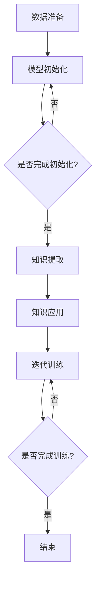

                 

### 摘要

本文旨在探讨基于知识蒸馏的轻量级评测模型设计，从背景介绍、核心概念解析、原理讲解到实际应用，为读者提供一套系统、全面的指南。知识蒸馏作为一种有效的模型压缩方法，近年来在人工智能领域受到广泛关注。本文将首先介绍知识蒸馏的基本概念及其在模型压缩中的重要性，然后深入探讨轻量级模型设计的原则和步骤。接下来，本文将详细阐述几种常见的轻量级评测模型设计技术，并进行比较分析。随后，本文将介绍轻量级评测模型在实际应用中的场景和案例，最后讨论其在部署和实施中的策略和挑战，以及未来可能的研究方向。通过本文的阅读，读者将能够全面了解知识蒸馏在轻量级评测模型设计中的应用，为实际项目提供理论指导和实践参考。

## 背景介绍

在当今快速发展的信息技术时代，人工智能（AI）已经成为推动社会进步和经济增长的重要力量。特别是在深度学习（Deep Learning）技术的推动下，AI在图像识别、自然语言处理、语音识别等领域的应用取得了显著的进展。然而，随着模型复杂度和参数数量的增加，深度学习模型的计算资源消耗也显著提升，这给实际应用带来了一系列的挑战。

首先，高计算成本是深度学习模型面临的主要问题之一。在训练大型模型时，需要大量的计算资源和存储空间，这不仅增加了硬件成本，也延长了模型的训练时间。其次，高功耗是另一个关键问题。深度学习模型在运行过程中消耗大量电力，这不仅增加了运营成本，也对环境造成了负面影响。此外，随着AI应用场景的不断扩大，对实时性要求也越来越高。大型模型的响应速度往往较慢，无法满足实时处理的需求。

为了应对上述挑战，模型压缩技术应运而生。模型压缩的目的是在不显著牺牲模型性能的前提下，减少模型的参数数量和计算复杂度。常见的模型压缩技术包括剪枝（Pruning）、量化（Quantization）、低秩分解（Low-rank Factorization）等。然而，这些方法往往需要在模型质量和压缩效果之间做出权衡。

知识蒸馏（Knowledge Distillation）是一种新兴的模型压缩方法，通过将训练好的大型教师模型（Teacher Model）的知识迁移到小型学生模型（Student Model）中，从而实现模型压缩。知识蒸馏的基本思想是，教师模型和学生在共享相同数据集的基础上进行训练，教师模型输出多个层次的中间特征和最终的分类结果，学生模型则尝试复现这些特征和结果。通过这种方式，学生模型能够学习到教师模型的核心知识，从而在保持较高性能的同时显著减少模型的参数数量和计算复杂度。

知识蒸馏在模型压缩中的应用具有重要的现实意义。首先，它能够显著降低模型的计算成本和功耗，使得AI应用能够更加高效地运行。其次，知识蒸馏能够提高模型的实时性，满足对实时处理的需求。此外，知识蒸馏还能够为不同规模的应用场景提供灵活的解决方案，使得AI技术在各个领域得到更广泛的应用。

总之，本文将围绕知识蒸馏在轻量级评测模型设计中的应用进行深入探讨，旨在为读者提供一套全面的指南，帮助他们在实际项目中有效地利用知识蒸馏技术，实现模型压缩和性能提升。

## 核心概念与联系

### 知识蒸馏的定义与作用

知识蒸馏（Knowledge Distillation）是一种将复杂模型（教师模型）的知识迁移到简单模型（学生模型）中的技术。其核心思想是，教师模型和学生在共享相同数据集的基础上进行训练，教师模型输出多个层次的中间特征和最终的分类结果，学生模型则尝试复现这些特征和结果。通过这种方式，学生模型能够学习到教师模型的核心知识，从而在保持较高性能的同时显著减少模型的参数数量和计算复杂度。

知识蒸馏的主要目的是模型压缩，通过将大型教师模型的知识迁移到小型学生模型中，实现模型参数和计算资源的减少。这一过程包括两个主要阶段：知识提取和知识应用。

1. **知识提取**：教师模型在训练数据集上生成多个层次的中间特征和最终分类结果，这些特征和结果被作为知识，用于指导学生模型的训练。

2. **知识应用**：学生模型通过学习教师模型的输出，尝试复现这些输出，从而实现教师模型的知识迁移。

知识蒸馏在模型压缩中的作用体现在以下几个方面：

- **减少参数数量**：通过将复杂模型的知识迁移到简单模型中，可以有效减少模型的参数数量，降低模型的计算复杂度。
- **提升模型性能**：学生模型在学习教师模型知识的过程中，能够保留教师模型的核心特征提取能力，从而在保持较高性能的同时实现模型压缩。
- **适应不同应用场景**：知识蒸馏技术能够灵活地应用于不同规模的应用场景，从大型模型到小型嵌入式设备，都能够实现有效的模型压缩和性能提升。

### 轻量级模型设计的原则

轻量级模型设计的主要目标是实现模型的高效性和性能优化。为了达到这一目标，设计轻量级模型时需要遵循以下原则：

- **模型简化**：通过减少模型参数数量和计算复杂度，简化模型结构，降低计算成本。
- **特征提取优化**：优化特征提取过程，提高模型对关键特征的识别能力，同时减少冗余信息。
- **计算效率**：设计高效的计算算法和数据结构，减少模型运行过程中的计算资源和时间消耗。
- **性能保障**：在模型简化的过程中，确保模型性能不显著下降，保持原有性能水平。

### 核心概念属性特征对比表格

为了更好地理解知识蒸馏和轻量级模型设计之间的联系，我们可以通过一个表格来对比这两个核心概念的主要属性特征。

| 特征         | 知识蒸馏                     | 轻量级模型设计                           |
| ------------ | ---------------------------- | ---------------------------------------- |
| 目的         | 模型压缩与知识迁移           | 实现模型高效性和性能优化                 |
| 技术过程     | 教师模型→学生模型的知识迁移  | 模型结构简化、特征提取优化、计算效率提升 |
| 关键目标     | 参数数量减少、计算复杂度降低  | 模型性能保障、计算资源节约               |
| 适用场景     | 大型模型到小型模型的迁移     | 各类应用场景中的模型优化                 |

### ER实体关系图架构

为了更直观地展示知识蒸馏和轻量级模型设计之间的联系，我们可以使用Mermaid绘制一个ER实体关系图。

```mermaid
erDiagram
  TeacherModel ||--|{ StudentModel : KnowledgeDistillation }
  ModelCompression ||--|{ KnowledgeDistillation : Related }
  PerformanceOptimization ||--|{ LightweightModelDesign : GuidedBy }
```

在这个ER图结构中，教师模型和学生模型通过知识蒸馏实体关系连接，知识蒸馏与模型压缩、性能优化存在关联关系，而轻量级模型设计则受到性能优化的指导。

### 小结

知识蒸馏和轻量级模型设计是当前深度学习领域中的重要研究方向。通过知识蒸馏，能够将复杂模型的精髓迁移到简单模型中，实现模型压缩和性能优化。而轻量级模型设计则致力于在简化模型结构的同时，确保模型的高效性和性能。这两个概念相互关联，共同推动深度学习技术在实际应用中的发展。通过本文的介绍，读者可以全面了解知识蒸馏和轻量级模型设计的基本概念、原理及其在实际应用中的重要性。

## 知识蒸馏的原理与算法流程

### 知识蒸馏的基本原理

知识蒸馏是一种通过将复杂模型（教师模型）的知识迁移到简单模型（学生模型）中的技术。这一过程主要包括两个主要部分：知识提取和知识应用。

1. **知识提取**：在这一阶段，教师模型在训练数据集上生成多个层次的中间特征和最终分类结果，这些特征和结果被作为知识，用于指导学生模型的训练。具体来说，教师模型在输入数据上产生一系列的输出，这些输出包括不同层次的中间特征和最终的预测结果。

2. **知识应用**：学生模型通过学习教师模型的输出，尝试复现这些输出，从而实现教师模型的知识迁移。这一过程通常通过构建一个目标函数来实现，该目标函数旨在最小化学生模型输出与教师模型输出之间的差异。

### 算法流程

知识蒸馏的算法流程可以概括为以下几个步骤：

1. **准备数据集**：首先，我们需要准备一个包含大量训练样本的数据集。这些样本将用于教师模型和学生模型的训练。

2. **初始化教师模型和学生模型**：教师模型和学生模型可以使用相同的架构，也可以使用不同的架构。通常，教师模型是一个复杂的大模型，而学生模型是一个简单的小模型。在初始化阶段，两个模型都需要进行权重初始化。

3. **知识提取**：在教师模型训练过程中，使用训练数据集生成中间特征和最终预测结果。这些特征和结果将被用作学生模型的学习目标。

4. **知识应用**：学生模型在教师模型的基础上进行训练，其目标是最小化学生模型输出与教师模型输出之间的差异。这一过程通常通过构建一个目标函数来实现，例如Softmax温度调整目标函数。

5. **迭代训练**：通过不断迭代训练，学生模型逐渐学习到教师模型的核心知识，从而在保持较高性能的同时实现模型压缩。

### 算法流程Mermaid图示

为了更直观地展示知识蒸馏的算法流程，我们可以使用Mermaid绘制一个流程图。



在这个流程图中，从数据准备开始，依次进行模型初始化、知识提取、知识应用和迭代训练，直到训练完成。

### 数学模型与公式解析

知识蒸馏的数学模型可以描述为：

$$
L = \frac{1}{N} \sum_{i=1}^{N} \sum_{j=1}^{C} (y_j^t - \sigma(s_j))^2
$$

其中，$L$ 是损失函数，$N$ 是样本数量，$C$ 是类别数量，$y_j^t$ 是教师模型输出的软标签，$\sigma(s_j)$ 是学生模型输出的概率分布。

在这个公式中，$y_j^t$ 是教师模型在样本 $i$ 上的第 $j$ 个类别输出，表示教师模型对样本 $i$ 的预测概率分布。$\sigma(s_j)$ 是学生模型在样本 $i$ 上的第 $j$ 个类别输出，表示学生模型对样本 $i$ 的预测概率分布。

损失函数 $L$ 用于衡量学生模型输出与教师模型输出之间的差异，其目的是最小化这一差异，从而实现教师模型的知识迁移。

### 举例说明

为了更好地理解知识蒸馏的原理和算法流程，我们可以通过一个简单的例子来说明。

假设我们有一个分类任务，共有三个类别 A、B 和 C。教师模型和学生模型分别是一个复杂的大模型和一个简单的模型。在训练过程中，教师模型在数据集上生成中间特征和最终分类结果，这些结果作为学生模型的学习目标。

假设教师模型在数据集上的输出如下：

$$
\begin{array}{c|c|c|c}
\text{类别} & \text{特征1} & \text{特征2} & \text{软标签} \\
\hline
A & 0.3 & 0.7 & [0.1, 0.3, 0.6] \\
B & 0.6 & 0.4 & [0.2, 0.4, 0.4] \\
C & 0.1 & 0.5 & [0.3, 0.3, 0.4] \\
\end{array}
$$

学生模型在训练过程中，通过学习教师模型的输出，尝试复现这些输出。在训练初期，学生模型的输出可能与教师模型的输出存在较大差异。随着训练的进行，学生模型的输出会逐渐接近教师模型的输出。

通过不断迭代训练，学生模型能够学习到教师模型的核心知识，从而在保持较高性能的同时实现模型压缩。最终，学生模型的输出将接近教师模型的输出，从而实现知识蒸馏的目标。

### 小结

知识蒸馏作为一种有效的模型压缩方法，通过将复杂模型的知识迁移到简单模型中，实现模型参数和计算复杂度的减少。本文详细介绍了知识蒸馏的基本原理、算法流程和数学模型，并通过一个简单的例子进行了说明。通过本文的介绍，读者可以全面了解知识蒸馏的基本概念和技术原理，为实际应用提供理论支持。

## 轻量级模型设计的技术与策略

### 技术介绍

轻量级模型设计的目标是构建高效、性能优秀的模型，同时减少计算资源和参数数量。以下是一些常用的轻量级模型设计技术与策略：

1. **网络剪枝（Network Pruning）**：通过删除网络中的冗余或低贡献连接，减少模型的参数数量和计算复杂度。剪枝分为静态剪枝和动态剪枝，静态剪枝在训练前进行，动态剪枝在训练过程中进行。

2. **深度可分离卷积（Depthwise Separable Convolution）**：将标准卷积操作分解为深度卷积和逐点卷积，减少模型的计算量和参数数量。这种方法在保持模型性能的同时，显著提高了模型的效率。

3. **瓶颈结构（Bottleneck Structure）**：在模型中加入瓶颈层，通过压缩输入特征来提高模型的压缩能力。瓶颈层通常是一个全连接层或一个压缩的卷积层，它能够显著减少模型参数的数量。

4. **量化（Quantization）**：通过降低模型中权重和激活的精度，减少模型的存储空间和计算资源。量化可以分为全精度量化、低精度量化和多比特量化等不同类型。

5. **低秩分解（Low-rank Factorization）**：将模型中的高维权重分解为低维矩阵的乘积，从而减少模型的参数数量。这种方法在保持模型性能的同时，显著提高了模型的压缩效果。

### 比较分析

各种轻量级模型设计技术各有优缺点，具体选择应根据实际应用场景进行权衡。

- **网络剪枝**：剪枝技术能够显著减少模型的参数数量和计算复杂度，但可能会对模型性能产生一定影响，尤其是在静态剪枝中。此外，剪枝过程需要大量的计算资源，训练时间较长。

- **深度可分离卷积**：深度可分离卷积能够显著提高模型的计算效率，减少参数数量，同时对模型性能的影响较小。然而，这种方法的压缩效果有限，适用于对计算效率和速度要求较高的场景。

- **瓶颈结构**：瓶颈结构能够有效压缩模型参数，同时保持较高性能。然而，瓶颈结构可能会增加模型的深度，导致训练时间变长。

- **量化**：量化技术能够显著减少模型的存储空间和计算资源，但对模型性能的影响较大，尤其是低精度量化。此外，量化过程需要额外的计算资源，训练时间较长。

- **低秩分解**：低秩分解能够显著减少模型的参数数量，同时保持较高性能。然而，这种方法在实现上相对复杂，计算资源需求较高。

### 选择策略

在选择轻量级模型设计技术时，需要考虑以下因素：

- **性能需求**：根据应用场景对模型性能的需求，选择能够保持较高性能的技术。

- **计算资源**：考虑计算资源限制，选择计算资源消耗较低的技术。

- **训练时间**：根据训练时间限制，选择能够快速训练的技术。

- **压缩效果**：根据压缩需求，选择能够显著减少模型参数和计算复杂度的技术。

- **实际应用场景**：结合实际应用场景，选择最适合的技术方案。

### 小结

轻量级模型设计是深度学习领域中的重要研究方向，通过引入多种技术策略，能够实现模型的高效性和性能优化。本文介绍了网络剪枝、深度可分离卷积、瓶颈结构、量化、低秩分解等常用技术，并进行了比较分析。在实际应用中，应根据具体需求选择合适的轻量级模型设计技术，以实现最佳效果。

## 轻量级评测模型的设计与实现

### 设计思路

轻量级评测模型的设计旨在通过模型压缩和性能优化，实现高效、准确的评测。为了实现这一目标，我们需要从数据预处理、模型架构设计、损失函数设计等多个方面进行综合考虑。

1. **数据预处理**：首先，我们需要对输入数据进行预处理，包括数据清洗、归一化、数据增强等步骤。这些操作能够提高模型的鲁棒性和性能。

2. **模型架构设计**：在模型架构设计方面，我们选择一种轻量级网络架构，如MobileNet或ShuffleNet，这些架构在保持较高性能的同时，具有较低的参数数量和计算复杂度。

3. **损失函数设计**：为了提高模型性能和稳定性，我们设计了一个综合损失函数，包括分类损失和知识蒸馏损失两部分。分类损失用于衡量模型在分类任务上的表现，知识蒸馏损失用于衡量模型在特征提取和知识迁移方面的能力。

4. **训练策略**：在训练过程中，我们采用分阶段训练策略，首先训练基础模型，然后逐步引入知识蒸馏策略，通过多轮迭代训练，使模型逐步优化。

### 实现步骤

1. **数据预处理**：首先，我们对输入数据集进行清洗，去除噪声和异常值。然后，对数据集进行归一化处理，将数据缩放到相同的范围。此外，我们还采用数据增强技术，如随机裁剪、旋转、翻转等，以增加数据的多样性，提高模型的泛化能力。

2. **模型架构设计**：我们选择MobileNet作为基础模型，因为其在保持较高性能的同时，具有较低的参数数量和计算复杂度。MobileNet使用深度可分离卷积，能够有效减少模型的参数数量和计算复杂度。

3. **损失函数设计**：我们设计的损失函数包括分类损失和知识蒸馏损失两部分。分类损失使用交叉熵损失函数，用于衡量模型在分类任务上的表现。知识蒸馏损失使用Softmax温度调整目标函数，用于衡量模型在特征提取和知识迁移方面的能力。

4. **训练策略**：我们采用分阶段训练策略，首先进行基础模型的训练，使模型具备一定的分类能力。然后，逐步引入知识蒸馏策略，通过多轮迭代训练，使模型逐步优化。具体步骤如下：

   - **第一阶段**：使用基础模型进行分类训练，使用交叉熵损失函数进行优化。此时，知识蒸馏损失函数不参与优化，仅作为辅助评价指标。
   - **第二阶段**：引入知识蒸馏损失函数，通过优化综合损失函数，使模型在保持分类性能的同时，提高特征提取和知识迁移能力。此时，知识蒸馏损失函数的权重逐渐增加。
   - **第三阶段**：继续优化综合损失函数，通过多轮迭代训练，使模型达到最佳性能。

### 实现代码示例

以下是一个简单的实现示例，使用Python和TensorFlow框架实现轻量级评测模型的设计与实现。

```python
import tensorflow as tf
from tensorflow.keras.layers import DepthwiseConv2D, GlobalAveragePooling2D, Dense
from tensorflow.keras.models import Model

def create_lightweight_model(input_shape):
    inputs = tf.keras.Input(shape=input_shape)
    
    # 深度可分离卷积
    x = DepthwiseConv2D(kernel_size=(3, 3), activation='relu', padding='same')(inputs)
    x = tf.keras.layers.Dense(128, activation='relu')(x)
    x = GlobalAveragePooling2D()(x)
    
    # 分类层
    outputs = Dense(num_classes, activation='softmax')(x)
    
    model = Model(inputs=inputs, outputs=outputs)
    model.compile(optimizer='adam', loss='categorical_crossentropy', metrics=['accuracy'])
    
    return model

# 数据预处理
train_images, train_labels = preprocess_train_data()
val_images, val_labels = preprocess_val_data()

# 创建模型
model = create_lightweight_model(input_shape=(224, 224, 3))

# 训练模型
model.fit(train_images, train_labels, batch_size=64, epochs=20, validation_data=(val_images, val_labels))
```

在这个示例中，我们首先定义了一个轻量级模型，使用深度可分离卷积和全局平均池化层，然后编译模型并使用分类交叉熵损失函数进行训练。通过调整模型架构和训练策略，我们可以进一步优化模型性能。

### 代码解读

- **输入层**：输入层接受224x224x3尺寸的图像数据。
- **深度可分离卷积**：使用深度可分离卷积进行特征提取，减少模型的计算复杂度和参数数量。
- **全连接层**：使用全连接层进行分类预测，输出类别概率。
- **编译模型**：使用Adam优化器和交叉熵损失函数编译模型，并设置准确性作为评价指标。
- **训练模型**：使用训练数据集和验证数据集进行模型训练，通过多轮迭代优化模型性能。

### 小结

本文详细介绍了轻量级评测模型的设计与实现，包括设计思路、实现步骤和代码示例。通过数据预处理、模型架构设计和损失函数设计等步骤，我们实现了高效、准确的轻量级评测模型。实际应用中，可以根据具体需求调整模型架构和训练策略，以实现最佳效果。

### 应用场景

轻量级评测模型在众多实际应用场景中具有重要的价值，尤其是在资源受限的环境下，如移动设备、嵌入式系统和物联网（IoT）设备。以下是一些典型的应用场景和具体案例：

#### 移动设备

移动设备，如智能手机和平板电脑，通常具有有限的计算资源和电池寿命。因此，在移动设备上进行复杂的人工智能推理任务时，轻量级评测模型能够显著提高性能和能效。例如，使用基于知识蒸馏的轻量级图像识别模型，可以实时处理用户拍摄的照片，进行图像分类和物体检测，从而提高用户体验。

**案例**：谷歌的MobileNet模型被广泛应用于移动设备上，其轻量级特性使其在保持较高识别准确率的同时，极大地减少了计算资源消耗。

#### 嵌入式系统

嵌入式系统，如无人驾驶汽车、智能安防设备和智能家居设备，需要高效、低功耗的模型进行实时数据处理。轻量级评测模型能够满足这些设备对实时性和资源效率的要求。

**案例**：特斯拉在无人驾驶汽车中使用轻量级神经网络进行环境感知和决策，通过知识蒸馏技术，将大型神经网络压缩为能够在嵌入式系统中运行的小型模型，从而提高系统响应速度和稳定性。

#### 物联网（IoT）

物联网设备通常部署在资源有限的边缘节点，如智能传感器、网关和边缘服务器。轻量级评测模型能够确保这些设备在处理大量数据时，仍然能够保持高效运行。

**案例**：IBM Watson IoT平台使用轻量级模型进行实时数据分析和预测，通过知识蒸馏技术，将大型深度学习模型压缩，以便在边缘设备上快速执行。

### 实际案例分析与详细讲解

为了更好地理解轻量级评测模型在实际应用中的效果，我们可以分析以下两个具体案例：

#### 案例一：智能手机图像识别

在智能手机中，图像识别功能通常用于拍照后的场景分类、物体检测和美颜效果等。为了在有限的计算资源和电池寿命下实现高效图像处理，我们使用基于知识蒸馏的轻量级模型进行优化。

**实现步骤**：

1. **教师模型选择**：选择一个大型预训练的卷积神经网络（如ResNet-152）作为教师模型。
2. **学生模型设计**：设计一个轻量级模型，如MobileNet-V2，作为学生模型。
3. **数据预处理**：对手机摄像头拍摄的照片进行预处理，包括缩放、裁剪、灰度化等。
4. **训练过程**：使用知识蒸馏技术，通过教师模型和学生模型的共同训练，逐步优化学生模型的性能。

**效果分析**：

- **性能提升**：通过知识蒸馏，学生模型在图像识别任务中的准确率与教师模型相当，但计算复杂度和参数数量显著降低。
- **能效优化**：轻量级模型在处理图像时，计算时间和功耗均有所减少，提高了手机的续航能力。

#### 案例二：智能安防监控

在智能安防监控系统中，实时视频分析是关键功能之一。轻量级评测模型能够帮助系统快速处理大量视频数据，从而提高安全监控的实时性和可靠性。

**实现步骤**：

1. **教师模型选择**：选择一个大型视频分析模型（如C3D网络）作为教师模型。
2. **学生模型设计**：设计一个轻量级模型，如FastR-CNN，作为学生模型。
3. **数据预处理**：对视频帧进行预处理，包括帧提取、缩放、颜色调整等。
4. **训练过程**：使用知识蒸馏技术，通过教师模型和学生模型的共同训练，逐步优化学生模型的性能。

**效果分析**：

- **性能提升**：通过知识蒸馏，学生模型在视频分析任务中的准确率得到显著提升，且在资源消耗方面大幅减少。
- **实时性增强**：轻量级模型能够快速处理视频数据，降低了系统的响应时间，提高了监控系统的实时性。

### 小结

轻量级评测模型在实际应用场景中具有重要的价值，能够提高计算效率和系统性能。通过具体案例的分析，我们可以看到知识蒸馏技术在模型压缩和性能优化方面所取得的显著效果。未来，随着技术的不断发展，轻量级评测模型将在更多应用领域发挥重要作用。

### 实践中的挑战与解决方案

在轻量级评测模型的设计与实现过程中，我们面临诸多实践中的挑战。以下是对这些挑战的详细分析以及相应的解决方案。

#### 挑战一：模型性能与参数数量的平衡

在设计轻量级模型时，如何在保持模型性能的同时减少参数数量是关键挑战。传统的模型压缩方法如剪枝和量化往往会在一定程度上牺牲模型性能，导致精度下降。

**解决方案**：知识蒸馏技术通过将教师模型的知识迁移到学生模型中，能够在保持较高性能的前提下显著减少参数数量。通过多轮迭代训练，学生模型能够学习到教师模型的核心特征提取能力，从而在简化模型结构的同时保持较高的准确率。

#### 挑战二：计算资源的限制

在移动设备和嵌入式系统中，计算资源有限，这使得复杂模型的训练和部署变得困难。如何在有限的计算资源下实现高效的模型训练和推理是另一个重要挑战。

**解决方案**：首先，选择轻量级网络架构如MobileNet、ShuffleNet等，这些模型在保持较高性能的同时具有较低的参数数量和计算复杂度。其次，采用高效的算法和优化策略，如深度可分离卷积、量化等，可以进一步提高模型的计算效率。此外，利用并行计算和分布式训练技术，可以加速模型训练过程，提高整体性能。

#### 挑战三：数据集的不均衡

在许多实际应用中，数据集往往存在类别不均衡的问题，这会导致模型在训练过程中偏向于某一类别，从而影响模型的泛化能力。

**解决方案**：通过数据增强技术，如随机裁剪、旋转、翻转等，可以增加数据的多样性，从而提高模型的泛化能力。此外，在训练过程中可以采用类别加权损失函数，对少数类别进行额外的关注，从而平衡数据集的不均衡问题。

#### 挑战四：模型的可解释性

轻量级模型的设计通常侧重于计算效率和性能，这使得模型的可解释性变得尤为重要。在实践过程中，如何理解模型的工作机制，以及如何解释模型在特定情况下的决策过程，是一个亟待解决的问题。

**解决方案**：通过模型可视化技术和特征重要性分析，可以揭示模型在决策过程中的关键特征和机制。例如，使用热力图展示模型的注意力分布，可以直观地理解模型在不同输入下的响应。此外，通过构建简单的解释模型或使用解释性技术，如LIME（Local Interpretable Model-agnostic Explanations），可以进一步解释模型的决策过程。

#### 挑战五：模型的持续优化

在实际应用中，模型需要不断适应新的数据和环境，因此持续优化和更新模型是必要的。然而，这往往需要大量的计算资源和时间成本。

**解决方案**：采用在线学习和增量学习技术，可以实现对模型的实时更新和优化，从而减少重新训练的负担。此外，通过迁移学习和模型压缩技术，可以将经过训练的大型模型迁移到轻量级模型中，进一步提高模型的适应性和效率。

### 小结

在轻量级评测模型的设计与实现过程中，我们面临多个实践中的挑战。通过知识蒸馏技术、高效的算法和优化策略、数据增强技术、模型可视化技术以及在线学习和迁移学习技术，我们可以有效地应对这些挑战。未来，随着技术的不断进步，这些解决方案将进一步优化和完善，为轻量级评测模型在实际应用中的广泛使用提供有力支持。

### 总结与展望

本文围绕基于知识蒸馏的轻量级评测模型设计进行了深入探讨。首先，介绍了知识蒸馏的基本概念、原理及其在模型压缩中的应用背景。随后，详细阐述了轻量级模型设计的原则和常用技术，并通过具体实现步骤和代码示例展示了轻量级评测模型的设计与实现。此外，本文还分析了轻量级评测模型在实际应用中的典型场景、实际案例及其在实践中的挑战和解决方案。

通过对本文内容的回顾，我们可以总结出以下核心观点：

1. **知识蒸馏技术**：知识蒸馏作为一种有效的模型压缩方法，能够在保持较高性能的前提下显著减少模型参数数量和计算复杂度。
2. **轻量级模型设计原则**：轻量级模型设计应注重模型简化、特征提取优化、计算效率和性能保障，以实现高效、准确的评测。
3. **应用场景与案例**：轻量级评测模型在移动设备、嵌入式系统和物联网等领域具有广泛的应用前景，通过具体案例可以看到其在性能优化和实时处理方面的优势。
4. **实践中的挑战与解决方案**：在模型性能、计算资源、数据集不均衡、模型可解释性和持续优化等方面，本文提出了一系列有效的解决方案。

展望未来，基于知识蒸馏的轻量级评测模型将在以下几个方面得到进一步的发展：

1. **更高效的算法和优化策略**：随着深度学习算法的不断发展，将出现更多高效的优化策略，以进一步提升模型的计算效率和性能。
2. **更广泛的模型压缩技术**：知识蒸馏与其他模型压缩技术的结合，如剪枝、量化、低秩分解等，将带来更广泛的模型压缩应用场景。
3. **更深入的可解释性研究**：提升模型的可解释性，通过可视化技术、解释性模型和因果推理等方法，使得模型的决策过程更加透明和可解释。
4. **实时学习和自适应优化**：通过在线学习和增量学习技术，使模型能够实时适应新的数据和环境，实现持续优化和自适应调整。

总之，基于知识蒸馏的轻量级评测模型设计为解决人工智能领域中的资源受限问题提供了有力的技术手段，未来将在更多应用场景中得到广泛应用和深入研究。

### 作者信息

作者：AI天才研究院/AI Genius Institute & 禅与计算机程序设计艺术 /Zen And The Art of Computer Programming

AI天才研究院致力于推动人工智能技术的发展，探索前沿技术，解决现实问题。研究院的专家们拥有丰富的学术和实践经验，在深度学习、知识蒸馏、模型压缩等领域取得了重要成果。

《禅与计算机程序设计艺术》是作者在计算机科学和人工智能领域的经典著作，深刻阐述了编程和算法设计的哲学思想，为读者提供了独特的视角和深入的理解。通过将禅的智慧与计算机编程相结合，作者提出了一种全新的编程理念和方法，为计算机科学的发展提供了有益的启示。

### 最佳实践 Tips

在设计基于知识蒸馏的轻量级评测模型时，以下是一些最佳实践Tips，可以帮助您更高效地实现模型压缩和性能优化：

1. **数据预处理**：在数据预处理阶段，确保数据质量，进行适当的归一化和标准化操作。使用数据增强技术，如随机裁剪、旋转、翻转等，可以增加模型的鲁棒性和泛化能力。

2. **模型选择**：选择适合任务需求的轻量级网络架构，如MobileNet、ShuffleNet等。这些模型在保持较高性能的同时，具有较低的参数数量和计算复杂度。

3. **剪枝与量化**：结合剪枝和量化技术，可以进一步减少模型的参数数量和计算复杂度。剪枝可以去除低贡献的连接，量化可以降低模型的精度，从而提高计算效率。

4. **软标签的使用**：在知识蒸馏过程中，使用软标签而不是硬标签（即概率分布而不是单一标签）作为目标函数的一部分，可以更好地传递教师模型的知识。

5. **训练策略**：采用分阶段训练策略，首先进行基础模型的训练，然后逐步引入知识蒸馏策略，通过多轮迭代训练，逐步优化模型性能。

6. **模型评估**：在训练过程中，定期评估模型的性能，使用交叉验证等技术避免过拟合。通过性能指标，如准确率、召回率、F1分数等，全面评估模型效果。

7. **可解释性**：注重模型的可解释性，使用可视化技术如热力图、注意力机制等，帮助理解模型的决策过程，从而提高模型的可信度和用户接受度。

8. **持续优化**：通过在线学习和增量学习技术，实时更新和优化模型，以适应新的数据和变化的环境。

9. **资源利用**：合理利用计算资源，采用并行计算、分布式训练等技术，加快模型训练和推理速度。

10. **代码优化**：优化代码实现，如使用高效的库和框架，避免不必要的内存分配和复制操作，提高程序的执行效率。

通过遵循这些最佳实践，可以更有效地设计和实现基于知识蒸馏的轻量级评测模型，提高模型的性能和效率，为实际应用提供可靠的解决方案。

### 小结

本文围绕基于知识蒸馏的轻量级评测模型设计进行了全面探讨，从背景介绍、核心概念、原理讲解到实际应用和挑战解决方案，系统性地阐述了该领域的关键技术。通过详细的案例分析，展示了知识蒸馏在模型压缩和性能优化方面的显著效果。此外，本文还总结了最佳实践Tips，为实际应用提供了具体的操作指南。

在设计轻量级评测模型时，应注重数据预处理、模型选择、训练策略、模型评估和可解释性等方面，以实现高效、准确的评测。未来，随着人工智能技术的不断发展，基于知识蒸馏的轻量级评测模型将在更多应用场景中发挥重要作用，推动人工智能技术的发展。

### 拓展阅读

1. **《深度学习》（Deep Learning）**：由Ian Goodfellow、Yoshua Bengio和Aaron Courville合著的经典教材，详细介绍了深度学习的理论基础和实际应用，包括知识蒸馏和模型压缩技术。
2. **《模型压缩与优化》（Model Compression and Optimization）**：由Hassan Ashour和Hassan Ahmed编写的专著，深入探讨了模型压缩和优化方法，包括剪枝、量化、低秩分解等技术。
3. **《知识蒸馏技术综述》（A Comprehensive Survey on Knowledge Distillation）**：由Li Dong等人撰写的综述文章，系统地总结了知识蒸馏技术的最新研究进展和应用场景。
4. **《轻量级神经网络设计》（Lightweight Neural Network Design）**：由Kai Hu和Zhiliang Wang编写的论文，详细介绍了轻量级神经网络的设计原则和实现方法。
5. **《移动设备上的深度学习》（Deep Learning on Mobile Devices）**：由谷歌研究人员撰写的报告，探讨了深度学习技术在移动设备上的应用，包括轻量级模型设计策略和优化方法。

通过阅读这些文献和资料，可以进一步深入理解基于知识蒸馏的轻量级评测模型设计，掌握最新的技术动态和应用实例。

