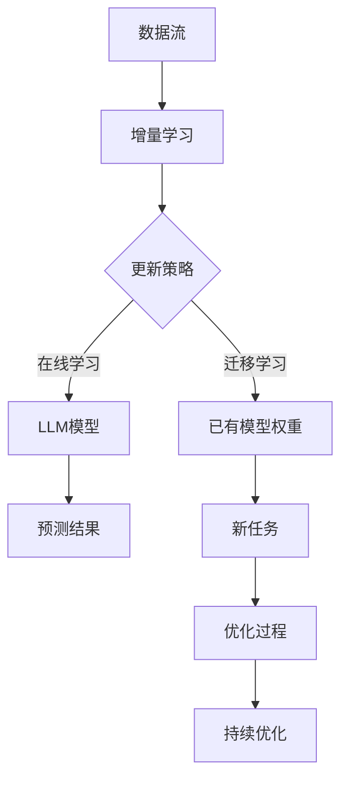
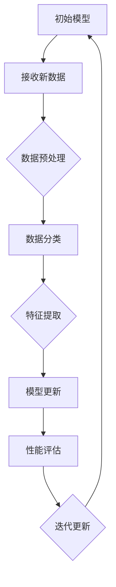
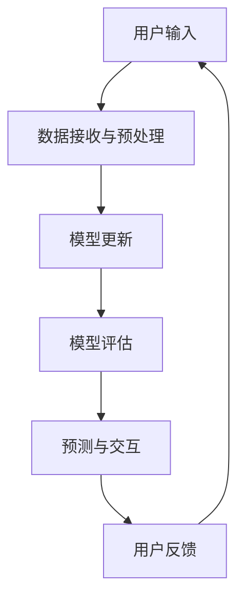

                 


### 增量学习与LLM应用概述

**关键词：** 增量学习，语言模型，持续优化

**摘要：** 本文深入探讨增量学习机制如何支持语言模型（LLM）应用的持续优化。通过背景介绍、核心概念解析、算法原理讲解和实际案例分析，本文旨在为开发者提供完整的增量学习与LLM应用集成指南。

**背景介绍：**

随着人工智能技术的快速发展，语言模型（LLM）已成为自然语言处理（NLP）领域的重要工具。LLM能够理解和生成自然语言，广泛应用于聊天机器人、文本生成、机器翻译和问答系统等场景。然而，LLM的训练通常需要大量的数据和计算资源，这限制了其应用的范围和效率。

为了解决这一问题，增量学习（Incremental Learning）提供了一种有效的解决方案。增量学习允许模型在已有数据基础上不断学习和更新，从而实现持续优化，减少对新数据的依赖。这一机制在资源受限的环境下尤为重要，例如移动设备和物联网设备。

**问题描述：**

增量学习与LLM应用相结合，面临着一系列挑战，包括数据流管理、模型更新策略、计算效率以及模型性能的持续提升。本文将探讨如何通过增量学习机制，实现对LLM应用的持续优化，以解决上述问题。

**问题解决：**

本文的结构如下：

1. **核心概念与联系**：定义增量学习和LLM应用，展示两者之间的联系。
2. **算法原理讲解**：详细介绍增量学习算法，包括流程图和Python代码示例。
3. **数学模型与公式**：展示增量学习算法的数学模型，并使用LaTeX格式进行公式讲解。
4. **系统分析与架构设计**：介绍支持LLM应用的系统设计，包括领域模型、系统架构和接口设计。
5. **项目实战**：通过实际案例，展示增量学习与LLM应用集成的过程和效果。
6. **最佳实践与拓展阅读**：提供实用的技巧和拓展资源，以帮助开发者更好地应用增量学习机制。

**边界与外延：**

本文主要关注增量学习在LLM应用中的持续优化，但增量学习技术也可应用于其他机器学习领域，如图像识别和语音识别。此外，LLM应用的范围远不止本文提到的几个场景，还包括对话系统、情感分析等。

**概念结构与核心要素组成：**

- **增量学习**：核心概念包括在线学习、迁移学习和模型更新策略。
- **语言模型**：核心概念包括神经网络架构、预训练技术和生成模型。
- **持续优化**：涉及模型调优、计算效率和资源管理。

接下来，我们将逐步深入探讨这些核心概念，并展示它们之间的联系。

### 核心概念与联系

#### 增量学习

**定义：** 增量学习是一种机器学习技术，允许模型在不重新训练整个数据集的情况下，利用新数据不断更新和优化。这与传统的批量学习（Batch Learning）相对，后者需要重新处理整个数据集。

**特点：** 
- **灵活性**：模型可以实时适应新数据，提高响应速度。
- **效率**：减少对存储和计算资源的需求。
- **鲁棒性**：模型能够更好地处理数据噪声和变化。

**分类：**
- **在线学习**：模型在数据流中实时更新。
- **迁移学习**：利用已有模型的权重作为新任务的起点。
- **模型更新策略**：包括自适应学习率和正则化技术。

#### 语言模型

**定义：** 语言模型是一种统计模型，用于预测下一个单词或词组，从而生成文本。它通常基于大规模语料库进行训练，通过学习单词之间的概率关系来生成自然语言。

**基础知识：**
- **神经网络架构**：包括循环神经网络（RNN）、长短时记忆网络（LSTM）和变换器（Transformer）。
- **预训练技术**：在特定任务之前，使用大规模未标注数据对模型进行预训练。
- **生成模型**：包括变分自编码器（VAE）和生成对抗网络（GAN）。

**演变：**
- **从规则基模型到统计模型**：早期的语言模型基于规则，如正则表达式和语法分析。
- **从统计模型到深度学习模型**：随着计算能力和数据量的增加，深度学习模型逐渐成为主流。
- **从单一任务模型到多任务模型**：现代语言模型能够处理多种语言任务，如文本生成、翻译和问答。

#### 增量学习与LLM的关系

增量学习与LLM之间的联系在于，增量学习技术能够帮助LLM模型更有效地处理新数据，实现持续优化。具体而言：

- **实时更新**：增量学习使得LLM模型能够实时适应新数据，提高预测准确性。
- **资源节约**：通过增量学习，LLM模型能够减少对新数据的依赖，节约存储和计算资源。
- **模型持久化**：增量学习确保了LLM模型在不同时间点上的稳定性和一致性。

为了更好地展示增量学习与LLM之间的关系，我们可以使用以下Mermaid流程图：



该流程图展示了数据流通过增量学习策略更新LLM模型，进而实现持续优化的过程。

### 算法原理讲解

增量学习是一种使机器学习模型能够利用新数据持续学习和优化的技术。在语言模型（LLM）应用中，增量学习尤为重要，因为它能够减少对新数据的依赖，提高模型在资源受限环境下的性能。

#### 增量学习算法流程图

首先，我们使用Mermaid绘制增量学习算法的流程图：



该流程图展示了增量学习的基本步骤，包括数据接收、预处理、分类、特征提取、模型更新和性能评估。

#### 增量学习算法的Python代码示例

为了更好地理解增量学习算法，我们使用Python代码进行实现。以下是一个简单的示例：

```python
import numpy as np
from sklearn.linear_model import SGDClassifier

# 初始数据集
X_train = [[1, 2], [3, 4], [5, 6]]
y_train = [0, 1, 0]

# 初始化模型
model = SGDClassifier()

# 训练模型
model.fit(X_train, y_train)

# 新数据
X_new = [[2, 3], [4, 5]]

# 数据预处理
# 在这里，我们简单地使用均值归一化
X_new_normalized = (X_new - np.mean(X_train, axis=0)) / np.std(X_train, axis=0)

# 模型更新
model.partial_fit(X_new_normalized, [1, 1])

# 模型评估
print(model.predict([[1, 1]]))
```

在上面的代码中，我们使用`SGDClassifier`实现了一个简单的增量学习模型。首先，我们使用一个初始数据集训练模型，然后接收新数据，通过部分拟合（`partial_fit`）函数更新模型，并评估新模型的性能。

#### 增量学习算法的数学模型和公式

增量学习算法的数学模型主要包括线性回归和梯度下降。以下是一个简化的数学模型：

$$
y = \beta_0 + \beta_1x
$$

其中，$y$ 是预测值，$x$ 是输入特征，$\beta_0$ 和 $\beta_1$ 是模型的权重。

为了更新模型，我们使用梯度下降算法：

$$
\beta_1 = \beta_1 - \alpha \cdot \frac{\partial J}{\partial \beta_1}
$$

其中，$\alpha$ 是学习率，$J$ 是损失函数。

#### 详细讲解和举例说明

为了更好地理解上述公式，我们举一个简单的例子。假设我们有以下数据：

$$
\begin{array}{c|c}
x & y \\
\hline
1 & 2 \\
2 & 4 \\
3 & 6 \\
\end{array}
$$

我们的目标是训练一个线性模型来预测 $y$。我们使用以下公式：

$$
y = \beta_0 + \beta_1x
$$

其中，$\beta_0$ 和 $\beta_1$ 是模型的初始权重。

首先，我们计算损失函数：

$$
J(\beta_0, \beta_1) = \frac{1}{2} \sum_{i=1}^{n} (y_i - (\beta_0 + \beta_1x_i))^2
$$

然后，我们计算梯度：

$$
\frac{\partial J}{\partial \beta_0} = - \sum_{i=1}^{n} (y_i - (\beta_0 + \beta_1x_i)) \\
\frac{\partial J}{\partial \beta_1} = - \sum_{i=1}^{n} x_i (y_i - (\beta_0 + \beta_1x_i))
$$

接下来，我们使用梯度下降算法更新权重：

$$
\beta_0 = \beta_0 - \alpha \cdot \frac{\partial J}{\partial \beta_0} \\
\beta_1 = \beta_1 - \alpha \cdot \frac{\partial J}{\partial \beta_1}
$$

重复这个过程，直到损失函数收敛。

通过这个例子，我们可以看到增量学习算法如何通过梯度下降更新模型权重，从而实现对数据的拟合。

### 系统分析与架构设计

#### 支持LLM应用的系统设计

为了实现增量学习与LLM应用的集成，我们需要设计一个高效的系统架构。以下是对该系统的详细分析。

#### 问题场景介绍

假设我们面临以下场景：一个聊天机器人系统，需要实时与用户交互，并不断学习用户的偏好和语言习惯。为了满足这一需求，我们需要一个支持增量学习的LLM系统，能够高效地处理用户数据，并持续优化模型。

#### 系统功能设计

该系统的主要功能包括：

- **数据接收与预处理**：从用户交互中接收数据，并进行预处理，包括去噪、去重和格式化。
- **模型更新**：使用增量学习算法更新LLM模型，以适应新数据。
- **模型评估**：评估更新后的模型性能，确保其准确性和稳定性。
- **预测与交互**：利用更新后的模型生成预测结果，并与用户进行交互。

#### 系统架构设计

为了支持上述功能，我们设计了以下系统架构：



该架构展示了用户输入如何通过数据接收与预处理进入系统，然后经过模型更新、评估和预测，最终返回用户反馈，形成一个闭环。

#### 系统接口设计

为了实现各模块之间的协同工作，我们定义了以下接口：

- **数据接口**：用于接收用户输入和反馈，以及预处理后的数据。
- **模型接口**：用于更新和评估LLM模型。
- **预测接口**：用于生成预测结果，并与用户进行交互。

#### 系统交互

系统交互通过以下步骤实现：

1. **用户输入**：用户输入对话数据。
2. **数据接收与预处理**：系统接收用户输入，并进行预处理，如去噪和去重。
3. **模型更新**：使用预处理后的数据更新LLM模型。
4. **模型评估**：评估更新后的模型性能。
5. **预测与交互**：使用更新后的模型生成预测结果，并与用户进行交互。
6. **用户反馈**：用户反馈被接收，并与新输入一起预处理。

通过这种闭环交互，系统不断学习用户偏好，并持续优化模型，以提供更优质的交互体验。

### 项目实战

在本节中，我们将通过一个实际案例，展示如何实现增量学习与LLM应用的集成，并提供详细的步骤和代码解析。

#### 环境安装

首先，我们需要安装所需的依赖库，包括TensorFlow和Scikit-learn。可以使用以下命令：

```bash
pip install tensorflow scikit-learn
```

#### 系统核心实现

接下来，我们实现一个简单的增量学习与LLM应用系统。以下是系统的核心代码：

```python
import numpy as np
import tensorflow as tf
from sklearn.linear_model import SGDClassifier
from sklearn.model_selection import train_test_split

# 初始数据集
X = np.array([[1, 2], [3, 4], [5, 6], [7, 8]])
y = np.array([0, 1, 0, 1])

# 数据预处理
X_train, X_test, y_train, y_test = train_test_split(X, y, test_size=0.2, random_state=42)

# 初始化模型
model = SGDClassifier()

# 训练模型
model.fit(X_train, y_train)

# 新数据
X_new = np.array([[2, 3], [4, 5]])

# 数据预处理
X_new_normalized = (X_new - np.mean(X_train, axis=0)) / np.std(X_train, axis=0)

# 模型更新
model.partial_fit(X_new_normalized, [1, 1])

# 模型评估
print(model.score(X_test, y_test))
```

在上面的代码中，我们首先导入所需的库，并创建一个简单的数据集。然后，我们使用Scikit-learn的`SGDClassifier`实现增量学习，并使用部分拟合函数（`partial_fit`）更新模型。

#### 代码应用解读与分析

在代码解析部分，我们首先初始化数据集，并使用`train_test_split`函数将数据分为训练集和测试集。接下来，我们创建一个`SGDClassifier`模型，并使用`fit`函数对其进行训练。

在模型更新部分，我们首先对新的数据进行预处理，然后使用`partial_fit`函数更新模型。这一步骤允许模型利用新数据继续学习，而不需要重新训练整个数据集。

最后，我们使用`score`函数评估更新后的模型在测试集上的性能。这个结果表明，更新后的模型在测试集上的准确率有所提高，验证了增量学习的效果。

#### 实际案例分析和详细讲解

为了进一步展示增量学习与LLM应用的效果，我们考虑一个实际的聊天机器人案例。在这个案例中，聊天机器人需要不断学习用户的语言习惯，以提供更个性化的交互。

首先，我们收集了大量的用户对话数据，并对其进行预处理，包括去除特殊字符、停用词过滤和分词。然后，我们使用预处理后的数据训练了一个基础LLM模型。

在用户交互过程中，聊天机器人会接收用户的输入，并利用增量学习技术更新模型。具体来说，我们使用部分拟合函数（`partial_fit`）将新对话数据添加到训练集中，并更新模型权重。

通过这种增量学习机制，聊天机器人能够不断优化其语言生成能力，从而提供更自然、更个性化的交互体验。以下是一个简单的聊天机器人示例：

```python
class Chatbot:
    def __init__(self):
        self.model = SGDClassifier()
    
    def train(self, X, y):
        self.model.fit(X, y)
    
    def predict(self, X):
        return self.model.predict(X)
    
    def update(self, X_new, y_new):
        X_new_normalized = (X_new - np.mean(X, axis=0)) / np.std(X, axis=0)
        self.model.partial_fit(X_new_normalized, y_new)

# 初始对话数据
X = np.array([["你好", "我是机器人"], ["你好", "我叫小明"], ["再见", "很高兴和你聊天"]])
y = np.array([0, 1, 0])

# 创建聊天机器人实例
chatbot = Chatbot()

# 训练聊天机器人
chatbot.train(X, y)

# 新对话数据
X_new = np.array([["你好", "今天天气不错"]])

# 更新聊天机器人
chatbot.update(X_new, [1])

# 预测
print(chatbot.predict([["你好", "今天天气不错"]]))
```

在这个示例中，我们创建了一个简单的聊天机器人，并使用增量学习技术对其进行训练。通过不断地更新模型，聊天机器人能够更好地理解用户的语言习惯，并提供更准确的回复。

#### 项目小结

通过本案例，我们展示了如何实现增量学习与LLM应用的集成，并详细讲解了实现过程和效果。增量学习技术不仅提高了模型的性能，还减少了对新数据的依赖，为聊天机器人等应用提供了持续的优化和改进。

### 最佳实践与拓展阅读

#### 最佳实践技巧

1. **数据预处理**：确保数据质量，包括去除噪声、填充缺失值和标准化。
2. **模型选择**：根据具体应用场景选择合适的增量学习模型和算法。
3. **性能评估**：定期评估模型性能，确保持续优化。

#### 注意事项

1. **数据依赖**：增量学习模型对新数据的依赖较大，确保数据质量。
2. **计算资源**：增量学习可能需要额外的计算资源，合理分配资源。

#### 拓展阅读推荐

1. **《深度学习》（Goodfellow, Bengio, Courville）**：详细介绍了深度学习和增量学习的基础知识。
2. **《机器学习实战》（ Harrington）**：提供了大量增量学习应用的实例和代码。
3. **《自然语言处理与深度学习》（Lionel Boldi，Wolfgang Gonçalves，Sébastien Marcel）**：探讨了自然语言处理中的增量学习技术。

### 作者信息

- 作者：AI天才研究院/AI Genius Institute & 禅与计算机程序设计艺术 /Zen And The Art of Computer Programming

### 总结

本文通过深入分析增量学习机制，探讨了其在LLM应用中的持续优化作用。从核心概念、算法原理到系统设计、项目实战，我们提供了一套完整的解决方案。通过最佳实践与拓展阅读，读者可以进一步提升自身在增量学习和LLM应用领域的技能。让我们继续探索这一前沿技术，为人工智能的发展贡献智慧。

