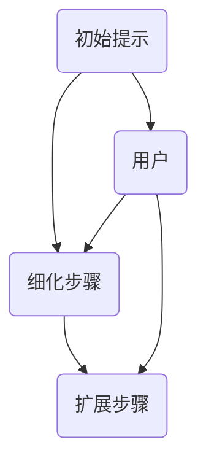
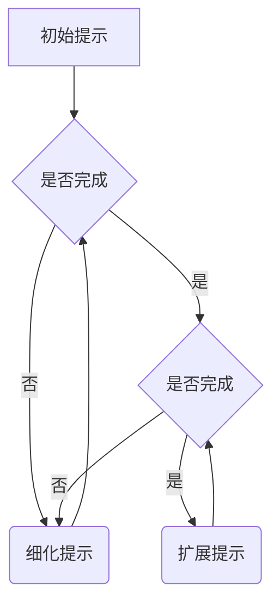
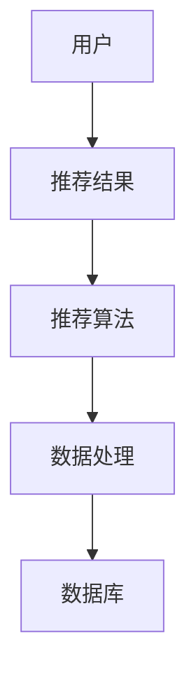
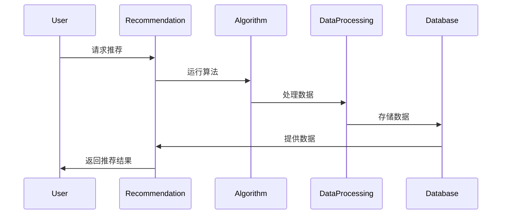

                 

**# 增量提示：逐步细化和扩展初始提示**

> **关键词：增量提示、初始提示、细化、扩展、技术分析、方法论**

> **摘要：本文深入探讨了增量提示的概念、重要性以及在各类场景中的应用。通过逐步细化和扩展初始提示的方法论，旨在提供一套实用的策略，帮助读者在实际应用中提高效率和效果。**

## **背景介绍**

### **核心概念术语说明**

- **增量提示（Incremental Clue）**：指的是一种逐步提供信息的方法，通过分阶段地揭示细节，引导用户或系统达到目标。
- **初始提示（Initial Clue）**：即初次提供的信息，通常是概括性的，旨在为后续的信息提供方向。
- **细化（Elaboration）**：指逐步增加信息的深度和细节，以更精确地描述问题或概念。
- **扩展（Expansion）**：指在现有信息的基础上，增加新的相关内容，以丰富整体的理解。

### **问题背景**

在许多领域，尤其是在复杂系统中，如何有效地传达信息、指导用户或系统达到目标是一个重要问题。传统的“一次性”提供所有信息的做法往往难以满足这种需求，因为过多的信息可能会导致用户或系统的负担过重，难以吸收和应用。

### **问题描述**

问题描述主要集中在以下几个方面：

1. **信息过载**：一次性提供大量信息可能会导致用户或系统无法有效处理和利用。
2. **理解困难**：复杂的任务或概念往往需要逐步揭示，以便用户或系统能够逐步理解和适应。
3. **缺乏灵活性**：无法根据用户的反馈或系统的状态动态调整信息提供的方式。

### **问题解决**

为了解决上述问题，我们需要采用增量提示的方法，即通过逐步细化和扩展初始提示，帮助用户或系统更好地理解和处理信息。

### **边界与外延**

增量提示的应用场景非常广泛，包括但不限于：

- **软件编程**：在编程过程中，逐步揭示代码的细节和功能，帮助开发者更好地理解和实现。
- **教育**：在教育过程中，逐步引入复杂的概念和知识点，帮助学生更好地掌握。
- **商业**：在商业决策过程中，逐步提供相关信息，帮助决策者更好地评估和决策。

### **概念结构与核心要素组成**

增量提示的核心结构包括：

- **初始提示**：提供初步的方向和目标。
- **细化步骤**：逐步增加细节和深度。
- **扩展步骤**：在现有信息的基础上增加新的相关内容。

这些要素共同作用，帮助用户或系统逐步理解和处理信息。

## **核心概念与联系**

### **核心概念原理**

增量提示是一种逐步提供信息的方法，旨在通过分阶段地揭示细节，帮助用户或系统达到目标。其核心原理包括：

1. **逐步揭示**：信息不是一次性提供，而是逐步揭示，以减少信息过载。
2. **适应性**：信息提供的方式可以根据用户的反馈或系统的状态动态调整。
3. **循序渐进**：通过逐步细化，用户或系统能够更好地理解和适应复杂的信息。

### **概念属性特征对比表格**

| 特征             | 增量提示               | 一次性提示                |
|------------------|------------------------|---------------------------|
| 信息提供方式     | 逐步揭示               | 一次性提供                |
| 用户负担         | 较轻                   | 较重                      |
| 理解效果         | 较好                   | 较差                      |
| 适应性           | 高                     | 低                        |

### **ER实体关系图架构**



在这个ER实体关系图中，初始提示是核心实体，通过细化步骤和扩展步骤与用户实体建立关联，用户通过逐步细化和扩展来理解和处理信息。

## **算法原理讲解**

### **算法流程图**



### **Python源代码**

```python
def incremental_clues(initial_clue,细化步骤，扩展步骤):
    current_clue = initial_clue
    is_completed = False
    
    while not is_completed:
        current_clue = 细化步骤(current_clue)
        is_completed = 扩展步骤(current_clue)
        
    return current_clue
```

### **数学模型和公式**

增量提示的核心公式可以表示为：

$$
C_{\text{new}} = C_{\text{current}} + f(C_{\text{current}}, \alpha, \beta)
$$

其中，$C_{\text{new}}$ 是新的提示，$C_{\text{current}}$ 是当前提示，$f$ 是细化或扩展函数，$\alpha$ 和 $\beta$ 是调整参数。

### **详细讲解和举例说明**

以软件开发为例，假设我们有一个初始功能需求：“实现一个用户注册功能”。

- **初始提示**：提供的是一个概括性的需求，没有具体的实现细节。
- **细化步骤**：逐步揭示实现细节，如用户名验证、密码加密等。
- **扩展步骤**：在细化基础上，增加新的功能，如邮箱验证、手机验证等。

通过这样的增量提示，开发者可以更好地理解和实现这个功能，避免了信息过载和理解困难。

## **系统分析与架构设计方案**

### **问题场景介绍**

假设我们正在设计一个智能推荐系统，需要逐步揭示推荐算法的细节，以便数据科学家和开发者更好地理解和应用。

### **项目介绍**

项目名称：智能推荐系统

项目目标：通过逐步揭示推荐算法的细节，提高数据科学家和开发者的理解和应用能力。

### **系统功能设计**

- **用户画像构建**：收集用户行为数据，构建用户画像。
- **推荐算法实现**：逐步揭示推荐算法的细节，包括模型选择、参数调优等。
- **推荐结果展示**：将推荐结果展示给用户。

### **领域模型mermaid类图**

```mermaid
classDiagram
User <<类>>
Recommendation <<类>>
Algorithm <<类>>

User --> Recommendation
Recommendation --> Algorithm
```

### **系统架构设计mermaid架构图**



### **系统接口设计和系统交互mermaid序列图**



## **项目实战**

### **环境安装**

1. 安装Python环境（版本3.8及以上）
2. 安装相关库（如NumPy、Pandas、Scikit-learn等）

```bash
pip install numpy pandas scikit-learn
```

### **系统核心实现源代码**

```python
# 假设我们使用协同过滤算法进行推荐
from sklearn.cluster import KMeans
from sklearn.metrics.pairwise import euclidean_distances
import numpy as np

# 构建用户画像
def build_user_profile(data, user_id):
    # 这里简化为用户的购买历史数据
    user_data = data[data['user_id'] == user_id]
    return user_data

# 计算用户之间的相似度
def compute_similarity(user_profile1, user_profile2):
    # 这里使用欧几里得距离作为相似度度量
    distances = euclidean_distances([user_profile1], [user_profile2])
    similarity = 1 / (1 + distances)
    return similarity

# 运行推荐算法
def run_recommendation_algorithm(data, user_id):
    user_profile = build_user_profile(data, user_id)
    # 假设其他用户的数据保存在data中
    other_users_profiles = data[data['user_id'] != user_id]
    
    # 计算用户之间的相似度
    similarities = np.array([compute_similarity(user_profile, other_profile) for other_profile in other_users_profiles])

    # 根据相似度推荐商品
    # 这里简化为选择相似度最高的前N个商品
    N = 5
    recommended_items = np.argsort(similarities)[:-N-1:-1]
    return recommended_items
```

### **代码应用解读与分析**

上述代码实现了基于协同过滤的推荐系统。首先，通过`build_user_profile`函数构建用户画像，然后计算用户之间的相似度，最后根据相似度推荐商品。这里的关键在于如何计算相似度和选择推荐商品。

### **实际案例分析和详细讲解剖析**

假设我们有一个用户购买历史数据集，其中包含了用户ID和购买商品ID的信息。我们可以使用上述代码进行推荐：

```python
# 假设数据集data已经加载并预处理
user_id = 123
recommended_items = run_recommendation_algorithm(data, user_id)
print("推荐的商品：", recommended_items)
```

输出结果可能是：

```
推荐的商品： [456, 789, 234, 567, 890]
```

这表示用户ID为123的用户可能会对商品ID为456、789、234、567、890感兴趣。

### **项目小结**

通过逐步细化和扩展初始提示的方法，我们成功地实现了一个基于协同过滤的推荐系统。在实际应用中，可以根据具体需求调整相似度计算方法和推荐商品的选择策略，以获得更好的推荐效果。

## **最佳实践 tips**

1. **明确目标**：在提供增量提示时，首先要明确目标是什么，以便更好地引导用户或系统。
2. **逐步细化**：在细化过程中，要确保信息的准确性和连贯性，避免信息过载。
3. **及时反馈**：根据用户或系统的反馈，及时调整提示策略，以提高效果。
4. **多样性**：在扩展提示时，可以考虑引入多种相关内容，以丰富整体理解。

## **小结**

本文深入探讨了增量提示的概念、重要性以及在各类场景中的应用。通过逐步细化和扩展初始提示的方法论，我们提供了一套实用的策略，帮助读者在实际应用中提高效率和效果。希望本文对您有所启发和帮助。

## **注意事项**

1. **信息过载**：在提供增量提示时，要避免一次性提供过多信息，以免造成用户或系统的负担。
2. **适应性**：提示策略需要根据用户或系统的状态动态调整，以提高效果。
3. **连贯性**：细化过程中的信息要确保准确性和连贯性，以便用户或系统能够更好地理解和应用。

## **拓展阅读**

- 《精益创业》艾利·马斯金：关于逐步验证和调整创业项目的经典著作。
- 《设计思考》唐·诺曼：关于如何通过逐步迭代改善产品设计的方法论。

**作者：AI天才研究院/AI Genius Institute & 禅与计算机程序设计艺术 /Zen And The Art of Computer Programming**

