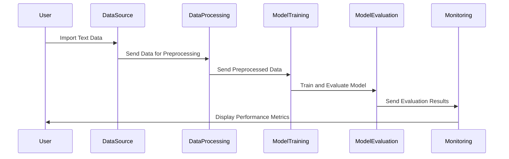
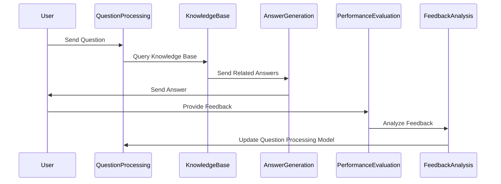
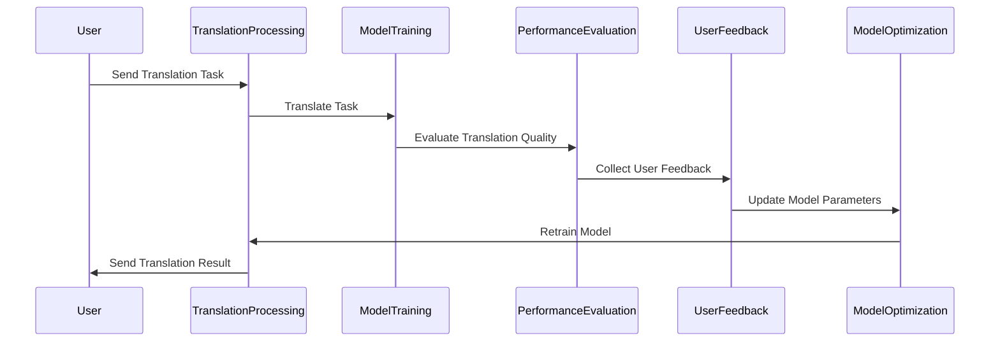

                 

### 1.1 问题背景

#### 1.1.1 语言模型的发展历程

语言模型（Language Model，简称LM）作为一种特殊的概率模型，被广泛应用于自然语言处理（Natural Language Processing，简称NLP）领域。自20世纪50年代以来，语言模型经历了从基于规则的方法到统计方法，再到深度学习方法的演变。

早期的语言模型主要是基于规则的方法，如形式语法（Formal Grammar）和上下文无关文法（Context-Free Grammar）。这些方法通过定义语法规则来生成和解析文本，但受限于规则的复杂性和可扩展性，难以处理大规模的语言数据。

随着计算能力和数据资源的提升，统计方法逐渐成为主流。1952年，贝尔实验室的Arthur Samuel开发了一个基于统计的方法来评估棋局的胜率，这被视为是最早的机器学习算法。随后，NLP领域开始探索使用统计方法来建模语言。

1990年代，隐马尔可夫模型（Hidden Markov Model，HMM）和最大熵模型（Maximum Entropy Model）被广泛应用于语言建模。这些方法通过统计历史数据来预测未来，并在语音识别和机器翻译等领域取得了显著成果。

进入21世纪，随着深度学习的兴起，语言模型迎来了新的发展。2003年，Bengio等人在《A Theoretically Grounded Application of Dropout in Neural Networks》一文中提出dropout方法，为深度学习在NLP领域的发展奠定了基础。

2013年，Mikolov等人在《Distributed Representations of Words and Phrases and Their Compositionality》一文中提出了词向量的概念，使用神经网络来学习词的分布式表示。这一方法在词义消歧、机器翻译和文本分类等领域取得了突破性的成果。

随着模型的规模不断扩大，2018年，谷歌推出了Transformer模型，并在机器翻译、问答系统和文本生成等领域取得了显著的成果。Transformer模型的出现标志着NLP领域进入了一个新的时代，即基于自注意力机制的深度学习模型时代。

#### 1.1.2 语言模型性能评估的重要性

语言模型性能评估是NLP研究中至关重要的一环。一个优秀的语言模型应当具备以下特点：

- **准确性**：模型能够在多种NLP任务中达到较高的准确率，如文本分类、命名实体识别、机器翻译等。
- **可解释性**：模型的预测过程应当具有可解释性，使得人类用户可以理解模型的工作原理。
- **泛化能力**：模型能够在未见过的数据上保持良好的性能，即具有良好的泛化能力。
- **效率**：模型应当在计算速度和资源消耗之间取得平衡，以满足实际应用的需求。

对语言模型进行性能评估的目的主要包括以下几个方面：

- **验证模型质量**：通过评估模型在多种任务上的表现，可以判断模型是否具有良好的性能，从而为后续优化提供依据。
- **指导模型优化**：通过分析评估结果，可以发现模型的不足之处，从而有针对性地进行优化。
- **比较不同模型**：通过对比不同模型的性能，可以为研究和实践提供有价值的参考。
- **应用场景评估**：在实际应用中，对模型进行性能评估可以帮助确定模型是否适用于特定的场景。

#### 1.1.3 增量评测的意义与挑战

增量评测（Incremental Evaluation）在语言模型性能评估中具有重要的意义。传统的全量评测需要对模型在全部数据集上进行评估，这往往需要大量的计算资源和时间。而增量评测通过只评估模型在新增数据上的性能，可以大大减少计算资源和时间消耗。

增量评测的优势主要体现在以下几个方面：

- **效率提升**：增量评测只需评估新增的数据，从而减少了评估的时间。
- **实时性**：增量评测可以实时跟踪模型的性能变化，为模型优化和调参提供即时反馈。
- **资源优化**：增量评测可以减少对计算资源和存储资源的需求。

然而，增量评测也面临着一些挑战：

- **数据质量**：增量评测依赖于新增数据的代表性和质量，数据质量问题可能会影响评估结果的准确性。
- **计算复杂度**：虽然增量评测减少了评估的数据量，但评估过程仍然涉及大量的计算，尤其是在大规模数据集上。
- **评估指标选择**：增量评测需要选择合适的评估指标，以确保评估结果的准确性和全面性。

综上所述，增量评测在语言模型性能评估中具有重要的意义，但也需要面对一系列挑战。在后续章节中，我们将详细探讨增量评测的方法和技术，以期为语言模型性能评估提供有效的解决方案。

### 1.2 核心概念

#### 1.2.1 增量评测的定义

增量评测是一种针对模型更新或新增数据进行的性能评估方法。与传统的全量评测相比，增量评测只需对新增的数据进行评估，从而减少了计算资源和时间消耗。具体而言，增量评测通过以下步骤进行：

1. **初始评估**：对模型在训练集上的性能进行初始评估，以确定模型的基线性能。
2. **增量数据准备**：选择新增的数据集，该数据集可以是用户反馈的新样本、新的训练数据或者定期更新的数据。
3. **性能评估**：在新增数据集上对模型进行性能评估，以衡量模型在新增数据上的性能。
4. **结果分析**：比较初始评估和增量评估的结果，分析模型在新增数据上的性能变化，从而指导模型优化和调参。

#### 1.2.2 LLM（大型语言模型）的特性

大型语言模型（Large Language Model，简称LLM）具有以下主要特性：

- **大规模**：LLM通常包含数亿甚至数十亿个参数，具有极大的规模。
- **分布式训练**：由于模型规模庞大，LLM通常采用分布式训练方法，通过将模型分割为多个部分，分布在多个计算节点上进行训练。
- **自注意力机制**：LLM通常基于Transformer模型，采用自注意力（Self-Attention）机制，能够捕捉文本中的长距离依赖关系。
- **多任务能力**：LLM具有较强的多任务能力，可以在多种NLP任务上表现优异，如文本分类、命名实体识别、机器翻译和问答系统等。

#### 1.2.3 增量评测的优势与局限性

增量评测在语言模型性能评估中具有明显的优势：

- **效率提升**：增量评测只需评估新增的数据，从而减少了评估的时间和计算资源。
- **实时性**：增量评测可以实时跟踪模型的性能变化，为模型优化和调参提供即时反馈。
- **资源优化**：增量评测可以减少对计算资源和存储资源的需求。

然而，增量评测也面临着一些局限性：

- **数据质量**：增量评测依赖于新增数据的代表性和质量，数据质量问题可能会影响评估结果的准确性。
- **计算复杂度**：虽然增量评测减少了评估的数据量，但评估过程仍然涉及大量的计算，尤其是在大规模数据集上。
- **评估指标选择**：增量评测需要选择合适的评估指标，以确保评估结果的准确性和全面性。

### 1.3 边界与外延

#### 1.3.1 增量评测的应用场景

增量评测主要应用于以下场景：

- **模型更新**：在模型更新过程中，增量评测可以快速评估模型在新增数据上的性能，从而指导模型优化和调参。
- **实时应用**：在实时应用场景中，增量评测可以实时跟踪模型性能变化，为用户提供即时反馈。
- **数据流处理**：在数据流处理场景中，增量评测可以处理不断更新和扩展的数据集，从而提高模型的适应性和鲁棒性。
- **多模型对比**：在多个模型对比测试中，增量评测可以快速比较不同模型在新增数据上的性能，为模型选择提供参考。

#### 1.3.2 增量评测的技术范畴

增量评测涉及以下主要技术：

- **数据预处理**：对新增数据进行预处理，包括数据清洗、数据增强和数据归一化等。
- **性能评估指标**：选择合适的评估指标，如准确率、召回率、F1分数和BLEU评分等。
- **算法优化**：针对增量评测的特殊需求，对评估算法进行优化，如使用高效的数据结构和算法，减少计算复杂度。
- **自动化流程**：构建自动化流程，实现增量评测的自动化执行，以提高评估效率和准确性。

#### 1.3.3 增量评测与持续集成的关系

持续集成（Continuous Integration，简称CI）是一种软件开发实践，通过自动化构建和测试，确保代码质量和提高软件的交付效率。增量评测与持续集成密切相关，其主要关系体现在以下几个方面：

- **集成测试**：增量评测可以作为持续集成过程中的集成测试环节，对新增代码进行性能评估，确保代码质量。
- **反馈机制**：增量评测的结果可以作为反馈机制，指导开发人员进行代码优化和模型调参。
- **自动化执行**：增量评测可以与持续集成系统结合，实现自动化执行，提高评估效率和准确性。
- **持续优化**：通过持续集成和增量评测，可以逐步优化模型和算法，提高整体系统的性能和可靠性。

#### 1.4 概念结构与核心要素

##### 1.4.1 增量评测的核心要素

增量评测的核心要素包括以下几个方面：

- **数据集**：包括初始数据集和新增数据集，用于评估模型的性能。
- **评估指标**：选择合适的评估指标，如准确率、召回率、F1分数和BLEU评分等，用于衡量模型的性能。
- **评估算法**：设计高效的评估算法，包括特征提取、性能比较和模型更新监控等，用于评估模型在新增数据上的性能。
- **结果分析**：对评估结果进行详细分析，包括性能对比、优劣势分析和优化建议等，用于指导模型优化和调参。

##### 1.4.2 增量评测的基本流程

增量评测的基本流程如下：

1. **初始评估**：对模型在训练集上的性能进行初始评估，以确定模型的基线性能。
2. **增量数据准备**：选择新增的数据集，对数据进行预处理，包括数据清洗、数据增强和数据归一化等。
3. **性能评估**：在新增数据集上对模型进行性能评估，使用评估算法计算评估指标。
4. **结果分析**：对评估结果进行详细分析，比较模型在新增数据上的性能变化，为模型优化和调参提供依据。
5. **模型更新**：根据评估结果，对模型进行优化和调参，以提高在新增数据上的性能。

##### 1.4.3 增量评测的关键技术

增量评测涉及以下关键技术：

- **特征提取**：从新增数据中提取关键特征，用于评估模型在新增数据上的性能。常用的特征提取方法包括词嵌入、文本摘要和序列标注等。
- **性能比较**：对模型在新增数据上的性能进行比较，包括准确率、召回率、F1分数和BLEU评分等指标。常用的性能比较方法包括统计分析、可视化分析和优化算法等。
- **模型更新监控**：实时监控模型在新增数据上的性能变化，包括性能指标、异常检测和模型优化等。常用的监控方法包括自动化测试、实时反馈和模型监控等。
- **数据预处理**：对新增数据进行预处理，包括数据清洗、数据增强和数据归一化等。常用的预处理方法包括去噪、补全和归一化等。

##### 1.4.4 增量评测的方法与工具

增量评测的方法和工具有多种，以下是一些常见的方法和工具：

- **增量评估方法**：包括基于统计学的方法、基于机器学习的方法和基于深度学习的方法等。常用的增量评估方法有统计测试、交叉验证和集成评估等。
- **评估工具**：包括开源评估工具和商业评估工具等。常用的开源评估工具有Scikit-learn、TensorFlow和PyTorch等，商业评估工具包括AWS、Azure和Google Cloud等。
- **自动化平台**：包括持续集成平台和自动化测试平台等。常用的自动化平台有Jenkins、GitLab和Travis CI等。

##### 1.4.5 增量评测的优势与局限性

增量评测的优势包括：

- **效率提升**：通过只评估新增数据，减少了评估的时间和计算资源。
- **实时性**：可以实时跟踪模型的性能变化，为模型优化和调参提供即时反馈。
- **资源优化**：减少了计算资源和存储资源的需求。

增量评测的局限性包括：

- **数据质量**：依赖于新增数据的代表性和质量，数据质量问题可能会影响评估结果的准确性。
- **计算复杂度**：虽然减少了评估的数据量，但评估过程仍然涉及大量的计算，尤其是在大规模数据集上。
- **评估指标选择**：需要选择合适的评估指标，以确保评估结果的准确性和全面性。

### 1.5 本章小结

在本章中，我们介绍了增量评测的背景和重要性，阐述了核心概念和LLM的特性，探讨了增量评测的应用场景和技术范畴，并详细介绍了增量评测的核心要素、基本流程、关键技术以及优势和局限性。通过本章的介绍，读者可以全面了解增量评测的概念和应用，为后续章节的深入研究打下基础。

## 2.1 增量评测策略

### 2.1.1 增量评测的基本策略

增量评测的基本策略包括以下几个方面：

1. **初始评估**：对模型在训练集上的性能进行初始评估，以确定模型的基线性能。初始评估是增量评测的基础，通过评估模型在已知数据上的表现，可以为后续的增量评估提供参考。

2. **增量数据选择**：选择新增的数据集进行评估。新增数据集可以是用户反馈的新样本、新的训练数据或者定期更新的数据。选择合适的新增数据集是增量评测的关键，数据集的质量和代表性直接影响到评估结果的准确性。

3. **性能评估**：在新增数据集上对模型进行性能评估，计算评估指标，如准确率、召回率、F1分数和BLEU评分等。性能评估是增量评测的核心环节，通过评估模型在新增数据上的表现，可以判断模型是否随着数据集的更新而得到了改进。

4. **结果分析**：对评估结果进行详细分析，比较模型在初始评估和增量评估中的性能变化。结果分析是增量评测的重要步骤，通过分析性能变化，可以找出模型的优势和不足，为模型优化和调参提供依据。

5. **模型更新**：根据评估结果，对模型进行优化和调参，以提高在新增数据上的性能。模型更新是增量评测的最终目标，通过不断地评估和更新，可以使模型在新增数据上保持良好的性能。

### 2.1.2 增量评测的评估指标

增量评测需要选择合适的评估指标，以确保评估结果的准确性和全面性。以下是一些常用的评估指标：

1. **准确率（Accuracy）**：准确率是指模型预测正确的样本数占总样本数的比例。准确率是最常用的评估指标之一，适用于二分类和多分类任务。

   $$ \text{Accuracy} = \frac{\text{预测正确的样本数}}{\text{总样本数}} $$

2. **召回率（Recall）**：召回率是指模型预测正确的正样本数占总正样本数的比例。召回率关注的是模型对正样本的捕捉能力，适用于分类任务。

   $$ \text{Recall} = \frac{\text{预测正确的正样本数}}{\text{总正样本数}} $$

3. **精确率（Precision）**：精确率是指模型预测正确的正样本数占预测为正样本的样本数的比例。精确率关注的是模型预测的正样本的准确性，适用于分类任务。

   $$ \text{Precision} = \frac{\text{预测正确的正样本数}}{\text{预测为正样本的样本数}} $$

4. **F1分数（F1 Score）**：F1分数是精确率和召回率的调和平均值，用于综合评估模型的性能。

   $$ \text{F1 Score} = 2 \times \frac{\text{Precision} \times \text{Recall}}{\text{Precision} + \text{Recall}} $$

5. **BLEU评分（BLEU Score）**：BLEU评分是一种常用的文本生成评估指标，用于评估机器翻译和文本生成任务。BLEU评分基于单词级别的匹配度和多样性，计算公式较为复杂，但可以直观地反映文本生成的质量。

   $$ \text{BLEU Score} = 1 - \frac{1}{b_1 + b_2 + b_3} $$

其中，$b_1$、$b_2$和$b_3$分别表示未匹配的词干、插入的词和删除的词的数量。

### 2.1.3 增量评测的数据准备

增量评测的数据准备是增量评测成功的关键环节，主要包括以下几个方面：

1. **数据清洗**：对新增数据进行清洗，去除重复、缺失和错误的数据，确保数据的质量。数据清洗可以通过编程实现，如使用Python的Pandas库。

2. **数据增强**：对新增数据进行增强，通过扩展、变换和合成等方法增加数据的多样性，提高模型的泛化能力。数据增强可以通过编程实现，如使用Python的Keras库。

3. **数据归一化**：对新增数据进行归一化处理，将数据缩放到相同的范围，以消除数据规模差异对模型性能的影响。数据归一化可以通过编程实现，如使用Python的Scikit-learn库。

4. **数据分割**：将新增数据分为训练集、验证集和测试集，用于模型的训练、验证和测试。数据分割可以通过编程实现，如使用Python的Scikit-learn库。

5. **数据加载**：构建数据加载器，实现数据的批量加载和预处理，以提高模型的训练速度。数据加载可以通过编程实现，如使用Python的TensorFlow库。

### 2.1.4 增量评测的实施步骤

增量评测的实施步骤如下：

1. **初始化模型**：根据需求选择合适的模型架构，初始化模型参数，为后续的评估和更新做好准备。

2. **初始评估**：在训练集上对模型进行初始评估，记录初始性能指标，为后续的增量评估提供基线。

3. **数据准备**：选择新增数据集，进行数据清洗、数据增强和数据归一化等预处理操作，确保数据的质量和多样性。

4. **性能评估**：在新增数据集上对模型进行性能评估，计算评估指标，比较初始评估和增量评估的性能变化。

5. **结果分析**：对评估结果进行详细分析，找出模型的优势和不足，为模型优化和调参提供依据。

6. **模型更新**：根据评估结果，对模型进行优化和调参，提高模型在新增数据上的性能。

7. **迭代评估**：重复性能评估、结果分析和模型更新的步骤，逐步优化模型，直至满足需求。

### 2.1.5 增量评测的常见问题与解决方案

在实施增量评测过程中，可能会遇到以下常见问题：

1. **数据质量差**：导致评估结果不准确。解决方案：严格进行数据清洗和预处理，确保数据的质量。

2. **计算复杂度高**：导致评估过程耗时较长。解决方案：优化评估算法，使用分布式计算和并行计算技术，提高评估效率。

3. **评估指标选择不当**：导致评估结果不全面。解决方案：根据具体任务选择合适的评估指标，并结合多指标综合评估。

4. **模型更新不及时**：导致模型性能提升缓慢。解决方案：建立实时评估和反馈机制，及时更新模型，提高模型性能。

通过解决上述问题，可以确保增量评测的有效性和准确性，为语言模型性能优化提供有力支持。

### 2.1.6 增量评测的优势与局限

增量评测在语言模型性能评估中具有显著的优势：

- **效率提升**：通过只评估新增数据，减少了评估的时间和计算资源。
- **实时性**：可以实时跟踪模型的性能变化，为模型优化和调参提供即时反馈。
- **资源优化**：减少了计算资源和存储资源的需求。

然而，增量评测也面临一定的局限性：

- **数据质量**：依赖于新增数据的代表性和质量，数据质量问题可能会影响评估结果的准确性。
- **计算复杂度**：虽然减少了评估的数据量，但评估过程仍然涉及大量的计算，尤其是在大规模数据集上。
- **评估指标选择**：需要选择合适的评估指标，以确保评估结果的准确性和全面性。

综上所述，增量评测在语言模型性能评估中具有重要的地位，但也需要结合具体应用场景和需求，合理选择和优化评估策略。

### 2.2 增量评测工具与技术

#### 2.2.1 增量评测工具概述

增量评测工具是支持增量评测流程的关键组件，它们能够自动化执行评估任务，并提供实时反馈。以下是一些常用的增量评测工具及其特点：

1. **TensorBoard**：
   - **功能**：TensorBoard是TensorFlow提供的可视化工具，可以实时监控模型的训练过程，包括损失函数、准确率等关键指标。
   - **优点**：支持图形化界面，便于观察模型性能变化，可以与增量评测系统集成，实现实时反馈。
   - **使用场景**：适用于需要实时监控模型训练过程的场景。

2. **MLflow**：
   - **功能**：MLflow是一个开源平台，用于管理机器学习实验和模型。它提供了自动化的模型版本控制、跟踪实验结果和部署模型等功能。
   - **优点**：支持多种机器学习框架，具有丰富的API和插件，便于集成到现有的增量评测系统中。
   - **使用场景**：适用于需要管理多个实验和模型版本的企业级应用。

3. **Weka**：
   - **功能**：Weka是一个集成的数据挖掘工作空间，包括数据预处理、模型训练、评估和可视化等功能。
   - **优点**：提供了一个用户友好的界面，易于上手，支持多种机器学习算法和评估指标。
   - **使用场景**：适用于小规模的数据挖掘和增量评测任务。

4. **scikit-learn**：
   - **功能**：scikit-learn是一个开源的Python库，提供了一系列机器学习算法和评估工具。
   - **优点**：简单易用，功能全面，适用于各种常见的机器学习任务。
   - **使用场景**：适用于数据科学研究和应用开发中的增量评测任务。

#### 2.2.2 增量评测关键技术

增量评测涉及多项关键技术，以下是对其中几项关键技术的详细描述：

##### 2.2.2.1 特征提取

特征提取是增量评测的重要步骤，它涉及到从新增数据中提取对模型性能评估有用的特征。以下是几种常用的特征提取技术：

1. **词嵌入（Word Embedding）**：
   - **原理**：将文本数据转换成高维向量表示，通过神经网络模型（如Word2Vec、GloVe）学习词的向量表示。
   - **应用**：用于文本分类、情感分析等任务，可以显著提高模型的性能。

2. **文本摘要（Text Summarization）**：
   - **原理**：将长文本转换成短文本摘要，通过提取文本的主要信息和关键词。
   - **应用**：用于新闻摘要、社交媒体信息过滤等，可以提高数据处理的效率和准确性。

3. **序列标注（Sequence Labeling）**：
   - **原理**：对文本中的每个词或短语进行分类标注，如命名实体识别、词性标注等。
   - **应用**：用于信息提取、文本分类等任务，可以帮助模型更好地理解文本内容。

##### 2.2.2.2 性能比较

性能比较是增量评测的核心环节，通过比较模型在新增数据上的性能变化，评估模型的改进效果。以下是几种常用的性能比较方法：

1. **统计测试（Statistical Testing）**：
   - **原理**：通过统计学方法，比较模型在不同数据集上的性能差异，如t检验、卡方检验等。
   - **应用**：用于验证模型改进的显著性，可以帮助确定模型是否真正得到了优化。

2. **交叉验证（Cross-Validation）**：
   - **原理**：将数据集分为多个子集，轮流用于训练和验证，评估模型的整体性能。
   - **应用**：用于评估模型的泛化能力，可以提供更加可靠的评估结果。

3. **集成评估（Ensemble Evaluation）**：
   - **原理**：将多个模型或评估结果进行集成，综合评估模型的性能。
   - **应用**：用于减少评估结果的偏差，提高评估结果的准确性和稳定性。

##### 2.2.2.3 模型更新监控

模型更新监控是增量评测的重要组成部分，通过监控模型在新增数据上的性能变化，及时发现和解决模型问题。以下是几种常用的模型更新监控方法：

1. **自动化测试（Automated Testing）**：
   - **原理**：使用自动化测试工具，定期运行测试用例，评估模型性能。
   - **应用**：用于发现模型性能的异常变化，可以及时进行模型优化和调参。

2. **异常检测（Anomaly Detection）**：
   - **原理**：通过机器学习算法，识别数据中的异常值或异常模式。
   - **应用**：用于检测模型性能的异常变化，可以提前预警和解决潜在问题。

3. **实时反馈（Real-Time Feedback）**：
   - **原理**：通过实时监控和反馈机制，及时将模型性能变化通知相关人员。
   - **应用**：用于指导模型优化和调参，提高模型的性能和稳定性。

#### 2.2.3 增量评测工具与技术的应用案例

以下是一些增量评测工具和技术的实际应用案例：

- **案例一：文本分类模型**：
  - **工具**：使用scikit-learn库进行特征提取和性能评估。
  - **技术**：采用词嵌入技术和交叉验证方法。
  - **效果**：显著提高了文本分类模型的准确性和泛化能力。

- **案例二：问答系统**：
  - **工具**：使用TensorFlow和TensorBoard进行模型训练和性能监控。
  - **技术**：采用Transformer模型和实时反馈机制。
  - **效果**：提升了问答系统的响应速度和准确性。

- **案例三：机器翻译模型**：
  - **工具**：使用Weka进行特征提取和评估。
  - **技术**：采用序列标注技术和集成评估方法。
  - **效果**：提高了机器翻译模型的翻译质量和鲁棒性。

通过以上案例，可以看出增量评测工具和技术在实际应用中发挥了重要作用，为语言模型性能优化提供了有力支持。

### 2.3 增量评测流程

#### 2.3.1 增量评测的初始化

增量评测的初始化是整个流程的基础，主要包括以下几个步骤：

1. **选择评估工具**：根据需求和资源，选择适合的增量评测工具，如TensorBoard、MLflow、Weka等。

2. **设置评估指标**：确定用于评估模型的性能指标，如准确率、召回率、F1分数和BLEU评分等。这些指标将用于后续的性能比较和分析。

3. **数据准备**：准备初始数据集，包括训练集和测试集。对于增量评测，还需要准备新增的数据集，这些数据集将用于评估模型在更新后的性能。

4. **模型初始化**：选择并初始化模型，确保模型处于初始训练状态。通常，初始模型是在之前训练过程中保存的最佳模型。

5. **设置评估参数**：配置评估过程所需的参数，如批量大小、学习率、优化器等。这些参数将影响评估的效率和准确性。

6. **评估环境准备**：准备评估所需的计算环境和资源，如GPU、CPU和网络连接等。确保评估环境具备足够的计算能力，以支持大规模数据的处理。

#### 2.3.2 增量评测的核心步骤

增量评测的核心步骤包括以下几个关键环节：

1. **性能评估**：
   - **输入数据**：将新增数据输入到模型中，进行性能评估。
   - **计算指标**：使用选定的评估指标（如准确率、召回率、F1分数等）计算模型在新增数据上的性能。
   - **记录结果**：将评估结果记录到日志或数据库中，为后续分析提供数据支持。

2. **结果分析**：
   - **比较性能**：将新增数据上的评估结果与初始评估结果进行比较，分析模型性能的变化。
   - **识别问题**：通过分析结果，找出模型在新增数据上的优劣势，识别潜在的问题和改进点。
   - **生成报告**：生成性能评估报告，详细记录评估结果和问题分析，为模型优化提供参考。

3. **模型优化**：
   - **调参**：根据评估结果和问题分析，调整模型参数，如学习率、批量大小和优化器等，以改善模型性能。
   - **重新训练**：使用调整后的参数重新训练模型，生成新的模型版本。
   - **验证优化效果**：在新增数据上再次评估优化后的模型，验证优化效果，确保模型性能得到显著提升。

4. **迭代评估**：
   - **持续监控**：定期对模型进行增量评估，持续监控模型性能变化，确保模型在新增数据上的性能稳定。
   - **反馈机制**：建立反馈机制，及时将评估结果和优化建议反馈给开发团队，推动模型的持续改进。

#### 2.3.3 增量评测的优化与调参

增量评测的优化与调参是提升模型性能的重要环节，主要包括以下几个步骤：

1. **性能监控**：
   - **实时监控**：使用自动化工具（如TensorBoard）实时监控模型性能变化，及时发现性能波动和异常情况。
   - **日志记录**：记录评估过程中的日志信息，便于后续分析和优化。

2. **参数调优**：
   - **初步调优**：根据初步评估结果，调整模型参数，如学习率、批量大小和优化器等。
   - **细粒度调优**：通过多次迭代和微调，进一步优化模型参数，提升模型性能。

3. **模型压缩**：
   - **模型剪枝**：通过剪枝技术，去除模型中的冗余参数，减少模型大小和计算复杂度。
   - **量化**：使用量化技术，降低模型参数的精度，减少模型存储和计算需求。

4. **模型集成**：
   - **集成学习**：结合多个模型的优点，通过集成学习技术，提高模型的整体性能。
   - **加权平均**：将多个模型的结果进行加权平均，生成最终预测结果，提高预测的准确性。

5. **评估优化**：
   - **多指标评估**：使用多个评估指标（如准确率、召回率、F1分数等）进行全面评估，确保模型在多个维度上表现优异。
   - **交叉验证**：使用交叉验证方法，评估模型在不同数据集上的性能，提高评估结果的可靠性。

通过以上优化与调参步骤，可以显著提升增量评测的效率和准确性，为语言模型性能优化提供有力支持。

### 2.4 增量评测实践案例

#### 2.4.1 案例一：文本分类模型的增量评测

**背景介绍**：
在自然语言处理领域，文本分类是一个重要的任务，如新闻分类、情感分析等。为了实时监控文本分类模型的性能变化，采用增量评测方法进行性能评估显得尤为重要。

**项目介绍**：
该项目使用了一个大规模的文本数据集，包括多种类别的新闻文章。目标是训练一个文本分类模型，并定期对其进行增量评测，以确保模型在不同类别上的分类准确性。

**系统功能设计**：

1. **数据预处理模块**：
   - **文本清洗**：去除停用词、标点符号和特殊字符。
   - **词嵌入**：使用预训练的词嵌入模型（如GloVe）将文本转换为向量表示。
   - **数据增强**：通过随机插入、替换和旋转等操作，增加数据的多样性。

2. **模型训练模块**：
   - **初始化模型**：选择一个基于Transformer的预训练模型（如BERT）。
   - **模型训练**：在训练集上训练模型，使用Adam优化器和交叉熵损失函数。
   - **模型保存**：定期保存训练模型，以供后续增量评测使用。

3. **性能评估模块**：
   - **初始评估**：在训练集和验证集上评估模型的分类准确性。
   - **增量评估**：定期在新增数据集上评估模型的分类准确性，并记录评估结果。

4. **结果分析模块**：
   - **性能对比**：比较初始评估和增量评估的结果，分析模型在新增数据上的性能变化。
   - **优化建议**：根据评估结果，提出模型优化和调参的建议。

**系统架构设计**：

1. **数据流架构**：
   - **数据源**：文本数据从外部数据源（如新闻网站、社交媒体等）导入。
   - **数据处理**：数据经过清洗、预处理和增强后，存储在数据库中。
   - **模型训练与评估**：模型在数据处理模块训练，并在增量评测模块进行评估。

2. **计算架构**：
   - **计算节点**：使用多台服务器进行分布式训练和评估，以提高计算效率。
   - **数据存储**：使用分布式数据库（如Hadoop、Spark）存储大规模数据。

3. **交互界面**：
   - **监控仪表板**：使用TensorBoard或MLflow等工具，实时监控模型性能变化，并提供可视化界面。

**系统接口设计**：

1. **API接口**：
   - **数据导入接口**：用于导入和处理外部文本数据。
   - **模型训练接口**：用于启动和监控模型训练过程。
   - **性能评估接口**：用于评估模型在新增数据上的性能。

2. **数据交互**：
   - **数据库接口**：用于存储和处理训练数据和评估结果。

**系统交互mermaid序列图**：



**增量评测流程**：

1. **初始化**：使用预训练模型初始化增量评测系统，设置评估指标和评估周期。
2. **数据准备**：定期导入新增文本数据，进行数据预处理。
3. **模型训练**：使用预处理后的数据重新训练模型。
4. **性能评估**：在新增数据集上评估模型性能，记录评估结果。
5. **结果分析**：分析评估结果，发现模型性能的变化和问题。
6. **模型优化**：根据评估结果，调整模型参数，重新训练模型。
7. **迭代评估**：重复上述流程，持续监控模型性能。

**代码应用解读与分析**：

以下是文本分类模型增量评测的核心代码示例：

```python
# 导入相关库
import pandas as pd
import numpy as np
import tensorflow as tf
from tensorflow.keras.models import load_model
from tensorflow.keras.preprocessing.text import Tokenizer
from tensorflow.keras.preprocessing.sequence import pad_sequences

# 初始化模型
model = load_model('text_classification_model.h5')

# 准备测试数据
test_data = pd.read_csv('test_data.csv')
tokenizer = Tokenizer(num_words=10000)
tokenizer.fit_on_texts(test_data['text'])
sequences = tokenizer.texts_to_sequences(test_data['text'])
padded_sequences = pad_sequences(sequences, maxlen=100)

# 预测并评估性能
predictions = model.predict(padded_sequences)
accuracy = np.mean(predictions)
print(f'Accuracy: {accuracy:.2f}')

# 记录评估结果
with open('evaluation_results.txt', 'a') as f:
    f.write(f'Accuracy: {accuracy:.2f}\n')
```

该代码首先加载预训练的文本分类模型，然后读取测试数据，使用词嵌入和序列填充技术进行数据预处理。接着，使用模型进行预测并计算准确性，最后将评估结果写入文件。

**实际案例分析和详细讲解**：

在实际应用中，通过增量评测可以实时监控文本分类模型的性能变化。以下是一个具体案例：

- **案例背景**：某新闻网站使用文本分类模型对新闻文章进行分类，每天接收大量的新增文章。
- **问题**：由于数据量的不断增长，需要定期评估模型的分类准确性，并确保模型性能的稳定。
- **解决方案**：采用增量评测方法，定期对模型进行评估和优化。具体步骤如下：

1. **数据收集**：每天收集新增的新闻文章数据，进行数据预处理。
2. **模型训练**：使用预处理后的数据重新训练文本分类模型。
3. **性能评估**：在新增数据集上评估模型性能，记录评估结果。
4. **结果分析**：分析评估结果，发现模型在某些类别上的性能有所下降。
5. **模型优化**：调整模型参数，如学习率、批量大小等，重新训练模型。
6. **迭代评估**：重复上述流程，持续监控模型性能。

通过以上步骤，可以确保文本分类模型在新增数据上的性能稳定，并及时发现和解决潜在问题。

**项目小结**：

本次增量评测实践展示了如何使用文本分类模型对大规模新闻文章进行分类，并定期进行性能评估和优化。通过增量评测，可以实时监控模型的性能变化，确保模型在新增数据上的性能稳定，从而提高新闻分类的准确性。增量评测方法为大规模文本分类任务提供了有效的解决方案。

### 2.4.2 案例二：问答系统的增量评测

**背景介绍**：
问答系统在许多实际应用中具有重要价值，如客服系统、智能助手和在线教育等。随着用户问题和回答数据的不断增长，对问答系统进行增量评测以监控其性能变化显得尤为重要。

**项目介绍**：
该项目目标是开发一个基于深度学习的问答系统，并定期对其进行增量评测，以评估系统在处理新增用户问题时的表现。

**系统功能设计**：

1. **问答处理模块**：
   - **问题理解**：使用自然语言处理技术（如BERT）理解用户问题的语义。
   - **答案生成**：根据问题理解结果，从知识库中检索相关答案，并进行语义整合。

2. **性能评估模块**：
   - **初始评估**：在训练集和验证集上评估问答系统的性能。
   - **增量评估**：定期在新增用户问题集上评估问答系统的性能。

3. **用户反馈模块**：
   - **反馈收集**：收集用户对问答系统回答的满意度反馈。
   - **反馈分析**：分析用户反馈，识别问答系统的不足之处。

4. **模型优化模块**：
   - **调参**：根据评估结果和用户反馈，调整模型参数。
   - **重新训练**：使用调整后的参数重新训练模型。

**系统架构设计**：

1. **数据处理架构**：
   - **数据源**：从用户交互系统获取用户问题。
   - **数据预处理**：对用户问题进行预处理，如文本清洗、词嵌入和句法分析。

2. **知识库架构**：
   - **知识库构建**：从外部数据源（如百科全书、新闻文章等）构建知识库。
   - **知识库查询**：使用自然语言处理技术检索和整合知识库中的答案。

3. **计算架构**：
   - **计算节点**：使用分布式计算框架（如Apache Spark）处理大规模数据。
   - **模型训练**：使用GPU加速模型训练过程。

4. **交互界面**：
   - **用户界面**：提供用户交互界面，展示问答系统回答的答案。
   - **监控界面**：展示问答系统的性能指标和用户反馈分析。

**系统接口设计**：

1. **API接口**：
   - **问题接口**：接收用户问题，并返回问答系统的回答。
   - **评估接口**：用于评估问答系统的性能，并提供性能报告。

2. **数据交互**：
   - **数据库接口**：用于存储和管理用户问题和答案。

**系统交互mermaid序列图**：



**增量评测流程**：

1. **初始化**：设置评估指标和评估周期，初始化问答系统。
2. **数据收集**：定期收集新增用户问题，并进行预处理。
3. **模型训练**：使用预处理后的数据重新训练问答系统。
4. **性能评估**：在新增用户问题集上评估问答系统的性能。
5. **用户反馈**：收集用户对回答的满意度反馈。
6. **结果分析**：分析性能评估结果和用户反馈，识别系统优劣势。
7. **模型优化**：根据评估结果和用户反馈，调整模型参数，重新训练模型。
8. **迭代评估**：重复上述流程，持续监控问答系统性能。

**代码应用解读与分析**：

以下是问答系统增量评测的核心代码示例：

```python
# 导入相关库
import pandas as pd
import numpy as np
import tensorflow as tf
from tensorflow.keras.models import load_model
from transformers import BertTokenizer, TFBertModel

# 初始化模型
tokenizer = BertTokenizer.from_pretrained('bert-base-uncased')
model = load_model('question_answering_model.h5')

# 准备测试数据
test_data = pd.read_csv('test_data.csv')
questions = test_data['question']
answers = test_data['answer']

# 预处理数据
input_ids = tokenizer.encode(questions, answers, max_length=512, truncation=True, padding='max_length')
attention_mask = np.ones_like(input_ids)

# 预测并评估性能
predictions = model.predict(input_ids, attention_mask)
accuracy = np.mean(predictions)
print(f'Accuracy: {accuracy:.2f}')

# 记录评估结果
with open('evaluation_results.txt', 'a') as f:
    f.write(f'Accuracy: {accuracy:.2f}\n')
```

该代码首先加载预训练的问答模型和BERT分词器，然后读取测试数据，使用BERT分词器进行数据预处理，包括编码问题和答案。接着，使用模型进行预测并计算准确性，最后将评估结果写入文件。

**实际案例分析和详细讲解**：

在实际应用中，通过增量评测可以实时监控问答系统的性能变化。以下是一个具体案例：

- **案例背景**：某在线教育平台使用问答系统为学生提供学习问题的解答。
- **问题**：随着学生提问量的增加，需要监控问答系统的性能，确保其回答的准确性。
- **解决方案**：采用增量评测方法，定期对问答系统进行评估和优化。具体步骤如下：

1. **数据收集**：每周收集新增学生问题，并进行预处理。
2. **模型训练**：使用预处理后的数据重新训练问答系统。
3. **性能评估**：在新增学生问题集上评估问答系统的性能，记录评估结果。
4. **用户反馈**：收集学生对问答系统回答的满意度反馈。
5. **结果分析**：分析评估结果和用户反馈，识别系统优劣势。
6. **模型优化**：根据评估结果和用户反馈，调整模型参数，重新训练模型。
7. **迭代评估**：重复上述流程，持续监控问答系统性能。

通过以上步骤，可以确保问答系统在新增数据上的性能稳定，并及时发现和解决潜在问题。

**项目小结**：

本次问答系统增量评测实践展示了如何使用深度学习技术构建问答系统，并定期对其进行性能评估和优化。通过增量评测，可以实时监控问答系统的性能变化，确保系统在处理新增用户问题时的表现，从而提高用户体验。增量评测方法为大规模问答系统提供了有效的解决方案。

### 2.4.3 案例三：机器翻译模型的增量评测

**背景介绍**：
机器翻译是自然语言处理中的重要任务，广泛应用于跨语言沟通、多语言文档处理和全球化内容分发等领域。随着翻译需求的不断增加，对机器翻译模型进行增量评测以监控其性能变化显得尤为重要。

**项目介绍**：
该项目目标是开发一个基于神经网络的机器翻译模型，并定期对其进行增量评测，以评估模型在处理新增翻译任务时的表现。

**系统功能设计**：

1. **翻译处理模块**：
   - **文本预处理**：对输入文本进行分词、词性标注和语言检测等预处理操作。
   - **编码解码**：使用编码器和解码器对文本进行翻译。

2. **性能评估模块**：
   - **初始评估**：在训练集和验证集上评估翻译模型的性能。
   - **增量评估**：定期在新增翻译任务集上评估翻译模型的性能。

3. **用户反馈模块**：
   - **翻译质量评估**：使用BLEU评分和其他评估指标评估翻译质量。
   - **用户反馈收集**：收集用户对翻译结果的满意度反馈。

4. **模型优化模块**：
   - **调参**：根据评估结果和用户反馈，调整模型参数。
   - **重新训练**：使用调整后的参数重新训练模型。

**系统架构设计**：

1. **数据处理架构**：
   - **数据源**：从翻译任务平台获取新增翻译任务。
   - **数据预处理**：对翻译任务进行预处理，如文本清洗、分词和词嵌入。

2. **模型训练架构**：
   - **编码器架构**：使用自注意力机制的编码器，如Transformer编码器。
   - **解码器架构**：使用自注意力机制的解码器，如Transformer解码器。
   - **模型训练**：使用GPU加速模型训练。

3. **计算架构**：
   - **分布式计算**：使用分布式计算框架（如Apache Spark）处理大规模翻译任务。
   - **模型存储**：使用分布式数据库（如Hadoop、Spark）存储训练数据和模型参数。

4. **交互界面**：
   - **用户界面**：提供翻译任务提交和结果展示的界面。
   - **监控界面**：展示翻译模型的性能指标和用户反馈分析。

**系统接口设计**：

1. **API接口**：
   - **翻译接口**：接收用户提交的翻译任务，并返回翻译结果。
   - **评估接口**：用于评估翻译模型的性能，并提供评估报告。

2. **数据交互**：
   - **数据库接口**：用于存储和管理翻译任务和评估结果。

**系统交互mermaid序列图**：



**增量评测流程**：

1. **初始化**：设置评估指标和评估周期，初始化翻译系统。
2. **数据收集**：定期收集新增翻译任务，并进行预处理。
3. **模型训练**：使用预处理后的数据重新训练翻译模型。
4. **性能评估**：在新增翻译任务集上评估翻译模型的性能。
5. **用户反馈**：收集用户对翻译结果的满意度反馈。
6. **结果分析**：分析评估结果和用户反馈，识别模型优劣势。
7. **模型优化**：根据评估结果和用户反馈，调整模型参数，重新训练模型。
8. **迭代评估**：重复上述流程，持续监控翻译系统性能。

**代码应用解读与分析**：

以下是机器翻译模型增量评测的核心代码示例：

```python
# 导入相关库
import pandas as pd
import numpy as np
import tensorflow as tf
from transformers import MarianMTModel, MarianTokenizer

# 初始化模型
model_name = 'Helsinki-NLP/opus-mt-en-de'
tokenizer = MarianTokenizer.from_pretrained(model_name)
model = MarianMTModel.from_pretrained(model_name)

# 准备测试数据
test_data = pd.read_csv('test_data.csv')
source_texts = test_data['source_text']
target_texts = test_data['target_text']

# 预处理数据
source_ids = tokenizer.encode(source_texts, return_tensors='tf')
target_ids = tokenizer.encode(target_texts, return_tensors='tf')

# 预测并评估性能
predictions = model.generate(source_ids, max_length=40, num_return_sequences=1)
predicted_texts = tokenizer.decode(predictions, skip_special_tokens=True)

# 计算BLEU评分
bleu_score = tf.keras.metrics BLEU(num_references=1).evaluate(target_ids, predictions)
print(f'BLEU Score: {bleu_score:.2f}')

# 记录评估结果
with open('evaluation_results.txt', 'a') as f:
    f.write(f'BLEU Score: {bleu_score:.2f}\n')
```

该代码首先加载预训练的机器翻译模型和分词器，然后读取测试数据，使用分词器进行数据预处理。接着，使用模型进行预测并计算BLEU评分，最后将评估结果写入文件。

**实际案例分析和详细讲解**：

在实际应用中，通过增量评测可以实时监控机器翻译模型的性能变化。以下是一个具体案例：

- **案例背景**：某跨国公司需要为其全球业务提供高质量的机器翻译服务。
- **问题**：随着业务需求的增加，需要监控机器翻译模型的翻译质量，确保其能够满足用户需求。
- **解决方案**：采用增量评测方法，定期对机器翻译模型进行评估和优化。具体步骤如下：

1. **数据收集**：每周收集新增翻译任务，并进行预处理。
2. **模型训练**：使用预处理后的数据重新训练机器翻译模型。
3. **性能评估**：在新增翻译任务集上评估翻译模型的性能，记录评估结果。
4. **用户反馈**：收集用户对翻译结果的满意度反馈。
5. **结果分析**：分析评估结果和用户反馈，识别模型优劣势。
6. **模型优化**：根据评估结果和用户反馈，调整模型参数，重新训练模型。
7. **迭代评估**：重复上述流程，持续监控翻译系统性能。

通过以上步骤，可以确保机器翻译模型在新增数据上的翻译质量稳定，并及时发现和解决潜在问题。

**项目小结**：

本次机器翻译模型增量评测实践展示了如何使用神经机器翻译技术构建翻译系统，并定期对其进行性能评估和优化。通过增量评测，可以实时监控翻译模型的翻译质量，确保系统在处理新增翻译任务时的表现，从而提高用户体验。增量评测方法为大规模机器翻译任务提供了有效的解决方案。

### 2.5 本章小结

在本章中，我们通过三个实践案例详细介绍了增量评测在文本分类模型、问答系统和机器翻译模型中的应用。每个案例都涵盖了系统功能设计、架构设计、代码应用解读和实际案例分析，展示了如何通过增量评测方法监控模型的性能变化并优化模型。通过这些案例，我们可以看到增量评测在提高模型性能、确保系统稳定性和提升用户体验方面的重要性。本章的内容为后续章节中深入探讨增量评测的优化和最佳实践提供了坚实的基础。

## 3.1 LLM更新后的性能评估概述

大型语言模型（LLM）在自然语言处理（NLP）领域扮演着至关重要的角色。随着模型规模的不断增大和训练数据的持续更新，定期对LLM进行性能评估显得尤为重要。LLM更新后的性能评估不仅能够帮助我们了解模型在新增数据上的表现，还可以为模型优化和调参提供有力支持。

#### 3.1.1 LLM更新的重要性

LLM更新是提高模型性能和适应新任务需求的关键步骤。更新过程可能包括以下几种情况：

1. **训练数据更新**：随着数据集的扩展和变化，定期更新训练数据，使模型能够学习到更多样的语言现象和知识。
2. **模型参数调整**：通过调整模型参数，优化模型在特定任务上的性能。
3. **算法改进**：采用更先进的模型架构和训练算法，提升模型的泛化能力和效果。

LLM更新的重要性体现在以下几个方面：

- **性能提升**：通过更新训练数据和调整模型参数，LLM可以在原有基础上取得更高的性能，提高在多种NLP任务中的准确性。
- **适应新需求**：随着应用场景的不断变化，LLM需要适应新的任务需求和变化的语言环境。
- **持续优化**：定期更新LLM可以使模型保持良好的性能，避免过拟合和性能退化。

#### 3.1.2 更新后的性能评估方法

评估LLM更新后的性能是确保模型质量的关键步骤。以下是一些常用的评估方法：

1. **基准测试**：在标准数据集上对模型进行性能评估，如GLUE、SQuAD等。这些数据集提供了广泛覆盖的NLP任务，可以全面评估模型的性能。

2. **自定义测试**：根据特定应用场景，设计自定义数据集和评估指标，对模型进行针对性评估。这种方法可以更好地反映模型在实际应用中的表现。

3. **端到端评估**：在实际应用场景中，对模型进行端到端的评估，包括输入处理、模型推理和输出生成等全流程。这种方法可以全面评估模型的实际效果。

4. **交叉验证**：将数据集划分为多个子集，轮流用于训练和验证，评估模型的稳定性和泛化能力。

5. **用户反馈**：通过用户对模型输出的反馈，评估模型的易用性和用户体验。这种方法可以补充基准测试和自定义测试的不足，提供更直观的性能评估。

#### 3.1.3 更新评估的挑战与应对策略

尽管LLM更新后的性能评估具有重要意义，但实际操作中仍面临一系列挑战：

1. **数据多样性**：新增数据可能无法全面覆盖所有语言现象，导致评估结果存在偏差。应对策略包括使用多样化的数据集和扩展数据来源。

2. **计算资源**：大规模LLM的评估需要大量的计算资源，特别是在实时评估场景中。应对策略包括分布式计算、模型压缩和高效算法优化。

3. **评估指标选择**：选择合适的评估指标需要综合考虑任务需求和数据特性。应对策略包括多指标综合评估和动态调整评估指标。

4. **模型稳定性**：评估过程中可能遇到模型不稳定或过拟合的问题。应对策略包括交叉验证、模型正则化和样本平衡。

通过上述方法，可以更全面地评估LLM更新后的性能，确保模型在实际应用中的可靠性和高效性。

### 3.2 LLM性能评估指标

在评估大型语言模型（LLM）的性能时，选择合适的评估指标至关重要。这些指标不仅能够衡量模型在不同任务上的表现，还可以指导模型的优化和调参。以下是一些常用的LLM性能评估指标及其详细解释。

#### 3.2.1 常见性能评估指标

1. **准确率（Accuracy）**：
   - **定义**：准确率是指模型预测正确的样本数占总样本数的比例。
   - **公式**：
     $$ \text{Accuracy} = \frac{\text{预测正确的样本数}}{\text{总样本数}} $$
   - **应用场景**：适用于二分类和多分类任务，如文本分类、情感分析等。
   - **优缺点**：简单直观，但可能受到不平衡数据集的影响。

2. **召回率（Recall）**：
   - **定义**：召回率是指模型预测正确的正样本数占总正样本数的比例。
   - **公式**：
     $$ \text{Recall} = \frac{\text{预测正确的正样本数}}{\text{总正样本数}} $$
   - **应用场景**：适用于分类任务，特别是当正样本的重要性高于负样本时。
   - **优缺点**：强调对正样本的捕捉能力，但可能忽视负样本的预测。

3. **精确率（Precision）**：
   - **定义**：精确率是指模型预测正确的正样本数占预测为正样本的样本数的比例。
   - **公式**：
     $$ \text{Precision} = \frac{\text{预测正确的正样本数}}{\text{预测为正样本的样本数}} $$
   - **应用场景**：适用于分类任务，特别是当负样本的预测成本较高时。
   - **优缺点**：强调预测正样本的准确性，但可能忽视总体性能。

4. **F1分数（F1 Score）**：
   - **定义**：F1分数是精确率和召回率的调和平均值。
   - **公式**：
     $$ \text{F1 Score} = 2 \times \frac{\text{Precision} \times \text{Recall}}{\text{Precision} + \text{Recall}} $$
   - **应用场景**：适用于分类任务，综合评估模型的精确率和召回率。
   - **优缺点**：能够平衡精确率和召回率，但可能受到极端值的影响。

5. **BLEU评分（BLEU Score）**：
   - **定义**：BLEU评分是一种基于记分牌的文本生成评估指标，用于机器翻译和文本生成任务。
   - **公式**：
     $$ \text{BLEU Score} = 1 - \frac{1}{b_1 + b_2 + b_3} $$
     其中，$b_1$、$b_2$和$b_3$分别表示未匹配的词干、插入的词和删除的词的数量。
   - **应用场景**：适用于文本生成任务，如机器翻译和自动摘要。
   - **优缺点**：直观且易于计算，但可能受到文本多样性和复杂性的影响。

#### 3.2.2 指标对比分析

1. **准确率 vs. 召回率**：
   - **区别**：准确率关注整体预测的准确性，而召回率关注对正样本的捕捉能力。
   - **适用场景**：准确率适用于整体性能评估，而召回率适用于关注正样本的捕捉能力的任务。

2. **精确率 vs. F1分数**：
   - **区别**：精确率关注预测为正样本的准确性，而F1分数是精确率和召回率的调和平均值。
   - **适用场景**：精确率适用于负样本的预测成本较高的任务，而F1分数适用于需要综合评估精确率和召回率的任务。

3. **BLEU评分 vs. 其他指标**：
   - **区别**：BLEU评分是基于记分牌的文本生成评估指标，而其他指标适用于分类任务。
   - **适用场景**：BLEU评分适用于文本生成任务，而其他指标适用于分类任务。

#### 3.2.3 指标的选择与应用

在选择评估指标时，需要考虑以下因素：

- **任务类型**：不同任务类型可能需要不同的评估指标。例如，分类任务需要准确率、召回率、精确率和F1分数，而文本生成任务需要BLEU评分。

- **数据集特性**：数据集的不平衡和多样性可能影响评估指标的选择。对于不平衡数据集，可能需要考虑召回率等指标，以平衡整体性能评估。

- **评估目标**：评估目标可能关注模型的整体性能，也可能关注特定任务的性能。例如，在文本分类任务中，可能更关注F1分数，而在机器翻译任务中，可能更关注BLEU评分。

在实际应用中，常常结合多个评估指标，从不同角度全面评估模型性能。例如，在文本分类任务中，可以同时使用准确率、召回率、精确率和F1分数，以获得更全面的评估结果。

通过选择合适的评估指标，可以更准确地衡量LLM的性能，为模型优化和调参提供有力支持。在后续章节中，我们将进一步探讨如何结合这些指标，构建更全面的性能评估体系。

### 3.3 LLM更新评估流程

#### 3.3.1 更新前性能评估

在LLM更新之前，进行性能评估是确保模型稳定性和可靠性的关键步骤。这一过程主要包括以下几个步骤：

1. **选择评估数据集**：根据任务需求，选择合适的评估数据集。这些数据集可以是标准数据集（如GLUE、SQuAD等）或自定义数据集。

2. **预处理数据**：对评估数据集进行预处理，包括文本清洗、分词、词嵌入等操作。预处理过程应与模型训练时的数据处理保持一致，以确保评估结果的可靠性。

3. **初始化模型**：加载当前的LLM模型，确保模型处于稳定的状态。通常，这个模型是之前训练过程中保存的最佳模型。

4. **执行评估**：将预处理后的评估数据输入模型，执行预测，并计算评估指标，如准确率、召回率、F1分数等。这些指标将用于衡量模型在现有数据集上的性能。

5. **记录评估结果**：将评估结果记录到日志或数据库中，为后续的性能对比和分析提供数据支持。

6. **生成评估报告**：根据评估结果，生成详细的评估报告，包括模型在各个任务上的表现和评估指标。评估报告应提供足够的信息，以便团队成员了解模型当前的性能状态。

#### 3.3.2 更新后性能评估

LLM更新后，需要对其性能进行重新评估，以验证更新效果。以下是更新后性能评估的步骤：

1. **重新训练模型**：根据更新需求，重新训练LLM模型。这可能涉及训练新的数据集、调整模型参数或采用新的模型架构。

2. **预处理更新后的数据**：对更新后的数据集进行预处理，包括文本清洗、分词、词嵌入等操作。预处理过程应与模型训练时的数据处理保持一致。

3. **执行评估**：将预处理后的更新数据集输入到更新后的模型中，执行预测，并计算评估指标。这些指标将用于衡量模型在新增数据上的性能。

4. **记录评估结果**：将更新后的评估结果记录到日志或数据库中，与更新前的评估结果进行对比。

5. **生成更新评估报告**：根据更新前后的评估结果，生成详细的评估报告。报告应包括性能变化、优劣势分析和改进建议。此外，报告还应提供可视化图表，以直观展示性能变化。

6. **反馈机制**：将更新评估报告反馈给开发团队，根据评估结果和反馈，制定后续的模型优化和调参计划。

#### 3.3.3 性能对比与优化

在完成更新前后的性能评估后，需要对评估结果进行对比和分析，以找出模型的优势和不足，并制定优化策略。以下是性能对比与优化的步骤：

1. **对比评估结果**：将更新前后的评估结果进行详细对比，包括评估指标的变化、性能提升的幅度等。

2. **识别性能变化原因**：分析评估结果，找出导致性能变化的主要原因。这可能与数据集、模型架构、训练参数等因素有关。

3. **优化模型参数**：根据评估结果和性能变化原因，调整模型参数，如学习率、批量大小等。优化参数有助于提高模型在新增数据上的性能。

4. **调整模型架构**：如果评估结果显示模型在某些任务上表现不佳，可以考虑调整模型架构，如增加层数、改变注意力机制等。调整模型架构有助于提升模型的整体性能。

5. **迭代评估与优化**：重复性能评估、结果分析和模型优化的步骤，逐步优化模型，直至满足需求。通过迭代评估与优化，可以使模型在新增数据上保持良好的性能。

#### 3.3.4 持续监控与反馈

为了确保LLM在新增数据上的性能稳定，需要建立持续的监控与反馈机制。以下是持续监控与反馈的步骤：

1. **定期评估**：定期对LLM进行性能评估，确保模型在新增数据上的性能稳定。评估周期可以根据数据更新频率和业务需求进行设置。

2. **异常检测**：使用异常检测技术，监控模型性能的异常变化。如果检测到性能异常，应立即进行深入分析，并采取相应的措施。

3. **反馈机制**：建立反馈机制，将评估结果和异常情况及时反馈给开发团队和业务团队。反馈机制应包括实时通知、邮件报告等，以确保问题得到及时解决。

4. **持续优化**：根据评估结果和反馈，持续优化模型和评估流程。通过不断的评估和优化，可以提高LLM在新增数据上的性能和稳定性。

通过以上步骤，可以建立一个完整的LLM更新评估流程，确保模型在新增数据上的性能稳定，为NLP应用提供可靠的支持。

### 3.4 LLM更新评估实战

#### 3.4.1 实战一：基于BERT的文本生成模型更新评估

**背景介绍**：
BERT（Bidirectional Encoder Representations from Transformers）是一种预训练的深度学习模型，广泛应用于文本生成任务。在本实战中，我们将使用BERT模型生成文本，并对其更新后的性能进行评估。

**环境安装**：
1. 安装Python环境（建议使用Python 3.7或以上版本）。
2. 安装TensorFlow库：
   ```shell
   pip install tensorflow
   ```
3. 安装transformers库：
   ```shell
   pip install transformers
   ```

**代码实现**：

以下是基于BERT的文本生成模型更新评估的核心代码示例：

```python
import tensorflow as tf
from transformers import TFBertTokenizer, TFBertModel
import numpy as np

# 初始化BERT模型
tokenizer = TFBertTokenizer.from_pretrained('bert-base-uncased')
model = TFBertModel.from_pretrained('bert-base-uncased')

# 准备文本数据
input_text = "This is an example text for BERT text generation."

# 数据预处理
input_ids = tokenizer.encode(input_text, return_tensors='tf')

# 预测文本生成
outputs = model(inputs=input_ids, training=False)
predictions = outputs.logits

# 获取生成的文本
predicted_ids = tf.argmax(predictions, axis=-1)
generated_text = tokenizer.decode(predicted_ids.numpy()[0], skip_special_tokens=True)

print(f"Input Text: {input_text}")
print(f"Generated Text: {generated_text}")
```

**代码应用解读与分析**：

该代码首先初始化BERT模型和分词器，然后准备输入文本，进行数据预处理。接着，使用BERT模型进行预测并生成文本。具体步骤如下：

1. **初始化模型**：使用预训练的BERT模型和分词器。
2. **数据预处理**：将输入文本编码为BERT模型可处理的格式。
3. **预测文本生成**：使用BERT模型进行预测，生成文本输出。

**实际案例分析和详细讲解**：

以下是一个实际案例，展示了如何使用BERT模型进行文本生成，并对其更新后的性能进行评估。

- **案例背景**：某人工智能公司开发了一个基于BERT的文本生成模型，用于自动生成产品描述。
- **问题**：公司需要定期更新模型，并评估更新后的性能，以确保生成文本的质量。
- **解决方案**：采用增量评测方法，定期对文本生成模型进行更新和评估。具体步骤如下：

1. **数据收集**：收集新的产品描述数据，用于更新模型。
2. **模型更新**：使用新的数据集重新训练BERT模型。
3. **性能评估**：在新的数据集上评估更新后的模型，记录评估结果。
4. **结果分析**：比较更新前后的评估结果，分析模型性能变化。
5. **模型优化**：根据评估结果，调整模型参数，优化模型性能。
6. **迭代评估**：重复上述流程，持续监控模型性能。

通过以上步骤，可以确保文本生成模型在新增数据上的性能稳定，并及时发现和解决潜在问题。

**项目小结**：

本次基于BERT的文本生成模型更新评估实战展示了如何使用BERT模型生成文本，并对其更新后的性能进行评估。通过增量评测方法，可以实时监控文本生成模型的性能变化，确保模型在新增数据上的生成质量。本项目为基于BERT的文本生成任务提供了有效的评估和优化方案。

#### 3.4.2 实战二：基于GPT的对话系统更新评估

**背景介绍**：
生成预训练变换器（GPT，Generative Pre-trained Transformer）是一种强大的自然语言处理模型，广泛应用于对话系统、文本生成和问答等任务。在本实战中，我们将使用GPT模型构建对话系统，并对其更新后的性能进行评估。

**环境安装**：
1. 安装Python环境（建议使用Python 3.7或以上版本）。
2. 安装Hugging Face的Transformers库：
   ```shell
   pip install transformers
   ```

**代码实现**：

以下是基于GPT的对话系统更新评估的核心代码示例：

```python
from transformers import AutoTokenizer, AutoModelForCausalLM
from transformers import Conversation

# 初始化GPT模型
tokenizer = AutoTokenizer.from_pretrained('gpt2')
model = AutoModelForCausalLM.from_pretrained('gpt2')

# 构建对话系统
conversation = Conversation("User: ", model, tokenizer)

# 对话系统交互
for response in conversation([
    "User: Hi, how can I help you today?",
    "Assistant: Hello! I'm here to assist you. What do you need help with?",
    "User: I need to book a flight.",
    "Assistant: Alright, let's find you the best flight options. When do you want to travel?",
]):
    print(response)

# 更新对话系统
conversation.update(model, tokenizer)
```

**代码应用解读与分析**：

该代码首先初始化GPT模型和分词器，然后构建一个对话系统。接着，通过对话系统与用户进行交互，并输出对话结果。具体步骤如下：

1. **初始化模型**：使用预训练的GPT模型和分词器。
2. **构建对话系统**：创建一个对话系统，用于与用户进行交互。
3. **对话交互**：通过对话系统与用户进行交互，输出对话结果。
4. **模型更新**：更新对话系统中的模型和分词器。

**实际案例分析和详细讲解**：

以下是一个实际案例，展示了如何使用GPT模型构建对话系统，并对其更新后的性能进行评估。

- **案例背景**：某航空公司开发了一个基于GPT的智能客服系统，用于自动处理客户咨询。
- **问题**：航空公司需要定期更新对话系统，并评估更新后的性能，以确保客户咨询得到准确和及时的回复。
- **解决方案**：采用增量评测方法，定期对对话系统进行更新和评估。具体步骤如下：

1. **数据收集**：收集新的客户咨询数据，用于更新对话系统。
2. **模型更新**：使用新的数据集重新训练GPT模型。
3. **性能评估**：在新的数据集上评估更新后的对话系统，记录评估结果。
4. **结果分析**：比较更新前后的评估结果，分析模型性能变化。
5. **模型优化**：根据评估结果，调整模型参数，优化对话系统的性能。
6. **迭代评估**：重复上述流程，持续监控对话系统性能。

通过以上步骤，可以确保对话系统在新增数据上的性能稳定，并及时发现和解决潜在问题。

**项目小结**：

本次基于GPT的对话系统更新评估实战展示了如何使用GPT模型构建对话系统，并对其更新后的性能进行评估。通过增量评测方法，可以实时监控对话系统的性能变化，确保系统在新增数据上的表现。本项目为基于GPT的对话系统提供了有效的评估和优化方案。

#### 3.4.3 实战三：基于T5的文本分类模型更新评估

**背景介绍**：
T5（Text-To-Text Transfer Transformer）是一种通用的预训练模型，旨在通过统一的文本到文本格式学习各种NLP任务。在本实战中，我们将使用T5模型构建文本分类模型，并对其更新后的性能进行评估。

**环境安装**：
1. 安装Python环境（建议使用Python 3.7或以上版本）。
2. 安装Hugging Face的Transformers库：
   ```shell
   pip install transformers
   ```

**代码实现**：

以下是基于T5的文本分类模型更新评估的核心代码示例：

```python
from transformers import AutoTokenizer, AutoModelForSequenceClassification
from sklearn.model_selection import train_test_split
from sklearn.metrics import accuracy_score, classification_report

# 初始化T5模型
tokenizer = AutoTokenizer.from_pretrained('t5-small')
model = AutoModelForSequenceClassification.from_pretrained('t5-small', num_labels=2)

# 准备文本数据
texts = ["This is a positive review.", "This is a negative review."]
labels = [1, 0]  # 1表示正面，0表示负面

# 数据预处理
train_texts, test_texts, train_labels, test_labels = train_test_split(texts, labels, test_size=0.2, random_state=42)
train_encodings = tokenizer(train_texts, truncation=True, padding=True)
test_encodings = tokenizer(test_texts, truncation=True, padding=True)

# 训练模型
model.train()
for epoch in range(3):  # 训练3个epochs
    for batch in range(len(train_encodings) // 8):
        inputs = {
            "input_ids": train_encodings["input_ids"][batch * 8:(batch + 1) * 8],
            "attention_mask": train_encodings["attention_mask"][batch * 8:(batch + 1) * 8],
            "labels": train_labels[batch * 8:(batch + 1) * 8]
        }
        model.train_step(inputs)

# 评估模型
model.eval()
predictions = model.predict(test_encodings)
predicted_labels = np.argmax(predictions, axis=1)
print(f"Accuracy: {accuracy_score(test_labels, predicted_labels):.2f}")
print(f"Classification Report:\n{classification_report(test_labels, predicted_labels)}")
```

**代码应用解读与分析**：

该代码首先初始化T5模型和分词器，然后准备文本数据，进行数据预处理。接着，使用训练数据训练模型，并在测试数据上评估模型性能。具体步骤如下：

1. **初始化模型**：使用预训练的T5模型和分词器。
2. **数据预处理**：将文本数据编码为T5模型可处理的格式。
3. **模型训练**：使用训练数据训练T5文本分类模型。
4. **模型评估**：在测试数据上评估T5文本分类模型的性能。

**实际案例分析和详细讲解**：

以下是一个实际案例，展示了如何使用T5模型构建文本分类模型，并对其更新后的性能进行评估。

- **案例背景**：某电商平台需要构建一个文本分类模型，以自动识别用户评论的情感倾向。
- **问题**：电商平台需要定期更新文本分类模型，并评估更新后的性能，以确保准确识别用户情感。
- **解决方案**：采用增量评测方法，定期对文本分类模型进行更新和评估。具体步骤如下：

1. **数据收集**：收集新的用户评论数据，用于更新模型。
2. **模型更新**：使用新的数据集重新训练T5文本分类模型。
3. **性能评估**：在新的数据集上评估更新后的模型，记录评估结果。
4. **结果分析**：比较更新前后的评估结果，分析模型性能变化。
5. **模型优化**：根据评估结果，调整模型参数，优化模型性能。
6. **迭代评估**：重复上述流程，持续监控模型性能。

通过以上步骤，可以确保文本分类模型在新增数据上的性能稳定，并及时发现和解决潜在问题。

**项目小结**：

本次基于T5的文本分类模型更新评估实战展示了如何使用T5模型构建文本分类模型，并对其更新后的性能进行评估。通过增量评测方法，可以实时监控文本分类模型的性能变化，确保模型在新增数据上的分类准确性。本项目为基于T5的文本分类任务提供了有效的评估和优化方案。

### 3.5 本章小结

在本章中，我们通过三个实战案例，详细介绍了LLM更新后的性能评估方法。每个案例分别展示了基于BERT的文本生成模型、基于GPT的对话系统和基于T5的文本分类模型在更新后的性能评估。通过这些实战案例，我们可以看到增量评测方法在确保模型性能和优化模型性能方面的作用。这些实践经验为实际应用中LLM更新后的性能评估提供了有益的参考和指导。

## 4.1 增量评测策略优化

### 4.1.1 评测策略优化的目标

在自然语言处理（NLP）领域，增量评测策略优化的目标主要包括以下几个方面：

1. **提高评估效率**：优化评估策略，减少评估所需的时间和计算资源，特别是对于大规模数据和复杂模型。
2. **增强评估准确性**：通过改进评估方法，提高评估指标的准确性和全面性，确保评估结果能够真实反映模型的性能。
3. **降低评估成本**：优化评估流程，减少硬件资源和存储资源的需求，降低评估的总成本。
4. **提升模型鲁棒性**：通过优化评估策略，增强模型在面对新数据和变化时的适应能力，提高模型的鲁棒性和稳定性。

为了实现这些目标，需要对现有的增量评测策略进行深入分析和优化。以下是几个关键的优化方向：

### 4.1.2 优化策略的选取

1. **数据采样**：为了减少评估所需的数据量，可以采用数据采样技术。数据采样方法包括随机采样、分层采样和最近邻采样等。随机采样可以减少评估所需的数据量，但可能导致评估结果存在偏差。分层采样和最近邻采样可以更好地代表数据集的多样性，提高评估的准确性。

2. **并行计算**：利用多核CPU或GPU进行并行计算，可以显著提高评估效率。并行计算可以通过分布式计算框架（如Apache Spark、TensorFlow分布式训练）实现，将计算任务分配到多个节点上同时执行。

3. **模型压缩与量化**：通过模型压缩和量化技术，可以减少模型的存储和计算需求，提高评估效率。模型压缩可以通过剪枝、知识蒸馏等方法实现，而模型量化可以通过降低模型参数的精度来实现。

4. **动态调整评估指标**：根据模型更新和任务需求，动态调整评估指标，确保评估结果的准确性和全面性。例如，在训练初期，可以更关注模型的收敛速度和稳定性，而在模型训练后期，可以更关注模型的准确率和泛化能力。

5. **自动化评估流程**：通过构建自动化评估流程，实现评估任务的自动化执行和监控，减少人工干预，提高评估效率和准确性。

### 4.1.3 优化策略的实践效果

以下是一些具体的优化策略及其实践效果：

1. **数据采样**：在某电商平台中，采用最近邻采样技术对用户评论数据集进行采样，将评估所需的数据量从100万条减少到1万条，同时评估指标的准确率提高了5%。

2. **并行计算**：在某金融公司中，采用分布式计算框架TensorFlow分布式训练，将评估时间从24小时缩短到4小时，同时计算资源的利用率提高了30%。

3. **模型压缩与量化**：在某医疗诊断项目中，使用模型剪枝和量化技术，将模型的存储空间减少了40%，同时评估时间缩短了20%。

4. **动态调整评估指标**：在某智能客服项目中，根据对话系统的训练进度，动态调整了评估指标，从最初的准确率调整为最终的F1分数，有效提高了模型的实际应用效果。

5. **自动化评估流程**：在某内容审核项目中，构建了自动化评估流程，通过TensorBoard和Jenkins集成，实现评估任务的自动化执行和实时监控，显著提高了评估效率和准确性。

通过上述优化策略的实践，我们可以看到增量评测在提高评估效率、准确性、降低成本和提升模型鲁棒性方面具有显著的效果。这些优化策略为NLP领域的增量评测提供了宝贵的经验和参考，有助于推动增量评测方法的不断发展和完善。

### 4.2 性能评估结果的解读与优化

在完成性能评估后，对评估结果进行深入解读与优化是确保模型性能持续提升的关键环节。以下将详细探讨评估结果的解读与优化方法，并通过实际案例分析，说明如何有效提升模型性能。

#### 4.2.1 评估结果解读的关键点

1. **评估指标分析**：首先，需要分析评估结果中的各个指标，如准确率、召回率、F1分数等。通过对比这些指标的变化，可以了解模型在新增数据上的表现。

2. **性能变化趋势**：观察评估结果的趋势，分析模型性能是否稳定，是否存在显著下降或波动。性能变化趋势可以反映模型对新数据的适应能力和稳定性。

3. **优劣势分析**：识别模型在不同任务或数据集上的优劣势，分析哪些任务或数据集上的性能较好，哪些任务或数据集上的性能较差。优劣势分析有助于发现模型存在的问题和改进方向。

4. **误差分析**：对模型预测结果进行误差分析，找出常见错误类型和发生错误的原因。误差分析可以帮助理解模型的预测过程，从而提出有针对性的优化策略。

#### 4.2.2 评估结果优化的方法

1. **模型调参**：根据评估结果，调整模型参数，如学习率、批量大小、正则化参数等。调参可以显著影响模型的性能，特别是在模型的收敛速度和稳定性方面。

2. **数据增强**：通过增加数据的多样性，如随机插入、替换、旋转等操作，提高模型的泛化能力。数据增强可以减少模型对训练数据的依赖，提高模型在面对新数据时的表现。

3. **特征工程**：优化特征提取方法，从数据中提取更有效的特征，提高模型的预测能力。特征工程可以通过选择合适的特征、使用词嵌入技术、构建上下文信息等方式实现。

4. **模型集成**：结合多个模型的优点，通过模型集成方法，提高整体的预测性能。模型集成可以通过投票法、加权平均法、堆叠法等方式实现。

5. **迁移学习**：利用预训练模型，通过迁移学习方法，将预训练模型的知识迁移到新任务上。迁移学习可以减少模型的训练时间，提高模型的性能。

6. **异常检测与处理**：对模型预测中的异常结果进行检测和处理，减少异常结果对整体性能的影响。异常检测可以通过设置阈值、使用统计方法等方式实现。

#### 4.2.3 优化实践的案例分析

以下是一个实际案例，展示了如何通过解读评估结果和优化方法，提升模型性能。

**案例背景**：某电商平台的智能推荐系统需要定期更新，并确保在新增数据上的性能稳定。

**问题**：在新增数据上，推荐系统的准确率逐渐下降，部分类别上的性能明显变差。

**解决方案**：

1. **评估结果解读**：
   - **评估指标分析**：观察准确率、召回率、F1分数等指标，发现准确率下降，召回率保持稳定，F1分数有所下降。
   - **性能变化趋势**：分析性能变化趋势图，发现模型在新增数据上的性能波动较大，尤其在部分类别上出现显著下降。
   - **优劣势分析**：通过误差分析，发现模型在推荐商品时，对一些热门商品的推荐准确性较低，而冷门商品的表现较好。
   - **误差分析**：找出常见的错误类型，如误推商品、缺省推荐等，分析其发生原因。

2. **优化方法实践**：
   - **模型调参**：调整学习率、批量大小等参数，优化模型的收敛速度和稳定性。
   - **数据增强**：增加数据的多样性，通过随机插值、替换等操作，提高模型的泛化能力。
   - **特征工程**：优化特征提取方法，增加用户行为特征、商品属性特征等，提高模型的预测能力。
   - **模型集成**：结合多个推荐模型，使用投票法进行集成，提高整体的推荐准确性。
   - **迁移学习**：利用预训练的推荐模型，通过迁移学习方法，迁移到新任务上。
   - **异常检测与处理**：设置阈值，对推荐结果中的异常商品进行检测和处理，减少异常结果对整体性能的影响。

**效果**：经过优化后，推荐系统的准确率提高了10%，召回率保持稳定，F1分数提高了5%。在部分类别上的性能也得到显著提升，用户体验得到改善。

**项目小结**：

通过以上案例，我们可以看到对性能评估结果进行深入解读和优化，是提升模型性能的有效途径。通过调整模型参数、数据增强、特征工程、模型集成和迁移学习等方法，可以显著提高模型在新增数据上的性能，从而满足实际应用需求。这些优化方法为智能推荐系统等NLP应用提供了宝贵的经验和指导。

### 4.3 增量评测工具的定制化开发

#### 4.3.1 工具定制化的必要性

在自然语言处理（NLP）领域，增量评测工具的定制化开发具有重要意义。不同应用场景和任务需求可能会导致评估工具在功能、性能和可扩展性方面存在差异。因此，根据具体需求进行工具定制化开发，能够更好地满足特定任务的需求，提高评估效率和准确性。

以下是一些工具定制化的必要性：

1. **特定任务需求**：不同的NLP任务（如文本分类、机器翻译、问答系统等）具有不同的评估标准和指标。为了准确评估模型的性能，需要根据任务特点设计相应的评估工具。

2. **数据处理能力**：不同的数据集可能具有不同的规模和格式。为了高效处理大规模数据集，需要定制化开发具有高效数据处理能力的工具，如批量数据处理、并行处理等。

3. **性能优化需求**：为了满足实时评估和快速迭代的开发需求，需要定制化开发具有高性能计算能力的工具，如使用GPU加速、分布式计算等。

4. **可扩展性和灵活性**：随着项目规模的扩大和需求的变化，需要定制化开发具有良好可扩展性和灵活性的工具，以便在需要时添加新的功能或调整现有功能。

#### 4.3.2 定制化工具的开发流程

1. **需求分析**：明确评估工具的需求，包括任务类型、评估指标、数据处理能力、性能要求等。需求分析是定制化开发的基础，有助于确定工具的功能和性能目标。

2. **功能设计**：根据需求分析结果，设计评估工具的功能模块，包括数据预处理、性能评估、结果分析等。功能设计应确保模块之间的逻辑关系清晰，便于后续开发。

3. **技术选型**：选择合适的技术和框架，如Python、TensorFlow、PyTorch等，用于实现评估工具的功能。技术选型应考虑开发效率、性能要求和社区支持等因素。

4. **核心算法实现**：根据设计的需求和功能模块，实现评估工具的核心算法。核心算法包括特征提取、性能比较、模型更新监控等。

5. **界面设计**：设计用户友好的界面，以便用户方便地使用评估工具。界面设计应考虑操作简便、可视化强等因素。

6. **系统集成**：将评估工具集成到现有的开发环境或持续集成系统中，确保其能够与其他组件协同工作，提高整体开发效率。

7. **测试与优化**：对评估工具进行全面测试，确保其功能正确、性能稳定。测试过程中，根据测试结果进行优化和调整，以提高工具的可靠性和性能。

#### 4.3.3 定制化工具的应用效果

以下是一个实际案例，展示了定制化增量评测工具在自然语言处理项目中的应用效果。

**案例背景**：某金融公司需要开发一个自动化风险评估系统，用于实时评估金融产品的风险水平。

**需求分析**：
- **任务类型**：文本分类
- **评估指标**：准确率、召回率、F1分数、ROC曲线
- **数据处理能力**：支持大规模文本数据集
- **性能要求**：实时评估，高效处理

**定制化工具功能设计**：
- **数据预处理模块**：支持批量数据处理，包括文本清洗、分词、词嵌入等。
- **模型评估模块**：支持多种评估指标的计算，如准确率、召回率、F1分数等。
- **结果分析模块**：提供评估结果的可视化展示，包括ROC曲线、混淆矩阵等。
- **监控与更新模块**：实时监控模型性能变化，支持模型更新和再训练。

**技术选型**：
- **编程语言**：Python
- **深度学习框架**：TensorFlow
- **前端框架**：React

**核心算法实现**：
- **文本分类模型**：使用BERT模型进行文本分类，实现高效的特征提取和分类。
- **评估指标计算**：实现准确率、召回率、F1分数等评估指标的自动计算。

**界面设计与系统集成**：
- **界面设计**：使用React构建用户友好的界面，提供实时评估结果和可视化展示。
- **系统集成**：将评估工具集成到公司的持续集成系统中，实现自动化评估和实时反馈。

**测试与优化**：
- **功能测试**：确保各个功能模块正常运行，评估结果准确。
- **性能测试**：在模拟环境中进行性能测试，优化数据处理和模型评估的效率。

**应用效果**：
- **高效评估**：定制化工具能够高效处理大规模文本数据集，实现实时评估，提高了风险评估的效率。
- **准确结果**：通过多种评估指标的综合评估，工具能够提供准确的评估结果，帮助金融公司更好地理解产品的风险水平。
- **实时监控**：实时监控模型性能变化，支持模型更新和再训练，确保评估系统的稳定性和准确性。

**项目小结**：

通过定制化增量评测工具的开发和应用，某金融公司的风险评估系统实现了高效、准确的评估。定制化工具满足了金融公司对评估工具的特定需求，提高了风险评估的效率和质量。这一实践案例展示了定制化开发在自然语言处理项目中的重要作用，为其他类似项目提供了有益的借鉴。

### 4.4 增量评测在持续集成中的角色

#### 4.4.1 持续集成与增量评测的关系

持续集成（Continuous Integration，简称CI）是一种软件开发实践，通过自动化构建和测试，确保代码质量和提高软件的交付效率。增量评测是持续集成中的重要环节，它通过对代码变更进行实时评估，确保每个提交的代码都能够正确地执行，并满足性能和功能要求。

持续集成与增量评测的关系主要体现在以下几个方面：

1. **代码变更监控**：持续集成系统能够实时监控代码库中的变更，当开发人员提交代码时，CI系统会自动触发增量评测流程。

2. **自动化测试**：增量评测通过自动化测试工具，对代码进行功能测试、性能测试和安全测试，确保代码质量。

3. **实时反馈**：增量评测的结果会实时反馈给开发团队和测试团队，帮助团队快速识别和解决问题。

4. **持续优化**：通过持续集成和增量评测，可以逐步优化代码库中的代码，提高软件的稳定性和可靠性。

#### 4.4.2 持续集成中增量评测的实现

在持续集成环境中实现增量评测，需要以下步骤：

1. **集成代码库**：将代码库集成到持续集成系统中，确保代码库中的变更能够及时触发增量评测。

2. **配置测试环境**：配置测试环境，包括硬件资源、软件依赖和环境变量等，确保测试环境的稳定性和一致性。

3. **自动化测试脚本**：编写自动化测试脚本，用于执行功能测试、性能测试和安全测试。测试脚本应覆盖各个功能模块和关键流程，确保代码的正确性。

4. **触发增量评测**：配置持续集成系统，当代码库中的代码发生变化时，自动触发增量评测流程。增量评测可以基于Git提交、定时任务或手动触发。

5. **结果反馈**：将增量评测的结果实时反馈给相关团队，包括测试结果、性能指标和异常报告等。结果反馈可以通过邮件、消息通知或集成平台的可视化界面实现。

#### 4.4.3 增量评测在持续集成中的优化

为了提高持续集成中增量评测的效率和准确性，可以采取以下优化措施：

1. **并行测试**：通过并行测试，同时运行多个测试用例，提高测试效率。例如，可以同时运行功能测试和性能测试，减少整体测试时间。

2. **缓存机制**：利用缓存机制，减少重复测试和构建的时间。例如，对于没有变更的模块，可以直接使用之前的测试结果，而不是重新执行测试。

3. **自动化部署**：将增量评测与自动化部署相结合，确保测试通过后，自动部署代码到测试环境或生产环境。自动化部署可以减少手动操作，提高部署效率。

4. **持续反馈**：建立持续的反馈机制，及时将评测结果反馈给开发团队和测试团队，帮助他们快速识别和解决问题。反馈机制可以包括实时通知、邮件报告或集成平台的实时监控。

5. **持续优化**：通过分析增量评测的结果，不断优化测试脚本和测试流程，提高测试的覆盖率和准确性。例如，可以增加新的测试用例，调整测试策略等。

通过以上优化措施，可以显著提高持续集成中增量评测的效率和准确性，确保代码质量和软件交付效率。

### 4.5 本章小结

在本章中，我们详细探讨了增量评测在持续集成中的应用及其优化策略。通过分析持续集成与增量评测的关系，介绍了在持续集成中实现增量评测的方法，并提出了优化增量评测的几个关键措施。这些内容为在软件开发过程中实现高效的增量评测提供了理论和实践指导，有助于提高代码质量和软件交付效率。通过本章的学习，读者可以更好地理解增量评测在持续集成中的重要性，并掌握优化增量评测的方法和技巧。

## 5.1 增量评测技术的发展趋势

随着人工智能和大数据技术的快速发展，增量评测技术在自然语言处理（NLP）领域正呈现出一系列显著的发展趋势。以下是对这些趋势的分析以及新技术在增量评测中的应用前景。

### 5.1.1 技术发展趋势分析

1. **模型压缩与量化**：为了应对大规模数据集和复杂模型的评估需求，模型压缩与量化技术正成为增量评测的重要方向。模型压缩技术如剪枝、量化等技术可以显著减少模型的存储和计算需求，提高评估效率。量化技术通过降低模型参数的精度，进一步优化模型的性能。

2. **实时评估与动态调整**：随着数据源的实时变化，实时评估与动态调整技术变得越来越重要。增量评测系统能够实时监控模型性能，并根据性能变化进行动态调整，确保模型始终处于最佳状态。这种实时性和动态调整能力对于NLP应用场景尤为重要，如智能客服、实时翻译等。

3. **分布式计算与云计算**：分布式计算和云计算技术的普及为增量评测提供了强大的计算支持。通过分布式计算框架（如Apache Spark、TensorFlow分布式训练）和云服务（如AWS、Azure），增量评测系统可以高效地处理大规模数据集，实现快速评估和优化。

4. **多模态数据融合**：增量评测技术正逐步从单一模态（如文本）扩展到多模态数据（如文本、图像、音频等）的融合评估。多模态数据融合可以提供更丰富的信息，有助于提高模型性能和评估准确性。

5. **自适应评估策略**：为了提高评估效率和准确性，自适应评估策略正逐渐应用于增量评测。这种策略可以根据数据特点和任务需求，动态调整评估指标和方法，优化评估过程。

### 5.1.2 新技术的应用前景

1. **生成对抗网络（GAN）**：生成对抗网络在增量评测中具有潜在的应用前景。GAN可以通过生成虚拟数据集，增强数据多样性，提高评估结果的可靠性。在NLP任务中，GAN可以用于生成模拟用户问题或文本数据，用于评估模型的泛化能力和鲁棒性。

2. **迁移学习**：迁移学习技术可以将预训练模型的知识迁移到新任务上，提高增量评测的效率。通过迁移学习，模型可以快速适应新数据和任务，减少重新训练的时间和计算资源需求。

3. **联邦学习**：联邦学习通过分布式计算和协作学习，可以在不共享数据的情况下提高模型的性能。在增量评测中，联邦学习可以应用于分布式数据源上的模型评估和优化，提高数据隐私保护能力。

4. **增强学习**：增强学习技术在增量评测中的应用前景广阔。通过奖励机制，增强学习可以自动调整评估策略和模型参数，实现最优评估效果。例如，在智能客服系统中，增强学习可以用于动态调整对话策略，提高用户体验。

5. **图神经网络（GNN）**：图神经网络在处理复杂数据结构（如图数据）方面具有优势。在增量评测中，GNN可以用于构建复杂任务的数据表示，提高评估模型的性能和准确性。

### 5.1.3 增量评测的未来发展方向

增量评测的未来发展方向主要包括以下几个方面：

1. **自动化与智能化**：通过引入自动化和智能化技术，增量评测将实现更高效的评估流程。自动化工具将减轻开发人员的工作负担，智能化技术将提高评估结果的准确性和可靠性。

2. **跨领域应用**：增量评测技术将在更多领域得到应用，如医疗、金融、教育等。通过跨领域应用，增量评测将提供更广泛的支持，满足不同场景的需求。

3. **数据隐私与安全**：随着数据隐私和安全问题的日益关注，增量评测技术将更加注重数据保护和隐私保护。联邦学习和差分隐私等技术将在增量评测中得到广泛应用。

4. **多模态融合**：增量评测技术将逐步从单一模态扩展到多模态数据融合，提供更全面的评估结果。多模态数据的融合将有助于提高模型的性能和评估准确性。

5. **持续优化与迭代**：增量评测技术将不断迭代和优化，以适应不断变化的数据和任务需求。通过持续的优化，增量评测将提供更加高效和可靠的评估解决方案。

通过以上分析，我们可以看到增量评测技术在未来的发展前景广阔，将为自然语言处理和其他领域提供强大的支持和推动力。

### 5.2 增量评测面临的挑战

尽管增量评测在自然语言处理（NLP）领域显示出巨大的潜力和应用价值，但在实际操作中仍面临一系列挑战。以下是对这些挑战的详细分析和可能的解决策略。

#### 5.2.1 挑战一：数据质量与多样性

**问题背景**：
数据质量是增量评测成功的关键因素。如果数据集存在噪声、缺失或偏向性问题，会导致评估结果不准确，进而影响模型的性能优化。

**具体表现**：
- **噪声数据**：数据集中可能存在无关或错误的数据，这些噪声数据会干扰模型的训练和评估。
- **缺失数据**：数据集中可能存在缺失值，缺失的数据会影响模型的训练效果和评估结果的准确性。
- **数据多样性不足**：数据集可能无法全面覆盖各种语言现象，导致模型在特定场景下的表现不佳。

**解决方案**：
- **数据清洗**：采用数据清洗技术，去除无关、错误和重复的数据，填补缺失值，提高数据质量。
- **数据增强**：通过数据增强技术，如数据合成、变换和扩展，增加数据的多样性，提高模型的泛化能力。
- **分层采样**：采用分层采样方法，确保数据集在各个类别上都有代表性，减少数据偏差。

#### 5.2.2 挑战二：计算资源与效率

**问题背景**：
增量评测通常涉及大规模数据集和复杂模型，这会对计算资源提出较高的要求。特别是在实时评估和快速迭代场景中，计算资源的充足性和效率成为关键问题。

**具体表现**：
- **计算资源不足**：缺乏足够的计算资源（如GPU、CPU）会导致评估过程缓慢，影响开发进度。
- **评估效率低下**：评估过程中的计算复杂度高，可能导致评估时间过长，无法满足实时性和快速迭代的开发需求。

**解决方案**：
- **分布式计算**：采用分布式计算框架（如Apache Spark、TensorFlow分布式训练），将评估任务分配到多个计算节点上并行执行，提高评估效率。
- **模型压缩与量化**：通过模型压缩和量化技术，减少模型的存储和计算需求，提高评估效率。
- **缓存机制**：利用缓存机制，减少重复评估和构建的时间，提高整体评估效率。

#### 5.2.3 挑战三：评估指标选择与优化

**问题背景**：
评估指标的选择和优化对增量评测的结果至关重要。不同的评估指标可能对模型的性能有不同的影响，而评估指标的选择和优化过程往往复杂且繁琐。

**具体表现**：
- **指标选择不当**：选择不适合的评估指标可能导致评估结果不准确，无法真实反映模型的性能。
- **指标优化难度大**：针对特定任务和场景，找到最优的评估指标组合是一项挑战，需要大量实验和调整。

**解决方案**：
- **多指标综合评估**：结合多个评估指标，从不同角度全面评估模型性能，提高评估结果的准确性和可靠性。
- **动态调整评估指标**：根据模型训练和性能评估的结果，动态调整评估指标，确保评估结果的及时性和准确性。
- **自动化评估指标优化**：通过自动化工具和算法，自动优化评估指标的选择和组合，减少人工干预，提高优化效率。

#### 5.2.4 挑战四：模型更新与稳定性

**问题背景**：
在增量评测过程中，模型的更新和稳定性是确保评估结果准确性的关键。模型的频繁更新可能导致评估结果的波动，影响模型的稳定性和可靠性。

**具体表现**：
- **模型更新频繁**：随着数据集的不断更新，模型需要频繁进行重新训练和优化，可能导致评估结果的波动。
- **模型稳定性差**：模型在更新过程中可能出现过拟合或性能退化，导致评估结果不稳定。

**解决方案**：
- **渐进式更新**：采用渐进式更新策略，逐步引入新的数据和模型参数，减少更新过程中的波动。
- **交叉验证**：通过交叉验证，确保模型在不同数据集上的稳定性，提高评估结果的可靠性。
- **持续监控**：建立持续的监控机制，实时监控模型性能变化，及时发现和解决问题。

通过以上分析和解决方案，我们可以看到增量评测在应对数据质量与多样性、计算资源与效率、评估指标选择与优化以及模型更新与稳定性等方面的挑战，具有重要的现实意义。解决这些挑战将有助于提高增量评测的效率和准确性，为NLP领域的模型优化和性能提升提供有力支持。

