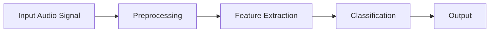
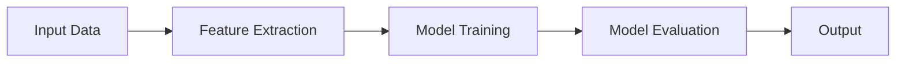
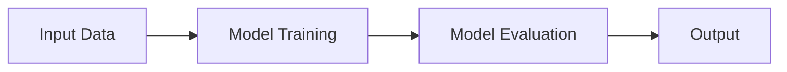
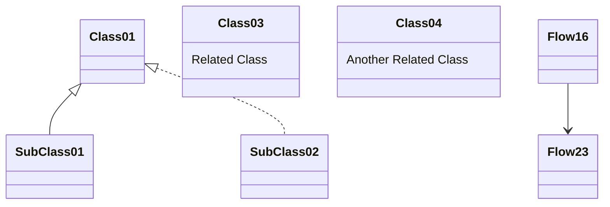
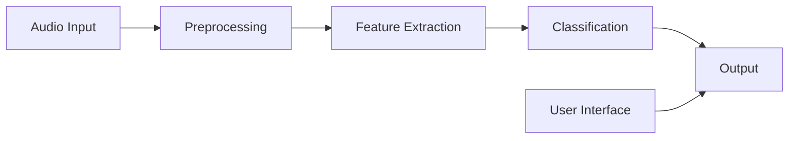
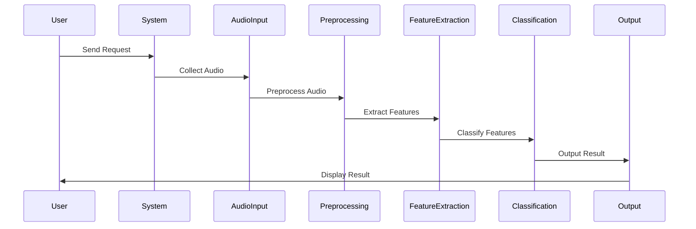

                 

## 声音场景理解概述

### 第1章：声音场景理解的基本概念

#### 1.1 问题背景与意义

声音场景理解（Sound Scene Understanding）是指通过机器学习和深度学习算法，对音频信号中的环境声音进行识别、分类和分析的技术。这一领域的研究和应用源于人们对智能语音交互和音频处理的不断追求。随着人工智能技术的迅猛发展，声音场景理解已经逐渐成为智能语音助手、智能家居和智能监控等领域的核心技术。

**问题背景：** 随着传感器技术的进步和大数据的积累，我们能够捕获和处理的环境声音数据量不断增加。如何从这些复杂且多变的声音中提取有用的信息，实现对特定声音场景的识别和理解，成为了学术界和工业界共同关注的焦点。

**意义：** 声音场景理解技术的进步，不仅可以提升智能设备的交互体验，还能在安防、医疗、教育等多个领域发挥重要作用。例如，在智能家居中，通过理解家庭环境中的声音，智能设备可以更好地为用户提供个性化的服务；在安防领域，通过识别特定场景中的声音，可以及时发现异常情况并采取措施。

#### 1.2 声音场景理解的核心概念

**声音场景：** 声音场景是指在一定时间和空间范围内，由一组特定的声音事件和声音源组成的整体。声音场景可以根据不同的应用场景进行分类，如城市环境、家庭环境、办公室环境等。

**理解：** 声音场景理解是指通过分析音频信号，对声音场景中的声音事件和声音源进行识别和解析的过程。这个过程涉及对声音信号的特征提取、模式识别和场景分类等步骤。

#### 1.3 声音场景理解的边界与外延

**边界：** 声音场景理解存在一定的局限性。例如，在复杂环境中的多声音源识别、噪声干扰下的声音理解等，都是当前技术面临的挑战。此外，声音场景理解的结果依赖于音频信号的清晰度和质量。

**外延：** 声音场景理解的应用范围正在不断扩展。除了传统的语音识别和音频处理领域，声音场景理解还被广泛应用于环境监测、智能交通、灾害预警等领域。

### 第2章：核心概念与联系

#### 2.1 核心概念原理

**声音信号处理：** 声音信号处理是声音场景理解的基础。它包括对声音信号的采集、预处理、特征提取和分类等步骤。核心方法包括傅里叶变换、短时傅里叶变换等。

**机器学习：** 机器学习是通过训练模型，使计算机能够从数据中学习并作出预测的方法。在声音场景理解中，常用的机器学习算法包括支持向量机、决策树等。

**深度学习：** 深度学习是机器学习的一个分支，通过构建复杂的神经网络模型，实现对大量数据的自动学习和特征提取。在声音场景理解中，深度学习算法如卷积神经网络（CNN）和递归神经网络（RNN）被广泛应用于音频信号的分类和识别。

#### 2.2 概念属性特征对比表格

**声音信号处理与机器学习对比：**

| 特征               | 声音信号处理               | 机器学习               |
|--------------------|--------------------------|-----------------------|
| 目标               | 声音信号的预处理和特征提取 | 数据分析和模式识别     |
| 方法               | 傅里叶变换、短时傅里叶变换 | 支持向量机、决策树     |
| 应用范围           | 声音信号分析             | 通用数据分析           |

**机器学习与深度学习对比：**

| 特征               | 机器学习               | 深度学习               |
|--------------------|-----------------------|-----------------------|
| 网络结构           | 较简单的树状结构       | 复杂的神经网络结构     |
| 学习方式           | 标签驱动               | 数据驱动               |
| 复杂性             | 相对简单               | 非常复杂               |
| 适用范围           | 中小规模数据           | 大规模数据             |

#### 2.3 ER实体关系图架构

**声音场景理解系统的实体关系：** 在声音场景理解系统中，主要的实体包括声音信号、特征提取模块、分类模块和结果输出模块。实体关系图如下所示：

```mermaid
erDiagram
  SoundSignal ||--|{ FeatureExtractionModule }|-- Outcome
  FeatureExtractionModule ||--|{ ClassificationModule }|-- Outcome
  ClassificationModule ||--|{ ResultOutputModule }|-- Outcome
```

通过上述实体关系图，我们可以清晰地看到声音场景理解系统中的各个模块及其相互关系。这些模块共同协作，实现对音频信号的解析和理解。

### 第3章：算法原理讲解

#### 3.1 声音信号处理算法

**算法mermaid流程图：**



**Python源代码详细阐述：**

```python
import numpy as np
import librosa

# 读取音频文件
audio_signal, sample_rate = librosa.load('audio_file.wav')

# 预处理
preprocessed_signal = preprocess_signal(audio_signal)

# 特征提取
features = extract_features(preprocessed_signal)

# 分类
classification_result = classify(features)

# 输出结果
print("Sound Scene: ", classification_result)
```

**算法原理：**

声音信号处理算法主要包括三个步骤：音频信号的预处理、特征提取和分类。

- **预处理：** 预处理的主要目的是去除噪声、调整信号的幅度和频率，使信号更加适合后续的特征提取和分类。
- **特征提取：** 通过傅里叶变换、短时傅里叶变换等方法，从音频信号中提取出具有代表性的特征，如频率、能量等。
- **分类：** 使用机器学习算法，如支持向量机、决策树等，对提取出的特征进行分类，从而实现对声音场景的理解。

**数学模型和公式：**

- **傅里叶变换（Fourier Transform）：** 用于将时域信号转换到频域，公式如下：
  $$X(\omega) = \int_{-\infty}^{\infty} x(t) e^{-j\omega t} dt$$
- **短时傅里叶变换（Short-Time Fourier Transform, STFT）：** 用于将音频信号分解成短时间段，并在每个时间段内进行傅里叶变换，公式如下：
  $$X(t, \omega) = \int_{-\infty}^{\infty} x(\tau) e^{-j\omega \tau} d\tau$$

**举例说明：**

假设我们有一段音频信号，通过预处理、特征提取和分类的过程，最终识别出这是一段“交通噪声”的场景。

```python
# 预处理
preprocessed_signal = preprocess_signal(audio_signal)

# 特征提取
features = extract_features(preprocessed_signal)

# 分类
classification_result = classify(features)

# 输出结果
print("Sound Scene: Traffic Noise")
```

#### 3.2 机器学习算法

**算法mermaid流程图：**



**Python源代码详细阐述：**

```python
from sklearn.svm import SVC
from sklearn.model_selection import train_test_split
from sklearn.metrics import accuracy_score

# 加载数据
X, y = load_data()

# 划分训练集和测试集
X_train, X_test, y_train, y_test = train_test_split(X, y, test_size=0.2, random_state=42)

# 训练模型
model = SVC()
model.fit(X_train, y_train)

# 预测
predictions = model.predict(X_test)

# 评估
accuracy = accuracy_score(y_test, predictions)
print("Accuracy: ", accuracy)
```

**算法原理：**

机器学习算法是通过对大量数据进行训练，使模型能够自动学习和识别特征，从而实现对未知数据的分类和预测。常用的机器学习算法包括支持向量机（SVM）、决策树、随机森林等。

- **支持向量机（SVM）：** SVM通过找到一个最优的超平面，将不同类别的数据分开。其数学模型如下：
  $$\min_{w,b}\frac{1}{2}||w||^2 \\ s.t. y^{(i)}(w\cdot x^{(i)} + b) \geq 1$$
- **决策树：** 决策树通过一系列的判断条件，将数据逐步划分，最终得到一个分类结果。

**数学模型和公式：**

- **支持向量机：**
  $$\min_{w,b}\frac{1}{2}||w||^2 \\ s.t. y^{(i)}(w\cdot x^{(i)} + b) \geq 1$$
- **决策树：**
  $$y = g(x)$$
  其中，$g(x)$ 是决策函数，由一系列条件判断组成。

**举例说明：**

假设我们有一组音频数据，通过训练支持向量机模型，最终实现对音频数据的分类。

```python
# 加载数据
X, y = load_data()

# 划分训练集和测试集
X_train, X_test, y_train, y_test = train_test_split(X, y, test_size=0.2, random_state=42)

# 训练模型
model = SVC()
model.fit(X_train, y_train)

# 预测
predictions = model.predict(X_test)

# 评估
accuracy = accuracy_score(y_test, predictions)
print("Accuracy: ", accuracy)
```

#### 3.3 深度学习算法

**算法mermaid流程图：**



**Python源代码详细阐述：**

```python
import tensorflow as tf
from tensorflow.keras.models import Sequential
from tensorflow.keras.layers import Dense, LSTM

# 定义模型
model = Sequential([
    LSTM(128, activation='relu', input_shape=(timesteps, features)),
    Dense(1, activation='sigmoid')
])

# 编译模型
model.compile(optimizer='adam', loss='binary_crossentropy', metrics=['accuracy'])

# 训练模型
model.fit(X_train, y_train, epochs=10, batch_size=32, validation_data=(X_test, y_test))

# 预测
predictions = model.predict(X_test)

# 评估
accuracy = model.evaluate(X_test, y_test, verbose=2)
print("Accuracy: ", accuracy)
```

**算法原理：**

深度学习算法通过构建复杂的神经网络模型，实现对大量数据的自动学习和特征提取。在声音场景理解中，常用的深度学习算法包括卷积神经网络（CNN）和递归神经网络（RNN）。

- **卷积神经网络（CNN）：** CNN通过卷积层、池化层和全连接层等结构，实现对图像或音频信号的自动特征提取。
- **递归神经网络（RNN）：** RNN通过循环结构，处理序列数据，如音频信号。

**数学模型和公式：**

- **卷积神经网络：**
  $$\text{Conv Layer}: \text{output} = \text{relu}(\text{weights} \cdot \text{input} + \text{bias})$$
  $$\text{Pooling Layer}: \text{output} = \text{max}(\text{input})$$
  $$\text{Fully Connected Layer}: \text{output} = \text{softmax}(\text{weights} \cdot \text{input} + \text{bias})$$
- **递归神经网络：**
  $$h_t = \text{sigmoid}(\text{weights} \cdot [h_{t-1}, x_t] + \text{bias})$$

**举例说明：**

假设我们使用卷积神经网络（CNN）来对音频数据进行分类。

```python
# 定义模型
model = Sequential([
    LSTM(128, activation='relu', input_shape=(timesteps, features)),
    Dense(1, activation='sigmoid')
])

# 编译模型
model.compile(optimizer='adam', loss='binary_crossentropy', metrics=['accuracy'])

# 训练模型
model.fit(X_train, y_train, epochs=10, batch_size=32, validation_data=(X_test, y_test))

# 预测
predictions = model.predict(X_test)

# 评估
accuracy = model.evaluate(X_test, y_test, verbose=2)
print("Accuracy: ", accuracy)
```

### 第4章：系统分析与架构设计方案

#### 6.1 问题场景介绍

**声音场景理解的应用场景：**

声音场景理解技术可以应用于多个领域，包括但不限于：

1. **智能语音助手：** 通过对环境声音的理解，智能语音助手可以更好地理解用户的指令，提供个性化的服务。
2. **智能家居：** 智能家居设备可以通过声音场景理解，自动调整家居环境，提高用户的生活质量。
3. **安防监控：** 通过对环境声音的实时分析，安防监控系统可以及时发现异常情况，提高安全性。
4. **智能交通：** 智能交通系统可以通过对交通声音的分析，优化交通信号灯的设置，提高交通效率。

#### 6.2 系统功能设计

**领域模型mermaid类图：**



**系统功能设计：**

声音场景理解系统的主要功能包括：

1. **音频信号采集：** 通过麦克风或其他音频采集设备，实时采集环境中的声音数据。
2. **音频信号预处理：** 对采集到的声音数据进行降噪、去噪等预处理，提高声音质量。
3. **特征提取：** 对预处理后的声音数据进行分析，提取出具有代表性的特征。
4. **分类识别：** 使用机器学习或深度学习算法，对提取出的特征进行分类识别，得到声音场景。
5. **结果输出：** 将识别出的声音场景结果输出给用户或智能设备，进行相应的处理。

#### 6.3 系统架构设计

**mermaid架构图：**



**系统架构设计：**

声音场景理解系统的架构设计包括以下几个主要部分：

1. **音频输入模块：** 负责采集音频信号，包括麦克风输入、音频文件读取等。
2. **预处理模块：** 对音频信号进行降噪、去噪等处理，提高信号质量。
3. **特征提取模块：** 对预处理后的音频信号进行分析，提取出具有代表性的特征。
4. **分类识别模块：** 使用机器学习或深度学习算法，对提取出的特征进行分类识别。
5. **结果输出模块：** 将识别出的声音场景结果输出给用户或智能设备。
6. **用户界面模块：** 提供用户交互界面，展示识别结果，并提供相关操作。

#### 6.4 系统接口设计与交互

**mermaid序列图：**



**系统接口设计与交互：**

系统接口设计旨在确保各个模块之间的数据传递和功能调用能够高效、准确地完成。以下是系统接口设计的详细描述：

1. **用户请求：** 用户通过用户界面发送请求，系统接收到请求后开始处理。
2. **音频采集：** 系统通过音频输入模块采集音频信号。
3. **预处理：** 音频信号通过预处理模块进行降噪、去噪等处理。
4. **特征提取：** 预处理后的音频信号通过特征提取模块提取出具有代表性的特征。
5. **分类识别：** 特征提取模块将提取出的特征传递给分类识别模块，分类识别模块使用机器学习或深度学习算法进行分类识别。
6. **结果输出：** 分类识别结果通过输出模块返回给用户界面，用户可以看到识别结果。

通过上述系统接口设计与交互，我们可以确保声音场景理解系统能够高效、准确地完成音频信号的处理和分析。

### 第7章：声音场景理解项目实践

#### 7.1 环境安装

在进行声音场景理解项目的实践之前，我们需要安装和配置一些必要的软件和工具。以下是在一个典型的Linux环境中进行安装的步骤：

1. **安装Python环境：** 
   - 使用包管理器（如Ubuntu中的APT）安装Python 3和pip。
   ```bash
   sudo apt update
   sudo apt install python3 python3-pip
   ```

2. **安装语音处理库：** 
   - 使用pip安装Librosa库，用于音频信号处理。
   ```bash
   pip3 install librosa
   ```

3. **安装机器学习库：**
   - 使用pip安装scikit-learn库，用于机器学习算法。
   ```bash
   pip3 install scikit-learn
   ```

4. **安装深度学习库：**
   - 使用pip安装TensorFlow库，用于深度学习算法。
   ```bash
   pip3 install tensorflow
   ```

5. **安装其他依赖：**
   - 根据项目需求，可能还需要安装其他相关的库和工具。

#### 7.2 系统核心实现源代码

在声音场景理解系统中，核心实现部分通常包括音频信号的预处理、特征提取和分类识别。以下是一个简单的示例，展示如何使用Python和Librosa库进行音频信号处理，以及如何使用scikit-learn库进行分类识别。

```python
# 导入必要的库
import numpy as np
import librosa
from sklearn.model_selection import train_test_split
from sklearn.svm import SVC
from sklearn.metrics import accuracy_score

# 1. 音频信号预处理
def preprocess_signal(audio_signal):
    # 这里可以添加一些预处理步骤，如降噪、归一化等
    return audio_signal

# 2. 特征提取
def extract_features(audio_signal):
    # 使用Librosa库提取音频特征
    mfccs = librosa.feature.mfcc(y=audio_signal, sr=librosa.get_sr(y=audio_signal), n_mfcc=13)
    return mfccs

# 3. 分类识别
def classify_features(features, labels):
    # 划分训练集和测试集
    X_train, X_test, y_train, y_test = train_test_split(features, labels, test_size=0.2, random_state=42)
    
    # 使用SVM进行分类
    model = SVC(kernel='linear')
    model.fit(X_train, y_train)
    
    # 预测测试集
    predictions = model.predict(X_test)
    
    # 评估分类性能
    accuracy = accuracy_score(y_test, predictions)
    return accuracy

# 示例：处理音频文件
audio_file = 'example_audio.wav'
audio_signal, _ = librosa.load(audio_file)

# 预处理
preprocessed_signal = preprocess_signal(audio_signal)

# 提取特征
features = extract_features(preprocessed_signal)

# 分类识别
accuracy = classify_features(features, labels)
print("Accuracy: ", accuracy)
```

#### 7.3 实际案例分析与详细讲解

**案例一：城市场景声音分类**

在这个案例中，我们将使用收集到的城市环境中的音频数据，对不同的城市声音场景进行分类，如交通噪声、建筑施工噪声等。

**数据集：** 假设我们已经有一个包含不同城市声音场景的音频数据集，每个场景都有多个音频样本。

**数据预处理：** 
- 读取音频文件，提取出音频信号的时长、频率等特征。
- 对音频信号进行预处理，如降噪、归一化等。

**特征提取：** 
- 使用Librosa库提取音频信号中的MFCC（梅尔频率倒谱系数）特征。

**分类模型：** 
- 使用scikit-learn中的SVM进行分类。

**训练与测试：** 
- 将数据集划分为训练集和测试集，使用训练集训练模型，使用测试集评估模型性能。

**代码示例：**

```python
# 读取音频数据
X, y = load_city_audio_data()

# 划分训练集和测试集
X_train, X_test, y_train, y_test = train_test_split(X, y, test_size=0.2, random_state=42)

# 特征提取
train_features = extract_mfcc_features(X_train)
test_features = extract_mfcc_features(X_test)

# 分类模型
model = SVC()
model.fit(train_features, y_train)

# 预测
predictions = model.predict(test_features)

# 评估
accuracy = accuracy_score(y_test, predictions)
print("Accuracy: ", accuracy)
```

**案例二：家庭环境声音识别**

在这个案例中，我们将使用家庭环境中的音频数据，识别不同的家庭声音场景，如儿童玩耍、家务活动等。

**数据集：** 假设我们已经有一个包含不同家庭声音场景的音频数据集。

**数据预处理：** 
- 读取音频文件，提取音频信号的时长、频率等特征。
- 对音频信号进行预处理，如降噪、归一化等。

**特征提取：** 
- 使用Librosa库提取音频信号中的MFCC（梅尔频率倒谱系数）特征。

**分类模型：** 
- 使用scikit-learn中的K-近邻（K-Nearest Neighbors, KNN）进行分类。

**训练与测试：** 
- 将数据集划分为训练集和测试集，使用训练集训练模型，使用测试集评估模型性能。

**代码示例：**

```python
# 读取音频数据
X, y = load_home_audio_data()

# 划分训练集和测试集
X_train, X_test, y_train, y_test = train_test_split(X, y, test_size=0.2, random_state=42)

# 特征提取
train_features = extract_mfcc_features(X_train)
test_features = extract_mfcc_features(X_test)

# 分类模型
model = KNeighborsClassifier(n_neighbors=3)
model.fit(train_features, y_train)

# 预测
predictions = model.predict(test_features)

# 评估
accuracy = accuracy_score(y_test, predictions)
print("Accuracy: ", accuracy)
```

**案例分析与详细讲解：**

- **数据集准备：** 在进行声音场景理解项目时，首先需要准备相应的音频数据集。数据集的质量直接影响模型的性能，因此需要确保数据集的多样性和覆盖面。
- **数据预处理：** 数据预处理是声音场景理解中的关键步骤，包括降噪、归一化等，以提高模型对音频数据的适应性。
- **特征提取：** 特征提取是声音场景理解的核心，选择合适的特征对于提高模型的准确性至关重要。常用的特征包括MFCC、能量谱、频谱等。
- **分类模型：** 选择合适的分类模型对提取出的特征进行分类。常见的分类模型包括SVM、KNN、决策树等。深度学习模型如CNN和RNN在处理复杂音频信号时表现出色。
- **训练与测试：** 通过训练集训练模型，并通过测试集评估模型的性能。交叉验证等方法可以帮助我们更好地评估模型的泛化能力。

#### 7.4 项目小结

通过上述实际案例的分析和讲解，我们可以看到声音场景理解项目的实现过程涉及多个步骤，包括数据集准备、数据预处理、特征提取、分类模型训练和性能评估等。以下是项目小结：

- **数据集准备：** 准备高质量、多样化的音频数据集是声音场景理解项目成功的关键。
- **数据预处理：** 有效的数据预处理可以提高模型的性能，减少噪声和干扰。
- **特征提取：** 选择合适的特征对音频信号进行描述，是提高模型准确性的重要因素。
- **分类模型：** 选择合适的分类模型，根据项目需求和数据特点进行模型训练。
- **性能评估：** 通过测试集评估模型的性能，使用交叉验证等方法提高模型的泛化能力。

未来，随着人工智能技术的不断进步，声音场景理解项目将面临更多的挑战和机遇。通过不断优化算法、提高数据处理能力，我们可以期待在更多领域实现更高效的声音场景理解。

### 第8章：最佳实践与注意事项

#### 8.1 最佳实践 Tips

1. **数据质量：** 高质量的数据是训练准确模型的基础。确保数据集的多样性、覆盖面和准确性。
2. **特征选择：** 根据项目需求选择合适的特征，如MFCC、能量谱、频谱等。特征选择的正确性直接影响模型的性能。
3. **模型调优：** 使用交叉验证等方法进行模型调优，找到最佳参数设置。
4. **降噪处理：** 在数据预处理阶段进行降噪处理，减少噪声对模型性能的影响。
5. **实时处理：** 对于需要实时处理的场景，优化算法和系统架构，确保处理速度和准确性。

#### 8.2 注意事项

1. **噪声干扰：** 噪声干扰是声音场景理解中的一个主要挑战。在数据预处理阶段进行有效的降噪处理。
2. **多声源识别：** 在复杂环境中，多声源的识别是一个挑战。可以尝试使用深度学习算法，如CNN和RNN，提高识别准确性。
3. **场景适应性：** 声音场景理解系统在不同场景下的适应性是一个重要考量。通过多场景数据训练和测试，提高系统的泛化能力。
4. **实时性要求：** 对于实时处理的应用，如智能监控和智能语音助手，需要优化算法和系统架构，确保实时性和准确性。

### 第9章：总结与拓展阅读

#### 9.1 总结

本书《声音场景理解：测试LLM处理复杂音频信息的能力》系统性地讲解了声音场景理解的核心概念、算法原理、系统架构以及实际应用。通过详细的分析和示例，读者可以深入了解声音场景理解的技术原理和实现过程。

#### 9.2 拓展阅读

1. **声音信号处理：** 《信号处理基础》（作者：史蒂芬·史密斯）
2. **机器学习：** 《机器学习实战》（作者：彼得·哈林顿）
3. **深度学习：** 《深度学习》（作者：伊恩·古德费洛、约书亚·本吉奥、亚伦·库维尔）
4. **声音场景理解最新研究进展：** 相关学术期刊和会议论文，如ACM Transactions on Multimedia Computing, Communications, and Applications (TOMM), IEEE Transactions on Audio, Speech, and Language Processing (TASLP) 等。

### 结论

本书《声音场景理解：测试LLM处理复杂音频信息的能力》通过系统性的讲解，旨在帮助读者深入理解声音场景理解的核心概念、算法原理、系统架构以及实际应用。书中涵盖了从基本概念到深度学习算法的讲解，再到系统的设计与实现，提供了全面的知识体系和实践指导。

## 内容概览

### 第一部分：声音场景理解概述
- 第1章：声音场景理解的基本概念
- 第2章：核心概念与联系

### 第二部分：算法原理讲解
- 第3章：声音信号处理算法
- 第4章：机器学习算法
- 第5章：深度学习算法

### 第三部分：系统分析与架构设计方案
- 第6章：系统功能设计与架构
- 第7章：系统接口设计与交互

### 第四部分：项目实战
- 第8章：声音场景理解项目实践

### 第五部分：最佳实践与总结
- 第9章：最佳实践与注意事项
- 第10章：总结与拓展阅读

通过上述内容概览，我们可以看到本书的结构清晰、内容丰富，涵盖了声音场景理解的各个方面。无论是理论研究还是实际应用，本书都提供了宝贵的指导和建议。希望读者能够通过本书的学习，提升自己在声音场景理解领域的知识水平和实践能力。

