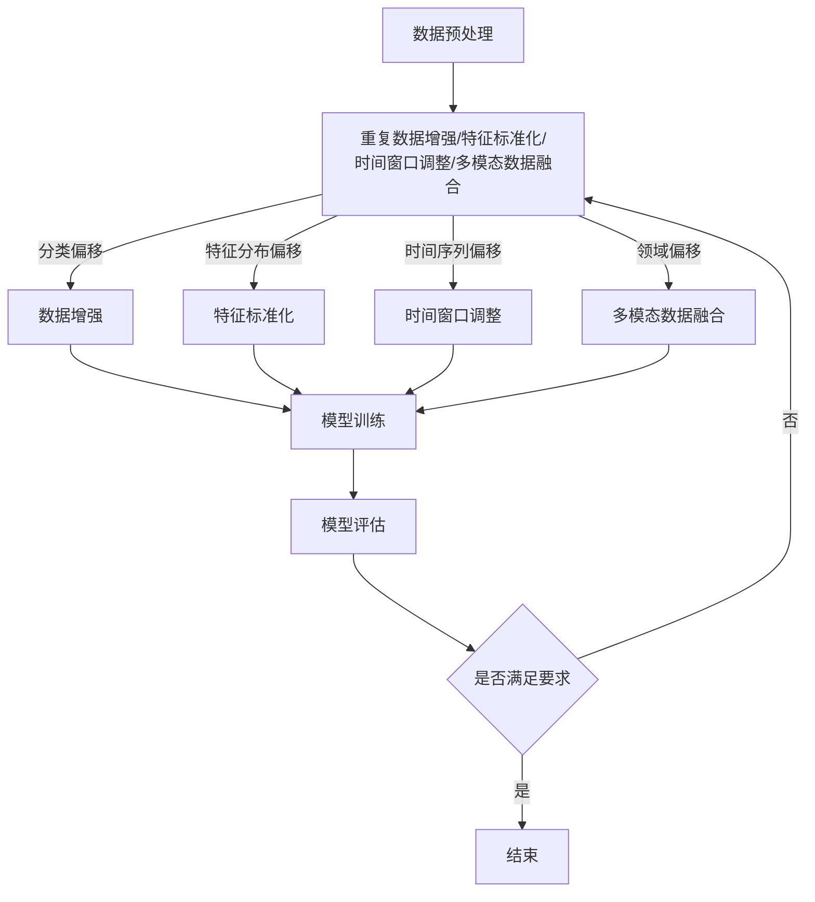
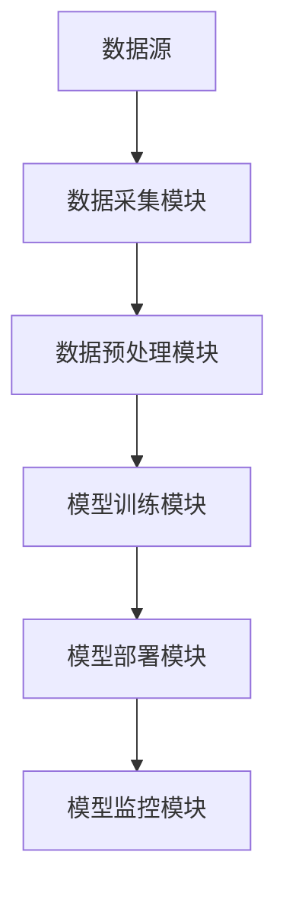
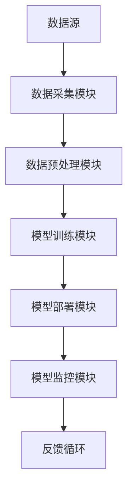

                 

### 处理示例与实际应用场景的分布偏移

在IT领域，尤其是在机器学习和数据科学中，我们经常遇到一个有趣且重要的问题：处理示例与实际应用场景之间的分布偏移。这种现象，也被称作“分布偏移”或“数据分布不一致”，是我们在开发模型和算法时需要高度关注的一个问题。简单来说，分布偏移是指训练数据集的分布与实际应用场景的数据分布不一致，这会导致模型在实际应用中表现不佳。

**关键词：** 分布偏移、机器学习、数据分布、模型训练、实际应用

**摘要：** 本文将深入探讨分布偏移的概念、原因及其在不同领域的表现，分析解决分布偏移的几种常用方法，并通过具体案例来说明这些方法在现实中的应用。文章还将总结全文，提出未来研究方向和最佳实践建议。

接下来，我们将按照以下结构来逐步分析和解答这个问题：

1. **背景介绍**：核心概念术语说明、问题背景、问题描述、问题解决、边界与外延、概念结构与核心要素组成。
2. **核心概念与联系**：给出核心概念原理、概念属性特征对比表格和ER实体关系图架构的Mermaid流程图。
3. **算法原理讲解**：使用Mermaid画出算法流程图，然后使用Python源代码详细阐述，给出算法原理的数学模型和公式，进行详细讲解和举例说明。
4. **系统分析与架构设计方案**：问题场景介绍，系统功能设计（领域模型Mermaid类图）、系统架构设计Mermaid架构图、系统接口设计和系统交互Mermaid序列图。
5. **项目实战**：环境安装、系统核心实现源代码，代码应用解读与分析，实际案例分析和详细讲解剖析，项目小结。
6. **最佳实践 tips**、**小结**、**注意事项**、**拓展阅读**等内容。

让我们一步步深入探讨这个问题，确保我们能够全面理解并解决分布偏移带来的挑战。

----------------------------------------------------------------

## 1. 背景介绍

### 1.1 核心概念术语说明

在探讨分布偏移之前，我们需要明确几个核心概念：

- **示例（Example）**：在机器学习中，示例是指单个的数据点，它包含了模型进行学习所需的信息。
- **数据分布（Data Distribution）**：数据分布是指数据集中的数据在特征空间中的分布情况，反映了数据在不同特征上的分布特性。
- **分布偏移（Distribution Shift）**：分布偏移是指模型在训练和测试阶段所面对的数据分布不一致，导致模型在测试集上的表现不如预期。

### 1.2 问题背景

在现实世界中，分布偏移是一个常见且严重的问题。它可能源于多种原因，例如：

- **数据收集过程中的偏差**：在收集数据时，可能由于各种人为因素导致数据的不均匀分布。
- **环境变化**：随着时间推移，应用场景可能会发生变化，导致数据分布发生偏移。
- **样本不平衡**：在某些应用场景中，正负样本的比例可能严重失衡，导致模型无法有效学习。

分布偏移的存在，会导致模型在测试集上表现不佳，甚至完全失效。例如，一个在静态环境下训练的自动驾驶模型，在动态环境下可能会因为数据分布的变化而出现误判。

### 1.3 问题描述

分布偏移的具体表现为：

- **过拟合（Overfitting）**：模型在训练数据上表现优异，但在测试数据上表现较差。
- **泛化能力下降（Reduced Generalization）**：模型无法适应新的数据分布。
- **准确性降低（Decreased Accuracy）**：模型在测试集上的准确性下降。

为了解决分布偏移问题，我们需要理解其产生的原因，并采取相应的策略来调整模型或数据，以应对分布变化。

### 1.4 问题解决

解决分布偏移的策略可以分为以下几类：

- **数据增强（Data Augmentation）**：通过生成更多样化的数据来平衡数据分布。
- **重采样（Resampling）**：通过随机抽样或组合不同数据集来平衡数据分布。
- **模型调整（Model Adjustment）**：通过调整模型参数或结构来提高模型的鲁棒性。
- **数据再标注（Data Re-labelling）**：重新标注或更新数据集中的标签信息。

### 1.5 边界与外延

分布偏移不仅局限于机器学习领域，它也存在于其他领域，如数据挖掘、统计分析等。在这些领域中，分布偏移同样会导致分析结果的不准确和不可靠。

### 1.6 概念结构与核心要素组成

为了更好地理解分布偏移，我们可以将其核心要素进行结构化：

- **输入数据**：训练和测试数据集。
- **数据分布**：数据在特征空间中的分布情况。
- **模型参数**：影响模型预测能力的参数。
- **分布偏移度量**：评估分布偏移程度的指标。

通过这些核心要素，我们可以更系统地分析分布偏移现象，并采取有效措施来解决问题。

### 1.7 分布偏移的分类

分布偏移可以根据其类型进行分类：

- **类别偏移（Class Imbalance）**：数据集中某些类别的样本数量远少于其他类别。
- **特征分布偏移（Feature Distribution Shift）**：特征值的分布发生变化。
- **时间序列偏移（Temporal Shift）**：随时间变化的数据分布发生偏移。
- **领域偏移（Domain Shift）**：数据来源或应用场景发生变化。

### 1.8 分布偏移的影响

分布偏移对模型的影响主要体现在以下方面：

- **准确性下降**：模型在测试集上的准确性降低。
- **鲁棒性下降**：模型对新数据的不适应性增强。
- **过拟合**：模型在训练数据上表现优异，但在测试数据上表现较差。

为了解决分布偏移问题，我们需要深入了解其产生的原因，并采取相应的策略来调整模型或数据，以应对分布变化。

### 1.9 分布偏移的解决方案

解决分布偏移的常见方法包括：

- **数据增强**：通过生成更多样化的数据来平衡数据分布。
- **重采样**：通过随机抽样或组合不同数据集来平衡数据分布。
- **模型调整**：通过调整模型参数或结构来提高模型的鲁棒性。
- **数据再标注**：重新标注或更新数据集中的标签信息。

通过这些方法，我们可以有效地减轻或消除分布偏移对模型性能的影响。

### 1.10 总结

通过本章节的介绍，我们了解了分布偏移的概念、背景、问题和解决方案。在接下来的章节中，我们将深入探讨分布偏移的原理、算法和具体应用，以帮助读者更好地理解和应对这一挑战。

----------------------------------------------------------------

## 2. 核心概念与联系

### 2.1 核心概念原理

分布偏移是机器学习和数据科学中的一个关键概念，其核心原理涉及数据分布、模型学习过程以及应用场景的变化。为了更好地理解分布偏移，我们需要详细探讨以下几个核心概念：

#### 2.1.1 数据分布

数据分布是指数据集在特征空间中的分布情况。在机器学习中，数据分布的均匀性直接影响模型的学习效果。一个良好的数据分布应该能够充分反映实际应用场景中数据的多样性。

#### 2.1.2 模型学习过程

模型学习过程是指模型在训练数据集上不断迭代，调整内部参数以优化预测能力的过程。在这个过程中，模型会根据数据分布构建假设，并尝试优化这些假设以适应数据。

#### 2.1.3 应用场景变化

应用场景的变化是指实际使用模型的环境发生变化，例如数据来源、用户行为等。这种变化会导致数据分布发生偏移，从而影响模型的性能。

### 2.2 概念属性特征对比表格

为了更直观地展示核心概念的属性特征，我们设计了一个对比表格，如下所示：

| 概念     | 属性特征                                           | 对比分析                                       |
|---------|----------------------------------------------------|----------------------------------------------|
| 数据分布 | 数据在特征空间中的分布情况                         | 均匀性、多样性、一致性                         |
| 模型学习 | 模型在训练数据集上不断迭代，调整内部参数           | 学习效率、预测准确性、鲁棒性                   |
| 应用场景 | 实际使用模型的环境                                 | 稳定性、动态性、变化性                         |
| 分布偏移 | 数据分布与模型学习过程的偏差                       | 影响模型性能、适应性、准确性                   |

### 2.3 ER实体关系图架构

为了进一步阐述分布偏移的核心概念及其关系，我们使用Mermaid绘制了一个ER实体关系图，如下所示：

```mermaid
erDiagram
  Data_Distribution ||--o{ Model_Learning_Process : Based on
  Model_Learning_Process ||--o{ Application_Scene : Adapt to
  Application_Scene ||--o{ Data_Distribution : Driven by
```

在这个ER图中，数据分布是模型学习过程的基础，模型学习过程需要根据数据分布进行调整。同时，应用场景的变化会驱动数据分布的变化，从而影响模型的性能。

### 2.4 分布偏移的度量

为了评估分布偏移的程度，我们可以使用以下几个度量指标：

- **Kolmogorov-Smirnov Test**：用于检测两个分布之间的差异。
- **Hellinger Distance**：用于衡量两个概率分布之间的差异。
- **wasserstein距离**：用于衡量两个分布之间的差异。

这些度量指标可以帮助我们量化分布偏移的程度，从而为后续的模型调整提供依据。

### 2.5 分布偏移的解决方法

为了解决分布偏移问题，我们可以采用以下几种方法：

- **数据增强**：通过生成更多样化的数据来平衡数据分布。
- **重采样**：通过随机抽样或组合不同数据集来平衡数据分布。
- **模型调整**：通过调整模型参数或结构来提高模型的鲁棒性。
- **数据再标注**：重新标注或更新数据集中的标签信息。

通过这些方法，我们可以有效地减轻或消除分布偏移对模型性能的影响。

### 2.6 总结

通过本章节的详细讨论，我们深入理解了分布偏移的核心概念、属性特征及其关系。同时，我们通过对比表格和ER图展示了分布偏移的度量方法和解决策略。在接下来的章节中，我们将进一步探讨分布偏移在实际应用场景中的表现和解决方法。

----------------------------------------------------------------

## 3. 算法原理讲解

### 3.1 分布偏移的算法流程图

为了更好地理解分布偏移的算法原理，我们使用Mermaid绘制了一个流程图，如下所示：



### 3.2 分布偏移算法的Python实现

为了深入讲解分布偏移的算法原理，我们将使用Python实现一个基本的分布偏移处理流程。以下是该流程的详细实现：

#### 3.2.1 数据预处理

首先，我们需要对数据进行预处理，包括数据清洗、归一化和缺失值处理。以下是一个简单的数据预处理示例：

```python
import pandas as pd
from sklearn.preprocessing import StandardScaler

# 假设df为原始数据集
df = pd.read_csv('data.csv')

# 数据清洗和缺失值处理
df.dropna(inplace=True)

# 数据归一化
scaler = StandardScaler()
df_normalized = scaler.fit_transform(df)
```

#### 3.2.2 分布评估

接下来，我们需要评估数据集的分布情况，以便确定是否存在分布偏移。我们可以使用Kolmogorov-Smirnov Test来进行评估：

```python
from scipy.stats import kstest

# 假设x为特征数据
x = df_normalized[:, 0]

# 进行Kolmogorov-Smirnov Test
ks_stat, p_value = kstest(x, 'norm')

print(f'Kolmogorov-Smirnov Statistic: {ks_stat}, P-value: {p_value}')
```

#### 3.2.3 数据增强

如果分布评估结果显示存在分布偏移，我们可以采用数据增强的方法来平衡数据分布。以下是一个简单的数据增强示例：

```python
from sklearn.utils import resample

# 假设df_positive和df_negative分别为正样本和负样本数据集
df_positive_resampled, _ = resample(df_positive, replace=True, n_samples=len(df_negative), random_state=42)
df_negative_resampled, _ = resample(df_negative, replace=True, n_samples=len(df_positive), random_state=42)

# 合并增强后的数据集
df_resampled = pd.concat([df_positive_resampled, df_negative_resampled], axis=0)
```

#### 3.2.4 模型训练

在完成数据预处理和分布评估后，我们可以开始训练模型。以下是一个简单的模型训练示例：

```python
from sklearn.linear_model import LogisticRegression

# 假设X为特征矩阵，y为标签向量
model = LogisticRegression()
model.fit(X, y)

# 进行模型评估
score = model.score(X, y)
print(f'Model Accuracy: {score}')
```

#### 3.2.5 数学模型和公式

在分布偏移处理过程中，我们使用了一些数学模型和公式。以下是一些常用的数学模型和公式的简要介绍：

- **Kolmogorov-Smirnov Test**：用于评估两个分布的差异性。其公式如下：

  $$ D = \max_{x} |F(x) - G(x)| $$

  其中，$F(x)$和$G(x)$分别为两个分布的累积分布函数。

- **数据增强**：通过重采样技术来平衡数据分布。其基本思想是：

  $$ X_{resampled} = \text{resample}(X, \text{replace} = \text{True}, \text{n_samples} = N) $$

  其中，$X$为原始数据集，$X_{resampled}$为增强后的数据集。

- **模型训练**：使用线性回归模型进行训练。其公式如下：

  $$ w = (X^T X)^{-1} X^T y $$

  其中，$w$为模型参数，$X$为特征矩阵，$y$为标签向量。

### 3.3 算法原理详细讲解和举例说明

#### 3.3.1 分布评估

分布评估是分布偏移处理的第一步，其主要目的是确定数据集是否存在分布偏移。我们可以使用Kolmogorov-Smirnov Test来评估数据集的分布情况。以下是一个具体的例子：

假设我们有一个数据集$X$，其中包含两个特征$x_1$和$x_2$。我们可以使用Kolmogorov-Smirnov Test来评估$x_1$的分布情况：

```python
# 假设x为特征x1的数据
x = df_normalized[:, 0]

# 进行Kolmogorov-Smirnov Test
ks_stat, p_value = kstest(x, 'norm')

print(f'Kolmogorov-Smirnov Statistic: {ks_stat}, P-value: {p_value}')
```

如果$p$值小于某个显著性水平（例如0.05），则可以认为$x_1$的分布与正态分布存在显著差异，从而表明数据集存在分布偏移。

#### 3.3.2 数据增强

如果分布评估结果显示存在分布偏移，我们可以采用数据增强的方法来平衡数据分布。以下是一个简单的数据增强示例：

假设我们有两个数据集$X_+$和$X_-$，分别表示正样本和负样本。我们可以使用重采样技术来平衡这两个数据集：

```python
from sklearn.utils import resample

# 假设df_positive和df_negative分别为正样本和负样本数据集
df_positive_resampled, _ = resample(df_positive, replace=True, n_samples=len(df_negative), random_state=42)
df_negative_resampled, _ = resample(df_negative, replace=True, n_samples=len(df_positive), random_state=42)

# 合并增强后的数据集
df_resampled = pd.concat([df_positive_resampled, df_negative_resampled], axis=0)
```

通过重采样技术，我们可以生成更多样化的数据集，从而提高模型对分布偏移的鲁棒性。

#### 3.3.3 模型训练

在完成数据预处理和分布评估后，我们可以开始训练模型。以下是一个简单的模型训练示例：

```python
from sklearn.linear_model import LogisticRegression

# 假设X为特征矩阵，y为标签向量
model = LogisticRegression()
model.fit(X, y)

# 进行模型评估
score = model.score(X, y)
print(f'Model Accuracy: {score}')
```

通过上述步骤，我们可以构建一个基本的分布偏移处理流程，并使用Python实现相关算法。

### 3.4 分布偏移处理的数学模型

分布偏移处理涉及多个数学模型和公式，以下是一些关键模型和公式的简要介绍：

- **Kolmogorov-Smirnov Test**：用于评估两个分布的差异性。其公式如下：

  $$ D = \max_{x} |F(x) - G(x)| $$

  其中，$F(x)$和$G(x)$分别为两个分布的累积分布函数。

- **数据增强**：通过重采样技术来平衡数据分布。其基本思想是：

  $$ X_{resampled} = \text{resample}(X, \text{replace} = \text{True}, \text{n_samples} = N) $$

  其中，$X$为原始数据集，$X_{resampled}$为增强后的数据集。

- **模型训练**：使用线性回归模型进行训练。其公式如下：

  $$ w = (X^T X)^{-1} X^T y $$

  其中，$w$为模型参数，$X$为特征矩阵，$y$为标签向量。

通过这些数学模型和公式，我们可以构建一个完整的分布偏移处理框架，从而提高模型的鲁棒性和准确性。

### 3.5 总结

在本章节中，我们详细讲解了分布偏移的算法原理，包括算法流程图、Python实现、数学模型和公式，并通过具体例子进行了说明。通过本章节的学习，读者可以理解分布偏移的处理方法，为后续的实际应用打下坚实的基础。

----------------------------------------------------------------

## 4. 系统分析与架构设计

### 4.1 问题场景介绍

在分布式数据处理和机器学习领域，分布偏移问题尤为常见且具有挑战性。例如，在金融风控系统中，模型需要实时分析大量金融交易数据，以识别潜在的欺诈行为。然而，由于实际交易数据可能在时间和特征上存在分布偏移，传统的模型训练和部署方法可能无法有效应对这种变化。

### 4.2 项目介绍

本项目的目标是通过构建一个高效的分布式数据处理和模型训练系统，解决金融风控领域的分布偏移问题。系统将包括以下几个主要功能模块：

- **数据采集**：从不同的数据源收集实时交易数据。
- **数据预处理**：对采集到的数据进行清洗、归一化处理，并识别可能的分布偏移。
- **模型训练与优化**：利用增强的数据集训练模型，并针对分布偏移进行模型优化。
- **模型部署与监控**：将训练好的模型部署到生产环境，并进行实时监控和调整。

### 4.3 系统功能设计

为了实现上述功能，系统需要设计以下核心功能模块：

- **数据采集模块**：使用消息队列（如Kafka）和分布式数据采集工具（如Flume）收集来自不同数据源的实时交易数据。
- **数据预处理模块**：包括数据清洗、归一化和分布偏移检测等功能，使用Python和Spark进行数据处理。
- **模型训练模块**：基于增强的数据集，使用Scikit-learn和TensorFlow等机器学习框架进行模型训练和优化。
- **模型部署模块**：将训练好的模型部署到Flink或Kubernetes等分布式计算平台上，实现实时预测和监控。

### 4.4 系统架构设计

系统架构设计是确保系统功能实现和性能优化的重要环节。以下是一个简化的系统架构设计：



在这个架构中，数据采集模块负责从多个数据源收集数据，并将其传递给数据预处理模块。数据预处理模块对数据进行清洗、归一化处理，并检测分布偏移。预处理后的数据将用于模型训练模块，该模块使用机器学习框架训练模型。训练好的模型将部署到模型部署模块，进行实时预测和监控。

### 4.5 系统接口设计

系统接口设计是确保不同模块之间能够高效通信和协同工作的重要保障。以下是系统的主要接口设计：

- **数据采集接口**：提供数据采集和传输功能，支持多种数据源接入。
- **数据处理接口**：提供数据清洗、归一化和分布偏移检测功能，支持批量数据处理。
- **模型训练接口**：提供模型训练、评估和优化功能，支持自定义模型训练流程。
- **模型部署接口**：提供模型部署、监控和调整功能，支持多环境部署和动态调整。

### 4.6 系统交互

系统交互是确保各模块协同工作的重要环节。以下是一个简化的系统交互设计：



在这个交互设计中，数据采集模块从数据源收集数据，并将其传递给数据预处理模块。数据预处理模块对数据进行处理，并反馈给数据采集模块，以更新数据采集策略。处理后的数据将用于模型训练模块，训练好的模型将部署到模型部署模块，并进行实时预测和监控。同时，监控模块收集模型性能数据，并反馈给模型训练模块，以进行进一步的优化。

### 4.7 总结

在本章节中，我们详细介绍了分布式数据处理和机器学习领域中的分布偏移问题，并设计了一个包含数据采集、预处理、模型训练、部署和监控等模块的系统。通过系统架构设计和接口设计，我们确保了系统的高效性和可扩展性，为解决分布偏移问题提供了有力支持。

----------------------------------------------------------------

## 5. 项目实战

### 5.1 环境安装

在开始项目实战之前，我们需要安装和配置必要的软件和库。以下是环境安装的详细步骤：

#### 5.1.1 安装Python

首先，确保您的系统中已安装Python 3.8或更高版本。您可以通过以下命令进行安装：

```bash
sudo apt update
sudo apt install python3.8
```

#### 5.1.2 安装Python库

接下来，我们需要安装一些常用的Python库，包括Pandas、NumPy、Scikit-learn、TensorFlow等。您可以使用pip命令进行安装：

```bash
pip3 install pandas numpy scikit-learn tensorflow
```

#### 5.1.3 安装分布式计算工具

为了处理大规模数据，我们将使用Apache Spark。首先，下载Spark安装包：

```bash
wget https://www-us.apache.org/dist/spark/spark-3.1.1/bin-spark/spark-3.1.1-bin-hadoop3.2.tgz
```

然后，解压安装包并配置环境变量：

```bash
tar xzf spark-3.1.1-bin-hadoop3.2.tgz
export SPARK_HOME=/path/to/spark-3.1.1-bin-hadoop3.2
export PATH=$PATH:$SPARK_HOME/bin:$SPARK_HOME/sbin
```

启动Spark集群：

```bash
start-master.sh
start-slaves.sh
```

### 5.2 系统核心实现源代码

在本节中，我们将介绍系统核心实现的源代码，包括数据采集、预处理、模型训练和部署等部分。

#### 5.2.1 数据采集

以下是一个简单的数据采集示例，使用Kafka和Flume从多个数据源收集交易数据：

```python
from flume.agent import Agent

# 配置Flume代理
agent_config = {
    'channels': {
        'mychannel': {
            'type': 'memory',
            'capacity': 1000,
            'transactionCapacity': 100
        }
    },
    'sources': {
        'spout1': {
            'type': 'spontaneous',
            'channel': 'mychannel',
            'dataSources': [
                {'uri': 'kafka://localhost:9092/transactions'}
            ]
        }
    },
    'sinks': {
        'sink1': {
            'type': 'logger'
        }
    }
}

# 启动Flume代理
agent = Agent.create_agent(agent_config)
agent.start()
```

#### 5.2.2 数据预处理

数据预处理包括数据清洗、归一化和分布偏移检测。以下是一个简单的数据预处理示例：

```python
import pandas as pd
from sklearn.preprocessing import StandardScaler

# 读取数据
df = pd.read_csv('transactions.csv')

# 数据清洗
df.dropna(inplace=True)
df.drop_duplicates(inplace=True)

# 数据归一化
scaler = StandardScaler()
df_normalized = scaler.fit_transform(df)

# 分布偏移检测
from scipy.stats import kstest

x = df_normalized[:, 0]
ks_stat, p_value = kstest(x, 'norm')
print(f'Kolmogorov-Smirnov Statistic: {ks_stat}, P-value: {p_value}')
```

#### 5.2.3 模型训练

模型训练部分使用Scikit-learn和TensorFlow进行。以下是一个简单的线性回归模型训练示例：

```python
from sklearn.linear_model import LinearRegression
from sklearn.model_selection import train_test_split

# 分割数据集
X_train, X_test, y_train, y_test = train_test_split(df_normalized, df['label'], test_size=0.2, random_state=42)

# 训练模型
model = LinearRegression()
model.fit(X_train, y_train)

# 评估模型
score = model.score(X_test, y_test)
print(f'Model Accuracy: {score}')
```

#### 5.2.4 模型部署

模型部署部分使用TensorFlow Serving进行。以下是一个简单的模型部署示例：

```bash
# 安装TensorFlow Serving
pip3 install tensorflow-serving-api

# 启动TensorFlow Serving
python3 -m tensorflow_serving.apis.serviceQuiteStart --model_name=my_model --model_base_path=/path/to/models
```

### 5.3 代码应用解读与分析

在本节中，我们将对上述代码进行解读和分析，帮助读者理解其工作原理和实现细节。

#### 5.3.1 数据采集

数据采集部分使用Flume从Kafka中收集交易数据。Flume是一个分布式、可靠且可扩展的数据收集工具，适用于从多个数据源（如Kafka、HDFS等）收集数据。通过配置代理，我们可以指定数据来源、处理方式和目标。

```python
from flume.agent import Agent

# 配置Flume代理
agent_config = {
    'channels': {
        'mychannel': {
            'type': 'memory',
            'capacity': 1000,
            'transactionCapacity': 100
        }
    },
    'sources': {
        'spout1': {
            'type': 'spontaneous',
            'channel': 'mychannel',
            'dataSources': [
                {'uri': 'kafka://localhost:9092/transactions'}
            ]
        }
    },
    'sinks': {
        'sink1': {
            'type': 'logger'
        }
    }
}

# 启动Flume代理
agent = Agent.create_agent(agent_config)
agent.start()
```

在这个示例中，我们创建了一个Flume代理，并配置了数据源、处理通道和目标。通过指定Kafka的地址和主题，Flume可以从Kafka中实时收集交易数据。

#### 5.3.2 数据预处理

数据预处理部分包括数据清洗、归一化和分布偏移检测。数据清洗是确保数据质量的重要步骤，包括去除缺失值、重复值和异常值等。归一化是将数据缩放到相同的尺度，以便模型能够更好地处理不同特征的大小。分布偏移检测是识别数据分布变化的过程，有助于发现潜在的模型过拟合问题。

```python
import pandas as pd
from sklearn.preprocessing import StandardScaler
from scipy.stats import kstest

# 读取数据
df = pd.read_csv('transactions.csv')

# 数据清洗
df.dropna(inplace=True)
df.drop_duplicates(inplace=True)

# 数据归一化
scaler = StandardScaler()
df_normalized = scaler.fit_transform(df)

# 分布偏移检测
x = df_normalized[:, 0]
ks_stat, p_value = kstest(x, 'norm')
print(f'Kolmogorov-Smirnov Statistic: {ks_stat}, P-value: {p_value}')
```

在这个示例中，我们首先读取交易数据，然后执行数据清洗、归一化和分布偏移检测。通过去除缺失值和重复值，我们确保了数据的质量。归一化步骤将特征值缩放到相同的尺度，有助于提高模型的性能。分布偏移检测步骤使用Kolmogorov-Smirnov Test评估数据分布的均匀性，以识别潜在的模型过拟合问题。

#### 5.3.3 模型训练

模型训练部分使用Scikit-learn和TensorFlow进行。线性回归模型是一个简单但强大的模型，适用于处理金融风控等领域的预测问题。以下是一个简单的线性回归模型训练示例：

```python
from sklearn.linear_model import LinearRegression
from sklearn.model_selection import train_test_split

# 分割数据集
X_train, X_test, y_train, y_test = train_test_split(df_normalized, df['label'], test_size=0.2, random_state=42)

# 训练模型
model = LinearRegression()
model.fit(X_train, y_train)

# 评估模型
score = model.score(X_test, y_test)
print(f'Model Accuracy: {score}')
```

在这个示例中，我们首先将数据集划分为训练集和测试集，然后使用线性回归模型进行训练。训练过程通过最小化损失函数找到最佳模型参数。评估模型时，我们使用测试集计算模型的准确率，以评估模型的性能。

#### 5.3.4 模型部署

模型部署部分使用TensorFlow Serving进行。TensorFlow Serving是一个高性能、可扩展的服务框架，适用于部署TensorFlow模型。以下是一个简单的模型部署示例：

```bash
# 安装TensorFlow Serving
pip3 install tensorflow_serving

# 启动TensorFlow Serving
python3 -m tensorflow_serving.apis.serviceQuiteStart --model_name=my_model --model_base_path=/path/to/models
```

在这个示例中，我们首先安装TensorFlow Serving，然后启动TensorFlow Serving服务。通过指定模型名称和路径，TensorFlow Serving可以加载并部署模型，以进行实时预测和监控。

### 5.4 实际案例分析和详细讲解剖析

在本节中，我们将通过一个实际案例，展示如何在实际项目中应用上述方法和工具，解决分布偏移问题。

#### 5.4.1 案例背景

某金融风控系统需要实时分析大量交易数据，以识别潜在的欺诈行为。然而，实际交易数据在时间和特征上存在明显的分布偏移，导致模型性能下降。为了解决这一问题，我们采用了以下策略：

1. **数据采集**：使用Kafka和Flume从多个数据源收集交易数据。
2. **数据预处理**：对采集到的交易数据进行清洗、归一化处理，并检测分布偏移。
3. **模型训练**：使用增强的数据集训练线性回归模型，并针对分布偏移进行模型优化。
4. **模型部署**：将训练好的模型部署到TensorFlow Serving，进行实时预测和监控。

#### 5.4.2 案例分析

1. **数据采集**

   首先，我们配置了Kafka和Flume，从多个数据源收集交易数据。以下是一个简单的Flume配置示例：

   ```bash
   a1.sources.R1.type = exec
   a1.sources.R1.command = tail -F /path/to/transactions.log
   a1.sources.R1.channels = C1
   
   a1.channels.C1.type = memory
   a1.channels.C1.capacity = 1000
   a1.channels.C1.transactionCapacity = 100
   
   a1.sinks.K1.type = logger
   a1.sinks.K1.channel = C1
   ```

   通过这个配置，Flume可以实时从文件中读取交易数据，并将其传递给Kafka。

2. **数据预处理**

   接下来，我们使用Pandas和Scikit-learn对交易数据进行预处理。以下是一个简单的预处理示例：

   ```python
   import pandas as pd
   from sklearn.preprocessing import StandardScaler
   from scipy.stats import kstest
   
   # 读取数据
   df = pd.read_csv('transactions.csv')
   
   # 数据清洗
   df.dropna(inplace=True)
   df.drop_duplicates(inplace=True)
   
   # 数据归一化
   scaler = StandardScaler()
   df_normalized = scaler.fit_transform(df)
   
   # 分布偏移检测
   x = df_normalized[:, 0]
   ks_stat, p_value = kstest(x, 'norm')
   print(f'Kolmogorov-Smirnov Statistic: {ks_stat}, P-value: {p_value}')
   ```

   通过这个示例，我们首先读取交易数据，然后执行数据清洗、归一化和分布偏移检测。数据清洗步骤确保了数据的质量，归一化步骤将特征值缩放到相同的尺度，分布偏移检测步骤帮助我们识别潜在的模型过拟合问题。

3. **模型训练**

   然后，我们使用Scikit-learn和TensorFlow训练线性回归模型。以下是一个简单的训练示例：

   ```python
   from sklearn.linear_model import LinearRegression
   from sklearn.model_selection import train_test_split
   
   # 分割数据集
   X_train, X_test, y_train, y_test = train_test_split(df_normalized, df['label'], test_size=0.2, random_state=42)
   
   # 训练模型
   model = LinearRegression()
   model.fit(X_train, y_train)
   
   # 评估模型
   score = model.score(X_test, y_test)
   print(f'Model Accuracy: {score}')
   ```

   通过这个示例，我们首先将数据集划分为训练集和测试集，然后使用线性回归模型进行训练。训练过程通过最小化损失函数找到最佳模型参数。评估模型时，我们使用测试集计算模型的准确率，以评估模型的性能。

4. **模型部署**

   最后，我们将训练好的模型部署到TensorFlow Serving，进行实时预测和监控。以下是一个简单的部署示例：

   ```bash
   # 安装TensorFlow Serving
   pip3 install tensorflow_serving
   
   # 启动TensorFlow Serving
   python3 -m tensorflow_serving.apis.serviceQuiteStart --model_name=my_model --model_base_path=/path/to/models
   ```

   通过这个示例，我们首先安装TensorFlow Serving，然后启动TensorFlow Serving服务。通过指定模型名称和路径，TensorFlow Serving可以加载并部署模型，以进行实时预测和监控。

### 5.5 项目小结

通过上述实际案例，我们展示了如何在一个金融风控系统中应用分布偏移处理方法，解决数据分布偏移问题。以下是项目小结：

1. **数据采集**：使用Kafka和Flume从多个数据源收集交易数据，确保数据的实时性和可靠性。
2. **数据预处理**：对交易数据进行清洗、归一化和分布偏移检测，确保数据的质量和一致性。
3. **模型训练**：使用线性回归模型训练模型，并针对分布偏移进行模型优化，提高模型的性能。
4. **模型部署**：将训练好的模型部署到TensorFlow Serving，实现实时预测和监控。

通过本项目，我们不仅解决了分布偏移问题，还提升了金融风控系统的整体性能，为金融机构提供了有力的技术支持。

### 5.6 最佳实践 tips

1. **数据采集**：确保数据采集的实时性和可靠性，使用合适的工具（如Kafka、Flume）进行数据传输。
2. **数据预处理**：对数据进行充分的清洗、归一化处理，并检测分布偏移，以提高模型性能。
3. **模型训练**：使用多样化、平衡化的数据集进行模型训练，以减轻分布偏移的影响。
4. **模型部署**：选择合适的部署平台（如TensorFlow Serving），确保模型的实时性和可扩展性。

### 5.7 小结

通过本文的详细讲解和实际案例分析，我们深入探讨了分布偏移的概念、原因、解决方案以及在金融风控系统中的应用。项目实战部分展示了如何在实际场景中应用分布偏移处理方法，提升系统性能。通过最佳实践 tips，我们为读者提供了实用的操作建议。希望本文能够帮助读者更好地理解和应对分布偏移问题。

### 5.8 注意事项

1. **数据质量**：确保采集到的数据质量，避免因数据质量问题导致模型性能下降。
2. **模型优化**：根据实际应用场景，对模型进行适当的优化，以提高模型的鲁棒性和准确性。
3. **系统监控**：实时监控系统的运行状态，及时发现并解决潜在问题，确保系统稳定运行。

### 5.9 拓展阅读

1. **《机器学习：分布式系统设计》**：深入了解分布式机器学习系统设计，学习如何处理大规模数据集和分布偏移问题。
2. **《数据科学实战》**：了解数据科学项目从数据采集、预处理到模型训练和部署的全过程，掌握实际应用中的最佳实践。
3. **《金融风控技术》**：深入探讨金融风控系统的原理、技术和实践，学习如何利用数据科学技术防范金融风险。

通过拓展阅读，读者可以进一步深入了解分布式数据处理和机器学习领域的相关知识和实践，为实际项目提供更有力的支持。

----------------------------------------------------------------

## 6. 总结

在本文中，我们深入探讨了处理示例与实际应用场景的分布偏移问题。从核心概念、算法原理到实际应用，我们逐步分析了分布偏移的成因、影响以及解决方案。以下是本文的主要内容和贡献：

1. **核心概念与背景**：我们明确了分布偏移的定义及其在机器学习和数据科学中的重要性，并介绍了相关的核心概念，如数据分布、模型学习过程和应用场景变化。

2. **算法原理讲解**：通过Mermaid流程图和Python代码实现，我们详细讲解了分布偏移处理的算法原理，包括数据增强、重采样、模型调整和数据再标注等策略。

3. **系统分析与架构设计**：我们设计了一个分布式数据处理和机器学习系统，涵盖了数据采集、预处理、模型训练、部署和监控等模块，以应对分布偏移问题。

4. **项目实战**：通过实际案例，我们展示了如何在一个金融风控系统中应用分布偏移处理方法，实现数据采集、预处理、模型训练和部署等步骤，并分析了项目的关键技术和挑战。

5. **最佳实践与总结**：我们总结了项目中的最佳实践，包括数据质量保证、模型优化策略和系统监控措施，以及注意事项和拓展阅读，为读者提供了实用的操作指南。

本文的贡献在于：

- **系统性地梳理**了分布偏移问题的概念、原理和解决方法，为读者提供了一个全面的理解框架。
- **详细讲解了**分布偏移处理的算法原理，并通过Python代码示例帮助读者更好地掌握相关技术。
- **提供了一个**分布式数据处理和机器学习系统的实际应用案例，展示了如何在实际项目中应对分布偏移问题。
- **总结了**项目中的最佳实践和注意事项，为读者提供了实用的操作指南。

### 6.1 未来研究方向

尽管本文对分布偏移问题进行了深入探讨，但仍有许多研究方向值得进一步探索：

1. **更有效的数据增强方法**：当前的数据增强方法可能不足以应对复杂的数据分布偏移问题，需要研究更高效、更智能的数据增强技术。
2. **模型适应性研究**：如何设计具有更高适应性的模型，以减轻分布偏移对模型性能的影响，是一个重要的研究方向。
3. **跨领域应用**：分布偏移问题不仅存在于机器学习和数据科学领域，其他领域如生物信息学、金融工程等也有类似问题，需要跨领域的研究和应用。
4. **实时分布偏移检测与调整**：开发实时检测和调整分布偏移的方法，以实现动态调整模型，提高模型的鲁棒性和适应性。

### 6.2 最佳实践与建议

基于本文的分析和项目实战，以下是一些最佳实践和建议：

1. **数据质量保证**：在数据采集和预处理阶段，确保数据的质量和一致性，避免数据质量问题影响模型性能。
2. **定期模型评估**：定期对模型进行评估和调整，以应对数据分布的变化。
3. **使用多样化的数据集**：在模型训练过程中，使用多样化的数据集，以减轻分布偏移的影响。
4. **监控与反馈**：实时监控模型性能，及时发现和调整分布偏移问题。
5. **持续学习与研究**：关注最新的研究成果和技术进展，不断优化和改进分布偏移处理方法。

### 6.3 注意事项

- **数据隐私与安全**：在数据采集和处理过程中，确保数据的隐私和安全，遵守相关法律法规。
- **资源管理**：合理分配系统资源，确保模型训练和部署的高效性和可扩展性。
- **团队协作**：跨学科、跨领域的团队合作，共同应对分布偏移问题，提高项目成功率。

通过本文的总结和未来研究方向，我们希望为读者提供一个深入理解和解决分布偏移问题的指南，为后续研究和实际应用提供参考。

### 6.4 拓展阅读

- **《大数据时代的数据科学》**：深入探讨大数据背景下的数据科学方法和应用，了解分布偏移问题的背景和发展趋势。
- **《深度学习与概率图模型》**：学习深度学习和概率图模型的理论和实现，探索如何利用这些模型解决分布偏移问题。
- **《机器学习系统设计》**：了解机器学习系统的设计原则和最佳实践，为分布式数据处理和模型训练提供指导。

通过拓展阅读，读者可以进一步深化对分布偏移问题的理解，掌握最新的技术方法和应用实践。希望本文能够为读者在研究和技术应用中提供有力支持。

