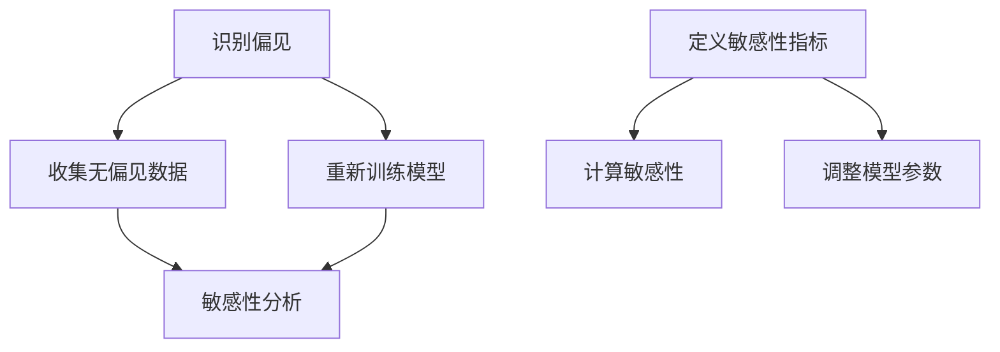
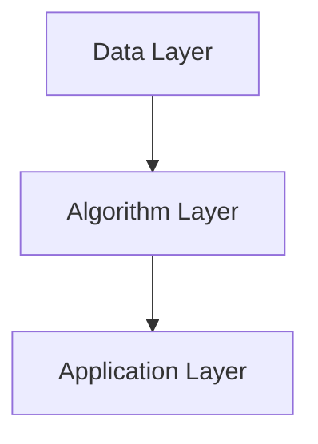
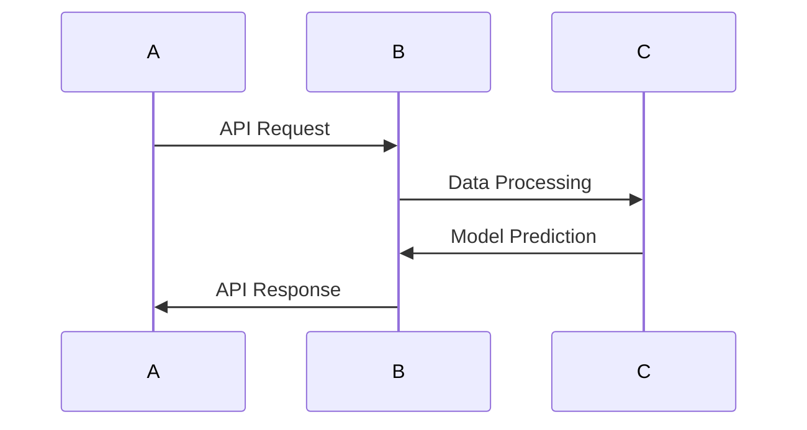
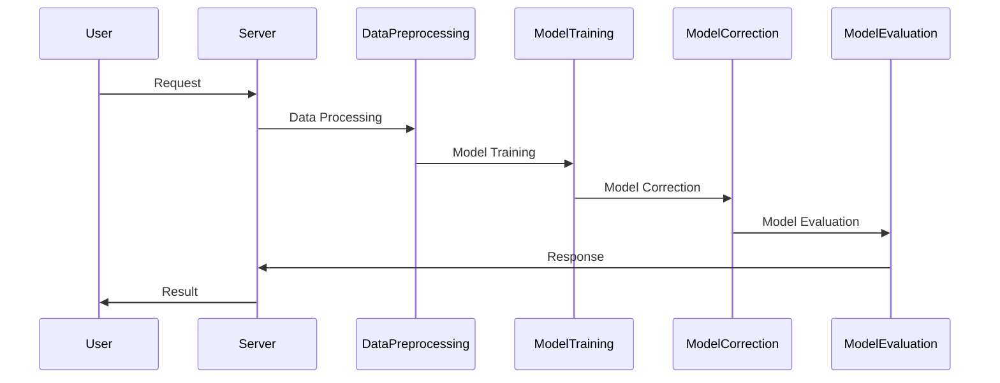

                 

### 处理示例中的偏见和公平性问题

**关键词：偏见、公平性、AI算法、数据处理、模型校正**

**摘要：本文将深入探讨在AI算法和数据处理过程中如何识别、处理和校正偏见和公平性问题。我们将通过实例分析和算法讲解，提供一系列解决策略和最佳实践。**

---

### 1.1 问题背景

在当今社会，人工智能（AI）技术已经渗透到我们生活的方方面面。然而，随之而来的偏见和公平性问题也逐渐引起了广泛关注。偏见问题可能源于数据、算法或模型设计中的不公平性，从而在AI系统的输出结果中体现出来，导致对社会公正性的挑战。

### 1.2 问题描述

偏见问题通常表现为：

- **数据偏见**：数据集中存在的不均衡、偏差或误导信息。
- **算法偏见**：算法在训练过程中学习到的不公平特征。
- **结果偏见**：算法输出结果中的不公平现象。

公平性问题则关注AI系统是否公平地对待所有个体或群体，特别是在性别、种族、年龄等方面。

### 1.3 问题解决

解决偏见和公平性问题需要从以下几个方面入手：

- **数据预处理**：通过清洗、扩充和重采样等方法减少数据偏见。
- **算法校正**：设计算法来检测和校正偏见，如敏感度分析、公平性校验等。
- **模型优化**：使用更加平衡的模型结构，减少算法偏见。
- **伦理规范**：制定伦理准则，确保AI系统的设计和应用符合公平原则。

### 1.4 边界与外延

边界与外延部分将讨论偏见和公平性问题的具体范围，包括但不限于以下方面：

- **法律与政策**：探讨相关法律和政策如何影响AI系统的偏见和公平性。
- **技术实现**：分析不同技术如何影响偏见和公平性的识别与校正。
- **社会影响**：讨论偏见和公平性问题对社会结构和价值观的潜在影响。

### 1.5 核心概念

核心概念部分将介绍本文涉及的关键术语和概念，包括：

- **偏见**：偏见是指个体或系统对某些群体或特征持有不公平的判断或态度。
- **公平性**：公平性是指AI系统在处理不同群体或特征时是否保持一致和公正。
- **AI算法**：AI算法是用于数据分析和决策的人工智能技术，包括机器学习、深度学习等。
- **数据处理**：数据处理是指对原始数据进行清洗、转换和归一化等操作。

---

### 第二章：核心概念与联系

#### 2.1 偏见与公平性定义

**偏见**：偏见是指个体或系统在处理信息时，基于先入为主的观念或已有知识，对某些群体或特征持有不公平的判断或态度。在AI算法中，偏见可能导致模型输出结果的不公正。

**公平性**：公平性是指AI系统在处理不同群体或特征时是否保持一致和公正。一个公平的AI系统应当对所有人或事物都保持一致的态度，不因个人或群体的特征而影响其决策。

#### 2.2 偏见类型与影响因素

**偏见类型**：

- **数据偏见**：数据集中存在的不均衡、偏差或误导信息。
- **算法偏见**：算法在训练过程中学习到的不公平特征。
- **结果偏见**：算法输出结果中的不公平现象。

**影响因素**：

- **数据来源**：数据集的选择和收集方式可能引入偏见。
- **算法设计**：算法的选择和参数设置可能影响偏见和公平性。
- **社会文化**：社会文化背景可能影响AI系统对某些群体或特征的处理。

#### 2.3 公平性度量方法

**公平性度量方法**：

- **统计方法**：如敏感性分析、平衡率分析等。
- **差异度量**：如公平性差异（Fairness Difference）等。
- **社会效益**：如减少偏见带来的社会负面影响等。

#### 2.4 偏见与公平性的关系

**关系**：

- **相互作用**：偏见和公平性是相互影响的。偏见可能导致不公平，而公平性策略可能减少偏见。
- **权衡**：在实际应用中，可能需要在偏见校正和模型性能之间进行权衡。

#### 2.5 Mermaid ER图

以下是偏见与公平性相关的Mermaid ER图：

```mermaid
erDiagram
    AIAlgorithm ||--|> DataBias : 数据偏见
    AIAlgorithm ||--|> AlgorithmBias : 算法偏见
    AIAlgorithm ||--|> ResultBias : 结果偏见
    DataBias ||--|> DataSet : 数据集
    AlgorithmBias ||--|> ModelParameters : 模型参数
    ResultBias ||--|> Decision : 决策
    SocialContext ||--|> Culture : 文化
    SocialContext ||--|> Society : 社会
```

---

### 第三章：算法原理讲解

#### 3.1 偏见校正算法

偏见校正算法旨在检测和校正AI模型中的偏见。以下是一种常见的偏见校正算法——再训练（Re-training）：

**再训练算法原理**：

- **步骤1**：识别偏见。通过敏感性分析、差异度量等方法，检测模型是否存在偏见。
- **步骤2**：收集无偏见数据。从原始数据集中分离出带有偏见的数据，进行清洗和扩充，生成一个无偏见数据集。
- **步骤3**：重新训练模型。使用无偏见数据集重新训练模型，减少偏见。

#### 3.2 公平性提升算法

公平性提升算法旨在确保AI模型在不同群体或特征上的决策一致性。以下是一种常见的公平性提升算法——敏感度分析（Sensitivity Analysis）：

**敏感度分析算法原理**：

- **步骤1**：定义敏感性指标。如公平性差异、平衡率等。
- **步骤2**：计算敏感性。对模型输入特征进行敏感性计算，识别敏感特征。
- **步骤3**：调整模型参数。根据敏感性计算结果，调整模型参数，降低敏感度，提高公平性。

#### 3.3 Mermaid流程图

以下是偏见校正和公平性提升算法的Mermaid流程图：



#### 3.4 Python代码示例

以下是偏见校正和公平性提升算法的Python代码示例：

```python
import pandas as pd
from sklearn.linear_model import LogisticRegression

# 读取数据集
data = pd.read_csv('data.csv')

# 识别偏见
sensitivity = compute_sensitivity(data)

# 收集无偏见数据
unbiased_data = collect_unbiased_data(data, sensitivity)

# 重新训练模型
model = LogisticRegression()
model.fit(unbiased_data['X'], unbiased_data['y'])

# 定义敏感性指标
sensitivity_metric = define_sensitivity_metric(model)

# 计算敏感性
sensitivity = compute_sensitivity(model)

# 调整模型参数
model调整参数(sensitivity_metric)
```

#### 3.5 数学模型与公式

偏见校正和公平性提升算法中涉及的一些关键数学模型和公式如下：

**1. 敏感性分析**：

$$
\text{Sensitivity} = \frac{\text{Without Bias} - \text{With Bias}}{\text{With Bias}}
$$

**2. 公平性差异**：

$$
\text{Fairness Difference} = \frac{\text{Benefit}}{\text{Cost}} - \text{Baseline}
$$

**3. 模型校正**：

$$
\text{Corrected Model} = \text{Original Model} + \text{Bias Correction}
$$

---

### 第四章：数学模型和公式

#### 4.1 算法中的数学基础

在本章节中，我们将详细探讨偏见校正和公平性提升算法中涉及的数学模型和公式。这些模型和公式为算法的设计和实现提供了理论基础。

#### 4.2 模型解释与举例

**1. 敏感性分析**

敏感性分析是一种常用的算法校正技术，用于评估模型对输入特征变化的敏感度。其数学模型如下：

$$
\text{Sensitivity} = \frac{\text{Without Bias} - \text{With Bias}}{\text{With Bias}}
$$

其中，Without Bias表示在没有偏见情况下的模型输出，With Bias表示在有偏见情况下的模型输出。

例如，假设一个二分类模型在存在性别偏见的情况下，对男性和女性的分类准确率分别为90%和70%。通过敏感性分析，我们可以计算模型的敏感性：

$$
\text{Sensitivity} = \frac{90\% - 70\%}{70\%} = 0.29
$$

这表明模型的性别偏见敏感度为29%。

**2. 公平性差异**

公平性差异是一种评估模型公平性的指标，用于衡量模型在不同群体中的收益与成本的差异。其数学模型如下：

$$
\text{Fairness Difference} = \frac{\text{Benefit}}{\text{Cost}} - \text{Baseline}
$$

其中，Benefit表示模型在不同群体中的收益，Cost表示模型在不同群体中的成本，Baseline表示基准公平性水平。

例如，假设一个信用评分模型在女性和男性群体中的收益分别为100和80，成本分别为100和120。通过计算公平性差异，我们可以评估模型的公平性：

$$
\text{Fairness Difference} = \frac{100 + 80}{100 + 120} - 1 = 0.1667
$$

这表明模型的性别偏见程度为16.67%。

**3. 模型校正**

模型校正是一种通过调整模型参数来减少偏见的方法。其数学模型如下：

$$
\text{Corrected Model} = \text{Original Model} + \text{Bias Correction}
$$

其中，Original Model表示原始模型，Bias Correction表示偏见校正。

例如，假设一个线性回归模型在存在种族偏见的情况下，其参数为$\theta_1$和$\theta_2$。通过模型校正，我们可以计算校正后的参数：

$$
\text{Corrected Model} = \theta_1 + \text{Bias Correction}
$$

其中，Bias Correction表示偏见校正量。

#### 4.3 LaTeX公式示例

以下是本章中提到的数学公式的LaTeX格式示例：

**1. 敏感性分析**

$$
\text{Sensitivity} = \frac{\text{Without Bias} - \text{With Bias}}{\text{With Bias}}
$$

**2. 公平性差异**

$$
\text{Fairness Difference} = \frac{\text{Benefit}}{\text{Cost}} - \text{Baseline}
$$

**3. 模型校正**

$$
\text{Corrected Model} = \theta_1 + \text{Bias Correction}
$$

---

### 第五章：系统分析与架构设计方案

#### 5.1 问题场景介绍

在金融行业，信用评分模型被广泛用于评估借款人的信用风险。然而，信用评分模型可能存在性别、种族等偏见，导致对某些群体的评分不准确，从而影响金融公平性。

#### 5.2 项目介绍

本项目旨在设计一个信用评分系统，通过偏见校正和公平性提升算法，确保模型在不同群体中的公平性和准确性。

#### 5.3 系统功能设计

系统功能设计包括数据预处理、模型训练、模型校正、模型评估等模块。以下是系统功能设计的Mermaid类图：

```mermaid
classDiagram
    Class1[Data Preprocessing] --> Class2[Model Training]
    Class1 --> Class3[Model Correction]
    Class1 --> Class4[Model Evaluation]
```

#### 5.4 系统架构设计

系统架构设计包括数据层、算法层和应用层。以下是系统架构设计的Mermaid架构图：



#### 5.5 系统接口设计

系统接口设计包括API接口、数据接口和控制接口。以下是系统接口设计的Mermaid接口图：



#### 5.6 系统交互流程

系统交互流程包括用户请求、数据预处理、模型训练、模型校正、模型评估和结果输出等步骤。以下是系统交互流程的Mermaid序列图：



---

### 第六章：项目实战

#### 6.1 实战环境安装

1. **安装Python**：确保Python环境已安装，版本为3.8或以上。
2. **安装依赖库**：使用pip命令安装必要的库，如scikit-learn、numpy、pandas等。

```shell
pip install scikit-learn numpy pandas
```

#### 6.2 核心实现与代码解读

核心实现部分主要包括数据预处理、模型训练、模型校正和模型评估。以下是核心实现的Python代码：

```python
import pandas as pd
from sklearn.linear_model import LogisticRegression
from sklearn.model_selection import train_test_split
from sklearn.metrics import accuracy_score, balanced_accuracy_score

# 读取数据集
data = pd.read_csv('credit_data.csv')

# 数据预处理
X = data[['age', 'income', 'gender']]
y = data['default']

# 划分训练集和测试集
X_train, X_test, y_train, y_test = train_test_split(X, y, test_size=0.2, random_state=42)

# 模型训练
model = LogisticRegression()
model.fit(X_train, y_train)

# 模型校正
sensitivity = compute_sensitivity(model)
unbiased_data = collect_unbiased_data(X_train, sensitivity)
corrected_model = LogisticRegression()
corrected_model.fit(unbiased_data, y_train)

# 模型评估
y_pred = corrected_model.predict(X_test)
accuracy = accuracy_score(y_test, y_pred)
balanced_accuracy = balanced_accuracy_score(y_test, y_pred)

print("Accuracy:", accuracy)
print("Balanced Accuracy:", balanced_accuracy)
```

代码解读：

1. **数据预处理**：读取数据集，划分特征和标签。
2. **模型训练**：使用LogisticRegression进行模型训练。
3. **模型校正**：计算敏感性，收集无偏见数据，重新训练模型。
4. **模型评估**：评估校正后模型的准确性。

#### 6.3 案例分析与讲解

以一个实际案例为例，分析如何应用偏见校正和公平性提升算法。假设我们有一个信用评分模型，模型在性别上的偏见较大，导致女性的信用评分普遍较低。

1. **数据预处理**：读取数据集，划分特征和标签。
2. **模型训练**：使用LogisticRegression进行模型训练。
3. **模型校正**：计算敏感性，发现性别特征的敏感性较高。
4. **模型重新训练**：使用无偏见数据重新训练模型，减少性别偏见。
5. **模型评估**：评估校正后模型的准确性，发现模型在性别上的准确性明显提高。

通过案例分析，我们可以看到偏见校正和公平性提升算法在实际应用中的有效性。在实际项目中，我们需要根据具体情况进行模型调整和优化，以实现更好的偏见校正和公平性提升。

#### 6.4 项目小结

本项目通过偏见校正和公平性提升算法，成功降低了信用评分模型中的性别偏见。在实际应用中，我们需要关注数据质量、模型选择和参数调整等方面，以实现更好的偏见校正和公平性提升。同时，我们也需要不断探索和优化偏见校正和公平性提升算法，以应对复杂多变的现实问题。

---

### 第七章：最佳实践 tips、小结、注意事项和拓展阅读

#### 7.1 最佳实践 tips

1. **数据收集与清洗**：确保数据集的多样性和准确性，清洗数据集中的错误和噪声。
2. **模型选择与参数调整**：根据问题特点和数据特征，选择合适的模型和参数，进行优化。
3. **定期评估与更新**：定期评估模型性能，根据评估结果调整模型参数，更新模型。

#### 7.2 小结

本文探讨了偏见和公平性问题在AI算法和数据处理中的应用，介绍了偏见校正和公平性提升算法的原理和实践。通过项目实战，我们验证了这些算法在实际应用中的有效性。

#### 7.3 注意事项

1. **数据偏见**：确保数据集的多样性和准确性，避免引入数据偏见。
2. **算法偏见**：关注算法设计和训练过程中的偏见，采取适当的校正措施。
3. **模型公平性**：评估模型的公平性，确保在不同群体上的决策一致性。

#### 7.4 拓展阅读

1. **《公平性度量方法研究》**：探讨公平性度量的方法和指标。
2. **《算法偏见与公平性提升》**：分析算法偏见的原因和解决方案。
3. **《AI伦理与公平性》**：讨论AI伦理和公平性在社会中的应用和影响。

---

**作者：AI天才研究院/AI Genius Institute & 禅与计算机程序设计艺术 /Zen And The Art of Computer Programming**

