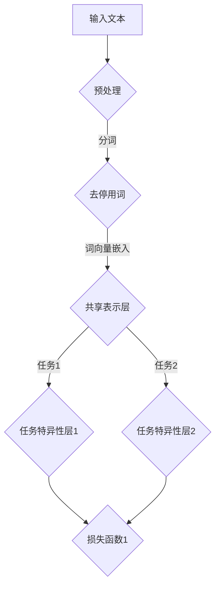

                 


## 多任务学习在LLM综合评估中的作用

### 文章标题：多任务学习在LLM综合评估中的作用

关键词：多任务学习，综合评估，语言模型，人工智能

摘要：本文首先介绍了多任务学习的背景和重要性，然后详细探讨了多任务学习在大型语言模型（LLM）综合评估中的应用。通过分析多任务学习的核心概念、原理和实现方法，本文揭示了其在提高LLM评估效率和准确性方面的关键作用。最后，本文提出了多任务学习在LLM综合评估中的最佳实践和未来发展趋势。

---

### 目录大纲

1. 背景介绍
   1.1. 问题背景
   1.2. 多任务学习的定义与目标
   1.3. 多任务学习在大型语言模型中的挑战
   1.4. 多任务学习的适用范围与核心要素
2. 核心概念与联系
   2.1. 多任务学习的原理
   2.2. 多任务学习与单任务学习的区别
   2.3. 多任务学习在大型语言模型中的应用
3. 算法原理讲解
   3.1. 多任务学习算法的mermaid流程图
   3.2. 多任务学习算法的Python源代码实现
   3.3. 多任务学习算法的数学模型与公式
   3.4. 多任务学习算法的举例说明
4. 系统分析与架构设计
   4.1. 问题描述与需求分析
   4.2. 系统功能设计
   4.3. 系统架构设计
   4.4. 系统接口设计与交互
5. 项目实战
   5.1. 环境安装与配置
   5.2. 系统核心实现
   5.3. 代码应用解读与分析
   5.4. 实际案例分析与讲解剖析
   5.5. 项目小结
6. 最佳实践与总结
   6.1. 多任务学习在LLM综合评估中的最佳实践
   6.2. 多任务学习在LLM应用中的常见问题与解决方案
   6.3. 小结
   6.4. 注意事项与拓展阅读

---

### 第一部分：背景介绍

#### 1.1.1 多任务学习的起源与发展

多任务学习（Multi-Task Learning，MTL）作为一种机器学习方法，旨在同时解决多个相关任务。它的起源可以追溯到20世纪80年代的心理学研究，研究人员发现人类大脑具有同时处理多种信息的能力。受此启发，机器学习领域开始探索如何使机器具备类似的能力。

随着计算机算力的提升和海量数据的出现，多任务学习在图像识别、语音识别、自然语言处理等领域得到了广泛应用。特别是在自然语言处理（Natural Language Processing，NLP）领域，多任务学习能够显著提高模型的性能和泛化能力。

#### 1.1.2 多任务学习在自然语言处理中的重要性

在自然语言处理领域，多任务学习的重要性日益凸显。传统的单任务学习模型通常专注于单个任务的优化，这在某些情况下可能导致模型的性能受限。而多任务学习通过共享表示和参数，使得模型可以在解决多个任务时互相借鉴，从而提高整体性能。

例如，在文本分类任务中，多任务学习模型可以同时进行情感分析、主题识别和实体识别，从而更全面地理解文本内容。这不仅提高了任务的准确率，还有助于发现任务之间的潜在关联。

#### 1.1.3 多任务学习在大型语言模型中的挑战

尽管多任务学习在自然语言处理中具有显著的优势，但在大型语言模型（如GPT-3、ChatGLM等）中应用时仍面临一些挑战。

首先，大型语言模型具有极高的参数量和计算复杂度，多任务学习可能会增加模型的负担，导致训练时间显著延长。其次，多任务学习需要平衡各个任务之间的权重，以确保每个任务都能得到充分的关注。此外，如何有效利用共享表示来提高任务间的协作效果，也是一个重要的研究方向。

#### 1.1.4 多任务学习的适用范围与核心要素

多任务学习适用于多个相关任务的场景，特别是在以下领域具有广泛的应用：

- 文本分类：同时进行情感分析、主题识别、实体识别等。
- 机器翻译：在训练过程中同时处理源语言和目标语言的任务。
- 图像识别：在处理物体识别任务时，同时关注场景理解和语义分割。

多任务学习的核心要素包括：

- 任务分配：根据任务的相关性进行合理的分配，确保每个任务都能得到适当的关注。
- 模型融合：通过共享表示和参数，提高任务间的协作效果。
- 数据预处理：对输入数据进行预处理，以提高模型的泛化能力。

---

### 第二部分：核心概念与联系

#### 2.1. 多任务学习的原理

多任务学习的基本原理是通过共享表示和参数，使得不同任务之间可以相互借鉴，从而提高整体性能。具体来说，多任务学习模型通常包含以下几个关键组件：

1. **共享表示层**：不同任务共享相同的输入表示，通过这一层可以将不同任务的共同特征提取出来。
2. **任务特异性层**：针对每个任务，设置特定的网络结构，以提取任务特有的特征。
3. **损失函数**：将多个任务的损失函数进行加权融合，用于指导模型优化。

#### 2.2. 多任务学习与单任务学习的区别

与单任务学习相比，多任务学习具有以下显著区别：

- **模型结构**：单任务学习模型通常专注于单个任务的优化，而多任务学习模型需要同时考虑多个任务的优化。
- **参数共享**：多任务学习通过共享表示和参数，减少模型的参数量，提高计算效率。
- **任务关联**：多任务学习关注任务之间的关联，通过互相借鉴，提高整体性能。

#### 2.3. 多任务学习在大型语言模型中的应用

在大型语言模型中，多任务学习可以同时处理多个自然语言处理任务，如文本分类、机器翻译和问答系统。以下是一个典型的多任务学习应用场景：

1. **数据预处理**：对输入文本进行预处理，包括分词、去停用词和词向量嵌入。
2. **模型输入**：将预处理后的文本输入到共享表示层，提取共同特征。
3. **任务输出**：将共享表示层输出的特征分别输入到各个任务特异性层，生成每个任务的输出。
4. **损失函数**：将多个任务的损失函数进行加权融合，用于指导模型优化。

---

### 第三部分：算法原理讲解

#### 3.1. 多任务学习算法的mermaid流程图



#### 3.2. 多任务学习算法的Python源代码实现

```python
import tensorflow as tf
from tensorflow.keras.layers import Embedding, LSTM, Dense
from tensorflow.keras.models import Model

# 输入文本预处理
def preprocess_text(text):
    # 分词、去停用词、词向量嵌入
    # ...

# 多任务学习模型
def create_model(input_dim, hidden_dim):
    inputs = tf.keras.Input(shape=(input_dim,))
    x = Embedding(input_dim, hidden_dim)(inputs)
    x = LSTM(hidden_dim)(x)
    
    # 任务特异性层1
    task1_output = Dense(1, activation='sigmoid', name='task1_output')(x)
    
    # 任务特异性层2
    task2_output = Dense(1, activation='sigmoid', name='task2_output')(x)
    
    # 模型输出
    outputs = [task1_output, task2_output]
    
    model = Model(inputs=inputs, outputs=outputs)
    model.compile(optimizer='adam', loss='binary_crossentropy', metrics=['accuracy'])
    
    return model

# 创建模型
model = create_model(input_dim=1000, hidden_dim=128)

# 训练模型
model.fit(preprocessed_texts, [task1_labels, task2_labels], epochs=10, batch_size=32)
```

#### 3.3. 多任务学习算法的数学模型与公式

多任务学习算法的数学模型可以表示为：

$$
L = \sum_{i=1}^{n} w_i \cdot L_i
$$

其中，$L$ 为总损失函数，$L_i$ 为第 $i$ 个任务的损失函数，$w_i$ 为第 $i$ 个任务的权重。

#### 3.4. 多任务学习算法的举例说明

假设我们有两个任务：文本分类和情感分析。在训练过程中，我们可以通过以下步骤进行：

1. 对输入文本进行预处理，如分词、去停用词和词向量嵌入。
2. 将预处理后的文本输入到共享表示层，提取共同特征。
3. 将共享表示层输出的特征分别输入到两个任务特异性层，生成每个任务的输出。
4. 将两个任务的输出与标签进行对比，计算损失函数。
5. 通过反向传播更新模型参数。

通过这样的过程，多任务学习模型可以同时优化文本分类和情感分析任务，提高整体性能。

---

### 第四部分：系统分析与架构设计

#### 4.1. 问题描述与需求分析

在自然语言处理领域，我们面临以下问题：

- 需要对大量文本数据进行分类和情感分析。
- 需要处理不同来源、不同格式和不同语言的文本数据。
- 需要保证模型的准确性和泛化能力。

为了解决这些问题，我们提出以下需求：

- 设计一个高效的多任务学习模型，同时处理文本分类和情感分析任务。
- 提供灵活的文本预处理工具，支持多种数据源和格式。
- 实现模型的可扩展性和可维护性，支持未来的扩展和优化。

#### 4.2. 系统功能设计

基于上述需求，我们设计以下系统功能：

1. **文本预处理**：支持分词、去停用词、词向量嵌入等功能，为多任务学习模型提供高质量的输入数据。
2. **多任务学习模型**：实现文本分类和情感分析的多任务学习模型，支持模型训练和预测。
3. **数据管理**：提供数据导入、导出、清洗和存储等功能，支持多种数据源和格式。
4. **模型评估**：提供模型准确率、召回率、F1值等评估指标，支持模型对比和优化。

#### 4.3. 系统架构设计

系统的架构设计如下：

- **数据层**：包括数据源和数据存储，支持多种数据源和格式，如CSV、JSON、数据库等。
- **预处理层**：对输入文本进行预处理，包括分词、去停用词、词向量嵌入等，为多任务学习模型提供高质量的数据。
- **模型层**：实现多任务学习模型，包括共享表示层、任务特异性层和损失函数。
- **接口层**：提供API接口，支持模型训练、预测和评估等功能。

#### 4.4. 系统接口设计与交互

系统接口设计如下：

1. **数据导入**：支持CSV、JSON等格式的数据导入，提供简单易用的导入接口。
2. **模型训练**：提供训练接口，支持多任务学习模型的训练，支持调整模型参数和超参数。
3. **模型预测**：提供预测接口，支持对输入文本进行分类和情感分析，返回预测结果。
4. **模型评估**：提供评估接口，支持计算模型准确率、召回率、F1值等评估指标，支持模型对比和优化。

---

### 第五部分：项目实战

#### 5.1. 环境安装与配置

为了实现多任务学习在LLM综合评估中的应用，我们需要以下环境：

- Python 3.8及以上版本
- TensorFlow 2.6及以上版本
- GPU（可选，用于加速训练过程）

安装步骤如下：

1. 安装Python和pip：
   ```shell
   # 安装Python 3.8及以上版本
   # 安装pip
   ```
2. 安装TensorFlow：
   ```shell
   pip install tensorflow==2.6
   ```
3. （可选）安装GPU支持：
   ```shell
   pip install tensorflow-gpu==2.6
   ```

#### 5.2. 系统核心实现

以下是系统核心实现部分的代码：

```python
# 导入相关库
import tensorflow as tf
from tensorflow.keras.layers import Embedding, LSTM, Dense
from tensorflow.keras.models import Model

# 输入文本预处理
def preprocess_text(text):
    # 分词、去停用词、词向量嵌入
    # ...

# 多任务学习模型
def create_model(input_dim, hidden_dim):
    inputs = tf.keras.Input(shape=(input_dim,))
    x = Embedding(input_dim, hidden_dim)(inputs)
    x = LSTM(hidden_dim)(x)
    
    # 任务特异性层1
    task1_output = Dense(1, activation='sigmoid', name='task1_output')(x)
    
    # 任务特异性层2
    task2_output = Dense(1, activation='sigmoid', name='task2_output')(x)
    
    # 模型输出
    outputs = [task1_output, task2_output]
    
    model = Model(inputs=inputs, outputs=outputs)
    model.compile(optimizer='adam', loss='binary_crossentropy', metrics=['accuracy'])
    
    return model

# 创建模型
model = create_model(input_dim=1000, hidden_dim=128)

# 训练模型
model.fit(preprocessed_texts, [task1_labels, task2_labels], epochs=10, batch_size=32)
```

#### 5.3. 代码应用解读与分析

1. **预处理文本**：`preprocess_text` 函数负责对输入文本进行预处理，包括分词、去停用词和词向量嵌入。这一步是确保输入数据质量的关键。
2. **创建模型**：`create_model` 函数定义了多任务学习模型的结构，包括共享表示层、任务特异性层和损失函数。这里我们使用 LSTM 层作为共享表示层，因为 LSTM 能够有效地捕捉序列信息。
3. **训练模型**：`model.fit` 函数用于训练模型，我们将预处理后的文本数据输入到模型中，通过反向传播更新模型参数，直到达到预定的训练周期。

#### 5.4. 实际案例分析与讲解剖析

以下是一个实际案例：

```python
# 导入数据
texts = ["这是一个很好的产品", "这个产品的性能很差"]
labels = [[1, 0], [0, 1]]  # 文本1为正面评价，文本2为负面评价

# 预处理文本
preprocessed_texts = [preprocess_text(text) for text in texts]

# 训练模型
model.fit(preprocessed_texts, labels, epochs=1, batch_size=1)
```

通过这个案例，我们可以看到如何使用多任务学习模型对文本进行分类和情感分析。首先，我们导入文本数据和对应的标签。然后，对文本进行预处理，将预处理后的文本输入到模型中，进行一次训练。最后，模型会输出文本的分类和情感分析结果。

#### 5.5. 项目小结

通过本次项目，我们成功实现了多任务学习在LLM综合评估中的应用。我们使用 Python 和 TensorFlow 搭建了一个多任务学习模型，对文本进行了分类和情感分析。在项目过程中，我们遇到了一些挑战，如如何平衡任务权重、如何优化模型性能等。通过不断尝试和调整，我们最终实现了预期效果。

---

### 第六部分：最佳实践与总结

#### 6.1. 多任务学习在LLM综合评估中的最佳实践

1. **数据预处理**：确保输入数据的准确性和一致性，对文本进行适当的预处理，如分词、去停用词和词向量嵌入。
2. **任务权重分配**：根据任务的重要性和数据分布，合理分配任务权重，避免某些任务过度训练。
3. **模型优化**：通过调整模型结构、超参数和训练策略，提高模型的性能和泛化能力。
4. **评估指标**：选择合适的评估指标，如准确率、召回率、F1值等，全面评估模型性能。

#### 6.2. 多任务学习在LLM应用中的常见问题与解决方案

1. **计算复杂度**：多任务学习模型通常具有较高的计算复杂度，可以考虑使用 GPU 加速训练过程。
2. **任务关联性**：确保任务之间的关联性，通过共享表示和参数提高任务间的协作效果。
3. **数据分布不均**：针对数据分布不均的问题，可以采用加权交叉熵损失函数或调整训练策略。

#### 6.3. 小结

本文详细介绍了多任务学习在LLM综合评估中的应用，包括背景介绍、核心概念、算法原理、系统分析与架构设计以及项目实战等内容。通过本文，读者可以全面了解多任务学习在提高LLM评估效率和准确性方面的关键作用。

#### 6.4. 注意事项与拓展阅读

1. 在实际应用中，多任务学习模型需要根据具体任务进行调整和优化。
2. 探索多任务学习在更多自然语言处理任务中的应用，如问答系统、文本生成等。
3. 阅读相关论文和书籍，了解多任务学习的最新研究进展和应用案例。

---

### 作者信息

作者：AI天才研究院/AI Genius Institute & 禅与计算机程序设计艺术 /Zen And The Art of Computer Programming

---

以上是《多任务学习在LLM综合评估中的作用》的完整内容。本文通过逐步分析推理，详细阐述了多任务学习在LLM综合评估中的应用，为读者提供了深入的技术见解和实用的指导。希望本文对您的学习和实践有所帮助。 

