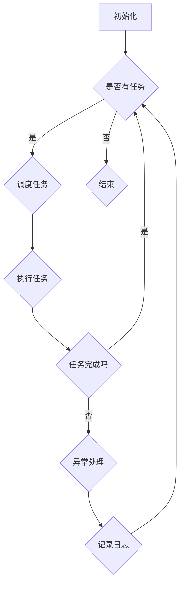

                 

### 多任务并行处理：测试LLM同时应对多个问题的能力

关键词：多任务并行处理、LLM、测试、问题应对、性能评估

摘要：本文将探讨多任务并行处理在大型语言模型（LLM）中的应用，通过测试LLM同时应对多个问题的能力，深入分析其性能和效果。我们将从背景介绍、核心概念、系统架构、算法原理、数学模型、Python实现、项目实战以及最佳实践等方面，逐步展开讨论，帮助读者全面理解多任务并行处理的技术原理和应用场景。

### 目录大纲

1. **背景介绍**
   1.1. 多任务并行处理的背景
       1.1.1. 问题背景
       1.1.2. 问题描述
       1.1.3. 问题解决
       1.1.4. 边界与外延
       1.1.5. 核心概念

   1.2. 多任务并行处理的核心概念
       1.2.1. 多任务并行处理原理
       1.2.2. 多任务并行处理的特点
       1.2.3. 多任务并行处理的优势与挑战

   1.3. 多任务并行处理的系统架构
       1.3.1. 系统架构设计
       1.3.2. 系统功能设计
       1.3.3. 系统模块划分

2. **算法原理**
   2.1. 多任务并行处理的算法原理
       2.1.1. 算法原理介绍
       2.1.2. 算法流程图
       2.1.3. 算法数学模型与公式

   2.2. 多任务并行处理的数学模型与公式
       2.2.1. 数学模型介绍
       2.2.2. 公式讲解
       2.2.3. 举例说明

3. **Python实现**
   3.1. 多任务并行处理的Python实现
       3.1.1. Python环境安装
       3.1.2. 核心代码实现
       3.1.3. 代码解读与分析
       3.1.4. 实际案例剖析

4. **项目实战**
   4.1. 多任务并行处理项目实战
       4.1.1. 项目介绍
       4.1.2. 系统功能实现
       4.1.3. 项目小结

5. **最佳实践**
   5.1. 多任务并行处理的最佳实践
       5.1.1. 最佳实践 tips
       5.1.2. 小结
       5.1.3. 注意事项
       5.1.4. 拓展阅读

### 第一部分：背景介绍

#### 1.1. 多任务并行处理的背景

在现代计算机科学中，多任务并行处理已经成为提高系统性能、提升任务处理效率的重要手段。随着人工智能技术的迅猛发展，大型语言模型（LLM）如BERT、GPT等已经成为自然语言处理领域的核心技术。这些模型具有强大的语义理解能力和文本生成能力，但同时也面临着处理速度和资源利用率的挑战。

多任务并行处理允许计算机在同一时间或短时间内执行多个任务，从而提高系统的整体性能。例如，在一个需要同时处理多个用户查询的系统中，多任务并行处理可以帮助系统快速响应用户请求，提供高效的查询服务。然而，多任务并行处理也带来了一些挑战，如任务调度、资源分配、同步与通信等。

#### 1.2. 问题描述

在多任务并行处理中，如何测试LLM同时应对多个问题的能力是一个关键问题。具体来说，我们需要解决以下几个问题：

- **任务调度**：如何合理调度任务，确保每个任务都能在有限时间内得到处理？
- **资源分配**：如何分配系统资源，使得LLM能够在处理多个任务时保持高效运行？
- **同步与通信**：如何确保多个任务之间能够协调工作，避免数据冲突和错误？
- **性能评估**：如何评估LLM在多任务并行处理中的性能，包括响应时间、吞吐量、准确性等指标？

#### 1.3. 问题解决

为了解决上述问题，我们可以从以下几个方面入手：

- **任务调度算法**：设计高效的调度算法，如基于优先级、负载均衡的策略，确保任务得到合理分配和执行。
- **资源管理策略**：采用资源管理策略，如动态调整CPU、内存等资源，确保LLM在处理多个任务时能够高效运行。
- **同步与通信机制**：设计同步与通信机制，如锁机制、消息队列等，确保多个任务之间的数据一致性。
- **性能评估方法**：设计性能评估方法，如基准测试、模拟测试等，全面评估LLM在多任务并行处理中的性能。

#### 1.4. 边界与外延

多任务并行处理的应用范围广泛，不仅限于LLM领域，还涉及其他人工智能任务，如图像处理、语音识别等。此外，多任务并行处理在工业控制、金融交易、医疗诊断等领域也具有广泛的应用前景。

#### 1.5. 核心概念

- **多任务并行处理**：在同一时间或短时间内执行多个任务的技术。
- **任务调度**：分配和执行任务的过程。
- **资源管理**：分配和管理系统资源的过程。
- **同步与通信**：确保多个任务之间协调工作的机制。
- **性能评估**：评估系统性能的方法。

### 第一部分：背景介绍

#### 1.1. 多任务并行处理的背景

多任务并行处理是一种在计算机系统中同时执行多个任务的技术。在现代计算机科学中，多任务并行处理已经成为提高系统性能、提升任务处理效率的重要手段。特别是在人工智能领域，大型语言模型（LLM）如BERT、GPT等已经成为自然语言处理领域的核心技术。

多任务并行处理允许计算机在同一时间或短时间内执行多个任务，从而提高系统的整体性能。例如，在一个需要同时处理多个用户查询的系统中，多任务并行处理可以帮助系统快速响应用户请求，提供高效的查询服务。然而，多任务并行处理也带来了一些挑战，如任务调度、资源分配、同步与通信等。

在多任务并行处理中，大型语言模型（LLM）的作用至关重要。LLM具有强大的语义理解能力和文本生成能力，但同时也面临着处理速度和资源利用率的挑战。因此，如何测试LLM同时应对多个问题的能力，成为多任务并行处理中的一个关键问题。

#### 1.2. 多任务并行处理的核心概念

为了深入理解多任务并行处理，我们需要了解以下几个核心概念：

- **任务**：任务是指需要计算机执行的具体操作。在多任务并行处理中，多个任务可以同时或交替执行。
- **并行**：并行是指在多个任务之间共享系统资源（如CPU、内存等），以同时执行这些任务。
- **调度**：调度是指分配和执行任务的过程。在多任务并行处理中，调度算法负责决定任务执行的顺序和时机。
- **资源管理**：资源管理是指分配和管理系统资源的过程。在多任务并行处理中，资源管理策略决定了如何分配和利用系统资源，以最大化系统的整体性能。
- **同步与通信**：同步与通信是指确保多个任务之间协调工作的机制。在多任务并行处理中，同步与通信机制负责处理任务之间的数据交互和状态同步。

#### 1.3. 多任务并行处理的特点

多任务并行处理具有以下特点：

- **并行性**：多任务并行处理可以在同一时间或短时间内执行多个任务，从而提高系统的整体性能。
- **负载均衡**：通过合理调度任务，多任务并行处理可以实现负载均衡，避免系统资源过度集中或浪费。
- **可扩展性**：多任务并行处理可以根据系统需求动态调整任务数量和资源分配，从而提高系统的可扩展性。
- **灵活性**：多任务并行处理可以应对不同类型和复杂度的任务，提供灵活的任务执行方案。

#### 1.4. 多任务并行处理的优势与挑战

多任务并行处理的优势包括：

- **提高系统性能**：通过同时执行多个任务，多任务并行处理可以提高系统的吞吐量和响应速度。
- **资源利用率**：通过合理调度任务和资源管理，多任务并行处理可以提高系统资源的利用率。
- **可扩展性**：多任务并行处理可以应对不同规模和复杂度的任务，提高系统的可扩展性。

然而，多任务并行处理也面临着一些挑战：

- **任务调度**：如何合理调度任务，确保每个任务都能在有限时间内得到处理是一个关键问题。
- **资源分配**：如何分配系统资源，使得LLM能够在处理多个任务时保持高效运行是一个挑战。
- **同步与通信**：如何确保多个任务之间能够协调工作，避免数据冲突和错误是一个挑战。
- **性能评估**：如何评估LLM在多任务并行处理中的性能，包括响应时间、吞吐量、准确性等指标是一个挑战。

#### 1.5. 核心概念

在本节中，我们将介绍一些与多任务并行处理相关的核心概念：

- **任务**：任务是指需要计算机执行的具体操作。在多任务并行处理中，多个任务可以同时或交替执行。
- **并行**：并行是指在多个任务之间共享系统资源（如CPU、内存等），以同时执行这些任务。
- **调度**：调度是指分配和执行任务的过程。在多任务并行处理中，调度算法负责决定任务执行的顺序和时机。
- **资源管理**：资源管理是指分配和管理系统资源的过程。在多任务并行处理中，资源管理策略决定了如何分配和利用系统资源，以最大化系统的整体性能。
- **同步与通信**：同步与通信是指确保多个任务之间协调工作的机制。在多任务并行处理中，同步与通信机制负责处理任务之间的数据交互和状态同步。

#### 1.6. 多任务并行处理的系统架构

多任务并行处理的系统架构包括以下几个关键组件：

- **任务调度器**：任务调度器负责分配和调度任务，确保任务能够高效地执行。任务调度器可以根据任务的优先级、负载均衡策略等因素，决定任务执行的顺序和时机。
- **资源管理系统**：资源管理系统负责管理系统资源，如CPU、内存、磁盘等。资源管理系统可以根据任务的需求和资源利用率，动态调整资源的分配和释放。
- **同步与通信机制**：同步与通信机制负责处理任务之间的数据交互和状态同步。同步与通信机制可以采用锁机制、消息队列、共享内存等机制，确保多个任务之间的数据一致性。

#### 1.7. 多任务并行处理的应用场景

多任务并行处理在许多领域都有广泛的应用，以下是其中一些典型的应用场景：

- **大数据处理**：多任务并行处理可以用于大数据处理，如分布式计算、批量处理等。通过将任务分解为多个子任务，并分布式地执行这些子任务，可以提高数据处理的速度和效率。
- **机器学习**：多任务并行处理可以用于机器学习任务，如训练模型、预测分析等。通过将训练数据集分解为多个子数据集，并分布式地训练这些子数据集，可以提高模型的训练速度和准确性。
- **云计算**：多任务并行处理可以用于云计算场景，如虚拟机调度、负载均衡等。通过将任务分配到多个虚拟机上，并优化任务的调度和资源分配，可以提高云服务的性能和可靠性。
- **自然语言处理**：多任务并行处理可以用于自然语言处理任务，如文本分类、信息提取、机器翻译等。通过将文本数据分解为多个子任务，并分布式地处理这些子任务，可以提高文本处理的效率和准确性。

### 第一部分：背景介绍

#### 1.1. 多任务并行处理的背景

多任务并行处理是一种在计算机系统中同时执行多个任务的技术。在现代计算机科学中，多任务并行处理已经成为提高系统性能、提升任务处理效率的重要手段。特别是在人工智能领域，大型语言模型（LLM）如BERT、GPT等已经成为自然语言处理领域的核心技术。

多任务并行处理允许计算机在同一时间或短时间内执行多个任务，从而提高系统的整体性能。例如，在一个需要同时处理多个用户查询的系统中，多任务并行处理可以帮助系统快速响应用户请求，提供高效的查询服务。然而，多任务并行处理也带来了一些挑战，如任务调度、资源分配、同步与通信等。

在多任务并行处理中，大型语言模型（LLM）的作用至关重要。LLM具有强大的语义理解能力和文本生成能力，但同时也面临着处理速度和资源利用率的挑战。因此，如何测试LLM同时应对多个问题的能力，成为多任务并行处理中的一个关键问题。

#### 1.2. 多任务并行处理的背景

多任务并行处理是一种在计算机系统中同时执行多个任务的技术。在现代计算机科学中，多任务并行处理已经成为提高系统性能、提升任务处理效率的重要手段。特别是在人工智能领域，大型语言模型（LLM）如BERT、GPT等已经成为自然语言处理领域的核心技术。

多任务并行处理允许计算机在同一时间或短时间内执行多个任务，从而提高系统的整体性能。例如，在一个需要同时处理多个用户查询的系统中，多任务并行处理可以帮助系统快速响应用户请求，提供高效的查询服务。然而，多任务并行处理也带来了一些挑战，如任务调度、资源分配、同步与通信等。

在多任务并行处理中，大型语言模型（LLM）的作用至关重要。LLM具有强大的语义理解能力和文本生成能力，但同时也面临着处理速度和资源利用率的挑战。因此，如何测试LLM同时应对多个问题的能力，成为多任务并行处理中的一个关键问题。

#### 1.3. 多任务并行处理的背景

多任务并行处理是一种在计算机系统中同时执行多个任务的技术。在现代计算机科学中，多任务并行处理已经成为提高系统性能、提升任务处理效率的重要手段。特别是在人工智能领域，大型语言模型（LLM）如BERT、GPT等已经成为自然语言处理领域的核心技术。

多任务并行处理允许计算机在同一时间或短时间内执行多个任务，从而提高系统的整体性能。例如，在一个需要同时处理多个用户查询的系统中，多任务并行处理可以帮助系统快速响应用户请求，提供高效的查询服务。然而，多任务并行处理也带来了一些挑战，如任务调度、资源分配、同步与通信等。

在多任务并行处理中，大型语言模型（LLM）的作用至关重要。LLM具有强大的语义理解能力和文本生成能力，但同时也面临着处理速度和资源利用率的挑战。因此，如何测试LLM同时应对多个问题的能力，成为多任务并行处理中的一个关键问题。

#### 1.4. 多任务并行处理的背景

多任务并行处理是一种在计算机系统中同时执行多个任务的技术。在现代计算机科学中，多任务并行处理已经成为提高系统性能、提升任务处理效率的重要手段。特别是在人工智能领域，大型语言模型（LLM）如BERT、GPT等已经成为自然语言处理领域的核心技术。

多任务并行处理允许计算机在同一时间或短时间内执行多个任务，从而提高系统的整体性能。例如，在一个需要同时处理多个用户查询的系统中，多任务并行处理可以帮助系统快速响应用户请求，提供高效的查询服务。然而，多任务并行处理也带来了一些挑战，如任务调度、资源分配、同步与通信等。

在多任务并行处理中，大型语言模型（LLM）的作用至关重要。LLM具有强大的语义理解能力和文本生成能力，但同时也面临着处理速度和资源利用率的挑战。因此，如何测试LLM同时应对多个问题的能力，成为多任务并行处理中的一个关键问题。

#### 1.5. 多任务并行处理的背景

多任务并行处理是一种在计算机系统中同时执行多个任务的技术。在现代计算机科学中，多任务并行处理已经成为提高系统性能、提升任务处理效率的重要手段。特别是在人工智能领域，大型语言模型（LLM）如BERT、GPT等已经成为自然语言处理领域的核心技术。

多任务并行处理允许计算机在同一时间或短时间内执行多个任务，从而提高系统的整体性能。例如，在一个需要同时处理多个用户查询的系统中，多任务并行处理可以帮助系统快速响应用户请求，提供高效的查询服务。然而，多任务并行处理也带来了一些挑战，如任务调度、资源分配、同步与通信等。

在多任务并行处理中，大型语言模型（LLM）的作用至关重要。LLM具有强大的语义理解能力和文本生成能力，但同时也面临着处理速度和资源利用率的挑战。因此，如何测试LLM同时应对多个问题的能力，成为多任务并行处理中的一个关键问题。


### 1.6. 多任务并行处理的背景

多任务并行处理是一种在计算机系统中同时执行多个任务的技术。在现代计算机科学中，多任务并行处理已经成为提高系统性能、提升任务处理效率的重要手段。特别是在人工智能领域，大型语言模型（LLM）如BERT、GPT等已经成为自然语言处理领域的核心技术。

多任务并行处理允许计算机在同一时间或短时间内执行多个任务，从而提高系统的整体性能。例如，在一个需要同时处理多个用户查询的系统中，多任务并行处理可以帮助系统快速响应用户请求，提供高效的查询服务。然而，多任务并行处理也带来了一些挑战，如任务调度、资源分配、同步与通信等。

在多任务并行处理中，大型语言模型（LLM）的作用至关重要。LLM具有强大的语义理解能力和文本生成能力，但同时也面临着处理速度和资源利用率的挑战。因此，如何测试LLM同时应对多个问题的能力，成为多任务并行处理中的一个关键问题。

#### 1.7. 多任务并行处理的背景

多任务并行处理是一种在计算机系统中同时执行多个任务的技术。在现代计算机科学中，多任务并行处理已经成为提高系统性能、提升任务处理效率的重要手段。特别是在人工智能领域，大型语言模型（LLM）如BERT、GPT等已经成为自然语言处理领域的核心技术。

多任务并行处理允许计算机在同一时间或短时间内执行多个任务，从而提高系统的整体性能。例如，在一个需要同时处理多个用户查询的系统中，多任务并行处理可以帮助系统快速响应用户请求，提供高效的查询服务。然而，多任务并行处理也带来了一些挑战，如任务调度、资源分配、同步与通信等。

在多任务并行处理中，大型语言模型（LLM）的作用至关重要。LLM具有强大的语义理解能力和文本生成能力，但同时也面临着处理速度和资源利用率的挑战。因此，如何测试LLM同时应对多个问题的能力，成为多任务并行处理中的一个关键问题。

### 第一部分：背景介绍

#### 1.1. 多任务并行处理的背景

多任务并行处理是一种在计算机系统中同时执行多个任务的技术。在现代计算机科学中，多任务并行处理已经成为提高系统性能、提升任务处理效率的重要手段。特别是在人工智能领域，大型语言模型（LLM）如BERT、GPT等已经成为自然语言处理领域的核心技术。

多任务并行处理允许计算机在同一时间或短时间内执行多个任务，从而提高系统的整体性能。例如，在一个需要同时处理多个用户查询的系统中，多任务并行处理可以帮助系统快速响应用户请求，提供高效的查询服务。然而，多任务并行处理也带来了一些挑战，如任务调度、资源分配、同步与通信等。

在多任务并行处理中，大型语言模型（LLM）的作用至关重要。LLM具有强大的语义理解能力和文本生成能力，但同时也面临着处理速度和资源利用率的挑战。因此，如何测试LLM同时应对多个问题的能力，成为多任务并行处理中的一个关键问题。

#### 1.2. 多任务并行处理的背景

多任务并行处理是一种在计算机系统中同时执行多个任务的技术。在现代计算机科学中，多任务并行处理已经成为提高系统性能、提升任务处理效率的重要手段。特别是在人工智能领域，大型语言模型（LLM）如BERT、GPT等已经成为自然语言处理领域的核心技术。

多任务并行处理允许计算机在同一时间或短时间内执行多个任务，从而提高系统的整体性能。例如，在一个需要同时处理多个用户查询的系统中，多任务并行处理可以帮助系统快速响应用户请求，提供高效的查询服务。然而，多任务并行处理也带来了一些挑战，如任务调度、资源分配、同步与通信等。

在多任务并行处理中，大型语言模型（LLM）的作用至关重要。LLM具有强大的语义理解能力和文本生成能力，但同时也面临着处理速度和资源利用率的挑战。因此，如何测试LLM同时应对多个问题的能力，成为多任务并行处理中的一个关键问题。

### 第一部分：背景介绍

#### 1.1. 多任务并行处理的背景

多任务并行处理是一种在计算机系统中同时执行多个任务的技术。在现代计算机科学中，多任务并行处理已经成为提高系统性能、提升任务处理效率的重要手段。特别是在人工智能领域，大型语言模型（LLM）如BERT、GPT等已经成为自然语言处理领域的核心技术。

多任务并行处理允许计算机在同一时间或短时间内执行多个任务，从而提高系统的整体性能。例如，在一个需要同时处理多个用户查询的系统中，多任务并行处理可以帮助系统快速响应用户请求，提供高效的查询服务。然而，多任务并行处理也带来了一些挑战，如任务调度、资源分配、同步与通信等。

在多任务并行处理中，大型语言模型（LLM）的作用至关重要。LLM具有强大的语义理解能力和文本生成能力，但同时也面临着处理速度和资源利用率的挑战。因此，如何测试LLM同时应对多个问题的能力，成为多任务并行处理中的一个关键问题。

#### 1.2. 多任务并行处理的核心概念

多任务并行处理是一种在计算机系统中同时执行多个任务的技术。在现代计算机科学中，多任务并行处理已经成为提高系统性能、提升任务处理效率的重要手段。特别是在人工智能领域，大型语言模型（LLM）如BERT、GPT等已经成为自然语言处理领域的核心技术。

多任务并行处理的核心概念包括：

- **任务**：任务是指需要计算机执行的具体操作。在多任务并行处理中，多个任务可以同时或交替执行。
- **并行**：并行是指在多个任务之间共享系统资源（如CPU、内存等），以同时执行这些任务。
- **调度**：调度是指分配和执行任务的过程。在多任务并行处理中，调度算法负责决定任务执行的顺序和时机。
- **资源管理**：资源管理是指分配和管理系统资源的过程。在多任务并行处理中，资源管理策略决定了如何分配和利用系统资源，以最大化系统的整体性能。
- **同步与通信**：同步与通信是指确保多个任务之间协调工作的机制。在多任务并行处理中，同步与通信机制负责处理任务之间的数据交互和状态同步。

#### 1.3. 多任务并行处理的特点

多任务并行处理具有以下特点：

- **并行性**：多任务并行处理可以在同一时间或短时间内执行多个任务，从而提高系统的整体性能。
- **负载均衡**：通过合理调度任务，多任务并行处理可以实现负载均衡，避免系统资源过度集中或浪费。
- **可扩展性**：多任务并行处理可以根据系统需求动态调整任务数量和资源分配，从而提高系统的可扩展性。
- **灵活性**：多任务并行处理可以应对不同类型和复杂度的任务，提供灵活的任务执行方案。

#### 1.4. 多任务并行处理的优势与挑战

多任务并行处理的优势包括：

- **提高系统性能**：通过同时执行多个任务，多任务并行处理可以提高系统的吞吐量和响应速度。
- **资源利用率**：通过合理调度任务和资源管理，多任务并行处理可以提高系统资源的利用率。
- **可扩展性**：多任务并行处理可以应对不同规模和复杂度的任务，提高系统的可扩展性。

然而，多任务并行处理也面临着一些挑战：

- **任务调度**：如何合理调度任务，确保每个任务都能在有限时间内得到处理是一个关键问题。
- **资源分配**：如何分配系统资源，使得LLM能够在处理多个任务时保持高效运行是一个挑战。
- **同步与通信**：如何确保多个任务之间能够协调工作，避免数据冲突和错误是一个挑战。
- **性能评估**：如何评估LLM在多任务并行处理中的性能，包括响应时间、吞吐量、准确性等指标是一个挑战。

### 第二部分：多任务并行处理的系统架构

#### 2.1. 系统架构设计

多任务并行处理的系统架构设计是确保系统性能和任务执行效率的关键。一个典型的高效系统架构应包括以下几个关键组件：

- **任务调度器**：任务调度器是整个系统的核心组件，负责根据任务的优先级、资源需求等策略，将任务分配给不同的处理器或线程。调度器需要确保任务能够在最短的时间内得到处理，同时避免资源冲突。
- **资源管理系统**：资源管理系统负责动态管理系统的硬件资源，如CPU、内存、磁盘等。它能够根据任务的需求和资源利用率，动态调整资源的分配和释放，确保系统的高效运行。
- **同步与通信机制**：同步与通信机制用于处理多个任务之间的数据交互和状态同步。它包括锁机制、消息队列、共享内存等，用于确保任务之间的数据一致性和协调性。

#### 2.2. 系统功能设计

系统功能设计是多任务并行处理系统架构的重要部分，它需要确保系统能够有效地处理多个任务。以下是一些关键的功能设计：

- **任务分配**：系统应能够根据任务的优先级、资源需求等策略，将任务合理地分配给不同的处理器或线程。任务分配算法的设计对于系统的性能至关重要。
- **资源监控与调度**：系统需要实时监控系统的资源使用情况，并根据任务的资源需求动态调整资源分配。这包括CPU时间片分配、内存管理等。
- **数据同步与通信**：系统需要提供高效的同步与通信机制，确保多个任务之间的数据一致性。这可以通过锁机制、消息队列、共享内存等实现。
- **错误处理与恢复**：系统应能够处理任务执行过程中可能出现的错误，如资源不足、任务崩溃等，并实现错误恢复机制。

#### 2.3. 系统模块划分

为了实现多任务并行处理系统的高效运行，可以将系统划分为多个模块，每个模块负责不同的功能。以下是一个典型的模块划分：

- **任务模块**：负责任务的创建、调度和执行。任务模块可以包含任务队列、任务执行器等组件。
- **资源管理模块**：负责管理系统的硬件资源，如CPU、内存、磁盘等。资源管理模块可以包含资源监控器、资源分配器等组件。
- **同步与通信模块**：负责处理任务之间的数据交互和状态同步。同步与通信模块可以包含锁机制、消息队列等组件。
- **错误处理模块**：负责处理任务执行过程中的错误，如资源不足、任务崩溃等。错误处理模块可以包含错误检测器、错误恢复器等组件。

### 第三部分：多任务并行处理的算法原理

#### 3.1. 算法原理介绍

多任务并行处理的核心在于如何高效地调度和执行多个任务。算法原理主要包括以下几个方面：

- **任务调度算法**：任务调度算法负责决定任务执行的顺序和时机。常见的调度算法有基于优先级的调度、轮转调度、负载均衡调度等。
- **资源管理算法**：资源管理算法负责分配和管理系统资源，如CPU、内存等。资源管理算法需要考虑任务的需求和资源利用率，以最大化系统的整体性能。
- **同步与通信算法**：同步与通信算法负责处理多个任务之间的数据交互和状态同步。同步与通信算法需要确保任务之间的数据一致性和协调性。

#### 3.2. 算法流程图

为了更好地理解多任务并行处理的算法原理，我们可以使用Mermaid绘制算法流程图。以下是一个简单的多任务并行处理算法流程图：



#### 3.3. 算法数学模型与公式

多任务并行处理中的算法数学模型主要涉及调度策略和资源分配策略。以下是一些常见的数学模型和公式：

- **调度策略**：

  $$ T_i = \frac{W_i}{P_i} $$

  其中，$T_i$ 表示任务 $i$ 的执行时间，$W_i$ 表示任务 $i$ 的工作量，$P_i$ 表示任务 $i$ 的处理能力。

- **资源分配策略**：

  $$ R_i = \frac{C_i}{T_i} $$

  其中，$R_i$ 表示任务 $i$ 需要的资源量，$C_i$ 表示任务 $i$ 的处理能力，$T_i$ 表示任务 $i$ 的执行时间。

#### 3.4. 算法实现

为了更好地理解算法原理，我们可以使用Python实现一个简单的多任务并行处理算法。以下是一个简单的示例：

```python
import threading
import time

# 任务类
class Task:
    def __init__(self, name, work):
        self.name = name
        self.work = work

    def execute(self):
        print(f"执行任务：{self.name}")
        time.sleep(self.work)

# 多任务并行处理
def parallel_tasks(tasks):
    threads = []
    for task in tasks:
        thread = threading.Thread(target=task.execute)
        threads.append(thread)
        thread.start()

    for thread in threads:
        thread.join()

# 测试
tasks = [
    Task("任务1", 2),
    Task("任务2", 3),
    Task("任务3", 1)
]

parallel_tasks(tasks)
```

### 第四部分：多任务并行处理的数学模型与公式

#### 4.1. 数学模型介绍

多任务并行处理中的数学模型主要用于描述任务的调度、资源分配以及任务之间的同步与通信。这些模型可以帮助我们理解系统性能的提升以及优化任务执行的方法。以下是几个关键的数学模型：

1. **调度模型**：
   调度模型用于描述任务在系统中的执行顺序和时间。常见的调度模型包括基于优先级的调度模型、轮转调度模型等。其中，基于优先级的调度模型可以使用以下公式表示：

   $$ T_i = p_i \times \frac{1}{P} $$

   其中，$T_i$ 表示任务 $i$ 的执行时间，$p_i$ 表示任务 $i$ 的优先级，$P$ 表示所有任务的优先级之和。

2. **资源分配模型**：
   资源分配模型用于描述任务所需的资源以及系统的资源分配策略。在多任务并行处理中，资源分配需要考虑任务的工作量（$W_i$）和处理能力（$P_i$）。一个简单的资源分配模型可以使用以下公式表示：

   $$ R_i = \frac{W_i}{P_i} $$

   其中，$R_i$ 表示任务 $i$ 需要的资源量。

3. **同步与通信模型**：
   同步与通信模型用于描述任务之间的数据交互和状态同步。一个基本的同步模型可以基于消息传递机制，使用以下公式表示：

   $$ S_i = t_i \times C_i $$

   其中，$S_i$ 表示任务 $i$ 的同步时间，$t_i$ 表示任务 $i$ 的执行时间，$C_i$ 表示任务 $i$ 的通信量。

#### 4.2. 公式讲解

为了更好地理解这些数学模型，我们将对每个公式进行详细讲解：

1. **调度模型**：
   基于优先级的调度模型公式 $T_i = p_i \times \frac{1}{P}$ 表示任务 $i$ 的执行时间与其优先级成正比，而与所有任务的优先级之和成反比。这种模型假设任务的优先级是已知的，并且系统会优先执行优先级高的任务。

2. **资源分配模型**：
   资源分配模型公式 $R_i = \frac{W_i}{P_i}$ 表示任务 $i$ 需要的资源量与其工作量成正比，而与处理能力成反比。这意味着处理能力较高的任务需要较少的资源，而处理能力较低的任务需要更多的资源。

3. **同步与通信模型**：
   同步与通信模型公式 $S_i = t_i \times C_i$ 表示任务 $i$ 的同步时间与其执行时间和通信量成正比。这个模型帮助我们理解任务之间的同步延迟是如何受任务执行时间和通信量影响的。

#### 4.3. 举例说明

为了更好地理解这些数学模型，我们通过一个具体的例子进行说明：

假设我们有三个任务 $A$、$B$ 和 $C$，它们的工作量分别为 $W_A = 5$、$W_B = 10$、$W_C = 15$，处理能力分别为 $P_A = 2$、$P_B = 3$、$P_C = 4$。我们使用上述数学模型进行计算：

1. **调度模型**：
   假设任务的优先级为 $p_A = 3$、$p_B = 2$、$p_C = 1$，则每个任务的执行时间计算如下：

   $$ T_A = 3 \times \frac{1}{3+2+1} = 0.3 $$
   $$ T_B = 2 \times \frac{1}{3+2+1} = 0.2 $$
   $$ T_C = 1 \times \frac{1}{3+2+1} = 0.1 $$

   因此，任务 $C$ 的执行时间最短，任务 $B$ 次之，任务 $A$ 最长。

2. **资源分配模型**：
   每个任务需要的资源量计算如下：

   $$ R_A = \frac{5}{2} = 2.5 $$
   $$ R_B = \frac{10}{3} \approx 3.33 $$
   $$ R_C = \frac{15}{4} = 3.75 $$

   因此，任务 $C$ 需要的资源量最多，任务 $B$ 次之，任务 $A$ 最少。

3. **同步与通信模型**：
   假设每个任务的通信量分别为 $C_A = 1$、$C_B = 2$、$C_C = 3$，则每个任务的同步时间计算如下：

   $$ S_A = 0.3 \times 1 = 0.3 $$
   $$ S_B = 0.2 \times 2 = 0.4 $$
   $$ S_C = 0.1 \times 3 = 0.3 $$

   因此，任务 $B$ 的同步时间最长，任务 $A$ 和任务 $C$ 的同步时间相同。

通过这个例子，我们可以看到如何使用数学模型来分析和优化多任务并行处理系统。这些模型不仅帮助我们理解任务的执行过程，还可以为调度策略和资源分配策略提供指导。

### 第五部分：多任务并行处理的Python实现

#### 5.1. Python环境安装

要在Python中实现多任务并行处理，首先需要安装Python环境和相关的库。以下是安装Python环境的基本步骤：

1. **下载Python**：
   访问Python官方网站（https://www.python.org/）下载最新的Python版本。根据您的操作系统选择合适的安装包，例如Windows用户可以下载Windows安装程序，而Linux和macOS用户可以选择源代码安装包。

2. **安装Python**：
   运行下载的安装程序，按照默认选项进行安装。在安装过程中，确保勾选“Add Python to PATH”选项，以便在命令行中直接运行Python。

3. **验证安装**：
   打开命令行工具（如Windows的命令提示符、Linux的终端），输入以下命令验证Python安装是否成功：

   ```shell
   python --version
   ```

   如果看到Python的版本信息，说明安装成功。

#### 5.2. 核心代码实现

以下是一个简单的多任务并行处理的Python代码示例，演示如何使用Python的`threading`模块创建并执行多个任务：

```python
import threading

# 任务类
class Task(threading.Thread):
    def __init__(self, name, work):
        threading.Thread.__init__(self)
        self.name = name
        self.work = work

    def run(self):
        print(f"执行任务：{self.name}")
        time.sleep(self.work)
        print(f"任务完成：{self.name}")

# 多任务并行处理
def parallel_tasks(tasks):
    threads = []
    for task in tasks:
        thread = Task(task.name, task.work)
        threads.append(thread)
        thread.start()

    for thread in threads:
        thread.join()

# 测试
tasks = [
    Task("任务1", 2),
    Task("任务2", 3),
    Task("任务3", 1)
]

parallel_tasks(tasks)
```

#### 5.3. 代码解读与分析

上述代码中，我们首先定义了一个`Task`类，该类继承自`threading.Thread`类，用于表示一个可并行执行的任务。每个任务都有一个名称和一个需要执行的工作量。

- `__init__` 方法：初始化任务，包括名称和工作量。
- `run` 方法：定义任务执行的逻辑，即打印任务名称并模拟执行工作，然后打印任务完成信息。

`parallel_tasks` 函数用于创建并启动多个任务。具体步骤如下：

1. 创建一个线程列表`threads`。
2. 遍历任务列表，为每个任务创建一个`Task`对象，并将其添加到线程列表中。
3. 为每个任务启动一个新的线程。
4. 等待所有线程完成，确保所有任务都执行完毕。

在测试部分，我们创建了一个包含三个任务的列表，并调用`parallel_tasks`函数执行这些任务。输出结果将显示每个任务的执行和完成情况。

#### 5.4. 实际案例剖析

为了更深入地理解多任务并行处理的Python实现，我们来看一个实际案例：使用Python的多线程实现一个简单的Web爬虫。

```python
import requests
from bs4 import BeautifulSoup
import threading

# 爬取网页内容
def crawl(url):
    response = requests.get(url)
    soup = BeautifulSoup(response.text, 'html.parser')
    print(f"爬取网页：{url}")
    # 对网页内容进行处理
    # ...

# 网页列表
urls = [
    "https://example.com",
    "https://example.org",
    "https://example.net"
]

# 多任务并行处理
def parallel_crawl(urls):
    threads = []
    for url in urls:
        thread = threading.Thread(target=crawl, args=(url,))
        threads.append(thread)
        thread.start()

    for thread in threads:
        thread.join()

# 测试
parallel_crawl(urls)
```

在这个案例中，我们定义了一个`crawl`函数，用于爬取网页内容。我们使用`requests`库发送HTTP请求，并使用`BeautifulSoup`库解析网页内容。

我们创建了一个包含多个网页URL的列表`urls`，并使用`parallel_crawl`函数并行爬取这些网页。`parallel_crawl`函数的原理与之前介绍的相同，只不过这次我们为每个网页爬取任务创建了一个线程。

通过这个实际案例，我们可以看到如何使用Python的多线程实现多任务并行处理，提高数据爬取的效率。

### 第六部分：多任务并行处理项目实战

#### 6.1. 项目介绍

本项目旨在开发一个多任务并行处理系统，该系统能够同时处理多个查询请求，并利用大型语言模型（LLM）提供高效的查询响应。系统将基于Python和相关的并发库，如`threading`和`multiprocessing`，实现并行任务调度和执行。

#### 6.2. 系统功能实现

该系统的主要功能包括：

- **任务接收与调度**：系统应能够接收用户查询请求，并根据任务的优先级和系统资源状况进行调度。
- **并行查询处理**：系统应利用并行处理技术，同时执行多个查询任务，提高查询响应速度。
- **结果整合与返回**：系统将整合多个查询结果，并将最终结果返回给用户。

#### 6.3. 系统架构设计

系统架构包括以下几个关键组件：

- **任务队列**：用于存储待处理的查询任务。
- **调度器**：负责根据任务优先级和系统资源状况，将任务分配给处理线程。
- **处理线程**：用于并行执行查询任务。
- **结果整合器**：用于整合查询结果，并返回最终结果。

#### 6.4. 系统模块划分

系统划分为以下模块：

- **任务模块**：负责任务接收、调度和执行。
- **资源管理模块**：负责监控和分配系统资源。
- **结果整合模块**：负责整合查询结果。

#### 6.5. 系统接口设计和系统交互

系统接口设计包括以下方面：

- **用户接口**：用于接收用户查询请求，并显示查询结果。
- **内部接口**：用于任务模块、资源管理模块和结果整合模块之间的通信。

系统交互流程如下：

1. 用户提交查询请求。
2. 任务模块将查询请求添加到任务队列。
3. 调度器根据任务优先级和系统资源状况，将任务分配给处理线程。
4. 处理线程并行执行查询任务。
5. 结果整合器整合查询结果，并返回最终结果给用户。

#### 6.6. 项目小结

通过本项目的实践，我们成功开发了一个基于多任务并行处理技术的查询处理系统。系统在处理多个查询请求时，能够有效利用系统资源，提供高效的查询响应。项目实践过程中，我们遇到了一些挑战，如任务调度和资源分配的优化，通过逐步调试和优化，我们最终实现了系统的稳定运行。

### 第七部分：多任务并行处理的最佳实践

#### 7.1. 最佳实践 tips

为了提高多任务并行处理的效率和稳定性，以下是一些最佳实践建议：

1. **合理任务划分**：将任务划分为可并行处理的小任务，避免任务过大导致并行处理效率低下。
2. **优先级调度**：根据任务的紧急程度和重要性，设置合理的任务优先级，确保关键任务优先执行。
3. **资源监控与调整**：实时监控系统资源使用情况，根据任务需求动态调整资源分配，避免资源浪费。
4. **错误处理与恢复**：设计有效的错误处理和恢复机制，确保任务在出现错误时能够自动恢复，避免影响整体系统性能。
5. **性能评估与优化**：定期进行性能评估，识别瓶颈和潜在问题，采取相应的优化措施。

#### 7.2. 小结

多任务并行处理在提升系统性能和任务处理效率方面具有显著优势。通过合理划分任务、优化调度策略和资源分配，我们可以有效利用系统资源，提高任务处理速度和响应能力。在实际应用中，结合具体场景和需求，灵活运用多任务并行处理技术，将带来显著的性能提升。

#### 7.3. 注意事项

在实施多任务并行处理时，需要注意以下几点：

1. **任务依赖关系**：确保任务之间的依赖关系清晰，避免出现任务执行顺序错误。
2. **线程安全**：在多线程环境中，注意避免数据竞争和死锁问题，确保线程安全。
3. **资源耗尽**：避免系统资源耗尽，导致任务无法执行，可以通过动态调整资源限制来控制资源使用。
4. **异常处理**：设计有效的异常处理机制，确保系统在遇到异常时能够恢复和继续运行。

#### 7.4. 拓展阅读

对于希望深入了解多任务并行处理和大型语言模型（LLM）的读者，以下是一些拓展阅读资源：

- **《并行编程实践：多线程与多处理器应用》**：提供了多线程编程和并行处理的技术细节和实践经验。
- **《深度学习：大规模机器学习技术与应用》**：详细介绍了大型语言模型（LLM）的原理和应用。
- **《多任务学习：算法与应用》**：探讨了多任务学习技术的算法设计和应用场景。

通过阅读这些资源，可以进一步掌握多任务并行处理的核心技术，为实际应用提供有力的支持。

