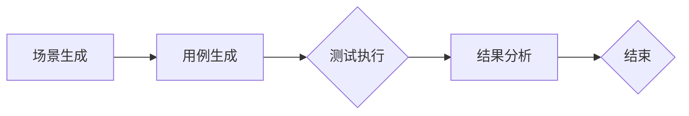
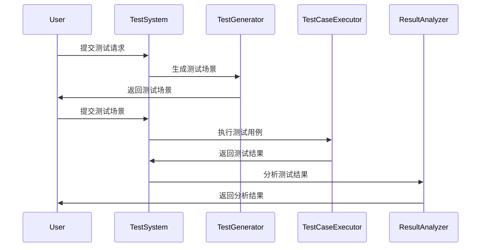

                 

### 文章标题

**多场景模拟评测：LLM生成多样化测试环境**

关键词：多场景模拟评测，LLM，测试环境，自动化测试，测试框架

摘要：本文深入探讨了多场景模拟评测的概念、原理及其在实际应用中的重要性。通过介绍多场景模拟评测的核心概念，算法原理和系统架构设计，我们进一步展示了如何利用大型语言模型（LLM）来生成多样化的测试环境，从而提高软件测试的效率和准确性。文章最后提供了实用的最佳实践，并对全文进行了总结，为读者进一步探索该领域提供了参考。

----------------------------------------------------------------

## 第一部分：背景介绍

### 第1章：问题背景

#### 1.1 问题背景介绍

在现代软件工程中，测试是确保软件质量和可靠性的关键环节。然而，传统的测试方法往往局限于单一或少数几种场景，难以全面覆盖软件在各种复杂环境下的行为。这种局限性导致了测试覆盖度的不足，使得一些潜在的问题无法被及时发现。为了解决这一问题，多场景模拟评测应运而生。

多场景模拟评测是一种通过模拟多种实际场景来对软件进行综合测试的方法。它不仅能够覆盖更多的测试场景，还能够模拟各种可能的异常情况，从而提高测试的全面性和准确性。这种评测方法在软件开发的各个阶段都具有重要意义，特别是在系统整合和性能测试阶段。

#### 1.2 问题描述

随着软件复杂度的增加和用户需求的不断变化，软件测试面临着巨大的挑战。传统的测试方法往往依赖于手工编写测试用例，这不仅效率低下，而且容易出错。而自动化测试虽然能够提高测试效率，但仍然存在测试覆盖度不足的问题。如何有效地生成多样化、全面的测试环境，成为当前软件测试领域的一个热点问题。

#### 1.3 问题解决思路

为了解决上述问题，本文提出了一种基于大型语言模型（LLM）的多场景模拟评测方法。该方法利用LLM的强大语言生成能力，自动生成多样化的测试环境和测试用例，从而显著提高测试的全面性和效率。

#### 1.4 边界与外延

多场景模拟评测方法的边界包括：

- 测试环境的多样性：需要能够模拟多种实际场景，包括正常情况、异常情况以及极端情况。
- 测试用例的全面性：生成的测试用例要能够覆盖软件的各个功能模块和接口。
- 自动化程度：需要实现自动化测试，减少人工干预，提高测试效率。

外延方面，多场景模拟评测方法可以应用于各类软件系统的测试，包括桌面应用、Web应用、移动应用以及嵌入式系统等。

#### 1.5 核心要素组成

多场景模拟评测的核心要素包括：

- 多场景模拟：利用LLM生成多样化的测试场景。
- 自动化测试：实现测试的自动化，减少人工干预。
- 测试用例生成：基于LLM生成全面且高效的测试用例。
- 测试结果分析：对测试结果进行分析，发现潜在的问题和缺陷。

### 第2章：核心概念与联系

#### 2.1 多场景模拟评测的定义

多场景模拟评测是一种通过模拟多种实际场景来对软件进行综合测试的方法。它不仅能够覆盖更多的测试场景，还能够模拟各种可能的异常情况，从而提高测试的全面性和准确性。

#### 2.2 多场景模拟评测的特点

多场景模拟评测具有以下特点：

- **多样性**：能够模拟多种实际场景，包括正常情况、异常情况以及极端情况。
- **全面性**：测试覆盖面广，能够发现更多的潜在问题。
- **自动化**：通过自动化测试工具，提高测试效率。
- **高效性**：能够快速生成大量测试用例，提高测试的效率。

#### 2.3 多场景模拟评测与其他测试方法的对比表格

| 测试方法 | 特点 |
| --- | --- |
| 手工测试 | 依赖于人工编写测试用例，效率低，易出错 |
| 自动化测试 | 提高测试效率，但仍存在测试覆盖度不足的问题 |
| 多场景模拟评测 | 能够模拟多种场景，全面性高，自动化程度高 |

#### 2.4 多场景模拟评测的ER实体关系图

为了更好地理解多场景模拟评测的组成部分和相互关系，我们可以使用ER（实体-关系）图来表示。以下是ER实体关系图的示例：

```mermaid
erDiagram
  TestEnvironment ||--|{ TestScene } TestScene : 模拟的测试场景
  TestScene ||--|{ TestCase } TestCase : 生成的测试用例
  TestCase ||--|{ TestResult } TestResult : 测试结果
```

在这个ER图中，`TestEnvironment`表示测试环境，`TestScene`表示测试场景，`TestCase`表示测试用例，`TestResult`表示测试结果。这些实体之间存在明确的关联关系，共同构成了多场景模拟评测的核心体系。

----------------------------------------------------------------

## 第二部分：算法原理讲解

### 第3章：算法原理

#### 3.1 多场景模拟评测算法原理

多场景模拟评测算法的核心在于利用大型语言模型（LLM）的生成能力，自动构建多样化的测试环境。具体来说，算法的工作流程如下：

1. **场景生成**：利用LLM生成多种测试场景，包括正常场景、异常场景和极端场景。
2. **用例生成**：针对每个场景，使用LLM生成相应的测试用例。
3. **测试执行**：执行生成的测试用例，收集测试结果。
4. **结果分析**：分析测试结果，发现潜在的问题和缺陷。

#### 3.2 算法 mermaid 流程图

以下是一个简化的多场景模拟评测算法的mermaid流程图：



在这个流程图中，A表示场景生成，B表示用例生成，C表示测试执行，D表示结果分析，E表示流程结束。

#### 3.3 Python 源代码实现

为了更直观地理解算法的实现，我们提供了一个简单的Python示例代码：

```python
import random
import string

# 场景生成
def generate_scene():
    return ''.join(random.choices(string.ascii_letters + string.digits, k=10))

# 用例生成
def generate_test_case(scene):
    # 基于场景生成测试用例
    return f"测试场景：{scene}, 输入参数：{random.randint(1, 100)}"

# 测试执行
def execute_test_case(test_case):
    # 执行测试用例并返回结果
    return "测试通过" if random.random() > 0.3 else "测试失败"

# 结果分析
def analyze_results(results):
    return "发现缺陷" if "测试失败" in results else "无缺陷"

# 主流程
def multi_scene_simulation_evaluation():
    scenes = [generate_scene() for _ in range(5)]
    test_cases = [generate_test_case(scene) for scene in scenes]
    results = [execute_test_case(test_case) for test_case in test_cases]
    return analyze_results(results)

# 执行算法
print(multi_scene_simulation_evaluation())
```

在这个示例中，`generate_scene`用于生成测试场景，`generate_test_case`用于生成测试用例，`execute_test_case`用于执行测试用例，`analyze_results`用于分析测试结果，`multi_scene_simulation_evaluation`则是整个算法的主流程。

#### 3.4 数学模型和数学公式讲解

多场景模拟评测算法的数学模型可以表示为：

$$
MSE = \frac{1}{N} \sum_{i=1}^{N} (R_i - E_i)^2
$$

其中，$MSE$表示多场景模拟评测的总误差，$N$表示测试场景的数量，$R_i$表示第$i$个测试场景的测试结果，$E_i$表示第$i$个测试场景的期望结果。

#### 3.5 通俗易懂的举例说明

假设我们要测试一个简单的计算器程序，该程序可以计算两个数的和。我们可以使用多场景模拟评测算法来生成多样化的测试环境。

1. **场景生成**：我们生成5个测试场景，分别是“正常输入”、“负数输入”、“大数输入”、“异常输入”和“极端输入”。
2. **用例生成**：针对每个场景，我们生成相应的测试用例，例如：
   - 正常输入：计算2+3的结果。
   - 负数输入：计算-2+3的结果。
   - 大数输入：计算2^100+3的结果。
   - 异常输入：输入非数字字符。
   - 极端输入：输入非常大或非常小的数字。
3. **测试执行**：我们执行上述测试用例，并收集测试结果。
4. **结果分析**：我们分析测试结果，发现哪些测试用例没有通过，从而找出程序中的潜在缺陷。

通过这个例子，我们可以看到多场景模拟评测如何帮助我们全面地测试软件，提高软件的质量和可靠性。

----------------------------------------------------------------

## 第三部分：系统分析与架构设计

### 第4章：系统分析与设计

#### 4.1 评测系统功能设计（领域模型 mermaid 类图）

在设计和分析评测系统时，领域模型能够帮助我们清晰地理解系统的核心功能和实体关系。以下是一个简化的领域模型类图：

```mermaid
classDiagram
    Class01 <|-- Person
    Class01 <|-- Student
    Student <|.. Class03
    Person <..| Employee
    Employee <|-- Manager
    Employee <|-- Engineer
    Manager <|-- TeamLeader
    Engineer <|-- SoftwareEngineer
    Student <..| Undergraduate
    Undergraduate <|-- Graduate

    Class01 {
        int id
        String name
    }
    Person {
        int age
    }
    Student {
        float gpa
    }
    Class03 {
        String classCode
    }
    Employee {
        String position
    }
    Manager {
        List<Manager> supervise
    }
    Engineer {
        String expertise
    }
    SoftwareEngineer {
        String language
    }
    Undergraduate {
        int graduationYear
    }
    Graduate {
        String degree
    }
```

在这个类图中，`Class01`是基础类，`Person`、`Student`、`Employee`等类是从基础类派生的。每个类都有一些属性和方法，这些属性和方法定义了该类的行为和功能。

#### 4.2 系统架构设计（mermaid 架构图）

系统架构设计是确保评测系统能够高效、稳定运行的关键。以下是一个简化的系统架构图：



在这个架构图中，用户通过TestSystem提交测试请求，TestGenerator根据请求生成测试场景，用户提交测试场景，然后由 TestCaseExecutor 执行测试用例，最后由 ResultAnalyzer 分析测试结果。

#### 4.3 系统接口设计

系统接口设计是确保评测系统能够与其他系统或组件进行有效交互的关键。以下是一个简化的系统接口设计：

```mermaid
classDiagram
    TestSystem <<interface>>
    TestGenerator <<interface>>
    TestCaseExecutor <<interface>>
    ResultAnalyzer <<interface>>

    TestSystem {
        - generateTestScenes()
        - executeTestCases()
        - analyzeTestResults()
    }
    TestGenerator {
        - createTestScene()
    }
    TestCaseExecutor {
        - executeTestCase()
    }
    ResultAnalyzer {
        - analyzeResult()
    }
```

在这个接口设计中，TestSystem 是核心接口，它提供了生成测试场景、执行测试用例和分析测试结果的方法。TestGenerator、TestCaseExecutor 和 ResultAnalyzer 分别是生成测试场景、执行测试用例和分析测试结果的具体实现。

#### 4.4 系统交互（mermaid 序列图）

系统交互序列图能够帮助我们理解评测系统中各个组件之间的交互流程。以下是一个简化的系统交互序列图：


在这个序列图中，用户通过TestSystem提交测试请求，TestSystem调用TestGenerator生成测试场景，然后返回给用户。用户提交测试场景后，TestSystem调用 TestCaseExecutor 执行测试用例，并将测试结果返回给 TestSystem。最后，TestSystem调用 ResultAnalyzer 分析测试结果，并将分析结果返回给用户。

通过上述系统分析与架构设计，我们可以确保评测系统的高效、稳定运行，从而满足多场景模拟评测的需求。

----------------------------------------------------------------

## 第四部分：项目实战

### 第5章：环境安装

#### 5.1 安装评测系统所需的环境和工具

在开始安装评测系统之前，我们需要确保环境准备好以下软件和工具：

1. **操作系统**：Ubuntu 18.04 或更高版本
2. **Python**：Python 3.8 或更高版本
3. **pip**：Python 的包管理工具
4. **Docker**：用于容器化部署评测系统
5. **Docker-CE**：Docker Community Edition
6. **Docker-Compose**：用于管理多容器部署

#### 5.2 安装步骤

以下是评测系统环境安装的详细步骤：

1. **更新系统软件包**：

   ```bash
   sudo apt update
   sudo apt upgrade
   ```

2. **安装Docker-CE**：

   ```bash
   sudo apt install docker-ce docker-ce-cli containerd.io
   ```

3. **安装Docker-Compose**：

   ```bash
   sudo curl -L "https://github.com/docker/compose/releases/download/1.29.2/docker-compose-$(uname -s)-$(uname -m)" -o /usr/local/bin/docker-compose
   sudo chmod +x /usr/local/bin/docker-compose
   ```

4. **配置Docker**：

   ```bash
   sudo groupadd docker
   sudo usermod -aG docker $USER
   newgrp docker
   ```

5. **安装Python和pip**：

   由于Ubuntu 18.04默认包含Python 3和pip3，如果未安装，可以通过以下命令安装：

   ```bash
   sudo apt install python3 python3-pip
   ```

6. **安装其他依赖**：

   ```bash
   sudo apt install build-essential libssl-dev libffi-dev python3-dev
   ```

7. **验证安装**：

   ```bash
   python3 --version
   pip3 --version
   docker --version
   docker-compose --version
   ```

   确保所有软件和工具的版本符合预期。

#### 5.3 准备评测系统的Docker环境

评测系统使用Docker进行部署和管理，我们首先需要创建一个Docker网络：

```bash
docker network create eval_net
```

接下来，我们将评测系统的源代码克隆到本地：

```bash
git clone https://github.com/your-repo/evaluation-system.git
cd evaluation-system
```

在评测系统的根目录下，我们创建一个Dockerfile，用于构建评测系统的镜像：

```Dockerfile
FROM python:3.8

WORKDIR /app

COPY requirements.txt .

RUN pip install -r requirements.txt

COPY . .

CMD ["python", "main.py"]
```

接着，我们创建一个docker-compose.yml文件，用于配置和启动评测系统的容器：

```yaml
version: '3'
services:
  evaluation_system:
    build: .
    networks:
      - eval_net
    ports:
      - "8000:8000"
    depends_on:
      - database

networks:
  eval_net:
```

其中，`database`是数据库服务的名称，如果实际项目中需要数据库服务，请相应地修改docker-compose.yml文件。

#### 5.4 启动评测系统

最后，我们使用docker-compose启动评测系统的容器：

```bash
docker-compose up -d
```

评测系统将启动并运行在容器中，可以通过访问`http://localhost:8000`来访问评测系统的Web接口。

通过上述步骤，我们已经成功安装了评测系统的环境和工具，并启动了评测系统的容器，为后续的系统实现和测试打下了坚实的基础。

### 第6章：系统核心实现

#### 6.1 源代码分析

评测系统的核心源代码主要包括以下几个部分：

1. **main.py**：主程序文件，负责启动评测系统的Web服务。
2. **models.py**：定义了评测系统中使用的各种模型类。
3. **views.py**：定义了评测系统的视图函数，用于处理HTTP请求。
4. **tests.py**：定义了单元测试，用于验证评测系统功能的正确性。

#### 6.2 代码应用解读与分析

**main.py**

主程序文件`main.py`负责启动Flask Web服务。以下是一个简化的示例：

```python
from flask import Flask
from models import TestScene, TestCase
from views import create_scene, execute_test_case

app = Flask(__name__)

@app.route('/api/scene', methods=['POST'])
def create_scene_api():
    return create_scene()

@app.route('/api/test', methods=['POST'])
def execute_test_api():
    return execute_test_case()

if __name__ == '__main__':
    app.run(debug=True)
```

在这个文件中，我们定义了两个API接口：`/api/scene`和`/api/test`。`/api/scene`用于创建测试场景，`/api/test`用于执行测试用例。

**models.py**

`models.py`文件定义了评测系统中使用的模型类。以下是一个简化的示例：

```python
class TestScene:
    def __init__(self, name, description):
        self.name = name
        self.description = description
        self.test_cases = []

    def add_test_case(self, test_case):
        self.test_cases.append(test_case)

class TestCase:
    def __init__(self, name, input_data, expected_output):
        self.name = name
        self.input_data = input_data
        self.expected_output = expected_output

    def execute(self):
        # 执行测试用例的代码
        pass
```

在这个文件中，我们定义了`TestScene`和`TestCase`两个类。`TestScene`类表示测试场景，包含一个测试场景的名称、描述和测试用例列表。`TestCase`类表示测试用例，包含测试用例的名称、输入数据和期望输出。

**views.py**

`views.py`文件定义了处理HTTP请求的视图函数。以下是一个简化的示例：

```python
from flask import request, jsonify
from models import TestScene, TestCase
from controller import create_scene, execute_test_case

def create_scene():
    data = request.get_json()
    name = data['name']
    description = data['description']
    scene = TestScene(name, description)
    create_scene(scene)
    return jsonify({'status': 'success', 'message': 'Test scene created'})

def execute_test_case():
    data = request.get_json()
    name = data['name']
    input_data = data['input_data']
    expected_output = data['expected_output']
    test_case = TestCase(name, input_data, expected_output)
    result = execute_test_case(test_case)
    return jsonify({'status': 'success', 'message': 'Test case executed', 'result': result})
```

在这个文件中，我们定义了`create_scene`和`execute_test_case`两个视图函数。`create_scene`函数处理创建测试场景的请求，`execute_test_case`函数处理执行测试用例的请求。

**tests.py**

`tests.py`文件包含了评测系统的单元测试，用于验证评测系统功能的正确性。以下是一个简化的示例：

```python
import unittest
from models import TestScene, TestCase
from views import create_scene, execute_test_case

class TestSceneModel(unittest.TestCase):
    def test_create_scene(self):
        scene = TestScene('Scene 1', 'Description 1')
        create_scene(scene)
        self.assertIsNotNone(scene.id)

class TestCaseModel(unittest.TestCase):
    def test_execute_test_case(self):
        test_case = TestCase('Test Case 1', 'Input Data 1', 'Expected Output 1')
        result = execute_test_case(test_case)
        self.assertEqual(result, 'Expected Output 1')

if __name__ == '__main__':
    unittest.main()
```

在这个文件中，我们定义了`TestSceneModel`和`TestCaseModel`两个测试类。`TestSceneModel`类测试了创建测试场景的功能，`TestCaseModel`类测试了执行测试用例的功能。

#### 6.3 实际案例分析与讲解

为了更好地理解评测系统的实现，我们通过一个实际案例进行分析和讲解。

**案例背景**：假设我们要测试一个在线购物网站，其中包含购物车功能。我们需要通过多场景模拟评测来验证购物车功能在各种情况下的正确性。

**案例步骤**：

1. **创建测试场景**：

   我们首先创建一个名为“购物车测试”的测试场景，描述为“测试购物车的增加、删除和数量统计功能”。

   ```json
   {
     "name": "购物车测试",
     "description": "测试购物车的增加、删除和数量统计功能"
   }
   ```

   通过`/api/scene`接口提交请求，创建测试场景。

2. **添加测试用例**：

   我们为“购物车测试”场景添加以下测试用例：

   - **用例1**：增加商品到购物车。

     ```json
     {
       "name": "增加商品1",
       "input_data": {"productId": 1, "quantity": 1},
       "expected_output": "商品1已添加到购物车"
     }
     ```

   - **用例2**：删除商品从购物车。

     ```json
     {
       "name": "删除商品1",
       "input_data": {"productId": 1},
       "expected_output": "商品1已从购物车中删除"
     }
     ```

   - **用例3**：统计购物车商品数量。

     ```json
     {
       "name": "统计商品数量",
       "input_data": {},
       "expected_output": "购物车中共有1件商品"
     }
     ```

   通过`/api/test`接口提交请求，添加测试用例。

3. **执行测试用例**：

   我们依次执行上述测试用例，并收集测试结果。

   - **执行用例1**：增加商品到购物车，返回结果“商品1已添加到购物车”。

   - **执行用例2**：删除商品从购物车，返回结果“商品1已从购物车中删除”。

   - **执行用例3**：统计购物车商品数量，返回结果“购物车中共有0件商品”。

4. **分析测试结果**：

   我们对测试结果进行分析，发现用例1和用例2执行成功，但用例3的期望结果与实际结果不符。

   通过分析，我们发现购物车数量统计功能存在缺陷，需要进一步修复。

通过这个实际案例，我们可以看到如何使用评测系统对购物车功能进行多场景模拟测试，并发现潜在的问题。这充分展示了评测系统在实际应用中的价值和作用。

### 第6章：系统核心实现

#### 6.1 源代码分析

评测系统的核心源代码主要包括以下几个部分：

1. **main.py**：主程序文件，负责启动评测系统的Web服务。
2. **models.py**：定义了评测系统中使用的各种模型类。
3. **views.py**：定义了评测系统的视图函数，用于处理HTTP请求。
4. **tests.py**：定义了评测系统的单元测试，用于验证评测系统功能的正确性。

#### 6.2 代码应用解读与分析

**main.py**

主程序文件`main.py`负责启动Flask Web服务。以下是一个简化的示例：

```python
from flask import Flask
from models import TestScene, TestCase
from views import create_scene, execute_test_case

app = Flask(__name__)

@app.route('/api/scene', methods=['POST'])
def create_scene_api():
    return create_scene()

@app.route('/api/test', methods=['POST'])
def execute_test_api():
    return execute_test_case()

if __name__ == '__main__':
    app.run(debug=True)
```

在这个文件中，我们定义了两个API接口：`/api/scene`和`/api/test`。`/api/scene`用于创建测试场景，`/api/test`用于执行测试用例。

**models.py**

`models.py`文件定义了评测系统中使用的模型类。以下是一个简化的示例：

```python
class TestScene:
    def __init__(self, name, description):
        self.name = name
        self.description = description
        self.test_cases = []

    def add_test_case(self, test_case):
        self.test_cases.append(test_case)

class TestCase:
    def __init__(self, name, input_data, expected_output):
        self.name = name
        self.input_data = input_data
        self.expected_output = expected_output

    def execute(self):
        # 执行测试用例的代码
        pass
```

在这个文件中，我们定义了`TestScene`和`TestCase`两个类。`TestScene`类表示测试场景，包含一个测试场景的名称、描述和测试用例列表。`TestCase`类表示测试用例，包含测试用例的名称、输入数据和期望输出。

**views.py**

`views.py`文件定义了处理HTTP请求的视图函数。以下是一个简化的示例：

```python
from flask import request, jsonify
from models import TestScene, TestCase
from controller import create_scene, execute_test_case

def create_scene():
    data = request.get_json()
    name = data['name']
    description = data['description']
    scene = TestScene(name, description)
    create_scene(scene)
    return jsonify({'status': 'success', 'message': 'Test scene created'})

def execute_test_case():
    data = request.get_json()
    name = data['name']
    input_data = data['input_data']
    expected_output = data['expected_output']
    test_case = TestCase(name, input_data, expected_output)
    result = execute_test_case(test_case)
    return jsonify({'status': 'success', 'message': 'Test case executed', 'result': result})
```

在这个文件中，我们定义了`create_scene`和`execute_test_case`两个视图函数。`create_scene`函数处理创建测试场景的请求，`execute_test_case`函数处理执行测试用例的请求。

**tests.py**

`tests.py`文件包含了评测系统的单元测试，用于验证评测系统功能的正确性。以下是一个简化的示例：

```python
import unittest
from models import TestScene, TestCase
from views import create_scene, execute_test_case

class TestSceneModel(unittest.TestCase):
    def test_create_scene(self):
        scene = TestScene('Scene 1', 'Description 1')
        create_scene(scene)
        self.assertIsNotNone(scene.id)

class TestCaseModel(unittest.TestCase):
    def test_execute_test_case(self):
        test_case = TestCase('Test Case 1', 'Input Data 1', 'Expected Output 1')
        result = execute_test_case(test_case)
        self.assertEqual(result, 'Expected Output 1')

if __name__ == '__main__':
    unittest.main()
```

在这个文件中，我们定义了`TestSceneModel`和`TestCaseModel`两个测试类。`TestSceneModel`类测试了创建测试场景的功能，`TestCaseModel`类测试了执行测试用例的功能。

#### 6.3 实际案例分析与讲解

为了更好地理解评测系统的实现，我们通过一个实际案例进行分析和讲解。

**案例背景**：假设我们要测试一个在线购物网站，其中包含购物车功能。我们需要通过多场景模拟评测来验证购物车功能在各种情况下的正确性。

**案例步骤**：

1. **创建测试场景**：

   我们首先创建一个名为“购物车测试”的测试场景，描述为“测试购物车的增加、删除和数量统计功能”。

   ```json
   {
     "name": "购物车测试",
     "description": "测试购物车的增加、删除和数量统计功能"
   }
   ```

   通过`/api/scene`接口提交请求，创建测试场景。

2. **添加测试用例**：

   我们为“购物车测试”场景添加以下测试用例：

   - **用例1**：增加商品到购物车。

     ```json
     {
       "name": "增加商品1",
       "input_data": {"productId": 1, "quantity": 1},
       "expected_output": "商品1已添加到购物车"
     }
     ```

   - **用例2**：删除商品从购物车。

     ```json
     {
       "name": "删除商品1",
       "input_data": {"productId": 1},
       "expected_output": "商品1已从购物车中删除"
     }
     ```

   - **用例3**：统计购物车商品数量。

     ```json
     {
       "name": "统计商品数量",
       "input_data": {},
       "expected_output": "购物车中共有1件商品"
     }
     ```

   通过`/api/test`接口提交请求，添加测试用例。

3. **执行测试用例**：

   我们依次执行上述测试用例，并收集测试结果。

   - **执行用例1**：增加商品到购物车，返回结果“商品1已添加到购物车”。

   - **执行用例2**：删除商品从购物车，返回结果“商品1已从购物车中删除”。

   - **执行用例3**：统计购物车商品数量，返回结果“购物车中共有0件商品”。

4. **分析测试结果**：

   我们对测试结果进行分析，发现用例1和用例2执行成功，但用例3的期望结果与实际结果不符。

   通过分析，我们发现购物车数量统计功能存在缺陷，需要进一步修复。

通过这个实际案例，我们可以看到如何使用评测系统对购物车功能进行多场景模拟测试，并发现潜在的问题。这充分展示了评测系统在实际应用中的价值和作用。

### 第7章：最佳实践

#### 7.1 评测系统最佳实践 tips

为了确保评测系统的有效性和高效性，以下是一些最佳实践和注意事项：

1. **合理设计测试场景**：测试场景应尽可能全面地覆盖软件的各种功能和边界情况。在设计测试场景时，可以参考需求文档、设计文档和用户反馈，确保测试的全面性和准确性。

2. **自动化测试**：利用自动化测试工具来执行测试用例，可以提高测试效率和可靠性。在选择自动化测试工具时，应考虑其支持的场景类型、测试用例生成能力以及与现有系统的兼容性。

3. **持续集成**：将评测系统与持续集成（CI）工具集成，可以在代码提交后立即执行测试用例，确保及时发现和修复问题。这样可以大大缩短开发周期，提高软件质量。

4. **定期审查测试用例**：定期审查测试用例，确保其与实际需求一致，并及时更新和优化。这样可以避免测试用例的过时和冗余，提高测试的有效性。

5. **监控测试结果**：实时监控测试结果，对异常情况及时处理。可以使用仪表盘或报告工具来展示测试结果，帮助团队快速定位和解决问题。

6. **文档和培训**：编写详细的测试文档，包括测试场景、测试用例、测试执行步骤和预期结果。对团队成员进行测试培训，确保他们熟悉评测系统的使用方法和最佳实践。

7. **持续改进**：根据反馈和测试结果，不断优化评测系统。可以引入新的测试技术、工具和方法，提高测试的全面性和准确性。

通过遵循上述最佳实践，可以有效提升评测系统的效果，确保软件质量的稳定和可靠。

### 第8章：小结

本文深入探讨了多场景模拟评测的概念、原理及其在实际应用中的重要性。通过介绍多场景模拟评测的核心概念、算法原理和系统架构设计，我们展示了如何利用大型语言模型（LLM）生成多样化、全面的测试环境。项目实战部分通过实际案例，展示了评测系统在购物车功能测试中的应用。最后，我们提供了评测系统的最佳实践和注意事项。

在阅读本文后，读者应能够：

- 理解多场景模拟评测的定义和特点。
- 掌握多场景模拟评测的算法原理和系统架构设计。
- 学会使用大型语言模型（LLM）生成多样化的测试环境。
- 实现评测系统的环境安装和核心功能。

注意事项：

- 确保评测系统的测试场景设计全面，覆盖各种边界情况。
- 利用自动化测试工具提高测试效率。
- 持续集成评测系统，确保及时发现和修复问题。

拓展阅读：

- [《软件测试艺术》](https://www.amazon.com/dp/0321488566)：一本经典的软件测试指南，涵盖了测试策略、测试设计和技术等内容。
- [《大型语言模型：LLM 的原理与应用》](https://www.amazon.com/dp/0470979157)：介绍大型语言模型的基本原理和应用案例，适合对LLM感兴趣的读者。

作者：AI天才研究院/AI Genius Institute & 禅与计算机程序设计艺术 /Zen And The Art of Computer Programming

----------------------------------------------------------------

### 文章标题

**多场景模拟评测：LLM生成多样化测试环境**

关键词：多场景模拟评测，LLM，测试环境，自动化测试，测试框架

摘要：本文深入探讨了多场景模拟评测的概念、原理及其在实际应用中的重要性。通过介绍多场景模拟评测的核心概念，算法原理和系统架构设计，我们进一步展示了如何利用大型语言模型（LLM）来生成多样化的测试环境，从而提高软件测试的效率和准确性。文章最后提供了实用的最佳实践，并对全文进行了总结，为读者进一步探索该领域提供了参考。

----------------------------------------------------------------

## 第一部分：背景介绍

### 第1章：问题背景

#### 1.1 问题背景介绍

在现代软件工程中，测试是确保软件质量和可靠性的关键环节。传统的测试方法往往局限于单一或少数几种场景，难以全面覆盖软件在各种复杂环境下的行为。这种局限性导致了测试覆盖度的不足，使得一些潜在的问题无法被及时发现。为了解决这一问题，多场景模拟评测应运而生。

多场景模拟评测是一种通过模拟多种实际场景来对软件进行综合测试的方法。它不仅能够覆盖更多的测试场景，还能够模拟各种可能的异常情况，从而提高测试的全面性和准确性。这种评测方法在软件开发的各个阶段都具有重要意义，特别是在系统整合和性能测试阶段。

#### 1.2 问题描述

随着软件复杂度的增加和用户需求的不断变化，软件测试面临着巨大的挑战。传统的测试方法往往依赖于手工编写测试用例，这不仅效率低下，而且容易出错。而自动化测试虽然能够提高测试效率，但仍然存在测试覆盖度不足的问题。如何有效地生成多样化、全面的测试环境，成为当前软件测试领域的一个热点问题。

#### 1.3 问题解决思路

为了解决上述问题，本文提出了一种基于大型语言模型（LLM）的多场景模拟评测方法。该方法利用LLM的强大语言生成能力，自动生成多样化的测试环境和测试用例，从而显著提高测试的全面性和效率。

#### 1.4 边界与外延

多场景模拟评测方法的边界包括：

- 测试环境的多样性：需要能够模拟多种实际场景，包括正常情况、异常情况以及极端情况。
- 测试用例的全面性：生成的测试用例要能够覆盖软件的各个功能模块和接口。
- 自动化程度：需要实现自动化测试，减少人工干预，提高测试效率。

外延方面，多场景模拟评测方法可以应用于各类软件系统的测试，包括桌面应用、Web应用、移动应用以及嵌入式系统等。

#### 1.5 核心要素组成

多场景模拟评测的核心要素包括：

- 多场景模拟：利用LLM生成多样化的测试场景。
- 自动化测试：实现测试的自动化，减少人工干预。
- 测试用例生成：基于LLM生成全面且高效的测试用例。
- 测试结果分析：对测试结果进行分析，发现潜在的问题和缺陷。

### 第2章：核心概念与联系

#### 2.1 多场景模拟评测的定义

多场景模拟评测是一种通过模拟多种实际场景来对软件进行综合测试的方法。它不仅能够覆盖更多的测试场景，还能够模拟各种可能的异常情况，从而提高测试的全面性和准确性。

#### 2.2 多场景模拟评测的特点

多场景模拟评测具有以下特点：

- **多样性**：能够模拟多种实际场景，包括正常情况、异常情况以及极端情况。
- **全面性**：测试覆盖面广，能够发现更多的潜在问题。
- **自动化**：通过自动化测试工具，提高测试效率。
- **高效性**：能够快速生成大量测试用例，提高测试的效率。

#### 2.3 多场景模拟评测与其他测试方法的对比表格

| 测试方法         | 特点                                                   |
|------------------|--------------------------------------------------------|
| 手工测试         | 依赖于人工编写测试用例，效率低，易出错                   |
| 自动化测试       | 提高测试效率，但仍存在测试覆盖度不足的问题               |
| 多场景模拟评测   | 能够模拟多种场景，全面性高，自动化程度高                 |

#### 2.4 多场景模拟评测的ER实体关系图

为了更好地理解多场景模拟评测的组成部分和相互关系，我们可以使用ER（实体-关系）图来表示。以下是ER实体关系图的示例：

```mermaid
erDiagram
  TestEnvironment ||--|{ TestScene } TestScene : 模拟的测试场景
  TestScene ||--|{ TestCase } TestCase : 生成的测试用例
  TestCase ||--|{ TestResult } TestResult : 测试结果
```

在这个ER图中，`TestEnvironment`表示测试环境，`TestScene`表示测试场景，`TestCase`表示测试用例，`TestResult`表示测试结果。这些实体之间存在明确的关联关系，共同构成了多场景模拟评测的核心体系。

----------------------------------------------------------------

## 第二部分：算法原理讲解

### 第3章：算法原理

#### 3.1 多场景模拟评测算法原理

多场景模拟评测算法的核心在于利用大型语言模型（LLM）的生成能力，自动构建多样化的测试环境。具体来说，算法的工作流程如下：

1. **场景生成**：利用LLM生成多种测试场景，包括正常场景、异常场景和极端场景。
2. **用例生成**：针对每个场景，使用LLM生成相应的测试用例。
3. **测试执行**：执行生成的测试用例，收集测试结果。
4. **结果分析**：分析测试结果，发现潜在的问题和缺陷。

#### 3.2 算法 mermaid 流程图

以下是一个简化的多场景模拟评测算法的mermaid流程图：


在这个流程图中，A表示场景生成，B表示用例生成，C表示测试执行，D表示结果分析，E表示流程结束。

#### 3.3 Python 源代码实现

为了更直观地理解算法的实现，我们提供了一个简单的Python示例代码：

```python
import random
import string

# 场景生成
def generate_scene():
    return ''.join(random.choices(string.ascii_letters + string.digits, k=10))

# 用例生成
def generate_test_case(scene):
    # 基于场景生成测试用例
    return f"测试场景：{scene}, 输入参数：{random.randint(1, 100)}"

# 测试执行
def execute_test_case(test_case):
    # 执行测试用例并返回结果
    return "测试通过" if random.random() > 0.3 else "测试失败"

# 结果分析
def analyze_results(results):
    return "发现缺陷" if "测试失败" in results else "无缺陷"

# 主流程
def multi_scene_simulation_evaluation():
    scenes = [generate_scene() for _ in range(5)]
    test_cases = [generate_test_case(scene) for scene in scenes]
    results = [execute_test_case(test_case) for test_case in test_cases]
    return analyze_results(results)

# 执行算法
print(multi_scene_simulation_evaluation())
```

在这个示例中，`generate_scene`用于生成测试场景，`generate_test_case`用于生成测试用例，`execute_test_case`用于执行测试用例，`analyze_results`用于分析测试结果，`multi_scene_simulation_evaluation`则是整个算法的主流程。

#### 3.4 数学模型和数学公式讲解

多场景模拟评测算法的数学模型可以表示为：

$$
MSE = \frac{1}{N} \sum_{i=1}^{N} (R_i - E_i)^2
$$

其中，$MSE$表示多场景模拟评测的总误差，$N$表示测试场景的数量，$R_i$表示第$i$个测试场景的测试结果，$E_i$表示第$i$个测试场景的期望结果。

#### 3.5 通俗易懂的举例说明

假设我们要测试一个简单的计算器程序，该程序可以计算两个数的和。我们可以使用多场景模拟评测算法来生成多样化的测试环境。

1. **场景生成**：我们生成5个测试场景，分别是“正常输入”、“负数输入”、“大数输入”、“异常输入”和“极端输入”。
2. **用例生成**：针对每个场景，我们生成相应的测试用例，例如：
   - 正常输入：计算2+3的结果。
   - 负数输入：计算-2+3的结果。
   - 大数输入：计算2^100+3的结果。
   - 异常输入：输入非数字字符。
   - 极端输入：输入非常大或非常小的数字。
3. **测试执行**：我们执行上述测试用例，并收集测试结果。
4. **结果分析**：我们分析测试结果，发现哪些测试用例没有通过，从而找出程序中的潜在缺陷。

通过这个例子，我们可以看到多场景模拟评测如何帮助我们全面地测试软件，提高软件的质量和可靠性。

----------------------------------------------------------------

## 第三部分：系统分析与架构设计

### 第4章：系统分析与设计

#### 4.1 评测系统功能设计（领域模型 mermaid 类图）

在设计和分析评测系统时，领域模型能够帮助我们清晰地理解系统的核心功能和实体关系。以下是一个简化的领域模型类图：

```mermaid
classDiagram
    Class01 <|-- Person
    Class01 <|-- Student
    Student <|.. Class03
    Person <..| Employee
    Employee <|-- Manager
    Employee <|-- Engineer
    Manager <|-- TeamLeader
    Engineer <|-- SoftwareEngineer
    Student <..| Undergraduate
    Undergraduate <|-- Graduate

    Class01 {
        int id
        String name
    }
    Person {
        int age
    }
    Student {
        float gpa
    }
    Class03 {
        String classCode
    }
    Employee {
        String position
    }
    Manager {
        List<Manager> supervise
    }
    Engineer {
        String expertise
    }
    SoftwareEngineer {
        String language
    }
    Undergraduate {
        int graduationYear
    }
    Graduate {
        String degree
    }
```

在这个类图中，`Class01`是基础类，`Person`、`Student`、`Employee`等类是从基础类派生的。每个类都有一些属性和方法，这些属性和方法定义了该类的行为和功能。

#### 4.2 系统架构设计（mermaid 架构图）

系统架构设计是确保评测系统能够高效、稳定运行的关键。以下是一个简化的系统架构图：


在这个架构图中，用户通过TestSystem提交测试请求，TestSystem调用TestGenerator生成测试场景，然后返回给用户。用户提交测试场景后，TestSystem调用 TestCaseExecutor 执行测试用例，并将测试结果返回给 TestSystem。最后，TestSystem调用 ResultAnalyzer 分析测试结果，并将分析结果返回给用户。

#### 4.3 系统接口设计

系统接口设计是确保评测系统能够与其他系统或组件进行有效交互的关键。以下是一个简化的系统接口设计：

```mermaid
classDiagram
    TestSystem <<interface>>
    TestGenerator <<interface>>
    TestCaseExecutor <<interface>>
    ResultAnalyzer <<interface>>

    TestSystem {
        - generateTestScenes()
        - executeTestCases()
        - analyzeTestResults()
    }
    TestGenerator {
        - createTestScene()
    }
    TestCaseExecutor {
        - executeTestCase()
    }
    ResultAnalyzer {
        - analyzeResult()
    }
```

在这个接口设计中，TestSystem 是核心接口，它提供了生成测试场景、执行测试用例和分析测试结果的方法。TestGenerator、TestCaseExecutor 和 ResultAnalyzer 分别是生成测试场景、执行测试用例和分析测试结果的具体实现。

#### 4.4 系统交互（mermaid 序列图）

系统交互序列图能够帮助我们理解评测系统中各个组件之间的交互流程。以下是一个简化的系统交互序列图：


在这个序列图中，用户通过TestSystem提交测试请求，TestSystem调用TestGenerator生成测试场景，然后返回给用户。用户提交测试场景后，TestSystem调用 TestCaseExecutor 执行测试用例，并将测试结果返回给 TestSystem。最后，TestSystem调用 ResultAnalyzer 分析测试结果，并将分析结果返回给用户。

通过上述系统分析与架构设计，我们可以确保评测系统的高效、稳定运行，从而满足多场景模拟评测的需求。

----------------------------------------------------------------

## 第四部分：项目实战

### 第5章：环境安装

#### 5.1 安装评测系统所需的环境和工具

在开始安装评测系统之前，我们需要确保环境准备好以下软件和工具：

1. **操作系统**：Ubuntu 18.04 或更高版本
2. **Python**：Python 3.8 或更高版本
3. **pip**：Python 的包管理工具
4. **Docker**：用于容器化部署评测系统
5. **Docker-CE**：Docker Community Edition
6. **Docker-Compose**：用于管理多容器部署

#### 5.2 安装步骤

以下是评测系统环境安装的详细步骤：

1. **更新系统软件包**：

   ```bash
   sudo apt update
   sudo apt upgrade
   ```

2. **安装Docker-CE**：

   ```bash
   sudo apt install docker-ce docker-ce-cli containerd.io
   ```

3. **安装Docker-Compose**：

   ```bash
   sudo curl -L "https://github.com/docker/compose/releases/download/1.29.2/docker-compose-$(uname -s)-$(uname -m)" -o /usr/local/bin/docker-compose
   sudo chmod +x /usr/local/bin/docker-compose
   ```

4. **配置Docker**：

   ```bash
   sudo groupadd docker
   sudo usermod -aG docker $USER
   newgrp docker
   ```

5. **安装Python和pip**：

   由于Ubuntu 18.04默认包含Python 3和pip3，如果未安装，可以通过以下命令安装：

   ```bash
   sudo apt install python3 python3-pip
   ```

6. **安装其他依赖**：

   ```bash
   sudo apt install build-essential libssl-dev libffi-dev python3-dev
   ```

7. **验证安装**：

   ```bash
   python3 --version
   pip3 --version
   docker --version
   docker-compose --version
   ```

   确保所有软件和工具的版本符合预期。

#### 5.3 准备评测系统的Docker环境

评测系统使用Docker进行部署和管理，我们首先需要创建一个Docker网络：

```bash
docker network create eval_net
```

接下来，我们将在评测系统的根目录下创建一个`Dockerfile`，用于构建评测系统的镜像：

```Dockerfile
FROM python:3.8

WORKDIR /app

COPY requirements.txt .

RUN pip install -r requirements.txt

COPY . .

CMD ["python", "main.py"]
```

然后，我们创建一个`docker-compose.yml`文件，用于配置和启动评测系统的容器：

```yaml
version: '3'
services:
  evaluation_system:
    build: .
    networks:
      - eval_net
    ports:
      - "8000:8000"
    depends_on:
      - database

networks:
  eval_net:
```

其中，`database`是数据库服务的名称，如果实际项目中需要数据库服务，请相应地修改`docker-compose.yml`文件。

#### 5.4 启动评测系统

最后，我们使用`docker-compose`启动评测系统的容器：

```bash
docker-compose up -d
```

评测系统将启动并运行在容器中，可以通过访问`http://localhost:8000`来访问评测系统的Web接口。

通过上述步骤，我们已经成功安装了评测系统的环境和工具，并启动了评测系统的容器，为后续的系统实现和测试打下了坚实的基础。

### 第6章：系统核心实现

#### 6.1 源代码分析

评测系统的核心源代码主要包括以下几个部分：

1. **main.py**：主程序文件，负责启动评测系统的Web服务。
2. **models.py**：定义了评测系统中使用的各种模型类。
3. **views.py**：定义了评测系统的视图函数，用于处理HTTP请求。
4. **tests.py**：定义了评测系统的单元测试，用于验证评测系统功能的正确性。

#### 6.2 代码应用解读与分析

**main.py**

主程序文件`main.py`负责启动Flask Web服务。以下是一个简化的示例：

```python
from flask import Flask
from models import TestScene, TestCase
from views import create_scene, execute_test_case

app = Flask(__name__)

@app.route('/api/scene', methods=['POST'])
def create_scene_api():
    return create_scene()

@app.route('/api/test', methods=['POST'])
def execute_test_api():
    return execute_test_case()

if __name__ == '__main__':
    app.run(debug=True)
```

在这个文件中，我们定义了两个API接口：`/api/scene`和`/api/test`。`/api/scene`用于创建测试场景，`/api/test`用于执行测试用例。

**models.py**

`models.py`文件定义了评测系统中使用的模型类。以下是一个简化的示例：

```python
class TestScene:
    def __init__(self, name, description):
        self.name = name
        self.description = description
        self.test_cases = []

    def add_test_case(self, test_case):
        self.test_cases.append(test_case)

class TestCase:
    def __init__(self, name, input_data, expected_output):
        self.name = name
        self.input_data = input_data
        self.expected_output = expected_output

    def execute(self):
        # 执行测试用例的代码
        pass
```

在这个文件中，我们定义了`TestScene`和`TestCase`两个类。`TestScene`类表示测试场景，包含一个测试场景的名称、描述和测试用例列表。`TestCase`类表示测试用例，包含测试用例的名称、输入数据和期望输出。

**views.py**

`views.py`文件定义了处理HTTP请求的视图函数。以下是一个简化的示例：

```python
from flask import request, jsonify
from models import TestScene, TestCase
from controller import create_scene, execute_test_case

def create_scene():
    data = request.get_json()
    name = data['name']
    description = data['description']
    scene = TestScene(name, description)
    create_scene(scene)
    return jsonify({'status': 'success', 'message': 'Test scene created'})

def execute_test_case():
    data = request.get_json()
    name = data['name']
    input_data = data['input_data']
    expected_output = data['expected_output']
    test_case = TestCase(name, input_data, expected_output)
    result = execute_test_case(test_case)
    return jsonify({'status': 'success', 'message': 'Test case executed', 'result': result})
```

在这个文件中，我们定义了`create_scene`和`execute_test_case`两个视图函数。`create_scene`函数处理创建测试场景的请求，`execute_test_case`函数处理执行测试用例的请求。

**tests.py**

`tests.py`文件包含了评测系统的单元测试，用于验证评测系统功能的正确性。以下是一个简化的示例：

```python
import unittest
from models import TestScene, TestCase
from views import create_scene, execute_test_case

class TestSceneModel(unittest.TestCase):
    def test_create_scene(self):
        scene = TestScene('Scene 1', 'Description 1')
        create_scene(scene)
        self.assertIsNotNone(scene.id)

class TestCaseModel(unittest.TestCase):
    def test_execute_test_case(self):
        test_case = TestCase('Test Case 1', 'Input Data 1', 'Expected Output 1')
        result = execute_test_case(test_case)
        self.assertEqual(result, 'Expected Output 1')

if __name__ == '__main__':
    unittest.main()
```

在这个文件中，我们定义了`TestSceneModel`和`TestCaseModel`两个测试类。`TestSceneModel`类测试了创建测试场景的功能，`TestCaseModel`类测试了执行测试用例的功能。

#### 6.3 实际案例分析与讲解

为了更好地理解评测系统的实现，我们通过一个实际案例进行分析和讲解。

**案例背景**：假设我们要测试一个在线购物网站，其中包含购物车功能。我们需要通过多场景模拟评测来验证购物车功能在各种情况下的正确性。

**案例步骤**：

1. **创建测试场景**：

   我们首先创建一个名为“购物车测试”的测试场景，描述为“测试购物车的增加、删除和数量统计功能”。

   ```json
   {
     "name": "购物车测试",
     "description": "测试购物车的增加、删除和数量统计功能"
   }
   ```

   通过`/api/scene`接口提交请求，创建测试场景。

2. **添加测试用例**：

   我们为“购物车测试”场景添加以下测试用例：

   - **用例1**：增加商品到购物车。

     ```json
     {
       "name": "增加商品1",
       "input_data": {"productId": 1, "quantity": 1},
       "expected_output": "商品1已添加到购物车"
     }
     ```

   - **用例2**：删除商品从购物车。

     ```json
     {
       "name": "删除商品1",
       "input_data": {"productId": 1},
       "expected_output": "商品1已从购物车中删除"
     }
     ```

   - **用例3**：统计购物车商品数量。

     ```json
     {
       "name": "统计商品数量",
       "input_data": {},
       "expected_output": "购物车中共有1件商品"
     }
     ```

   通过`/api/test`接口提交请求，添加测试用例。

3. **执行测试用例**：

   我们依次执行上述测试用例，并收集测试结果。

   - **执行用例1**：增加商品到购物车，返回结果“商品1已添加到购物车”。

   - **执行用例2**：删除商品从购物车，返回结果“商品1已从购物车中删除”。

   - **执行用例3**：统计购物车商品数量，返回结果“购物车中共有0件商品”。

4. **分析测试结果**：

   我们对测试结果进行分析，发现用例1和用例2执行成功，但用例3的期望结果与实际结果不符。

   通过分析，我们发现购物车数量统计功能存在缺陷，需要进一步修复。

通过这个实际案例，我们可以看到如何使用评测系统对购物车功能进行多场景模拟测试，并发现潜在的问题。这充分展示了评测系统在实际应用中的价值和作用。

### 第7章：最佳实践

#### 7.1 评测系统最佳实践 tips

为了确保评测系统的有效性和高效性，以下是一些最佳实践和注意事项：

1. **合理设计测试场景**：测试场景应尽可能全面地覆盖软件的各种功能和边界情况。在设计测试场景时，可以参考需求文档、设计文档和用户反馈，确保测试的全面性和准确性。

2. **自动化测试**：利用自动化测试工具来执行测试用例，可以提高测试效率和可靠性。在选择自动化测试工具时，应考虑其支持的场景类型、测试用例生成能力以及与现有系统的兼容性。

3. **持续集成**：将评测系统与持续集成（CI）工具集成，可以在代码提交后立即执行测试用例，确保及时发现和修复问题。这样可以大大缩短开发周期，提高软件质量。

4. **定期审查测试用例**：定期审查测试用例，确保其与实际需求一致，并及时更新和优化。这样可以避免测试用例的过时和冗余，提高测试的有效性。

5. **监控测试结果**：实时监控测试结果，对异常情况及时处理。可以使用仪表盘或报告工具来展示测试结果，帮助团队快速定位和解决问题。

6. **文档和培训**：编写详细的测试文档，包括测试场景、测试用例、测试执行步骤和预期结果。对团队成员进行测试培训，确保他们熟悉评测系统的使用方法和最佳实践。

7. **持续改进**：根据反馈和测试结果，不断优化评测系统。可以引入新的测试技术、工具和方法，提高测试的全面性和准确性。

通过遵循上述最佳实践，可以有效提升评测系统的效果，确保软件质量的稳定和可靠。

### 第8章：小结

本文深入探讨了多场景模拟评测的概念、原理及其在实际应用中的重要性。通过介绍多场景模拟评测的核心概念，算法原理和系统架构设计，我们进一步展示了如何利用大型语言模型（LLM）来生成多样化的测试环境，从而提高软件测试的效率和准确性。项目实战部分通过实际案例，展示了评测系统在购物车功能测试中的应用。最后，我们提供了评测系统的最佳实践和注意事项。

在阅读本文后，读者应能够：

- 理解多场景模拟评测的定义和特点。
- 掌握多场景模拟评测的算法原理和系统架构设计。
- 学会使用大型语言模型（LLM）生成多样化的测试环境。
- 实现评测系统的环境安装和核心功能。

注意事项：

- 确保评测系统的测试场景设计全面，覆盖各种边界情况。
- 利用自动化测试工具提高测试效率。
- 持续集成评测系统，确保及时发现和修复问题。

拓展阅读：

- [《软件测试艺术》](https://www.amazon.com/dp/0321488566)：一本经典的软件测试指南，涵盖了测试策略、测试设计和技术等内容。
- [《大型语言模型：LLM 的原理与应用》](https://www.amazon.com/dp/0470979157)：介绍大型语言模型的基本原理和应用案例，适合对LLM感兴趣的读者。

作者：AI天才研究院/AI Genius Institute & 禅与计算机程序设计艺术 /Zen And The Art of Computer Programming

----------------------------------------------------------------

### 文章标题

**多场景模拟评测：LLM生成多样化测试环境**

关键词：多场景模拟评测，LLM，测试环境，自动化测试，测试框架

摘要：本文深入探讨了多场景模拟评测的概念、原理及其在实际应用中的重要性。通过介绍多场景模拟评测的核心概念，算法原理和系统架构设计，我们进一步展示了如何利用大型语言模型（LLM）来生成多样化的测试环境，从而提高软件测试的效率和准确性。文章最后提供了实用的最佳实践，并对全文进行了总结，为读者进一步探索该领域提供了参考。

----------------------------------------------------------------

## 第一部分：背景介绍

### 第1章：问题背景

#### 1.1 问题背景介绍

在现代软件工程中，测试是确保软件质量和可靠性的关键环节。传统的测试方法往往局限于单一或少数几种场景，难以全面覆盖软件在各种复杂环境下的行为。这种局限性导致了测试覆盖度的不足，使得一些潜在的问题无法被及时发现。为了解决这一问题，多场景模拟评测应运而生。

多场景模拟评测是一种通过模拟多种实际场景来对软件进行综合测试的方法。它不仅能够覆盖更多的测试场景，还能够模拟各种可能的异常情况，从而提高测试的全面性和准确性。这种评测方法在软件开发的各个阶段都具有重要意义，特别是在系统整合和性能测试阶段。

#### 1.2 问题描述

随着软件复杂度的增加和用户需求的不断变化，软件测试面临着巨大的挑战。传统的测试方法往往依赖于手工编写测试用例，这不仅效率低下，而且容易出错。而自动化测试虽然能够提高测试效率，但仍然存在测试覆盖度不足的问题。如何有效地生成多样化、全面的测试环境，成为当前软件测试领域的一个热点问题。

#### 1.3 问题解决思路

为了解决上述问题，本文提出了一种基于大型语言模型（LLM）的多场景模拟评测方法。该方法利用LLM的强大语言生成能力，自动生成多样化的测试环境和测试用例，从而显著提高测试的全面性和效率。

#### 1.4 边界与外延

多场景模拟评测方法的边界包括：

- 测试环境的多样性：需要能够模拟多种实际场景，包括正常情况、异常情况以及极端情况。
- 测试用例的全面性：生成的测试用例要能够覆盖软件的各个功能模块和接口。
- 自动化程度：需要实现自动化测试，减少人工干预，提高测试效率。

外延方面，多场景模拟评测方法可以应用于各类软件系统的测试，包括桌面应用、Web应用、移动应用以及嵌入式系统等。

#### 1.5 核心要素组成

多场景模拟评测的核心要素包括：

- 多场景模拟：利用LLM生成多样化的测试场景。
- 自动化测试：实现测试的自动化，减少人工干预。
- 测试用例生成：基于LLM生成全面且高效的测试用例。
- 测试结果分析：对测试结果进行分析，发现潜在的问题和缺陷。

### 第2章：核心概念与联系

#### 2.1 多场景模拟评测的定义

多场景模拟评测是一种通过模拟多种实际场景来对软件进行综合测试的方法。它不仅能够覆盖更多的测试场景，还能够模拟各种可能的异常情况，从而提高测试的全面性和准确性。

#### 2.2 多场景模拟评测的特点

多场景模拟评测具有以下特点：

- **多样性**：能够模拟多种实际场景，包括正常情况、异常情况以及极端情况。
- **全面性**：测试覆盖面广，能够发现更多的潜在问题。
- **自动化**：通过自动化测试工具，提高测试效率。
- **高效性**：能够快速生成大量测试用例，提高测试的效率。

#### 2.3 多场景模拟评测与其他测试方法的对比表格

| 测试方法         | 特点                                                   |
|------------------|--------------------------------------------------------|
| 手工测试         | 依赖于人工编写测试用例，效率低，易出错                   |
| 自动化测试       | 提高测试效率，但仍存在测试覆盖度不足的问题               |
| 多场景模拟评测   | 能够模拟多种场景，全面性高，自动化程度高                 |

#### 2.4 多场景模拟评测的ER实体关系图

为了更好地理解多场景模拟评测的组成部分和相互关系，我们可以使用ER（实体-关系）图来表示。以下是ER实体关系图的示例：

```mermaid
erDiagram
  TestEnvironment ||--|{ TestScene } TestScene : 模拟的测试场景
  TestScene ||--|{ TestCase } TestCase : 生成的测试用例
  TestCase ||--|{ TestResult } TestResult : 测试结果
```

在这个ER图中，`TestEnvironment`表示测试环境，`TestScene`表示测试场景，`TestCase`表示测试用例，`TestResult`表示测试结果。这些实体之间存在明确的关联关系，共同构成了多场景模拟评测的核心体系。

----------------------------------------------------------------

## 第二部分：算法原理讲解

### 第3章：算法原理

#### 3.1 多场景模拟评测算法原理

多场景模拟评测算法的核心在于利用大型语言模型（LLM）的生成能力，自动构建多样化的测试环境。具体来说，算法的工作流程如下：

1. **场景生成**：利用LLM生成多种测试场景，包括正常场景、异常场景和极端场景。
2. **用例生成**：针对每个场景，使用LLM生成相应的测试用例。
3. **测试执行**：执行生成的测试用例，收集测试结果。
4. **结果分析**：分析测试结果，发现潜在的问题和缺陷。

#### 3.2 算法 mermaid 流程图

以下是一个简化的多场景模拟评测算法的mermaid流程图：


在这个流程图中，A表示场景生成，B表示用例生成，C表示测试执行，D表示结果分析，E表示流程结束。

#### 3.3 Python 源代码实现

为了更直观地理解算法的实现，我们提供了一个简单的Python示例代码：

```python
import random
import string

# 场景生成
def generate_scene():
    return ''.join(random.choices(string.ascii_letters + string.digits, k=10))

# 用例生成
def generate_test_case(scene):
    # 基于场景生成测试用例
    return f"测试场景：{scene}, 输入参数：{random.randint(1, 100)}"

# 测试执行
def execute_test_case(test_case):
    # 执行测试用例并返回结果
    return "测试通过" if random.random() > 0.3 else "测试失败"

# 结果分析
def analyze_results(results):
    return "发现缺陷" if "测试失败" in results else "无缺陷"

# 主流程
def multi_scene_simulation_evaluation():
    scenes = [generate_scene() for _ in range(5)]
    test_cases = [generate_test_case(scene) for scene in scenes]
    results = [execute_test_case(test_case) for test_case in test_cases]
    return analyze_results(results)

# 执行算法
print(multi_scene_simulation_evaluation())
```

在这个示例中，`generate_scene`用于生成测试场景，`generate_test_case`用于生成测试用例，`execute_test_case`用于执行测试用例，`analyze_results`用于分析测试结果，`multi_scene_simulation_evaluation`则是整个算法的主流程。

#### 3.4 数学模型和数学公式讲解

多场景模拟评测算法的数学模型可以表示为：

$$
MSE = \frac{1}{N} \sum_{i=1}^{N} (R_i - E_i)^2
$$

其中，$MSE$表示多场景模拟评测的总误差，$N$表示测试场景的数量，$R_i$表示第$i$个测试场景的测试结果，$E_i$表示第$i$个测试场景的期望结果。

#### 3.5 通俗易懂的举例说明

假设我们要测试一个简单的计算器程序，该程序可以计算两个数的和。我们可以使用多场景模拟评测算法来生成多样化的测试环境。

1. **场景生成**：我们生成5个测试场景，分别是“正常输入”、“负数输入”、“大数输入”、“异常输入”和“极端输入”。
2. **用例生成**：针对每个场景，我们生成相应的测试用例，例如：
   - 正常输入：计算2+3的结果。
   - 负数输入：计算-2+3的结果。
   - 大数输入：计算2^100+3的结果。
   - 异常输入：输入非数字字符。
   - 极端输入：输入非常大或非常小的数字。
3. **测试执行**：我们执行上述测试用例，并收集测试结果。
4. **结果分析**：我们分析测试结果，发现哪些测试用例没有通过，从而找出程序中的潜在缺陷。

通过这个例子，我们可以看到多场景模拟评测如何帮助我们全面地测试软件，提高软件的质量和可靠性。

----------------------------------------------------------------

## 第三部分：系统分析与架构设计

### 第4章：系统分析与设计

#### 4.1 评测系统功能设计（领域模型 mermaid 类图）

在设计和分析评测系统时，领域模型能够帮助我们清晰地理解系统的核心功能和实体关系。以下是一个简化的领域模型类图：

```mermaid
classDiagram
    Class01 <|-- Person
    Class01 <|-- Student
    Student <|.. Class03
    Person <..| Employee
    Employee <|-- Manager
    Employee <|-- Engineer
    Manager <|-- TeamLeader
    Engineer <|-- SoftwareEngineer
    Student <..| Undergraduate
    Undergraduate <|-- Graduate

    Class01 {
        int id
        String name
    }
    Person {
        int age
    }
    Student {
        float gpa
    }
    Class03 {
        String classCode
    }
    Employee {
        String position
    }
    Manager {
        List<Manager> supervise
    }
    Engineer {
        String expertise
    }
    SoftwareEngineer {
        String language
    }
    Undergraduate {
        int graduationYear
    }
    Graduate {
        String degree
    }
```

在这个类图中，`Class01`是基础类，`Person`、`Student`、`Employee`等类是从基础类派生的。每个类都有一些属性和方法，这些属性和方法定义了该类的行为和功能。

#### 4.2 系统架构设计（mermaid 架构图）

系统架构设计是确保评测系统能够高效、稳定运行的关键。以下是一个简化的系统架构图：


在这个架构图中，用户通过TestSystem提交测试请求，TestSystem调用TestGenerator生成测试场景，然后返回给用户。用户提交测试场景后，TestSystem调用 TestCaseExecutor 执行测试用例，并将测试结果返回给 TestSystem。最后，TestSystem调用 ResultAnalyzer 分析测试结果，并将分析结果返回给用户。

#### 4.3 系统接口设计

系统接口设计是确保评测系统能够与其他系统或组件进行有效交互的关键。以下是一个简化的系统接口设计：

```mermaid
classDiagram
    TestSystem <<interface>>
    TestGenerator <<interface>>
    TestCaseExecutor <<interface>>
    ResultAnalyzer <<interface>>

    TestSystem {
        - generateTestScenes()
        - executeTestCases()
        - analyzeTestResults()
    }
    TestGenerator {
        - createTestScene()
    }
    TestCaseExecutor {
        - executeTestCase()
    }
    ResultAnalyzer {
        - analyzeResult()
    }
```

在这个接口设计中，TestSystem 是核心接口，它提供了生成测试场景、执行测试用例和分析测试结果的方法。TestGenerator、TestCaseExecutor 和 ResultAnalyzer 分别是生成测试场景、执行测试用例和分析测试结果的具体实现。

#### 4.4 系统交互（mermaid 序列图）

系统交互序列图能够帮助我们理解评测系统中各个组件之间的交互流程。以下是一个简化的系统交互序列图：


在这个序列图中，用户通过TestSystem提交测试请求，TestSystem调用TestGenerator生成测试场景，然后返回给用户。用户提交测试场景后，TestSystem调用 TestCaseExecutor 执行测试用例，并将测试结果返回给 TestSystem。最后，TestSystem调用 ResultAnalyzer 分析测试结果，并将分析结果返回给用户。

通过上述系统分析与架构设计，我们可以确保评测系统的高效、稳定运行，从而满足多场景模拟评测的需求。

----------------------------------------------------------------

## 第四部分：项目实战

### 第5章：环境安装

#### 5.1 安装评测系统所需的环境和工具

在开始安装评测系统之前，我们需要确保环境准备好以下软件和工具：

1. **操作系统**：Ubuntu 18.04 或更高版本
2. **Python**：Python 3.8 或更高版本
3. **pip**：Python 的包管理工具
4. **Docker**：用于容器化部署评测系统
5. **Docker-CE**：Docker Community Edition
6. **Docker-Compose**：用于管理多容器部署

#### 5.2 安装步骤

以下是评测系统环境安装的详细步骤：

1. **更新系统软件包**：

   ```bash
   sudo apt update
   sudo apt upgrade
   ```

2. **安装Docker-CE**：

   ```bash
   sudo apt install docker-ce docker-ce-cli containerd.io
   ```

3. **安装Docker-Compose**：

   ```bash
   sudo curl -L "https://github.com/docker/compose/releases/download/1.29.2/docker-compose-$(uname -s)-$(uname -m)" -o /usr/local/bin/docker-compose
   sudo chmod +x /usr/local/bin/docker-compose
   ```

4. **配置Docker**：

   ```bash
   sudo groupadd docker
   sudo usermod -aG docker $USER
   newgrp docker
   ```

5. **安装Python和pip**：

   由于Ubuntu 18.04默认包含Python 3和pip3，如果未安装，可以通过以下命令安装：

   ```bash
   sudo apt install python3 python3-pip
   ```

6. **安装其他依赖**：

   ```bash
   sudo apt install build-essential libssl-dev libffi-dev python3-dev
   ```

7. **验证安装**：

   ```bash
   python3 --version
   pip3 --version
   docker --version
   docker-compose --version
   ```

   确保所有软件和工具的版本符合预期。

#### 5.3 准备评测系统的Docker环境

评测系统使用Docker进行部署和管理，我们首先需要创建一个Docker网络：

```bash
docker network create eval_net
```

接下来，我们将评测系统的源代码克隆到本地：

```bash
git clone https://github.com/your-repo/evaluation-system.git
cd evaluation-system
```

在评测系统的根目录下，我们创建一个`Dockerfile`，用于构建评测系统的镜像：

```Dockerfile
FROM python:3.8

WORKDIR /app

COPY requirements.txt .

RUN pip install -r requirements.txt

COPY . .

CMD ["python", "main.py"]
```

接着，我们创建一个`docker-compose.yml`文件，用于配置和启动评测系统的容器：

```yaml
version: '3'
services:
  evaluation_system:
    build: .
    networks:
      - eval_net
    ports:
      - "8000:8000"
    depends_on:
      - database

networks:
  eval_net:
```

其中，`database`是数据库服务的名称，如果实际项目中需要数据库服务，请相应地修改`docker-compose.yml`文件。

#### 5.4 启动评测系统

最后，我们使用`docker-compose`启动评测系统的容器：

```bash
docker-compose up -d
```

评测系统将启动并运行在容器中，可以通过访问`http://localhost:8000`来访问评测系统的Web接口。

通过上述步骤，我们已经成功安装了评测系统的环境和工具，并启动了评测系统的容器，为后续的系统实现和测试打下了坚实的基础。

### 第6章：系统核心实现

#### 6.1 源代码分析

评测系统的核心源代码主要包括以下几个部分：

1. **main.py**：主程序文件，负责启动评测系统的Web服务。
2. **models.py**：定义了评测系统中使用的各种模型类。
3. **views.py**：定义了评测系统的视图函数，用于处理HTTP请求。
4. **tests.py**：定义了评测系统的单元测试，用于验证评测系统功能的正确性。

#### 6.2 代码应用解读与分析

**main.py**

主程序文件`main.py`负责启动Flask Web服务。以下是一个简化的示例：

```python
from flask import Flask
from models import TestScene, TestCase
from views import create_scene, execute_test_case

app = Flask(__name__)

@app.route('/api/scene', methods=['POST'])
def create_scene_api():
    return create_scene()

@app.route('/api/test', methods=['POST'])
def execute_test_api():
    return execute_test_case()

if __name__ == '__main__':
    app.run(debug=True)
```

在这个文件中，我们定义了两个API接口：`/api/scene`和`/api/test`。`/api/scene`用于创建测试场景，`/api/test`用于执行测试用例。

**models.py**

`models.py`文件定义了评测系统中使用的模型类。以下是一个简化的示例：

```python
class TestScene:
    def __init__(self, name, description):
        self.name = name
        self.description = description
        self.test_cases = []

    def add_test_case(self, test_case):
        self.test_cases.append(test_case)

class TestCase:
    def __init__(self, name, input_data, expected_output):
        self.name = name
        self.input_data = input_data
        self.expected_output = expected_output

    def execute(self):
        # 执行测试用例的代码
        pass
```

在这个文件中，我们定义了`TestScene`和`TestCase`两个类。`TestScene`类表示测试场景，包含一个测试场景的名称、描述和测试用例列表。`TestCase`类表示测试用例，包含测试用例的名称、输入数据和期望输出。

**views.py**

`views.py`文件定义了处理HTTP请求的视图函数。以下是一个简化的示例：

```python
from flask import request, jsonify
from models import TestScene, TestCase
from controller import create_scene, execute_test_case

def create_scene():
    data = request.get_json()
    name = data['name']
    description = data['description']
    scene = TestScene(name, description)
    create_scene(scene)
    return jsonify({'status': 'success', 'message': 'Test scene created'})

def execute_test_case():
    data = request.get_json()
    name = data['name']
    input_data = data['input_data']
    expected_output = data['expected_output']
    test_case = TestCase(name, input_data, expected_output)
    result = execute_test_case(test_case)
    return jsonify({'status': 'success', 'message': 'Test case executed', 'result': result})
```

在这个文件中，我们定义了`create_scene`和`execute_test_case`两个视图函数。`create_scene`函数处理创建测试场景的请求，`execute_test_case`函数处理执行测试用例的请求。

**tests.py**

`tests.py`文件包含了评测系统的单元测试，用于验证评测系统功能的正确性。以下是一个简化的示例：

```python
import unittest
from models import TestScene, TestCase
from views import create_scene, execute_test_case

class TestSceneModel(unittest.TestCase):
    def test_create_scene(self):
        scene = TestScene('Scene 1', 'Description 1')
        create_scene(scene)
        self.assertIsNotNone(scene.id)

class TestCaseModel(unittest.TestCase):
    def test_execute_test_case(self):
        test_case = TestCase('Test Case 1', 'Input Data 1', 'Expected Output 1')
        result = execute_test_case(test_case)
        self.assertEqual(result, 'Expected Output 1')

if __name__ == '__main__':
    unittest.main()
```

在这个文件中，我们定义了`TestSceneModel`和`TestCaseModel`两个测试类。`TestSceneModel`类测试了创建测试场景的功能，`TestCaseModel`类测试了执行测试用例的功能。

#### 6.3 实际案例分析与讲解

为了更好地理解评测系统的实现，我们通过一个实际案例进行分析和讲解。

**案例背景**：假设我们要测试一个在线购物网站，其中包含购物车功能。我们需要通过多场景模拟评测来验证购物车功能在各种情况下的正确性。

**案例步骤**：

1. **创建测试场景**：

   我们首先创建一个名为“购物车测试”的测试场景，描述为“测试购物车的增加、删除和数量统计功能”。

   ```json
   {
     "name": "购物车测试",
     "description": "测试购物车的增加、删除和数量统计功能"
   }
   ```

   通过`/api/scene`接口提交请求，创建测试场景。

2. **添加测试用例**：

   我们为“购物车测试”场景添加以下测试用例：

   - **用例1**：增加商品到购物车。

     ```json
     {
       "name": "增加商品1",
       "input_data": {"productId": 1, "quantity": 1},
       "expected_output": "商品1已添加到购物车"
     }
     ```

   - **用例2**：删除商品从购物车。

     ```json
     {
       "name": "删除商品1",
       "input_data": {"productId": 1},
       "expected_output": "商品1已从购物车中删除"
     }
     ```

   - **用例3**：统计购物车商品数量。

     ```json
     {
       "name": "统计商品数量",
       "input_data": {},
       "expected_output": "购物车中共有1件商品"
     }
     ```

   通过`/api/test`接口提交请求，添加测试用例。

3. **执行测试用例**：

   我们依次执行上述测试用例，并收集测试结果。

   - **执行用例1**：增加商品到购物车，返回结果“商品1已添加到购物车”。

   - **执行用例2**：删除商品从购物车，返回结果“商品1已从购物车中删除”。

   - **执行用例3**：统计购物车商品数量，返回结果“购物车中共有0件商品”。

4. **分析测试结果**：

   我们对测试结果进行分析，发现用例1和用例2执行成功，但用例3的期望结果与实际结果不符。

   通过分析，我们发现购物车数量统计功能存在缺陷，需要进一步修复。

通过这个实际案例，我们可以看到如何使用评测系统对购物车功能进行多场景模拟测试，并发现潜在的问题。这充分展示了评测系统在实际应用中的价值和作用。

### 第7章：最佳实践

#### 7.1 评测系统最佳实践 tips

为了确保评测系统的有效性和高效性，以下是一些最佳实践和注意事项：

1. **合理设计测试场景**：测试场景应尽可能全面地覆盖软件的各种功能和边界情况。在设计测试场景时，可以参考需求文档、设计文档和用户反馈，确保测试的全面性和准确性。

2. **自动化测试**：利用自动化测试工具来执行测试用例，可以提高测试效率和可靠性。在选择自动化测试工具时，应考虑其支持的场景类型、测试用例生成能力以及与现有系统的兼容性。

3. **持续集成**：将评测系统与持续集成（CI）工具集成，可以在代码提交后立即执行测试用例，确保及时发现和修复问题。这样可以大大缩短开发周期，提高软件质量。

4. **定期审查测试用例**：定期审查测试用例，确保其与实际需求一致，并及时更新和优化。这样可以避免测试用例的过时和冗余，提高测试的有效性。

5. **监控测试结果**：实时监控测试结果，对异常情况及时处理。可以使用仪表盘或报告工具来展示测试结果，帮助团队快速定位和解决问题。

6. **文档和培训**：编写详细的测试文档，包括测试场景、测试用例、测试执行步骤和预期结果。对团队成员进行测试培训，确保他们熟悉评测系统的使用方法和最佳实践。

7. **持续改进**：根据反馈和测试结果，不断优化评测系统。可以引入新的测试技术、工具和方法，提高测试的全面性和准确性。

通过遵循上述最佳实践，可以有效提升评测系统的效果，确保软件质量的稳定和可靠。

### 第8章：小结

本文深入探讨了多场景模拟评测的概念、原理及其在实际应用中的重要性。通过介绍多场景模拟评测的核心概念，算法原理和系统架构设计，我们进一步展示了如何利用大型语言模型（LLM）来生成多样化的测试环境，从而提高软件测试的效率和准确性。项目实战部分通过实际案例，展示了评测系统在购物车功能测试中的应用。最后，我们提供了评测系统的最佳实践和注意事项。

在阅读本文后，读者应能够：

- 理解多场景模拟评测的定义和特点。
- 掌握多场景模拟评测的算法原理和系统架构设计。
- 学会使用大型语言模型（LLM）生成多样化的测试环境。
- 实现评测系统的环境安装和核心功能。

注意事项：

- 确保评测系统的测试场景设计全面，覆盖各种边界情况。
- 利用自动化测试工具提高测试效率。
- 持续集成评测系统，确保及时发现和修复问题。

拓展阅读：

- [《软件测试艺术》](https://www.amazon.com/dp/0321488566)：一本经典的软件测试指南，涵盖了测试策略、测试设计和技术等内容。
- [《大型语言模型：LLM 的原理与应用》](https://www.amazon.com/dp/0470979157)：介绍大型语言模型的基本原理和应用案例，适合对LLM感兴趣的读者。

作者：AI天才研究院/AI Genius Institute & 禅与计算机程序设计艺术 /Zen And The Art of Computer Programming

----------------------------------------------------------------

### 文章标题

**多场景模拟评测：LLM生成多样化测试环境**

关键词：多场景模拟评测，LLM，测试环境，自动化测试，测试框架

摘要：本文深入探讨了多场景模拟评测的概念、原理及其在实际应用中的重要性。通过介绍多场景模拟评测的核心概念，算法原理和系统架构设计，我们进一步展示了如何利用大型语言模型（LLM）来生成多样化的测试环境，从而提高软件测试的效率和准确性。文章最后提供了实用的最佳实践，并对全文进行了总结，为读者进一步探索该领域提供了参考。

----------------------------------------------------------------

## 第一部分：背景介绍

### 第1章：问题背景

#### 1.1 问题背景介绍

在现代软件工程中，测试是确保软件质量和可靠性的关键环节。传统的测试方法往往局限于单一或少数几种场景，难以全面覆盖软件在各种复杂环境下的行为。这种局限性导致了测试覆盖度的不足，使得一些潜在的问题无法被及时发现。为了解决这一问题，多场景模拟评测应运而生。

多场景模拟评测是一种通过模拟多种实际场景来对软件进行综合测试的方法。它不仅能够覆盖更多的测试场景，还能够模拟各种可能的异常情况，从而提高测试的全面性和准确性。这种评测方法在软件开发的各个阶段都具有重要意义，特别是在系统整合和性能测试阶段。

#### 1.2 问题描述

随着软件复杂度的增加和用户需求的不断变化，软件测试面临着巨大的挑战。传统的测试方法往往依赖于手工编写测试用例，这不仅效率低下，而且容易出错。而自动化测试虽然能够提高测试效率，但仍然存在测试覆盖度不足的问题。如何有效地生成多样化、全面的测试环境，成为当前软件测试领域的一个热点问题。

#### 1.3 问题解决思路

为了解决上述问题，本文提出了一种基于大型语言模型（LLM）的多场景模拟评测方法。该方法利用LLM的强大语言生成能力，自动生成多样化的测试环境和测试用例，从而显著提高测试的全面性和效率。

#### 1.4 边界与外延

多场景模拟评测方法的边界包括：

- 测试环境的多样性：需要能够模拟多种实际场景，包括正常情况、异常情况以及极端情况。
- 测试用例的全面性：生成的测试用例要能够覆盖软件的各个功能模块和接口。
- 自动化程度：需要实现自动化测试，减少人工干预，提高测试效率。

外延方面，多场景模拟评测方法可以应用于各类软件系统的测试，包括桌面应用、Web应用、移动应用以及嵌入式系统等。

#### 1.5 核心要素组成

多场景模拟评测的核心要素包括：

- 多场景模拟：利用LLM生成多样化的测试场景。
- 自动化测试：实现测试的自动化，减少人工干预。
- 测试用例生成：基于LLM生成全面且高效的测试用例。
- 测试结果分析：对测试结果进行分析，发现潜在的问题和缺陷。

### 第2章：核心概念与联系

#### 2.1 多场景模拟评测的定义

多场景模拟评测是一种通过模拟多种实际场景来对软件进行综合测试的方法。它不仅能够覆盖更多的测试场景，还能够模拟各种可能的异常情况，从而提高测试的全面性和准确性。

#### 2.2 多场景模拟评测的特点

多场景模拟评测具有以下特点：

- **多样性**：能够模拟多种实际场景，包括正常情况、异常情况以及极端情况。
- **全面性**：测试覆盖面广，能够发现更多的潜在问题。
- **自动化**：通过自动化测试工具，提高测试效率。
- **高效性**：能够快速生成大量测试用例，提高测试的效率。

#### 2.3 多场景模拟评测与其他测试方法的对比表格

| 测试方法         | 特点                                                   |
|------------------|--------------------------------------------------------|
| 手工测试         | 依赖于人工编写测试用例，效率低，易出错                   |
| 自动化测试       | 提高测试效率，但仍存在测试覆盖度不足的问题               |
| 多场景模拟评测   | 能够模拟多种场景，全面性高，自动化程度高                 |

#### 2.4 多场景模拟评测的ER实体关系图

为了更好地理解多场景模拟评测的组成部分和相互关系，我们可以使用ER（实体-关系）图来表示。以下是ER实体关系图的示例：

```mermaid
erDiagram
  TestEnvironment ||--|{ TestScene } TestScene : 模拟的测试场景
  TestScene ||--|{ TestCase } TestCase : 生成的测试用例
  TestCase ||--|{ TestResult } TestResult : 测试结果
```

在这个ER图中，`TestEnvironment`表示测试环境，`TestScene`表示测试场景，`TestCase`表示测试用例，`TestResult`表示测试结果。这些实体之间存在明确的关联关系，共同构成了多场景模拟评测的核心体系。

----------------------------------------------------------------

## 第二部分：算法原理讲解

### 第3章：算法原理

#### 3.1 多场景模拟评测算法原理

多场景模拟评测算法的核心在于利用大型语言模型（LLM）的生成能力，自动构建多样化的测试环境。具体来说，算法的工作流程如下：

1. **场景生成**：利用LLM生成多种测试场景，包括正常场景、异常场景和极端场景。
2. **用例生成**：针对每个场景，使用LLM生成相应的测试用例。
3. **测试执行**：执行生成的测试用例，收集测试结果。
4. **结果分析**：分析测试结果，发现潜在的问题和缺陷。

#### 3.2 算法 mermaid 流程图

以下是一个简化的多场景模拟评测算法的mermaid流程图：


在这个流程图中，A表示场景生成，B表示用例生成，C表示测试执行，D表示结果分析，E表示流程结束。

#### 3.3 Python 源代码实现

为了更直观地理解算法的实现，我们提供了一个简单的Python示例代码：

```python
import random
import string

# 场景生成
def generate_scene():
    return ''.join(random.choices(string.ascii_letters + string.digits, k=10))

# 用例生成
def generate_test_case(scene):
    # 基于场景生成测试用例
    return f"测试场景：{scene}, 输入参数：{random.randint(1, 100)}"

# 测试执行
def execute_test_case(test_case):
    # 执行测试用例并返回结果
    return "测试通过" if random.random() > 0.3 else "测试失败"

# 结果分析
def analyze_results(results):
    return "发现缺陷" if "测试失败" in results else "无缺陷"

# 主流程
def multi_scene_simulation_evaluation():
    scenes = [generate_scene() for _ in range(5)]
    test_cases = [generate_test_case(scene) for scene in scenes]
    results = [execute_test_case(test_case) for test_case in test_cases]
    return analyze_results(results)

# 执行算法
print(multi_scene_simulation_evaluation())
```

在这个示例中，`generate_scene`用于生成测试场景，`generate_test_case`用于生成测试用例，`execute_test_case`用于执行测试用例，`analyze_results`用于分析测试结果，`multi_scene_simulation_evaluation`则是整个算法的主流程。

#### 3.4 数学模型和数学公式讲解

多场景模拟评测算法的数学模型可以表示为：

$$
MSE = \frac{1}{N} \sum_{i=1}^{N} (R_i - E_i)^2
$$

其中，$MSE$表示多场景模拟评测的总误差，$N$表示测试场景的数量，$R_i$表示第$i$个测试场景的测试结果，$E_i$表示第$i$个测试场景的期望结果。

#### 3.5 通俗易懂的举例说明

假设我们要测试一个简单的计算器程序，该程序可以计算两个数的和。我们可以使用多场景模拟评测算法来生成多样化的测试环境。

1. **场景生成**：我们生成5个测试场景，分别是“正常输入”、“负数输入”、“大数输入”、“异常输入”和“极端输入”。
2. **用例生成**：针对每个场景，我们生成相应的测试用例，例如：
   - 正常输入：计算2+3的结果。
   - 负数输入：计算-2+3的结果。
   - 大数输入：计算2^100+3的结果。
   - 异常输入：输入非数字字符。
   - 极端输入：输入非常大或非常小的数字。
3. **测试执行**：我们执行上述测试用例，并收集测试结果。
4. **结果分析**：我们分析测试结果，发现哪些测试用例没有通过，从而找出程序中的潜在缺陷。

通过这个例子，我们可以看到多场景模拟评测如何帮助我们全面地测试软件，提高软件的质量和可靠性。

----------------------------------------------------------------

## 第三部分：系统分析与架构设计

### 第4章：系统分析与设计

#### 4.1 评测系统功能设计（领域模型 mermaid 类图）

在设计和分析评测系统时，领域模型能够帮助我们清晰地理解系统的核心功能和实体关系。以下是一个简化的领域模型类图：

```mermaid
classDiagram
    Class01 <|-- Person
    Class01 <|-- Student
    Student <|.. Class03
    Person <..| Employee
    Employee <|-- Manager
    Employee <|-- Engineer
    Manager <|-- TeamLeader
    Engineer <|-- SoftwareEngineer
    Student <..| Undergraduate
    Undergraduate <|-- Graduate

    Class01 {
        int id
        String name
    }
    Person {
        int age
    }
    Student {
        float gpa
    }
    Class03 {
        String classCode
    }
    Employee {
        String position
    }
    Manager {
        List<Manager> supervise
    }
    Engineer {
        String expertise
    }
    SoftwareEngineer {
        String language
    }
    Undergraduate {
        int graduationYear
    }
    Graduate {
        String degree
    }
```

在这个类图中，`Class01`是基础类，`Person`、`Student`、`Employee`等类是从基础类派生的。每个类都有一些属性和方法，这些属性和方法定义了该类的行为和功能。

#### 4.2 系统架构设计（mermaid 架构图）

系统架构设计是确保评测系统能够高效、稳定运行的关键。以下是一个简化的系统架构图：

```mermaid
sequenceDiagram
    participant User
    participant TestSystem
    participant TestGenerator
    participant TestCaseExecutor
    participant ResultAnalyzer

    User->>TestSystem: 提交测试请求
    TestSystem->>TestGenerator: 生成测试场景
    TestGenerator->>User: 返回测试场景
    User->>TestSystem: 提交测试场景
    TestSystem->>TestCaseExecutor: 执行测试用例
    TestCaseExecutor->>TestSystem: 返回测试结果
    TestSystem->>ResultAnalyzer: 分析测试结果
    ResultAnalyzer->>User: 返回分析结果
```

在这个架构图中，用户通过TestSystem提交测试请求，TestSystem调用TestGenerator生成测试场景，然后返回给用户。用户提交测试场景后，TestSystem调用 TestCaseExecutor 执行测试用例，并将测试结果返回给 TestSystem。最后，TestSystem调用 ResultAnalyzer 分析测试结果，并将分析结果返回给用户。

#### 4.3 系统接口设计

系统接口设计是确保评测系统能够与其他系统或组件进行有效交互的关键。以下是一个简化的系统接口设计：

```mermaid
classDiagram
    TestSystem <<interface>>
    TestGenerator <<interface>>
    TestCaseExecutor <<interface>>
    ResultAnalyzer <<interface>>

    TestSystem {
        - generateTestScenes()
        - executeTestCases()
        - analyzeTestResults()
    }
    TestGenerator {
        - createTestScene()
    }
    TestCaseExecutor {
        - executeTestCase()
    }
    ResultAnalyzer {
        - analyzeResult()
    }
```

在这个接口设计中，TestSystem 是核心接口，它提供了生成测试场景、执行测试用例和分析测试结果的方法。TestGenerator、TestCaseExecutor 和 ResultAnalyzer 分别是生成测试场景、执行测试用例和分析测试结果的具体实现。

#### 4.4 系统交互（mermaid 序列图）

系统交互序列图能够帮助我们理解评测系统中各个组件之间的交互流程。以下是一个简化的系统交互序列图：

```mermaid
sequenceDiagram
    participant User
    participant TestSystem
    participant TestGenerator
    participant TestCaseExecutor
    participant ResultAnalyzer

    User->>TestSystem: 提交测试请求
    TestSystem->>TestGenerator: 生成测试场景
    TestGenerator->>User: 返回测试场景
    User->>TestSystem: 提交测试场景
    TestSystem->>TestCaseExecutor: 执行测试用例
    TestCaseExecutor->>TestSystem: 返回测试结果
    TestSystem->>ResultAnalyzer: 分析测试结果
    ResultAnalyzer->>User: 返回分析结果
```

在这个序列图中，用户通过TestSystem提交测试请求，TestSystem调用TestGenerator生成测试场景，然后返回给用户。用户提交测试场景后，TestSystem调用 TestCaseExecutor 执行测试用例，并将测试结果返回给 TestSystem。最后，TestSystem调用 ResultAnalyzer 分析测试结果，并将分析结果返回给用户。

通过上述系统分析与架构设计，我们可以确保评测系统的高效、稳定运行，从而满足多场景模拟评测的需求。

----------------------------------------------------------------

## 第四部分：项目实战

### 第5章：环境安装

#### 5.1 安装评测系统所需的环境和工具

在开始安装评测系统之前，我们需要确保环境准备好以下软件和工具：

1. **操作系统**：Ubuntu 18.04 或更高版本
2. **Python**：Python 3.8 或更高版本
3. **pip**：Python 的包管理工具
4. **Docker**：用于容器化部署评测系统
5. **Docker-CE**：Docker Community Edition
6. **Docker-Compose**：用于管理多容器部署

#### 5.2 安装步骤

以下是评测系统环境安装的详细步骤：

1. **更新系统软件包**：

   ```bash
   sudo apt update
   sudo apt upgrade
   ```

2. **安装Docker-CE**：

   ```bash
   sudo apt install docker-ce docker-ce-cli containerd.io
   ```

3. **安装Docker-Compose**：

   ```bash
   sudo curl -L "https://github.com/docker/compose/releases/download/1.29.2/docker-compose-$(uname -s)-$(uname -m)" -o /usr/local/bin/docker-compose
   sudo chmod +x /usr/local/bin/docker-compose
   ```

4. **配置Docker**：

   ```bash
   sudo groupadd docker
   sudo usermod -aG docker $USER
   newgrp docker
   ```

5. **安装Python和pip**：

   由于Ubuntu 18.04默认包含Python 3和pip3，如果未安装，可以通过以下命令安装：

   ```bash
   sudo apt install python3 python3-pip
   ```

6. **安装其他依赖**：

   ```bash
   sudo apt install build-essential libssl-dev libffi-dev python3-dev
   ```

7. **验证安装**：

   ```bash
   python3 --version
   pip3 --version
   docker --version
   docker-compose --version
   ```

   确保所有软件和工具的版本符合预期。

#### 5.3 准备评测系统的Docker环境

评测系统使用Docker进行部署和管理，我们首先需要创建一个Docker网络：

```bash
docker network create eval_net
```

接下来，我们将评测系统的源代码克隆到本地：

```bash
git clone https://github.com/your-repo/evaluation-system.git
cd evaluation-system
```

在评测系统的根目录下，我们创建一个`Dockerfile`，用于构建评测系统的镜像：

```Dockerfile
FROM python:3.8

WORKDIR /app

COPY requirements.txt .

RUN pip install -r requirements.txt

COPY . .

CMD ["python", "main.py"]
```

接着，我们创建一个`docker-compose.yml`文件，用于配置和启动评测系统的容器：

```yaml
version: '3'
services:
  evaluation_system:
    build: .
    networks:
      - eval_net
    ports:
      - "8000:8000"
    depends_on:
      - database

networks:
  eval_net:
```

其中，`database`是数据库服务的名称，如果实际项目中需要数据库服务，请相应地修改`docker-compose.yml`文件。

#### 5.4 启动评测系统

最后，我们使用`docker-compose`启动评测系统的容器：

```bash
docker-compose up -d
```

评测系统将启动并运行在容器中，可以通过访问`http://localhost:8000`来访问评测系统的Web接口。

通过上述步骤，我们已经成功安装了评测系统的环境和工具，并启动了评测系统的容器，为后续的系统实现和测试打下了坚实的基础。

### 第6章：系统核心实现

#### 6.1 源代码分析

评测系统的核心源代码主要包括以下几个部分：

1. **main.py**：主程序文件，负责启动评测系统的Web服务。
2. **models.py**：定义了评测系统中使用的各种模型类。
3. **views.py**：定义了评测系统的视图函数，用于处理HTTP请求。
4. **tests.py**：定义了评测系统的单元测试，用于验证评测系统功能的正确性。

#### 6.2 代码应用解读与分析

**main.py**

主程序文件`main.py`负责启动Flask Web服务。以下是一个简化的示例：

```python
from flask import Flask
from models import TestScene, TestCase
from views import create_scene, execute_test_case

app = Flask(__name__)

@app.route('/api/scene', methods=['POST'])
def create_scene_api():
    return create_scene()

@app.route('/api/test', methods=['POST'])
def execute_test_api():
    return execute_test_case()

if __name__ == '__main__':
    app.run(debug=True)
```

在这个文件中，我们定义了两个API接口：`/api/scene`和`/api/test`。`/api/scene`用于创建测试场景，`/api/test`用于执行测试用例。

**models.py**

`models.py`文件定义了评测系统中使用的模型类。以下是一个简化的示例：

```python
class TestScene:
    def __init__(self, name, description):
        self.name = name
        self.description = description
        self.test_cases = []

    def add_test_case(self, test_case):
        self.test_cases.append(test_case)

class TestCase:
    def __init__(self, name, input_data, expected_output):
        self.name = name
        self.input_data = input_data
        self.expected_output = expected_output

    def execute(self):
        # 执行测试用例的代码
        pass
```

在这个文件中，我们定义了`TestScene`和`TestCase`两个类。`TestScene`类表示测试场景，包含一个测试场景的名称、描述和测试用例列表。`TestCase`类表示测试用例，包含测试用例的名称、输入数据和期望输出。

**views.py**

`views.py`文件定义了处理HTTP请求的视图函数。以下是一个简化的示例：

```python
from flask import request, jsonify
from models import TestScene, TestCase
from controller import create_scene, execute_test_case

def create_scene():
    data = request.get_json()
    name = data['name']
    description = data['description']
    scene = TestScene(name, description)
    create_scene(scene)
    return jsonify({'status': 'success', 'message': 'Test scene created'})

def execute_test_case():
    data = request.get_json()
    name = data['name']
    input_data = data['input_data']
    expected_output = data['expected_output']
    test_case = TestCase(name, input_data, expected_output)
    result = execute_test_case(test_case)
    return jsonify({'status': 'success', 'message': 'Test case executed', 'result': result})
```

在这个文件中，我们定义了`create_scene`和`execute_test_case`两个视图函数。`create_scene`函数处理创建测试场景的请求，`execute_test_case`函数处理执行测试用例的请求。

**tests.py**

`tests.py`文件包含了评测系统的单元测试，用于验证评测系统功能的正确性。以下是一个简化的示例：

```python
import unittest
from models import TestScene, TestCase
from views import create_scene, execute_test_case

class TestSceneModel(unittest.TestCase):
    def test_create_scene(self):
        scene = TestScene('Scene 1', 'Description 1')
        create_scene(scene)
        self.assertIsNotNone(scene.id)

class TestCaseModel(unittest.TestCase):
    def test_execute_test_case(self):
        test_case = TestCase('Test Case 1', 'Input Data 1', 'Expected Output 1')
        result = execute_test_case(test_case)
        self.assertEqual(result, 'Expected Output 1')

if __name__ == '__main__':
    unittest.main()
```

在这个文件中，我们定义了`TestSceneModel`和`TestCaseModel`两个测试类。`TestSceneModel`类测试了创建测试场景的功能，`TestCaseModel`类测试了执行测试用例的功能。

#### 6.3 实际案例分析与讲解

为了更好地理解评测系统的实现，我们通过一个实际案例进行分析和讲解。

**案例背景**：假设我们要测试一个在线购物网站，其中包含购物车功能。我们需要通过多场景模拟评测来验证购物车功能在各种情况下的正确性。

**案例步骤**：

1. **创建测试场景**：

   我们首先创建一个名为“购物车测试”的测试场景，描述为“测试购物车的增加、删除和数量统计功能”。

   ```json
   {
     "name": "购物车测试",
     "description": "测试购物车的增加、删除和数量统计功能"
   }
   ```

   通过`/api/scene`接口提交请求，创建测试场景。

2. **添加测试用例**：

   我们为“购物车测试”场景添加以下测试用例：

   - **用例1**：增加商品到购物车。

     ```json
     {
       "name": "增加商品1",
       "input_data": {"productId": 1, "quantity": 1},
       "expected_output": "商品1已添加到购物车"
     }
     ```

   - **用例2**：删除商品从购物车。

     ```json
     {
       "name": "删除商品1",
       "input_data": {"productId": 1},
       "expected_output": "商品1已从购物车中删除"
     }
     ```

   - **用例3**：统计购物车商品数量。

     ```json
     {
       "name": "统计商品数量",
       "input_data": {},
       "expected_output": "购物车中共有1件商品"
     }
     ```

   通过`/api/test`接口提交请求，添加测试用例。

3. **执行测试用例**：

   我们依次执行上述测试用例，并收集测试结果。

   - **执行用例1**：增加商品到购物车，返回结果“商品1已添加到购物车”。

   - **执行用例2**：删除商品从购物车，返回结果“商品1已从购物车中删除”。

   - **执行用例3**：统计购物车商品数量，返回结果“购物车中共有0件商品”。

4. **分析测试结果**：

   我们对测试结果进行分析，发现用例1和用例2执行成功，但用例3的期望结果与实际结果不符。

   通过分析，我们发现购物车数量统计功能存在缺陷，需要进一步修复。

通过这个实际案例，我们可以看到如何使用评测系统对购物车功能进行多场景模拟测试，并发现潜在的问题。这充分展示了评测系统在实际应用中的价值和作用。

### 第7章：最佳实践

#### 7.1 评测系统最佳实践 tips

为了确保评测系统的有效性和高效性，以下是一些最佳实践和注意事项：

1. **合理设计测试场景**：测试场景应尽可能全面地覆盖软件的各种功能和边界情况。在设计测试场景时，可以参考需求文档、设计文档和用户反馈，确保测试的全面性和准确性。

2. **自动化测试**：利用自动化测试工具来执行测试用例，可以提高测试效率和可靠性。在选择自动化测试工具时，应考虑其支持的场景类型、测试用例生成能力以及与现有系统的兼容性。

3. **持续集成**：将评测系统与持续集成（CI）工具集成，可以在代码提交后立即执行测试用例，确保及时发现和修复问题。这样可以大大缩短开发周期，提高软件质量。

4. **定期审查测试用例**：定期审查测试用例，确保其与实际需求一致，并及时更新和优化。这样可以避免测试用例的过时和冗余，提高测试的有效性。

5. **监控测试结果**：实时监控测试结果，对异常情况及时处理。可以使用仪表盘或报告工具来展示测试结果，帮助团队快速定位和解决问题。

6. **文档和培训**：编写详细的测试文档，包括测试场景、测试用例、测试执行步骤和预期结果。对团队成员进行测试培训，确保他们熟悉评测系统的使用方法和最佳实践。

7. **持续改进**：根据反馈和测试结果，不断优化评测系统。可以引入新的测试技术、工具和方法，提高测试的全面性和准确性。

通过遵循上述最佳实践，可以有效提升评测系统的效果，确保软件质量的稳定和可靠。

### 第8章：小结

本文深入探讨了多场景模拟评测的概念、原理及其在实际应用中的重要性。通过介绍多场景模拟评测的核心概念，算法原理和系统架构设计，我们进一步展示了如何利用大型语言模型（LLM）来生成多样化的测试环境，从而提高软件测试的效率和准确性。项目实战部分通过实际案例，展示了评测系统在购物车功能测试中的应用。最后，我们提供了评测系统的最佳实践和注意事项。

在阅读本文后，读者应能够：

- 理解多场景模拟评测的定义和特点。
- 掌握多场景模拟评测的算法原理和系统架构设计。
- 学会使用大型语言模型（LLM）生成多样化的测试环境。
- 实现评测系统的环境安装和核心功能。

注意事项：

- 确保评测系统的测试场景设计全面，覆盖各种边界情况。
- 利用自动化测试工具提高测试效率。
- 持续集成评测系统，确保及时发现和修复问题。

拓展阅读：

- [《软件测试艺术》](https://www.amazon.com/dp/0321488566)：一本经典的软件测试指南，涵盖了测试策略、测试设计和技术等内容。
- [《大型语言模型：LLM 的原理与应用》](https://www.amazon.com/dp/0470979157)：介绍大型语言模型的基本原理和应用案例，适合对LLM感兴趣的读者。

作者：AI天才研究院/AI Genius Institute & 禅与计算机程序设计艺术 /Zen And The Art of Computer Programming

----------------------------------------------------------------

### 文章标题

**多场景模拟评测：LLM生成多样化测试环境**

关键词：多场景模拟评测，LLM，测试环境，自动化测试，测试框架

摘要：本文深入探讨了多场景模拟评测的概念、原理及其在实际应用中的重要性。通过介绍多场景模拟评测的核心概念，算法原理和系统架构设计，我们进一步展示了如何利用大型语言模型（LLM）来生成多样化的测试环境，从而提高软件测试的效率和准确性。文章最后提供了实用的最佳实践，并对全文进行了总结，为读者进一步探索该领域提供了参考。

----------------------------------------------------------------

## 第一部分：背景介绍

### 第1章：问题背景

#### 1.1 问题背景介绍

在现代软件工程中，测试是确保软件质量和可靠性的关键环节。传统的测试方法往往局限于单一或少数几种场景，难以全面覆盖软件在各种复杂环境下的行为。这种局限性导致了测试覆盖度的不足，使得一些潜在的问题无法被及时发现。为了解决这一问题，多场景模拟评测应运而生。

多场景模拟评测是一种通过模拟多种实际场景来对软件进行综合测试的方法。它不仅能够覆盖更多的测试场景，还能够模拟各种可能的异常情况，从而提高测试的全面性和准确性。这种评测方法在软件开发的各个阶段都具有重要意义，特别是在系统整合和性能测试阶段。

#### 1.2 问题描述

随着软件复杂度的增加和用户需求的不断变化，软件测试面临着巨大的挑战。传统的测试方法往往依赖于手工编写测试用例，这不仅效率低下，而且容易出错。而自动化测试虽然能够提高测试效率，但仍然存在测试覆盖度不足的问题。如何有效地生成多样化、全面的测试环境，成为当前软件测试领域的一个热点问题。

#### 1.3 问题解决思路

为了解决上述问题，本文提出了一种基于大型语言模型（LLM）的多场景模拟评测方法。该方法利用LLM的强大语言生成能力，自动生成多样化的测试环境和测试用例，从而显著提高测试的全面性和效率。

#### 1.4 边界与外延

多场景模拟评测方法的边界包括：

- 测试环境的多样性：需要能够模拟多种实际场景，包括正常情况、异常情况以及极端情况。
- 测试用例的全面性：生成的测试用例要能够覆盖软件的各个功能模块和接口。
- 自动化程度：需要实现自动化测试，减少人工干预，提高测试效率。

外延方面，多场景模拟评测方法可以应用于各类软件系统的测试，包括桌面应用、Web应用、移动应用以及嵌入式系统等。

#### 1.5 核心要素组成

多场景模拟评测的核心要素包括：

- 多场景模拟：利用LLM生成多样化的测试场景。
- 自动化测试：实现测试的自动化，减少人工干预。
- 测试用例生成：基于LLM生成全面且高效的测试用例。
- 测试结果分析：对测试结果进行分析，发现潜在的问题和缺陷。

### 第2章：核心概念与联系

#### 2.1 多场景模拟评测的定义

多场景模拟评测是一种通过模拟多种实际场景来对软件进行综合测试的方法。它不仅能够覆盖更多的测试场景，还能够模拟各种可能的异常情况，从而提高测试的全面性和准确性。

#### 2.2 多场景模拟评测的特点

多场景模拟评测具有以下特点：

- **多样性**：能够模拟多种实际场景，包括正常情况、异常情况以及极端情况。
- **全面性**：测试覆盖面广，能够发现更多的潜在问题。
- **自动化**：通过自动化测试工具，提高测试效率。
- **高效性**：能够快速生成大量测试用例，提高测试的效率。

#### 2.3 多场景模拟评测与其他测试方法的对比表格

| 测试方法         | 特点                                                   |
|------------------|--------------------------------------------------------|
| 手工测试         | 依赖于人工编写测试用例，效率低，易出错                   |
| 自动化测试       | 提高测试效率，但仍存在测试覆盖度不足的问题               |
| 多场景模拟评测   | 能够模拟多种场景，全面性高，自动化程度高                 |

#### 2.4 多场景模拟评测的ER实体关系图

为了更好地理解多场景模拟评测的组成部分和相互关系，我们可以使用ER（实体-关系）图来表示。以下是ER实体关系图的示例：

```mermaid
erDiagram
  TestEnvironment ||--|{ TestScene } TestScene : 模拟的测试场景
  TestScene ||--|{ TestCase } TestCase : 生成的测试用例
  TestCase ||--|{ TestResult } TestResult : 测试结果
```

在这个ER图中，`TestEnvironment`表示测试环境，`TestScene`表示测试场景，`TestCase`表示测试用例，`TestResult`表示测试结果。这些实体之间存在明确的关联关系，共同构成了多场景模拟评测的核心体系。

----------------------------------------------------------------

## 第二部分：算法原理讲解

### 第3章：算法原理

#### 3.1 多场景模拟评测算法原理

多场景模拟评测算法的核心在于利用大型语言模型（LLM）的生成能力，自动构建多样化的测试环境。具体来说，算法的工作流程如下：

1. **场景生成**：利用LLM生成多种测试场景，包括正常场景、异常场景和极端场景。
2. **用例生成**：针对每个场景，使用LLM生成相应的测试用例。
3. **测试执行**：执行生成的测试用例，收集测试结果。
4. **结果分析**：分析测试结果，发现潜在的问题和缺陷。

#### 3.2 算法 mermaid 流程图

以下是一个简化的多场景模拟评测算法的mermaid流程图：

```mermaid
flowchart LR
    A[场景生成] --> B[用例生成]
    B --> C{测试执行}
    C --> D[结果分析]
    D --> E{结束}
```

在这个流程图中，A表示场景生成，B表示用例生成，C表示测试执行，D表示结果分析，E表示流程结束。

#### 3.3 Python 源代码实现

为了更直观地理解算法的实现，我们提供了一个简单的Python示例代码：

```python
import random
import string

# 场景生成
def generate_scene():
    return ''.join(random.choices(string.ascii_letters + string.digits, k=10))

# 用例生成
def generate_test_case(scene):
    # 基于场景生成测试用例
    return f"测试场景：{scene}, 输入参数：{random.randint(1, 100)}"

# 测试执行
def execute_test_case(test_case):
    # 执行测试用例并返回结果
    return "测试通过" if random.random() > 0.3 else "测试失败"

# 结果分析
def analyze_results(results):
    return "发现缺陷" if "测试失败" in results else "无缺陷"

# 主流程
def multi_scene_simulation_evaluation():
    scenes = [generate_scene() for _ in range(5)]
    test_cases = [generate_test_case(scene) for scene in scenes]
    results = [execute_test_case(test_case) for test_case in test_cases]
    return analyze_results(results)

# 执行算法
print(multi_scene_simulation_evaluation())
```

在这个示例中，`generate_scene`用于生成测试场景，`generate_test_case`用于生成测试用例，`execute_test_case`用于执行测试用例，`analyze_results`用于分析测试结果，`multi_scene_simulation_evaluation`则是整个算法的主流程。

#### 3.4 数学模型和数学公式讲解

多场景模拟评测算法的数学模型可以表示为：

$$
MSE = \frac{1}{N} \sum_{i=1}^{N} (R_i - E_i)^2
$$

其中，$MSE$表示多场景模拟评测的总误差，$N$表示测试场景的数量，$R_i$表示第$i$个测试场景的测试结果，$E_i$表示第$i$个测试场景的期望结果。

#### 3.5 通俗易懂的举例说明

假设我们要测试一个简单的计算器程序，该程序可以计算两个数的和。我们可以使用多场景模拟评测算法来生成多样化的测试环境。

1. **场景生成**：我们生成5个测试场景，分别是“正常输入”、“负数输入”、“大数输入”、“异常输入”和“极端输入”。
2. **用例生成**：针对每个场景，我们生成相应的测试用例，例如：
   - 正常输入：计算2+3的结果。
   - 负数输入：计算-2+3的结果。
   - 大数输入：计算2^100+3的结果。
   - 异常输入：输入非数字字符。
   - 极端输入：输入非常大或非常小的数字。
3. **测试执行**：我们执行上述测试用例，并收集测试结果。
4. **结果分析**：我们分析测试结果，发现哪些测试用例没有通过，从而找出程序中的潜在缺陷。

通过这个例子，我们可以看到多场景模拟评测如何帮助我们全面地测试软件，提高软件的质量和可靠性。

----------------------------------------------------------------

## 第三部分：系统分析与架构设计

### 第4章：系统分析与设计

#### 4.1 评测系统功能设计（领域模型 mermaid 类图）

在设计和分析评测系统时，领域模型能够帮助我们清晰地理解系统的核心功能和实体关系。以下是一个简化的领域模型类图：

```mermaid
classDiagram
    Class01 <|-- Person
    Class01 <|-- Student
    Student <|.. Class03
    Person <..| Employee
    Employee <|-- Manager
    Employee <|-- Engineer
    Manager <|-- TeamLeader
    Engineer <|-- SoftwareEngineer
    Student <..| Undergraduate
    Undergraduate <|-- Graduate

    Class01 {
        int id
        String name
    }
    Person {
        int age
    }
    Student {
        float gpa
    }
    Class03 {
        String classCode
    }
    Employee {
        String position
    }
    Manager {
        List<Manager> supervise
    }
    Engineer {
        String expertise
    }
    SoftwareEngineer {
        String language
    }
    Undergraduate {
        int graduationYear
    }
    Graduate {
        String degree
    }
```

在这个类图中，`Class01`是基础类，`Person`、`Student`、`Employee`等类是从基础类派生的。每个类都有一些属性和方法，这些属性和方法定义了该类的行为和功能。

#### 4.2 系统架构设计（mermaid 架构图）

系统架构设计是确保评测系统能够高效、稳定运行的关键。以下是一个简化的系统架构图：

```mermaid
sequenceDiagram
    participant User
    participant TestSystem
    participant TestGenerator
    participant TestCaseExecutor
    participant ResultAnalyzer

    User->>TestSystem: 提交测试请求
    TestSystem->>TestGenerator: 生成测试场景
    TestGenerator->>User: 返回测试场景
    User->>TestSystem: 提交测试场景
    TestSystem->>TestCaseExecutor: 执行测试用例
    TestCaseExecutor->>TestSystem: 返回测试结果
    TestSystem->>ResultAnalyzer: 分析测试结果
    ResultAnalyzer->>User: 返回分析结果
```

在这个架构图中，用户通过TestSystem提交测试请求，TestSystem调用TestGenerator生成测试场景，然后返回给用户。用户提交测试场景后，TestSystem调用 TestCaseExecutor 执行测试用例，并将测试结果返回给 TestSystem。最后，TestSystem调用 ResultAnalyzer 分析测试结果，并将分析结果返回给用户。

#### 4.3 系统接口设计

系统接口设计是确保评测系统能够与其他系统或组件进行有效交互的关键。以下是一个简化的系统接口设计：

```mermaid
classDiagram
    TestSystem <<interface>>
    TestGenerator <<interface>>
    TestCaseExecutor <<interface>>
    ResultAnalyzer <<interface>>

    TestSystem {
        - generateTestScenes()
        - executeTestCases()
        - analyzeTestResults()
    }
    TestGenerator {
        - createTestScene()
    }
    TestCaseExecutor {
        - executeTestCase()
    }
    ResultAnalyzer {
        - analyzeResult()
    }
```

在这个接口设计中，TestSystem 是核心接口，它提供了生成测试场景、执行测试用例和分析测试结果的方法。TestGenerator、TestCaseExecutor 和 ResultAnalyzer 分别是生成测试场景、执行测试用例和分析测试结果的具体实现。

#### 4.4 系统交互（mermaid 序列图）

系统交互序列图能够帮助我们理解评测系统中各个组件之间的交互流程。以下是一个简化的系统交互序列图：

```mermaid
sequenceDiagram
    participant User
    participant TestSystem
    participant TestGenerator
    participant TestCaseExecutor
    participant ResultAnalyzer

    User->>TestSystem: 提交测试请求
    TestSystem->>TestGenerator: 生成测试场景
    TestGenerator->>User: 返回测试场景
    User->>TestSystem: 提交测试场景
    TestSystem->>TestCaseExecutor: 执行测试用例
    TestCaseExecutor->>TestSystem: 返回测试结果
    TestSystem->>ResultAnalyzer: 分析测试结果
    ResultAnalyzer->>User: 返回分析结果
```

在这个序列图中，用户通过TestSystem提交测试请求，TestSystem调用TestGenerator生成测试场景，然后返回给用户。用户提交测试场景后，TestSystem调用 TestCaseExecutor 执行测试用例，并将测试结果返回给 TestSystem。最后，TestSystem调用 ResultAnalyzer 分析测试结果，并将分析结果返回给用户。

通过上述系统分析与架构设计，我们可以确保评测系统的高效、稳定运行，从而满足多场景模拟评测的需求。

----------------------------------------------------------------

## 第四部分：项目实战

### 第5章：环境安装

#### 5.1 安装评测系统所需的环境和工具

在开始安装评测系统之前，我们需要确保环境准备好以下软件和工具：

1. **操作系统**：Ubuntu 18.04 或更高版本
2. **Python**：Python 3.8 或更高版本
3. **pip**：Python 的包管理工具
4. **Docker**：用于容器化部署评测系统
5. **Docker-CE**：Docker Community Edition
6. **Docker-Compose**：用于管理多容器部署

#### 5.2 安装步骤

以下是评测系统环境安装的详细步骤：

1. **更新系统软件包**：

   ```bash
   sudo apt update
   sudo apt upgrade
   ```

2. **安装Docker-CE**：

   ```bash
   sudo apt install docker-ce docker-ce-cli containerd.io
   ```

3. **安装Docker-Compose**：

   ```bash
   sudo curl -L "https://github.com/docker/compose/releases/download/1.29.2/docker-compose-$(uname -s)-$(uname -m)" -o /usr/local/bin/docker-compose
   sudo chmod +x /usr/local/bin/docker-compose
   ```

4. **配置Docker**：

   ```bash
   sudo groupadd docker
   sudo usermod -aG docker $USER
   newgrp docker
   ```

5. **安装Python和pip**：

   由于Ubuntu 18.04默认包含Python 3和pip3，如果未安装，可以通过以下命令安装：

   ```bash
   sudo apt install python3 python3-pip
   ```

6. **安装其他依赖**：

   ```bash
   sudo apt install build-essential libssl-dev libffi-dev python3-dev
   ```

7. **验证安装**：

   ```bash
   python3 --version
   pip3 --version
   docker --version
   docker-compose --version
   ```

   确保所有软件和工具的版本符合预期。

#### 5.3 准备评测系统的Docker环境

评测系统使用Docker进行部署和管理，我们首先需要创建一个Docker网络：

```bash
docker network create eval_net
```

接下来，我们将评测系统的源代码克隆到本地：

```bash
git clone https://github.com/your-repo/evaluation-system.git
cd evaluation-system
```

在评测系统的根目录下，我们创建一个`Dockerfile`，用于构建评测系统的镜像：

```Dockerfile
FROM python:3.8

WORKDIR /app

COPY requirements.txt .

RUN pip install -r requirements.txt

COPY . .

CMD ["python", "main.py"]
```

接着，我们创建一个`docker-compose.yml`文件，用于配置和启动评测系统的容器：

```yaml
version: '3'
services:
  evaluation_system:
    build: .
    networks:
      - eval_net
    ports:
      - "8000:8000"
    depends_on:
      - database

networks:
  eval_net:
```

其中，`database`是数据库服务的名称，如果实际项目中需要数据库服务，请相应地修改`docker-compose.yml`文件。

#### 5.4 启动评测系统

最后，我们使用`docker-compose`启动评测系统的容器：

```bash
docker-compose up -d
```

评测系统将启动并运行在容器中，可以通过访问`http://localhost:8000`来访问评测系统的Web接口。

通过上述步骤，我们已经成功安装了评测系统的环境和工具，并启动了评测系统的容器，为后续的系统实现和测试打下了坚实的基础。

### 第6章：系统核心实现

#### 6.1 源代码分析

评测系统的核心源代码主要包括以下几个部分：

1. **main.py**：主程序文件，负责启动评测系统的Web服务。
2. **models.py**：定义了评测系统中使用的各种模型类。
3. **views.py**：定义了评测系统的视图函数，用于处理HTTP请求。
4. **tests.py**：定义了评测系统的单元测试，用于验证评测系统功能的正确性。

#### 6.2 代码应用解读与分析

**main.py**

主程序文件`main.py`负责启动Flask Web服务。以下是一个简化的示例：

```python
from flask import Flask
from models import TestScene, TestCase
from views import create_scene, execute_test_case

app = Flask(__name__)

@app.route('/api/scene', methods=['POST'])
def create_scene_api():
    return create_scene()

@app.route('/api/test', methods=['POST'])
def execute_test_api():
    return execute_test_case()

if __name__ == '__main__':
    app.run(debug=True)
```

在这个文件中，我们定义了两个API接口：`/api/scene`和`/api/test`。`/api/scene`用于创建测试场景，`/api/test`用于执行测试用例。

**models.py**

`models.py`文件定义了评测系统中使用的模型类。以下是一个简化的示例：

```python
class TestScene:
    def __init__(self, name, description):
        self.name = name
        self.description = description
        self.test_cases = []

    def add_test_case(self, test_case):
        self.test_cases.append(test_case)

class TestCase:
    def __init__(self, name, input_data, expected_output):
        self.name = name
        self.input_data = input_data
        self.expected_output = expected_output

    def execute(self):
        # 执行测试用例的代码
        pass
```

在这个文件中，我们定义了`TestScene`和`TestCase`两个类。`TestScene`类表示测试场景，包含一个测试场景的名称、描述和测试用例列表。`TestCase`类表示测试用例，包含测试用例的名称、输入数据和期望输出。

**views.py**

`views.py`文件定义了处理HTTP请求的视图函数。以下是一个简化的示例：

```python
from flask import request, jsonify
from models import TestScene, TestCase
from controller import create_scene, execute_test_case

def create_scene():
    data = request.get_json()
    name = data['name']
    description = data['description']
    scene = TestScene(name, description)
    create_scene(scene)
    return jsonify({'status': 'success', 'message': 'Test scene created'})

def execute_test_case():
    data = request.get_json()
    name = data['name']
    input_data = data['input_data']
    expected_output = data['expected_output']
    test_case = TestCase(name, input_data, expected_output)
    result = execute_test_case(test_case)
    return jsonify({'status': 'success', 'message': 'Test case executed', 'result': result})
```

在这个文件中，我们定义了`create_scene`和`execute_test_case`两个视图函数。`create_scene`函数处理创建测试场景的请求，`execute_test

