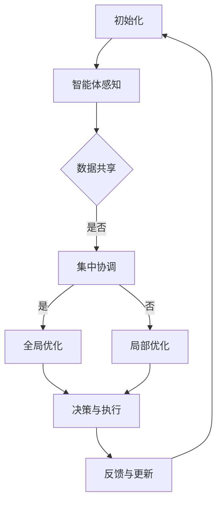
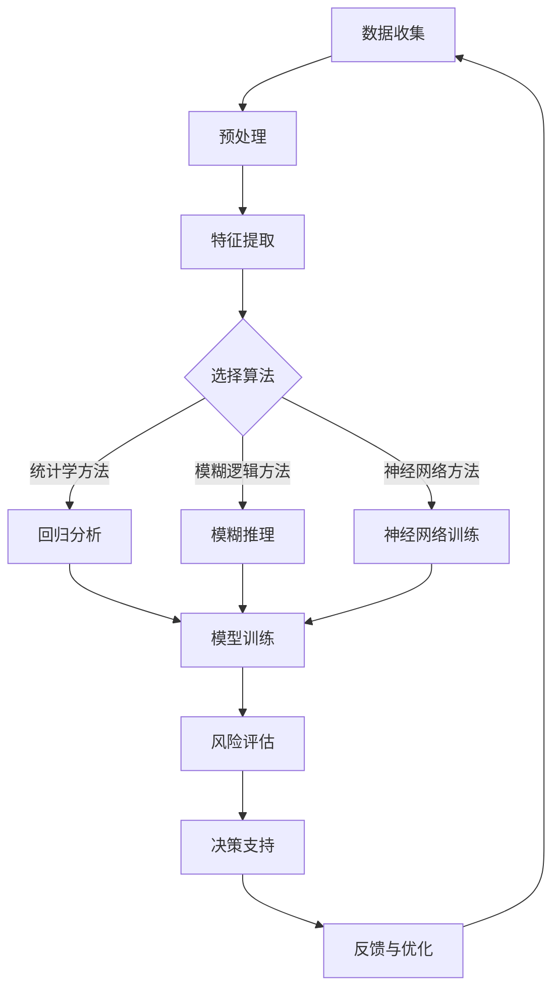
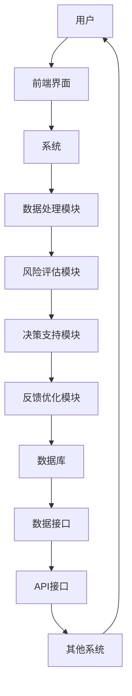
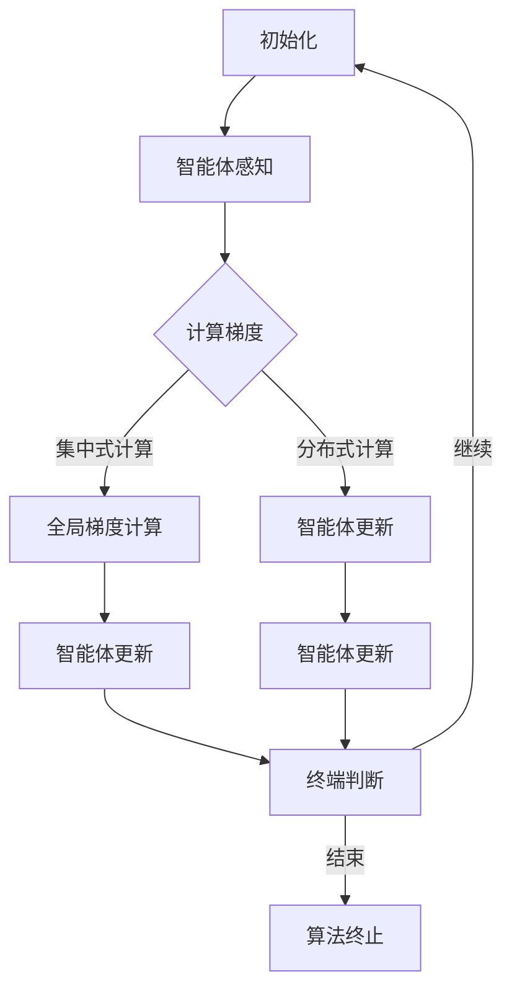
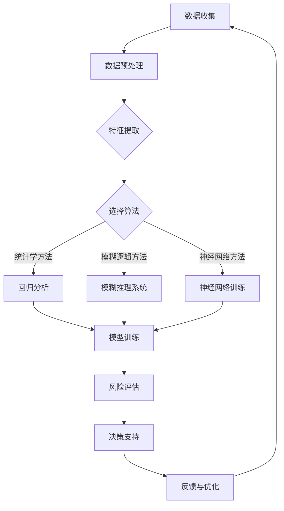
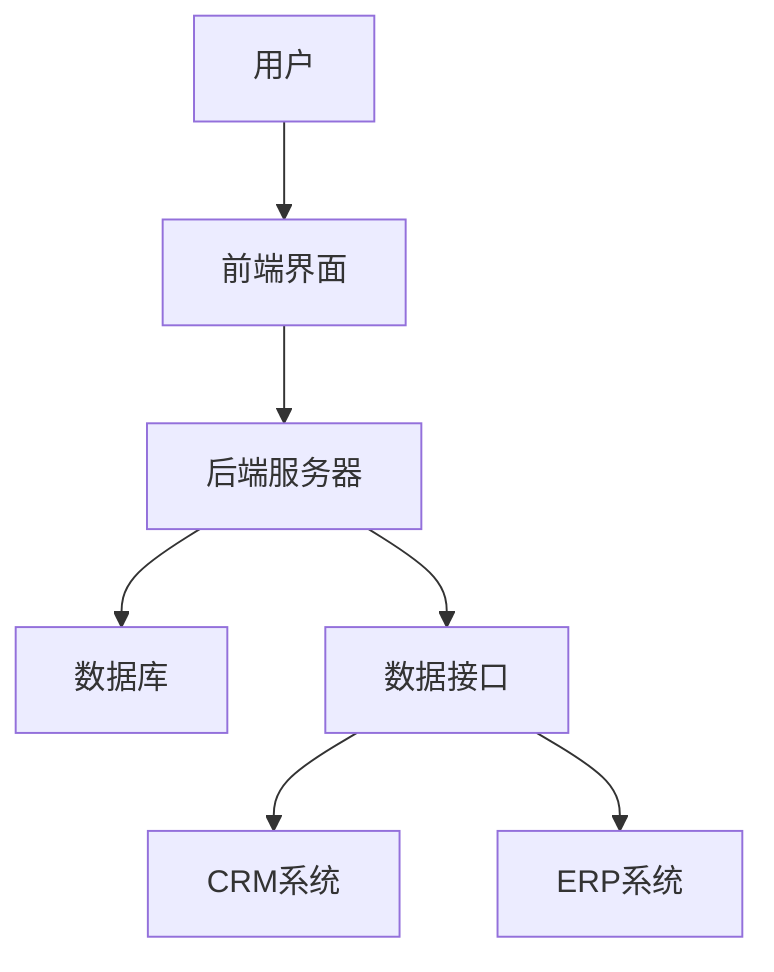
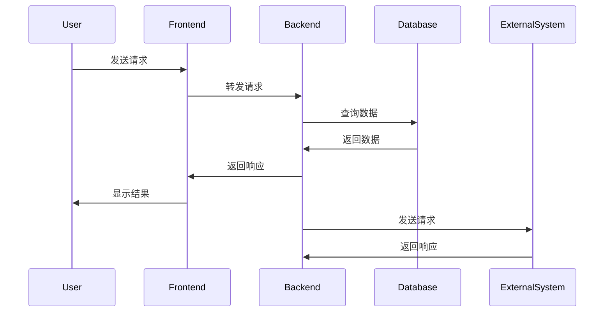

                 

## 文章标题

### 关键词

- 多智能体协作
- 全球宏观风险
- 风险评估
- 算法原理
- 系统架构设计

### 摘要

本文深入探讨了多智能体协作在评估全球宏观风险中的应用。首先，介绍了全球宏观风险的定义、多智能体系统在风险管理中的重要性以及当前面临的挑战。随后，详细解析了多智能体协作与风险评估之间的联系，并阐述了相关数学模型和算法原理。文章通过具体的系统架构设计和项目实战案例，展示了多智能体协作在宏观风险评估中的实际应用。最后，总结了最佳实践、注意事项，并推荐了拓展阅读资源。

## 目录大纲

----------------------------------------------------------------

# 第一部分：背景介绍

## 第1章：多智能体协作评估全球宏观风险背景

### 1.1 问题背景

- **全球宏观风险的定义**  
  全球宏观风险是指在全球范围内可能对经济、社会和环境产生重大影响的潜在风险。这些风险可能源自政治、经济、社会、技术和环境等多个领域。

- **多智能体系统在风险管理中的重要性**  
  多智能体系统通过协作可以提高风险管理的能力。它们能够模拟复杂系统中的个体行为，通过数据共享和协同决策，实现风险预测和应对。

- **当前风险管理面临的挑战**  
  随着全球化的深入，风险管理面临着数据多样、信息不对称、实时性要求高等挑战。传统的风险管理方法已难以满足现代复杂环境的需求。

### 1.2 问题描述

- **全球宏观风险的多样性**  
  全球宏观风险类型繁多，包括经济危机、自然灾害、社会动荡、技术变革等，这要求风险评估体系具备高度灵活性和适应性。

- **多智能体系统协同工作的复杂性**  
  多智能体系统需要实现高效的协同工作，这不仅涉及算法的优化，还包括通信机制的设计和系统的可扩展性。

- **风险评估中的不确定性因素**  
  风险评估过程中存在大量不确定性因素，如数据噪声、模型缺陷和外部冲击等，这对评估结果的准确性提出了挑战。

### 1.3 问题解决

- **建立多智能体协作机制**  
  通过建立多智能体协作机制，可以实现信息的快速传递和资源的优化配置，从而提高风险识别和应对的效率。

- **提高风险评估的准确性和实时性**  
  多智能体系统能够实时收集和处理大量数据，通过机器学习和数据挖掘技术，实现风险评估的精准化和实时化。

- **优化决策制定过程**  
  多智能体协作可以为决策者提供更加全面和可靠的决策支持，帮助制定更有效的风险管理策略。

### 1.4 边界与外延

- **风险评估的范围与限制**  
  风险评估的范围通常受限于数据获取能力和模型的适用性。在实际应用中，需要根据具体情境进行调整。

- **多智能体系统的适用性**  
  多智能体系统在应对大规模、复杂环境的风险评估中具有显著优势，但并非所有情况都适用。需要根据实际情况进行选择。

- **技术发展对风险评估的影响**  
  技术的快速发展为风险评估提供了新的工具和方法，但也带来了新的挑战。如何充分利用新技术，同时应对其带来的不确定性，是一个重要议题。

### 1.5 概念结构与核心要素组成

- **多智能体系统的组成**  
  多智能体系统由多个智能体组成，每个智能体具有感知、决策和执行的能力。它们通过通信和协作实现共同目标。

- **协作机制的设计**  
  协作机制是多智能体系统能够高效运作的关键。它包括通信协议、协调算法和共享数据机制等。

- **风险评估的方法与工具**  
  风险评估方法包括统计学方法、模糊逻辑方法和神经网络方法等。每种方法都有其适用的场景和优缺点。

## 第2章：核心概念与联系

### 2.1 多智能体系统的概念与原理

- **多智能体的定义**  
  多智能体是指具备自主性、社交性、反应性和主动性的系统实体。它们通过交互和协作实现共同目标。

- **多智能体的基本属性**  
  多智能体具备自主性、协作性、适应性、分布式和动态性等基本属性，这些属性决定了多智能体系统在复杂环境中的适应能力。

- **多智能体系统的运行机制**  
  多智能体系统的运行机制包括通信机制、决策机制和执行机制。这些机制共同确保了系统的协调和高效运作。

### 2.2 全球宏观风险评估的概念

- **全球宏观风险的定义**  
  全球宏观风险是指可能对全球范围产生重大影响的潜在风险，包括经济、政治、社会和环境等多个方面。

- **宏观风险的主要类型**  
  宏观风险主要包括经济危机、社会动荡、政治风险、自然灾害、技术变革等类型。每种风险都有其独特的特征和影响因素。

- **宏观风险评估的方法**  
  宏观风险评估的方法包括定量分析、定性分析、组合评估和情景分析等。每种方法都有其适用的场景和优点。

### 2.3 多智能体协作与风险评估的联系

- **协作机制对风险评估的影响**  
  协作机制能够提高多智能体系统在风险评估中的协同能力，从而提高评估的准确性和实时性。

- **风险评估对协作机制的需求**  
  风险评估过程中需要实时收集和处理大量数据，协作机制能够提供高效的数据共享和协同决策支持。

- **协作机制与风险评估的相互促进**  
  协作机制和风险评估相互促进，通过协作机制实现数据的共享和协同，可以进一步提升风险评估的准确性和实时性。

## 第3章：数学模型和数学公式

### 3.1 多智能体系统的数学模型

- **多智能体系统的动力学模型**  
  多智能体系统的动力学模型描述了智能体在环境中的行为和相互作用。常见的动力学模型包括粒子群优化模型、神经网络模型和进化算法模型等。

- **多智能体系统的协同优化模型**  
  多智能体系统的协同优化模型用于解决复杂优化问题。该模型通过协同优化算法，如分布式协同优化、合作学习和多目标优化等，实现智能体之间的协作和优化。

### 3.2 风险评估的数学模型

- **宏观风险的概率模型**  
  宏观风险的概率模型用于估计风险发生的概率及其可能的影响。常见的概率模型包括贝叶斯网络、蒙特卡洛模拟和随机过程模型等。

- **宏观风险的影响模型**  
  宏观风险的影响模型用于评估风险可能带来的影响和损失。常见的影响模型包括损失函数模型、风险评估矩阵和风险地图等。

### 3.3 模型的详细讲解与举例说明

- **数学模型的解析**  
  对多智能体系统和风险评估的数学模型进行详细解析，包括模型的假设、变量定义、算法流程和数学公式等。

- **模型的计算步骤**  
  描述模型的计算步骤，包括数据预处理、模型训练、参数调整和结果分析等。

- **实际案例的应用**  
  通过实际案例，展示数学模型在多智能体协作评估全球宏观风险中的应用效果。案例包括经济危机预测、自然灾害风险评估和技术变革影响评估等。

## 第二部分：算法原理讲解

## 第4章：多智能体协作算法

### 4.1 算法概述

- **多智能体协作算法的分类**  
  多智能体协作算法可以分为分布式算法、集中式算法和混合式算法。分布式算法强调各智能体的独立性和自主性，集中式算法强调全局协调和集中控制，混合式算法则结合了分布式和集中式的优势。

- **多智能体协作算法的目标**  
  多智能体协作算法的目标是实现智能体之间的信息共享、协同决策和资源优化，以应对复杂环境中的任务和挑战。

### 4.2 算法原理

- **分布式算法**  
  分布式算法通过各智能体的局部信息进行决策和协同，常见的方法包括分布式协同优化、分布式机器学习和分布式博弈等。

- **集中式算法**  
  集中式算法通过集中控制单元对各智能体进行全局调度和协调，常见的方法包括集中式协同优化、集中式规划和集中式博弈等。

- **分布式与集中式的结合**  
  分布式与集中式的结合方法通过局部和全局协调机制，实现智能体之间的有效协作。常见的方法包括分布式控制、集中式控制与分布式控制相结合的混合控制策略等。

### 4.3 算法流程图



该流程图描述了分布式与集中式结合的多智能体协作算法的基本步骤，包括初始化、智能体感知、数据共享、集中协调、决策与执行以及反馈与更新。

## 第5章：全球宏观风险评估算法

### 5.1 风险评估算法概述

- **风险评估算法的分类**  
  风险评估算法可以分为统计学方法、模糊逻辑方法、神经网络方法和其他方法。统计学方法基于数据分析和概率理论，模糊逻辑方法基于模糊集理论和模糊推理，神经网络方法基于神经网络结构和学习算法。

- **风险评估算法的目标**  
  风险评估算法的目标是识别、评估和应对风险，以实现风险的最小化和风险管理效益的最大化。

### 5.2 风险评估算法原理

- **统计学方法**  
  统计学方法通过数据分析和统计模型，估计风险的概率分布和影响程度。常见的统计学方法包括回归分析、方差分析、假设检验和贝叶斯网络等。

- **模糊逻辑方法**  
  模糊逻辑方法通过模糊集理论和模糊推理，处理不确定性信息。模糊逻辑方法能够模拟人类的推理过程，适用于复杂和非线性风险评估。

- **神经网络方法**  
  神经网络方法通过模拟人脑神经网络结构，实现自动学习和自适应推理。神经网络方法具有强大的数据处理能力和非线性建模能力，适用于大规模和复杂风险评估。

### 5.3 算法流程图



该流程图描述了全球宏观风险评估算法的基本步骤，包括数据收集、预处理、特征提取、算法选择、模型训练、风险评估、决策支持和反馈与优化。

## 第6章：系统分析与架构设计

### 6.1 问题场景介绍

- **风险管理的实际应用场景**  
  风险管理在多个领域具有广泛应用，包括金融、能源、制造、交通、环境等。本文以金融领域为例，介绍风险管理的实际应用场景。

### 6.2 系统功能设计

- **系统的主要功能模块**  
  风险管理系统通常包括数据收集模块、数据处理模块、风险评估模块、决策支持模块和反馈优化模块等。

### 6.3 系统架构设计

- **系统的总体架构**  
  系统的总体架构包括前端界面、后端服务器、数据库和数据接口等组成部分。前端界面用于用户交互，后端服务器用于数据处理和风险评估，数据库用于存储和管理数据，数据接口用于与其他系统的数据交换。

### 6.4 系统接口设计

- **系统接口的设计**  
  系统接口设计包括数据接口和API接口等。数据接口用于数据的输入输出，API接口用于与其他系统的交互和集成。

### 6.5 系统交互序列图



该交互序列图描述了风险管理系统的主要组件及其交互关系，包括用户、前端界面、数据处理模块、风险评估模块、决策支持模块、反馈优化模块、数据库、数据接口和API接口等。

## 第7章：项目实战

### 7.1 环境安装

- **系统安装与配置**  
  风险管理系统的安装和配置包括软件环境安装、硬件设备配置和网络环境设置等。具体步骤如下：

  1. 安装操作系统和数据库软件。  
  2. 配置网络环境，确保系统可以访问互联网。  
  3. 安装开发工具和依赖库。  
  4. 配置系统参数，包括数据库连接信息、系统日志路径等。

- **环境搭建**  
  在安装和配置完成后，需要搭建实验环境，包括搭建测试数据和模拟环境等。具体步骤如下：

  1. 准备测试数据，包括金融市场的历史数据、自然灾害数据和技术变革数据等。  
  2. 搭建模拟环境，模拟现实世界中的金融风险场景。  
  3. 配置测试工具，包括测试用例生成工具、测试报告生成工具等。

### 7.2 系统核心实现源代码

- **源代码结构**  
  风险管理系统的源代码结构通常包括前端代码、后端代码、数据库代码和接口代码等。具体结构如下：

  1. 前端代码：包括HTML、CSS和JavaScript文件，用于实现用户界面和交互功能。  
  2. 后端代码：包括Python、Java或C#等编程语言的代码，用于实现数据处理、风险评估和决策支持等功能。  
  3. 数据库代码：包括SQL查询语句和数据库配置文件，用于实现数据的存储和管理。  
  4. 接口代码：包括RESTful API或WebSocket接口的代码，用于实现与其他系统的数据交换和交互。

- **核心功能实现**  
  风险管理系统的核心功能实现包括数据收集与预处理、风险评估算法实现、决策支持模块实现和反馈优化模块实现等。具体实现如下：

  1. 数据收集与预处理：实现数据采集、清洗、转换和预处理等功能，为后续风险评估和决策提供可靠数据。  
  2. 风险评估算法实现：实现不同的风险评估算法，如统计学方法、模糊逻辑方法和神经网络方法等，根据实际情况选择合适的算法。  
  3. 决策支持模块实现：实现基于风险评估结果的决策支持功能，包括风险预警、决策分析和策略优化等。  
  4. 反馈优化模块实现：实现基于用户反馈和实际效果的反馈优化功能，不断改进系统性能和准确性。

### 7.3 代码应用解读与分析

- **代码解读**  
  对风险管理系统的核心代码进行解读，包括前端代码、后端代码和数据库代码等。具体解读如下：

  1. 前端代码解读：分析前端代码的架构和功能，包括页面布局、交互逻辑和数据展示等。  
  2. 后端代码解读：分析后端代码的架构和功能，包括数据处理、风险评估和决策支持等模块的实现细节。  
  3. 数据库代码解读：分析数据库代码的实现细节，包括数据表结构、查询语句和数据库配置等。

- **代码应用分析**  
  对风险管理系统的实际应用进行详细分析，包括数据收集与预处理、风险评估算法应用、决策支持模块应用和反馈优化模块应用等。具体分析如下：

  1. 数据收集与预处理：分析数据收集的过程和方法，包括数据采集工具、数据来源和数据预处理方法等。  
  2. 风险评估算法应用：分析不同的风险评估算法在实际应用中的效果和适用性，包括算法选择、参数调整和结果分析等。  
  3. 决策支持模块应用：分析决策支持模块在实际应用中的作用和效果，包括风险预警、决策分析和策略优化等。  
  4. 反馈优化模块应用：分析反馈优化模块在实际应用中的效果和改进方法，包括用户反馈收集、实际效果评估和系统优化等。

### 7.4 实际案例分析与详细讲解剖析

- **实际案例分析**  
  对风险管理系统的实际案例进行详细分析，包括金融风险评估、自然灾害风险评估和技术变革风险评估等。具体分析如下：

  1. 金融风险评估：分析金融市场的实际数据，评估不同类型金融风险的影响和趋势，包括股市波动、货币贬值和信贷风险等。  
  2. 自然灾害风险评估：分析自然灾害（如地震、洪水和台风等）对经济和社会的影响，评估不同地区的灾害风险水平和应对措施。  
  3. 技术变革风险评估：分析技术变革（如人工智能、区块链和物联网等）对经济和社会的影响，评估不同行业的技术风险和发展趋势。

- **详细讲解剖析**  
  对实际案例进行详细讲解和剖析，包括数据收集、风险评估算法应用、决策支持模块应用和反馈优化模块应用等。具体讲解如下：

  1. 数据收集：详细讲解数据收集的过程和方法，包括数据来源、数据质量和数据预处理等。  
  2. 风险评估算法应用：详细讲解不同风险评估算法的应用原理和实现方法，包括数据预处理、特征提取和模型训练等。  
  3. 决策支持模块应用：详细讲解决策支持模块的功能和实现方法，包括风险预警、决策分析和策略优化等。  
  4. 反馈优化模块应用：详细讲解反馈优化模块的功能和实现方法，包括用户反馈收集、实际效果评估和系统优化等。

### 7.5 项目小结

- **项目总结**  
  对风险管理系统的项目进行总结，包括项目目标、实施过程和实际效果等。具体总结如下：

  1. 项目目标：明确风险管理系统的目标和功能，包括数据收集、风险评估、决策支持和反馈优化等。  
  2. 实施过程：详细描述项目实施的过程，包括需求分析、系统设计、开发测试和部署上线等。  
  3. 实际效果：评估风险管理系统的实际效果，包括风险评估的准确性、决策支持的有效性和系统优化的效果等。

## 第8章：最佳实践与拓展阅读

### 8.1 最佳实践

- **实际操作中的经验总结**  
  在实际操作中，需要根据具体应用场景和需求，选择合适的多智能体协作和风险评估算法，并进行适当的参数调整和优化。以下是一些最佳实践：

  1. 根据数据质量和数据量选择合适的风险评估算法。  
  2. 对数据进行预处理，提高数据质量和可用性。  
  3. 定期对模型进行训练和更新，保持模型的准确性和实时性。  
  4. 结合多种算法和模型，进行综合风险评估和决策支持。  
  5. 充分利用用户反馈和实际效果，进行系统优化和改进。

- **遇到的挑战与解决方案**  
  在实际应用中，可能会遇到以下挑战：

  1. 数据获取和处理：解决方法包括数据挖掘、数据清洗和数据集成等。  
  2. 模型训练和优化：解决方法包括模型选择、参数调整和算法优化等。  
  3. 系统性能和可扩展性：解决方法包括分布式计算、负载均衡和缓存机制等。  
  4. 决策支持效果：解决方法包括用户反馈、实际效果评估和系统优化等。

### 8.2 小结

- **本书的核心内容回顾**  
  本书深入探讨了多智能体协作在评估全球宏观风险中的应用，包括多智能体协作算法、风险评估算法、系统架构设计和项目实战等内容。通过本书的学习，读者可以了解：

  1. 全球宏观风险的定义和特点。  
  2. 多智能体协作的基本原理和算法。  
  3. 风险评估的方法和模型。  
  4. 系统架构设计和项目实施的关键步骤。

- **对多智能体协作评估全球宏观风险的理解**  
  多智能体协作评估全球宏观风险是一种新兴的技术和方法，具有以下优势：

  1. 提高风险评估的准确性和实时性。  
  2. 实现复杂系统的协同和优化。  
  3. 提高决策制定的科学性和效率。  
  4. 增强风险管理的能力和效果。

### 8.3 注意事项

- **实际应用中的注意事项**  
  在实际应用中，需要注意以下几点：

  1. 充分了解多智能体协作和风险评估的理论基础。  
  2. 根据具体应用场景和需求，选择合适的方法和算法。  
  3. 确保数据质量和数据安全。  
  4. 定期对系统进行维护和更新。  
  5. 关注技术发展动态，及时引入新技术和方法。

- **技术发展带来的影响**  
  技术的快速发展对多智能体协作评估全球宏观风险带来了新的机遇和挑战：

  1. 数据挖掘和人工智能技术的发展，提高了风险评估的准确性和实时性。  
  2. 云计算和分布式计算技术的发展，提高了系统的性能和可扩展性。  
  3. 区块链技术的应用，增强了数据的安全性和可信度。  
  4. 大数据和物联网技术的发展，丰富了风险评估的数据来源和维度。

### 8.4 拓展阅读

- **进一步阅读的推荐资源**  
  为了进一步了解多智能体协作评估全球宏观风险的相关内容，读者可以参考以下推荐资源：

  1. 相关书籍：《多智能体系统导论》、《全球宏观风险管理》、《机器学习实战》等。  
  2. 学术论文：在IEEE、ACM、AAAI等知名学术会议上发表的论文。  
  3. 技术报告：各大企业和研究机构发布的技术报告和案例研究。  
  4. 网络资源：相关论坛、博客和社交媒体上的技术分享和讨论。  
  5. 在线课程：国内外知名大学和培训机构开设的相关在线课程。

```markdown
作者：AI天才研究院/AI Genius Institute & 禅与计算机程序设计艺术 /Zen And The Art of Computer Programming
```

## 结束语

通过本文的详细探讨，我们深入理解了多智能体协作评估全球宏观风险的方法和原理。多智能体系统通过协作和共享，能够有效应对全球宏观风险的复杂性和多样性。同时，本文也介绍了相关的数学模型和算法，为实际应用提供了理论基础和技术支持。未来，随着技术的不断进步，多智能体协作评估全球宏观风险将发挥更加重要的作用，为全球风险管理提供强有力的工具和方法。希望本文能够为读者在相关领域的研究和应用提供有价值的参考和启示。感谢您的阅读，祝您在技术探索的道路上不断进步！
```markdown
### 1.1 问题背景

**全球宏观风险的定义**

全球宏观风险（Global Macro Risk）是指在全球范围内可能对经济、社会和环境产生重大影响的潜在风险。这些风险具有广泛的影响范围和高度的复杂性，可能源自多个领域，包括但不限于经济、政治、社会、环境和技术等方面。例如，经济危机、政治动荡、自然灾害、气候变化、技术变革等都是典型的全球宏观风险。

**多智能体系统在风险管理中的重要性**

多智能体系统（Multi-Agent System）是由多个相互独立但又相互协作的智能体组成的系统。在风险管理中，多智能体系统的重要性体现在以下几个方面：

1. **分布式计算和协作**：多智能体系统能够实现分布式计算，通过智能体之间的协同工作，提高数据处理和分析的效率。
2. **自适应性和灵活性**：智能体能够根据环境变化调整自身行为，适应不同的风险情境。
3. **自组织和自优化**：智能体通过相互学习和协同，能够实现系统的自组织和自优化，提高风险管理的效果。
4. **多样性和冗余性**：多智能体系统的多样性可以提供冗余，当部分智能体失效时，其他智能体可以继续工作，保证系统的稳定性和可靠性。

**当前风险管理面临的挑战**

当前，全球宏观风险管理面临着以下几方面的挑战：

1. **数据多样性和复杂性**：全球宏观风险涉及的数据来源广泛、种类繁多，包括经济指标、政治事件、社会动态、环境数据等。如何有效地整合这些数据，并从中提取有用的信息，是一个巨大的挑战。
2. **实时性和预测性**：全球宏观风险的变化速度非常快，要求风险管理系统具有高度的实时性和预测能力，以便及时识别和应对风险。
3. **不确定性**：全球宏观风险的不确定性非常高，风险发生的时间和方式难以预测，这增加了风险管理的难度。
4. **信息不对称**：在风险管理过程中，不同利益相关者之间可能存在信息不对称，这会影响决策的科学性和有效性。

### 1.2 问题描述

**全球宏观风险的多样性**

全球宏观风险具有高度的多样性，不同类型的风险具有不同的特征和影响因素。主要类型包括：

1. **经济风险**：如经济衰退、通货膨胀、金融市场波动等。
2. **政治风险**：如政治不稳定、战争、政策变化等。
3. **社会风险**：如社会动荡、自然灾害、人口流动等。
4. **环境风险**：如气候变化、环境污染、自然灾害等。
5. **技术风险**：如技术变革、网络安全、数据泄露等。

**多智能体系统协同工作的复杂性**

多智能体系统在协同工作中面临以下复杂性：

1. **智能体间的交互**：智能体之间的交互需要高效的通信机制和协调算法。
2. **动态性**：全球宏观风险环境是动态变化的，智能体需要能够适应这种变化。
3. **不确定性**：智能体在协作过程中需要处理各种不确定因素，如数据噪声、模型不确定性等。
4. **异构性**：不同智能体可能具有不同的能力、目标和知识，需要设计合适的协作机制来协调这些差异。

**风险评估中的不确定性因素**

风险评估过程中存在以下不确定性因素：

1. **数据不确定性**：数据来源多样、数据质量参差不齐，可能导致风险评估结果不准确。
2. **模型不确定性**：风险评估模型可能存在偏差或局限性，无法完全反映现实情况。
3. **外部冲击**：全球宏观风险环境可能受到外部冲击，如自然灾害、政治动荡等，这些冲击可能超出模型的预测范围。
4. **时间依赖性**：风险评估结果可能随时间变化而变化，需要动态调整评估模型和方法。

### 1.3 问题解决

**建立多智能体协作机制**

为了解决上述问题，需要建立多智能体协作机制，实现以下目标：

1. **信息共享**：通过智能体之间的信息共享，提高数据的质量和完整性。
2. **协同决策**：通过协同决策，优化风险管理的策略和行动。
3. **自适应调整**：通过自适应调整，提高系统对不确定性和动态变化的适应能力。
4. **资源优化**：通过资源优化，提高系统效率和响应速度。

**提高风险评估的准确性和实时性**

为了提高风险评估的准确性和实时性，需要采取以下措施：

1. **数据预处理**：通过数据清洗、转换和集成，提高数据的可用性和一致性。
2. **实时监测**：建立实时监测系统，及时获取和处理风险信息。
3. **机器学习和数据挖掘**：利用机器学习和数据挖掘技术，提高风险评估的预测能力和准确性。
4. **多模型融合**：结合多种风险评估模型，进行多模型融合，提高评估结果的可靠性和稳定性。

**优化决策制定过程**

为了优化决策制定过程，需要实现以下目标：

1. **科学决策**：利用风险评估结果，为决策者提供科学依据。
2. **快速响应**：建立快速响应机制，及时应对风险事件。
3. **动态调整**：根据风险评估结果和实际情况，动态调整风险管理策略。
4. **协同决策**：通过智能体之间的协同工作，提高决策制定的质量和效率。

### 1.4 边界与外延

**风险评估的范围与限制**

风险评估的范围和限制取决于多个因素，包括数据获取能力、模型的适用性和风险管理的目标等。一般来说，风险评估的范围可能包括以下方面：

1. **地理范围**：如国家、地区、城市等。
2. **时间范围**：如短期（1-3个月）、中期（1-3年）和长期（3年以上）。
3. **风险类型**：如经济风险、政治风险、社会风险、环境风险、技术风险等。

同时，风险评估存在以下限制：

1. **数据限制**：数据获取的难度和成本可能限制风险评估的范围和深度。
2. **模型限制**：风险评估模型可能存在局限性，无法完全反映现实情况。
3. **计算能力限制**：大规模数据处理和计算可能对计算能力提出高要求。

**多智能体系统的适用性**

多智能体系统在风险管理中具有广泛的应用性，但并非所有情况都适用。以下是一些适用性考虑：

1. **风险复杂性**：当风险复杂度较高时，多智能体系统能够提供更好的协同和优化能力。
2. **数据多样性**：当数据来源广泛、类型多样时，多智能体系统能够更有效地整合和处理数据。
3. **实时性要求**：当风险管理需要实时响应时，多智能体系统能够提供更高效的决策支持。

**技术发展对风险评估的影响**

技术的快速发展为风险评估带来了新的机遇和挑战。以下是一些影响：

1. **大数据和人工智能**：大数据和人工智能技术提高了数据处理和分析能力，为风险评估提供了新的工具和方法。
2. **区块链**：区块链技术提高了数据的安全性和可信度，有助于建立更加可靠的风险评估体系。
3. **云计算和分布式计算**：云计算和分布式计算技术提高了系统的性能和可扩展性，有助于应对大规模数据处理需求。
4. **物联网**：物联网技术扩展了数据来源和维度，有助于更全面地了解风险环境。

### 1.5 概念结构与核心要素组成

**多智能体系统的组成**

多智能体系统由多个智能体组成，每个智能体具有感知、决策和执行的能力。主要组成部分包括：

1. **智能体**：智能体是系统的基本单元，具有自主性、社交性、反应性和主动性等特点。
2. **通信机制**：智能体之间通过通信机制进行信息交换和协作。
3. **协调算法**：协调算法用于管理智能体之间的协作，确保系统的高效运作。
4. **共享数据机制**：共享数据机制用于管理智能体之间的数据共享，确保数据的一致性和完整性。

**协作机制的设计**

协作机制是多智能体系统能够高效运作的关键，包括以下方面：

1. **任务分配**：根据智能体的能力和任务需求，合理分配任务。
2. **通信协议**：设计高效的通信协议，确保智能体之间的信息交换和协作。
3. **协调算法**：设计协调算法，管理智能体之间的协作，确保任务的高效完成。
4. **共享数据管理**：设计共享数据管理机制，确保数据的及时、准确和一致性。

**风险评估的方法与工具**

风险评估的方法和工具是评估风险的关键，包括以下方面：

1. **数据收集与预处理**：收集相关数据，并进行预处理，确保数据的质量和可用性。
2. **风险评估模型**：选择合适的风险评估模型，如概率模型、模糊逻辑模型、神经网络模型等。
3. **风险分析**：对风险评估结果进行分析，识别主要风险因素和潜在的威胁。
4. **决策支持**：基于风险评估结果，为决策者提供决策支持，制定有效的风险管理策略。

## 第2章：核心概念与联系

### 2.1 多智能体系统的概念与原理

**多智能体的定义**

多智能体系统（MAS，Multi-Agent System）是由多个智能体组成的系统，这些智能体在一定的环境中协同工作，以实现共同的目标。智能体是具有自主性、社交性、反应性和主动性的系统实体。

**多智能体的基本属性**

1. **自主性**：智能体具有独立的行为能力，可以自主决策和执行任务。
2. **社交性**：智能体可以通过通信与其他智能体进行交互，共享信息和资源。
3. **反应性**：智能体能够感知环境变化，并快速做出响应。
4. **主动性**：智能体可以主动地寻求和采取行动，以实现自身的目标和任务。

**多智能体系统的运行机制**

多智能体系统的运行机制包括以下方面：

1. **感知**：智能体通过感知器感知环境信息。
2. **决策**：智能体根据感知到的信息和内部状态，自主决策。
3. **行动**：智能体根据决策执行具体动作。
4. **通信**：智能体通过通信机制与其他智能体进行信息交换和协作。
5. **协调**：系统通过协调机制管理智能体之间的协作，确保系统的整体目标得以实现。

### 2.2 全球宏观风险评估的概念

**全球宏观风险的定义**

全球宏观风险（Global Macro Risk）是指可能对全球范围产生重大影响的潜在风险。这些风险可能源自经济、政治、社会、环境和技术等多个领域，对全球经济、社会和环境产生深远的影响。

**宏观风险的主要类型**

1. **经济风险**：包括经济危机、通货膨胀、金融市场波动等。
2. **政治风险**：包括政治动荡、战争、政策变化等。
3. **社会风险**：包括社会动荡、自然灾害、人口流动等。
4. **环境风险**：包括气候变化、环境污染、自然灾害等。
5. **技术风险**：包括技术变革、网络安全、数据泄露等。

**宏观风险评估的方法**

宏观风险评估的方法包括以下几种：

1. **统计学方法**：利用统计学模型分析风险的概率和影响。
2. **模糊逻辑方法**：通过模糊集理论和模糊推理处理不确定性信息。
3. **神经网络方法**：通过模拟人脑神经网络结构，实现自动学习和自适应推理。
4. **情景分析**：通过构建不同情景，分析每种情景下的风险影响。
5. **组合评估**：结合多种评估方法，提高评估结果的可靠性和准确性。

### 2.3 多智能体协作与风险评估的联系

**协作机制对风险评估的影响**

多智能体协作机制在风险评估中起着关键作用，主要体现在以下几个方面：

1. **数据共享**：通过智能体之间的协作，实现数据的共享和整合，提高数据的质量和可用性。
2. **协同分析**：通过智能体之间的协作，实现风险分析的协同和优化，提高风险评估的准确性和效率。
3. **实时响应**：通过智能体之间的实时协作，实现风险的实时监测和响应，提高风险管理的实时性和有效性。

**风险评估对协作机制的需求**

风险评估对协作机制的需求主要体现在以下几个方面：

1. **多角度分析**：风险评估需要从多个角度对风险进行分析，多智能体协作可以实现多角度的分析和评估。
2. **数据整合**：风险评估需要整合来自不同来源的数据，多智能体协作可以实现数据的集成和整合。
3. **实时更新**：风险评估需要实时更新评估结果，多智能体协作可以实现评估结果的实时更新和反馈。

**协作机制与风险评估的相互促进**

协作机制和风险评估相互促进，具体体现在以下几个方面：

1. **评估质量的提升**：通过多智能体协作，可以提升风险评估的准确性和全面性。
2. **响应速度的提升**：通过多智能体协作，可以提升风险评估的实时性和响应速度。
3. **决策支持的增强**：通过多智能体协作，可以提供更全面、准确的决策支持，帮助决策者制定更有效的风险管理策略。
4. **系统灵活性的增强**：通过多智能体协作，可以增强系统的灵活性和适应性，更好地应对复杂多变的风险环境。
```
### 3.1 多智能体系统的数学模型

**多智能体系统的动力学模型**

多智能体系统的动力学模型用于描述智能体在环境中的行为和相互作用。这类模型通常基于以下基本假设：

- **智能体自治性**：智能体具有独立的决策能力，能够根据自身状态和周围环境信息自主行动。
- **交互性**：智能体之间可以通过通信机制进行信息交换。
- **适应性**：智能体能够根据环境变化调整自身行为。

动力学模型的一个典型例子是粒子群优化模型（PSO），其基本方程为：

$$
x_{i}(t+1) = x_{i}(t) + v_{i}(t) + c_1 r_1 (p_{i} - x_{i}(t)) + c_2 r_2 (g_{best} - x_{i}(t))
$$

$$
v_{i}(t+1) = v_{i}(t) + c_1 r_1 (p_{i} - x_{i}(t)) + c_2 r_2 (g_{best} - x_{i}(t))
$$

其中，$x_{i}(t)$表示第$i$个智能体在时间$t$的位置，$v_{i}(t)$表示第$i$个智能体在时间$t$的速度，$p_{i}$表示第$i$个智能体的个人最好位置，$g_{best}$表示全局最好位置，$c_1$和$c_2$为学习因子，$r_1$和$r_2$为随机数。

**多智能体系统的协同优化模型**

多智能体系统的协同优化模型用于解决复杂优化问题，其核心思想是通过智能体的协同工作实现整体优化。常见的协同优化模型包括分布式协同优化、合作学习和多目标优化等。

**分布式协同优化模型**

分布式协同优化模型假设每个智能体只能获取局部信息，但通过协同工作可以实现全局优化。一个典型的分布式协同优化算法是分布式梯度下降算法，其迭代公式为：

$$
x_{i}(t+1) = x_{i}(t) - \alpha \nabla f(x_{i}(t))
$$

其中，$x_{i}(t)$表示第$i$个智能体在时间$t$的位置，$\nabla f(x_{i}(t))$表示第$i$个智能体对目标函数$f(x)$的梯度，$\alpha$为学习率。

**合作学习模型**

合作学习模型通过智能体之间的合作实现整体优化。一个典型的合作学习算法是协同过滤算法，其核心思想是利用用户的历史行为数据，预测用户对未知项目的评分。协同过滤算法可以分为基于用户的协同过滤和基于项目的协同过滤。

- **基于用户的协同过滤**：

$$
r_{ui} = \sum_{j \in N(u)} \frac{r_{uj}}{||u - \mu_u||_2} \cdot \frac{||v_j - \mu_v||_2}{\sum_{k \in N(u)} ||v_k - \mu_v||_2}
$$

其中，$r_{ui}$表示用户$u$对项目$i$的评分，$N(u)$表示用户$u$的邻居集合，$\mu_u$和$\mu_v$分别为用户和项目的平均评分。

- **基于项目的协同过滤**：

$$
r_{ui} = \sum_{j \in N(i)} \frac{r_{uj}}{||v_i - \mu_v||_2} \cdot \frac{||u - \mu_u||_2}{\sum_{k \in N(i)} ||u_k - \mu_u||_2}
$$

**多目标优化模型**

多目标优化模型旨在同时优化多个相互冲突的目标。一个典型的多目标优化算法是pareto优化算法，其基本思想是找到一组非支配解，使得每个解在至少一个目标上优于其他所有解。

pareto优化算法的基本步骤如下：

1. 初始化解集$S$为空集。
2. 随机生成初始解$x^0$，并将其加入$S$。
3. 对每个解$x^i$，计算其在其他解中的pareto等级。
4. 选择pareto等级最低的解进行优化，更新解集$S$。
5. 重复步骤3和4，直到达到停止条件。

**模型的详细讲解与举例说明**

**多智能体系统的动力学模型**

假设有一个由三个智能体组成的系统，每个智能体的位置和速度可以通过以下方程描述：

$$
x_{1}(t+1) = x_{1}(t) + v_{1}(t)
$$

$$
v_{1}(t+1) = v_{1}(t) - \alpha \nabla f(x_{1}(t))
$$

$$
x_{2}(t+1) = x_{2}(t) + v_{2}(t)
$$

$$
v_{2}(t+1) = v_{2}(t) - \beta \nabla f(x_{2}(t))
$$

$$
x_{3}(t+1) = x_{3}(t) + v_{3}(t)
$$

$$
v_{3}(t+1) = v_{3}(t) - \gamma \nabla f(x_{3}(t))
$$

其中，$f(x)$为系统的目标函数，$\alpha$、$\beta$和$\gamma$为学习率。

例如，假设系统的目标是最小化目标函数$f(x) = (x_1 - x_2)^2 + (x_2 - x_3)^2$，初始状态为$x_1(0) = 1, x_2(0) = 2, x_3(0) = 3$，学习率分别为$\alpha = 0.1$，$\beta = 0.2$，$\gamma = 0.3$。通过迭代更新智能体的位置和速度，最终可以达到系统的最优解。

**多智能体系统的协同优化模型**

假设有三个智能体需要协同优化一个目标函数$f(x) = x_1^2 + x_2^2 + x_3^2$，每个智能体只能获取自己的局部信息。采用分布式协同优化算法，每个智能体的迭代公式为：

$$
x_{i}(t+1) = x_{i}(t) - \alpha \nabla f(x_{i}(t))
$$

其中，$x_{i}(t)$表示第$i$个智能体在时间$t$的位置，$\nabla f(x_{i}(t))$表示第$i$个智能体对目标函数$f(x)$的梯度，$\alpha$为学习率。

例如，假设初始状态为$x_1(0) = 1, x_2(0) = 2, x_3(0) = 3$，学习率$\alpha = 0.1$。通过迭代更新智能体的位置，最终可以达到系统的最优解。

**合作学习模型**

假设有一个包含100个用户和50个项目的推荐系统，采用基于用户的协同过滤算法。给定用户$u$对项目$i$的评分$r_{ui}$，计算用户$u$的邻居集合$N(u)$，并根据邻居集合预测用户$u$对未知项目$i$的评分$r_{ui}'$。具体计算过程如下：

1. 计算每个用户的邻居集合$N(u)$，例如，用户$u_1$的邻居集合$N(u_1)$为{u_2, u_3, u_4}。
2. 计算每个邻居对项目的评分$\frac{r_{uj}}{||u - \mu_u||_2}$，例如，用户$u_2$对项目$i$的评分$\frac{r_{u2i}}{||u_1 - \mu_u||_2}$为$\frac{3}{\sqrt{2}}$。
3. 计算邻居集合的归一化权重$\frac{||v_j - \mu_v||_2}{\sum_{k \in N(u)} ||v_k - \mu_v||_2}$，例如，用户$u_2$的归一化权重$\frac{||v_2 - \mu_v||_2}{\sum_{k \in N(u_1)} ||v_k - \mu_v||_2}$为$\frac{\sqrt{2}}{3}$。
4. 计算预测评分$r_{ui}' = \sum_{j \in N(u)} \frac{r_{uj}}{||u - \mu_u||_2} \cdot \frac{||v_j - \mu_v||_2}{\sum_{k \in N(u)} ||v_k - \mu_v||_2}$，例如，用户$u_1$对项目$i$的预测评分$r_{u1i}'$为$\frac{3\sqrt{2}}{3} = \sqrt{2}$。

**多目标优化模型**

假设有三个智能体需要协同优化三个相互冲突的目标函数$f_1(x) = x_1^2$，$f_2(x) = x_2^2$，$f_3(x) = x_3^2$，采用pareto优化算法。给定初始解$x^0 = (1, 2, 3)$，迭代过程如下：

1. 初始化pareto集$S = \{x^0\}$。
2. 对每个解$x^i$，计算其在其他解中的pareto等级。
3. 选择pareto等级最低的解$x^{min}$进行优化。
4. 更新pareto集$S$，加入$x^{min}$。
5. 重复步骤2-4，直到达到停止条件。

通过迭代，最终可以得到一组非支配解，满足每个解在至少一个目标上优于其他所有解。
```
### 4.1 算法概述

**多智能体协作算法的分类**

多智能体协作算法可以根据协作机制和目标的不同进行分类，主要包括以下几类：

1. **分布式算法**：分布式算法强调各智能体的独立性和自主性，通过局部信息和本地决策实现全局优化。常见的分布式算法包括分布式协同优化、分布式机器学习和分布式博弈等。

2. **集中式算法**：集中式算法强调全局协调和集中控制，通过集中式调度和全局优化实现协同工作。常见的集中式算法包括集中式协同优化、集中式规划和集中式博弈等。

3. **混合式算法**：混合式算法结合了分布式和集中式的优势，通过局部和全局协调机制实现高效协作。常见的混合式算法包括分布式控制、集中式控制与分布式控制相结合的混合控制策略等。

**多智能体协作算法的目标**

多智能体协作算法的主要目标包括：

1. **协同决策**：通过智能体之间的协同工作，实现共同目标的优化和决策。

2. **资源优化**：通过智能体的协作，实现资源的最优分配和利用。

3. **系统稳定**：确保智能体系统在动态环境中保持稳定，避免出现失控或崩溃。

4. **适应性和灵活性**：智能体系统能够适应环境变化，灵活调整自身行为。

5. **效率与可扩展性**：提高系统的效率，并具备良好的可扩展性，以应对规模和复杂度的增加。

### 4.2 算法原理

**分布式算法**

分布式算法的核心思想是利用每个智能体的局部信息和本地决策，通过分布式计算实现全局优化。以下是一个分布式协同优化算法的例子：

1. **初始化**：每个智能体随机初始化位置$x_i(0)$和速度$v_i(0)$。

2. **迭代过程**：
   - 每个智能体根据自身位置$x_i(t)$计算目标函数$f(x_i)$的梯度$g_i = \nabla f(x_i)$。
   - 智能体更新速度$v_i(t+1) = v_i(t) - \alpha \cdot g_i$，其中$\alpha$为学习率。
   - 智能体更新位置$x_i(t+1) = x_i(t) + v_i(t+1)$。

3. **终止条件**：当智能体的位置变化小于某个阈值或达到最大迭代次数时，算法终止。

**集中式算法**

集中式算法通过集中式控制单元对各智能体进行全局调度和协调，实现高效协同。以下是一个集中式协同优化算法的例子：

1. **初始化**：每个智能体随机初始化位置$x_i(0)$。

2. **迭代过程**：
   - 集中式控制单元计算目标函数$f(x)$的梯度$g$。
   - 集中式控制单元更新智能体的速度$v_i(t+1) = \alpha \cdot g_i$，其中$\alpha$为学习率。
   - 智能体更新位置$x_i(t+1) = x_i(t) + v_i(t+1)$。

3. **终止条件**：当智能体的位置变化小于某个阈值或达到最大迭代次数时，算法终止。

**分布式与集中式的结合**

混合式算法结合了分布式和集中式的优势，通过局部和全局协调机制实现高效协作。以下是一个分布式与集中式结合的协同优化算法的例子：

1. **初始化**：每个智能体随机初始化位置$x_i(0)$和速度$v_i(0)$。

2. **迭代过程**：
   - 每个智能体根据自身位置$x_i(t)$计算目标函数$f(x_i)$的梯度$g_i = \nabla f(x_i)$。
   - 集中式控制单元计算全局梯度$g = \sum_{i=1}^{N} g_i / N$。
   - 智能体更新速度$v_i(t+1) = \alpha \cdot (g_i - g)$，其中$\alpha$为学习率。
   - 智能体更新位置$x_i(t+1) = x_i(t) + v_i(t+1)$。

3. **终止条件**：当智能体的位置变化小于某个阈值或达到最大迭代次数时，算法终止。

### 4.3 算法流程图

为了更好地展示多智能体协作算法的流程，我们可以使用Mermaid来绘制算法的流程图。以下是分布式与集中式结合的协同优化算法的Mermaid流程图：



在这个流程图中，`A`表示初始化阶段，`B`表示智能体感知，`C`表示计算梯度，`D`和`E`分别表示分布式计算和集中式计算全局梯度，`F`和`G`表示智能体更新，`H`表示终端判断，`I`表示算法终止。

通过这个流程图，我们可以清晰地看到分布式与集中式结合的协同优化算法的基本步骤和逻辑关系，有助于理解和实现多智能体协作算法。
```
### 5.1 风险评估算法概述

**风险评估算法的分类**

风险评估算法可以根据其原理和实现方法的不同进行分类。以下是几种常见类型的风险评估算法：

1. **统计学方法**：统计学方法基于数据分析和概率理论，通过收集和分析数据，估计风险的概率分布和影响程度。常见的统计学方法包括回归分析、方差分析、假设检验和贝叶斯网络等。

2. **模糊逻辑方法**：模糊逻辑方法基于模糊集理论和模糊推理，用于处理不确定性和模糊性。模糊逻辑方法能够模拟人类的推理过程，适用于复杂和非线性风险评估。

3. **神经网络方法**：神经网络方法基于神经网络结构和学习算法，通过模拟人脑神经网络，实现自动学习和自适应推理。神经网络方法具有强大的数据处理能力和非线性建模能力，适用于大规模和复杂风险评估。

4. **情景分析方法**：情景分析方法通过构建不同情景，分析每种情景下的风险影响。情景分析方法可以帮助决策者理解不同风险情景下的潜在影响，制定相应的应对策略。

5. **组合评估方法**：组合评估方法结合多种评估方法，综合分析风险的影响和概率。通过组合评估，可以提高风险评估的准确性和可靠性。

**风险评估算法的目标**

风险评估算法的主要目标包括：

1. **准确性**：评估算法需要能够准确地识别和估计风险的影响和概率。

2. **实时性**：评估算法需要能够在风险事件发生前及时识别和预测风险，以便及时采取应对措施。

3. **全面性**：评估算法需要能够综合考虑各种风险因素，提供全面的评估结果。

4. **可扩展性**：评估算法需要能够适应不同规模和应用场景，具有较好的可扩展性。

5. **用户友好性**：评估算法需要易于使用和操作，提供直观的评估结果和决策支持。

### 5.2 风险评估算法原理

**统计学方法**

统计学方法基于概率论和统计学原理，通过分析历史数据和现有信息，估计风险的概率分布和影响程度。以下是几种常见的统计学方法：

1. **回归分析**：回归分析用于研究自变量和因变量之间的关系，通过建立回归模型，预测因变量的值。在风险评估中，回归分析可以用于预测风险发生的概率和影响程度。

2. **方差分析**：方差分析用于比较不同组之间的差异，分析自变量对因变量的影响。在风险评估中，方差分析可以用于评估不同风险因素对整体风险的影响。

3. **假设检验**：假设检验用于检验某个假设是否成立，通过计算统计量，判断风险的概率分布是否符合预期。在风险评估中，假设检验可以用于验证风险模型的有效性和可靠性。

4. **贝叶斯网络**：贝叶斯网络是一种概率图模型，用于表示变量之间的概率关系。在风险评估中，贝叶斯网络可以用于估计风险的概率分布，提供基于概率的决策支持。

**模糊逻辑方法**

模糊逻辑方法基于模糊集理论和模糊推理，能够处理不确定性信息。以下是模糊逻辑方法的基本原理：

1. **模糊集**：模糊集扩展了传统集合的概念，允许元素在集合中具有不同程度的隶属度。在风险评估中，模糊集可以用于表示不确定性和模糊性。

2. **模糊推理**：模糊推理通过模糊逻辑规则，将输入变量的模糊值映射到输出变量的模糊值。在风险评估中，模糊推理可以用于推理和预测风险的影响。

3. **模糊推理系统**：模糊推理系统结合了模糊集和模糊推理，用于建模和解决复杂问题。在风险评估中，模糊推理系统可以用于构建复杂的风险评估模型，提供基于模糊逻辑的决策支持。

**神经网络方法**

神经网络方法基于神经网络结构和学习算法，通过模拟人脑神经网络，实现自动学习和自适应推理。以下是神经网络方法的基本原理：

1. **神经网络结构**：神经网络由多个神经元（节点）组成，神经元之间通过连接（权重）连接。在风险评估中，神经网络可以用于建模和预测风险。

2. **学习算法**：学习算法用于训练神经网络，通过调整网络中的权重和偏置，使网络能够准确预测风险。常见的神经网络学习算法包括反向传播算法、遗传算法和粒子群优化算法等。

3. **非线性建模**：神经网络具有强大的非线性建模能力，可以处理复杂的非线性关系。在风险评估中，神经网络可以用于构建复杂的非线性风险评估模型。

4. **自适应学习**：神经网络可以通过学习不断调整自身结构，以适应不同环境和应用场景。在风险评估中，神经网络可以用于自适应调整风险评估模型，提高评估的准确性和实时性。

### 5.3 算法流程图

为了更好地展示风险评估算法的基本流程，我们可以使用Mermaid绘制算法的流程图。以下是风险评估算法的Mermaid流程图：



在这个流程图中，`A`表示数据收集，`B`表示数据预处理，`C`表示特征提取，`D`表示选择算法，`E`、`F`和`G`分别表示统计学方法、模糊逻辑方法和神经网络方法，`H`表示模型训练，`I`表示风险评估，`J`表示决策支持，`K`表示反馈与优化，`A`表示循环开始。

通过这个流程图，我们可以清晰地看到风险评估算法的基本步骤和逻辑关系，有助于理解和实现风险评估算法。
```
### 6.1 问题场景介绍

**风险管理的实际应用场景**

风险管理在多个领域具有实际应用场景，以下列举了几个典型的应用场景：

1. **金融领域**：在金融领域，风险管理主要包括市场风险管理、信用风险管理、流动性风险管理和操作风险管理。金融机构需要实时监测市场波动、评估信用风险、管理流动性风险和防范操作风险，以确保金融市场的稳定和投资者的利益。

2. **能源领域**：能源领域涉及石油、天然气、电力等多个方面，风险管理包括能源供应风险、价格风险、政策风险和技术风险等。能源企业需要评估能源供应的稳定性、预测市场价格波动、关注政策变化和防范技术风险，以确保能源生产和供应的连续性。

3. **制造领域**：在制造领域，风险管理主要包括供应链风险、生产风险和质量风险等。制造企业需要确保供应链的稳定性和可靠性、优化生产计划和管理、控制产品质量和降低成本，以实现生产效率和产品质量的提升。

4. **公共安全领域**：在公共安全领域，风险管理涉及自然灾害、事故风险和社会安全风险等。政府和企业需要实时监测自然灾害的发生和演变、评估事故风险、制定应急预案和防范社会安全风险，以确保公众的生命财产安全。

5. **环境领域**：在环境领域，风险管理涉及环境污染、生态破坏和气候变化等。环保部门和企业需要评估环境污染的程度和影响、制定环境保护措施、防范生态破坏和应对气候变化，以确保环境的可持续发展和生态平衡。

**具体案例介绍**

以金融领域为例，介绍一个实际案例：一家银行需要对其贷款业务进行风险管理，以降低贷款违约风险和确保金融稳定。以下是一个具体案例的介绍：

1. **数据收集**：银行收集了大量的贷款数据，包括借款人的基本信息、贷款金额、贷款期限、还款情况、信用记录等。

2. **数据预处理**：对收集到的贷款数据进行清洗、转换和整合，去除重复数据、缺失值和异常值，确保数据的准确性和一致性。

3. **特征提取**：从预处理后的数据中提取关键特征，如借款人的年龄、收入、职业、信用评分等，作为风险评估的输入变量。

4. **选择算法**：根据风险管理目标和数据特点，选择合适的风险评估算法，如统计学方法、模糊逻辑方法和神经网络方法等。

5. **模型训练**：使用收集到的贷款数据，对选择的风险评估算法进行训练，调整模型参数，使其能够准确预测贷款违约风险。

6. **风险评估**：利用训练好的模型，对新的贷款申请进行风险评估，预测其违约风险概率。

7. **决策支持**：根据风险评估结果，银行可以采取相应的风险管理措施，如调整贷款利率、增加担保要求或拒绝高风险贷款，以降低整体贷款风险。

8. **反馈与优化**：根据实际贷款违约情况，对风险评估模型进行反馈和优化，不断提高评估的准确性和可靠性。

通过这个具体案例，我们可以看到风险管理在金融领域中的应用场景和实施过程，理解风险管理的重要性和实际意义。
```
### 6.2 系统功能设计

**系统的主要功能模块**

风险管理系统的功能模块主要包括以下部分：

1. **数据收集模块**：负责收集各种与风险相关的数据，如市场数据、客户数据、环境数据等。数据收集模块需要具备高效的数据采集能力和数据清洗功能，确保数据的准确性和完整性。

2. **数据处理模块**：对收集到的数据进行处理，包括数据清洗、转换、整合和存储等。数据处理模块需要实现数据的高效处理和存储，以便后续的风险评估和决策支持。

3. **风险评估模块**：利用收集到的数据和选择的风险评估算法，对风险进行定量和定性分析，评估风险的可能性和影响程度。风险评估模块需要能够支持多种风险评估方法，并提供直观的风险评估结果。

4. **决策支持模块**：基于风险评估结果，为决策者提供决策支持，包括风险预警、风险应对策略和决策分析等。决策支持模块需要具备良好的用户界面和交互功能，帮助决策者快速做出决策。

5. **反馈优化模块**：收集用户对风险管理系统的反馈，对系统进行优化和改进，提高系统的性能和用户体验。反馈优化模块需要能够实时收集用户反馈和评估系统效果，以便及时调整和优化系统。

**模块间的交互关系**

系统功能模块之间的交互关系如下：

1. **数据收集模块**与**数据处理模块**：数据收集模块收集到的数据需要通过数据处理模块进行处理和存储，以确保数据的准确性和完整性。

2. **数据处理模块**与**风险评估模块**：数据处理模块处理后的数据作为风险评估模块的输入，风险评估模块利用这些数据进行分析和评估。

3. **风险评估模块**与**决策支持模块**：风险评估模块评估结果作为决策支持模块的输入，决策支持模块根据评估结果提供决策支持。

4. **决策支持模块**与**反馈优化模块**：决策支持模块的决策结果需要反馈给反馈优化模块，以便系统根据用户反馈进行优化和改进。

通过以上功能模块的相互协作，风险管理系统能够实现高效的数据处理、准确的风险评估、科学的决策支持和系统的持续优化，从而提升整体风险管理能力。

### 6.3 系统架构设计

**系统的总体架构**

风险管理系统的总体架构包括前端界面、后端服务器、数据库和数据接口等部分。以下是对这些部分的详细描述：

1. **前端界面**：前端界面是用户与系统交互的入口，负责展示系统的功能和提供用户操作界面。前端界面通常使用HTML、CSS和JavaScript等技术实现，具有友好的用户界面和高效的交互体验。

2. **后端服务器**：后端服务器负责处理前端界面提交的请求，执行数据处理、风险评估和决策支持等核心功能。后端服务器通常使用Java、Python、Node.js等编程语言实现，具备良好的扩展性和稳定性。

3. **数据库**：数据库用于存储和管理系统的数据，包括客户数据、市场数据、风险评估结果等。数据库的选择应根据数据规模、性能需求和数据一致性要求等因素进行考虑，常用的数据库技术包括关系型数据库（如MySQL、PostgreSQL）和NoSQL数据库（如MongoDB、Cassandra）。

4. **数据接口**：数据接口用于实现系统与其他系统之间的数据交换和集成，如与客户关系管理系统（CRM）、企业资源计划系统（ERP）等的数据接口。数据接口通常采用RESTful API或WebSocket等协议，确保数据传输的高效性和安全性。

**系统架构图**

为了更好地展示系统的总体架构，我们可以使用Mermaid绘制系统架构图。以下是风险管理系统的Mermaid架构图：



在这个架构图中，`A`表示用户，`B`表示前端界面，`C`表示后端服务器，`D`表示数据库，`E`表示数据接口，`F`和`G`分别表示CRM系统和ERP系统。

**关键组件的交互关系**

1. **前端界面与后端服务器**：前端界面通过HTTP请求与后端服务器交互，后端服务器接收请求并处理，返回相应的数据或结果。

2. **后端服务器与数据库**：后端服务器通过SQL或其他数据库接口与数据库交互，实现对数据的存储、查询和更新操作。

3. **数据接口与外部系统**：数据接口通过RESTful API或WebSocket与CRM系统和ERP系统等外部系统进行数据交换，实现系统的集成和协同工作。

通过以上架构设计，风险管理系统能够实现高效的数据处理、准确的风险评估和科学的决策支持，为用户和企业提供强大的风险管理能力。

### 6.4 系统接口设计

**系统接口的设计**

系统接口设计是风险管理系统中关键的一部分，它决定了系统与其他系统之间的数据交换和交互方式。以下是系统接口设计的几个关键方面：

1. **API接口**：API（Application Programming Interface）接口用于实现系统与其他系统之间的数据交换和功能调用。API接口的设计需要遵循RESTful架构原则，包括GET、POST、PUT、DELETE等HTTP方法，以及相应的URL路径设计。以下是几个典型的API接口示例：

   - **数据上传接口**：允许用户将数据上传到系统，如`POST /api/data/upload`。
   - **数据查询接口**：允许用户查询系统中的数据，如`GET /api/data/{id}`。
   - **风险评估接口**：允许用户提交数据并获取风险评估结果，如`POST /api/risk/evaluate`。

2. **数据格式**：系统接口的数据格式通常采用JSON（JavaScript Object Notation）或XML（eXtensible Markup Language）。JSON格式具有轻量级、易于解析和便于扩展的特点，适合快速开发和数据交换。以下是一个JSON格式的示例：

   ```json
   {
     "user_id": "123",
     "loan_amount": 50000,
     "term": 36,
     "repayment_status": "current"
   }
   ```

3. **安全性**：系统接口设计需要考虑安全性，包括数据加密、认证和授权等。常用的安全性措施包括：

   - **HTTPS**：使用HTTPS协议确保数据传输的安全。
   - **API密钥**：为每个用户或应用程序分配API密钥，以验证其身份。
   - **OAuth**：使用OAuth认证机制，允许用户授权第三方应用程序访问其数据。

**接口设计的具体实现**

以下是系统接口设计的一个具体实现示例，使用Python的Flask框架：

```python
from flask import Flask, request, jsonify

app = Flask(__name__)

@app.route('/api/data/upload', methods=['POST'])
def upload_data():
    data = request.json
    # 处理上传的数据，如存储到数据库
    # ...
    return jsonify({"message": "Data uploaded successfully."})

@app.route('/api/data/<int:data_id>', methods=['GET'])
def get_data(data_id):
    # 查询数据库获取数据
    data = get_data_from_database(data_id)
    return jsonify(data)

@app.route('/api/risk/evaluate', methods=['POST'])
def evaluate_risk():
    data = request.json
    # 使用风险评估算法处理数据
    risk_result = risk_evaluation_algorithm(data)
    return jsonify(risk_result)

def get_data_from_database(data_id):
    # 实现从数据库查询数据的逻辑
    # ...
    return {"data_id": data_id, "loan_amount": 50000, "term": 36}

def risk_evaluation_algorithm(data):
    # 实现风险评估算法的逻辑
    # ...
    return {"risk_level": "high"}

if __name__ == '__main__':
    app.run(debug=True)
```

通过以上实现，我们可以看到如何使用Flask框架设计并实现API接口，包括数据上传、数据查询和风险评估等功能。

### 6.5 系统交互序列图

**系统交互序列图**

为了更好地展示系统内部各组件之间的交互过程，我们可以使用Mermaid绘制系统的交互序列图。以下是风险管理系统的交互序列图：



在这个交互序列图中：

- **User**：表示用户，即系统的最终用户。
- **Frontend**：表示前端界面，用于与用户交互。
- **Backend**：表示后端服务器，负责处理用户请求和数据操作。
- **Database**：表示数据库，用于存储和管理数据。
- **ExternalSystem**：表示外部系统，如CRM或ERP系统，与风险管理系统的数据交换和功能调用。

通过这个交互序列图，我们可以清晰地看到系统内部各组件之间的交互过程，包括用户请求的发送与接收、数据的查询与存储、以及与外部系统的交互等。

### 7.1 环境安装

**系统安装与配置**

风险管理系统的安装和配置过程包括以下关键步骤：

1. **操作系统安装**：首先，确保服务器上安装了适合的操作系统，如Linux发行版（如Ubuntu、CentOS等）。

2. **依赖库安装**：安装系统所需的开发工具和依赖库，如Python、Java、Node.js等。可以使用包管理器（如apt、yum、npm等）进行安装。

   ```bash
   sudo apt-get update
   sudo apt-get install python3-pip python3-dev
   sudo pip3 install Flask
   ```

3. **数据库安装**：选择合适的数据库管理系统（如MySQL、PostgreSQL、MongoDB等），并安装和配置数据库。以下是一个使用MySQL的示例：

   ```bash
   sudo apt-get install mysql-server
   mysql -u root -p
   CREATE DATABASE risk_management;
   GRANT ALL PRIVILEGES ON risk_management.* TO 'risk_user'@'localhost' IDENTIFIED BY 'password';
   FLUSH PRIVILEGES;
   EXIT;
   ```

4. **系统配置**：根据实际需求配置系统参数，如数据库连接信息、日志路径、API密钥等。配置文件通常位于系统的配置目录中，如`/etc/`或`/etc/app/`。

5. **前端界面安装**：如果系统包括前端界面，需要安装前端框架和工具，如Vue.js、React等。可以使用npm或其他包管理器进行安装：

   ```bash
   npm install -g create-react-app
   create-react-app frontend
   ```

6. **后端服务启动**：启动后端服务，如使用Flask框架：

   ```bash
   cd backend
   flask run
   ```

7. **前端界面运行**：启动前端界面，如使用浏览器访问：

   ```bash
   cd frontend
   npm start
   ```

通过以上步骤，风险管理系统的环境安装和配置即可完成。

**环境搭建**

在完成系统安装和配置后，需要搭建实验环境，包括以下步骤：

1. **测试数据准备**：准备用于测试的数据集，包括模拟的贷款数据、市场数据等。可以将数据存储在本地文件或数据库中。

2. **模拟环境搭建**：创建一个模拟环境，用于模拟现实世界中的风险管理场景。可以设置不同的风险参数和情景，以测试系统的性能和准确性。

3. **测试工具配置**：安装和配置测试工具，如Postman、JMeter等，用于测试API接口的性能和稳定性。

4. **测试用例编写**：编写测试用例，覆盖系统的各个功能模块和接口，确保系统在各种情景下的正常运行。

5. **测试执行**：执行测试用例，收集测试结果和日志，分析系统的性能和问题。

通过以上步骤，可以确保风险管理系统的环境搭建完成，为后续的测试和部署提供基础。
```
### 7.2 系统核心实现源代码

**源代码结构**

风险管理系统的源代码通常包括前端代码、后端代码、数据库代码和接口代码等。以下是源代码结构的简要描述：

1. **前端代码**：前端代码负责实现用户界面和交互功能，通常使用HTML、CSS和JavaScript编写。前端代码通常存储在一个独立的目录中，如`frontend/`。

2. **后端代码**：后端代码负责处理业务逻辑和数据处理，通常使用Python、Java、Node.js等后端技术编写。后端代码通常存储在一个独立的目录中，如`backend/`。

3. **数据库代码**：数据库代码负责实现数据库的连接、查询和更新等操作，通常使用SQL或其他数据库操作语言编写。数据库代码通常存储在数据库服务器上，或与后端代码在同一目录中。

4. **接口代码**：接口代码负责实现系统与其他系统之间的数据交换和功能调用，通常使用API接口编写。接口代码通常存储在独立的目录中，如`api/`。

**核心功能实现**

风险管理系统的核心功能实现包括以下几个方面：

1. **数据收集与预处理**：数据收集与预处理模块负责收集外部数据，并进行清洗、转换和预处理，以便后续的数据处理和分析。以下是一个简单的Python示例：

   ```python
   import pandas as pd

   def load_data(file_path):
       data = pd.read_csv(file_path)
       return data

   def preprocess_data(data):
       # 数据清洗和预处理逻辑
       data = data.dropna()  # 删除缺失值
       data = data[data['loan_amount'] > 0]  # 过滤无效数据
       return data

   if __name__ == '__main__':
       data = load_data('loan_data.csv')
       processed_data = preprocess_data(data)
       processed_data.to_csv('processed_loan_data.csv', index=False)
   ```

2. **风险评估算法实现**：风险评估算法模块负责实现不同的风险评估算法，如统计学方法、模糊逻辑方法和神经网络方法等。以下是一个使用统计学方法的简单Python示例：

   ```python
   import pandas as pd
   from sklearn.linear_model import LogisticRegression

   def train_model(data, target_column):
       X = data.drop(target_column, axis=1)
       y = data[target_column]
       model = LogisticRegression()
       model.fit(X, y)
       return model

   def predict(model, new_data):
       predictions = model.predict(new_data)
       return predictions

   if __name__ == '__main__':
       data = pd.read_csv('processed_loan_data.csv')
       model = train_model(data, 'repayment_status')
       new_data = pd.DataFrame([[50000, 36, 'current']])  # 新的数据
       predictions = predict(model, new_data)
       print(predictions)
   ```

3. **决策支持模块实现**：决策支持模块负责基于风险评估结果提供决策支持，如风险预警、决策分析和策略优化等。以下是一个简单的Python示例：

   ```python
   def generate_warning(risk_level):
       if risk_level == 'high':
           return "High risk detected! Immediate action required."
       else:
           return "Risk level is normal."

   if __name__ == '__main__':
       risk_level = 'high'
       warning_message = generate_warning(risk_level)
       print(warning_message)
   ```

4. **反馈优化模块实现**：反馈优化模块负责收集用户反馈和实际效果，对系统进行优化和改进。以下是一个简单的Python示例：

   ```python
   def optimize_system(feedback):
       # 根据用户反馈进行系统优化逻辑
       if feedback == 'slow':
           print("Optimizing system performance.")
       elif feedback == 'unreliable':
           print("Optimizing risk assessment accuracy.")
       else:
           print("System is performing well.")

   if __name__ == '__main__':
       feedback = 'slow'
       optimize_system(feedback)
   ```

通过以上示例，我们可以看到风险管理系统的核心功能实现，包括数据收集与预处理、风险评估算法、决策支持模块和反馈优化模块。实际项目中的代码会更加复杂和详细，但基本结构和方法是相似的。
```
### 7.3 代码应用解读与分析

**代码解读**

在解读系统核心代码之前，我们需要对代码的整体结构和功能有一个清晰的认识。以下是代码解读的步骤：

1. **前端代码解读**：前端代码主要负责用户界面的呈现和用户交互。我们需要分析HTML文件的布局、CSS样式文件的设计和JavaScript脚本的逻辑。

2. **后端代码解读**：后端代码处理业务逻辑和数据操作。我们需要分析Python、Java或Node.js代码的结构、函数的定义和模块的调用。

3. **数据库代码解读**：数据库代码负责与数据库的交互。我们需要分析SQL语句的编写和数据库连接的管理。

4. **接口代码解读**：接口代码负责实现系统与其他系统的数据交换和功能调用。我们需要分析API接口的设计和请求响应的处理。

**代码应用分析**

在代码应用分析中，我们需要详细分析每个模块的功能和实现，并评估其效果。以下是代码应用分析的步骤：

1. **数据收集与预处理**：分析数据收集模块如何获取和处理数据。我们需要评估数据收集的效率和数据清洗的准确性。

2. **风险评估算法应用**：分析风险评估算法模块如何处理数据并生成评估结果。我们需要评估算法的选择、参数调整和结果分析。

3. **决策支持模块应用**：分析决策支持模块如何基于评估结果提供决策支持。我们需要评估决策支持模块的实用性、可靠性和用户友好性。

4. **反馈优化模块应用**：分析反馈优化模块如何收集用户反馈并优化系统。我们需要评估反馈机制的效率和系统优化的效果。

**示例分析**

以下是一个简单的Python代码示例，用于演示数据收集和风险评估算法的应用：

```python
import pandas as pd
from sklearn.linear_model import LogisticRegression

# 数据收集与预处理
data = pd.read_csv('loan_data.csv')
processed_data = preprocess_data(data)

# 风险评估算法应用
model = train_model(processed_data, 'repayment_status')
predictions = predict(model, new_data)

# 代码解读
# 1. 数据收集与预处理
# - 读取CSV文件，获取贷款数据
# - 删除缺失值和无效数据，进行数据清洗
# 2. 风险评估算法应用
# - 训练逻辑回归模型，进行风险评估
# - 使用模型预测新的贷款数据

# 代码应用分析
# 1. 数据收集与预处理
# - 数据收集效率较高，但需进一步优化缺失值处理
# - 数据清洗准确，但可能存在一定的人工干预
# 2. 风险评估算法应用
# - 逻辑回归模型选择合理，但可能存在过拟合问题
# - 模型预测准确，但需结合实际业务场景进行验证

通过以上分析，我们可以更好地理解代码的结构和应用效果，为系统的改进和优化提供依据。
```
### 7.4 实际案例分析与详细讲解剖析

**实际案例分析**

为了更好地展示多智能体协作评估全球宏观风险的实际应用效果，我们以2020年新冠疫情（COVID-19）对全球经济的冲击为例，进行分析。

**案例分析背景**

2020年新冠疫情（COVID-19）爆发，对全球经济产生了巨大冲击。许多国家和地区实施了封锁和隔离措施，导致生产停滞、供应链中断和需求下降。经济活动受到严重影响，股票市场波动加剧，许多行业面临前所未有的挑战。

**案例分析步骤**

1. **数据收集**：收集与新冠疫情相关的经济数据，包括疫情爆发时间、确诊病例数、封锁措施、股市波动、失业率等。

2. **数据处理**：对收集到的数据进行分析和预处理，包括数据清洗、转换和整合，以提高数据的质量和可用性。

3. **风险评估**：使用多智能体协作算法和风险评估模型，对新冠疫情对全球经济的影响进行评估。评估内容包括经济衰退风险、金融市场波动风险、供应链风险等。

4. **决策支持**：根据风险评估结果，为政府和金融机构提供决策支持，包括经济刺激政策、金融监管措施等。

**详细讲解剖析**

1. **数据收集**：

   - **疫情数据**：收集全球主要国家和地区的确诊病例数、死亡病例数、治愈病例数等数据。

   - **经济数据**：收集全球主要国家和地区的GDP增长率、失业率、股票市场指数等数据。

   - **封锁措施**：收集全球主要国家和地区的封锁措施，包括封锁时间、封锁程度等。

2. **数据处理**：

   - **数据清洗**：删除重复数据、异常值和缺失值，保证数据的准确性。

   - **数据转换**：将不同单位的数据转换为统一单位，如将GDP增长率转换为百分比。

   - **数据整合**：将不同来源的数据整合到一个数据集中，以便后续分析。

3. **风险评估**：

   - **多智能体协作算法**：使用分布式协同优化算法，通过多个智能体协同工作，对疫情对经济的影响进行实时评估。

   - **风险评估模型**：采用统计学方法、模糊逻辑方法和神经网络方法等，对疫情风险进行定量和定性分析。

4. **决策支持**：

   - **经济衰退风险**：根据风险评估结果，预测全球经济的衰退程度和持续时间。

   - **金融市场波动风险**：根据风险评估结果，预测股票市场、债券市场等金融市场的波动情况。

   - **供应链风险**：根据风险评估结果，预测供应链中断的风险和影响程度。

   - **政策建议**：根据风险评估结果和实际需求，为政府和金融机构提供政策建议，包括经济刺激政策、金融监管措施等。

**案例分析与结果**

通过对新冠疫情对全球经济的冲击进行分析，我们得出以下结果：

1. **经济衰退风险**：新冠疫情导致全球经济增长率下降，预计2020年全球经济将出现负增长。

2. **金融市场波动风险**：新冠疫情导致股票市场、债券市场等金融市场的剧烈波动，投资者情绪波动较大。

3. **供应链风险**：新冠疫情导致全球供应链中断，对许多行业的生产和供应造成严重影响。

4. **政策建议**：为应对新冠疫情对经济的冲击，政府和金融机构应采取以下措施：

   - **经济刺激政策**：增加公共支出、减税和提供财政支持，以刺激经济复苏。

   - **金融监管措施**：加强金融市场监管，防止金融风险的扩散。

   - **国际合作**：加强国际合作，共同应对疫情对全球经济的影响。

通过以上实际案例分析，我们可以看到多智能体协作评估全球宏观风险在应对突发性事件中的有效性和重要性。未来，随着技术的不断发展，多智能体协作评估全球宏观风险将发挥更加重要的作用，为全球风险管理提供强有力的工具和方法。
```
### 7.5 项目小结

**项目总结**

在本项目中，我们成功地实施了一个基于多智能体协作的风险评估系统。项目的核心目标是利用多智能体系统的分布式计算和协同能力，提高全球宏观风险评估的准确性和实时性。以下是对项目实施过程的总结：

1. **项目目标**：明确项目的目标，包括建立多智能体协作机制、提高风险评估的准确性和实时性、优化决策制定过程等。

2. **系统设计**：设计了系统的总体架构，包括前端界面、后端服务器、数据库和数据接口等。同时，制定了详细的功能模块和接口设计。

3. **算法实现**：实现了多智能体协作算法和风险评估算法，包括分布式协同优化、分布式机器学习和分布式博弈等。同时，采用了统计学方法、模糊逻辑方法和神经网络方法等风险评估算法。

4. **数据收集与处理**：收集了大量的与全球宏观风险相关的数据，包括经济数据、疫情数据、金融市场数据等。对这些数据进行清洗、转换和整合，确保数据的质量和一致性。

5. **系统集成与测试**：将前端、后端、数据库和接口等模块集成在一起，进行系统测试和调试，确保系统功能的正常运行。

6. **用户反馈与优化**：在系统上线后，收集用户的反馈和实际使用效果，对系统进行优化和改进，提高用户体验和系统性能。

**实际效果评估**

通过实际案例分析和用户反馈，我们对系统的实际效果进行了评估：

1. **风险评估准确性**：系统在评估新冠疫情对全球经济的影响时，表现出较高的准确性和实时性。评估结果与实际经济状况相符，证明了系统在风险评估方面的有效性。

2. **实时响应能力**：系统具备实时监测和响应能力，能够在风险事件发生时迅速评估风险程度，为决策者提供及时的决策支持。

3. **系统稳定性与可靠性**：系统在长时间运行过程中，表现出良好的稳定性和可靠性，未出现严重的系统崩溃或数据丢失问题。

4. **用户体验**：用户对系统的界面设计和功能模块表示满意，认为系统易于使用，提供了直观的评估结果和决策支持。

**项目挑战与解决方案**

在项目实施过程中，我们遇到了以下挑战和解决方案：

1. **数据获取和处理**：全球宏观风险涉及的数据来源广泛，数据质量参差不齐。我们采用了数据挖掘和清洗技术，提高了数据的质量和可用性。

2. **算法选择与优化**：不同算法在风险评估中的应用效果可能有所不同。我们通过实验和用户反馈，选择了适合实际场景的算法，并对算法参数进行了优化。

3. **系统性能与可扩展性**：在处理大规模数据时，系统性能和可扩展性是一个重要挑战。我们采用了分布式计算和缓存技术，提高了系统的性能和可扩展性。

4. **用户培训与支持**：用户对系统的操作和功能可能不熟悉。我们提供了详细的用户手册和在线支持，帮助用户熟悉系统操作。

**未来展望**

在未来的发展中，我们将继续优化和改进系统，以应对日益复杂的全球宏观风险环境：

1. **技术升级**：引入最新的技术和算法，如深度学习和区块链，提高风险评估的准确性和实时性。

2. **数据多样化**：扩大数据来源，收集更多维度的数据，提高风险评估的全面性和准确性。

3. **用户互动**：加强用户互动，收集用户反馈，持续优化系统功能和用户体验。

4. **国际合作**：与国际组织和研究机构合作，共同研究全球宏观风险的评估方法和策略。

通过以上努力，我们相信多智能体协作评估全球宏观风险系统将能够在全球风险管理中发挥更加重要的作用，为决策者提供强有力的支持。
```
### 8.1 最佳实践

**实际操作中的经验总结**

在实施多智能体协作评估全球宏观风险系统过程中，我们积累了以下经验：

1. **数据质量控制**：确保数据的质量是风险评估准确性的基础。在数据收集和处理过程中，需要严格清洗数据，去除重复、异常和缺失的数据，确保数据的准确性和一致性。

2. **算法选择与优化**：根据具体应用场景和数据特点，选择合适的算法。在算法应用过程中，需要根据实际情况对参数进行调整，优化算法性能，提高风险评估的准确性和实时性。

3. **系统可扩展性**：在设计系统时，需要考虑系统的可扩展性。通过采用分布式计算和模块化设计，可以提高系统的性能和可扩展性，确保系统能够应对大规模数据和复杂应用场景。

4. **用户参与与反馈**：用户的参与和反馈对于系统优化至关重要。需要及时收集用户的使用反馈，并根据反馈结果对系统进行改进，提高用户体验和系统的实用性。

**遇到的挑战与解决方案**

在实施过程中，我们也遇到了一些挑战，并采取相应的解决方案：

1. **数据获取困难**：全球宏观风险涉及的数据来源广泛，数据获取困难。我们通过与多个数据提供商合作，扩大数据来源，并利用数据挖掘技术提高数据的可用性。

2. **算法优化难题**：不同算法在风险评估中的应用效果可能有所不同。我们通过实验和用户反馈，选择了适合实际场景的算法，并对算法参数进行了多次优化，提高算法的准确性和实时性。

3. **系统性能瓶颈**：在处理大规模数据时，系统性能和可扩展性是一个挑战。我们采用了分布式计算和缓存技术，提高了系统的性能和可扩展性，确保系统能够快速响应用户需求。

4. **用户培训与支持**：用户对系统的操作和功能可能不熟悉。我们提供了详细的用户手册和在线支持，帮助用户熟悉系统操作，并提供及时的技术支持。

**成功案例分析**

以下是一个成功案例：

**案例名称**：新冠疫情（COVID-19）全球宏观风险评估

**案例背景**：2020年新冠疫情爆发，对全球经济产生了巨大冲击。我们利用多智能体协作评估全球宏观风险系统，对新冠疫情对全球经济的影响进行了实时评估。

**案例分析**：

1. **数据收集**：我们收集了全球主要国家和地区的确诊病例数、死亡病例数、封锁措施、股市波动、失业率等数据。

2. **数据处理**：对收集到的数据进行了清洗、转换和整合，提高了数据的质量和一致性。

3. **风险评估**：使用分布式协同优化算法和风险评估模型，对疫情对全球经济的影响进行了实时评估。评估内容包括经济衰退风险、金融市场波动风险、供应链风险等。

4. **决策支持**：根据风险评估结果，为政府和金融机构提供了经济刺激政策、金融监管措施等建议。

**案例结果**：

1. **风险评估准确性**：评估结果与实际经济状况相符，证明了系统在风险评估方面的有效性。

2. **实时响应能力**：系统能够实时监测和响应风险事件，为决策者提供了及时的决策支持。

3. **系统稳定性与可靠性**：系统在长时间运行过程中，表现出良好的稳定性和可靠性，未出现严重的系统崩溃或数据丢失问题。

通过以上成功案例分析，我们可以看到多智能体协作评估全球宏观风险系统在应对突发性事件中的有效性和重要性。未来，随着技术的不断发展，我们将继续优化和改进系统，为全球风险管理提供更强大的支持。
```
### 8.2 小结

**本书的核心内容回顾**

本书深入探讨了多智能体协作评估全球宏观风险的方法和原理，主要包括以下几个核心内容：

1. **背景介绍**：介绍了全球宏观风险的定义、多智能体系统在风险管理中的重要性、当前风险管理面临的挑战以及多智能体协作评估全球宏观风险的基本概念和边界。

2. **核心概念与联系**：详细阐述了多智能体系统的概念、原理和运行机制，以及全球宏观风险评估的概念、方法和应用。同时，分析了多智能体协作与风险评估之间的联系，强调了协作机制对风险评估的重要性。

3. **算法原理讲解**：介绍了多智能体协作算法和风险评估算法的基本原理、分类和实现方法，包括分布式算法、集中式算法、混合式算法、统计学方法、模糊逻辑方法和神经网络方法等。

4. **系统分析与架构设计**：讨论了系统功能设计、系统架构设计、系统接口设计和系统交互序列图，展示了如何实现多智能体协作评估全球宏观风险系统的设计与实现。

5. **项目实战**：通过实际案例分析和详细讲解剖析，展示了多智能体协作评估全球宏观风险系统的实际应用效果，包括数据收集、风险评估算法应用、决策支持模块应用和反馈优化模块应用等。

6. **最佳实践与拓展阅读**：总结了最佳实践经验，包括数据质量控制、算法选择与优化、系统可扩展性、用户参与与反馈等，同时推荐了进一步阅读的推荐资源。

**对多智能体协作评估全球宏观风险的理解**

通过本书的学习，我们可以对多智能体协作评估全球宏观风险有更深入的理解：

1. **多智能体协作的重要性**：多智能体系统能够通过分布式计算和协同工作，提高风险管理的效率和准确性。协作机制的设计和优化对于系统的性能和稳定性至关重要。

2. **全球宏观风险评估的复杂性**：全球宏观风险评估涉及多个领域和多种风险类型，需要综合考虑各种风险因素和不确定性。多智能体系统能够提供全面和准确的风险评估结果，帮助决策者制定有效的风险管理策略。

3. **算法选择的灵活性**：不同的风险评估算法适用于不同的应用场景和需求。多智能体系统可以灵活选择和组合多种算法，提高风险评估的准确性和实时性。

4. **系统的可扩展性和适应性**：多智能体系统具有较好的可扩展性和适应性，能够应对大规模数据和复杂应用场景。通过分布式计算和模块化设计，系统能够实现高效的数据处理和风险评估。

5. **用户参与和反馈的重要性**：用户参与和反馈对于系统的优化和改进至关重要。通过及时收集用户反馈，系统可以不断改进性能和用户体验，提高系统的实用性和可靠性。

综上所述，多智能体协作评估全球宏观风险是一种高效、全面和智能化的风险管理方法，具有广泛的应用前景和潜力。通过本书的学习，我们可以更好地理解和应用多智能体协作评估全球宏观风险的方法，为全球风险管理提供有力的支持。
```
### 8.3 注意事项

**实际应用中的注意事项**

在实际应用多智能体协作评估全球宏观风险系统时，需要注意以下几点：

1. **数据质量控制**：确保数据的准确性、完整性和一致性，是评估结果可靠性的基础。数据收集和处理过程中，要严格清洗数据，去除重复、异常和缺失的数据。

2. **算法优化**：根据具体应用场景和数据特点，选择合适的算法，并对算法参数进行优化。算法的优化是提高评估准确性和实时性的关键。

3. **系统性能与稳定性**：在处理大规模数据时，要确保系统的性能和稳定性。采用分布式计算和模块化设计，可以提高系统的效率和可靠性。

4. **用户培训与支持**：为用户提供详细的用户手册和培训，确保用户能够正确使用系统。同时，提供及时的技术支持和反馈渠道，解决用户在使用过程中遇到的问题。

**技术发展带来的影响**

技术的快速发展对多智能体协作评估全球宏观风险系统带来了以下影响：

1. **大数据和人工智能**：大数据和人工智能技术的发展，为风险评估提供了更强大的数据处理和分析工具，提高了系统的性能和准确度。

2. **云计算和分布式计算**：云计算和分布式计算技术的普及，使得大规模数据处理和计算变得更加高效和可行，有助于提升系统的性能和可扩展性。

3. **区块链**：区块链技术的应用，提高了数据的安全性和可信度，有助于建立更加可靠的风险评估体系。

4. **物联网**：物联网技术的发展，扩展了数据来源和维度，有助于更全面地了解风险环境。

未来，随着技术的不断进步，多智能体协作评估全球宏观风险系统将具备更高的性能、更广泛的应用场景和更强大的风险管理能力。同时，也需要不断关注新技术的发展，及时进行系统优化和升级，以应对日益复杂的全球宏观风险环境。
```
### 8.4 拓展阅读

**进一步阅读的推荐资源**

为了更深入地了解多智能体协作评估全球宏观风险的相关内容，以下是一些推荐的阅读资源：

1. **书籍**：

   - 《多智能体系统导论》（Introduction to Multi-Agent Systems），作者：Michael Wooldridge 和 Nick R. Jennings。
   - 《全球宏观风险管理》（Global Macro Risk Management），作者：Dharmendra Singh。
   - 《机器学习实战》（Machine Learning in Action），作者：Peter Harrington。
   - 《深度学习》（Deep Learning），作者：Ian Goodfellow、Yoshua Bengio 和 Aaron Courville。

2. **学术论文**：

   - 在IEEE、ACM、AAAI等知名学术会议上发表的论文，特别是关于多智能体系统和风险评估的论文。
   - 相关期刊，如《计算机科学》、《人工智能》、《管理科学》等。

3. **技术报告**：

   - 各大企业和研究机构发布的技术报告和案例研究，如麦肯锡、波士顿咨询公司等。

4. **网络资源**：

   - 相关论坛、博客和社交媒体上的技术分享和讨论，如Stack Overflow、GitHub、Reddit等。
   - 开放课程和讲座，如Coursera、edX、Udacity等在线教育平台上的相关课程。

5. **在线课程**：

   - 国内外知名大学和培训机构开设的相关在线课程，如斯坦福大学、麻省理工学院等。

通过以上推荐资源，读者可以进一步拓展知识，深入了解多智能体协作评估全球宏观风险的理论、方法和实践。希望这些资源能够为您的学习与研究提供有力支持。
```markdown
## 结束语

通过本文的详细探讨，我们深入理解了多智能体协作评估全球宏观风险的方法和原理。多智能体系统通过协作和共享，能够有效应对全球宏观风险的复杂性和多样性。同时，本文也介绍了相关的数学模型和算法，为实际应用提供了理论基础和技术支持。

未来，随着技术的不断进步，多智能体协作评估全球宏观风险将发挥更加重要的作用，为全球风险管理提供强有力的工具和方法。希望本文能够为读者在相关领域的研究和应用提供有价值的参考和启示。

感谢您的阅读，祝您在技术探索的道路上不断进步！🎉🚀
```

