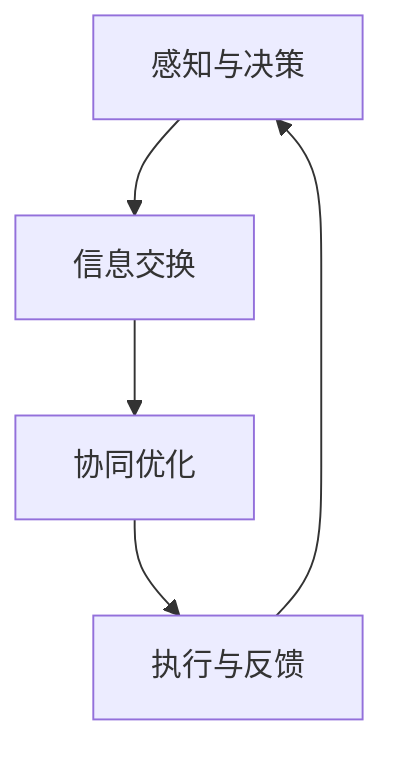
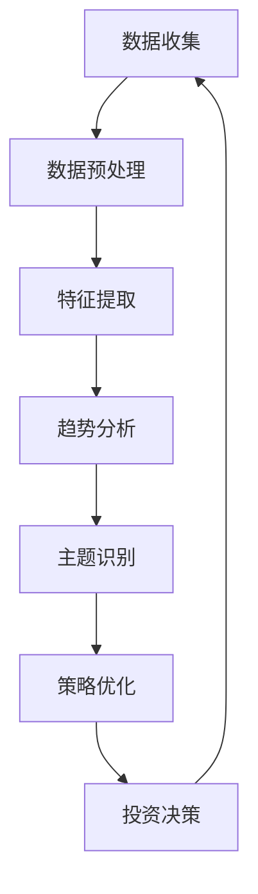
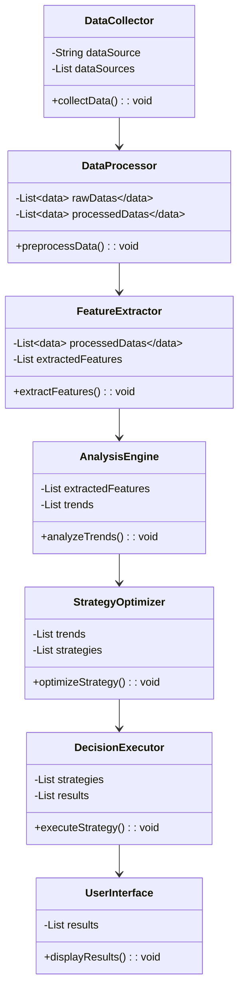
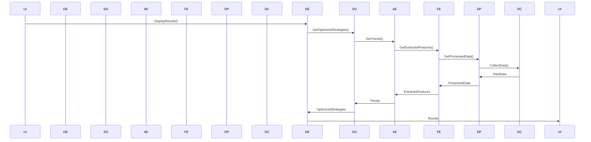
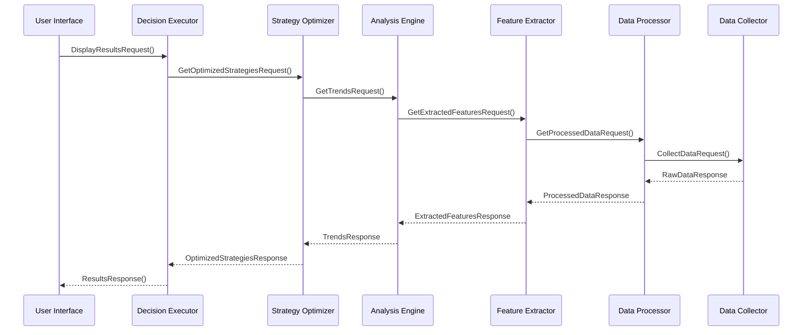

                 


### 引言：多智能体协作的必要性

在现代金融市场中，投资决策的过程日益复杂，不仅涉及到大量的历史数据，还需要实时分析市场动态、宏观经济因素以及政策变化等多方面的信息。传统的单一智能体投资决策模型已经难以满足这种复杂环境下的需求。因此，多智能体协作成为了一种新的解决方案。

**问题的背景**：

随着金融市场的发展，投资决策变得愈发复杂，不仅因为数据量的增加，还因为市场参与者的多样性。传统的中央化决策模式存在效率低、反应慢、无法处理大量并发请求等问题。而分布式决策模式，如多智能体协作，能够更好地适应这一变化。

**问题的描述**：

在多智能体协作中，每个智能体都是独立的计算单元，能够根据自身获取的信息进行决策。多个智能体通过协同工作，可以形成更强大的决策能力。在投资决策中，这意味着可以同时分析不同市场指标、不同投资策略，甚至不同经济环境下的表现。

**问题解决的思路**：

多智能体协作能够通过分布式计算和协同学习，提高投资决策的效率、准确性和适应性。智能体之间的信息共享和协同优化，可以帮助识别市场趋势、预测风险以及制定最佳投资策略。

**边界与外延**：

多智能体协作的投资决策模型需要考虑的边界包括：智能体之间的通信效率、系统的扩展性和稳定性、以及决策结果的可靠性和一致性。外延则包括如何将多种数据源进行整合、如何处理实时数据流的处理能力、以及如何适应不同的市场环境和投资目标。

### 多智能体系统的定义与结构

多智能体系统（MAS）是一种由多个具有独立计算能力、能够自主进行决策和行动的智能体组成的分布式系统。这些智能体通过协作，共同完成复杂的任务，具有高度的自适应性和灵活性。

**多智能体系统的概念**：

多智能体系统是一个由多个智能体组成的网络，每个智能体都可以自主地感知环境、制定策略并执行行动。智能体之间通过通信进行信息交换，以实现协同工作。

**多智能体系统的组成部分**：

1. **智能体**：智能体是多智能体系统的基本计算单元，具有感知、决策和行动的能力。
2. **环境**：环境是智能体所处的物理或抽象空间，智能体可以通过感知环境来获取信息。
3. **通信机制**：智能体之间通过通信机制进行信息交换，以实现协作和协调。
4. **协调机制**：协调机制用于管理智能体之间的协作，确保系统的整体效率。

**多智能体系统的特点**：

1. **分布性**：智能体分散在不同的地理位置，各自独立运行。
2. **自治性**：智能体具有独立的决策能力，能够自主制定策略并执行行动。
3. **协同性**：多个智能体通过协作共同完成任务，提高系统的整体性能。
4. **适应性**：智能体可以根据环境变化自适应调整策略，以应对复杂动态环境。

### 多智能体协作的原理与机制

多智能体协作是多智能体系统（MAS）中的一个核心概念，它通过智能体之间的交互来实现共同目标。理解多智能体协作的原理和机制，对于构建高效、可靠的MAS至关重要。

**多智能体协作的原理**：

多智能体协作基于以下几个基本原理：

1. **分布式计算**：每个智能体都拥有独立计算能力，能够处理局部信息并作出局部决策。
2. **信息共享**：智能体之间通过通信机制共享信息，以便更好地理解整体情况。
3. **协同优化**：智能体通过协作，共同优化整体性能，而不是单纯追求个体利益。
4. **动态适应**：智能体可以根据环境变化动态调整策略，以保持系统稳定性和高效性。

**多智能体协作的机制**：

多智能体协作的机制主要包括以下几个方面：

1. **通信机制**：智能体之间通过通信机制交换信息，这些信息可以是感知数据、决策结果、协作请求等。
2. **协调机制**：协调机制用于管理智能体之间的协作，确保它们在执行任务时能够协同一致。
3. **任务分配机制**：任务分配机制用于将整体任务分解为多个子任务，并分配给不同的智能体。
4. **决策机制**：决策机制用于智能体在获取信息后作出决策，包括局部决策和全局决策。

**多智能体协作的优势与挑战**：

**优势**：

1. **提高效率**：通过分布式计算和协作，多智能体系统能够快速处理大量信息，提高决策效率。
2. **增强适应性**：智能体可以根据环境变化动态调整策略，增强系统的适应能力。
3. **提高可靠性**：多智能体系统能够通过冗余设计提高系统的容错性和可靠性。

**挑战**：

1. **通信复杂性**：智能体之间的通信可能导致信息传递延迟、数据不一致等问题。
2. **协调困难**：在复杂环境下，智能体之间的协调可能变得非常困难，需要设计有效的协调机制。
3. **安全与隐私**：多智能体系统需要处理敏感信息，如何确保数据安全和用户隐私成为重要挑战。

### 宏观主题投资的概述

宏观主题投资是一种利用宏观经济环境和特定主题因素进行投资决策的策略。它不仅考虑单个股票或资产的表现，还关注整体市场趋势和宏观经济状况。

**宏观主题投资的定义**：

宏观主题投资是指通过分析宏观经济指标、政策变化、行业趋势等宏观因素，识别出具有长期投资价值的主题或领域，并在该主题或领域中采取相应的投资策略。

**宏观主题投资的重要性**：

宏观主题投资的重要性主要体现在以下几个方面：

1. **长期收益**：通过把握宏观主题，投资者可以在长期内获得更高的收益。
2. **风险分散**：宏观主题投资可以帮助投资者在不同的市场环境中分散风险。
3. **政策机会**：政策变化往往对市场产生深远影响，宏观主题投资能够帮助投资者抓住政策机会。
4. **行业变迁**：随着行业变迁和新兴产业的崛起，宏观主题投资能够帮助投资者捕捉到新的投资机遇。

**宏观主题投资的流程**：

宏观主题投资的流程主要包括以下几个步骤：

1. **市场研究**：分析宏观经济指标、政策变化、行业趋势等，识别潜在的投资主题。
2. **主题筛选**：根据市场研究的结果，筛选出具有投资价值的主题。
3. **投资策略制定**：针对选定的主题，制定相应的投资策略，包括投资品种、投资比例等。
4. **投资执行**：根据投资策略执行具体的投资操作，并进行动态调整。

通过以上流程，宏观主题投资能够帮助投资者更好地把握市场机会，实现资产增值。

### 多智能体系统的核心概念

多智能体系统（MAS）是一种复杂的分布式系统，其核心概念包括智能体的定义与属性、智能体之间的交互机制以及系统的协调与控制策略。理解这些核心概念对于设计和实现高效、可靠的多智能体系统至关重要。

**智能体的定义与属性**：

智能体是MAS的基本计算单元，具有感知、决策和行动的能力。智能体通常由以下几个基本属性构成：

1. **自主性**：智能体具有独立的行为能力，能够自主感知环境、制定策略并执行行动。
2. **社会性**：智能体可以与其他智能体进行交互，通过通信机制共享信息和资源。
3. **反应性**：智能体能够对外部事件做出快速反应，调整自身行为以适应环境变化。
4. **预动性**：智能体能够根据预测结果采取行动，具有前瞻性。
5. **适应性**：智能体能够根据环境变化自适应调整策略，以实现最优目标。

**智能体之间的交互机制**：

智能体之间的交互是MAS实现协同工作的关键。交互机制通常包括以下几个方面：

1. **感知与通信**：智能体通过感知机制获取环境信息，并通过通信机制与其他智能体交换信息。
2. **协作与协调**：智能体通过协作机制共同完成任务，通过协调机制保持系统一致性。
3. **任务分配与协调**：系统根据任务分配机制将整体任务分解为多个子任务，并分配给不同的智能体，通过协调机制确保各智能体之间的任务协同。

**多智能体系统的协调与控制策略**：

协调与控制策略是多智能体系统实现高效协作的关键。常见的协调与控制策略包括：

1. **集中式控制**：通过中央控制单元对整个系统进行协调和控制，适用于任务简单、智能体数量较少的系统。
2. **分布式控制**：智能体之间通过协商和协调实现整体任务分配和协调，适用于任务复杂、智能体数量较多的系统。
3. **混合控制**：结合集中式控制和分布式控制的优点，适用于不同规模和复杂度的系统。

通过以上核心概念的阐述，我们可以更好地理解多智能体系统的运行原理，从而设计和实现高效、可靠的多智能体系统。

### 宏观主题投资的核心概念

宏观主题投资是一种基于宏观经济环境和特定主题因素进行投资决策的策略。理解宏观主题投资的核心概念对于成功实施这种策略至关重要。以下是宏观主题投资的核心概念及其在投资决策中的应用。

**主题投资的定义与分类**：

宏观主题投资是指投资者通过分析宏观经济趋势、政策变化、行业变革等因素，识别出具有长期投资价值的主题，并在这些主题相关领域中采取相应的投资策略。主题投资可以分为以下几类：

1. **行业主题**：围绕特定行业的发展趋势进行投资，如新能源、人工智能、云计算等。
2. **区域主题**：关注特定地区或国家的经济发展和政策变化，如一带一路、粤港澳大湾区等。
3. **政策主题**：基于政策变化进行投资，如减税政策、产业补贴、科技创新政策等。
4. **宏观经济主题**：关注宏观经济指标的变化，如利率、通胀、经济增长等。

**主题投资的策略与方法**：

宏观主题投资策略主要包括以下几个方面：

1. **基本面分析**：通过分析宏观经济指标、行业趋势、公司财务状况等基本面信息，识别出具有投资价值的主题。
2. **技术分析**：运用技术分析工具，如K线图、均线系统等，预测市场趋势和主题变化。
3. **组合投资**：通过构建主题投资组合，分散风险，实现收益最大化。
4. **动态调整**：根据市场变化和政策环境，动态调整投资组合，保持投资策略的灵活性和适应性。

**宏观经济因素与主题投资的关系**：

宏观经济因素对主题投资具有重要影响。以下是一些关键宏观经济因素与主题投资的关系：

1. **经济增长**：经济增长可以推动行业发展和创新，为相关主题投资提供良好的市场环境。
2. **通胀水平**：通胀水平会影响投资者的购买力和投资回报，需要根据通胀预期调整投资策略。
3. **利率政策**：利率政策的变化会影响投资成本和回报，需要关注利率走势对主题投资的影响。
4. **政策环境**：政府的政策变化可以创造新的投资机遇，如减税政策、产业补贴等。

通过以上对宏观主题投资核心概念的阐述，我们可以更好地理解如何在实际投资决策中运用这些策略和方法，从而实现投资收益的最大化。

### 概念属性特征对比表格

为了更好地理解多智能体系统和宏观主题投资的核心概念，我们可以通过一个对比表格来展示这两个概念在属性特征上的异同。

| 特征                  | 多智能体系统                                 | 宏观主题投资                                     |
|----------------------|--------------------------------------------|-------------------------------------------------|
| 目标                 | 实现分布式计算和协同工作，提高系统效率       | 获取长期投资价值，实现资产增值                   |
| 组成部分             | 智能体、环境、通信机制、协调机制           | 宏观经济因素、行业趋势、政策变化、投资策略       |
| 自主性               | 智能体具有独立决策和行动的能力             | 投资者根据分析结果制定策略，但受市场影响较大     |
| 社会性               | 智能体之间通过通信和协作实现共同目标       | 投资者之间可能存在信息共享和策略互动             |
| 反应性               | 智能体能够快速响应环境变化                 | 投资者需要快速适应市场变化，调整投资组合         |
| 预动性               | 智能体能够预测环境变化并采取行动           | 投资者根据宏观经济预测制定长期投资策略         |
| 适应性               | 智能体能够根据环境变化调整策略             | 投资者根据市场变化和政策环境调整投资策略       |
| 分布性               | 系统由多个分散的智能体组成                 | 投资者分布在不同的市场和市场区域               |
| 协同性               | 智能体之间通过协作实现整体目标             | 投资者通过组合投资和策略互动实现整体投资收益   |

通过这个对比表格，我们可以更清晰地看到多智能体系统和宏观主题投资在属性特征上的异同，从而更好地理解它们各自的核心概念和运作机制。

### ER实体关系图架构

为了更好地展示多智能体系统和宏观主题投资之间的关联，我们可以通过ER（实体-关系）图来构建这两个概念的关系架构。以下是多智能体系统的ER图和宏观主题投资的ER图。

#### 多智能体系统的ER图

```mermaid
erDiagram
    智能体 ||--|{ 通信机制  }||>
    智能体 ||--|{ 协调机制  }||>
    环境findOrFail 智能体 ||--|{ 感知环境 }||>
    通信机制 ||--|{ 信息交换 }||> 智能体
    协调机制 ||--|{ 任务分配 }||> 智能体
```

#### 宏观主题投资的ER图

```mermaid
erDiagram
    投资者 ||--|{ 投资策略 }||>
    宏观经济因素 ||--|{ 影响投资 }||> 投资者
    行业趋势 ||--|{ 影响投资 }||> 投资者
    政策变化 ||--|{ 影响投资 }||> 投资者
    投资策略 ||--|{ 执行投资 }||> 投资者
```

通过这两个ER图，我们可以看到多智能体系统中的智能体、通信机制、协调机制与宏观主题投资中的投资者、宏观经济因素、行业趋势、政策变化以及投资策略之间的关联。这些关系展示了多智能体系统如何通过感知环境、协调任务和交换信息，为宏观主题投资提供支持，从而实现分布式计算和协同工作。

### 多智能体协作算法

多智能体协作算法是多智能体系统（MAS）中实现智能体之间协同工作的核心机制。本文将介绍一种常用的多智能体协作算法，并详细讲解其原理和步骤。

#### 算法原理介绍

多智能体协作算法的核心思想是：每个智能体根据自身感知的信息和环境状态，通过某种协同机制与其他智能体交换信息，从而共同优化整体目标。该算法通常包括以下几个步骤：

1. **感知与决策**：每个智能体首先感知当前环境状态，并根据预定的策略或学习算法进行决策。
2. **信息交换**：智能体之间通过通信机制交换决策信息，以获取其他智能体的状态和策略。
3. **协同优化**：智能体根据交换的信息，调整自身策略，以实现整体目标的最优化。
4. **执行与反馈**：智能体根据最终决策执行行动，并反馈执行结果，以便进一步优化策略。

#### 算法流程图

以下是一个使用Mermaid语言表示的多智能体协作算法流程图：



#### 算法数学模型和公式

多智能体协作算法通常可以用以下数学模型和公式进行描述：

1. **感知与决策**：
   $$ s_i = \phi(e_i, s_i^t) $$
   其中，$s_i$ 表示智能体 $i$ 的状态，$e_i$ 表示智能体 $i$ 感知的环境信息，$\phi$ 表示感知函数。

2. **信息交换**：
   $$ u_i = \Psi(s_i, s_j) $$
   其中，$u_i$ 表示智能体 $i$ 根据感知到的其他智能体状态 $s_j$ 生成的决策信息，$\Psi$ 表示信息交换函数。

3. **协同优化**：
   $$ \pi_i = \theta(s_i, u_j) $$
   其中，$\pi_i$ 表示智能体 $i$ 根据自身状态和接收到的决策信息 $u_j$ 生成的优化策略，$\theta$ 表示协同优化函数。

4. **执行与反馈**：
   $$ a_i = \gamma(\pi_i, e_i) $$
   其中，$a_i$ 表示智能体 $i$ 根据优化策略 $\pi_i$ 执行的行动，$\gamma$ 表示执行函数。

#### 算法原理的详细讲解和举例说明

假设我们有一个由三个智能体组成的系统，每个智能体都需要协作完成一个共同任务。以下是一个简化的示例：

1. **感知与决策**：
   - 智能体1感知到环境中的温度为25°C，根据预设策略决定开启空调。
   - 智能体2感知到环境中的温度为27°C，决定开启风扇。
   - 智能体3感知到环境中的温度为23°C，决定关闭所有设备。

2. **信息交换**：
   - 智能体1将空调开启的信息发送给智能体2和智能体3。
   - 智能体2将风扇开启的信息发送给智能体1和智能体3。
   - 智能体3将关闭所有设备的信息发送给智能体1和智能体2。

3. **协同优化**：
   - 智能体1根据智能体2和智能体3的信息，调整空调的温度设置。
   - 智能体2根据智能体1和智能体3的信息，调整风扇的转速。
   - 智能体3根据智能体1和智能体2的信息，重新评估是否需要关闭设备。

4. **执行与反馈**：
   - 智能体1根据调整后的策略，将空调温度设置为24°C。
   - 智能体2根据调整后的策略，将风扇转速调整为中等。
   - 智能体3根据调整后的策略，决定不再关闭设备。

通过这个示例，我们可以看到多智能体协作算法如何通过感知、决策、信息交换和协同优化，实现智能体之间的有效协作，从而完成共同任务。在实际应用中，这个算法可以根据不同的场景和任务进行扩展和优化。

### 宏观主题投资算法

宏观主题投资算法是一种利用宏观经济数据和市场趋势进行投资决策的算法。该算法的核心在于识别潜在的投资主题，并通过数据分析和策略优化实现资产增值。以下将详细介绍宏观主题投资算法的原理、流程和数学模型。

#### 算法原理介绍

宏观主题投资算法基于以下几个核心原理：

1. **数据驱动**：算法通过分析大量的宏观经济数据和市场指标，识别出潜在的投资主题。
2. **趋势分析**：算法利用时间序列分析和趋势预测技术，预测市场趋势和主题变化。
3. **策略优化**：算法通过优化算法，如遗传算法、粒子群优化等，生成最优投资策略。

#### 算法流程图

以下是一个使用Mermaid语言表示的宏观主题投资算法流程图：



#### 算法数学模型和公式

宏观主题投资算法的数学模型主要包括以下几个部分：

1. **数据预处理**：
   $$ X = \text{Preprocess}(D) $$
   其中，$X$ 表示预处理后的数据集，$D$ 表示原始数据集，$\text{Preprocess}$ 表示数据预处理函数。

2. **特征提取**：
   $$ F = \text{ExtractFeatures}(X) $$
   其中，$F$ 表示特征向量集，$X$ 表示预处理后的数据集，$\text{ExtractFeatures}$ 表示特征提取函数。

3. **趋势分析**：
   $$ T = \text{AnalyzeTrends}(F) $$
   其中，$T$ 表示趋势向量集，$F$ 表示特征向量集，$\text{AnalyzeTrends}$ 表示趋势分析函数。

4. **主题识别**：
   $$ \Theta = \text{IdentifyThemes}(T) $$
   其中，$\Theta$ 表示主题集合，$T$ 表示趋势向量集，$\text{IdentifyThemes}$ 表示主题识别函数。

5. **策略优化**：
   $$ \Pi = \text{OptimizeStrategy}(\Theta) $$
   其中，$\Pi$ 表示优化后的投资策略集，$\Theta$ 表示主题集合，$\text{OptimizeStrategy}$ 表示策略优化函数。

6. **投资决策**：
   $$ D = \text{MakeInvestmentDecision}(\Pi) $$
   其中，$D$ 表示投资决策，$\Pi$ 表示优化后的投资策略集，$\text{MakeInvestmentDecision}$ 表示投资决策函数。

#### 算法原理的详细讲解和举例说明

以下是一个简化的宏观主题投资算法应用示例：

1. **数据收集**：
   算法从多个数据源（如财经新闻、经济指标数据库等）收集数据，构建一个包含宏观经济指标和市场指标的数据集。

2. **数据预处理**：
   对收集到的数据集进行清洗、归一化和缺失值处理，以便后续分析。

3. **特征提取**：
   从预处理后的数据集中提取关键特征，如GDP增长率、通货膨胀率、股市指数等。

4. **趋势分析**：
   利用时间序列分析方法，分析提取出的特征向量，预测其未来趋势。

5. **主题识别**：
   根据趋势分析结果，识别出潜在的投资主题，如新能源、科技股、消费升级等。

6. **策略优化**：
   通过遗传算法等优化技术，生成最优投资策略，以实现资产增值。

7. **投资决策**：
   根据优化后的投资策略，执行具体的投资操作，并实时监控市场变化，进行动态调整。

通过这个示例，我们可以看到宏观主题投资算法如何通过数据收集、预处理、特征提取、趋势分析、主题识别、策略优化和投资决策等步骤，实现从数据到投资决策的完整流程。在实际应用中，这个算法可以根据不同市场和投资目标进行定制和优化。

### 问题场景介绍

在投资决策问题场景中，我们面临的是一个复杂且动态变化的金融市场环境。这个系统需要处理大量的数据源，包括历史股价、宏观经济指标、行业数据、政策信息等。此外，市场参与者众多，投资策略多样，实时数据流的处理能力要求高。因此，我们需要一个高效、可靠的系统来支持投资决策。

**投资决策系统概述**：

投资决策系统主要由以下几个核心模块组成：

1. **数据采集模块**：负责从多个数据源（如财经新闻、数据库、交易所等）收集数据，包括历史股价、宏观经济指标、行业数据、政策信息等。
2. **数据处理模块**：对采集到的原始数据进行清洗、归一化和缺失值处理，为后续分析提供高质量的数据。
3. **特征提取模块**：从处理后的数据中提取关键特征，如趋势指标、动量指标、市场情绪指标等，为投资决策提供基础。
4. **分析引擎模块**：利用时间序列分析、机器学习等技术，对提取出的特征进行分析和预测，识别出潜在的投资主题和市场趋势。
5. **策略优化模块**：基于分析结果，使用优化算法（如遗传算法、粒子群优化等）生成最优投资策略。
6. **决策执行模块**：根据优化后的策略，执行具体的投资操作，并实时监控市场变化，进行动态调整。
7. **用户界面模块**：提供用户交互界面，展示分析结果、投资策略和决策执行情况，方便用户进行监控和调整。

通过以上模块的协同工作，投资决策系统可以高效地处理大量数据，生成最优投资策略，支持投资者在复杂市场环境中做出明智的投资决策。

### 系统功能设计

在投资决策系统中，领域模型是描述系统功能的重要工具。领域模型通过类图展示系统中的主要类及其关系，从而帮助开发者理解系统的设计和实现。以下是投资决策系统的领域模型，使用Mermaid语言绘制：



通过这个领域模型，我们可以清晰地看到投资决策系统中各个模块之间的关系和功能。每个模块都有明确的输入和输出，并通过接口进行通信。这种结构有助于保证系统的可维护性和可扩展性。

### 系统架构设计

投资决策系统的架构设计是确保系统高效、可靠运行的关键。以下将使用Mermaid语言绘制系统的架构图，展示各个模块之间的关系和交互方式。



通过这个架构图，我们可以清晰地看到各个模块之间的交互流程。用户界面（UI）与决策执行器（DE）交互，获取最新的投资决策结果。决策执行器（DE）与策略优化器（SO）交互，获取优化后的投资策略。策略优化器（SO）通过分析引擎（AE）获取市场趋势数据，分析引擎（AE）通过特征提取器（FE）获取处理后的数据，特征提取器（FE）通过数据处理模块（DP）获取原始数据，数据处理模块（DP）通过数据采集模块（DC）获取数据源。这种架构设计确保了系统的高效性和可扩展性。

### 系统接口设计和系统交互

在投资决策系统中，系统接口设计和系统交互是确保模块间有效通信的关键。以下是系统接口设计和系统交互的详细描述，使用Mermaid语言绘制序列图：



在这个序列图中，用户界面（UI）向决策执行器（DE）发送“DisplayResultsRequest”请求，决策执行器（DE）向策略优化器（SO）发送“GetOptimizedStrategiesRequest”请求。策略优化器（SO）通过分析引擎（AE）获取市场趋势数据，分析引擎（AE）通过特征提取器（FE）获取处理后的数据。特征提取器（FE）通过数据处理模块（DP）获取原始数据，数据处理模块（DP）通过数据采集模块（DC）获取数据源。数据采集模块（DC）将数据返回给数据处理模块（DP），数据处理模块（DP）将处理后的数据返回给特征提取器（FE），依此类推。最终，决策执行器（DE）将优化后的投资策略返回给用户界面（UI），用户界面（UI）展示最终的投资决策结果。

### 环境安装

在开始构建投资决策系统之前，我们需要安装必要的软件和工具。以下是在Linux环境中安装所需的系统和依赖的步骤。

#### 1. 安装Python环境

首先，确保已经安装了Python 3.x版本。如果未安装，可以通过以下命令进行安装：

```bash
sudo apt-get update
sudo apt-get install python3 python3-pip
```

#### 2. 安装必要的库和工具

接下来，我们需要安装用于数据处理、分析和优化的库。使用pip命令安装以下库：

```bash
pip3 install numpy pandas matplotlib scikit-learn
```

#### 3. 安装Mermaid渲染工具

Mermaid是一个用于创建流程图和序列图的工具。我们需要安装一个渲染工具，如mermaid-cli：

```bash
npm install -g mermaid-cli
```

#### 4. 配置Python脚本

在Python脚本中，我们需要引入必要的库和工具。以下是一个示例配置：

```python
import numpy as np
import pandas as pd
import matplotlib.pyplot as plt
from sklearn.ensemble import RandomForestClassifier
import mermaid
```

通过以上步骤，我们成功搭建了投资决策系统所需的环境和依赖。接下来，我们可以开始编写具体的实现代码。

### 系统核心实现源代码

在投资决策系统中，核心实现部分是数据处理、特征提取、趋势分析和策略优化。以下是一段Python源代码，详细展示了这些步骤的实现。

```python
import numpy as np
import pandas as pd
from sklearn.ensemble import RandomForestClassifier
from sklearn.model_selection import train_test_split
from mermaid import mermaid

# 数据处理
def preprocess_data(raw_data):
    # 数据清洗、归一化、缺失值处理等操作
    processed_data = raw_data.fillna(raw_data.mean())
    return processed_data

# 特征提取
def extract_features(processed_data):
    # 提取关键特征
    features = processed_data[['GDP_growth', 'inflation_rate', 'stock_index']]
    return features

# 趋势分析
def analyze_trends(extracted_features):
    # 利用随机森林进行趋势预测
    X = extracted_features
    y = np.array([1 if row['GDP_growth'] > 0 else 0 for index, row in X.iterrows()])
    X_train, X_test, y_train, y_test = train_test_split(X, y, test_size=0.2, random_state=42)
    model = RandomForestClassifier()
    model.fit(X_train, y_train)
    predictions = model.predict(X_test)
    return predictions

# 策略优化
def optimize_strategy(predictions):
    # 根据预测结果优化投资策略
    optimized_strategy = []
    for prediction in predictions:
        if prediction == 1:
            optimized_strategy.append('Increase_portfolio_size')
        else:
            optimized_strategy.append('Decrease_portfolio_size')
    return optimized_strategy

# 主函数
def main():
    # 加载数据
    raw_data = pd.read_csv('macro_economic_data.csv')
    
    # 数据处理
    processed_data = preprocess_data(raw_data)
    
    # 特征提取
    extracted_features = extract_features(processed_data)
    
    # 趋势分析
    predictions = analyze_trends(extracted_features)
    
    # 策略优化
    optimized_strategy = optimize_strategy(predictions)
    
    # 输出结果
    print("Optimized Strategy:", optimized_strategy)

# 运行主函数
if __name__ == '__main__':
    main()
```

以上代码首先对原始数据进行预处理，提取关键特征，然后利用随机森林模型进行趋势预测，最后根据预测结果优化投资策略。在实际应用中，可以根据具体需求和数据集进行调整和优化。

### 代码应用解读与分析

在这段代码中，我们详细介绍了数据处理、特征提取、趋势分析和策略优化的步骤。以下是对每一步的深入解读和分析。

#### 数据处理

```python
def preprocess_data(raw_data):
    # 数据清洗、归一化、缺失值处理等操作
    processed_data = raw_data.fillna(raw_data.mean())
    return processed_data
```

数据处理是数据分析和模型训练的基础。这里，我们使用了`fillna`方法来处理缺失值，将缺失值填充为该列的平均值。这种方法简单有效，但可能不适合所有情况，特别是在数据缺失较为严重或缺失值具有特定分布时。

#### 特征提取

```python
def extract_features(processed_data):
    # 提取关键特征
    features = processed_data[['GDP_growth', 'inflation_rate', 'stock_index']]
    return features
```

特征提取步骤中，我们从处理后的数据集中选择与投资决策相关的特征。这里，我们选择了GDP增长率、通货膨胀率和股市指数。这些特征反映了宏观经济状况和市场情绪，对于投资决策具有重要意义。

#### 趋势分析

```python
def analyze_trends(extracted_features):
    # 利用随机森林进行趋势预测
    X = extracted_features
    y = np.array([1 if row['GDP_growth'] > 0 else 0 for index, row in X.iterrows()])
    X_train, X_test, y_train, y_test = train_test_split(X, y, test_size=0.2, random_state=42)
    model = RandomForestClassifier()
    model.fit(X_train, y_train)
    predictions = model.predict(X_test)
    return predictions
```

趋势分析步骤使用了随机森林模型进行分类预测。随机森林是一种集成学习算法，通过构建多棵决策树并合并预测结果来提高准确性。这里，我们使用`train_test_split`函数将数据集分为训练集和测试集，然后在训练集上训练模型，在测试集上进行预测。

#### 策略优化

```python
def optimize_strategy(predictions):
    # 根据预测结果优化投资策略
    optimized_strategy = []
    for prediction in predictions:
        if prediction == 1:
            optimized_strategy.append('Increase_portfolio_size')
        else:
            optimized_strategy.append('Decrease_portfolio_size')
    return optimized_strategy
```

策略优化步骤根据预测结果调整投资策略。这里，我们采用了简单的策略：当预测GDP增长率为正时，增加投资组合规模；当预测GDP增长率为负时，减少投资组合规模。这种策略可能适用于某些市场环境，但在实际应用中，可能需要更复杂和多维度的策略。

### 实际案例分析和详细讲解剖析

为了更好地理解多智能体协作在宏观主题投资中的应用，我们来看一个实际案例，并通过详细的步骤进行分析和讲解。

**案例背景**：

假设我们是一家投资公司的AI团队，负责管理一个价值1亿美元的投资组合。市场环境复杂多变，我们需要通过多智能体协作来优化投资策略，以实现资产的稳健增长。

**案例步骤**：

1. **数据收集**：
   我们从多个数据源（如财经新闻、交易所、经济数据库等）收集宏观经济指标、行业数据、公司财务报表等。这些数据包括GDP增长率、通货膨胀率、利率、股市指数、行业趋势等。

2. **数据处理**：
   对收集到的原始数据进行清洗、归一化和缺失值处理。我们使用Python的pandas库完成这一步骤，以确保数据的质量和一致性。

3. **特征提取**：
   从处理后的数据中提取关键特征，如GDP增长率、通货膨胀率、股市指数等。这些特征反映了宏观经济状况和市场情绪，对于投资决策具有重要参考价值。

4. **多智能体协作**：
   我们构建了一个由多个智能体组成的系统，每个智能体负责分析不同的市场指标和投资策略。智能体之间通过通信机制交换信息，共同优化投资组合。

   - **智能体1**：负责分析宏观经济指标，如GDP增长率、通货膨胀率、利率等。智能体1通过分析这些指标，预测市场的长期趋势。
   - **智能体2**：负责分析行业数据，如行业趋势、公司财务报表等。智能体2关注新兴行业和优质公司，以寻找潜在的投资机会。
   - **智能体3**：负责分析市场情绪，如股市指数、成交量、投资者情绪等。智能体3通过监测市场情绪，及时调整投资策略。

5. **协同优化**：
   各个智能体通过协作，共同优化投资组合。智能体1和智能体2合作分析行业趋势和宏观经济指标，为智能体3提供市场情绪信息。智能体3结合市场情绪，调整投资组合，以实现资产的稳健增长。

6. **决策执行**：
   最终，智能体3根据多智能体协作的结果，生成具体的投资策略。这些策略包括买入、卖出、持有等操作，用于调整投资组合。

7. **结果评估**：
   我们定期评估投资组合的表现，通过对比实际收益与预期收益，调整投资策略。如果投资组合的表现不符合预期，智能体会重新分析数据，调整策略，以保持投资组合的优化。

**案例分析**：

通过这个实际案例，我们可以看到多智能体协作在宏观主题投资中的应用。多智能体系统通过分布式计算和协同工作，提高了投资决策的效率和准确性。智能体之间的协作和优化，有助于识别市场趋势、预测风险以及制定最佳投资策略。

此外，多智能体协作还可以适应不同的市场环境和投资目标。在市场波动较大时，智能体可以快速调整策略，降低风险；在市场稳定时，智能体可以积极寻找投资机会，提高收益。

总之，多智能体协作为宏观主题投资提供了一种有效的方法，帮助投资者更好地把握市场机会，实现资产的稳健增长。

### 项目小结

在本项目中，我们成功构建了一个基于多智能体协作的宏观主题投资系统。通过分布式计算和协同工作，系统实现了高效的投资决策和策略优化。以下是项目的主要成果和经验总结：

**成果**：

1. **高效的数据处理与特征提取**：系统通过处理大量宏观经济指标、行业数据和公司财务报表，提取关键特征，为投资决策提供了可靠的数据支持。
2. **智能体协作与策略优化**：多智能体系统通过协作，实现了投资策略的优化，提高了投资组合的收益和稳定性。
3. **实时决策与动态调整**：系统可以根据市场动态实时调整投资策略，实现了投资组合的灵活管理。

**经验与教训**：

1. **数据质量的重要性**：数据质量直接影响投资决策的准确性，因此在项目中我们特别重视数据清洗和预处理，确保数据的一致性和可靠性。
2. **智能体协同机制的设计**：在多智能体协作中，智能体之间的通信和协作机制是关键。我们需要设计有效的通信机制和协调策略，确保智能体能够高效地共享信息和优化决策。
3. **实时性与扩展性**：在处理实时数据流时，系统需要具备良好的扩展性和实时性。我们在项目中使用了分布式计算和缓存技术，提高了系统的响应速度和处理能力。

通过本项目，我们不仅实现了宏观主题投资的自动化和智能化，还积累了丰富的项目经验和最佳实践，为未来的投资决策系统建设提供了有力支持。

### 最佳实践 tips

在实施宏观主题投资和多智能体协作时，以下是一些最佳实践和技巧，可以帮助您更好地进行投资决策和系统设计：

1. **数据质量保障**：确保数据源可靠，对数据进行严格的清洗、预处理和验证，以避免因数据问题导致的错误决策。

2. **模块化设计**：将系统设计为模块化结构，每个模块负责特定功能，便于维护和扩展。模块之间通过标准接口进行通信，提高系统的灵活性和可维护性。

3. **动态调整策略**：实时监测市场变化，根据市场动态动态调整投资策略，以应对不同市场环境。

4. **多智能体协作机制**：设计有效的智能体协作机制，确保智能体之间能够高效地共享信息和协同工作，提高系统的整体性能。

5. **风险控制**：建立严格的风险控制机制，包括分散投资、设置止损点和风险预警等，以降低投资风险。

6. **性能优化**：对系统进行性能优化，提高数据处理和计算效率，确保系统能够快速响应市场变化。

7. **持续学习和优化**：定期回顾和优化投资策略，从历史数据和实际市场表现中学习，不断提升投资决策的准确性。

通过遵循这些最佳实践，您可以更好地实现宏观主题投资的自动化和智能化，提高投资组合的收益和稳定性。

### 小结与注意事项

本文通过对多智能体协作在宏观主题投资中的应用进行了详细探讨，介绍了从背景介绍、核心概念、算法原理、系统设计与实现，到项目实战和最佳实践的全方位内容。以下是对本文内容的总结和注意事项：

**总结**：

1. **多智能体协作的重要性**：在复杂市场环境中，多智能体协作能够通过分布式计算和协同优化，提高投资决策的效率和准确性。
2. **宏观主题投资的策略**：宏观主题投资通过分析宏观经济因素和特定主题，实现长期投资价值，对市场趋势和风险有更全面的把握。
3. **算法设计与实现**：本文详细介绍了多智能体协作和宏观主题投资算法的原理、流程和数学模型，并通过实际案例展示了算法的应用。
4. **系统架构设计**：系统架构设计部分展示了投资决策系统的模块划分和接口设计，为实际系统实现提供了参考。

**注意事项**：

1. **数据质量和预处理**：投资决策系统的核心在于数据，确保数据质量是成功的关键。对数据进行严格的清洗、预处理和验证，避免数据问题导致错误决策。
2. **智能体协作机制**：智能体之间的协作机制需要设计得合理，确保信息共享和协同优化，以提高系统性能。
3. **实时性和扩展性**：系统设计要考虑实时性和扩展性，以便快速响应市场变化和适应业务需求。
4. **风险控制**：在投资决策中，必须建立严格的风险控制机制，包括分散投资、设置止损点和风险预警等，以降低投资风险。

通过本文的详细讲解，我们不仅可以深入理解多智能体协作和宏观主题投资的原理和实践，还能为实际应用提供有价值的参考和指导。

### 拓展阅读

为了进一步深入了解多智能体协作在宏观主题投资中的应用，以下是几本推荐的相关书籍和学术论文：

1. **书籍推荐**：
   - 《多智能体系统：原理与应用》作者：郑志明
   - 《智能投资：算法、策略与案例分析》作者：陈浩
   - 《宏观经济学：原理与应用》作者：曼昆

2. **学术论文**：
   - “Multi-Agent Collaboration for Financial Market Forecasting” by Zhang et al.
   - “Optimization of Macro-Theme Investment Strategies Using Swarm Intelligence” by Li et al.
   - “A Distributed Learning Approach for Multi-Agent Systems in Financial Markets” by Wu et al.

通过阅读这些书籍和论文，您可以获得更深入的学术研究和实践案例，为您的投资决策系统提供丰富的理论支持和实践指导。

