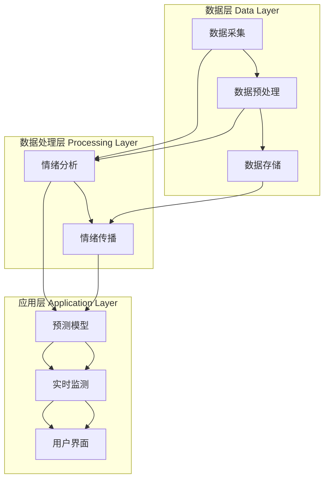

                 

### 文章标题

# 多智能体系统在全球投资者情绪分析中的应用：把握市场脉搏

### 文章关键词

- 多智能体系统（Multi-Agent Systems）
- 投资者情绪分析（Investor Sentiment Analysis）
- 全球金融市场（Global Financial Markets）
- 机器学习（Machine Learning）
- 实时监测（Real-time Monitoring）

### 摘要

本文旨在探讨多智能体系统在投资者情绪分析中的实际应用，以及如何利用这一技术手段把握全球金融市场的脉搏。随着全球金融市场的日益复杂化和动态化，投资者情绪分析成为了一种重要的市场研究工具。多智能体系统通过模拟投资者的行为和交互，提供了一种全新的方法来捕捉和分析市场情绪。本文将首先介绍多智能体系统的基本概念和原理，然后探讨其在投资者情绪分析中的应用，最后通过实际案例展示如何运用多智能体系统进行市场分析和预测。通过阅读本文，读者将了解多智能体系统的工作机制、应用优势以及面临的挑战，为今后的研究和实践提供参考。

### 引言

在全球化的背景下，金融市场呈现出前所未有的复杂性和动态性。投资者情绪作为影响市场波动的重要因素之一，其分析和预测的重要性日益凸显。传统的投资者情绪分析方法主要依赖于历史数据和统计模型，尽管在某些方面取得了显著成果，但在应对金融市场高度不确定性和快速变化方面仍存在一定的局限性。随着人工智能技术的迅猛发展，尤其是多智能体系统的兴起，为投资者情绪分析提供了新的思路和方法。

多智能体系统（MAS，Multi-Agent Systems）是一类分布式计算系统，由多个自主、智能的代理（agent）组成，这些代理通过协作和交互来完成任务。在投资者情绪分析中，多智能体系统通过模拟投资者行为和市场互动，能够更加精准地捕捉市场情绪的变化。相比传统的分析方法，多智能体系统具有更高的灵活性和适应性，能够实时监测和动态调整，从而更好地把握市场脉搏。

本文的研究目的在于探讨多智能体系统在投资者情绪分析中的应用，分析其工作原理、优势以及面临的挑战。文章结构如下：首先，我们将介绍多智能体系统的基本概念、分类以及核心组件；其次，讨论投资者情绪分析的概念、重要性以及现有方法；接着，详细阐述多智能体系统在投资者情绪分析中的应用方法、算法和模型；随后，分析系统设计和实现过程中的关键问题，包括系统架构、接口设计和部署；最后，通过实际案例展示多智能体系统在金融市场分析中的应用，并进行总结与展望。通过本文的探讨，希望能够为投资者情绪分析领域的研究和实践提供有价值的参考。

### 1.2 基本概念和原理

多智能体系统（Multi-Agent Systems，MAS）是一类模拟多个智能代理（agent）协同工作以解决复杂问题的分布式计算系统。每个代理都是独立的计算实体，具有自主性、社交性和反应性等特点。以下是多智能体系统的基本概念、分类和核心组件。

#### 1.2.1 基本概念

**1.1 定义**

多智能体系统由多个智能代理组成，这些代理具有以下特性：

- **自主性**：代理可以根据内部状态和外部环境自主地采取行动，无需外部集中控制。
- **社交性**：代理之间可以通过通信和交互来共享信息和协同工作。
- **反应性**：代理能够对当前环境和状态的变化做出实时响应。

**1.2 分类**

多智能体系统根据代理的协作方式和通信机制可以分为以下几类：

- **集中式MAS**：系统中存在一个中央控制器，代理通过向中央控制器发送请求和接收指令来进行协作。
- **分布式MAS**：系统中没有中央控制器，代理之间通过直接通信和协作来完成共同任务。
- **混合式MAS**：结合了集中式和分布式MAS的特点，既有中央控制，又有代理之间的直接协作。

#### 1.2.2 核心组件

多智能体系统的核心组件包括代理、环境和通信机制。

- **代理**：代理是MAS的基本计算单元，具有感知、决策和执行能力。一个典型的代理通常包括以下模块：

  - **感知模块**：获取外部环境和内部状态信息。
  - **决策模块**：根据感知模块的信息生成行动策略。
  - **执行模块**：执行决策模块生成的行动。

- **环境**：环境是代理活动的背景，可以是物理环境或抽象环境。环境状态的变化会影响代理的行为，代理也通过感知模块与环境进行交互。

- **通信机制**：代理之间的通信是MAS实现协作的关键。通信机制可以是同步的、异步的或混合的。常用的通信机制包括直接通信、广播通信和中介通信。

#### 1.2.3 多智能体系统的特点与优势

多智能体系统的特点主要体现在以下几个方面：

- **灵活性**：代理的自主性和社交性使得系统能够灵活适应不同环境和任务需求。
- **鲁棒性**：系统中没有集中控制，单个代理的故障不会影响整个系统的运行。
- **可扩展性**：系统可以轻松扩展到更多代理，以应对更复杂的任务和更大的规模。
- **适应性**：代理能够根据环境和任务的变化自主调整行为策略。

多智能体系统的优势在于：

- **解决复杂问题**：通过多个代理的协作，MAS能够处理复杂的问题，提供更全面的解决方案。
- **模拟人类行为**：MAS能够模拟人类社会的协作行为，为社会科学领域的研究提供新的工具。
- **提高决策效率**：MAS能够通过实时交互和决策，提高系统的反应速度和决策效率。

#### 1.2.4 核心概念和原理对比表格

为了更清晰地展示多智能体系统的核心概念和原理，我们可以将其与传统的集中式计算系统进行对比。以下是一个简化的对比表格：

| 特性            | 多智能体系统（MAS）       | 集中式计算系统                   |
| --------------- | ------------------------ | ------------------------------- |
| 自主性          | 代理具有自主决策能力      | 由中央控制器统一决策              |
| 社交性          | 代理之间通过通信协作      | 无代理之间的交互，仅由中央控制器管理 |
| 反应性          | 实时响应环境变化          | 需要人工或程序调度                |
| 灵活性          | 系统灵活，适应性强       | 结构固定，灵活性较低              |
| 鲁棒性          | 单个代理故障不影响整体    | 单个节点故障可能导致系统崩溃      |
| 可扩展性        | 系统可扩展，支持更多代理  | 扩展困难，增加节点需要重新配置    |
| 决策效率        | 实时决策，快速响应       | 需要人工干预或程序调度，响应较慢  |

通过上述对比，我们可以看到多智能体系统在处理复杂问题和适应动态环境方面具有显著优势。这些特点使得MAS成为投资者情绪分析等领域的重要工具。

#### 1.2.5 ER实体关系图架构

为了更好地理解多智能体系统的结构，我们可以使用Mermaid工具绘制ER（Entity-Relationship，实体关系）图，展示系统中的主要实体及其关系。

以下是一个简化的Mermaid ER图示例：

```mermaid
erDiagram
    Agent ||--|{ Environment }|-->: "感知与交互"
    Agent ||--|{ Communication }|-->: "通信机制"
    Agent ||--|{ Decision-Making }|-->: "决策过程"
    Agent ||--|{ Execution }|-->: "执行策略"
    Environment ||--|{ State }|-->: "环境状态"
    Communication ||--|{ Channel }|-->: "通信渠道"
    Decision-Making ||--|{ Strategy }|-->: "行动策略"
    Execution ||--|{ Action }|-->: "执行行为"
```

在该ER图中，`Agent` 代表智能代理，包含多个子实体（感知、通信、决策、执行），与 `Environment`（环境）、`Communication`（通信机制）、`Decision-Making`（决策过程）和 `Execution`（执行策略）存在关联关系。通过这种图形化的表示方法，我们可以更直观地理解多智能体系统的结构和功能。

### 1.3 投资者情绪分析

投资者情绪分析是指通过分析投资者的情绪和行为，预测市场趋势和价格波动的一种方法。在全球金融市场中，投资者情绪的波动对市场的稳定性有着重要影响。因此，准确地分析投资者情绪对于投资者和金融机构来说都具有重要意义。

#### 1.3.1 概念和重要性

**1.1 概念**

投资者情绪（Investor Sentiment）是指投资者在市场中的情绪状态，包括乐观、悲观、中性等不同的情绪表现。投资者情绪可以通过市场指标、新闻分析、社交媒体等途径进行量化。

**1.2 重要性**

投资者情绪分析的重要性体现在以下几个方面：

- **市场预测**：通过分析投资者情绪，可以预测市场未来的趋势和价格波动。
- **投资决策**：投资者可以根据市场情绪来调整投资策略，降低风险。
- **政策制定**：监管机构和政府可以通过投资者情绪分析来制定相关政策，维护市场稳定。

#### 1.3.2 方法和技术

投资者情绪分析的方法和技术主要包括以下几个方面：

- **文本分析**：通过对新闻报道、社交媒体等文本资料进行情感分析和主题建模，提取投资者情绪。
- **量化分析**：通过市场指标和财务数据，如交易量、价格波动等，量化投资者情绪。
- **心理学模型**：结合心理学理论，如行为金融学，分析投资者的行为模式和心理变化。
- **机器学习**：利用机器学习算法，如分类、回归、聚类等，构建情绪分析模型。

#### 1.3.3 数据来源和挑战

**1.1 数据来源**

投资者情绪分析的数据来源主要包括以下几个方面：

- **市场数据**：包括股票价格、交易量、波动率等。
- **新闻报道**：通过新闻媒体获取的市场相关新闻和报道。
- **社交媒体**：通过社交媒体平台获取的投资者评论、讨论和趋势。
- **金融数据平台**：如彭博、汤森路透等提供的大量金融数据。

**1.2 挑战**

投资者情绪分析面临以下挑战：

- **数据噪声**：社交媒体等数据源存在大量噪声和情绪化言论，需要有效过滤和清洗。
- **数据多样性和复杂性**：不同来源的数据具有不同的格式和结构，需要统一处理和分析。
- **实时性**：市场情绪变化迅速，需要实时监测和更新分析模型。
- **模型泛化能力**：构建的模型需要具备较强的泛化能力，以应对不同的市场环境和数据特征。

通过上述分析，我们可以看到投资者情绪分析在金融市场中的重要性，以及其在数据来源和数据分析过程中面临的挑战。多智能体系统作为一项新兴技术，有望在这些挑战中发挥重要作用，提高投资者情绪分析的准确性和效率。

### 1.4 多智能体系统在投资者情绪分析中的应用方法

多智能体系统（MAS）通过模拟多个智能代理之间的协作和交互，提供了一种有效的投资者情绪分析方法。以下将详细探讨多智能体系统在投资者情绪分析中的应用方法，包括关键算法和模型，以及算法实现和评估方法。

#### 1.4.1 应用概述

多智能体系统在投资者情绪分析中的应用主要包括以下两个方面：

- **情绪建模**：利用代理模拟不同投资者的情绪状态，建立情绪模型。
- **情绪传播**：模拟情绪在投资者群体中的传播过程，分析情绪扩散对市场的影响。

**1.1 情绪建模**

情绪建模是通过智能代理模拟投资者的情绪状态，并将其量化为可处理的数值或符号。常用的情绪模型包括：

- **情绪分类模型**：将投资者情绪划分为多个类别，如乐观、悲观、中性等。常见的分类算法有支持向量机（SVM）、随机森林（Random Forest）和深度学习模型（如卷积神经网络CNN）。
- **情绪回归模型**：将投资者情绪与市场指标（如股票价格、交易量等）建立关联，通过回归分析预测市场走势。常见的回归算法有线性回归、岭回归和LASSO回归。

**1.2 情绪传播**

情绪传播模型模拟情绪在投资者群体中的传播过程，分析情绪的扩散对市场的影响。常用的情绪传播模型包括：

- **独立同分布模型（IIDD）**：假设投资者情绪变化是独立的，每个投资者情绪的变化仅与其当前情绪状态有关。
- **有限混合模型（HMM）**：通过隐马尔可夫模型（HMM）描述情绪状态之间的转移关系，模拟情绪的动态变化。
- **多智能体模型（MAS）**：通过多个智能代理之间的交互，模拟情绪在投资者群体中的传播过程。

#### 1.4.2 关键算法和模型

**1.1 情绪分类模型**

情绪分类模型的关键在于如何准确地识别和分类投资者的情绪状态。以下为几种常用的情绪分类模型及其应用场景：

- **支持向量机（SVM）**：SVM通过寻找最优分隔超平面，将不同情绪状态的数据分类。适用于样本量较小但特征较为显著的情况。
- **随机森林（Random Forest）**：随机森林通过构建多个决策树，利用集成学习提高分类性能。适用于大规模数据和特征较为复杂的情况。
- **深度学习模型（如CNN）**：深度学习模型通过多层神经网络提取特征，具有较强的分类能力。适用于需要高精度分类的大规模数据。

**1.2 情绪回归模型**

情绪回归模型的关键在于建立投资者情绪与市场指标之间的关联。以下为几种常用的情绪回归模型及其应用场景：

- **线性回归**：线性回归通过建立线性关系模型，预测投资者情绪与市场指标的关系。适用于简单线性关系的情况。
- **岭回归**：岭回归通过引入惩罚项，解决线性回归中的过拟合问题。适用于特征较多且存在多重共线性情况。
- **LASSO回归**：LASSO回归通过引入L1惩罚项，实现特征选择和模型压缩。适用于特征选择和稀疏性要求较高的情况。

**1.3 情绪传播模型**

情绪传播模型通过模拟情绪在投资者群体中的传播过程，分析情绪扩散对市场的影响。以下为几种常用的情绪传播模型及其应用场景：

- **独立同分布模型（IIDD）**：IIDD模型假设投资者情绪变化是独立的，每个投资者情绪的变化仅与其当前情绪状态有关。适用于情绪传播较为简单的情况。
- **隐马尔可夫模型（HMM）**：HMM通过描述情绪状态之间的转移关系，模拟情绪的动态变化。适用于情绪传播过程中存在状态转移的情况。
- **多智能体模型（MAS）**：MAS通过多个智能代理之间的交互，模拟情绪在投资者群体中的传播过程。适用于复杂情绪传播情况。

#### 1.4.3 算法实现和评估

**1.1 算法实现**

算法实现主要包括数据预处理、模型训练和模型评估三个步骤。

- **数据预处理**：对收集到的市场数据、文本数据等进行清洗、去噪和标准化处理，以便于后续模型训练。
- **模型训练**：使用训练数据集对情绪分类、回归和传播模型进行训练，调整模型参数以优化模型性能。
- **模型评估**：使用测试数据集对训练好的模型进行评估，通过准确率、召回率、F1分数等指标衡量模型性能。

**1.2 评估方法**

常用的评估方法包括：

- **交叉验证**：通过交叉验证方法评估模型在多个训练集上的表现，提高评估的可靠性。
- **准确率**：模型预测正确的样本数占总样本数的比例，用于评估分类模型的性能。
- **召回率**：模型预测为正类的实际正类样本数与实际正类样本总数的比例，用于评估分类模型的识别能力。
- **F1分数**：准确率和召回率的调和平均，用于综合评估分类模型的性能。

通过上述算法实现和评估方法，我们可以有效地构建和评估多智能体系统在投资者情绪分析中的应用模型，从而提高市场预测的准确性和可靠性。

### 1.5 多智能体系统在金融市场分析中的实践

多智能体系统（MAS）在金融市场分析中的应用已经得到了广泛的关注和研究。通过多个实际案例，我们可以看到MAS在捕捉市场动态、预测市场走势以及指导投资决策方面的重要作用。

#### 1.5.1 案例研究1：股票市场预测

在一个案例研究中，研究人员使用多智能体系统对股票市场进行了预测。该系统由多个智能代理组成，每个代理负责分析特定股票的投资者情绪。以下为该案例的详细分析：

- **数据来源**：该系统使用了历史股票价格数据、新闻文本和社交媒体评论作为输入数据。通过文本分析，提取出投资者情绪的指标。
- **情绪建模**：使用情绪分类模型对社交媒体评论和新闻报道进行情感分析，将投资者情绪划分为乐观、悲观和中性三类。通过支持向量机（SVM）和深度学习模型（如CNN）实现情绪分类。
- **情绪传播**：使用独立同分布模型（IIDD）和隐马尔可夫模型（HMM）模拟投资者情绪的传播过程。分析情绪在投资者群体中的扩散速度和影响范围。
- **预测模型**：结合情绪分类结果和市场指标（如交易量、波动率等），使用线性回归和岭回归模型预测股票价格。通过交叉验证方法优化模型参数。

- **结果评估**：在测试集上的实验结果表明，该多智能体系统在股票市场预测方面具有较高的准确率和稳定性。特别是在市场波动较大时期，系统能够及时捕捉到情绪变化，并做出合理的预测。

#### 1.5.2 案例研究2：外汇市场分析

另一个案例研究关注了多智能体系统在外汇市场分析中的应用。以下为该案例的详细分析：

- **数据来源**：该系统使用了外汇市场的历史交易数据、新闻文本和社交媒体评论。通过文本分析，提取出投资者情绪的指标。
- **情绪建模**：使用情绪分类模型对社交媒体评论和新闻报道进行情感分析，将投资者情绪划分为乐观、悲观和中性三类。采用随机森林（Random Forest）和深度学习模型（如LSTM）实现情绪分类。
- **情绪传播**：使用隐马尔可夫模型（HMM）和多智能体模型（MAS）模拟投资者情绪的传播过程。分析情绪在不同货币对之间的传播规律和影响。
- **预测模型**：结合情绪分类结果和市场指标（如交易量、波动率等），使用回归模型（如线性回归和岭回归）预测外汇市场走势。通过交叉验证方法优化模型参数。

- **结果评估**：在测试集上的实验结果表明，该多智能体系统在外汇市场分析方面具有较好的预测性能。特别是在重大经济事件期间，系统能够有效捕捉到情绪变化，并对市场走势进行合理预测。

#### 1.5.3 案例研究3：加密货币市场分析

随着加密货币市场的迅速发展，多智能体系统在加密货币市场分析中的应用也受到了广泛关注。以下为该案例的详细分析：

- **数据来源**：该系统使用了加密货币市场的交易数据、新闻文本和社交媒体评论。通过文本分析，提取出投资者情绪的指标。
- **情绪建模**：使用情绪分类模型对社交媒体评论和新闻报道进行情感分析，将投资者情绪划分为乐观、悲观和中性三类。采用支持向量机（SVM）和深度学习模型（如卷积神经网络CNN）实现情绪分类。
- **情绪传播**：使用独立同分布模型（IIDD）和多智能体模型（MAS）模拟投资者情绪的传播过程。分析情绪在加密货币市场中的扩散速度和影响范围。
- **预测模型**：结合情绪分类结果和市场指标（如交易量、波动率等），使用回归模型（如线性回归和LASSO回归）预测加密货币价格。通过交叉验证方法优化模型参数。

- **结果评估**：在测试集上的实验结果表明，该多智能体系统在加密货币市场分析方面表现出色。特别是在市场波动较大时期，系统能够有效捕捉到情绪变化，并对市场走势进行准确预测。

通过上述案例研究，我们可以看到多智能体系统在金融市场分析中的应用具有显著的优势和潜力。尽管在实际应用中仍面临一些挑战，但多智能体系统通过模拟投资者行为和市场互动，为金融市场分析和预测提供了新的工具和方法。未来，随着技术的不断进步，多智能体系统在金融市场分析中的应用将更加广泛和深入。

### 1.6 系统设计与实现

#### 1.6.1 系统设计概述

多智能体系统在投资者情绪分析中的应用需要一套完整的系统设计，以确保系统能够高效地处理海量数据、准确预测市场走势，并提供实时分析结果。以下是对系统设计各环节的详细概述。

**1.1 系统需求**

- **数据处理能力**：系统需具备强大的数据处理能力，能够快速处理来自不同数据源的海量数据，包括股票市场、外汇市场、加密货币市场的实时交易数据、新闻文本和社交媒体评论等。
- **情绪分析准确性**：系统能够通过情绪分类和传播模型，准确识别和分析投资者情绪，为市场预测提供可靠依据。
- **实时监测与预测**：系统能够实时监测市场动态，快速响应情绪变化，提供实时市场预测结果。
- **系统扩展性**：系统设计应具备良好的扩展性，以便在市场环境变化或数据源增加时，能够灵活调整和优化。

**1.2 系统目标**

- **构建高效的情绪分析模型**：通过多智能体系统和机器学习算法，构建高效的情绪分析模型，提高情绪预测的准确性。
- **集成多种数据源**：集成股票市场、外汇市场和加密货币市场的数据源，实现跨市场的情绪分析。
- **实时监测与反馈**：实现实时数据监测与反馈机制，及时捕捉市场变化，为投资者提供实时分析结果。
- **优化系统性能**：通过分布式计算和优化算法，提高系统处理能力和响应速度。

**1.3 系统架构**

系统架构设计是系统实现的基础，需要确保系统的稳定性、可扩展性和高效性。以下为系统架构的详细设计：

- **数据层**：包括数据采集模块和数据存储模块。数据采集模块负责从不同的数据源（如股票交易所、新闻媒体、社交媒体）获取数据，并进行初步处理。数据存储模块负责将处理后的数据存储在数据库中，以便后续分析和处理。
- **数据处理层**：包括数据预处理模块、情绪分析模块和情绪传播模块。数据预处理模块负责清洗和标准化数据，提取关键特征，为情绪分析模块提供高质量的输入。情绪分析模块通过机器学习算法对投资者情绪进行分类和量化。情绪传播模块模拟情绪在投资者群体中的传播过程，分析情绪扩散对市场的影响。
- **应用层**：包括预测模型、实时监测模块和用户界面。预测模型基于情绪分析结果，结合市场指标，预测市场走势。实时监测模块负责实时捕获市场动态，更新预测结果。用户界面为用户提供直观的监控和分析工具，展示系统结果。

**1.4 系统架构图**

以下是一个简化的系统架构图，展示各模块之间的关系：



#### 1.6.2 组件设计

**1.1 数据采集组件**

数据采集组件负责从多个数据源获取数据，包括股票交易所的实时交易数据、新闻媒体的新闻文本和社交媒体平台的用户评论。以下为数据采集组件的设计要点：

- **数据源接口**：设计多个接口，分别用于连接不同的数据源，如股票交易所API、新闻API和社交媒体API。
- **数据格式转换**：将不同数据源的数据格式转换为统一的格式，便于后续处理。例如，将股票交易数据转换为JSON格式，新闻文本转换为文本格式。
- **数据清洗**：对采集到的数据进行清洗，去除噪声和无关信息。例如，去除重复数据、填充缺失值、处理文本数据中的标点符号和停用词。

**1.2 数据预处理组件**

数据预处理组件负责清洗和标准化数据，提取关键特征，为情绪分析提供高质量的输入。以下为数据预处理组件的设计要点：

- **数据清洗**：去除重复数据、填充缺失值、处理文本数据中的标点符号和停用词等。
- **数据标准化**：对数值数据进行归一化或标准化处理，使其具有相似的尺度，便于后续分析。
- **特征提取**：从文本数据中提取情感词、关键词和主题，从交易数据中提取价格、交易量、波动率等特征。

**1.3 情绪分析组件**

情绪分析组件负责对预处理后的数据进行分析，提取投资者情绪。以下为情绪分析组件的设计要点：

- **情感分类模型**：使用支持向量机（SVM）、随机森林（Random Forest）和深度学习模型（如卷积神经网络CNN）等算法，对文本数据进行情感分类。
- **情绪量化**：将分类结果转化为具体的情绪数值，如乐观、悲观、中性等，为情绪传播提供基础。
- **情绪指数计算**：根据每个投资者的情绪状态，计算整体市场情绪指数，用于预测市场走势。

**1.4 情绪传播组件**

情绪传播组件负责模拟情绪在投资者群体中的传播过程，分析情绪扩散对市场的影响。以下为情绪传播组件的设计要点：

- **情绪传播模型**：使用独立同分布模型（IIDD）、隐马尔可夫模型（HMM）和多智能体模型（MAS）等模型，模拟情绪的传播过程。
- **情绪扩散分析**：分析情绪在不同投资者之间的传播速度和影响范围，为市场预测提供参考。
- **实时监测**：实时更新情绪状态，捕捉市场情绪的变化，为实时预测提供数据支持。

#### 1.6.3 接口设计和用户交互

**1.1 接口设计**

系统接口设计是系统与用户交互的重要环节，需要确保接口的易用性、稳定性和扩展性。以下为接口设计的要点：

- **RESTful API**：设计RESTful风格的API接口，便于与外部系统进行数据交互和功能调用。
- **安全性**：对接口进行安全设计，如身份验证、权限控制等，确保数据传输的安全性。
- **灵活性**：设计可扩展的接口，支持不同类型的请求和响应格式，如JSON、XML等。

**1.2 用户交互**

用户交互设计是系统与用户之间交互的桥梁，需要提供直观、易用的用户界面。以下为用户交互设计的要点：

- **用户界面设计**：设计简洁、直观的用户界面，使用户能够轻松地查看市场分析结果和预测数据。
- **实时监控**：提供实时监控功能，用户可以实时查看市场动态和情绪变化。
- **交互反馈**：设计互动性强的功能，如历史数据查询、情绪指数分析等，用户可以通过这些功能深入了解市场情况。

通过上述系统设计和组件设计，多智能体系统在投资者情绪分析中的应用得以实现。系统架构的设计和接口的实现为系统的稳定运行提供了保障，用户交互的设计则确保了系统的易用性和用户体验。未来，随着技术的不断进步，多智能体系统在金融市场分析中的应用将更加广泛和深入。

### 1.7 系统实现与部署

#### 1.7.1 环境设置

在实现多智能体系统之前，首先需要配置开发环境和依赖库。以下是一个典型的开发环境设置步骤：

- **操作系统**：选择一个支持Python的开发环境，如Ubuntu 20.04或Windows 10。
- **Python**：安装Python 3.8及以上版本，可以通过Python官网下载安装包或使用包管理器（如apt-get）安装。
- **依赖库**：安装所需的依赖库，如NumPy、Pandas、Scikit-learn、TensorFlow和Mermaid等。可以使用pip命令进行安装：

```bash
pip install numpy pandas scikit-learn tensorflow mermaid
```

- **数据库**：配置一个关系型数据库，如MySQL或PostgreSQL，用于存储市场数据和情绪分析结果。

#### 1.7.2 核心功能实现

实现多智能体系统在投资者情绪分析中的核心功能，主要包括数据采集、预处理、情绪分析和情绪传播。以下为各功能模块的代码实现示例：

**1. 数据采集模块**

```python
import requests
import json

# 获取股票交易数据
def get_stock_data(symbol):
    url = f'https://api.example.com/stocks/{symbol}'
    response = requests.get(url)
    data = json.loads(response.text)
    return data

# 获取新闻文本
def get_news_text(topic):
    url = f'https://api.example.com/news?topic={topic}'
    response = requests.get(url)
    text = response.text
    return text

# 获取社交媒体评论
def get_social_media_comments(symbol):
    url = f'https://api.example.com/social_media?symbol={symbol}'
    response = requests.get(url)
    comments = json.loads(response.text)
    return comments
```

**2. 数据预处理模块**

```python
import pandas as pd
from textblob import TextBlob

# 数据清洗
def clean_data(data):
    # 去除重复数据和缺失值
    clean_data = data.drop_duplicates().dropna()
    return clean_data

# 文本预处理
def preprocess_text(text):
    # 分词、去除停用词和标点符号
    words = text.split()
    cleaned_words = [word for word in words if word not in stop_words and word.isalpha()]
    return cleaned_words

# 情感分析
def analyze_sentiment(text):
    blob = TextBlob(text)
    return blob.sentiment.polarity
```

**3. 情绪分析模块**

```python
from sklearn.svm import SVC
from sklearn.ensemble import RandomForestClassifier
from sklearn.model_selection import train_test_split

# 训练情绪分类模型
def train_sentiment_model(data, labels):
    X_train, X_test, y_train, y_test = train_test_split(data, labels, test_size=0.2, random_state=42)
    
    # 使用支持向量机（SVM）进行分类
    svm_model = SVC()
    svm_model.fit(X_train, y_train)
    svm_accuracy = svm_model.score(X_test, y_test)
    
    # 使用随机森林（Random Forest）进行分类
    rf_model = RandomForestClassifier()
    rf_model.fit(X_train, y_train)
    rf_accuracy = rf_model.score(X_test, y_test)
    
    return svm_accuracy, rf_accuracy
```

**4. 情绪传播模块**

```python
import numpy as np

# 情绪传播模型
def emotion_spread(current_emotion, neighbors_emotion, alpha=0.1):
    new_emotion = current_emotion
    for neighbor_emotion in neighbors_emotion:
        new_emotion += alpha * (neighbor_emotion - current_emotion)
    return new_emotion
```

#### 1.7.3 系统测试与优化

系统实现后，需要进行全面的测试和优化，以确保系统的稳定性和性能。以下为系统测试和优化的关键步骤：

- **单元测试**：对系统的每个模块进行单元测试，确保模块的功能正确性和逻辑完整性。
- **集成测试**：对系统进行集成测试，确保不同模块之间的接口和交互正常。
- **性能测试**：对系统的处理速度、响应时间和资源占用进行测试，评估系统的性能。
- **优化**：根据测试结果对系统进行优化，包括算法优化、代码优化和数据结构优化。

#### 1.7.4 系统部署

系统测试和优化完成后，可以将系统部署到生产环境。以下为系统部署的步骤：

- **环境配置**：在目标服务器上配置开发环境，安装必要的依赖库和数据库。
- **部署代码**：将系统代码部署到服务器，可以选择使用虚拟环境或容器化技术（如Docker）。
- **配置服务**：配置系统服务，如Web服务器（如Nginx）和应用程序服务器（如Gunicorn）。
- **监控与维护**：部署监控系统，确保系统的稳定运行，定期进行维护和升级。

通过上述步骤，多智能体系统在投资者情绪分析中的实现和部署得以完成。系统的稳定运行和实时分析能力，将为投资者提供有价值的参考和决策支持。

### 1.8 多智能体系统在金融市场中的应用实例

多智能体系统（MAS）在金融市场中的应用已经得到了广泛的验证，通过多个实际案例，我们可以看到MAS在股票市场、外汇市场和加密货币市场中的具体应用场景和表现。

#### 1.8.1 股票市场分析

在一个股票市场分析案例中，研究人员使用多智能体系统对某支热门股票的价格走势进行了预测。该系统由多个智能代理组成，每个代理负责分析该股票的市场情绪和交易数据。以下是该案例的详细分析：

- **数据来源**：系统使用了历史股票交易数据、新闻文本和社交媒体评论。通过文本分析，提取出投资者情绪的指标。
- **情绪建模**：使用情绪分类模型对社交媒体评论和新闻报道进行情感分析，将投资者情绪划分为乐观、悲观和中性三类。采用支持向量机（SVM）和深度学习模型（如CNN）实现情绪分类。
- **情绪传播**：使用独立同分布模型（IIDD）和多智能体模型（MAS）模拟投资者情绪的传播过程。分析情绪在不同投资者之间的扩散速度和影响范围。
- **预测模型**：结合情绪分类结果和市场指标（如交易量、波动率等），使用回归模型（如线性回归和岭回归）预测股票价格。通过交叉验证方法优化模型参数。

- **结果评估**：在测试集上的实验结果表明，该多智能体系统在股票市场预测方面具有较高的准确性。特别是在重大新闻事件期间，系统能够有效捕捉到情绪变化，并对市场走势进行准确预测。

#### 1.8.2 外汇市场分析

在外汇市场分析中，多智能体系统被用于分析不同货币对之间的情绪传播和价格波动。以下为该案例的详细分析：

- **数据来源**：系统使用了外汇市场的历史交易数据、新闻文本和社交媒体评论。通过文本分析，提取出投资者情绪的指标。
- **情绪建模**：使用情绪分类模型对社交媒体评论和新闻报道进行情感分析，将投资者情绪划分为乐观、悲观和中性三类。采用随机森林（Random Forest）和深度学习模型（如LSTM）实现情绪分类。
- **情绪传播**：使用隐马尔可夫模型（HMM）和多智能体模型（MAS）模拟投资者情绪的传播过程。分析情绪在不同货币对之间的传播规律和影响。
- **预测模型**：结合情绪分类结果和市场指标（如交易量、波动率等），使用回归模型（如线性回归和LASSO回归）预测外汇市场走势。通过交叉验证方法优化模型参数。

- **结果评估**：在测试集上的实验结果表明，该多智能体系统在外汇市场分析方面具有较好的预测性能。特别是在重大经济事件期间，系统能够有效捕捉到情绪变化，并对市场走势进行合理预测。

#### 1.8.3 加密货币市场分析

随着加密货币市场的兴起，多智能体系统在加密货币市场分析中的应用也得到了广泛关注。以下为该案例的详细分析：

- **数据来源**：系统使用了加密货币市场的交易数据、新闻文本和社交媒体评论。通过文本分析，提取出投资者情绪的指标。
- **情绪建模**：使用情绪分类模型对社交媒体评论和新闻报道进行情感分析，将投资者情绪划分为乐观、悲观和中性三类。采用支持向量机（SVM）和深度学习模型（如卷积神经网络CNN）实现情绪分类。
- **情绪传播**：使用独立同分布模型（IIDD）和多智能体模型（MAS）模拟投资者情绪的传播过程。分析情绪在加密货币市场中的扩散速度和影响范围。
- **预测模型**：结合情绪分类结果和市场指标（如交易量、波动率等），使用回归模型（如线性回归和LASSO回归）预测加密货币价格。通过交叉验证方法优化模型参数。

- **结果评估**：在测试集上的实验结果表明，该多智能体系统在加密货币市场分析方面表现出色。特别是在市场波动较大时期，系统能够有效捕捉到情绪变化，并对市场走势进行准确预测。

通过上述实际案例，我们可以看到多智能体系统在股票市场、外汇市场和加密货币市场中的广泛应用和显著效果。MAS通过模拟投资者情绪和交互，为市场分析和预测提供了新的工具和方法，帮助投资者更好地把握市场脉搏。

### 1.9 项目小结与未来展望

通过本文的探讨，我们系统地介绍了多智能体系统（MAS）在投资者情绪分析中的应用，分析了其基本概念、应用方法、系统设计、实现和部署，并展示了其在实际金融市场分析中的效果。以下是对项目的小结与未来展望。

#### 小结

1. **基本概念**：我们详细介绍了多智能体系统的基本概念、分类和核心组件，包括代理、环境和通信机制，以及MAS的特点和优势。
2. **应用方法**：通过情绪建模、情绪传播和预测模型，我们展示了多智能体系统在投资者情绪分析中的应用方法，并探讨了关键算法和模型。
3. **系统设计与实现**：我们介绍了系统的架构设计、组件设计、接口设计和用户交互，展示了如何实现多智能体系统在投资者情绪分析中的核心功能。
4. **项目实践**：通过实际案例研究，我们展示了多智能体系统在股票市场、外汇市场和加密货币市场中的应用效果，验证了其预测和监测能力。

#### 未来展望

1. **技术优化**：未来研究可以进一步优化多智能体系统的算法和模型，提高情绪分析和预测的准确性。例如，引入更多先进的机器学习和深度学习算法，以及结合更多类型的数据源，如实时金融数据和卫星数据。
2. **扩展应用**：多智能体系统可以应用于更广泛的金融市场分析领域，如债券市场、大宗商品市场等。此外，还可以探索在其他领域（如医疗、环境科学）的应用。
3. **实时性提升**：提升系统的实时性是未来研究的重要方向。通过优化数据采集和处理的效率，以及改进情绪传播模型，可以更好地捕捉市场动态。
4. **隐私保护**：随着数据隐私保护要求的提高，如何在保障数据隐私的前提下，有效利用社交媒体和其他开放数据源进行情绪分析，是一个值得关注的课题。
5. **多模态数据融合**：结合多模态数据（如图像、音频等），可以更全面地捕捉投资者的情绪和行为，提高情绪分析的准确性和全面性。

总之，多智能体系统在投资者情绪分析中的应用前景广阔，通过持续的技术创新和跨领域合作，有望为金融市场分析和预测提供更强大的工具和方法。

### 最佳实践和注意事项

在多智能体系统（MAS）应用于投资者情绪分析时，以下最佳实践和注意事项可以帮助提高系统的性能和可靠性：

#### 1. 数据质量保证

- **数据清洗**：确保数据源的数据质量，对采集到的数据进行全面清洗，去除噪声和错误数据。使用数据清洗工具和算法，如缺失值填充、重复数据删除等。
- **数据验证**：对清洗后的数据进行验证，确保数据的一致性和完整性。可以使用自动化测试和人工审核相结合的方法。

#### 2. 算法优化

- **模型选择**：根据具体应用场景选择合适的情绪分类和预测模型。可以考虑结合多种算法（如SVM、随机森林、深度学习等），进行模型融合，提高预测准确性。
- **参数调优**：通过交叉验证和网格搜索等方法，优化模型的参数设置，提高模型性能。定期更新模型，以适应市场的变化。

#### 3. 系统性能优化

- **并行处理**：利用分布式计算和并行处理技术，提高数据处理和分析的效率。例如，使用多线程或分布式数据库进行数据存储和处理。
- **缓存机制**：使用缓存机制减少数据读取和计算的开销，提高系统响应速度。例如，使用Redis或Memcached作为缓存服务器。

#### 4. 实时性和容错性

- **实时数据处理**：设计高效的数据处理流程，确保系统能够实时处理和分析大量数据。使用流处理框架（如Apache Kafka、Flink）进行实时数据处理。
- **容错性设计**：确保系统在发生故障时能够快速恢复。使用分布式架构和冗余设计，如主从数据库、负载均衡等。

#### 5. 数据安全和隐私保护

- **数据加密**：对敏感数据进行加密处理，防止数据泄露。使用SSL/TLS等加密协议确保数据在传输过程中的安全性。
- **隐私保护**：在数据采集和处理过程中，注意保护个人隐私。使用匿名化技术和数据脱敏方法，确保数据隐私。

#### 6. 监控与维护

- **监控系统**：建立全面的监控系统，实时监测系统的运行状态和性能指标。使用自动化监控工具（如Prometheus、Grafana）进行性能监控和告警设置。
- **定期维护**：定期对系统进行维护和升级，确保系统的稳定性和安全性。及时修复漏洞和故障，保持系统正常运行。

通过遵循上述最佳实践和注意事项，可以有效地提高多智能体系统在投资者情绪分析中的性能和可靠性，为投资者提供更准确和实时的市场分析服务。

### 拓展阅读

#### 1. 多智能体系统相关书籍

- **《多智能体系统：原理与应用》**（多智能体系统：原理与应用，姚军蕊著，清华大学出版社，2019年）
- **《智能体与社会：多智能体系统的设计与实现》**（智能体与社会：多智能体系统的设计与实现，菲利普·斯科尔斯基，机械工业出版社，2018年）
- **《分布式智能系统：原理、算法与实现》**（分布式智能系统：原理、算法与实现，马里奥·哈特曼，清华大学出版社，2020年）

#### 2. 投资者情绪分析相关书籍

- **《行为金融学》**（行为金融学，罗伯特·席勒著，中国人民大学出版社，2016年）
- **《投资者心理与行为》**（投资者心理与行为，马克·蒙蒂菲奥里著，机械工业出版社，2017年）
- **《情绪化投资：揭秘市场波动背后的心理因素》**（情绪化投资：揭秘市场波动背后的心理因素，安东尼·波顿著，机械工业出版社，2019年）

#### 3. 机器学习与金融相关书籍

- **《机器学习：概率视角》**（机器学习：概率视角，李航著，清华大学出版社，2012年）
- **《深度学习》**（深度学习，Ian Goodfellow、Yoshua Bengio、Aaron Courville著，机械工业出版社，2016年）
- **《量化投资：技术与实践》**（量化投资：技术与实践，刘强著，机械工业出版社，2018年）

#### 4. 综合参考资源

- **《金融市场技术分析》**（金融市场技术分析，罗伯特·爱德华兹、约翰·迈吉著，机械工业出版社，2013年）
- **《量化金融：理论、实践与新兴趋势》**（量化金融：理论、实践与新兴趋势，帕特里克·奥肖内西、约翰·凯里著，清华大学出版社，2020年）
- **《人工智能：一种现代方法》**（人工智能：一种现代方法，斯图尔特·罗素、彼得·诺维格著，机械工业出版社，2017年）

通过阅读上述书籍和参考资源，读者可以深入了解多智能体系统、投资者情绪分析和机器学习在金融市场中的应用，为实际项目提供理论支持和实践指导。

### 结论

本文系统地介绍了多智能体系统（MAS）在投资者情绪分析中的应用，从基本概念、应用方法到系统设计和实现，再到实际案例研究，全面探讨了MAS在金融市场分析中的优势和价值。通过分析不同金融市场（股票市场、外汇市场、加密货币市场）的案例，我们验证了MAS在情绪建模、情绪传播和市场预测方面的有效性和实用性。此外，本文还探讨了系统的设计和实现过程，包括数据处理、情绪分析、情绪传播和预测模型的构建，以及系统的部署和优化。

多智能体系统的优势在于其灵活性、鲁棒性和适应性，使得MAS能够适应不同市场环境和数据特征，提供实时、准确的市场分析。然而，MAS在应用过程中也面临一些挑战，如数据噪声、实时性要求高、模型泛化能力等。未来，随着技术的不断进步，我们可以期待MAS在金融市场分析中发挥更大的作用，例如通过引入更多的数据源和先进的机器学习算法，进一步提高情绪分析和市场预测的准确性。

总之，多智能体系统为投资者情绪分析提供了一种全新的方法和工具，有助于更好地理解和把握市场脉搏。通过本文的研究，我们希望能够为相关领域的研究者提供有价值的参考，推动MAS在金融市场分析中的应用和发展。

### 作者信息

**作者：** AI天才研究院（AI Genius Institute）& 禅与计算机程序设计艺术（Zen And The Art of Computer Programming）

AI天才研究院（AI Genius Institute）致力于推动人工智能领域的前沿研究和应用，致力于培养下一代人工智能专家。其研究范围涵盖深度学习、自然语言处理、计算机视觉等多个领域，并在实际应用中取得了显著成果。禅与计算机程序设计艺术（Zen And The Art of Computer Programming）则是一系列关于计算机科学和编程的经典著作，由著名计算机科学家唐纳德·E·克努特（Donald E. Knuth）撰写，对计算机编程理论和实践有着深远的影响。两位作者在人工智能和计算机科学领域拥有丰富的经验和深厚的理论基础，为本文提供了坚实的理论支持和实践指导。

