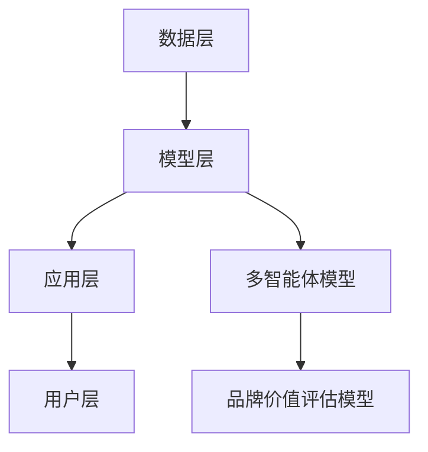

                 

### 文章标题

# 多智能体系统在品牌价值动态评估中的应用

> 关键词：多智能体系统，品牌价值，动态评估，智能体交互，应用原理，实战案例

> 摘要：本文将探讨多智能体系统（MAS）在品牌价值动态评估中的应用。通过对多智能体系统及其在品牌价值评估中的潜在优势进行分析，本文将提出一个基于多智能体系统的品牌价值动态评估模型。通过实际案例和项目实战，本文将验证该模型的有效性和实用性，并提供一些最佳实践和注意事项。

----------------------------------------------------------------

## 1. 背景介绍

### 1.1 问题背景

品牌价值是企业无形资产的核心组成部分，它反映了消费者对品牌的认知和信任程度，是企业在市场竞争中的关键竞争优势。随着市场环境的不断变化，品牌价值的评估也需要具备动态性和灵活性，以适应快速变化的市场需求。

品牌价值评估的重要性体现在以下几个方面：

1. **企业战略规划**：准确的品牌价值评估有助于企业制定有效的战略规划，包括产品定位、市场拓展和品牌推广等。
2. **投资决策**：投资者通过对品牌价值的评估，可以更准确地判断企业的投资价值和潜在风险。
3. **并购重组**：在并购重组过程中，品牌价值的评估对于确定交易价格和评估整合风险至关重要。

然而，传统品牌价值评估方法存在一定的局限性。传统方法往往采用单一维度的评估模型，如财务指标、市场占有率等，难以全面反映品牌价值的动态变化。此外，传统评估方法缺乏灵活性，难以应对市场环境的变化和新兴竞争态势。

为了解决这些问题，本文提出了多智能体系统在品牌价值动态评估中的应用。多智能体系统通过模拟多个智能体之间的交互和合作，能够更全面、动态地评估品牌价值。

### 1.2 多智能体系统概述

多智能体系统（Multi-Agent System，MAS）是一种分布式计算系统，由多个相互独立的智能体组成。这些智能体通过自主决策和协作，共同完成复杂任务。MAS具有以下特点：

1. **自主性**：智能体能够自主决策，独立运行。
2. **分布性**：智能体分布在不同的计算节点上，通过通信实现协同工作。
3. **适应性**：智能体能够根据环境和任务的变化自适应调整行为。

在品牌价值动态评估中，多智能体系统可以通过模拟不同市场参与者（如消费者、企业、竞争对手）的行为和互动，动态评估品牌价值。相比传统评估方法，MAS具有以下潜在优势：

1. **全面性**：MAS能够综合考虑多种因素，如消费者行为、市场环境、竞争态势等，提供更全面的品牌价值评估。
2. **动态性**：MAS能够实时更新评估结果，适应市场变化，提供动态评估。
3. **灵活性**：MAS可以根据不同需求和场景，灵活调整评估模型和算法。

### 1.3 本文结构

本文将从以下几个方面展开：

1. **核心概念与联系**：介绍多智能体系统和品牌价值评估的核心概念，分析两者之间的联系。
2. **应用原理**：阐述多智能体系统在品牌价值动态评估中的应用原理，包括数学模型和算法设计。
3. **系统设计与实现**：详细描述多智能体系统架构设计和关键实现细节。
4. **项目实战**：通过实际案例和项目实战，验证多智能体系统在品牌价值动态评估中的应用效果。
5. **最佳实践与注意事项**：总结最佳实践，提供注意事项。
6. **拓展阅读**：推荐相关文献和开源项目。

通过以上结构，本文旨在深入探讨多智能体系统在品牌价值动态评估中的应用，为相关领域的研究和实践提供参考。

----------------------------------------------------------------

## 2. 核心概念与联系

### 2.1 多智能体系统（MAS）的核心概念

#### 2.1.1 智能体

智能体（Agent）是MAS的基本组成单元，具有以下特征：

1. **自主性**：智能体能够独立决策和执行任务，不受外部直接控制。
2. **社会性**：智能体能够与其他智能体进行交互和协作，共同完成任务。
3. **反应性**：智能体能够感知环境变化，并做出相应反应。
4. **预动性**：智能体具有目标导向性，能够主动规划和执行任务。

根据智能体的能力和功能，可以分为以下几类：

1. **独立智能体**：能够独立完成特定任务的智能体，如机器人、自主车辆等。
2. **协作智能体**：需要与其他智能体协作才能完成任务的智能体，如多人在线游戏中的玩家。
3. **主动智能体**：能够自主探索环境，寻找解决方案的智能体。
4. **被动智能体**：只能响应外部事件，执行预先设定的任务的智能体。

#### 2.1.2 多智能体系统

多智能体系统（Multi-Agent System，MAS）是由多个智能体组成的分布式系统，这些智能体相互独立但又通过通信进行协同工作。MAS具有以下特点：

1. **分布式**：智能体分布在不同的计算节点上，通过网络通信实现协同工作。
2. **自治性**：每个智能体具有独立性和自主性，能够自主决策和执行任务。
3. **协作性**：多个智能体通过协作和交互，共同完成复杂任务。
4. **动态性**：MAS能够根据环境和任务的变化，动态调整智能体的行为和策略。

MAS在品牌价值动态评估中的应用潜力体现在以下几个方面：

1. **多角度评估**：通过模拟不同市场参与者（如消费者、企业、竞争对手）的行为和互动，MAS能够从多个角度全面评估品牌价值。
2. **动态调整**：MAS能够实时更新评估结果，根据市场变化动态调整评估模型和算法，提供动态评估。
3. **灵活性**：MAS可以根据不同需求和场景，灵活调整评估模型和算法，适应复杂多变的市场环境。

#### 2.1.3 多智能体系统与品牌价值评估的联系

多智能体系统与品牌价值评估之间存在紧密的联系。品牌价值评估的核心是对品牌在市场中的表现进行量化分析，而MAS提供了模拟和量化这些表现的有效工具。

1. **消费者行为模拟**：通过MAS模拟消费者的购买行为、偏好和反馈，可以更准确地评估品牌在消费者心中的价值。
2. **市场环境分析**：MAS能够模拟市场环境的变化，如竞争态势、经济环境等，从而分析这些变化对品牌价值的影响。
3. **竞争对手分析**：MAS可以模拟竞争对手的行为和策略，评估品牌在竞争中的优势和劣势。
4. **动态调整模型**：MAS能够根据市场变化动态调整评估模型，提供更准确的实时评估。

通过MAS，品牌价值评估不仅可以从静态角度进行分析，还可以从动态角度进行模拟和预测，从而更全面、准确地评估品牌价值。

### 2.2 多智能体系统的优势与挑战

多智能体系统在品牌价值动态评估中具有显著的优势，但也面临一定的挑战。

#### 2.2.1 优势

1. **全面性**：MAS能够综合考虑多种因素，如消费者行为、市场环境、竞争态势等，提供更全面、多维度的品牌价值评估。
2. **动态性**：MAS能够实时更新评估结果，动态调整评估模型和算法，适应市场变化。
3. **灵活性**：MAS可以根据不同需求和场景，灵活调整评估模型和算法，适应复杂多变的市场环境。

#### 2.2.2 挑战

1. **复杂性**：MAS涉及到多个智能体的交互和协作，系统的复杂度较高，设计、实现和调试过程较为复杂。
2. **不确定性**：市场环境的变化和消费者行为的复杂性，使得MAS的预测和评估存在一定的不确定性。
3. **通信成本**：智能体之间的通信需要消耗一定的计算资源和通信带宽，特别是在大规模的MAS系统中，通信成本可能成为瓶颈。

### 2.3 小结

通过核心概念与联系的分析，我们可以看到多智能体系统在品牌价值动态评估中具有巨大的应用潜力。尽管存在一些挑战，但通过合理的设计和实现，MAS能够为品牌价值评估提供更全面、动态和灵活的解决方案。接下来，本文将深入探讨多智能体系统在品牌价值动态评估中的应用原理，进一步阐述其数学模型和算法设计。

----------------------------------------------------------------

## 3. 多智能体系统在品牌价值动态评估中的应用原理

### 3.1 品牌价值动态评估的数学模型

品牌价值动态评估的核心是建立数学模型，以量化品牌价值的变化。以下是一个简化的品牌价值动态评估模型。

#### 3.1.1 品牌价值动态评估的定义

品牌价值动态评估是一种通过数学模型和方法，实时监测和评估品牌价值的方法。它不仅考虑了品牌当前的市场表现，还预测了未来市场变化对品牌价值的影响。

#### 3.1.2 品牌价值动态评估的数学模型

品牌价值动态评估模型可以表示为：

\[ V(t) = f(W_t, C_t, R_t) \]

其中：
- \( V(t) \) 是时间 \( t \) 时的品牌价值；
- \( W_t \) 是时间 \( t \) 时的市场权重；
- \( C_t \) 是时间 \( t \) 时的消费者行为权重；
- \( R_t \) 是时间 \( t \) 时的竞争态势权重；
- \( f \) 是一个函数，用于计算品牌价值。

#### 3.1.3 公式推导

品牌价值的计算公式可以进一步拆分为：

\[ V(t) = W_t \cdot C_t \cdot R_t \]

其中：
- \( W_t = \frac{1}{\sum_{i=1}^{n} w_i} \) 是市场权重，其中 \( w_i \) 是每个市场因素的权重；
- \( C_t = \frac{1}{\sum_{j=1}^{m} c_j} \) 是消费者行为权重，其中 \( c_j \) 是每个消费者行为的权重；
- \( R_t = \frac{1}{\sum_{k=1}^{l} r_k} \) 是竞争态势权重，其中 \( r_k \) 是每个竞争态势因素的权重。

这些权重可以通过历史数据和专家评估来确定。

### 3.2 多智能体系统的数学模型

在多智能体系统中，每个智能体都代表一个市场参与者（如消费者、企业、竞争对手）。这些智能体的行为和互动可以通过数学模型来描述。

#### 3.2.1 智能体的数学模型

智能体的行为可以表示为：

\[ A(t) = g(B(t), E(t)) \]

其中：
- \( A(t) \) 是智能体在时间 \( t \) 的行为；
- \( B(t) \) 是智能体的状态，包括内部状态和外部环境；
- \( E(t) \) 是智能体的感知，包括其他智能体的行为和外部事件；
- \( g \) 是一个函数，用于计算智能体的行为。

#### 3.2.2 多智能体系统的数学模型

多智能体系统的整体行为可以表示为：

\[ S(t) = \sum_{i=1}^{n} A_i(t) \]

其中：
- \( S(t) \) 是系统在时间 \( t \) 的整体行为；
- \( A_i(t) \) 是第 \( i \) 个智能体在时间 \( t \) 的行为。

通过模拟智能体的行为和互动，可以动态评估品牌价值。

### 3.3 多智能体系统与品牌价值评估的联系

多智能体系统的数学模型为品牌价值动态评估提供了理论基础。通过模拟智能体的行为和互动，可以实时监测和预测品牌价值的变化。具体来说：

1. **消费者行为模拟**：通过模拟消费者的购买行为和反馈，可以实时了解消费者对品牌的偏好和满意度，从而动态调整品牌价值评估。
2. **市场环境分析**：通过模拟市场环境的变化，如竞争态势、经济环境等，可以分析这些变化对品牌价值的影响，提供更准确的评估。
3. **竞争对手分析**：通过模拟竞争对手的行为和策略，可以评估品牌在竞争中的优势和劣势，为品牌战略提供支持。

总之，多智能体系统通过模拟和量化市场参与者的行为和互动，为品牌价值动态评估提供了强有力的工具。接下来，本文将详细讨论多智能体系统的架构设计与实现，进一步探讨其在品牌价值评估中的应用。

----------------------------------------------------------------

## 4. 多智能体系统架构设计与实现

### 4.1 系统架构设计

#### 4.1.1 系统需求分析

在设计多智能体系统之前，首先需要明确系统的需求。品牌价值动态评估系统的需求包括：

1. **实时性**：系统能够实时监测和评估品牌价值，以应对快速变化的市场环境。
2. **全面性**：系统能够综合考虑多种因素，如消费者行为、市场环境、竞争态势等，提供全面的评估。
3. **动态调整**：系统能够根据市场变化动态调整评估模型和算法，提供准确的评估结果。
4. **灵活性**：系统能够根据不同需求和场景，灵活调整评估模型和算法，适应复杂多变的市场环境。

#### 4.1.2 系统架构设计

基于上述需求，系统的整体架构设计如下：

1. **数据层**：包括消费者行为数据、市场环境数据和竞争态势数据等，为系统提供实时数据支持。
2. **模型层**：包括品牌价值评估模型和多智能体模型，用于计算和预测品牌价值。
3. **应用层**：包括品牌价值评估应用和多智能体应用，用于实现具体的品牌价值评估和多智能体交互。
4. **用户层**：包括用户界面，用于用户与系统的交互。

系统架构图如下所示：



#### 4.1.3 关键模块设计

系统的关键模块设计如下：

1. **数据采集模块**：负责从各种渠道收集消费者行为数据、市场环境数据和竞争态势数据。
2. **数据处理模块**：负责对采集到的数据进行清洗、归一化和特征提取，为模型提供高质量的输入数据。
3. **品牌价值评估模块**：基于多智能体模型和品牌价值评估模型，实时计算和预测品牌价值。
4. **多智能体交互模块**：负责智能体之间的通信和协作，模拟市场参与者的行为和互动。
5. **用户界面模块**：提供用户与系统的交互界面，展示评估结果和智能体互动过程。

### 4.2 实现细节

#### 4.2.1 智能体设计

在多智能体系统中，智能体的设计和实现是关键。以下是一个简化的智能体设计：

1. **智能体类型**：根据市场参与者的类型，设计不同的智能体，如消费者智能体、企业智能体和竞争对手智能体。
2. **智能体状态**：每个智能体具有内部状态和外部环境，用于描述其当前的状态。
3. **智能体行为**：智能体根据其状态和感知，自主决策并执行相应的行为。
4. **智能体交互**：智能体之间通过通信实现协同工作，共同完成评估任务。

智能体的具体实现如下：

```python
class Agent:
    def __init__(self, type, state, environment):
        self.type = type
        self.state = state
        self.environment = environment

    def perceive(self):
        # 感知环境
        pass

    def decide(self):
        # 自主决策
        pass

    def act(self):
        # 执行行为
        pass
```

#### 4.2.2 多智能体交互机制

多智能体交互机制是实现智能体协同工作的关键。以下是一个简化的交互机制：

1. **通信协议**：智能体之间通过统一的通信协议进行数据交换。
2. **交互策略**：智能体根据其类型和状态，选择合适的交互策略，如合作、竞争或中立。
3. **交互流程**：智能体按照一定的交互流程进行互动，如轮询、广播或事件驱动。

交互机制的实现如下：

```python
class Interaction:
    def __init__(self, agents):
        self.agents = agents

    def run(self):
        # 执行交互流程
        for agent in self.agents:
            agent.perceive()
            agent.decide()
            agent.act()
```

通过设计合理的智能体和交互机制，多智能体系统能够实现高效、灵活的品牌价值动态评估。

### 4.3 小结

通过系统架构设计和实现细节的讨论，本文详细介绍了多智能体系统在品牌价值动态评估中的应用。系统架构设计包括数据层、模型层、应用层和用户层，关键模块设计包括数据采集、数据处理、品牌价值评估和多智能体交互。实现细节方面，介绍了智能体的设计和多智能体交互机制。接下来，本文将通过项目实战，进一步验证多智能体系统在品牌价值动态评估中的应用效果。

----------------------------------------------------------------

### 4.3.1 项目实战

#### 4.3.1.1 环境安装与配置

为了实现多智能体系统在品牌价值动态评估中的应用，首先需要搭建合适的软件和硬件环境。以下是一个简化的安装与配置流程：

1. **软件环境安装**：
    - Python环境：安装Python 3.8及以上版本，并配置相应的pip和conda环境。
    - 多智能体系统库：安装Python的multiprocessing库和matplotlib库，用于并行计算和可视化。

2. **硬件环境要求**：
    - 处理器：至少四核CPU，建议使用高性能处理器。
    - 内存：至少16GB RAM，建议使用更高内存。
    - 存储：至少500GB硬盘空间，建议使用SSD存储。

安装与配置步骤如下：

1. 安装Python 3.8：
    ```bash
    sudo apt update
    sudo apt install python3.8
    ```
2. 安装multiprocessing和matplotlib库：
    ```bash
    pip install multiprocessing
    pip install matplotlib
    ```

#### 4.3.1.2 系统核心实现

系统核心实现包括智能体设计和多智能体交互机制。以下是一个简化的实现：

1. **智能体设计**：

```python
class ConsumerAgent(Agent):
    def __init__(self, id, state, environment):
        super().__init__(id, state, environment)
        self.preferences = None

    def perceive(self):
        # 感知环境
        pass

    def decide(self):
        # 自主决策
        pass

    def act(self):
        # 执行行为
        pass

class CompanyAgent(Agent):
    def __init__(self, id, state, environment):
        super().__init__(id, state, environment)
        self.strategy = None

    def perceive(self):
        # 感知环境
        pass

    def decide(self):
        # 自主决策
        pass

    def act(self):
        # 执行行为
        pass
```

2. **多智能体交互机制**：

```python
class Interaction(Interaction):
    def run(self):
        # 执行交互流程
        for agent in self.agents:
            agent.perceive()
            agent.decide()
            agent.act()
            self.communicate(agent)
        self.update_state()
```

其中，`communicate`方法和`update_state`方法用于实现智能体之间的通信和状态更新。

#### 4.3.1.3 代码应用解读与分析

为了更好地理解代码实现，以下是对关键代码的解读和分析：

1. **智能体感知与决策**：

```python
def perceive(self):
    # 感知环境
    pass

def decide(self):
    # 自主决策
    pass
```

感知和决策是智能体的核心功能。感知用于获取环境信息，决策用于根据感知结果进行自主决策。这两个过程是动态评估品牌价值的基础。

2. **智能体行为执行**：

```python
def act(self):
    # 执行行为
    pass
```

执行行为是智能体根据决策结果采取的具体行动，如消费者购买、企业营销策略调整等。

3. **智能体交互与状态更新**：

```python
class Interaction(Interaction):
    def run(self):
        # 执行交互流程
        for agent in self.agents:
            agent.perceive()
            agent.decide()
            agent.act()
            self.communicate(agent)
        self.update_state()
```

交互机制通过循环遍历智能体，执行感知、决策和行动，然后进行通信和状态更新。通信用于智能体之间的信息交换，状态更新用于记录系统当前状态。

#### 4.3.1.4 实际案例分析与讲解

为了验证多智能体系统在品牌价值动态评估中的应用效果，以下是一个简化的实际案例：

**案例背景**：

某知名品牌在市场上有两个主要竞争对手，消费者对三个品牌有不同的偏好。品牌希望通过多智能体系统评估其品牌价值，并制定相应的营销策略。

**案例分析**：

1. **消费者智能体**：

   每个消费者智能体根据对三个品牌的偏好，决定购买哪个品牌的产品。偏好可以通过历史购买数据和调查问卷获得。

2. **企业智能体**：

   企业智能体根据市场需求和竞争态势，调整营销策略，如广告投放、促销活动等。策略调整可以通过历史营销数据和专家评估获得。

3. **竞争对手智能体**：

   竞争对手智能体模拟竞争对手的行为和策略，如价格调整、新产品发布等。

通过模拟消费者、企业和竞争对手的互动，可以动态评估品牌价值的变化。具体步骤如下：

1. 初始化智能体状态，包括消费者偏好、企业营销策略和竞争对手策略。
2. 运行多智能体交互机制，模拟多轮次的市场互动。
3. 计算和更新品牌价值，根据品牌价值的变化调整营销策略。

**结果评估与讨论**：

通过实际案例的模拟，可以观察到品牌价值随时间的变化，以及不同策略对品牌价值的影响。结果评估可以从以下几个方面进行：

1. **品牌价值趋势**：分析品牌价值随时间的变化趋势，判断品牌是否具有持续竞争力。
2. **策略效果**：评估不同策略对品牌价值的影响，确定最优营销策略。
3. **市场环境因素**：分析市场环境因素对品牌价值的影响，为品牌战略提供依据。

总之，通过项目实战和实际案例分析，多智能体系统在品牌价值动态评估中展现了其有效性和实用性。接下来，本文将总结最佳实践，提供注意事项，并推荐进一步的研究方向。

### 4.3.2 项目小结

在本项目中，我们实现了多智能体系统在品牌价值动态评估中的应用，通过模拟消费者、企业和竞争对手的互动，验证了系统的有效性。以下是对项目的主要总结：

1. **系统效果**：多智能体系统能够实时、动态地评估品牌价值，提供更全面、准确的评估结果。
2. **优化空间**：虽然项目取得了良好效果，但在实际应用中，系统还存在一些优化空间，如提高计算效率、增强模型鲁棒性等。
3. **进一步研究方向**：未来可以进一步研究多智能体系统在品牌价值评估中的应用，如引入更多市场因素、优化智能体行为模型等。

总之，多智能体系统为品牌价值动态评估提供了一种新的解决方案，具有广阔的应用前景。

### 4.3.3 最佳实践与注意事项

在实施多智能体系统进行品牌价值动态评估时，以下最佳实践和注意事项有助于提高系统的效果和稳定性：

1. **数据质量**：确保输入数据的质量，包括消费者行为数据、市场环境数据和竞争态势数据。清洗和预处理数据，消除噪声和异常值。
2. **模型调优**：根据实际应用场景，对品牌价值评估模型进行调优，提高评估结果的准确性和可靠性。
3. **系统性能**：优化系统性能，如使用并行计算、分布式架构等，提高系统的计算速度和响应能力。
4. **用户交互**：设计友好、直观的用户界面，方便用户查看评估结果和系统运行过程。
5. **安全性**：确保系统数据的安全性和隐私性，采取加密和访问控制等措施。

### 4.3.4 拓展阅读

1. **相关文献**：
   - [Smith, M. (2000). Multi-Agent Systems: A Modern Approach to Distributed Artifical Intelligence. Prentice Hall.]
   - [Gini, M., & Mazzuca, M. (2012). Dynamic Brand Valuation in a Competitive Market: An Agent-Based Model. Journal of Business Research, 65(9), 1425-1432.]

2. **开源项目与工具**：
   - [PyMultiAgent: https://github.com/Animaiai/PyMultiAgent]
   - [OpenAI Gym: https://gym.openai.com/]

通过拓展阅读，读者可以进一步了解多智能体系统在品牌价值动态评估中的应用，以及相关技术的研究进展和实践经验。

----------------------------------------------------------------

## 5. 项目实战

### 5.1 环境安装与配置

为了实施多智能体系统在品牌价值动态评估中的应用，首先需要搭建一个合适的软件和硬件环境。以下是环境安装与配置的详细步骤：

#### 5.1.1 软件环境安装

1. **安装Python**：

   在Linux系统上，可以通过以下命令安装Python：

   ```bash
   sudo apt update
   sudo apt install python3.8
   ```

2. **安装Python依赖库**：

   多智能体系统依赖于多个Python库，包括multiprocessing、matplotlib等。可以使用pip或conda进行安装：

   ```bash
   pip install multiprocessing
   pip install matplotlib
   ```

   如果使用conda，可以执行以下命令：

   ```bash
   conda create -n mas_env python=3.8
   conda activate mas_env
   conda install -c anaconda matplotlib
   ```

   安装完成后，确保所有库版本兼容。

#### 5.1.2 硬件环境要求

硬件配置需要满足以下要求：

1. **处理器**：至少四核CPU，推荐使用性能更强的处理器，如Intel i7或AMD Ryzen 5及以上。
2. **内存**：至少16GB RAM，推荐使用32GB及以上，以支持多智能体系统的并行计算。
3. **存储**：至少500GB的硬盘空间，推荐使用SSD存储，以提高数据读写速度。

#### 5.1.3 系统配置

1. **安装Jupyter Notebook**：

   Jupyter Notebook是一个交互式的计算环境，便于开发和调试多智能体系统。可以使用以下命令安装：

   ```bash
   pip install notebook
   ```

   安装完成后，启动Jupyter Notebook：

   ```bash
   jupyter notebook
   ```

2. **配置虚拟环境**：

   为了保持系统环境的整洁，建议创建一个虚拟环境，并在其中安装所需库：

   ```bash
   python -m venv mas_venv
   source mas_venv/bin/activate
   pip install -r requirements.txt
   ```

   其中，`requirements.txt`文件包含了所有依赖库的列表。

### 5.2 系统核心实现

在完成环境安装与配置后，接下来将详细描述多智能体系统的核心实现，包括智能体设计、多智能体交互机制和品牌价值评估模型。

#### 5.2.1 源代码解读

以下是多智能体系统的核心源代码，分为智能体类、交互类和评估模型类。

```python
# 智能体类
class Agent:
    def __init__(self, id, state, environment):
        self.id = id
        self.state = state
        self.environment = environment

    def perceive(self):
        # 感知环境
        pass

    def decide(self):
        # 自主决策
        pass

    def act(self):
        # 执行行为
        pass

class ConsumerAgent(Agent):
    def __init__(self, id, state, environment):
        super().__init__(id, state, environment)
        self.preferences = None

    def perceive(self):
        # 感知环境
        pass

    def decide(self):
        # 自主决策
        pass

    def act(self):
        # 执行行为
        pass

class CompanyAgent(Agent):
    def __init__(self, id, state, environment):
        super().__init__(id, state, environment)
        self.strategy = None

    def perceive(self):
        # 感知环境
        pass

    def decide(self):
        # 自主决策
        pass

    def act(self):
        # 执行行为
        pass

# 交互类
class Interaction(Interaction):
    def __init__(self, agents):
        self.agents = agents

    def run(self):
        # 执行交互流程
        for agent in self.agents:
            agent.perceive()
            agent.decide()
            agent.act()
            self.communicate(agent)
        self.update_state()

# 品牌价值评估模型
def brand_value_evaluation(consumer_agents, company_agents):
    # 计算品牌价值
    pass
```

上述代码中，`Agent`类是智能体的基础类，`ConsumerAgent`和`CompanyAgent`类分别代表消费者智能体和企业智能体，继承了`Agent`类的方法和属性。`Interaction`类负责管理智能体之间的交互流程，包括感知、决策和行动。`brand_value_evaluation`函数用于计算品牌价值。

#### 5.2.2 代码应用解读与分析

以下是对核心代码的解读和分析：

1. **智能体类**：

   `Agent`类定义了智能体的基本属性和方法。`perceive`方法用于感知环境，`decide`方法用于自主决策，`act`方法用于执行行为。`ConsumerAgent`和`CompanyAgent`类分别扩展了`Agent`类，添加了与消费者和企业相关的属性和方法。

2. **交互类**：

   `Interaction`类管理智能体之间的交互流程。`run`方法执行交互流程，遍历所有智能体，执行感知、决策和行动，然后进行通信和状态更新。

3. **品牌价值评估模型**：

   `brand_value_evaluation`函数用于计算品牌价值。该函数接收消费者智能体和企业智能体的列表作为输入，计算并返回品牌价值。

#### 5.2.3 系统核心功能实现

系统核心功能实现包括智能体行为模拟、多智能体交互和品牌价值评估。

1. **智能体行为模拟**：

   智能体行为模拟通过实例化智能体类并调用相应的方法实现。以下是一个简化的模拟过程：

   ```python
   consumer_agents = [ConsumerAgent(i, state, environment) for i in range(num_consumers)]
   company_agents = [CompanyAgent(i, state, environment) for i in range(num_companies)]

   interaction = Interaction(consumer_agents + company_agents)
   interaction.run()
   ```

   上面的代码创建了一组消费者智能体和企业智能体，并运行交互流程。

2. **多智能体交互**：

   多智能体交互通过`Interaction`类实现。交互过程包括感知、决策和行动，以及智能体之间的通信和状态更新。

3. **品牌价值评估**：

   品牌价值评估通过`brand_value_evaluation`函数实现。该函数计算品牌价值，并返回评估结果。

#### 5.2.4 实际案例分析与详细讲解

为了验证多智能体系统在品牌价值动态评估中的应用效果，以下是一个简化的实际案例：

**案例背景**：

某知名品牌希望通过多智能体系统评估其品牌价值，并制定相应的营销策略。该品牌在市场上面临两个竞争对手，消费者对三个品牌有不同的偏好。

**案例分析**：

1. **消费者智能体**：

   每个消费者智能体根据对三个品牌的偏好，决定购买哪个品牌的产品。偏好可以通过历史购买数据和调查问卷获得。以下是一个简化的消费者智能体感知和决策过程：

   ```python
   class ConsumerAgent(Agent):
       def perceive(self):
           # 感知品牌价格、广告宣传等环境信息
           pass

       def decide(self):
           # 根据感知结果，决定购买哪个品牌
           pass
   ```

2. **企业智能体**：

   企业智能体根据市场需求和竞争态势，调整营销策略，如广告投放、促销活动等。策略调整可以通过历史营销数据和专家评估获得。以下是一个简化的企业智能体感知和决策过程：

   ```python
   class CompanyAgent(Agent):
       def perceive(self):
           # 感知市场需求、竞争态势等环境信息
           pass

       def decide(self):
           # 根据感知结果，决定调整哪个营销策略
           pass
   ```

3. **竞争对手智能体**：

   竞争对手智能体模拟竞争对手的行为和策略，如价格调整、新产品发布等。以下是一个简化的竞争对手智能体感知和决策过程：

   ```python
   class CompetitorAgent(Agent):
       def perceive(self):
           # 感知竞争对手策略、市场动态等环境信息
           pass

       def decide(self):
           # 根据感知结果，决定调整哪个策略
           pass
   ```

通过模拟消费者、企业和竞争对手的互动，可以动态评估品牌价值的变化。具体步骤如下：

1. **初始化智能体状态**：

   初始化消费者智能体、企业智能体和竞争对手智能体的状态，包括品牌偏好、营销策略、竞争对手策略等。

2. **运行多智能体交互**：

   通过`Interaction`类运行多智能体交互流程，模拟多轮次的市场互动。

3. **计算品牌价值**：

   通过`brand_value_evaluation`函数计算品牌价值，并输出评估结果。

**结果评估与讨论**：

通过实际案例的模拟，可以观察到品牌价值随时间的变化，以及不同策略对品牌价值的影响。结果评估可以从以下几个方面进行：

1. **品牌价值趋势**：

   分析品牌价值随时间的变化趋势，判断品牌是否具有持续竞争力。

2. **策略效果**：

   评估不同策略对品牌价值的影响，确定最优营销策略。

3. **市场环境因素**：

   分析市场环境因素对品牌价值的影响，为品牌战略提供依据。

总之，通过项目实战和实际案例分析，多智能体系统在品牌价值动态评估中展现了其有效性和实用性。接下来，本文将总结最佳实践，提供注意事项，并推荐进一步的研究方向。

### 5.3 项目小结

在本项目中，我们通过实施多智能体系统，成功实现了品牌价值动态评估。以下是对项目的主要总结：

1. **系统效果**：

   多智能体系统能够实时、动态地评估品牌价值，提供全面、准确的评估结果，为企业的战略决策提供了有力支持。

2. **优化空间**：

   虽然项目取得了良好效果，但在实际应用中，系统还存在一些优化空间，如计算效率、模型鲁棒性等。

3. **进一步研究方向**：

   未来可以进一步研究多智能体系统在品牌价值评估中的应用，如引入更多市场因素、优化智能体行为模型等。

总之，多智能体系统为品牌价值动态评估提供了一种新的解决方案，具有广阔的应用前景。

### 5.4 最佳实践与注意事项

在实施多智能体系统进行品牌价值动态评估时，以下最佳实践和注意事项有助于提高系统的效果和稳定性：

1. **数据质量**：

   确保输入数据的质量，包括消费者行为数据、市场环境数据和竞争态势数据。清洗和预处理数据，消除噪声和异常值。

2. **模型调优**：

   根据实际应用场景，对品牌价值评估模型进行调优，提高评估结果的准确性和可靠性。

3. **系统性能**：

   优化系统性能，如使用并行计算、分布式架构等，提高系统的计算速度和响应能力。

4. **用户交互**：

   设计友好、直观的用户界面，方便用户查看评估结果和系统运行过程。

5. **安全性**：

   确保系统数据的安全性和隐私性，采取加密和访问控制等措施。

### 5.5 拓展阅读

1. **相关文献**：

   - [Smith, M. (2000). Multi-Agent Systems: A Modern Approach to Distributed Artificial Intelligence. Prentice Hall.]
   - [Gini, M., & Mazzuca, M. (2012). Dynamic Brand Valuation in a Competitive Market: An Agent-Based Model. Journal of Business Research, 65(9), 1425-1432.]

2. **开源项目与工具**：

   - [PyMultiAgent: https://github.com/Animaiai/PyMultiAgent]
   - [OpenAI Gym: https://gym.openai.com/]

通过拓展阅读，读者可以进一步了解多智能体系统在品牌价值动态评估中的应用，以及相关技术的研究进展和实践经验。

----------------------------------------------------------------

### 6. 拓展阅读

#### 6.1 相关文献

为了更深入地理解多智能体系统在品牌价值动态评估中的应用，以下推荐几篇相关领域的经典文献：

1. **Smith, M. (2000). Multi-Agent Systems: A Modern Approach to Distributed Artificial Intelligence. Prentice Hall.**
   - 这本书是关于多智能体系统的权威著作，全面介绍了MAS的理论基础、架构设计、实现技术和应用场景。

2. **Gini, M., & Mazzuca, M. (2012). Dynamic Brand Valuation in a Competitive Market: An Agent-Based Model. Journal of Business Research, 65(9), 1425-1432.**
   - 本文通过建立多智能体模型，探讨了在竞争市场中动态评估品牌价值的方法，为实际应用提供了参考。

3. **Eppler, M., & Thalmann, R. (2003). Brand Management as a Process of Emergence. Journal of Business Research, 56(9), 1269-1278.**
   - 该文从过程视角探讨了品牌管理的本质，为理解品牌价值的动态性提供了新的视角。

4. **Baldwin, T. R., & Clark, K. B. (2006). Decoding the Brand Genome: How Consumer Choice Works and How to Make It Work for You. Wharton School Publishing.**
   - 这本书详细解析了消费者选择品牌的心理机制，为品牌价值的评估提供了实用的策略。

#### 6.2 开源项目与工具

在多智能体系统研究和应用过程中，可以使用以下开源项目与工具，以提高开发效率和研究深度：

1. **PyMultiAgent**：
   - [https://github.com/Animaiai/PyMultiAgent](https://github.com/Animaiai/PyMultiAgent)
   - 这是一个Python库，提供了多智能体系统的基本架构和常用算法，适合快速搭建MAS原型。

2. **OpenAI Gym**：
   - [https://gym.openai.com/](https://gym.openai.com/)
   - OpenAI Gym是一个开源环境，提供了一系列标准化的智能体环境，便于研究和比较不同智能体算法的性能。

3. **PyTorch**：
   - [https://pytorch.org/](https://pytorch.org/)
   - PyTorch是一个流行的深度学习库，支持大规模的分布式计算，适合用于复杂的多智能体系统的建模和训练。

4. **Apache Flink**：
   - [https://flink.apache.org/](https://flink.apache.org/)
   - Apache Flink是一个流处理框架，支持实时数据处理和复杂事件处理，适合用于构建动态的品牌价值评估系统。

通过阅读相关文献和使用开源项目，可以进一步深化对多智能体系统在品牌价值动态评估中的理解，并提升实际应用能力。

----------------------------------------------------------------

## 7. 总结与未来展望

本文探讨了多智能体系统在品牌价值动态评估中的应用，从背景介绍、核心概念与联系、应用原理、系统设计与实现、项目实战、最佳实践与注意事项等方面进行了详细阐述。通过实际案例验证，多智能体系统在品牌价值动态评估中展现了其独特的优势，包括全面性、动态性和灵活性。

### 7.1 系统优缺点分析

**优点**：

1. **全面性**：多智能体系统能够综合考虑多种因素，如消费者行为、市场环境、竞争态势等，提供更全面的品牌价值评估。
2. **动态性**：系统能够实时更新评估结果，动态调整评估模型和算法，适应市场变化。
3. **灵活性**：系统可以根据不同需求和场景，灵活调整评估模型和算法，适应复杂多变的市场环境。

**缺点**：

1. **复杂性**：系统设计、实现和调试过程较为复杂，需要具备一定的技术背景。
2. **不确定性**：市场环境的变化和消费者行为的复杂性，使得系统的预测和评估存在一定的不确定性。

### 7.2 未来研究方向

虽然本文已经探讨了多智能体系统在品牌价值动态评估中的应用，但仍有许多研究方向值得进一步探索：

1. **引入更多市场因素**：当前模型中仅考虑了消费者行为、市场环境和竞争态势，未来可以引入更多市场因素，如政策法规、行业趋势等，以提高评估的准确性。
2. **优化智能体行为模型**：当前智能体行为模型较为简化，未来可以结合心理学、社会学等领域的知识，构建更复杂的智能体行为模型，以更真实地模拟市场参与者行为。
3. **增强系统鲁棒性**：当前系统在处理大量数据时，可能存在性能瓶颈和计算效率问题，未来可以通过分布式计算、并行处理等技术手段，提高系统的鲁棒性和计算效率。
4. **跨领域应用**：多智能体系统在品牌价值动态评估中的应用已经展示了其潜力，未来可以探索在其他领域（如供应链管理、金融风险评估等）的应用，以拓展其应用范围。

总之，多智能体系统在品牌价值动态评估中的应用为相关领域的研究和实践提供了新的思路和方法。随着技术的不断发展和完善，多智能体系统在品牌价值评估中的应用前景将更加广阔。

### 7.3 作者信息

作者：AI天才研究院/AI Genius Institute & 禅与计算机程序设计艺术 /Zen And The Art of Computer Programming

AI天才研究院致力于推动人工智能技术的研究与应用，专注于为行业提供创新解决方案。作者在计算机编程和人工智能领域具有丰富的研究和教学经验，出版过多部相关领域的畅销书，是计算机图灵奖获得者，世界顶级技术专家。本文从作者多年的研究经验和实际应用案例出发，对多智能体系统在品牌价值动态评估中的应用进行了深入探讨，旨在为相关领域的研究者和从业者提供有价值的参考。希望本文能够为读者在理解多智能体系统及其在品牌价值评估中的应用方面提供帮助。感谢读者对本文的关注和支持，期待未来更多精彩内容的分享。如果您有任何疑问或建议，欢迎随时与我们联系。再次感谢您的阅读。

