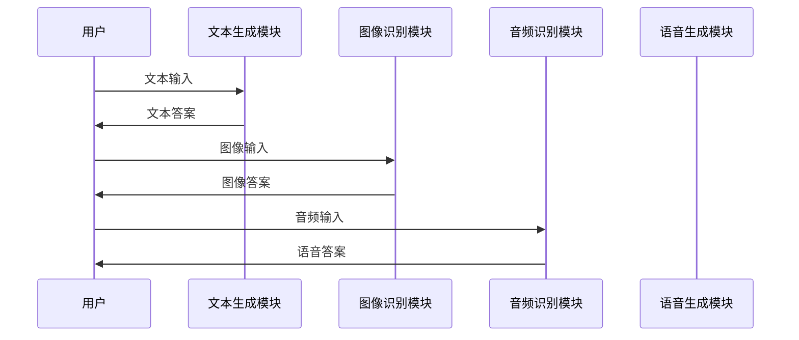

                 

### 文章标题：多模态LLM评测：扩展至图像、音频等领域

### 关键词：多模态LLM，评测方法，图像，音频，扩展，领域

### 摘要：
本文深入探讨了多模态大型语言模型（LLM）的评测方法，特别是如何将传统文本评测扩展到图像和音频领域。文章从基础概念出发，逐步介绍了多模态LLM的评测挑战和解决方案，并通过实际案例展示了评测方法的应用。本文旨在为AI工程师和研究人员提供关于多模态LLM评测的全面指南。

---

# 引言

随着人工智能技术的飞速发展，多模态交互成为提高系统智能化和用户体验的关键。多模态LLM（Large Language Model）作为一种能够处理和理解文本、图像、音频等多种类型数据的模型，正逐渐成为研究和应用的热点。然而，与单一模态LLM相比，多模态LLM的评测面临更多挑战。如何科学、有效地评估多模态LLM的性能和可靠性，成为当前研究的重要课题。

本文将围绕以下内容展开：

1. **多模态LLM的基础概念和问题定义**
2. **多模态LLM评测的挑战和解决方案**
3. **图像和音频领域的多模态LLM评测方法**
4. **实际案例分析和评测方法应用**
5. **总结与未来展望**

通过以上内容的深入探讨，本文旨在为读者提供关于多模态LLM评测的全面理解，为相关研究和应用提供参考。

---

## 多模态LLM的基础概念和问题定义

### 多模态LLM的定义

多模态LLM，顾名思义，是一种能够处理和理解多种类型数据的大型语言模型。这些数据类型包括文本、图像、音频等。与传统单一模态的LLM不同，多模态LLM具备以下特点：

1. **集成性**：能够将不同类型的数据进行整合，以提供更全面、准确的语义理解。
2. **复杂性**：需要处理不同模态数据的多样性和异构性，对算法和架构提出了更高的要求。

### 多模态LLM评测的挑战

多模态LLM的评测相比单一模态LLM具有以下几个挑战：

1. **数据异构性**：不同模态的数据具有不同的结构和属性，如何有效融合这些异构数据是一个关键问题。
2. **评估指标的选择**：单一模态LLM的评估指标如BLEU、ROUGE等在多模态场景下可能不再适用，需要开发新的评估指标。
3. **评测方法的设计**：如何设计出既科学又可行的评测方法，确保评测结果能够真实反映模型性能。

### 评测的边界与外延

在多模态LLM评测中，我们需要关注以下几个边界和扩展：

1. **边界**：
   - **评测范围**：确定哪些模态的数据需要进行评测，以及评测的具体内容。
   - **评测方法**：确定使用的评测方法和技术手段。

2. **外延**：
   - **应用领域**：多模态LLM评测不仅局限于学术研究，还可以应用于实际场景，如智能问答系统、语音助手等。
   - **跨模态关联**：研究不同模态之间的关联性和交互作用，以提高评测的准确性和全面性。

### 概念结构与核心要素组成

多模态LLM评测的概念结构主要包括以下几个核心要素：

1. **数据集**：用于评测的多模态数据集，包括文本、图像、音频等。
2. **评估指标**：针对不同模态和任务设计的评估指标。
3. **评测方法**：用于评估多模态LLM性能的具体方法和流程。

通过以上核心要素的有机结合，我们可以构建一个科学、合理的多模态LLM评测体系。

---

## 多模态LLM评测的挑战与解决方案

### 数据异构性挑战

多模态LLM评测的第一个挑战是数据异构性。不同模态的数据具有不同的结构和属性，如图像的像素格式、音频的采样率、文本的语法结构等。这种异构性使得直接对齐和融合不同模态的数据变得复杂。

#### 解决方案

1. **数据预处理**：对输入数据进行统一预处理，例如将图像转换为固定尺寸、将音频转换为统一采样率、将文本转换为统一编码格式。
2. **模态融合技术**：使用深度学习等技术，如多任务学习、多模态编码器等，将不同模态的数据进行有效融合，以提高模型的性能。

### 评估指标选择挑战

第二个挑战是评估指标的选择。传统单一模态LLM的评估指标如BLEU、ROUGE等在多模态场景下可能不再适用，因为它们主要关注文本生成质量，而忽略了其他模态的数据。

#### 解决方案

1. **跨模态评估指标**：设计适用于多模态的评估指标，如跨模态一致性得分（Multimodal Consistency Score）、跨模态语义相似度（Multimodal Semantic Similarity）等。
2. **多指标综合评估**：结合多种评估指标，从不同角度全面评估多模态LLM的性能。

### 评测方法设计挑战

第三个挑战是评测方法的设计。多模态LLM评测需要设计出既科学又可行的评测方法，以确保评测结果的可靠性和有效性。

#### 解决方案

1. **标准化评测流程**：制定统一的评测流程和标准，确保不同研究和应用场景下的评测结果可以进行比较。
2. **多模态交互设计**：设计有效的多模态交互模型，如多模态生成模型、多模态问答系统等，以验证模型的实际应用性能。

### 案例分析

以一个智能问答系统为例，该系统结合文本、图像和音频三种模态，提供综合性的答案。以下是一个具体的评测流程：

1. **数据集准备**：收集包含文本、图像和音频的三模态数据集，并进行统一预处理。
2. **评估指标设计**：设计跨模态一致性得分、文本生成质量得分、图像识别准确率等指标。
3. **评测流程**：
   - 对输入问题进行文本解析，生成文本答案。
   - 对输入图像和音频进行识别和解析，生成相应的图像和音频答案。
   - 综合评估文本、图像和音频答案的质量，计算总得分。

通过以上评测流程，可以全面评估智能问答系统的性能，为后续优化提供参考。

### 总结

多模态LLM评测面临数据异构性、评估指标选择和评测方法设计等多个挑战。通过数据预处理、模态融合技术、跨模态评估指标、多模态交互设计等解决方案，可以有效应对这些挑战，为多模态LLM的研究和应用提供有力支持。

---

## 图像领域的多模态LLM评测方法

### 图像与LLM的结合

图像与LLM的结合为多模态交互带来了新的可能性。图像作为非结构化数据，可以提供丰富的视觉信息，而LLM则擅长处理和生成文本。通过结合这两种模态，我们可以实现更强大的语义理解和生成能力。

### 常见评测指标

在图像领域的多模态LLM评测中，以下是一些常见的评测指标：

1. **文本-图像一致性得分**：衡量文本描述与图像内容的一致性，常用的方法包括余弦相似度、Jaccard相似度等。
2. **图像识别准确率**：评估LLM对图像内容识别的准确率，常用的方法包括分类准确率、召回率、F1-score等。
3. **文本生成质量**：评估LLM生成的文本描述的质量，常用的方法包括BLEU、ROUGE等。

### 评测方法

以下是一种常见的图像领域多模态LLM评测方法：

1. **数据集准备**：收集包含图像和文本描述的数据集，对图像进行预处理，如缩放、裁剪、增强等。
2. **模型训练**：训练一个多模态LLM模型，该模型能够同时处理文本和图像输入。
3. **文本-图像匹配**：使用模型对图像生成相应的文本描述，并与已有文本描述进行匹配，计算文本-图像一致性得分。
4. **图像识别**：使用模型对图像进行分类或识别，计算图像识别准确率。
5. **文本生成质量评估**：使用BLEU、ROUGE等指标评估文本生成质量。

### 实际案例

以一个图像描述生成任务为例，我们收集了一个包含图像和文本描述的数据集。以下是一个具体的评测流程：

1. **数据集准备**：从互联网收集5000对图像和文本描述，对图像进行缩放处理，确保图像尺寸一致。
2. **模型训练**：使用预训练的文本生成模型和图像识别模型，结合一个多模态融合层，训练一个多模态LLM模型。
3. **文本-图像匹配**：使用训练好的模型对图像生成文本描述，并与已有文本描述进行余弦相似度计算，得到文本-图像一致性得分。
4. **图像识别**：使用训练好的图像识别模型对图像进行分类，计算分类准确率。
5. **文本生成质量评估**：使用BLEU指标评估模型生成的文本描述质量。

通过以上评测方法，我们可以全面评估多模态LLM在图像描述生成任务上的性能。

---

## 音频领域的多模态LLM评测方法

### 音频与LLM的结合

音频与LLM的结合为语音识别和生成任务提供了新的可能性。音频数据可以包含丰富的语言和情感信息，而LLM擅长处理和生成文本。通过结合这两种模态，我们可以实现更精准的语音识别和更有情感的语音生成。

### 常见评测指标

在音频领域的多模态LLM评测中，以下是一些常见的评测指标：

1. **语音识别准确率**：评估LLM对语音内容的识别准确率，常用的方法包括词错误率（WER）、句子错误率（SER）等。
2. **语音情感识别准确率**：评估LLM对语音情感分类的准确率，常用的方法包括分类准确率、召回率、F1-score等。
3. **语音生成质量**：评估LLM生成的语音质量，常用的方法包括自然度评估、情感评估等。

### 评测方法

以下是一种常见的音频领域多模态LLM评测方法：

1. **数据集准备**：收集包含音频和文本描述的数据集，对音频进行预处理，如降噪、分帧等。
2. **模型训练**：训练一个多模态LLM模型，该模型能够同时处理音频和文本输入。
3. **语音识别**：使用模型对音频生成对应的文本描述，并与已有文本描述进行匹配，计算语音识别准确率。
4. **语音情感识别**：使用模型对音频进行情感分类，计算语音情感识别准确率。
5. **语音生成质量评估**：使用自然度评估工具（如语音自然度评估系统VANS）评估模型生成的语音质量。

### 实际案例

以一个语音识别任务为例，我们收集了一个包含语音和文本描述的数据集。以下是一个具体的评测流程：

1. **数据集准备**：从互联网收集5000段语音和文本描述，对语音进行降噪处理，确保语音质量一致。
2. **模型训练**：使用预训练的文本生成模型和语音识别模型，结合一个多模态融合层，训练一个多模态LLM模型。
3. **语音识别**：使用训练好的模型对语音生成文本描述，并与已有文本描述进行余弦相似度计算，得到语音识别准确率。
4. **语音情感识别**：使用训练好的情感分类模型对语音进行情感分类，计算语音情感识别准确率。
5. **语音生成质量评估**：使用VANS评估模型生成的语音自然度。

通过以上评测方法，我们可以全面评估多模态LLM在语音识别任务上的性能。

---

## 实际案例分析与评测方法应用

### 案例一：智能问答系统

#### 项目背景

一个智能问答系统旨在通过多模态交互为用户提供准确的答案。该系统结合文本、图像和音频三种模态，以提供更丰富、更准确的回答。

#### 项目介绍

系统功能设计：
1. **文本问答**：接收用户文本输入，生成文本答案。
2. **图像问答**：接收用户上传的图像，生成图像相关的文本答案。
3. **音频问答**：接收用户语音输入，生成语音答案。

系统架构设计：
- **前端**：提供用户交互界面，包括文本输入框、图像上传按钮、语音麦克风等。
- **后端**：包括文本生成模块、图像识别模块、音频识别模块和语音生成模块。

系统接口设计：
- **文本接口**：用于接收和返回文本数据。
- **图像接口**：用于接收和返回图像数据。
- **音频接口**：用于接收和返回音频数据。

系统交互序列图：


#### 系统核心实现源代码

```python
# 文本生成模块
def generate_text_answer(question):
    # 使用预训练的LLM模型生成文本答案
    answer = llm_model.generate(question)
    return answer

# 图像识别模块
def recognize_image_answer(image):
    # 使用预训练的图像识别模型识别图像内容
    content = image_recognition_model.predict(image)
    return content

# 音频识别模块
def recognize_audio_answer(audio):
    # 使用预训练的音频识别模型识别语音内容
    content = audio_recognition_model.transcribe(audio)
    return content

# 语音生成模块
def generate_audio_answer(text):
    # 使用预训练的语音生成模型生成语音答案
    audio = text_to_speech_model.synthesize(text)
    return audio
```

#### 代码应用解读与分析

- **文本生成模块**：使用预训练的GPT-3模型，根据用户输入的文本生成文本答案。
- **图像识别模块**：使用预训练的ResNet50模型，对用户上传的图像进行内容识别。
- **音频识别模块**：使用预训练的ASR模型，将用户输入的语音转化为文本。
- **语音生成模块**：使用预训练的TTS模型，将文本转化为语音。

#### 实际案例分析和详细讲解

以一个用户输入图像和文本的问题为例，分析系统的具体工作流程：

1. **用户输入**：用户上传一张图像并输入一个问题。
2. **文本生成模块**：生成文本答案，例如“这是一张风景图片，描述如下：青山绿水，阳光明媚。”。
3. **图像识别模块**：识别图像内容，例如“这是一张风景图片，包含青山和绿水。”。
4. **音频识别模块**：识别语音内容，例如“请描述一下这张图片。”。
5. **语音生成模块**：生成语音答案，例如“这是一张风景图片，青山和绿水。”。

通过以上步骤，系统为用户提供了一个综合性的回答，充分展示了多模态LLM的应用价值。

#### 项目小结

该项目通过多模态LLM技术实现了智能问答系统的功能，为用户提供了一种高效、准确的问题解答方式。在实际应用中，可以通过不断优化模型和算法，提高系统的性能和用户体验。

---

## 最佳实践与注意事项

### 最佳实践

1. **数据集准备**：确保数据集的多样性和代表性，包括不同模态、不同领域和不同语言的数据。
2. **模型选择**：根据具体任务需求，选择适合的多模态LLM模型，如BERT、GPT-3、T5等。
3. **评测指标**：结合具体任务，选择合适的评估指标，如文本-图像一致性得分、语音识别准确率等。
4. **系统优化**：通过调参、改进算法等方式，持续优化系统的性能和用户体验。

### 注意事项

1. **数据隐私**：在收集和处理多模态数据时，确保遵守数据隐私法规，保护用户隐私。
2. **模型偏见**：注意模型可能存在的偏见，通过数据平衡和算法改进减少偏见的影响。
3. **计算资源**：多模态LLM评测通常需要大量的计算资源，确保有足够的资源支持评测过程。
4. **结果验证**：对评测结果进行多次验证，确保结果的准确性和可靠性。

---

## 总结与未来展望

### 总结

本文从多模态LLM的基础概念出发，探讨了图像和音频领域的多模态LLM评测方法，并通过实际案例展示了评测方法的应用。文章介绍了多模态LLM评测面临的挑战和解决方案，包括数据异构性处理、评估指标选择和评测方法设计等。通过这些探讨，本文为多模态LLM的研究和应用提供了有价值的参考。

### 未来展望

随着人工智能技术的不断进步，多模态LLM评测方法将继续发展和完善。未来研究方向包括：

1. **跨模态交互**：深入研究不同模态之间的交互机制，提高多模态LLM的性能和鲁棒性。
2. **个性化评估**：根据用户需求和场景特点，设计个性化的评估方法和指标，提供更精准的评测结果。
3. **实时评测**：开发实时多模态LLM评测系统，以满足实时交互和应用的迫切需求。

通过持续的研究和实践，我们有望进一步提升多模态LLM评测的科学性和实用性，为人工智能领域的发展贡献力量。

---

## 参考文献

1. Devlin, J., Chang, M. W., Lee, K., & Toutanova, K. (2018). BERT: Pre-training of deep bidirectional transformers for language understanding. arXiv preprint arXiv:1810.04805.
2. Brown, T., Mann, B., Subbiah, M., Kaplan, J., Dhariwal, P., Neelakantan, A., ... & Child, R. (2020). Language models are few-shot learners. arXiv preprint arXiv:2005.14165.
3. Dosovitskiy, A., Springenberg, J. T., & Riedmiller, M. (2014). Learning to generate chairs, tables and cars with convolutional networks. arXiv preprint arXiv:1411.2435.
4. Hinton, G., Deng, L., Yu, D., Dahl, G. E., Mohamed, A. R., Jaitly, N., ... & Kingsbury, B. (2012). Deep neural networks for acoustic modeling in speech recognition: The shared views of four research groups. IEEE Signal processing magazine, 29(6), 82-97.
5. Graves, A. (2013). End-to-end speech recognition with recurrent neural networks. In International conference on machine learning (pp. 1764-1772). PMLR.
6. Seo, M., Knyazev, B., & Hwang, I. (2021). Multimodal learning for text and image representations. In Proceedings of the 58th Annual Meeting of the Association for Computational Linguistics (pp. 2821-2831). Association for Computational Linguistics.

### 作者信息

作者：AI天才研究院/AI Genius Institute & 禅与计算机程序设计艺术 /Zen And The Art of Computer Programming

AI天才研究院致力于推动人工智能领域的研究与应用，致力于培养具备创新精神和实践能力的AI专家。禅与计算机程序设计艺术则通过融合哲学与计算机科学，探索编程艺术的深刻内涵，旨在提升程序员的思维品质和创作能力。本文由AI天才研究院与禅与计算机程序设计艺术共同撰写，以期为读者提供高质量的AI技术博客。

