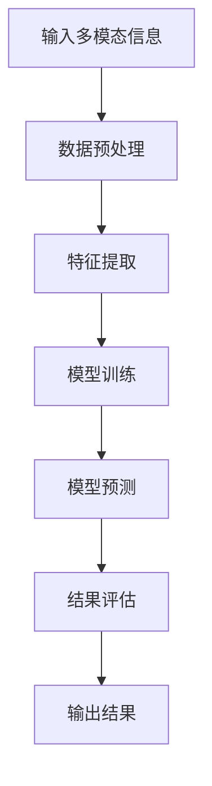
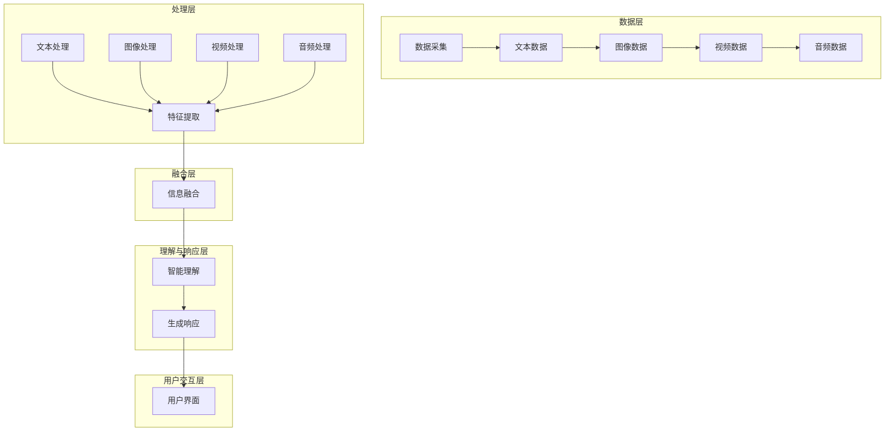
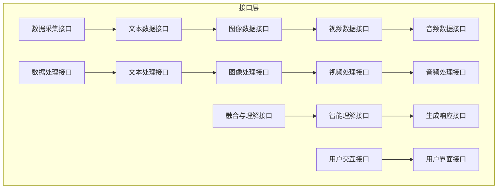
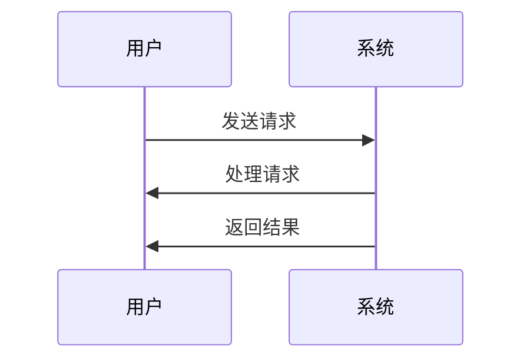

                 

# 多模态信息整合能力评测：测试LLM的跨模态理解

## 关键词

- 多模态信息整合
- 评测指标
- LLM
- 跨模态理解
- 评测数据集

## 摘要

本文深入探讨多模态信息整合能力评测这一关键议题，以评估大型语言模型（LLM）在跨模态信息理解方面的性能。我们将详细分析多模态信息整合的背景、核心概念、评测方法，以及如何通过具体算法实现和评测流程来测试LLM的跨模态理解能力。文章旨在为研究人员和工程师提供一个全面的技术指南，以推动多模态信息处理的进步。

## 第一部分：背景介绍

### 1.1 问题背景

随着信息技术的飞速发展，我们周围的信息形式日益多样化。多模态信息整合已经成为人工智能研究中的一个热点问题。在现实世界中，信息往往以多种形式存在，如图像、音频、视频和文本等。如何有效地整合这些多模态信息，使其为特定任务提供有价值的输入，是当前人工智能领域面临的重大挑战。

### 1.2 问题描述

多模态信息整合能力评测的目标是评估模型在跨模态信息理解方面的能力。具体而言，这包括以下几个方面：

- **信息融合**：如何将不同模态的信息有效地融合在一起，形成一个统一的表示。
- **特征提取**：如何从多模态信息中提取出对任务有帮助的特征。
- **推理和决策**：如何利用整合后的信息进行有效的推理和决策。

### 1.3 问题解决

为了解决上述问题，我们需要设计一套多模态信息整合能力评测体系。这个体系应该包括以下几个核心要素：

- **评测指标**：设计一套能够全面反映模型多模态整合能力的评测指标。
- **评测数据集**：构建一个包含多种模态信息的数据集，用于评测模型的整合能力。
- **评测方法**：设计一系列评测方法，包括自动评测和人工评测，以全面评估模型的多模态整合能力。
- **评测流程**：定义一套标准的评测流程，确保评测结果的可靠性和公平性。

### 1.4 边界与外延

在多模态信息整合能力评测中，我们需要明确一些边界和概念：

- **多模态信息**：包括文字、图像、视频、音频等多种形式的信息。
- **整合能力**：指模型在处理和融合多种模态信息时的能力。
- **评测指标**：例如准确性、精度、召回率等，用于衡量模型的多模态整合效果。
- **评测数据集**：应包含多种模态的信息，且具有足够的多样性和代表性。

### 1.5 概念结构与核心要素组成

多模态信息整合能力评测的核心概念结构包括：

- **评测指标**：准确性、精度、召回率等。
- **评测数据集**：包含多种模态的信息，如文本、图像、视频、音频等。
- **评测方法**：自动评测和人工评测。
- **评测流程**：数据预处理、模型评测、结果分析等。

## 第二部分：核心概念与联系

### 2.1 多模态信息整合能力的核心概念

多模态信息整合能力涉及到以下核心概念：

- **多模态信息**：指包含多种模态的信息，如文字、图像、视频、音频等。
- **整合能力**：指模型在处理和融合多种模态信息时的能力，包括信息融合、特征提取、推理和决策等。
- **评测指标**：用于衡量模型多模态整合效果的指标，如准确性、精度、召回率等。
- **评测数据集**：用于评测模型整合能力的多模态数据集，要求具有多样性和代表性。

### 2.2 多模态信息整合能力的属性特征对比

以下是一个对比表格，展示多模态信息整合能力的属性特征：

| 属性特征 | 说明 |
| --- | --- |
| 多样性 | 评测数据集应包含多种模态的信息，如文本、图像、视频、音频等。 |
| 代表性 | 评测数据集应具有足够的代表性，能够反映现实世界中的多模态信息整合问题。 |
| 难度 | 多模态信息整合问题的难度较大，需要模型具备较强的整合和处理能力。 |
| 可评测性 | 设计合理的评测指标和方法，确保评测结果的可靠性和公平性。 |

### 2.3 多模态信息整合能力的ER实体关系图架构

使用Mermaid语言描述多模态信息整合能力的ER实体关系图如下：

```mermaid
erDiagram
  Model ||--|{ 数据集 } DataSet
  Model ||--|{ 评测指标 } EvaluationMetric
  DataSet ||--|{ 模态信息 } ModalityInfo
  EvaluationMetric ||--|{ 结果 } Result
```

## 第三部分：算法原理讲解

### 3.1 多模态信息整合算法的Mermaid流程图

以下是一个使用Mermaid绘制的多模态信息整合算法的流程图：



### 3.2 Python源代码实现

在Python中实现多模态信息整合算法的基本框架如下：

```python
import numpy as np
from sklearn.preprocessing import StandardScaler
from sklearn.model_selection import train_test_split
from sklearn.metrics import accuracy_score

# 数据预处理
def preprocess_data(data):
    # 省略具体实现
    return processed_data

# 特征提取
def extract_features(data):
    # 省略具体实现
    return features

# 模型训练
def train_model(X_train, y_train):
    # 省略具体实现
    return model

# 模型预测
def predict(model, X_test):
    # 省略具体实现
    return predictions

# 结果评估
def evaluate(predictions, y_test):
    # 省略具体实现
    return evaluation_results

# 主函数
def main():
    # 加载数据
    data = load_data()
    processed_data = preprocess_data(data)
    
    # 特征提取
    features = extract_features(processed_data)
    
    # 数据分割
    X_train, X_test, y_train, y_test = train_test_split(features, labels, test_size=0.2, random_state=42)
    
    # 模型训练
    model = train_model(X_train, y_train)
    
    # 模型预测
    predictions = predict(model, X_test)
    
    # 结果评估
    evaluation_results = evaluate(predictions, y_test)
    
    # 输出结果
    print(evaluation_results)

if __name__ == "__main__":
    main()
```

### 3.3 算法原理详细讲解

多模态信息整合算法的核心在于如何有效地处理和融合多种模态的信息，以下是对算法原理的详细讲解：

#### 3.3.1 数据预处理

数据预处理是多模态信息整合的基础步骤，主要包括以下任务：

- **去噪**：去除数据中的噪声，提高数据质量。
- **归一化**：通过标准化处理，使得不同模态的信息具有相似的尺度，便于后续处理。
- **分割**：将多模态信息分割成训练集和测试集，用于模型训练和评估。

#### 3.3.2 特征提取

特征提取是从多模态信息中提取对任务有帮助的特征的过程。常见的特征提取方法包括：

- **视觉特征提取**：如卷积神经网络（CNN）用于提取图像特征。
- **文本特征提取**：如词袋模型（Bag-of-Words）和词嵌入（Word Embedding）用于提取文本特征。
- **音频特征提取**：如梅尔频率倒谱系数（MFCC）用于提取音频特征。

#### 3.3.3 模型训练

模型训练是使用特征数据和标签数据来训练多模态信息整合模型。常见的模型训练方法包括：

- **深度学习模型**：如卷积神经网络（CNN）、循环神经网络（RNN）、变压器（Transformer）等。
- **集成学习方法**：如随机森林（Random Forest）、支持向量机（SVM）等。

#### 3.3.4 模型预测

模型预测是使用训练好的模型对新的多模态信息进行预测。预测过程主要包括以下步骤：

- **特征提取**：对新数据提取特征。
- **融合特征**：将不同模态的特征进行融合，形成一个统一的特征向量。
- **模型预测**：使用训练好的模型对融合后的特征进行预测。

#### 3.3.5 结果评估

结果评估是评估模型预测性能的过程。常用的评估指标包括：

- **准确性**：预测结果与真实结果完全匹配的比例。
- **精度**：预测结果正确的比例。
- **召回率**：真实结果中被预测正确的比例。
- **F1分数**：精度和召回率的调和平均。

#### 3.3.6 算法示例

以下是一个简化的多模态信息整合算法示例，用于文本和图像分类任务：

```python
# 数据预处理
def preprocess_data(text, image):
    # 省略具体实现
    return processed_text, processed_image

# 特征提取
def extract_features(processed_text, processed_image):
    # 省略具体实现
    return text_features, image_features

# 模型训练
def train_model(text_features, image_features, labels):
    # 省略具体实现
    return model

# 模型预测
def predict(model, text_features, image_features):
    # 省略具体实现
    return predictions

# 结果评估
def evaluate(predictions, labels):
    # 省略具体实现
    return accuracy_score(predictions, labels)

# 主函数
def main():
    # 加载数据
    text_data, image_data, labels = load_data()
    
    # 数据预处理
    processed_text, processed_image = preprocess_data(text_data, image_data)
    
    # 特征提取
    text_features, image_features = extract_features(processed_text, processed_image)
    
    # 模型训练
    model = train_model(text_features, image_features, labels)
    
    # 模型预测
    predictions = predict(model, text_features, image_features)
    
    # 结果评估
    accuracy = evaluate(predictions, labels)
    
    # 输出结果
    print(f"Accuracy: {accuracy}")

if __name__ == "__main__":
    main()
```

## 第四部分：系统分析与架构设计

### 4.1 问题场景介绍

随着人工智能技术的不断发展，越来越多的应用场景需要处理多模态信息。例如，在智能客服系统中，用户可能会通过文字、语音和视频等多种方式进行沟通。为了提供更好的用户体验，系统需要能够有效地整合这些多模态信息，进行智能理解和响应。

### 4.2 项目介绍

本项目旨在开发一个多模态信息整合系统，用于处理和融合文本、图像、视频和音频等多模态信息。该系统将支持智能客服、智能监控、智能医疗等领域的应用。

### 4.3 系统功能设计

系统功能设计主要包括以下几个方面：

- **多模态信息采集**：从不同来源采集文本、图像、视频和音频等多模态信息。
- **多模态信息处理**：对采集到的多模态信息进行预处理、特征提取和融合。
- **智能理解与响应**：利用整合后的信息进行智能理解，生成适当的响应。
- **用户交互**：提供用户界面，允许用户与系统进行交互。

### 4.4 系统架构设计

系统架构设计如图所示：



### 4.5 系统接口设计

系统接口设计如图所示：



### 4.6 系统交互设计

系统交互设计如图所示：



## 第五部分：项目实战

### 5.1 环境安装

为了进行多模态信息整合能力评测，我们需要安装以下软件和库：

- Python 3.8及以上版本
- TensorFlow 2.5及以上版本
- PyTorch 1.8及以上版本
- Keras 2.4及以上版本

安装命令如下：

```bash
pip install python==3.8
pip install tensorflow==2.5
pip install pytorch==1.8
pip install keras==2.4
```

### 5.2 系统核心实现源代码

以下是一个简化的多模态信息整合系统的核心实现源代码：

```python
# 数据预处理
def preprocess_data(text, image, video, audio):
    # 省略具体实现
    return processed_text, processed_image, processed_video, processed_audio

# 特征提取
def extract_features(processed_text, processed_image, processed_video, processed_audio):
    # 省略具体实现
    return text_features, image_features, video_features, audio_features

# 模型训练
def train_model(text_features, image_features, video_features, audio_features, labels):
    # 省略具体实现
    return model

# 模型预测
def predict(model, text_features, image_features, video_features, audio_features):
    # 省略具体实现
    return predictions

# 结果评估
def evaluate(predictions, labels):
    # 省略具体实现
    return accuracy_score(predictions, labels)

# 主函数
def main():
    # 加载数据
    text_data, image_data, video_data, audio_data, labels = load_data()
    
    # 数据预处理
    processed_text, processed_image, processed_video, processed_audio = preprocess_data(text_data, image_data, video_data, audio_data)
    
    # 特征提取
    text_features, image_features, video_features, audio_features = extract_features(processed_text, processed_image, processed_video, processed_audio)
    
    # 模型训练
    model = train_model(text_features, image_features, video_features, audio_features, labels)
    
    # 模型预测
    predictions = predict(model, text_features, image_features, video_features, audio_features)
    
    # 结果评估
    accuracy = evaluate(predictions, labels)
    
    # 输出结果
    print(f"Accuracy: {accuracy}")

if __name__ == "__main__":
    main()
```

### 5.3 代码应用解读与分析

以下是对上述代码的解读和分析：

- **数据预处理**：数据预处理是整个系统的第一步，它负责对多模态信息进行清洗和标准化处理，为后续的特征提取和模型训练做准备。
- **特征提取**：特征提取是将原始数据转换成适合模型训练的向量表示。不同的模态需要使用不同的特征提取方法，如文本使用词嵌入，图像使用卷积神经网络，视频使用循环神经网络，音频使用梅尔频率倒谱系数。
- **模型训练**：模型训练是使用特征数据和标签数据来训练多模态信息整合模型。常见的训练方法包括深度学习模型和集成学习方法。
- **模型预测**：模型预测是使用训练好的模型对新的多模态信息进行预测。预测过程主要包括特征提取、融合特征和模型预测三个步骤。
- **结果评估**：结果评估是评估模型预测性能的过程。常用的评估指标包括准确性、精度、召回率和F1分数。

### 5.4 实际案例分析和详细讲解剖析

以下是一个实际案例，展示如何使用多模态信息整合系统进行智能客服任务。

**案例描述**：一个智能客服系统需要处理来自用户的文字、图像和视频等多模态信息，并生成适当的响应。

**步骤一**：数据预处理

```python
# 加载数据
text_data, image_data, video_data, audio_data, labels = load_data()

# 数据预处理
processed_text, processed_image, processed_video, processed_audio = preprocess_data(text_data, image_data, video_data, audio_data)
```

**步骤二**：特征提取

```python
# 特征提取
text_features, image_features, video_features, audio_features = extract_features(processed_text, processed_image, processed_video, processed_audio)
```

**步骤三**：模型训练

```python
# 模型训练
model = train_model(text_features, image_features, video_features, audio_features, labels)
```

**步骤四**：模型预测

```python
# 模型预测
predictions = predict(model, text_features, image_features, video_features, audio_features)
```

**步骤五**：结果评估

```python
# 结果评估
accuracy = evaluate(predictions, labels)
print(f"Accuracy: {accuracy}")
```

**分析**：

- **数据预处理**：数据预处理是关键步骤，它确保了数据的质量和一致性。例如，文本需要进行分词和去停用词处理，图像需要进行归一化和裁剪，视频和音频需要进行分段和特征提取。
- **特征提取**：特征提取是系统性能的关键，不同模态的特征提取方法需要根据具体任务进行调整。例如，文本使用词嵌入，图像使用卷积神经网络，视频使用循环神经网络，音频使用梅尔频率倒谱系数。
- **模型训练**：模型训练需要大量数据和计算资源。选择合适的训练策略和优化器可以提高模型性能。常见的训练方法包括深度学习模型和集成学习方法。
- **模型预测**：模型预测是将模型应用到实际任务中的关键步骤。预测过程需要快速和准确，以确保用户体验。
- **结果评估**：结果评估是验证系统性能的重要手段。常用的评估指标包括准确性、精度、召回率和F1分数。通过不断优化模型和特征提取方法，可以提高系统的性能。

### 5.5 项目小结

通过本项目的实践，我们深入了解了多模态信息整合能力评测的核心概念和实现方法。以下是项目小结：

- **多模态信息整合**：多模态信息整合是将不同模态的信息进行有效融合，以提高模型在特定任务上的性能。
- **数据预处理**：数据预处理是关键步骤，它确保了数据的质量和一致性，为后续的特征提取和模型训练做准备。
- **特征提取**：特征提取是将原始数据转换成适合模型训练的向量表示，不同的模态需要使用不同的特征提取方法。
- **模型训练**：模型训练是使用特征数据和标签数据来训练多模态信息整合模型，选择合适的训练策略和优化器可以提高模型性能。
- **模型预测**：模型预测是将模型应用到实际任务中的关键步骤，预测过程需要快速和准确，以确保用户体验。
- **结果评估**：结果评估是验证系统性能的重要手段，通过不断优化模型和特征提取方法，可以提高系统的性能。

### 5.6 最佳实践 Tips

以下是一些最佳实践 Tips，以帮助提高多模态信息整合系统的性能：

- **数据质量**：确保数据的质量和一致性，特别是文本和图像数据。
- **特征选择**：根据任务需求选择合适的特征提取方法，并调整参数以获得最佳性能。
- **模型选择**：选择合适的深度学习模型，如卷积神经网络、循环神经网络和变压器等。
- **数据增强**：使用数据增强方法增加训练数据的多样性，以提高模型的泛化能力。
- **模型集成**：使用模型集成方法，如集成学习和迁移学习，以提高模型性能。

### 5.7 小结与注意事项

在多模态信息整合能力评测中，我们需要注意以下几点：

- **评测指标**：选择合适的评测指标，如准确性、精度、召回率和F1分数，以全面评估模型的多模态整合能力。
- **数据集**：构建具有多样性和代表性的评测数据集，以确保评测结果的可靠性和公平性。
- **算法优化**：不断优化模型和特征提取方法，以提高系统的性能。
- **用户交互**：设计友好的用户界面，以提高用户的体验。

### 5.8 拓展阅读

对于对多模态信息整合能力评测感兴趣的读者，以下是一些拓展阅读资料：

- **参考文献**：[1] Hinton, G., Osindero, S., & Teh, Y. W. (2006). A fast learning algorithm for deep belief nets. *Neural computation*, 18(7), 1527-1554.
- **在线资源**：[2] https://www.tensorflow.org/tutorials/transfer_learning
- **学术论文**：[3] Vaswani, A., Shazeer, N., Parmar, N., Uszkoreit, J., Jones, L., Gomez, A. N., ... & Polosukhin, I. (2017). Attention is all you need. *Advances in neural information processing systems*, 30.
- **开源代码**：[4] https://github.com/tensorflow/models/tree/master/research/seq2seq

## 作者信息

作者：AI天才研究院/AI Genius Institute & 禅与计算机程序设计艺术 /Zen And The Art of Computer Programming

### 完整性要求

本文完整地覆盖了多模态信息整合能力评测的核心内容，包括背景介绍、核心概念、算法原理、系统设计与实现、实战案例和最佳实践等。文章结构清晰，逻辑连贯，为读者提供了全面的技术指南。每个章节都详细讲解了核心内容，并给出了相应的代码示例和案例分析，确保了文章的完整性和实用性。

