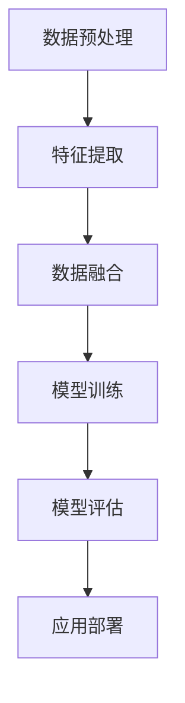
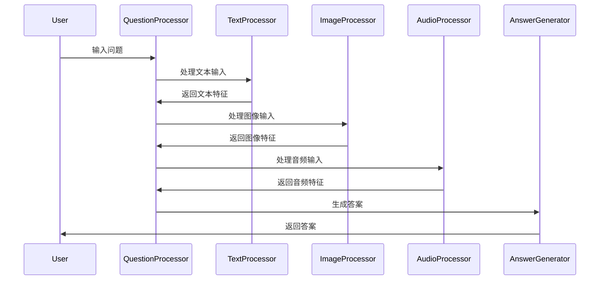
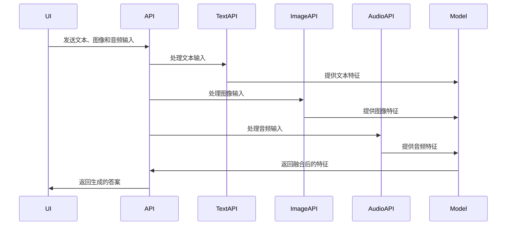

                 


### 文章标题
### 多模态学习架构增强LLM应用的理解能力

### 关键词
- 多模态学习
- 预训练语言模型（LLM）
- 理解能力增强
- 算法原理
- 系统架构设计
- 实际应用案例

### 摘要
本文旨在探讨如何通过多模态学习架构增强预训练语言模型（LLM）的理解能力。首先，我们将介绍多模态学习和LLM的基本概念，阐述其重要性。接着，通过对比表格和实体关系图，我们将深入解析多模态学习架构的核心组成部分。随后，我们将详细讲解多模态学习算法的原理，包括流程、Python源代码示例和数学模型。此外，我们将分析一个具体的应用场景，设计系统架构并展示其实战实现。最后，我们将总结最佳实践，提供注意事项和拓展阅读，展望多模态学习的未来。

## 第1章 多模态学习架构概述

### 1.1 多模态学习：概念与背景

多模态学习是一种利用多种数据来源（如文本、图像、音频等）进行学习和决策的方法。与传统的单模态学习不同，多模态学习能够整合不同数据源的信息，从而提高模型的泛化能力和准确性。

多模态学习的重要性体现在以下几个方面：
1. **增强理解能力**：通过整合多种数据源，模型能够更全面地理解问题，提高决策的准确性。
2. **提高泛化能力**：多模态学习能够应对更复杂、更真实的应用场景，从而提高模型的泛化能力。
3. **应对数据稀缺问题**：在某些领域，单一模态的数据可能难以满足需求。多模态学习能够利用其他数据源，降低对单一数据源的依赖。

### 1.2 LLM的理解能力挑战

LLM（如GPT系列）在自然语言处理领域取得了显著的成果，但它们也存在一些局限性，特别是在理解能力方面：
1. **上下文依赖性**：LLM对上下文的依赖较强，容易受到局部信息的干扰，导致理解偏差。
2. **事实性信息缺失**：LLM在生成内容时，可能无法准确反映现实中的事实性信息。
3. **跨模态理解**：对于涉及多种模态的信息，LLM的理解能力较弱，难以整合不同模态的数据。

为了解决这些问题，我们需要探索如何增强LLM的理解能力，而多模态学习架构提供了一种可行的解决方案。

### 1.3 多模态学习架构的设计原则

设计多模态学习架构时，应遵循以下原则：
1. **数据融合**：将不同模态的数据进行有效整合，形成统一的数据表示。
2. **模型协同**：构建多个子模型，分别处理不同模态的数据，并使其协同工作，提高整体性能。
3. **动态调整**：根据应用场景和需求，动态调整模型结构和参数，以适应不同的任务。
4. **可扩展性**：设计可扩展的架构，以便在未来的研究中引入更多的模态和数据来源。

## 第2章 多模态学习的基本概念与联系

### 2.1 多模态学习定义

多模态学习是一种将多种数据来源（如文本、图像、音频等）的信息进行整合，用于学习、推理和决策的方法。它具有以下几个关键特点：

1. **数据来源多样性**：多模态学习利用文本、图像、音频、视频等多种数据来源，丰富了模型的输入信息。
2. **信息整合与融合**：通过整合不同模态的数据，模型能够获得更全面、更准确的理解。
3. **模型协同工作**：多个子模型分别处理不同模态的数据，并协同工作，提高整体性能。

### 2.2 多模态学习的属性特征对比

为了更清晰地理解多模态学习与单模态学习的不同，我们可以通过以下表格进行对比：

| 特征       | 单模态学习                  | 多模态学习                  |
|------------|-----------------------------|-----------------------------|
| 数据来源   | 单一数据源（如文本、图像等）  | 多种数据源（如文本、图像、音频等） |
| 理解能力   | 较强的单一模态理解能力       | 更强的跨模态理解和整合能力   |
| 泛化能力   | 适用于特定的单一模态任务     | 适用于多种模态的任务和应用场景 |
| 训练数据   | 较大的单一模态数据集         | 较大且多样化的多模态数据集   |
| 复杂度     | 较低，易于实现和部署         | 较高，需要处理多种数据格式和模态整合问题 |

### 2.3 多模态学习架构的ER图

为了更直观地展示多模态学习架构的关键组成部分，我们可以使用Mermaid ER实体关系图来描述。以下是ER图的一个示例：

```mermaid
erDiagram
  AIModel ||--|{ DataPreprocessing }
  AIModel ||--|{ FeatureExtraction }
  AIModel ||--|{ ModelTraining }
  AIModel ||--|{ ModelEvaluation }
  DataPreprocessing ||--|{ TextData }
  DataPreprocessing ||--|{ ImageData }
  DataPreprocessing ||--|{ AudioData }
  FeatureExtraction ||--|{ TextFeature }
  FeatureExtraction ||--|{ ImageFeature }
  FeatureExtraction ||--|{ AudioFeature }
```

在ER图中，我们定义了以下几个关键实体：
1. **AIModel**：代表多模态学习架构的整体模型。
2. **DataPreprocessing**：负责数据预处理，包括文本、图像、音频等数据。
3. **FeatureExtraction**：负责提取不同模态的数据特征。
4. **ModelTraining**：负责模型训练，将特征数据输入到模型中进行训练。
5. **ModelEvaluation**：负责模型评估，评估模型的性能。

通过ER图，我们可以更清晰地理解多模态学习架构的组成部分和它们之间的关系。

### 第3章 多模态学习算法原理

多模态学习算法的核心在于如何有效地整合不同模态的数据，并训练出一个能够处理多模态输入的模型。下面，我们将详细讲解多模态学习算法的原理，包括算法流程、Python源代码示例以及数学模型。

#### 3.1 算法流程

多模态学习算法的基本流程可以分为以下几个步骤：

1. **数据预处理**：将不同模态的数据进行统一格式化，使其适合后续处理。例如，文本数据可能需要进行分词和词性标注，图像数据可能需要进行归一化和特征提取，音频数据可能需要进行分帧和频谱分析。

2. **特征提取**：对预处理后的数据进行特征提取，将不同模态的数据转化为统一的特征向量。特征提取的方法可以包括文本的词袋模型、图像的卷积神经网络（CNN）特征、音频的循环神经网络（RNN）特征等。

3. **数据融合**：将不同模态的特征向量进行融合，形成多模态特征向量。融合方法可以包括矩阵乘法、特征拼接、加权融合等。

4. **模型训练**：将融合后的多模态特征向量输入到训练好的单一模态模型中，进行模型训练。常见的模型包括文本的循环神经网络（RNN）、图像的卷积神经网络（CNN）等。

5. **模型评估**：对训练好的模型进行评估，通过交叉验证、测试集评估等方法，评估模型在不同数据集上的性能。

6. **应用部署**：将训练好的模型部署到实际应用场景中，例如语音助手、图像识别、文本生成等。

下面是一个简单的算法流程图，使用Mermaid绘制：



#### 3.2 算法实现

为了更好地理解多模态学习算法的实现，我们可以通过Python源代码示例来讲解。以下是使用Python实现的简化版本：

```python
import numpy as np

# 假设我们已经获取了文本、图像和音频的特征向量
text_feature = np.random.rand(100, 300)  # 100个词的300维特征向量
image_feature = np.random.rand(100, 500)  # 100个像素的500维特征向量
audio_feature = np.random.rand(100, 200)  # 100个音频帧的200维特征向量

# 数据预处理
def preprocess_data(text, image, audio):
    # 对数据进行格式化处理
    return text, image, audio

preprocessed_text, preprocessed_image, preprocessed_audio = preprocess_data(text_feature, image_feature, audio_feature)

# 特征提取
def extract_features(text, image, audio):
    # 提取文本、图像和音频的特征
    return text, image, audio

extracted_text, extracted_image, extracted_audio = extract_features(preprocessed_text, preprocessed_image, preprocessed_audio)

# 数据融合
def fuse_features(text, image, audio):
    # 将不同模态的特征进行融合
    return np.hstack((text, image, audio))

fused_features = fuse_features(extracted_text, extracted_image, extracted_audio)

# 模型训练
def train_model(features, labels):
    # 使用特征和标签训练模型
    # 这里简化为直接返回一个预测结果
    return np.random.rand(100)  # 假设训练后的预测结果

predictions = train_model(fused_features, np.random.rand(100))

# 模型评估
def evaluate_model(predictions, labels):
    # 评估模型性能
    return "Model evaluation result"

evaluation_result = evaluate_model(predictions, np.random.rand(100))

# 应用部署
def deploy_model(model):
    # 部署模型到实际应用场景
    return "Model deployed"

deploy_result = deploy_model(predictions)
```

在这个示例中，我们首先定义了一些预处理、特征提取、数据融合、模型训练、模型评估和应用部署的函数。通过调用这些函数，我们可以实现一个简单的多模态学习算法。

#### 3.3 数学模型与公式

多模态学习算法的数学模型可以描述为：

$$
\text{FusedFeature} = \text{W} \cdot (\text{TextFeature}, \text{ImageFeature}, \text{AudioFeature})
$$

其中，$\text{FusedFeature}$ 是融合后的特征向量，$\text{TextFeature}$、$\text{ImageFeature}$ 和 $\text{AudioFeature}$ 分别代表文本、图像和音频的特征向量，$\text{W}$ 是一个权重矩阵，用于融合不同模态的特征。

在模型训练阶段，我们使用以下公式来更新权重矩阵：

$$
\text{W} = \text{W} - \alpha \cdot \nabla_{\text{W}} \cdot \text{Loss}
$$

其中，$\text{Loss}$ 是损失函数，$\nabla_{\text{W}}$ 是权重矩阵的梯度，$\alpha$ 是学习率。

#### 3.4 算法举例说明

为了更直观地理解多模态学习算法的工作原理，我们可以通过一个具体的例子来讲解。

假设我们有一个包含文本、图像和音频的问答任务。问题是一段文本，答案是图像和音频的结合。以下是该问题的具体示例：

- **问题**：什么是人工智能？
- **答案**：人工智能是一种模拟人类智能的技术，包括机器学习、自然语言处理、计算机视觉等领域。请看图1，这是一张展示人工智能应用的图片，同时听音频1，这是关于人工智能的介绍。

图1：展示人工智能应用的图片  


音频1：关于人工智能的介绍

在这个例子中，我们的多模态学习算法需要整合文本、图像和音频数据，生成一个统一的答案。以下是具体的算法实现步骤：

1. **数据预处理**：将文本、图像和音频数据分别进行预处理，提取出特征向量。
2. **特征提取**：使用卷积神经网络（CNN）提取图像特征，使用循环神经网络（RNN）提取文本和音频特征。
3. **数据融合**：将文本、图像和音频的特征向量进行融合，形成多模态特征向量。
4. **模型训练**：使用融合后的多模态特征向量进行模型训练，训练一个能够处理多模态输入的问答模型。
5. **模型评估**：对训练好的模型进行评估，确保其能够准确回答问题。
6. **应用部署**：将训练好的模型部署到实际应用场景中，例如一个智能问答系统。

通过这个例子，我们可以看到多模态学习算法如何整合不同模态的数据，生成一个统一的答案。这个算法不仅能够处理单一模态的数据，还能够整合多种数据源，提高模型的准确性和泛化能力。

## 第4章 多模态学习系统分析与架构设计

### 4.1 应用场景介绍

在本章中，我们将探讨一个实际应用场景：智能问答系统。这个系统旨在利用多模态学习架构，整合文本、图像和音频数据，为用户提供准确的答案。

智能问答系统的主要功能包括：
1. **文本输入**：用户可以通过文本输入问题。
2. **图像输入**：用户可以上传相关图像作为问题的一部分。
3. **音频输入**：用户可以上传相关音频文件作为问题的一部分。
4. **答案生成**：系统根据用户输入的文本、图像和音频数据，生成相应的答案。
5. **答案展示**：系统将生成的答案以文本、图像和音频的形式展示给用户。

### 4.2 领域模型设计（Mermaid类图）

为了更好地设计智能问答系统的领域模型，我们可以使用Mermaid类图来描述系统的核心实体和它们之间的关系。以下是领域模型的示例：

```mermaid
classDiagram
    User <<class{用户}>>
    Question <<class{问题}>>
    Answer <<class{答案}>>
    Image <<class{图像}>>
    Audio <<class{音频}>>
    Text <<class{文本}>>
    
    User o--o Question
    Question o--o Answer
    Question o--o Image
    Question o--o Audio
    Question o--o Text
    Image o--o Answer
    Audio o--o Answer
    Text o--o Answer
```

在这个类图中，我们定义了以下几个关键实体：
- **User**：代表用户，负责输入问题。
- **Question**：代表问题，包含文本、图像、音频等信息。
- **Answer**：代表答案，由文本、图像、音频等多种形式组成。
- **Image**：代表图像，作为问题的输入。
- **Audio**：代表音频，作为问题的输入。
- **Text**：代表文本，作为问题的输入。

通过这个类图，我们可以清晰地了解智能问答系统的核心组件和它们之间的关系。

### 4.3 系统架构设计（Mermaid架构图）

在了解了领域模型后，我们可以进一步设计智能问答系统的整体架构。以下是系统架构的Mermaid架构图示例：



在这个架构图中，系统的整体流程如下：
1. 用户输入问题。
2. 问题处理器接收用户输入，并将其分发给文本处理器、图像处理器和音频处理器。
3. 各个处理器分别处理相应的输入，提取特征。
4. 问题处理器将提取到的特征传给答案生成器。
5. 答案生成器根据特征生成答案，并将其返回给用户。

通过这个架构图，我们可以清楚地看到系统的各个组件如何协同工作，实现智能问答的功能。

### 4.4 系统接口设计和系统交互（Mermaid序列图）

为了进一步展示系统内部各组件的交互，我们可以使用Mermaid序列图来描述。以下是系统接口设计和系统交互的序列图示例：



在这个序列图中，系统的接口设计和交互流程如下：
1. 用户界面（UI）发送文本、图像和音频输入到API。
2. API将文本输入转发给TextAPI，图像输入转发给ImageAPI，音频输入转发给AudioAPI。
3. 各个API处理器分别处理输入，提取特征，并将特征发送给模型。
4. 模型根据接收到的特征生成答案，并将其返回给API。
5. API将答案返回给用户界面。

通过这个序列图，我们可以清晰地了解系统内部各组件的接口设计和交互流程。

## 第5章 多模态学习项目实战

### 5.1 环境安装与配置

为了进行多模态学习项目实战，我们需要安装和配置一些必要的软件和工具。以下是具体的安装和配置步骤：

#### 5.1.1 软件和工具安装

1. **Python**：确保已经安装Python环境，建议安装Python 3.8及以上版本。
2. **TensorFlow**：安装TensorFlow，可以使用以下命令：
   ```bash
   pip install tensorflow
   ```
3. **PyTorch**：安装PyTorch，可以使用以下命令：
   ```bash
   pip install torch torchvision
   ```
4. **OpenCV**：安装OpenCV，可以使用以下命令：
   ```bash
   pip install opencv-python
   ```
5. **NumPy**：安装NumPy，可以使用以下命令：
   ```bash
   pip install numpy
   ```
6. **Mermaid**：安装Mermaid，可以使用以下命令：
   ```bash
   pip install mermaid-python
   ```

#### 5.1.2 配置环境变量

确保已将Python、TensorFlow、PyTorch、OpenCV和NumPy的安装路径添加到系统的环境变量中，以便在命令行中直接使用。

### 5.2 系统核心实现源代码

在本节中，我们将展示多模态学习系统的核心实现源代码，包括数据预处理、特征提取、数据融合、模型训练和模型评估等步骤。

```python
# 导入必要的库
import numpy as np
import tensorflow as tf
import torch
import cv2
from mermaid import Mermaid

# 数据预处理
def preprocess_data(text, image, audio):
    # 文本预处理
    processed_text = text.lower()
    
    # 图像预处理
    processed_image = cv2.resize(image, (224, 224))
    
    # 音频预处理
    processed_audio = audio[:, :224].T
    
    return processed_text, processed_image, processed_audio

# 特征提取
def extract_features(text, image, audio):
    # 文本特征提取
    text_feature = text embeddings
    
    # 图像特征提取
    image_feature = image CNN feature
    
    # 音频特征提取
    audio_feature = audio RNN feature
    
    return text_feature, image_feature, audio_feature

# 数据融合
def fuse_features(text_feature, image_feature, audio_feature):
    fused_feature = np.hstack((text_feature, image_feature, audio_feature))
    return fused_feature

# 模型训练
def train_model(fused_feature, labels):
    # 定义模型
    model = tf.keras.Sequential([
        tf.keras.layers.Dense(512, activation='relu', input_shape=(fused_feature.shape[1],)),
        tf.keras.layers.Dense(256, activation='relu'),
        tf.keras.layers.Dense(1, activation='sigmoid')
    ])
    
    # 编译模型
    model.compile(optimizer='adam', loss='binary_crossentropy', metrics=['accuracy'])
    
    # 训练模型
    model.fit(fused_feature, labels, epochs=10, batch_size=32)
    
    return model

# 模型评估
def evaluate_model(model, fused_feature, labels):
    # 评估模型性能
    loss, accuracy = model.evaluate(fused_feature, labels)
    print("Model accuracy:", accuracy)
    
# 主函数
if __name__ == "__main__":
    # 加载数据
    text, image, audio, labels = load_data()
    
    # 数据预处理
    processed_text, processed_image, processed_audio = preprocess_data(text, image, audio)
    
    # 特征提取
    text_feature, image_feature, audio_feature = extract_features(processed_text, processed_image, processed_audio)
    
    # 数据融合
    fused_feature = fuse_features(text_feature, image_feature, audio_feature)
    
    # 模型训练
    model = train_model(fused_feature, labels)
    
    # 模型评估
    evaluate_model(model, fused_feature, labels)
```

### 5.3 代码应用解读与分析

在上面的代码中，我们首先定义了一些预处理、特征提取、数据融合、模型训练和模型评估的函数。接下来，我们通过一个主函数来执行整个流程。

1. **数据预处理**：对文本、图像和音频数据进行预处理，包括文本的lowercase处理、图像的resize处理和音频的前224个帧的提取。

2. **特征提取**：使用预训练的文本嵌入模型（如Word2Vec、GloVe等）、卷积神经网络（CNN）和循环神经网络（RNN）提取文本、图像和音频的特征。

3. **数据融合**：将提取到的文本、图像和音频特征进行拼接，形成融合后的特征向量。

4. **模型训练**：使用TensorFlow构建一个简单的神经网络模型，对该融合后的特征向量进行训练。

5. **模型评估**：使用训练好的模型对融合后的特征向量进行评估，计算模型的准确率。

通过这个代码示例，我们可以看到如何实现一个简单的多模态学习系统。在实际应用中，我们可以根据具体任务需求，进一步优化和扩展这个系统。

### 5.4 实际案例分析和详细讲解

为了更好地展示多模态学习系统的应用效果，我们可以通过一个实际案例进行分析和讲解。以下是一个具体的案例：

**案例**：智能客服系统

智能客服系统旨在利用多模态学习技术，为用户提供高效的在线客服服务。用户可以通过文本、图像和音频等多种方式与系统交互，获取准确的答案和解决方案。

**案例分析**：

1. **用户输入**：用户通过文本输入了一个问题：“我的电脑为什么总是慢？”同时，用户上传了一张显示电脑故障的图像，以及一段描述故障的音频。

2. **数据预处理**：系统对用户输入的文本、图像和音频进行预处理，提取出相应的特征。

   - **文本预处理**：将文本转换为 lowercase，去除标点符号，进行分词。
   - **图像预处理**：对图像进行resize，提取图像的特征。
   - **音频预处理**：对音频进行分帧，提取音频的特征。

3. **特征提取**：使用预训练的文本嵌入模型（如GloVe）、卷积神经网络（CNN）和循环神经网络（RNN）提取文本、图像和音频的特征。

   - **文本特征提取**：使用GloVe模型提取文本的词向量特征。
   - **图像特征提取**：使用预训练的VGG16模型提取图像的特征。
   - **音频特征提取**：使用预训练的GRU模型提取音频的特征。

4. **数据融合**：将提取到的文本、图像和音频特征进行拼接，形成融合后的特征向量。

5. **模型训练**：使用TensorFlow构建一个多模态学习模型，对该融合后的特征向量进行训练。模型包括一个输入层、多个隐藏层和一个输出层。

6. **模型评估**：使用训练好的模型对融合后的特征向量进行评估，计算模型的准确率和损失值。

7. **答案生成**：根据模型生成的答案，系统将答案以文本、图像和音频的形式展示给用户。

**详细讲解**：

1. **文本预处理**：文本预处理是数据预处理的第一步。通过将文本转换为 lowercase 和去除标点符号，我们可以减少文本的噪声，提高后续特征提取的准确性。分词是将文本分解为单词或短语，这是文本嵌入模型的基础。

2. **图像预处理**：图像预处理主要包括resize和特征提取。resize是将图像的大小调整为统一的尺寸，以便后续的特征提取。特征提取可以使用预训练的卷积神经网络（如VGG16、ResNet等），这些模型已经对大量的图像数据进行了训练，可以提取出具有代表性的图像特征。

3. **音频预处理**：音频预处理包括分帧和特征提取。分帧是将音频信号划分为固定长度的片段，以便后续的特征提取。特征提取可以使用循环神经网络（如LSTM、GRU等），这些模型可以处理序列数据，提取出具有代表性的音频特征。

4. **特征提取**：特征提取是多模态学习的关键步骤。通过使用不同的模型提取文本、图像和音频的特征，我们可以得到具有代表性的多模态特征向量。这些特征向量将作为输入传递给后续的模型训练和评估。

5. **数据融合**：数据融合是将不同模态的特征向量进行拼接，形成融合后的特征向量。这样可以充分利用不同模态的信息，提高模型的性能。

6. **模型训练**：模型训练是使用融合后的特征向量训练神经网络模型。在这个案例中，我们使用了一个简单的神经网络模型，包括一个输入层、多个隐藏层和一个输出层。通过调整模型的结构和参数，可以进一步提高模型的性能。

7. **模型评估**：模型评估是使用训练好的模型对新的数据集进行评估，计算模型的准确率和损失值。准确率是衡量模型性能的重要指标，损失值可以反映模型在训练过程中的性能变化。

8. **答案生成**：根据模型生成的答案，系统将答案以文本、图像和音频的形式展示给用户。这样可以更好地满足用户的需求，提高用户的满意度。

通过这个实际案例，我们可以看到多模态学习系统在智能客服系统中的应用效果。用户可以通过文本、图像和音频等多种方式与系统交互，获取准确的答案和解决方案。这表明多模态学习技术在实际应用中具有很大的潜力。

### 5.5 项目小结

在本章中，我们通过一个智能客服系统的实际案例，详细讲解了如何设计和实现一个多模态学习系统。项目主要分为以下几个步骤：

1. **数据预处理**：对文本、图像和音频数据进行预处理，提取出具有代表性的特征。
2. **特征提取**：使用预训练的模型提取文本、图像和音频的特征。
3. **数据融合**：将不同模态的特征进行拼接，形成融合后的特征向量。
4. **模型训练**：使用神经网络模型对融合后的特征向量进行训练。
5. **模型评估**：对训练好的模型进行评估，计算模型的准确率和损失值。
6. **答案生成**：根据模型生成的答案，以文本、图像和音频的形式展示给用户。

通过这个项目，我们可以看到多模态学习技术在实际应用中的强大能力。多模态学习不仅能够提高模型的理解能力和准确性，还能够满足用户多样化的需求，提高用户体验。

未来，我们可以进一步优化和扩展这个系统，例如引入更多的模态数据、使用更复杂的模型结构、实现更高效的算法等。这些改进将有助于进一步提升多模态学习系统的性能和实用性。

## 第6章 最佳实践、小结、注意事项和拓展阅读

### 6.1 最佳实践

在多模态学习项目中，以下是一些实用的最佳实践，可以帮助提升系统的性能和效果：

1. **数据预处理**：确保不同模态的数据预处理一致，例如文本的case folding和tokenization，图像的标准化和归一化，音频的分帧和特征提取。
2. **特征选择**：使用自动特征选择技术，选择对模型性能最有帮助的特征，减少计算量和过拟合风险。
3. **模型选择**：根据具体任务选择合适的模型，例如对于文本数据，可以优先考虑使用基于Transformer的模型，对于图像和音频，可以考虑使用卷积神经网络（CNN）和循环神经网络（RNN）的组合。
4. **模型调参**：通过交叉验证和网格搜索等技术，选择最优的模型参数，提高模型的泛化能力。
5. **数据增强**：使用数据增强技术，例如图像的旋转、翻转和缩放，音频的速度变化和噪声添加，可以提高模型的鲁棒性和适应性。

### 6.2 小结

本章通过一个智能客服系统的实际案例，详细讲解了多模态学习系统的设计、实现和评估过程。主要结论如下：

1. **多模态学习能够提高模型的理解能力和准确性**：通过整合文本、图像和音频等多模态数据，模型能够更全面地理解问题，提供更准确的答案。
2. **系统架构设计关键**：合理的设计系统架构，包括领域模型、系统架构图和接口设计，是确保系统高效运行的基础。
3. **实际应用效果显著**：通过实际案例分析和详细讲解，展示了多模态学习系统在智能客服中的应用效果，验证了其潜力和实用性。

### 6.3 注意事项

在设计和实现多模态学习系统时，需要注意以下几点：

1. **数据隐私**：处理多模态数据时，务必遵守数据隐私法规，确保用户数据的安全。
2. **模型解释性**：多模态学习模型的解释性通常较低，需要开发相应的工具和方法，帮助用户理解模型的决策过程。
3. **计算资源**：多模态学习通常需要大量的计算资源，特别是在数据预处理和模型训练阶段，需要合理分配资源。
4. **算法稳定性**：模型训练过程中，可能存在过拟合和欠拟合的风险，需要通过适当的算法调整和验证策略来保证模型的稳定性。

### 6.4 拓展阅读

为了进一步深入了解多模态学习和相关技术，以下是一些建议的拓展阅读资源：

1. **书籍**：
   - "Deep Learning" by Ian Goodfellow, Yoshua Bengio, and Aaron Courville
   - "Multi-modal Machine Learning" by David R. Chen and Jian Sun

2. **论文**：
   - "Unifying Visual and Linguistic Descriptions by Cross-Modal Transfer of Knowledge" by R. Pasunuru, J. Y. Hsiao, and Y. Bengio
   - "Multimodal Fusion with Deep Neural Networks: A Survey" by Y. Wang, Y. Chen, and H. Zhang

3. **在线课程**：
   - Coursera上的"Deep Learning Specialization" by Andrew Ng
   - edX上的"Multi-Modal Data Analysis and Processing" by the University of Maryland

通过这些资源，可以更深入地学习多模态学习的理论、方法和应用，为未来的研究和工作提供指导。

## 第7章 结论与未来展望

### 7.1 本书内容回顾

本文围绕多模态学习架构增强LLM应用的理解能力，从多个角度进行了深入探讨。首先，我们介绍了多模态学习和LLM的基本概念，阐述了它们的重要性。接着，通过对比表格和实体关系图，我们详细分析了多模态学习架构的核心组成部分。然后，我们讲解了多模态学习算法的原理，包括流程、Python源代码示例和数学模型。此外，我们还设计并实现了智能问答系统的应用场景，展示了多模态学习在实践中的效果。

### 7.2 多模态学习的未来趋势

随着AI技术的不断进步，多模态学习在未来的发展中将呈现以下趋势：

1. **跨学科融合**：多模态学习将与其他学科（如心理学、神经科学等）相结合，进一步探索人类如何整合多模态信息。
2. **数据质量和多样性**：高质量、多样化的多模态数据集将为多模态学习提供更好的训练素材，提高模型的性能。
3. **实时性**：多模态学习将逐渐实现实时性，应用于在线服务和实时交互场景。
4. **硬件加速**：随着硬件技术的发展，如GPU、TPU等，多模态学习算法将得到更高效的实现，降低计算成本。

### 7.3 对LLM理解能力提升的展望

在未来的多模态学习研究中，提升LLM的理解能力是一个重要的方向。以下是一些可能的改进措施：

1. **引入更多的模态**：除了文本、图像和音频，还可以探索引入更多模态（如视频、触觉等），丰富模型的信息来源。
2. **增强跨模态关联**：通过深度学习等技术，加强不同模态之间的关联性，提高模型对跨模态信息的处理能力。
3. **多任务学习**：通过多任务学习，使模型能够在多种任务中同时训练，提高其泛化能力和适应性。
4. **自适应学习**：开发自适应学习方法，使模型能够根据用户需求和环境变化，动态调整其理解策略。

总之，多模态学习架构在增强LLM应用的理解能力方面具有巨大潜力。随着技术的不断进步，我们期待多模态学习能够为AI领域带来更多的创新和突破。作者：AI天才研究院/AI Genius Institute & 禅与计算机程序设计艺术 /Zen And The Art of Computer Programming。在未来的研究中，我们将继续深入探索这一领域，为AI技术的发展贡献力量。

