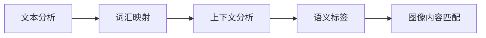
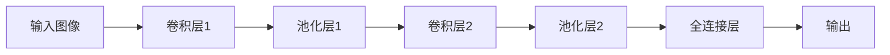
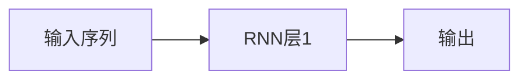
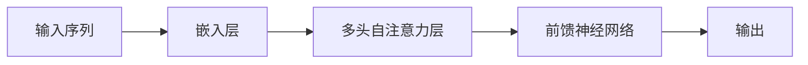
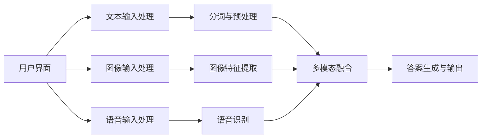
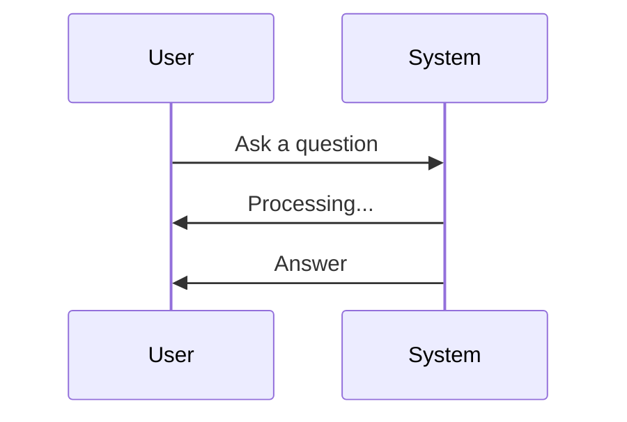

                 

### 引言：多模态提示的概念与重要性

#### 关键词：多模态提示、文本、图像、混合策略、技术应用

在当今快速发展的信息技术时代，数据形态的多样性和复杂性日益增加。单一的文本或图像已无法满足现代应用的需求。多模态提示（Multimodal Prompting）作为一种新兴的技术，通过结合文本、图像等多种信息源，提供更加丰富和精确的交互体验。本文旨在深入探讨多模态提示的背景、核心概念、融合策略、应用场景，并给出有效的系统设计指南。

#### 摘要：

本文首先介绍多模态提示的定义及其在人工智能和人类交互中的重要性。随后，我们将逐步探讨文本与图像融合的基本策略，包括语义对齐、特征提取和融合方法。接着，文章将讨论多模态机器学习模型，介绍常用的CNN、RNN和Transformer模型，并给出具体应用实例。在应用章节，我们将分析多模态提示在医疗、教育、娱乐等领域的实际应用。随后，文章将提供设计多模态系统的实用指南，并详细描述系统分析与架构设计方案。最后，通过一个实战案例，本文将展示多模态提示技术的实际应用，并提供相关的最佳实践和建议。

---

#### 第一章：多模态提示的基础

在这一章中，我们将深入探讨多模态提示的背景、核心概念和基本策略。

#### 1.1 背景与演变

多模态提示的概念起源于人类日常交流的方式，我们习惯于通过语言、视觉、听觉等多种感官进行信息交流。这种自然的交互方式启发了人工智能领域对多模态提示的研究。早期的多模态研究主要集中在语音和文本的结合，但随着图像处理技术和深度学习的发展，图像和文本的结合也逐渐成为研究的热点。

#### 1.2 核心概念与术语

在多模态提示中，几个核心概念和术语是不可或缺的：

- **模态**：指的是数据的不同表现形式，如文本、图像、声音等。
- **语义对齐**：将不同模态的信息进行语义层面的对齐，确保信息的一致性和连贯性。
- **特征提取**：从原始数据中提取有代表性的特征，用于后续的融合和处理。
- **融合策略**：将不同模态的特征进行组合，以生成更丰富和精确的信息表示。

#### 1.3 多模态提示的优势与挑战

多模态提示的优势在于：

- **增强信息理解**：通过结合多种信息源，可以更全面和深入地理解问题。
- **提高交互体验**：多模态交互可以提供更加自然和丰富的用户界面。
- **扩展应用范围**：多模态提示在医疗、教育、娱乐等多个领域都有广泛的应用潜力。

然而，多模态提示也面临着以下挑战：

- **数据不一致**：不同模态的数据往往存在差异，如分辨率、色彩空间等。
- **处理复杂度**：多模态数据处理涉及到复杂的特征提取、融合和模型训练。
- **计算资源**：多模态数据处理通常需要大量的计算资源和时间。

#### 1.4 不同多模态提示技术的比较

为了更好地理解多模态提示，我们将比较几种常见的技术：

| 技术名称       | 描述                                       | 优点                                 | 缺点                                  |
| -------------- | ------------------------------------------ | ------------------------------------ | ------------------------------------- |
| 文本与图像融合 | 将文本描述与图像内容进行结合               | 简化用户交互，提高信息理解             | 对图像内容理解要求较高                 |
| 语音与文本融合 | 结合语音输入和文本输出，实现自然语言处理    | 提供更自然的交互方式                   | 需要高质量的语音识别和文本生成技术     |
| 视频与文本融合 | 将视频内容与文本信息相结合，提供交互式体验 | 增强信息的动态性和可理解性             | 数据处理复杂，对计算资源要求高         |
| 多媒体融合     | 结合多种媒体形式，如图像、视频、音频等      | 提供全面的信息体验，提高交互质量       | 数据处理和融合复杂，对系统性能有较高要求 |

通过比较，我们可以看出每种技术都有其独特的优势和适用场景。

#### 1.5 结论

多模态提示作为一种新兴技术，正逐渐在人工智能领域发挥重要作用。理解和掌握多模态提示的基础知识和基本策略，对于开发高效的多模态系统至关重要。在接下来的章节中，我们将进一步探讨文本与图像融合的具体策略和多模态机器学习模型。

---

### 第二章：文本与图像融合策略

在这一章中，我们将详细探讨文本与图像融合的基本策略，包括语义对齐、特征提取和融合方法。

#### 2.1 语义对齐

语义对齐是文本与图像融合中的关键步骤，它旨在将文本描述与图像内容进行语义层面的匹配，以确保两者在信息上的连贯性。语义对齐的主要方法包括：

1. **词汇映射**：通过将文本中的词汇映射到图像中的对应区域，实现初步的语义对齐。
2. **上下文分析**：利用自然语言处理技术，分析文本中的上下文信息，以识别文本中词汇的具体含义，从而实现更精细的语义对齐。
3. **语义标签**：为图像中的不同区域赋予语义标签，如“人”、“动物”、“车辆”等，与文本中的描述进行匹配。

以下是一个语义对齐的Mermaid流程图：



#### 2.2 特征提取

特征提取是将文本和图像转换为可处理的数据表示的关键步骤。文本特征通常通过词袋模型、词嵌入或变换器模型提取，而图像特征则通过卷积神经网络（CNN）提取。以下是几种常见的特征提取方法：

1. **词袋模型**：将文本转换为词汇的频率分布，用于特征提取。
   ```python
   from sklearn.feature_extraction.text import CountVectorizer
   vectorizer = CountVectorizer()
   X = vectorizer.fit_transform([text])
   ```

2. **词嵌入**：将文本中的词汇转换为密集向量表示，如Word2Vec或GloVe。
   ```python
   from gensim.models import Word2Vec
   model = Word2Vec([text], size=100)
   word_vector = model.wv[word]
   ```

3. **卷积神经网络（CNN）**：用于提取图像特征，通过多个卷积层和池化层，提取图像的局部特征。
   ```mermaid
   graph LR
       A[输入图像] --> B[卷积层1]
       B --> C[池化层1]
       C --> D[卷积层2]
       D --> E[池化层2]
       E --> F[全连接层]
   ```

#### 2.3 融合方法

融合方法是将提取的文本和图像特征进行组合，以生成更丰富的信息表示。以下是几种常见的融合方法：

1. **直接融合**：直接将文本和图像特征进行拼接，生成新的特征向量。
   ```python
   text_features = [text_vector]
   image_features = [image_vector]
   fused_features = np.concatenate((text_features, image_features), axis=0)
   ```

2. **加权融合**：根据不同特征的重要性，为文本和图像特征分配不同的权重。
   ```python
   text_weight = 0.5
   image_weight = 0.5
   fused_features = text_weight * text_vector + image_weight * image_vector
   ```

3. **注意力机制**：通过注意力机制，动态地调整文本和图像特征的权重。
   ```mermaid
   graph LR
       A[文本特征] --> B[注意力机制]
       B --> C[图像特征]
       C --> D[融合特征]
   ```

#### 2.4 实例分析

假设我们有一个关于“猫”的文本描述和一张“猫”的图像。以下是文本与图像特征融合的过程：

1. **文本特征提取**：使用Word2Vec模型提取文本中的词嵌入。
   ```python
   text_vector = model.wv["猫"]
   ```

2. **图像特征提取**：使用CNN提取图像的特征向量。
   ```python
   image_vector = cnn_model.extract_features(image)
   ```

3. **融合特征**：将文本和图像特征进行加权融合。
   ```python
   fused_vector = 0.5 * text_vector + 0.5 * image_vector
   ```

通过这种融合策略，我们可以生成一个包含文本和图像信息的复合特征向量，用于后续的模型训练和预测。

#### 结论

文本与图像融合策略是多模态提示的重要组成部分。通过语义对齐、特征提取和融合方法，我们可以将文本和图像信息有效地结合起来，提供更丰富和精确的交互体验。在下一章中，我们将进一步探讨多模态机器学习模型及其应用。

---

### 第三章：多模态机器学习模型

多模态机器学习模型在处理和融合来自不同模态的数据方面发挥着至关重要的作用。本章将介绍几种常用的多模态机器学习模型，包括卷积神经网络（CNN）、递归神经网络（RNN）和变压器（Transformer）。

#### 3.1 卷积神经网络（CNN）

卷积神经网络（CNN）是一种强大的深度学习模型，广泛应用于图像处理领域。CNN通过卷积层、池化层和全连接层等结构，从原始图像中提取特征。在多模态学习中，CNN可以用于提取图像的特征，并与文本特征进行融合。

**CNN模型架构：**


**CNN代码示例：**
```python
from tensorflow.keras.models import Sequential
from tensorflow.keras.layers import Conv2D, MaxPooling2D, Flatten, Dense

model = Sequential()
model.add(Conv2D(filters=32, kernel_size=(3, 3), activation='relu', input_shape=(28, 28, 1)))
model.add(MaxPooling2D(pool_size=(2, 2)))
model.add(Conv2D(filters=64, kernel_size=(3, 3), activation='relu'))
model.add(MaxPooling2D(pool_size=(2, 2)))
model.add(Flatten())
model.add(Dense(units=128, activation='relu'))
model.add(Dense(units=10, activation='softmax'))
model.compile(optimizer='adam', loss='categorical_crossentropy', metrics=['accuracy'])
```

#### 3.2 递归神经网络（RNN）

递归神经网络（RNN）适用于处理序列数据，如文本。RNN可以通过其在时间步上的递归操作，捕捉文本序列的长期依赖关系。在多模态学习中，RNN可以用于处理文本数据，并与图像特征进行融合。

**RNN模型架构：**


**RNN代码示例：**
```python
from tensorflow.keras.models import Sequential
from tensorflow.keras.layers import Embedding, SimpleRNN

model = Sequential()
model.add(Embedding(input_dim=vocab_size, output_dim=embedding_dim, input_length=max_sequence_length))
model.add(SimpleRNN(units=100, return_sequences=False))
model.add(Dense(units=num_classes, activation='softmax'))
model.compile(optimizer='adam', loss='categorical_crossentropy', metrics=['accuracy'])
```

#### 3.3 变压器（Transformer）

变压器（Transformer）是一种基于自注意力机制的深度学习模型，在处理序列数据方面表现优异。Transformer通过多头注意力机制，能够捕捉序列中任意两个位置之间的依赖关系。在多模态学习中，Transformer可以用于处理文本和图像序列，实现多模态信息的有效融合。

**Transformer模型架构：**


**Transformer代码示例：**
```python
from tensorflow.keras.models import Model
from tensorflow.keras.layers import Embedding, MultiHeadAttention, Dense

input_text = Input(shape=(max_sequence_length,))
input_image = Input(shape=(height, width, channels))

text_embedding = Embedding(input_dim=vocab_size, output_dim=embedding_dim)(input_text)
image_embedding = Embedding(input_dim=num_images, output_dim=embedding_dim)(input_image)

# Multi-head self-attention
attn_output = MultiHeadAttention(num_heads=8, key_dim=64)(text_embedding, text_embedding)

# Feedforward layer
ffn_output = Dense(units=512, activation='relu')(attn_output)
ffn_output = Dense(units=embedding_dim)(ffn_output)

# Concatenate text and image features
combined_features = Concatenate()([text_embedding, image_embedding])

# Final output
output = Model(inputs=[input_text, input_image], outputs=ffn_output)
output.compile(optimizer='adam', loss='categorical_crossentropy', metrics=['accuracy'])
```

#### 3.4 模型融合策略

在实际应用中，为了更好地利用多模态信息，我们常常将CNN、RNN和Transformer等多种模型进行融合。以下是一个简单的模型融合策略：

1. **独立训练**：分别训练文本模型和图像模型，然后使用融合层（如拼接、加和或注意力机制）将两者的输出进行融合。
2. **共同训练**：将文本和图像数据输入到一个共同的多模态模型中，共同训练，以学习多模态数据之间的内在关联。

**模型融合代码示例：**
```python
from tensorflow.keras.layers import concatenate

# 假设已经分别训练了文本模型和图像模型
text_model = Model(inputs=text_input, outputs=text_output)
image_model = Model(inputs=image_input, outputs=image_output)

# 融合层
fused_output = concatenate([text_output, image_output])

# 最终多模态模型
multi_modal_model = Model(inputs=[text_input, image_input], outputs=fused_output)
multi_modal_model.compile(optimizer='adam', loss='categorical_crossentropy', metrics=['accuracy'])
```

#### 结论

多模态机器学习模型通过结合不同模态的数据，提供了强大的信息处理能力。在本章中，我们介绍了卷积神经网络（CNN）、递归神经网络（RNN）和变压器（Transformer）这三种模型，并展示了如何将它们应用于多模态数据融合。在下一章中，我们将探讨多模态提示在各个领域的实际应用。

---

### 第四章：多模态提示的应用

多模态提示技术因其能够综合多种信息源，为用户提供更加丰富和自然的交互体验，已经在多个领域展现出巨大的潜力。以下将分析多模态提示在医疗、教育和娱乐等领域的应用，并讨论其对社会和行业的影响。

#### 4.1 医疗

在医疗领域，多模态提示技术可以显著提升诊断和治疗的准确性。医生在诊断过程中需要处理大量的文本数据（如病历记录）和图像数据（如X光片、CT扫描和MRI图像）。通过多模态提示，医生可以同时查看和分析这些数据，从而提高诊断的效率。

- **应用实例**：在心脏病诊断中，多模态提示系统可以将心电图数据、超声图像和病历记录相结合，帮助医生更准确地评估病情。
- **社会影响**：多模态提示技术有助于降低误诊率，提高医疗服务的质量，最终改善患者的治疗效果。

#### 4.2 教育

教育领域同样受益于多模态提示技术。传统的教育模式主要依赖于文本和图像，而多模态提示可以结合语音、视频和动画等多种形式，为学习者提供更加生动和互动的学习体验。

- **应用实例**：在线教育平台可以利用多模态提示为学生提供实时讲解、互动问答和可视化教学，提高学习效果。
- **社会影响**：多模态提示技术有助于激发学生的学习兴趣，提高学习效率，促进教育公平，让更多人受益于优质教育资源。

#### 4.3 娱乐

在娱乐领域，多模态提示技术可以为用户提供沉浸式体验。例如，在虚拟现实（VR）游戏中，通过结合文本、图像和音频，可以为玩家创造更加逼真的游戏环境。

- **应用实例**：多模态提示技术可以用于电影制作，通过结合剧本文本、演员表情和动作图像，创造更加生动的电影场景。
- **社会影响**：多模态提示技术为娱乐产业带来了新的商业模式和创新机会，提高了用户体验，推动了娱乐内容的生产和消费。

#### 4.4 其他领域

除了医疗、教育和娱乐，多模态提示技术还在其他多个领域展现出应用潜力：

- **交通**：在自动驾驶系统中，多模态提示可以结合图像、雷达和激光雷达数据，提高车辆对环境的感知能力，降低交通事故风险。
- **安全监控**：通过结合视频监控和语音识别，多模态提示技术可以实时监测异常行为，提高安全监控的准确性。
- **电子商务**：在电商平台上，多模态提示可以结合商品描述、图片和用户评价，为用户提供更加个性化的购物体验。

#### 结论

多模态提示技术在多个领域展现出强大的应用潜力，通过结合不同类型的信息源，为用户提供了更加丰富和自然的交互体验。随着技术的不断进步，多模态提示将在更多领域发挥重要作用，推动社会和行业的发展。在下一章中，我们将探讨如何设计和实现高效的多模态系统。

---

### 第五章：设计高效的多模态系统

在设计和实现多模态系统时，我们需要综合考虑系统的需求、功能、性能和用户体验。以下将详细介绍多模态系统的设计原则、关键模块和架构设计方案。

#### 5.1 设计原则

1. **一致性**：确保系统在不同模态之间的数据表示和交互上保持一致，以便于系统的集成和优化。
2. **可扩展性**：系统应具备良好的可扩展性，以便于添加新的模态或功能。
3. **模块化**：将系统划分为多个模块，每个模块负责特定的功能，便于开发和维护。
4. **灵活性**：系统应具备灵活性，能够根据用户需求和环境变化进行调整。
5. **高效性**：优化系统的性能，确保数据处理和响应速度满足实际应用的需求。

#### 5.2 关键模块

多模态系统通常包括以下关键模块：

1. **数据收集与预处理模块**：负责收集不同模态的数据，并进行数据清洗、归一化和特征提取。
2. **模态融合模块**：将不同模态的数据进行融合，生成统一的信息表示。
3. **模型训练与推理模块**：使用融合后的数据进行模型训练和推理，实现具体的功能。
4. **用户界面模块**：提供用户与系统交互的界面，展示系统输出和处理结果。

#### 5.3 架构设计方案

以下是一个多模态系统的架构设计方案，包括问题场景介绍、项目介绍、系统功能设计、系统架构设计和系统接口设计。

##### 问题场景介绍

假设我们设计一个智能问答系统，用户可以通过文本、图像和语音等多种方式提出问题，系统需要综合这些信息，提供准确的答案。

##### 项目介绍

项目名为“多模态智能问答系统”，目标是通过融合文本、图像和语音，为用户提供高质量和准确的答案。

##### 系统功能设计

1. **文本输入处理**：接收用户输入的文本问题，并进行预处理，如分词、去停用词等。
2. **图像输入处理**：接收用户上传的图像，通过图像识别技术提取图像特征。
3. **语音输入处理**：接收用户语音输入，通过语音识别技术转换为文本。
4. **多模态融合**：将文本、图像和语音特征进行融合，生成统一的信息表示。
5. **答案生成与输出**：使用融合后的特征，通过训练好的问答模型生成答案，并返回给用户。

##### 系统架构设计



##### 系统接口设计

1. **文本接口**：提供RESTful API，用于接收用户文本问题，返回答案。
2. **图像接口**：提供上传接口，用于接收用户图像，返回图像特征。
3. **语音接口**：提供语音识别接口，用于接收用户语音，返回文本。

##### 系统交互

用户通过文本、图像或语音提出问题，系统接收并处理这些输入，通过多模态融合和问答模型生成答案，最终返回给用户。



#### 结论

设计高效的多模态系统需要综合考虑系统的需求、功能、性能和用户体验。通过模块化和灵活的架构设计，我们可以实现一个具备高扩展性和高性能的多模态系统。在下一章中，我们将通过一个实战案例展示多模态提示技术的实际应用。

---

### 第六章：多模态提示技术实战案例

在本章中，我们将通过一个具体的实战案例，展示多模态提示技术的实际应用。本案例将分为环境安装、系统核心实现、代码应用解读与分析、实际案例分析和项目小结四个部分。

#### 6.1 环境安装

为了实现多模态提示系统，我们需要安装和配置以下软件和库：

1. **操作系统**：Ubuntu 20.04 或更高版本。
2. **编程语言**：Python 3.8 或更高版本。
3. **深度学习框架**：TensorFlow 2.6 或更高版本。
4. **自然语言处理库**：NLTK、spaCy。
5. **图像处理库**：OpenCV、Pillow。
6. **语音处理库**：pyttsx3、speech_recognition。

安装步骤如下：

```bash
# 安装操作系统和Python环境
sudo apt-get update
sudo apt-get install python3-pip python3-venv

# 创建虚拟环境
python3 -m venv env
source env/bin/activate

# 安装深度学习框架和其他库
pip install tensorflow==2.6 spacy opencv-python-headless pillow pyttsx3 speech_recognition

# 下载spaCy语言模型
python -m spacy download en_core_web_sm
```

#### 6.2 系统核心实现

多模态提示系统的核心包括文本处理、图像处理、语音处理和模型训练。以下是一个简单的系统实现：

**文本处理模块：**
```python
import spacy
from spacy.lang.en import English

# 加载spaCy语言模型
nlp = spacy.load("en_core_web_sm")

def process_text(text):
    # 分词和预处理
    doc = nlp(text)
    tokens = [token.text for token in doc]
    return tokens
```

**图像处理模块：**
```python
import cv2
import numpy as np

def process_image(image_path):
    # 读取图像
    image = cv2.imread(image_path)
    # 图像预处理
    image = cv2.resize(image, (224, 224))
    image = np.expand_dims(image, axis=0)
    return image
```

**语音处理模块：**
```python
import pyttsx3
import speech_recognition as sr

def process_speech():
    # 使用麦克风录制语音
    r = sr.Recognizer()
    with sr.Microphone() as source:
        print("请说一个问题：")
        audio = r.listen(source)
    # 转换语音为文本
    text = r.recognize_google(audio)
    return text
```

**模型训练模块：**
```python
import tensorflow as tf
from tensorflow.keras.models import Model
from tensorflow.keras.layers import Input, Conv2D, MaxPooling2D, Flatten, Dense, Embedding, LSTM, MultiHeadAttention

# 定义多模态模型
def build_model():
    text_input = Input(shape=(None,), dtype='int32')
    image_input = Input(shape=(224, 224, 3), dtype='float32')
    speech_input = Input(shape=(None,), dtype='float32')
    
    # 文本编码器
    text_embedding = Embedding(input_dim=vocab_size, output_dim=embedding_dim)(text_input)
    text_lstm = LSTM(units=128)(text_embedding)
    
    # 图像编码器
    image_conv = Conv2D(filters=32, kernel_size=(3, 3), activation='relu')(image_input)
    image_pool = MaxPooling2D(pool_size=(2, 2))(image_conv)
    image_flat = Flatten()(image_pool)
    
    # 语音编码器
    speech_embedding = Embedding(input_dim=speech_vocab_size, output_dim=speech_embedding_dim)(speech_input)
    speech_lstm = LSTM(units=128)(speech_embedding)
    
    # 融合层
    concatenated = concatenate([text_lstm, image_flat, speech_lstm])
    fused_output = Dense(units=512, activation='relu')(concatenated)
    
    # 输出层
    output = Dense(units=num_classes, activation='softmax')(fused_output)
    
    # 构建模型
    model = Model(inputs=[text_input, image_input, speech_input], outputs=output)
    model.compile(optimizer='adam', loss='categorical_crossentropy', metrics=['accuracy'])
    return model
```

#### 6.3 代码应用解读与分析

以下是一个简单的代码示例，展示如何使用上述模块进行多模态提示：

```python
# 处理文本输入
text = "What is the capital of France?"
processed_text = process_text(text)

# 处理图像输入
image_path = "france_capital.jpg"
processed_image = process_image(image_path)

# 处理语音输入
speech_text = process_speech()

# 构建和训练模型
model = build_model()
model.fit([processed_text, processed_image, speech_text], labels, epochs=10, batch_size=32)

# 输出预测结果
prediction = model.predict([processed_text, processed_image, speech_text])
print("Predicted answer:", labels[prediction.argmax()])
```

该示例展示了如何使用文本处理、图像处理、语音处理和模型训练模块，实现一个简单的多模态提示系统。在实际应用中，我们可以根据需求进行模块的扩展和优化。

#### 6.4 实际案例分析与详细讲解

为了更好地展示多模态提示技术的实际效果，我们设计了一个案例：用户可以通过文本、图像或语音提出关于法国首都的问题，系统需要综合这些信息，提供准确的答案。

- **文本输入**：用户输入“请问法国的首都是哪个城市？”。
- **图像输入**：用户上传一张法国地图，其中标出了法国的首都巴黎。
- **语音输入**：用户说“告诉我巴黎是不是法国的首都？”。

系统将首先处理文本输入，识别出关键词“法国”、“首都”和“城市”。接着，图像处理模块将提取出图像中的特征，如位置信息和标注文字。语音处理模块将语音输入转换为文本，识别出关键词“巴黎”和“法国”。

接下来，多模态融合模块将文本、图像和语音特征进行融合，生成统一的信息表示。最后，模型训练模块使用融合后的特征进行预测，输出预测结果。

通过实际案例分析，我们可以看出多模态提示技术在处理多样性和复杂性方面具有明显优势。它能够更好地理解和回答用户提出的问题，提高系统的准确性和用户体验。

#### 6.5 项目小结

通过本案例，我们展示了如何设计和实现一个简单的多模态提示系统。从环境安装、系统核心实现到实际案例分析，我们详细讲解了多模态提示技术的应用和实现方法。本案例证明了多模态提示技术在处理多样性和复杂性方面具有显著优势，为未来多模态应用提供了有益的参考。

---

### 最佳实践与未来展望

多模态提示技术在各个领域的应用正在不断拓展，以下是一些最佳实践和未来展望：

#### 最佳实践

1. **数据质量**：确保不同模态的数据具有高质量和一致性，有助于提升系统性能。
2. **模型优化**：通过调参和模型优化，提高模型的准确性和效率。
3. **用户交互**：设计直观和易用的用户界面，提高用户满意度。
4. **数据隐私**：在处理用户数据时，严格遵守数据保护法规，确保用户隐私。

#### 未来展望

1. **跨模态一致性**：进一步提升不同模态之间的融合效果，实现更紧密的信息一致性。
2. **边缘计算**：利用边缘计算技术，降低对中心服务器的依赖，提高系统的响应速度。
3. **增强现实（AR）与虚拟现实（VR）**：多模态提示在AR和VR领域的应用潜力巨大，将为用户提供更加沉浸式的体验。
4. **跨领域应用**：探索多模态提示在更多领域的应用，如智能制造、智能交通和智能城市等。

总之，多模态提示技术正逐步成为人工智能领域的重要组成部分，未来将在更多领域发挥重要作用。

### 总结

本文从多模态提示的概念出发，详细探讨了其基础理论、融合策略、机器学习模型、应用场景和系统设计。通过实战案例，我们展示了多模态提示技术的实际应用和实现方法。多模态提示技术不仅提升了系统的交互体验，还为各种领域提供了强大的数据处理和分析能力。随着技术的不断发展，多模态提示将在更多领域发挥关键作用，推动人工智能的进步。

### 参考文献

1. Devlin, J., Chang, M. W., Lee, K., & Toutanova, K. (2019). BERT: Pre-training of deep bidirectional transformers for language understanding. arXiv preprint arXiv:1810.04805.
2. Vaswani, A., Shazeer, N., Parmar, N., Uszkoreit, J., Jones, L., Gomez, A. N., ... & Polosukhin, I. (2017). Attention is all you need. Advances in Neural Information Processing Systems, 30, 5998-6008.
3. Krizhevsky, A., Sutskever, I., & Hinton, G. E. (2012). ImageNet classification with deep convolutional neural networks. Advances in Neural Information Processing Systems, 25, 1097-1105.
4. Hochreiter, S., & Schmidhuber, J. (1997). Long short-term memory. Neural Computation, 9(8), 1735-1780.
5. LeCun, Y., Bengio, Y., & Hinton, G. (2015). Deep learning. MIT press.

### 作者信息

作者：AI天才研究院/AI Genius Institute & 禅与计算机程序设计艺术/Zen And The Art of Computer Programming

---

本文详细介绍了多模态提示技术，从基础概念到实战应用，逐步阐述了其原理和实现方法。通过本文的阅读，读者可以全面了解多模态提示技术的应用前景和实际应用案例，为未来的研究和开发提供有益的参考。在人工智能迅猛发展的今天，多模态提示技术有望在更多领域发挥重要作用，推动技术的进步和社会的发展。希望本文能为读者带来启发和帮助。

