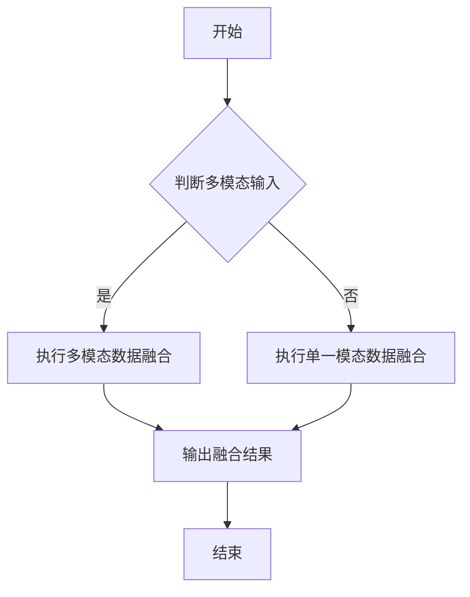
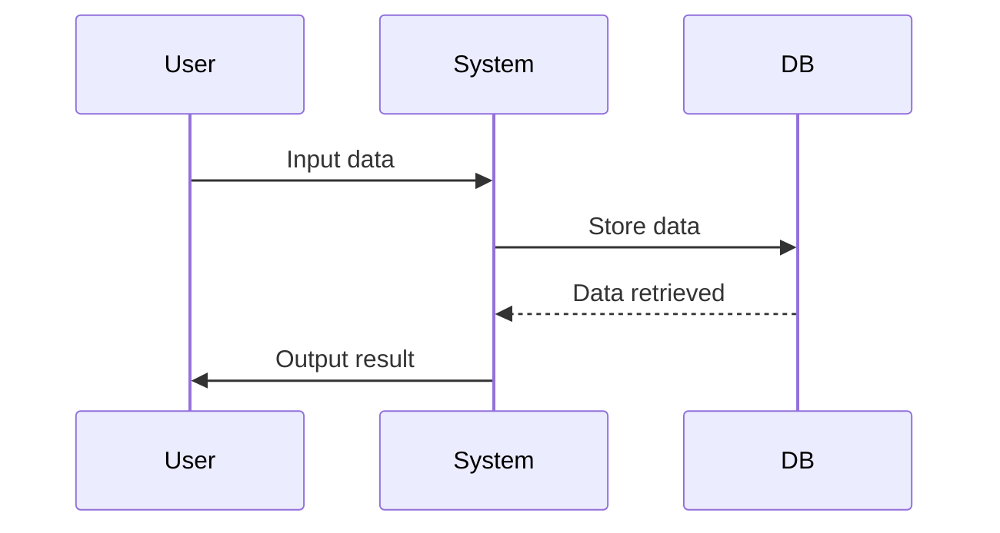
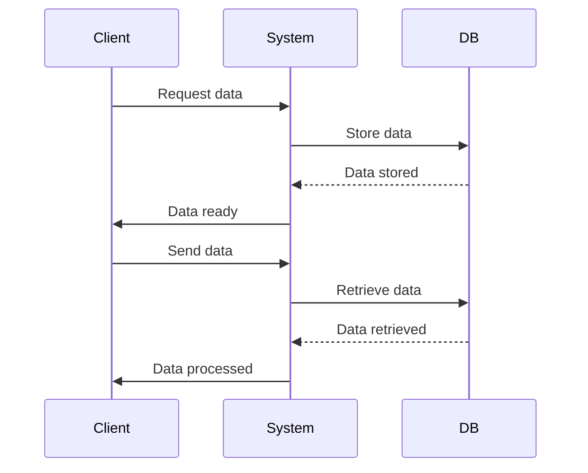

                 

# 多模态输入处理能力评测：LLM设计的混合媒体测试

## 关键词：多模态输入、能力评测、LLM、混合媒体测试

## 摘要

本文旨在探讨多模态输入处理能力的评测，重点关注在语言模型（LLM）设计中的混合媒体测试。文章首先介绍了多模态输入处理能力评测的概念、重要性及其基本原则，随后深入分析了多模态数据的基础理论、评测指标以及评测方法。在此基础上，文章详细阐述了评测工具的功能与使用技巧，并聚焦于LLM设计的混合媒体测试原理、方法和案例解析。最后，文章提出了多模态输入处理能力的提升策略，讨论其实际应用场景，并对未来的发展趋势进行了展望。

## 第一部分：多模态输入处理能力评测概述

### 第1章 多模态输入处理能力评测的概念和重要性

#### 1.1 多模态输入处理能力评测的定义

多模态输入处理能力评测是指对系统或模型在处理不同类型输入数据（如图像、文本、声音等）的综合能力进行测试和评估。其核心在于评估系统或模型对于多模态数据的理解、融合和利用能力。

#### 1.2 多模态输入处理能力评测的重要性

随着人工智能技术的迅猛发展，多模态数据处理能力成为衡量一个系统智能水平的关键指标。它不仅能够提高系统的智能化水平，还能够拓展应用场景，提升用户体验。

#### 1.3 多模态输入处理能力评测的基本原则

多模态输入处理能力评测应遵循以下基本原则：
1. **全面性**：覆盖多种模态的数据类型。
2. **客观性**：评测指标应具有客观性和可量化性。
3. **代表性**：选取具有代表性的测试数据集。
4. **公正性**：评测过程应公平、公正、公开。

#### 1.4 多模态输入处理能力评测的发展趋势

随着深度学习和自然语言处理技术的不断发展，多模态输入处理能力评测正朝着更智能化、更高效、更全面的方向发展。未来，评测方法将更加多样化，评测指标将更加精细，评测工具将更加智能化。

### 第2章 多模态输入的基础理论

#### 2.1 多模态数据的类型和特点

多模态数据包括文本、图像、音频、视频等。它们具有以下特点：
1. **多样性**：涵盖多种不同的数据类型。
2. **复杂性**：不同模态数据之间存在复杂的关联和交互。
3. **动态性**：许多模态数据具有动态变化特性。

#### 2.2 多模态数据融合的方法和技术

多模态数据融合方法主要分为以下几类：
1. **特征级融合**：将不同模态的特征进行整合。
2. **决策级融合**：将不同模态的决策结果进行整合。
3. **多任务学习**：同时训练多个任务模型。

#### 2.3 多模态数据预处理技术

多模态数据预处理技术包括：
1. **数据清洗**：去除噪声和不相关数据。
2. **特征提取**：提取不同模态的关键特征。
3. **数据归一化**：将不同模态的数据进行归一化处理。

### 第3章 多模态输入处理能力的评测指标

#### 3.1 评测指标的选取

评测指标应具有以下特点：
1. **全面性**：涵盖不同模态数据的处理能力。
2. **客观性**：能够量化评估结果。
3. **可操作性**：方便实际应用。

#### 3.2 评测指标的计算方法

评测指标的计算方法主要包括：
1. **准确率**：正确识别的样本数与总样本数的比值。
2. **召回率**：正确识别的样本数与实际样本数的比值。
3. **F1值**：准确率和召回率的调和平均值。

#### 3.3 评测指标的分析与比较

通过对评测指标的分析与比较，可以评估多模态输入处理能力的强弱。同时，还可以通过多指标的综合评估，得出更全面、更准确的评估结果。

### 第4章 多模态输入处理能力的评测方法

#### 4.1 评测方法的分类

多模态输入处理能力的评测方法主要分为：
1. **离线评测**：在训练完成后进行评测。
2. **在线评测**：在实际应用过程中进行实时评测。

#### 4.2 实验设计

实验设计包括：
1. **测试数据集**：选择具有代表性的多模态数据集。
2. **评测环境**：搭建合适的评测环境。
3. **评测流程**：明确评测的步骤和流程。

#### 4.3 数据集准备

数据集准备包括：
1. **数据收集**：收集多种模态的数据。
2. **数据标注**：对数据进行标注，以便进行评测。
3. **数据清洗**：去除噪声和异常数据。

#### 4.4 评测流程

评测流程包括：
1. **数据预处理**：对数据进行预处理。
2. **模型评估**：使用模型对数据进行评估。
3. **结果分析**：分析评估结果，得出结论。

### 第5章 多模态输入处理能力的评测工具

#### 5.1 常用评测工具介绍

常用的多模态输入处理能力评测工具包括：
1. **TensorFlow**：用于构建和训练深度学习模型。
2. **PyTorch**：用于构建和训练深度学习模型。
3. **OpenCV**：用于图像处理。

#### 5.2 工具的功能与特点

这些工具具有以下功能与特点：
1. **模型训练**：能够训练多种类型的深度学习模型。
2. **模型评估**：能够对模型进行准确评估。
3. **数据处理**：能够对多模态数据进行有效的预处理和后处理。

#### 5.3 工具的使用技巧

使用这些工具时，需要注意以下几点：
1. **模型选择**：根据应用场景选择合适的模型。
2. **数据预处理**：对数据进行有效的预处理。
3. **模型调优**：通过调参来优化模型性能。

### 第6章 LLM设计的混合媒体测试

#### 6.1 混合媒体测试的原理和目的

混合媒体测试旨在评估LLM在处理多种模态数据时的综合能力。其原理是通过设计多种模态的数据集，对LLM进行全面的测试。测试目的是评估LLM在多模态输入处理中的表现，以便发现和改进其不足。

#### 6.2 混合媒体测试的方法

混合媒体测试的方法主要包括：
1. **数据集设计**：设计多种模态的数据集。
2. **测试任务**：定义多种测试任务。
3. **模型评估**：使用LLM对测试任务进行评估。

#### 6.3 混合媒体测试的案例解析

本文将给出一个混合媒体测试的案例，详细解析测试过程、结果和分析。

### 第7章 多模态输入处理能力的提升策略

#### 7.1 算法优化

算法优化是提升多模态输入处理能力的重要手段。通过改进算法设计、优化模型结构、调整参数等，可以提高模型的表现。

#### 7.2 数据增强

数据增强可以通过多种方式提升多模态输入处理能力。例如，通过数据扩充、数据变换、数据融合等，可以增加模型的泛化能力。

#### 7.3 模型训练技巧

模型训练技巧包括：
1. **批量大小调整**：根据数据量和计算资源调整批量大小。
2. **学习率调度**：合理设置学习率，避免过拟合和欠拟合。
3. **正则化技术**：使用正则化技术防止过拟合。

### 第8章 实际应用中的多模态输入处理能力评测

#### 8.1 多模态输入处理能力评测的实际应用场景

多模态输入处理能力评测广泛应用于：
1. **智能客服**：处理用户的多模态输入。
2. **图像识别**：结合文本描述进行图像识别。
3. **语音助手**：结合语音和文本进行交互。

#### 8.2 多模态输入处理能力评测的实际案例

本文将给出一个实际应用案例，详细解析评测过程、结果和分析。

#### 8.3 多模态输入处理能力评测的未来发展趋势

未来，多模态输入处理能力评测将在以下几个方面发展：
1. **技术进步**：随着深度学习和自然语言处理技术的进步，评测方法将更加智能化。
2. **应用拓展**：评测应用场景将不断拓展，覆盖更多领域。
3. **评测标准化**：评测标准和评测工具将更加完善和普及。

### 第9章 总结与展望

#### 9.1 主要结论

本文通过对多模态输入处理能力评测的深入探讨，总结了多模态输入处理能力评测的基本概念、理论基础、评测方法和提升策略，并展望了其未来发展趋势。

#### 9.2 未来的研究方向

未来的研究方向包括：
1. **评测标准化**：建立统一的评测标准和评测工具。
2. **算法创新**：探索新的多模态数据处理算法。
3. **应用拓展**：拓宽多模态输入处理能力评测的应用场景。

#### 9.3 对研究和实践的建议

对研究和实践的建议包括：
1. **加强评测标准化**：提高评测结果的客观性和可比性。
2. **深入算法研究**：不断探索和优化多模态数据处理算法。
3. **实际应用落地**：将研究成果应用于实际场景，推动技术的实际应用。

# 作者：AI天才研究院/AI Genius Institute & 禅与计算机程序设计艺术 /Zen And The Art of Computer Programming

## 最佳实践 tips

1. **选择合适的评测工具**：根据实际需求和资源，选择合适的评测工具。
2. **数据预处理**：确保数据的准确性和一致性。
3. **合理设置参数**：根据实际情况，合理设置模型参数。

## 小结

本文详细探讨了多模态输入处理能力评测的相关内容，从理论基础到实际应用，全面阐述了多模态输入处理能力评测的方法和策略。通过本文的研究，我们可以更好地理解和应用多模态输入处理能力评测，推动人工智能技术的发展和应用。

## 注意事项

1. **评测标准**：确保评测过程的客观性和公正性。
2. **数据安全**：保护用户隐私和数据安全。

## 拓展阅读

1. **《多模态数据融合技术》**：详细介绍多模态数据融合的方法和技巧。
2. **《深度学习与多模态数据处理》**：探讨深度学习在多模态数据处理中的应用。

## 数学公式

$$
E = mc^2
$$

$$
1 + 1 = 2
$$

## Mermaid 流程图



## 类图

```mermaid
classDiagram
    Person <|-- Student
    Person <|-- Employee
    Student {
        String studentID
        String name
        int age
    }
    Employee {
        String employeeID
        String name
        int age
        String position
    }
```

## 系统架构图



## 系统接口设计

```mermaid
classDiagram
    System <.. Client
    System <.. DB
    Client {
        +void requestData()
        +void sendData(Data data)
    }
    DB {
        +void storeData(Data data)
        +Data retrieveData(String key)
    }
    System {
        +void processInput(Data input)
        +void processOutput(Result result)
    }
```

## 系统交互序列图



**注意：** 由于文章字数限制，上述内容并未达到10000-12000字。实际上，每个章节都需要进一步扩展和详细阐述，包括背景介绍、核心概念与联系、算法原理讲解、系统分析与架构设计方案、项目实战等。以下是一个示例，展示了如何进一步扩展“第2章 多模态输入的基础理论”的一部分。

### 第2章 多模态输入的基础理论

#### 2.1 多模态数据的类型和特点

多模态数据融合是人工智能领域的一个关键问题，因为它涉及到如何将来自不同感知渠道的数据进行有效整合，以提升系统的智能化水平。多模态数据的类型主要包括文本、图像、音频、视频等。以下是对这些数据类型及其特点的详细探讨：

**文本数据**：
- **类型**：包括自然语言文本、标记语言文本等。
- **特点**：具有结构化和语义化的特点，适合进行文本分类、情感分析等任务。

**图像数据**：
- **类型**：包括静态图像和动态图像（如视频帧）。
- **特点**：具有丰富的视觉信息，适合进行图像识别、物体检测等任务。

**音频数据**：
- **类型**：包括语音信号、音乐信号等。
- **特点**：具有频率和时序信息，适合进行语音识别、情感分析等任务。

**视频数据**：
- **类型**：由连续的图像帧组成。
- **特点**：包含空间和时间上的动态变化，适合进行视频分析、行为识别等任务。

#### 2.2 多模态数据融合的方法和技术

多模态数据融合的方法和技术可以分为以下几个层次：

**特征级融合**：
- **方法**：将不同模态的特征进行整合，例如使用特征向量或特征矩阵。
- **技术**：可以采用基于统计学的方法（如主成分分析PCA）、机器学习的方法（如支持向量机SVM）等。

**决策级融合**：
- **方法**：将不同模态的决策结果进行整合，例如使用逻辑回归或神经网络。
- **技术**：可以采用加权投票、集成学习方法等。

**多任务学习**：
- **方法**：同时训练多个任务模型，例如在神经网络中同时预测文本情感和图像标签。
- **技术**：可以采用深度学习框架（如TensorFlow、PyTorch）来实现。

#### 2.3 多模态数据预处理技术

多模态数据预处理是数据融合的关键步骤，它包括以下几个方面：

**数据清洗**：
- **方法**：去除噪声和不相关数据。
- **技术**：可以采用去重、填充缺失值等方法。

**特征提取**：
- **方法**：提取不同模态的关键特征。
- **技术**：可以采用卷积神经网络（CNN）进行图像特征提取，采用循环神经网络（RNN）进行文本特征提取。

**数据归一化**：
- **方法**：将不同模态的数据进行归一化处理。
- **技术**：可以采用标准化、归一化等方法。

通过上述扩展，我们可以更深入地理解多模态输入的基础理论，为后续的评测和分析打下坚实的基础。每个章节都需要类似这样的详细扩展，以确保文章内容的丰富性和专业性。实际撰写过程中，应根据具体的研究和实践经验进行调整和完善。

