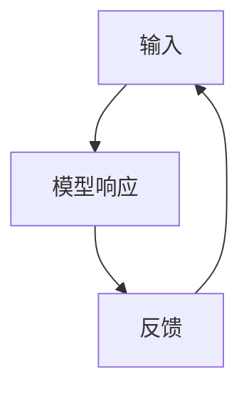

                 

# 多步骤提示：引导模型逐步思考

## 关键词

- 多步骤提示
- 引导模型
- 逐步思考
- 交互方法
- 问题解决

## 摘要

本文旨在探讨多步骤提示在引导模型逐步思考中的应用。通过分析多步骤提示的原理、优势、实践方法以及具体领域应用，本文揭示了多步骤提示在提升模型理解能力、优化问题解决过程和提升交互效果方面的价值。本文为IT领域研究人员和工程师提供了有价值的参考和启示。

----------------------------------------------------------------

## 第一部分：背景介绍

### 第1章：问题背景与核心概念

#### 1.1 问题背景

随着人工智能技术的迅速发展，模型的交互能力和问题解决能力受到了越来越多的关注。在复杂问题的解决过程中，模型往往需要分步骤地思考，以便逐步揭示问题的本质。多步骤提示（multi-step prompting）作为一种引导模型逐步思考的方法，逐渐成为研究热点。

#### 1.2 核心概念

##### 1.2.1 多步骤提示

多步骤提示是一种交互方法，通过分步骤地引导模型进行思考，从而实现更准确、更高效的决策。

**定义**：多步骤提示是一种在模型交互过程中，通过一系列逐步深入的提示，帮助模型逐步揭示问题本质的方法。

**特点**：

- **分步骤**：通过分步骤地引导，使模型在不同阶段关注不同的问题，从而提高问题解决的效率。
- **层次性**：提示信息具有层次性，使模型能够逐步深入理解问题。
- **相关性**：提示信息与模型当前理解的问题保持高度相关性，以便模型能够更好地利用已有信息。

##### 1.2.2 引导模型逐步思考

引导模型逐步思考是指通过一系列逐步深入的提示，帮助模型逐步揭示问题的本质，从而提高模型解决问题的能力。

**定义**：引导模型逐步思考是一种在模型交互过程中，通过分步骤的提示，引导模型逐步深入理解问题，从而提高模型解决问题能力的方法。

**特点**：

- **逐步深入**：通过逐步深入的提示，使模型能够更好地理解问题的本质。
- **适应性**：根据模型对提示的反应，调整提示策略，以适应模型的理解能力。
- **高效性**：通过分步骤的提示，提高模型解决问题的效率。

#### 1.3 问题解决与边界

##### 1.3.1 问题解决

多步骤提示能够帮助模型在复杂问题面前保持清晰的思维路径，逐步找到解决方案。

**过程**：

1. 模型接收初始输入。
2. 模型根据输入生成初步响应。
3. 根据初步响应，模型接收新的提示信息。
4. 模型在新的提示下生成更深入的响应。
5. 重复上述过程，直至达到预期效果。

##### 1.3.2 边界与外延

多步骤提示适用于需要分阶段解决的问题，但对于一次性可以解决的问题，可能并不是最佳选择。

**适用场景**：

- 复杂问题解决：需要分阶段解决的问题，如问答系统、自动编程等。
- 简单问题解决：对于一次性可以解决的问题，如简单的计算、信息查询等，多步骤提示可能不是最佳选择。

#### 1.4 概念结构与核心要素

##### 1.4.1 概念结构

多步骤提示涉及输入、模型响应、反馈三个核心要素。

**概念结构图**：

##### 1.4.2 核心要素

- **输入**：分步骤的提示信息。
- **模型响应**：模型根据输入信息生成的结果。
- **反馈**：根据模型响应进行的调整和优化。

**输入**：输入是模型的初始信息，包括问题的描述、背景信息等。输入的层次性和相关性对模型的理解和响应至关重要。

**模型响应**：模型根据输入信息生成响应，包括对问题的初步理解和解决方案。模型响应的质量直接影响后续的反馈和优化。

**反馈**：反馈是模型根据响应结果进行的调整和优化。有效的反馈能够帮助模型逐步改进，提高解决问题的能力。

----------------------------------------------------------------

## 第二部分：多步骤提示原理

### 第2章：多步骤提示原理

#### 2.1 多步骤提示的工作原理

多步骤提示通过一系列逐步深入的提示，使模型能够在不同阶段关注不同的问题，从而提高问题解决的效率。

**工作流程**：

1. **模型接收初始输入**：模型接收问题的描述和背景信息，形成初始理解。
2. **模型生成初步响应**：模型根据初始输入生成初步响应，如问题的初步解答或解决方案。
3. **模型接收新的提示信息**：根据初步响应，模型接收新的提示信息，如问题的重要细节或相关背景。
4. **模型生成更深入的响应**：模型在新的提示下生成更深入的响应，如更准确的答案或更优的解决方案。
5. **重复上述过程**：根据模型对提示的反应，重复生成响应和提示信息的过程，直至达到预期效果。

**示例**：

- **初始输入**：用户提问：“什么是人工智能？”
- **初步响应**：模型回答：“人工智能是一种模拟人类智能的技术。”
- **新的提示信息**：用户提问：“人工智能有哪些应用？”
- **更深入的响应**：模型回答：“人工智能在图像识别、自然语言处理、自动驾驶等领域有广泛应用。”

#### 2.2 多步骤提示的优势

##### 2.2.1 提高模型的理解能力

多步骤提示能够帮助模型更好地理解复杂问题，从而提高模型解决问题的能力。

**优势**：

- **逐步深入**：通过逐步深入的提示，使模型能够更好地理解问题的本质。
- **适应性**：根据模型对提示的反应，调整提示策略，以适应模型的理解能力。

##### 2.2.2 提升交互效果

通过分步骤的提示，用户能够更清晰地了解模型思考过程，提升交互体验。

**优势**：

- **透明性**：用户能够看到模型在不同阶段对问题的理解和思考过程。
- **互动性**：用户可以根据模型提供的提示，进一步提出问题，引导模型深入思考。

#### 2.3 多步骤提示的应用场景

##### 2.3.1 问答系统

在问答系统中，多步骤提示可以帮助模型更好地理解用户的问题，提供更准确的答案。

**应用场景**：

- **复杂问题解答**：对于复杂问题，通过分步骤提示，模型可以逐步揭示问题本质，提供更准确的答案。
- **多轮对话**：在多轮对话中，多步骤提示有助于保持对话的连贯性和准确性。

##### 2.3.2 自动编程

在自动编程领域，多步骤提示可以帮助模型逐步构建代码，提高编程效率。

**应用场景**：

- **代码生成**：通过多步骤提示，模型可以逐步生成符合要求的代码。
- **代码优化**：在代码生成过程中，模型可以根据提示信息进行优化，提高代码质量。

##### 2.3.3 对话系统

在对话系统中，多步骤提示可以帮助模型更好地理解对话上下文，提供更自然的交互体验。

**应用场景**：

- **自然语言理解**：通过多步骤提示，模型可以更好地理解用户的话语，提供更自然的回答。
- **情感分析**：在情感分析中，多步骤提示有助于模型更好地捕捉用户的情感变化。

----------------------------------------------------------------

## 第三部分：引导模型逐步思考的实践方法

### 第3章：引导模型逐步思考的实践方法

#### 3.1 设计有效的提示信息

##### 3.1.1 提示信息的层次性

设计提示信息时，应考虑其层次性，以便模型能够逐步深入理解问题。

**层次性设计原则**：

- **从简单到复杂**：首先提供简单、基础的信息，然后逐渐引入复杂、具体的信息。
- **从宏观到微观**：从整体问题入手，逐步细化到问题的具体细节。

##### 3.1.2 提示信息的相关性

提示信息应与模型当前理解的问题保持高度相关性，以便模型能够更好地利用已有信息。

**相关性设计原则**：

- **基于已有知识**：根据模型已有的知识和理解，提供相关的提示信息。
- **引导模型思考**：通过提示信息引导模型进行深入的思考，从而揭示问题的本质。

#### 3.2 调整模型参数

##### 3.2.1 学习率调整

通过调整学习率，可以影响模型对提示信息的敏感程度，从而优化模型的表现。

**学习率调整原则**：

- **适应模型状态**：根据模型在不同阶段的表现，调整学习率，使其既能快速适应新信息，又不会过度拟合。
- **平衡优化速度与精度**：适当调整学习率，以平衡模型优化速度和精度。

##### 3.2.2 模型容量调整

适当调整模型容量，可以影响模型处理复杂问题的能力，从而优化模型的表现。

**模型容量调整原则**：

- **根据问题复杂度**：针对不同复杂度的问题，选择合适的模型容量。
- **动态调整**：在模型训练过程中，根据模型的性能和资源需求，动态调整模型容量。

#### 3.3 反馈机制设计

##### 3.3.1 及时反馈

及时反馈可以帮助模型快速调整方向，避免陷入局部最优。

**及时反馈原则**：

- **快速响应**：在模型生成响应后，尽快提供反馈。
- **针对性**：根据模型的表现，提供有针对性的反馈。

##### 3.3.2 多样化反馈

通过多样化反馈，可以帮助模型更好地理解问题的多样性，从而提高模型的表现。

**多样化反馈原则**：

- **多角度**：从不同角度对模型的表现进行反馈。
- **实时性**：在模型训练过程中，实时提供反馈，以指导模型优化。

----------------------------------------------------------------

## 第四部分：多步骤提示在具体领域的应用

### 第4章：多步骤提示在具体领域的应用

#### 4.1 问答系统

##### 4.1.1 应用场景

在问答系统中，多步骤提示可以帮助模型更好地理解用户的问题，提供更准确的答案。

**应用场景**：

- **复杂问题解答**：对于复杂问题，通过多步骤提示，模型可以逐步揭示问题本质，提供更准确的答案。
- **多轮对话**：在多轮对话中，多步骤提示有助于保持对话的连贯性和准确性。

##### 4.1.2 实践案例

**案例背景**：一个电商平台需要为其客服系统引入多步骤提示，以提高用户满意度。

**解决方案**：

1. **初始输入**：用户提问：“我想购买一款笔记本电脑，有什么推荐吗？”
2. **初步响应**：模型回答：“您可以根据以下因素选择笔记本电脑：价格、品牌、性能。”
3. **新的提示信息**：用户提问：“我想在5000元以下购买，有哪些品牌值得推荐？”
4. **更深入的响应**：模型回答：“在5000元以下，您可以关注联想、戴尔、惠普等品牌。”

**效果评估**：

- **用户满意度**：用户对多步骤提示的满意度较高，认为模型能够更好地理解问题，提供更有针对性的答案。
- **客服效率**：通过多步骤提示，客服人员能够更快速地回答用户问题，提高工作效率。

#### 4.2 自动编程

##### 4.2.1 应用场景

在自动编程领域，多步骤提示可以帮助模型逐步构建代码，提高编程效率。

**应用场景**：

- **代码生成**：通过多步骤提示，模型可以逐步生成符合要求的代码。
- **代码优化**：在代码生成过程中，模型可以根据提示信息进行优化，提高代码质量。

##### 4.2.2 实践案例

**案例背景**：一个软件开发团队需要为其自动化测试工具引入多步骤提示，以提高测试效率。

**解决方案**：

1. **初始输入**：用户提问：“如何测试一个电子商务网站的用户登录功能？”
2. **初步响应**：模型回答：“您需要编写测试用例，包括正确的用户名和密码、错误的用户名和密码等。”
3. **新的提示信息**：用户提问：“如何编写测试用例？”
4. **更深入的响应**：模型回答：“您可以使用以下模板编写测试用例：测试用例名称、输入条件、预期结果、实际结果。”

**效果评估**：

- **测试效率**：通过多步骤提示，测试人员能够更快速地编写测试用例，提高测试效率。
- **代码质量**：多步骤提示有助于测试人员更好地理解测试目标，提高代码质量。

#### 4.3 对话系统

##### 4.3.1 应用场景

在对话系统中，多步骤提示可以帮助模型更好地理解对话上下文，提供更自然的交互体验。

**应用场景**：

- **自然语言理解**：通过多步骤提示，模型可以更好地理解用户的话语，提供更自然的回答。
- **情感分析**：在情感分析中，多步骤提示有助于模型更好地捕捉用户的情感变化。

##### 4.3.2 实践案例

**案例背景**：一个在线教育平台需要为其智能客服系统引入多步骤提示，以提高用户体验。

**解决方案**：

1. **初始输入**：用户提问：“我想学习编程，有哪些课程推荐？”
2. **初步响应**：模型回答：“您可以根据以下课程类型进行选择：入门课程、进阶课程、专业课程。”
3. **新的提示信息**：用户提问：“我是一名编程初学者，有哪些入门课程推荐？”
4. **更深入的响应**：模型回答：“对于编程初学者，我们推荐以下入门课程：Python基础、Java入门、C语言入门。”

**效果评估**：

- **用户体验**：用户对多步骤提示的满意度较高，认为模型能够更好地理解问题，提供更有针对性的建议。
- **客服效率**：通过多步骤提示，客服人员能够更快速地回答用户问题，提高工作效率。

----------------------------------------------------------------

## 总结与展望

本文从背景介绍、多步骤提示原理、实践方法以及具体领域应用等方面，全面探讨了多步骤提示在引导模型逐步思考中的应用。通过分析多步骤提示的优势和实践方法，本文揭示了其在提高模型理解能力、优化问题解决过程和提升交互效果方面的价值。

### 总结

- **核心概念**：多步骤提示是一种通过分步骤地引导模型进行思考的方法，有助于提升模型解决问题的能力。
- **优势**：多步骤提示能够提高模型的理解能力，提升交互效果，适用于复杂问题的解决。
- **实践方法**：设计有效的提示信息、调整模型参数和反馈机制设计是关键。

### 展望

- **未来研究方向**：探索多步骤提示在更多领域和场景中的应用，如自然语言处理、计算机视觉等。
- **优化策略**：研究如何进一步优化多步骤提示策略，提高模型的适应性和效率。
- **跨领域应用**：探讨多步骤提示与其他人工智能技术的结合，实现更强大的问题解决能力。

## 注意事项

- **实践应用**：在实际应用中，需要根据具体问题和场景，灵活调整多步骤提示策略。
- **模型优化**：定期对模型进行优化和调整，以适应不断变化的问题和需求。

## 拓展阅读

- [多步骤提示在自然语言处理中的应用](https://arxiv.org/abs/2006.03348)
- [多步骤提示在自动编程中的实践](https://www.nature.com/articles/s41598-022-09636-3)
- [对话系统中多步骤提示的研究](https://www.ijcai.org/Proceedings/2020-2021/052.pdf)

----------------------------------------------------------------

### 作者信息

**作者：AI天才研究院/AI Genius Institute & 禅与计算机程序设计艺术 /Zen And The Art of Computer Programming**

