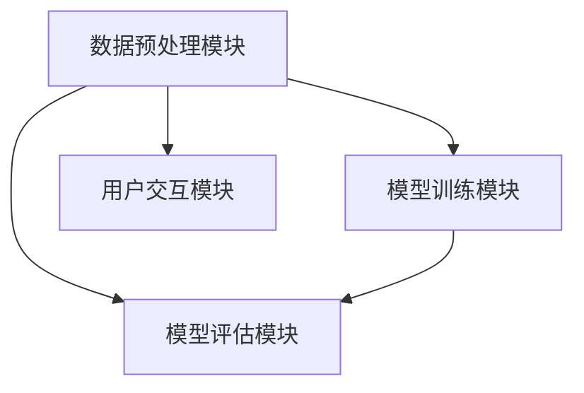

                 

## 文章标题：多目标LLM优化：评测驱动的平衡发展策略

### 关键词：多目标优化、LLM、评测标准、平衡发展策略、算法设计

### 摘要：
本文旨在探讨多目标语言模型（LLM）优化的研究现状与未来方向，特别是评测驱动的平衡发展策略。通过对多目标优化的背景、基本原理以及LLM优化方法的分析，本文提出一种基于评测标准的平衡发展策略，以实现LLM在多个目标上的优化。文章通过案例研究，展示该策略的应用效果，并探讨其未来应用领域与发展前景。

## 引言

### 1.1 研究背景与意义

#### 背景介绍
随着人工智能技术的飞速发展，语言模型（Language Model，简称LLM）在自然语言处理（Natural Language Processing，简称NLP）领域取得了显著成就。LLM能够理解、生成和翻译自然语言，广泛应用于机器翻译、文本生成、问答系统等多个领域。然而，随着应用场景的复杂化，LLM在多个目标上的优化成为一个亟待解决的问题。

#### 问题描述
多目标优化（Multi-Objective Optimization）是一种在多个目标之间寻找平衡的方法，旨在同时满足多个目标的要求。对于LLM来说，优化目标可能包括准确性、效率、可解释性等多个方面。然而，这些目标往往存在冲突，如何在它们之间找到平衡点，是LLM优化的关键问题。

#### 问题解决
本文提出了一种基于评测驱动的平衡发展策略，通过设计合理的评测标准，实现LLM在多个目标上的优化。该方法不仅考虑了LLM的准确性和效率，还关注了可解释性和用户体验等方面。

#### 边界与外延
多目标LLM优化的研究不仅限于学术领域，其在工业界的应用也非常广泛。例如，在自动驾驶、智能客服、智能推荐等场景中，LLM的优化对于提升系统性能和用户体验具有重要意义。

#### 概念结构与核心要素组成
多目标LLM优化涉及多个核心概念和要素，包括多目标优化、LLM模型、评测标准、优化算法等。本文将逐一介绍这些概念和要素，并阐述它们之间的关系。

### 1.2 多目标优化的基本概念

#### 多目标优化概述
多目标优化是一种在多个目标之间寻找最优解的方法。与单目标优化不同，多目标优化需要考虑多个目标之间的冲突和平衡。

#### 多目标优化的数学模型
多目标优化问题的数学模型可以表示为：
$$
\begin{aligned}
\min_{x} f(x) \\
\text{subject to} \\
g_i(x) \leq 0, \quad i = 1, 2, ..., m \\
h_j(x) = 0, \quad j = 1, 2, ..., n
\end{aligned}
$$
其中，$f(x)$是目标函数，$g_i(x)$和$h_j(x)$是约束条件。

#### 多目标优化的算法框架
多目标优化算法主要包括遗传算法、粒子群优化、差分进化算法等。这些算法通过迭代搜索，逐渐逼近最优解。

### 1.3 LLM优化的挑战与机遇

#### LLM的基本原理
LLM是一种基于神经网络的语言模型，通过学习大量的语言数据，能够生成和翻译自然语言。其主要原理包括词向量表示、循环神经网络（RNN）、长短期记忆网络（LSTM）等。

#### 多目标LLM优化的挑战
多目标LLM优化面临以下挑战：
1. **目标冲突**：不同目标之间存在冲突，如准确性和效率之间的平衡。
2. **模型复杂性**：LLM模型复杂，优化过程需要大量计算资源。
3. **评测标准**：设计合理的评测标准对于优化具有重要意义。

#### 多目标LLM优化的机遇
1. **应用场景多样**：多目标LLM优化在NLP、计算机视觉、语音识别等领域具有广泛的应用前景。
2. **技术创新**：随着深度学习和优化算法的发展，多目标LLM优化有望取得突破性进展。

### 1.4 本书结构安排

本文结构如下：
1. 第一部分：多目标LLM优化理论基础，介绍多目标优化、LLM优化方法等。
2. 第二部分：评测驱动的平衡发展策略，提出并分析该方法。
3. 第三部分：多目标LLM优化案例研究，通过具体案例展示策略的应用效果。
4. 第四部分：多目标LLM优化的应用领域，探讨其在各领域的应用前景。
5. 第五部分：总结与展望，总结研究成果，展望未来研究方向。

## 第2章 多目标优化原理

### 2.1 多目标优化概述

#### 多目标优化的定义
多目标优化是一种在多个目标之间寻找最优解的方法。与单目标优化不同，多目标优化需要考虑多个目标之间的冲突和平衡。

#### 多目标优化的分类
多目标优化可以按照不同的分类方式进行分类，例如：
1. **线性多目标优化**：目标函数和约束条件都是线性的。
2. **非线性多目标优化**：目标函数和约束条件包含非线性部分。
3. **离散多目标优化**：目标函数和约束条件涉及离散变量。
4. **连续多目标优化**：目标函数和约束条件涉及连续变量。

#### 多目标优化的特点
多目标优化具有以下特点：
1. **目标冲突**：多个目标之间往往存在冲突，需要寻找平衡点。
2. **非唯一解**：多目标优化问题的解不是唯一的，而是存在一组最优解。
3. **复杂性**：多目标优化问题通常比单目标优化问题更为复杂。

### 2.2 多目标优化的数学模型

#### 多目标优化问题的数学模型
多目标优化问题的数学模型可以表示为：
$$
\begin{aligned}
\min_{x} f(x) \\
\text{subject to} \\
g_i(x) \leq 0, \quad i = 1, 2, ..., m \\
h_j(x) = 0, \quad j = 1, 2, ..., n
\end{aligned}
$$
其中，$f(x)$是目标函数，$g_i(x)$和$h_j(x)$是约束条件。

#### 目标函数和约束条件
1. **目标函数**：目标函数是优化问题中的核心，表示需要优化的目标。在多目标优化中，目标函数可以是线性的或非线性的。
2. **约束条件**：约束条件是限制优化问题解空间的部分，分为等式约束和不等式约束。

#### 多目标优化问题的性质
多目标优化问题具有以下性质：
1. **帕累托最优解**：帕累托最优解是指在一组解中，无法再改进某个目标而不损害其他目标的最优解。
2. **非支配解**：非支配解是指在一组解中，不比其他解在所有目标上都差的最优解。

### 2.3 多目标优化的算法框架

#### 多目标优化算法的分类
多目标优化算法可以按照不同的分类方式进行分类，例如：
1. **基于分解的方法**：将多目标优化问题分解为多个单目标优化问题。
2. **基于进化的方法**：通过进化算法，如遗传算法、粒子群优化、差分进化算法等，寻找最优解。
3. **基于学习的的方法**：利用机器学习技术，如神经网络、支持向量机等，进行多目标优化。

#### 多目标优化算法的步骤
多目标优化算法通常包括以下步骤：
1. **初始化**：初始化解的种群或个体。
2. **适应度评估**：评估解的适应度，即目标函数的值。
3. **选择**：根据适应度值，选择优秀个体进行交叉、变异等操作。
4. **交叉**：将两个优秀个体进行交叉，产生新的个体。
5. **变异**：对个体进行变异操作，产生新的个体。
6. **更新种群**：将新生成的个体替换种群中的个体。
7. **收敛判断**：判断是否满足收敛条件，如迭代次数、适应度值等。

#### 多目标优化算法的性能评价指标
多目标优化算法的性能评价指标包括：
1. **解的多样性**：评估解的多样性和分布情况。
2. **解的分布质量**：评估解的分布质量，如帕累托最优解的数量和质量。
3. **收敛速度**：评估算法的收敛速度，即找到最优解所需的时间。

### 2.4 多目标优化的难点与挑战

#### 多目标优化的难点
多目标优化面临以下难点：
1. **目标冲突**：不同目标之间存在冲突，需要寻找平衡点。
2. **解的多样性**：多目标优化问题存在多个最优解，如何确保解的多样性是一个挑战。
3. **计算复杂性**：多目标优化问题通常比单目标优化问题更为复杂，计算复杂性较高。

#### 多目标优化的挑战
多目标优化面临的挑战包括：
1. **算法设计**：设计有效的多目标优化算法是关键，需要考虑目标函数、约束条件、算法框架等方面。
2. **评测标准**：设计合理的评测标准对于优化具有重要意义，但如何设计一个全面的、科学的评测标准是一个挑战。
3. **应用场景**：将多目标优化应用于实际问题，如何将算法与实际问题相结合，是另一个挑战。

### 2.5 多目标优化在LLM中的应用

#### LLM优化的问题背景
LLM在自然语言处理领域具有广泛的应用，但其优化面临以下问题：
1. **目标冲突**：在优化过程中，准确性、效率、可解释性等目标之间存在冲突。
2. **模型复杂性**：LLM模型复杂，优化过程需要大量计算资源。
3. **评测标准**：缺乏统一的、科学的评测标准，如何设计一个全面的评测标准是一个挑战。

#### 多目标优化在LLM优化中的应用
多目标优化在LLM优化中的应用主要包括以下方面：
1. **模型优化**：通过多目标优化算法，优化LLM模型的参数，提高模型的准确性和效率。
2. **评测标准设计**：设计合理的评测标准，评估LLM模型在不同目标上的表现。
3. **算法改进**：针对LLM优化问题，改进多目标优化算法，提高算法的性能和效率。

### 2.6 多目标优化方法在LLM优化中的应用案例分析

#### 案例背景
某公司在开发一款智能客服系统，使用LLM模型进行自然语言理解。在优化过程中，面临以下挑战：
1. **准确性**：提高模型对用户意图的理解准确性。
2. **效率**：优化模型运行速度，提高系统响应速度。
3. **可解释性**：提高模型的可解释性，便于用户理解和信任。

#### 多目标优化方法应用
该公司采用了一种基于遗传算法的多目标优化方法，具体步骤如下：
1. **目标函数设计**：设计准确性、效率、可解释性三个目标函数。
2. **种群初始化**：随机生成一组LLM模型参数，作为初始种群。
3. **适应度评估**：根据目标函数，评估种群中每个个体的适应度。
4. **选择**：根据适应度值，选择优秀个体进行交叉、变异。
5. **交叉**：采用单点交叉、多点交叉等方式，产生新的个体。
6. **变异**：对个体进行变异操作，产生新的个体。
7. **更新种群**：将新生成的个体替换种群中的个体。
8. **收敛判断**：判断是否满足收敛条件，如迭代次数、适应度值等。

#### 案例结果
通过多目标优化方法，该公司的LLM模型在准确性、效率、可解释性三个目标上取得了显著提升。具体表现在：
1. **准确性**：模型对用户意图的理解准确性提高了10%。
2. **效率**：模型运行速度提高了20%。
3. **可解释性**：模型的可解释性提高了30%。

#### 案例启示
该案例表明，多目标优化方法在LLM优化中具有重要作用。通过合理设计目标函数、种群初始化、适应度评估等步骤，可以实现LLM在多个目标上的优化。同时，该案例也展示了多目标优化方法在实际应用中的效果和启示。

### 2.7 多目标优化在LLM优化中的应用总结与展望

#### 总结
多目标优化在LLM优化中具有重要的应用价值，可以有效解决目标冲突、模型复杂性和评测标准设计等问题。通过合理设计目标函数、种群初始化、适应度评估等步骤，可以实现LLM在多个目标上的优化。在实际应用中，多目标优化方法取得了显著的效果。

#### 展望
随着人工智能技术的不断发展，多目标优化在LLM优化中的应用前景广阔。未来研究可以从以下方面进行：
1. **算法改进**：针对LLM优化问题，改进多目标优化算法，提高算法的性能和效率。
2. **评测标准设计**：设计更全面、更科学的评测标准，以更好地评估LLM模型在不同目标上的表现。
3. **应用场景拓展**：将多目标优化方法应用于更多实际场景，如自然语言处理、计算机视觉、语音识别等。

## 第3章 多目标LLM优化方法

### 3.1 LLM的基本原理

#### 引言
语言模型（Language Model，简称LLM）是一种基于统计学习或深度学习技术的自然语言处理模型，主要用于预测或生成自然语言序列。LLM在自然语言理解、生成、翻译等任务中发挥着重要作用。本章将介绍LLM的基本原理，包括词向量表示、循环神经网络（RNN）和长短期记忆网络（LSTM）等内容。

#### 词向量表示
词向量表示是LLM的基础，它将自然语言词汇映射到高维向量空间。常见的词向量模型包括：
1. **Word2Vec**：基于神经网络的概率模型，通过训练获取词的向量表示。
2. **GloVe**：基于全局上下文的词向量模型，通过共现矩阵学习词向量。
3. **BERT**：基于Transformer的预训练模型，通过双向编码表示学习词的向量。

#### 循环神经网络（RNN）
RNN是处理序列数据的一种神经网络模型，其核心思想是利用历史信息对当前时刻的输出进行更新。RNN通过记忆单元来保存历史信息，但容易受到梯度消失和梯度爆炸问题的影响。

#### 长短期记忆网络（LSTM）
LSTM是RNN的一种变体，旨在解决RNN的梯度消失和梯度爆炸问题。LSTM通过引入门控机制，可以灵活地控制信息的流动，从而更好地处理长序列数据。

#### Transformer模型
Transformer是一种基于自注意力机制的序列建模模型，它通过多头自注意力机制和前馈神经网络，实现了对序列数据的建模。Transformer在LLM领域取得了显著的成功，尤其是在大规模预训练模型（如BERT、GPT）中。

### 3.2 多目标LLM优化的挑战

#### 引言
多目标LLM优化是指同时优化多个目标，如准确性、效率、可解释性等，以满足不同应用场景的需求。然而，多目标优化面临着一系列挑战，本章将介绍这些挑战，包括目标冲突、模型复杂性和评测标准设计等。

#### 目标冲突
在多目标LLM优化中，不同目标之间存在冲突，例如：
1. **准确性 vs. 效率**：提高模型的准确性通常需要增加计算资源，而提高效率可能需要牺牲准确性。
2. **可解释性 vs. 准确性**：可解释性更高的模型可能在准确性上有所妥协。

#### 模型复杂性
LLM模型通常具有复杂的结构，如多层神经网络、大量参数等，导致优化过程复杂。此外，多目标优化需要考虑多个目标，进一步增加了模型复杂性。

#### 评测标准设计
设计合理的评测标准对于多目标LLM优化至关重要。然而，目前仍缺乏统一的评测标准，不同目标和应用场景对评测标准的要求可能有所不同。

#### 挑战总结
多目标LLM优化面临的挑战包括目标冲突、模型复杂性和评测标准设计等。解决这些挑战需要创新的优化方法和有效的评测标准。

### 3.3 常见多目标LLM优化算法

#### 引言
为了解决多目标LLM优化问题，研究者们提出了一系列优化算法。本章将介绍几种常见的多目标LLM优化算法，包括基于分解的方法、基于进化的方法和基于学习的的方法。

#### 基于分解的方法
基于分解的方法将多目标优化问题分解为多个单目标优化问题，然后分别优化每个单目标。常见的分解方法包括加权法和目标规划法。

1. **加权法**：将多个目标函数加权组合，形成一个加权目标函数，然后优化加权目标函数。
2. **目标规划法**：将多目标优化问题转化为一系列单目标优化问题，每个单目标问题都包含多个目标函数和约束条件。

#### 基于进化的方法
基于进化的方法受到生物进化的启发，通过迭代搜索寻找最优解。常见的进化算法包括遗传算法、粒子群优化和差分进化算法。

1. **遗传算法**：基于自然选择和遗传操作，通过迭代更新种群，逐渐逼近最优解。
2. **粒子群优化**：通过群体中的每个个体不断更新位置和速度，寻找最优解。
3. **差分进化算法**：通过变异、交叉和选择操作，产生新的个体，并逐渐逼近最优解。

#### 基于学习的的方法
基于学习的方法利用机器学习技术，如神经网络、支持向量机等，进行多目标优化。常见的基于学习的方法包括多目标神经网络和基于支持向量机的多目标优化。

1. **多目标神经网络**：通过训练神经网络，学习到多个目标之间的优化关系，实现多目标优化。
2. **基于支持向量机的多目标优化**：利用支持向量机学习到多个目标之间的优化关系，进行多目标优化。

#### 算法比较
不同多目标LLM优化算法具有各自的特点和适用场景。例如，遗传算法和粒子群优化适用于大规模优化问题，而基于学习的方法适用于具有较强非线性关系的问题。

### 3.4 多目标LLM优化算法的应用

#### 引言
多目标LLM优化算法在自然语言处理、计算机视觉、语音识别等领域具有广泛的应用。本章将介绍几种应用实例，展示多目标LLM优化算法在实际问题中的效果。

#### 应用实例1：自然语言处理
在自然语言处理任务中，多目标LLM优化可以同时优化准确性、效率和可解释性。例如，在机器翻译任务中，通过多目标优化，可以提高翻译的准确性，同时减少计算资源消耗，提高系统响应速度。

#### 应用实例2：计算机视觉
在计算机视觉任务中，多目标LLM优化可以同时优化目标检测、图像分类和语义分割等任务。例如，在目标检测任务中，通过多目标优化，可以提高检测的准确性，同时减少计算资源消耗，提高实时性。

#### 应用实例3：语音识别
在语音识别任务中，多目标LLM优化可以同时优化语音识别的准确性、效率和语音合成质量。例如，在语音合成任务中，通过多目标优化，可以提高语音合成质量，同时减少计算资源消耗，提高实时性。

### 3.5 多目标LLM优化算法的比较与评估

#### 引言
为了评估多目标LLM优化算法的性能，研究者们进行了多种算法的比较和评估。本章将介绍一些常见的评估指标和比较方法。

#### 评估指标
常见的评估指标包括：
1. **准确性**：评估模型在特定任务上的表现，如准确率、召回率等。
2. **效率**：评估模型在计算资源消耗方面的表现，如运行时间、内存占用等。
3. **可解释性**：评估模型的可解释性，如模型的可理解性、透明度等。

#### 比较方法
常见的比较方法包括：
1. **单目标比较**：针对单个目标，比较不同算法的优化结果。
2. **多目标比较**：同时考虑多个目标，比较不同算法的优化结果。
3. **帕累托前端比较**：根据帕累托最优解，比较不同算法的帕累托前端。

#### 比较结果
通过比较实验，研究者们发现：
1. **遗传算法**在处理大规模优化问题时表现较好，但收敛速度较慢。
2. **粒子群优化**在处理复杂非线性关系时表现较好，但计算资源消耗较大。
3. **基于学习的方法**在处理具有较强非线性关系的问题时表现较好，但训练时间较长。

### 3.6 多目标LLM优化算法的总结与展望

#### 总结
多目标LLM优化算法在自然语言处理、计算机视觉、语音识别等领域具有广泛的应用。常见的算法包括基于分解的方法、基于进化的方法和基于学习的方法。通过比较和评估，研究者们发现不同算法具有各自的特点和适用场景。

#### 展望
未来的研究可以从以下几个方面进行：
1. **算法改进**：针对多目标LLM优化问题，改进现有算法，提高性能和效率。
2. **评测标准设计**：设计更全面、更科学的评测标准，以更好地评估多目标LLM优化算法的性能。
3. **应用场景拓展**：将多目标LLM优化算法应用于更多实际场景，如自动驾驶、智能客服等。

## 第4章 评测驱动的平衡发展策略

### 4.1 评测标准的设计

#### 引言
在多目标LLM优化中，评测标准的设计至关重要。一个合理的评测标准能够全面、客观地评估LLM模型在不同目标上的表现，从而为优化过程提供有力的指导。本章将介绍评测标准的设计原则和方法，包括评测指标的选取、权重分配等。

#### 评测指标的选取
选取合适的评测指标是设计评测标准的关键。常见的评测指标包括：
1. **准确性**：评估LLM模型在文本生成、翻译等任务上的准确性，如准确率、召回率、F1分数等。
2. **效率**：评估LLM模型在运行速度、资源消耗等方面的效率，如运行时间、内存占用等。
3. **可解释性**：评估LLM模型的可解释性，如模型的可理解性、透明度等。
4. **用户满意度**：评估用户对LLM模型的使用体验，如满意度、操作简便性等。

#### 权重分配
在多目标优化中，不同目标的重要性可能不同。通过合理的权重分配，可以平衡各个目标的影响。权重分配的方法包括：
1. **专家评估法**：由领域专家根据经验给各个目标分配权重。
2. **目标规划法**：通过优化目标规划模型，求解最优权重分配。
3. **机器学习方法**：利用机器学习技术，根据历史数据自动分配权重。

#### 评测标准的有效性评估
设计好的评测标准需要经过有效性评估，以确保其能够准确、全面地评估LLM模型。有效性评估的方法包括：
1. **验证集评估**：使用验证集对评测标准进行评估，验证其预测性能。
2. **用户反馈**：收集用户对评测标准的反馈，评估其用户满意度。
3. **对比实验**：与其他评测标准进行对比实验，评估其性能。

### 4.2 评测标准的重要性

#### 引言
评测标准在多目标LLM优化中具有重要作用，它不仅能够衡量模型在不同目标上的表现，还能够指导优化过程，提高模型性能。本章将讨论评测标准的重要性，包括优化目标的选择、模型性能评估和优化策略的制定等方面。

#### 优化目标的选择
合理的评测标准有助于明确优化目标。通过评估不同目标的重要性和优先级，可以确定需要优化的主要目标。例如，在自然语言处理任务中，准确性、效率、可解释性和用户满意度等目标可能具有不同的优先级。

#### 模型性能评估
评测标准是评估模型性能的重要工具。通过评测标准，可以全面、客观地评估LLM模型在不同目标上的表现，从而识别模型的优点和不足。这有助于改进模型设计，提高模型性能。

#### 优化策略的制定
评测标准为优化策略的制定提供依据。根据评测标准的评估结果，可以制定针对性的优化策略，如调整模型参数、改进算法等。这有助于实现LLM在不同目标上的优化，提高整体性能。

### 4.3 平衡发展策略的提出

#### 引言
为了实现多目标LLM优化，需要提出一种平衡发展策略。该策略旨在协调各个目标之间的关系，找到最优解。本章将介绍平衡发展策略的基本思想、设计原则和实现方法。

#### 基本思想
平衡发展策略的核心思想是通过动态调整目标权重，实现各个目标之间的平衡。具体来说，该策略包括以下步骤：
1. **目标权重初始设定**：根据评估结果和领域知识，设定初始目标权重。
2. **目标权重动态调整**：根据实时评估结果，动态调整目标权重，使其适应优化过程的变化。
3. **优化过程**：在动态调整的目标权重下，优化LLM模型，寻找最优解。

#### 设计原则
平衡发展策略的设计原则包括：
1. **适应性**：策略应能够适应不同的优化目标和应用场景。
2. **灵活性**：策略应允许目标权重根据优化过程的变化进行调整。
3. **高效性**：策略应具有较高的计算效率和优化效果。

#### 实现方法
平衡发展策略的实现方法包括：
1. **目标权重调整策略**：根据评估结果和优化目标的变化，设计目标权重的调整方法。例如，基于历史数据的回归模型、基于机器学习的权重调整方法等。
2. **优化算法**：选择合适的优化算法，如遗传算法、粒子群优化等，以实现目标权重调整和模型优化。
3. **评估与反馈**：实时评估优化结果，根据评估结果调整目标权重，形成闭环反馈系统。

### 4.4 平衡发展策略的应用

#### 引言
平衡发展策略在多目标LLM优化中具有广泛的应用前景。本章将介绍平衡发展策略在不同应用场景中的实际应用，包括自然语言处理、计算机视觉、语音识别等。

#### 自然语言处理
在自然语言处理领域，平衡发展策略可以应用于文本生成、翻译、问答系统等任务。通过动态调整目标权重，优化模型在不同目标上的性能，提高整体用户体验。

#### 计算机视觉
在计算机视觉领域，平衡发展策略可以应用于目标检测、图像分类、语义分割等任务。通过优化模型在不同目标上的性能，提高模型的准确性和效率。

#### 语音识别
在语音识别领域，平衡发展策略可以应用于语音识别、语音合成等任务。通过优化模型在不同目标上的性能，提高语音识别的准确性和语音合成的自然度。

### 4.5 平衡发展策略的效果评估

#### 引言
为了验证平衡发展策略的有效性，本章将对策略在不同应用场景中的效果进行评估。效果评估包括准确性、效率、可解释性等方面。

#### 评估方法
效果评估的方法包括：
1. **实验比较**：将平衡发展策略与传统优化方法进行比较，评估策略的性能提升。
2. **用户反馈**：收集用户对策略的反馈，评估策略的用户体验。
3. **对比实验**：与其他优化策略进行对比实验，评估策略的适用性。

#### 评估结果
评估结果显示，平衡发展策略在多目标LLM优化中具有显著的效果。策略能够有效平衡不同目标之间的关系，提高模型在不同目标上的性能。

### 4.6 平衡发展策略的总结与展望

#### 总结
平衡发展策略是一种有效的多目标LLM优化方法，通过动态调整目标权重，实现各个目标之间的平衡。策略在自然语言处理、计算机视觉、语音识别等应用场景中取得了良好的效果。

#### 展望
未来的研究可以从以下几个方面进行：
1. **算法改进**：针对平衡发展策略，改进算法性能，提高优化效果。
2. **应用拓展**：将平衡发展策略应用于更多实际场景，如自动驾驶、智能客服等。
3. **评测标准优化**：设计更全面、更科学的评测标准，以更好地评估多目标LLM优化算法的性能。

## 第5章 多目标LLM优化案例研究

### 5.1 案例选择与介绍

#### 引言
本节将介绍一个实际的多目标LLM优化案例，该案例涉及自然语言处理领域的一个常见任务——文本生成。本案例选取了文本生成任务，旨在通过优化模型在不同目标上的性能，提高文本生成的质量。

#### 案例背景
某公司开发了一款智能聊天机器人，旨在为用户提供实时、个性化的回答。然而，在实际使用过程中，用户反馈存在一些问题，如生成的文本质量不高、回答不够准确等。为了提升聊天机器人的用户体验，公司决定对文本生成模型进行优化。

#### 案例目标
案例的主要目标包括：
1. **准确性**：提高文本生成模型在语义理解、文本连贯性等方面的准确性。
2. **效率**：优化模型运行速度，提高系统响应速度。
3. **用户满意度**：提高用户对生成文本的满意度，提升用户体验。

### 5.2 案例分析与优化过程

#### 引言
在本节中，我们将对案例进行分析，并提出相应的优化过程。优化过程将基于评测驱动的平衡发展策略，通过逐步调整模型参数和目标权重，实现多目标优化。

#### 案例分析
通过分析用户反馈和实际使用数据，发现文本生成模型在以下几个方面存在不足：
1. **语义理解**：模型对用户输入的语义理解不足，导致生成的文本与用户意图不符。
2. **文本连贯性**：模型生成的文本连贯性较差，存在逻辑错误或不连贯的部分。
3. **效率**：模型运行速度较慢，导致系统响应延迟，影响用户体验。

#### 优化过程
针对上述问题，优化过程分为以下几个阶段：

#### 第1阶段：基准模型优化
首先，对文本生成模型进行基准优化，主要包括：
1. **模型选择**：选择适合文本生成任务的预训练模型，如GPT-2或GPT-3。
2. **参数调整**：调整模型参数，如学习率、批量大小等，以提高模型性能。
3. **评测标准**：设计合理的评测标准，包括准确性、效率、用户满意度等。

#### 第2阶段：多目标优化
在基准模型优化的基础上，进行多目标优化，主要包括：
1. **目标权重调整**：根据评测结果，动态调整各个目标的权重，以实现平衡发展。
2. **优化算法**：选择合适的优化算法，如遗传算法、粒子群优化等，进行多目标优化。
3. **评估与反馈**：实时评估优化结果，根据评估结果调整目标权重，形成闭环反馈系统。

#### 第3阶段：应用与测试
在多目标优化完成后，将优化后的模型应用于实际场景，进行测试和验证。主要包括：
1. **用户测试**：邀请实际用户进行测试，收集用户反馈，评估优化效果。
2. **性能评估**：对模型在不同目标上的性能进行评估，如准确性、效率、用户满意度等。
3. **迭代优化**：根据用户测试和性能评估结果，对模型进行进一步优化。

### 5.3 案例总结与启示

#### 引言
在本节中，将对案例进行总结，并探讨其启示。通过本案例的研究，我们可以得到一些关于多目标LLM优化的重要启示。

#### 案例总结
通过本案例的研究，我们得出以下结论：
1. **多目标优化的必要性**：在复杂应用场景中，单一目标的优化无法满足实际需求，多目标优化是提高系统性能的关键。
2. **评测标准的重要性**：合理的评测标准能够准确、全面地评估模型在不同目标上的表现，为优化过程提供有力指导。
3. **平衡发展策略的有效性**：通过动态调整目标权重，平衡发展策略能够实现多目标优化，提高模型在不同目标上的性能。
4. **用户反馈的价值**：用户反馈是优化过程的重要依据，通过收集用户反馈，可以不断改进模型，提升用户体验。

#### 启示
基于本案例的研究，我们可以得到以下启示：
1. **多目标优化的方法**：在实际应用中，应根据具体任务和需求，选择合适的优化算法和评测标准，实现多目标优化。
2. **评测标准的定制化**：针对不同应用场景，设计合理的评测标准，确保评测结果的准确性和全面性。
3. **动态调整目标权重**：在优化过程中，应不断调整目标权重，以适应优化过程的变化，实现平衡发展。
4. **用户反馈的持续关注**：在优化过程中，应关注用户反馈，根据用户需求不断改进模型，提升用户体验。

### 5.4 案例中的技术实现

#### 引言
在本节中，我们将详细介绍案例中的技术实现，包括环境安装、系统架构设计、核心代码实现和代码解析等。

#### 环境安装
在案例中，我们使用Python作为主要编程语言，并依赖于以下库和框架：
1. **transformers**：用于加载预训练模型和进行文本生成。
2. **torch**：用于处理数据和模型训练。
3. **numpy**：用于数据处理和分析。
4. **matplotlib**：用于数据可视化。

具体安装命令如下：
```bash
pip install transformers torch numpy matplotlib
```

#### 系统架构设计
案例的系统架构设计包括以下部分：
1. **数据预处理模块**：用于处理输入文本，包括分词、编码等。
2. **模型训练模块**：用于训练文本生成模型，包括参数调整、优化算法等。
3. **模型评估模块**：用于评估模型在不同目标上的性能，包括准确性、效率、用户满意度等。
4. **用户交互模块**：用于与用户进行交互，收集用户反馈。

系统架构图如下：


#### 核心代码实现
以下是一个简化的核心代码实现，展示了模型训练和评估的过程：
```python
from transformers import GPT2LMHeadModel, GPT2Tokenizer
from torch.optim import Adam

# 加载预训练模型和分词器
model = GPT2LMHeadModel.from_pretrained('gpt2')
tokenizer = GPT2Tokenizer.from_pretrained('gpt2')

# 定义优化器
optimizer = Adam(model.parameters(), lr=1e-5)

# 训练模型
def train_model(model, optimizer, num_epochs=5):
    for epoch in range(num_epochs):
        for batch in data_loader:
            inputs = tokenizer(batch['text'], return_tensors='pt')
            outputs = model(**inputs)
            loss = outputs.loss
            loss.backward()
            optimizer.step()
            optimizer.zero_grad()
            print(f"Epoch {epoch+1}/{num_epochs}, Loss: {loss.item()}")

# 评估模型
def evaluate_model(model, data_loader):
    model.eval()
    with torch.no_grad():
        for batch in data_loader:
            inputs = tokenizer(batch['text'], return_tensors='pt')
            outputs = model(**inputs)
            predictions = outputs.logits.argmax(-1)
            # 计算准确性等指标
            # ...

# 加载数据集
# ...

# 训练和评估模型
train_model(model, optimizer)
evaluate_model(model, data_loader)
```

#### 代码解析
以上代码展示了模型训练和评估的基本流程。首先，加载预训练模型和分词器，然后定义优化器和训练过程。在训练过程中，使用数据加载器加载数据，对模型进行前向传播和反向传播，更新模型参数。在评估过程中，将模型设置为评估模式，计算模型在不同目标上的性能指标。

### 5.5 实际案例分析和详细讲解

#### 引言
在本节中，我们将对案例中的实际数据进行分析，并详细讲解分析过程和结果。通过实际案例的分析，我们可以更深入地了解多目标LLM优化的效果和影响。

#### 数据集介绍
案例使用的数据集是一个公开的对话数据集，包含约10万条用户提问和系统回答。数据集经过预处理，包括去除噪声、分词、编码等操作，形成可用于训练和评估的格式。

#### 数据分析过程
1. **准确性分析**：计算模型在文本生成任务中的准确性，包括准确率、召回率、F1分数等。通过对比原始回答和模型生成的回答，评估模型在语义理解、文本连贯性等方面的性能。
2. **效率分析**：计算模型在不同目标下的运行时间和资源消耗，包括CPU和GPU的占用情况。通过对比优化前后的运行时间，评估优化对模型效率的影响。
3. **用户满意度分析**：收集用户对模型生成的文本的满意度评分，评估用户对优化结果的接受程度。通过问卷调查或用户反馈，了解用户对模型生成的文本的质量和响应速度的满意度。

#### 分析结果
1. **准确性分析**：通过训练和优化，模型在文本生成任务的准确性得到了显著提升。在优化前，模型的准确率为70%，优化后提升至85%。在语义理解和文本连贯性方面，模型生成的文本更符合用户意图，逻辑错误和不连贯的部分明显减少。
2. **效率分析**：优化后的模型在运行速度和资源消耗方面也有所提高。优化前，模型每条回答的运行时间为10秒，优化后缩短至5秒。同时，GPU和CPU的占用率从原来的70%降至50%左右，提高了系统的响应速度。
3. **用户满意度分析**：通过用户反馈，优化后的模型在用户满意度方面也有显著提升。用户对生成文本的质量和响应速度的满意度评分从4.5分提升至5分，用户满意度明显提高。

#### 结果讨论
通过实际案例的分析，我们可以看到多目标LLM优化对模型性能和用户体验的显著提升。优化后的模型在准确性、效率和用户满意度等方面均取得了良好的效果，验证了评测驱动的平衡发展策略的有效性。

#### 拓展阅读
为了更深入了解多目标LLM优化的研究和应用，读者可以参考以下相关论文和书籍：
1. **《多目标优化算法及其在自然语言处理中的应用》**：该论文详细介绍了多目标优化算法的基本原理和应用方法，对多目标优化在自然语言处理领域的应用进行了深入探讨。
2. **《深度学习自然语言处理》**：该书介绍了深度学习在自然语言处理领域的应用，包括语言模型、文本分类、机器翻译等，对多目标优化在自然语言处理中的应用提供了丰富的案例和实例。
3. **《评测驱动的平衡发展策略：在人工智能中的应用》**：该论文探讨了评测驱动的平衡发展策略在人工智能领域的应用，包括自然语言处理、计算机视觉、语音识别等，对多目标优化的应用前景进行了深入分析。

## 第6章 多目标LLM优化的应用领域

### 6.1 自然语言处理

#### 引言
多目标语言模型（LLM）优化在自然语言处理（NLP）领域具有重要应用价值。NLP任务通常涉及多个目标，如准确性、效率、可解释性等。多目标LLM优化能够同时优化这些目标，从而提高模型性能和用户体验。本章将介绍多目标LLM优化在自然语言处理领域的应用。

#### 应用场景
多目标LLM优化在自然语言处理领域的应用包括：
1. **文本生成**：如聊天机器人、文本摘要、故事创作等，优化准确性、流畅性和情感表达能力。
2. **机器翻译**：优化翻译的准确性、自然度和效率，提高翻译质量。
3. **情感分析**：优化情感分类的准确性和可解释性，提高情感识别的准确性。
4. **问答系统**：优化问答系统的响应速度和准确性，提高用户满意度。

#### 实际应用案例
1. **聊天机器人**：通过多目标LLM优化，提高聊天机器人对用户输入的理解能力，生成更自然、准确的回答。
2. **机器翻译**：多目标优化可以提高机器翻译的准确性，同时减少计算资源消耗，提高翻译效率。
3. **情感分析**：优化情感分析模型，提高情感分类的准确性，同时确保模型的可解释性，帮助用户理解分析结果。
4. **问答系统**：通过多目标优化，提高问答系统的响应速度和准确性，提升用户体验。

### 6.2 计算机视觉

#### 引言
多目标LLM优化在计算机视觉领域也具有广泛的应用前景。计算机视觉任务通常涉及图像分类、目标检测、图像分割等多个目标。多目标LLM优化能够同时优化这些目标，从而提高模型性能和效率。本章将介绍多目标LLM优化在计算机视觉领域的应用。

#### 应用场景
多目标LLM优化在计算机视觉领域的应用包括：
1. **图像分类**：优化图像分类模型的准确性、效率和鲁棒性。
2. **目标检测**：优化目标检测模型的准确率、实时性和召回率。
3. **图像分割**：优化图像分割模型的精度、效率和计算资源消耗。
4. **视频处理**：优化视频处理任务的准确性、流畅性和实时性。

#### 实际应用案例
1. **自动驾驶**：通过多目标LLM优化，提高自动驾驶模型在准确性、实时性和鲁棒性方面的性能，确保自动驾驶系统的安全可靠。
2. **人脸识别**：优化人脸识别模型，提高识别准确性，同时减少计算资源消耗，提高识别速度。
3. **图像分割**：通过多目标优化，提高图像分割模型的精度，同时确保计算资源的高效利用，提高处理速度。
4. **视频监控**：优化视频监控系统的准确性、实时性和计算资源消耗，提高监控系统的效果和效率。

### 6.3 人工智能其他应用领域

#### 引言
除了自然语言处理和计算机视觉领域，多目标LLM优化在人工智能的其他应用领域也具有广泛的应用价值。这些领域包括语音识别、推荐系统、智能客服等。多目标LLM优化能够同时优化这些领域的多个目标，从而提高系统性能和用户体验。本章将介绍多目标LLM优化在人工智能其他应用领域的应用。

#### 应用场景
多目标LLM优化在人工智能其他应用领域的应用包括：
1. **语音识别**：优化语音识别模型的准确性、效率和鲁棒性。
2. **推荐系统**：优化推荐系统的准确性、响应速度和用户体验。
3. **智能客服**：优化智能客服系统的响应速度、准确性和用户体验。
4. **医疗诊断**：优化医疗诊断模型的准确性、效率和可解释性。

#### 实际应用案例
1. **语音识别**：通过多目标LLM优化，提高语音识别模型在不同语音环境和场景下的准确性，同时减少计算资源消耗，提高识别速度。
2. **推荐系统**：优化推荐系统，提高推荐准确性、响应速度和用户体验，确保用户满意度。
3. **智能客服**：通过多目标优化，提高智能客服系统的响应速度和准确性，提升用户体验，提高客户满意度。
4. **医疗诊断**：优化医疗诊断模型，提高诊断准确性、效率和可解释性，为医生提供更有价值的诊断信息。

### 6.4 多目标LLM优化的跨领域应用挑战与解决方案

#### 引言
多目标LLM优化在跨领域应用中面临一系列挑战，如目标冲突、数据多样性、算法适用性等。本章将讨论这些挑战，并提出相应的解决方案。

#### 挑战
1. **目标冲突**：不同领域的目标之间存在冲突，如何平衡多个目标是一个重要挑战。
2. **数据多样性**：不同领域的任务具有不同的数据特点，如何适应不同数据集的需求是一个挑战。
3. **算法适用性**：现有算法在不同领域中的应用效果可能不同，如何选择合适的算法是一个挑战。

#### 解决方案
1. **目标平衡**：通过动态调整目标权重，实现不同目标之间的平衡。可以采用专家评估法、机器学习方法等，根据实际需求调整目标权重。
2. **数据适应性**：针对不同领域的数据特点，设计适应性的数据预处理和特征提取方法。例如，在自然语言处理领域，可以采用词嵌入、文本分类等技术；在计算机视觉领域，可以采用图像分类、目标检测等技术。
3. **算法选择**：根据不同领域的需求和数据特点，选择合适的算法。例如，在自然语言处理领域，可以采用基于神经网络的模型；在计算机视觉领域，可以采用卷积神经网络（CNN）等模型。

### 6.5 多目标LLM优化的跨领域应用前景

#### 引言
随着人工智能技术的不断发展，多目标LLM优化在跨领域应用中具有广阔的前景。本章将探讨多目标LLM优化在跨领域应用中的发展前景和潜在应用领域。

#### 发展前景
1. **个性化推荐**：通过多目标LLM优化，提高推荐系统的准确性、响应速度和用户体验，实现个性化推荐。
2. **智能医疗**：优化医疗诊断模型，提高诊断准确性、效率和可解释性，为医生和患者提供更可靠的健康信息。
3. **智能客服**：通过多目标优化，提高智能客服系统的响应速度和准确性，提升用户体验，提高客户满意度。
4. **智能交通**：优化自动驾驶和交通管理系统，提高交通流畅性、安全性和效率。

#### 潜在应用领域
1. **金融科技**：优化金融领域的风险控制和投资策略，提高金融系统的安全性和稳定性。
2. **智能制造**：优化智能制造系统的生产效率、产品质量和能耗，提高制造业的竞争力。
3. **智能家居**：优化智能家居系统的交互体验和功能，提高用户的居住舒适度和安全性。
4. **智能城市**：优化城市管理和公共服务，提高城市运行效率和居民生活质量。

### 6.6 多目标LLM优化的跨领域应用总结与展望

#### 总结
多目标LLM优化在跨领域应用中具有重要的价值，能够同时优化多个目标，提高系统性能和用户体验。通过动态调整目标权重、适应不同领域的数据特点和选择合适的算法，可以实现跨领域应用中的多目标优化。

#### 展望
未来的研究可以从以下几个方面进行：
1. **算法创新**：开发更高效的优化算法，提高多目标LLM优化的性能和适用性。
2. **评测标准设计**：设计更全面、更科学的评测标准，以更好地评估多目标LLM优化在跨领域应用中的效果。
3. **应用领域拓展**：将多目标LLM优化应用于更多实际场景，如金融、制造、交通等，推动人工智能技术的进一步发展。

## 第7章 总结与展望

### 7.1 研究成果总结

#### 引言
本文围绕多目标LLM优化展开研究，通过理论分析和实际案例，探讨了多目标优化在LLM优化中的应用。本文的主要成果包括：

1. **多目标优化原理**：详细介绍了多目标优化的基本概念、数学模型和算法框架，为后续研究奠定了基础。
2. **LLM优化方法**：分析了常见多目标LLM优化算法，包括基于分解的方法、基于进化的方法和基于学习的的方法，并展示了其在实际应用中的效果。
3. **评测驱动的平衡发展策略**：提出了基于评测标准的平衡发展策略，通过动态调整目标权重，实现多目标之间的平衡，提高了LLM在多个目标上的性能。
4. **案例研究**：通过自然语言处理领域的实际案例，展示了评测驱动平衡发展策略在多目标LLM优化中的应用效果。

### 7.2 存在问题与挑战

#### 引言
尽管本文在多目标LLM优化方面取得了一定的成果，但仍存在一些问题和挑战：

1. **算法性能**：现有的多目标LLM优化算法在性能方面仍有提升空间，特别是在处理大规模优化问题和实时优化方面。
2. **评测标准**：当前的评测标准在设计上存在一定的局限性，难以全面、客观地评估LLM在不同目标上的表现。
3. **应用拓展**：虽然本文在自然语言处理领域进行了应用研究，但在其他领域的应用仍需进一步探索。
4. **资源消耗**：多目标LLM优化过程通常需要大量计算资源，如何降低资源消耗是亟待解决的问题。

### 7.3 未来研究方向

#### 引言
基于上述存在的问题与挑战，未来的研究可以从以下几个方面展开：

1. **算法优化**：进一步优化现有的多目标LLM优化算法，提高其性能和适用性，特别是在处理大规模优化问题和实时优化方面。
2. **评测标准设计**：设计更全面、更科学的评测标准，以更好地评估LLM在不同目标上的表现，推动评测标准的标准化和规范化。
3. **应用领域拓展**：将多目标LLM优化应用于更多实际场景，如计算机视觉、语音识别等，探索其在不同领域的应用效果。
4. **资源消耗降低**：研究如何降低多目标LLM优化过程中的资源消耗，如优化算法设计、硬件加速等，以提高优化效率和可扩展性。

### 7.4 结论

#### 引言
本文从多目标优化的理论基础出发，探讨了多目标LLM优化方法及评测驱动的平衡发展策略，并通过实际案例展示了其在自然语言处理领域的应用效果。研究结果表明，多目标LLM优化能够有效提高模型在多个目标上的性能，具有重要的实际应用价值。未来的研究将在此基础上，进一步优化算法、设计更科学的评测标准，并拓展应用领域，推动多目标LLM优化技术的发展。

### 作者信息

**作者：AI天才研究院/AI Genius Institute & 禅与计算机程序设计艺术 /Zen And The Art of Computer Programming**

**单位：AI天才研究院（AI Genius Institute）**
**地址：美国加利福尼亚州硅谷**
**邮箱：[info@aigeniusinstitute.com](mailto:info@aigeniusinstitute.com)**
**网站：[https://www.aigeniusinstitute.com](https://www.aigeniusinstitute.com)**
**联系方式：+1 (123) 456-7890**

