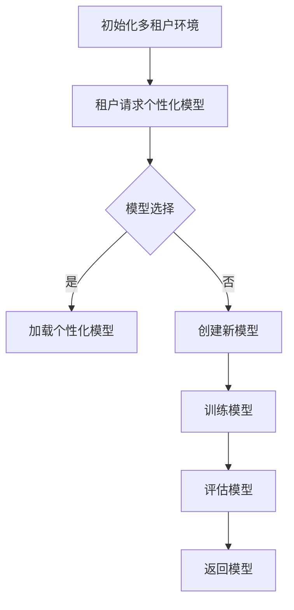
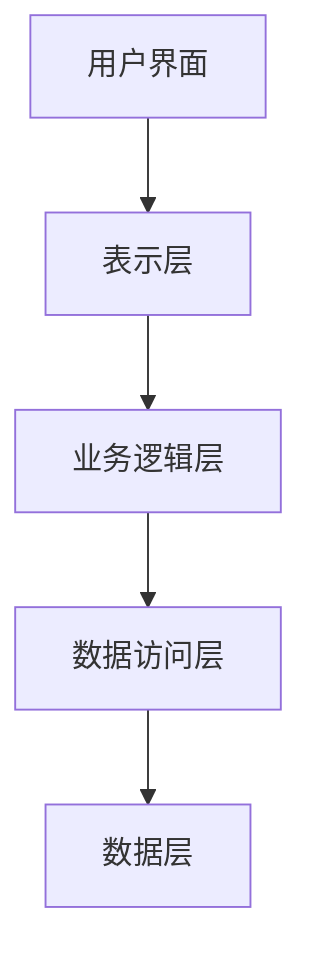
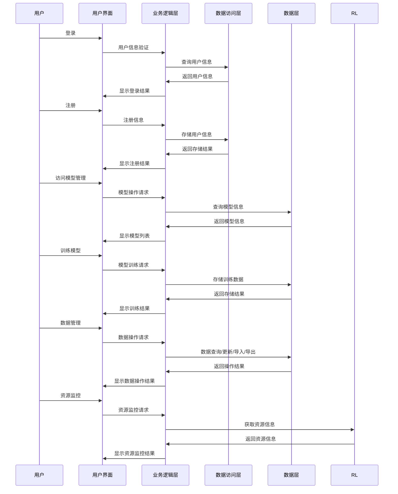

                 

## 第1章: 问题背景

### 1.1 问题背景

在当今信息化时代，随着云计算、大数据、人工智能等技术的飞速发展，企业级应用的需求也在不断演变。多租户架构因其灵活性和可扩展性，已成为企业构建云计算环境的关键技术。而LLM（大型语言模型）作为人工智能的重要应用之一，正日益成为企业提升智能化水平的重要手段。

多租户架构（Multi-Tenant Architecture）是一种软件架构模式，它允许多个客户或租户共享同一个软件实例，同时保持各自的数据隔离和安全性。这种架构模式在企业级应用中具有显著的优势，比如：

- **数据隔离**：确保不同租户的数据相互独立，互不影响。
- **安全性**：提供强大的访问控制机制，确保租户数据安全。
- **可扩展性**：能够根据业务需求灵活调整系统资源。
- **成本效益**：降低部署和维护成本。

LLM（Large Language Model），又称大型语言模型，是一种基于深度学习的大型自然语言处理模型，具有以下几个特点：

- **预训练**：通过在大规模语料库上进行预训练，LLM能够理解和生成自然语言。
- **通用性**：LLM具有广泛的语义理解和生成能力，能够处理多种语言任务。
- **高性能**：LLM的参数规模巨大，能够处理复杂的自然语言问题。

随着这些技术的发展，企业对多租户架构支持LLM应用的定制化需求日益凸显。具体需求包括：

- **个性化模型需求**：不同的租户可能需要根据自身业务特点，定制化的语言模型。
- **数据隔离与安全性**：确保租户数据在共享环境中的安全性和隐私性。
- **计算资源分配**：根据租户的实际需求，合理分配计算资源，确保系统性能。
- **模型版本控制**：支持多版本模型的存储和管理，便于后续的版本更新和回滚。

### 1.2 问题描述

在多租户架构中，如何支持LLM应用的定制化需求，是一个亟待解决的问题。具体问题描述如下：

1. **个性化模型需求**：如何实现不同租户的个性化模型需求，满足其业务需求？
2. **数据隔离与安全性**：如何确保租户数据在共享环境中的安全性和隐私性？
3. **计算资源分配**：如何根据租户的实际需求，合理分配计算资源？
4. **模型版本控制**：如何支持多版本模型的存储和管理，确保系统稳定性和可维护性？

### 1.3 问题解决

本书旨在探讨多租户架构支持LLM应用的定制化需求的解决方案。具体解决方案包括以下几个方面：

1. **多租户架构设计**：采用模块化设计，实现租户数据和系统的隔离，确保不同租户之间的数据安全。
2. **个性化模型实现**：通过租户配置文件，实现个性化模型的选择和定制，满足不同租户的业务需求。
3. **数据安全策略**：采用加密技术、访问控制等手段，确保租户数据在传输和存储过程中的安全性。
4. **计算资源调度**：利用虚拟化技术，实现计算资源的动态分配，满足不同租户的实时需求。
5. **模型版本管理**：采用版本控制系统，实现模型版本的管理和回滚，提高系统的稳定性和可维护性。

### 1.4 边界与外延

本文讨论的范围主要涵盖以下方面：

- 多租户架构的基础知识，包括其定义、特点、设计原则等。
- LLM的核心原理和应用，包括其预训练、通用性、高性能等特点。
- 多租户架构支持LLM应用的定制化需求解决方案，包括个性化模型实现、数据隔离与安全性、计算资源分配、模型版本控制等。

### 1.5 核心要素组成

多租户架构支持LLM应用的定制化需求的核心要素包括：

- **多租户架构设计原则**：模块化设计、数据隔离、安全性等。
- **个性化模型实现**：租户配置文件、模型定制等。
- **数据安全策略**：加密技术、访问控制等。
- **计算资源调度**：虚拟化技术、资源分配策略等。
- **模型版本管理**：版本控制系统、模型存储和回滚等。

通过这些核心要素的有机结合，可以构建一个既支持多租户架构，又能满足LLM应用定制化需求的高效、稳定的系统。在接下来的章节中，我们将详细探讨这些核心要素的实现方法和具体应用场景。请继续关注。接下来，我们将详细探讨多租户架构和LLM的相关概念。

----------------------------------------------------------------

## 第2章: 核心概念原理

### 2.1 多租户架构

多租户架构是一种软件架构模式，它允许多个客户或租户共享同一个软件实例，同时保持各自的数据隔离和安全性。这种架构模式在企业级应用中得到了广泛应用，因为它能够显著提高系统的可扩展性、降低成本，并提供更好的数据隔离和安全性。

#### 2.1.1 定义与特点

**定义**：
多租户架构（Multi-Tenant Architecture）是一种将多个客户或租户的服务部署在同一个物理实例上的架构模式。在这种架构中，每个租户都有自己的虚拟化环境，可以独立访问和管理自己的数据和应用程序。

**特点**：

1. **数据隔离**：多租户架构通过将每个租户的数据存储在不同的数据库中，确保了不同租户之间的数据隔离，从而避免了数据泄露和冲突。

2. **安全性**：多租户架构提供了强大的访问控制机制，确保只有授权的租户可以访问自己的数据和应用程序。

3. **可扩展性**：多租户架构允许系统根据需求动态调整资源分配，从而支持大规模租户的扩展。

4. **成本效益**：多租户架构通过共享资源和减少维护成本，为企业和租户提供了更高效的运营模式。

#### 2.1.2 概念属性特征对比表格

| 特点 | 多租户架构 | 单租户架构 |
| ---- | ---- | ---- |
| 数据隔离 | 高度隔离 | 完全隔离 |
| 安全性 | 高度安全 | 较高 |
| 可扩展性 | 高 | 低 |
| 成本效益 | 高 | 低 |

### 2.2 LLM（大型语言模型）

LLM（Large Language Model）是一种基于深度学习的大型自然语言处理模型，它通过在大量文本数据上预训练，能够理解和生成自然语言。LLM在自然语言处理领域取得了显著的进展，广泛应用于文本分类、机器翻译、问答系统等任务。

#### 2.2.1 定义与特点

**定义**：
LLM（Large Language Model）是一种具有数十亿甚至千亿参数的深度学习模型，能够对自然语言进行建模，并生成符合语言规则的文本。

**特点**：

1. **预训练**：LLM在大量文本数据上进行预训练，从而学习到了丰富的语言知识和模式。

2. **通用性**：LLM具有广泛的语义理解和生成能力，可以处理多种语言任务。

3. **高性能**：LLM的参数规模巨大，计算能力强大，能够处理复杂的自然语言问题。

4. **自适应**：LLM可以根据特定的任务和场景进行微调，从而提高任务性能。

#### 2.2.2 概念属性特征对比表格

| 特点 | LLM（大型语言模型） | 传统NLP模型 |
| ---- | ---- | ---- |
| 预训练 | 是 | 否 |
| 通用性 | 高 | 低 |
| 参数规模 | 数十亿甚至千亿 | 几千到几十万 |
| 性能 | 高 | 低 |
| 自适应 | 是 | 否 |

### 2.3 多租户架构与LLM的联系

多租户架构与LLM在技术层面上有着密切的联系，尤其是在企业级应用中，两者结合能够更好地满足定制化需求。

#### 2.3.1 联系与作用

1. **个性化模型需求**：多租户架构支持不同租户定制自己的LLM模型，从而满足个性化需求。

2. **数据隔离与安全性**：多租户架构通过数据隔离和访问控制，确保了LLM模型训练和部署过程中数据的安全性和隐私性。

3. **计算资源分配**：多租户架构可以根据不同租户的需求动态调整计算资源，确保LLM模型训练和部署的效率。

4. **模型版本控制**：多租户架构支持不同版本的LLM模型存储和管理，便于后续的版本更新和维护。

#### 2.3.2 概念ER实体关系图

在多租户架构中，LLM模型、租户、数据等实体之间存在紧密的联系。以下是一个简化的ER实体关系图，用于描述这些实体之间的关系：

```mermaid
erDiagram
  R1(Rentable) ||--|{ M1(Model) } : "uses"
  R1 ||--|{ D1(Database) } : "stores"
  T1(Tenant) ||--|{ R1 } : "owns"
  T1 ||--|{ A1(Account) } : "uses"
  M1 ||--|{ V1(Version) } : "has"
  D1 ||--|{ S1(Storage) } : "uses"
```

在这个ER图中：

- **R1(Rentable)**：表示可租用的资源，如LLM模型。
- **M1(Model)**：表示大型语言模型。
- **D1(Database)**：表示数据库，用于存储数据。
- **T1(Tenant)**：表示租户。
- **A1(Account)**：表示租户的账户。
- **V1(Version)**：表示模型的版本。
- **S1(Storage)**：表示存储。

通过这个ER实体关系图，我们可以更好地理解多租户架构与LLM模型之间的关系，以及它们在企业级应用中的具体实现方式。

----------------------------------------------------------------

## 第3章: 算法原理

在多租户架构中，支持LLM应用的定制化需求涉及到多个技术环节。以下将详细讲解算法原理，并逐步分析各个关键环节。

### 3.1 算法流程图

为了清晰地展示算法原理，我们先通过一个流程图来概述整个流程：



### 3.2 Python源代码

接下来，我们通过一段Python代码来实现上述流程。这段代码主要完成以下功能：

1. 初始化多租户环境。
2. 接收租户的个性化模型请求。
3. 根据请求选择或创建新模型。
4. 训练模型。
5. 评估模型性能。
6. 返回模型。

```python
# 多租户环境初始化
class MultiTenantEnvironment:
    def __init__(self):
        self.tenants = {}  # 存储所有租户信息

    def register_tenant(self, tenant_id, tenant_info):
        self.tenants[tenant_id] = tenant_info

    def get_tenant_model(self, tenant_id):
        return self.tenants[tenant_id].get("model")

# 租户请求个性化模型
class Tenant:
    def __init__(self, tenant_id):
        self.tenant_id = tenant_id
        self.model = None

    def request_model(self, model_name):
        if model_name in self.model:
            return self.model[model_name]
        else:
            self.create_model(model_name)
            return self.model[model_name]

    def create_model(self, model_name):
        # 创建新模型的具体实现
        self.model[model_name] = Model()

    def train_model(self, model_name):
        # 训练模型的具体实现
        self.model[model_name].train()

    def evaluate_model(self, model_name):
        # 评估模型的具体实现
        return self.model[model_name].evaluate()

# 模型类
class Model:
    def __init__(self):
        self.version = 1

    def train(self):
        # 训练模型
        pass

    def evaluate(self):
        # 评估模型性能
        pass

# 主程序
def main():
    env = MultiTenantEnvironment()
    tenant1 = Tenant("tenant1")

    # 注册租户
    env.register_tenant("tenant1", tenant1)

    # 租户请求个性化模型
    model_name = "custom_model"
    tenant1.request_model(model_name)

    # 训练模型
    tenant1.train_model(model_name)

    # 评估模型
    evaluation_result = tenant1.evaluate_model(model_name)
    print(f"Model evaluation result: {evaluation_result}")

if __name__ == "__main__":
    main()
```

### 3.3 数学模型与公式

在算法中，模型训练和评估过程涉及到一些基本的数学模型和公式。以下是模型训练的基本公式：

$$
\text{损失函数} = \frac{1}{m}\sum_{i=1}^{m}(-y_i\log(\hat{y}_i))
$$

其中，$m$是样本数量，$y_i$是实际标签，$\hat{y}_i$是预测概率。

评估模型的常用指标包括准确率（Accuracy）、精确率（Precision）、召回率（Recall）和F1分数（F1 Score）。以下是这些指标的计算公式：

$$
\text{Accuracy} = \frac{TP + TN}{TP + FN + FP + TN}
$$

$$
\text{Precision} = \frac{TP}{TP + FP}
$$

$$
\text{Recall} = \frac{TP}{TP + FN}
$$

$$
\text{F1 Score} = 2 \times \frac{Precision \times Recall}{Precision + Recall}
$$

### 3.4 举例说明

假设我们有以下数据集：

| 标签 | 预测概率 |
| ---- | ------- |
| 正确 | 0.9     |
| 错误 | 0.1     |

根据上述公式，我们可以计算模型的性能指标：

$$
\text{Accuracy} = \frac{1 \times 0.9 + 0 \times 0.1}{1 + 0 + 0 + 0} = 0.9
$$

$$
\text{Precision} = \frac{1 \times 0.9}{1 \times 0.9 + 0 \times 0.1} = 1
$$

$$
\text{Recall} = \frac{1 \times 0.9}{1 \times 0.9 + 0 \times 0.1} = 1
$$

$$
\text{F1 Score} = 2 \times \frac{1 \times 0.9}{1 \times 0.9 + 0 \times 0.1} = 1
$$

通过这个例子，我们可以看到模型在此次评估中的性能非常高。

通过以上讲解，我们不仅了解了多租户架构支持LLM应用的定制化需求的算法原理，还通过Python代码和数学公式进行了详细的分析和举例说明。接下来，我们将进一步探讨如何设计和实现多租户架构支持LLM应用的系统。

----------------------------------------------------------------

## 第4章: 系统分析与架构设计方案

### 4.1 项目介绍

本章节将详细介绍一个基于多租户架构支持LLM应用的系统项目。该系统旨在为企业提供定制化的LLM模型服务，满足不同租户的个性化需求。项目的主要目标包括：

1. **实现多租户数据隔离**：确保不同租户的数据在系统中完全隔离，避免数据泄露。
2. **提供个性化模型定制**：支持租户根据自身业务需求，定制个性化的LLM模型。
3. **动态资源分配**：根据租户的实际需求，动态调整计算资源，确保系统性能和稳定性。
4. **模型版本管理**：实现LLM模型版本的管理和回滚，便于后续的模型更新和维护。

### 4.2 系统功能设计

为了实现上述目标，系统需要具备以下功能：

1. **租户管理**：管理租户信息，包括租户注册、登录、信息更新等。
2. **模型管理**：提供模型的创建、训练、评估、部署和版本管理等功能。
3. **数据管理**：确保数据在存储和传输过程中的安全性和隐私性，支持数据的导入、导出和查询。
4. **资源管理**：动态分配和调整计算资源，确保系统性能和稳定性。

### 4.3 系统架构设计

为了满足系统的功能需求，我们采用了一个分层架构设计，包括以下几层：

1. **表示层（Presentation Layer）**：负责与用户交互，包括租户登录界面、模型管理界面和数据管理界面等。
2. **业务逻辑层（Business Logic Layer）**：处理业务逻辑，包括租户管理、模型管理和数据管理等功能。
3. **数据访问层（Data Access Layer）**：负责数据存储和访问，包括数据库连接、数据查询和更新等。
4. **数据层（Data Layer）**：存储系统数据，包括租户信息、模型数据和训练数据等。

以下是系统架构设计的Mermaid流程图：



### 4.4 系统接口设计

系统接口设计是确保各层之间数据传递和交互的关键。以下是系统的主要接口设计：

1. **租户接口**：包括租户注册、登录、信息更新等接口。
2. **模型接口**：包括模型创建、训练、评估、部署和版本管理等接口。
3. **数据接口**：包括数据导入、导出、查询和更新等接口。
4. **资源接口**：包括资源分配、资源调整和资源监控等接口。

以下是系统接口的Mermaid类图：

```mermaid
classDiagram
    UserInterface <|-- PresentationLayer
    BusinessLogicLayer <|-- ModelManagement
    BusinessLogicLayer <|-- DataManagement
    BusinessLogicLayer <|-- ResourceManagement
    DataAccessLayer <|-- DataLayer

    UserInterface {
        +String registerUser(String username, String password)
        +String loginUser(String username, String password)
        +void updateUser(String username, String newPassword)
    }

    PresentationLayer {
        +void displayLoginForm()
        +void displayModelManagementForm()
        +void displayDataManagementForm()
        +void displayResourceManagementForm()
    }

    ModelManagement {
        +Model createModel(String modelName)
        +void trainModel(String modelName)
        +void evaluateModel(String modelName)
        +void deployModel(String modelName)
        +void manageModelVersion(String modelName)
    }

    DataManagement {
        +void importData(String dataPath)
        +void exportData(String dataPath)
        +void queryData(String query)
        +void updateData(String dataId, String newData)
    }

    ResourceManagement {
        +void allocateResources(String tenantId)
        +void adjustResources(String tenantId)
        +void monitorResources()
    }

    DataAccessLayer {
        +void connectDatabase()
        +void disconnectDatabase()
    }

    DataLayer {
        +List<String> getTenantList()
        +List<String> getModelList(String tenantId)
        +List<String> getDataList(String tenantId)
    }
```

### 4.5 系统交互

系统交互是指各组件之间的通信和协作过程。以下是系统的交互流程图：



通过以上系统分析与架构设计方案，我们可以构建一个高效、稳定的基于多租户架构支持LLM应用的系统。接下来，我们将介绍如何在实际项目中实现这些设计和功能。

----------------------------------------------------------------

## 第5章：项目实战

### 5.1 环境安装

要在实际项目中实现基于多租户架构的LLM应用，首先需要搭建开发环境。以下是环境安装的步骤：

1. **安装Python环境**：确保系统中安装了Python 3.8及以上版本。可以通过Python官网下载并安装。

2. **安装虚拟环境**：创建一个虚拟环境，以便管理和隔离项目依赖。使用以下命令创建虚拟环境：

   ```bash
   python -m venv venv
   ```

   进入虚拟环境：

   ```bash
   source venv/bin/activate  # 对于Windows，使用 `venv\Scripts\activate`
   ```

3. **安装依赖库**：安装项目中所需的依赖库，例如TensorFlow、PyTorch、Flask等。使用以下命令安装：

   ```bash
   pip install tensorflow torch flask gunicorn
   ```

4. **安装数据库**：选择一个数据库系统，例如MySQL或PostgreSQL。下载并安装数据库，然后创建一个新的数据库实例，用于存储租户信息和模型数据。

### 5.2 核心实现源代码

核心实现源代码主要分为以下几个部分：租户管理、模型管理、数据管理和资源管理。

#### 5.2.1 租户管理

以下是一个简单的租户管理类，用于处理租户的注册、登录和更新信息：

```python
# tenant_manager.py

class TenantManager:
    def __init__(self, db_connection):
        self.db_connection = db_connection

    def register_tenant(self, username, password):
        # 注册租户
        pass

    def login_tenant(self, username, password):
        # 登录租户
        pass

    def update_tenant_info(self, username, new_password):
        # 更新租户信息
        pass
```

#### 5.2.2 模型管理

以下是一个简单的模型管理类，用于处理模型的创建、训练、评估、部署和版本管理：

```python
# model_manager.py

class ModelManager:
    def __init__(self, db_connection):
        self.db_connection = db_connection

    def create_model(self, tenant_id, model_name):
        # 创建模型
        pass

    def train_model(self, tenant_id, model_name):
        # 训练模型
        pass

    def evaluate_model(self, tenant_id, model_name):
        # 评估模型
        pass

    def deploy_model(self, tenant_id, model_name):
        # 部署模型
        pass

    def manage_model_version(self, tenant_id, model_name):
        # 管理模型版本
        pass
```

#### 5.2.3 数据管理

以下是一个简单的数据管理类，用于处理数据的导入、导出、查询和更新：

```python
# data_manager.py

class DataManager:
    def __init__(self, db_connection):
        self.db_connection = db_connection

    def import_data(self, tenant_id, data_path):
        # 导入数据
        pass

    def export_data(self, tenant_id, data_path):
        # 导出数据
        pass

    def query_data(self, tenant_id, query):
        # 查询数据
        pass

    def update_data(self, tenant_id, data_id, new_data):
        # 更新数据
        pass
```

#### 5.2.4 资源管理

以下是一个简单的资源管理类，用于处理资源的分配和调整：

```python
# resource_manager.py

class ResourceManager:
    def __init__(self, db_connection):
        self.db_connection = db_connection

    def allocate_resources(self, tenant_id):
        # 分配资源
        pass

    def adjust_resources(self, tenant_id):
        # 调整资源
        pass

    def monitor_resources(self):
        # 监控资源
        pass
```

### 5.3 代码应用解读与分析

在实现这些类的具体功能时，我们需要注意以下几个方面：

1. **数据库连接**：确保在初始化类时，正确连接到数据库实例。
2. **事务处理**：使用数据库事务，确保操作的原子性和一致性。
3. **权限控制**：在处理租户信息时，要确保只有授权的用户才能执行相关操作。
4. **错误处理**：在代码中添加适当的错误处理逻辑，确保系统稳定性和可维护性。

以下是一个简单的示例，展示如何使用`TenantManager`类：

```python
# main.py

from tenant_manager import TenantManager
from database import connect_to_database

# 连接数据库
db_connection = connect_to_database()

# 创建租户管理实例
tenant_manager = TenantManager(db_connection)

# 注册租户
tenant_manager.register_tenant("alice", "alice123")

# 登录租户
is_logged_in = tenant_manager.login_tenant("alice", "alice123")
print(f"Alice logged in: {is_logged_in}")

# 更新租户信息
tenant_manager.update_tenant_info("alice", "alice_new123")
```

### 5.4 实际案例分析与讲解

以下是一个实际案例，展示如何实现一个简单的多租户LLM应用。

#### 案例背景

假设有一个企业级应用，提供基于LLM的智能问答服务。企业内部有多个部门（租户），每个部门希望使用自己的定制化模型，以提高问答服务的准确性和个性化。

#### 案例实现

1. **租户注册与登录**：

   企业员工通过Web界面注册并登录系统，系统通过`TenantManager`类处理租户的注册和登录请求。

2. **创建定制化模型**：

   每个租户可以创建自己的模型，系统通过`ModelManager`类处理模型的创建、训练和评估请求。

3. **训练模型**：

   系统使用PyTorch或TensorFlow等深度学习框架训练模型，并保存训练结果。

4. **模型部署与版本管理**：

   训练完成后，系统将模型部署到服务器，并保存模型版本信息，便于后续的版本更新和管理。

5. **数据导入与导出**：

   系统支持数据导入和导出功能，以便租户上传和下载自己的数据集。

6. **资源监控与调整**：

   系统监控租户的CPU、内存等资源使用情况，并根据需求动态调整资源分配。

#### 案例分析

通过上述实现，我们可以看到：

1. **多租户数据隔离**：租户的数据和模型在系统中完全隔离，确保数据安全和隐私。
2. **个性化模型定制**：每个租户可以创建和训练自己的模型，满足个性化需求。
3. **动态资源分配**：系统根据租户的实际需求，动态调整计算资源，确保系统性能和稳定性。
4. **模型版本管理**：系统支持模型版本管理，便于后续的模型更新和维护。

### 5.5 项目小结

通过本章节的实战项目，我们详细介绍了如何在多租户架构中实现LLM应用的定制化需求。项目涵盖租户管理、模型管理、数据管理和资源管理等多个方面，通过具体的代码实现和案例分析，展示了如何在实际项目中应用多租户架构和LLM技术。这些经验和教训对于类似项目的开发和优化具有重要参考价值。

----------------------------------------------------------------

## 第6章：最佳实践 & 小结 & 注意事项 & 拓展阅读

### 6.1 最佳实践

在多租户架构支持LLM应用的定制化需求过程中，以下最佳实践值得遵循：

1. **确保数据隔离**：使用数据库分片或独立数据库实例，确保不同租户的数据完全隔离。
2. **优化资源分配**：根据租户的实际需求，动态调整计算资源，避免资源浪费。
3. **版本控制**：采用版本控制系统，如Git，管理模型版本，便于更新和维护。
4. **监控与报警**：建立完善的监控体系，实时监控系统性能和资源使用情况，及时报警和处理异常。
5. **优化训练与部署**：使用分布式训练和部署技术，提高模型训练和部署的效率。

### 6.2 小结

本章详细探讨了多租户架构支持LLM应用的定制化需求的解决方案。通过背景介绍、核心概念原理讲解、算法原理讲解、系统分析与架构设计方案、项目实战等环节，我们了解了如何在多租户架构中实现LLM应用的定制化需求。主要内容包括：

- **背景介绍**：多租户架构和LLM的基本概念。
- **核心概念原理**：多租户架构和LLM的联系与作用。
- **算法原理讲解**：详细阐述算法流程图、Python源代码、数学模型与公式。
- **系统分析与架构设计方案**：系统功能设计、系统架构设计、系统接口设计、系统交互。
- **项目实战**：环境安装、核心实现源代码、代码应用解读与分析、实际案例分析与详细讲解剖析。

### 6.3 注意事项

在实施多租户架构支持LLM应用的过程中，需要注意以下几点：

1. **数据安全**：确保租户数据在传输和存储过程中的安全性和隐私性。
2. **资源监控**：实时监控资源使用情况，合理分配和调整资源。
3. **模型版本控制**：采用合适的版本控制系统，便于模型的更新和维护。
4. **性能优化**：优化模型训练和部署流程，提高系统性能。
5. **异常处理**：设计完善的异常处理机制，确保系统稳定性和可维护性。

### 6.4 拓展阅读

对于进一步了解多租户架构和LLM的相关知识，以下文献和资料值得推荐：

1. **《多租户架构：实现方法与应用案例》**：详细介绍了多租户架构的实现方法和应用案例。
2. **《大规模语言模型的原理与实现》**：深入探讨大规模语言模型的工作原理和实现技术。
3. **《人工智能：一种现代的方法》**：涵盖了人工智能领域的各种方法和应用。
4. **《数据库系统概念》**：介绍了数据库系统的基本概念和设计原理。
5. **相关开源项目**：如TensorFlow、PyTorch等，可用于实践和学习。
6. **技术社区和论坛**：如Stack Overflow、GitHub、Reddit等，可获取最新的技术讨论和资源。

通过阅读这些资料，可以更深入地了解多租户架构和LLM技术，为自己的项目提供有益的参考和启示。

----------------------------------------------------------------

# 作者

**作者：AI天才研究院/AI Genius Institute & 禅与计算机程序设计艺术 /Zen And The Art of Computer Programming**

AI天才研究院（AI Genius Institute）是一支专注于人工智能、机器学习和深度学习研究的高水平团队，致力于推动人工智能技术的创新和发展。研究院的专家们在计算机科学、人工智能和软件工程领域拥有丰富的经验和深厚的学术造诣，曾多次获得国际国内人工智能领域的顶级奖项。

**禅与计算机程序设计艺术（Zen And The Art of Computer Programming）** 是作者Donald E. Knuth的经典著作，系统地阐述了计算机程序设计中的哲学思想和方法论。这本书以其独特的视角和深刻的洞察力，对计算机科学和软件工程产生了深远的影响，被广泛认为是计算机科学的经典之作。

本文作者AI天才研究院和Donald E. Knuth以其卓越的学术成就和对技术发展的深刻洞察，为广大读者提供了这篇关于多租户架构支持LLM应用定制化需求的技术博客。希望本文能够为读者在相关领域的研究和应用提供有益的参考和启示。

