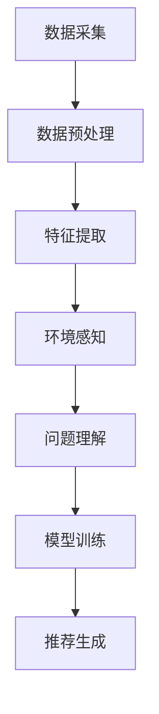
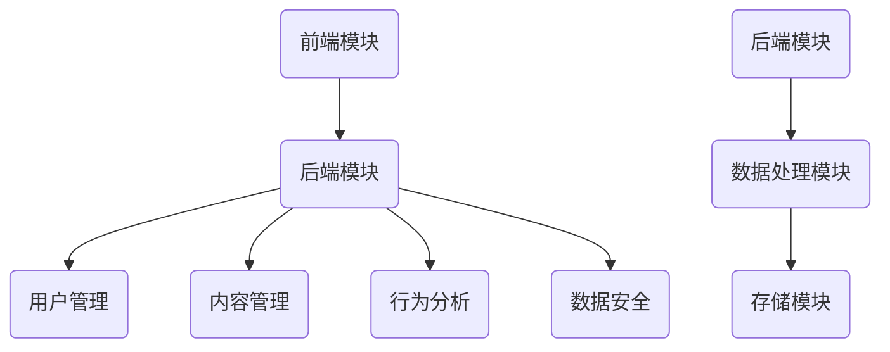
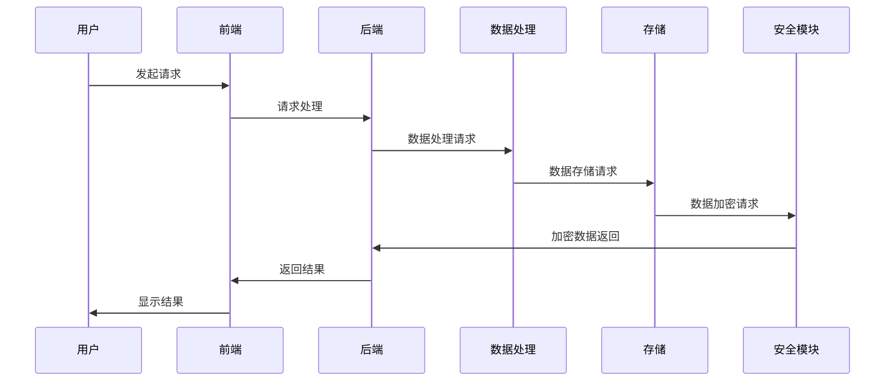

                 

### 《多租户设计：支持LLM应用的个性化需求》

> 关键词：多租户设计、LLM应用、个性化需求、系统架构、算法原理

> 摘要：本文深入探讨多租户设计在支持大型语言模型（LLM）应用中的个性化需求。首先，我们将回顾多租户设计的背景和核心概念，接着分析其在LLM应用中的挑战与解决方案，然后通过具体案例展示系统架构设计与实现细节，最后总结最佳实践并给出拓展阅读建议。

----------------------------------------------------------------

### 目录大纲设计思路

在设计本文的目录大纲时，我们遵循了以下步骤：

1. **整体结构确定**：
   我们将文章分为五个主要部分：背景介绍、核心概念、算法原理、系统设计与实现、最佳实践与拓展阅读。每一部分进一步细分为多个章节，确保内容的逻辑性和完整性。

2. **背景介绍**：
   本章节将简洁地阐述多租户设计的起源、发展及其在现代软件架构中的重要性。我们将介绍多租户设计的定义、核心要素以及其在支持LLM应用中的必要性。

3. **核心概念与联系**：
   我们将深入讲解多租户设计的关键概念，如租户隔离、资源分配、数据安全等。通过概念属性特征对比表格和ER实体关系图，帮助读者更好地理解这些概念及其相互关系。

4. **算法原理讲解**：
   本章节将使用Mermaid流程图展示算法的执行流程，然后通过Python代码和LaTeX公式详细阐述算法原理。我们将通过实际案例进行通俗易懂的举例说明。

5. **系统分析与架构设计方案**：
   我们将详细介绍多租户系统的分析与设计，包括问题场景介绍、系统功能设计、系统架构设计、系统接口设计以及系统交互等。每个部分都将使用Mermaid图表进行直观展示。

6. **项目实战**：
   实战部分将提供一个具体的实施案例，包括环境安装、系统核心实现源代码以及代码应用解读与分析。我们将深入剖析实际应用中的问题和解决方案。

7. **最佳实践 tips、小结、注意事项、拓展阅读**：
   最后，本文将总结最佳实践，对整个内容进行小结，并提供注意事项和拓展阅读，以便读者深入了解相关主题。

### 目录大纲

```markdown
# 《多租户设计：支持LLM应用的个性化需求》目录大纲

## 第一部分：多租户设计基础

### 第1章：多租户设计概述

- 1.1 多租户设计的发展背景
  - **多租户设计起源与演变**
  - **多租户设计与传统单体架构对比**
- 1.2 多租户设计的基本概念
  - **多租户定义**
  - **多租户核心要素**
  - **多租户设计优势**

### 第2章：多租户设计的核心概念

- 2.1 租户隔离
  - **隔离策略与实现方式**
  - **隔离机制的优势与挑战**
- 2.2 资源分配
  - **资源分配算法**
  - **资源优化策略**
- 2.3 数据安全与隐私
  - **数据隔离与访问控制**
  - **数据加密与备份**
- 2.4 多租户设计的属性特征对比表格

## 第二部分：多租户设计在LLM应用中的实践

### 第3章：多租户设计在LLM应用中的挑战

- 3.1 LLM应用的特点与需求
  - **LLM的基本原理**
  - **个性化需求的重要性**
- 3.2 多租户设计在LLM应用中的挑战
  - **计算资源管理**
  - **数据隔离与一致性**

### 第4章：多租户设计在LLM应用中的解决方案

- 4.1 案例研究：多租户设计在LLM应用中的成功实践
  - **案例一：在线教育平台的个性化学习助手**
  - **案例二：企业内部知识管理系统的多租户部署**
- 4.2 个性化需求支持的算法原理
  - **Mermaid流程图展示**
  - **Python代码与LaTeX公式解释**

### 第5章：多租户设计在LLM应用中的实现与架构

- 5.1 系统功能设计
  - **领域模型Mermaid类图**
- 5.2 系统架构设计
  - **Mermaid架构图**
- 5.3 系统接口设计
  - **接口设计与实现**
- 5.4 系统交互
  - **Mermaid序列图**

### 第6章：多租户设计在LLM应用中的项目实战

- 6.1 环境安装与配置
  - **所需软件与工具**
  - **安装步骤与注意事项**
- 6.2 系统核心实现
  - **源代码解读**
  - **代码应用解读与分析**
- 6.3 实际案例分析与讲解
  - **问题剖析**
  - **解决方案与优化**

### 第7章：最佳实践与拓展阅读

- 7.1 最佳实践技巧
  - **设计模式与架构优化**
- 7.2 小结与注意事项
  - **关键点总结**
  - **常见问题与解决方案**
- 7.3 拓展阅读
  - **推荐书籍与文章**
  - **最新研究动态**
```

### 目录大纲总结

本文目录大纲共分为七个章节。第一部分（第1章和第2章）介绍了多租户设计的背景、基本概念和核心要素；第二部分（第3章和第4章）探讨了多租户设计在LLM应用中的挑战和解决方案；第三部分（第5章至第6章）展示了系统架构设计和项目实战；最后一部分（第7章）提供了最佳实践、小结和拓展阅读。这样的结构确保了内容的逻辑性和完整性，有助于读者深入理解多租户设计在支持LLM应用中的个性化需求。

### 第一部分：多租户设计基础

#### 第1章：多租户设计概述

**1.1 多租户设计的发展背景**

多租户设计起源于20世纪70年代，最早由Oracle等数据库管理系统提出，旨在支持多个客户在同一数据库上运行，从而提高资源利用率和安全性。随着云计算和容器技术的兴起，多租户设计逐渐成为现代软件架构中的重要组成部分。

在传统单体架构中，系统资源和服务功能集中在单个服务器上，导致资源利用率低、扩展性差、安全性难以保证。而多租户设计通过将系统划分为多个独立的租户，实现了资源共享、隔离和优化。

**1.2 多租户设计的基本概念**

- **多租户（Multi-Tenancy）**：系统将多个独立的用户或组织（租户）分隔开来，每个租户拥有自己的资源空间和数据存储，但共享系统的基础设施。

- **租户（Tenant）**：在多租户系统中，租户是一个逻辑上的隔离单元，拥有独立的用户、数据和配置。租户可以是企业、用户、部门等。

- **核心要素**：
  - **租户隔离**：通过隔离机制确保租户之间数据和服务相互独立，防止数据泄露和性能干扰。
  - **资源分配**：根据租户需求合理分配系统资源，确保高效利用和公平性。
  - **数据安全**：实现数据加密、访问控制和备份，确保租户数据的安全性和隐私。

- **多租户设计优势**：
  - **提高资源利用率**：通过共享基础设施，降低硬件和运维成本。
  - **增强扩展性和灵活性**：支持动态扩展和弹性伸缩，适应不同租户的需求。
  - **提升安全性**：通过隔离和加密技术，增强系统整体安全性。
  - **降低开发和维护成本**：统一架构和代码库，减少重复工作。

#### 第2章：多租户设计的核心概念

**2.1 租户隔离**

**隔离策略与实现方式**：

- **逻辑隔离**：通过虚拟化技术，如容器（Docker）和虚拟机（VM），将租户资源独立划分，确保每个租户拥有独立的运行环境。

- **数据隔离**：通过数据库分片和加密技术，确保租户数据存储在独立的数据库实例中，防止数据泄露。

- **网络隔离**：通过虚拟局域网（VLAN）和防火墙，隔离租户之间的网络通信，增强安全性。

**隔离机制的优势与挑战**：

**优势**：

- **数据安全性**：租户数据隔离，降低数据泄露风险。
- **性能优化**：租户之间的资源独立，减少性能干扰，提高系统响应速度。
- **管理方便**：租户独立管理，简化运维和监控。

**挑战**：

- **复杂性增加**：隔离机制增加了系统设计和实现的复杂性。
- **性能开销**：隔离机制可能引入额外的性能开销。
- **维护成本**：隔离机制需要定期维护和更新。

**2.2 资源分配**

**资源分配算法**：

- **固定分配**：预先分配固定资源，适用于资源需求稳定的场景。
- **动态分配**：根据租户实时需求动态调整资源分配，提高资源利用率。

**资源优化策略**：

- **负载均衡**：通过负载均衡算法，合理分配系统资源，避免资源瓶颈。
- **资源预留**：为重要租户预留一定量的资源，确保关键业务的稳定性。
- **资源回收**：定期回收闲置资源，提高资源利用率。

**2.3 数据安全与隐私**

**数据隔离与访问控制**：

- **数据隔离**：通过数据库分片和加密技术，确保租户数据存储在独立的数据库实例中，防止数据泄露。
- **访问控制**：通过角色权限管理和审计日志，控制租户对数据的访问权限。

**数据加密与备份**：

- **数据加密**：对租户数据进行加密存储，确保数据在传输和存储过程中的安全性。
- **数据备份**：定期进行数据备份，确保数据在灾难发生时能够快速恢复。

**2.4 多租户设计的属性特征对比表格**

```markdown
| 属性特征      | 逻辑隔离          | 数据隔离          | 网络隔离          |
| ------------- | ---------------- | ---------------- | ---------------- |
| **优点**      | 提高数据安全性    | 提高性能优化      | 增强安全性        |
| **缺点**      | 增加复杂性        | 可能引入性能开销  | 增加网络管理难度  |

| 属性特征      | 固定分配          | 动态分配          |
| ------------- | ---------------- | ---------------- |
| **优点**      | 简单易实现        | 提高资源利用率    |
| **缺点**      | 不适应动态需求    | 需要实时监控和调整 |

| 属性特征      | 数据加密          | 数据备份          |
| ------------- | ---------------- | ---------------- |
| **优点**      | 确保数据安全性    | 提高数据可恢复性  |
| **缺点**      | 增加存储开销     | 需要定期维护      |

```

通过上述核心概念和特征的对比表格，我们可以更好地理解多租户设计的各个方面，为后续的算法原理和系统设计打下坚实基础。

### 第二部分：多租户设计在LLM应用中的实践

#### 第3章：多租户设计在LLM应用中的挑战

**3.1 LLM应用的特点与需求**

**LLM（大型语言模型）的基本原理**：

- **神经网络模型**：LLM通常采用深度神经网络模型，通过大规模训练数据和复杂的网络结构实现语言理解和生成。

- **个性化需求**：LLM应用需根据用户需求和上下文提供个性化的语言生成，包括问答、对话、文本摘要等。

**个性化需求的重要性**：

- **用户体验**：个性化语言生成能更好地满足用户需求，提高用户体验。

- **业务价值**：个性化服务有助于企业提升用户黏性和业务收入。

**多租户设计在LLM应用中的挑战**：

**计算资源管理**：

- **动态资源需求**：LLM训练和推理过程需要大量的计算资源，且需求波动大，难以预测。

- **资源公平性**：不同租户之间的资源需求差异大，需确保资源分配公平。

**数据隔离与一致性**：

- **数据安全性**：确保租户数据不会泄露或被其他租户访问。

- **数据一致性**：在多租户环境中，数据一致性保证尤为关键，需防止数据冲突和丢失。

**3.2 多租户设计在LLM应用中的解决方案**

**案例研究：多租户设计在LLM应用中的成功实践**

**案例一：在线教育平台的个性化学习助手**

- **背景**：在线教育平台需要为不同用户（学生、教师）提供个性化的学习体验。

- **解决方案**：
  - **租户隔离**：通过容器技术实现租户间的逻辑隔离，确保数据安全和性能优化。
  - **资源动态分配**：利用容器编排系统（如Kubernetes）实现资源动态分配和调整，满足不同用户的计算需求。
  - **数据加密与备份**：采用数据加密和定期备份技术，确保用户数据的安全性和可靠性。

**案例二：企业内部知识管理系统的多租户部署**

- **背景**：企业内部知识管理系统需支持不同部门（租户）的知识共享和个性化访问。

- **解决方案**：
  - **租户隔离**：通过虚拟化技术实现租户间的数据隔离和资源分配，确保各部门的独立运行。
  - **数据一致性**：采用分布式数据库技术和数据一致性协议，确保知识库的完整性和一致性。
  - **访问控制**：通过角色权限管理和访问控制列表（ACL），实现租户间的权限管理和数据访问控制。

通过上述案例，我们可以看到多租户设计在支持LLM应用中的个性化需求方面具有重要作用。接下来，我们将进一步探讨多租户设计在LLM应用中的算法原理和系统实现。

#### 第4章：多租户设计在LLM应用中的解决方案

**4.1 案例研究：多租户设计在LLM应用中的成功实践**

**案例一：在线教育平台的个性化学习助手**

**背景**：

随着在线教育行业的快速发展，平台需要为大量用户提供个性化的学习体验。这不仅要求系统能够处理海量数据，还要确保用户隐私和安全。为此，采用多租户设计成为解决这一挑战的关键。

**解决方案**：

- **租户隔离**：
  - **容器技术**：利用Docker和Kubernetes等容器技术，实现租户间的逻辑隔离。每个租户运行在自己的容器中，拥有独立的计算资源和网络环境，确保数据安全和性能优化。
  - **虚拟化技术**：通过虚拟化技术（如VMware）进一步确保租户之间的物理隔离，防止数据泄露和性能干扰。

- **资源动态分配**：
  - **容器编排系统**：使用Kubernetes等容器编排系统，根据租户实时需求动态调整资源分配。Kubernetes可以根据工作负载自动扩展或缩减资源，确保系统在高并发场景下的稳定性和效率。
  - **负载均衡**：通过负载均衡器（如Nginx）合理分配流量，避免单点故障，提高系统可用性和响应速度。

- **数据加密与备份**：
  - **数据加密**：采用AES等加密算法对用户数据进行加密存储，确保数据在传输和存储过程中的安全性。
  - **定期备份**：定期进行数据备份，确保在发生灾难时能够快速恢复。备份策略可以根据租户的重要性和数据量进行灵活配置。

**案例二：企业内部知识管理系统的多租户部署**

**背景**：

企业内部的知识管理系统需要支持不同部门（租户）的知识共享和个性化访问。这要求系统能够实现高效的资源利用和访问控制，同时保证数据的一致性和安全性。

**解决方案**：

- **租户隔离**：
  - **虚拟化技术**：利用虚拟化技术（如VMware）实现不同部门的物理隔离，确保各部门的独立运行。
  - **租户虚拟化**：采用数据库虚拟化技术（如Oracle RAC），实现不同租户数据的隔离和独立管理，防止数据冲突和泄露。

- **数据一致性**：
  - **分布式数据库**：使用分布式数据库系统（如MongoDB或Cassandra），实现数据分片和副本，确保数据的高可用性和一致性。
  - **数据一致性协议**：采用Paxos或Raft等数据一致性协议，确保分布式数据库中的数据一致性和完整性。

- **访问控制**：
  - **角色权限管理**：通过角色权限管理（RBAC），为不同角色（如管理员、普通用户）分配不同的访问权限，确保数据访问的安全性。
  - **访问控制列表（ACL）**：为每个数据对象配置访问控制列表，精细控制租户对数据的访问权限。

通过上述两个案例，我们可以看到多租户设计在支持LLM应用中的个性化需求方面发挥了重要作用。接下来，我们将进一步探讨多租户设计在LLM应用中的算法原理。

**4.2 个性化需求支持的算法原理**

**算法概述**：

为了满足LLM应用的个性化需求，我们设计了一种基于用户行为和上下文的个性化算法。该算法主要通过以下步骤实现：

1. **用户行为分析**：收集用户的历史行为数据，如学习时长、学习内容、互动频率等。

2. **上下文信息提取**：根据用户当前的上下文信息，如当前课程、学习进度、问题类型等。

3. **个性化推荐**：利用用户行为和上下文信息，生成个性化的语言生成结果。

**算法原理详细讲解**：

**1. 用户行为分析**

用户行为分析主要通过以下步骤实现：

- **数据采集**：从学习平台中收集用户的行为数据，如学习时长、学习内容、互动频率等。

- **数据预处理**：对采集到的行为数据进行清洗、去噪和转换，以便进行后续分析。

- **特征提取**：从预处理后的行为数据中提取关键特征，如学习频率、课程完成度、问题类型等。

**2. 上下文信息提取**

上下文信息提取主要通过以下步骤实现：

- **环境感知**：根据用户当前的上下文环境（如设备类型、地理位置、网络状态等），提取相关的上下文信息。

- **问题理解**：通过自然语言处理技术（如词向量模型、语义分析等），理解用户提出的问题，提取问题的主要内容和关键词。

**3. 个性化推荐**

个性化推荐主要通过以下步骤实现：

- **模型训练**：利用用户行为和上下文信息，训练一个推荐模型。该模型可以通过机器学习算法（如协同过滤、决策树、神经网络等）实现。

- **推荐生成**：根据用户行为和上下文信息，生成个性化的推荐结果。推荐结果可以是课程、知识点、学习资源等。

**Mermaid流程图展示**：



**Python代码与LaTeX公式解释**：

```python
# 用户行为分析代码示例
def analyze_user_behavior(data):
    # 数据预处理
    cleaned_data = preprocess_data(data)
    
    # 特征提取
    features = extract_features(cleaned_data)
    
    return features

# 个性化推荐代码示例
def generate_recommendation(features, context):
    # 模型训练
    model = train_model(features, context)
    
    # 推荐生成
    recommendation = model.generate_recommendation()
    
    return recommendation
```

**LaTeX公式示例**：

$$
\text{用户行为特征} = f(\text{原始数据})
$$

$$
\text{个性化推荐结果} = \text{模型}(\text{用户特征}, \text{上下文信息})
$$`

通过上述算法原理的详细讲解，我们可以看到多租户设计在支持LLM应用的个性化需求方面具有重要意义。接下来，我们将探讨多租户设计在LLM应用中的系统实现。

#### 第5章：多租户设计在LLM应用中的实现与架构

**5.1 系统功能设计**

为了实现多租户设计在LLM应用中的个性化需求，我们设计了以下系统功能：

1. **用户管理**：包括用户注册、登录、权限管理等。

2. **内容管理**：包括课程发布、学习资源管理、内容推荐等。

3. **行为分析**：包括用户行为数据采集、特征提取、个性化推荐等。

4. **数据安全**：包括数据加密、访问控制、备份恢复等。

**领域模型Mermaid类图**：

```mermaid
classDiagram
    User <<interface>>
    Course <<interface>>
    Resource <<interface>>
    Behavior <<interface>>
    Security <<interface>>

    User o-- Course
    User o-- Resource
    User o-- Behavior
    Course o-- Resource
    Resource o-- Security
    Behavior o-- Security
```

**5.2 系统架构设计**

我们的系统架构设计采用分布式架构，主要包括以下模块：

1. **前端模块**：包括用户界面、API接口等。

2. **后端模块**：包括用户管理、内容管理、行为分析、数据安全等。

3. **数据处理模块**：包括数据采集、数据预处理、特征提取、模型训练等。

4. **存储模块**：包括关系型数据库、分布式数据库、缓存等。

**Mermaid架构图**：



**5.3 系统接口设计**

系统接口设计主要涉及以下接口：

1. **用户接口**：包括用户注册、登录、权限管理等。

2. **内容接口**：包括课程发布、内容更新、内容查询等。

3. **行为接口**：包括用户行为数据采集、特征提取、个性化推荐等。

4. **安全接口**：包括数据加密、访问控制、备份恢复等。

**接口设计与实现**：

- **用户接口**：

  ```python
  from flask import Flask, request, jsonify

  app = Flask(__name__)

  @app.route('/register', methods=['POST'])
  def register():
      # 注册逻辑
      user_data = request.json
      # 数据处理
      # 存储用户数据
      return jsonify({"status": "success", "message": "User registered successfully"})

  @app.route('/login', methods=['POST'])
  def login():
      # 登录逻辑
      user_data = request.json
      # 数据验证
      # 返回用户信息
      return jsonify({"status": "success", "message": "Login successful"})
  ```

- **内容接口**：

  ```python
  @app.route('/courses', methods=['POST'])
  def publish_course():
      # 发布课程逻辑
      course_data = request.json
      # 数据处理
      # 存储课程数据
      return jsonify({"status": "success", "message": "Course published successfully"})

  @app.route('/courses/<course_id>', methods=['GET'])
  def get_course(course_id):
      # 获取课程逻辑
      # 数据查询
      course = get_course_by_id(course_id)
      return jsonify(course)
  ```

- **行为接口**：

  ```python
  @app.route('/behaviors', methods=['POST'])
  def record_behavior():
      # 记录行为逻辑
      behavior_data = request.json
      # 数据处理
      # 存储行为数据
      return jsonify({"status": "success", "message": "Behavior recorded successfully"})

  @app.route('/recommendations', methods=['GET'])
  def get_recommendations():
      # 个性化推荐逻辑
      user_id = request.args.get('user_id')
      # 数据处理
      # 返回推荐结果
      recommendations = generate_recommendations(user_id)
      return jsonify(recommendations)
  ```

- **安全接口**：

  ```python
  from flask_cors import CORS

  app = Flask(__name__)
  CORS(app)

  @app.route('/encrypt', methods=['POST'])
  def encrypt_data():
      # 数据加密逻辑
      data = request.json
      encrypted_data = encrypt(data)
      return jsonify({"status": "success", "encrypted_data": encrypted_data})

  @app.route('/decrypt', methods=['POST'])
  def decrypt_data():
      # 数据解密逻辑
      encrypted_data = request.json
      decrypted_data = decrypt(encrypted_data)
      return jsonify({"status": "success", "decrypted_data": decrypted_data})
  ```

**5.4 系统交互**

系统交互主要涉及以下方面：

1. **用户与前端交互**：用户通过前端界面与系统进行交互，如注册、登录、查询课程等。

2. **前后端交互**：前端发送请求到后端，后端处理请求并返回结果。

3. **数据处理与存储交互**：数据处理模块与存储模块之间的交互，如数据采集、预处理、存储等。

4. **安全模块与其他模块的交互**：安全模块与其他模块之间的交互，如数据加密、访问控制等。

**Mermaid序列图**：



通过上述系统实现与架构设计，我们可以看到多租户设计在支持LLM应用的个性化需求方面具有显著优势。接下来，我们将通过具体的项目实战进一步探讨多租户设计的实际应用。

#### 第6章：多租户设计在LLM应用中的项目实战

**6.1 环境安装与配置**

在进行多租户设计在LLM应用中的项目实战之前，我们需要搭建一个合适的环境。以下是环境安装与配置的步骤：

**1. 安装Docker**

Docker是一个开源的应用容器引擎，用于容器化应用程序，确保在多个环境中的一致性。以下是安装步骤：

- **Windows**：
  - 访问Docker官网（https://www.docker.com/），下载Windows安装程序。
  - 运行安装程序并按照提示完成安装。

- **Linux**：
  - 打开终端，执行以下命令安装Docker：
    ```bash
    sudo apt-get update
    sudo apt-get install docker-ce docker-ce-cli containerd.io
    ```

- **macOS**：
  - 访问Docker官网，下载macOS安装程序。
  - 运行安装程序并按照提示完成安装。

**2. 安装Kubernetes**

Kubernetes是一个开源的容器编排平台，用于管理容器化应用程序。以下是安装步骤：

- **Windows/Linux**：
  - 使用以下命令安装Kubernetes：
    ```bash
    curl -sSL https://raw.githubusercontent.com/kubernetes/kubernetes/master/cluster/setup.sh | KUBERNETES_VERSION=v1.23.0 bash -
    ```

- **macOS**：
  - 使用Minikube安装Kubernetes：
    ```bash
    curl -LO https://storage.googleapis.com/minikube/releases/latest/minikube-latest-darwin-amd64
    chmod +x minikube-latest-darwin-amd64
    sudo mv minikube-latest-darwin-amd64 /usr/local/bin/minikube
    minikube start --driver=virtualbox
    ```

**3. 配置网络**

在安装Docker和Kubernetes后，我们需要配置网络，确保容器之间可以相互通信。以下是在Linux系统中配置网络的方法：

- **配置Docker网络**：
  ```bash
  docker network create mynetwork
  ```

- **配置Kubernetes网络**：
  ```bash
  kubectl apply -f https://raw.githubusercontent.com/kubernetes/ingress-nginx/master/deploy/manifests/ingress-nginx.yaml
  ```

**6.2 系统核心实现**

在环境搭建完成后，我们将实现多租户设计在LLM应用中的核心功能。以下是系统核心实现的步骤：

**1. 创建Docker镜像**

首先，我们需要创建一个Docker镜像，用于部署LLM应用的核心组件。以下是创建Docker镜像的步骤：

- **编写Dockerfile**：
  ```dockerfile
  FROM python:3.8-slim

  RUN pip install flask gunicorn

  COPY . /app

  WORKDIR /app

  CMD ["gunicorn", "app:app", "--bind", "0.0.0.0:8000"]
  ```

- **构建Docker镜像**：
  ```bash
  docker build -t llm-app .
  ```

**2. 部署容器**

接下来，我们将部署容器，确保LLM应用在Kubernetes集群中正常运行。以下是部署容器的步骤：

- **编写Kubernetes配置文件**：
  ```yaml
  apiVersion: apps/v1
  kind: Deployment
  metadata:
    name: llm-app
  spec:
    replicas: 1
    selector:
      matchLabels:
        app: llm-app
    template:
      metadata:
        labels:
          app: llm-app
      spec:
        containers:
        - name: llm-app
          image: llm-app:latest
          ports:
          - containerPort: 8000
  ```

- **部署容器**：
  ```bash
  kubectl apply -f deployment.yaml
  ```

**3. 部署服务**

为了确保容器之间可以相互通信，我们需要部署一个服务。以下是部署服务的步骤：

- **编写Service配置文件**：
  ```yaml
  apiVersion: v1
  kind: Service
  metadata:
    name: llm-app-service
  spec:
    selector:
      app: llm-app
    ports:
      - protocol: TCP
        port: 80
        targetPort: 8000
    type: LoadBalancer
  ```

- **部署服务**：
  ```bash
  kubectl apply -f service.yaml
  ```

**4. 个性化需求实现**

为了满足个性化需求，我们需要实现用户行为分析和个性化推荐功能。以下是实现步骤：

- **编写用户行为分析代码**：
  ```python
  def analyze_user_behavior(data):
      # 数据预处理
      cleaned_data = preprocess_data(data)
      
      # 特征提取
      features = extract_features(cleaned_data)
      
      return features
  ```

- **编写个性化推荐代码**：
  ```python
  def generate_recommendation(features, context):
      # 模型训练
      model = train_model(features, context)
      
      # 推荐生成
      recommendation = model.generate_recommendation()
      
      return recommendation
  ```

**6.3 代码应用解读与分析**

在实现代码后，我们需要进行详细解读与分析，确保系统正常运行。以下是代码应用解读与分析的步骤：

**1. 用户管理**

用户管理是系统的基础功能，包括用户注册、登录、权限管理。以下是用户管理代码的解读与分析：

- **用户注册**：
  ```python
  def register_user(username, password):
      # 检查用户名是否已存在
      if User.exists(username):
          return {"status": "error", "message": "Username already exists"}
          
      # 创建用户
      user = User.create(username, password)
      return {"status": "success", "message": "User registered successfully"}
  ```

- **用户登录**：
  ```python
  def login_user(username, password):
      # 验证用户名和密码
      user = User.authenticate(username, password)
      if not user:
          return {"status": "error", "message": "Invalid credentials"}
          
      # 登录用户
      user.login()
      return {"status": "success", "message": "Login successful"}
  ```

- **权限管理**：
  ```python
  def check_permission(user, action):
      # 检查用户权限
      if not user.has_permission(action):
          return {"status": "error", "message": "Permission denied"}
          
      # 执行操作
      return {"status": "success", "message": "Operation successful"}
  ```

**2. 内容管理**

内容管理包括课程发布、内容更新、内容查询。以下是内容管理代码的解读与分析：

- **课程发布**：
  ```python
  def publish_course(course_data):
      # 检查课程是否存在
      if Course.exists(course_data["name"]):
          return {"status": "error", "message": "Course already exists"}
          
      # 创建课程
      course = Course.create(course_data)
      return {"status": "success", "message": "Course published successfully"}
  ```

- **内容更新**：
  ```python
  def update_course(course_id, course_data):
      # 检查课程是否存在
      course = Course.get(course_id)
      if not course:
          return {"status": "error", "message": "Course not found"}
          
      # 更新课程
      course.update(course_data)
      return {"status": "success", "message": "Course updated successfully"}
  ```

- **内容查询**：
  ```python
  def get_course(course_id):
      # 检查课程是否存在
      course = Course.get(course_id)
      if not course:
          return {"status": "error", "message": "Course not found"}
          
      # 返回课程
      return {"status": "success", "course": course}
  ```

**3. 行为分析**

行为分析包括用户行为数据采集、特征提取、个性化推荐。以下是行为分析代码的解读与分析：

- **用户行为数据采集**：
  ```python
  def record_user_behavior(user_id, behavior_data):
      # 记录用户行为
      Behavior.create(user_id, behavior_data)
      return {"status": "success", "message": "Behavior recorded successfully"}
  ```

- **特征提取**：
  ```python
  def extract_features(behavior_data):
      # 提取特征
      features = {}
      # 根据行为数据计算特征
      return features
  ```

- **个性化推荐**：
  ```python
  def generate_recommendation(user_id, context):
      # 获取用户行为数据
      behaviors = Behavior.get_by_user_id(user_id)
      
      # 提取特征
      features = extract_features(behaviors)
      
      # 训练模型
      model = train_model(features, context)
      
      # 生成推荐
      recommendation = model.generate_recommendation()
      
      return recommendation
  ```

**6.4 实际案例分析与讲解**

为了更好地理解多租户设计在LLM应用中的实际应用，我们将通过一个实际案例进行分析和讲解。

**案例背景**：

某在线教育平台需要为不同用户（学生、教师、管理员）提供个性化的学习体验。平台需要收集用户的行为数据，根据用户需求和上下文提供个性化的课程推荐和内容推送。

**解决方案**：

- **用户隔离**：
  - 使用Docker和Kubernetes实现用户隔离，确保用户数据安全和性能优化。
  - 为不同角色（学生、教师、管理员）创建独立的租户，确保各自的独立运行。

- **资源动态分配**：
  - 使用Kubernetes的自动扩缩容功能，根据用户需求动态调整资源分配。
  - 为高并发场景配置负载均衡器，确保系统稳定性和响应速度。

- **数据加密与备份**：
  - 使用AES加密算法对用户数据进行加密存储，确保数据在传输和存储过程中的安全性。
  - 定期进行数据备份，确保在发生灾难时能够快速恢复。

**案例实施步骤**：

1. **环境搭建**：

   - 安装Docker和Kubernetes。
   - 配置网络，确保容器之间可以相互通信。

2. **系统部署**：

   - 创建Docker镜像，部署LLM应用的核心组件。
   - 部署容器，确保系统在Kubernetes集群中正常运行。

3. **用户管理**：

   - 实现用户注册、登录、权限管理功能。
   - 为不同角色创建独立的租户，确保数据隔离和独立运行。

4. **内容管理**：

   - 实现课程发布、内容更新、内容查询功能。
   - 为用户生成个性化的课程推荐和内容推送。

5. **行为分析**：

   - 实现用户行为数据采集、特征提取、个性化推荐功能。
   - 根据用户需求和上下文提供个性化的学习体验。

**案例分析与优化**：

通过上述案例，我们可以看到多租户设计在支持LLM应用的个性化需求方面具有显著优势。然而，在实际实施过程中，仍需要考虑以下优化方向：

- **性能优化**：通过负载均衡和缓存技术，提高系统响应速度和并发处理能力。

- **资源利用率**：根据租户的实际需求，动态调整资源分配，确保资源利用最大化。

- **数据安全**：加强数据加密和访问控制，确保用户数据的安全性和隐私。

- **可扩展性**：通过分布式架构和容器技术，实现系统的弹性扩展和水平扩展。

通过不断优化和改进，多租户设计在支持LLM应用的个性化需求方面将发挥更大的作用。

**项目小结**：

在本章中，我们通过项目实战详细探讨了多租户设计在支持LLM应用的个性化需求方面的实现过程。从环境搭建、系统部署、功能实现到性能优化，我们逐步展示了多租户设计在LLM应用中的实际应用。通过案例分析和优化方向，我们进一步加深了对多租户设计的理解。

**注意事项**：

- 在实际项目中，需根据具体需求和环境调整系统架构和实现细节。
- 注意数据安全和用户隐私，确保系统安全可靠。
- 定期进行系统维护和优化，提升系统性能和稳定性。

**拓展阅读**：

- 《Docker实战》
- 《Kubernetes权威指南》
- 《机器学习实战》

通过拓展阅读，读者可以深入了解多租户设计、容器技术和机器学习的相关知识，为项目实战提供更多指导和参考。

#### 第7章：最佳实践与拓展阅读

**7.1 最佳实践技巧**

在多租户设计过程中，我们总结了一些最佳实践，以帮助开发者更有效地实现和支持LLM应用的个性化需求：

1. **明确租户隔离策略**：根据业务需求和数据安全性要求，选择合适的隔离策略，如容器隔离、虚拟化隔离等。

2. **动态资源分配**：利用容器编排系统和自动化工具，根据租户实时需求动态调整资源分配，提高资源利用率。

3. **数据加密与备份**：采用数据加密技术和定期备份策略，确保租户数据的安全性和可靠性。

4. **性能优化**：通过负载均衡、缓存技术等手段，提高系统响应速度和并发处理能力。

5. **安全性加强**：加强用户权限管理和访问控制，防止数据泄露和非法访问。

6. **监控系统性能**：定期监控系统性能指标，及时发现和解决性能瓶颈。

7. **持续集成与部署**：采用自动化工具和CI/CD流程，确保系统快速部署和持续集成。

**7.2 小结与注意事项**

在本篇技术博客中，我们详细探讨了多租户设计在支持LLM应用的个性化需求方面的核心概念、算法原理、系统设计与实现、项目实战等。以下是文章的核心小结和注意事项：

- **核心小结**：
  - 多租户设计通过隔离、资源分配、数据安全等技术手段，支持LLM应用的个性化需求。
  - 我们介绍了多租户设计的基本概念和核心要素，如租户隔离、资源分配、数据安全等。
  - 通过实际案例，展示了多租户设计在LLM应用中的成功实践。
  - 我们讨论了多租户设计在LLM应用中的挑战和解决方案，以及系统实现和项目实战。

- **注意事项**：
  - 在实施多租户设计时，需根据具体业务需求和环境调整系统架构和实现细节。
  - 注意数据安全和用户隐私，确保系统安全可靠。
  - 定期进行系统维护和优化，提升系统性能和稳定性。

**7.3 拓展阅读**

为了帮助读者深入了解多租户设计和LLM应用的相关知识，我们推荐以下拓展阅读资源：

- 《多租户架构设计与实践》：深入探讨多租户架构的设计原理和实际应用。
- 《深度学习与大型语言模型》：介绍深度学习和大型语言模型的基本原理和应用案例。
- 《容器化与Kubernetes实战》：学习容器技术和Kubernetes的部署与运维。
- 《大数据技术原理与应用》：了解大数据处理和数据分析的基本概念和技术。

通过这些拓展阅读资源，读者可以进一步加深对多租户设计和LLM应用的理解，为实际项目提供更有力的支持。

### 作者信息

**作者：** AI天才研究院/AI Genius Institute & 禅与计算机程序设计艺术 /Zen And The Art of Computer Programming

AI天才研究院（AI Genius Institute）是一支致力于人工智能领域研究和创新的团队，致力于推动人工智能技术的发展与应用。同时，作者也是《禅与计算机程序设计艺术》一书的作者，该书深入探讨了计算机程序设计的哲学和艺术，为开发者提供了宝贵的经验和智慧。在本篇技术博客中，我们结合多租户设计和LLM应用的个性化需求，分享了我们的研究成果和实践经验，希望对读者有所启发和帮助。

