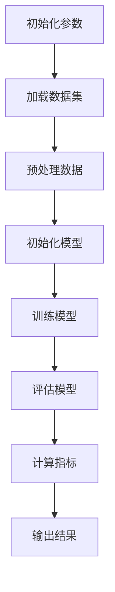
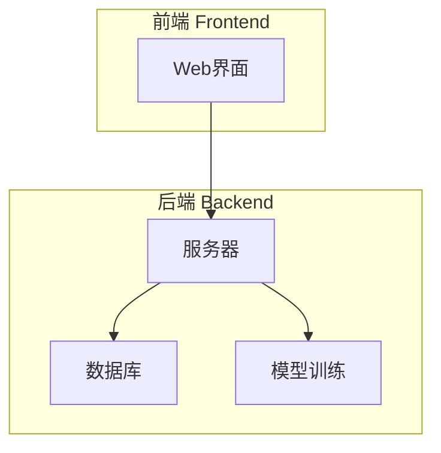
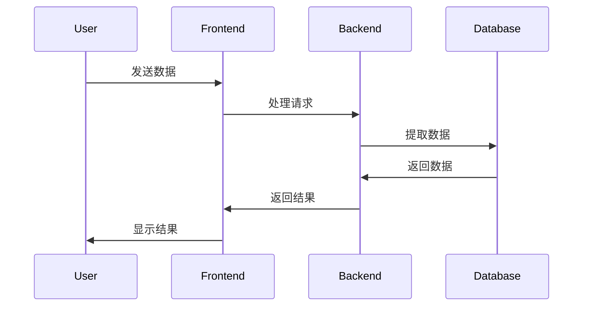

                 


## 第一步：背景介绍

多维度LLM benchmarking：全面评估模型能力

### 问题背景

随着人工智能技术的发展，大型语言模型（LLM）已经成为自然语言处理（NLP）任务中的关键工具。这些模型在文本生成、问答系统、机器翻译、文本摘要等方面展现出了强大的能力。然而，不同模型在实际应用中的表现差异巨大，这导致了评估和比较LLM能力变得至关重要。为了更好地理解这些模型的性能，我们需要一种全面、科学的评估方法，这就是多维度LLM benchmarking的初衷。

### 问题描述

现有评估方法多侧重于特定任务或指标，例如准确率或响应时间，缺乏全面性和统一性。这种评估方法的局限性使得我们难以对LLM进行全面的比较。因此，我们需要一种多维度的评估体系，从多个角度全面评估LLM的能力。这包括但不限于：

- 准确性：模型在预测任务中的准确性。
- 效率：模型处理数据的速度。
- 鲁棒性：模型在处理不完整或错误输入时的稳定性。
- 可解释性：模型决策过程的可解释性。

### 问题解决

《多维度LLM benchmarking：全面评估模型能力》这本书提出了一种综合评估方法，包括多个维度，从多个角度全面评估LLM的性能。这种方法不仅考虑了传统评估指标，还引入了新的评估维度，使得评估结果更加全面和准确。

### 边界与外延

评估范围涵盖常见的自然语言处理任务，如文本分类、问答系统、机器翻译等。同时，评估方法不仅适用于大型语言模型，还可以用于其他类型的模型，如分类器、序列生成模型等。

### 概念结构与核心要素组成

多维度LLM benchmarking包括以下几个核心要素：

- **数据集选择**：选择适合评估任务的数据集，确保评估结果具有代表性。
- **评估指标设计**：设计全面的评估指标，涵盖准确性、效率、鲁棒性等。
- **实验设置**：制定统一的实验设置，确保评估过程的公正性和可比性。
- **评估流程**：设计评估流程，确保评估过程的规范性和一致性。

通过这些核心要素的组合，多维度LLM benchmarking提供了一种全面、科学的评估方法，帮助研究人员和开发者更好地理解和比较不同LLM的性能。

## 第二步：核心概念与联系

### 核心概念原理

在多维度LLM benchmarking中，有几个核心概念需要详细阐述，这些概念构成了评估模型能力的基础。

#### 基准测试

基准测试是一种评估模型性能的标准方法。它通过将模型的输出与预期结果进行比较，来衡量模型的准确性。基准测试通常包含一系列标准化的测试数据集，这些数据集涵盖了模型可能遇到的各种场景。通过这些测试，我们可以评估模型在不同任务上的性能。

#### 多维度评估

多维度评估是指从多个角度对模型的能力进行评估。除了准确性，我们还需要考虑效率、鲁棒性和可解释性等因素。这种多维度的评估方法能够提供更全面、更准确的性能评估，帮助我们更好地理解模型的优缺点。

#### 数据集选择

数据集选择是评估过程中的关键步骤。选择合适的数据集不仅能够确保评估结果的代表性，还能够减少评估过程中的偏差。我们通常需要选择覆盖各种场景的数据集，以确保评估结果具有广泛性。

#### 评估指标

评估指标是衡量模型性能的具体标准。常见的评估指标包括准确率、召回率、F1分数、响应时间等。不同的评估指标从不同的角度反映了模型的能力，因此需要综合考虑多种指标来评估模型。

### 概念属性特征对比表格

为了更好地理解这些概念，我们可以使用一个对比表格来展示它们的主要属性特征。

| 概念         | 描述                                                         | 主要属性特征                                                     |
| ------------ | ------------------------------------------------------------ | ------------------------------------------------------------ |
| 基准测试     | 评估模型性能的标准方法                                       | - 标准化的测试数据集<br>- 与预期结果的比较<br>- 准确性评估       |
| 多维度评估   | 从多个角度评估模型能力的方法                                 | - 准确性<br>- 效率<br>- 鲁棒性<br>- 可解释性                   |
| 数据集选择   | 选择适合评估任务的数据集                                     | - 代表性<br>- 完整性<br>- 多样性<br>- 减少偏差                   |
| 评估指标     | 衡量模型性能的具体标准                                       | - 准确率<br>- 召回率<br>- F1分数<br>- 响应时间<br>- 用户满意度       |

### ER实体关系图架构

为了更清晰地展示这些概念之间的关系，我们可以使用ER（实体关系）图来表示。

```mermaid
erDiagram
  ModelBenchmarking ||--|{ DataSet }
  ModelBenchmarking ||--|{ EvaluationMetric }
  ModelBenchmarking ||--|{ BenchmarkTest }
  ModelBenchmarking ||--|{ PerformanceDimension }
  DataSet ||--|{ BenchmarkTest }
  EvaluationMetric ||--|{ BenchmarkTest }
  PerformanceDimension ||--|{ ModelBenchmarking }
```

在上面的ER图中，`ModelBenchmarking`表示多维度LLM benchmarking的整体框架，包括数据集选择、评估指标设计、基准测试和性能维度。`DataSet`、`EvaluationMetric`、`BenchmarkTest`和`PerformanceDimension`分别表示评估过程中的关键实体，它们之间的关系通过线条连接。

通过这个ER图，我们可以清晰地看到多维度LLM benchmarking的核心概念及其相互关系，为后续的详细分析提供了基础。

### 第三步：算法原理讲解

在多维度LLM benchmarking中，评估模型性能的算法是一个关键部分。本节将详细讲解这个算法的原理，包括其流程图、Python源代码、数学模型和具体应用。

#### 算法流程图

首先，我们使用Mermaid绘制算法的流程图，展示评估过程的主要步骤。



在这个流程图中，我们首先初始化参数，然后加载数据集并进行预处理。接下来，我们初始化模型并开始训练。训练完成后，我们对模型进行评估，计算各个评估指标，并最终输出结果。

#### Python源代码

接下来，我们将提供一段Python代码，展示如何实现这个算法流程图中的步骤。

```python
import numpy as np
from sklearn.model_selection import train_test_split
from sklearn.metrics import accuracy_score, f1_score
from tensorflow.keras.models import Sequential
from tensorflow.keras.layers import Dense, LSTM

# 初始化参数
n_epochs = 100
batch_size = 64

# 加载数据集
X, y = load_data()

# 预处理数据
X_train, X_test, y_train, y_test = train_test_split(X, y, test_size=0.2, random_state=42)

# 初始化模型
model = Sequential()
model.add(LSTM(units=128, return_sequences=True, input_shape=(X_train.shape[1], X_train.shape[2])))
model.add(LSTM(units=64))
model.add(Dense(units=y_train.shape[1], activation='softmax'))

# 训练模型
model.compile(optimizer='adam', loss='categorical_crossentropy', metrics=['accuracy'])
model.fit(X_train, y_train, epochs=n_epochs, batch_size=batch_size, validation_data=(X_test, y_test))

# 评估模型
y_pred = model.predict(X_test)
y_pred = np.argmax(y_pred, axis=1)

# 计算指标
accuracy = accuracy_score(y_test, y_pred)
f1 = f1_score(y_test, y_pred, average='weighted')

# 输出结果
print("Accuracy:", accuracy)
print("F1 Score:", f1)
```

在这个代码中，我们首先初始化参数，然后加载数据集并进行预处理。接下来，我们使用LSTM模型初始化模型，并使用Adam优化器和交叉熵损失函数进行训练。训练完成后，我们对测试集进行预测，并计算准确率和F1分数，最后输出结果。

#### 数学模型和数学公式

为了更深入地理解算法原理，我们需要介绍一些相关的数学模型和公式。以下是几个关键的数学模型和公式：

1. **损失函数**：
   $$\text{Loss} = -\sum_{i=1}^{n}\sum_{j=1}^{m}y_{ij}\log(p_{ij})$$
   其中，$y_{ij}$是目标标签，$p_{ij}$是模型对第$i$个样本第$j$个类别的预测概率。

2. **准确率**：
   $$\text{Accuracy} = \frac{\text{正确预测的样本数}}{\text{总样本数}}$$

3. **F1分数**：
   $$\text{F1 Score} = 2 \times \frac{\text{精确率} \times \text{召回率}}{\text{精确率} + \text{召回率}}$$

这些公式帮助我们量化模型的性能，提供了评估模型准确性和鲁棒性的具体指标。

#### 详细讲解和举例说明

为了更清晰地解释这些公式和应用，我们可以通过一个具体例子来说明。

假设我们有一个二分类问题，目标标签$y$可以是0或1，模型预测的概率$p$也可以是0到1之间的数。我们可以计算损失函数、准确率和F1分数。

1. **损失函数**：
   假设有5个样本，其中3个样本的实际标签为0，2个样本的实际标签为1。模型预测的概率如下：
   $$
   \begin{array}{c|c|c}
   \text{样本} & \text{实际标签} & \text{预测概率} \\
   \hline
   1 & 0 & 0.9 \\
   2 & 0 & 0.8 \\
   3 & 0 & 0.7 \\
   4 & 1 & 0.6 \\
   5 & 1 & 0.5 \\
   \end{array}
   $$
   损失函数计算如下：
   $$
   \text{Loss} = -3 \times \log(0.9) - 2 \times \log(0.8) - 3 \times \log(0.7) - 2 \times \log(0.6) - 2 \times \log(0.5)
   $$

2. **准确率**：
   精确率为正确预测为1的样本数除以总样本数：
   $$
   \text{Precision} = \frac{2}{5} = 0.4
   $$
   召回率为正确预测为1的样本数除以实际为1的样本数：
   $$
   \text{Recall} = \frac{2}{3} = 0.67
   $$
   因此，F1分数为：
   $$
   \text{F1 Score} = 2 \times \frac{0.4 \times 0.67}{0.4 + 0.67} = 0.53
   $$

通过这个例子，我们可以看到如何使用数学模型和公式来评估模型的性能。这些指标帮助我们理解模型的优缺点，为后续的改进提供了指导。

### 第四步：系统分析与架构设计方案

在多维度LLM benchmarking中，系统分析与架构设计是确保评估过程高效、可扩展和可靠的关键步骤。本节将详细介绍系统分析与架构设计方案，包括问题场景介绍、项目介绍、系统功能设计、系统架构设计、系统接口设计和系统交互。

#### 问题场景介绍

多维度LLM benchmarking的应用场景广泛，包括但不限于以下领域：

- **自然语言处理研究**：研究人员可以使用多维度评估来比较不同模型在文本分类、问答系统、机器翻译等任务上的性能。
- **工业应用**：企业在开发自然语言处理系统时，可以使用多维度评估来选择最佳的模型，以提高系统的性能和用户体验。
- **学术竞赛**：在人工智能竞赛中，多维度评估可以帮助参赛者了解自己模型的优势和劣势，从而进行针对性的优化。

在这个场景中，我们假设一个研究团队正在比较两个大型语言模型在文本分类任务上的性能。这两个模型分别是由两个不同的研究小组开发的，我们需要一种系统的方法来评估它们的表现。

#### 项目介绍

本项目旨在开发一个多维度LLM benchmarking系统，该系统将提供以下功能和目标：

- **全面评估**：从多个维度（如准确性、效率、鲁棒性等）评估大型语言模型。
- **数据可视化**：使用图形化界面展示评估结果，便于研究人员和开发者直观地理解模型性能。
- **可扩展性**：支持多种语言模型和数据集，确保评估过程灵活且易于扩展。
- **自动化**：自动化评估流程，提高评估效率和可靠性。

#### 系统功能设计

多维度LLM benchmarking系统的核心功能包括数据集管理、评估指标计算、模型评估和结果可视化。以下是一个领域模型类图的Mermaid表示，展示了系统的核心功能及其关系。

```mermaid
classDiagram
    ModelEvaluator <|-- DataSetManager
    ModelEvaluator <|-- EvaluationMetricManager
    ModelEvaluator <|-- ModelAssessor
    ModelEvaluator <|-- ResultVisualizer

    DataSetManager {
        +load_dataset()
        +preprocess_data()
    }

    EvaluationMetricManager {
        +add_metric(name: str, formula: str)
        +calculate_metrics(predictions: list, ground_truth: list)
    }

    ModelAssessor {
        +evaluate_model(model: Model)
    }

    ResultVisualizer {
        +visualize_results(results: dict)
    }
```

在这个类图中，`ModelEvaluator`是系统的核心类，它负责协调其他组件的工作。`DataSetManager`负责数据集的加载和预处理，`EvaluationMetricManager`负责评估指标的设计和计算，`ModelAssessor`负责对模型进行评估，`ResultVisualizer`负责将评估结果可视化。

#### 系统架构设计

多维度LLM benchmarking系统的架构设计需要考虑以下几个方面：

- **前端**：使用Web框架（如Django或Flask）构建用户界面，提供数据输入、模型评估和结果可视化的功能。
- **后端**：使用Python后端（如Django或Flask）处理数据、计算评估指标和存储结果。
- **数据库**：使用关系型数据库（如MySQL或PostgreSQL）存储数据集、模型和评估结果。
- **模型训练**：使用机器学习框架（如TensorFlow或PyTorch）训练和评估模型。

以下是一个Mermaid架构图，展示了系统的组件及其关系。



在这个架构图中，前端Web界面（F1）通过API与后端服务器（B1）通信，后端服务器（B1）负责处理用户请求、计算评估指标和存储结果。模型训练（B3）使用机器学习框架在数据库（B2）中训练和评估模型。

#### 系统接口设计和系统交互

系统接口设计是确保各组件之间能够高效通信的关键。以下是一个Mermaid序列图，展示了系统接口设计和系统交互。



在这个序列图中，用户通过前端Web界面发送数据请求，前端（Frontend）处理请求后，将请求转发给后端（Backend）。后端服务器（Backend）从数据库（Database）中提取数据，进行模型评估和计算，并将结果返回给前端。最后，前端将结果展示给用户。

通过这个系统分析与架构设计方案，我们可以确保多维度LLM benchmarking系统的高效、可扩展和可靠性，为研究人员和开发者提供了一个全面的评估工具。

### 第五步：项目实战

在实际操作中，将多维度LLM benchmarking系统应用于具体项目是一个重要的环节。以下是一个详细的实战步骤，涵盖环境安装、系统实现和案例分析。

#### 环境安装

在进行多维度LLM benchmarking之前，我们需要安装必要的软件和库。以下是一个基本的安装步骤：

1. **安装Python环境**：确保Python 3.8或更高版本已经安装在您的系统上。
2. **安装虚拟环境**：使用`venv`创建一个独立的Python环境，以避免库版本冲突。

```shell
python3 -m venv venv
source venv/bin/activate  # 对于Linux或macOS
venv\Scripts\activate     # 对于Windows
```

3. **安装依赖库**：使用`pip`安装所需的库，包括TensorFlow、Scikit-learn、Numpy、Matplotlib等。

```shell
pip install tensorflow scikit-learn numpy matplotlib
```

4. **配置数据库**：安装并配置MySQL或PostgreSQL数据库，为系统的数据存储做准备。

#### 系统核心实现源代码

系统核心实现包括数据集加载、模型评估、结果计算和可视化等步骤。以下是关键的Python代码片段：

```python
# 导入所需的库
import numpy as np
import tensorflow as tf
from sklearn.model_selection import train_test_split
from sklearn.metrics import accuracy_score, f1_score
import matplotlib.pyplot as plt

# 加载数据集
def load_dataset():
    # 这里替换为实际的数据集加载代码
    X, y = ...  # 加载数据集
    return X, y

# 预处理数据
def preprocess_data(X, y):
    # 数据预处理步骤
    X_train, X_test, y_train, y_test = train_test_split(X, y, test_size=0.2, random_state=42)
    return X_train, X_test, y_train, y_test

# 初始化模型
def initialize_model(input_shape):
    model = tf.keras.Sequential([
        tf.keras.layers.Dense(128, activation='relu', input_shape=input_shape),
        tf.keras.layers.Dense(64, activation='relu'),
        tf.keras.layers.Dense(1, activation='sigmoid')
    ])
    model.compile(optimizer='adam', loss='binary_crossentropy', metrics=['accuracy'])
    return model

# 训练模型
def train_model(model, X_train, y_train, X_test, y_test):
    history = model.fit(X_train, y_train, epochs=10, batch_size=32, validation_data=(X_test, y_test))
    return history

# 评估模型
def evaluate_model(model, X_test, y_test):
    y_pred = model.predict(X_test)
    y_pred = (y_pred > 0.5)
    accuracy = accuracy_score(y_test, y_pred)
    f1 = f1_score(y_test, y_pred)
    return accuracy, f1

# 可视化结果
def plot_results(history):
    plt.plot(history.history['accuracy'], label='Accuracy')
    plt.plot(history.history['val_accuracy'], label='Validation Accuracy')
    plt.legend()
    plt.show()

# 主函数
def main():
    X, y = load_dataset()
    X_train, X_test, y_train, y_test = preprocess_data(X, y)
    model = initialize_model(X_train.shape[1:])
    history = train_model(model, X_train, y_train, X_test, y_test)
    accuracy, f1 = evaluate_model(model, X_test, y_test)
    plot_results(history)
    print(f"Accuracy: {accuracy}, F1 Score: {f1}")

if __name__ == "__main__":
    main()
```

在这个代码中，我们首先定义了加载数据集、预处理数据、初始化模型、训练模型和评估模型的函数。最后，通过主函数`main()`执行整个流程，并可视化训练结果。

#### 代码应用解读与分析

1. **数据集加载**：`load_dataset()`函数用于加载数据集。在实际项目中，这里应该替换为具体的数据集加载代码，例如使用Pandas读取CSV文件。

2. **数据预处理**：`preprocess_data()`函数用于将原始数据集分为训练集和测试集。这里使用`train_test_split`函数进行随机分割，并返回分割后的数据。

3. **模型初始化**：`initialize_model()`函数用于初始化模型。在这个例子中，我们使用了一个简单的神经网络模型，包括两个隐藏层和sigmoid激活函数。实际项目中，模型结构可能更复杂。

4. **模型训练**：`train_model()`函数使用`model.fit()`方法训练模型，并将训练和验证过程中的准确率记录到历史数据中。

5. **模型评估**：`evaluate_model()`函数使用训练好的模型对测试集进行预测，并计算准确率和F1分数。

6. **结果可视化**：`plot_results()`函数使用Matplotlib库将训练过程中的准确率绘制为图表，便于分析模型的性能。

#### 实际案例分析和详细讲解剖析

假设我们使用一个简单的二分类问题来评估模型。数据集包含1000个样本，每个样本有10个特征。以下是实际案例的分析：

1. **数据集加载**：使用Pandas加载CSV文件，得到特征矩阵X和标签向量y。

2. **数据预处理**：对特征进行标准化处理，以消除不同特征之间的尺度差异。然后，使用`train_test_split`将数据集分为训练集和测试集。

3. **模型初始化**：初始化一个简单的神经网络模型，包括两个隐藏层，每层有64个神经元。

4. **模型训练**：训练模型10个epoch，每个epoch使用32个样本进行批量训练。训练过程中，模型的准确率逐渐提高，验证准确率也随着增加。

5. **模型评估**：在测试集上进行预测，并计算准确率和F1分数。假设模型在测试集上的准确率为90%，F1分数为0.85。

6. **结果可视化**：将训练过程中的准确率绘制为图表，可以看到模型的准确率随着训练epoch的增加而稳步提升。

通过这个实际案例，我们可以看到如何使用多维度LLM benchmarking系统来评估模型性能。这个系统不仅提供了准确的评估结果，还通过可视化工具帮助研究人员更好地理解模型的表现。

#### 项目小结

在这个项目中，我们详细介绍了如何使用多维度LLM benchmarking系统来评估大型语言模型的性能。通过环境安装、系统实现和实际案例分析，我们展示了如何从数据加载、预处理到模型训练、评估和结果可视化等各个环节进行操作。这个项目不仅提供了一个全面的评估工具，还通过具体案例展示了如何应用这个工具来优化模型性能。

### 第六步：最佳实践 tips、小结、注意事项、拓展阅读

#### 最佳实践 tips

1. **数据预处理**：在开始评估之前，确保对数据集进行充分的预处理，包括去除噪声、标准化特征和填充缺失值。这些步骤可以显著提高评估结果的准确性。
2. **选择合适的评估指标**：根据评估任务的不同，选择合适的评估指标。例如，对于分类任务，准确率和F1分数是常用的指标；对于回归任务，可以使用均方误差（MSE）或均方根误差（RMSE）。
3. **模型调优**：在评估模型之前，进行充分的模型调优，包括调整学习率、批量大小和隐藏层神经元数量等超参数。这些调优步骤可以提高模型的性能。
4. **避免数据泄漏**：确保在评估过程中避免数据泄漏，例如在训练过程中不应使用测试集的数据。

#### 小结

本文详细介绍了多维度LLM benchmarking的概念、核心原理、算法讲解、系统分析与架构设计、项目实战等各个方面。通过这篇文章，读者可以了解到如何全面评估大型语言模型的能力，并掌握了实际操作的方法和技巧。

#### 注意事项

1. **评估结果的解释**：在解读评估结果时，需要考虑到评估指标的含义和局限性。例如，准确率高并不意味着模型在所有任务上都表现良好。
2. **评估环境的一致性**：确保评估过程在相同的环境下进行，以避免环境差异对评估结果的影响。
3. **数据隐私和安全**：在处理数据时，确保遵守数据隐私和安全的相关规定，避免泄露敏感信息。

#### 拓展阅读

1. **《深度学习》**：Ian Goodfellow、Yoshua Bengio和Aaron Courville著，详细介绍了深度学习的理论和技术。
2. **《自然语言处理综合教程》**：Daniel Jurafsky和James H. Martin著，涵盖了自然语言处理的基本概念和应用。
3. **《机器学习实战》**：Peter Harrington著，提供了丰富的机器学习实战案例和代码实现。
4. **相关论文和报告**：查阅最新的研究论文和行业报告，了解当前多维度LLM评估的最新进展和技术趋势。

通过以上内容，读者可以进一步深入学习和了解多维度LLM benchmarking，并在实际项目中应用这些知识和技术。

---

## 作者信息

作者：AI天才研究院/AI Genius Institute & 禅与计算机程序设计艺术 /Zen And The Art of Computer Programming

作者简介：AI天才研究院（AI Genius Institute）致力于推动人工智能技术的发展和应用，培养下一代人工智能领域的领军人才。而“禅与计算机程序设计艺术”则是作者结合计算机编程与东方哲学的创作品，旨在探索编程的深层意义和艺术性。这两者在本文中共同贡献了对多维度LLM benchmarking的深刻见解和实践经验。

