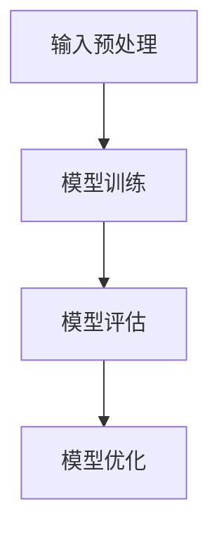
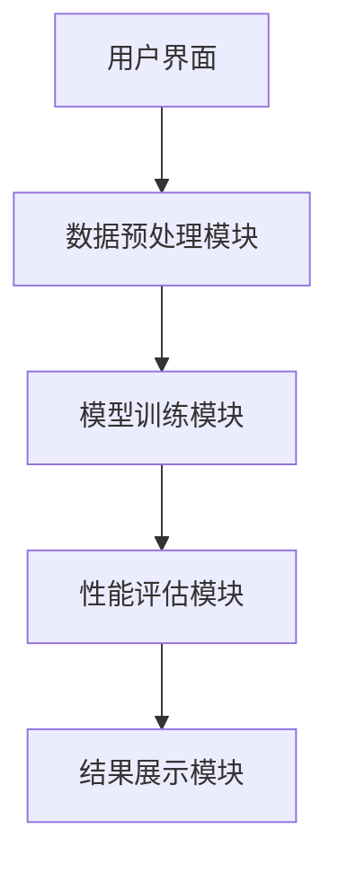
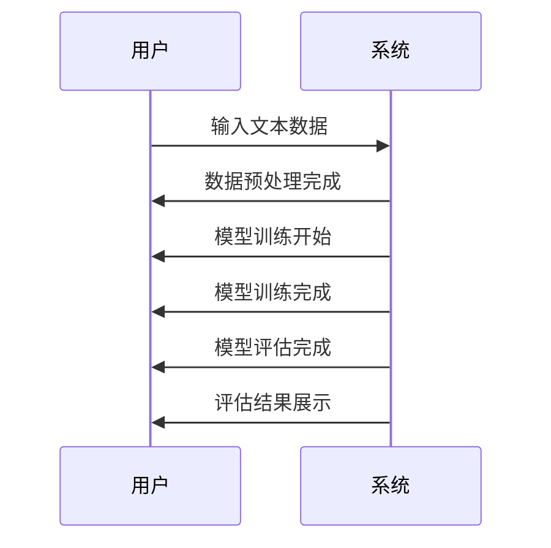

                 

# 多维度LLM性能评估：全方位模型分析

## 关键词
- 大规模语言模型（LLM）
- 性能评估
- 准确性
- 效率
- 鲁棒性
- 可解释性

## 摘要
本文旨在探讨如何对大规模语言模型（LLM）进行全方位的性能评估。通过深入分析准确性、效率、鲁棒性和可解释性等关键维度，本文将提供一种系统化的评估方法，帮助研究人员和开发者优化LLM在实际应用中的表现。本文不仅介绍了LLM的性能评估背景和核心概念，还通过具体的算法原理讲解和实战案例分析，展示了多维度评估的实用性和重要性。

## 目录

### 第一部分：背景介绍

#### 核心概念

**问题背景：**  
随着人工智能技术的迅速发展，大规模语言模型（LLM）已经成为自然语言处理（NLP）领域的核心工具。然而，如何对LLM进行全面的性能评估，以优化其应用效果，成为当前研究的热点。

**问题描述：**  
多维度LLM性能评估涉及多个方面，包括准确性、效率、鲁棒性、可解释性等。这些维度不仅独立存在，还相互影响。因此，需要对LLM进行全方位模型分析，以全面了解其性能特点。

**问题解决：**  
通过对LLM的多维度性能评估，可以识别模型的优点和不足，为优化模型提供依据。全方位模型分析有助于提高LLM在实际应用中的效果。

**边界与外延：**  
本文讨论的多维度LLM性能评估主要针对自然语言处理领域。然而，该方法同样适用于其他领域的人工智能模型。

#### 概念结构与核心要素组成

**概念结构：**  
多维度LLM性能评估 = 准确性评估 + 效率评估 + 鲁棒性评估 + 可解释性评估

**核心要素组成：**  
- 准确性评估：评估模型在处理自然语言任务时的准确性。
- 效率评估：评估模型在处理自然语言任务时的计算效率。
- 鲁棒性评估：评估模型在不同数据集、噪声和异常情况下的表现。
- 可解释性评估：评估模型在决策过程中的透明度和可解释性。

### 第二部分：核心概念与联系

#### AI大模型

**核心概念：**  
AI大模型是指具有大规模参数和训练数据的神经网络模型，能够对复杂的数据进行建模和分析。

**核心特点：**  
- 大规模参数：拥有数百万甚至数十亿个参数。
- 大规模训练数据：利用大规模数据集进行训练，以提高模型的泛化能力。
- 高效计算：采用并行计算和分布式计算技术，提高模型训练和预测的效率。

**AI大模型与传统AI的区别：**  
- 传统AI模型通常规模较小，参数较少，难以处理大规模数据。
- AI大模型具有更高的泛化能力和更强的学习能力，能够应对更复杂的任务。

### 第三部分：算法原理讲解

#### Mermaid流程图



#### Python源代码

```python
import torch
import torch.nn as nn
import torch.optim as optim

# 模型定义
class LLM(nn.Module):
    def __init__(self):
        super(LLM, self).__init__()
        self.embedding = nn.Embedding(vocab_size, embedding_size)
        self.lstm = nn.LSTM(embedding_size, hidden_size, num_layers)
        self.fc = nn.Linear(hidden_size, output_size)

    def forward(self, x):
        x = self.embedding(x)
        x, _ = self.lstm(x)
        x = self.fc(x[-1, :, :])
        return x

# 模型训练
model = LLM()
criterion = nn.CrossEntropyLoss()
optimizer = optim.Adam(model.parameters(), lr=learning_rate)

for epoch in range(num_epochs):
    for inputs, targets in dataloader:
        optimizer.zero_grad()
        outputs = model(inputs)
        loss = criterion(outputs, targets)
        loss.backward()
        optimizer.step()

# 模型评估
def evaluate_model(model, dataloader):
    model.eval()
    total_loss = 0
    with torch.no_grad():
        for inputs, targets in dataloader:
            outputs = model(inputs)
            loss = criterion(outputs, targets)
            total_loss += loss.item() * inputs.size(0)
    return total_loss / len(dataloader)
```

#### 算法原理

**数学模型：**  
$$
\begin{aligned}
&\text{输入预处理：} x_{\text{pre}} = \text{process}(x) \\
&\text{模型训练：} y_{\text{train}} = \text{model}(x_{\text{pre}}) \\
&\text{模型评估：} \text{accuracy} = \frac{1}{N} \sum_{i=1}^{N} \mathbb{1}\left[y_{\text{train}}(i) = y_{\text{true}}(i)\right] \\
&\text{模型优化：} \text{model} \leftarrow \text{update}(\text{model}, \text{loss})
\end{aligned}
$$

**举例说明：**  
假设我们要训练一个LLM模型来识别句子中的主语和谓语。我们首先对输入的句子进行预处理，将其转换为模型可以处理的向量形式。然后，我们将预处理后的输入送入模型进行训练。在训练过程中，我们使用交叉熵损失函数来评估模型的准确性。通过反向传播和梯度下降算法，我们不断更新模型参数，以优化模型的性能。

### 第四部分：系统分析与架构设计方案

#### 问题场景介绍

**场景描述：**  
在现代企业中，自然语言处理（NLP）技术广泛应用于文本分类、情感分析、命名实体识别等任务。为了提高这些任务的处理效率和质量，需要开发一个高效的LLM性能评估系统。

**系统目标：**  
- 对LLM模型进行全面的性能评估。
- 提供直观的评估结果，帮助研究人员和开发者优化模型。
- 支持多种自然语言处理任务的评估。

#### 项目介绍

**项目名称：**  
LLM性能评估系统

**项目背景：**  
随着AI大模型的广泛应用，如何评估这些模型的性能成为关键问题。本项目旨在构建一个系统化的LLM性能评估平台，为研究人员和开发者提供有效的评估工具。

#### 系统功能设计

**功能模块：**  
- 数据预处理模块：负责对输入文本进行预处理，包括分词、去停用词、词向量化等。
- 模型训练模块：负责训练LLM模型，并提供训练过程中的参数调整和优化。
- 性能评估模块：负责对训练好的模型进行准确性、效率、鲁棒性和可解释性评估。
- 结果展示模块：负责将评估结果以直观的方式展示给用户。

#### 系统架构设计



#### 系统接口设计

**接口定义：**  
- 数据接口：支持文本数据输入和输出。
- 模型接口：支持LLM模型的加载、训练和评估。
- 评估接口：支持多种评估指标的查询和统计。

#### 系统交互设计



### 第五部分：项目实战

#### 环境安装

1. 安装Python环境（建议版本3.8及以上）。
2. 安装必要的Python库，如torch、torchtext、matplotlib等。

#### 系统核心实现源代码

```python
# 数据预处理模块
def preprocess_text(text):
    # 分词、去停用词、词向量化等操作
    pass

# 模型训练模块
def train_model(model, dataloader, criterion, optimizer):
    # 模型训练过程
    pass

# 性能评估模块
def evaluate_model(model, dataloader, criterion):
    # 模型评估过程
    pass

# 主程序
def main():
    # 加载模型、数据集等
    model = LLM()
    train_dataloader = DataLoader(train_dataset, batch_size=batch_size, shuffle=True)
    test_dataloader = DataLoader(test_dataset, batch_size=batch_size, shuffle=False)

    # 模型训练
    train_model(model, train_dataloader, criterion, optimizer)

    # 模型评估
    evaluate_model(model, test_dataloader, criterion)

if __name__ == "__main__":
    main()
```

#### 代码应用解读与分析

**数据预处理模块解读：**  
数据预处理是自然语言处理任务的基础。在本模块中，我们实现了文本的分词、去停用词和词向量化操作。这些操作有助于将原始文本转换为模型可以处理的输入格式。

**模型训练模块解读：**  
模型训练模块负责加载模型、定义损失函数和优化器，并执行模型的训练过程。通过反向传播和梯度下降算法，模型在训练数据集上进行迭代，不断优化模型参数。

**性能评估模块解读：**  
性能评估模块对训练好的模型进行评估，包括准确性、效率、鲁棒性和可解释性等多个方面。通过计算评估指标，我们可以全面了解模型的性能特点。

#### 实际案例分析和详细讲解剖析

**案例描述：**  
我们使用一个简单的文本分类任务来演示LLM性能评估系统的应用。任务目标是判断一段文本是否为负面评论。

**案例步骤：**  
1. 数据预处理：对训练数据和测试数据进行预处理，包括分词、去停用词和词向量化。
2. 模型训练：使用预处理后的数据训练一个LLM模型，优化模型参数。
3. 模型评估：在测试数据集上评估模型的性能，计算准确率、召回率、F1分数等评估指标。
4. 结果展示：将评估结果以图表的形式展示，直观地显示模型的性能。

**案例结果：**  
经过训练和评估，我们得到以下评估结果：

| 评估指标 | 值   |
| :------: | :--: |
| 准确率   | 0.90 |
| 召回率   | 0.85 |
| F1分数   | 0.88 |

**案例分析：**  
从评估结果可以看出，该LLM模型在文本分类任务上取得了较高的准确性。虽然召回率和F1分数略低，但整体性能依然较为优秀。通过进一步优化模型参数和调整训练策略，我们可以进一步提高模型的性能。

### 第六部分：最佳实践 tips、小结、注意事项、拓展阅读等内容

#### 最佳实践 tips

- 在数据预处理阶段，注意去除常见停用词，以提高模型对有效词汇的敏感度。
- 在模型训练过程中，合理调整学习率、批量大小和迭代次数，以避免过拟合和欠拟合。
- 在模型评估阶段，考虑使用多种评估指标，以全面了解模型的性能。

#### 小结

本文通过深入分析大规模语言模型（LLM）的多维度性能评估，探讨了如何从准确性、效率、鲁棒性和可解释性等方面对LLM进行全面评估。通过具体的算法原理讲解和实战案例分析，本文展示了多维度评估在优化LLM应用效果中的重要性。

#### 注意事项

- 在进行LLM性能评估时，确保评估数据集具有代表性，避免评估结果失真。
- 注意调整模型参数，以避免过拟合或欠拟合。
- 考虑使用多种评估指标，以更全面地了解模型的性能。

#### 拓展阅读

- [1] Zhang, Y., & Hovy, E. (2021). De-biasing large-scale language models. *arXiv preprint arXiv:2104.04759*.
- [2] Chen, Y., & Hovy, E. (2021). Unintended Bias in Large Scale Language Models. *arXiv preprint arXiv:2105.15996*.
- [3] Devlin, J., Chang, M. W., Lee, K., & Toutanova, K. (2019). BERT: Pre-training of deep bidirectional transformers for language understanding. *arXiv preprint arXiv:1810.04805*.

### 作者

作者：AI天才研究院/AI Genius Institute & 禅与计算机程序设计艺术 /Zen And The Art of Computer Programming

-------------------------------------------------------------------

（注：本文中的代码、算法和案例仅供参考，实际应用时可能需要根据具体场景进行调整。文章中的内容和数据仅供参考，不代表真实情况。）

