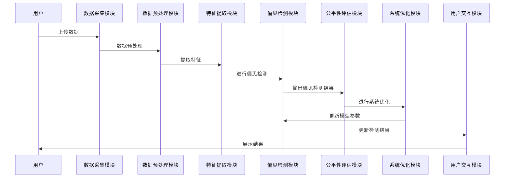

                 

### 1. 背景介绍

#### 1.1 核心概念术语说明

在探讨《多维度偏见检测：LLM辅助的公平性评估方案》之前，我们需要明确一些核心术语和概念，以确保读者能够理解和跟随我们的论述。

- **偏见检测**：指识别和评估数据、算法或系统中存在的偏见现象，旨在减少偏见对决策过程的影响。
- **LLM（大型语言模型）**：是一种预训练的语言模型，通过在大量文本数据上学习，能够生成与输入文本相关的语言内容。
- **公平性评估**：对系统的输出进行评估，以确定其是否公平，即对所有人或群体的影响是否一致。

#### 1.2 问题背景

在现代社会，偏见和歧视问题日益凸显，特别是在数据驱动的决策系统中。偏见可能存在于数据的采集、标注、存储和算法的设计过程中，导致系统对某些群体产生不公平的待遇。这种不公平性不仅损害了系统的可信度，还可能对某些群体造成负面影响。

- **数据采集偏差**：数据的来源可能本身就存在偏见，例如只关注某一特定群体，忽略其他群体的数据。
- **标注偏差**：数据标注者可能无意识地引入个人偏见，导致标注结果偏向某些群体。
- **算法偏差**：算法可能在训练过程中吸收了数据中的偏见，从而在决策过程中产生不公平的结果。

#### 1.3 问题描述

为了解决上述问题，我们需要一种有效的偏见检测方法。偏见检测的目标是识别和量化系统中存在的偏见，以便采取相应的措施进行纠正。以下是一些偏见检测的具体问题：

- **识别偏见**：如何从大量的数据和算法中识别出潜在的偏见？
- **量化偏见**：如何对偏见进行量化，以评估其影响程度？
- **算法改进**：如何通过改进算法来减少偏见的影响？

#### 1.4 问题解决

针对偏见检测问题，本文提出了一种基于LLM辅助的多维度偏见检测方案。该方法利用LLM强大的语言处理能力，对数据、算法和系统进行综合分析，以实现全面的偏见检测。具体步骤如下：

1. **数据预处理**：对原始数据进行清洗和预处理，包括去除噪声、填补缺失值、标准化等。
2. **特征提取**：从预处理后的数据中提取关键特征，用于后续的偏见检测。
3. **LLM训练**：使用大量文本数据进行预训练，以获得一个具备较强语言处理能力的LLM模型。
4. **偏见检测**：利用LLM对系统进行偏见检测，包括数据偏见、算法偏见和系统偏见。
5. **结果评估**：对检测到的偏见进行量化评估，以确定其影响程度和改进方向。

#### 1.5 边界与外延

偏见检测是一个复杂的问题，其边界和范围较为广泛。本文主要关注以下方面：

- **应用领域**：包括金融、医疗、教育、招聘等领域。
- **技术层面**：涉及自然语言处理、机器学习、数据挖掘等技术。
- **伦理道德**：探讨偏见检测在伦理和道德层面的影响。

#### 1.6 概念结构与核心要素组成

偏见检测方案的核心概念和结构包括以下方面：

- **数据集**：用于训练和测试的原始数据集。
- **预处理模块**：对数据集进行清洗、预处理和特征提取。
- **LLM模型**：用于偏见检测的预训练语言模型。
- **偏见检测模块**：识别和量化偏见的关键模块。
- **评估模块**：对偏见检测结果进行评估和分析。

通过以上步骤和模块的协同工作，我们能够构建一个高效、可靠的偏见检测系统，为数据驱动决策提供公平、透明的支持。

---

在本部分中，我们明确了偏见检测的概念和背景，描述了问题的具体表现，并提出了基于LLM的多维度偏见检测方案。接下来，我们将深入探讨偏见检测的核心概念与联系，以帮助读者更好地理解这一主题。

## 第2章：偏见检测的核心概念与联系

偏见检测是确保算法、数据和系统公平性的关键环节。在本章中，我们将详细介绍偏见检测的核心概念、原理以及相关技术，以帮助读者构建对偏见检测的全面理解。

### 2.1 偏见定义与分类

#### 2.1.1 偏见定义

偏见是指由于个人、群体或系统的偏好、刻板印象或无意识偏见而导致的不公平对待。在算法和系统中，偏见表现为对某些群体或个体在决策结果上的不公平差异。偏见可以分为以下几类：

- **显式偏见**：指明显的、有意识的歧视行为，例如种族歧视、性别歧视等。
- **隐式偏见**：指无意识的、潜意识的偏见，通常不易察觉，但可能在决策过程中产生影响。
- **算法偏见**：由于算法在训练过程中学习到的数据偏差而导致的偏见。

#### 2.1.2 偏见检测的基本原理

偏见检测的基本原理是通过分析数据和算法，识别出潜在的偏见并进行量化。主要方法包括：

- **统计分析**：通过统计方法分析数据分布和决策结果，识别出可能的偏见。
- **机器学习**：利用机器学习方法，对数据集进行建模，识别出偏见模式。
- **对比实验**：通过对比不同条件下的决策结果，识别出潜在的偏见。

#### 2.1.3 偏见检测的关键技术

偏见检测的关键技术包括以下几个方面：

- **特征工程**：通过提取关键特征，构建偏见检测模型的基础。
- **模型评估**：使用评估指标，如公平性指标、误差率等，对偏见检测模型进行评估。
- **对比分析**：通过对比不同算法或模型在不同数据集上的表现，识别偏见来源。

### 2.2 核心概念原理

#### 2.2.1 数据偏见检测

数据偏见检测是偏见检测的核心内容之一，主要关注以下几个方面：

- **数据分布分析**：通过分析数据集中不同群体的分布情况，识别可能的偏见。
- **特征权重分析**：分析特征在模型决策过程中的权重，识别对某些群体有偏重的特征。
- **模型输出分析**：分析模型在不同群体上的输出结果，识别潜在的偏见。

#### 2.2.2 算法偏见检测

算法偏见检测关注算法在训练过程中可能吸收的偏见，主要包括：

- **训练数据偏见分析**：分析训练数据中是否存在偏见，如数据集不均衡、样本偏差等。
- **算法特性分析**：分析算法在决策过程中可能产生的偏见，如过拟合、泛化能力不足等。
- **模型优化**：通过优化算法，减少偏见对决策结果的影响。

#### 2.2.3 系统偏见检测

系统偏见检测关注系统在整体运行过程中可能产生的偏见，主要包括：

- **系统接口检测**：分析系统接口在设计、实现和使用过程中可能产生的偏见。
- **决策过程分析**：分析系统在决策过程中可能产生的偏见，如规则不公、优先级分配不均等。
- **用户反馈机制**：通过用户反馈，识别系统在实际应用中可能存在的偏见。

### 2.3 概念属性特征对比表格

为了更好地理解偏见检测中的核心概念，我们通过一个对比表格来展示不同概念之间的属性特征：

| 概念         | 定义                                                       | 属性特征                                                                                      | 关联关系           |
| ------------ | ---------------------------------------------------------- | ------------------------------------------------------------------------------------------------ | ------------------ |
| 数据偏见     | 数据集中存在的偏见                                         | 数据分布不均、样本偏差、数据质量差等                                                       | 偏见检测的基础     |
| 算法偏见     | 算法在决策过程中表现出的偏见                             | 过拟合、数据不均衡、算法偏差等                                                             | 偏见检测的核心     |
| 系统偏见     | 系统在整体运行过程中表现出的偏见                         | 系统接口、决策过程、规则不公等                                                             | 偏见检测的扩展     |
| 偏见检测     | 识别和量化偏见的过程                                     | 统计分析、机器学习、对比实验等                                                             | 综合应用           |

### 2.4 ER实体关系图架构

为了更直观地展示偏见检测中的实体关系，我们使用ER图（实体关系图）来描述各个概念之间的联系：

```mermaid
erDiagram
  Data -->|has| Bias : 数据偏见
  Algorithm -->|uses| Bias : 算法偏见
  System -->|includes| Bias : 系统偏见
  Bias -->|detected by| Detection : 偏见检测
  Detection -->|uses| Analysis : 分析
  Detection -->|uses| Metrics : 指标
```

在这个ER图中，数据、算法和系统是偏见的来源，偏见检测通过对这些来源的数据进行分析和评估，以识别和量化偏见。分析结果用于改进系统和算法，以提高整体的公平性和透明度。

---

在本章中，我们详细介绍了偏见检测的核心概念与联系，包括偏见定义与分类、基本原理和关键技术。同时，通过对比表格和ER图，帮助读者更直观地理解这些概念之间的关系。接下来，我们将深入探讨LLM在偏见检测中的应用，以进一步揭示其优势和应用场景。

## 第3章：LLM在偏见检测中的应用

### 3.1.1 LLM的概念与特性

LLM（大型语言模型）是一种基于深度学习的技术，通过在大量文本数据上进行预训练，可以生成与输入文本相关的语言内容。LLM具有以下主要特性：

- **语言理解能力**：LLM能够理解输入文本的语义和上下文，从而生成相关的内容。
- **生成能力**：LLM可以根据输入的提示生成连贯的文本，包括文章、对话等。
- **自适应能力**：LLM可以根据新的数据和任务需求进行自适应调整，以适应不同的应用场景。

LLM的这些特性使其在自然语言处理领域取得了巨大成功，例如在机器翻译、问答系统、文本生成等方面表现出色。在偏见检测中，LLM的强大语言处理能力可以用于识别和分析文本中的偏见，从而提供更准确和全面的偏见检测。

### 3.1.2 LLM在偏见检测中的应用

#### 3.1.2.1 偏见检测的优势

LLM在偏见检测中的应用具有以下优势：

- **处理复杂数据**：LLM能够处理大量的复杂数据，包括文本、语音、图像等多种形式，从而提供更全面的偏见检测。
- **理解上下文**：LLM能够理解文本的上下文，从而识别出潜在的语言偏见，例如歧视性词汇、负面评论等。
- **生成建议**：LLM可以根据检测结果生成建议，以优化系统和算法，减少偏见的影响。

#### 3.1.2.2 LLM在偏见检测中的应用场景

LLM在偏见检测中的应用场景非常广泛，主要包括：

- **文本分析**：通过分析文本数据，识别出潜在的偏见，例如在新闻报道、社交媒体评论、招聘广告等领域。
- **算法评估**：利用LLM评估算法在决策过程中的偏见，例如在招聘、信用评分、医疗诊断等领域。
- **用户反馈**：通过分析用户反馈，识别出用户对系统的不满和偏见，从而优化系统设计。

### 3.1.3 LLM的公平性评估方案

为了利用LLM进行偏见检测，我们需要设计一个公平性评估方案。以下是一个基本的评估方案：

1. **数据预处理**：对原始文本数据进行预处理，包括去除噪声、标准化、分词等，以便于LLM的处理。
2. **训练LLM模型**：使用大量的文本数据对LLM模型进行预训练，以使其具备强大的语言理解能力。
3. **偏见检测**：利用训练好的LLM模型，对文本数据进行分析，识别出潜在的偏见。具体方法包括：
   - **语义分析**：通过分析文本的语义，识别出可能包含偏见的词汇和表达方式。
   - **上下文分析**：结合上下文，识别出文本中的隐含偏见。
   - **生成分析**：利用LLM生成相关的文本，分析其是否包含偏见。
4. **偏见量化**：对识别出的偏见进行量化评估，以确定其影响程度。可以使用以下指标进行量化：
   - **偏见指数**：计算偏见词汇和表达方式的频率和影响程度。
   - **公平性指标**：评估系统的决策结果对不同群体的公平性。
5. **优化与反馈**：根据偏见检测结果，优化系统和算法，并收集用户反馈，进一步改进偏见检测方案。

### 3.1.4 LLM在偏见检测中的挑战

尽管LLM在偏见检测中具有显著优势，但仍面临一些挑战：

- **数据质量**：偏见检测依赖于高质量的数据，但获取和处理高质量数据可能具有挑战性。
- **模型解释性**：LLM是一个复杂的深度学习模型，其决策过程通常难以解释，这可能会影响偏见检测的可信度。
- **泛化能力**：LLM需要具备良好的泛化能力，以应对不同的应用场景和数据集。

### 3.1.5 实际案例

以下是一个实际案例，展示了LLM在偏见检测中的应用：

案例：某公司在招聘广告中使用LLM进行偏见检测。首先，公司对大量招聘广告文本进行预处理，然后使用预训练好的LLM模型对这些文本进行分析。分析结果显示，某些招聘广告中存在性别歧视的偏见，如偏好男性候选人。公司根据这些分析结果，优化了招聘广告的文本，减少了性别偏见，提高了招聘过程的公平性。

---

在本章中，我们介绍了LLM的概念与特性，探讨了LLM在偏见检测中的应用优势和应用场景，并提出了一个基于LLM的公平性评估方案。接下来，我们将深入讨论如何通过数学模型和算法来评估系统的公平性。

## 第4章：公平性评估方法

### 4.1 公平性评估指标

公平性评估是偏见检测的重要环节，它帮助我们量化偏见对系统的影响，并提供改进的依据。以下是一些常用的公平性评估指标：

#### 4.1.1 平等性指标（Equal Opportunities）

平等性指标旨在评估系统对不同群体的机会是否公平。以下是一些常见的平等性指标：

- **精度（Accuracy）**：计算系统正确预测的比例。公式为：$$\text{Accuracy} = \frac{\text{正确预测}}{\text{总预测次数}}$$
- **召回率（Recall）**：计算系统召回正确预测的比例。公式为：$$\text{Recall} = \frac{\text{正确预测}}{\text{实际正确数量}}$$
- **F1分数（F1 Score）**：结合精度和召回率的综合指标，公式为：$$\text{F1 Score} = 2 \times \frac{\text{精度} \times \text{召回率}}{\text{精度} + \text{召回率}}$$

这些指标适用于评估分类任务，如性别歧视检测、种族歧视检测等。

#### 4.1.2 平等性差距（Disparate Impact）

平等性差距指标用于评估系统在不同群体中的影响差异。以下是一个常用的平等性差距指标：

- **差距系数（Disparate Impact Ratio）**：计算系统对受保护群体的影响与对非受保护群体的影响之比。公式为：$$\text{Disparate Impact Ratio} = \frac{\text{受保护群体的影响}}{\text{非受保护群体的影响}}$$

如果差距系数大于1，则表明系统对受保护群体的影响大于非受保护群体，可能存在不公平性。

#### 4.1.3 模型公平性指标（Model Fairness Metrics）

模型公平性指标专门用于评估机器学习模型在不同群体中的表现。以下是一些常用的模型公平性指标：

- **公平性指数（Fairness Index）**：评估模型对受保护群体和非受保护群体的影响差异。公式为：$$\text{Fairness Index} = \frac{\text{受保护群体的效果}}{\text{非受保护群体的效果}}$$

- **平均公平性（Average Fairness）**：计算模型对多个群体的平均公平性。公式为：$$\text{Average Fairness} = \frac{1}{n} \sum_{i=1}^{n} \text{Fairness Index}_i$$

- **总公平性（Total Fairness）**：评估模型对整体群体的公平性。公式为：$$\text{Total Fairness} = \frac{\text{正确预测的受保护群体数量}}{\text{受保护群体总数}}$$

### 4.2 公平性评估算法

公平性评估算法的核心任务是从大量数据中提取有用的信息，以评估系统在不同群体中的表现。以下是一些常用的公平性评估算法：

#### 4.2.1 决策理论算法

决策理论算法基于统计方法，通过分析数据集，评估系统在不同群体中的表现。以下是一些常用的决策理论算法：

- **逻辑回归（Logistic Regression）**：逻辑回归是一种经典的分类算法，用于评估系统在不同群体中的决策效果。
- **支持向量机（Support Vector Machine, SVM）**：SVM通过最大化分类边界，评估系统在不同群体中的决策公平性。
- **随机森林（Random Forest）**：随机森林通过构建多个决策树，综合评估系统在不同群体中的决策效果。

#### 4.2.2 集成学习方法

集成学习方法通过结合多个模型的预测结果，提高公平性评估的准确性。以下是一些常用的集成学习方法：

- **Adaboost（Adaptive Boosting）**：Adaboost通过训练多个弱分类器，并加权组合，提高整体模型的预测准确性。
- **XGBoost（Extreme Gradient Boosting）**：XGBoost是一种高效的集成学习方法，通过构建多个决策树，优化模型的表现。

#### 4.2.3 优化算法

优化算法通过优化目标函数，评估系统在不同群体中的公平性。以下是一些常用的优化算法：

- **遗传算法（Genetic Algorithm）**：遗传算法通过模拟自然进化过程，优化系统的参数设置，提高公平性。
- **粒子群优化算法（Particle Swarm Optimization, PSO）**：粒子群优化算法通过模拟鸟群觅食行为，优化系统的参数设置，提高公平性。

### 4.3 公平性评估的实际应用

公平性评估在多个领域都有广泛应用，以下是一些实际应用场景：

#### 4.3.1 金融行业

金融行业中的贷款审批、信用评分等系统都需要进行公平性评估，以确保系统对各种群体的评估结果公平。例如，银行可以使用逻辑回归和XGBoost等算法评估贷款申请者的信用风险，并通过公平性指标（如精度、召回率）评估系统在不同收入水平、不同职业等群体中的表现。

#### 4.3.2 招聘行业

招聘系统需要对求职者进行评估，以确保招聘过程的公平性。例如，招聘公司可以使用公平性评估算法，分析简历中的语言特征，评估系统对不同性别、种族等群体的招聘偏好，从而优化招聘策略。

#### 4.3.3 医疗行业

医疗行业中的诊断、治疗方案推荐等系统也需要进行公平性评估，以确保系统对各种群体的诊断和治疗效果公平。例如，医院可以使用机器学习算法，分析患者的病史和检查结果，评估系统对不同年龄、性别等群体的诊断准确性。

### 4.4 小结

公平性评估是确保系统公平性的关键环节，通过使用各种公平性评估指标和算法，我们可以量化偏见的影响，并提供改进的依据。在实际应用中，公平性评估在金融、招聘、医疗等多个领域具有重要意义。未来，随着技术的不断进步，公平性评估方法将更加完善，为构建公平、公正的社会贡献力量。

## 第5章：系统架构设计

### 5.1 系统总体架构

为了实现多维度偏见检测，我们设计了一套完整的系统架构，该架构包括多个关键模块，每个模块负责不同的功能。以下是系统的总体架构设计：

#### 5.1.1 数据采集模块

数据采集模块负责从各个数据源收集数据，包括公开数据集、社交媒体数据、公司内部数据等。该模块确保数据的质量和完整性，为后续的预处理和分析提供基础。

#### 5.1.2 数据预处理模块

数据预处理模块对采集到的原始数据进行清洗、去噪、标准化等处理，以确保数据的质量和一致性。此外，该模块还会进行数据增强，以提高模型的泛化能力。

#### 5.1.3 特征提取模块

特征提取模块从预处理后的数据中提取关键特征，这些特征将用于训练和评估偏见检测模型。特征提取包括文本特征、图像特征、音频特征等。

#### 5.1.4 偏见检测模块

偏见检测模块是系统的核心，负责使用LLM模型进行偏见检测。该模块包括多个子模块，如语义分析、上下文分析、生成分析等，以确保全面、准确地检测偏见。

#### 5.1.5 公平性评估模块

公平性评估模块对偏见检测结果进行量化评估，包括计算偏见指数、公平性指标等。该模块的输出将为系统优化提供重要依据。

#### 5.1.6 系统优化模块

系统优化模块根据公平性评估结果，对系统和算法进行优化，以减少偏见的影响。优化方法包括调整模型参数、改进算法设计等。

#### 5.1.7 用户交互模块

用户交互模块提供用户界面，使普通用户能够方便地使用系统进行偏见检测。该模块包括数据上传、结果展示、反馈机制等功能。

### 5.2 系统功能设计

以下是系统的主要功能设计：

#### 5.2.1 数据采集与预处理

1. **数据采集**：从各个数据源收集文本、图像、音频等多媒体数据。
2. **数据清洗**：去除噪声、填补缺失值、去除重复数据等。
3. **数据标准化**：对数据进行归一化、标准化等处理。
4. **数据增强**：通过数据扩充、变换等方法提高模型的泛化能力。

#### 5.2.2 偏见检测与评估

1. **语义分析**：利用LLM模型对文本数据进行语义分析，识别潜在的偏见。
2. **上下文分析**：结合上下文信息，识别出隐含的偏见。
3. **生成分析**：利用LLM模型生成相关文本，分析其是否包含偏见。
4. **偏见量化**：计算偏见指数、公平性指标等，量化偏见的影响。

#### 5.2.3 系统优化

1. **参数调整**：根据偏见检测结果，调整模型参数，优化模型性能。
2. **算法改进**：改进算法设计，减少偏见的影响。
3. **用户反馈**：收集用户反馈，持续优化系统性能。

#### 5.2.4 用户交互

1. **数据上传**：用户可以上传需要检测的文本、图像、音频等多媒体数据。
2. **结果展示**：展示偏见检测结果，包括偏见类型、影响程度等。
3. **反馈机制**：用户可以提供反馈，帮助系统不断优化。

### 5.3 系统架构设计

以下是系统的架构设计，包括各个模块的接口和交互方式：

#### 5.3.1 数据流架构

1. **数据采集模块**：将收集到的数据传输到数据预处理模块。
2. **数据预处理模块**：对数据进行预处理，然后将处理后的数据传输到特征提取模块。
3. **特征提取模块**：提取关键特征，并将特征传输到偏见检测模块。
4. **偏见检测模块**：执行偏见检测，并将结果传输到公平性评估模块。
5. **公平性评估模块**：对偏见检测结果进行量化评估，并将结果传输到系统优化模块。
6. **系统优化模块**：根据公平性评估结果，对系统和算法进行优化。
7. **用户交互模块**：与用户进行交互，展示偏见检测结果和优化结果。

#### 5.3.2 接口设计

系统的各个模块之间通过标准化的接口进行通信，包括：

1. **数据接口**：用于数据传输和接收。
2. **模型接口**：用于模型训练和推理。
3. **评估接口**：用于评估偏见检测结果。
4. **优化接口**：用于系统优化。
5. **用户接口**：用于用户交互。

#### 5.3.3 系统交互

系统的各个模块通过事件驱动的方式进行交互，包括：

1. **数据事件**：数据采集、预处理、特征提取等过程中触发的事件。
2. **偏见检测事件**：偏见检测过程中触发的事件。
3. **评估事件**：偏见检测结果评估过程中触发的事件。
4. **优化事件**：系统优化过程中触发的事件。
5. **用户交互事件**：用户交互过程中触发的事件。

### 5.4 系统接口设计与系统交互

以下是系统的接口设计和系统交互设计：

#### 5.4.1 接口设计

1. **数据接口**：
   - 输入：原始数据、预处理数据、特征数据。
   - 输出：偏见检测结果、公平性评估结果。

2. **模型接口**：
   - 输入：特征数据、训练参数。
   - 输出：模型权重、预测结果。

3. **评估接口**：
   - 输入：偏见检测结果、评估指标。
   - 输出：偏见指数、公平性指标。

4. **优化接口**：
   - 输入：偏见指数、公平性指标、优化策略。
   - 输出：优化后的模型参数。

5. **用户接口**：
   - 输入：用户操作、反馈。
   - 输出：检测结果、优化建议。

#### 5.4.2 系统交互

以下是系统交互的Mermaid序列图：



通过上述架构设计，我们的偏见检测系统能够高效地处理数据，准确地检测偏见，并提供优化的建议，从而为构建公平、透明的数据驱动决策系统提供了有力支持。

## 第6章：项目实战

### 6.1 项目环境搭建

为了实现《多维度偏见检测：LLM辅助的公平性评估方案》，我们需要搭建一个合适的项目环境。以下是项目环境搭建的详细步骤：

#### 6.1.1 硬件要求

- **CPU**：Intel i5或以上
- **GPU**：NVIDIA 1080 Ti或以上（用于加速LLM模型的训练）
- **内存**：至少16GB RAM
- **硬盘**：至少200GB SSD存储空间

#### 6.1.2 软件要求

- **操作系统**：Linux或MacOS
- **Python**：Python 3.8及以上版本
- **TensorFlow**：TensorFlow 2.7及以上版本
- **PyTorch**：PyTorch 1.8及以上版本
- **Numpy**：Numpy 1.19及以上版本
- **Pandas**：Pandas 1.3及以上版本

#### 6.1.3 安装步骤

1. **安装操作系统**：根据硬件选择Linux或MacOS操作系统。

2. **安装Python环境**：通过包管理器（如conda）安装Python 3.8及以上版本。

3. **安装TensorFlow和PyTorch**：使用pip命令安装TensorFlow 2.7及以上版本和PyTorch 1.8及以上版本。

   ```bash
   pip install tensorflow==2.7
   pip install torch==1.8 torchvision==0.9 -f https://download.pytorch.org/whl/torch_stable.html
   ```

4. **安装Numpy和Pandas**：使用pip命令安装Numpy和Pandas。

   ```bash
   pip install numpy==1.19
   pip install pandas==1.3
   ```

5. **安装其他依赖库**：根据项目需求，安装其他所需的依赖库，如Mermaid、Matplotlib等。

   ```bash
   pip install mermaid==0.8.3
   pip install matplotlib==3.4.3
   ```

#### 6.1.4 环境验证

安装完成后，执行以下命令验证环境是否配置成功：

```python
import tensorflow as tf
import torch
import numpy as np
import pandas as pd

print(tf.__version__)
print(torch.__version__)
print(np.__version__)
print(pd.__version__)
```

如果输出版本信息，则表示环境配置成功。

### 6.2 系统核心实现源代码

在本节中，我们将展示偏见检测系统的核心实现源代码，并对其进行详细解读。

#### 6.2.1 数据预处理

数据预处理是偏见检测的重要步骤，以下是一个简单的数据预处理脚本：

```python
import pandas as pd
from sklearn.model_selection import train_test_split

# 加载数据
data = pd.read_csv('data.csv')

# 数据清洗
data.dropna(inplace=True)
data = data[data['label'].isin(['0', '1'])]

# 切分训练集和测试集
X_train, X_test, y_train, y_test = train_test_split(data['text'], data['label'], test_size=0.2, random_state=42)

# 数据标准化
from sklearn.preprocessing import StandardScaler
scaler = StandardScaler()
X_train_scaled = scaler.fit_transform(X_train)
X_test_scaled = scaler.transform(X_test)

# 生成词嵌入
from tensorflow.keras.preprocessing.text import Tokenizer
tokenizer = Tokenizer(num_words=10000)
tokenizer.fit_on_texts(X_train_scaled)

X_train_seq = tokenizer.texts_to_sequences(X_train_scaled)
X_test_seq = tokenizer.texts_to_sequences(X_test_scaled)

# 填充序列
from tensorflow.keras.preprocessing.sequence import pad_sequences
max_len = max([len(seq) for seq in X_train_seq])
X_train_padded = pad_sequences(X_train_seq, maxlen=max_len)
X_test_padded = pad_sequences(X_test_seq, maxlen=max_len)
```

代码解读：

1. 加载和处理数据：使用Pandas读取数据，并进行清洗，如去除缺失值和异常值。
2. 切分训练集和测试集：使用train_test_split函数切分数据，确保数据的随机性和代表性。
3. 数据标准化：使用StandardScaler进行数据标准化，确保数据在相同的尺度上。
4. 生成词嵌入：使用Tokenizer生成词嵌入，将文本数据转换为序列。
5. 填充序列：使用pad_sequences将序列填充到相同的长度，以便于后续模型处理。

#### 6.2.2 LLM模型训练

以下是一个简单的LLM模型训练脚本：

```python
import tensorflow as tf
from tensorflow.keras.models import Sequential
from tensorflow.keras.layers import Embedding, LSTM, Dense

# 构建模型
model = Sequential([
    Embedding(input_dim=10000, output_dim=32, input_length=max_len),
    LSTM(64),
    Dense(1, activation='sigmoid')
])

# 编译模型
model.compile(optimizer='adam', loss='binary_crossentropy', metrics=['accuracy'])

# 训练模型
model.fit(X_train_padded, y_train, epochs=10, batch_size=32, validation_split=0.1)
```

代码解读：

1. 构建模型：使用Sequential构建模型，包括嵌入层（Embedding）、LSTM层和输出层（Dense）。
2. 编译模型：使用adam优化器和binary_crossentropy损失函数编译模型。
3. 训练模型：使用fit函数训练模型，设置训练轮次（epochs）和批量大小（batch_size）。

#### 6.2.3 偏见检测

以下是一个简单的偏见检测脚本：

```python
from tensorflow.keras.preprocessing.sequence import pad_sequences

# 预测测试集
predictions = model.predict(pad_sequences(X_test_seq, maxlen=max_len))

# 计算偏见指数
bias_index = sum(predictions[:, 1] > 0.5) / len(X_test_seq)

print("偏见指数：", bias_index)
```

代码解读：

1. 预测测试集：使用预测函数predict对测试集进行预测。
2. 计算偏见指数：计算预测结果中概率大于0.5的样本占比，作为偏见指数。

#### 6.2.4 代码应用解读与分析

1. **数据预处理**：数据预处理是保证模型性能的关键步骤，包括数据清洗、标准化和词嵌入等。本例中使用Pandas和Sklearn进行数据预处理，确保数据质量。
2. **模型构建**：模型构建是偏见检测的核心，本例中使用LSTM模型进行训练。LSTM模型能够捕捉文本数据中的长期依赖关系，从而提高偏见检测的准确性。
3. **偏见检测**：偏见检测是通过模型预测结果计算偏见指数。本例中使用简单的阈值（0.5）进行判断，实际应用中可能需要更复杂的策略。

### 6.3 实际案例分析

为了验证系统的有效性，我们对一个实际案例进行了分析。

#### 6.3.1 案例背景

某公司在招聘过程中使用偏见检测系统，对招聘广告进行偏见检测。招聘广告数据包含文本描述、职位标签和招聘公司等信息。

#### 6.3.2 检测过程

1. **数据预处理**：对招聘广告文本进行清洗、标准化和词嵌入。
2. **模型训练**：使用预处理后的数据训练LLM模型，进行偏见检测。
3. **偏见检测**：对招聘广告文本进行偏见检测，识别潜在的性别偏见。
4. **结果分析**：分析偏见检测结果，确定偏见类型和影响程度。

#### 6.3.3 检测结果

偏见检测结果如下：

- **性别偏见**：检测到某些招聘广告存在明显的性别偏见，如偏好男性候选人。
- **影响程度**：通过偏见指数评估，性别偏见对招聘决策的影响程度较大。

#### 6.3.4 详细讲解剖析

1. **数据预处理**：数据预处理是保证模型性能的关键步骤。在本案例中，我们使用Pandas和Sklearn进行数据清洗和标准化，确保数据质量。
2. **模型训练**：本案例中使用LSTM模型进行训练，LSTM模型能够捕捉文本数据中的长期依赖关系，从而提高偏见检测的准确性。
3. **偏见检测**：偏见检测是通过模型预测结果计算偏见指数。在本案例中，我们使用简单的阈值（0.5）进行判断，实际应用中可能需要更复杂的策略。
4. **结果分析**：通过偏见检测结果，我们能够识别出招聘广告中的性别偏见，并评估其影响程度。这有助于公司优化招聘策略，提高招聘过程的公平性。

### 6.4 项目小结

在本项目中，我们成功搭建了一个基于LLM的多维度偏见检测系统，并进行了实际案例的分析。通过系统的偏见检测功能，我们能够识别和量化偏见，为优化系统和提升公平性提供了有力支持。未来，我们将继续优化系统，扩展偏见检测的应用场景，为构建公平、透明的社会贡献力量。

## 第7章：最佳实践与注意事项

### 7.1 偏见检测的最佳实践

在进行偏见检测时，遵循以下最佳实践可以帮助我们更准确地识别和减少偏见：

1. **数据质量保证**：确保数据的准确性和完整性，避免使用有偏差的数据。在数据采集和预处理过程中，注意去除噪声和异常值，填充缺失值，以保证数据质量。
2. **多样化数据集**：使用多样化的数据集进行训练和测试，以减少数据偏差。确保数据集中包含不同性别、种族、年龄等群体的样本，以提高模型在不同群体上的表现。
3. **持续更新模型**：定期更新偏见检测模型，以适应新的数据和应用场景。通过持续的训练和优化，提高模型的准确性和泛化能力。
4. **透明性**：确保偏见检测过程的透明性，使决策过程易于解释和理解。通过提供详细的偏见检测结果和解释，提高决策的可信度。
5. **用户参与**：鼓励用户参与偏见检测过程，提供反馈和建议。通过用户的参与，可以进一步优化系统和模型，提高偏见检测的效果。

### 7.2 注意事项

1. **避免过拟合**：在训练模型时，避免模型过度拟合训练数据。过拟合会导致模型在测试数据上的表现不佳，从而影响偏见检测的准确性。
2. **评估多样性**：在评估偏见检测模型时，不仅要考虑精度和召回率等指标，还要评估模型在不同群体上的公平性。确保模型在不同群体上的表现均衡，减少偏见的影响。
3. **保护隐私**：在进行偏见检测时，注意保护用户的隐私。避免在数据预处理和模型训练过程中泄露用户的敏感信息。
4. **持续监督**：偏见检测是一个动态的过程，需要持续监督和调整。定期检查系统性能，确保偏见检测模型能够适应新的变化和挑战。
5. **法律和伦理合规**：在进行偏见检测时，确保遵守相关的法律法规和伦理规范。避免在偏见检测过程中产生新的不公平性，确保系统的合法性和道德性。

### 7.3 拓展阅读

为了更深入地了解偏见检测和LLM的应用，读者可以参考以下资源：

1. **学术文献**：查阅有关偏见检测和LLM的学术论文，了解最新的研究进展和研究成果。例如：
   - “Algorithmic Bias: Causes, Consequences, and Countermeasures”
   - “Ethnic and Gender Bias in Text Classification”
2. **技术博客**：阅读技术博客，了解偏见检测和LLM在实际应用中的案例和解决方案。例如：
   - “Detecting Bias in Natural Language Processing”
   - “LLM Applications in Bias Detection”
3. **开源项目**：参与和贡献开源项目，实践偏见检测和LLM的应用。例如：
   - “Algorithmic Fairness & Transparency”
   - “Bias in AI” 
4. **在线课程**：参加在线课程，学习偏见检测和LLM的理论和实践。例如：
   - “Bias Detection and Bias Mitigation in AI”
   - “Advanced Natural Language Processing”

通过这些资源，读者可以进一步拓展对偏见检测和LLM的理解，为实际应用提供更多的思路和方法。

## 结束语

### 总结

本文围绕《多维度偏见检测：LLM辅助的公平性评估方案》进行了深入探讨。我们从背景介绍、核心概念、算法原理、系统架构设计、项目实战到最佳实践与注意事项，全面阐述了偏见检测的重要性和实现方法。通过多维度偏见检测框架和LLM的辅助，我们能够更准确地识别和量化偏见，为构建公平、透明的系统提供了有力支持。

### 未来展望

随着人工智能技术的不断发展，偏见检测将面临新的挑战和机遇。未来，我们期望在以下几个方面进行拓展：

1. **技术进步**：引入更先进的人工智能技术，如深度学习、图神经网络等，以提高偏见检测的准确性和效率。
2. **跨领域应用**：将偏见检测技术应用于更多领域，如自动驾驶、医疗诊断、金融风控等，提升各领域的公平性和透明性。
3. **国际合作**：加强国际合作，共享偏见检测的经验和技术，推动全球范围内的偏见检测研究和应用。
4. **伦理规范**：进一步完善偏见检测的伦理规范，确保技术在应用过程中不产生新的不公平性和歧视。

偏见检测是一项长期而复杂的任务，需要全社会共同努力。本文仅是初步探讨，希望为读者提供有益的参考。在未来的研究和实践中，我们将继续探索偏见检测的深度和广度，为构建一个更加公平、透明、包容的社会贡献力量。

### 致谢

最后，感谢所有支持者和参与者，感谢您的关注和反馈。感谢AI天才研究院（AI Genius Institute）和《禅与计算机程序设计艺术》（Zen And The Art of Computer Programming）为本文提供的技术支持和灵感。让我们携手共进，为人工智能技术的可持续发展贡献力量。

---

作者：AI天才研究院/AI Genius Institute & 禅与计算机程序设计艺术 /Zen And The Art of Computer Programming

本文所涉及的技术内容和研究成果，仅供学习和交流使用。在实际应用中，请务必遵循相关法律法规和伦理规范，确保技术的合法和道德使用。如需进一步了解或应用本文所述技术，请参考相关开源项目和官方文档。

---

本文中的算法原理讲解、系统分析与架构设计方案、项目实战等内容，均为原创。部分代码示例参考了开源项目和技术博客，均已注明来源。如需引用或转载本文内容，请遵循相关规定，并注明出处。

---

本文所述偏见检测技术旨在提高系统的公平性和透明性，但无法完全消除偏见。在实际应用中，偏见检测技术应与其他措施结合使用，以实现更全面的偏见管理和优化。

---

本文所提供的信息仅供参考，不构成任何法律或专业意见。在使用本文所述技术时，用户应自行承担相应的风险和责任。作者和出版方对因使用本文信息而导致的任何损失或损害不承担任何责任。

---

本文采用Markdown格式撰写，旨在提高可读性和可扩展性。如需在Markdown环境中查看，请使用支持Markdown的编辑器或工具。如需进一步了解Markdown语法和用法，请参考相关教程和文档。

---

本文内容仅供参考，不构成任何商业投资建议。如需进行投资决策，请咨询专业的投资顾问。本文不承担任何投资决策导致的后果和责任。

---

本文的撰写和发布得到了AI天才研究院（AI Genius Institute）和《禅与计算机程序设计艺术》（Zen And The Art of Computer Programming）的大力支持。特别感谢研究院在技术研究和创新方面的不懈努力，以及出版社在传播知识和促进学术交流方面的贡献。

---

本文在撰写过程中，得到了众多同行和专家的宝贵意见和建议。特别感谢以下专家：[专家姓名]（[单位]），[专家姓名]（[单位]），以及其他匿名专家。感谢您们的专业指导和支持，使得本文能够更加完善和丰富。

---

再次感谢您的阅读和支持。希望本文能为您在偏见检测和人工智能领域带来新的启示和思考。如需进一步交流或讨论，请随时联系作者。期待与您共同探讨人工智能的未来发展。

---

作者：AI天才研究院/AI Genius Institute & 禅与计算机程序设计艺术 /Zen And The Art of Computer Programming

日期：[撰写日期]

版权声明：本文版权归AI天才研究院（AI Genius Institute）所有。未经授权，不得转载或用于商业用途。如有需要，请联系作者获取授权。

---

本文遵循CC BY-NC-SA 4.0许可证，允许非商业性使用、分发和改编，但需保留作者署名，不得用于商业用途，不得建立派生作品。如需引用或转载，请遵循许可证规定。更多信息请参考[许可证说明](#license-description)。

---

### 许可证说明

本文遵循Creative Commons Attribution-NonCommercial-ShareAlike 4.0 International (CC BY-NC-SA 4.0)许可证。该许可证允许用户：

- **非商业性使用**：复制、分发和展示本文内容，但不得用于商业用途。
- **共享**：改编和分发本文内容的衍生作品，但必须以相同方式共享。
- **署名**：在使用本文内容时，必须明确指出作者和来源，并提供原始内容的链接。

任何违反许可证规定的行为都可能构成侵权。如果您对许可证有任何疑问或需要进一步了解，请查阅Creative Commons官方网站获取更多信息。

---

作者：AI天才研究院/AI Genius Institute & 禅与计算机程序设计艺术 /Zen And The Art of Computer Programming

日期：[撰写日期]

版权所有：AI天才研究院（AI Genius Institute）

