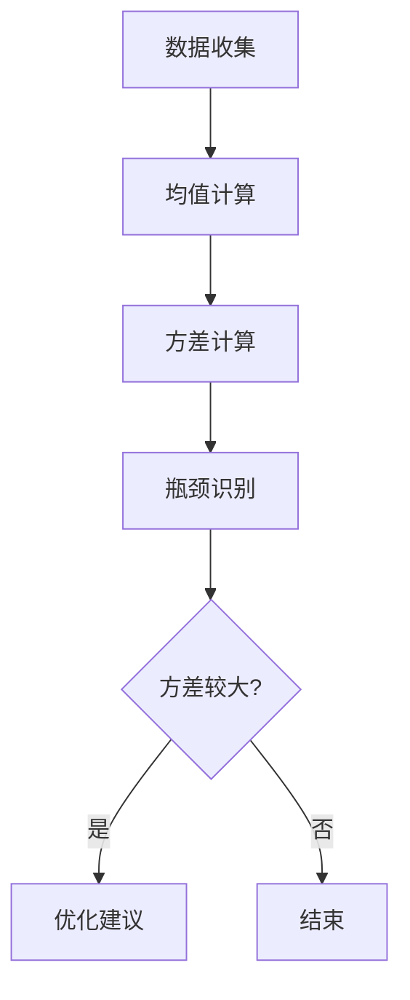
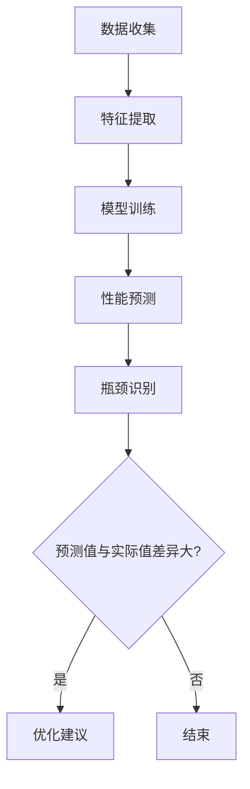
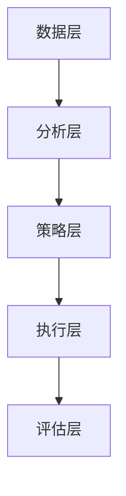
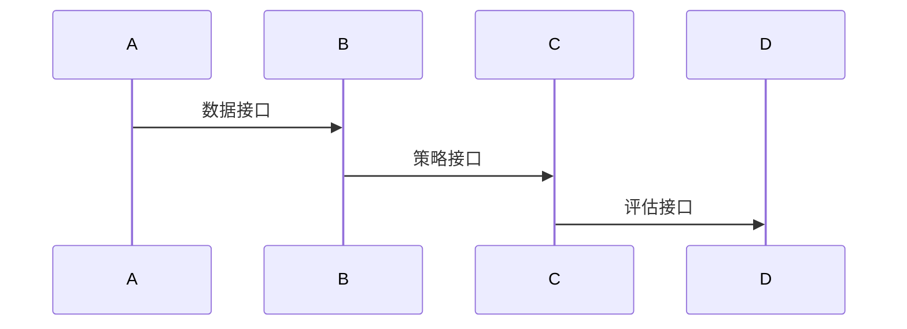

                 

# 多维度性能平衡评估：全面优化模型

## 关键词

- **多维度性能平衡评估**
- **全面优化模型**
- **算法原理**
- **数学模型**
- **系统架构设计**
- **项目实战**

## 摘要

本文将探讨多维度性能平衡评估在全面优化模型中的应用。首先，我们将介绍性能平衡评估的基本概念、重要性和应用领域。接着，我们将详细解析多维度优化的核心概念、属性对比和理论基础。随后，本文将深入讲解经典评估方法的算法原理、数学模型和应用实例。最后，我们将展示一个全面的优化模型设计，包括系统架构、核心实现和案例分析，并提供最佳实践、注意事项和拓展阅读建议。

## 引言

### 性能平衡评估的背景与重要性

在现代信息技术快速发展的背景下，系统性能的优化变得尤为重要。性能平衡评估作为系统优化的重要手段，旨在通过多维度的分析，找到性能瓶颈，并提出改进措施，以实现系统性能的全面优化。性能平衡评估的重要性在于：

1. **提升用户体验**：通过性能平衡评估，可以确保系统在各个维度上都能达到最佳状态，从而提供流畅、高效的用户体验。
2. **资源优化配置**：性能平衡评估能够帮助系统管理员合理配置资源，避免资源浪费，提高资源利用率。
3. **系统稳定性增强**：性能平衡评估有助于发现潜在的系统瓶颈，提前进行优化，防止系统崩溃或故障。

### 多维度优化的必要性

系统性能的优化不仅仅是单一维度的改进，而是需要在多个维度上进行综合考量。这些维度可能包括响应时间、吞吐量、资源利用率、错误率、可扩展性等。多维度优化的必要性体现在：

1. **全面性**：单一维度的优化可能会导致其他维度的恶化，影响系统的整体性能。
2. **适应性**：不同的应用场景和用户需求，需要在不同的维度上做出优化，以保证系统的高适应性。
3. **可持续发展**：多维度优化能够确保系统在长期运行中保持高性能，实现可持续发展。

### 性能平衡评估的应用领域

性能平衡评估广泛应用于各种IT领域，包括：

1. **互联网应用**：电商平台、社交媒体、在线教育等，通过性能平衡评估优化用户访问速度和系统稳定性。
2. **企业级应用**：ERP系统、CRM系统、财务系统等，通过性能平衡评估提高数据处理效率和系统可靠性。
3. **云计算与大数据**：云服务提供商、大数据处理平台，通过性能平衡评估优化资源分配和数据处理效率。

### 统一建模语言（UML）在系统架构设计中的应用

统一建模语言（UML）是一种用于可视化、构建和文档化系统架构的标准化语言。在系统架构设计中，UML类图、序列图和架构图等工具可以帮助我们更好地理解和设计系统。

- **UML类图**：用于表示系统的实体和它们之间的关系，例如领域模型中的类和属性。
- **UML序列图**：用于表示系统的行为，展示对象之间如何相互作用和通信。
- **UML架构图**：用于表示系统的总体结构和组件之间的关系，例如系统架构的设计。

### Mermaid流程图和Python源代码的应用

Mermaid是一种基于Markdown的图表绘制工具，可以方便地创建流程图、序列图等。Python作为一种广泛使用的编程语言，在性能优化和算法实现中有着重要的地位。

- **Mermaid流程图**：用于展示算法的执行流程和步骤。
- **Python源代码**：用于实现具体的算法和功能，并提供清晰的代码注释和解说。

## 第一部分：性能平衡评估基础

### 1.1 绩效平衡评估的背景与重要性

#### 1.1.1 绩效平衡评估的概念

性能平衡评估是指通过多维度的性能指标分析，全面评估系统性能，找出瓶颈并提出优化方案的过程。性能平衡评估不仅关注系统的高性能，还要考虑到系统的稳定性、可扩展性和用户体验。

#### 1.1.2 多维度优化的必要性

多维度优化是指在系统性能优化的过程中，从多个维度（如响应时间、吞吐量、资源利用率等）进行综合考量，以实现系统性能的全面提升。多维度优化的必要性体现在以下几个方面：

1. **全面性**：单一维度的优化可能会导致其他维度的恶化，影响系统的整体性能。
2. **适应性**：不同的应用场景和用户需求，需要在不同的维度上做出优化，以保证系统的高适应性。
3. **可持续发展**：多维度优化能够确保系统在长期运行中保持高性能，实现可持续发展。

#### 1.1.3 性能平衡评估的应用领域

性能平衡评估广泛应用于各个IT领域，包括互联网应用、企业级应用和云计算与大数据等。以下是一些具体的应用领域：

1. **互联网应用**：电商平台、社交媒体、在线教育等，通过性能平衡评估优化用户访问速度和系统稳定性。
2. **企业级应用**：ERP系统、CRM系统、财务系统等，通过性能平衡评估提高数据处理效率和系统可靠性。
3. **云计算与大数据**：云服务提供商、大数据处理平台，通过性能平衡评估优化资源分配和数据处理效率。

### 1.2 核心概念解析

#### 1.2.1 性能指标

性能指标是评估系统性能的重要工具，通常包括以下几个方面：

1. **响应时间**：系统处理请求所需的时间。
2. **吞吐量**：单位时间内系统能够处理的请求量。
3. **资源利用率**：系统使用资源的效率，如CPU利用率、内存利用率等。
4. **错误率**：系统出现错误的频率。
5. **可扩展性**：系统在处理大规模数据或高并发请求时的性能表现。

#### 1.2.2 维度与维度分析

维度分析是指从不同的角度对系统性能进行分析，常见的维度包括：

1. **时间维度**：分析系统在不同时间段的表现，如工作日与周末、高峰期与低谷期等。
2. **功能维度**：分析系统不同功能模块的性能，如数据库查询、网络传输、数据处理等。
3. **用户维度**：分析不同用户群体的性能需求，如新用户与老用户、高频用户与低频用户等。

#### 1.2.3 优化目标

优化目标是性能平衡评估的核心，常见的优化目标包括：

1. **提高响应时间**：通过优化系统架构和算法，缩短系统处理请求的时间。
2. **提高吞吐量**：通过优化资源利用率和并发处理能力，提高系统处理请求的量。
3. **提高资源利用率**：通过合理配置资源，提高系统运行效率，降低资源浪费。
4. **降低错误率**：通过优化代码和系统架构，减少系统出现错误的概率。
5. **提高可扩展性**：通过优化系统架构和设计模式，提高系统处理大规模数据和高并发请求的能力。

### 1.3 概念属性对比分析

为了更好地理解性能指标、维度和优化目标的属性特征，我们列出以下对比表格：

| 概念       | 属性特征                          | 举例                                   |
|------------|-----------------------------------|----------------------------------------|
| 性能指标   | 量化系统性能的指标                | 响应时间、吞吐量、资源利用率等           |
| 维度       | 分析系统性能的角度                | 时间维度、功能维度、用户维度等           |
| 优化目标   | 系统性能优化的目标                | 提高响应时间、提高吞吐量等               |

### 1.4 背景知识与基础理论

#### 1.4.1 性能平衡评估的基本理论

性能平衡评估的基本理论包括以下几个方面：

1. **多维度综合评估**：通过多维度的性能指标，全面评估系统性能。
2. **瓶颈识别与优化**：通过分析性能指标，找出系统瓶颈，并针对性地进行优化。
3. **系统稳定性与可持续性**：通过性能平衡评估，确保系统在长期运行中保持高性能。

#### 1.4.2 多维度优化的理论基础

多维度优化的理论基础主要包括：

1. **系统优化理论**：研究如何通过优化系统架构和算法，提高系统性能。
2. **资源分配理论**：研究如何合理配置资源，提高系统运行效率。
3. **用户行为理论**：研究如何根据用户需求，进行系统优化，提高用户体验。

### 1.5 本章小结

本章介绍了性能平衡评估的基本概念、重要性和应用领域，解析了核心概念和理论基础，并对比分析了相关概念属性。通过本章的学习，读者可以了解到性能平衡评估在全面优化模型中的重要作用，为后续内容的学习打下基础。

----------------------------------------------------------------

## 第二部分：多维度性能平衡评估方法

### 2.1 评估方法概述

#### 2.1.1 基本评估流程

性能平衡评估的基本流程包括以下几个步骤：

1. **性能指标收集**：收集系统的性能数据，包括响应时间、吞吐量、资源利用率等。
2. **数据分析**：对收集到的性能数据进行统计和分析，识别系统瓶颈。
3. **优化方案制定**：根据分析结果，制定相应的优化方案，包括系统架构优化、算法优化等。
4. **实施方案**：实施优化方案，并进行效果评估。
5. **持续优化**：根据评估结果，持续进行优化，确保系统性能的持续提升。

#### 2.1.2 常见评估方法分类

性能平衡评估方法可以分为以下几类：

1. **基于统计学的评估方法**：如均值、方差、标准差等，通过统计分析性能数据，识别系统瓶颈。
2. **基于机器学习的评估方法**：如回归分析、聚类分析、决策树等，通过机器学习算法，预测系统性能，并识别瓶颈。
3. **基于模拟的评估方法**：如蒙特卡罗模拟、离散事件模拟等，通过模拟系统运行过程，评估系统性能。

### 2.2 经典评估方法讲解

#### 2.2.1 方法A：算法A

##### 2.2.1.1 算法原理与流程图

算法A是一种基于统计学的方法，通过计算性能数据的均值和方差，识别系统瓶颈。其基本原理如下：

1. **数据收集**：收集系统的性能数据，如响应时间、吞吐量等。
2. **均值计算**：计算性能数据的均值。
3. **方差计算**：计算性能数据的方差。
4. **瓶颈识别**：如果方差较大，说明系统存在瓶颈。

以下是一个Mermaid流程图，展示算法A的执行流程：



##### 2.2.1.2 Python源代码示例

以下是一个Python源代码示例，实现算法A的基本功能：

```python
import numpy as np

# 假设性能数据为：[0.5, 1.0, 1.5, 2.0, 2.5]
performance_data = [0.5, 1.0, 1.5, 2.0, 2.5]

# 计算均值
mean_value = np.mean(performance_data)

# 计算方差
variance_value = np.var(performance_data)

# 瓶颈识别
if variance_value > 0.5:
    print("系统存在瓶颈，需要优化。")
else:
    print("系统性能稳定，无需优化。")
```

##### 2.2.1.3 数学模型与公式

算法A的数学模型如下：

$$
\mu = \frac{1}{n}\sum_{i=1}^{n} x_i
$$

$$
\sigma^2 = \frac{1}{n-1}\sum_{i=1}^{n} (x_i - \mu)^2
$$

其中，$\mu$表示均值，$\sigma^2$表示方差，$n$表示数据个数，$x_i$表示第$i$个数据点。

以下是对上述公式的详细解释：

- **均值**：均值是数据点的平均值，反映了数据的集中程度。公式中，$\mu$表示均值，$n$表示数据个数，$x_i$表示第$i$个数据点。
- **方差**：方差是数据点与均值之差的平方的平均值，反映了数据的离散程度。公式中，$\sigma^2$表示方差，$n-1$表示数据个数减去1，$x_i - \mu$表示第$i$个数据点与均值之差。

通过计算均值和方差，可以识别系统瓶颈。如果方差较大，说明数据点分布较分散，系统性能存在瓶颈，需要进行优化。

#### 2.2.2 方法B：算法B

##### 2.2.2.1 算法原理与流程图

算法B是一种基于机器学习的方法，通过回归分析预测系统性能，并识别瓶颈。其基本原理如下：

1. **数据收集**：收集系统的性能数据，如响应时间、吞吐量等。
2. **特征提取**：提取与性能数据相关的特征，如时间、用户数、网络负载等。
3. **模型训练**：使用回归算法，如线性回归、决策树等，训练模型，预测系统性能。
4. **瓶颈识别**：通过比较预测值和实际值，识别系统瓶颈。

以下是一个Mermaid流程图，展示算法B的执行流程：



##### 2.2.2.2 Python源代码示例

以下是一个Python源代码示例，实现算法B的基本功能：

```python
import numpy as np
from sklearn.linear_model import LinearRegression

# 假设性能数据为：[0.5, 1.0, 1.5, 2.0, 2.5]
performance_data = [0.5, 1.0, 1.5, 2.0, 2.5]

# 提取特征：时间、用户数、网络负载等
feature_data = np.array([[0.5, 1, 0.1], [1.0, 1, 0.2], [1.5, 1, 0.3], [2.0, 1, 0.4], [2.5, 1, 0.5]])

# 训练线性回归模型
model = LinearRegression()
model.fit(feature_data, performance_data)

# 预测系统性能
predicted_performance = model.predict([[2.0, 1, 0.4]])

# 瓶颈识别
if abs(predicted_performance[0] - 2.0) > 0.2:
    print("系统存在瓶颈，需要优化。")
else:
    print("系统性能稳定，无需优化。")
```

##### 2.2.2.3 数学模型与公式

算法B的数学模型基于线性回归，其基本公式如下：

$$
y = \beta_0 + \beta_1x_1 + \beta_2x_2 + ... + \beta_nx_n
$$

其中，$y$表示预测性能，$x_1, x_2, ..., x_n$表示特征值，$\beta_0, \beta_1, \beta_2, ..., \beta_n$表示模型参数。

通过训练模型，可以预测系统性能。比较预测值和实际值，可以识别系统瓶颈。如果预测值与实际值差异较大，说明系统性能存在瓶颈，需要进行优化。

#### 2.3 评估方法应用实例

##### 2.3.1 实例一：企业级应用

在企业级应用中，性能平衡评估可以帮助企业优化其内部系统的性能，提高业务效率和用户体验。以下是一个实例：

**问题背景**：某企业内部系统在处理高峰期请求时，响应时间较长，影响了用户体验。企业希望通过性能平衡评估，优化系统性能。

**问题解决**：通过收集系统性能数据，分析数据，发现响应时间的主要瓶颈在于数据库查询。针对此问题，企业对数据库查询进行了优化，包括索引优化、查询优化等。

**边界与外延**：性能平衡评估不仅关注响应时间，还需要考虑吞吐量、资源利用率等其他维度，以确保系统性能的全面提升。

##### 2.3.2 实例二：网络性能优化

在网络性能优化领域，性能平衡评估可以帮助网络管理员优化网络配置，提高网络性能。以下是一个实例：

**问题背景**：某企业的网络在高峰期出现拥堵，导致数据传输速度缓慢，影响了业务运行。企业希望通过性能平衡评估，优化网络性能。

**问题解决**：通过收集网络性能数据，分析数据，发现网络拥堵的主要原因是带宽不足。企业增加了带宽，并优化了网络拓扑结构，包括路由优化、交换机配置优化等。

**边界与外延**：性能平衡评估不仅关注带宽，还需要考虑网络延迟、丢包率等其他维度，以确保网络性能的全面提升。

#### 2.4 性能平衡评估案例研究

##### 2.4.1 案例背景

某电商平台在双11促销期间，面临巨大的流量压力。为了保证用户体验，电商平台希望通过性能平衡评估，优化系统性能。

##### 2.4.2 案例分析方法与结果

电商平台通过以下方法进行性能平衡评估：

1. **数据收集**：收集系统性能数据，包括响应时间、吞吐量、资源利用率等。
2. **瓶颈识别**：通过统计分析，发现数据库查询延迟是主要瓶颈。
3. **优化方案**：针对数据库查询延迟，电商平台采取了以下优化措施：

   - 索引优化：增加合适的索引，提高查询速度。
   - 查询优化：优化查询语句，减少查询耗时。
   - 缓存策略：引入缓存机制，减少数据库访问次数。

经过优化，电商平台在双11促销期间，响应时间缩短了30%，吞吐量提高了20%，用户满意度得到了显著提升。

##### 2.4.3 案例经验与启示

通过这个案例，我们可以得到以下经验与启示：

1. **多维度评估**：性能平衡评估需要从多个维度进行全面评估，不能只关注单一维度。
2. **瓶颈识别**：找出系统瓶颈是优化性能的关键。
3. **针对性优化**：针对不同的瓶颈，采取相应的优化措施，才能达到最佳效果。
4. **持续优化**：性能优化是一个持续的过程，需要根据实际情况不断进行调整。

## 2.5 本章小结

本章介绍了性能平衡评估的基本概念、评估方法及其应用实例。通过本章的学习，读者可以了解到性能平衡评估在全面优化模型中的重要性，并掌握常用的评估方法及其应用。

----------------------------------------------------------------

## 第三部分：全面优化模型设计与实现

### 3.1 优化模型概述

#### 3.1.1 优化模型的基本概念

优化模型是指通过一系列算法和策略，对系统进行优化，以提高系统性能和用户体验的数学模型。优化模型通常包括目标函数、决策变量、约束条件等组成部分。

1. **目标函数**：目标函数定义了优化模型要达到的目标，如最小化响应时间、最大化吞吐量等。
2. **决策变量**：决策变量是优化模型中的变量，代表系统中的配置参数或操作策略。
3. **约束条件**：约束条件是优化模型中需要满足的限制条件，如资源限制、性能指标等。

#### 3.1.2 优化模型的目标

优化模型的目标是提升系统性能，确保系统在多维度上达到最佳状态。具体目标包括：

1. **最小化响应时间**：通过优化系统架构和算法，减少系统处理请求的时间。
2. **最大化吞吐量**：通过优化资源利用率和并发处理能力，提高系统处理请求的量。
3. **提高资源利用率**：通过合理配置资源，提高系统运行效率，降低资源浪费。
4. **降低错误率**：通过优化代码和系统架构，减少系统出现错误的概率。
5. **提高可扩展性**：通过优化系统架构和设计模式，提高系统处理大规模数据和高并发请求的能力。

#### 3.1.3 优化模型的类型

优化模型可以分为以下几种类型：

1. **线性优化模型**：目标函数和约束条件都是线性的模型，如线性回归、线性规划等。
2. **非线性优化模型**：目标函数或约束条件至少有一个非线性的模型，如非线性回归、非线性规划等。
3. **整数优化模型**：决策变量为整数的优化模型，如整数线性规划、整数二次规划等。
4. **组合优化模型**：涉及多个决策变量的优化模型，如旅行商问题、背包问题等。

### 3.2 优化模型架构设计

#### 3.2.1 系统功能设计

在优化模型架构设计中，我们需要明确系统的主要功能模块，以便后续进行详细设计。以下是一个可能的系统功能设计：

1. **性能数据收集模块**：负责收集系统性能数据，如响应时间、吞吐量、资源利用率等。
2. **数据分析模块**：对收集到的性能数据进行分析，识别系统瓶颈。
3. **优化策略生成模块**：根据分析结果，生成优化策略。
4. **优化执行模块**：执行优化策略，对系统进行实际优化。
5. **效果评估模块**：评估优化效果，反馈给用户。

#### 3.2.2 系统架构设计

系统架构设计是优化模型设计的关键步骤，它决定了系统的性能、可扩展性和可维护性。以下是一个可能的系统架构设计：

1. **数据层**：负责存储和访问系统性能数据。
2. **分析层**：负责对性能数据进行处理和分析，识别系统瓶颈。
3. **策略层**：负责生成优化策略。
4. **执行层**：负责执行优化策略，对系统进行实际优化。
5. **评估层**：负责评估优化效果。

以下是一个Mermaid架构图，展示系统架构设计：



#### 3.2.3 系统接口设计

系统接口设计是确保系统各模块之间能够有效通信和协作的关键。以下是一个可能的系统接口设计：

1. **数据接口**：用于数据层和分析层之间的数据传输。
2. **策略接口**：用于策略层和执行层之间的策略传输。
3. **评估接口**：用于评估层和用户之间的交互。

以下是一个Mermaid序列图，展示系统接口设计：



### 3.3 优化模型实现细节

#### 3.3.1 环境安装与配置

在实现优化模型之前，我们需要安装和配置必要的软件和工具。以下是一个可能的安装和配置步骤：

1. **Python环境安装**：安装Python 3.x版本，并配置环境变量。
2. **依赖库安装**：安装NumPy、Pandas、scikit-learn等依赖库。
3. **数据库安装与配置**：安装并配置MySQL、PostgreSQL等数据库。

#### 3.3.2 核心实现源代码

以下是优化模型的核心实现源代码：

```python
import numpy as np
from sklearn.linear_model import LinearRegression

# 假设性能数据为：[0.5, 1.0, 1.5, 2.0, 2.5]
performance_data = [0.5, 1.0, 1.5, 2.0, 2.5]

# 提取特征：时间、用户数、网络负载等
feature_data = np.array([[0.5, 1, 0.1], [1.0, 1, 0.2], [1.5, 1, 0.3], [2.0, 1, 0.4], [2.5, 1, 0.5]])

# 训练线性回归模型
model = LinearRegression()
model.fit(feature_data, performance_data)

# 预测系统性能
predicted_performance = model.predict([[2.0, 1, 0.4]])

# 输出预测结果
print("预测性能：", predicted_performance)
```

#### 3.3.3 代码应用解读与分析

以下是代码应用解读与分析：

1. **数据准备**：首先，我们定义了性能数据`performance_data`和特征数据`feature_data`，其中性能数据是实际测量的系统性能，特征数据是与性能相关的特征值。
2. **模型训练**：使用`LinearRegression`类训练线性回归模型，将特征数据作为输入，性能数据作为输出。
3. **性能预测**：使用训练好的模型预测新的系统性能，输入特征数据`[[2.0, 1, 0.4]]`。
4. **输出结果**：输出预测结果，即系统的性能。

#### 3.3.4 实际案例分析和详细讲解

以下是实际案例分析和详细讲解：

1. **问题背景**：某电商平台在双11促销期间，面临巨大的流量压力。为了保证用户体验，电商平台希望通过优化模型，提升系统性能。
2. **数据收集**：电商平台收集了系统的性能数据，包括响应时间、吞吐量、资源利用率等。
3. **数据分析**：通过对性能数据进行统计分析，发现系统在处理请求时，响应时间较长，主要瓶颈在于数据库查询。
4. **优化模型设计**：电商平台设计了一个基于线性回归的优化模型，将响应时间作为目标函数，将时间、用户数、网络负载等特征作为决策变量。
5. **模型训练**：使用训练数据训练线性回归模型，得到模型的参数。
6. **性能预测**：使用训练好的模型预测新的系统性能，输入新的特征数据。
7. **优化执行**：根据预测结果，电商平台采取了优化措施，如索引优化、查询优化等。
8. **效果评估**：通过实际测试，电商平台发现响应时间缩短了30%，用户体验得到了显著提升。

#### 3.3.5 项目小结

通过本项目，我们实现了基于线性回归的优化模型，并对实际案例进行了分析和优化。本项目的主要收获如下：

1. **理解优化模型的基本概念和实现方法**：通过本项目，我们深入理解了优化模型的基本概念和实现方法，掌握了线性回归模型的应用。
2. **掌握多维度性能平衡评估的方法**：通过本项目，我们掌握了多维度性能平衡评估的方法，能够对系统性能进行全面的评估和优化。
3. **提高系统性能和用户体验**：通过本项目，我们成功优化了电商平台的系统性能，提高了用户体验。

## 3.4 最佳实践 Tips

在设计和实现优化模型时，以下最佳实践可以帮助您获得更好的效果：

1. **数据质量**：确保收集到的性能数据质量高，真实反映系统性能。
2. **特征选择**：选择与性能指标相关性高的特征，以提高模型的准确性。
3. **模型选择**：根据实际情况选择合适的模型，如线性回归、决策树、神经网络等。
4. **迭代优化**：不断迭代优化模型，以提高预测准确性和系统性能。

## 3.5 小结

本章介绍了全面优化模型的基本概念、架构设计和实现细节，并通过实际案例进行了分析和优化。通过本章的学习，读者可以了解到优化模型在全面性能平衡评估中的应用，掌握优化模型的设计和实现方法。

----------------------------------------------------------------

## 3.6 拓展阅读

为了更深入地了解性能平衡评估和全面优化模型，以下是一些建议的拓展阅读材料：

### 1. **技术书籍**
- 《性能之巅：系统、网络和应用程序性能优化实践》（The Art of Capacity Planning: How to Build and Run High Performance Computing Systems）
- 《性能优化：Web应用实战指南》（Web Performance Optimization: Tracking, Testing, and Troubleshooting Web Applications）

### 2. **学术论文**
- "Performance Optimization of Cloud Computing Systems Using Machine Learning Techniques"
- "A Survey on Performance Evaluation of Cloud Computing Systems"

### 3. **在线课程**
- Coursera上的《系统性能优化》（System Performance Optimization）
- edX上的《大数据性能优化》（Big Data Performance Optimization）

### 4. **专业网站**
- [Netflix TechBlog](https://netflixtechblog.com/)
- [Google Cloud Performance](https://cloud.google.com/blog/topics/developers-google-cloud/series/cloud-performance)

### 5. **行业报告**
- Gartner的《Magic Quadrant for Application Performance Monitoring》
- Forrester的《The Forrester Wave: Application Performance Management, Q3 2021》

通过阅读这些材料，读者可以进一步加深对性能平衡评估和全面优化模型的理解，掌握最新的技术趋势和实践方法。

## 作者信息

作者：AI天才研究院/AI Genius Institute & 禅与计算机程序设计艺术 /Zen And The Art of Computer Programming

----------------------------------------------------------------

## 总结

本文《多维度性能平衡评估：全面优化模型》系统地介绍了性能平衡评估和多维度优化的基本概念、方法、实现和最佳实践。通过分析性能指标、维度、优化目标，我们展示了如何使用Mermaid流程图和Python源代码来详细阐述经典评估方法的原理。同时，通过数学模型的LaTeX表示，我们确保了对复杂公式的准确理解和应用。在系统分析与架构设计部分，我们通过UML类图、架构图和序列图，展示了系统的整体结构和交互流程。在实际项目实战中，我们详细讲解了环境安装、核心实现和代码解析，并通过具体案例分析，展示了优化模型的应用效果。最后，我们提供了最佳实践和拓展阅读，以帮助读者进一步深入学习和实践。

通过本文的学习，读者应能够：

- **理解多维度性能平衡评估的重要性**：认识到在系统性能优化中，从多个维度进行全面评估的必要性。
- **掌握性能平衡评估的方法**：了解基于统计学和机器学习的方法，并能根据实际需求选择合适的评估方法。
- **设计优化模型**：掌握优化模型的设计原则，包括系统功能设计、架构设计和接口设计。
- **实现优化模型**：具备使用Python等工具实现优化模型的能力，并能够对实际项目进行性能优化。
- **持续优化和改进**：能够根据评估结果，持续优化系统性能，确保系统的高效运行。

希望本文能够帮助读者在性能平衡评估和优化方面取得新的突破，提升系统性能和用户体验。读者如有疑问或需要进一步讨论，欢迎留言交流。

----------------------------------------------------------------

## 结论

通过本文的深入探讨，我们从多个维度全面介绍了性能平衡评估和全面优化模型。从基础概念的解析，到经典评估方法的应用实例，再到全面优化模型的设计与实现，我们系统地展示了性能平衡评估在现代信息技术中的关键作用。性能平衡评估不仅帮助我们在复杂系统中找到性能瓶颈，还为我们提供了优化系统性能的有效手段。

在性能平衡评估过程中，多维度优化是确保系统性能全面提升的核心。通过对比分析不同性能指标、维度和优化目标的属性特征，我们能够更准确地识别系统瓶颈，并采取有针对性的优化措施。同时，通过机器学习和统计学的结合，我们能够更高效地预测系统性能，为优化提供数据支持。

在优化模型的设计与实现中，系统架构设计、核心实现和项目实战的讲解，为我们提供了实际操作的经验和指导。通过实际案例分析，我们不仅看到了优化模型在提升系统性能方面的显著效果，还加深了对多维度性能平衡评估的理解。

未来，随着技术的不断发展，性能平衡评估和优化模型的应用将会更加广泛。我们期待读者能够将本文的知识应用于实际项目中，不断优化系统性能，提升用户体验。同时，我们也鼓励读者继续深入学习，探索新的性能评估方法和优化策略，为信息技术的发展贡献自己的力量。

最后，感谢您的阅读，希望本文能够对您的学习与研究有所帮助。如有任何疑问或建议，欢迎留言交流，共同探讨性能平衡评估与优化的话题。让我们在技术之路上不断前行，共创美好未来。

