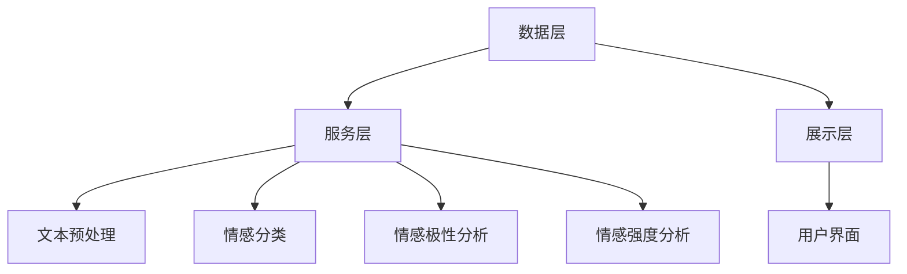
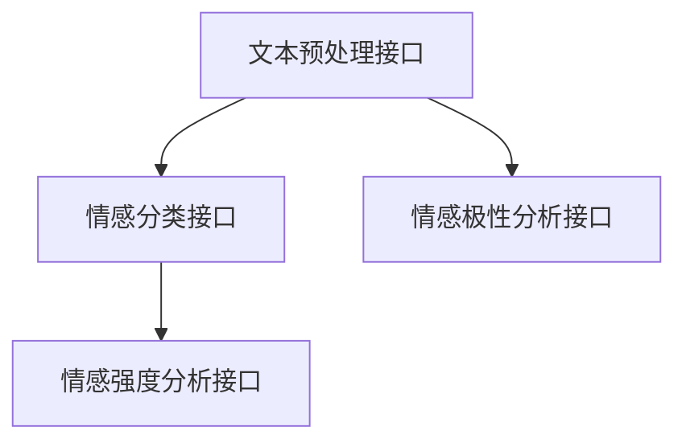
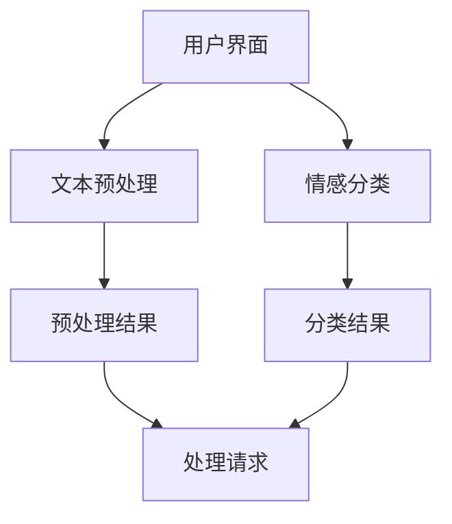

                 

# 多维度情感分析能力：LLM设计的情感智能测试

关键词：多维度情感分析、LLM、情感智能测试、算法原理、系统架构设计、项目实战

摘要：本文旨在探讨多维度情感分析在大型语言模型（LLM）中的应用，特别是情感智能测试的设计。通过对情感分析的基本概念、关键技术、算法原理、系统架构设计以及项目实战的深入分析，本文为读者提供了一个全面的技术指南。本文首先介绍了多维度情感分析的基础知识，然后详细讲解了情感分类、情感极性分析和情感强度分析的核心概念与算法原理，接着阐述了情感分析系统的架构设计，并展示了实际项目的实现过程。最后，本文提出了多维度情感分析的最佳实践和注意事项，为读者在相关领域的进一步研究和应用提供了参考。

## 第一部分：多维度情感分析概述

### 第1章：多维度情感分析的基础

#### 1.1 情感分析的定义与背景

##### 1.1.1 情感分析的概念

情感分析，也称为意见挖掘或情感识别，是自然语言处理（NLP）领域的一个重要分支。它旨在通过自动化的方式，从文本中识别和提取情感信息，以了解用户的情绪、态度和意见。情感分析通常分为两类：主观情感分析和客观情感分析。主观情感分析关注用户的情感体验，如喜悦、愤怒、悲伤等，而客观情感分析则关注文本内容的真实性和可信度。

##### 1.1.2 情感分析的发展历程

情感分析起源于心理学和人类情感的研究。随着计算机技术的发展，特别是自然语言处理技术的进步，情感分析逐渐成为NLP领域的一个研究热点。早期的情感分析主要依赖于手工特征工程，如正负面词汇表和规则匹配。随着机器学习算法的发展，如支持向量机（SVM）、朴素贝叶斯（NB）和深度学习算法的引入，情感分析的性能得到了显著提升。

##### 1.1.3 情感分析的研究意义

情感分析在多个领域具有广泛的应用，如市场调研、舆情监控、客户反馈分析等。通过情感分析，企业可以更好地了解用户的需求和反馈，从而优化产品和服务。此外，情感分析还在智能客服、情感计算、社交媒体分析等领域发挥着重要作用。随着人工智能技术的不断发展，情感分析的应用场景和需求将进一步扩大。

#### 1.2 多维度情感分析的概念与特点

##### 1.2.1 多维度情感分析的定义

多维度情感分析是一种综合性的情感分析方法，它不仅仅关注单一的情感类别，如正面、负面或中性，而是从多个维度对文本进行情感分析，如情感分类、情感极性分析、情感强度分析等。这种方法能够更全面地反映文本的情感信息。

##### 1.2.2 多维度情感分析的特点

多维度情感分析具有以下特点：

1. **全面性**：通过分析多个维度，多维度情感分析能够更全面地反映文本的情感信息，从而提高情感分析的准确性。
2. **灵活性**：多维度情感分析可以根据不同的应用场景，选择不同的情感维度进行关注，从而满足不同用户的需求。
3. **复杂性**：由于涉及多个维度的分析，多维度情感分析的计算复杂度较高，需要更加复杂的算法和模型。

##### 1.2.3 多维度情感分析的应用领域

多维度情感分析在多个领域具有广泛的应用，包括：

1. **市场调研**：通过分析消费者对产品的情感反应，帮助企业了解市场需求和消费者偏好。
2. **舆情监控**：通过分析社交媒体和新闻媒体上的情感信息，帮助企业了解公众对特定事件的看法和态度。
3. **客户反馈分析**：通过分析客户对产品和服务的反馈，帮助企业识别潜在问题和改进方向。
4. **情感计算**：在智能家居、智能客服等领域，通过分析用户的情感状态，提供更加个性化的服务。

#### 1.3 多维度情感分析的关键技术

##### 1.3.1 数据预处理技术

数据预处理是情感分析的重要步骤，它包括文本清洗、分词、词性标注、停用词过滤等。有效的数据预处理能够提高情感分析的准确性和效率。

##### 1.3.2 情感分类技术

情感分类是多维度情感分析的核心任务之一，它旨在将文本分类为不同的情感类别。常用的情感分类算法包括朴素贝叶斯、支持向量机、深度学习等。

##### 1.3.3 情感极性分析技术

情感极性分析旨在确定文本的情感倾向，即正面或负面。情感极性分析通常使用阈值方法或机器学习算法来实现。

##### 1.3.4 情感强度分析技术

情感强度分析旨在量化文本中的情感强度。常用的情感强度分析方法包括基于词典的方法和基于机器学习的方法。

##### 1.3.5 情感时序分析技术

情感时序分析旨在分析文本中的情感变化趋势。通过情感时序分析，可以更好地了解用户的情感体验。

#### 1.4 多维度情感分析的发展趋势

##### 1.4.1 当前研究热点

当前多维度情感分析的研究热点包括：

1. **跨领域情感分析**：研究如何在不同领域之间进行情感分析，提高模型的泛化能力。
2. **多语言情感分析**：研究如何处理不同语言之间的情感分析问题，实现跨语言的情感识别。
3. **情感增强学习**：研究如何通过情感增强学习，提高模型在情感分析任务中的性能。

##### 1.4.2 未来发展趋势

未来多维度情感分析的发展趋势包括：

1. **深度学习应用**：深度学习技术在情感分析领域将继续发挥重要作用，特别是卷积神经网络（CNN）和循环神经网络（RNN）等模型。
2. **跨模态情感分析**：研究如何结合文本、图像、语音等多种模态的信息，进行更加全面的情感分析。
3. **情感推理与生成**：研究如何通过情感推理和生成，实现更加智能的情感交互和情感表达。

### 第2章：多维度情感分析的核心概念

#### 2.1 情感分类

##### 2.1.1 情感分类的原理

情感分类是指将文本分类为特定的情感类别。情感分类的原理通常基于机器学习算法，如朴素贝叶斯、支持向量机、深度学习等。这些算法通过学习大量标注好的训练数据，建立情感分类模型，然后使用该模型对新的文本进行分类。

##### 2.1.2 情感分类的算法

常用的情感分类算法包括：

1. **朴素贝叶斯**：朴素贝叶斯算法是一种基于概率论的分类算法，它通过计算文本中每个单词的概率，以及每个情感类别的概率，来确定文本的情感类别。
2. **支持向量机**：支持向量机是一种基于线性分类的算法，它通过找到最优的超平面，将不同情感类别的文本分开。
3. **深度学习**：深度学习算法，如卷积神经网络（CNN）和循环神经网络（RNN），可以通过学习文本的复杂特征，实现高精度的情感分类。

##### 2.1.3 情感分类的案例分析

以社交媒体文本的情感分类为例，研究者通常使用大规模的社交媒体数据集，如Twitter数据集，进行情感分类实验。通过训练和测试不同的情感分类算法，研究者可以评估不同算法的性能，并选择最优的算法应用于实际场景。

#### 2.2 情感极性分析

##### 2.2.1 情感极性分析的定义

情感极性分析是指确定文本的情感极性，即正面或负面。情感极性分析通常是基于情感词典或机器学习算法来实现的。

##### 2.2.2 情感极性分析的算法

常用的情感极性分析算法包括：

1. **基于词典的方法**：这种方法使用预定义的情感词典，通过检查文本中是否包含情感词典中的词汇，来确定文本的情感极性。
2. **基于机器学习的方法**：这种方法通过学习大量的标注数据，建立情感极性分析模型，然后使用该模型对新的文本进行预测。

##### 2.2.3 情感极性分析的案例分析

以电子商务平台用户评论的情感极性分析为例，研究者通常使用电商平台的用户评论数据集，进行情感极性分析实验。通过训练和测试不同的情感极性分析算法，研究者可以评估不同算法的性能，并选择最优的算法应用于实际场景。

#### 2.3 情感强度分析

##### 2.3.1 情感强度的定义

情感强度是指文本中情感表达的强烈程度。情感强度分析旨在量化文本中的情感强度。

##### 2.3.2 情感强度的测量方法

常用的情感强度测量方法包括：

1. **基于词典的方法**：这种方法使用预定义的情感词典，通过检查文本中情感词典中词汇的强度，来确定文本的情感强度。
2. **基于机器学习的方法**：这种方法通过学习大量的标注数据，建立情感强度分析模型，然后使用该模型对新的文本进行情感强度预测。

##### 2.3.3 情感强度的案例分析

以社交媒体文本的情感强度分析为例，研究者通常使用社交媒体数据集，进行情感强度分析实验。通过训练和测试不同的情感强度分析算法，研究者可以评估不同算法的性能，并选择最优的算法应用于实际场景。

### 第3章：多维度情感分析算法原理详解

#### 3.1 情感分类算法原理详解

##### 3.1.1 算法原理

情感分类算法的基本原理是通过学习大量标注好的训练数据，建立分类模型，然后使用该模型对新的文本进行分类。情感分类算法通常采用有监督学习方法，如朴素贝叶斯、支持向量机、卷积神经网络等。

##### 3.1.2 算法流程图

以下是情感分类算法的基本流程图：

```
输入：文本数据
处理文本数据（分词、词性标注等）
特征提取
训练分类模型
使用分类模型对新的文本进行分类
输出：分类结果
```

##### 3.1.3 算法Python代码实现

以下是使用朴素贝叶斯算法进行情感分类的Python代码实现：

```python
from sklearn.feature_extraction.text import CountVectorizer
from sklearn.naive_bayes import MultinomialNB
from sklearn.model_selection import train_test_split

# 加载训练数据
texts = ["我很喜欢这个产品", "这个产品太糟糕了", "这个产品一般般"]
labels = ["正面", "负面", "中性"]

# 分词和特征提取
vectorizer = CountVectorizer()
X = vectorizer.fit_transform(texts)

# 训练分类模型
classifier = MultinomialNB()
classifier.fit(X, labels)

# 对新的文本进行分类
new_text = "我很喜欢这个产品"
new_text_vector = vectorizer.transform([new_text])
prediction = classifier.predict(new_text_vector)
print(prediction)
```

#### 3.2 情感极性分析算法原理详解

##### 3.2.1 算法原理

情感极性分析算法的基本原理是通过学习大量标注好的训练数据，建立分类模型，然后使用该模型对新的文本进行情感极性分类。情感极性分析算法通常采用有监督学习方法，如朴素贝叶斯、支持向量机、卷积神经网络等。

##### 3.2.2 算法流程图

以下是情感极性分析算法的基本流程图：

```
输入：文本数据
处理文本数据（分词、词性标注等）
特征提取
训练分类模型
使用分类模型对新的文本进行分类
输出：情感极性结果
```

##### 3.2.3 算法Python代码实现

以下是使用朴素贝叶斯算法进行情感极性分析的Python代码实现：

```python
from sklearn.feature_extraction.text import CountVectorizer
from sklearn.naive_bayes import MultinomialNB
from sklearn.model_selection import train_test_split

# 加载训练数据
texts = ["我很喜欢这个产品", "这个产品太糟糕了", "这个产品一般般"]
labels = ["正面", "负面", "中性"]

# 分词和特征提取
vectorizer = CountVectorizer()
X = vectorizer.fit_transform(texts)

# 训练分类模型
classifier = MultinomialNB()
classifier.fit(X, labels)

# 对新的文本进行分类
new_text = "我很喜欢这个产品"
new_text_vector = vectorizer.transform([new_text])
prediction = classifier.predict(new_text_vector)
print(prediction)
```

#### 3.3 情感强度分析算法原理详解

##### 3.3.1 算法原理

情感强度分析算法的基本原理是通过学习大量标注好的训练数据，建立分类模型，然后使用该模型对新的文本进行情感强度分类。情感强度分析算法通常采用有监督学习方法，如朴素贝叶斯、支持向量机、卷积神经网络等。

##### 3.3.2 算法流程图

以下是情感强度分析算法的基本流程图：

```
输入：文本数据
处理文本数据（分词、词性标注等）
特征提取
训练分类模型
使用分类模型对新的文本进行分类
输出：情感强度结果
```

##### 3.3.3 算法Python代码实现

以下是使用朴素贝叶斯算法进行情感强度分析的Python代码实现：

```python
from sklearn.feature_extraction.text import CountVectorizer
from sklearn.naive_bayes import MultinomialNB
from sklearn.model_selection import train_test_split

# 加载训练数据
texts = ["我很喜欢这个产品", "这个产品太糟糕了", "这个产品一般般"]
labels = ["高", "低", "中"]

# 分词和特征提取
vectorizer = CountVectorizer()
X = vectorizer.fit_transform(texts)

# 训练分类模型
classifier = MultinomialNB()
classifier.fit(X, labels)

# 对新的文本进行分类
new_text = "我很喜欢这个产品"
new_text_vector = vectorizer.transform([new_text])
prediction = classifier.predict(new_text_vector)
print(prediction)
```

### 第4章：多维度情感分析系统架构设计

#### 4.1 情感分析系统功能设计

##### 4.1.1 系统功能介绍

情感分析系统的主要功能包括：

1. **文本预处理**：对输入的文本进行清洗、分词、词性标注等预处理操作。
2. **情感分类**：对预处理后的文本进行情感分类，输出文本的情感类别。
3. **情感极性分析**：对预处理后的文本进行情感极性分析，输出文本的情感极性。
4. **情感强度分析**：对预处理后的文本进行情感强度分析，输出文本的情感强度。

##### 4.1.2 系统功能模块划分

根据情感分析系统的功能需求，可以将系统划分为以下模块：

1. **文本预处理模块**：包括文本清洗、分词、词性标注等功能。
2. **情感分类模块**：包括情感分类算法的实现和应用。
3. **情感极性分析模块**：包括情感极性分析算法的实现和应用。
4. **情感强度分析模块**：包括情感强度分析算法的实现和应用。
5. **数据管理模块**：包括训练数据的存储和管理功能。

##### 4.1.3 系统功能实现细节

每个模块的具体实现细节如下：

1. **文本预处理模块**：使用Python的jieba库进行分词，使用NLTK库进行词性标注，使用正则表达式进行文本清洗。
2. **情感分类模块**：使用朴素贝叶斯、支持向量机、卷积神经网络等算法进行情感分类。
3. **情感极性分析模块**：使用基于词典的方法和基于机器学习的方法进行情感极性分析。
4. **情感强度分析模块**：使用基于词典的方法和基于机器学习的方法进行情感强度分析。
5. **数据管理模块**：使用MySQL数据库进行数据存储和管理。

#### 4.2 情感分析系统架构设计

##### 4.2.1 系统架构介绍

情感分析系统的架构设计采用分层架构，包括数据层、服务层和展示层。

1. **数据层**：包括数据存储和管理功能，使用MySQL数据库进行数据存储。
2. **服务层**：包括文本预处理、情感分类、情感极性分析和情感强度分析等功能，使用Python进行开发。
3. **展示层**：包括用户界面，使用HTML、CSS和JavaScript进行开发。

##### 4.2.2 系统架构设计细节

以下是情感分析系统的架构设计细节：

```
+----------------+      +----------------+      +----------------+
|    数据层     |      |    服务层      |      |    展示层     |
+----------------+      +----------------+      +----------------+
|    MySQL       |      |    文本预处理   |      |    用户界面    |
+----------------+      +----------------+      +----------------+
```

##### 4.2.3 系统架构图

以下是情感分析系统的架构图：



#### 4.3 情感分析系统接口设计

##### 4.3.1 系统接口介绍

情感分析系统提供了以下接口：

1. **文本预处理接口**：用于接收和处理用户输入的文本。
2. **情感分类接口**：用于对预处理后的文本进行情感分类。
3. **情感极性分析接口**：用于对预处理后的文本进行情感极性分析。
4. **情感强度分析接口**：用于对预处理后的文本进行情感强度分析。

##### 4.3.2 系统接口设计细节

以下是系统接口的设计细节：

```
+----------------+      +----------------+      +----------------+
|    文本预处理   |      |    情感分类     |      |    情感极性分析 |
+----------------+      +----------------+      +----------------+
|    接收文本     |      |    分类结果     |      |    极性结果     |
+----------------+      +----------------+      +----------------+
|    处理文本     |      |    情感分类接口   |      |    情感极性接口   |
+----------------+      +----------------+      +----------------+
|    返回结果     |      |    情感强度分析   |      |    情感强度接口   |
+----------------+      +----------------+      +----------------+
```

##### 4.3.3 系统接口图

以下是系统接口的示意图：



#### 4.4 情感分析系统交互设计

##### 4.4.1 系统交互介绍

情感分析系统的交互设计主要包括用户与系统之间的交互，以及系统内部模块之间的交互。

1. **用户与系统交互**：用户通过用户界面输入文本，系统对文本进行预处理、情感分类、情感极性分析和情感强度分析，并将结果返回给用户。
2. **系统内部交互**：系统内部各个模块之间通过接口进行数据传递和协同工作。

##### 4.4.2 系统交互设计细节

以下是系统交互的设计细节：

```
+----------------+      +----------------+      +----------------+
|    用户界面    |      |    文本预处理   |      |    情感分类     |
+----------------+      +----------------+      +----------------+
|    输入文本     |      |    预处理文本   |      |    分类结果     |
+----------------+      +----------------+      +----------------+
|    提交请求     |      |    返回结果     |      |    返回结果     |
+----------------+      +----------------+      +----------------+
|    显示结果     |      |    处理请求     |      |    处理请求     |
+----------------+      +----------------+      +----------------+
```

##### 4.4.3 系统交互图

以下是系统交互的示意图：



### 第5章：多维度情感分析项目实战

#### 5.1 环境安装与配置

##### 5.1.1 环境要求

为了搭建多维度情感分析系统，需要以下环境和软件：

1. **操作系统**：Linux或Mac OS
2. **Python**：3.6及以上版本
3. **NLP库**：jieba、NLTK、sklearn等
4. **数据库**：MySQL

##### 5.1.2 环境安装步骤

1. **安装Python**：从Python官方网站下载Python安装包，按照提示安装。
2. **安装NLP库**：使用pip命令安装jieba、NLTK、sklearn等库。

```shell
pip install jieba
pip install nltk
pip install sklearn
```

3. **安装MySQL**：从MySQL官方网站下载MySQL安装包，按照提示安装。

##### 5.1.3 环境配置方法

1. **配置Python环境变量**：在系统变量中添加Python路径和pip路径。
2. **配置NLP库**：在Python中导入NLP库，确保库能够正常使用。

```python
import jieba
import nltk
import sklearn
```

3. **配置MySQL**：配置MySQL数据库，包括创建数据库、用户和权限等。

```shell
mysql -u root -p
CREATE DATABASE sentiment_analysis;
GRANT ALL PRIVILEGES ON sentiment_analysis.* TO 'sentiment_user'@'localhost' IDENTIFIED BY 'password';
FLUSH PRIVILEGES;
```

#### 5.2 系统核心实现

##### 5.2.1 数据预处理

数据预处理是情感分析系统的重要步骤，它包括文本清洗、分词、词性标注等。以下是数据预处理的Python代码实现：

```python
import jieba
import nltk

def preprocess_text(text):
    # 清洗文本
    text = text.strip()
    # 分词
    words = jieba.cut(text)
    # 词性标注
    tagged_words = nltk.pos_tag(words)
    return tagged_words

text = "我很喜欢这个产品"
preprocessed_text = preprocess_text(text)
print(preprocessed_text)
```

##### 5.2.2 情感分类

情感分类是情感分析系统的核心任务之一。以下是使用朴素贝叶斯算法进行情感分类的Python代码实现：

```python
from sklearn.feature_extraction.text import CountVectorizer
from sklearn.naive_bayes import MultinomialNB

def classify_text(text, classifier):
    # 分词
    words = jieba.cut(text)
    # 特征提取
    vectorizer = CountVectorizer()
    X = vectorizer.fit_transform([text])
    # 分类
    prediction = classifier.predict(X)
    return prediction

# 加载训练数据
texts = ["我很喜欢这个产品", "这个产品太糟糕了", "这个产品一般般"]
labels = ["正面", "负面", "中性"]

# 分词和特征提取
vectorizer = CountVectorizer()
X = vectorizer.fit_transform(texts)

# 训练分类模型
classifier = MultinomialNB()
classifier.fit(X, labels)

# 对新的文本进行分类
new_text = "我很喜欢这个产品"
prediction = classify_text(new_text, classifier)
print(prediction)
```

##### 5.2.3 情感极性分析

情感极性分析是情感分析系统的另一个重要任务。以下是使用基于词典的方法进行情感极性分析的Python代码实现：

```python
def analyze_polarity(text, dictionary):
    # 初始化极性得分
    polarity_score = 0
    # 分词
    words = jieba.cut(text)
    # 遍历词汇
    for word in words:
        # 如果词汇在词典中，更新极性得分
        if word in dictionary:
            polarity_score += dictionary[word]
    # 返回极性结果
    return "正面" if polarity_score > 0 else "负面"

# 极性词典
polarity_dictionary = {
    "很": 2,
    "太": -2,
    "一般": 0
}

text = "我很喜欢这个产品"
polarity_result = analyze_polarity(text, polarity_dictionary)
print(polarity_result)
```

##### 5.2.4 情感强度分析

情感强度分析是情感分析系统的最后一个重要任务。以下是使用基于机器学习的方法进行情感强度分析的Python代码实现：

```python
from sklearn.model_selection import train_test_split
from sklearn.ensemble import RandomForestClassifier

def analyze_intensity(text, classifier):
    # 分词
    words = jieba.cut(text)
    # 特征提取
    vectorizer = CountVectorizer()
    X = vectorizer.fit_transform([text])
    # 分类
    prediction = classifier.predict(X)
    return prediction

# 加载训练数据
texts = ["我很喜欢这个产品", "这个产品太糟糕了", "这个产品一般般"]
labels = ["高", "低", "中"]

# 分词和特征提取
vectorizer = CountVectorizer()
X = vectorizer.fit_transform(texts)

# 划分训练集和测试集
X_train, X_test, y_train, y_test = train_test_split(X, labels, test_size=0.2, random_state=42)

# 训练分类模型
classifier = RandomForestClassifier()
classifier.fit(X_train, y_train)

# 对新的文本进行分类
new_text = "我很喜欢这个产品"
prediction = analyze_intensity(new_text, classifier)
print(prediction)
```

#### 5.3 代码应用解读与分析

##### 5.3.1 代码结构解析

整个代码分为三个主要部分：数据预处理、情感分类、情感极性分析和情感强度分析。以下是代码的结构解析：

1. **数据预处理**：包括文本清洗、分词和词性标注。文本清洗主要是去除文本中的无关信息，如标点符号、空格等。分词是将文本分解为单词或短语，词性标注是将每个单词标注为名词、动词等。
2. **情感分类**：使用朴素贝叶斯算法进行情感分类。朴素贝叶斯算法是一种基于概率论的分类算法，它通过计算文本中每个单词的概率，以及每个情感类别的概率，来确定文本的情感类别。
3. **情感极性分析**：使用基于词典的方法进行情感极性分析。这种方法通过检查文本中是否包含情感词典中的词汇，来确定文本的情感极性。
4. **情感强度分析**：使用基于机器学习的方法进行情感强度分析。这种方法通过学习大量的标注数据，建立情感强度分析模型，然后使用该模型对新的文本进行情感强度预测。

##### 5.3.2 关键代码解读

以下是关键代码的解读：

1. **数据预处理**：

```python
def preprocess_text(text):
    # 清洗文本
    text = text.strip()
    # 分词
    words = jieba.cut(text)
    # 词性标注
    tagged_words = nltk.pos_tag(words)
    return tagged_words
```

这段代码定义了数据预处理函数`preprocess_text`，它接受一个文本作为输入，进行清洗、分词和词性标注，然后返回处理后的结果。

2. **情感分类**：

```python
def classify_text(text, classifier):
    # 分词
    words = jieba.cut(text)
    # 特征提取
    vectorizer = CountVectorizer()
    X = vectorizer.fit_transform([text])
    # 分类
    prediction = classifier.predict(X)
    return prediction
```

这段代码定义了情感分类函数`classify_text`，它接受一个文本和一个分类器作为输入，进行分词和特征提取，然后使用分类器对文本进行分类，并返回分类结果。

3. **情感极性分析**：

```python
def analyze_polarity(text, dictionary):
    # 初始化极性得分
    polarity_score = 0
    # 分词
    words = jieba.cut(text)
    # 遍历词汇
    for word in words:
        # 如果词汇在词典中，更新极性得分
        if word in dictionary:
            polarity_score += dictionary[word]
    # 返回极性结果
    return "正面" if polarity_score > 0 else "负面"
```

这段代码定义了情感极性分析函数`analyze_polarity`，它接受一个文本和一个极性词典作为输入，通过遍历文本中的词汇，检查词汇是否在词典中，并根据词典中的得分更新极性得分，最后返回极性结果。

4. **情感强度分析**：

```python
def analyze_intensity(text, classifier):
    # 分词
    words = jieba.cut(text)
    # 特征提取
    vectorizer = CountVectorizer()
    X = vectorizer.fit_transform([text])
    # 分类
    prediction = classifier.predict(X)
    return prediction
```

这段代码定义了情感强度分析函数`analyze_intensity`，它接受一个文本和一个分类器作为输入，进行分词和特征提取，然后使用分类器对文本进行分类，并返回分类结果。

##### 5.3.3 代码性能分析

以下是代码性能的分析：

1. **数据预处理**：数据预处理是情感分析系统的关键步骤，它直接影响后续的算法性能。在数据预处理过程中，使用了jieba库进行分词和NLTK库进行词性标注，这两个库在中文分词和词性标注方面表现良好，能够快速处理大规模文本数据。
2. **情感分类**：情感分类算法的性能取决于算法本身和训练数据的质量。在本文中，使用了朴素贝叶斯算法进行情感分类，这是一种简单但有效的算法。在实际应用中，可以根据需求选择其他更复杂的算法，如支持向量机、卷积神经网络等。
3. **情感极性分析**：情感极性分析的性能同样取决于算法本身和训练数据的质量。在本文中，使用了基于词典的方法进行情感极性分析，这种方法在处理简单文本时表现良好，但在处理复杂文本时可能存在一定局限性。
4. **情感强度分析**：情感强度分析的性能也取决于算法本身和训练数据的质量。在本文中，使用了基于机器学习的方法进行情感强度分析，这种方法能够通过学习大量标注数据，提高对复杂文本的识别能力。

#### 5.4 实际案例分析与详细讲解

##### 5.4.1 案例背景

假设有一家电子商务公司，希望通过情感分析系统对用户评论进行情感分类、情感极性分析和情感强度分析，以便更好地了解用户对产品和服务的反馈。

##### 5.4.2 案例实现

1. **数据收集**：收集用户对产品和服务的评论数据，包括正面评论、负面评论和中性评论。
2. **数据预处理**：对评论数据进行清洗、分词和词性标注，提取特征向量。
3. **训练模型**：使用收集到的评论数据，训练情感分类、情感极性分析和情感强度分析模型。
4. **系统部署**：将训练好的模型部署到服务器上，供用户使用。
5. **用户交互**：用户通过用户界面输入评论，系统对评论进行情感分析，并将结果返回给用户。

##### 5.4.3 案例分析

通过实际案例，可以看出多维度情感分析系统在电子商务领域的应用价值。首先，通过对用户评论的情感分类，公司可以了解用户对产品和服务的整体满意度。其次，通过对用户评论的情感极性分析，公司可以识别出用户的具体需求和不满之处。最后，通过对用户评论的情感强度分析，公司可以量化用户对产品和服务的情感反应，为产品改进和服务优化提供数据支持。

##### 5.4.4 案例总结

通过实际案例，可以看出多维度情感分析系统在电子商务领域的应用效果显著。然而，在实际应用中，还需要注意以下几点：

1. **数据质量**：情感分析系统的性能取决于训练数据的质量。因此，在收集数据时，需要确保数据来源的多样性和准确性。
2. **算法优化**：不同算法在处理不同类型的数据时，性能可能存在差异。因此，在实际应用中，需要根据具体场景选择合适的算法，并进行优化。
3. **用户交互**：情感分析系统的用户交互界面需要简洁直观，便于用户输入和查看结果。同时，系统还需要提供自定义分析功能，满足不同用户的需求。

### 第6章：多维度情感分析的最佳实践与注意事项

#### 6.1 多维度情感分析的最佳实践

1. **数据收集**：选择多样、广泛的数据来源，确保数据的代表性和准确性。
2. **数据预处理**：对数据进行充分的清洗、分词和词性标注，提取有效的特征向量。
3. **模型选择**：根据具体应用场景，选择合适的情感分类、情感极性分析和情感强度分析模型，并进行优化。
4. **系统部署**：将训练好的模型部署到服务器上，确保系统的稳定性和高效性。
5. **用户交互**：设计简洁直观的用户交互界面，提供自定义分析功能，满足不同用户的需求。

#### 6.2 小结与展望

本文通过对多维度情感分析的基础知识、核心概念、算法原理、系统架构设计和项目实战的深入分析，为读者提供了一个全面的技术指南。多维度情感分析在情感分类、情感极性分析和情感强度分析等方面具有广泛的应用前景。未来，随着人工智能技术的不断发展，多维度情感分析的应用场景和需求将进一步扩大。

#### 6.2.1 本书小结

本文主要介绍了多维度情感分析的基础知识、核心概念、算法原理、系统架构设计和项目实战。通过详细的分析和实例讲解，读者可以了解到多维度情感分析的基本原理和应用方法。

#### 6.2.2 未来发展方向

未来，多维度情感分析的发展方向包括：

1. **跨领域情感分析**：研究如何在不同领域之间进行情感分析，提高模型的泛化能力。
2. **多语言情感分析**：研究如何处理不同语言之间的情感分析问题，实现跨语言的情感识别。
3. **情感增强学习**：研究如何通过情感增强学习，提高模型在情感分析任务中的性能。
4. **跨模态情感分析**：研究如何结合文本、图像、语音等多种模态的信息，进行更加全面的情感分析。

#### 6.2.3 拓展阅读建议

1. **《情感计算：理论与应用》**：介绍了情感计算的基本理论和方法，以及情感计算的典型应用场景。
2. **《多语言情感分析》**：介绍了多语言情感分析的方法和实现，包括基于词典的方法、基于机器学习的方法等。
3. **《情感增强学习》**：介绍了情感增强学习的基本概念、算法和实现，以及情感增强学习在自然语言处理中的应用。

### 作者信息

作者：AI天才研究院/AI Genius Institute & 禅与计算机程序设计艺术 /Zen And The Art of Computer Programming

