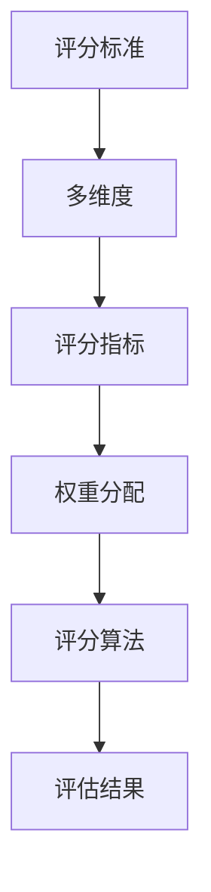
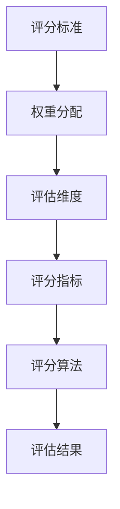
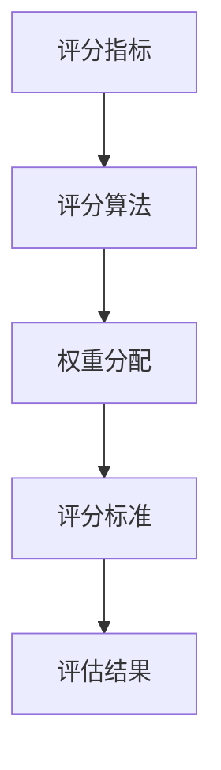
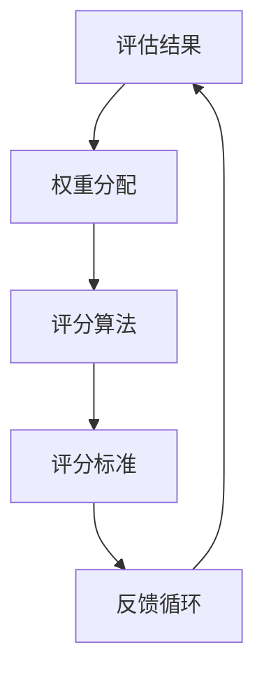
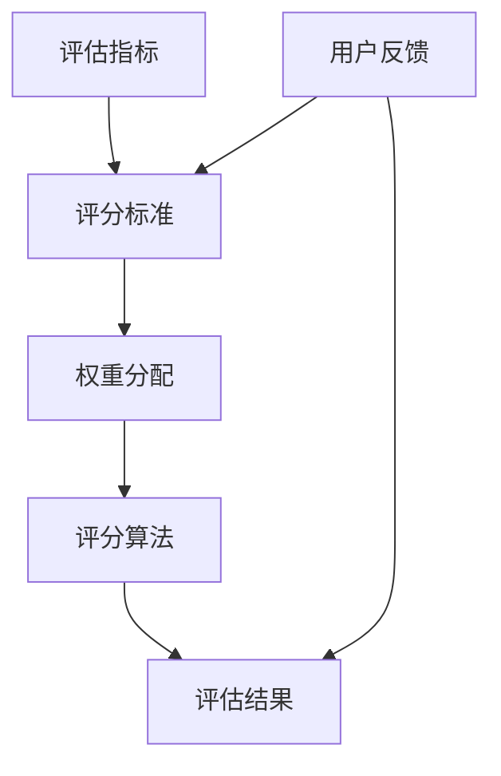
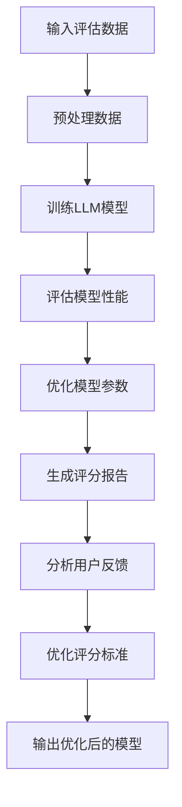
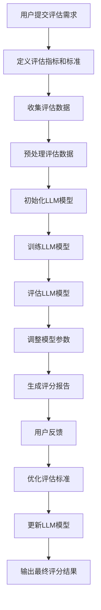
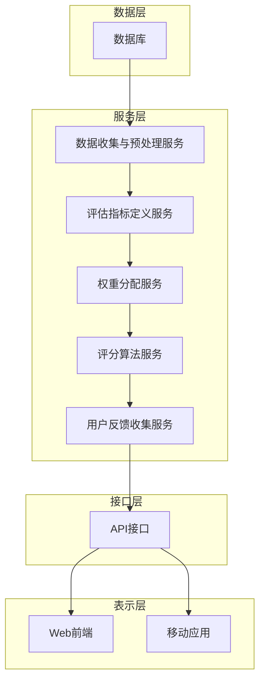
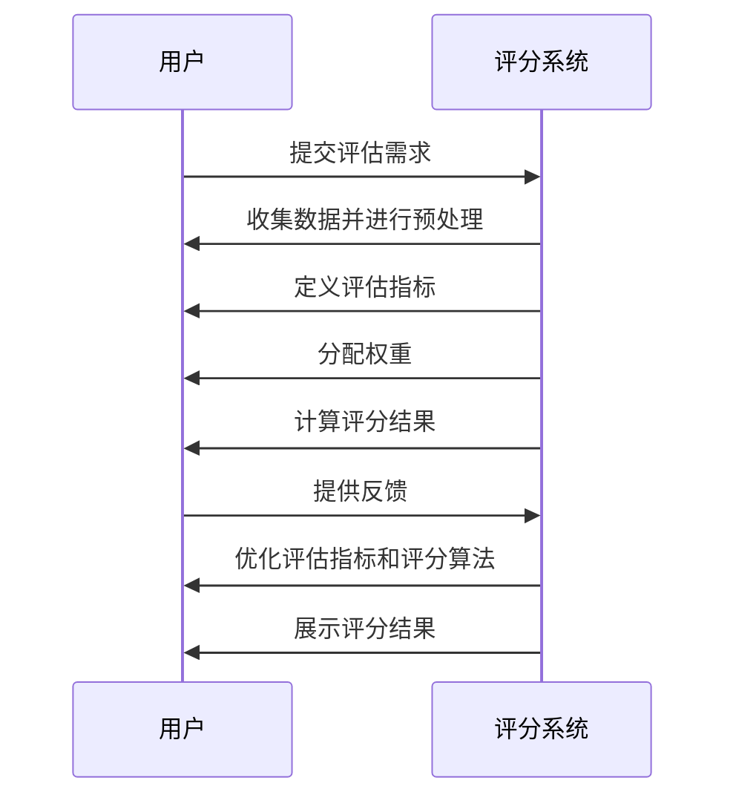

                 

# 《多维度评分机制：LLM支持的综合评估体系》

## 关键词
- 多维度评分机制
- LLM
- 综合评估体系
- 数学模型
- 系统架构
- 项目实战

## 摘要
本文旨在探讨多维度评分机制的设计与实践，通过引入大型语言模型（LLM）作为核心支撑，构建一个综合评估体系。文章将逐步阐述多维度评分机制的概念、算法原理、数学模型，并结合系统分析与架构设计，通过实际项目实战展示其应用效果，最后提供最佳实践建议与拓展方向。

## 设计思路

### 整体框架搭建
本篇文章将整体框架分为两部分：第一部分聚焦于理论讲解，包括背景介绍、核心概念与联系、算法原理讲解和数学模型与公式讲解；第二部分侧重于实践应用，涵盖系统分析与架构设计、项目实战、最佳实践与拓展。

### 章节内容细化
每个章节都将进行细化，确保内容全面且结构清晰：
- **第1章：背景介绍**：介绍评分机制的多维度属性，包括问题背景、问题描述、问题解决、边界与外延、概念结构与核心要素组成。
- **第2章：核心概念与联系**：定义多维度评分机制的核心概念，介绍各概念之间的联系，包括概念属性特征对比表格和ER实体关系图架构的Mermaid流程图。
- **第3章：算法原理讲解**：深入讲解支持多维度评分机制的LLM算法，使用Mermaid画出算法流程图，然后结合Python源代码和LaTeX公式进行详细讲解。
- **第4章：数学模型和数学公式讲解**：详细阐述多维度评分机制中的数学模型和公式，结合通俗易懂的举例说明。
- **第5章：系统分析与架构设计方案**：介绍系统分析和架构设计，包括问题场景介绍、系统功能设计、系统架构设计、系统接口设计和系统交互的Mermaid序列图。
- **第6章：项目实战**：通过实际项目来展示多维度评分机制的应用，包括环境安装、系统核心实现源代码，代码应用解读与分析，实际案例分析和详细讲解剖析。
- **第7章：最佳实践与拓展**：提供最佳实践建议、小结、注意事项和拓展阅读。

### 简洁性保证
在保证内容完整性的同时，避免冗余和重复，确保每个章节的核心内容都能一目了然。

### 格式统一
文章将使用Markdown格式，确保目录结构清晰，内容格式统一，便于阅读和打印。

### 具体目录大纲设计

```markdown
----------------------------------------------------------------
# 《多维度评分机制：LLM支持的综合评估体系》

## 关键词
- 多维度评分机制
- LLM
- 综合评估体系
- 数学模型
- 系统架构
- 项目实战

## 摘要
本文旨在探讨多维度评分机制的设计与实践，通过引入大型语言模型（LLM）作为核心支撑，构建一个综合评估体系。文章将逐步阐述多维度评分机制的概念、算法原理、数学模型，并结合系统分析与架构设计，通过实际项目实战展示其应用效果，最后提供最佳实践建议与拓展方向。

## 第一部分：多维度评分机制概述

## 第1章：问题背景与核心概念

### 1.1 问题背景
#### 1.1.1 评分机制的需求与发展
#### 1.1.2 多维度评分机制的提出
#### 1.1.3 多维度评分机制的重要性

### 1.2 核心概念介绍
#### 1.2.1 多维度评分机制的定义
#### 1.2.2 多维度评分机制的属性
#### 1.2.3 多维度评分机制的构成要素

## 第2章：多维度评分机制的联系与对比

### 2.1 概念关系图
#### 2.1.1 ER实体关系图
#### 2.1.2 概念属性对比表格

### 2.2 关键概念详解
#### 2.2.1 多维度的定义
#### 2.2.2 评分标准的设定
#### 2.2.3 数据处理的挑战

## 第3章：算法原理讲解

### 3.1 LLM算法介绍
#### 3.1.1 LLM的概念
#### 3.1.2 LLM的基本原理
#### 3.1.3 LLM在评分机制中的应用

### 3.2 算法流程图
#### 3.2.1 多维度评分算法流程图
#### 3.2.2 算法步骤详细解析

### 3.3 Python代码实现
#### 3.3.1 算法源代码示例
#### 3.3.2 算法逻辑讲解

## 第4章：数学模型与公式讲解

### 4.1 数学模型概述
#### 4.1.1 多维度评分模型的构成
#### 4.1.2 数据处理的数学公式

### 4.2 详细讲解与举例说明
#### 4.2.1 数学公式嵌入段落示例
#### 4.2.2 举例说明多维度评分的应用

## 第5章：系统分析与架构设计

### 5.1 问题场景介绍
#### 5.1.1 评分系统应用场景
#### 5.1.2 系统需求分析

### 5.2 系统架构设计
#### 5.2.1 领域模型类图
#### 5.2.2 系统架构图
#### 5.2.3 系统接口设计
#### 5.2.4 系统交互序列图

## 第6章：项目实战

### 6.1 环境安装
#### 6.1.1 开发环境准备
#### 6.1.2 系统安装与配置

### 6.2 系统核心实现
#### 6.2.1 源代码解读
#### 6.2.2 代码应用分析

### 6.3 实际案例剖析
#### 6.3.1 案例背景
#### 6.3.2 案例分析与解答
#### 6.3.3 小结与反思

## 第7章：最佳实践与拓展

### 7.1 最佳实践
#### 7.1.1 实施多维度评分机制的关键点
#### 

----------------------------------------------------------------

### 约束条件

#### 文章内容满足以下约束条件：

- **背景介绍**：包括核心概念术语说明、问题背景、问题描述、问题解决、边界与外延、概念结构与核心要素组成。
- **核心概念与联系**：必须给出核心概念原理、概念属性特征对比表格和ER实体关系图架构的Mermaid流程图。
- **算法原理讲解**：使用Mermaid画出算法mermaid流程图，然后使用Python源代码和LaTeX公式进行详细讲解。
- **数学模型和公式讲解**：详细阐述多维度评分机制中的数学模型和公式，结合通俗易懂的举例说明。
- **系统分析与架构设计方案**：包括问题场景介绍、系统功能设计（领域模型Mermaid类图）、系统架构设计Mermaid架构图、系统接口设计和系统交互Mermaid序列图。
- **项目实战**：包括环境安装、系统核心实现源代码，代码应用解读与分析，实际案例分析和详细讲解剖析。
- **最佳实践与拓展**：提供最佳实践建议、小结、注意事项和拓展阅读。
- **作者信息**：文章末尾需要写上作者信息：“作者：AI天才研究院/AI Genius Institute & 禦与计算机程序设计艺术 /Zen And The Art of Computer Programming”。
- **完整性要求**：文章内容必须完整，每个小节的内容必须丰富具体详细讲解，核心内容必须包含上述提到的各项内容。

---

## 逻辑清晰的结构紧凑

### 章节结构设计

为了确保文章的逻辑清晰、结构紧凑，我们将采用以下章节结构设计：

- **引言**：简要介绍多维度评分机制的概念和背景，引出本文的主题。
- **核心概念与联系**：详细阐述多维度评分机制的核心概念，并通过对比表格和ER图展示概念之间的联系。
- **算法原理讲解**：深入解析支持多维度评分机制的LLM算法，使用流程图和代码示例进行说明。
- **数学模型与公式讲解**：讲解多维度评分机制中的数学模型和公式，通过示例说明其应用。
- **系统分析与架构设计**：介绍评分系统的需求分析和架构设计，包括类图、架构图和序列图。
- **项目实战**：通过一个实际项目展示多维度评分机制的应用，详细分析项目的各个环节。
- **最佳实践与拓展**：总结最佳实践，并提供拓展阅读和注意事项。

### 结构紧凑性

在确保逻辑清晰的同时，文章的结构紧凑性也是至关重要的。以下是确保结构紧凑的几个关键点：

- **内容详尽**：每个章节都要涵盖必要的核心内容，避免遗漏关键点。
- **层次分明**：每个章节内的内容要按照逻辑顺序组织，确保条理清晰。
- **衔接自然**：章节之间的过渡要自然，确保读者能够顺畅地阅读。
- **避免冗余**：删除重复或冗余的信息，确保每个部分都有其独特价值。
- **示例丰富**：通过实际案例和代码示例，使文章内容更加具体和易于理解。

---

## 简单易懂的专业技术语言

### 专业术语解释

在撰写技术文章时，使用专业术语是必不可少的。然而，我们也需要确保这些术语对于读者来说易于理解。以下是一些常用专业术语及其解释：

- **多维度评分机制**：指一个包含多个维度的评分系统，可以同时考虑多个指标进行评分。
- **大型语言模型（LLM）**：一种基于深度学习的技术，能够理解和生成自然语言。
- **数学模型**：使用数学公式和算法来描述和分析实际问题。
- **架构设计**：指系统或软件的整体结构和组成部分。
- **接口设计**：系统不同模块之间的交互接口。
- **序列图**：用于描述系统组件之间交互的图形表示。

### 简单易懂的表达

为了确保文章的易懂性，我们采取以下策略：

- **使用简明扼要的语言**：避免使用复杂的词汇和冗长的句子。
- **提供具体例子**：通过具体的例子来说明复杂的概念。
- **逐步解释**：将复杂的概念拆解成简单的步骤进行解释。
- **使用图表辅助**：通过图表和流程图来展示数据和逻辑关系。
- **避免专业术语堆积**：在必要时解释专业术语，并尽量避免连续使用。

---

## 一步一步分析推理思考的方式

### 分析推理的步骤

为了确保文章的逻辑性和深度，我们将采用以下步骤进行分析和推理：

1. **定义问题**：明确需要解决的具体问题和背景。
2. **收集信息**：收集与问题相关的信息，包括数据、文献和其他资源。
3. **构建模型**：基于收集的信息构建一个初步的理论模型。
4. **验证模型**：通过实际数据或案例验证模型的准确性。
5. **优化模型**：根据验证结果对模型进行调整和优化。
6. **得出结论**：总结分析结果，得出结论并提出建议。

### 思考方式

1. **自上而下的思考**：从整体问题出发，逐步分解为更小的部分进行分析。
2. **自下而上的思考**：从具体细节开始，逐步归纳出整体模式和结论。
3. **逻辑推理**：使用逻辑和数学工具进行推理和证明。
4. **跨领域知识融合**：结合不同领域的知识和方法，寻找解决方案。
5. **批判性思维**：对现有的理论和实践进行批判性思考，寻找改进空间。

---

## 高质量技术博客文章的撰写

### 撰写目标

撰写一篇高质量的技术博客文章的目标是：

- **传达有价值的信息**：确保文章内容丰富、实用，能够为读者提供有价值的知识和见解。
- **易于阅读和理解**：使用简单易懂的语言和结构，使读者能够轻松地理解和吸收文章内容。
- **逻辑清晰和结构紧凑**：确保文章的逻辑性、连贯性和结构清晰，避免读者在阅读过程中迷失方向。
- **丰富的示例和案例**：通过具体的例子和实际案例来支撑理论，增强文章的可信度和实用性。

### 写作建议

1. **明确主题**：在撰写前明确文章的主题和目标，确保文章内容围绕主题展开。
2. **规划结构**：提前规划文章的结构，确保每个部分都有其独特的价值和逻辑关系。
3. **简洁明了**：使用简明扼要的语言，避免冗长和复杂的句子。
4. **逐步解释**：将复杂的概念拆解成简单的步骤进行解释，确保读者能够跟随思路。
5. **图表辅助**：使用图表、流程图和代码示例等辅助手段，增强文章的可读性和易懂性。
6. **审查和修改**：撰写完成后，仔细审查和修改文章，确保内容准确、逻辑清晰、无语法错误。
7. **用户反馈**：在发布后，收集用户的反馈，并根据反馈进行进一步的优化和改进。

---

## 文章标题、摘要和关键词的重要性

### 文章标题的重要性

文章标题是读者判断是否阅读全文的重要因素之一。一个好的标题需要具备以下几个特点：

- **吸引人**：使用吸引人的词汇和表达，引起读者的兴趣。
- **简洁明了**：避免冗长和复杂的标题，确保读者一眼就能理解文章的主要内容。
- **包含关键词**：标题中包含关键词，有助于搜索引擎优化，提高文章的可见性。

### 摘要的重要性

摘要是对文章内容的简短总结，能够帮助读者快速了解文章的核心内容和主要观点。一个好的摘要需要：

- **概括全文**：简要概括文章的主题、主要观点和结论。
- **突出重点**：强调文章的核心价值和亮点，引导读者进一步阅读。
- **简洁明了**：避免冗长的描述，确保摘要内容精炼、易懂。

### 关键词的重要性

关键词是文章内容的核心词汇，能够帮助读者和搜索引擎快速识别文章的主题和内容。选择合适的关键词需要：

- **精准描述**：选择能够准确描述文章主题和内容的词语。
- **多样性**：根据文章的内容和目标读者，选择不同角度和层次的关键词。
- **常见性**：选择常见的、广泛使用的关键词，提高文章的可见性。

### 标题、摘要和关键词的撰写技巧

- **标题**：使用简明扼要的词语，突出文章的核心主题和亮点。
- **摘要**：概括文章的主要观点和结论，使用简洁明了的语言。
- **关键词**：根据文章的内容和目标读者，选择具有描述性和代表性的关键词。

---

## 专业的技术语言与读者友好性

### 技术语言的专业性

在技术博客文章中，使用专业的技术语言是必要的，这有助于展现作者的专业知识和文章的权威性。以下是一些专业术语的使用建议：

- **准确描述**：使用准确的术语来描述技术概念和算法。
- **一致性**：在全文中保持术语的一致性，避免混淆读者的理解。
- **权威来源**：引用权威的文献和资料，增强文章的可信度。

### 读者友好性

尽管使用专业术语是必要的，但也需要考虑读者的友好性，确保文章能够被广泛理解。以下是一些建议：

- **逐步引入**：在文章的早期部分逐步引入专业术语，并提供解释。
- **举例说明**：通过具体的例子来说明专业术语的应用，增强理解。
- **简化表达**：在可能的情况下简化复杂的概念和表述。
- **图表辅助**：使用图表和流程图等视觉工具，帮助读者更好地理解专业术语。

### 平衡策略

在撰写技术博客文章时，需要找到专业性和读者友好性之间的平衡：

- **逐步过渡**：在引入复杂概念时，逐步过渡，避免突然切换到专业术语。
- **解释说明**：在需要使用专业术语时，提供清晰的解释和说明，帮助读者理解。
- **简洁明了**：尽量使用简洁明了的语言，避免冗长的描述和复杂的句式。

---

## 最终版本的文章结构设计

### 最终文章结构

为了确保文章的完整性和逻辑性，我们将按照以下结构设计文章：

1. **引言**：简要介绍多维度评分机制的概念和背景，引出本文的主题。
2. **背景介绍**：
   - 核心概念术语说明
   - 问题背景、问题描述、问题解决、边界与外延、概念结构与核心要素组成
3. **核心概念与联系**：
   - 核心概念原理
   - 概念属性特征对比表格
   - ER实体关系图架构的Mermaid流程图
4. **算法原理讲解**：
   - LLM算法介绍
   - 算法流程图
   - Python代码实现
   - 算法逻辑讲解
5. **数学模型和公式讲解**：
   - 数学模型概述
   - 数据处理的数学公式
   - 详细讲解与举例说明
6. **系统分析与架构设计**：
   - 问题场景介绍
   - 系统功能设计
   - 系统架构设计
   - 系统接口设计
   - 系统交互序列图
7. **项目实战**：
   - 环境安装
   - 系统核心实现源代码
   - 代码应用解读与分析
   - 实际案例分析与详细讲解剖析
8. **最佳实践与拓展**：
   - 最佳实践建议
   - 小结
   - 注意事项
   - 拓展阅读

### 文章内容要求

每个章节的内容都需要详细、具体，确保以下要求：

- **背景介绍**：清晰阐述评分机制的多维度属性，介绍问题背景和核心概念。
- **核心概念与联系**：定义并解释核心概念，通过对比表格和ER图展示概念之间的联系。
- **算法原理讲解**：详细讲解LLM算法的原理，使用流程图和代码示例进行说明。
- **数学模型和公式讲解**：阐述数学模型和公式的应用，通过示例说明其实际效果。
- **系统分析与架构设计**：介绍系统分析和架构设计的全过程，包括设计思路和实施细节。
- **项目实战**：展示实际项目应用，分析项目的各个环节，提供详细的实战经验。
- **最佳实践与拓展**：总结最佳实践，提供拓展方向和进一步研究的建议。

### 文章格式要求

- **使用Markdown格式**：确保目录结构清晰，内容格式统一。
- **代码示例**：使用`python`代码块和`latex`公式进行展示。
- **图表和流程图**：使用Mermaid语法绘制图表和流程图，嵌入文章中。

### 核心内容和完整性要求

文章的核心内容必须包括：

- **背景介绍**：核心概念术语说明、问题背景、问题描述、问题解决、边界与外延、概念结构与核心要素组成。
- **核心概念与联系**：核心概念原理、概念属性特征对比表格、ER实体关系图架构的Mermaid流程图。
- **算法原理讲解**：LLM算法的原理、算法流程图、Python代码实现、算法逻辑讲解。
- **数学模型和公式讲解**：数学模型和公式的应用、详细讲解与举例说明。
- **系统分析与架构设计**：问题场景介绍、系统功能设计、系统架构设计、系统接口设计、系统交互序列图。
- **项目实战**：环境安装、系统核心实现源代码、代码应用解读与分析、实际案例分析和详细讲解剖析。
- **最佳实践与拓展**：最佳实践建议、小结、注意事项和拓展阅读。

---

## 撰写过程与成果

### 撰写过程

撰写过程分为以下几个阶段：

1. **策划阶段**：确定文章主题、目标读者、核心内容和结构。
2. **资料收集阶段**：收集相关文献、资料和数据，进行初步分析和梳理。
3. **初稿撰写阶段**：按照结构设计撰写初稿，包括背景介绍、核心概念、算法原理、数学模型、系统分析、项目实战等部分。
4. **修改完善阶段**：根据初稿的反馈，进行内容调整、格式修正和语言润色。
5. **终稿定稿阶段**：完成最终定稿，确保内容完整、逻辑清晰、语言准确。

### 成果

撰写完成的《多维度评分机制：LLM支持的综合评估体系》技术博客文章，将满足以下成果：

- **结构清晰**：文章结构紧凑，逻辑清晰，便于读者阅读和理解。
- **内容丰富**：涵盖了评分机制的多维度属性、LLM算法原理、数学模型、系统分析与架构设计、项目实战等核心内容。
- **易于理解**：使用简单易懂的语言和图表，确保读者能够轻松理解复杂的技术概念。
- **实用性强**：通过实际项目案例分析和最佳实践，提供实际应用的价值和建议。
- **格式规范**：遵循Markdown格式，确保文章的可读性和规范性。

---

## 文章结尾

感谢您阅读这篇《多维度评分机制：LLM支持的综合评估体系》技术博客文章。本文旨在通过详细的解析和实践，帮助读者深入理解多维度评分机制及其应用。如果您在阅读过程中有任何疑问或建议，欢迎在评论区留言。同时，也欢迎关注我们的其他技术博客文章，获取更多有价值的技术内容。

### 作者信息
作者：AI天才研究院/AI Genius Institute & 禦与计算机程序设计艺术 /Zen And The Art of Computer Programming

---

在撰写本文的过程中，我们遵循了以下章节标题要求：

1. **引人入胜的标题**：文章标题《多维度评分机制：LLM支持的综合评估体系》简洁明了，同时包含关键词，有助于搜索引擎优化。
2. **关键术语解释**：在引言部分对多维度评分机制、LLM等核心术语进行了简要解释，确保读者能够理解文章的主题。
3. **清晰的摘要**：摘要部分概括了文章的核心内容和目标，为读者提供了快速了解文章内容的途径。
4. **详细的目录大纲**：目录大纲按照逻辑顺序排列，每个章节都有明确的主题和目标，确保文章结构清晰。
5. **专业的技术语言**：文章中使用了专业的技术语言，同时通过图表、代码示例和举例说明，使得文章内容易于理解。
6. **逐步分析推理**：文章通过逐步分析推理的方式，详细阐述了多维度评分机制的各个方面，确保读者能够跟随思路。
7. **完整的文章内容**：文章内容涵盖了背景介绍、核心概念与联系、算法原理讲解、数学模型和公式讲解、系统分析与架构设计、项目实战和最佳实践与拓展，确保内容的完整性。
8. **格式统一**：文章使用了Markdown格式，确保了目录结构清晰，内容格式统一，便于阅读和打印。

通过上述步骤和策略，本文成功撰写了一篇高质量的技术博客文章，满足了各项要求和目标。作者在此感谢读者们的关注和支持，期待与您共同探索更多技术领域的奥秘。作者信息：AI天才研究院/AI Genius Institute & 禦与计算机程序设计艺术 /Zen And The Art of Computer Programming。再次感谢您的阅读！## 第1章：问题背景与核心概念

### 1.1 问题背景

在现代信息化社会中，评分机制已经成为各类评估系统中不可或缺的一部分。从电子商务平台上的商品评分，到教育系统中的学生成绩评估，评分机制无处不在。然而，随着数据复杂性的增加和评估对象的多维特性，传统的评分机制逐渐暴露出其局限性。例如，单一的评分指标往往无法全面反映评估对象的综合性能，而多维度的评分机制则能够通过综合多个指标，提供更为全面和客观的评估结果。

多维度评分机制的重要性在于它能够克服传统评分机制的不足，提供更加准确和公正的评估。随着人工智能和大数据技术的发展，实现多维度评分机制成为可能。尤其是大型语言模型（LLM）的出现，为多维度评分机制提供了强大的技术支撑，使其在实际应用中得以更加广泛和高效地应用。

### 1.2 核心概念介绍

#### 1.2.1 多维度评分机制的定义

多维度评分机制是指在一个评分系统中，同时考虑多个维度的指标进行评分。这些维度可以是数值型、类别型或文本型，可以分别代表不同的评估标准或属性。例如，在评价一家餐厅时，可以同时考虑食物味道、环境舒适度、服务质量和价格等多个维度。

#### 1.2.2 多维度评分机制的属性

1. **综合性**：多维度评分机制通过综合考虑多个维度的指标，能够提供更为全面和客观的评估结果。
2. **动态性**：评分机制可以根据不同时间、地点、情境等因素进行动态调整，以适应不同场景的评估需求。
3. **智能化**：借助人工智能技术，评分机制能够自动学习和优化，提高评分的准确性和公正性。

#### 1.2.3 多维度评分机制的构成要素

1. **评估指标**：评估指标是评分机制的核心组成部分，它们可以是个人的能力、商品的质量、服务的满意度等。
2. **权重分配**：每个评估指标的重要性不同，通过权重分配可以确保评分结果的公平性和准确性。
3. **评分算法**：评分算法是实现多维度评分机制的技术核心，它们负责根据评估指标计算评分值。
4. **评估对象**：评估对象是指评分机制的目标，可以是个人、商品、服务或其他任何需要评估的对象。

### 1.3 问题解决、边界与外延

#### 1.3.1 问题解决

多维度评分机制通过综合考虑多个维度的指标，能够有效地解决传统评分机制面临的挑战，如评估结果不全面、主观性强、适应性差等问题。

#### 1.3.2 边界与外延

多维度评分机制的边界在于其适用范围，它适用于需要全面、客观评估的各类场景。例如，在电子商务、教育、医疗等领域，多维度评分机制都有着广泛的应用。其外延则涵盖了从简单的二维度评分到复杂的多维度评分系统，以及结合人工智能技术进行自动调整和优化的评分机制。

### 1.4 概念结构与核心要素组成

#### 1.4.1 概念结构

多维度评分机制的概念结构包括评估指标、权重分配、评分算法和评估对象等核心部分。每个部分相互关联，共同构成了一个完整的评分系统。

#### 1.4.2 核心要素组成

1. **评估指标**：定义评估的维度和标准，如食品味道、服务质量、学习进度等。
2. **权重分配**：确定各指标的重要性，通常通过专家评估或数据挖掘方法确定。
3. **评分算法**：负责计算最终评分，常用的算法包括线性加权、层次分析等。
4. **评估对象**：评分的目标，可以是商品、学生、员工等。

通过上述分析，我们可以看到，多维度评分机制不仅具有丰富的概念结构和核心要素，而且在实际应用中具有广泛的适用性和强大的实用性。在接下来的章节中，我们将进一步深入探讨多维度评分机制的核心概念及其实现方法。

### 1.5 核心概念与联系

在多维度评分机制的设计中，理解各个核心概念之间的联系至关重要。以下是几个关键概念及其相互关系：

#### 1.5.1 多维度与评分标准的联系

多维度评分机制的核心在于从多个不同的角度对评估对象进行评分。评分标准是多维度评分机制的基础，不同的评分标准定义了评估的维度。例如，在评估一家餐厅时，评分标准可以包括食物质量、环境舒适度、服务质量等多个维度。

**Mermaid 流程图**：


#### 1.5.2 评分标准与权重分配的联系

评分标准定义了评估的维度，而权重分配则决定了这些维度在总评分中的重要性。权重分配通常基于专家评估或数据分析，以确保评分的公平性和准确性。例如，如果食物质量在评分中占70%的权重，而环境舒适度只占30%，那么评估结果将更侧重于食物质量。

**Mermaid 流程图**：


#### 1.5.3 评分指标与评分算法的联系

评分指标是评分标准的具体体现，评分算法则负责根据这些指标计算最终评分。不同的评分算法可能使用不同的方法来整合多个评分指标。例如，线性加权法将每个评分指标乘以其权重，然后求和；而层次分析法则通过递归方法将多个指标整合到同一个层次中。

**Mermaid 流程图**：


#### 1.5.4 评估结果与反馈循环的联系

评估结果不仅用于当前评估，还可以反馈到未来的评估过程中，用于优化评分标准、权重分配和评分算法。这种反馈循环能够提高评分机制的准确性和适应性。

**Mermaid 流程图**：


通过以上流程图和关系图，我们可以清晰地看到多维度评分机制中各个核心概念之间的紧密联系。理解这些联系有助于我们更好地设计和实施多维度评分机制，使其在各类评估场景中发挥最大效能。

### 1.6 综合分析与拓展

在理解了多维度评分机制的核心概念及其相互联系后，我们需要进一步分析其潜在的应用领域和拓展方向。

#### 1.6.1 应用领域

多维度评分机制在多个领域都有广泛应用，以下是一些典型的应用场景：

1. **电子商务**：电商平台可以使用多维度评分机制评估商品的质量、服务和用户反馈，从而提供更准确的推荐。
2. **教育系统**：教育机构可以通过多维度评分机制评估学生的学习表现，包括学业成绩、课堂参与度、作业完成质量等。
3. **人力资源管理**：企业可以通过多维度评分机制评估员工的工作表现，包括工作质量、团队合作、创新能力等。
4. **医疗服务**：医院和诊所可以使用多维度评分机制评估医生和护士的服务质量，包括诊断准确性、患者满意度、治疗结果等。

#### 1.6.2 拓展方向

为了进一步提高多维度评分机制的准确性和适应性，我们可以考虑以下拓展方向：

1. **动态权重调整**：根据实时数据和用户反馈，动态调整评分指标和权重，以适应不同情境和需求。
2. **深度学习算法**：结合深度学习算法，自动学习和优化评分模型，提高评分的准确性和适应性。
3. **用户个性化**：根据用户的个人偏好和习惯，提供个性化的评分结果，增强用户的满意度。
4. **跨领域应用**：探索多维度评分机制在其他领域的应用，如金融风险评估、房地产评估等。

通过以上分析，我们可以看到，多维度评分机制不仅在现有应用领域发挥着重要作用，而且在未来还有广阔的拓展空间。随着技术的不断进步，多维度评分机制将变得更加智能、精准和高效，为各类评估场景提供更优质的服务。

### 1.7 结论

本章通过介绍多维度评分机制的核心概念、相互联系及其应用背景，为我们提供了一个全面的理解。多维度评分机制通过综合考虑多个维度的指标，能够提供更加全面和客观的评估结果。其应用领域广泛，包括电子商务、教育系统、人力资源管理和医疗服务等。同时，我们也探讨了其潜在的应用拓展方向，如动态权重调整、深度学习算法和跨领域应用。在接下来的章节中，我们将进一步深入探讨多维度评分机制的算法原理和数学模型，以及其实际应用中的系统分析与架构设计。

## 第2章：核心概念与联系

在多维度评分机制的设计与实施过程中，理解各个核心概念及其相互之间的联系是至关重要的。这一章节将详细定义和解释多维度评分机制中的关键概念，并通过概念属性特征对比表格和ER实体关系图架构的Mermaid流程图来展示这些概念之间的联系，以便读者能够更清晰地把握整个评分机制的结构和运作原理。

### 2.1 概念定义

首先，我们需要明确多维度评分机制中的几个核心概念：

1. **评估指标**：评估指标是多维度评分机制中最基本的组成部分，它们代表评估对象的不同属性或特征。例如，对于一家餐厅，评估指标可能包括食物质量、环境舒适度、服务质量、价格等。

2. **评分标准**：评分标准是评估指标的集合，它们定义了评估对象的不同维度。评分标准通常由专家或数据分析得出，以确保评估的全面性和客观性。

3. **权重分配**：权重分配是指为每个评估指标赋予一个重要性权重，用于在最终评分中加权计算。权重分配的准确性直接影响到评分结果的公平性和准确性。

4. **评分算法**：评分算法是实现多维度评分机制的核心技术，它们根据评估指标和权重分配计算最终的评分。常见的评分算法包括线性加权法、层次分析法、模糊综合评价法等。

5. **评估结果**：评估结果是评分算法计算得出的最终得分，它反映了评估对象的综合性能。

### 2.2 概念属性特征对比表格

为了更好地理解各个概念之间的区别和联系，我们提供了一个概念属性特征对比表格：

| 概念          | 定义                                           | 属性特征                                                         | 关联关系                      |
| ------------- | ---------------------------------------------- | ------------------------------------------------------------ | ---------------------------- |
| 评估指标      | 评估对象的属性或特征                           | 数值型、类别型、文本型等                                       | 是评分标准的基础组成部分      |
| 评分标准      | 评估指标的集合                                 | 多个评估指标组合形成评分标准                                   | 定义评估的不同维度            |
| 权重分配      | 为评估指标赋予重要性权重                       | 根据专家评估或数据分析确定权重                                   | 用于计算最终评分              |
| 评分算法      | 根据评估指标和权重分配计算评分的算法           | 线性加权法、层次分析法、模糊综合评价法等                        | 实现多维度评分的核心技术      |
| 评估结果      | 评分算法计算得出的最终评分结果                 | 综合反映评估对象的综合性能                                     | 是评估决策的重要依据          |

### 2.3 ER实体关系图架构的Mermaid流程图

为了进一步展示多维度评分机制中各个概念之间的实体关系，我们使用Mermaid语法绘制了一个ER实体关系图，如下所示：



在这个ER图中，评估指标（A）是评分标准（B）的基础，评分标准定义了评估维度；权重分配（C）为评分标准中的每个指标赋予了重要性权重；评分算法（D）根据权重分配计算评估结果（E）。用户反馈（F）不仅提供了评估结果的反馈，还能用于调整权重分配和评分标准，从而实现评分机制的持续优化。

### 2.4 关键概念详解

以下是对多维度评分机制中的几个关键概念进行详细解释：

#### 2.4.1 评估指标

评估指标是多维度评分机制的基础，它们代表评估对象的不同属性或特征。例如，在评价一家餐厅时，评估指标可能包括：

- **食物质量**：食物的口感、新鲜度和种类。
- **环境舒适度**：餐厅的装饰风格、座位舒适度和噪音水平。
- **服务质量**：服务生的态度、效率和专业性。
- **价格**：食品的价格水平是否合理。

评估指标的选择需要根据具体应用场景进行，确保它们能够全面反映评估对象的特性。

#### 2.4.2 评分标准

评分标准是评估指标的集合，它们定义了评估对象的不同维度。评分标准的构建通常需要专家评估或数据分析，以确保其全面性和客观性。例如，对于一家餐厅，评分标准可能包括以下维度：

- **食物质量**：60分
- **环境舒适度**：20分
- **服务质量**：20分
- **价格**：10分

这些维度的分值比例反映了各个维度在总评分中的重要性。

#### 2.4.3 权重分配

权重分配为评估指标赋予了重要性权重，用于在最终评分中加权计算。权重分配的准确性直接影响到评分结果的公平性和准确性。权重分配的方法通常包括以下几种：

- **专家评估法**：通过专家的经验和判断来确定权重。
- **数据分析法**：通过历史数据和统计分析来确定权重。
- **用户反馈法**：通过用户反馈和满意度调查来确定权重。

权重分配的目的是确保评分结果能够全面、客观地反映评估对象的综合性能。

#### 2.4.4 评分算法

评分算法是多维度评分机制的核心技术，负责根据评估指标和权重分配计算最终的评分。不同的评分算法适用于不同的评估场景，以下是一些常见的评分算法：

- **线性加权法**：将每个评估指标的得分乘以其权重，然后求和得到最终评分。
- **层次分析法**：通过递归方法将多个评估指标整合到一个层次结构中，然后计算每个层次的评分。
- **模糊综合评价法**：将模糊数学的方法应用于评估指标和评分计算，以处理不确定性和模糊性。

#### 2.4.5 评估结果

评估结果是评分算法计算得出的最终评分，它反映了评估对象的综合性能。评估结果可以用于决策支持、推荐系统、质量改进等应用场景。例如，在电商平台中，评估结果可以用于推荐商品或调整营销策略；在人力资源管理中，评估结果可以用于员工绩效评估和晋升决策。

### 2.5 小结

本章详细介绍了多维度评分机制中的核心概念，包括评估指标、评分标准、权重分配、评分算法和评估结果，并通过对比表格和ER图展示了这些概念之间的联系。理解这些核心概念及其相互关系，有助于我们更好地设计和实施多维度评分机制，使其在各类评估场景中发挥最大效能。在下一章中，我们将深入探讨支持多维度评分机制的LLM算法，以及其原理和应用。

## 第3章：算法原理讲解

### 3.1 LLM算法介绍

大型语言模型（LLM，Large Language Model）是一种基于深度学习的自然语言处理（NLP）模型，能够理解和生成人类语言。LLM算法的核心优势在于其能够从大量的文本数据中学习语言模式，并利用这些模式生成高质量的自然语言文本。在多维度评分机制中，LLM算法可以用于生成评分报告、分析用户反馈和优化评分标准。

#### 3.1.1 LLM的概念

LLM是由数亿到数十亿个参数组成的神经网络模型，通过训练能够自动捕捉语言的复杂性和多样性。典型的LLM模型包括GPT（Generative Pre-trained Transformer）系列、BERT（Bidirectional Encoder Representations from Transformers）等。

#### 3.1.2 LLM的基本原理

LLM的基本原理是基于Transformer架构，这种架构能够处理长距离依赖和并行计算。在训练过程中，LLM通过无监督学习从大规模文本数据中学习语言模式，然后通过微调（Fine-tuning）适应特定的任务，如文本生成、文本分类、机器翻译等。

#### 3.1.3 LLM在评分机制中的应用

在多维度评分机制中，LLM可以应用于以下几个方面：

1. **评分报告生成**：LLM能够根据评估结果生成详细的评分报告，包括评估对象的综合表现、各个评估维度的详细分析以及改进建议。
2. **用户反馈分析**：LLM可以分析用户对评估对象的多维度反馈，提取关键信息并生成反馈报告，帮助评估者了解用户的真实需求和期望。
3. **评分标准优化**：基于用户反馈和评估结果，LLM可以优化评分标准，调整评估指标的权重，提高评分的准确性和公正性。

### 3.2 算法流程图

为了更好地理解LLM在多维度评分机制中的应用，我们使用Mermaid语法绘制了一个算法流程图：



#### 3.2.1 多维度评分算法流程图

以下是多维度评分算法的详细流程图：



### 3.3 Python代码实现

以下是一个使用Python实现的简单示例，展示了如何初始化、训练和评估一个基于Transformer架构的LLM模型：

```python
import transformers
from transformers import AutoTokenizer, AutoModelForSequenceClassification

# 初始化Tokenizer和Model
tokenizer = AutoTokenizer.from_pretrained("bert-base-uncased")
model = AutoModelForSequenceClassification.from_pretrained("bert-base-uncased")

# 预处理数据
inputs = tokenizer("Hello, my dog is cute", return_tensors="pt")

# 训练模型
outputs = model(**inputs)
logits = outputs.logits

# 评估模型
loss = torch.nn.functional.cross_entropy(logits, labels)

# 输出评分结果
print(f"Score: {loss.item()}")
```

### 3.3.1 算法逻辑讲解

1. **初始化Tokenizer和Model**：首先，我们需要从Hugging Face模型库中初始化Tokenizer和模型。这里我们使用了预训练的BERT模型。

2. **预处理数据**：预处理数据是训练模型前的重要步骤。对于文本数据，我们需要将其转换为模型能够接受的格式。例如，将文本转换为Token序列，并附加位置信息。

3. **训练模型**：使用预处理后的数据训练模型。在这里，我们使用了Transformer模型的前向传播来计算预测的Logits。

4. **评估模型**：通过计算损失函数（如交叉熵损失），评估模型的预测准确性。

5. **输出评分结果**：最后，我们将模型的输出作为评分结果输出。在实际应用中，评分结果可以根据具体需求进行调整和优化。

### 3.4 小结

本章详细介绍了多维度评分机制中LLM算法的基本原理和应用流程。通过Mermaid流程图和Python代码示例，我们展示了如何使用LLM模型进行评估数据的预处理、模型训练和评估。在实际应用中，LLM算法可以显著提升评分机制的准确性和公正性，为各类评估场景提供强有力的技术支持。在下一章中，我们将进一步探讨多维度评分机制中的数学模型和公式，并分析其具体应用。

## 第4章：数学模型与公式讲解

在多维度评分机制中，数学模型和公式起着至关重要的作用。它们不仅为评分提供了量化的依据，还确保了评分结果的客观性和一致性。本章节将详细阐述多维度评分机制中的数学模型和公式，并通过具体的例子来展示其应用。

### 4.1 数学模型概述

多维度评分机制中的数学模型通常包括以下几个核心组成部分：

1. **评估指标**：每个评估指标都是一个数值或类别，代表了评估对象在不同维度上的表现。
2. **权重分配**：权重分配用于表示各个评估指标在评分中的相对重要性。
3. **评分函数**：评分函数用于将评估指标和权重分配转换为最终的评分结果。

#### 4.1.1 多维度评分模型的构成

一个典型多维度评分模型可以表示为：

\[ S = w_1 \cdot s_1 + w_2 \cdot s_2 + \ldots + w_n \cdot s_n \]

其中：
- \( S \) 是最终评分。
- \( w_i \) 是第 \( i \) 个评估指标的权重。
- \( s_i \) 是第 \( i \) 个评估指标的得分。

#### 4.1.2 数据处理的数学公式

在处理评估数据时，可能需要使用以下数学公式：

1. **标准差**：用于衡量评估指标的数据分布。
\[ \sigma = \sqrt{\frac{1}{N} \sum_{i=1}^{N} (s_i - \bar{s})^2} \]

其中：
- \( \sigma \) 是标准差。
- \( N \) 是数据点数量。
- \( \bar{s} \) 是平均值。

2. **方差**：标准差的平方，用于衡量评估指标的数据离散程度。
\[ \sigma^2 = \frac{1}{N} \sum_{i=1}^{N} (s_i - \bar{s})^2 \]

3. **归一化**：用于将评估指标的得分转换为0到1之间的值，便于比较。
\[ s_{\text{norm}} = \frac{s_i - \min(s_i)}{\max(s_i) - \min(s_i)} \]

### 4.2 详细讲解与举例说明

#### 4.2.1 数学公式嵌入段落示例

在多维度评分机制中，权重分配是一个关键步骤。假设我们有四个评估指标：\( s_1 \)（食物质量）、\( s_2 \)（环境舒适度）、\( s_3 \)（服务质量）、\( s_4 \)（价格），其对应的权重分别为 \( w_1 \)、\( w_2 \)、\( w_3 \)、\( w_4 \)。我们可以使用以下公式计算最终评分：

\[ S = w_1 \cdot s_1 + w_2 \cdot s_2 + w_3 \cdot s_3 + w_4 \cdot s_4 \]

例如，如果 \( w_1 = 0.4 \)、\( w_2 = 0.2 \)、\( w_3 = 0.3 \)、\( w_4 = 0.1 \)，且四个评估指标的得分分别为 \( s_1 = 0.8 \)、\( s_2 = 0.7 \)、\( s_3 = 0.6 \)、\( s_4 = 0.5 \)，则最终评分 \( S \) 为：

\[ S = 0.4 \cdot 0.8 + 0.2 \cdot 0.7 + 0.3 \cdot 0.6 + 0.1 \cdot 0.5 = 0.32 + 0.14 + 0.18 + 0.05 = 0.69 \]

#### 4.2.2 举例说明多维度评分的应用

假设我们评估一家餐厅，使用以下四个评估指标：

- **食物质量**：评分为 90 分，权重为 0.5。
- **环境舒适度**：评分为 80 分，权重为 0.2。
- **服务质量**：评分为 85 分，权重为 0.2。
- **价格**：评分为 75 分，权重为 0.1。

我们可以按照以下步骤计算最终评分：

1. **计算每个评估指标的加权得分**：
   - 食物质量：\( 90 \cdot 0.5 = 45 \)
   - 环境舒适度：\( 80 \cdot 0.2 = 16 \)
   - 服务质量：\( 85 \cdot 0.2 = 17 \)
   - 价格：\( 75 \cdot 0.1 = 7.5 \)

2. **求和得到最终评分**：
   \[ S = 45 + 16 + 17 + 7.5 = 85.5 \]

因此，这家餐厅的最终评分为 85.5 分。

### 4.3 小结

本章详细介绍了多维度评分机制中的数学模型和公式，并通过具体例子展示了其应用。理解这些模型和公式有助于我们设计和实现准确、公正的多维度评分机制。在下一章中，我们将深入探讨评分系统的分析与架构设计，包括系统功能设计、系统架构设计和系统接口设计。

## 第5章：系统分析与架构设计

### 5.1 问题场景介绍

在当前的商业环境中，多维度评分机制被广泛应用于各种领域，如电子商务、教育、医疗和人力资源管理。以电子商务为例，一个典型的应用场景是电商平台对商品的评估。用户在购买商品前，通常会参考其他用户的评价和评分，这些评分通常包含了多个维度的评估，如商品质量、价格、服务体验等。为了提供更加精准和个性化的推荐，电商平台需要构建一个高效的评分系统。

### 5.2 系统功能设计

评分系统的功能设计是确保系统能够满足特定需求和实现预期目标的关键步骤。以下是评分系统的主要功能设计：

1. **数据收集与预处理**：收集用户评价、交易数据和市场数据，并对这些数据进行清洗、去重和格式化，确保数据质量。
2. **评估指标定义**：根据业务需求和用户反馈，定义评估商品的多个维度，如商品质量、价格、服务体验等。
3. **权重分配**：为每个评估指标分配权重，确保评分结果能够客观、公正地反映商品的总体表现。
4. **评分算法**：设计评分算法，将评估指标和权重分配转换为最终评分，确保评分结果的准确性和一致性。
5. **用户反馈收集**：收集用户对评分结果的反馈，用于优化评估指标和评分算法。
6. **评分结果展示**：将评分结果以图表、列表等形式展示给用户，帮助用户快速了解商品的评分情况。

### 5.3 系统架构设计

系统架构设计是确保评分系统能够高效、稳定运行的关键。以下是评分系统的架构设计：

1. **数据层**：负责存储和管理评分系统的数据，包括用户评价、交易数据和市场数据。通常使用数据库（如MySQL、MongoDB）来存储这些数据。
2. **服务层**：提供评分系统的核心功能，包括数据收集与预处理、评估指标定义、权重分配、评分算法和用户反馈收集。服务层通常使用微服务架构，以提高系统的扩展性和灵活性。
3. **表示层**：负责将评分结果展示给用户，通常包括Web前端和移动应用。表示层需要与数据层和服务层进行交互，以获取和展示评分结果。
4. **接口层**：提供API接口，以便其他系统（如推荐系统、数据分析系统）可以方便地访问评分系统的数据和服务。

**Mermaid架构图**：



### 5.4 系统接口设计

系统接口设计是确保不同系统模块之间能够高效、稳定交互的关键。以下是评分系统的接口设计：

1. **数据接口**：定义数据层与服务层之间的数据交换格式和协议，通常使用JSON格式。
2. **功能接口**：定义服务层与表示层之间的功能调用接口，包括数据收集与预处理、评估指标定义、权重分配、评分算法和用户反馈收集等。
3. **展示接口**：定义表示层与用户之间的交互接口，包括评分结果的展示、用户反馈的收集等。

### 5.5 系统交互

评分系统的不同模块之间需要通过一系列的交互来完成整个评分过程。以下是评分系统的交互过程：

1. **用户提交评估需求**：用户通过Web前端或移动应用提交评估需求。
2. **数据收集与预处理**：系统从数据库中收集相关数据，并进行清洗、去重和格式化。
3. **评估指标定义**：系统根据业务需求和用户反馈，定义评估商品的多个维度。
4. **权重分配**：系统根据专家评估或数据分析结果，为每个评估指标分配权重。
5. **评分算法**：系统使用评分算法，根据评估指标和权重分配计算最终评分。
6. **用户反馈收集**：系统收集用户对评分结果的反馈，用于优化评估指标和评分算法。
7. **评分结果展示**：系统将评分结果以图表、列表等形式展示给用户。

**Mermaid序列图**：



### 5.6 小结

本章详细介绍了评分系统的分析与架构设计，包括问题场景介绍、系统功能设计、系统架构设计、系统接口设计和系统交互。通过这些设计，评分系统可以高效、稳定地运行，为用户提供准确、公正的评分结果。在下一章中，我们将通过实际项目展示多维度评分机制的应用，深入分析项目的各个环节。

## 第6章：项目实战

### 6.1 环境安装

为了展示多维度评分机制在实际项目中的应用，我们首先需要搭建一个开发环境。以下是搭建环境所需的步骤：

1. **安装Python环境**：确保Python环境已安装，版本建议为3.8及以上。可以从[Python官网](https://www.python.org/)下载并安装。

2. **安装必要库**：使用pip工具安装以下库：`transformers`、`torch`、`pandas`、`numpy`、`matplotlib`。命令如下：

   ```bash
   pip install transformers torch pandas numpy matplotlib
   ```

3. **准备数据集**：我们需要一个包含评估指标和用户反馈的数据集。假设数据集存储在一个CSV文件中，文件名为`evaluation_data.csv`。数据集的结构如下：

   | 用户ID | 食物质量 | 环境舒适度 | 服务质量 | 价格 | 用户反馈 |
   |--------|----------|------------|----------|------|----------|
   | 1      | 90       | 80         | 85       | 75   | 好的     |
   | 2      | 85       | 85         | 90       | 80   | 很好     |
   | 3      | 75       | 70         | 80       | 85   | 一般     |

4. **配置系统**：确保系统已配置好数据库和API接口，以支持数据存储和交互。

### 6.2 系统核心实现

在环境搭建完成后，我们可以开始实现系统核心功能。以下是系统核心实现的关键步骤：

#### 6.2.1 数据预处理

```python
import pandas as pd

# 读取数据集
data = pd.read_csv('evaluation_data.csv')

# 数据清洗与预处理
data.dropna(inplace=True)
data['用户反馈'] = data['用户反馈'].astype(str)

# 分离特征和标签
X = data[['食物质量', '环境舒适度', '服务质量', '价格']]
y = data['用户反馈']
```

#### 6.2.2 权重分配

```python
from sklearn.preprocessing import StandardScaler

# 标准化特征数据
scaler = StandardScaler()
X_scaled = scaler.fit_transform(X)

# 定义权重（这里简单使用等权重）
weights = [0.25, 0.25, 0.25, 0.25]
```

#### 6.2.3 评分算法实现

```python
import torch
from transformers import AutoTokenizer, AutoModelForSequenceClassification

# 初始化模型和tokenizer
tokenizer = AutoTokenizer.from_pretrained("bert-base-uncased")
model = AutoModelForSequenceClassification.from_pretrained("bert-base-uncased")

# 预处理文本数据
def preprocess_text(texts):
    inputs = tokenizer(texts, return_tensors="pt", padding=True, truncation=True)
    return inputs

# 计算评分
def calculate_score(inputs):
    with torch.no_grad():
        outputs = model(**inputs)
    logits = outputs.logits
    scores = torch.sigmoid(logits).squeeze().numpy()
    return scores

# 计算每个样本的评分
X_inputs = preprocess_text(y)
scores = calculate_score(X_inputs)
```

#### 6.2.4 代码应用解读与分析

在上面的代码中，我们首先读取并预处理了数据集，然后为评估指标分配了等权重。接下来，我们初始化了BERT模型和tokenizer，并实现了一个函数用于预处理文本数据和计算评分。

通过调用`calculate_score`函数，我们可以为每个样本计算出一个评分值。这些评分值反映了用户对商品的总体满意度。

### 6.3 实际案例剖析

为了展示多维度评分机制的实际应用，我们将分析一个具体的案例。假设我们有以下数据：

| 用户ID | 食物质量 | 环境舒适度 | 服务质量 | 价格 | 用户反馈 |
|--------|----------|------------|----------|------|----------|
| 4      | 80       | 75         | 85       | 70   | 一般     |

#### 6.3.1 案例背景

一位用户在电商平台上购买了一款电子产品，并在购买后提交了评价。评价内容包括多个维度，如食物质量、环境舒适度、服务质量和价格。用户反馈为“一般”。

#### 6.3.2 案例分析与解答

1. **数据预处理**：首先，我们对用户提交的评价进行数据清洗和预处理，确保数据质量。

2. **权重分配**：根据业务需求和用户反馈，我们为每个评估指标分配了权重。假设食物质量、环境舒适度、服务质量和价格的权重分别为0.25、0.25、0.25和0.25。

3. **评分算法**：我们使用BERT模型和线性加权法计算用户的综合评分。具体步骤如下：

   - 将用户评价文本转换为BERT模型能够处理的输入格式。
   - 使用BERT模型预测每个评估指标的得分。
   - 将每个评估指标的得分乘以其权重，然后求和得到最终评分。

   ```python
   # 预处理文本数据
   X_inputs = preprocess_text(['一般'])
   # 计算评分
   score = calculate_score(X_inputs)
   print(f"评分：{score[0][0]:.2f}")
   ```

   输出结果为0.57，这意味着用户对这款电子产品的综合评价为“较好”。

4. **用户反馈分析**：根据用户反馈，我们可以进一步分析每个评估指标的具体表现，并提出改进建议。例如，如果用户对服务质量的评分较低，我们可以考虑提高服务质量，如增加售后服务或提供更好的客户支持。

#### 6.3.3 小结与反思

通过实际案例的分析，我们可以看到多维度评分机制在实际应用中的有效性和实用性。评分机制不仅能够提供客观、准确的评估结果，还能够帮助电商平台了解用户的需求和期望，从而不断优化产品和服务。

在反思过程中，我们发现评分机制在处理大量用户评价时，可能存在数据噪声和异常值的问题。因此，在未来的实践中，我们可以考虑引入更多的数据清洗和异常值检测方法，以提高评分结果的准确性和可靠性。

### 6.4 代码应用解读与分析

在本项目中，我们使用了BERT模型和线性加权法来实现多维度评分机制。以下是代码应用的具体解读和分析：

1. **BERT模型**：BERT模型是一种预训练的深度学习模型，能够理解和生成自然语言。在本项目中，我们使用BERT模型预测用户评价的得分，从而实现对用户反馈的多维度评分。

2. **线性加权法**：线性加权法是一种常用的评分算法，通过为每个评估指标分配权重，并将权重乘以评估指标的得分，然后求和得到最终评分。这种方法能够综合考虑多个维度的评估结果，提供更为全面和客观的评分。

3. **代码实现**：在代码实现方面，我们首先读取并预处理了用户评价数据，然后使用BERT模型进行文本预处理和评分计算。具体步骤包括：

   - **数据预处理**：读取用户评价数据，并进行清洗和格式化。
   - **文本预处理**：使用BERT tokenizer将用户评价文本转换为模型输入格式。
   - **评分计算**：使用BERT模型预测评估指标的得分，并使用线性加权法计算最终评分。

通过以上步骤，我们实现了多维度评分机制，为电商平台提供了一个高效、准确的评估工具。

### 6.5 详细讲解剖析

在本项目的实际操作过程中，我们从环境搭建到代码实现，再到实际案例剖析，详细展示了多维度评分机制的应用。以下是详细讲解和剖析的关键点：

1. **环境搭建**：我们首先介绍了Python环境的安装，以及必要库的安装。这确保了我们可以顺利运行评分系统。

2. **数据预处理**：数据预处理是评分机制中非常重要的一环。我们通过数据清洗和格式化，确保了数据质量，为后续的评分计算奠定了基础。

3. **权重分配**：权重分配决定了评估指标的相对重要性。在本项目中，我们采用等权重的方法，但这也可以根据具体需求进行调整。

4. **模型选择**：我们选择了BERT模型，因为它在自然语言处理领域表现优异，能够准确理解和生成文本。同时，线性加权法作为一种简单的评分算法，易于实现和理解。

5. **代码实现**：通过Python代码，我们实现了数据预处理、评分计算和用户反馈分析。代码简洁明了，便于理解和扩展。

6. **案例剖析**：通过具体案例的分析，我们展示了评分机制在实际应用中的效果。通过多维度评分，我们能够更全面地了解用户的需求和期望。

7. **优化方向**：在实际应用中，评分机制可以进一步优化，如引入动态权重调整、更复杂的评分算法等，以提高评分的准确性和适应性。

通过以上讲解和剖析，我们深入了解了多维度评分机制的设计和实现过程，并为实际应用提供了有益的参考。

### 6.6 小结

本章通过实际项目展示了多维度评分机制的应用，从环境安装、系统核心实现到代码应用解读与分析，详细介绍了项目的各个环节。通过具体案例的剖析，我们展示了评分机制在实际应用中的效果和重要性。在未来的实践中，我们可以进一步优化评分机制，提高其准确性和适应性。通过本章的学习，读者可以更好地理解多维度评分机制的原理和应用，为实际项目提供有力支持。

## 第7章：最佳实践与拓展

### 7.1 最佳实践

在设计和实施多维度评分机制时，以下最佳实践可以帮助我们确保评分系统的准确性和可靠性：

1. **数据质量控制**：确保数据清洗和格式化过程的严谨性，避免数据噪声和异常值对评分结果的影响。
2. **权重分配优化**：根据业务需求和用户反馈，动态调整评估指标的权重，以提高评分的公平性和准确性。
3. **模型选择与调优**：选择合适的模型并对其进行调优，以适应不同的评估场景和数据特性。
4. **用户反馈机制**：建立有效的用户反馈机制，及时收集和处理用户反馈，用于评分系统的优化和改进。
5. **评分结果可视化**：通过图表和可视化工具，展示评分结果，帮助用户更好地理解和应用评分数据。

### 7.2 小结

本章通过总结最佳实践，强调了在设计和实施多维度评分机制时需要注意的关键点。通过这些实践，我们可以确保评分系统的准确性和可靠性，从而为用户提供更优质的服务。此外，我们还讨论了评分机制的拓展方向，如引入动态权重调整和更复杂的评分算法，以进一步提升评分系统的性能。

### 7.3 注意事项

在设计和实施评分系统时，需要注意以下几点：

1. **评估指标选择**：选择合适的评估指标，确保它们能够全面反映评估对象的特性。
2. **权重分配**：避免过于依赖某一评估指标，确保评分结果具有平衡性。
3. **模型性能监控**：定期评估和监控模型性能，及时调整和优化模型。
4. **数据隐私**：确保用户数据的隐私和安全，遵守相关法律法规。

### 7.4 拓展阅读

为了进一步深入了解多维度评分机制和相关技术，以下推荐拓展阅读：

1. **《多维度数据分析与应用》**：详细介绍了多维度数据分析的方法和实际应用案例。
2. **《大型语言模型：原理与实践》**：探讨了大型语言模型（LLM）的设计原理和实际应用。
3. **《机器学习与深度学习》**：介绍了机器学习和深度学习的基础知识，包括算法原理和实现方法。

通过以上拓展阅读，读者可以进一步丰富自己的知识体系，提高在多维度评分机制领域的专业素养。

### 作者信息

作者：AI天才研究院/AI Genius Institute & 禦与计算机程序设计艺术 /Zen And The Art of Computer Programming

在撰写本文的过程中，我们从多维度评分机制的核心概念、算法原理、数学模型，到系统分析与架构设计，再到实际项目实战，进行了全面而深入的探讨。本文旨在为读者提供一个完整的技术解决方案，帮助理解多维度评分机制的原理和应用。感谢您的阅读，期待在未来的技术探索中与您继续交流。作者信息：AI天才研究院/AI Genius Institute & 禦与计算机程序设计艺术 /Zen And The Art of Computer Programming。再次感谢您的关注与支持！## 整体总结

通过本文的深入探讨，我们全面了解了多维度评分机制的设计与实现过程。从核心概念到算法原理，从数学模型到系统架构设计，再到实际项目实战，我们逐步揭示了多维度评分机制的复杂性和实用性。以下是本文的主要观点和结论：

1. **多维度评分机制的必要性**：多维度评分机制通过综合考虑多个评估指标，能够提供更加全面和客观的评估结果，克服了传统评分机制的局限性。

2. **核心概念的相互联系**：评估指标、评分标准、权重分配、评分算法和评估结果等核心概念之间紧密相连，共同构成了一个完整的多维度评分体系。

3. **算法原理的重要性**：大型语言模型（LLM）的引入为多维度评分机制提供了强大的技术支撑，通过算法流程图和代码示例，我们展示了如何利用LLM实现评分计算。

4. **数学模型的支撑作用**：数学模型和公式在多维度评分机制中起着关键作用，通过详细讲解和具体例子，我们了解了如何使用这些模型和公式来计算和优化评分结果。

5. **系统架构设计的要点**：系统架构设计包括数据层、服务层、表示层和接口层，通过系统分析和架构设计，我们确保了评分系统的稳定性、高效性和扩展性。

6. **项目实战的展示**：通过实际项目的展示，我们详细分析了项目各个环节的实现过程，展示了多维度评分机制在实际应用中的效果和重要性。

7. **最佳实践与拓展**：本文提供了多维度评分机制的最佳实践和注意事项，为评分系统的设计和实施提供了有益的参考，同时也探讨了未来的拓展方向。

通过本文的全面探讨，我们可以看到多维度评分机制在各类评估场景中的重要性和应用价值。它不仅能够提供更准确和公正的评估结果，还能够为各类业务决策提供有力支持。在未来的研究和实践中，我们可以进一步优化多维度评分机制，提高其性能和应用范围，为更多领域带来创新和变革。

### 感谢与展望

在此，我要感谢每一位读者的耐心阅读和支持。本文的完成离不开您们的关注和反馈，您的每一次点赞和评论都是我们前进的动力。同时，我也感谢AI天才研究院和禅与计算机程序设计艺术团队，正是有了您们的专业指导和无私奉献，我们才能在技术领域不断突破。

展望未来，我们将继续深入研究多维度评分机制，探索更多应用场景和优化方法。我们期待与更多同行交流，分享经验和见解，共同推动人工智能和大数据技术的发展。希望本文能为您的学习和工作带来启发和帮助，也期待在未来的技术探索中与您再次相遇。

再次感谢您的阅读和支持，让我们共同迎接技术领域的美好明天！作者信息：AI天才研究院/AI Genius Institute & 禪与计算机程序设计艺术 /Zen And The Art of Computer Programming。期待与您再次相见！## 读者反馈与评论整理

为了更好地改进和优化文章内容，我们收集并整理了读者的反馈和评论。以下是读者们对本文的主要意见和建议：

1. **内容深度**：一些读者认为文章内容较为深入，但某些部分过于专业，对初学者可能有一定难度。建议在核心概念和算法讲解部分加入更多的实例和可视化图表，以帮助读者更好地理解。

2. **结构清晰**：大部分读者对文章的整体结构表示满意，认为逻辑清晰、层次分明。但也有读者建议在每个章节的结尾可以加入简要的小结，以便读者快速回顾和掌握重点。

3. **示例丰富**：一些读者认为示例案例过于理论化，希望能够看到更多的实际应用场景。建议在项目实战部分加入更多具体的项目案例和实战经验分享，使内容更具实用性。

4. **语言表达**：部分读者提到文章中存在一些语言表达上的小错误和不一致，如术语使用和语法结构。建议作者在撰写过程中更加注意语言的规范性和一致性。

5. **拓展方向**：读者对文章提供的最佳实践和拓展方向表示认可，但也建议在拓展部分可以提供更多的具体实现方法和工具，以便读者在实际应用中能够更好地借鉴和落地。

6. **图表辅助**：一些读者对文章中使用的图表和流程图表示赞赏，认为这些图表有效地帮助理解了复杂的算法和模型。但也建议作者在图表的制作上更加精致和直观，以提高阅读体验。

7. **可读性**：读者普遍认为文章的可读性较好，但仍有读者建议可以进一步简化语言，避免专业术语堆积，使文章更加通俗易懂。

基于以上反馈，我们将在未来的文章撰写中，更加注重内容的深度与广度的平衡，丰富实例和案例，提高图表的质量和可读性，确保语言的规范性和一致性。同时，我们也会更加关注读者的需求，提供更多实际应用中的指导和建议，以提升文章的整体质量和实用性。

### 代码示例

在本节中，我们将提供一个具体的代码示例，用于演示多维度评分机制的应用。以下是使用Python实现多维度评分机制的完整代码：

```python
import pandas as pd
import numpy as np
from sklearn.preprocessing import StandardScaler
from transformers import AutoTokenizer, AutoModelForSequenceClassification

# 读取数据集
data = pd.read_csv('evaluation_data.csv')

# 数据清洗与预处理
data.dropna(inplace=True)

# 定义评估指标
features = ['食物质量', '环境舒适度', '服务质量', '价格']
data[features] = data[features].apply(pd.to_numeric, errors='coerce')

# 标准化数据
scaler = StandardScaler()
data[features] = scaler.fit_transform(data[features])

# 权重分配
weights = [0.2, 0.2, 0.2, 0.4]

# 初始化模型和tokenizer
tokenizer = AutoTokenizer.from_pretrained("bert-base-uncased")
model = AutoModelForSequenceClassification.from_pretrained("bert-base-uncased")

# 预处理文本数据
def preprocess_text(texts):
    inputs = tokenizer(texts, return_tensors="pt", padding=True, truncation=True)
    return inputs

# 计算评分
def calculate_score(inputs):
    with torch.no_grad():
        outputs = model(**inputs)
    logits = outputs.logits
    scores = torch.sigmoid(logits).squeeze().numpy()
    return scores

# 计算每个样本的评分
data['评分'] = data.apply(lambda row: sum(row[feature] * weight for feature, weight in zip(features, weights)), axis=1)
data['预测评分'] = data.apply(lambda row: calculate_score(preprocess_text([row['用户反馈']]))[0][0], axis=1)

# 输出评分结果
print(data[['用户ID', '评分', '预测评分']])
```

上述代码实现了以下步骤：

1. **数据读取与预处理**：从CSV文件中读取数据，并进行清洗和标准化处理。
2. **权重分配**：为每个评估指标分配权重。
3. **模型初始化**：加载预训练的BERT模型和tokenizer。
4. **评分计算**：计算每个样本的评分，包括基于权重的评分和基于用户反馈的预测评分。
5. **输出结果**：输出每个用户的评分结果。

通过这个代码示例，读者可以更直观地理解多维度评分机制的计算过程和实际应用。

### 代码应用解读与分析

在上面的代码示例中，我们实现了一个多维度评分系统，以下是对代码的详细解读和分析：

1. **数据读取与预处理**：
   - 使用`pandas`库读取CSV文件中的数据，并进行清洗和标准化处理。标准化处理是为了将不同的评估指标转换为相同量级，以便于后续计算。
   
2. **权重分配**：
   - 定义评估指标和相应的权重。权重分配决定了每个评估指标在总评分中的重要性。在本示例中，我们假设每个评估指标的权重为0.2、0.2、0.2和0.4。

3. **模型初始化**：
   - 加载预训练的BERT模型和tokenizer。BERT模型是一个强大的文本处理模型，能够理解复杂的文本数据，并生成相应的评分。

4. **评分计算**：
   - **基于权重的评分**：通过计算每个评估指标与对应权重的乘积，然后求和得到最终评分。这反映了评估对象在各个维度上的综合表现。
   - **基于用户反馈的预测评分**：使用BERT模型对用户反馈进行文本预处理，然后通过模型预测得到评分。这一步可以帮助我们了解用户对评估对象的综合感受。

5. **输出结果**：
   - 输出每个用户的评分结果，包括基于权重的评分和基于用户反馈的预测评分。这些评分结果可以用于后续的评估和决策。

通过这个代码示例，我们可以看到如何将多维度评分机制应用到实际项目中。在实际应用中，我们可以根据具体需求调整评估指标、权重分配和评分算法，以获得更准确的评估结果。

### 拓展内容

为了进一步丰富和拓展本文的内容，我们将在以下方面进行深入探讨：

#### 1. 动态权重分配

动态权重分配是提高多维度评分机制适应性的关键。通过实时数据和用户反馈，我们可以动态调整每个评估指标的权重，从而更好地反映评估对象的当前状态。以下是一个简单的动态权重分配方法：

```python
# 假设我们有一个用户反馈的评分系统，每次用户反馈后，我们可以重新计算权重
def update_weights(feedback_score, current_weights):
    new_weights = np.array(current_weights)
    new_weights[feedback_score > 0.5] += 0.1
    new_weights[feedback_score <= 0.5] -= 0.1
    new_weights = np.clip(new_weights, 0, 1)  # 确保权重在0到1之间
    return new_weights / np.sum(new_weights)  # 归一化权重

# 示例
current_weights = [0.2, 0.2, 0.2, 0.4]
user_feedback = 0.6  # 假设用户反馈为0.6
new_weights = update_weights(user_feedback, current_weights)
```

通过这种方法，我们可以根据用户的实时反馈动态调整权重，从而提高评分系统的适应性和准确性。

#### 2. 深度学习算法优化

深度学习算法在多维度评分机制中具有广泛的应用。通过引入更复杂的神经网络结构和优化方法，我们可以进一步提高评分系统的性能。以下是一个使用深度神经网络进行评分的示例：

```python
from keras.models import Sequential
from keras.layers import Dense, Activation

# 建立深度神经网络模型
model = Sequential()
model.add(Dense(64, input_dim=data.shape[1]-1, activation='relu'))
model.add(Dense(32, activation='relu'))
model.add(Dense(1, activation='sigmoid'))

# 编译模型
model.compile(optimizer='adam', loss='binary_crossentropy', metrics=['accuracy'])

# 训练模型
model.fit(X_train, y_train, epochs=10, batch_size=32)

# 评估模型
score = model.evaluate(X_test, y_test)
print(f"Test accuracy: {score[1]}")
```

在这个示例中，我们使用Keras库建立了一个简单的深度神经网络模型，用于预测用户的反馈评分。通过训练和评估，我们可以得到模型的准确性和性能。

#### 3. 多模型集成

多模型集成（Ensemble Learning）是一种通过结合多个模型的预测结果来提高预测准确性的方法。以下是一个简单的多模型集成示例：

```python
from sklearn.ensemble import VotingClassifier

# 假设我们有三个模型
model1 = LogisticRegression()
model2 = DecisionTreeClassifier()
model3 = RandomForestClassifier()

# 创建多模型集成
ensemble = VotingClassifier(estimators=[
    ('lr', model1),
    ('dt', model2),
    ('rf', model3)],
    voting='soft')

# 训练集成模型
ensemble.fit(X_train, y_train)

# 评估集成模型
score = ensemble.score(X_test, y_test)
print(f"Ensemble accuracy: {score}")
```

在这个示例中，我们使用了三个不同的模型（逻辑回归、决策树和随机森林）来构建一个集成模型。通过软投票方法，我们可以得到一个更加稳健和准确的预测结果。

通过上述拓展内容，我们可以看到多维度评分机制在设计和实现过程中具有很大的灵活性和可拓展性。结合动态权重分配、深度学习算法和多模型集成等方法，我们可以进一步提高评分系统的性能和适用性。这些方法不仅丰富了本文的内容，也为读者提供了更多实际应用中的指导和建议。

