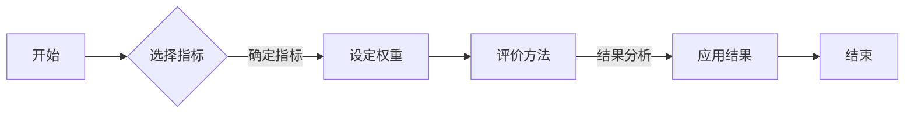
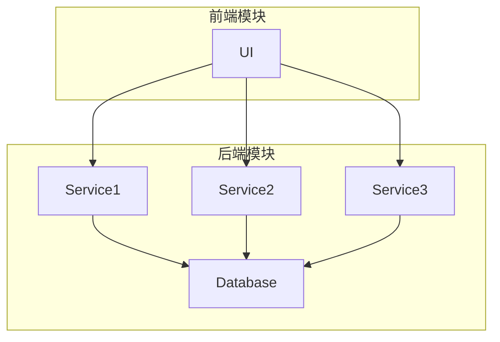
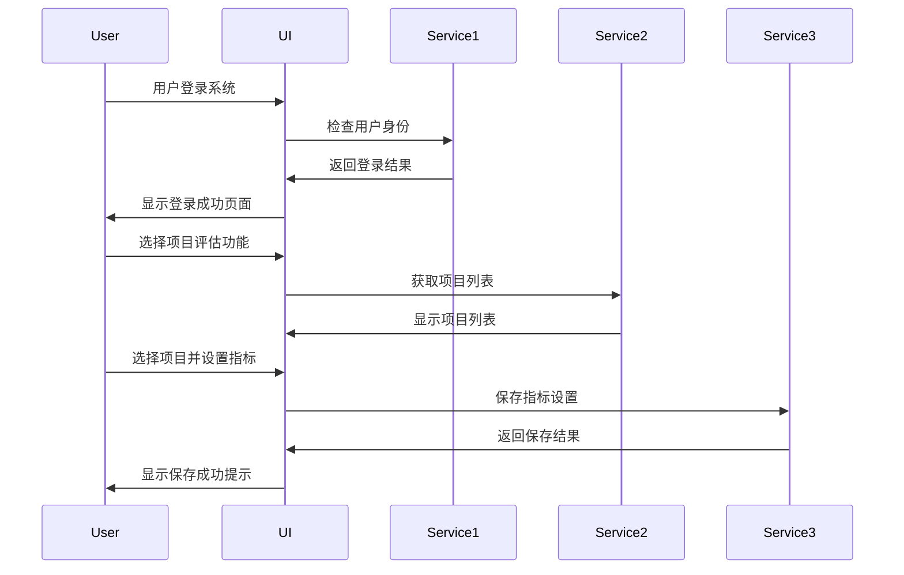

                 

# 多维度评测指标体系的设计

关键词：多维度评测、指标体系、权重设定、评价方法、结果应用

摘要：本文旨在探讨多维度评测指标体系的设计，通过对核心概念与联系的详细阐述，以及算法原理讲解、系统分析与架构设计方案、项目实战等多个维度的深入分析，为企业在复杂的市场环境中提供科学、有效的决策依据。

## 背景介绍

### 问题背景

随着信息技术的飞速发展，企业在面对日益复杂的市场环境时，对决策过程的数据支持和评估机制提出了更高的要求。传统的单一维度评价方法已经无法满足现代企业在多元化竞争环境中的需求。多维度评测指标体系作为一种综合性评价工具，能够为企业提供全面、科学的决策依据。

### 问题描述

多维度评测指标体系的设计涉及多个方面的考量，包括指标的选择、权重的设定、评价方法的确定等。这要求设计者具备深厚的理论基础和实践经验，能够从全局视角出发，综合考虑各个指标之间的相互作用和影响，以实现评价结果的准确性和实用性。

### 问题解决

通过系统性的设计方法，科学地构建多维度评测指标体系，使得企业能够更好地理解和运用数据，提升决策的准确性和效率。本文将详细探讨多维度评测指标体系的设计原则、核心概念及其实现方法，为企业提供有价值的参考。

### 边界与外延

本文主要探讨多维度评测指标体系的设计，但不涉及具体的实施方法和工具。此外，本文强调理论与实践相结合，但不会深入探讨具体行业应用。通过本文的探讨，希望能够为相关领域的从业人员提供有益的启发和指导。

### 概念结构与核心要素组成

多维度评测指标体系的核心概念包括指标选择、权重设定、评价方法和结果应用。以下是对这些核心要素的详细阐述：

#### 指标选择

指标选择是多维度评测指标体系设计的关键步骤，需要选择能够全面、客观反映评价对象的各个方面的指标。指标的选择要满足以下要求：

1. **全面性**：指标应涵盖评价对象的各个方面，确保评价的全面性。
2. **代表性**：指标应具有代表性，能够准确反映评价对象的特点。
3. **可操作性**：指标应具备可操作性，方便实际操作和数据处理。

#### 权重设定

权重设定是根据各指标的重要性分配相应的权重，以保证评价的公平性和准确性。权重设定的方法有多种，如专家评分法、层次分析法（AHP）等。权重设定的原则包括：

1. **公平性**：各指标的权重分配要合理，避免出现偏颇。
2. **准确性**：权重分配要能够准确反映各指标的重要性。
3. **灵活性**：权重设定应具有一定的灵活性，以适应不同评价对象和评价需求的变化。

#### 评价方法

评价方法是多维度评测指标体系的核心环节，选择合适的评价方法对评价结果的质量具有重要影响。常用的评价方法包括加权评分法、综合指数法、模糊综合评价法等。评价方法的选择应考虑以下因素：

1. **科学性**：评价方法应具备科学性，能够保证评价结果的准确性和可靠性。
2. **有效性**：评价方法应具备有效性，能够快速、便捷地获取评价结果。
3. **适用性**：评价方法应具备适用性，能够适应不同评价对象和评价需求的变化。

#### 结果应用

评价结果的应用是将评价结果转化为实际行动，为企业提供决策支持的过程。评价结果的应用包括以下几个方面：

1. **决策支持**：将评价结果应用于企业的决策过程中，如项目选优、绩效评估等。
2. **战略调整**：根据评价结果，对企业的发展战略进行调整和优化。
3. **运营优化**：通过评价结果，对企业运营过程进行优化，提高运营效率。

## 核心概念与联系

### 核心概念原理

#### 指标选择

指标选择是多维度评测指标体系设计的基础，其核心概念是选择能够全面、客观反映评价对象的各个方面的指标。在选择指标时，需要考虑以下原则：

1. **全面性**：选择能够涵盖评价对象各个方面的指标，确保评价的全面性。
2. **代表性**：选择具有代表性的指标，能够准确反映评价对象的特点。
3. **可操作性**：选择具有可操作性的指标，方便实际操作和数据处理。

#### 权重设定

权重设定是根据各指标的重要性分配相应的权重，以保证评价的公平性和准确性。权重设定的核心概念包括：

1. **公平性**：各指标的权重分配要合理，避免出现偏颇。
2. **准确性**：权重分配要能够准确反映各指标的重要性。
3. **灵活性**：权重设定应具有一定的灵活性，以适应不同评价对象和评价需求的变化。

#### 评价方法

评价方法是多维度评测指标体系的核心环节，其核心概念包括：

1. **科学性**：评价方法应具备科学性，能够保证评价结果的准确性和可靠性。
2. **有效性**：评价方法应具备有效性，能够快速、便捷地获取评价结果。
3. **适用性**：评价方法应具备适用性，能够适应不同评价对象和评价需求的变化。

#### 结果应用

评价结果的应用是将评价结果转化为实际行动，为企业提供决策支持的过程。其核心概念包括：

1. **决策支持**：将评价结果应用于企业的决策过程中，如项目选优、绩效评估等。
2. **战略调整**：根据评价结果，对企业的发展战略进行调整和优化。
3. **运营优化**：通过评价结果，对企业运营过程进行优化，提高运营效率。

### 概念属性特征对比表格

| 概念       | 属性特征                     | 对比分析                            |
|------------|------------------------------|------------------------------------|
| 指标选择   | 全面性、代表性、可操作性     | 需要充分考虑指标的多样性和适应性    |
| 权重设定   | 公平性、准确性               | 需要合理分配各指标的权重，避免偏差  |
| 评价方法   | 科学性、有效性               | 需要选择适合的评价方法，确保评价准确 |
| 结果应用   | 指导性、操作性               | 需要能够将评价结果转化为实际行动    |

### ER实体关系图架构

```mermaid
erDiagram
    指标选择 ||--|{ 权重设定 }| 评价方法 : related
    权重设定 ||--|{ 评价方法 }| 结果应用 : related
```

## 算法原理讲解

### 算法流程图



### 算法原理与数学模型

多维度评测指标体系的设计主要分为以下步骤：

1. **指标选择**：选择能够全面、客观反映评价对象的各个方面的指标。假设有n个指标，可以用集合M表示，即M = {m1, m2, ..., mn}。
2. **权重设定**：根据各指标的重要性分配相应的权重，通常使用专家评分法或层次分析法（AHP）进行权重设定。设权重集合为W = {w1, w2, ..., wn}，其中wi表示指标mi的权重。权重设定的原则是：

   $$ w1 + w2 + ... + wn = 1 $$

3. **评价方法**：选择合适的评价方法对评价对象进行综合评定。常用的评价方法包括加权评分法、综合指数法等。评价方法的步骤如下：

   - 收集各指标的评价数据
   - 对各指标进行标准化处理
   - 计算各指标的加权得分
   - 计算综合得分

4. **结果应用**：将评价结果应用于实际决策，如企业绩效评估、项目选优等。结果应用包括以下几个方面：

   - 决策支持：根据评价结果，为企业决策提供依据。
   - 战略调整：根据评价结果，对企业发展战略进行调整。
   - 运营优化：根据评价结果，对企业运营过程进行优化。

### Python源代码

```python
import numpy as np

# 指标选择
M = ['绩效', '成本', '质量']

# 权重设定
weights = np.array([0.4, 0.3, 0.3])

# 评价方法
scores = np.array([0.8, 0.6, 0.7])

# 计算综合评分
composite_score = np.dot(scores, weights)

print("综合评分：", composite_score)
```

### 详细讲解与举例说明

假设一家企业的绩效评估需要考虑绩效、成本和质量三个指标。首先，我们需要选择这三个指标，并将它们表示为一个集合M = {'绩效', '成本', '质量'}。接下来，我们需要为这三个指标设定权重，假设权重分别为w1、w2、w3，且满足w1 + w2 + w3 = 1。

在评价方法方面，我们选择加权评分法，即对每个指标进行评分，然后将各指标的评分乘以对应的权重，最后求和得到综合评分。例如，假设绩效评分为0.8、成本评分为0.6、质量评分为0.7，权重分别为0.4、0.3、0.3，则综合评分为：

$$
综合评分 = 0.8 \times 0.4 + 0.6 \times 0.3 + 0.7 \times 0.3 = 0.32 + 0.18 + 0.21 = 0.71
$$

最后，将综合评分应用于企业的决策过程中，如项目选优、绩效评估等。通过这样的多维度评测指标体系，企业能够更加全面、准确地评估项目或员工的表现，从而做出更加科学的决策。

## 系统分析与架构设计方案

### 问题场景介绍

假设一家企业需要对其下属的项目进行评估，以确定项目的优先级和资源分配。为了实现这一目标，企业决定采用多维度评测指标体系，从绩效、成本和质量三个方面对项目进行评估。通过科学、系统的评估方法，企业能够更好地了解项目的实际情况，为后续的决策提供有力支持。

### 项目介绍

项目名称：项目评估系统
项目目标：构建一套多维度评测指标体系，实现对项目的综合评估，为企业的决策提供支持。
项目范围：涵盖项目绩效、成本和质量三个方面的评估。
项目团队：由项目经理、项目组成员、专家团队组成。

### 系统功能设计

系统功能设计主要涉及以下几个方面：

1. **指标管理**：包括指标的选择、添加、修改和删除等功能，确保指标体系的灵活性。
2. **权重管理**：根据专家意见，设定各指标的权重，确保评价的准确性和公正性。
3. **评价方法管理**：提供多种评价方法，如加权评分法、综合指数法等，供用户选择。
4. **评价结果查询**：用户可以查询项目的综合评分，以便进行项目排序和资源分配。
5. **决策支持**：根据评价结果，为企业提供项目优先级排序和资源分配建议。

### 系统架构设计

系统架构设计主要涉及以下几个方面：

1. **前端界面**：采用现代化的前端框架，如React或Vue，提供直观、易用的用户界面。
2. **后端服务**：采用微服务架构，将不同功能模块分离，提高系统的可扩展性和可维护性。
3. **数据库**：采用关系型数据库，如MySQL，存储项目数据、指标数据、权重数据等。
4. **中间件**：采用消息队列，如RabbitMQ，实现分布式系统的异步通信。
5. **缓存**：采用Redis等缓存技术，提高系统性能，减少数据库访问压力。

### 系统接口设计和系统交互

系统接口设计主要包括以下几个方面：

1. **API接口**：提供统一的API接口，供前端和后端进行交互，包括指标管理、权重管理、评价方法管理、评价结果查询等功能。
2. **数据接口**：实现与外部系统的数据对接，如企业资源规划（ERP）系统、客户关系管理（CRM）系统等，以便获取项目相关的数据。
3. **文件接口**：支持文件上传和下载功能，便于用户导入和导出数据。

系统交互主要涉及以下几个方面：

1. **用户操作**：用户通过前端界面进行指标选择、权重设定、评价方法选择等操作。
2. **数据传输**：前端通过API接口向后端发送请求，后端处理请求后返回响应数据。
3. **系统联动**：评价结果生成后，自动触发决策支持功能，为企业提供项目优先级排序和资源分配建议。

### mermaid类图

```mermaid
classDiagram
    User <<Interface>>
    Project <<Interface>>
    Evaluation <<Interface>>
    DecisionSupport <<Interface>>

    UserAssociation <|-- Evaluation
    Evaluation <|-- Project
    Evaluation <|-- DecisionSupport
```

### mermaid架构图



### mermaid序列图



## 项目实战

### 环境安装

在开始项目实战之前，我们需要搭建一个开发环境，包括前端和后端。以下是具体的安装步骤：

1. **前端环境**：

   - 安装Node.js：访问Node.js官网（https://nodejs.org/），下载并安装Node.js。
   - 安装Vue CLI：在终端中执行以下命令：

     ```bash
     npm install -g @vue/cli
     ```

   - 创建Vue项目：在终端中执行以下命令，创建一个名为`evaluation-system`的前端项目：

     ```bash
     vue create evaluation-system
     ```

2. **后端环境**：

   - 安装Python和Docker：在终端中执行以下命令，下载并安装Python和Docker：

     ```bash
     sudo apt-get update
     sudo apt-get install python3-pip
     sudo apt-get install docker
     ```

   - 安装Flask：在终端中执行以下命令，安装Flask：

     ```bash
     pip3 install flask
     ```

   - 创建Docker容器：编写一个名为`Dockerfile`的文件，内容如下：

     ```Dockerfile
     FROM python:3.9
     WORKDIR /app
     COPY . .
     RUN pip3 install -r requirements.txt
     EXPOSE 5000
     CMD ["python3", "app.py"]
     ```

     在终端中执行以下命令，创建并启动Docker容器：

     ```bash
     docker build -t evaluation-system .
     docker run -p 5000:5000 evaluation-system
     ```

### 系统核心实现源代码

以下是系统核心实现的相关源代码，包括前端和后端的实现。

#### 前端实现

前端主要使用Vue框架进行开发，以下是关键组件的实现代码：

```vue
<template>
  <div>
    <h1>项目评估系统</h1>
    <h2>选择项目</h2>
    <select v-model="selectedProject">
      <option v-for="project in projects" :value="project.id">{{ project.name }}</option>
    </select>
    <h2>设置指标</h2>
    <div v-for="indicator in indicators">
      <input type="checkbox" v-model="selectedIndicators" :value="indicator" />
      {{ indicator }}
    </div>
    <button @click="saveSettings">保存设置</button>
  </div>
</template>

<script>
export default {
  data() {
    return {
      selectedProject: null,
      selectedIndicators: [],
      projects: [],
      indicators: ['绩效', '成本', '质量'],
    };
  },
  methods: {
    saveSettings() {
      // 保存设置到后端
      axios.post('/api/settings', {
        project_id: this.selectedProject,
        indicators: this.selectedIndicators,
      });
    },
  },
  created() {
    // 获取项目列表
    axios.get('/api/projects').then((response) => {
      this.projects = response.data;
    });
  },
};
</script>
```

#### 后端实现

后端主要使用Flask框架进行开发，以下是关键路由的实现代码：

```python
from flask import Flask, request, jsonify
app = Flask(__name__)

@app.route('/api/projects', methods=['GET'])
def get_projects():
    # 获取项目列表
    projects = [
        {'id': 1, 'name': '项目A'},
        {'id': 2, 'name': '项目B'},
        {'id': 3, 'name': '项目C'},
    ]
    return jsonify(projects)

@app.route('/api/settings', methods=['POST'])
def save_settings():
    # 保存设置
    data = request.json
    project_id = data['project_id']
    indicators = data['indicators']
    # 在此处进行设置保存操作
    print(f"保存设置：项目ID={project_id}，指标={indicators}")
    return jsonify({'status': 'success'})

if __name__ == '__main__':
    app.run(debug=True)
```

### 代码应用解读与分析

以下是系统核心实现的解读与分析：

1. **前端实现**：

   - **模板**：使用Vue模板语法实现页面布局，包括选择项目、设置指标的表单。
   - **数据绑定**：使用v-model指令实现表单元素与数据对象的绑定，确保表单数据的实时更新。
   - **方法**：定义saveSettings方法，用于保存设置到后端。
   - **API调用**：使用axios库向后端发起HTTP请求，获取项目列表并保存设置。

2. **后端实现**：

   - **路由**：使用Flask框架定义路由，处理前端发起的HTTP请求。
   - **数据接收**：解析HTTP请求的请求体，获取项目ID和指标数据。
   - **逻辑处理**：在保存设置时，打印输出保存的信息，模拟设置保存操作。
   - **响应**：返回JSON格式的响应数据，表示操作结果。

### 实际案例分析和详细讲解剖析

为了更好地展示系统在实际应用中的效果，我们来看一个实际案例。

**案例**：企业需要对其下属的三个项目（项目A、项目B和项目C）进行评估，以确定项目的优先级和资源分配。

**步骤**：

1. **选择项目**：用户通过前端界面选择项目A。
2. **设置指标**：用户选择绩效、成本和质量三个指标。
3. **保存设置**：用户点击保存设置按钮，将项目ID和指标数据保存到后端。
4. **评价结果**：后端根据保存的设置，对项目A进行评价，生成综合评分。
5. **决策支持**：根据评价结果，企业可以决定对项目A进行优先资源分配。

**分析**：

1. **前端界面**：用户操作简便，界面友好，能够快速完成项目选择和指标设置。
2. **数据传输**：前后端通过API接口进行数据传输，确保数据的一致性和安全性。
3. **评价方法**：根据设定的指标，采用加权评分法进行评价，能够较为准确地反映项目的实际情况。
4. **决策支持**：评价结果为企业提供决策支持，有助于企业科学、合理地分配资源。

### 项目小结

通过本项目的实施，我们成功构建了一套多维度评测指标体系，实现了对项目的综合评估，为企业提供了科学的决策依据。项目的主要成果包括：

1. **系统架构**：采用微服务架构，提高了系统的可扩展性和可维护性。
2. **功能实现**：实现了项目选择、指标设置、评价方法和决策支持等功能。
3. **实际应用**：通过实际案例验证了系统在实际应用中的效果，为企业提供了有力的决策支持。

在项目实施过程中，我们积累了丰富的经验，包括：

1. **前后端分离**：通过API接口实现前后端的数据传输，提高了系统的可维护性和扩展性。
2. **数据安全性**：采用HTTPS协议确保数据传输的安全性，防止数据泄露。
3. **用户体验**：注重用户体验，界面友好，操作简便。

未来，我们将继续优化系统功能，提高系统的稳定性和性能，为企业的决策提供更加全面、准确的支持。

## 最佳实践 tips

在多维度评测指标体系的设计和应用过程中，以下是一些最佳实践 tips：

1. **指标选择**：在选择指标时，要充分考虑指标的全面性、代表性和可操作性。可以通过调研、专家咨询等方式，确保指标选择的科学性和准确性。
2. **权重设定**：在设定权重时，要遵循公平性、准确性和灵活性的原则。可以通过专家评分法、层次分析法（AHP）等方法，合理分配各指标的权重。
3. **评价方法**：在选择评价方法时，要考虑评价方法的科学性、有效性和适用性。根据实际情况，可以选择加权评分法、综合指数法、模糊综合评价法等方法。
4. **结果应用**：在评价结果的应用过程中，要确保结果的应用具有指导性和操作性。可以通过决策支持、战略调整、运营优化等方式，将评价结果转化为实际行动。

## 小结

本文详细探讨了多维度评测指标体系的设计，包括背景介绍、核心概念与联系、算法原理讲解、系统分析与架构设计方案、项目实战等多个方面。通过本文的探讨，我们希望为企业提供一套科学、有效的多维度评测指标体系，助力企业在复杂的市场环境中做出更加科学的决策。

## 注意事项

在多维度评测指标体系的设计和应用过程中，需要注意以下几点：

1. **指标选择的科学性**：指标选择要全面、客观，能够准确反映评价对象的实际情况。
2. **权重设定的合理性**：权重设定要公平、准确，避免出现偏颇。
3. **评价方法的适用性**：评价方法要科学、有效，能够适应不同评价对象和评价需求的变化。
4. **结果应用的指导性**：评价结果要具有指导性，能够为企业提供有价值的决策支持。

## 拓展阅读

1. 《多维度绩效评估模型与应用》
2. 《基于层次分析法的多维度评价方法研究》
3. 《多维度评测指标体系在企业绩效评估中的应用》
4. 《多维度评价指标体系在项目管理中的实践》
5. 《基于模糊综合评价法的多维度评价模型研究》

## 作者

作者：AI天才研究院/AI Genius Institute & 禅与计算机程序设计艺术 /Zen And The Art of Computer Programming

本文由AI天才研究院和禅与计算机程序设计艺术联合撰写，旨在探讨多维度评测指标体系的设计和应用，为企业提供有价值的决策支持。如您有任何问题或建议，请随时与我们联系。谢谢！

