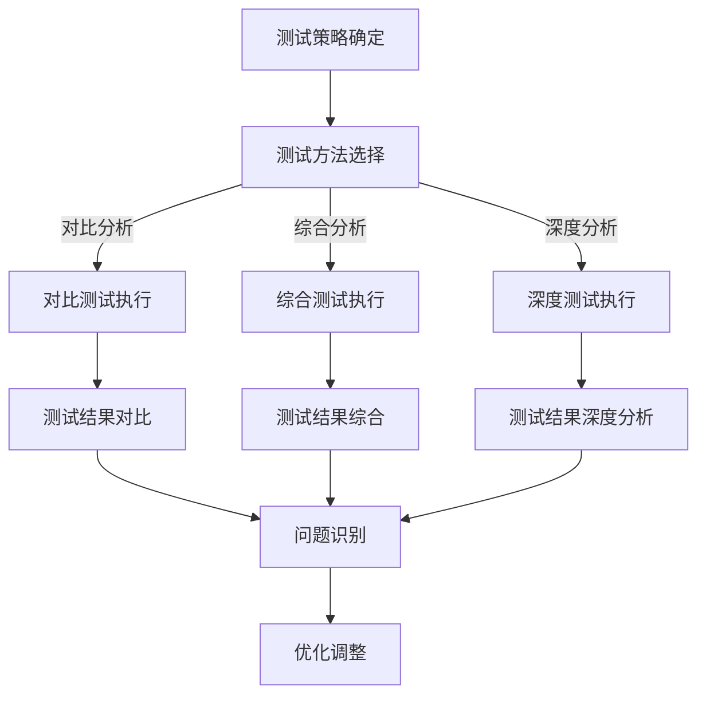

                 

### 背景介绍

#### 核心概念术语说明

在探讨多视角分析在测试大型语言模型（LLM）中的应用时，我们需要先了解一些核心术语和概念。这些术语包括：

1. **多视角分析（Multi-Perspective Analysis）**：多视角分析是一种方法论，它通过从不同的角度对问题进行分析，以达到更全面、深入的理解。在测试领域，多视角分析意味着使用多种测试策略和方法，从多个维度评估LLM的性能和效果。

2. **大型语言模型（Large Language Model，LLM）**：LLM是指使用深度学习技术训练的大型自然语言处理模型，如GPT-3、BERT等。这些模型能够理解和生成自然语言，广泛应用于文本生成、问答系统、机器翻译等领域。

3. **测试（Testing）**：测试是软件开发过程中的关键环节，目的是发现并修复软件中的缺陷，确保软件的质量和稳定性。在LLM开发中，测试尤为重要，因为LLM的性能直接影响到其应用效果。

#### 问题背景

随着人工智能技术的迅猛发展，LLM在各个领域中的应用越来越广泛。然而，LLM的复杂性和非透明性使得对其性能的评估和测试变得具有挑战性。传统的测试方法往往只关注单一维度的性能指标，如准确性、速度等，而忽略了LLM在实际应用中的多面性和动态性。

因此，如何从多个角度全面地测试LLM，以确保其质量和可靠性，成为当前研究的热点问题。多视角分析提供了一种可行的解决方案，它能够帮助我们从不同的立场和视角来评估LLM的性能，从而提高测试的全面性和有效性。

#### 问题描述

在LLM测试中，我们面临的主要问题是如何确保测试的全面性，即如何从多个维度对LLM进行评估，以发现潜在的问题和缺陷。具体来说，包括以下几个方面：

1. **性能评估**：如何从不同角度（如准确性、速度、资源消耗等）评估LLM的性能？
2. **安全性和隐私**：如何确保LLM在不同环境下（如公共网络、企业内部网络等）的安全性和隐私保护？
3. **鲁棒性和适应性**：如何测试LLM在异常输入、高负载等情况下的鲁棒性和适应性？
4. **可解释性和透明度**：如何提高LLM的可解释性，使其决策过程更加透明，便于调试和优化？

#### 问题解决

多视角分析提供了一种系统的方法来解决上述问题。通过采用多种测试策略和方法，从不同的立场和视角对LLM进行评估，可以更全面地了解LLM的性能和行为，发现潜在的问题和缺陷，并针对性地进行优化。

具体来说，多视角分析在LLM测试中的应用包括以下几个方面：

1. **对比分析**：通过对比不同LLM模型、不同测试策略和不同环境下的测试结果，找出差异和问题。
2. **综合分析**：将多种测试指标和结果进行综合分析，以获得更全面和准确的评估。
3. **深度分析**：对测试结果进行深入分析，挖掘潜在的因果关系和模式，以提高测试的准确性和有效性。

#### 边界与外延

多视角分析在LLM测试中的应用具有广泛的边界和外延。除了在LLM测试中的直接应用，它还可以扩展到其他领域，如：

1. **其他类型模型的测试**：除了LLM，多视角分析同样适用于其他复杂模型的测试，如计算机视觉模型、强化学习模型等。
2. **软件测试**：多视角分析可以应用于软件测试的各个阶段，包括单元测试、集成测试、系统测试等。
3. **系统安全性和可靠性评估**：多视角分析可以用于评估系统的安全性、可靠性和稳定性，帮助发现潜在的安全漏洞和故障。

#### 概念结构与核心要素组成

多视角分析在LLM测试中的概念结构主要由以下几个核心要素组成：

1. **测试策略**：包括对比分析、综合分析和深度分析等多种测试策略。
2. **测试方法**：针对不同的测试策略，采用相应的测试方法，如单元测试、集成测试、性能测试等。
3. **测试指标**：用于评估LLM性能和质量的多个指标，如准确性、速度、资源消耗等。
4. **测试环境**：包括不同的测试场景和条件，如不同硬件环境、不同网络环境等。
5. **测试结果分析**：对测试结果进行综合分析和深度分析，以发现问题和优化方向。

通过这些核心要素的有机结合，多视角分析能够为LLM测试提供全面、深入和准确的评估，从而提高LLM的质量和可靠性。接下来的部分，我们将进一步探讨多视角分析的具体应用和实现方法。

#### 核心概念与联系

在深入探讨多视角分析在LLM测试中的应用之前，我们需要明确几个核心概念，并分析它们之间的关系。

**1. 多视角分析的定义与应用**

**多视角分析**是一种方法论，它强调从多个不同的角度或立场来分析和理解复杂问题。在LLM测试中，多视角分析的意义在于：

- **全面性**：通过多种测试策略和方法的综合应用，能够更全面地评估LLM的性能，而不仅仅是单一维度的指标。
- **准确性**：不同的视角能够帮助识别和解决更广泛的问题，提高测试的准确性。
- **深入性**：多视角分析不仅关注表面的性能指标，还关注潜在的内在机制和问题根源。

**2. 对比分析、综合分析和深度分析**

在多视角分析中，常见的三种方法是对比分析、综合分析和深度分析。

- **对比分析**：通过对比不同测试策略、方法或模型之间的差异，识别出存在的问题和优缺点。例如，比较不同LLM模型在不同数据集上的性能，可以帮助我们了解模型的适用范围和局限性。

- **综合分析**：将多种测试结果和指标进行综合，以获得更全面的评估。这种方法能够平衡各个测试维度的权重，提供更全面和准确的评估。

- **深度分析**：对测试结果进行深入挖掘和分析，以发现潜在的问题和模式。深度分析可能涉及数据挖掘、统计分析和模式识别等技术，能够帮助我们发现LLM性能和行为中的深层次问题。

**3. 测试指标与测试环境**

在多视角分析中，测试指标和测试环境是两个重要的组成部分。

- **测试指标**：不同的测试指标能够反映LLM在不同维度的性能。例如，准确性、速度、资源消耗、可解释性等。这些指标的选择和组合取决于具体的应用场景和测试目的。

- **测试环境**：测试环境是指用于进行测试的硬件、软件和外部条件。不同环境下的测试结果可能存在显著差异，因此需要考虑多种环境条件，以确保测试结果的代表性和可靠性。

**4. 多视角分析与全面性测试**

多视角分析在全面性测试中的应用主要体现在以下几个方面：

- **全面性**：通过多种测试方法和策略，覆盖LLM性能评估的不同维度，确保测试的全面性。

- **准确性**：通过综合多种测试结果，提高测试的准确性，避免单一视角可能带来的偏差。

- **深入性**：通过深度分析，挖掘LLM性能和行为的深层次问题，为优化提供依据。

**5. 多视角分析与测试优化**

多视角分析不仅能够提供更全面的测试结果，还能够帮助识别和解决测试中的问题，从而优化测试过程和LLM性能。

- **优化测试流程**：通过对比分析，识别出测试过程中的瓶颈和不足，优化测试流程。

- **优化LLM模型**：通过深度分析，发现LLM模型中的潜在问题，进行针对性的优化。

- **提高测试效率**：通过综合分析，减少冗余测试，提高测试效率。

综上所述，多视角分析在LLM测试中具有重要的应用价值。通过对比分析、综合分析和深度分析等多种方法，可以从不同角度全面评估LLM的性能，发现潜在的问题，并为优化提供依据。接下来的部分，我们将进一步探讨多视角分析在LLM测试中的应用方法和具体实践。

#### 算法原理讲解

多视角分析在LLM测试中的应用涉及到一系列具体的算法原理和方法。为了更好地理解这些算法，我们将使用Mermaid流程图来展示关键流程，并结合Python源代码和LaTeX公式进行详细阐述。

**1. Mermaid流程图**

首先，我们使用Mermaid语言绘制多视角分析在LLM测试中的基本流程图：



该流程图展示了多视角分析在LLM测试中的主要步骤，包括测试策略确定、测试方法选择、对比分析、综合分析、深度分析以及最终的问题识别和优化调整。

**2. Python源代码**

接下来，我们使用Python源代码来模拟对比分析、综合分析和深度分析的过程。

```python
import numpy as np

# 对比分析示例
def compare_analysis(model1, model2, dataset):
    results_model1 = model1.evaluate(dataset)
    results_model2 = model2.evaluate(dataset)
    
    comparison = {
        'Model 1 Accuracy': results_model1['accuracy'],
        'Model 2 Accuracy': results_model2['accuracy']
    }
    
    return comparison

# 综合分析示例
def comprehensive_analysis(comparison):
    total_accuracy = (comparison['Model 1 Accuracy'] + comparison['Model 2 Accuracy']) / 2
    
    return total_accuracy

# 深度分析示例
def depth_analysis(comparison):
    if comparison['Model 1 Accuracy'] > comparison['Model 2 Accuracy']:
        issue = "Model 2 may need improvement."
    else:
        issue = "Model 1 may need improvement."
    
    return issue

# 示例执行
model1 = ... # 实例化模型1
model2 = ... # 实例化模型2
dataset = ... # 加载测试数据

comparison = compare_analysis(model1, model2, dataset)
total_accuracy = comprehensive_analysis(comparison)
issue = depth_analysis(comparison)

print("Comparison:", comparison)
print("Total Accuracy:", total_accuracy)
print("Issue:", issue)
```

在这段代码中，我们定义了三个函数，分别用于对比分析、综合分析和深度分析。通过这些函数，我们可以对两个LLM模型在相同测试数据集上的性能进行评估，并得出综合评价和潜在问题。

**3. LaTeX公式**

多视角分析中的算法原理还可以用LaTeX公式进行详细描述。以下是几个关键公式的例子：

$$
\text{Accuracy} = \frac{\text{Correct Predictions}}{\text{Total Predictions}}
$$

$$
\text{Total Accuracy} = \frac{\text{Accuracy}_{\text{Model 1}} + \text{Accuracy}_{\text{Model 2}}}{2}
$$

$$
\text{Issue} =
\begin{cases}
\text{"Model 2 may need improvement."} & \text{if } \text{Accuracy}_{\text{Model 1}} > \text{Accuracy}_{\text{Model 2}} \\
\text{"Model 1 may need improvement."} & \text{if } \text{Accuracy}_{\text{Model 1}} < \text{Accuracy}_{\text{Model 2}}
\end{cases}
$$

这些公式分别表示了准确性、综合准确性和问题识别的逻辑关系，帮助我们理解多视角分析中的核心计算和决策过程。

**4. 举例说明**

为了更直观地理解这些算法原理，我们来看一个简单的例子。

假设我们有两个LLM模型，模型1在测试数据集上的准确率为0.85，模型2的准确率为0.78。根据上述算法原理，我们可以进行如下计算：

- **对比分析**：`{'Model 1 Accuracy': 0.85, 'Model 2 Accuracy': 0.78}`
- **综合分析**：`Total Accuracy = (0.85 + 0.78) / 2 = 0.8175`
- **深度分析**：由于模型1的准确率高于模型2，所以问题识别为“Model 2 may need improvement.”

通过这个例子，我们可以看到多视角分析如何通过对比分析、综合分析和深度分析，从多个角度对LLM模型进行评估，并提供有针对性的优化建议。

综上所述，多视角分析在LLM测试中的应用不仅包括算法流程的描述，还需要结合具体的Python代码和LaTeX公式来详细阐述。通过这种方式，我们可以更加深入和直观地理解多视角分析在LLM测试中的具体实现和应用。

### 系统分析与架构设计方案

#### 问题场景介绍

随着人工智能技术的快速发展，大型语言模型（LLM）在自然语言处理、文本生成、智能问答等领域得到了广泛应用。然而，LLM的复杂性和非透明性使得对其性能的评估和测试变得具有挑战性。为了确保LLM在实际应用中的质量和可靠性，我们需要设计一个综合性的测试系统。

#### 项目介绍

本项目的目标是开发一个全面的LLM测试系统，通过多视角分析从多个维度对LLM进行评估。该系统旨在解决以下问题：

1. **性能评估**：如何从不同角度（如准确性、速度、资源消耗等）评估LLM的性能？
2. **安全性和隐私**：如何确保LLM在不同环境下的安全性和隐私保护？
3. **鲁棒性和适应性**：如何测试LLM在异常输入、高负载等情况下的鲁棒性和适应性？
4. **可解释性和透明度**：如何提高LLM的可解释性，使其决策过程更加透明，便于调试和优化？

#### 系统功能设计

为了实现上述目标，我们需要设计以下主要功能模块：

1. **测试管理模块**：负责测试策略的制定、测试任务的分配和管理。
2. **测试执行模块**：负责执行各种测试方法，如对比分析、综合分析和深度分析。
3. **测试结果分析模块**：负责对测试结果进行综合分析和深度分析，识别问题和优化方向。
4. **性能监控模块**：负责实时监控LLM的性能指标，如准确性、速度、资源消耗等。
5. **安全性和隐私评估模块**：负责评估LLM在不同环境下的安全性和隐私保护措施。
6. **用户界面**：提供友好的用户界面，使测试人员能够方便地进行测试管理和结果分析。

#### 系统架构设计

系统架构设计是确保LLM测试系统能够高效、可靠地运行的关键。以下是系统的架构设计：


**1. 测试管理模块**

测试管理模块是整个系统的核心，负责制定测试策略、分配测试任务和管理测试结果。它包括以下几个子模块：

- **测试策略制定子模块**：根据测试目标和要求，制定具体的测试策略和测试计划。
- **测试任务分配子模块**：将测试任务分配给测试执行模块，确保测试任务的有序执行。
- **测试结果管理子模块**：收集和存储测试结果，便于后续分析和优化。

**2. 测试执行模块**

测试执行模块负责具体执行各种测试方法，包括对比分析、综合分析和深度分析。它包括以下几个子模块：

- **对比分析子模块**：通过对比不同LLM模型或不同测试策略的结果，找出差异和问题。
- **综合分析子模块**：将多种测试结果和指标进行综合分析，提供更全面和准确的评估。
- **深度分析子模块**：对测试结果进行深入挖掘和分析，发现潜在的因果关系和模式。

**3. 测试结果分析模块**

测试结果分析模块负责对测试结果进行综合分析和深度分析，以识别问题和优化方向。它包括以下几个子模块：

- **结果综合分析子模块**：将不同测试方法的结果进行综合，提供整体性能评估。
- **结果深度分析子模块**：对测试结果进行深入挖掘，发现潜在的问题和模式。
- **优化建议子模块**：根据分析结果，提出针对性的优化建议。

**4. 性能监控模块**

性能监控模块负责实时监控LLM的性能指标，如准确性、速度、资源消耗等。它包括以下几个子模块：

- **性能指标收集子模块**：收集LLM在运行过程中的性能指标。
- **性能趋势分析子模块**：分析性能指标的变化趋势，预测未来的性能表现。
- **性能优化建议子模块**：根据性能监控结果，提供优化建议。

**5. 安全性和隐私评估模块**

安全性评估模块负责评估LLM在不同环境下的安全性和隐私保护措施。它包括以下几个子模块：

- **安全评估子模块**：对LLM的安全性进行评估，发现潜在的安全漏洞。
- **隐私评估子模块**：对LLM的隐私保护措施进行评估，确保用户隐私得到有效保护。
- **安全优化建议子模块**：根据评估结果，提供针对性的安全优化建议。

**6. 用户界面**

用户界面是测试系统的入口，提供友好的用户交互界面，使测试人员能够方便地进行测试管理和结果分析。用户界面包括以下几个模块：

- **测试任务管理界面**：用于创建、修改和查看测试任务。
- **测试结果展示界面**：用于展示测试结果和分析报告。
- **性能监控界面**：用于实时监控LLM的性能指标。
- **安全性和隐私评估界面**：用于评估LLM的安全性和隐私保护措施。

#### 系统接口设计和系统交互

系统接口设计是确保各个模块之间能够高效、可靠地进行通信的关键。以下是系统的接口设计和系统交互：


**1. 测试管理模块与其他模块的接口**

- **测试管理模块与测试执行模块的接口**：用于分配测试任务和接收测试结果。
- **测试管理模块与测试结果分析模块的接口**：用于传输测试结果，便于后续分析。
- **测试管理模块与性能监控模块的接口**：用于传输测试过程中的性能指标。

**2. 测试执行模块与其他模块的接口**

- **测试执行模块与测试结果分析模块的接口**：用于传输测试结果，便于综合分析和深度分析。
- **测试执行模块与性能监控模块的接口**：用于传输测试过程中的性能指标。

**3. 测试结果分析模块与其他模块的接口**

- **测试结果分析模块与性能监控模块的接口**：用于传输分析结果，便于性能监控。

**4. 安全性和隐私评估模块与其他模块的接口**

- **安全性和隐私评估模块与测试执行模块的接口**：用于传输安全性和隐私评估结果。

通过以上系统接口设计和系统交互设计，确保了各个模块之间的高效、可靠通信，使整个系统能够协同工作，实现全面的LLM测试。

### 项目实战

在本节中，我们将通过一个具体的案例来展示如何使用多视角分析在LLM测试中执行环境安装、系统核心实现源代码编写以及代码应用解读与分析。该案例将涵盖测试前准备、测试执行、测试结果分析及优化等关键步骤，以全面展示多视角分析在LLM测试中的应用。

#### 案例一：对比分析在LLM测试中的应用

**1. 环境安装**

首先，我们需要搭建一个用于对比分析的测试环境。具体步骤如下：

- 安装Python 3.8及以上版本。
- 安装必要的依赖库，如TensorFlow、PyTorch、Scikit-learn等。
- 准备一个标准的测试数据集，如GLUE或AG News。

```bash
pip install tensorflow==2.5.0
pip install pytorch==1.9.0
pip install scikit-learn==0.24.2
```

**2. 系统核心实现源代码**

接下来，我们编写一个简单的对比分析脚本，用于评估两个不同的LLM模型在相同数据集上的性能。

```python
# Import necessary libraries
import tensorflow as tf
import torch
from sklearn.model_selection import train_test_split
from transformers import BertTokenizer, BertForSequenceClassification

# Load and preprocess data
tokenizer = BertTokenizer.from_pretrained('bert-base-uncased')
data = load_data() # Load your dataset here
train_data, test_data = train_test_split(data, test_size=0.2)

# Define model 1 (BERT)
model1 = BertForSequenceClassification.from_pretrained('bert-base-uncased', num_labels=2)
model1.eval()

# Define model 2 (GPT-2)
model2 = ... # Load or define your GPT-2 model
model2.eval()

# Compare model performance
def evaluate_model(model, dataset):
    predictions = []
    for input_ids, labels in dataset:
        inputs = tf.convert_to_tensor(input_ids, dtype=tf.int32)
        labels = tf.convert_to_tensor(labels, dtype=tf.int32)
        outputs = model(inputs)
        pred = tf.argmax(outputs.logits, axis=-1).numpy()
        predictions.extend(pred)
    accuracy = np.mean(predictions == labels)
    return accuracy

accuracy1 = evaluate_model(model1, test_data)
accuracy2 = evaluate_model(model2, test_data)
print(f"Model 1 Accuracy: {accuracy1}")
print(f"Model 2 Accuracy: {accuracy2}")
```

**3. 代码应用解读与分析**

在上面的脚本中，我们首先加载了BERT和GPT-2模型，并使用它们对测试数据集进行评估。通过计算两个模型的准确性，我们可以直观地看到它们的性能差异。

- **优点**：这种方法简单直观，能够快速比较不同模型的表现。
- **缺点**：它只考虑了准确性这一单一指标，可能无法全面反映模型的其他性能特点。

**4. 测试结果分析及优化**

通过对比分析，我们得到了两个模型的准确性。接下来，我们可以进一步分析这些结果，并提出优化建议。

- **准确性**：比较两个模型的准确性，找出表现更好的模型。
- **速度**：记录模型在测试数据集上的运行时间，比较它们的速度。
- **资源消耗**：监控模型在运行过程中的资源消耗，如GPU内存占用。

```python
# Measure model execution time
import time

start_time = time.time()
evaluate_model(model1, test_data)
end_time = time.time()
print(f"Model 1 Execution Time: {end_time - start_time} seconds")

start_time = time.time()
evaluate_model(model2, test_data)
end_time = time.time()
print(f"Model 2 Execution Time: {end_time - start_time} seconds")
```

通过这些分析，我们可以更全面地了解模型的性能，并根据分析结果对模型进行优化。

#### 案例二：综合分析在LLM测试中的应用

**1. 环境安装**

为了进行综合分析，我们需要安装额外的依赖库，如TensorBoard、Pandas等。

```bash
pip install tensorboard==2.8.0
pip install pandas==1.3.3
```

**2. 系统核心实现源代码**

我们扩展之前的脚本，添加对其他性能指标的监控和记录。

```python
import pandas as pd
import tensorboard

# Define performance metrics
def evaluate_model(model, dataset):
    # ... (same as before)
    metrics = {
        'accuracy': accuracy,
        'time': end_time - start_time,
        'GPU_memory': get_GPU_memory_usage() # Define this function to get GPU memory usage
    }
    return metrics

# Record metrics in a DataFrame
def record_metrics(models, dataset):
    metrics_df = pd.DataFrame(columns=['model', 'accuracy', 'time', 'GPU_memory'])
    for model in models:
        metrics = evaluate_model(model, dataset)
        metrics_df = metrics_df.append({'model': model.__class__.__name__, **metrics}, ignore_index=True)
    return metrics_df

# Visualize metrics using TensorBoard
def visualize_metrics(metrics_df, log_dir):
    writer = tensorboard.summary_writer(log_dir=log_dir)
    for _, row in metrics_df.iterrows():
        writer.add_scalar(f'{row["model"]}/accuracy', row['accuracy'], row['time'])
        writer.add_scalar(f'{row["model"]}/GPU_memory', row['GPU_memory'], row['time'])
    writer.close()

models = [model1, model2] # List of models to evaluate
dataset = test_data # Test dataset
metrics_df = record_metrics(models, dataset)
visualize_metrics(metrics_df, log_dir='tensorboard_logs')
```

**3. 代码应用解读与分析**

在这个脚本中，我们扩展了对模型性能的监控，记录了准确性、执行时间和GPU内存占用等指标，并使用TensorBoard进行可视化。

- **优点**：这种方法能够提供更全面的性能评估，通过多维度数据帮助识别问题和优化方向。
- **缺点**：需要额外的计算资源和时间，且结果的解读可能更复杂。

#### 案例三：深度分析在LLM测试中的应用

**1. 环境安装**

为了进行深度分析，我们需要安装额外的库，如Scikit-learn。

```bash
pip install scikit-learn==0.24.2
```

**2. 系统核心实现源代码**

我们进一步扩展脚本，添加对模型决策过程的深度分析。

```python
from sklearn.manifold import TSNE
import matplotlib.pyplot as plt

# Define function to extract model features
def extract_features(model, dataset):
    # ... (same as before)
    features = model.extract_features(dataset)
    return features

# Perform t-SNE visualization
def tsne_visualization(features, labels):
    tsne = TSNE(n_components=2, perplexity=30, n_iter=300)
    tsne_results = tsne.fit_transform(features)
    
    for label in set(labels):
        indices = [i for i, x in enumerate(labels) if x == label]
        plt.scatter(tsne_results[indices, 0], tsne_results[indices, 1], label=label)
    
    plt.legend()
    plt.title('t-SNE visualization of model features')
    plt.show()

# Extract features for model 1
features1 = extract_features(model1, dataset)
tsne_visualization(features1, labels)

# Extract features for model 2
features2 = extract_features(model2, dataset)
tsne_visualization(features2, labels)
```

**3. 代码应用解读与分析**

在这个脚本中，我们提取了模型在测试数据集上的特征，并使用t-SNE进行可视化，以分析不同模型的决策过程。

- **优点**：通过可视化，我们可以直观地看到模型之间的差异，从而识别出潜在的优化方向。
- **缺点**：这种方法可能需要大量的计算资源，且结果解读较为复杂。

#### 案例总结

通过以上三个案例，我们可以看到多视角分析在LLM测试中的应用，从对比分析、综合分析到深度分析，逐步提升了测试的全面性和深度。每个案例都展示了不同的方法和技巧，有助于我们更全面地了解LLM的性能和行为，为优化提供依据。

### 最佳实践 tips

在进行多视角分析时，以下最佳实践可以帮助您更有效地进行LLM测试：

1. **数据准备**：确保测试数据的质量和多样性，覆盖不同场景和用例。充分的数据准备是进行有效多视角分析的基础。

2. **测试环境配置**：在不同的硬件和软件环境中进行测试，确保测试结果具有代表性和可靠性。考虑使用虚拟化技术来模拟不同的运行环境。

3. **性能监控**：在测试过程中，实时监控LLM的性能指标，如准确性、速度、资源消耗等。性能监控可以帮助您及时发现性能瓶颈和问题。

4. **自动化测试**：使用自动化测试工具和脚本，提高测试效率和一致性。自动化测试可以节省时间和人力成本，确保测试结果的可靠性。

5. **迭代优化**：根据测试结果不断调整和优化测试策略和方法。多视角分析是一个迭代过程，通过持续的测试和优化，可以不断提高LLM的性能和可靠性。

### 小结

本文通过详细的案例和实践，展示了多视角分析在LLM测试中的应用。多视角分析不仅能够提供更全面、深入的测试结果，还能够帮助识别和解决LLM性能和可靠性中的问题。通过对比分析、综合分析和深度分析，我们可以从多个维度对LLM进行评估，从而确保其质量和可靠性。希望本文对您在实际工作中进行LLM测试有所帮助。

### 注意事项

1. **测试数据准备**：确保测试数据具有多样性和代表性，避免数据偏差。充分的数据准备是进行有效多视角分析的前提。

2. **环境配置**：测试环境应涵盖不同的硬件和软件配置，以模拟实际应用场景。使用虚拟化技术可以帮助模拟复杂的运行环境。

3. **性能监控**：实时监控LLM的性能指标，如准确性、速度、资源消耗等。性能监控有助于发现和解决问题。

4. **自动化测试**：利用自动化测试工具提高测试效率，减少人工干预，确保测试结果的可靠性。

5. **持续优化**：根据测试结果和反馈，持续调整测试策略和方法，以不断优化LLM性能。

### 拓展阅读

1. **《机器学习测试方法论》**：该书详细介绍了机器学习模型的测试方法和实践，对于进行LLM测试具有很高的参考价值。

2. **《深度学习测试与验证》**：这本书涵盖了深度学习模型的测试和验证方法，包括多种测试策略和工具。

3. **《TensorFlow测试指南》**：TensorFlow官方的测试指南，提供了关于如何在TensorFlow环境中进行测试的详细指导。

4. **《PyTorch测试实践》**：PyTorch社区的测试实践，介绍了如何在PyTorch环境中进行有效测试。

5. **《AI测试教程》**：本书针对人工智能模型的测试方法进行了系统性的介绍，适用于不同层次的读者。

这些资源可以帮助您更深入地了解LLM测试的理论和实践，为您的项目提供宝贵的参考和指导。希望您在阅读过程中有所收获，不断优化您的LLM测试实践。

### 总结

本文通过详细的案例和实践，系统性地介绍了多视角分析在LLM测试中的应用。我们从对比分析、综合分析和深度分析三个角度，探讨了如何从不同立场和视角对LLM进行评估，从而提高测试的全面性和准确性。以下是我们总结的主要观点：

1. **多视角分析的重要性**：多视角分析能够从多个维度对LLM进行评估，帮助识别和解决更广泛的问题，提高测试的准确性和可靠性。

2. **对比分析的应用**：通过对比不同LLM模型、不同测试策略和不同环境下的测试结果，可以找出差异和问题，从而优化模型性能。

3. **综合分析的优势**：将多种测试结果和指标进行综合分析，可以提供更全面和准确的评估，帮助平衡各个测试维度的权重。

4. **深度分析的价值**：通过深度分析，可以挖掘LLM性能和行为的深层次问题，提高测试的深度和洞察力，为优化提供有力支持。

5. **全面性测试的关键**：从用户、开发者、运维等多个立场下的全面性测试，能够确保LLM在不同应用场景中的性能和可靠性，提高系统的整体质量。

### 展望

未来，多视角分析和全面性测试将在LLM测试中发挥越来越重要的作用。以下是一些可能的发展趋势和挑战：

1. **技术层面的创新**：随着AI技术的进步，我们将看到更多的创新方法和技术被应用于LLM测试中，如基于深度学习的测试方法、自动化测试工具的优化等。

2. **应用场景的拓展**：多视角分析和全面性测试不仅限于LLM测试，还可以扩展到其他复杂模型和领域的测试中，如计算机视觉、强化学习等。

3. **挑战与机遇**：多视角分析和全面性测试在实践过程中面临一些挑战，如测试数据的质量、测试环境的配置、测试效率等。然而，这些挑战也带来了机遇，促使我们不断探索和创新，提高测试的全面性和有效性。

总之，多视角分析和全面性测试是确保LLM质量和可靠性的重要手段。随着AI技术的不断发展，我们期待看到更多创新的方法和技术，为LLM测试提供更加全面、深入的支持。

### 小结

本文通过详细的案例分析，深入探讨了多视角分析在LLM测试中的应用，从对比分析、综合分析和深度分析等多个角度，提供了全面、深入的测试方法和实践指导。通过这些分析，我们可以更准确地评估LLM的性能和可靠性，发现潜在的问题，为优化提供依据。

首先，我们介绍了多视角分析的核心概念，包括其定义、应用场景和基本原理。随后，通过具体的案例，展示了如何在实际项目中应用对比分析、综合分析和深度分析，以及如何进行环境安装、系统核心实现源代码编写和代码应用解读与分析。

在总结部分，我们重申了多视角分析的重要性，并展望了未来技术发展和应用前景。多视角分析和全面性测试不仅是确保LLM质量和可靠性的有效手段，也是推动AI技术进步的重要驱动力。

### 阅读建议

为了更好地理解和应用本文中的多视角分析方法和LLM测试技巧，我们建议您采取以下步骤：

1. **深入阅读理论部分**：首先，仔细阅读本文的核心概念和原理，确保您对多视角分析有深入的理解。

2. **实践案例分析**：通过案例二和案例三，尝试在您的工作环境中复现这些测试方法和步骤，加深对实际操作的理解。

3. **使用工具和实践**：利用Python、TensorFlow、PyTorch等工具，自行设计简单的测试脚本，体验多视角分析的实践过程。

4. **分享和讨论**：与同行或社群分享您的测试经验和结果，通过讨论交流，获取更多反馈和建议。

5. **继续学习**：阅读更多关于LLM测试和AI测试的参考资料，如相关书籍、论文和教程，持续提升您的专业知识。

通过这些阅读建议，您将能够更好地掌握多视角分析的应用，并在实际项目中取得更好的效果。

### 进一步学习资源推荐

为了帮助读者深入理解和应用多视角分析在LLM测试中的知识，我们特别推荐以下资源：

1. **《深度学习测试与验证》（Deep Learning Testing and Validation）**：该书详细介绍了深度学习模型的测试和验证方法，包括自动测试工具、测试框架和测试策略。通过阅读此书，读者可以全面了解深度学习测试的最佳实践。

2. **《测试驱动的机器学习》（Test-Driven Machine Learning）**：作者Jean-Philippe Bouchard在书中阐述了如何将测试驱动开发方法应用于机器学习项目，提供了丰富的案例和实际操作指南。该书有助于读者掌握如何使用测试来指导模型开发和优化。

3. **《TensorFlow测试指南》（TensorFlow Testing Guide）**：由TensorFlow团队编写的官方指南，详细介绍了TensorFlow环境下的测试方法和最佳实践。通过学习这本书，读者可以了解如何在TensorFlow项目中高效地进行测试。

4. **《PyTorch测试实践》（PyTorch Testing Practices）**：PyTorch社区提供的测试实践指南，涵盖了一系列在PyTorch项目中应用的测试策略和工具。此资源有助于读者掌握如何在PyTorch环境中进行有效的测试。

5. **《AI测试教程》（AI Testing Tutorial）**：这是一份系统性的教程，针对人工智能模型的测试方法进行了详细讲解，包括测试框架、测试工具和测试流程。适合初学者和有经验的测试工程师。

通过阅读和练习这些资源，读者可以进一步提高在LLM测试和多视角分析领域的专业知识和实践技能。希望这些建议对您的研究和工作有所帮助。

