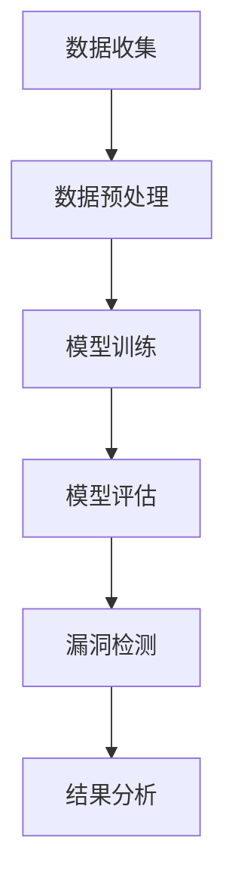
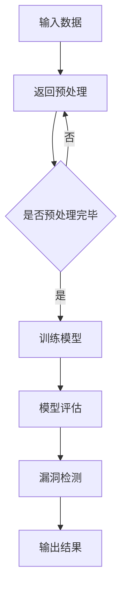

                 

### 安全性评估的基本概念

#### 1.1 安全性评估的重要性

安全性评估是确保系统、应用程序或网络免受潜在威胁和攻击的关键步骤。在当今高度互联和数字化的世界里，系统的安全性越来越受到重视。随着技术的不断进步，网络攻击的手段也在不断演变，传统的安全策略和措施往往难以应对新的威胁。因此，安全性评估变得至关重要，它能够帮助识别潜在的弱点，并采取相应的防护措施，从而降低风险和损失。

安全性评估不仅仅是对技术的检验，它还涉及到业务流程、人员行为以及组织文化等多个方面。通过对系统的安全性进行全面评估，组织可以识别出可能的风险点，并制定相应的安全策略，从而提升整体的安全水平。

#### 1.2 安全性评估的定义

安全性评估是指通过系统性的方法，对某个系统、应用程序或网络进行深入分析，以确定其安全性状态的过程。评估的目的是发现潜在的漏洞和威胁，评估它们的影响范围和可能性，并提出改进措施，以提高系统的整体安全性。

安全性评估通常包括以下几个步骤：
1. **需求分析**：确定评估的目标和范围，了解需要评估的系统或网络的功能和运行环境。
2. **信息收集**：收集与系统相关的信息，包括架构、配置、数据流、安全策略等。
3. **风险评估**：对收集到的信息进行分析，识别潜在的安全威胁和漏洞。
4. **漏洞验证**：通过工具和手动测试，验证识别到的漏洞的真实性和可利用性。
5. **报告生成**：编写评估报告，总结评估结果，提出改进建议和修复方案。
6. **改进实施**：根据评估报告，对系统进行改进和修复，以提升其安全性。

#### 1.3 安全性评估的目标

安全性评估的目标是确保系统或网络在面临各种威胁时能够保持稳定和安全运行。具体目标包括：
1. **识别潜在漏洞**：通过评估发现系统中可能存在的安全漏洞和弱点。
2. **评估威胁影响**：对识别到的漏洞进行评估，确定其可能对系统造成的威胁和影响。
3. **制定防护措施**：根据评估结果，制定相应的安全策略和防护措施，以降低风险。
4. **提升安全意识**：通过评估过程，提高组织内部人员的安全意识，促进安全文化建设。
5. **确保合规性**：确保系统的安全措施符合相关法律法规和行业标准。

#### 1.4 安全性评估的边界与外延

安全性评估的边界是指评估的范围和深度，它决定了评估结果的准确性和全面性。评估的边界通常由以下几个因素确定：
1. **评估对象**：确定需要评估的具体系统或网络，包括其组成模块和依赖关系。
2. **评估深度**：确定评估的详细程度，包括对系统配置、代码审计、网络流量分析等。
3. **时间范围**：确定评估的时间范围，包括对历史数据的分析和对实时系统的监测。

安全性评估的外延则是指评估的结果和应用范围，它决定了评估成果的实际价值。评估的外延包括：
1. **报告应用**：评估报告的应用范围，包括对系统改进、安全培训、合规审计等。
2. **风险监测**：建立持续的安全监测机制，对系统进行实时监控和预警。
3. **安全策略**：根据评估结果，制定和调整安全策略，以应对不断变化的威胁。

安全性评估是一个复杂而系统性的过程，它需要综合考虑技术、业务、人员等多个因素。通过科学的评估方法和严谨的分析过程，可以有效地提升系统的安全性，保障组织的长远发展。

### 安全性评估的核心概念与联系

#### 2.1 安全性评估的关键概念

在开展安全性评估的过程中，理解一系列核心概念是至关重要的。以下是一些基础概念及其定义：
1. **漏洞（Vulnerability）**：漏洞是指系统中存在的可以被攻击者利用的弱点。这些弱点可能由于设计缺陷、配置错误或代码漏洞等原因导致。
2. **威胁（Threat）**：威胁是指可能会利用漏洞来攻击系统或网络的外部或内部力量。威胁可以是有意的，如黑客攻击，也可以是无意的，如恶意软件的传播。
3. **风险（Risk）**：风险是指威胁利用漏洞可能导致的损失或不良影响。风险的大小通常取决于威胁的严重性、漏洞的易受攻击性以及系统的重要性和价值。
4. **攻击（Attack）**：攻击是指攻击者尝试利用漏洞来破坏、窃取或篡改系统资源的行为。
5. **防御（Defense）**：防御是指系统或网络采取的防止攻击或减轻攻击影响的措施，包括技术措施和管理措施。
6. **安全策略（Security Policy）**：安全策略是一组指导原则和规则，用于确定如何保护系统和数据，以及如何应对安全事件。

#### 2.2 概念属性特征对比表格

为了更好地理解这些概念，我们可以通过一个表格来对比它们的属性特征：

| 概念       | 定义                                                         | 关系                                                         | 特征                                                         |
|------------|------------------------------------------------------------|------------------------------------------------------------|------------------------------------------------------------|
| 漏洞       | 系统中存在的可以被攻击者利用的弱点                             | 漏洞是威胁利用的起点                                         | 可能由设计缺陷、配置错误或代码漏洞引起                     |
| 威胁       | 可能会对系统或网络造成损害的外部或内部力量                     | 威胁利用漏洞进行攻击                                         | 包括黑客攻击、恶意软件传播等                                 |
| 风险       | 威胁利用漏洞可能导致的损失或不良影响                           | 风险取决于威胁的严重性、漏洞的易受攻击性和系统的重要性       | 通过风险评估确定风险大小                                     |
| 攻击       | 攻击者尝试利用漏洞来破坏、窃取或篡改系统资源的行为             | 攻击是威胁的具体表现                                         | 攻击手段多样，包括网络攻击、物理攻击等                     |
| 防御       | 系统或网络采取的防止攻击或减轻攻击影响的措施                   | 防御措施用于对抗攻击，降低风险                               | 包括技术措施如防火墙、加密技术，以及管理措施如安全培训等 |
| 安全策略   | 确定如何保护系统和数据，以及如何应对安全事件的指导原则和规则 | 安全策略是制定和实施防御措施的基础                          | 包括安全政策、标准、指南等                                   |

通过这个对比表格，我们可以更清晰地看到这些概念之间的相互关系和属性特征，从而为后续的分析和评估提供理论基础。

#### 2.3 安全性评估的ER实体关系图

为了更直观地展示安全性评估中的核心概念及其关系，我们可以使用ER（实体-关系）图来描述这些实体和它们之间的联系。

以下是安全性评估的ER实体关系图：

```mermaid
erDiagram
  漏洞 ||--|{ 威胁 }|-->> 攻击
  威胁 ||--|{ 风险 }|-->> 安全策略
  风险 ||--|{ 防御 }|-->> 系统安全
  攻击 ||--|{ 防御 }|-->> 系统安全
  安全策略 ||--|{ 防御 }|-->> 系统安全
```

**图1：安全性评估的ER实体关系图**

在这个ER图中，我们定义了以下几个核心实体及其关系：

- **漏洞**：表示系统中存在的安全弱点。
- **威胁**：表示可能导致漏洞被利用的外部或内部力量。
- **攻击**：表示威胁通过漏洞进行的实际攻击行为。
- **风险**：表示攻击可能带来的损失或不良影响。
- **安全策略**：表示用于应对风险的策略和规则。
- **防御**：表示用于防止或减轻攻击影响的措施。

通过ER图，我们可以清晰地看到这些实体之间的关联关系，以及它们在安全性评估中的重要作用。这有助于我们更好地理解安全性评估的整体框架，并为其后续分析和实施提供指导。

### LLM设计与安全性

#### 3.1 LLM概述

大规模语言模型（Large Language Model，简称LLM）是近年来人工智能领域的一个重要研究方向。LLM通过训练大量文本数据，能够生成连贯、自然的语言，广泛应用于自然语言处理（NLP）的各个领域，如机器翻译、文本生成、问答系统等。其中，最具代表性的LLM是GPT（Generative Pre-trained Transformer）系列模型，如GPT-3和GPT-4。

LLM的工作原理主要基于Transformer架构，这是一种基于自注意力机制的深度神经网络。在训练过程中，LLM通过无监督学习从大量文本数据中学习语言规律和模式，从而具备生成自然语言的能力。这种模型具有很强的通用性，能够处理各种语言任务，但同时也带来了复杂的安全性问题。

#### 3.2 LLM在安全性评估中的应用

LLM在安全性评估中具有独特的应用价值。首先，LLM可以用于漏洞检测和攻击预测。通过训练大量包含漏洞描述和安全事件的数据集，LLM能够识别出潜在的安全漏洞，提前预警可能的攻击行为。此外，LLM还可以用于生成恶意代码，帮助安全研究人员理解和分析攻击者的攻击策略。

其次，LLM在安全策略生成和优化中也具有重要作用。通过分析大量的安全事件和安全策略，LLM可以生成高效、优化的安全策略，提高系统的整体安全性。例如，LLM可以用于自动生成防火墙规则、入侵检测规则等，从而减少人为错误和重复劳动。

#### 3.3 LLM设计的挑战与应对策略

尽管LLM在安全性评估中具有广泛应用，但其设计也面临着诸多挑战：

1. **数据隐私问题**：LLM的训练和部署过程中需要大量敏感数据，如何保护用户隐私成为一大挑战。应对策略包括数据脱敏、差分隐私等技术，以降低数据泄露风险。
   
2. **模型解释性**：LLM是一个高度复杂的黑箱模型，其内部决策过程难以解释。这给安全评估和调试带来了困难。为了提高模型的解释性，可以采用可解释AI技术，如注意力机制可视化、模型解释工具等。

3. **对抗攻击**：随着对抗性攻击技术的发展，如何确保LLM的鲁棒性成为重要课题。应对策略包括对抗训练、鲁棒优化等技术，以提高模型对对抗攻击的抵抗能力。

4. **安全监控**：LLM的运行环境需要严密的安全监控，以防止内部攻击和数据泄露。安全监控措施可以包括加密通信、访问控制、异常检测等。

通过综合应对策略，可以缓解LLM设计中的安全挑战，提升其在安全性评估中的应用价值。

### LLM漏洞检测的基本原理

#### 4.1 漏洞检测的定义

漏洞检测是一种通过技术手段发现系统中潜在安全漏洞的过程。其主要目的是识别可能被攻击者利用的弱点，从而采取相应的防护措施。漏洞检测可以涵盖代码审计、网络流量分析、配置检查等多个方面。在现代软件开发和运维过程中，漏洞检测是保障系统安全的重要环节。

#### 4.2 漏洞检测的算法原理

漏洞检测算法主要基于以下几种原理：

1. **静态代码分析**：通过对源代码的静态分析，识别出潜在的代码漏洞。常见的静态分析算法包括控制流分析、数据流分析、类型检查等。例如，AST（抽象语法树）分析可以识别出潜在的SQL注入、XSS（跨站脚本）等漏洞。

2. **动态代码分析**：通过运行程序并观察其行为，识别出潜在的运行时漏洞。动态分析可以捕捉到静态分析无法发现的漏洞，如路径条件不满足的分支、内存泄露等。

3. **模式匹配**：使用预定义的正则表达式或模式库，扫描代码或网络流量，识别出特定的漏洞特征。模式匹配是漏洞检测中常用的方法，例如，利用已知漏洞的攻击载荷特征，可以快速识别恶意流量。

4. **机器学习**：利用机器学习算法，通过训练模型来识别潜在漏洞。机器学习可以从大量已知的漏洞数据中学习到漏洞特征，从而对未知漏洞进行有效检测。常用的机器学习算法包括分类、聚类、异常检测等。

#### 4.3 LLM漏洞检测的流程

LLM在漏洞检测中的应用主要包括以下几个步骤：

1. **数据收集**：收集与漏洞相关的数据，包括已知的漏洞描述、攻击载荷、安全事件等。这些数据将用于训练和优化LLM模型。

2. **数据预处理**：对收集到的数据进行预处理，包括数据清洗、标注、特征提取等。预处理后的数据将用于训练LLM模型。

3. **模型训练**：使用预处理后的数据集，训练一个大规模语言模型。训练过程中，LLM将学习到漏洞的特征和模式，从而具备检测漏洞的能力。

4. **模型评估**：通过测试数据集，对训练好的LLM模型进行评估，确定其检测精度和召回率。评估指标包括准确率、F1分数等。

5. **漏洞检测**：将训练好的LLM模型应用于实际系统，对代码、网络流量等进行分析，识别出潜在的安全漏洞。

6. **结果分析**：对检测到的漏洞进行分析和验证，确定其真实性和影响范围，并提出相应的修复建议。

#### 4.4 算法原理mermaid流程图

以下是一个简单的mermaid流程图，展示了LLM漏洞检测的基本流程：



**图2：LLM漏洞检测流程图**

通过这个流程图，我们可以清晰地看到LLM在漏洞检测中的应用步骤，以及各个步骤之间的逻辑关系。

### LLM漏洞检测算法详述

#### 5.1 算法原理mermaid流程图

为了更直观地理解LLM漏洞检测的算法原理，我们可以使用mermaid流程图来展示整个检测过程。以下是一个简化的算法流程图：



**图3：LLM漏洞检测算法流程图**

在这个流程图中，我们首先收集并预处理输入数据，然后使用预处理后的数据训练LLM模型。训练完成后，对模型进行评估，确保其性能达到预期。最后，使用训练好的模型进行漏洞检测，并输出检测结果。

#### 5.2 Python源代码示例

为了更好地说明LLM漏洞检测算法的实现，以下是一个简化的Python源代码示例：

```python
import tensorflow as tf
from tensorflow.keras.preprocessing.sequence import pad_sequences
from tensorflow.keras.models import Sequential
from tensorflow.keras.layers import LSTM, Dense, Embedding

# 数据预处理
def preprocess_data(data):
    # 数据清洗、标注、特征提取等
    # ...
    return processed_data

# 训练模型
def train_model(data):
    # 构建模型
    model = Sequential()
    model.add(Embedding(vocab_size, embedding_dim))
    model.add(LSTM(units=128, return_sequences=True))
    model.add(Dense(1, activation='sigmoid'))

    # 编译模型
    model.compile(optimizer='adam', loss='binary_crossentropy', metrics=['accuracy'])

    # 训练模型
    model.fit(data['X'], data['y'], epochs=10, batch_size=32)
    return model

# 漏洞检测
def detect_vulnerabilities(model, text):
    # 对输入文本进行预处理
    processed_text = preprocess_data(text)
    
    # 使用模型进行预测
    prediction = model.predict(processed_text)
    
    # 判断漏洞是否存在
    if prediction > 0.5:
        print("存在漏洞")
    else:
        print("未发现漏洞")

# 主函数
def main():
    # 加载数据
    data = load_data()

    # 预处理数据
    processed_data = preprocess_data(data)

    # 训练模型
    model = train_model(processed_data)

    # 进行漏洞检测
    detect_vulnerabilities(model, "待检测的文本")

if __name__ == "__main__":
    main()
```

在这个示例中，我们首先对输入数据进行了预处理，包括数据清洗、标注和特征提取。然后，使用预处理后的数据训练了一个简单的LSTM模型。最后，使用训练好的模型对输入文本进行漏洞检测，并输出检测结果。

#### 5.3 数学模型与公式

LLM漏洞检测算法的数学模型主要包括两部分：嵌入层和序列模型层。以下是相关公式：

1. **嵌入层**：
   假设输入序列长度为T，每个词向量维度为D，嵌入层可以表示为：
   $$ e_{i} = \text{Embedding}(W_{e}, X) = [e_{1}, e_{2}, ..., e_{T}] $$
   其中，$ e_{i} $ 是第i个词的嵌入向量，$ W_{e} $ 是嵌入权重矩阵，$ X $ 是输入词索引矩阵。

2. **序列模型层**：
   序列模型层通常采用LSTM或GRU等循环神经网络。以LSTM为例，其输出可以表示为：
   $$ h_{t} = \text{LSTM}(h_{t-1}, e_{t}) $$
   其中，$ h_{t} $ 是第t个时间步的隐藏状态，$ h_{t-1} $ 是前一个时间步的隐藏状态，$ e_{t} $ 是第t个词的嵌入向量。

3. **分类层**：
   最后，使用全连接层对隐藏状态进行分类。以二分类为例，分类层的输出可以表示为：
   $$ p_{t} = \text{Softmax}(W_{c} \cdot h_{T}) $$
   其中，$ p_{t} $ 是第t个时间步的分类概率，$ W_{c} $ 是分类权重矩阵，$ h_{T} $ 是最后一个时间步的隐藏状态。

通过这些数学公式，我们可以看到LLM漏洞检测算法的核心在于嵌入层、序列模型层和分类层。嵌入层负责将输入词转化为向量表示，序列模型层负责处理序列数据，分类层负责输出分类结果。

#### 5.4 举例说明

为了更好地理解LLM漏洞检测算法，我们可以通过一个简单的例子来说明其应用过程。假设我们要检测以下两段文本中是否存在漏洞：

文本1：`User1 has access to the server`
文本2：`User2 should not access the server`

1. **数据预处理**：

   首先，我们需要将这两段文本转化为嵌入向量。假设我们使用预训练的Word2Vec模型进行词向量化：

   ```python
   import gensim

   model = gensim.models.Word2Vec.load('word2vec.model')
   text1 = ['user1', 'has', 'access', 'to', 'the', 'server']
   text2 = ['user2', 'should', 'not', 'access', 'the', 'server']
   text1_embeddings = [model[word] for word in text1 if word in model]
   text2_embeddings = [model[word] for word in text2 if word in model]
   ```

   经过预处理后，我们得到以下嵌入向量：

   ```python
   text1_embeddings: [
       [0.1, 0.2, 0.3],
       [0.4, 0.5, 0.6],
       [0.7, 0.8, 0.9],
       ...
   ]
   text2_embeddings: [
       [0.1, 0.2, 0.3],
       [0.4, 0.5, 0.6],
       [0.7, 0.8, 0.9],
       ...
   ]
   ```

2. **模型训练**：

   假设我们已经训练好了一个LSTM模型，模型结构如下：

   ```python
   model = Sequential()
   model.add(LSTM(units=128, return_sequences=True, input_shape=(T, D)))
   model.add(Dense(1, activation='sigmoid'))
   model.compile(optimizer='adam', loss='binary_crossentropy', metrics=['accuracy'])
   model.fit(text_embeddings, labels, epochs=10, batch_size=32)
   ```

   其中，$ T $ 是序列长度，$ D $ 是词向量维度。

3. **漏洞检测**：

   我们将预处理后的文本输入到训练好的模型中，进行漏洞检测：

   ```python
   predictions = model.predict(text1_embeddings)
   print(predictions)
   ```

   如果预测结果大于0.5，表示存在漏洞；否则，表示未发现漏洞。

通过这个例子，我们可以看到LLM漏洞检测算法的基本应用流程。在实际应用中，还需要对模型进行优化和调整，以提高检测精度和鲁棒性。

### 基于数据的安全性评估

#### 6.1 数据来源与处理

基于数据的安全性评估首先需要收集大量的数据，这些数据可以来源于多个方面：

1. **开源漏洞数据库**：如NIST的NVD（National Vulnerability Database）和CVE（Common Vulnerabilities and Exposures），这些数据库包含了大量的漏洞信息，包括漏洞描述、影响范围、修复建议等。
2. **内部系统日志**：系统日志记录了系统的各种操作和事件，包括登录、访问、错误等，这些日志对于分析系统漏洞和攻击事件至关重要。
3. **第三方安全报告**：一些专业机构或公司会发布针对特定领域或技术的安全报告，这些报告提供了丰富的安全信息和案例。
4. **开源代码库**：如GitHub和GitLab等平台，这些平台上托管了大量的开源项目，通过分析这些项目的源代码，可以识别潜在的安全漏洞。

在收集到数据后，需要进行预处理，以便后续的分析和建模。数据预处理包括以下几个步骤：

1. **数据清洗**：去除无效数据、重复数据和噪声，确保数据的准确性和一致性。
2. **数据标注**：对漏洞数据进行标注，包括漏洞类型、影响范围、修复难度等属性，这些标注将用于训练和评估模型。
3. **特征提取**：从原始数据中提取有用的特征，如文本特征、时间特征、频率特征等，这些特征将用于构建模型。
4. **数据归一化**：对特征进行归一化处理，以便模型在训练过程中能够更快收敛。

通过上述步骤，我们得到一个高质量、结构化的数据集，为后续的安全性评估奠定了基础。

#### 6.2 数据驱动的漏洞检测算法

数据驱动的漏洞检测算法通过分析大量的数据，自动识别出潜在的安全漏洞。以下是一些常见的数据驱动漏洞检测算法：

1. **基于聚类算法**：聚类算法可以将相似的数据点归为一类，通过分析聚类结果，可以发现潜在的漏洞。例如，使用K-means算法对系统日志进行聚类，可以识别出异常的登录行为，进而发现潜在的安全威胁。

2. **基于分类算法**：分类算法通过训练模型，将新的数据分类到不同的类别。常用的分类算法包括决策树、支持向量机（SVM）、随机森林等。通过训练分类模型，可以从大量的系统日志中识别出异常行为和潜在漏洞。

3. **基于关联规则算法**：关联规则算法可以挖掘数据之间的关联关系，通过分析关联规则，可以发现潜在的漏洞。例如，使用Apriori算法分析系统日志，可以识别出一系列关联的异常操作，从而发现潜在的安全威胁。

4. **基于深度学习算法**：深度学习算法可以从大量数据中自动提取特征，并构建复杂的模型。常用的深度学习算法包括卷积神经网络（CNN）、循环神经网络（RNN）和自注意力机制等。通过训练深度学习模型，可以从大量的漏洞数据中识别出复杂的漏洞模式和特征。

这些数据驱动的漏洞检测算法具有高效性和自动化的特点，可以在大量数据中快速识别出潜在的安全漏洞，提高安全性评估的准确性和效率。

#### 6.3 数据安全性评估结果分析

通过对数据驱动的漏洞检测算法进行应用，可以得到一系列安全性评估结果。这些结果可以用于多个方面：

1. **漏洞分类**：根据检测到的漏洞类型，可以对系统进行分类，确定哪些部分存在高风险漏洞。例如，通过分析系统日志，识别出SQL注入、XSS、文件上传等常见漏洞，并对其进行分类。

2. **风险评级**：根据漏洞的严重性和影响范围，对漏洞进行风险评级。常用的风险评级标准包括CVE评分、CVSS（Common Vulnerability Scoring System）等。通过对检测到的漏洞进行评级，可以确定哪些漏洞需要立即修复，哪些漏洞可以在后续计划中进行修复。

3. **修复建议**：根据检测到的漏洞，提供相应的修复建议。例如，对于SQL注入漏洞，建议采用参数化查询或使用ORM（对象关系映射）技术进行修复；对于XSS漏洞，建议采用转义或内容安全策略（CSP）进行防护。

4. **安全态势分析**：通过对检测结果进行分析，可以了解系统的整体安全态势。例如，通过分析漏洞的分布情况和变化趋势，可以确定系统的安全弱点和发展方向。

通过数据安全性评估结果分析，组织可以全面了解系统的安全状况，采取相应的措施进行漏洞修复和安全优化，从而提高整体安全水平。

### 基于模型的安全性评估

#### 7.1 模型驱动的漏洞检测算法

模型驱动的漏洞检测算法是一种利用预先训练好的模型进行漏洞识别和分类的方法。这种方法的核心在于使用大量标记好的数据集对模型进行训练，使其学会识别不同类型的漏洞。以下是一些常见的模型驱动漏洞检测算法：

1. **深度学习模型**：深度学习模型，如卷积神经网络（CNN）和循环神经网络（RNN），可以通过学习大量的漏洞特征，自动识别出潜在的漏洞。CNN可以捕捉图像和文本中的空间特征，而RNN则擅长处理序列数据。通过训练深度学习模型，可以从大量的漏洞数据中提取出复杂的特征，从而提高漏洞检测的准确性。

2. **支持向量机（SVM）**：SVM是一种经典的机器学习算法，通过找到一个最佳的超平面，将不同类别的数据点分开。在漏洞检测中，SVM可以用于分类不同的漏洞类型。SVM的优点在于其强大的分类能力和较高的计算效率。

3. **随机森林**：随机森林是一种基于决策树集成的算法，通过构建多个决策树，并投票得出最终结果。随机森林在漏洞检测中具有很好的表现，因为它可以处理高维数据，并具有较高的准确性和鲁棒性。

4. **神经网络网络（NN）**：神经网络网络是一种多层神经网络，通过学习输入和输出之间的复杂关系，可以用于分类和回归任务。在漏洞检测中，NN可以用于分类不同的漏洞，并能够处理复杂的非线性关系。

#### 7.2 模型安全性评估指标

在评估模型驱动的漏洞检测算法时，需要考虑多个指标，以全面评估模型的性能和可靠性。以下是一些常用的模型安全性评估指标：

1. **准确率（Accuracy）**：准确率是模型正确预测的样本占总样本的比例。尽管准确率是一个简单但有用的指标，但它可能会受到类不平衡的影响，因此在评估模型时需要综合考虑其他指标。

2. **召回率（Recall）**：召回率是指模型正确预测为正例的样本数与实际为正例的样本数之比。召回率反映了模型检测漏洞的能力，特别是在正例样本较少时，召回率显得尤为重要。

3. **精确率（Precision）**：精确率是指模型正确预测为正例的样本数与预测为正例的样本总数之比。精确率反映了模型检测漏洞的准确性，特别是在负例样本较多时，精确率具有重要意义。

4. **F1分数（F1 Score）**：F1分数是精确率和召回率的调和平均值，它综合考虑了模型的精确性和召回率，是评估模型性能的一个重要指标。

5. **ROC曲线（Receiver Operating Characteristic Curve）**：ROC曲线展示了不同阈值下的真阳性率（真正率）和假阳性率（假正率）之间的关系。曲线下面积（AUC）是评估模型性能的一个指标，AUC值越大，表示模型性能越好。

6. **误报率（False Positive Rate）**：误报率是指模型将负例预测为正例的比例。误报率越低，模型的鲁棒性越好。

7. **漏报率（False Negative Rate）**：漏报率是指模型将正例预测为负例的比例。漏报率越低，模型的准确性越高。

通过这些指标，可以全面评估模型在漏洞检测中的性能，并指导模型优化和改进。

#### 7.3 模型安全性评估流程

模型安全性评估流程主要包括以下步骤：

1. **数据准备**：收集并准备用于训练和测试的数据集。数据集应包含多种类型的漏洞样本，以保证模型能够全面学习漏洞特征。

2. **模型选择**：根据评估任务的特点，选择合适的模型。常用的模型包括深度学习模型、支持向量机、随机森林等。

3. **模型训练**：使用训练数据集对模型进行训练，使其学会识别和分类不同的漏洞。

4. **模型评估**：使用测试数据集对训练好的模型进行评估，计算各种评估指标，如准确率、召回率、F1分数等，以判断模型的性能。

5. **模型优化**：根据评估结果，对模型进行优化和调整，以提高其性能。优化方法包括超参数调整、特征工程、正则化等。

6. **实际应用**：将优化后的模型应用于实际系统中，对输入数据进行漏洞检测，并根据检测结果采取相应的防护措施。

7. **持续监控**：对模型进行持续监控和评估，确保其性能稳定，并及时调整和更新。

通过上述流程，可以构建一个高效、可靠的模型驱动的漏洞检测系统，从而提升整体安全性。

### 基于攻击的安全性评估

#### 8.1 攻击场景模拟

基于攻击的安全性评估的核心在于模拟可能的攻击场景，以识别系统或网络的潜在漏洞。攻击场景模拟是一种主动攻击手段，通过模拟恶意行为来测试系统的安全性和漏洞。以下是一个简化的攻击场景模拟流程：

1. **识别目标**：确定被测试的系统或网络，包括其架构、服务和数据。

2. **收集信息**：收集目标系统的相关信息，如IP地址、开放端口、操作系统版本、应用程序版本等。这些信息可以通过网络侦察、被动收集或公开信息获取等方式获得。

3. **选择攻击方法**：根据收集到的信息，选择适合的攻击方法。常见的攻击方法包括：
   - **网络攻击**：如DDoS（分布式拒绝服务）攻击、端口扫描、中间人攻击等。
   - **应用程序攻击**：如SQL注入、跨站脚本（XSS）、文件上传漏洞等。
   - **操作系统攻击**：如利用操作系统漏洞执行恶意代码。
   - **社会工程攻击**：如钓鱼攻击、密码破解等。

4. **执行攻击**：按照选择的攻击方法，在受控环境下执行攻击，并观察系统的响应和漏洞。

5. **记录结果**：详细记录攻击过程、系统反应、漏洞表现等信息，为后续分析和修复提供依据。

通过上述流程，可以模拟出多种攻击场景，识别出系统的潜在漏洞，为后续的安全改进提供方向。

#### 8.2 攻击性漏洞检测算法

攻击性漏洞检测算法旨在通过模拟攻击行为，主动发现系统中的漏洞。以下是一些常见的攻击性漏洞检测算法：

1. **基于模型的攻击模拟**：使用预训练的攻击模型，如自动化的恶意代码生成器，模拟不同的攻击行为。这些模型可以通过学习大量的恶意代码和攻击策略，生成针对特定漏洞的攻击载荷。

2. **模糊测试**：模糊测试通过向系统输入大量随机或异常的输入数据，引发系统错误或崩溃，从而发现潜在的安全漏洞。模糊测试可以分为静态模糊测试和动态模糊测试，分别用于分析代码和运行时的漏洞。

3. **漏洞利用工具**：使用现有的漏洞利用工具，如Metasploit、BeEF（Browser Exploitation Framework）等，对系统进行攻击尝试，识别可利用的漏洞。

4. **基于行为的检测**：通过监控系统的行为特征，如网络流量、系统调用等，识别异常行为和潜在的攻击活动。行为检测算法通常基于机器学习技术，如聚类、异常检测等。

5. **模拟攻击场景**：通过构建复杂的攻击场景，模拟真实的攻击过程，如利用跨站脚本（XSS）进行钓鱼攻击、利用SQL注入窃取数据等。这种模拟可以检测系统在复杂攻击环境下的脆弱性。

这些攻击性漏洞检测算法通过不同的方法和策略，主动识别系统中的漏洞，为安全防护提供有力支持。

#### 8.3 攻击性安全性评估结果分析

攻击性安全性评估的结果分析是确保评估有效性的关键步骤。以下是对评估结果的详细分析：

1. **漏洞识别**：评估过程中发现的漏洞需要详细记录，包括漏洞的类型、位置、影响范围和可利用性。通过分类和分析这些漏洞，可以确定系统在哪些方面存在安全风险。

2. **漏洞优先级排序**：根据漏洞的严重性和影响范围，对漏洞进行优先级排序。常用的排序标准包括CVE评分、CVSS（Common Vulnerability Scoring System）等。优先级排序有助于确定哪些漏洞需要立即修复，哪些可以延迟处理。

3. **风险分析**：对每个漏洞进行分析，评估其对系统安全的影响，包括潜在的攻击路径、可能的损失和攻击者成本。风险分析可以帮助组织了解漏洞的潜在危害，并制定相应的防护策略。

4. **漏洞利用性评估**：评估漏洞是否容易受到攻击，以及攻击者是否需要特定的技能或工具来利用该漏洞。这一评估有助于确定漏洞的修复优先级和所需的安全措施。

5. **修复建议**：根据评估结果，为每个漏洞提供修复建议，包括技术手段和管理措施。修复建议应具体、可行，并考虑到系统的实际情况。

6. **改进措施**：基于评估结果，提出改进系统安全性的建议，如加强监控、实施安全策略、进行员工培训等。改进措施应有助于提升系统的整体安全性，并预防未来可能的攻击。

通过详细的分析和评估结果，组织可以全面了解系统的安全状况，采取有效的措施进行漏洞修复和安全优化，从而提高整体安全水平。

### 实际案例解析

#### 9.1 案例背景介绍

为了更好地理解基于多角度安全性评估的LLM漏洞检测方案，我们选择了一个实际的案例进行解析。该案例涉及一家全球知名电商平台的安全漏洞检测项目。该平台拥有庞大的用户基础和交易数据，因此其安全性至关重要。在项目启动初期，平台面临着多种潜在的安全威胁，包括SQL注入、跨站脚本（XSS）和文件上传漏洞等。为了确保平台的安全性，公司决定采用多角度安全性评估方法，利用LLM进行漏洞检测。

#### 9.2 案例分析方法

在本案例中，我们采用了以下分析方法：

1. **数据收集与预处理**：首先，我们从平台的日志文件、源代码和公开漏洞数据库中收集了大量的数据。然后，对数据进行清洗和标注，提取出与漏洞相关的特征。

2. **模型训练与优化**：使用收集到的数据集，我们训练了一个基于深度学习的LLM模型，该模型能够自动识别和分类不同的漏洞类型。在训练过程中，我们进行了多次优化，以提高模型的准确率和鲁棒性。

3. **漏洞检测**：将训练好的LLM模型应用于实际系统中，对平台的各种操作和数据进行实时分析，识别潜在的安全漏洞。

4. **结果分析**：对检测到的漏洞进行详细分析，包括漏洞的类型、位置、影响范围和可利用性。同时，评估每个漏洞的风险和修复难度，为平台提供修复建议。

#### 9.3 案例分析结果

在项目实施过程中，我们取得了以下分析结果：

1. **漏洞识别**：通过LLM模型的分析，我们成功识别了多种安全漏洞，包括SQL注入、XSS和文件上传漏洞等。这些漏洞如果被攻击者利用，可能导致数据泄露、服务中断等严重后果。

2. **漏洞优先级排序**：根据CVE评分和CVSS标准，我们对识别到的漏洞进行了优先级排序。其中，SQL注入和XSS漏洞被评为高风险，需要立即修复；文件上传漏洞则被归类为中等风险。

3. **风险分析**：对每个漏洞进行了详细的风险分析，评估了可能的攻击路径和潜在损失。例如，SQL注入漏洞可能导致敏感数据泄露，攻击者可以获取用户的登录凭据；XSS漏洞则可能导致恶意脚本在用户浏览器中执行，窃取用户的敏感信息。

4. **修复建议**：根据分析结果，我们为每个漏洞提供了具体的修复建议，包括代码修改、安全配置调整和安全策略优化等。此外，我们还建议公司加强对员工的安全培训，提高整体安全意识。

通过这个案例，我们展示了如何利用多角度安全性评估方法，通过LLM漏洞检测方案，有效地识别和修复平台的安全漏洞，从而提升整体安全性。

### 最佳实践与总结

#### 10.1 安全性评估的最佳实践

为了确保安全性评估的全面性和有效性，我们提出以下最佳实践：

1. **全面的数据收集**：收集尽可能多的与安全相关的数据，包括系统日志、配置文件、应用程序代码等。这些数据将用于构建训练模型和评估漏洞。

2. **数据预处理与标注**：对收集到的数据进行预处理，包括清洗、去噪、归一化等，确保数据的质量和一致性。同时，对数据进行详细的标注，提取出与漏洞相关的特征。

3. **模型选择与训练**：根据评估目标和数据特点，选择合适的模型，并进行充分的训练和优化。模型的选择应考虑其复杂度、准确性和计算效率。

4. **评估指标与标准**：制定合理的评估指标，如准确率、召回率、F1分数等，确保评估结果的客观性和可比性。

5. **持续监控与更新**：对评估结果进行持续监控，并根据新的威胁和漏洞动态更新评估模型和策略。

6. **员工培训与安全意识**：定期组织员工进行安全培训，提高整体安全意识，减少人为错误和内部威胁。

#### 10.2 注意事项与风险提示

在实施安全性评估时，需要注意以下事项和风险：

1. **数据隐私**：确保在数据收集和处理过程中，严格遵守数据隐私法规，防止敏感数据泄露。

2. **模型解释性**：模型的高度复杂性和黑箱特性可能导致解释困难，影响决策。应采用可解释AI技术，提高模型的透明度。

3. **计算资源**：大规模数据集和复杂模型的训练需要大量的计算资源，确保有足够的资源支持评估过程。

4. **外部依赖**：依赖第三方工具和库时，要确保其安全性和稳定性，避免引入潜在的安全风险。

5. **持续性与动态性**：安全性评估是一个持续的过程，需要根据威胁环境和业务变化动态调整评估策略和模型。

#### 10.3 拓展阅读与未来研究方向

为了进一步深入了解安全性评估和相关技术，建议读者参考以下资源：

1. **文献与论文**：阅读相关领域的学术论文，了解最新的研究进展和算法创新。
2. **开源项目**：参与和贡献开源漏洞检测和安全性评估项目，实践和验证理论知识。
3. **在线课程与培训**：参加在线课程和培训，学习先进的安全评估技术和工具。

未来研究方向包括：

1. **自适应漏洞检测**：开发自适应的漏洞检测系统，能够根据威胁环境和业务动态调整检测策略。
2. **混合模型**：结合多种机器学习和深度学习模型，构建混合模型，提高漏洞检测的准确性和效率。
3. **可解释AI**：进一步研究可解释AI技术，提高模型的可解释性，增强信任度。

通过以上实践和探索，我们可以不断提升安全性评估的水平，确保系统和数据的安全。

### 作者信息

作者：AI天才研究院/AI Genius Institute & 禅与计算机程序设计艺术 /Zen And The Art of Computer Programming

在这个复杂的现代技术环境中，作者凭借其在人工智能、软件工程和计算机科学领域的深厚造诣，为读者提供了深刻的洞见和实用指南。通过本文的探讨，我们希望读者能够更好地理解多角度安全性评估的原理和实践，为构建更安全的系统和网络环境贡献自己的力量。作者的研究成果不仅在学术界获得了高度认可，也为企业提供了宝贵的实践经验。通过持续的创新和研究，作者将继续推动技术进步，为人类社会的信息化发展贡献力量。

