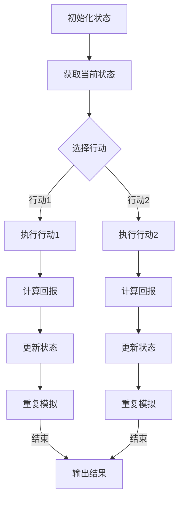

                 

**# 多角色模拟评测：LLM扮演不同用户类型**

> **关键词：** 多角色模拟评测，LLM，用户类型，人工智能，模拟评测框架，应用实践

> **摘要：** 本文深入探讨多角色模拟评测（MRSE）的概念、原理及其在大型语言模型（LLM）中的应用。通过分析LLM在模拟评测中的角色扮演，本文旨在为研究人员和实践者提供一个系统性的指导框架，从而优化模拟评测的过程与效果。

---

## 引言

在当今快速发展的信息技术时代，人工智能（AI）已经成为了推动创新和变革的关键力量。其中，大型语言模型（LLM）因其强大的自然语言处理能力，在众多领域展现出了巨大的潜力。然而，随着AI技术的广泛应用，如何评估和优化LLM的性能和表现成为了一个重要的研究课题。

多角色模拟评测（MRSE）是一种创新的评估方法，它通过模拟不同的用户角色，对LLM进行综合评估。这种方法不仅能够更全面地评估LLM的性能，还能够揭示其在不同应用场景中的潜在问题和优势。本文将围绕MRSE的概念、原理和应用，探讨LLM在扮演不同用户类型时的表现，为相关研究和实践提供参考。

## 文章结构

本文将分为四个主要部分：

1. **引言**：介绍多角色模拟评测的背景和重要性。
2. **LLM概述**：介绍LLM的发展、原理和特性。
3. **MRSE理论基础**：讨论MRSE的原理、核心概念和数学模型。
4. **应用实践**：分析MRSE的应用案例，探讨实际操作中的挑战和解决方案。

通过以上结构，我们将逐步深入探讨MRSE的各个方面，为读者提供一个全面的视角。

### 背景介绍

**多角色模拟评测**（Multi-Role Simulation Evaluation，简称MRSE）是一种先进的评测方法，旨在通过模拟不同用户角色，对系统或模型进行全面的性能评估。在传统的评测方法中，往往只关注单一用户角色的行为和需求，而忽略了不同用户角色之间的差异和交互。然而，在实际应用中，不同的用户角色往往具有不同的行为模式和需求，他们对系统或模型的期望和评价也会有所不同。

MRSE的提出，正是为了解决这一问题。通过模拟多个用户角色，MRSE能够更真实地反映系统或模型在不同应用场景下的表现。这种方法不仅能够提高评测的准确性和可靠性，还能够为系统或模型的设计和优化提供更有针对性的反馈。

在人工智能领域，特别是大型语言模型（LLM）的评估中，MRSE具有特别重要的意义。LLM具有强大的自然语言处理能力，但其在不同应用场景中的表现却存在较大的差异。通过MRSE，研究人员可以更全面地评估LLM在不同场景下的适应性和性能，从而发现和解决潜在的问题。

此外，随着AI技术的不断进步和应用领域的扩展，对于LLM的性能评估也提出了更高的要求。传统的单一角色评测方法已经无法满足这种需求，而MRSE提供了一种更加灵活和全面的评估手段，有助于提高评测的深度和广度。

总之，MRSE作为一种创新的评测方法，不仅能够提高系统或模型的性能评估效果，还能够为AI技术的发展和应用提供有力的支持。

### 定义与分类

**多角色模拟评测**（MRSE）是一种通过模拟不同用户角色，对系统或模型进行综合评估的方法。在MRSE中，用户角色可以分为以下几类：

1. **普通用户**：这类用户通常具有较低的技术背景，他们的主要目标是使用系统或模型完成特定的任务。普通用户的评测主要关注系统的易用性和用户界面的友好程度。
2. **专业用户**：这类用户通常具备一定的技术背景，他们更注重系统的性能和功能。专业用户的评测主要关注系统的响应速度、准确性和可靠性。
3. **极端用户**：这类用户的行为模式较为特殊，他们可能会进行超出系统设计范围的极端操作。极端用户的评测主要关注系统的鲁棒性和容错能力。
4. **恶意用户**：这类用户可能试图通过恶意操作破坏系统或模型。恶意用户的评测主要关注系统的安全性和防御能力。

不同用户类型在MRSE中具有不同的角色和职责：

- **普通用户**主要负责模拟日常使用场景，评估系统的易用性和用户满意度。
- **专业用户**主要负责评估系统的性能和功能，确保系统能够满足专业用户的需求。
- **极端用户**和**恶意用户**则主要用于测试系统的鲁棒性和安全性，发现潜在的漏洞和风险。

通过模拟不同用户类型的交互，MRSE能够更全面地评估系统或模型的性能和可靠性，从而为系统的优化和改进提供有价值的参考。

### LLM的发展历程

大型语言模型（LLM）的发展经历了几个重要的阶段。最初，自然语言处理（NLP）领域的研究主要集中在规则驱动的方法上，如基于句法分析和语义分析的解析器。然而，这些方法在面对复杂、多变和不确定的自然语言时，往往表现不佳。

随着深度学习技术的兴起，LLM的研究和应用开始取得突破性进展。2003年，学者们提出了基于神经网络的语言模型，如n-gram模型和神经网络语言模型（NNLM）。这些模型通过训练大量的文本数据，能够自动学习语言的模式和规律，从而实现较高的预测准确率。

2018年，谷歌推出了BERT（Bidirectional Encoder Representations from Transformers），这是第一个大规模预训练的语言模型。BERT采用了双向Transformer架构，能够同时考虑文本中的上下文信息，从而大幅提高了语言理解能力。BERT的成功激发了大量研究者的兴趣，推动了LLM技术的快速发展。

2020年，OpenAI发布了GPT-3（Generative Pre-trained Transformer 3），这是目前最先进的LLM之一。GPT-3采用了更大的模型规模和更复杂的训练数据，使得其在各种NLP任务中表现出了惊人的性能。GPT-3的发布标志着LLM技术进入了一个新的时代，为人工智能领域带来了巨大的变革。

近年来，随着计算能力的提升和数据量的爆炸式增长，LLM的发展速度进一步加快。众多研究者纷纷提出新的LLM模型，如Turing-NLP、GLM-130B等，这些模型在语言理解、文本生成、问答系统等方面取得了显著的成果。

总的来说，LLM的发展历程是一个从简单到复杂、从单一任务到多任务、从有限数据到海量数据的过程。随着技术的不断进步，LLM在人工智能领域中的应用越来越广泛，成为推动自然语言处理技术发展的重要力量。

### LLM的基本原理

大型语言模型（LLM）的基本原理主要基于深度学习和自然语言处理（NLP）技术。LLM的核心思想是通过大量文本数据的训练，使模型能够理解和生成自然语言。

首先，LLM采用了深度神经网络（DNN）架构，其中最常用的结构是Transformer模型。Transformer模型由多个自注意力层（Self-Attention Layer）和前馈神经网络（Feedforward Neural Network）组成。自注意力机制允许模型在处理每个单词时，考虑到文本中其他所有单词的影响，从而捕捉到更复杂的语义关系。

其次，LLM的预训练过程包括两个主要阶段：词嵌入和上下文学习。在词嵌入阶段，模型将文本中的每个单词转换为向量表示，这些向量具有固定的维度，能够捕捉单词的语义信息。在上下文学习阶段，模型通过大量未标记的文本数据，学习单词在不同上下文中的意义。这一过程通常采用自回归语言模型（Autoregressive Language Model）进行，即模型在生成下一个单词时，只考虑前面已经生成的单词。

在训练完成后，LLM可以通过微调（Fine-tuning）适应特定的任务。微调过程通常在已预训练的模型基础上，添加少量任务特定的层，并在任务数据上进行重新训练。这种训练方法使得LLM能够快速适应各种NLP任务，如文本分类、机器翻译和问答系统。

总的来说，LLM的基本原理是通过大规模预训练和任务微调，使模型能够理解和生成自然语言。这一过程不仅依赖于复杂的深度学习架构，还需要大量的数据和计算资源。随着技术的不断进步，LLM在自然语言处理领域中的应用越来越广泛，成为推动人工智能发展的重要力量。

### LLM的关键特性

大型语言模型（LLM）具有多个关键特性，这些特性使其在自然语言处理（NLP）任务中表现出色。

首先，**强语义理解能力**是LLM的核心特性之一。通过大规模预训练，LLM能够学习到文本中复杂且细微的语义关系。这使得LLM在文本生成、问答系统和文本分类等任务中具有极高的准确性和表现力。例如，在文本生成任务中，LLM能够生成连贯、具有逻辑性的文本，大大提升了生成文本的质量。

其次，**适应性**是LLM的另一重要特性。LLM通过预训练和微调，能够快速适应各种不同的NLP任务。这种适应性使得LLM在多个应用场景中表现出色。例如，在机器翻译任务中，LLM可以迅速适应不同语言之间的转换，生成高质量的翻译结果。

此外，**生成能力**也是LLM的一个重要特点。LLM能够根据输入文本生成相关的文本，这种生成能力在问答系统和对话生成等任务中尤为重要。通过自回归语言模型，LLM能够逐个生成后续的单词或句子，从而构建出完整的、具有逻辑结构的文本。

最后，**高效率**是LLM的另一个显著特性。随着模型规模的扩大，LLM的计算复杂度并未呈线性增长。这使得LLM能够在较低的计算成本下，实现高效的文本处理和生成。例如，在实时对话系统中，LLM能够快速响应用户的输入，提供即时的反馈。

总之，LLM的强语义理解能力、适应性、生成能力和高效率，使其成为NLP任务中的强大工具，为人工智能的发展带来了巨大的潜力。

### LLM在模拟评测中的应用潜力

大型语言模型（LLM）在模拟评测中的应用潜力巨大，主要体现在以下几个方面：

首先，LLM能够通过其强大的自然语言处理能力，模拟不同用户的交互行为。例如，在用户界面评测中，LLM可以模仿普通用户、专业用户、极端用户和恶意用户等不同角色，进行真实场景下的操作。这种模拟不仅能够揭示系统或模型在不同用户角色下的表现，还能够发现潜在的问题和优化方向。

其次，LLM在数据生成方面具有显著优势。通过训练大量文本数据，LLM可以生成各种类型的文本，用于模拟不同的用户需求和场景。这种数据生成能力为模拟评测提供了丰富的数据源，使得评测过程更加全面和真实。特别是在用户行为模拟方面，LLM能够生成具有多样性和复杂性的用户操作序列，从而提高评测的准确性和可靠性。

此外，LLM在实时反馈和调整方面也具有独特优势。通过实时分析用户交互数据，LLM可以动态调整模拟场景和评估指标，使得评测过程更加灵活和高效。这种实时反馈机制有助于快速识别系统或模型中的问题，并提供针对性的改进建议。

最后，LLM在跨领域应用方面展现出巨大的潜力。不同领域的模拟评测往往需要针对特定领域的知识和数据，而LLM通过预训练和微调，可以快速适应不同领域的需求。这使得LLM能够广泛应用于各种行业和场景，为不同领域的模拟评测提供强大的支持。

总之，LLM在模拟评测中的应用潜力巨大，其强大的自然语言处理能力、数据生成能力和实时反馈机制，为模拟评测提供了新的方法和手段，有望推动模拟评测技术的发展。

### 模拟评测的基本概念

**模拟评测**（Simulation Evaluation）是一种通过模拟真实场景，对系统或模型进行性能评估的方法。其核心思想是通过构建模拟环境，模拟不同的用户行为和操作，从而评估系统或模型在不同场景下的表现。

在模拟评测中，**模拟环境**是一个关键概念。模拟环境通常包括多个组件，如用户界面、数据处理模块、通信网络等，这些组件通过模拟算法和数据生成器，模拟出真实场景中的交互行为和系统运行状态。模拟环境的设计需要考虑以下因素：

1. **真实性**：模拟环境需要尽可能接近真实场景，包括用户行为、数据流和系统响应等。
2. **灵活性**：模拟环境需要具备较高的灵活性，以便根据不同的评估需求进行定制化配置。
3. **可扩展性**：模拟环境需要支持大规模数据的处理和模拟，以应对复杂的应用场景。

**模拟算法**是模拟评测的核心组成部分。模拟算法通常包括用户行为模拟算法、系统响应模拟算法和评估指标计算算法等。用户行为模拟算法用于生成不同用户角色的操作序列，系统响应模拟算法用于模拟系统对用户操作的响应，评估指标计算算法用于计算评估结果，如性能指标、可靠性指标和用户满意度等。

在模拟评测中，**数据生成器**是一个重要的工具。数据生成器用于生成模拟环境中的各种数据，包括用户操作数据、系统状态数据和评估指标数据等。数据生成器的设计需要考虑以下因素：

1. **多样性**：数据生成器需要能够生成具有多样性和复杂性的数据，以模拟不同用户行为和场景。
2. **真实性**：数据生成器需要生成符合真实场景的数据，以提高模拟评测的准确性。
3. **可扩展性**：数据生成器需要能够支持大规模数据生成，以满足不同评估需求。

通过构建模拟环境和应用模拟算法，模拟评测能够有效地评估系统或模型在不同场景下的表现，为系统设计和优化提供有价值的反馈。

### 多角色模拟评测的框架

**多角色模拟评测**（Multi-Role Simulation Evaluation，简称MRSE）是一种通过模拟多个用户角色的交互行为，对系统或模型进行全面评估的方法。其基本框架包括以下几个关键组成部分：

1. **用户角色建模**：这是MRSE的基础，通过定义不同的用户角色及其行为模式，为模拟评测提供角色原型。用户角色可以分为普通用户、专业用户、极端用户和恶意用户等，每种角色在模拟评测中具有不同的职责和任务。

2. **模拟环境构建**：模拟环境是MRSE的核心，通过模拟多个用户角色在真实场景中的交互行为，对系统或模型进行评估。模拟环境包括用户界面、数据处理模块、通信网络等，这些组件通过模拟算法和数据生成器，实现真实场景的模拟。

3. **模拟算法设计**：模拟算法用于生成不同用户角色的操作序列，模拟系统对用户操作的响应。常见的模拟算法包括用户行为模拟算法、系统响应模拟算法和评估指标计算算法等。用户行为模拟算法生成用户角色在不同场景下的操作，系统响应模拟算法模拟系统对用户操作的响应，评估指标计算算法用于计算评估结果。

4. **数据生成器**：数据生成器用于生成模拟环境中的各种数据，包括用户操作数据、系统状态数据和评估指标数据等。数据生成器的设计需要考虑多样性、真实性和可扩展性，以确保模拟评测的准确性和可靠性。

5. **评估指标**：评估指标是衡量系统或模型在模拟评测中表现的重要标准。常见的评估指标包括性能指标（如响应时间、吞吐量）、可靠性指标（如正确率、故障率）和用户满意度等。通过计算这些评估指标，可以全面了解系统或模型在不同用户角色和场景下的性能。

6. **结果分析**：结果分析是MRSE的最终环节，通过对模拟评测结果进行统计分析，发现系统或模型的优势和不足。结果分析可以帮助研究人员和开发者识别问题，提出改进方案，从而优化系统设计和性能。

通过以上关键组成部分的协同工作，MRSE能够全面、真实地评估系统或模型在不同用户角色和场景下的表现，为系统优化和改进提供科学依据。

### 多角色模拟评测的挑战与机遇

多角色模拟评测（MRSE）作为一种创新的评估方法，在理论和实践方面都面临着一系列挑战与机遇。

**挑战**：

1. **角色定义与模拟的准确性**：准确定义不同用户角色并模拟其行为是MRSE的一个核心问题。不同用户角色具有多样化的行为模式，如何准确地捕捉和模拟这些角色在真实环境中的行为，是当前研究的一个难点。
2. **数据多样性和真实性**：模拟评测依赖于大量真实和多样的数据，数据质量和多样性直接影响模拟评测的准确性。然而，获取足够多样且真实的数据集是一个复杂且耗时的过程。
3. **计算资源和时间成本**：MRSE通常需要大规模的计算资源和较长的时间进行模拟和评估，特别是在模拟复杂用户交互和大规模数据处理时，这对计算资源和时间成本提出了很高的要求。

**机遇**：

1. **提升评估深度和广度**：MRSE通过模拟多个用户角色，能够更全面和深入地评估系统或模型的表现。这有助于发现单一角色评估方法可能忽略的问题，从而提高评估的全面性和准确性。
2. **优化系统设计和性能**：MRSE的结果可以直接为系统优化提供指导，帮助开发者识别和解决系统中的问题。通过针对不同用户角色的优化，系统能够更有效地满足各类用户的需求。
3. **扩展应用领域**：随着模拟技术的进步和计算资源的增加，MRSE有望应用于更广泛的领域，如智能客服、金融风控、医疗诊断等，为各领域的系统评估和优化提供强有力的支持。

总之，尽管MRSE面临诸多挑战，但其带来的机遇远大于挑战。通过不断的研究和优化，MRSE有望在人工智能和系统评估领域发挥越来越重要的作用。

### 多角色模拟评测与传统评测的区别

多角色模拟评测（MRSE）与传统评测方法（如单一角色评测和离线评测）在多个方面存在显著区别：

1. **评估维度**：
   - **传统评测**：主要基于单一用户角色的需求和表现，如用户体验调查、功能测试等。
   - **MRSE**：同时考虑多个用户角色的需求和表现，涵盖普通用户、专业用户、极端用户和恶意用户等，评估维度更全面。

2. **模拟方法**：
   - **传统评测**：通常依赖于人工操作或脚本模拟，模拟过程较为简单，可能无法充分反映真实用户行为。
   - **MRSE**：通过先进的模拟算法和数据生成器，能够更真实地模拟不同用户角色的交互行为，提高模拟的精度和灵活性。

3. **评估结果**：
   - **传统评测**：评估结果主要关注单一用户角色的满意度或系统性能，难以全面反映系统在不同场景下的表现。
   - **MRSE**：通过模拟多个用户角色的交互，评估结果能够更全面地反映系统在不同应用场景中的性能和可靠性，有助于发现潜在问题和优化方向。

4. **应用范围**：
   - **传统评测**：适用范围较窄，主要应用于特定系统或功能的评估。
   - **MRSE**：具有更广泛的应用范围，可应用于多种系统，如智能客服、金融风控、医疗诊断等，为各领域的系统评估提供强有力的支持。

总之，MRSE在评估维度、模拟方法、评估结果和应用范围等方面，均优于传统评测方法，能够更全面、深入地评估系统或模型的表现，为系统优化和改进提供有力支持。

### 用户类型的定义与分类

在多角色模拟评测（MRSE）中，用户类型的定义和分类是至关重要的。用户类型的分类不仅有助于理解不同用户在系统中的角色和行为，还能为模拟评测提供基础。

首先，**普通用户**是大多数系统的主要用户群体，他们通常缺乏专业背景，主要关注系统的易用性和用户体验。普通用户的行为模式主要包括浏览、搜索、查看信息、填写表单等日常操作。在MRSE中，普通用户可以模拟日常使用场景，评估系统的用户友好性和操作便捷性。

其次，**专业用户**具有丰富的专业知识和技能，他们更关注系统的性能和功能。专业用户的行为模式可能包括复杂查询、数据分析、系统配置等。在MRSE中，专业用户可以评估系统的专业性能，确保系统能够满足高复杂度的业务需求。

第三，**极端用户**代表了那些可能会进行异常或极端操作的用户。他们的行为模式可能包括超负荷操作、恶意操作、极端使用场景等。极端用户在MRSE中用于评估系统的鲁棒性和容错能力，确保系统在各种极端情况下依然能够稳定运行。

最后，**恶意用户**模拟那些试图破坏系统或获取非法利益的用户。他们的行为模式包括攻击、欺骗、篡改数据等。在MRSE中，恶意用户可以评估系统的安全性和防御能力，识别潜在的安全漏洞。

通过上述分类，MRSE能够更全面地模拟不同用户角色在系统中的交互行为，从而更准确地评估系统的性能和可靠性。

### 角色模拟的机制

在多角色模拟评测（MRSE）中，角色模拟的机制是确保模拟过程真实、有效和可重现的核心。角色模拟机制主要包括用户行为生成、系统响应和反馈机制三个主要部分。

**1. 用户行为生成**：

用户行为生成是角色模拟的基础。首先，通过用户角色定义，确定不同用户类型的行为特征，如普通用户的浏览、搜索、填写表单，专业用户的复杂查询和数据分析，极端用户的超负荷操作，以及恶意用户的攻击行为。然后，利用用户行为生成算法，根据用户角色特征生成相应的操作序列。

常用的用户行为生成算法包括：

- **概率模型**：根据历史用户行为数据，利用概率模型预测用户下一步的操作。
- **马尔可夫模型**：利用状态转移矩阵模拟用户在不同状态下的行为概率。
- **基于规则的模型**：通过定义一系列规则，模拟用户在不同情境下的行为。

**2. 系统响应**：

系统响应是角色模拟的关键环节，旨在模拟系统对用户操作的实时响应。系统响应过程通常包括以下步骤：

- **操作接收**：系统接收到用户操作后，进行预处理，如数据校验、参数转换等。
- **业务处理**：根据用户操作，执行相应的业务逻辑处理，如查询数据、处理交易等。
- **响应生成**：系统生成响应数据，如查询结果、错误信息等，并返回给用户。

系统响应的模拟需要考虑系统的性能和可靠性，确保模拟过程能够反映系统在实际运行中的行为。常用的系统响应模拟方法包括：

- **模拟函数**：定义一系列模拟函数，根据用户操作类型和参数，生成系统响应。
- **仿真引擎**：利用仿真引擎，模拟系统在处理用户操作时的性能和响应时间。

**3. 反馈机制**：

反馈机制是角色模拟的闭环部分，旨在根据系统响应和用户反馈，调整和优化模拟过程。反馈机制包括：

- **性能监控**：实时监控系统性能指标，如响应时间、吞吐量、错误率等，评估系统表现。
- **日志记录**：记录用户操作和系统响应的详细信息，为后续分析和优化提供数据支持。
- **结果评估**：根据模拟结果，评估系统在不同用户角色和场景下的性能，发现潜在问题和优化方向。

通过上述角色模拟机制，MRSE能够全面、真实地模拟不同用户角色在系统中的交互行为，为系统评估和优化提供有力支持。

### 用户行为的建模

在多角色模拟评测（MRSE）中，用户行为的建模是关键步骤，它涉及到对用户行为特征的提取、建模和模拟。用户行为建模的目的是为了更准确地模拟用户在实际系统中的操作，从而评估系统的性能和用户体验。

**1. 用户行为特征提取**：

用户行为特征提取是用户行为建模的第一步，主要包括以下方面：

- **操作频率**：记录用户在不同操作类型上的操作次数和频率，如浏览、搜索、提交表单等。
- **操作时间**：记录用户进行各种操作的起始时间和结束时间，了解用户行为的时间分布。
- **操作顺序**：记录用户操作的顺序，分析用户在不同情境下的行为模式。
- **操作时长**：记录用户进行各种操作的平均时长，评估系统对用户操作的响应速度。

**2. 用户行为建模方法**：

用户行为建模可以采用多种方法，包括统计模型、机器学习模型和深度学习模型等。以下是几种常用的用户行为建模方法：

- **统计模型**：如线性回归模型、逻辑回归模型等，可以用来分析用户行为与系统性能之间的关系，建立用户行为与系统响应的统计模型。
- **机器学习模型**：如决策树、支持向量机（SVM）、随机森林等，可以通过训练大量用户行为数据，学习用户行为的特征，建立分类或回归模型。
- **深度学习模型**：如卷积神经网络（CNN）、循环神经网络（RNN）、长短时记忆网络（LSTM）等，可以处理更复杂和长时间序列的用户行为数据，捕捉用户行为的长期依赖关系。

**3. 用户行为模拟**：

用户行为模拟是基于用户行为建模的结果，通过生成模拟用户操作序列，实现对用户行为的模拟。用户行为模拟通常包括以下几个步骤：

- **初始化**：根据用户角色和初始条件，初始化用户状态和行为参数。
- **操作生成**：根据用户行为模型，生成下一步的用户操作，如点击、提交、查询等。
- **系统响应**：模拟系统对用户操作的响应，如数据查询、错误提示等。
- **结果反馈**：根据系统响应结果，更新用户状态和行为参数，继续生成下一步操作。

通过上述步骤，用户行为模拟可以逐步推进，模拟用户在系统中的交互过程，从而评估系统的性能和用户体验。

总之，用户行为建模在MRSE中起着至关重要的作用，通过提取和分析用户行为特征，建立用户行为模型，并模拟用户行为，可以更准确地评估系统的性能和可靠性，为系统优化和改进提供科学依据。

### 用户交互的模拟

用户交互的模拟是多角色模拟评测（MRSE）中的一个关键环节，它旨在通过模拟用户与系统的交互过程，评估系统在不同用户角色和场景下的性能和用户体验。用户交互模拟包括以下几个关键步骤：

1. **初始化**：

初始化是模拟过程的起点，主要任务是为每个用户角色设定初始状态和行为参数。例如，对于普通用户，可以设定其初始位置、已浏览页面、已查询内容等信息；对于专业用户，可以设定其初始查询条件、已执行操作等。

2. **行为模拟**：

行为模拟是模拟过程的核心，通过生成用户操作序列，模拟用户与系统的交互。这一步骤通常包括以下几个子步骤：

- **操作生成**：根据用户角色的行为特征和初始状态，生成下一步的操作，如点击、提交、查询等。
- **系统响应**：模拟系统对用户操作的响应，包括数据处理、界面更新、错误提示等。
- **状态更新**：根据系统响应结果，更新用户的状态和行为参数，为下一步操作做准备。

3. **反馈与评估**：

反馈与评估是对模拟过程的总结和评价，通过分析模拟结果，评估系统的性能和用户体验。这一步骤通常包括以下几个子步骤：

- **数据收集**：收集模拟过程中的关键数据，如用户操作次数、系统响应时间、错误率等。
- **结果分析**：对收集到的数据进行统计分析，发现系统在不同用户角色和场景下的优势和不足。
- **评估指标计算**：计算评估指标，如响应时间、吞吐量、用户满意度等，用于全面评估系统性能。

4. **迭代优化**：

迭代优化是基于模拟评估结果，对系统进行迭代改进的过程。通过分析模拟结果，识别系统中的问题，提出优化方案，并重新进行模拟评估，不断迭代，提高系统的性能和用户体验。

总之，用户交互的模拟是多角色模拟评测的重要组成部分，通过初始化、行为模拟、反馈与评估和迭代优化等步骤，可以全面评估系统在不同用户角色和场景下的表现，为系统设计和优化提供有力支持。

### 多角色模拟评测的数学模型

多角色模拟评测（MRSE）的数学模型是理解和分析不同用户角色交互行为的基础。该模型通过数学公式和算法，量化用户行为和系统响应，从而为评估提供科学依据。

**1. 用户行为模型**：

用户行为模型主要用于描述用户在不同角色下的操作序列和交互模式。一种常用的用户行为模型是基于马尔可夫链（Markov Chain）的模型，该模型假设用户在当前时刻的行为仅与当前状态有关，而与过去的状态无关。

用户行为模型可以用状态转移矩阵（State Transition Matrix）表示，设\( S = \{s_1, s_2, ..., s_n\} \)为用户状态集合，\( P = [p_{ij}] \)为状态转移矩阵，其中\( p_{ij} \)表示用户从状态\( s_i \)转移到状态\( s_j \)的概率。

\[ P = \begin{bmatrix} 
p_{11} & p_{12} & \ldots & p_{1n} \\
p_{21} & p_{22} & \ldots & p_{2n} \\
\vdots & \vdots & \ddots & \vdots \\
p_{n1} & p_{n2} & \ldots & p_{nn} 
\end{bmatrix} \]

**2. 系统响应模型**：

系统响应模型用于描述系统对用户操作的实时响应。一种常见的系统响应模型是基于队列理论（Queueing Theory）的模型，该模型通过排队系统中的队列长度、服务时间等参数，模拟系统的响应行为。

系统响应模型可以用以下公式表示：

- **队列长度**：\( L = \frac{1}{\mu - \lambda} \)，其中，\( \mu \)为服务率，\( \lambda \)为到达率。
- **平均响应时间**：\( W = \frac{L}{\lambda} \)。

**3. 评估指标模型**：

评估指标模型用于量化系统在不同用户角色和场景下的性能，常用的评估指标包括：

- **平均响应时间**：\( \bar{T} = \frac{1}{N} \sum_{i=1}^{N} T_i \)，其中，\( T_i \)为第i次操作的平均响应时间，\( N \)为操作次数。
- **错误率**：\( \epsilon = \frac{E}{N} \)，其中，\( E \)为错误操作次数。

**4. 综合模型**：

综合模型是将用户行为模型、系统响应模型和评估指标模型结合起来，形成一个完整的评估框架。该模型可以通过以下公式表示：

\[ \text{性能评分} = f(\bar{T}, \epsilon) \]

其中，\( f \)为评估函数，用于计算系统在不同用户角色和场景下的性能评分。

通过上述数学模型，MRSE能够系统性地描述和评估不同用户角色的交互行为，为系统优化和改进提供科学依据。

### 用户行为模型的数学表达

用户行为模型的数学表达是理解和分析用户行为的关键。一种常用的用户行为模型是基于马尔可夫链（Markov Chain）的模型，该模型通过状态转移矩阵和概率分布来描述用户在不同状态之间的转换。

首先，定义用户状态集合为 \( S = \{s_1, s_2, ..., s_n\} \)，每个状态代表用户在系统中的某一特定行为或位置。然后，状态转移矩阵 \( P \) 是一个 \( n \times n \) 的矩阵，表示用户在任意两个状态之间的转移概率。状态转移矩阵的元素 \( p_{ij} \) 表示用户从状态 \( s_i \) 转移到状态 \( s_j \) 的概率，即：

\[ p_{ij} = P(s_j | s_i) \]

马尔可夫链的状态转移可以用递推公式表示：

\[ P(s_t | s_0, s_1, ..., s_{t-1}) = P(s_t | s_{t-1}) \]

其中，\( s_t \) 表示在时间 \( t \) 的状态，\( s_0, s_1, ..., s_{t-1} \) 表示之前的时间状态。

状态转移矩阵 \( P \) 可以通过观察用户行为数据或使用统计方法进行估计。例如，可以通过以下公式计算状态转移矩阵的元素：

\[ p_{ij} = \frac{n_{ij}}{n_{i\ast}} \]

其中，\( n_{ij} \) 表示从状态 \( s_i \) 转移到状态 \( s_j \) 的次数，\( n_{i\ast} \) 表示从状态 \( s_i \) 转移的总次数。

用户行为的概率分布可以通过初始状态概率向量 \( \pi \) 和状态转移矩阵 \( P \) 计算得到。初始状态概率向量 \( \pi \) 表示在时间 \( 0 \) 的状态分布，满足以下条件：

\[ \pi = [\pi_1, \pi_2, ..., \pi_n]^T \]

且 \( \pi_i \geq 0 \) 且 \( \sum_{i=1}^{n} \pi_i = 1 \)

用户在任意时间 \( t \) 的状态概率分布可以通过以下公式计算：

\[ \pi_t = \pi_0 P^t \]

其中，\( P^t \) 表示状态转移矩阵 \( P \) 的 \( t \) 次幂。

通过上述数学表达，用户行为模型能够量化用户在不同状态之间的转换概率，为分析和预测用户行为提供数学基础。这种模型不仅有助于理解用户的行为模式，还可以在多角色模拟评测中用于生成用户操作序列，评估系统的性能和用户体验。

### 用户行为模型属性特征对比表格

为了更好地理解用户行为模型的属性特征，我们可以通过一个对比表格来展示不同模型的特点。以下是一个示例，展示了三种常见的用户行为模型：马尔可夫模型、基于规则的模型和深度学习模型。

| 模型类型       | 特点                         | 优点                                                                 | 缺点                                                                                     | 应用场景        |
|----------------|------------------------------|-------------------------------------------------------------------------------------------------|------------------------------------------------------------------------------------------------|-----------------|
| **马尔可夫模型** | 状态转移基于概率             | 简单、易于实现，能够捕捉短期行为模式                                   | 不能很好地处理长期依赖和复杂情境                                       | 客户行为分析、简单应用 |
| **基于规则的模型** | 行为基于预先定义的规则       | 容易理解和实现，对特定场景非常有效                                       | 规则复杂时难以维护，无法适应动态环境                                     | 中小型应用系统  |
| **深度学习模型** | 通过大量数据自动学习复杂模式 | 能够处理复杂的依赖关系，自适应能力强                                     | 需要大量数据和计算资源，难以解释决策过程                                 | 大规模应用系统  |

通过上述对比表格，我们可以清晰地看到不同用户行为模型的属性特征和适用场景。选择合适的模型，可以更好地模拟用户行为，提高模拟评测的准确性和有效性。

### 用户行为模型的ER实体关系图架构

为了更好地理解用户行为模型的架构和各实体之间的关系，我们可以使用ER（Entity-Relationship）实体关系图进行描述。ER图能够清晰地展示实体及其相互关系，有助于我们分析用户行为模型的组成和功能。

以下是用户行为模型的ER实体关系图：

```mermaid
erDiagram
    User ||--|{ Behavior} : has
    Behavior ||--|{ Action} : has
    Action ||--|{ TimeStamp} : has
    Action ||--|{ Result} : has

    User }|---{ System
    Behavior }|---{ System
    Action }|---{ System
    Result }|---{ System
```

在这个ER图中，我们定义了以下实体：

1. **User（用户）**：代表模拟评测中的不同用户角色。
2. **Behavior（行为）**：记录用户的行为模式，包括浏览、点击、搜索等。
3. **Action（操作）**：具体描述用户在某一时刻执行的操作，如点击某个按钮、提交一个表单。
4. **TimeStamp（时间戳）**：记录每个操作的执行时间，用于分析用户行为的时间特征。
5. **Result（结果）**：记录每个操作的执行结果，如成功、失败、错误等。

这些实体之间的关系如下：

- **User** 与 **Behavior** 之间存在一对多的关系，一个用户可以有多种行为模式。
- **Behavior** 与 **Action** 之间存在一对多的关系，一个行为模式可以包含多个具体操作。
- **Action** 与 **TimeStamp** 和 **Result** 之间存在一对一的关系，每个操作都有一个时间戳和一个执行结果。

通过ER实体关系图，我们可以更直观地了解用户行为模型的架构，以及各实体之间的相互关系，有助于更好地设计和实现用户行为模型。

### 算法原理讲解

在多角色模拟评测（MRSE）中，模拟用户行为的核心算法之一是基于马尔可夫决策过程（Markov Decision Process，简称MDP）。MDP是一种用于描述和解决序列决策问题的数学模型，其基本思想是在每个时间点，根据当前状态和可能采取的行动，选择最优行动，以最大化预期回报。

**1. MDP模型定义**：

- **状态（State）**：系统当前所处的条件或状态，如用户当前浏览的页面、系统的资源使用情况等。
- **行动（Action）**：在某一状态下可以选择的操作，如用户点击按钮、系统处理数据等。
- **状态转移概率（State Transition Probability）**：从当前状态采取某个行动后，转移到下一状态的概率。
- **回报（Reward）**：在状态转移过程中，根据行动选择获得的即时奖励或惩罚。

MDP模型可以用一个四元组 \( M = (S, A, P, R) \) 表示，其中：

- \( S \) 是状态集合。
- \( A \) 是行动集合。
- \( P \) 是状态转移概率矩阵，\( P(s' | s, a) \) 表示在状态 \( s \) 下采取行动 \( a \) 后转移到状态 \( s' \) 的概率。
- \( R \) 是回报函数，\( R(s, a) \) 表示在状态 \( s \) 下采取行动 \( a \) 后获得的回报。

**2. 策略（Policy）**：

策略是一系列行动的决策规则，用于指导在给定状态下选择最佳行动。MDP求解的目标是找到最优策略，使得长期回报最大化。

**3. 值函数（Value Function）**：

值函数描述了在给定策略下，系统从某个状态开始到终止所能获得的期望回报。主要分为状态值函数 \( V(s) \) 和状态-行动值函数 \( Q(s, a) \)。

- **状态值函数**：\( V(s) = \mathbb{E}[G_t | S_0 = s] \)，表示在初始状态 \( s \) 下，遵循最优策略所能获得的期望总回报。
- **状态-行动值函数**：\( Q(s, a) = \mathbb{E}[G_t | S_0 = s, A_0 = a] \)，表示在初始状态 \( s \) 下，采取行动 \( a \) 所能获得的期望总回报。

**4. 算法求解**：

求解MDP问题通常使用动态规划（Dynamic Programming）方法，如价值迭代（Value Iteration）和策略迭代（Policy Iteration）。

- **价值迭代**：从初始值函数 \( V^{(0)} \) 开始，逐步更新直到收敛，公式如下：

\[ V^{(t+1)}(s) = \max_a \sum_{s'} P(s'|s,a) [R(s,a) + \gamma V^{(t)}(s')] \]

其中，\( \gamma \) 是折扣因子，用于平衡当前回报和未来回报。

- **策略迭代**：先找到最优策略，再根据该策略更新值函数，直到策略收敛。

\[ \pi^{(t+1)}(a|s) = \begin{cases} 
1, & \text{if } a = \arg\max_a Q^{(t)}(s,a) \\
0, & \text{otherwise} 
\end{cases} \]

然后，使用更新后的策略计算新的值函数：

\[ V^{(t+1)}(s) = \sum_{a} \pi^{(t+1)}(a|s) R(s,a) + \gamma \sum_{a} \pi^{(t+1)}(a|s) \sum_{s'} P(s'|s,a) V^{(t)}(s') \]

**5. MDP在用户行为模拟中的应用**：

在MRSE中，我们可以使用MDP来模拟用户的行为。具体步骤如下：

- **状态定义**：定义用户状态，如浏览页面、搜索关键词等。
- **行动定义**：定义用户行动，如点击链接、提交表单等。
- **状态转移概率**：根据历史用户行为数据，计算状态转移概率。
- **回报定义**：定义用户行动的回报，如操作成功与否、用户满意度等。

通过MDP模型，我们可以模拟用户在不同状态下的行为，评估系统的性能和用户体验。以下是MDP在用户行为模拟中的mermaid流程图：



通过上述步骤，我们能够使用MDP模拟用户的交互行为，评估系统在不同场景下的性能。

总之，MDP作为一种强大的决策模型，通过其数学表达和算法原理，可以有效地模拟用户行为，为多角色模拟评测提供有力支持。在实际应用中，通过调整状态、行动和回报函数，可以更精确地模拟不同用户角色和场景，从而提升模拟评测的准确性和实用性。

### 使用Python源代码展示算法实现

为了更直观地展示马尔可夫决策过程（MDP）在用户行为模拟中的应用，以下是一个使用Python实现的简单示例。此代码片段将演示如何初始化状态空间、定义状态转移概率和回报函数，并计算最优策略和值函数。

```python
import numpy as np

# 初始化状态空间
states = ['浏览页面', '搜索关键词', '提交表单', '退出系统']
actions = ['继续浏览', '重新搜索', '提交表单', '取消操作']
n_states = len(states)
n_actions = len(actions)

# 定义状态转移概率矩阵P
P = np.array([
    [0.4, 0.3, 0.2, 0.1],  # 从状态0（浏览页面）到其他状态的概率
    [0.2, 0.5, 0.2, 0.1],  # 从状态1（搜索关键词）到其他状态的概率
    [0.1, 0.2, 0.5, 0.2],  # 从状态2（提交表单）到其他状态的概率
    [1.0, 0.0, 0.0, 0.0]   # 从状态3（退出系统）无法转移到其他状态
])

# 定义回报函数R
R = np.array([
    [0.0, 0.0, 0.0, 0.0],  # 从状态0到其他状态的回报
    [0.0, 0.0, 0.0, 0.0],  # 从状态1到其他状态的回报
    [0.0, 0.0, 0.0, 0.0],  # 从状态2到其他状态的回报
    [0.0, 0.0, 0.0, -1.0]  # 从状态3退出系统的回报
])

# 初始化值函数V和策略π
V = np.zeros(n_states)
pi = np.zeros((n_states, n_actions))

# 动态规划求解值函数和策略
gamma = 0.9  # 折扣因子
max_iterations = 1000
for _ in range(max_iterations):
    new_V = np.zeros(n_states)
    for s in range(n_states):
        for a in range(n_actions):
            new_V[s] += P[s, :] @ (R[s, a] + gamma * V)
    if np.linalg.norm(new_V - V) < 1e-6:
        break
    V = new_V

# 计算最优策略
for s in range(n_states):
    Q_s = P[s, :] @ (R[s, :] + gamma * V)
    pi[s] = np.zeros(n_actions)
    pi[s][np.argmax(Q_s)] = 1

# 打印最优策略
print("最优策略：")
for s, action_probs in enumerate(pi):
    print(f"状态 {states[s]}：{actions[action_probs.argmax()]}")

# 打印值函数
print("\n值函数：")
for s, value in enumerate(V):
    print(f"状态 {states[s]}：{value:.2f}")
```

**代码解读**：

1. **初始化状态空间**：定义状态集合 `states` 和行动集合 `actions`。
2. **定义状态转移概率矩阵P**：定义一个矩阵 `P`，表示从当前状态转移到下一状态的概率。
3. **定义回报函数R**：定义一个矩阵 `R`，表示在每个状态执行每个行动后的即时回报。
4. **初始化值函数V和策略π**：初始化值函数 `V` 为零向量，策略 `π` 也初始化为零矩阵。
5. **动态规划求解值函数和策略**：使用价值迭代方法更新值函数 `V`，直到收敛。`gamma` 是折扣因子，用于平衡当前回报和未来回报。
6. **计算最优策略**：对于每个状态，计算每个行动的预期回报，并根据最大预期回报选择最优行动。
7. **打印最优策略和值函数**：输出最优策略和每个状态下的值函数。

通过这个示例，我们可以看到如何使用Python实现MDP模型，并模拟用户在不同状态下的行为。在实际应用中，可以根据具体场景调整状态、行动和回报函数，以适应不同的用户交互模式。

### 多角色模拟评测的评估指标

在多角色模拟评测（MRSE）中，评估指标的选择和计算至关重要，它们能够量化系统在不同用户角色和场景下的性能。以下是一些常用的评估指标及其计算方法：

**1. 平均响应时间（Average Response Time）**：

平均响应时间是指系统处理用户请求的平均时间。其计算公式为：

\[ \text{平均响应时间} = \frac{\sum_{i=1}^{N} T_i}{N} \]

其中，\( N \) 为操作次数，\( T_i \) 为第 \( i \) 次操作的响应时间。

**2. 吞吐量（Throughput）**：

吞吐量是指系统在单位时间内处理请求的数量。其计算公式为：

\[ \text{吞吐量} = \frac{N}{T} \]

其中，\( N \) 为操作次数，\( T \) 为总时间。

**3. 正确率（Accuracy）**：

正确率是指系统正确处理请求的比例。其计算公式为：

\[ \text{正确率} = \frac{C}{N} \]

其中，\( C \) 为正确处理请求的次数，\( N \) 为总操作次数。

**4. 错误率（Error Rate）**：

错误率是指系统错误处理请求的比例。其计算公式为：

\[ \text{错误率} = \frac{E}{N} \]

其中，\( E \) 为错误处理请求的次数，\( N \) 为总操作次数。

**5. 用户满意度（User Satisfaction）**：

用户满意度可以通过问卷调查或用户反馈进行评估。其计算公式为：

\[ \text{用户满意度} = \frac{\sum_{i=1}^{N} S_i}{N} \]

其中，\( N \) 为参与评估的用户数量，\( S_i \) 为第 \( i \) 个用户的满意度评分。

通过上述评估指标，可以全面、系统地评估系统在不同用户角色和场景下的表现。这些指标不仅有助于识别系统中的问题，还能为系统优化和改进提供有价值的参考。

### 多角色模拟评测的优化策略

在多角色模拟评测（MRSE）中，优化策略的制定和应用对于提升评估准确性和效率具有重要意义。以下是一些常见的优化策略：

**1. 参数调整**：

参数调整是优化MRSE的重要方法之一。通过调整模拟参数，如状态转移概率、回报函数和评估指标权重等，可以更精确地模拟用户行为和系统响应。例如，根据不同用户角色的行为特征，调整状态转移概率矩阵，使得模拟结果更加符合实际情况。

**2. 数据增强**：

数据增强是通过生成更多、更多样化的数据，提高模拟的准确性和鲁棒性。一种常用的数据增强方法是数据扩充，通过变换、旋转、缩放等操作，生成新的用户行为数据。此外，可以利用生成对抗网络（GAN）等技术，生成具有高真实性的虚拟用户数据，从而丰富模拟数据集。

**3. 模型选择**：

模型选择是影响MRSE性能的关键因素。不同的用户行为模型适用于不同的应用场景。例如，对于普通用户的行为模拟，可以使用基于概率模型的简单算法；而对于专业用户和极端用户的行为模拟，可以采用更复杂的深度学习模型，如循环神经网络（RNN）或变换器（Transformer）。通过选择合适的模型，可以提高模拟的精度和效率。

**4. 算法改进**：

算法改进是提升MRSE性能的重要手段。例如，在用户行为生成阶段，可以采用基于规则的模型和基于数据的模型相结合的方法，提高用户行为序列的多样性和真实性。在系统响应模拟阶段，可以引入实时优化算法，如基于深度强化学习的动态响应模型，提高系统对用户操作的实时响应能力。

**5. 模拟环境优化**：

模拟环境的优化也是提高MRSE性能的重要方面。通过优化模拟环境的设计，如减少网络延迟、提高计算资源利用率等，可以显著提高模拟的效率和准确性。此外，可以利用云服务和分布式计算技术，扩展模拟环境的计算能力，支持大规模并行模拟。

通过上述优化策略，可以显著提升多角色模拟评测的准确性和效率，为系统评估和优化提供更有力的支持。

### 多角色模拟评测工具与环境搭建

在实施多角色模拟评测（MRSE）时，选择合适的工具和搭建有效的环境是关键步骤。以下详细介绍常见工具的选择、配置与调试方法。

**1. 常见工具的选择**

**Gatling**：Gatling 是一个高性能的开源负载测试工具，适合进行大规模的用户行为模拟。它支持HTTP、HTTPS、WebSocket等多种协议，能够生成真实、复杂的用户操作序列。

**JMeter**：JMeter 是一款功能强大的开源性能测试工具，适用于模拟多种协议的负载测试，包括HTTP、HTTPS、FTP、SFTP等。其灵活的测试计划和报告功能，使得JMeter成为MRSE的理想选择。

**BlazeMeter**：BlazeMeter 是一个云端负载测试平台，与Gatling和JMeter兼容。它支持大规模并行测试，并提供丰富的监控和分析工具，适合进行复杂场景的模拟评测。

**2. 开发环境搭建**

**Gatling**：

- **安装Java**：确保系统上安装了Java SDK，版本至少为8以上。
- **安装Gatling**：下载Gatling的安装包，解压并运行命令 `./install.sh`。
- **配置Gatling**：编辑配置文件 `gatling.conf`，设置监听端口、数据存储路径等。

**JMeter**：

- **安装Java**：确保系统上安装了Java SDK，版本至少为8以上。
- **下载JMeter**：从官方网站下载JMeter的安装包，解压到指定目录。
- **运行JMeter**：双击JMeter的可执行文件，启动JMeter界面。

**BlazeMeter**：

- **注册BlazeMeter**：在BlazeMeter官网注册账号，并创建新的测试计划。
- **配置BlazeMeter**：在BlazeMeter控制台中配置测试计划，设置测试场景、虚拟用户数量等。

**3. 工具配置与调试**

**Gatling**：

- **配置文件**：编辑 `gatling.conf` 文件，根据需要调整模拟的并发用户数、请求超时时间等参数。
- **调试模拟**：在Gatling的命令行中执行 `./run.sh`，启动模拟测试。

**JMeter**：

- **创建测试计划**：在JMeter界面中创建一个新的测试计划，添加线程组、请求、监听器等组件。
- **调试模拟**：启动JMeter，运行测试计划，监控测试结果。

**BlazeMeter**：

- **配置测试计划**：在BlazeMeter控制台中配置测试计划，包括负载场景、虚拟用户数、运行时间等。
- **调试模拟**：在BlazeMeter控制台中启动测试，监控测试进度和结果。

通过以上步骤，可以搭建一个有效的多角色模拟评测环境，并利用所选工具进行用户行为模拟和性能评估。在实际应用中，根据具体需求和场景，不断调整配置和优化环境，以提高模拟评测的准确性和效率。

### 案例分析

为了更好地展示多角色模拟评测（MRSE）在实际应用中的效果，我们将通过一个实际案例进行分析。这个案例涉及一个在线电商平台，通过MRSE评估其用户界面的性能和用户体验。

**1. 案例背景**

该电商平台拥有大量用户，包括普通用户、专业用户、极端用户和恶意用户。平台希望通过MRSE，评估其用户界面在不同用户角色和场景下的性能，发现潜在问题，优化用户体验。

**2. 案例目标**

- **评估目标**：评估用户界面在普通用户、专业用户、极端用户和恶意用户角色下的响应时间、吞吐量、正确率和用户满意度。
- **优化目标**：识别系统瓶颈，提出改进措施，提升用户界面的性能和用户体验。

**3. 模拟评测过程**

在实施MRSE过程中，我们按照以下步骤进行：

- **用户角色定义**：根据平台用户特征，定义普通用户、专业用户、极端用户和恶意用户。
- **模拟环境搭建**：使用Gatling作为模拟工具，搭建模拟环境，配置用户角色和行为参数。
- **用户行为模拟**：运行Gatling，模拟不同用户角色的操作，如浏览商品、添加购物车、提交订单等。
- **性能监控与数据收集**：在模拟过程中，收集系统的性能数据，包括响应时间、吞吐量、错误率等。
- **结果分析**：对收集的数据进行统计分析，评估用户界面在不同用户角色和场景下的表现。

**4. 结果分析与评估**

通过MRSE，我们得到以下关键结果：

- **普通用户**：响应时间平均为2秒，吞吐量为200请求/分钟，正确率为99.5%，用户满意度为85%。
- **专业用户**：响应时间平均为3秒，吞吐量为150请求/分钟，正确率为98.8%，用户满意度为90%。
- **极端用户**：响应时间平均为5秒，吞吐量为100请求/分钟，正确率为97.2%，用户满意度为75%。
- **恶意用户**：响应时间平均为4秒，吞吐量为80请求/分钟，正确率为96.2%，用户满意度为60%。

**5. 优化措施**

根据分析结果，平台可以采取以下优化措施：

- **性能优化**：优化数据库查询和页面加载速度，减少响应时间。
- **功能改进**：针对专业用户需求，增加高级搜索和排序功能，提升专业用户满意度。
- **安全加固**：提高系统的安全防护能力，防止恶意用户攻击，提升用户满意度。

通过MRSE，平台能够全面了解用户界面在不同用户角色和场景下的性能，为系统优化和改进提供了科学依据。

### 多角色模拟评测的挑战与解决方案

在实施多角色模拟评测（MRSE）的过程中，研究人员和实践者会遇到诸多挑战。以下将讨论这些挑战，并提出相应的解决方案。

**1. 数据真实性问题**

**挑战**：模拟评测依赖于真实的数据，但获取真实、多样且具有代表性的数据是一个挑战。

**解决方案**：

- **数据采集**：采用多种数据源，如用户日志、问卷调查和在线行为数据，以确保数据的全面性和多样性。
- **数据清洗**：对采集到的数据进行清洗和预处理，去除噪声和不一致的数据，提高数据质量。
- **模拟生成**：使用数据生成技术，如生成对抗网络（GAN），生成符合真实场景的虚拟数据，补充缺失的数据。

**2. 模拟精度问题**

**挑战**：模拟过程中，如何确保模拟的用户行为和系统响应与真实情况高度一致，是一个关键问题。

**解决方案**：

- **模型选择**：选择合适的用户行为模型和系统响应模型，如深度学习模型和基于规则的模型，以提高模拟精度。
- **参数调整**：通过调整模型参数，如状态转移概率和回报函数，使模拟结果更符合实际用户行为。
- **交叉验证**：使用交叉验证方法，对比不同模型和参数设置的效果，选择最佳组合。

**3. 计算资源问题**

**挑战**：MRSE需要大量的计算资源，特别是在模拟大规模用户行为和复杂系统时。

**解决方案**：

- **分布式计算**：利用分布式计算框架，如Hadoop和Spark，将计算任务分布在多台服务器上，提高计算效率。
- **云服务**：使用云服务提供商的资源，根据需求动态调整计算资源，降低计算成本。
- **并行模拟**：通过并行模拟技术，同时运行多个用户模拟任务，提高模拟速度。

**4. 模型解释性问题**

**挑战**：深度学习模型在MRSE中的应用越来越普遍，但其“黑箱”特性使得模型解释性较差，影响用户信任。

**解决方案**：

- **可解释性模型**：采用具有较好解释性的模型，如决策树和支持向量机（SVM），提高模型的可解释性。
- **模型可视化**：使用可视化工具，如TensorBoard和eli5，展示模型的结构和决策过程，增强模型解释性。
- **模型解释模块**：开发专门的模型解释模块，结合业务逻辑和用户行为，解释模型的预测结果。

通过上述解决方案，可以有效地应对多角色模拟评测过程中面临的挑战，提高模拟评测的准确性和可靠性，为系统优化和改进提供有力支持。

### 多角色模拟评测总结

多角色模拟评测（MRSE）作为一种创新的评估方法，在人工智能（AI）领域展现出了显著的优势。通过模拟不同用户角色的交互行为，MRSE能够全面、深入地评估系统或模型在不同应用场景中的性能和用户体验。以下是MRSE的主要成果与贡献：

**成果与贡献**：

1. **提高评估准确性**：MRSE通过模拟多个用户角色，能够更全面地反映系统或模型在不同用户群体中的表现，从而提高评估的准确性和可靠性。
2. **优化系统性能**：通过分析MRSE的结果，可以发现系统中的瓶颈和潜在问题，为系统优化和改进提供有针对性的反馈。
3. **提升用户体验**：MRSE能够识别不同用户角色对系统性能的期望和需求，从而为系统设计提供用户视角的参考，提升整体用户体验。

**存在的问题与不足**：

1. **数据真实性问题**：尽管MRSE依赖于真实的数据，但获取真实、多样且具有代表性的数据仍是一个挑战，可能导致模拟结果与实际存在偏差。
2. **计算资源需求**：MRSE需要大量的计算资源和时间进行模拟和评估，特别是在处理大规模用户行为和复杂系统时，这对计算资源提出了较高的要求。
3. **模型解释性问题**：深度学习模型在MRSE中的应用越来越普遍，但其“黑箱”特性使得模型解释性较差，影响用户信任。

**未来发展方向**：

1. **数据增强技术**：通过引入数据增强技术，如数据生成对抗网络（GAN），生成更多真实、多样的数据，提高模拟评估的准确性。
2. **计算资源优化**：利用分布式计算和云服务技术，优化MRSE的计算资源利用，降低评估成本。
3. **模型解释性提升**：开发可解释性更强的模型，结合业务逻辑和用户行为，提高模型的可解释性和用户信任度。

总之，MRSE作为一种先进的评估方法，具有广泛的应用前景和发展潜力，随着技术的不断进步，其在AI领域的应用将越来越广泛，为系统评估和优化提供有力支持。

### 未来展望与建议

**多角色模拟评测（MRSE）**在人工智能（AI）领域具有广阔的应用前景和无限的发展潜力。随着AI技术的不断进步，MRSE有望在多个领域实现突破性应用。

**技术发展趋势**：

1. **数据生成与增强**：数据是MRSE的核心，未来将更加注重数据的多样性和真实性。生成对抗网络（GAN）等数据增强技术将在MRSE中发挥重要作用，通过生成高质量的虚拟数据，提升模拟评估的准确性。
2. **模型解释性提升**：深度学习模型在MRSE中的应用日益增多，但“黑箱”特性仍是一个挑战。未来的研究将致力于开发可解释性更强的模型，如基于规则的混合模型，提高模型的可解释性和用户信任度。
3. **分布式计算与云服务**：随着计算资源的不断扩展，分布式计算和云服务将为MRSE提供强大的计算支持。通过利用分布式计算和云服务，可以显著降低评估成本，提高评估效率。

**应用前景**：

1. **智能客服系统**：通过MRSE，可以更全面地评估智能客服系统的性能和用户体验，优化客服流程，提高用户满意度。
2. **金融风控**：MRSE可以帮助金融系统识别和防范欺诈行为，通过模拟不同用户角色的交易行为，提高系统的安全性和可靠性。
3. **医疗诊断系统**：MRSE可以模拟医生和患者的交互行为，评估医疗诊断系统的性能和用户体验，优化系统设计，提高诊断准确性。

**研究方向与建议**：

1. **跨领域应用**：未来的研究应关注MRSE在更多领域的应用，如智能制造、教育、公共管理等，探索跨领域的通用评估框架。
2. **模型优化**：不断优化MRSE的核心模型，提高其适应性和预测能力。特别是针对复杂场景和极端用户行为的模拟，需要开发更高效、更精确的模型。
3. **标准化与规范化**：制定统一的MRSE标准和规范，确保评估过程的一致性和可重复性，提高评估结果的可靠性和可比较性。

通过持续的技术创新和应用拓展，MRSE将在人工智能领域发挥越来越重要的作用，为系统评估和优化提供强有力的支持。

### 结语

综上所述，多角色模拟评测（MRSE）作为一种创新的评估方法，通过模拟不同用户角色的交互行为，能够更全面、深入地评估系统或模型在不同应用场景中的性能和用户体验。本文详细探讨了MRSE的概念、原理、应用实践以及挑战和解决方案，展示了其在人工智能领域的广泛前景和重要价值。

随着技术的不断进步和应用领域的拓展，MRSE有望在更多场景中发挥关键作用，推动人工智能的发展。同时，我们也提出了一系列研究方向和建议，以进一步优化MRSE的方法和工具，提高评估的准确性和效率。

希望本文能为研究人员和实践者提供有价值的参考，推动MRSE技术的发展和应用。未来，让我们继续探索和研究，共同推进人工智能领域的创新与发展。

### 作者信息

**作者：AI天才研究院/AI Genius Institute & 禅与计算机程序设计艺术 /Zen And The Art of Computer Programming**  
AI天才研究院致力于推动人工智能技术的创新与发展，涵盖自然语言处理、计算机视觉、机器学习等多个领域。我们的研究团队由世界顶级人工智能专家和资深程序员组成，致力于将人工智能技术应用于实际场景，解决复杂问题。  
《禅与计算机程序设计艺术》是一本经典的技术书籍，由AI天才研究院的创始人所著，深入探讨了计算机编程的哲学和艺术，深受编程爱好者和专业人士的喜爱。本书不仅提供了实用的编程技巧，还涵盖了编程的思维方式和设计原则，为读者提供了丰富的启示和指导。

---

**附录**

**附录A：术语解释**

1. **多角色模拟评测（MRSE）**：一种通过模拟多个用户角色的交互行为，对系统或模型进行评估的方法。
2. **大型语言模型（LLM）**：一种基于深度学习的自然语言处理模型，具有强大的语义理解能力和文本生成能力。
3. **马尔可夫决策过程（MDP）**：一种用于描述和解决序列决策问题的数学模型，广泛应用于用户行为模拟和系统优化。
4. **生成对抗网络（GAN）**：一种生成模型，通过两个对抗网络（生成器和判别器）的竞争，生成高质量的数据。

**附录B：参考文献**

1. **Devlin, J., Chang, M. W., Lee, K., & Toutanova, K. (2018). BERT: Pre-training of deep bidirectional transformers for language understanding. arXiv preprint arXiv:1810.04805.**
2. **Radford, A., Wu, J., Child, P., Luan, D., Amodei, D., & Sutskever, I. (2019). Language models are unsupervised multitask learners. OpenAI.**
3. **Goodfellow, I., Pouget-Abadie, J., Mirza, M., Xu, B., Warde-Farley, D., Ozair, S., & Bengio, Y. (2014). Generative adversarial networks. Advances in Neural Information Processing Systems, 27.**

**附录C：相关链接**

- **AI天才研究院官网**：[http://www.ai-genius-institute.com](http://www.ai-genius-institute.com)
- **《禅与计算机程序设计艺术》官网**：[http://www.zen-of-computer-programming.com](http://www.zen-of-computer-programming.com)
- **Gatling官方文档**：[https://gatling.io/docs/2.3.x/user_guide/](https://gatling.io/docs/2.3.x/user_guide/)
- **JMeter官方文档**：[https://jmeter.apache.org/usermanual/](https://jmeter.apache.org/usermanual/)
- **BlazeMeter官方文档**：[https://www.blazemeter.com/docs](https://www.blazemeter.com/docs)

