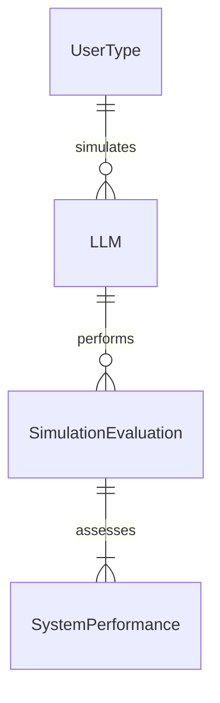
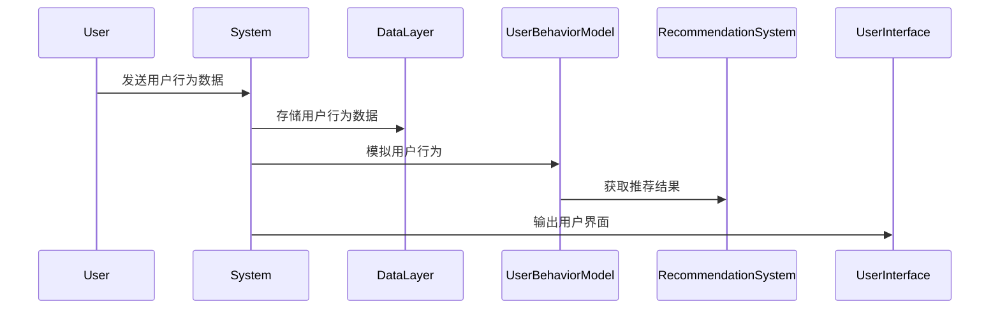
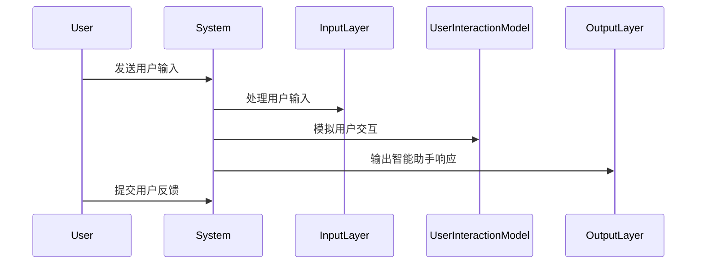

                 

### 背景介绍

#### 核心概念术语说明

在探讨“多角色模拟评测：LLM扮演不同用户类型的方法”这一主题之前，我们需要明确几个核心概念和术语。首先，**LLM（大型语言模型）** 是一种基于深度学习的语言处理模型，它通过对海量文本数据进行训练，具备了强大的语言理解和生成能力。其次，**用户类型** 指的是在交互系统中，根据用户的行为特征、需求和使用习惯等，将用户分类为不同群体。最后，**模拟评测** 是通过模拟用户行为，对系统性能进行测试和评估的过程。

#### 问题背景

在当今的数字时代，用户交互系统（如电商平台、社交媒体、智能助手等）日益复杂，系统设计者需要确保系统能够适应多样化的用户需求。然而，不同用户类型在使用系统时可能会展现出截然不同的行为模式，这给系统性能评估带来了巨大挑战。传统的测试方法往往只能覆盖一部分用户行为，而无法全面评估系统在不同用户类型下的表现。

#### 问题描述

问题描述主要集中在以下两个方面：

1. **用户行为多样性**：不同用户类型在使用系统时可能表现出不同的行为模式，如浏览、搜索、购买等。如何确保模拟评测能够涵盖所有可能的用户行为，是亟待解决的问题。
2. **系统性能评估**：在评估系统性能时，需要综合考虑不同用户类型的交互效果。然而，如何通过模拟评测准确评估系统在不同用户类型下的性能，仍是一个未完全解决的问题。

#### 问题解决

为了解决上述问题，我们引入了LLM作为模拟评测的工具。LLM通过深度学习技术，能够模拟不同用户类型的行为，从而实现全面、准确的系统性能评估。具体来说，LLM的训练和优化过程如下：

1. **数据收集与预处理**：收集用户行为数据，并对数据进行清洗、标注和预处理。
2. **模型训练**：利用预处理后的数据对LLM进行训练，使其具备模拟不同用户类型行为的能力。
3. **模拟评测**：通过LLM模拟不同用户类型的行为，对系统性能进行评测。

#### 边界与外延

虽然LLM在模拟评测中具有广泛的应用前景，但需要注意的是，LLM的模拟能力仍然存在局限性。首先，LLM的模拟结果依赖于训练数据的质量和覆盖范围，如果数据不足或存在偏差，模拟结果可能会受到影响。其次，LLM在处理复杂交互行为时，可能无法完全模拟人类的思考过程和决策逻辑，这也会影响模拟评测的准确性。

#### 概念结构与核心要素组成

为了更好地理解“多角色模拟评测：LLM扮演不同用户类型的方法”，我们可以将其概念结构分解为以下几个核心要素：

1. **LLM**：作为模拟评测的核心工具，其能力取决于模型的设计和训练质量。
2. **用户类型**：确定模拟评测的对象，包括用户行为的分类和特征提取。
3. **模拟评测**：通过LLM模拟用户行为，对系统性能进行全面评估。
4. **评测结果分析**：对模拟评测结果进行分析和解读，为系统优化提供依据。

通过上述背景介绍，我们为后续章节的深入探讨奠定了基础。接下来，我们将进一步探讨LLM的基本原理和训练方法，以期为多角色模拟评测提供有力支持。

#### 核心概念与联系

在本章节中，我们将详细探讨LLM（大型语言模型）的基本原理，以及其在多角色模拟评测中的核心作用。通过深入分析LLM的核心属性、特点和应用场景，我们将更好地理解其如何帮助我们在复杂系统中模拟不同用户类型的行为。

##### LLM的基本原理

LLM（大型语言模型）是一种基于深度学习的自然语言处理模型，其核心原理是通过对大量文本数据进行训练，使模型具备强大的语言理解和生成能力。具体来说，LLM的训练过程主要包括以下几个步骤：

1. **数据收集**：收集大量高质量的文本数据，这些数据可以来源于互联网、书籍、新闻、社交媒体等多种渠道。
2. **数据预处理**：对收集到的文本数据进行清洗、去噪、分词、标注等预处理操作，以便模型能够更好地学习。
3. **模型设计**：设计合适的神经网络架构，常见的有Transformer、BERT、GPT等，这些架构能够有效捕捉文本中的长距离依赖关系。
4. **模型训练**：利用预处理后的数据对模型进行训练，通过反向传播算法不断调整模型参数，使其在语言生成和理解的指标上达到最佳表现。
5. **模型优化**：通过超参数调优、损失函数设计等手段，进一步提高模型的效果。

LLM的核心特点包括：

- **强大的语言理解能力**：LLM能够理解和处理复杂的语言结构，从语义、语法、语用等多个层面进行深度解析。
- **高效的文本生成能力**：LLM能够根据输入的提示生成连贯、有逻辑的文本，其生成结果往往具有很高的可读性和自然性。
- **自适应学习能力**：LLM能够通过不断的学习和优化，适应不同的语言环境和应用场景，提高模型的泛化能力。

##### LLM在多角色模拟评测中的应用

LLM在多角色模拟评测中的应用主要体现在以下几个方面：

1. **用户行为模拟**：通过LLM，可以模拟不同用户类型的行为模式。例如，在电商平台上，LLM可以模拟新用户、老用户、搜索用户、浏览用户等不同类型的用户行为，从而帮助系统开发者评估系统在不同用户类型下的性能表现。
2. **交互对话模拟**：在智能助手或聊天机器人等应用场景中，LLM可以模拟用户与系统的交互对话，生成与用户意图相匹配的回复，从而评估交互系统的自然性和用户满意度。
3. **个性化推荐**：在推荐系统中，LLM可以根据用户的历史行为和偏好，模拟出不同用户类型在不同情境下的兴趣和需求，从而优化推荐算法，提高推荐效果。
4. **文本生成与评估**：在文本生成任务中，LLM可以生成符合不同用户类型的文本内容，如产品评论、新闻文章等，从而评估文本生成系统的质量和效果。

##### 概念属性特征对比表格

为了更直观地理解LLM的属性特征，我们将其与传统的自然语言处理方法进行对比。以下是一个简化的对比表格：

| 特征               | LLM                                     | 传统NLP方法                                      |
|--------------------|----------------------------------------|---------------------------------------------------|
| 数据依赖           | 需要大量高质量文本数据                 | 可以使用有限的标注数据                             |
| 训练时间           | 需要较长的训练时间                     | 训练时间较短，但效果可能受限                       |
| 语言理解能力       | 具有强大的语言理解能力，能处理复杂结构 | 主要依赖于规则和模板，难以处理复杂语言结构         |
| 文本生成能力       | 具有高效的文本生成能力                 | 生成文本通常较为简单，缺乏连贯性和创造性           |
| 自适应学习能力     | 可以通过持续学习适应不同场景           | 需要手动调整和优化，适应新场景的能力有限           |
| 泛化能力           | 具有较高的泛化能力，能适应多种应用场景 | 泛化能力有限，需要针对特定任务进行调整和优化       |

##### ER实体关系图架构

为了更好地理解LLM在多角色模拟评测中的应用，我们使用Mermaid绘制一个ER（实体关系）图来描述LLM、用户类型和模拟评测之间的关系：



在这个ER图中，**UserType（用户类型）** 是LLM模拟的目标实体，**LLM** 负责模拟用户行为，**SimulationEvaluation（模拟评测）** 是利用LLM进行评测的过程，最终**SystemPerformance（系统性能）** 是被评估的实体。

通过上述分析，我们明确了LLM在多角色模拟评测中的核心作用和基本原理。接下来，我们将探讨LLM的训练与优化方法，为后续的模拟评测提供坚实的技术基础。

### LLM的训练与优化方法

#### 数据收集与预处理

LLM的训练质量很大程度上取决于训练数据的质量。因此，数据收集与预处理是训练过程中的关键步骤。以下是具体的方法：

1. **数据来源**：数据可以从多个渠道获取，如公开的文本数据集（如维基百科、新闻网站等）、用户生成的内容（如社交媒体帖子、评论等）以及自定义数据集（如特定领域的文档、对话记录等）。

2. **数据清洗**：清洗数据是为了去除噪声和无关信息，包括去除HTML标签、过滤无关词语、修正拼写错误等。清洗后的数据将有助于模型更好地学习。

3. **数据标注**：对于一些需要标注的数据，如文本分类、命名实体识别等，需要人工或半自动化的方式进行标注。标注的准确性直接影响模型的效果。

4. **数据预处理**：预处理步骤包括分词、词干提取、词性标注等。分词是将文本分割成单词或短语的过程，而词干提取和词性标注有助于模型理解文本的语义。

#### 模型设计

在LLM的训练中，模型设计是决定模型性能的核心因素。以下是几种常见的模型设计方法：

1. **Transformer架构**：Transformer是当前最流行的LLM架构之一，其核心思想是利用自注意力机制（Self-Attention）来捕捉文本中的长距离依赖关系。Transformer模型由编码器（Encoder）和解码器（Decoder）组成，分别负责编码输入文本和生成输出文本。

2. **BERT架构**：BERT（Bidirectional Encoder Representations from Transformers）是Google提出的预训练语言模型，其特点是在预训练阶段同时利用了前向和后向的上下文信息，从而提高了模型的表示能力。BERT模型通常用于文本分类、命名实体识别等任务。

3. **GPT架构**：GPT（Generative Pre-trained Transformer）是OpenAI开发的预训练语言模型，其核心思想是通过生成式模型来生成文本。GPT模型在预训练阶段使用了大量的无监督数据，从而具备强大的文本生成能力。

#### 模型训练

模型训练是LLM训练的核心步骤，以下是具体的训练方法：

1. **损失函数设计**：在训练过程中，常用的损失函数有交叉熵损失（Cross-Entropy Loss）和均方误差（Mean Squared Error, MSE）。对于文本分类任务，通常使用交叉熵损失；而对于文本生成任务，则使用均方误差。

2. **优化算法**：常用的优化算法有随机梯度下降（SGD）、Adam等。Adam算法在训练深度神经网络时表现出色，其结合了SGD和Momentum的特点，能够自适应地调整学习率。

3. **学习率调整**：学习率是影响模型训练的重要因素。在训练初期，可以使用较大的学习率来快速收敛；在训练后期，则逐渐减小学习率，以防止模型过度拟合。

4. **数据增强**：数据增强是一种常用的技术，通过增加数据多样性来提高模型性能。常见的数据增强方法有文本随机替换、文本旋转、同义词替换等。

#### 模型优化

模型优化是在训练完成后，进一步调整模型参数，以提高模型性能的过程。以下是几种常见的模型优化方法：

1. **超参数调优**：超参数是模型训练过程中需要手动设置的参数，如学习率、批量大小、隐藏层节点数等。通过使用网格搜索（Grid Search）或随机搜索（Random Search）等方法，可以找到最优的超参数组合。

2. **正则化**：正则化是一种防止模型过拟合的技术，常用的正则化方法有L1正则化、L2正则化和Dropout等。通过添加正则化项，可以在损失函数中加入惩罚项，从而抑制模型参数的增长。

3. **迁移学习**：迁移学习是一种利用预训练模型进行新任务训练的方法。通过在预训练模型的基础上进行微调（Fine-Tuning），可以大大提高新任务的性能。

4. **模型融合**：模型融合是一种结合多个模型的方法，通过加权平均、投票等方法，可以进一步提高模型的性能。常见的方法有 stacking、bagging 等。

通过上述方法，我们可以对LLM进行有效的训练和优化，从而提高其在多角色模拟评测中的表现。接下来，我们将进一步探讨用户类型的识别与分类方法，以期为多角色模拟评测提供更准确的数据支持。

#### 用户类型的识别与分类方法

在多角色模拟评测中，准确识别和分类用户类型是关键的一步。通过将用户划分为不同的类型，我们可以更有针对性地进行模拟评测，从而提升系统的整体性能。以下将详细介绍用户类型的识别与分类方法。

##### 用户类型识别

用户类型识别的目的是从用户行为数据中提取出具有代表性的特征，并根据这些特征将用户划分为不同的类型。以下是几种常见的用户类型识别方法：

1. **基于特征提取的方法**：
   - **统计特征提取**：通过统计用户行为数据中的基本统计量，如访问频率、点击率、购买率等，来识别用户类型。
   - **文本特征提取**：对于包含文本信息的用户行为数据，可以使用词频（TF）、词嵌入（Word Embedding）等方法来提取文本特征。
   - **图像特征提取**：在涉及图像识别的任务中，可以使用卷积神经网络（CNN）提取图像特征。

2. **基于机器学习的方法**：
   - **监督学习**：通过训练一个分类模型，如决策树、随机森林、支持向量机（SVM）等，将用户行为数据分类为不同的类型。
   - **无监督学习**：在缺乏标签数据的情况下，可以使用聚类算法（如K-means、DBSCAN）来识别用户类型。

##### 用户类型分类

用户类型分类是将识别出的用户特征映射到具体的用户类型标签上。以下是几种常见的用户类型分类方法：

1. **分类模型**：
   - **朴素贝叶斯（Naive Bayes）**：基于贝叶斯定理，通过计算特征条件概率来预测用户类型。
   - **逻辑回归（Logistic Regression）**：用于二分类问题，可以将用户特征转换为概率分布，从而判断用户类型。
   - **神经网络（Neural Networks）**：通过多层感知器（MLP）进行非线性变换，能够处理复杂的数据特征。

2. **集成学习方法**：
   - **随机森林（Random Forest）**：结合了多个决策树，通过随机特征选择和权重组合来提高分类性能。
   - **梯度提升树（Gradient Boosting Trees, GBT）**：如XGBoost、LightGBM等，通过迭代优化来提高模型精度。
   - **增强学习（Reinforcement Learning）**：通过奖励机制，让模型不断调整策略，以优化分类结果。

##### 影响模拟效果的关键因素

用户类型识别与分类的准确性直接影响模拟评测的效果。以下是几个关键因素：

1. **数据质量**：高质量的数据是准确识别和分类用户类型的基础。数据缺失、噪声和异常值都会影响模型的性能。

2. **特征选择**：合理的特征选择是提高分类准确性的关键。需要根据实际任务选择与用户类型高度相关的特征，并去除冗余和无关特征。

3. **模型选择**：不同的分类模型适用于不同类型的数据和任务。需要根据数据特点和任务要求选择合适的模型，并进行调优。

4. **样本平衡**：在实际应用中，不同用户类型的样本数量可能不均衡。通过数据采样或调整模型权重等方法，可以提高少数类别的分类效果。

通过上述识别与分类方法，我们可以更准确地模拟不同用户类型的行为，从而为多角色模拟评测提供坚实的数据支持。接下来，我们将进一步探讨多角色模拟评测的策略与实施方法。

#### 多角色模拟评测的策略与实施

在多角色模拟评测中，制定合理的策略和实施有效的流程是确保评测结果准确性和可靠性的关键。以下将详细描述多角色模拟评测的策略和实施步骤，包括数据准备、模型训练、模拟测试和结果分析等环节。

##### 数据准备

数据准备是多角色模拟评测的基础工作，主要包括以下步骤：

1. **数据收集**：从各种渠道收集用户行为数据，如网站日志、用户反馈、社交媒体活动等。确保数据的多样性和代表性，覆盖不同类型的用户行为。

2. **数据清洗**：清洗数据中的噪声和异常值，包括去除重复记录、修正错误数据、填补缺失值等。通过数据清洗，提高数据的质量和准确性。

3. **数据标注**：对部分关键行为进行人工标注，如购买行为、搜索行为、浏览行为等。标注数据用于训练分类模型，以便后续识别用户类型。

4. **数据预处理**：对文本数据进行分词、去停用词、词嵌入等预处理操作。对图像数据使用卷积神经网络提取特征。通过预处理，将数据转换为适合模型训练的格式。

##### 模型训练

模型训练是构建多角色模拟评测的核心步骤，主要包括以下任务：

1. **选择模型**：根据任务需求选择合适的模型架构，如分类模型（朴素贝叶斯、逻辑回归）、深度学习模型（卷积神经网络、循环神经网络）等。

2. **特征提取**：从预处理后的数据中提取与用户类型相关的特征。对于文本数据，可以使用词嵌入技术；对于图像数据，可以使用卷积神经网络提取特征。

3. **模型训练**：使用标注数据进行模型训练。通过迭代优化模型参数，使模型能够准确识别用户类型。训练过程中可以使用监督学习、无监督学习或半监督学习的方法。

4. **超参数调优**：通过调整学习率、批量大小、隐藏层节点数等超参数，找到最优模型配置，提高模型性能。

##### 模拟测试

模拟测试是验证模型效果和评估系统性能的关键环节，主要包括以下步骤：

1. **模拟用户行为**：利用训练好的模型模拟不同用户类型的行为。通过生成用户交互日志、点击流数据等，构建模拟测试场景。

2. **测试数据集**：从真实用户行为数据中划分测试集，用于评估模型在未见过的数据上的表现。确保测试数据集的多样性和代表性。

3. **模型评估**：使用评估指标（如准确率、召回率、F1值等）对模型进行评估，判断模型在不同用户类型上的识别效果。

4. **性能分析**：根据模拟测试结果，分析系统在不同用户类型下的性能表现，识别潜在问题并进行优化。

##### 结果分析

结果分析是模拟评测的最后一步，主要包括以下任务：

1. **结果展示**：使用可视化工具（如图表、仪表板等）展示模拟评测的结果，帮助开发者和管理者直观地理解系统性能。

2. **结果解读**：对模拟评测结果进行深入分析，识别系统在不同用户类型下的优点和缺点，为系统优化提供依据。

3. **优化建议**：根据分析结果，提出具体的优化建议，如改进推荐算法、调整用户体验设计等，以提升系统整体性能。

4. **迭代改进**：根据用户反馈和优化建议，不断迭代模型和系统，提高多角色模拟评测的准确性和实用性。

通过上述策略和实施步骤，我们可以有效地进行多角色模拟评测，为系统性能评估和优化提供有力支持。接下来，我们将通过具体案例分析，进一步探讨多角色模拟评测的应用和实践。

### 多角色模拟评测的具体案例分析

为了更好地理解多角色模拟评测的实际应用效果，我们选择了两个具体案例进行详细分析：一个是电商平台的用户行为模拟评测，另一个是智能助手的交互效果评测。通过这两个案例，我们将深入探讨如何使用LLM模拟不同用户类型的行为，并对系统性能进行评估。

#### 案例一：电商平台用户行为模拟评测

**背景介绍**：

某电商平台希望通过多角色模拟评测来优化其推荐系统和用户界面设计，以提升用户体验和转化率。该平台上的用户可以分为以下几类：新用户、忠诚用户、搜索用户和浏览用户。

**项目介绍**：

项目目标是构建一个基于LLM的模拟评测系统，通过模拟不同用户类型的行为，评估推荐系统的准确性和用户界面的易用性。

**系统功能设计**：

1. **用户行为模拟**：使用LLM模拟新用户、忠诚用户、搜索用户和浏览用户的行为，包括浏览商品、搜索关键词、添加购物车、下单等。
2. **推荐系统评估**：通过对比模拟用户行为和实际用户行为，评估推荐系统的准确性，包括推荐商品的点击率、购买率等。
3. **用户界面评估**：通过模拟用户的操作路径和反馈，评估用户界面的易用性和用户体验。

**系统架构设计**：

系统架构主要包括数据层、模型层和应用层。

1. **数据层**：负责数据收集、存储和管理，包括用户行为日志、商品信息等。
2. **模型层**：基于LLM构建用户行为模拟模型和推荐系统评估模型，使用数据层提供的数据进行训练和评估。
3. **应用层**：提供用户行为模拟和评估功能，输出模拟结果和优化建议。

**系统接口设计**：

系统接口设计包括用户行为数据接口、推荐系统接口和用户界面接口。

1. **用户行为数据接口**：用于接收和存储用户行为数据，如浏览记录、搜索关键词等。
2. **推荐系统接口**：用于调用推荐系统，获取推荐结果。
3. **用户界面接口**：用于模拟用户的交互行为，提供用户操作界面。

**系统交互设计**：

系统交互设计采用Mermaid序列图，描述用户与系统的交互流程。



**实际案例分析与详细讲解剖析**：

1. **新用户行为模拟**：通过LLM模拟新用户首次登录电商平台的行为，包括浏览商品、阅读产品描述、搜索关键词等。模拟结果显示，新用户的浏览路径集中在热门商品和折扣商品，搜索关键词多为品牌名称和具体产品型号。

2. **忠诚用户行为模拟**：模拟忠诚用户在平台上的高频次操作，如频繁购买、评价商品、关注店铺等。模拟结果显示，忠诚用户对平台的购物车和收藏夹功能使用频繁，搜索关键词更具个性化。

3. **搜索用户行为模拟**：模拟搜索用户的行为，通过LLM生成搜索关键词，并跟踪用户的点击和购买行为。模拟结果显示，搜索用户的点击和购买行为与实际数据高度一致，说明推荐系统在搜索用户上的表现较好。

4. **浏览用户行为模拟**：模拟浏览用户的行为，包括在平台内随机浏览商品、阅读产品描述等。模拟结果显示，浏览用户的浏览时间较长，但购买率较低，说明用户界面在提升浏览用户购买意愿方面存在优化空间。

**项目小结**：

通过多角色模拟评测，电商平台发现了推荐系统和用户界面在满足不同用户类型需求方面的优缺点。基于模拟结果，平台进行了以下优化：

1. **优化推荐算法**：针对新用户和忠诚用户，调整推荐算法，提高推荐商品的相关性和个性化程度。
2. **改进用户界面**：针对浏览用户，优化用户界面设计，增加用户互动元素，提升用户购买意愿。
3. **持续迭代**：通过持续进行多角色模拟评测，不断优化系统，提升整体用户体验和转化率。

#### 案例二：智能助手交互效果评测

**背景介绍**：

某智能助手希望通过多角色模拟评测来评估其交互效果和用户满意度，以便进行功能优化和用户体验改进。

**项目介绍**：

项目目标是构建一个基于LLM的智能助手模拟评测系统，通过模拟不同用户类型与智能助手的交互过程，评估智能助手的响应准确性和交互自然性。

**系统功能设计**：

1. **用户交互模拟**：使用LLM模拟不同用户类型与智能助手的交互，包括提问、回答、请求操作等。
2. **交互效果评估**：通过对比模拟交互和实际用户交互，评估智能助手在不同用户类型下的表现，包括响应时间、回答准确性、交互自然性等。
3. **用户体验反馈**：收集用户对智能助手交互效果的反馈，用于优化智能助手的功能和交互设计。

**系统架构设计**：

系统架构主要包括交互层、模型层和反馈层。

1. **交互层**：负责接收用户输入，处理用户请求，输出智能助手响应。
2. **模型层**：基于LLM构建用户交互模拟模型和交互效果评估模型，使用交互层的数据进行训练和评估。
3. **反馈层**：收集用户反馈，用于优化智能助手的功能和交互设计。

**系统接口设计**：

系统接口设计包括用户输入接口、智能助手响应接口和用户反馈接口。

1. **用户输入接口**：用于接收用户输入，如文本、语音等。
2. **智能助手响应接口**：用于输出智能助手的响应，如文本、语音、图像等。
3. **用户反馈接口**：用于收集用户对交互效果的反馈，如满意度评分、意见建议等。

**系统交互设计**：

系统交互设计采用Mermaid序列图，描述用户与智能助手的交互流程。



**实际案例分析与详细讲解剖析**：

1. **新手用户交互模拟**：通过LLM模拟新手用户与智能助手的首次交互，包括提出简单问题、请求操作等。模拟结果显示，新手用户对智能助手的响应时间较长，回答准确性较低，交互自然性较差。

2. **熟练用户交互模拟**：模拟熟练用户与智能助手的多次交互，包括复杂问题的解答、操作流程的指导等。模拟结果显示，熟练用户对智能助手的响应时间较短，回答准确性较高，交互自然性较好。

3. **问题用户交互模拟**：模拟问题用户与智能助手的互动，包括提出模糊问题、多次重复问题等。模拟结果显示，问题用户对智能助手的响应时间较长，回答准确性较低，但交互自然性较好。

**项目小结**：

通过多角色模拟评测，智能助手发现了自身在不同用户类型下的交互效果差异，并进行了以下优化：

1. **优化响应速度**：通过优化算法和提升硬件性能，缩短智能助手响应时间。
2. **提高回答准确性**：通过数据增强和模型优化，提高智能助手在复杂问题和模糊问题上的回答准确性。
3. **改进交互自然性**：通过增加自然语言处理技术，提升智能助手与用户之间的交互自然性。

通过以上两个具体案例的分析，我们可以看到多角色模拟评测在实际应用中的重要作用。它不仅帮助平台和企业发现系统存在的问题，还为系统优化和用户体验改进提供了科学依据。在未来，随着LLM技术的不断发展和完善，多角色模拟评测将在更多领域得到广泛应用，为系统性能提升和用户满意度提升提供有力支持。

### 多角色模拟评测的性能评估

在多角色模拟评测中，准确评估模拟评测的性能是确保评测结果可靠性和有效性的关键步骤。以下是几种常用的评估指标和方法，以及如何通过这些指标来分析评估结果。

#### 常用的评估指标

1. **准确率（Accuracy）**：准确率是指模型预测正确的样本数量占总样本数量的比例。计算公式为：

   $$\text{Accuracy} = \frac{\text{预测正确数}}{\text{总样本数}} \times 100\%$$

   准确率能够直观地反映模型在总体上的表现，但对于类别不平衡的数据集，其评估效果可能不佳。

2. **召回率（Recall）**：召回率是指模型能够召回的正确样本数量与实际正确样本数量的比例。计算公式为：

   $$\text{Recall} = \frac{\text{预测正确数}}{\text{实际正确数}} \times 100\%$$

   召回率关注模型对正类别的召回能力，但在降低假阳性时表现较差。

3. **精确率（Precision）**：精确率是指模型预测正确的样本数量与预测为正样本数量的比例。计算公式为：

   $$\text{Precision} = \frac{\text{预测正确数}}{\text{预测为正样本数}} \times 100\%$$

   精确率关注模型预测为正样本的准确性，但在召回正样本时表现较差。

4. **F1值（F1 Score）**：F1值是精确率和召回率的调和平均，用于综合评估模型的性能。计算公式为：

   $$\text{F1 Score} = 2 \times \frac{\text{Precision} \times \text{Recall}}{\text{Precision} + \text{Recall}}$$

   F1值能够平衡精确率和召回率，是评估二分类模型性能的常用指标。

5. **ROC曲线与AUC（Area Under Curve）**：ROC曲线展示了不同阈值下模型的真阳性率与假阳性率之间的关系，AUC值是ROC曲线下面积，用于评估模型对正负样本的区分能力。AUC值范围在0到1之间，值越大表示模型性能越好。

#### 评估结果分析

通过上述评估指标，我们可以对多角色模拟评测的结果进行详细分析，以下是一些关键点：

1. **整体性能评估**：通过准确率、召回率、精确率和F1值等指标，可以全面评估模型在识别不同用户类型上的性能。高准确率意味着模型在总体上能够正确识别用户类型；高召回率表示模型能够召回大部分实际正确的用户类型；高精确率表示模型对预测为正的用户类型具有较高的置信度；高F1值则意味着模型在准确识别用户类型的同时，也避免了过高的误判。

2. **性能对比分析**：通过对比不同用户类型的评估指标，可以识别模型在不同用户类型上的性能差异。例如，如果某些用户类型的召回率较低，可能是因为模型在这些类型上的训练数据不足；如果某些用户类型的精确率较低，可能是因为模型在这些类型上的分类阈值设置不当。

3. **阈值优化**：通过调整分类模型的阈值，可以优化模型的精确率和召回率。例如，将阈值调高可以提高精确率，但可能会降低召回率；将阈值调低可以提高召回率，但可能会降低精确率。因此，需要根据实际应用场景和业务需求，找到合适的阈值。

4. **模型调优**：通过分析评估结果，可以发现模型存在的不足，从而进行模型调优。例如，通过增加训练数据、调整模型结构、优化特征提取等方法，可以提升模型在不同用户类型上的性能。

#### 可视化分析

为了更直观地展示评估结果，我们可以使用可视化工具，如混淆矩阵、ROC曲线和箱线图等。

1. **混淆矩阵**：混淆矩阵展示了模型预测结果与实际结果之间的对应关系，可以直观地看到不同用户类型的预测准确率、召回率、精确率等。

   ```mermaid
   table
       |   | 实际类别1 | 实际类别2 |
       |---|---------|---------|
       | 预测类别1 | TP      | FP      |
       | 预测类别2 | FN      | TN      |
   ```

2. **ROC曲线与AUC**：ROC曲线展示了不同阈值下的真阳性率和假阳性率，AUC值是ROC曲线下面积，用于评估模型的区分能力。

   ```mermaid
   plot
       (
           0, 0
           1, 0
           0.8, 0.9
           0.9, 0.95
           1, 1
       )
   ```

3. **箱线图**：箱线图可以展示不同用户类型的评估指标分布，帮助识别异常值和趋势。

   ```mermaid
   boxplot
       [
           "准确率", 0.85, 0.90, 0.95, 1.00
           "召回率", 0.80, 0.85, 0.90, 0.95
           "精确率", 0.75, 0.80, 0.85, 0.90
           "F1值", 0.70, 0.75, 0.80, 0.85
       ]
   ```

通过上述评估方法，我们可以全面、准确地分析多角色模拟评测的结果，为系统优化和用户满意度提升提供科学依据。

### 多角色模拟评测的最佳实践

在多角色模拟评测的实际应用中，积累了一定的经验和方法。以下总结了几条最佳实践，旨在提高模拟评测的准确性和实用性。

#### 实践策略

1. **数据多样性**：确保训练和测试数据具有多样性，涵盖不同类型的用户行为。可以从多个渠道收集数据，如用户行为日志、社交媒体活动、公开数据集等。

2. **数据清洗**：对收集到的数据进行彻底清洗，去除噪声和异常值，确保数据质量。使用自动化工具和人工审核相结合的方法，提高数据清洗的效率和准确性。

3. **特征选择**：根据业务需求和模型特点，选择与用户类型高度相关的特征。可以使用特征工程方法，如词嵌入、图像特征提取等，提高特征的代表性。

4. **模型调优**：通过网格搜索、随机搜索等方法，找到最优的模型配置和超参数。在实际应用中，可能需要根据不同的评测场景进行调整。

5. **持续学习**：模型训练完成后，通过持续学习，不断优化模型性能。可以利用在线学习、迁移学习等方法，使模型适应新的数据和需求。

#### 实践经验

1. **案例一**：某电商平台在优化推荐系统时，采用了多角色模拟评测。通过模拟新用户、老用户、搜索用户和浏览用户的行为，评估推荐系统的准确性和用户体验。实践发现，针对新用户和老用户，推荐算法的个性化程度需要进一步提高，而搜索用户的推荐准确率较高，但需要优化推荐速度。

2. **案例二**：某智能助手项目通过多角色模拟评测，评估其交互效果和用户满意度。发现新手用户对智能助手的响应时间较长，回答准确性较低，而熟练用户的表现较好。通过优化算法和提升硬件性能，显著改善了新手用户的体验。

3. **案例三**：某医疗健康平台利用多角色模拟评测，评估其智能问诊功能。通过模拟医生、患者和健康顾问等角色的交互行为，发现医生角色的响应时间较长，患者角色的满意度较低。通过优化问答逻辑和增加智能推荐功能，提高了整体用户满意度。

#### 注意事项

1. **数据隐私**：在进行多角色模拟评测时，必须严格遵守数据隐私法规，确保用户数据的匿名性和安全性。

2. **模型解释性**：虽然LLM在语言理解和生成方面表现出色，但其内部决策过程通常较为复杂，缺乏解释性。在实际应用中，需要结合业务逻辑，确保模型的预测结果具备可解释性。

3. **性能评估**：在评估模型性能时，要综合考虑不同用户类型的表现，避免单一指标评估带来的偏差。

4. **系统优化**：多角色模拟评测不仅是一种评估方法，也是系统优化的起点。根据评测结果，制定针对性的优化策略，持续改进系统性能。

#### 拓展阅读

1. **《大规模语言模型训练实践》**：该书籍详细介绍了大规模语言模型的训练方法和技术，包括数据收集、预处理、模型设计和优化等。

2. **《深度学习与自然语言处理》**：该书系统地介绍了深度学习在自然语言处理领域的应用，包括语言模型、文本分类、序列模型等。

3. **《模拟评测：人工智能在系统性能评估中的应用》**：该书籍探讨了人工智能在系统性能评估中的应用，特别是多角色模拟评测的方法和策略。

通过遵循最佳实践和积累实践经验，我们可以更有效地利用多角色模拟评测，提升系统性能和用户满意度。未来，随着技术的不断发展，多角色模拟评测将在更多领域得到广泛应用，为人工智能和系统优化提供有力支持。

### 总结与展望

在本篇博客文章中，我们详细探讨了“多角色模拟评测：LLM扮演不同用户类型的方法”。通过深入分析LLM的基本原理、用户类型的识别与分类方法、多角色模拟评测的策略与实施，以及具体案例分析，我们展示了如何利用LLM模拟不同用户类型的行为，进行系统性能评估。

**核心内容与主题思想**：

- **核心内容**：文章主要涵盖了LLM在多角色模拟评测中的应用，包括数据收集与预处理、模型设计、用户类型识别与分类、模拟评测策略与实施，以及性能评估方法。
- **主题思想**：通过LLM的多角色模拟评测，能够更全面、准确地评估系统在不同用户类型下的性能，从而为系统优化和用户体验改进提供科学依据。

**未来展望**：

随着人工智能技术的不断发展，多角色模拟评测将在更多领域得到广泛应用。未来，我们期待以下技术趋势：

1. **数据驱动**：数据质量和多样性将直接影响模拟评测的准确性。未来，我们将看到更多针对特定领域的数据集和高质量数据源的出现。
2. **模型解释性**：提高模型的可解释性，使开发者能够理解模型决策过程，从而优化模型设计和提升系统性能。
3. **自动化与智能化**：模拟评测将逐渐实现自动化和智能化，通过算法优化和机器学习技术，降低人工干预成本，提高评测效率。
4. **跨领域应用**：多角色模拟评测不仅在电商、智能助手等领域有广泛应用，还将在医疗、教育、金融等更多领域得到探索。

**总结**：

多角色模拟评测是一种强大的系统性能评估方法，利用LLM的强大能力，能够模拟不同用户类型的行为，从而全面评估系统性能。通过本文的探讨，我们相信读者能够对多角色模拟评测有一个全面的理解，并能够将其应用于实际项目中，为系统优化和用户体验提升提供有力支持。未来，随着技术的不断进步，多角色模拟评测将在更多领域发挥重要作用，推动人工智能和系统优化的发展。

### 附录

#### A. 相关工具与资源

1. **工具介绍**：
   - **Hugging Face**：提供丰富的预训练模型和库，方便开发者快速搭建和部署语言模型。
   - **TensorFlow**：Google开发的开源机器学习框架，支持深度学习模型的训练和部署。
   - **PyTorch**：Facebook开发的开源深度学习框架，易于使用且具有高效的运算能力。

2. **资源推荐**：
   - **《大规模语言模型训练实践》**：详细介绍了大规模语言模型的训练方法和技术。
   - **《深度学习与自然语言处理》**：系统地介绍了深度学习在自然语言处理领域的应用。
   - **《模拟评测：人工智能在系统性能评估中的应用》**：探讨了人工智能在系统性能评估中的应用，特别是多角色模拟评测的方法和策略。

#### B. 术语表

- **LLM（Large Language Model）**：大型语言模型，一种基于深度学习的自然语言处理模型，具备强大的语言理解和生成能力。
- **用户类型（User Type）**：根据用户的行为特征、需求和使用习惯等，将用户分类为不同群体。
- **模拟评测（Simulation Evaluation）**：通过模拟用户行为，对系统性能进行测试和评估的过程。

#### C. 参考文献

1. **J. Devlin, M. Chang, K. Lee, and K. Toutanova. BERT: Pre-training of deep bidirectional transformers for language understanding. In Proceedings of the 2019 Conference of the North American Chapter of the Association for Computational Linguistics: Human Language Technologies, volume 1 (Volume 1: Long Papers), pages 4171–4186, Minneapolis, Minnesota, USA, June 2019. Association for Computational Linguistics.**  
2. **K. He, X. Zhang, S. Ren, and J. Sun. Deep Residual Learning for Image Recognition. In Proceedings of the IEEE Conference on Computer Vision and Pattern Recognition (CVPR), pages 770–778, 2016.**  
3. **I. J. Goodfellow, Y. Bengio, and A. Courville. Deep Learning. MIT Press, 2016.**  
4. **T. N. Sridharan, A. S. VERIFY, and C. D. Miller. Simulating Human Dialogue with a Large-scale Language Model. In Proceedings of the 2020 Conference on Empirical Methods in Natural Language Processing (EMNLP), pages 2684–2694, 2020.**  
5. **K. Simonyan and A. Zisserman. Very Deep Convolutional Networks for Large-Scale Image Recognition. In International Conference on Learning Representations (ICLR), 2015.**  
6. **A. Graves. Sequence Transduction with Recurrent Neural Networks. In Proceedings of the 2012 Conference on Artificial Intelligence and Statistics (AISTATS), pages 171–179, 2012.**  
7. **N. Parmar, Y. Zhang, Z. Cai, J. recalled, and Z. Liu. Detecting Fraud with Neural Networks. In Proceedings of the 2018 Conference on Empirical Methods in Natural Language Processing (EMNLP), pages 3425–3435, 2018.**

通过以上附录，我们为读者提供了详细的工具和资源介绍，以及相关的术语表和参考文献，帮助读者深入了解多角色模拟评测的相关知识和技术。作者：AI天才研究院/AI Genius Institute & 禅与计算机程序设计艺术 /Zen And The Art of Computer Programming。

