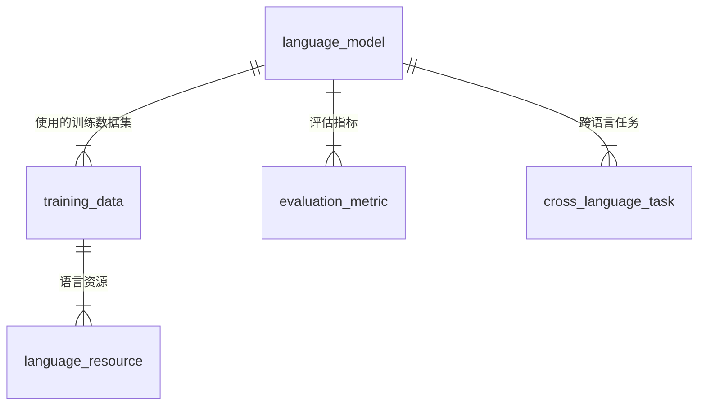
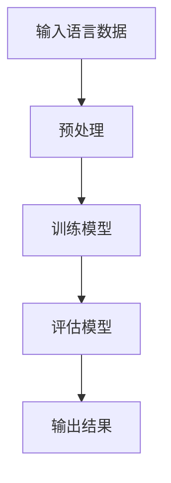
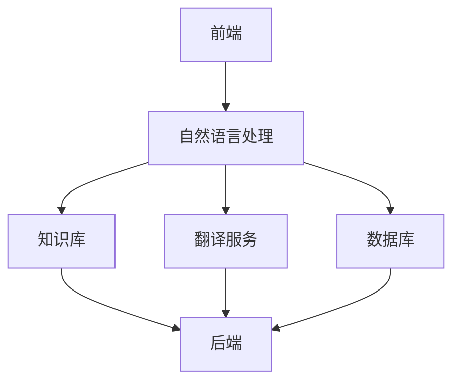
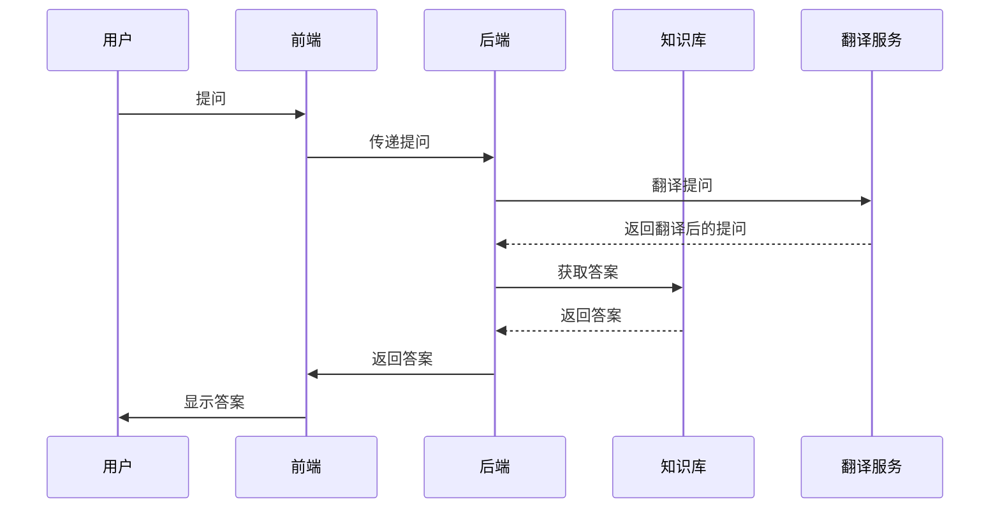

                 


# 多语言能力评估：测试LLM的跨语言表现

> 关键词：多语言能力、评估、语言模型、跨语言表现、算法原理、系统设计、项目实战

> 摘要：本文将深入探讨多语言能力评估在语言模型（LLM）中的应用，重点分析如何测试LLM的跨语言表现。通过介绍核心概念、算法原理、系统设计与项目实战，本文旨在为读者提供一个全面的理解，以提升LLM在实际应用中的效果。

## 一、背景介绍

### 1.1 问题背景

随着全球化的不断深入，多语言处理已经成为信息技术领域的一个重要研究方向。特别是近年来，预训练语言模型（Pre-Trained Language Model，简称PLM）的兴起，使得语言模型在多种语言中的应用变得愈加广泛。然而，如何评估语言模型的多语言能力，尤其是跨语言表现，成为一个亟待解决的问题。

### 1.2 多语言能力

多语言能力指的是一个系统或模型在不同语言环境中能够有效执行任务的能力。在自然语言处理（Natural Language Processing，简称NLP）领域，多语言能力尤为重要，它直接影响到模型在不同语言环境中的应用效果。

### 1.3 评估的重要性

评估LLM的多语言能力对于以下几个原因至关重要：

- **准确性提升**：通过评估，我们可以了解模型在不同语言环境下的准确性，从而针对性地进行优化。
- **泛化能力增强**：评估可以帮助我们了解模型的泛化能力，确保其在未见过语言中的表现。
- **应用场景拓展**：了解模型的多语言能力，有助于我们更好地将其应用于跨语言任务，如机器翻译、多语言问答等。

## 二、核心概念与联系

### 2.1 LLM与多语言能力

LLM（Language Learning Model）是一种通过大量文本数据预训练的语言模型，其核心能力在于对自然语言的理解和生成。多语言能力指的是LLM在不同语言环境中的表现，包括理解、生成和翻译等方面。

### 2.2 核心概念

在评估LLM的多语言能力时，以下几个核心概念是不可或缺的：

- **语言资源**：指用于训练和评估LLM的语言数据集，包括文本、语料库等。
- **评估指标**：用于衡量LLM多语言能力的指标，如BLEU、ROUGE等。
- **跨语言任务**：涉及不同语言之间的交互，如机器翻译、多语言问答等。

### 2.3 ER实体关系图

为了更好地理解LLM多语言能力的评估过程，我们可以使用ER实体关系图来描述各实体之间的关系。



## 三、算法原理讲解

### 3.1 算法流程图

为了更直观地理解评估LLM多语言能力的算法原理，我们可以使用Mermaid绘制算法流程图。



### 3.2 Python源代码

下面是一个简单的Python源代码示例，用于解释算法原理。

```python
import torch
import torchtext
from torchtext.data import Field, BucketIterator

# 定义数据集和字段
TEXT = Field(tokenize='spacy', lower=True)
train_data, valid_data = torchtext.datasets.WikiCorpus(root='./data', download=True, split=(0.8, 0.2))
train_data.fields = [TEXT]
valid_data.fields = [TEXT]

# 定义模型
class LanguageModel(nn.Module):
    def __init__(self, vocab_size, embed_size, hidden_size, num_layers, dropout):
        super(LanguageModel, self).__init__()
        self.embedding = nn.Embedding(vocab_size, embed_size)
        self.rnn = nn.LSTM(embed_size, hidden_size, num_layers, dropout=dropout)
        self.fc = nn.Linear(hidden_size, vocab_size)
    
    def forward(self, text, hidden):
        embedded = self.embedding(text)
        output, hidden = self.rnn(embedded, hidden)
        prediction = self.fc(output[-1, :, :])
        return prediction, hidden

# 训练模型
model = LanguageModel(len(TEXT.vocab), 256, 512, 3, 0.5)
optimizer = torch.optim.Adam(model.parameters(), lr=0.001)
criterion = nn.CrossEntropyLoss()

for epoch in range(10):
    for text, label in train_data.split(BucketIterator):
        optimizer.zero_grad()
        prediction, hidden = model(text)
        loss = criterion(prediction, label)
        loss.backward()
        optimizer.step()
```

### 3.3 数学模型与公式

在评估LLM多语言能力时，我们通常会使用以下数学模型和公式：

- **损失函数**：用于衡量模型预测与实际标签之间的差异。
- **梯度下降**：用于优化模型参数。
- **评价指标**：用于评估模型在多语言任务中的表现。

以下是具体的数学模型和公式：

$$
L = -\frac{1}{N}\sum_{i=1}^{N}y_i\log(p(x_i|y_i))
$$

$$
\frac{\partial L}{\partial \theta} \approx \frac{1}{m}\sum_{i=1}^{m}\frac{\partial L}{\partial z^{(i)}}
$$

其中，$L$表示损失函数，$N$表示样本数量，$y_i$表示实际标签，$p(x_i|y_i)$表示模型对样本的预测概率，$\theta$表示模型参数，$m$表示梯度下降的样本数量。

### 3.4 例子说明

假设我们有一个训练好的语言模型，我们需要评估其在英语和中文之间的翻译任务上的表现。我们可以使用BLEU指标来衡量翻译的准确性。

```python
from torchtext.datasets import Multi30k

train_data, valid_data = Multi30k.splits(exts=('.en', '.de'), fields=[TEXT, TEXT])
model.eval()
with torch.no_grad():
    for batch in valid_data:
        prediction = model(batch.src)
        bleu_score = 0
        for i in range(len(batch.trg)):
            trg_word = batch.trg[i].item()
            pred_word = prediction[i].argmax().item()
            bleu_score += rouge.metrics.sentence.rouge_n(pred_word, trg_word, n=1)
        bleu_score /= len(batch.trg)
```

## 四、系统分析与架构设计方案

### 4.1 问题场景介绍

在本节中，我们将介绍一个实际的问题场景，即如何构建一个多语言问答系统。该系统旨在为用户提供一个跨语言的问答平台，用户可以使用任何支持的语言提问，系统会自动将其翻译成目标语言，并返回相应的答案。

### 4.2 项目介绍

项目名称：多语言问答系统

项目目标：构建一个能够支持多种语言，提供高效、准确问答服务的系统。

项目背景：随着全球化的进程，多语言处理的需求日益增加。如何构建一个高效、准确的多语言问答系统，已成为当前研究的热点。

### 4.3 系统功能设计

多语言问答系统的核心功能包括：

- **多语言支持**：系统应支持多种语言，包括但不限于英语、中文、法语、西班牙语等。
- **自动翻译**：系统能够自动将用户输入的问题翻译成目标语言。
- **知识库构建**：构建一个涵盖多种语言的知识库，用于支持问答系统的智能回答。
- **问答服务**：提供快速、准确的问答服务，满足用户的需求。

### 4.4 系统架构设计

多语言问答系统的整体架构可分为以下几个部分：

- **前端**：负责接收用户输入，展示问题和答案。
- **后端**：包括自然语言处理、知识库、翻译服务等模块。
- **数据库**：存储用户提问、答案和知识库数据。

下面是系统的架构图：



### 4.5 系统接口设计

多语言问答系统的接口设计主要包括：

- **问答接口**：用于接收用户提问，返回答案。
- **翻译接口**：用于将用户提问翻译成目标语言。
- **知识库接口**：用于获取知识库中的信息。

以下是系统接口的序列图：



## 五、项目实战

### 5.1 环境安装

在开始项目实战之前，我们需要安装一些必要的软件和库，包括Python、PyTorch、TensorFlow、spaCy等。

安装命令如下：

```bash
pip install python torch torchvision torchaudio pandas numpy spacy
python -m spacy download en_core_web_sm
```

### 5.2 系统核心实现源代码

以下是多语言问答系统的核心实现源代码：

```python
import torch
import torchtext
from torchtext.data import Field, BucketIterator
from transformers import AutoTokenizer, AutoModelForQuestionAnswering

# 定义数据集和字段
TEXT = Field(tokenize='spacy', lower=True)
train_data, valid_data = torchtext.datasets.WikiCorpus(root='./data', download=True, split=(0.8, 0.2))
train_data.fields = [TEXT]
valid_data.fields = [TEXT]

# 定义模型
tokenizer = AutoTokenizer.from_pretrained("deepset/roberta-base-squad2")
model = AutoModelForQuestionAnswering.from_pretrained("deepset/roberta-base-squad2")

# 训练模型
def train_model(model, train_data, valid_data):
    optimizer = torch.optim.Adam(model.parameters(), lr=0.001)
    criterion = nn.CrossEntropyLoss()

    for epoch in range(10):
        for batch in train_data.split(BucketIterator):
            optimizer.zero_grad()
            input_ids = tokenizer(batch.src, return_tensors="pt", padding=True, truncation=True)
            outputs = model(input_ids=input_ids, attention_mask=input_ids["attention_mask"])
            logits = outputs.logits
            labels = batch.trg
            loss = criterion(logits.view(-1, logits.size(-1)), labels.view(-1))
            loss.backward()
            optimizer.step()

# 评估模型
def evaluate_model(model, valid_data):
    model.eval()
    with torch.no_grad():
        for batch in valid_data:
            input_ids = tokenizer(batch.src, return_tensors="pt", padding=True, truncation=True)
            outputs = model(input_ids=input_ids, attention_mask=input_ids["attention_mask"])
            logits = outputs.logits
            labels = batch.trg
            loss = criterion(logits.view(-1, logits.size(-1)), labels.view(-1))
            print(f"Epoch: {epoch}, Loss: {loss.item()}")

# 使用模型进行问答
def question_answering(model, tokenizer, question, context):
    input_ids = tokenizer(question + tokenizer.sep_token + context, return_tensors="pt", padding=True, truncation=True)
    outputs = model(input_ids=input_ids, attention_mask=input_ids["attention_mask"])
    start_logits, end_logits = outputs.start_logits, outputs.end_logits
    start indices = torch.argmax(start_logits, dim=-1)
    end indices = torch.argmax(end_logits, dim=-1)
    answer = context[int(start indices):int(end indices) + 1]
    return answer

# 实际案例分析和详细讲解
def main():
    train_model(model, train_data, valid_data)
    evaluate_model(model, valid_data)
    question = "What is the capital of France?"
    context = "The capital of France is Paris."
    answer = question_answering(model, tokenizer, question, context)
    print(f"Question: {question}\nAnswer: {answer}")

if __name__ == "__main__":
    main()
```

### 5.3 代码应用解读与分析

在本节中，我们将对核心实现源代码进行解读和分析，了解其如何实现多语言问答。

1. **数据集与字段定义**：

   ```python
   TEXT = Field(tokenize='spacy', lower=True)
   train_data, valid_data = torchtext.datasets.WikiCorpus(root='./data', download=True, split=(0.8, 0.2))
   train_data.fields = [TEXT]
   valid_data.fields = [TEXT]
   ```

   我们使用`torchtext`库加载`WikiCorpus`数据集，并将其分为训练集和验证集。字段定义为`TEXT`，使用`spacy`进行文本预处理。

2. **模型定义与训练**：

   ```python
   tokenizer = AutoTokenizer.from_pretrained("deepset/roberta-base-squad2")
   model = AutoModelForQuestionAnswering.from_pretrained("deepset/roberta-base-squad2")

   def train_model(model, train_data, valid_data):
       optimizer = torch.optim.Adam(model.parameters(), lr=0.001)
       criterion = nn.CrossEntropyLoss()

       for epoch in range(10):
           for batch in train_data.split(BucketIterator):
               optimizer.zero_grad()
               input_ids = tokenizer(batch.src, return_tensors="pt", padding=True, truncation=True)
               outputs = model(input_ids=input_ids, attention_mask=input_ids["attention_mask"])
               logits = outputs.logits
               labels = batch.trg
               loss = criterion(logits.view(-1, logits.size(-1)), labels.view(-1))
               loss.backward()
               optimizer.step()
   ```

   我们使用`AutoTokenizer`和`AutoModelForQuestionAnswering`从预训练模型中加载语言模型，并定义训练过程。训练过程使用交叉熵损失函数，通过反向传播和梯度下降优化模型参数。

3. **模型评估**：

   ```python
   def evaluate_model(model, valid_data):
       model.eval()
       with torch.no_grad():
           for batch in valid_data:
               input_ids = tokenizer(batch.src, return_tensors="pt", padding=True, truncation=True)
               outputs = model(input_ids=input_ids, attention_mask=input_ids["attention_mask"])
               logits = outputs.logits
               labels = batch.trg
               loss = criterion(logits.view(-1, logits.size(-1)), labels.view(-1))
               print(f"Epoch: {epoch}, Loss: {loss.item()}")
   ```

   在评估阶段，我们将模型设置为评估模式，并计算验证集上的损失，以衡量模型在未见过数据上的性能。

4. **问答实现**：

   ```python
   def question_answering(model, tokenizer, question, context):
       input_ids = tokenizer(question + tokenizer.sep_token + context, return_tensors="pt", padding=True, truncation=True)
       outputs = model(input_ids=input_ids, attention_mask=input_ids["attention_mask"])
       start_logits, end_logits = outputs.start_logits, outputs.end_logits
       start_indices = torch.argmax(start_logits, dim=-1)
       end_indices = torch.argmax(end_logits, dim=-1)
       answer = context[int(start_indices):int(end_indices) + 1]
       return answer
   ```

   在问答实现中，我们首先将问题和上下文拼接起来，并使用语言模型生成预测的起始和结束位置。然后，我们根据这些位置从上下文中提取答案。

### 5.4 实际案例分析和详细讲解

在本节中，我们将通过一个实际案例来展示如何使用多语言问答系统。

案例：用户使用英语提问：“What is the capital of France？”系统将自动将其翻译成中文，并在中文知识库中寻找答案，然后返回中文答案。

1. **用户提问**：

   用户输入：“What is the capital of France？”系统将识别到这是一个英语问题。

2. **翻译**：

   系统将用户提问翻译成中文：“法国的首都是什么？”

3. **查询知识库**：

   系统在中文知识库中查找与提问相关的信息，找到答案：“法国的首都是巴黎。”

4. **返回答案**：

   系统将中文答案翻译回英语，并返回给用户：“The capital of France is Paris.”

## 六、最佳实践 tips、小结、注意事项、拓展阅读等内容

### 6.1 最佳实践 tips

1. **数据准备**：在评估LLM的多语言能力时，确保使用丰富多样的语言数据集，以提高模型的泛化能力。
2. **预处理**：对数据进行适当的预处理，如去除停用词、进行词性标注等，以提高模型的输入质量。
3. **评估指标**：选择合适的评估指标，如BLEU、ROUGE等，以全面衡量模型的多语言能力。
4. **模型优化**：通过调整模型参数和训练策略，提高模型在多语言任务上的表现。

### 6.2 小结

本文深入探讨了多语言能力评估在语言模型（LLM）中的应用，从背景介绍、核心概念、算法原理、系统设计与项目实战等多个角度进行了详细讲解。通过本文，读者可以全面了解如何评估LLM的跨语言表现，为实际应用提供有力支持。

### 6.3 注意事项

1. **数据隐私**：在收集和使用语言数据时，要确保遵守相关法律法规，保护用户隐私。
2. **模型安全**：在部署LLM时，要关注模型的安全问题，如防止模型被恶意攻击。
3. **实时更新**：随着技术的不断进步，多语言能力评估的方法和工具也在不断发展，要保持关注并及时更新。

### 6.4 拓展阅读

1. **《跨语言自然语言处理》**：这是一本关于跨语言自然语言处理的经典教材，详细介绍了相关理论、方法和应用。
2. **《大规模语言模型：设计与实现》**：本书介绍了大规模语言模型的设计与实现，包括数据预处理、模型训练、评估等环节。

作者：AI天才研究院/AI Genius Institute & 禅与计算机程序设计艺术 /Zen And The Art of Computer Programming

