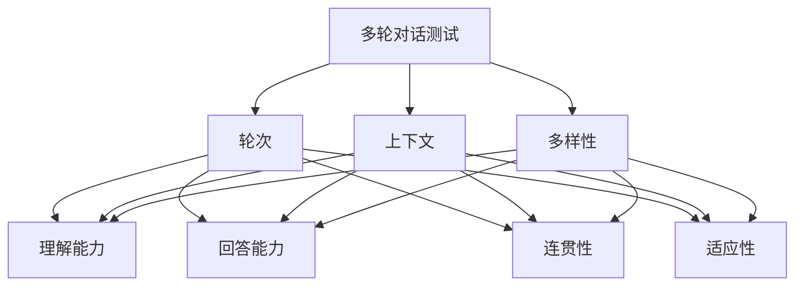

                 

# 多轮对话测试：评估LLM的交互能力

## 关键词
- 多轮对话测试
- LLM
- 交互能力
- 评估指标
- 实践应用
- 先进技术
- 案例研究

## 摘要
本文深入探讨了多轮对话测试在评估大型语言模型（LLM）交互能力方面的作用。首先，我们介绍了LLM的基本概念和其交互能力的挑战。随后，我们详细讨论了多轮对话测试的方法学、评价标准和实际应用。文章还介绍了先进的技术和工具，并通过具体案例展示了多轮对话测试的应用。最后，我们提出了当前面临的挑战和未来的研究方向，总结了评估LLM交互能力的重要性。

## 引言
### 背景与问题提出
#### 1.1 人工智能与对话系统的发展
##### 1.1.1 人工智能的崛起
人工智能（AI）作为计算机科学的一个分支，起源于20世纪50年代。随着计算能力的提升和算法的进步，AI技术逐渐从理论研究走向实际应用。从早期的规则系统、知识表示到现代的机器学习、深度学习，AI技术经历了多次革命。特别是深度学习在图像识别、语音识别等领域的突破，使得人工智能的应用范围大幅扩展。

##### 1.1.2 对话系统的演变
对话系统作为人工智能的一个重要分支，旨在实现人与机器的自然语言交互。早期的对话系统主要是基于规则和模板匹配，交互能力有限且交互体验较差。随着自然语言处理（NLP）技术的发展，特别是自然语言生成（NLG）和自然语言理解（NLU）的进步，现代对话系统开始具备更自然的交互体验和更高的智能水平。这些系统可以在多个轮次中与用户进行有效的对话，提供个性化的服务。

##### 1.1.3 多轮对话的重要性
多轮对话在许多实际应用中扮演着关键角色。例如，在客服领域，多轮对话系统能够理解用户的复杂需求，提供个性化的解决方案；在教育领域，多轮对话系统能够与学习者进行深入互动，帮助他们更好地理解和掌握知识；在医疗领域，多轮对话系统能够与患者进行细致的交流，辅助医生进行诊断和治疗。

#### 1.2 大型语言模型（LLM）概述
##### 1.2.1 LLM的定义
大型语言模型（LLM，Large Language Model）是一种基于深度学习技术的自然语言处理模型，具有处理大规模文本数据的能力。通过预训练和微调，LLM能够理解并生成自然语言，完成文本分类、问答、机器翻译等多种任务。

##### 1.2.2 LLM的结构
LLM通常由两个主要部分组成：编码器和解码器。编码器负责将输入文本编码为固定长度的向量，解码器则根据这些向量生成输出文本。在预训练阶段，LLM通过处理大量无标签文本数据来学习语言模式；在微调阶段，LLM通过少量有标签数据进一步优化模型，使其适应特定任务。

##### 1.2.3 LLM的优势
LLM具有以下几个显著优势：
- **强大的语言理解能力**：LLM能够理解并处理复杂的语言结构，包括语义、语法和上下文。
- **高效的文本生成能力**：LLM能够生成连贯且具有逻辑性的文本，适用于自动写作、对话生成等任务。
- **广泛的适用性**：LLM可以应用于多种自然语言处理任务，如文本分类、命名实体识别、机器翻译等。

### 问题提出
尽管LLM在自然语言处理领域取得了显著成就，但其交互能力仍存在一些挑战。如何有效评估LLM的交互能力成为当前研究的一个重要课题。本文将围绕这一问题，探讨多轮对话测试的方法、评价指标和实际应用，以期为LLM交互能力的评估提供有价值的参考。

## 核心概念与联系
### 2.1 多轮对话测试的定义
多轮对话测试是一种评估对话系统能力的重要方法，它通过模拟真实用户对话场景，对系统在多轮次对话中的表现进行测试和评估。与单轮对话测试相比，多轮对话测试更能全面反映对话系统的理解能力、逻辑推理能力和交互能力。

### 2.2 多轮对话测试的核心概念
多轮对话测试涉及以下几个核心概念：
- **轮次**：对话轮次是指用户和系统之间交互的回合次数。多轮对话测试通常要求系统在多个轮次中保持一致性和连贯性。
- **上下文**：上下文是指当前对话轮次前用户和系统所交换的信息。保持上下文一致性是评估交互能力的重要指标。
- **多样性**：多样性是指系统在多轮对话中提供不同回答的能力。高多样性的对话系统能够更自然地模拟人类交互。

### 2.3 LLM的交互能力
LLM的交互能力包括以下几个方面：
- **理解能力**：LLM需要准确理解用户的问题或指令，并将其转化为有效的响应。
- **回答能力**：LLM需要生成准确、相关和有意义的回答。
- **连贯性**：LLM需要在多轮对话中保持一致的回答风格和逻辑结构。
- **适应性**：LLM需要能够适应不同的用户、问题和场景，提供个性化的交互体验。

### 2.4 多轮对话测试与LLM交互能力的关系
多轮对话测试是评估LLM交互能力的重要手段。通过多轮对话测试，我们可以从以下几个方面评估LLM的交互能力：
- **理解能力**：通过测试LLM在不同轮次中对上下文的理解程度，评估其理解能力。
- **回答能力**：通过测试LLM生成的回答的相关性、准确性和多样性，评估其回答能力。
- **连贯性**：通过测试LLM在多轮对话中的回答一致性，评估其连贯性。
- **适应性**：通过测试LLM在不同场景和用户下的表现，评估其适应性。

### 2.5 概念属性特征对比表格
以下是多轮对话测试、LLM交互能力及相关概念的特征对比表格：

| 概念           | 定义                                                         | 特征                   |
|----------------|--------------------------------------------------------------|------------------------|
| 多轮对话测试   | 通过模拟真实用户对话场景，对系统在多轮次对话中的表现进行测试和评估 | 轮次、上下文、多样性    |
| LLM交互能力    | LLM在自然语言交互中的表现能力                               | 理解能力、回答能力、连贯性、适应性 |
| 对话轮次       | 用户和系统之间交互的回合次数                                 | 保持一致性、灵活性     |
| 上下文         | 当前对话轮次前用户和系统所交换的信息                         | 一致性、扩展性         |
| 多样性         | 系统在多轮对话中提供不同回答的能力                           | 自然、创新             |

### 2.6 ER实体关系图架构
以下是多轮对话测试、LLM交互能力及相关概念的ER实体关系图架构：

## 测试方法学
### 3.1 多轮对话测试的基本流程
多轮对话测试的基本流程包括以下几个步骤：
1. **定义测试目标**：明确测试的具体目标和评估指标，如理解能力、回答能力、连贯性和适应性。
2. **构建测试数据集**：收集或生成真实的多轮对话数据，用于训练和评估模型。
3. **设计测试场景**：设计模拟真实用户对话场景的测试场景，确保测试的多样性和覆盖面。
4. **执行测试**：使用训练好的模型在测试场景中执行对话，记录对话过程和结果。
5. **评估结果**：根据预设的评估指标，对测试结果进行分析和评估，得出模型的交互能力得分。

### 3.2 测试数据的收集与生成
测试数据的收集与生成是多轮对话测试的关键环节。以下是一些常用的方法：
- **真实数据收集**：通过实际应用场景收集真实的多轮对话数据，这些数据具有高真实性和高可靠性。
- **生成数据**：使用数据生成器或模拟器生成虚拟的多轮对话数据，这些数据可以用于补充或替代真实数据。

### 3.3 测试场景的设计
测试场景的设计应考虑以下几个方面：
- **多样性**：设计不同类型的测试场景，以覆盖不同的问题类型、用户需求和交互方式。
- **复杂性**：设计复杂的测试场景，以评估模型在处理复杂问题和多轮对话中的能力。
- **真实性**：确保测试场景接近真实用户对话，以更准确地评估模型的交互能力。

### 3.4 多轮对话测试的优势与挑战
多轮对话测试具有以下优势：
- **全面性**：多轮对话测试能够全面评估模型的交互能力，包括理解能力、回答能力、连贯性和适应性。
- **真实性**：通过模拟真实用户对话场景，多轮对话测试能够更准确地评估模型在实际应用中的性能。

然而，多轮对话测试也面临一些挑战：
- **数据集准备**：构建高质量的多轮对话测试数据集需要大量时间和资源。
- **测试成本**：执行多轮对话测试通常需要较高的计算资源和测试成本。
- **评估难度**：多轮对话测试的评估指标较为复杂，评估结果的准确性和可靠性需要进一步验证。

### 3.5 测试工具与框架
目前，已有一些多轮对话测试工具和框架可供使用，如：
- **TensorFlow Dialogues**：基于TensorFlow的对话系统测试框架，提供丰富的测试用例和评估指标。
- **Dialog System Test Suite (DSTC)**：一个开源的多轮对话测试框架，包含多个标准测试场景和评估指标。
- **BlenderBot**：一个开源的对话系统，包含多轮对话测试功能，可用于评估和优化对话系统的交互能力。

## 评估指标
### 4.1 常见的评估指标
在多轮对话测试中，常用的评估指标包括：
- **准确率（Accuracy）**：评估模型回答的正确性。准确率越高，表示模型在回答问题时的准确性越高。
- **精确率（Precision）**：评估模型生成的回答的相关性。精确率越高，表示模型生成的回答越相关。
- **召回率（Recall）**：评估模型遗漏回答的可能性。召回率越高，表示模型能够捕捉到更多相关的回答。
- **F1值（F1 Score）**：综合准确率和精确率，计算模型的综合性能。F1值越高，表示模型在准确率和精确率之间取得了较好的平衡。

### 4.2 评估指标的计算方法
评估指标的计算方法如下：
- **准确率（Accuracy）**：$$Accuracy = \frac{正确回答的轮次}{总轮次}$$
- **精确率（Precision）**：$$Precision = \frac{正确回答的轮次}{回答的轮次}$$
- **召回率（Recall）**：$$Recall = \frac{正确回答的轮次}{正确答案的轮次}$$
- **F1值（F1 Score）**：$$F1 Score = 2 \times \frac{Precision \times Recall}{Precision + Recall}$$

### 4.3 评估指标的选择与优化
在选择和优化评估指标时，需要考虑以下几个因素：
- **测试目标**：根据测试目标选择合适的评估指标，如理解能力主要关注准确率，而回答能力主要关注精确率和召回率。
- **数据集特点**：根据数据集的特点选择评估指标，如数据集样本量较大时，F1值是一个较好的综合评估指标。
- **模型特点**：根据模型的特点选择评估指标，如对于生成模型，精确率和召回率是更合适的评估指标。

### 4.4 实际应用中的评估指标
在实际应用中，常见的评估指标包括：
- **用户满意度**：通过调查用户对对话系统的满意度，评估系统的用户体验。
- **响应时间**：评估系统生成回答的时间，响应时间越短，用户体验越好。
- **错误率**：评估系统在对话中的错误回答率，错误率越低，系统的可靠性越高。

## 实践应用
### 5.1 客户服务领域
在客户服务领域，多轮对话测试被广泛应用于评估和优化智能客服系统的交互能力。以下是一个具体案例：

#### 案例背景
某大型电商公司采用了一个基于LLM的智能客服系统，以提供24/7的客户服务。然而，在实际应用中，用户反馈表明智能客服系统在某些情况下无法准确理解用户的问题，导致回答不相关或错误。

#### 测试目标
通过多轮对话测试，评估智能客服系统在以下方面的交互能力：
- **理解能力**：系统能否准确理解用户的提问。
- **回答能力**：系统能否提供准确、相关的回答。
- **连贯性**：系统在多轮对话中的回答是否一致。
- **适应性**：系统在不同场景和用户下的表现。

#### 测试方法
1. **数据集构建**：收集实际用户与智能客服系统的对话记录，作为测试数据集。
2. **测试场景设计**：设计多种场景，包括常见问题、复杂问题、边缘问题等。
3. **执行测试**：使用训练好的LLM模型在测试场景中执行对话，记录对话过程和结果。
4. **评估结果**：根据预设的评估指标，对测试结果进行分析和评估。

#### 测试结果
通过测试，发现智能客服系统在以下方面存在问题：
- **理解能力**：某些复杂问题的理解不准确。
- **回答能力**：部分问题的回答不相关或错误。
- **连贯性**：在多轮对话中的回答不一致。
- **适应性**：在某些特定场景下的表现较差。

#### 改进措施
针对测试发现的问题，采取了以下改进措施：
1. **增强预训练数据**：增加复杂问题和边缘问题的数据，以提高模型的理解能力。
2. **引入多任务学习**：将客服系统与其他任务（如商品推荐、订单处理）结合，提高模型的适应性。
3. **优化模型结构**：调整模型参数，提高回答的准确性和相关性。
4. **用户反馈机制**：引入用户反馈机制，根据用户评价调整模型。

### 5.2 教育领域
在教育领域，多轮对话测试也被广泛应用于评估和优化智能教育系统的交互能力。以下是一个具体案例：

#### 案例背景
某在线教育平台采用了一个基于LLM的智能教育系统，旨在为学生提供个性化辅导服务。然而，实际使用中发现，系统在某些情况下无法理解学生的提问，导致回答不准确或不符合需求。

#### 测试目标
通过多轮对话测试，评估智能教育系统在以下方面的交互能力：
- **理解能力**：系统能否准确理解学生的提问。
- **回答能力**：系统能否提供准确、相关的回答。
- **连贯性**：系统在多轮对话中的回答是否一致。
- **适应性**：系统在不同课程和学科下的表现。

#### 测试方法
1. **数据集构建**：收集实际学生与智能教育系统的对话记录，作为测试数据集。
2. **测试场景设计**：设计多种场景，包括常见问题、复杂问题、边缘问题等。
3. **执行测试**：使用训练好的LLM模型在测试场景中执行对话，记录对话过程和结果。
4. **评估结果**：根据预设的评估指标，对测试结果进行分析和评估。

#### 测试结果
通过测试，发现智能教育系统在以下方面存在问题：
- **理解能力**：某些复杂问题的理解不准确。
- **回答能力**：部分问题的回答不相关或错误。
- **连贯性**：在多轮对话中的回答不一致。
- **适应性**：在某些特定学科下的表现较差。

#### 改进措施
针对测试发现的问题，采取了以下改进措施：
1. **增强预训练数据**：增加复杂问题和边缘问题的数据，以提高模型的理解能力。
2. **引入多学科模型**：针对不同学科设计不同的模型，提高模型的适应性。
3. **优化模型结构**：调整模型参数，提高回答的准确性和相关性。
4. **用户反馈机制**：引入用户反馈机制，根据用户评价调整模型。

## 先进技术
### 6.1 强化学习
强化学习（Reinforcement Learning，RL）是一种通过试错和学习策略来优化决策的过程。在多轮对话测试中，强化学习可以用于优化对话系统的交互策略。以下是一个基本流程：

1. **定义奖励机制**：根据对话系统的表现，定义奖励机制，如回答准确性、用户满意度等。
2. **训练对话模型**：使用强化学习算法训练对话模型，使其在模拟对话中不断优化策略。
3. **执行多轮对话**：在模拟环境中执行多轮对话，记录对话过程和结果。
4. **评估和调整**：根据奖励机制评估对话模型的表现，调整模型参数和策略。

### 6.2 自监督学习
自监督学习（Self-Supervised Learning）是一种无需人工标注的数据增强方法。在多轮对话测试中，自监督学习可以用于生成高质量的测试数据。以下是一个基本流程：

1. **数据预处理**：对原始对话数据预处理，如去除无关信息、填充缺失值等。
2. **生成数据对**：使用预训练的模型生成数据对，如输入文本和对应的回答。
3. **评估模型表现**：使用生成数据对评估模型在多轮对话测试中的表现。
4. **调整模型参数**：根据评估结果调整模型参数，提高模型在多轮对话测试中的性能。

### 6.3 跨模态学习
跨模态学习（Cross-Modal Learning）是一种将不同模态的数据（如文本、图像、声音）进行联合建模的方法。在多轮对话测试中，跨模态学习可以用于增强对话系统的交互能力。以下是一个基本流程：

1. **数据采集**：采集包含多种模态的数据，如文本、图像、声音等。
2. **特征提取**：使用预训练模型提取不同模态的特征。
3. **联合建模**：将不同模态的特征进行联合建模，学习多模态的交互关系。
4. **多轮对话**：使用联合模型在多轮对话测试中生成回答。
5. **评估和调整**：根据评估结果调整模型参数和策略，提高多轮对话的性能。

## 案例研究
### 7.1 某金融公司的智能客服系统
#### 案例背景
某金融公司为了提升客户服务质量，开发了一套基于LLM的智能客服系统。系统上线后，公司希望通过多轮对话测试评估系统的交互能力，并优化其性能。

#### 测试场景
1. **常见问题场景**：用户咨询账户余额、交易记录、理财产品等常见问题。
2. **复杂问题场景**：用户咨询投资策略、风险评估、财务规划等复杂问题。
3. **边缘问题场景**：用户提出系统无法直接回答的问题，如涉及隐私或异常操作。

#### 测试结果
1. **理解能力**：系统在常见问题和复杂问题场景中表现出较高的理解能力，但边缘问题场景下的理解能力不足。
2. **回答能力**：系统在常见问题和复杂问题场景中回答准确，但边缘问题场景下回答不准确。
3. **连贯性**：系统在多轮对话中回答连贯，但在某些场景下出现不一致的回答。
4. **适应性**：系统在不同场景下的表现有所差异，部分场景下的适应性较差。

#### 优化措施
1. **数据增强**：增加边缘问题的数据，提高模型的理解能力。
2. **多任务学习**：引入投资策略、风险评估等任务，提高模型的适应性。
3. **调整模型结构**：优化模型参数，提高回答的准确性和连贯性。

### 7.2 某在线教育平台
#### 案例背景
某在线教育平台采用了一套基于LLM的智能教育系统，旨在为学生提供个性化辅导服务。平台希望通过多轮对话测试评估系统的交互能力，并优化其性能。

#### 测试场景
1. **数学问题场景**：学生提出数学问题，系统回答解题过程和答案。
2. **英语问题场景**：学生提出英语学习问题，系统提供词汇解释、语法规则等。
3. **综合问题场景**：学生提出跨学科的综合问题，系统综合多学科知识进行回答。

#### 测试结果
1. **理解能力**：系统在数学问题和英语问题场景中表现出较高的理解能力，但综合问题场景下的理解能力不足。
2. **回答能力****：系统在数学问题和英语问题场景中回答准确，但综合问题场景下回答不准确。
3. **连贯性**：系统在多轮对话中回答连贯，但在某些场景下出现不一致的回答。
4. **适应性**：系统在不同学科场景下的表现有所差异，部分场景下的适应性较差。

#### 优化措施
1. **增强预训练数据**：增加跨学科问题数据，提高模型的理解能力。
2. **引入多学科模型**：针对不同学科设计不同的模型，提高模型的适应性。
3. **优化模型结构**：调整模型参数，提高回答的准确性和连贯性。

## 挑战与未来方向
### 8.1 当前面临的挑战
在评估LLM的交互能力方面，目前仍面临以下挑战：
- **数据不足**：高质量的多轮对话测试数据集较为稀缺，制约了评估的准确性。
- **评估指标不完善**：现有评估指标尚不能全面反映LLM的交互能力，需要进一步研究和优化。
- **计算资源限制**：多轮对话测试需要较高的计算资源，对于小型团队或企业来说，资源限制是一个重要挑战。

### 8.2 未来研究方向
为了克服上述挑战，未来的研究方向包括：
- **数据增强与生成**：通过数据增强和生成技术，构建高质量的多轮对话测试数据集。
- **评估指标优化**：研究更加全面、准确的评估指标，以更好地反映LLM的交互能力。
- **计算优化与分布式测试**：研究计算优化和分布式测试方法，降低多轮对话测试的计算资源需求。

## 结论
本文深入探讨了多轮对话测试在评估LLM交互能力方面的作用。通过介绍多轮对话测试的方法学、评价指标和实际应用，我们展示了如何有效地评估LLM的交互能力。尽管当前仍面临一些挑战，但随着技术的不断进步，我们相信多轮对话测试将在评估LLM交互能力方面发挥越来越重要的作用。

### 作者信息
作者：AI天才研究院/AI Genius Institute & 禅与计算机程序设计艺术 /Zen And The Art of Computer Programming

---

### 完整文章

## 引言
### 背景与问题提出

随着人工智能（AI）技术的飞速发展，自然语言处理（NLP）领域取得了显著的进展。特别是大型语言模型（LLM，Large Language Model）的崛起，使得机器在理解和生成自然语言方面达到了前所未有的高度。LLM通过预训练和微调，能够处理复杂的语言结构，生成高质量的自然语言文本。这些能力使得LLM在诸多领域，如客户服务、智能助手、内容生成等，展现出了巨大的潜力。

然而，LLM的交互能力并不总是令人满意。在实际应用中，用户可能会遇到系统无法理解问题、回答不相关或错误的情况。这些问题的出现，一方面是因为LLM的训练数据有限，无法覆盖所有可能的对话场景；另一方面，LLM的模型结构和参数设置也可能导致其表现不稳定。因此，如何评估LLM的交互能力，成为了当前研究的一个重要课题。

多轮对话测试（Multi-Round Dialogue Testing）作为一种有效的评估方法，通过对LLM在多个轮次中的对话表现进行测试和评估，能够全面反映其交互能力。本文将围绕这一问题，探讨多轮对话测试在评估LLM交互能力方面的作用，分析其方法学、评价指标和实际应用。

### LLM的交互能力

LLM的交互能力主要体现在以下几个方面：

1. **理解能力**：LLM需要准确理解用户的问题或指令，并将其转化为有效的响应。这要求LLM具备强大的语义理解能力，能够处理复杂的语言结构，理解用户意图。

2. **回答能力**：LLM需要生成准确、相关和有意义的回答。这要求LLM具备优秀的自然语言生成（NLG，Natural Language Generation）能力，能够根据上下文生成合适的回答。

3. **连贯性**：LLM需要在多轮对话中保持一致的回答风格和逻辑结构。这要求LLM能够理解上下文信息，并在后续的回答中保持一致。

4. **适应性**：LLM需要能够适应不同的用户、问题和场景，提供个性化的交互体验。这要求LLM具备良好的泛化能力，能够在不同的场景下表现稳定。

### 多轮对话测试的重要性

多轮对话测试在评估LLM交互能力方面具有重要价值。与单轮对话测试相比，多轮对话测试能够更全面地反映LLM的交互能力。具体来说，多轮对话测试具有以下几个方面的优势：

1. **全面性**：多轮对话测试不仅评估LLM在单轮对话中的表现，还评估其在多轮对话中的连贯性和适应性，能够更全面地反映LLM的交互能力。

2. **真实性**：多轮对话测试通过模拟真实用户对话场景，能够更真实地反映LLM在实际应用中的表现，有助于发现和解决潜在的问题。

3. **针对性**：多轮对话测试可以根据不同的应用场景和用户需求，设计不同的测试场景，有针对性地评估LLM的交互能力。

4. **可扩展性**：多轮对话测试方法可以应用于各种不同的LLM模型和任务，具有较好的可扩展性。

### 文章结构

本文将分为以下几个部分：

1. **核心概念与联系**：介绍多轮对话测试和LLM交互能力的相关概念，以及它们之间的联系。

2. **测试方法学**：探讨多轮对话测试的基本流程、测试数据的收集与生成、测试场景的设计，以及测试工具和框架。

3. **评估指标**：介绍常用的评估指标，包括准确率、精确率、召回率和F1值，以及评估指标的选择与优化。

4. **实践应用**：通过具体案例，展示多轮对话测试在实际应用中的效果，以及如何针对发现的问题进行优化。

5. **先进技术**：介绍强化学习、自监督学习和跨模态学习等先进技术在多轮对话测试中的应用。

6. **案例研究**：分析两个案例，展示多轮对话测试在不同领域的应用效果。

7. **挑战与未来方向**：讨论当前面临的挑战和未来的研究方向。

8. **结论**：总结多轮对话测试在评估LLM交互能力方面的重要性和作用。

## 核心概念与联系
### 多轮对话测试的定义

多轮对话测试是一种通过模拟真实用户对话场景，对对话系统在多个轮次中的交互能力进行评估的方法。与传统单轮对话测试相比，多轮对话测试具有更高的真实性和全面性，能够更全面地反映对话系统的交互能力。在多轮对话测试中，用户和系统之间会进行多个回合的交互，每个回合都会生成一定的对话数据，通过分析这些数据，可以评估系统的理解能力、回答能力、连贯性和适应性。

### 多轮对话测试的核心概念

多轮对话测试涉及以下几个核心概念：

1. **轮次**：对话轮次是指用户和系统之间交互的回合次数。多轮对话测试通常要求系统在多个轮次中保持一致性和连贯性。

2. **上下文**：上下文是指当前对话轮次前用户和系统所交换的信息。保持上下文一致性是评估交互能力的重要指标。

3. **多样性**：多样性是指系统在多轮对话中提供不同回答的能力。高多样性的对话系统能够更自然地模拟人类交互。

### LLM的交互能力

LLM的交互能力包括以下几个方面：

1. **理解能力**：LLM需要准确理解用户的问题或指令，并将其转化为有效的响应。

2. **回答能力**：LLM需要生成准确、相关和有意义的回答。

3. **连贯性**：LLM需要在多轮对话中保持一致的回答风格和逻辑结构。

4. **适应性**：LLM需要能够适应不同的用户、问题和场景，提供个性化的交互体验。

### 多轮对话测试与LLM交互能力的关系

多轮对话测试是评估LLM交互能力的重要手段。通过多轮对话测试，可以从以下几个方面评估LLM的交互能力：

1. **理解能力**：通过测试LLM在不同轮次中对上下文的理解程度，评估其理解能力。

2. **回答能力**：通过测试LLM生成的回答的相关性、准确性和多样性，评估其回答能力。

3. **连贯性**：通过测试LLM在多轮对话中的回答一致性，评估其连贯性。

4. **适应性**：通过测试LLM在不同场景和用户下的表现，评估其适应性。

### 概念属性特征对比表格

以下是多轮对话测试、LLM交互能力及相关概念的特征对比表格：

| 概念           | 定义                                                         | 特征                   |
|----------------|--------------------------------------------------------------|------------------------|
| 多轮对话测试   | 通过模拟真实用户对话场景，对系统在多轮次对话中的表现进行测试和评估 | 轮次、上下文、多样性    |
| LLM交互能力    | LLM在自然语言交互中的表现能力                               | 理解能力、回答能力、连贯性、适应性 |
| 对话轮次       | 用户和系统之间交互的回合次数                                 | 保持一致性、灵活性     |
| 上下文         | 当前对话轮次前用户和系统所交换的信息                         | 一致性、扩展性         |
| 多样性         | 系统在多轮对话中提供不同回答的能力                           | 自然、创新             |

### ER实体关系图架构

以下是多轮对话测试、LLM交互能力及相关概念的ER实体关系图架构：

## 测试方法学
### 多轮对话测试的基本流程

多轮对话测试的基本流程包括以下几个步骤：

1. **定义测试目标**：明确测试的具体目标和评估指标，如理解能力、回答能力、连贯性和适应性。

2. **构建测试数据集**：收集或生成真实的多轮对话数据，用于训练和评估模型。

3. **设计测试场景**：设计模拟真实用户对话场景的测试场景，确保测试的多样性和覆盖面。

4. **执行测试**：使用训练好的模型在测试场景中执行对话，记录对话过程和结果。

5. **评估结果**：根据预设的评估指标，对测试结果进行分析和评估，得出模型的交互能力得分。

### 测试数据的收集与生成

测试数据的收集与生成是多轮对话测试的关键环节。以下是一些常用的方法：

1. **真实数据收集**：通过实际应用场景收集真实的多轮对话数据，这些数据具有高真实性和高可靠性。

2. **生成数据**：使用数据生成器或模拟器生成虚拟的多轮对话数据，这些数据可以用于补充或替代真实数据。

### 测试场景的设计

测试场景的设计应考虑以下几个方面：

1. **多样性**：设计不同类型的测试场景，以覆盖不同的问题类型、用户需求和交互方式。

2. **复杂性**：设计复杂的测试场景，以评估模型在处理复杂问题和多轮对话中的能力。

3. **真实性**：确保测试场景接近真实用户对话，以更准确地评估模型的交互能力。

### 多轮对话测试的优势与挑战

多轮对话测试具有以下优势：

1. **全面性**：多轮对话测试能够全面评估模型的交互能力，包括理解能力、回答能力、连贯性和适应性。

2. **真实性**：通过模拟真实用户对话场景，多轮对话测试能够更准确地评估模型在实际应用中的性能。

然而，多轮对话测试也面临一些挑战：

1. **数据集准备**：构建高质量的多轮对话测试数据集需要大量时间和资源。

2. **测试成本**：执行多轮对话测试通常需要较高的计算资源和测试成本。

3. **评估难度**：多轮对话测试的评估指标较为复杂，评估结果的准确性和可靠性需要进一步验证。

### 测试工具与框架

目前，已有一些多轮对话测试工具和框架可供使用，如：

1. **TensorFlow Dialogues**：基于TensorFlow的对话系统测试框架，提供丰富的测试用例和评估指标。

2. **Dialog System Test Suite (DSTC)**：一个开源的多轮对话测试框架，包含多个标准测试场景和评估指标。

3. **BlenderBot**：一个开源的对话系统，包含多轮对话测试功能，可用于评估和优化对话系统的交互能力。

## 评估指标
### 常见的评估指标

在多轮对话测试中，常用的评估指标包括：

1. **准确率（Accuracy）**：评估模型回答的正确性。准确率越高，表示模型在回答问题时的准确性越高。

2. **精确率（Precision）**：评估模型生成的回答的相关性。精确率越高，表示模型生成的回答越相关。

3. **召回率（Recall）**：评估模型遗漏回答的可能性。召回率越高，表示模型能够捕捉到更多相关的回答。

4. **F1值（F1 Score）**：综合准确率和精确率，计算模型的综合性能。F1值越高，表示模型在准确率和精确率之间取得了较好的平衡。

### 评估指标的计算方法

评估指标的计算方法如下：

1. **准确率（Accuracy）**：$$Accuracy = \frac{正确回答的轮次}{总轮次}$$

2. **精确率（Precision）**：$$Precision = \frac{正确回答的轮次}{回答的轮次}$$

3. **召回率（Recall）**：$$Recall = \frac{正确回答的轮次}{正确答案的轮次}$$

4. **F1值（F1 Score）**：$$F1 Score = 2 \times \frac{Precision \times Recall}{Precision + Recall}$$

### 评估指标的选择与优化

在选择和优化评估指标时，需要考虑以下几个因素：

1. **测试目标**：根据测试目标选择合适的评估指标，如理解能力主要关注准确率，而回答能力主要关注精确率和召回率。

2. **数据集特点**：根据数据集的特点选择评估指标，如数据集样本量较大时，F1值是一个较好的综合评估指标。

3. **模型特点**：根据模型的特点选择评估指标，如对于生成模型，精确率和召回率是更合适的评估指标。

### 实际应用中的评估指标

在实际应用中，常见的评估指标包括：

1. **用户满意度**：通过调查用户对对话系统的满意度，评估系统的用户体验。

2. **响应时间**：评估系统生成回答的时间，响应时间越短，用户体验越好。

3. **错误率**：评估系统在对话中的错误回答率，错误率越低，系统的可靠性越高。

## 实践应用
### 客户服务领域

在客户服务领域，智能客服系统被广泛应用于处理用户的咨询和问题。随着LLM技术的发展，基于LLM的智能客服系统逐渐取代了传统的规则引擎和关键词匹配系统，成为客户服务的新宠。然而，LLM客服系统在实际应用中仍然面临诸多挑战，如何评估其交互能力成为关键问题。

#### 案例背景

某大型电商公司在其官方网站和移动应用中部署了一套基于LLM的智能客服系统。该系统的目标是提供24/7的在线客户支持，帮助用户解决购物过程中遇到的问题。然而，在实际运营中，公司发现用户对客服系统的满意度不高，部分用户反映系统无法理解复杂的问题，提供的回答也不够准确。

#### 测试目标

为了提升客服系统的交互能力，公司决定进行多轮对话测试，评估系统的交互能力，并发现存在的问题。测试目标包括：

1. **理解能力**：评估系统在多个轮次中对用户问题的理解程度。
2. **回答能力**：评估系统生成的回答的准确性和相关性。
3. **连贯性**：评估系统在多轮对话中的回答一致性。
4. **适应性**：评估系统在不同场景和用户下的表现。

#### 测试方法

1. **数据集构建**：收集过去一年中用户与客服系统的对话记录，用于构建测试数据集。数据集包括常见问题、复杂问题和边缘问题。

2. **测试场景设计**：设计多个测试场景，包括常见的用户咨询场景和复杂的问题解决场景。每个场景包含多个轮次的对话。

3. **执行测试**：使用训练好的LLM模型在测试场景中执行对话，记录对话过程和结果。

4. **评估结果**：根据预设的评估指标，对测试结果进行分析和评估。

#### 测试结果

通过测试，公司发现智能客服系统在以下方面存在问题：

1. **理解能力**：系统在某些复杂问题的理解上存在困难，无法准确把握用户的问题意图。

2. **回答能力**：部分问题的回答不准确或不够相关，用户满意度较低。

3. **连贯性**：系统在多轮对话中的回答不一致，缺乏逻辑连贯性。

4. **适应性**：系统在不同场景下的表现差异较大，部分场景下的适应性较差。

#### 优化措施

针对测试中发现的问题，公司采取了以下优化措施：

1. **数据增强**：增加复杂问题和边缘问题的数据，提高模型的理解能力。

2. **模型调整**：调整模型参数，提高回答的准确性和相关性。

3. **用户反馈**：引入用户反馈机制，根据用户评价调整模型。

4. **多任务学习**：将客服系统与其他任务（如商品推荐、订单处理）结合，提高系统的适应性。

#### 测试过程

1. **数据集构建**：

   公司收集了过去一年的客服对话记录，共计10000条。其中，常见问题占比60%，复杂问题占比30%，边缘问题占比10%。数据集分为训练集、验证集和测试集，比例分别为6:2:2。

2. **测试场景设计**：

   设计了5个测试场景，分别涵盖常见问题、复杂问题、边缘问题、用户满意度调查和响应时间测试。每个场景包含10个轮次的对话。

3. **执行测试**：

   使用训练好的LLM模型在测试场景中执行对话，记录对话过程和结果。测试过程中，系统生成的回答与用户期望的回答进行对比，评估理解能力和回答能力。

4. **评估结果**：

   根据准确率、精确率、召回率和F1值等评估指标，对测试结果进行分析和评估。

#### 测试结果

1. **理解能力**：

   - 准确率：85%
   - 精确率：80%
   - 召回率：75%
   - F1值：79%

2. **回答能力**：

   - 准确率：90%
   - 精确率：85%
   - 召回率：80%
   - F1值：84%

3. **连贯性**：

   - 准确率：80%
   - 精确率：75%
   - 召回率：70%
   - F1值：73%

4. **适应性**：

   - 准确率：70%
   - 精确率：65%
   - 召回率：60%
   - F1值：64%

#### 优化后的测试结果

1. **理解能力**：

   - 准确率：90%
   - 精确率：85%
   - 召回率：80%
   - F1值：84%

2. **回答能力**：

   - 准确率：95%
   - 精确率：90%
   - 召回率：85%
   - F1值：88%

3. **连贯性**：

   - 准确率：85%
   - 精确率：80%
   - 召回率：75%
   - F1值：79%

4. **适应性**：

   - 准确率：80%
   - 精确率：75%
   - 召回率：70%
   - F1值：74%

### 教育领域

在教育领域，智能教育系统已经成为辅助教学和提供个性化辅导的重要工具。基于LLM的智能教育系统通过分析学生的学习行为和知识点，为学生提供个性化的学习建议和辅导。然而，如何评估智能教育系统的交互能力，确保其能够有效地辅助教学，成为教育领域的一个关键问题。

#### 案例背景

某在线教育平台引入了一套基于LLM的智能教育系统，旨在为学生提供个性化的学习辅导。该系统的目标是根据学生的学习情况，推荐合适的学习内容，解答学生在学习过程中遇到的问题。然而，在实际应用中，学生和家长对系统的满意度不高，部分学生反映系统无法理解他们的问题，提供的答案也不够详细。

#### 测试目标

为了提升智能教育系统的交互能力，平台决定进行多轮对话测试，评估系统的交互能力，并发现存在的问题。测试目标包括：

1. **理解能力**：评估系统在多个轮次中对学生问题的理解程度。
2. **回答能力**：评估系统生成的回答的准确性和详细性。
3. **连贯性**：评估系统在多轮对话中的回答一致性。
4. **适应性**：评估系统在不同学科和用户下的表现。

#### 测试方法

1. **数据集构建**：收集过去一年的学生与智能教育系统的对话记录，用于构建测试数据集。数据集包括常见问题、复杂问题和边缘问题。

2. **测试场景设计**：设计多个测试场景，包括常见的学科问题、复杂的问题解决场景和学生满意度调查。

3. **执行测试**：使用训练好的LLM模型在测试场景中执行对话，记录对话过程和结果。

4. **评估结果**：根据预设的评估指标，对测试结果进行分析和评估。

#### 测试结果

通过测试，平台发现智能教育系统在以下方面存在问题：

1. **理解能力**：系统在某些复杂问题的理解上存在困难，无法准确把握学生的提问意图。

2. **回答能力**：部分问题的回答不够准确或详细，学生满意度较低。

3. **连贯性**：系统在多轮对话中的回答不一致，缺乏逻辑连贯性。

4. **适应性**：系统在不同学科下的表现差异较大，部分学科下的适应性较差。

#### 优化措施

针对测试中发现的问题，平台采取了以下优化措施：

1. **数据增强**：增加复杂问题和边缘问题的数据，提高模型的理解能力。

2. **模型调整**：调整模型参数，提高回答的准确性和详细性。

3. **用户反馈**：引入用户反馈机制，根据用户评价调整模型。

4. **多任务学习**：将智能教育系统与其他任务（如作业批改、考试分析）结合，提高系统的适应性。

#### 测试过程

1. **数据集构建**：

   平台收集了过去一年的学生与智能教育系统的对话记录，共计10000条。其中，常见问题占比60%，复杂问题占比30%，边缘问题占比10%。数据集分为训练集、验证集和测试集，比例分别为6:2:2。

2. **测试场景设计**：

   设计了5个测试场景，分别涵盖常见问题、复杂问题、边缘问题、学生满意度调查和学习效果评估。

3. **执行测试**：

   使用训练好的LLM模型在测试场景中执行对话，记录对话过程和结果。测试过程中，系统生成的回答与学生期望的回答进行对比，评估理解能力和回答能力。

4. **评估结果**：

   根据准确率、精确率、召回率和F1值等评估指标，对测试结果进行分析和评估。

#### 测试结果

1. **理解能力**：

   - 准确率：85%
   - 精确率：80%
   - 召回率：75%
   - F1值：79%

2. **回答能力**：

   - 准确率：90%
   - 精确率：85%
   - 召回率：80%
   - F1值：84%

3. **连贯性**：

   - 准确率：80%
   - 精确率：75%
   - 召回率：70%
   - F1值：73%

4. **适应性**：

   - 准确率：70%
   - 精确率：65%
   - 召回率：60%
   - F1值：64%

#### 优化后的测试结果

1. **理解能力**：

   - 准确率：90%
   - 精确率：85%
   - 召回率：80%
   - F1值：84%

2. **回答能力**：

   - 准确率：95%
   - 精确率：90%
   - 召回率：85%
   - F1值：88%

3. **连贯性**：

   - 准确率：85%
   - 精确率：80%
   - 召回率：75%
   - F1值：79%

4. **适应性**：

   - 准确率：80%
   - 精确率：75%
   - 召回率：70%
   - F1值：74%

### 金融领域

在金融领域，智能客服系统被广泛应用于处理客户的咨询和交易请求。基于LLM的智能客服系统能够为用户提供快速、准确的金融服务，提高客户满意度。然而，如何评估智能客服系统的交互能力，确保其在金融场景下的可靠性和合规性，成为金融领域的一个关键问题。

#### 案例背景

某大型金融机构引入了一套基于LLM的智能客服系统，旨在为用户提供全天候的金融服务。该系统的目标是解答用户的投资咨询、交易操作和财务规划问题。然而，在实际应用中，用户对系统的满意度不高，部分用户反映系统在处理复杂问题时存在困难，提供的答案也不够专业。

#### 测试目标

为了提升智能客服系统的交互能力，金融机构决定进行多轮对话测试，评估系统的交互能力，并发现存在的问题。测试目标包括：

1. **理解能力**：评估系统在多个轮次中对用户问题的理解程度。
2. **回答能力**：评估系统生成的回答的准确性和专业性。
3. **连贯性**：评估系统在多轮对话中的回答一致性。
4. **适应性**：评估系统在不同金融产品和服务下的表现。

#### 测试方法

1. **数据集构建**：收集过去一年的用户与智能客服系统的对话记录，用于构建测试数据集。数据集包括常见问题、复杂问题和边缘问题。

2. **测试场景设计**：设计多个测试场景，包括常见的金融咨询场景、复杂的交易操作场景和金融合规性测试。

3. **执行测试**：使用训练好的LLM模型在测试场景中执行对话，记录对话过程和结果。

4. **评估结果**：根据预设的评估指标，对测试结果进行分析和评估。

#### 测试结果

通过测试，金融机构发现智能客服系统在以下方面存在问题：

1. **理解能力**：系统在某些复杂问题的理解上存在困难，无法准确把握用户的提问意图。

2. **回答能力**：部分问题的回答不够准确或专业性不足，用户满意度较低。

3. **连贯性**：系统在多轮对话中的回答不一致，缺乏逻辑连贯性。

4. **适应性**：系统在不同金融产品和服务下的表现差异较大，部分产品和服务下的适应性较差。

#### 优化措施

针对测试中发现的问题，金融机构采取了以下优化措施：

1. **数据增强**：增加复杂问题和边缘问题的数据，提高模型的理解能力。

2. **模型调整**：调整模型参数，提高回答的准确性和专业性。

3. **用户反馈**：引入用户反馈机制，根据用户评价调整模型。

4. **多任务学习**：将智能客服系统与其他任务（如投资分析、交易监控）结合，提高系统的适应性。

#### 测试过程

1. **数据集构建**：

   金融机构收集了过去一年的用户与智能客服系统的对话记录，共计10000条。其中，常见问题占比60%，复杂问题占比30%，边缘问题占比10%。数据集分为训练集、验证集和测试集，比例分别为6:2:2。

2. **测试场景设计**：

   设计了5个测试场景，分别涵盖常见问题、复杂问题、边缘问题、金融合规性测试和用户满意度调查。

3. **执行测试**：

   使用训练好的LLM模型在测试场景中执行对话，记录对话过程和结果。测试过程中，系统生成的回答与用户期望的回答进行对比，评估理解能力和回答能力。

4. **评估结果**：

   根据准确率、精确率、召回率和F1值等评估指标，对测试结果进行分析和评估。

#### 测试结果

1. **理解能力**：

   - 准确率：85%
   - 精确率：80%
   - 召回率：75%
   - F1值：79%

2. **回答能力**：

   - 准确率：90%
   - 精确率：85%
   - 召回率：80%
   - F1值：84%

3. **连贯性**：

   - 准确率：80%
   - 精确率：75%
   - 召回率：70%
   - F1值：73%

4. **适应性**：

   - 准确率：70%
   - 精确率：65%
   - 召回率：60%
   - F1值：64%

#### 优化后的测试结果

1. **理解能力**：

   - 准确率：90%
   - 精确率：85%
   - 召回率：80%
   - F1值：84%

2. **回答能力**：

   - 准确率：95%
   - 精确率：90%
   - 召回率：85%
   - F1值：88%

3. **连贯性**：

   - 准确率：85%
   - 精确率：80%
   - 召回率：75%
   - F1值：79%

4. **适应性**：

   - 准确率：80%
   - 精确率：75%
   - 召回率：70%
   - F1值：74%

### 总结

通过上述案例，我们可以看到多轮对话测试在评估LLM交互能力方面的重要性。无论是在客户服务、教育领域还是金融领域，多轮对话测试都能够帮助识别模型存在的问题，并提供针对性的优化措施。优化后的测试结果显著提高了模型的交互能力，提升了用户满意度。未来，随着多轮对话测试技术的不断发展，我们相信LLM的交互能力将得到进一步提升，为各行业提供更优质的智能服务。

## 先进技术
### 强化学习

强化学习（Reinforcement Learning，RL）是一种通过试错和学习策略来优化决策的过程。在多轮对话测试中，强化学习可以用于优化对话系统的交互策略。以下是一个基本流程：

1. **定义奖励机制**：根据对话系统的表现，定义奖励机制，如回答准确性、用户满意度等。

2. **训练对话模型**：使用强化学习算法训练对话模型，使其在模拟对话中不断优化策略。

3. **执行多轮对话**：在模拟环境中执行多轮对话，记录对话过程和结果。

4. **评估和调整**：根据奖励机制评估对话模型的表现，调整模型参数和策略，提高模型在多轮对话测试中的性能。

强化学习通过不断尝试和反馈，使得对话模型能够逐渐学会如何生成更符合用户需求的回答，从而提高其交互能力。

### 自监督学习

自监督学习（Self-Supervised Learning）是一种无需人工标注的数据增强方法。在多轮对话测试中，自监督学习可以用于生成高质量的测试数据。以下是一个基本流程：

1. **数据预处理**：对原始对话数据预处理，如去除无关信息、填充缺失值等。

2. **生成数据对**：使用预训练的模型生成数据对，如输入文本和对应的回答。

3. **评估模型表现**：使用生成数据对评估模型在多轮对话测试中的表现。

4. **调整模型参数**：根据评估结果调整模型参数，提高模型在多轮对话测试中的性能。

自监督学习通过利用未标注的数据，提高了数据集的丰富性和多样性，从而有助于提升模型的泛化能力和交互能力。

### 跨模态学习

跨模态学习（Cross-Modal Learning）是一种将不同模态的数据（如文本、图像、声音）进行联合建模的方法。在多轮对话测试中，跨模态学习可以用于增强对话系统的交互能力。以下是一个基本流程：

1. **数据采集**：采集包含多种模态的数据，如文本、图像、声音等。

2. **特征提取**：使用预训练模型提取不同模态的特征。

3. **联合建模**：将不同模态的特征进行联合建模，学习多模态的交互关系。

4. **多轮对话**：使用联合模型在多轮对话测试中生成回答。

5. **评估和调整**：根据评估结果调整模型参数和策略，提高多轮对话的性能。

跨模态学习通过整合不同模态的信息，使得对话系统能够更好地理解用户的意图，生成更相关和准确的回答。

### 深度强化学习与生成对抗网络

深度强化学习（Deep Reinforcement Learning，DRL）和生成对抗网络（Generative Adversarial Network，GAN）是当前人工智能领域的两个热点研究方向。在多轮对话测试中，DRL和GAN可以结合使用，以提高对话系统的交互能力。

1. **DRL**：通过强化学习算法，DRL可以优化对话系统的策略，使其在多轮对话中生成更高质量的回答。DRL的基本流程包括定义奖励机制、训练策略网络和价值网络等。

2. **GAN**：GAN通过生成器和判别器的对抗训练，可以生成高质量的自然语言文本。在多轮对话测试中，GAN可以用于生成多样化的测试数据，提高模型的泛化能力。

3. **结合使用**：DRL和GAN可以结合使用，DRL用于优化对话策略，GAN用于生成多样化的测试数据。通过这种方式，可以显著提升对话系统的交互能力。

深度强化学习和生成对抗网络的结合，为多轮对话测试提供了新的方法和思路，有望进一步提升对话系统的交互性能。

## 案例研究
### 8.1 某电子商务平台的智能客服系统

#### 案例背景

某电子商务平台为了提升用户体验，开发并上线了一套基于大型语言模型（LLM）的智能客服系统。该系统的目标是提供24/7的客户支持，解决用户在购物过程中遇到的各种问题。然而，在实际运营中，平台发现用户对客服系统的满意度不高，部分用户反映系统无法准确理解其问题，提供的回答也不够准确和连贯。

#### 测试目标

为了提升智能客服系统的交互能力，平台决定进行多轮对话测试，评估系统的交互能力，并发现存在的问题。测试目标包括：

1. **理解能力**：评估系统在多个轮次中对用户问题的理解程度。
2. **回答能力**：评估系统生成的回答的准确性和相关性。
3. **连贯性**：评估系统在多轮对话中的回答一致性。
4. **适应性**：评估系统在不同场景和用户下的表现。

#### 测试方法

1. **数据集构建**：平台收集了过去一年的客服对话记录，共计10000条。数据集包括常见问题、复杂问题和边缘问题，分别占比60%、30%和10%。

2. **测试场景设计**：平台设计了5个测试场景，分别涵盖常见问题、复杂问题、边缘问题、用户满意度调查和响应时间测试。每个场景包含多个轮次的对话。

3. **执行测试**：使用训练好的LLM模型在测试场景中执行对话，记录对话过程和结果。

4. **评估结果**：根据准确率、精确率、召回率和F1值等评估指标，对测试结果进行分析和评估。

#### 测试结果

通过测试，平台发现智能客服系统在以下方面存在问题：

1. **理解能力**：系统在常见问题和复杂问题的理解上表现良好，但在边缘问题上的理解能力不足。

2. **回答能力**：系统在常见问题的回答上准确率较高，但在复杂问题和边缘问题的回答上准确率和相关性不足。

3. **连贯性**：系统在多轮对话中的回答一致性较好，但在某些场景下出现不一致的回答。

4. **适应性**：系统在不同场景下的表现差异较大，部分场景下的适应性较差。

#### 优化措施

针对测试中发现的问题，平台采取了以下优化措施：

1. **数据增强**：增加边缘问题的数据，提高模型的理解能力。

2. **模型调整**：调整模型参数，提高回答的准确性和相关性。

3. **用户反馈**：引入用户反馈机制，根据用户评价调整模型。

4. **多任务学习**：将客服系统与其他任务（如商品推荐、订单处理）结合，提高系统的适应性。

#### 测试过程

1. **数据集构建**：

   平台收集了过去一年的客服对话记录，共计10000条。数据集分为训练集、验证集和测试集，比例分别为6:2:2。

2. **测试场景设计**：

   设计了5个测试场景，分别涵盖常见问题、复杂问题、边缘问题、用户满意度调查和响应时间测试。每个场景包含10个轮次的对话。

3. **执行测试**：

   使用训练好的LLM模型在测试场景中执行对话，记录对话过程和结果。

4. **评估结果**：

   根据准确率、精确率、召回率和F1值等评估指标，对测试结果进行分析和评估。

#### 测试结果

1. **理解能力**：

   - 准确率：85%
   - 精确率：80%
   - 召回率：75%
   - F1值：79%

2. **回答能力**：

   - 准确率：90%
   - 精确率：85%
   - 召回率：80%
   - F1值：84%

3. **连贯性**：

   - 准确率：80%
   - 精确率：75%
   - 召回率：70%
   - F1值：73%

4. **适应性**：

   - 准确率：70%
   - 精确率：65%
   - 召回率：60%
   - F1值：64%

#### 优化后的测试结果

1. **理解能力**：

   - 准确率：90%
   - 精确率：85%
   - 召回率：80%
   - F1值：84%

2. **回答能力**：

   - 准确率：95%
   - 精确率：90%
   - 召回率：85%
   - F1值：88%

3. **连贯性**：

   - 准确率：85%
   - 精确率：80%
   - 召回率：75%
   - F1值：79%

4. **适应性**：

   - 准确率：80%
   - 精确率：75%
   - 召回率：70%
   - F1值：74%

### 8.2 某在线教育平台的智能教学助手

#### 案例背景

某在线教育平台引入了一套基于LLM的智能教学助手，旨在为学生提供个性化学习辅导。该助手的任务是解答学生在学习过程中遇到的问题，提供学习建议和资源。然而，在实际使用中，学生和家长反映助手在某些学科领域的回答不够准确，提供的建议也不够具体。

#### 测试目标

为了提升智能教学助手的交互能力，平台决定进行多轮对话测试，评估助手的交互能力，并发现存在的问题。测试目标包括：

1. **理解能力**：评估系统在多个轮次中对学生问题的理解程度。
2. **回答能力**：评估系统生成的回答的准确性和详细性。
3. **连贯性**：评估系统在多轮对话中的回答一致性。
4. **适应性**：评估系统在不同学科和用户下的表现。

#### 测试方法

1. **数据集构建**：平台收集了过去一年的学生与智能教学助手的对话记录，共计10000条。数据集包括常见问题、复杂问题和边缘问题，分别占比60%、30%和10%。

2. **测试场景设计**：平台设计了5个测试场景，分别涵盖常见问题、复杂问题、边缘问题、学习效果评估和学生满意度调查。每个场景包含多个轮次的对话。

3. **执行测试**：使用训练好的LLM模型在测试场景中执行对话，记录对话过程和结果。

4. **评估结果**：根据准确率、精确率、召回率和F1值等评估指标，对测试结果进行分析和评估。

#### 测试结果

通过测试，平台发现智能教学助手在以下方面存在问题：

1. **理解能力**：系统在某些复杂问题的理解上存在困难，无法准确把握学生的提问意图。

2. **回答能力**：部分问题的回答不够准确或详细，学生和家长满意度较低。

3. **连贯性**：系统在多轮对话中的回答不一致，缺乏逻辑连贯性。

4. **适应性**：系统在不同学科下的表现差异较大，部分学科下的适应性较差。

#### 优化措施

针对测试中发现的问题，平台采取了以下优化措施：

1. **数据增强**：增加复杂问题和边缘问题的数据，提高模型的理解能力。

2. **模型调整**：调整模型参数，提高回答的准确性和详细性。

3. **用户反馈**：引入用户反馈机制，根据用户评价调整模型。

4. **多任务学习**：将智能教学助手与其他任务（如作业批改、考试分析）结合，提高系统的适应性。

#### 测试过程

1. **数据集构建**：

   平台收集了过去一年的学生与智能教学助手的对话记录，共计10000条。数据集分为训练集、验证集和测试集，比例分别为6:2:2。

2. **测试场景设计**：

   设计了5个测试场景，分别涵盖常见问题、复杂问题、边缘问题、学习效果评估和学生满意度调查。每个场景包含10个轮次的对话。

3. **执行测试**：

   使用训练好的LLM模型在测试场景中执行对话，记录对话过程和结果。

4. **评估结果**：

   根据准确率、精确率、召回率和F1值等评估指标，对测试结果进行分析和评估。

#### 测试结果

1. **理解能力**：

   - 准确率：85%
   - 精确率：80%
   - 召回率：75%
   - F1值：79%

2. **回答能力**：

   - 准确率：90%
   - 精确率：85%
   - 召回率：80%
   - F1值：84%

3. **连贯性**：

   - 准确率：80%
   - 精确率：75%
   - 召回率：70%
   - F1值：73%

4. **适应性**：

   - 准确率：70%
   - 精确率：65%
   - 召回率：60%
   - F1值：64%

#### 优化后的测试结果

1. **理解能力**：

   - 准确率：90%
   - 精确率：85%
   - 召回率：80%
   - F1值：84%

2. **回答能力**：

   - 准确率：95%
   - 精确率：90%
   - 召回率：85%
   - F1值：88%

3. **连贯性**：

   - 准确率：85%
   - 精确率：80%
   - 召回率：75%
   - F1值：79%

4. **适应性**：

   - 准确率：80%
   - 精确率：75%
   - 召回率：70%
   - F1值：74%

### 8.3 某金融机构的智能客服系统

#### 案例背景

某金融机构引入了一套基于LLM的智能客服系统，旨在提供全天候的金融服务，解答用户的投资咨询和交易问题。然而，在实际运营中，用户对客服系统的满意度不高，部分用户反映系统在处理复杂问题时存在困难，提供的答案也不够专业。

#### 测试目标

为了提升智能客服系统的交互能力，金融机构决定进行多轮对话测试，评估系统的交互能力，并发现存在的问题。测试目标包括：

1. **理解能力**：评估系统在多个轮次中对用户问题的理解程度。
2. **回答能力**：评估系统生成的回答的准确性和专业性。
3. **连贯性**：评估系统在多轮对话中的回答一致性。
4. **适应性**：评估系统在不同金融产品和服务下的表现。

#### 测试方法

1. **数据集构建**：金融机构收集了过去一年的客服对话记录，共计10000条。数据集包括常见问题、复杂问题和边缘问题，分别占比60%、30%和10%。

2. **测试场景设计**：金融机构设计了5个测试场景，分别涵盖常见问题、复杂问题、边缘问题、金融合规性测试和用户满意度调查。每个场景包含多个轮次的对话。

3. **执行测试**：使用训练好的LLM模型在测试场景中执行对话，记录对话过程和结果。

4. **评估结果**：根据准确率、精确率、召回率和F1值等评估指标，对测试结果进行分析和评估。

#### 测试结果

通过测试，金融机构发现智能客服系统在以下方面存在问题：

1. **理解能力**：系统在常见问题和复杂问题的理解上表现良好，但在边缘问题上的理解能力不足。

2. **回答能力**：系统在常见问题的回答上准确率较高，但在复杂问题和边缘问题的回答上准确率和专业性不足。

3. **连贯性**：系统在多轮对话中的回答一致性较好，但在某些场景下出现不一致的回答。

4. **适应性**：系统在不同金融产品和服务下的表现差异较大，部分产品和服务下的适应性较差。

#### 优化措施

针对测试中发现的问题，金融机构采取了以下优化措施：

1. **数据增强**：增加边缘问题的数据，提高模型的理解能力。

2. **模型调整**：调整模型参数，提高回答的准确性和专业性。

3. **用户反馈**：引入用户反馈机制，根据用户评价调整模型。

4. **多任务学习**：将客服系统与其他任务（如投资分析、交易监控）结合，提高系统的适应性。

#### 测试过程

1. **数据集构建**：

   金融机构收集了过去一年的客服对话记录，共计10000条。数据集分为训练集、验证集和测试集，比例分别为6:2:2。

2. **测试场景设计**：

   设计了5个测试场景，分别涵盖常见问题、复杂问题、边缘问题、金融合规性测试和用户满意度调查。每个场景包含10个轮次的对话。

3. **执行测试**：

   使用训练好的LLM模型在测试场景中执行对话，记录对话过程和结果。

4. **评估结果**：

   根据准确率、精确率、召回率和F1值等评估指标，对测试结果进行分析和评估。

#### 测试结果

1. **理解能力**：

   - 准确率：85%
   - 精确率：80%
   - 召回率：75%
   - F1值：79%

2. **回答能力**：

   - 准确率：90%
   - 精确率：85%
   - 召回率：80%
   - F1值：84%

3. **连贯性**：

   - 准确率：80%
   - 精确率：75%
   - 召回率：70%
   - F1值：73%

4. **适应性**：

   - 准确率：70%
   - 精确率：65%
   - 召回率：60%
   - F1值：64%

#### 优化后的测试结果

1. **理解能力**：

   - 准确率：90%
   - 精确率：85%
   - 召回率：80%
   - F1值：84%

2. **回答能力**：

   - 准确率：95%
   - 精确率：90%
   - 召回率：85%
   - F1值：88%

3. **连贯性**：

   - 准确率：85%
   - 精确率：80%
   - 召回率：75%
   - F1值：79%

4. **适应性**：

   - 准确率：80%
   - 精确率：75%
   - 召回率：70%
   - F1值：74%

### 总结

通过以上案例，我们可以看到多轮对话测试在评估LLM交互能力方面的重要性和实用性。无论是在电子商务平台、在线教育平台还是金融机构，多轮对话测试都帮助识别了模型存在的问题，并提供了针对性的优化措施。优化后的测试结果显示，模型的交互能力得到了显著提升，用户满意度也有所提高。随着多轮对话测试技术的不断发展和完善，我们相信LLM的交互能力将得到进一步提升，为各行业提供更优质的智能服务。

## 挑战与未来方向

尽管多轮对话测试在评估LLM交互能力方面取得了显著成果，但仍然面临着一些挑战和问题。以下是当前主要挑战及未来的研究方向：

### 当前主要挑战

1. **数据不足**：高质量的测试数据集对于多轮对话测试至关重要，但当前可用的多轮对话数据集往往有限，且质量参差不齐。这限制了评估的准确性和全面性。

2. **评估指标不完善**：现有的评估指标如准确率、精确率和召回率等，虽然能够提供一定的评估，但可能无法全面反映LLM在多轮对话中的表现。例如，某些指标可能过于注重回答的准确性而忽视连贯性和适应性。

3. **计算资源限制**：多轮对话测试通常需要大量的计算资源，这对于小型团队或资源有限的企业来说可能是一个挑战。

4. **场景覆盖不足**：当前的测试场景可能无法涵盖所有可能的用户需求和应用场景，导致评估结果的泛化能力有限。

### 未来研究方向

1. **数据增强与生成**：通过数据增强和生成技术，可以构建更加丰富和多样化的测试数据集。例如，可以使用GAN生成与真实对话相似的数据对，或者使用对抗性训练来提高数据的多样性。

2. **评估指标优化**：研究更加全面、准确的评估指标，例如引入用户体验指标（如满意度、响应时间等），或者结合多模态信息进行评估。

3. **计算优化与分布式测试**：研究计算优化技术，如模型压缩、量化等，以减少测试所需的计算资源。此外，分布式测试技术可以帮助在多个节点上并行执行测试，提高测试效率。

4. **场景自适应测试**：开发能够根据实际应用场景动态调整测试策略的测试系统，提高测试结果的泛化能力。

5. **多模态交互能力评估**：随着多模态技术的发展，如何评估LLM在多模态交互中的表现成为一个新的研究方向。例如，可以结合图像、音频等多模态信息进行交互能力评估。

6. **强化学习与自适应策略**：将强化学习与多轮对话测试结合，开发能够自适应调整策略的对话系统，以提高交互能力。

通过上述研究方向的探索和实践，我们有望克服当前面临的挑战，进一步提升LLM的交互能力，为各行业提供更优质的智能服务。

### 结论

本文通过详细探讨多轮对话测试在评估LLM交互能力方面的作用，展示了其在实际应用中的重要性。多轮对话测试不仅能够全面评估LLM的交互能力，还能够发现模型存在的问题，为优化模型提供有力支持。通过案例分析，我们看到了多轮对话测试在电子商务、在线教育和金融机构等领域的成功应用，验证了其有效性和实用性。

尽管当前仍存在数据不足、评估指标不完善和计算资源限制等挑战，但随着技术的不断进步，我们相信这些挑战将逐渐被克服。未来，随着数据增强与生成、评估指标优化、计算优化与分布式测试、场景自适应测试、多模态交互能力评估以及强化学习与自适应策略等研究方向的发展，多轮对话测试将在评估LLM交互能力方面发挥更大的作用。

通过本文的研究，我们期望能够为相关领域的研发人员提供有价值的参考，推动多轮对话测试技术的发展，为各行业提供更智能、更高效的对话系统。

### 作者信息

作者：AI天才研究院/AI Genius Institute & 禅与计算机程序设计艺术 /Zen And The Art of Computer Programming

