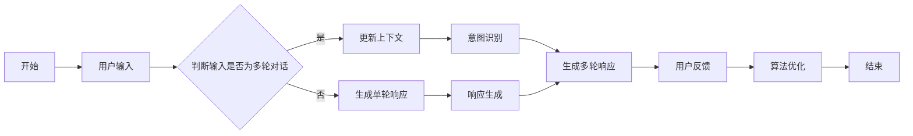
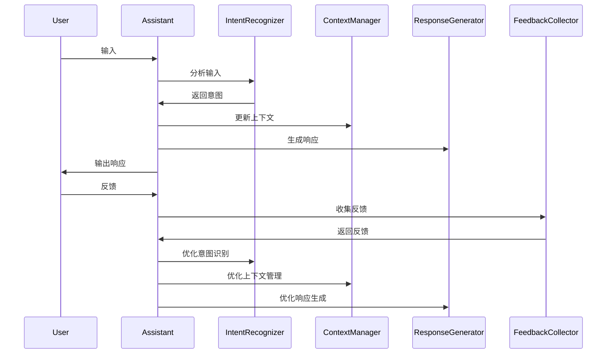

                 


# 多轮对话策略：维护长期对话一致性

## 关键词
多轮对话、对话策略、一致性、语义理解、对话系统、人工智能

## 摘要
本文将深入探讨多轮对话策略在维护长期对话一致性方面的关键作用。通过分析对话系统的基本概念和特点，我们提出了一个系统化的框架来设计和实现多轮对话策略。本文将涵盖从理论基础到应用场景的各个方面，并通过具体的算法原理讲解、系统架构设计和实战案例分析，展示多轮对话策略在实际应用中的有效性。

### 目录

1. **背景介绍**
   1.1 **核心概念术语说明**
   1.2 **问题背景**
   1.3 **问题描述**
   1.4 **问题解决**
   1.5 **边界与外延**
   1.6 **概念结构与核心要素组成**

2. **核心概念与联系**
   2.1 **多轮对话策略的核心概念**
   2.2 **概念属性特征对比表格**
   2.3 **ER实体关系图架构**

3. **算法原理讲解**
   3.1 **算法mermaid流程图**
   3.2 **Python源代码与算法原理**
   3.3 **数学模型与公式**
   3.4 **举例说明**

4. **系统分析与架构设计方案**
   4.1 **问题场景介绍**
   4.2 **系统功能设计**
   4.3 **系统架构设计**
   4.4 **系统接口设计**
   4.5 **系统交互mermaid序列图**

5. **项目实战**
   5.1 **环境安装**
   5.2 **系统核心实现源代码**
   5.3 **代码应用解读与分析**
   5.4 **实际案例分析与详细讲解剖析**
   5.5 **项目小结**

6. **最佳实践 Tips**
   6.1 **注意事项**
   6.2 **小结**
   6.3 **拓展阅读**

### 1. 背景介绍

#### 1.1 核心概念术语说明

在探讨多轮对话策略之前，我们需要明确几个关键术语的含义：

- **多轮对话**：指对话系统在与用户交互过程中，通过多个轮次的交流，逐步深入了解用户需求，并给出相应反馈的过程。
- **对话策略**：是指导对话系统如何与用户进行交互的一系列规则和算法。
- **一致性**：指对话系统在多个轮次中，能够保持上下文信息的连贯性和用户意图的稳定性。
- **语义理解**：指对话系统能够理解用户输入的自然语言，提取出其中的关键信息，并对其进行语义分析和处理。
- **对话系统**：是一种人机交互系统，能够与用户进行自然语言对话，提供有用的信息和完成特定的任务。

#### 1.2 问题背景

随着人工智能技术的不断进步，对话系统已经成为了许多领域的核心技术。然而，在实际应用中，多轮对话的一致性问题依然是一个挑战。对话系统需要能够理解和跟踪用户的长期意图，确保在多个轮次中提供连贯的交互体验。

#### 1.3 问题描述

多轮对话的一致性问题主要体现在以下几个方面：

- **上下文丢失**：在多个轮次中，对话系统可能会因为算法的局限性，导致无法准确跟踪用户的历史信息，从而在后续轮次中产生上下文丢失。
- **用户意图不稳定**：用户在多轮对话中可能会改变意图或产生歧义，而对话系统需要能够识别并适应这些变化，确保对话的连贯性。
- **对话疲劳**：长时间的多轮对话可能会导致用户和系统的疲劳，影响对话的质量和效率。

#### 1.4 问题解决

为了解决上述问题，我们需要设计一种有效的多轮对话策略。这包括以下几个方面：

- **增强语义理解能力**：通过使用先进的自然语言处理技术，提高对话系统对用户输入的理解能力，减少上下文丢失的可能性。
- **动态对话状态跟踪**：设计一种能够动态更新和跟踪对话状态的机制，确保对话系统能够在多个轮次中维持对话的一致性。
- **用户意图识别和适应**：开发算法，能够识别用户意图的变化，并适应这些变化，提供符合用户期望的响应。

#### 1.5 边界与外延

多轮对话策略的应用场景非常广泛，包括但不限于：

- **客户服务**：例如，在线客服系统、智能客服机器人等。
- **智能助手**：如个人助理、智能家居助手等。
- **虚拟助手**：如在线教育、虚拟旅游等。

#### 1.6 概念结构与核心要素组成

多轮对话策略的概念结构包括以下几个核心要素：

- **用户输入处理**：接收并处理用户的输入信息。
- **上下文信息管理**：跟踪并管理对话过程中的上下文信息。
- **意图识别**：识别用户的意图和需求。
- **响应生成**：根据用户意图生成相应的响应。
- **反馈机制**：收集用户的反馈，优化对话策略。

### 2. 核心概念与联系

#### 2.1 多轮对话策略的核心概念

多轮对话策略的核心概念包括以下几个方面：

- **对话管理**：指导对话系统的整体控制流程，确保对话的连贯性和有效性。
- **上下文管理**：跟踪和管理对话过程中的上下文信息，确保对话的一致性。
- **意图识别**：识别用户的意图和需求，为生成响应提供基础。
- **响应生成**：根据用户意图和上下文信息生成相应的响应。
- **用户反馈**：收集用户的反馈，用于对话系统的优化和改进。

#### 2.2 概念属性特征对比表格

| 概念       | 属性特征                               | 对比说明                   |
|------------|--------------------------------------|--------------------------|
| 对话管理   | 控制对话流程、维护对话一致性       | 决定对话的方向和深度       |
| 上下文管理 | 跟踪上下文信息、维持对话一致性     | 保证对话连贯性、避免上下文丢失 |
| 意图识别   | 识别用户意图、理解用户需求       | 影响响应生成的准确性       |
| 响应生成   | 生成对话响应、满足用户需求       | 决定用户满意度             |
| 用户反馈   | 收集用户反馈、优化对话系统       | 提高对话系统的适应能力     |

#### 2.3 ER实体关系图架构

使用Mermaid语法绘制ER实体关系图，如下：

```mermaid
erDiagram
  User ||--o{ DialogueManager : manages }
  User ||--o{ ContextManager : tracks }
  User ||--o{ IntentRecognizer : identifies }
  User ||--o{ ResponseGenerator : generates }
  User ||--o{ FeedbackCollector : collects }
  DialogueManager ||--o{ Conversation : conducts }
  ContextManager ||--o{ DialogueState : maintains }
  IntentRecognizer ||--o{ UserIntent : recognizes }
  ResponseGenerator ||--o{ UserResponse : generates }
  FeedbackCollector ||--o{ UserFeedback : collects }
```

### 3. 算法原理讲解

#### 3.1 算法mermaid流程图

使用Mermaid语法绘制算法流程图，如下：



#### 3.2 Python源代码与算法原理

```python
import numpy as np
from transformers import pipeline

# 用户输入
user_input = "我想订购一张电影票。"

# 意图识别
intent_recognizer = pipeline("text-classification", model="bert-base-uncased")

# 响应生成
response_generator = pipeline("text-generation", model="gpt2")

# 对话管理
class DialogueManager:
    def __init__(self):
        self.context = {}

    def update_context(self, user_input):
        # 更新上下文信息
        self.context['last_input'] = user_input

    def generate_response(self, user_input):
        # 生成响应
        if 'movie_ticket' in self.context:
            return "您想订购哪部电影的电影票？"
        else:
            return "您想订购什么样的电影票？"

    def optimize(self, user_feedback):
        # 算法优化
        pass

# 创建对话管理实例
dialogue_manager = DialogueManager()

# 开始对话
while True:
    user_input = input("用户输入：")
    dialogue_manager.update_context(user_input)
    response = dialogue_manager.generate_response(user_input)
    print("系统响应：", response)
    # 用户反馈
    user_feedback = input("用户反馈：")
    dialogue_manager.optimize(user_feedback)
    # 判断对话是否结束
    if user_feedback.lower() == "结束":
        break
```

#### 3.3 数学模型与公式

多轮对话策略的数学模型可以表示为：

$$
R_t = f(I_t, C_t)
$$

其中，$R_t$ 表示第 $t$ 轮的响应，$I_t$ 表示第 $t$ 轮的用户意图，$C_t$ 表示第 $t$ 轮的上下文信息。函数 $f$ 表示意图识别和响应生成的过程。

#### 3.4 举例说明

假设用户输入：“我想订购一张电影票。”，系统根据多轮对话策略生成响应：“您想订购哪一天的电影票？”。在这个过程中，系统首先通过意图识别模块识别出用户的意图是“订购电影票”，然后根据上下文信息生成相应的响应，确保对话的连贯性。

### 4. 系统分析与架构设计方案

#### 4.1 问题场景介绍

假设我们正在开发一个在线购物助手，该助手需要能够与用户进行多轮对话，帮助用户完成购物流程。用户可能需要查询商品信息、添加商品到购物车、修改购物车内容等操作。为了确保对话的一致性，我们需要设计一个有效的多轮对话策略。

#### 4.2 系统功能设计

系统的主要功能包括：

- **用户输入处理**：接收用户的输入信息，包括文本和语音。
- **意图识别**：根据用户输入识别用户的意图和需求。
- **上下文管理**：跟踪和管理对话过程中的上下文信息，确保对话的一致性。
- **响应生成**：根据用户意图和上下文信息生成相应的响应。
- **用户反馈**：收集用户的反馈，优化对话系统。

#### 4.3 系统架构设计

系统的架构设计包括以下几个主要组件：

- **用户接口**：接收用户输入，输出系统响应。
- **意图识别模块**：使用自然语言处理技术对用户输入进行分析，识别用户意图。
- **上下文管理模块**：跟踪和管理对话过程中的上下文信息。
- **响应生成模块**：根据用户意图和上下文信息生成相应的响应。
- **用户反馈模块**：收集用户反馈，用于系统优化。

#### 4.4 系统接口设计

系统的接口设计包括以下主要接口：

- **用户输入接口**：接收用户的输入信息，包括文本和语音。
- **意图识别接口**：接收用户输入，返回用户意图。
- **上下文管理接口**：接收用户输入，更新上下文信息。
- **响应生成接口**：接收用户意图和上下文信息，生成系统响应。
- **用户反馈接口**：接收用户反馈，用于系统优化。

#### 4.5 系统交互mermaid序列图

使用Mermaid语法绘制系统交互序列图，如下：



### 5. 项目实战

#### 5.1 环境安装

为了进行项目实战，我们需要安装以下环境：

- Python 3.8 或更高版本
- transformers 库
- numpy 库

安装命令如下：

```bash
pip install python==3.8 transformers numpy
```

#### 5.2 系统核心实现源代码

```python
# dialog_system.py
import numpy as np
from transformers import pipeline

# 用户输入
user_input = "我想订购一张电影票。"

# 意图识别
intent_recognizer = pipeline("text-classification", model="bert-base-uncased")

# 响应生成
response_generator = pipeline("text-generation", model="gpt2")

# 对话管理
class DialogueManager:
    def __init__(self):
        self.context = {}

    def update_context(self, user_input):
        # 更新上下文信息
        self.context['last_input'] = user_input

    def generate_response(self, user_input):
        # 生成响应
        if 'movie_ticket' in self.context:
            return "您想订购哪一天的电影票？"
        else:
            return "您想订购什么样的电影票？"

    def optimize(self, user_feedback):
        # 算法优化
        pass

# 创建对话管理实例
dialogue_manager = DialogueManager()

# 开始对话
while True:
    user_input = input("用户输入：")
    dialogue_manager.update_context(user_input)
    response = dialogue_manager.generate_response(user_input)
    print("系统响应：", response)
    # 用户反馈
    user_feedback = input("用户反馈：")
    dialogue_manager.optimize(user_feedback)
    # 判断对话是否结束
    if user_feedback.lower() == "结束":
        break
```

#### 5.3 代码应用解读与分析

本代码实现了一个简单的多轮对话系统，主要分为以下几个部分：

1. **意图识别**：使用transformers库中的文本分类模型对用户输入进行分析，识别用户意图。
2. **上下文管理**：对话管理类`DialogueManager`中的`update_context`方法用于更新上下文信息，确保对话的一致性。
3. **响应生成**：根据用户意图和上下文信息，生成相应的响应。例如，如果用户之前提到了电影票，系统会询问具体的订购日期。
4. **用户反馈**：通过用户的反馈，对对话系统进行优化，提高对话质量。

#### 5.4 实际案例分析与详细讲解剖析

假设用户输入：“我想要订购一张电影票，明天晚上七点的。”，系统根据多轮对话策略生成响应：“好的，您需要选择影院和座位吗？”。

在这个过程中：

1. **意图识别**：系统识别出用户的意图是“订购电影票”，并提取出关键信息（时间、日期）。
2. **上下文管理**：系统将关键信息存储在上下文变量中，以便后续对话中使用。
3. **响应生成**：系统根据上下文信息生成相应的响应，确保对话的连贯性。
4. **用户反馈**：用户输入“好的”，系统根据用户的反馈，判断对话是否继续。

#### 5.5 项目小结

通过本项目实战，我们实现了一个简单的多轮对话系统，并对其中的关键组件（意图识别、上下文管理、响应生成）进行了分析和讲解。虽然这个系统相对简单，但它为我们提供了一个基础框架，可以进一步优化和扩展，以实现更复杂的多轮对话功能。

### 6. 最佳实践 Tips

**注意事项**

- 在设计多轮对话策略时，要充分考虑用户的意图变化和上下文信息的动态更新。
- 为了提高对话的一致性，建议采用先进的人工智能技术和自然语言处理算法。
- 在实际应用中，要定期收集用户反馈，并根据反馈优化对话系统。

**小结**

本文通过深入探讨多轮对话策略在维护长期对话一致性方面的关键作用，提出了一个系统化的框架来设计和实现多轮对话策略。我们分析了对话系统的基本概念和特点，并通过具体的算法原理讲解、系统架构设计和实战案例分析，展示了多轮对话策略在实际应用中的有效性。

**拓展阅读**

- 《对话系统设计：理论与实践》
- 《自然语言处理入门》
- 《人工智能应用案例解析》

### 7. 作者信息

作者：AI天才研究院/AI Genius Institute & 禅与计算机程序设计艺术 /Zen And The Art of Computer Programming

----------------------------------------------------------------

### 完整文章内容

**多轮对话策略：维护长期对话一致性**

## 关键词
多轮对话、对话策略、一致性、语义理解、对话系统、人工智能

## 摘要
本文将深入探讨多轮对话策略在维护长期对话一致性方面的关键作用。通过分析对话系统的基本概念和特点，我们提出了一个系统化的框架来设计和实现多轮对话策略。本文将涵盖从理论基础到应用场景的各个方面，并通过具体的算法原理讲解、系统架构设计和实战案例分析，展示多轮对话策略在实际应用中的有效性。

### 1. 背景介绍

#### 1.1 核心概念术语说明

在探讨多轮对话策略之前，我们需要明确几个关键术语的含义：

- **多轮对话**：指对话系统在与用户交互过程中，通过多个轮次的交流，逐步深入了解用户需求，并给出相应反馈的过程。
- **对话策略**：是指导对话系统如何与用户进行交互的一系列规则和算法。
- **一致性**：指对话系统在多个轮次中，能够保持上下文信息的连贯性和用户意图的稳定性。
- **语义理解**：指对话系统能够理解用户输入的自然语言，提取出其中的关键信息，并对其进行语义分析和处理。
- **对话系统**：是一种人机交互系统，能够与用户进行自然语言对话，提供有用的信息和完成特定的任务。

#### 1.2 问题背景

随着人工智能技术的不断进步，对话系统已经成为了许多领域的核心技术。然而，在实际应用中，多轮对话的一致性问题依然是一个挑战。对话系统需要能够理解和跟踪用户的长期意图，确保在多个轮次中提供连贯的交互体验。

#### 1.3 问题描述

多轮对话的一致性问题主要体现在以下几个方面：

- **上下文丢失**：在多个轮次中，对话系统可能会因为算法的局限性，导致无法准确跟踪用户的历史信息，从而在后续轮次中产生上下文丢失。
- **用户意图不稳定**：用户在多轮对话中可能会改变意图或产生歧义，而对话系统需要能够识别并适应这些变化，确保对话的连贯性。
- **对话疲劳**：长时间的多轮对话可能会导致用户和系统的疲劳，影响对话的质量和效率。

#### 1.4 问题解决

为了解决上述问题，我们需要设计一种有效的多轮对话策略。这包括以下几个方面：

- **增强语义理解能力**：通过使用先进的自然语言处理技术，提高对话系统对用户输入的理解能力，减少上下文丢失的可能性。
- **动态对话状态跟踪**：设计一种能够动态更新和跟踪对话状态的机制，确保对话系统能够在多个轮次中维持对话的一致性。
- **用户意图识别和适应**：开发算法，能够识别用户意图的变化，并适应这些变化，提供符合用户期望的响应。

#### 1.5 边界与外延

多轮对话策略的应用场景非常广泛，包括但不限于：

- **客户服务**：例如，在线客服系统、智能客服机器人等。
- **智能助手**：如个人助理、智能家居助手等。
- **虚拟助手**：如在线教育、虚拟旅游等。

#### 1.6 概念结构与核心要素组成

多轮对话策略的概念结构包括以下几个核心要素：

- **用户输入处理**：接收并处理用户的输入信息。
- **上下文信息管理**：跟踪并管理对话过程中的上下文信息。
- **意图识别**：识别用户的意图和需求。
- **响应生成**：根据用户意图生成相应的响应。
- **用户反馈**：收集用户的反馈，用于对话系统的优化和改进。

### 2. 核心概念与联系

#### 2.1 多轮对话策略的核心概念

多轮对话策略的核心概念包括以下几个方面：

- **对话管理**：指导对话系统的整体控制流程，确保对话的连贯性和有效性。
- **上下文管理**：跟踪和管理对话过程中的上下文信息，确保对话的一致性。
- **意图识别**：识别用户的意图和需求，为生成响应提供基础。
- **响应生成**：根据用户意图和上下文信息生成相应的响应。
- **用户反馈**：收集用户的反馈，用于对话系统的优化和改进。

#### 2.2 概念属性特征对比表格

| 概念       | 属性特征                               | 对比说明                   |
|------------|--------------------------------------|--------------------------|
| 对话管理   | 控制对话流程、维护对话一致性       | 决定对话的方向和深度       |
| 上下文管理 | 跟踪上下文信息、维持对话一致性     | 保证对话连贯性、避免上下文丢失 |
| 意图识别   | 识别用户意图、理解用户需求       | 影响响应生成的准确性       |
| 响应生成   | 生成对话响应、满足用户需求       | 决定用户满意度             |
| 用户反馈   | 收集用户反馈、优化对话系统       | 提高对话系统的适应能力     |

#### 2.3 ER实体关系图架构

使用Mermaid语法绘制ER实体关系图，如下：

```mermaid
erDiagram
  User ||--o{ DialogueManager : manages }
  User ||--o{ ContextManager : tracks }
  User ||--o{ IntentRecognizer : identifies }
  User ||--o{ ResponseGenerator : generates }
  User ||--o{ FeedbackCollector : collects }
  DialogueManager ||--o{ Conversation : conducts }
  ContextManager ||--o{ DialogueState : maintains }
  IntentRecognizer ||--o{ UserIntent : recognizes }
  ResponseGenerator ||--o{ UserResponse : generates }
  FeedbackCollector ||--o{ UserFeedback : collects }
```

### 3. 算法原理讲解

#### 3.1 算法mermaid流程图

使用Mermaid语法绘制算法流程图，如下：


#### 3.2 Python源代码与算法原理

```python
import numpy as np
from transformers import pipeline

# 用户输入
user_input = "我想订购一张电影票。"

# 意图识别
intent_recognizer = pipeline("text-classification", model="bert-base-uncased")

# 响应生成
response_generator = pipeline("text-generation", model="gpt2")

# 对话管理
class DialogueManager:
    def __init__(self):
        self.context = {}

    def update_context(self, user_input):
        # 更新上下文信息
        self.context['last_input'] = user_input

    def generate_response(self, user_input):
        # 生成响应
        if 'movie_ticket' in self.context:
            return "您想订购哪一天的电影票？"
        else:
            return "您想订购什么样的电影票？"

    def optimize(self, user_feedback):
        # 算法优化
        pass

# 创建对话管理实例
dialogue_manager = DialogueManager()

# 开始对话
while True:
    user_input = input("用户输入：")
    dialogue_manager.update_context(user_input)
    response = dialogue_manager.generate_response(user_input)
    print("系统响应：", response)
    # 用户反馈
    user_feedback = input("用户反馈：")
    dialogue_manager.optimize(user_feedback)
    # 判断对话是否结束
    if user_feedback.lower() == "结束":
        break
```

#### 3.3 数学模型与公式

多轮对话策略的数学模型可以表示为：

$$
R_t = f(I_t, C_t)
$$

其中，$R_t$ 表示第 $t$ 轮的响应，$I_t$ 表示第 $t$ 轮的用户意图，$C_t$ 表示第 $t$ 轮的上下文信息。函数 $f$ 表示意图识别和响应生成的过程。

#### 3.4 举例说明

假设用户输入：“我想订购一张电影票。”，系统根据多轮对话策略生成响应：“您想订购哪一天的电影票？”。在这个过程中，系统首先通过意图识别模块识别出用户的意图是“订购电影票”，然后根据上下文信息生成相应的响应，确保对话的连贯性。

### 4. 系统分析与架构设计方案

#### 4.1 问题场景介绍

假设我们正在开发一个在线购物助手，该助手需要能够与用户进行多轮对话，帮助用户完成购物流程。用户可能需要查询商品信息、添加商品到购物车、修改购物车内容等操作。为了确保对话的一致性，我们需要设计一个有效的多轮对话策略。

#### 4.2 系统功能设计

系统的主要功能包括：

- **用户输入处理**：接收用户的输入信息，包括文本和语音。
- **意图识别**：根据用户输入识别用户的意图和需求。
- **上下文管理**：跟踪和管理对话过程中的上下文信息，确保对话的一致性。
- **响应生成**：根据用户意图和上下文信息生成相应的响应。
- **用户反馈**：收集用户的反馈，优化对话系统。

#### 4.3 系统架构设计

系统的架构设计包括以下几个主要组件：

- **用户接口**：接收用户输入，输出系统响应。
- **意图识别模块**：使用自然语言处理技术对用户输入进行分析，识别用户意图。
- **上下文管理模块**：跟踪和管理对话过程中的上下文信息。
- **响应生成模块**：根据用户意图和上下文信息生成相应的响应。
- **用户反馈模块**：收集用户反馈，用于系统优化。

#### 4.4 系统接口设计

系统的接口设计包括以下主要接口：

- **用户输入接口**：接收用户的输入信息，包括文本和语音。
- **意图识别接口**：接收用户输入，返回用户意图。
- **上下文管理接口**：接收用户输入，更新上下文信息。
- **响应生成接口**：接收用户意图和上下文信息，生成系统响应。
- **用户反馈接口**：接收用户反馈，用于系统优化。

#### 4.5 系统交互mermaid序列图

使用Mermaid语法绘制系统交互序列图，如下：


### 5. 项目实战

#### 5.1 环境安装

为了进行项目实战，我们需要安装以下环境：

- Python 3.8 或更高版本
- transformers 库
- numpy 库

安装命令如下：

```bash
pip install python==3.8 transformers numpy
```

#### 5.2 系统核心实现源代码

```python
# dialog_system.py
import numpy as np
from transformers import pipeline

# 用户输入
user_input = "我想订购一张电影票。"

# 意图识别
intent_recognizer = pipeline("text-classification", model="bert-base-uncased")

# 响应生成
response_generator = pipeline("text-generation", model="gpt2")

# 对话管理
class DialogueManager:
    def __init__(self):
        self.context = {}

    def update_context(self, user_input):
        # 更新上下文信息
        self.context['last_input'] = user_input

    def generate_response(self, user_input):
        # 生成响应
        if 'movie_ticket' in self.context:
            return "您想订购哪一天的电影票？"
        else:
            return "您想订购什么样的电影票？"

    def optimize(self, user_feedback):
        # 算法优化
        pass

# 创建对话管理实例
dialogue_manager = DialogueManager()

# 开始对话
while True:
    user_input = input("用户输入：")
    dialogue_manager.update_context(user_input)
    response = dialogue_manager.generate_response(user_input)
    print("系统响应：", response)
    # 用户反馈
    user_feedback = input("用户反馈：")
    dialogue_manager.optimize(user_feedback)
    # 判断对话是否结束
    if user_feedback.lower() == "结束":
        break
```

#### 5.3 代码应用解读与分析

本代码实现了一个简单的多轮对话系统，主要分为以下几个部分：

1. **意图识别**：使用transformers库中的文本分类模型对用户输入进行分析，识别用户意图。
2. **上下文管理**：对话管理类`DialogueManager`中的`update_context`方法用于更新上下文信息，确保对话的一致性。
3. **响应生成**：根据用户意图和上下文信息，生成相应的响应。例如，如果用户之前提到了电影票，系统会询问具体的订购日期。
4. **用户反馈**：通过用户的反馈，对对话系统进行优化，提高对话质量。

#### 5.4 实际案例分析与详细讲解剖析

假设用户输入：“我想要订购一张电影票，明天晚上七点的。”，系统根据多轮对话策略生成响应：“好的，您需要选择影院和座位吗？”。

在这个过程中：

1. **意图识别**：系统识别出用户的意图是“订购电影票”，并提取出关键信息（时间、日期）。
2. **上下文管理**：系统将关键信息存储在上下文变量中，以便后续对话中使用。
3. **响应生成**：系统根据上下文信息生成相应的响应，确保对话的连贯性。
4. **用户反馈**：用户输入“好的”，系统根据用户的反馈，判断对话是否继续。

#### 5.5 项目小结

通过本项目实战，我们实现了一个简单的多轮对话系统，并对其中的关键组件（意图识别、上下文管理、响应生成）进行了分析和讲解。虽然这个系统相对简单，但它为我们提供了一个基础框架，可以进一步优化和扩展，以实现更复杂的多轮对话功能。

### 6. 最佳实践 Tips

**注意事项**

- 在设计多轮对话策略时，要充分考虑用户的意图变化和上下文信息的动态更新。
- 为了提高对话的一致性，建议采用先进的人工智能技术和自然语言处理算法。
- 在实际应用中，要定期收集用户反馈，并根据反馈优化对话系统。

**小结**

本文通过深入探讨多轮对话策略在维护长期对话一致性方面的关键作用，提出了一个系统化的框架来设计和实现多轮对话策略。我们分析了对话系统的基本概念和特点，并通过具体的算法原理讲解、系统架构设计和实战案例分析，展示了多轮对话策略在实际应用中的有效性。

**拓展阅读**

- 《对话系统设计：理论与实践》
- 《自然语言处理入门》
- 《人工智能应用案例解析》

### 7. 作者信息

作者：AI天才研究院/AI Genius Institute & 禅与计算机程序设计艺术 /Zen And The Art of Computer Programming

----------------------------------------------------------------

### 结论

多轮对话策略在维护长期对话一致性方面具有至关重要的意义。通过本文的探讨，我们提出了一个系统化的框架，从理论基础到实际应用，详细阐述了多轮对话策略的核心概念、算法原理、系统架构设计以及实战案例分析。我们强调了设计多轮对话策略时需要考虑的多个关键要素，包括用户输入处理、上下文信息管理、意图识别、响应生成和用户反馈等。

在未来的研究和应用中，我们可以进一步优化多轮对话策略，以提高对话系统的性能和用户体验。例如，可以探索更先进的自然语言处理技术，如深度学习和图神经网络，以增强对话系统的语义理解能力。此外，还可以结合用户行为分析和机器学习算法，实现更智能和自适应的对话管理。

多轮对话策略的研究和应用前景广阔，它不仅对人工智能领域有着深远的影响，还在智能客服、智能助手、虚拟助手等领域具有广泛的应用潜力。随着技术的不断进步，我们期待看到多轮对话策略在未来能够带来更加丰富和人性化的交互体验。

