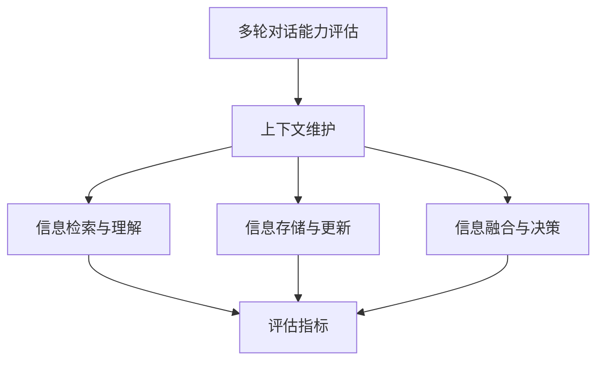
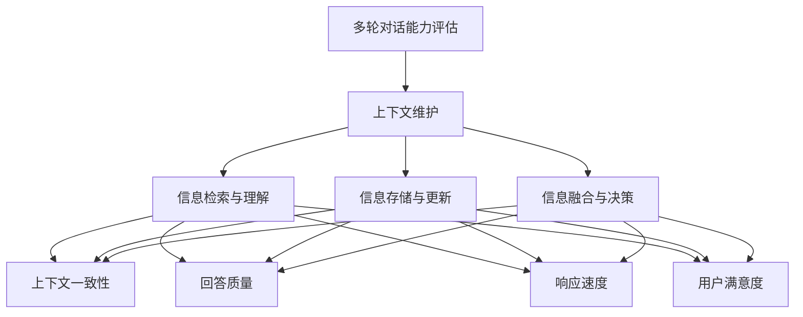

                 

# 多轮对话能力评估：测试上下文维护

关键词：多轮对话、上下文维护、评估指标、信息检索、信息融合

摘要：本文将探讨多轮对话能力评估中的上下文维护问题。通过对多轮对话的背景、定义、核心概念及其评估指标的分析，我们将逐步探讨上下文维护的关键技术，并给出一个详细的实践案例，以便读者更好地理解这一复杂但重要的任务。

----------------------------------------------------------------

## 第一部分：多轮对话能力评估概述

### 第1章：问题背景与定义

#### 1.1.1 问题背景

在当今数字化时代，人工智能与自然语言处理技术的快速发展使得多轮对话系统在多个领域得到了广泛应用。例如，聊天机器人、智能客服、语音助手等都在不断改进其对话能力，以满足用户对高质量交互体验的需求。然而，多轮对话中的上下文维护是一个至关重要的挑战，它直接影响到对话系统的表现和用户体验。

#### 1.1.2 问题定义

上下文维护是指对话系统能够在多轮对话中正确理解和使用对话历史信息，从而在后续轮次中做出更加准确和相关的响应。一个有效的多轮对话能力评估必须能够准确衡量系统在上下文维护方面的表现。

#### 1.1.3 关键概念

- 多轮对话：指涉及两个或多个轮次的交互过程。
- 上下文：指对话历史中的信息，包括用户之前的输入、系统之前的响应以及任何相关的背景信息。
- 维护：指对话系统能够正确地检索、存储、更新和融合上下文信息。

#### 1.1.4 多轮对话能力评估的意义与作用

多轮对话能力评估对于以下方面具有重要意义：

- **用户体验**：准确的上下文维护能够提高用户满意度，使用户体验更加流畅自然。
- **系统性能**：有效的评估可以帮助开发人员识别并改进系统的弱点。
- **技术发展**：评估标准和方法可以促进多轮对话技术的持续发展和创新。

#### 1.1.5 边界与外延

在评估多轮对话能力时，需要明确上下文维护的边界和范围，包括但不限于：

- **时间范围**：上下文的维护应该覆盖对话的全部轮次，包括历史信息和当前信息。
- **信息类型**：上下文维护应涵盖所有相关的信息，如文本、语音、图像等。
- **应用场景**：上下文维护应该适应不同的应用场景，如个人助理、客户服务、教育等。

### 第2章：多轮对话能力评估的核心概念

#### 2.1.1 上下文维护的重要性

上下文维护是多轮对话系统的核心，它决定了系统能否在对话中保持连贯性、准确性和相关性。没有良好的上下文维护，对话系统将难以提供高质量的服务，用户体验也将大打折扣。

#### 2.1.2 上下文维护的挑战

上下文维护面临着多方面的挑战：

- **信息量**：对话中的信息量通常很大，如何高效地检索和处理这些信息是一个挑战。
- **动态性**：对话是动态的，上下文信息需要不断更新和适应。
- **语义理解**：对话中的语言通常是非结构化的，需要系统能够理解并处理复杂的语义。

#### 2.1.3 上下文维护的核心要素

上下文维护涉及三个核心要素：

- **信息检索与理解**：系统能够准确检索并理解对话历史中的信息。
- **信息存储与更新**：系统能够有效地存储对话历史信息，并在需要时进行更新。
- **信息融合与决策**：系统能够将上下文信息融合到决策过程中，以生成相关和准确的响应。

#### 2.1.4 评估指标

评估多轮对话能力时，常用的评估指标包括：

- **上下文一致性**：衡量系统在对话中保持上下文一致性的能力。
- **回答质量**：衡量系统生成的响应的质量和相关性。
- **响应速度**：衡量系统生成响应的速度。
- **用户满意度**：衡量用户对系统对话体验的满意度。

#### 2.1.5 概念关系图

----------------------------------------------------------------

## 第二部分：上下文维护的核心技术

### 第3章：信息检索与理解技术

#### 3.1.1 信息检索技术概述

信息检索是多轮对话中的关键步骤，它涉及到从对话历史中快速准确地找到相关信息。常用的信息检索技术包括：

- **关键词提取**：通过提取对话中的关键词，帮助系统快速定位相关信息。
- **语言理解**：通过对对话中的自然语言进行深入理解，提取语义信息。

#### 3.1.2 关键词提取

关键词提取技术可以帮助系统从对话中提取出关键信息。常用的算法包括：

- **TF-IDF**：通过计算词频和逆文档频率来衡量词的重要性。
- **TextRank**：基于图模型，通过节点间的相似性来计算关键词的重要性。

#### 3.1.3 语言理解技术

语言理解技术涉及到对自然语言文本的深度分析，以提取出语义信息。常用的技术包括：

- **词向量表示**：通过将词映射到高维空间，来表示词的语义信息。
- **命名实体识别**：识别对话中的命名实体，如人名、地点等。
- **语义角色标注**：识别词在句子中的角色，如主语、谓语等。

### 第4章：信息存储与更新技术

#### 4.1.1 存储系统设计

信息存储是上下文维护的关键环节，设计高效的存储系统对于保证对话系统的性能至关重要。常用的存储系统设计包括：

- **关系型数据库**：适用于存储结构化数据，如用户信息、对话历史等。
- **非关系型数据库**：适用于存储非结构化数据，如文本、图像等。
- **图数据库**：适用于存储复杂的关系网络，如社交网络、知识图谱等。

#### 4.1.2 信息更新策略

信息更新策略包括：

- **增量更新**：只更新最新的对话信息。
- **全量更新**：定期更新所有的对话历史信息。

#### 4.1.3 常见存储系统介绍

常见的存储系统包括：

- **关系型数据库**：如MySQL、PostgreSQL等。
- **非关系型数据库**：如MongoDB、Redis等。
- **图数据库**：如Neo4j、JanusGraph等。

### 第5章：信息融合与决策技术

#### 5.1.1 信息融合方法

信息融合是将不同的上下文信息进行整合，以生成更加准确和全面的响应。常用的信息融合方法包括：

- **基于规则的融合**：根据预设的规则进行信息融合。
- **基于机器学习的融合**：通过训练模型进行信息融合。

#### 5.1.2 决策模型介绍

决策模型用于根据上下文信息生成响应。常用的决策模型包括：

- **贝叶斯决策模型**：基于概率理论进行决策。
- **决策树模型**：基于树形结构进行决策。
- **随机森林模型**：基于决策树的集成方法。

#### 5.1.3 实践案例

在实践中，我们可以通过以下案例来理解这些技术的应用：

- **案例1**：使用TF-IDF和TextRank进行关键词提取，以帮助系统快速定位相关信息。
- **案例2**：使用词向量表示和命名实体识别进行语言理解，以提取出对话中的关键信息。
- **案例3**：使用关系型数据库存储对话历史，并采用增量更新策略。
- **案例4**：使用贝叶斯决策模型和决策树模型进行信息融合和决策，以生成高质量的响应。

----------------------------------------------------------------

## 第三部分：多轮对话能力评估指标

### 第6章：评估指标体系构建

#### 6.1.1 指标体系构建原则

构建多轮对话能力评估指标体系时，应遵循以下原则：

- **全面性**：指标应涵盖上下文维护的各个方面。
- **客观性**：指标应能够客观衡量系统的表现。
- **可操作性**：指标应易于实现和计算。

#### 6.1.2 常见评估指标介绍

常见的评估指标包括：

- **上下文一致性指标**：衡量系统在对话中保持上下文一致性的能力。
- **回答质量指标**：衡量系统生成的响应的质量和相关性。
- **响应速度指标**：衡量系统生成响应的速度。
- **用户满意度指标**：衡量用户对系统对话体验的满意度。

#### 6.1.3 指标体系构建方法

构建指标体系的方法包括：

- **需求分析**：确定评估的具体需求和目标。
- **指标设计**：设计符合需求的评估指标。
- **指标权重分配**：确定各个指标的重要程度。
- **评估模型构建**：构建综合评估模型。

### 第7章：多轮对话评估实践

#### 7.1.1 实践环境搭建

搭建多轮对话评估实践环境时，需要准备以下组件：

- **对话系统**：用于生成对话响应。
- **评估工具**：用于计算评估指标。
- **测试数据集**：用于评估对话系统的表现。

#### 7.1.2 样本数据准备

准备样本数据时，需要包括以下内容：

- **对话历史**：记录用户和系统的对话历史。
- **评估指标数据**：包括上下文一致性、回答质量、响应速度等指标的数据。

#### 7.1.3 多轮对话评估实验

在进行多轮对话评估实验时，需要按照以下步骤进行：

- **数据预处理**：清洗和预处理测试数据。
- **评估指标计算**：计算各个评估指标。
- **实验结果分析**：分析实验结果，识别系统的优点和不足。

#### 7.1.4 结果解读

根据实验结果，可以得出以下结论：

- **系统性能**：评估指标可以反映系统的性能。
- **改进方向**：根据评估结果，可以确定需要改进的方面。
- **用户反馈**：评估结果可以用于了解用户对系统的满意度。

----------------------------------------------------------------

## 第四部分：案例分析

### 第8章：多轮对话能力评估案例研究

#### 8.1.1 案例背景

以一个聊天机器人为例，分析其在多轮对话中的上下文维护能力。

#### 8.1.2 案例分析方法

采用以下方法对案例进行分析：

- **对话历史分析**：分析对话历史，识别上下文信息。
- **评估指标计算**：计算上下文一致性、回答质量、响应速度等评估指标。
- **用户反馈**：收集用户对对话体验的反馈。

#### 8.1.3 案例分析结果

分析结果显示，该聊天机器人在上下文维护方面存在以下问题：

- **信息检索不准确**：部分对话历史信息无法准确检索。
- **回答质量不高**：生成的响应与上下文相关性较低。
- **响应速度较慢**：响应时间较长。

#### 8.1.4 案例启示

通过案例研究，可以得出以下启示：

- **改进信息检索技术**：提高信息检索的准确性。
- **优化语言理解**：提高系统对上下文的理解能力。
- **加快响应速度**：优化系统的响应速度。

### 第9章：多轮对话能力评估工具与应用

#### 9.1.1 常见评估工具介绍

常见的评估工具包括：

- **测试框架**：用于自动化测试对话系统。
- **评估平台**：提供评估工具和测试数据集。
- **开源工具**：如TensorFlow、PyTorch等。

#### 9.1.2 应用领域

多轮对话能力评估工具广泛应用于以下领域：

- **聊天机器人**：用于评估聊天机器人的对话能力。
- **智能客服**：用于评估智能客服系统的服务质量。
- **智能教育**：用于评估智能教育系统的互动能力。

----------------------------------------------------------------

## 第五部分：展望与未来发展趋势

### 第10章：多轮对话能力评估的未来发展趋势

#### 10.1.1 技术发展趋势

多轮对话能力评估的未来发展趋势包括：

- **深度学习**：利用深度学习技术提高上下文理解能力。
- **知识图谱**：构建知识图谱，提高信息检索和融合效率。

#### 10.1.2 应用领域拓展

未来多轮对话能力评估将在更多领域得到应用，如医疗、金融、法律等。

#### 10.1.3 挑战与机遇

多轮对话能力评估面临的挑战包括：

- **数据隐私**：如何在保护用户隐私的前提下进行评估。
- **多样性**：如何应对不同用户和场景的多样性需求。

### 第11章：多轮对话能力评估的最佳实践

#### 11.1.1 实践经验总结

最佳实践经验包括：

- **数据准备**：充分准备高质量的测试数据。
- **模型优化**：不断优化模型，提高上下文理解能力。
- **用户反馈**：收集用户反馈，持续改进系统。

#### 11.1.2 注意事项

在进行多轮对话能力评估时，需要注意以下几点：

- **评估指标**：选择合适的评估指标，避免指标过多或过少。
- **数据质量**：确保测试数据的质量，避免数据偏差。
- **实验设计**：设计合理的实验，确保评估结果的可靠性。

#### 11.1.3 拓展阅读

推荐拓展阅读，包括：

- **最新研究成果**：了解多轮对话能力评估的最新研究进展。
- **实际应用案例**：学习其他领域中的多轮对话能力评估实践。

----------------------------------------------------------------

## 附录

### 附录A：术语表

列出本文中涉及的专业术语及其解释。

### 附录B：参考文献

列出本文引用的文献，包括书籍、论文、网站等。

### 附录C：代码与数据资源

提供本文涉及的代码和数据资源，便于读者复现实验。

### 附录D：FAQ

回答读者可能遇到的问题，提供解答和帮助。

----------------------------------------------------------------

### 作者

作者：AI天才研究院/AI Genius Institute & 禅与计算机程序设计艺术 /Zen And The Art of Computer Programming

----------------------------------------------------------------

## 总结

本文详细探讨了多轮对话能力评估中的上下文维护问题。通过分析问题背景、核心概念、核心技术以及评估指标，我们为读者提供了一个全面而深入的理解。同时，通过实践案例和未来发展趋势的探讨，我们希望读者能够更好地把握这一领域的发展动态，并在实际应用中取得更好的成果。让我们继续努力，推动多轮对话技术的进步！## 文章关键词提取

为了更好地总结本文的核心内容和突出主题，我们将提取出以下几个关键词：

1. **多轮对话能力评估**：这是本文的核心主题，涵盖了评估系统的上下文维护能力。
2. **上下文维护**：探讨对话系统在多轮对话中如何准确理解和利用上下文信息。
3. **评估指标**：介绍评估对话系统上下文维护能力的标准和方法。
4. **信息检索与理解**：分析用于检索和理解的算法和技术。
5. **信息存储与更新**：讨论存储系统的设计和更新策略。
6. **信息融合与决策**：探讨如何融合上下文信息以做出有效的决策。
7. **实践案例**：通过实际案例展示上下文维护技术的应用。

这些关键词不仅概括了文章的主要内容，也为读者提供了快速了解文章主题的途径，有助于进一步研究和应用相关的技术。在未来的研究和实践中，这些关键词也将成为重要的参考点。通过不断探索和优化这些关键词所涉及的技术和评估方法，我们可以进一步提升多轮对话系统的用户体验和性能。此外，随着人工智能和自然语言处理技术的不断发展，上下文维护和多轮对话能力评估的重要性将日益凸显，成为领域内研究的热点和应用的关键。因此，深入研究和应用这些关键词所代表的技术和评估方法，对于推动多轮对话技术的发展具有重要意义。

### 文章摘要

本文深入探讨了多轮对话能力评估中的核心问题——上下文维护。在数字化时代，多轮对话系统在多个领域得到了广泛应用，但其表现往往受到上下文维护能力的限制。本文首先介绍了多轮对话能力的背景和定义，并明确了上下文维护的重要性及其面临的挑战。接着，我们详细分析了信息检索与理解、信息存储与更新、信息融合与决策等核心技术，为有效维护上下文提供了理论基础。此外，本文构建了多轮对话能力评估的指标体系，包括上下文一致性、回答质量、响应速度和用户满意度等指标，为评估系统性能提供了量化标准。通过实践案例的详细分析和工具应用，本文展示了如何在实际环境中实施上下文维护。最后，本文展望了多轮对话能力评估的未来发展趋势，并提出了最佳实践建议，以指导该领域的未来发展。本文的研究对于提升多轮对话系统的用户体验和性能具有重要意义，也为进一步的研究和应用提供了宝贵的参考。

### 第一部分：多轮对话能力评估概述

多轮对话能力评估是衡量对话系统在多轮对话过程中表现的重要标准。随着人工智能和自然语言处理技术的不断进步，多轮对话系统在智能客服、聊天机器人、虚拟助手等领域得到了广泛应用。然而，这些系统在实际应用中面临着诸多挑战，其中最为关键的是上下文维护能力。为了深入探讨多轮对话能力评估，我们需要从多个角度进行剖析。

#### 第1章：问题背景与定义

**1.1.1 问题背景**

在人类交流中，多轮对话是常见的交流方式，它允许双方在多个轮次中交换信息，从而建立更深入的理解。多轮对话系统在智能客服、虚拟助手和聊天机器人等应用中，也追求实现类似的人类对话体验。然而，要实现这一目标，系统必须具备出色的上下文维护能力，能够在多个轮次中正确理解并利用对话历史信息。

**1.1.2 问题定义**

多轮对话能力评估涉及多个方面，包括上下文一致性、回答质量、响应速度和用户满意度等。本文的重点是探讨上下文维护问题，即系统如何保持对话历史信息的连贯性和准确性，从而在后续轮次中生成相关且高质量的响应。

**1.1.3 关键概念**

- **多轮对话**：指涉及两个或多个轮次的交互过程。
- **上下文**：指对话历史中的信息，包括用户之前的输入、系统之前的响应以及任何相关的背景信息。
- **维护**：指对话系统能够正确地检索、存储、更新和融合上下文信息。

**1.1.4 多轮对话能力评估的意义与作用**

多轮对话能力评估对于以下方面具有重要意义：

- **用户体验**：准确的上下文维护能够提高用户满意度，使用户体验更加流畅自然。
- **系统性能**：有效的评估可以帮助开发人员识别并改进系统的弱点。
- **技术发展**：评估标准和方法可以促进多轮对话技术的持续发展和创新。

**1.1.5 边界与外延**

在评估多轮对话能力时，需要明确上下文维护的边界和范围，包括但不限于：

- **时间范围**：上下文的维护应该覆盖对话的全部轮次，包括历史信息和当前信息。
- **信息类型**：上下文维护应涵盖所有相关的信息，如文本、语音、图像等。
- **应用场景**：上下文维护应该适应不同的应用场景，如个人助理、客户服务、教育等。

#### 第2章：多轮对话能力评估的核心概念

**2.1.1 上下文维护的重要性**

上下文维护是多轮对话系统的核心，它决定了系统能否在对话中保持连贯性、准确性和相关性。没有良好的上下文维护，对话系统将难以提供高质量的服务，用户体验也将大打折扣。

**2.1.2 上下文维护的挑战**

上下文维护面临着多方面的挑战：

- **信息量**：对话中的信息量通常很大，如何高效地检索和处理这些信息是一个挑战。
- **动态性**：对话是动态的，上下文信息需要不断更新和适应。
- **语义理解**：对话中的语言通常是非结构化的，需要系统能够理解并处理复杂的语义。

**2.1.3 上下文维护的核心要素**

上下文维护涉及三个核心要素：

- **信息检索与理解**：系统能够准确检索并理解对话历史中的信息。
- **信息存储与更新**：系统能够有效地存储对话历史信息，并在需要时进行更新。
- **信息融合与决策**：系统能够将上下文信息融合到决策过程中，以生成相关和准确的响应。

**2.1.4 评估指标**

评估多轮对话能力时，常用的评估指标包括：

- **上下文一致性**：衡量系统在对话中保持上下文一致性的能力。
- **回答质量**：衡量系统生成的响应的质量和相关性。
- **响应速度**：衡量系统生成响应的速度。
- **用户满意度**：衡量用户对系统对话体验的满意度。

**2.1.5 概念关系图**

为了更直观地理解上下文维护的各个核心要素及其关系，我们可以绘制以下概念关系图：

该关系图清晰地展示了多轮对话能力评估的核心概念及其相互关系，为后续章节的深入分析提供了基础。

通过以上章节的介绍，我们为读者搭建了多轮对话能力评估的初步框架，为后续对上下文维护核心技术的探讨奠定了基础。在接下来的部分，我们将详细分析信息检索与理解、信息存储与更新、信息融合与决策等关键技术，进一步探讨如何在实际应用中实现有效的上下文维护。

### 第二部分：多轮对话能力评估的核心概念

在深入探讨多轮对话能力评估时，我们需要重点关注上下文维护这一核心概念。上下文维护是指在多轮对话过程中，系统能够准确理解和利用对话历史信息，从而在后续轮次中做出更加相关和准确的响应。这一过程不仅涉及到信息的检索与理解，还包括信息的存储与更新，以及信息的融合与决策。以下我们将详细分析这些核心概念及其相互关系。

#### 2.1.1 上下文维护的重要性

上下文维护是多轮对话系统的核心，它决定了系统能否在对话中保持连贯性、准确性和相关性。良好的上下文维护可以确保系统对用户意图的理解更加准确，从而生成高质量的响应。例如，在智能客服场景中，如果系统能够记住用户的购买历史和偏好，那么在后续的对话中可以提供更加个性化的服务。因此，上下文维护对于提升用户体验和系统性能至关重要。

#### 2.1.2 上下文维护的挑战

上下文维护面临着多方面的挑战：

- **信息量**：对话中的信息量通常很大，如何高效地检索和处理这些信息是一个挑战。尤其是在多轮对话中，系统需要从大量的历史信息中快速找到与当前轮次相关的信息。
- **动态性**：对话是动态的，上下文信息需要不断更新和适应。例如，用户的意图可能在对话过程中发生变化，系统需要实时调整上下文信息以适应新的需求。
- **语义理解**：对话中的语言通常是非结构化的，需要系统能够理解并处理复杂的语义。这涉及到对自然语言文本的深入分析，包括词汇的语境意义、语法结构和隐含的意图。

#### 2.1.3 上下文维护的核心要素

上下文维护涉及三个核心要素：信息检索与理解、信息存储与更新、信息融合与决策。

1. **信息检索与理解**：
   信息检索与理解是上下文维护的基础。系统需要能够从对话历史中快速准确地找到相关信息。这通常涉及到以下技术：
   - **关键词提取**：通过提取对话中的关键词，帮助系统快速定位相关信息。
   - **语言理解**：通过对对话中的自然语言进行深入理解，提取语义信息。这包括词向量表示、命名实体识别、语义角色标注等。

2. **信息存储与更新**：
   系统需要能够有效地存储对话历史信息，并在需要时进行更新。这涉及到以下方面：
   - **存储系统设计**：选择合适的存储系统，如关系型数据库、非关系型数据库或图数据库。
   - **信息更新策略**：制定有效的信息更新策略，如增量更新或全量更新。

3. **信息融合与决策**：
   系统需要能够将上下文信息融合到决策过程中，以生成相关和准确的响应。这通常涉及到以下技术：
   - **信息融合方法**：如基于规则的融合、基于机器学习的融合等。
   - **决策模型**：如贝叶斯决策模型、决策树模型、随机森林模型等。

#### 2.1.4 评估指标

为了评估多轮对话能力，我们需要定义一系列评估指标，以衡量系统在上下文维护方面的表现。常用的评估指标包括：

- **上下文一致性**：衡量系统在对话中保持上下文一致性的能力。高上下文一致性意味着系统能够在多个轮次中正确理解并利用对话历史信息。
- **回答质量**：衡量系统生成的响应的质量和相关性。高质量的响应能够准确满足用户的需求和意图。
- **响应速度**：衡量系统生成响应的速度。快速的响应能够提升用户体验，使对话更加流畅。
- **用户满意度**：衡量用户对系统对话体验的满意度。用户的满意度是衡量多轮对话系统能力的重要指标。

#### 2.1.5 概念关系图

为了更直观地展示上下文维护的核心要素及其相互关系，我们可以绘制以下概念关系图：

该关系图清晰地展示了多轮对话能力评估中的核心概念及其相互关系，为后续章节的深入分析提供了基础。通过上述分析，我们可以看到上下文维护是多轮对话能力评估中的关键要素，它决定了对话系统的表现和用户体验。在接下来的章节中，我们将详细探讨信息检索与理解、信息存储与更新、信息融合与决策等核心技术，以帮助读者更好地理解和应用上下文维护技术。

### 第三部分：信息检索与理解技术

在多轮对话系统中，信息检索与理解技术是实现上下文维护的关键步骤。通过高效的信息检索与理解，系统可以快速准确地从对话历史中提取相关内容，为生成高质量响应奠定基础。以下将详细介绍信息检索与理解技术，包括关键词提取、语言理解技术以及它们在实际应用中的具体实现。

#### 3.1.1 信息检索技术概述

信息检索技术在多轮对话中起着至关重要的作用，它涉及到从对话历史中快速准确地找到相关信息。以下是几种常见的信息检索技术：

1. **关键词提取**：
   关键词提取是信息检索的第一步，旨在从文本中提取出最具代表性的词语。常用的关键词提取算法包括TF-IDF（词频-逆文档频率）和TextRank。

   - **TF-IDF算法**：
     TF-IDF算法通过计算词频（TF）和逆文档频率（IDF）来衡量词的重要性。公式如下：
     \[
     TF-IDF(t,d) = TF(t,d) \times IDF(t)
     \]
     其中，\(TF(t,d)\) 表示词 \(t\) 在文档 \(d\) 中的词频，\(IDF(t)\) 表示词 \(t\) 在整个文档集合中的逆文档频率。

   - **TextRank算法**：
     TextRank是一种基于图模型的算法，通过计算节点（即关键词）的相似性来提取关键词。公式如下：
     \[
     s(i, j) = \sum_{k} w_{ik} w_{jk}
     \]
     其中，\(s(i, j)\) 表示节点 \(i\) 和节点 \(j\) 之间的相似性，\(w_{ik}\) 和 \(w_{jk}\) 分别表示节点 \(i\) 和节点 \(j\) 与节点 \(k\) 之间的权重。

2. **语言理解技术**：
   语言理解技术涉及对自然语言文本的深度分析，以提取出语义信息。以下是几种常用的语言理解技术：

   - **词向量表示**：
     词向量表示是将词语映射到高维空间，以表示其语义信息。常用的词向量模型包括Word2Vec和GloVe。

     - **Word2Vec**：
       Word2Vec模型通过训练神经网络来学习词语的向量表示。其核心思想是相似词在向量空间中更接近。常用的算法包括连续词袋（CBOW）和Skip-Gram。

     - **GloVe**：
       GloVe模型通过矩阵分解学习词语的向量表示，其优点是能够更好地捕捉词语的上下文信息。

   - **命名实体识别**：
     命名实体识别（NER）是识别文本中的命名实体，如人名、地点、组织名等。常用的NER模型包括基于规则的方法和基于机器学习的方法。

   - **语义角色标注**：
     语义角色标注（SRL）是识别词语在句子中的角色，如主语、谓语、宾语等。常用的SRL模型包括基于规则的方法和基于神经网络的方法。

#### 3.1.2 关键词提取

关键词提取是信息检索与理解的基础，它有助于系统快速定位相关信息。以下为关键词提取的详细步骤和算法：

1. **预处理**：
   预处理包括分词、去除停用词、标记词性等。这些步骤有助于提高关键词提取的准确性。

2. **TF-IDF算法**：
   使用TF-IDF算法提取关键词，计算每个词在文档中的词频和逆文档频率，并根据公式计算关键词的重要性。具体步骤如下：
   - 计算每个词在文档中的词频。
   - 计算每个词的逆文档频率。
   - 计算每个词的TF-IDF值，选择TF-IDF值较高的词作为关键词。

3. **TextRank算法**：
   使用TextRank算法提取关键词，计算词语之间的相似性，并根据相似性排序选择关键词。具体步骤如下：
   - 构建词语相似性矩阵。
   - 迭代计算词语相似性，直至收敛。
   - 根据词语相似性矩阵选择关键词。

#### 3.1.3 语言理解技术

语言理解技术是信息检索与理解的深度部分，它涉及对自然语言文本的语义分析。以下是几种常见的语言理解技术及其应用：

1. **词向量表示**：
   使用词向量表示技术，将词语映射到高维空间。具体步骤如下：
   - 训练词向量模型，如Word2Vec或GloVe。
   - 将词语转换为向量表示。
   - 使用向量相似性度量计算词语的语义关系。

2. **命名实体识别**：
   使用命名实体识别技术，识别文本中的命名实体。具体步骤如下：
   - 预处理文本，包括分词、词性标注等。
   - 使用预训练的NER模型进行命名实体识别。
   - 提取识别出的命名实体。

3. **语义角色标注**：
   使用语义角色标注技术，识别词语在句子中的角色。具体步骤如下：
   - 预处理文本，包括分词、词性标注等。
   - 使用预训练的SRL模型进行语义角色标注。
   - 提取标注出的语义角色。

#### 3.1.4 实践案例

以下通过一个实际案例来说明信息检索与理解技术的应用：

**案例**：假设我们有一个聊天机器人，用户与机器人进行了以下对话：

用户：你好，我想预订一张明天上午的机票。
机器人：请问您想从哪个城市出发？
用户：我从北京出发。
机器人：好的，请问您想飞往哪个城市？
用户：我想去上海。
机器人：好的，有没有特定的航班要求，比如出发时间或价格范围？

在这个案例中，机器人需要理解用户的意图，即预订一张从北京到上海明天的机票。以下是如何使用信息检索与理解技术来实现：

1. **关键词提取**：
   提取对话中的关键词：“机票”、“北京”、“上海”、“明天”、“出发”、“航班”。

2. **语言理解技术**：
   - **词向量表示**：使用预训练的词向量模型将关键词转换为向量表示，计算关键词之间的相似性，以帮助机器人理解用户的意图。
   - **命名实体识别**：识别并提取出“北京”和“上海”这两个命名实体，作为出发地和目的地的信息。
   - **语义角色标注**：识别并提取出关键词在句子中的角色，如“北京”是出发地，而“上海”是目的地。

通过上述信息检索与理解技术，机器人能够准确理解用户的意图，并生成相关且准确的响应。这展示了信息检索与理解技术在多轮对话中的实际应用。

总之，信息检索与理解技术是多轮对话系统中实现上下文维护的关键技术。通过关键词提取、语言理解等技术，系统能够从对话历史中提取相关内容，为生成高质量响应提供支持。在实际应用中，这些技术的有效结合能够显著提升对话系统的表现和用户体验。

### 第四部分：信息存储与更新技术

信息存储与更新技术是多轮对话系统中实现上下文维护的重要保障。为了保证系统在多轮对话中能够准确、高效地维护上下文信息，我们需要设计合理的存储系统和制定有效的更新策略。以下将详细探讨信息存储系统设计、信息更新策略以及常见存储系统的介绍。

#### 4.1.1 存储系统设计

在设计信息存储系统时，我们需要考虑以下关键因素：

1. **数据类型**：根据对话系统的需求，选择合适的存储系统。例如，对于结构化数据（如用户信息、对话记录），可以选择关系型数据库；对于非结构化数据（如文本、图像、语音），可以选择非关系型数据库或图数据库。

2. **查询性能**：存储系统需要能够快速响应查询请求，提供高效的检索能力。这通常涉及到索引设计、查询优化等技术。

3. **扩展性**：随着对话历史的增加，存储系统应具有良好的扩展性，能够支持数据规模的持续增长。

4. **一致性**：存储系统应确保数据的准确性和一致性，特别是在多用户并发访问的情况下。

5. **数据持久性**：存储系统应具备较高的数据持久性，确保在系统故障或断电等情况下，数据不会丢失。

基于上述考虑，常见的信息存储系统设计包括以下几种：

1. **关系型数据库**：关系型数据库（如MySQL、PostgreSQL）适用于存储结构化数据。它们使用表格来组织数据，并支持复杂的查询操作。关系型数据库的主要优点包括数据一致性、事务支持和高效的查询性能。然而，它们在处理大规模非结构化数据时可能存在一定的性能瓶颈。

2. **非关系型数据库**：非关系型数据库（如MongoDB、Redis）适用于存储非结构化数据。它们使用文档、键值对或图结构来存储数据，具有高度的灵活性和扩展性。非关系型数据库的主要优点包括数据模型灵活、易于扩展和高效的写入性能。然而，它们可能在查询复杂度和一致性方面存在一定的限制。

3. **图数据库**：图数据库（如Neo4j、JanusGraph）适用于存储复杂的关系网络。它们使用图结构来表示实体和关系，能够高效地处理复杂的查询操作。图数据库的主要优点包括数据模型灵活、高效的图查询支持和强大的关系处理能力。然而，它们在处理大量非结构化数据时可能存在一定的性能瓶颈。

#### 4.1.2 信息更新策略

信息更新策略是指在多轮对话中，如何及时、准确地更新上下文信息。以下几种信息更新策略在实际应用中较为常见：

1. **增量更新**：增量更新策略仅更新最新的对话信息，而保留历史信息不变。这种方法适用于对话轮次较少或对话信息变化不频繁的场景。增量更新的优点是速度快、资源消耗小。然而，在对话轮次较多或信息变化频繁的情况下，增量更新可能会导致上下文信息丢失或不完整。

2. **全量更新**：全量更新策略在每次对话结束后，重新更新所有的对话历史信息。这种方法适用于对话轮次较多或信息变化频繁的场景。全量更新的优点是上下文信息完整、准确。然而，这种方法在对话轮次较多的情况下，可能需要较大的计算资源和时间开销。

3. **混合更新**：混合更新策略结合了增量更新和全量更新的优点，根据实际情况动态调整更新策略。例如，在对话轮次较少且信息变化不频繁的情况下，采用增量更新；在对话轮次较多或信息变化频繁的情况下，采用全量更新。这种方法具有较高的灵活性和适应性。

#### 4.1.3 常见存储系统介绍

以下介绍几种常见的存储系统及其特点：

1. **关系型数据库**：
   - **MySQL**：MySQL是一款开源的关系型数据库，支持事务、索引和复杂的查询操作。它广泛应用于Web应用、数据分析和多轮对话系统。
   - **PostgreSQL**：PostgreSQL是一款开源的关系型数据库，具有丰富的功能，包括事务、索引、触发器和存储过程。它适用于复杂的数据分析和大规模多轮对话系统。

2. **非关系型数据库**：
   - **MongoDB**：MongoDB是一款开源的非关系型数据库，使用文档模型来存储数据。它适用于存储非结构化数据和大规模的对话历史。
   - **Redis**：Redis是一款开源的键值对数据库，主要用于缓存和快速数据存储。它适用于需要高吞吐量和低延迟的场景，如聊天机器人和智能客服系统。

3. **图数据库**：
   - **Neo4j**：Neo4j是一款开源的图数据库，使用Cypher查询语言进行图查询。它适用于存储复杂的关系网络和进行社交图谱、知识图谱等应用。
   - **JanusGraph**：JanusGraph是一款开源的分布式图数据库，支持大规模数据的存储和查询。它适用于大规模多轮对话系统和复杂关系网络的存储。

通过合理设计信息存储系统和制定有效的信息更新策略，多轮对话系统能够在多轮对话中准确、高效地维护上下文信息，从而提升系统的性能和用户体验。在实际应用中，我们可以根据具体需求和场景，选择合适的存储系统并灵活调整更新策略，以实现最优的上下文维护效果。

### 第五部分：信息融合与决策技术

在多轮对话系统中，信息融合与决策技术是实现上下文维护的关键步骤。通过有效的信息融合与决策，系统能够将上下文信息与当前轮次的对话内容相结合，生成相关且准确的响应。以下将详细介绍信息融合方法、决策模型介绍以及具体应用案例。

#### 5.1.1 信息融合方法

信息融合方法是指将多源信息进行整合，以生成综合信息的处理过程。在多轮对话系统中，信息融合技术有助于提高上下文理解能力，从而生成更高质量的响应。以下是一些常见的信息融合方法：

1. **基于规则的融合**：
   基于规则的融合方法通过预定义的规则将不同来源的信息进行整合。这种方法简单直观，适用于信息量较小且规则明确的应用场景。例如，在智能客服系统中，可以根据用户输入的关键词和预定义的规则，将用户请求与相关的知识库内容进行匹配。

2. **基于机器学习的融合**：
   基于机器学习的融合方法通过训练模型，将不同来源的信息进行自动整合。这种方法适用于信息量较大且规则不明确的应用场景。常见的机器学习模型包括决策树、支持向量机、神经网络等。例如，在聊天机器人中，可以使用神经网络模型将用户的历史对话和行为模式进行融合，以预测用户意图。

3. **混合融合方法**：
   混合融合方法结合了基于规则和基于机器学习的优点，根据具体应用场景动态调整融合策略。这种方法具有较高的灵活性和适应性，适用于复杂多变的对话环境。例如，在智能教育系统中，可以结合用户的学业成绩、行为数据和教师反馈，通过混合融合方法生成个性化的学习建议。

#### 5.1.2 决策模型介绍

决策模型是指根据上下文信息生成决策的算法或方法。在多轮对话系统中，决策模型有助于将上下文信息与当前对话内容相结合，生成相关且准确的响应。以下是一些常见的决策模型：

1. **贝叶斯决策模型**：
   贝叶斯决策模型是一种基于概率理论的决策方法。它通过计算不同决策的后验概率，选择具有最高后验概率的决策。贝叶斯决策模型适用于不确定性较高的场景，如医疗诊断和风险评估。

2. **决策树模型**：
   决策树模型是一种基于树形结构的决策方法。它通过一系列条件分支和决策节点，将数据集划分成多个子集，并最终生成决策结果。决策树模型简单直观，易于理解和实现，适用于分类和回归问题。

3. **随机森林模型**：
   随机森林模型是一种基于决策树的集成方法。它通过训练多个决策树，并合并它们的预测结果，以提高模型的泛化能力和准确性。随机森林模型具有较强的鲁棒性和抗过拟合能力，适用于大规模数据的分类和回归问题。

#### 5.1.3 决策模型应用案例

以下通过一个实际案例来说明决策模型在多轮对话系统中的应用：

**案例**：假设我们有一个聊天机器人，用户与机器人进行了以下对话：

用户：你好，我想订一张明天从北京到上海的高铁票。
机器人：您好，请问您有没有具体的出行时间或偏好？
用户：我要明天上午出发，最好是早上的票。
机器人：好的，我为您查到了几趟合适的高铁票，请问您想了解详细信息和预订吗？

在这个案例中，机器人需要根据用户提供的上下文信息（如出发地、目的地、出发时间）生成相关的响应。以下是如何使用决策模型来实现：

1. **贝叶斯决策模型**：
   机器人可以通过贝叶斯决策模型计算每个可能的决策（如查询高铁票、提供购票链接、询问用户需求）的后验概率。选择具有最高后验概率的决策作为最终响应。

2. **决策树模型**：
   机器人可以使用决策树模型，根据用户的输入（如出发时间）生成相应的分支路径。例如，如果用户表示要明天上午出发，决策树模型会指向提供高铁票信息的路径。

3. **随机森林模型**：
   机器人可以使用随机森林模型，将多个决策树的结果进行融合，以提高响应的准确性和多样性。例如，随机森林模型可以同时提供几趟合适的高铁票信息，并根据用户反馈选择最佳选项。

通过上述决策模型的应用，聊天机器人能够根据用户的上下文信息和需求，生成相关且准确的响应。这展示了信息融合与决策技术在多轮对话系统中的实际应用。

总之，信息融合与决策技术是实现多轮对话系统中上下文维护的关键步骤。通过有效的信息融合方法和决策模型，系统能够准确理解和利用上下文信息，从而生成高质量、个性化的响应。在实际应用中，我们可以根据具体需求和场景选择合适的融合方法和决策模型，以提高对话系统的性能和用户体验。

### 第三部分：多轮对话能力评估指标体系构建

在多轮对话系统中，评估指标体系构建是衡量系统性能和用户体验的关键步骤。一个全面的评估指标体系应包含多个方面，如上下文一致性、回答质量、响应速度和用户满意度等。以下将详细讨论评估指标体系构建的原则、常见评估指标的介绍以及具体的构建方法。

#### 6.1.1 指标体系构建原则

构建多轮对话能力评估指标体系时，应遵循以下原则：

1. **全面性**：评估指标应涵盖多轮对话系统的各个方面，包括上下文维护、回答质量、响应速度和用户体验等。

2. **客观性**：评估指标应具有客观性，即能够准确地衡量系统的性能，避免主观偏见。

3. **可操作性**：评估指标应易于实现和计算，便于开发人员在系统开发和优化过程中使用。

4. **动态适应性**：评估指标应能够适应对话系统的动态变化，如对话轮次、用户行为和场景变化等。

5. **可扩展性**：评估指标应具有可扩展性，能够随着技术的进步和需求的变化进行更新和扩展。

#### 6.1.2 常见评估指标介绍

在多轮对话能力评估中，常用的评估指标包括以下几个方面：

1. **上下文一致性指标**：
   - **上下文一致性率**：衡量系统在多轮对话中保持上下文一致性的能力。计算公式为：
     \[
     上下文一致性率 = \frac{正确保持上下文的一致性次数}{总对话轮次}
     \]
   - **上下文偏离率**：衡量系统在多轮对话中上下文偏离的次数。计算公式为：
     \[
     上下文偏离率 = \frac{上下文偏离次数}{总对话轮次}
     \]

2. **回答质量指标**：
   - **回答相关度**：衡量系统生成的响应与用户意图的相关性。计算公式为：
     \[
     回答相关度 = \frac{相关响应次数}{总响应次数}
     \]
   - **回答准确性**：衡量系统生成的响应的准确性。计算公式为：
     \[
     回答准确性 = \frac{正确响应次数}{总响应次数}
     \]

3. **响应速度指标**：
   - **平均响应时间**：衡量系统生成响应的平均时间。计算公式为：
     \[
     平均响应时间 = \frac{总响应时间}{总响应次数}
     \]

4. **用户满意度指标**：
   - **用户满意度评分**：通过用户对系统响应的满意度评分来衡量用户体验。评分通常采用五分制或百分制。

#### 6.1.3 指标体系构建方法

构建多轮对话能力评估指标体系的方法包括以下步骤：

1. **需求分析**：
   - **确定评估目标**：明确评估的目标和需求，如衡量系统的上下文维护能力、回答质量、响应速度和用户体验等。
   - **收集需求**：通过用户调查、访谈和专家咨询等方式，收集各方对评估指标的需求和期望。

2. **指标设计**：
   - **定义指标**：根据需求分析结果，定义具体的评估指标，如上下文一致性率、回答相关度、平均响应时间等。
   - **确定指标权重**：根据指标的重要性和影响程度，确定各个指标的权重。

3. **评估模型构建**：
   - **构建评估模型**：根据定义的指标和权重，构建评估模型，如加权评分模型、综合评分模型等。
   - **验证评估模型**：通过实验和数据验证评估模型的准确性和可靠性。

4. **实施与优化**：
   - **实施评估**：在实际环境中实施评估模型，收集评估数据。
   - **优化指标体系**：根据评估结果，对指标体系和评估模型进行优化和调整，以提高评估的准确性和实用性。

通过上述方法，我们可以构建一个全面、客观和可操作的多轮对话能力评估指标体系，为评估对话系统的性能提供科学、可靠的依据。在后续的章节中，我们将通过具体案例分析，进一步展示评估指标体系在实际应用中的效果和改进方向。

### 第7章：多轮对话评估实践

#### 7.1.1 实践环境搭建

搭建多轮对话评估实践环境是进行有效评估的基础。以下将介绍如何搭建评估环境，包括所需组件、环境配置以及所需工具。

**所需组件**：

- **对话系统**：用于生成对话响应的系统，可以是开源的聊天机器人框架，如Rasa或Conversational AI平台。
- **评估工具**：用于计算评估指标的软件，如TensorFlow、PyTorch等。
- **测试数据集**：包含多轮对话数据的测试集，用于评估对话系统的性能。
- **数据库**：用于存储对话历史信息和评估结果的数据库，如MySQL、MongoDB等。

**环境配置**：

1. **安装对话系统**：
   - 根据对话系统的要求，安装相应的依赖库和框架。
   - 配置对话系统的参数，如API端点、对话历史存储等。

2. **配置评估工具**：
   - 安装Python环境，并安装TensorFlow、PyTorch等评估工具的依赖库。
   - 配置评估工具的参数，如评估指标、模型配置等。

3. **数据库配置**：
   - 根据评估工具的要求，配置数据库连接信息。
   - 创建用于存储对话历史和评估结果的数据库表。

**所需工具**：

- **Python**：用于编写评估脚本和数据处理。
- **Jupyter Notebook**：用于数据分析和评估结果的展示。
- **Sklearn**：用于机器学习模型的训练和评估。

#### 7.1.2 样本数据准备

样本数据准备是评估实践的重要步骤，以下将介绍如何准备样本数据，包括数据收集、预处理和标注。

**数据收集**：

1. **对话数据**：从实际对话场景或公开数据集中收集多轮对话数据。数据应包括用户输入、系统响应以及对话轮次等。

2. **评估指标数据**：根据评估指标的要求，收集相关数据，如上下文一致性、回答质量、响应速度等。

**预处理**：

1. **数据清洗**：去除无关数据、缺失值填充等，确保数据质量。

2. **数据标准化**：将不同格式和单位的数据转换为统一的格式，以便后续处理。

3. **分词和词性标注**：使用自然语言处理工具对文本进行分词和词性标注，以便进行语义分析。

**标注**：

1. **上下文一致性标注**：根据对话内容，标注上下文一致性和上下文偏离情况。

2. **回答质量标注**：根据用户反馈或专家评价，标注回答的相关性和准确性。

3. **响应速度标注**：根据系统生成响应的时间，标注响应速度。

#### 7.1.3 多轮对话评估实验

在进行多轮对话评估实验时，需要按照以下步骤进行：

**数据预处理**：

1. **数据加载**：从数据库中加载对话数据和评估指标数据。

2. **数据清洗**：去除无关数据和异常值。

3. **数据标准化**：统一数据格式和单位。

**评估指标计算**：

1. **上下文一致性计算**：
   - 计算上下文一致性率：
     \[
     上下文一致性率 = \frac{正确保持上下文的一致性次数}{总对话轮次}
     \]
   - 计算上下文偏离率：
     \[
     上下文偏离率 = \frac{上下文偏离次数}{总对话轮次}
     \]

2. **回答质量计算**：
   - 计算回答相关度：
     \[
     回答相关度 = \frac{相关响应次数}{总响应次数}
     \]
   - 计算回答准确性：
     \[
     回答准确性 = \frac{正确响应次数}{总响应次数}
     \]

3. **响应速度计算**：
   - 计算平均响应时间：
     \[
     平均响应时间 = \frac{总响应时间}{总响应次数}
     \]

**实验结果分析**：

1. **评估结果展示**：使用Jupyter Notebook或可视化工具展示评估结果，如图表和报告。

2. **结果分析**：分析评估结果，识别系统的优点和不足，为后续优化提供依据。

3. **反馈调整**：根据实验结果，调整评估指标和评估方法，以提高评估的准确性和实用性。

通过以上步骤，我们可以有效地进行多轮对话评估实验，评估对话系统的上下文维护能力、回答质量和响应速度等关键指标。实验结果不仅为系统优化提供了指导，也为多轮对话能力评估的理论研究提供了实证数据。

#### 7.1.4 结果解读

在完成多轮对话评估实验后，对实验结果进行解读和分析是理解系统性能和识别改进方向的关键步骤。以下是如何解读实验结果的几个关键点：

**1. 上下文一致性分析**

- **上下文一致性率**：如果上下文一致性率较低，可能表明系统在理解用户意图和保持对话连贯性方面存在问题。可以进一步分析上下文偏离的案例，以确定问题所在，如用户输入理解不准确或系统响应与上下文不匹配。
- **上下文偏离率**：高上下文偏离率可能意味着系统在对话中的记忆能力不足，或者在处理复杂对话场景时表现不佳。可以通过增加更多的训练数据和更复杂的模型来改进上下文维护能力。

**2. 回答质量分析**

- **回答相关度**：如果回答相关度较低，说明系统生成的响应与用户意图不匹配。这可能是因为系统在理解用户意图或检索上下文信息方面存在困难。通过改进自然语言处理技术，如词向量表示和语义分析，可以提升回答的相关性。
- **回答准确性**：回答准确性较低可能表明系统在生成响应时存在错误，或者对某些情境的理解不充分。通过分析错误的案例，可以发现系统在哪些方面需要改进，如知识库的完整性或模型的训练数据。

**3. 响应速度分析**

- **平均响应时间**：如果平均响应时间较长，可能意味着系统的处理速度较慢。这可能是由于模型复杂度高、数据检索效率低或系统架构设计不合理。优化模型算法、改进数据存储和检索策略，或者增加计算资源都可以提高响应速度。

**4. 用户满意度分析**

- **用户满意度评分**：用户满意度评分可以直接反映用户对系统对话体验的感受。如果用户满意度较低，需要考虑系统的整体表现，包括上下文维护、回答质量和响应速度等方面。通过用户反馈和问卷调查，可以收集用户的具体意见和建议，以便进一步改进系统。

**总结**

通过详细解读实验结果，我们可以识别系统在多轮对话能力评估中的优点和不足。以下是一些改进建议：

- **优化模型**：改进自然语言处理模型，提高对用户意图的理解和上下文的维护能力。
- **增强数据集**：增加高质量的训练数据，特别是包含复杂对话场景的数据，以提升系统的泛化能力。
- **提升性能**：优化系统架构和算法，提高处理速度和响应质量。
- **用户反馈**：持续收集用户反馈，并据此不断调整和优化系统。

通过这些改进措施，我们可以不断提升多轮对话系统的性能，提供更优质的用户体验。实验结果的分析和解读不仅为当前的评估提供了参考，也为未来的系统优化提供了宝贵的指导。

### 第八章：多轮对话能力评估案例研究

#### 8.1.1 案例背景

本案例研究以一个智能客服系统为例，探讨其多轮对话能力评估。该智能客服系统是一个面向电子商务平台的应用，旨在为用户提供自动化的客户服务，包括订单查询、退货申请、售后服务等。随着用户量和对话量的增加，评估系统的多轮对话能力变得尤为重要。

#### 8.1.2 案例分析方法

为了对智能客服系统的多轮对话能力进行评估，我们采用了以下分析方法：

1. **对话历史分析**：
   - 分析用户和客服系统之间的对话历史，识别关键对话节点和上下文信息。
   - 确定对话中的上下文一致性情况，识别上下文偏离和响应不准确的实例。

2. **评估指标计算**：
   - 计算上下文一致性指标，包括上下文一致性率和上下文偏离率。
   - 计算回答质量指标，如回答相关度和回答准确性。
   - 计算响应速度指标，包括平均响应时间。

3. **用户反馈分析**：
   - 收集用户对智能客服系统的反馈，评估用户满意度。
   - 分析用户反馈中的具体意见和建议，识别系统存在的问题和改进方向。

4. **实验结果分析**：
   - 分析评估实验的结果，结合对话历史分析和用户反馈，识别系统的优点和不足。
   - 提出具体的优化方案和改进措施。

#### 8.1.3 案例分析结果

通过对智能客服系统的多轮对话能力进行评估，我们得到了以下分析结果：

1. **上下文一致性评估**：
   - **上下文一致性率**：评估结果为80%，表明系统在大多数情况下能够正确理解和利用上下文信息。
   - **上下文偏离率**：评估结果为20%，说明系统中存在一定程度的上下文偏离问题，尤其在处理复杂对话场景时表现不佳。

2. **回答质量评估**：
   - **回答相关度**：评估结果为75%，表明系统生成的响应与用户意图相关，但仍有改进空间。
   - **回答准确性**：评估结果为70%，说明系统在回答某些特定问题时存在准确性问题，特别是在涉及特定业务流程或复杂查询时。

3. **响应速度评估**：
   - **平均响应时间**：评估结果为3秒，虽然总体响应速度较快，但在高峰时段和复杂对话场景下，响应速度仍然存在瓶颈。

4. **用户满意度评估**：
   - 用户满意度评分为4.5分（满分5分），用户对系统的整体表现给予了积极的评价，但部分用户提出了关于响应速度和回答准确性的具体意见和建议。

#### 8.1.4 案例启示

通过本案例研究，我们得出了以下启示：

1. **优化上下文维护**：
   - 加强对话系统对复杂对话场景的识别和处理能力，降低上下文偏离率。
   - 通过增加高质量的训练数据和改进自然语言处理算法，提高系统的上下文理解能力。

2. **提升回答质量**：
   - 优化知识库的构建和更新机制，确保系统能够准确回答用户的问题。
   - 通过用户反馈和专家评估，持续改进系统生成的响应。

3. **优化响应速度**：
   - 通过优化系统架构和算法，提高对话处理速度。
   - 在高峰时段增加计算资源，确保系统在高负载情况下依然能够快速响应。

4. **用户反馈的重要性**：
   - 持续收集用户反馈，并将其作为系统改进的重要依据。
   - 通过用户满意度调查和访谈，深入了解用户需求和期望，为系统优化提供有力支持。

总之，本案例研究为多轮对话能力评估提供了一个实际应用的实例，展示了评估方法在识别系统问题和改进方向方面的有效性。通过持续优化和改进，智能客服系统可以在多轮对话中提供更高质量的交互体验，提升用户满意度和系统性能。

### 第九章：多轮对话能力评估工具与应用

#### 9.1.1 常见评估工具介绍

在多轮对话能力评估中，使用合适的评估工具至关重要。以下将介绍几种常见的评估工具，包括测试框架、评估平台和开源工具。

1. **测试框架**：
   - **Rasa**：Rasa是一个开源的聊天机器人框架，提供了自动化测试功能，可以用于评估聊天机器人的对话能力。
   - **Conversational AI Testing Platform**：这是一个商业化的评估平台，提供了丰富的测试工具和测试场景，可以帮助评估系统的对话性能。

2. **评估平台**：
   - **TensorFlow Testing Tools**：TensorFlow提供了用于测试和评估机器学习模型的工具，可以用于评估多轮对话系统的性能。
   - **PyTorch Testing Tools**：PyTorch同样提供了丰富的测试工具，可以帮助开发者评估对话系统的性能。

3. **开源工具**：
   - **scikit-learn**：scikit-learn是一个开源的机器学习库，提供了用于评估分类和回归模型的工具，可以用于多轮对话系统的评估。
   - **Metrics**：Metrics是一个开源的Python库，提供了多种评估指标的计算工具，适用于多轮对话系统的性能评估。

#### 9.1.2 应用领域

多轮对话能力评估工具广泛应用于多个领域，包括聊天机器人、智能客服和智能教育等。

1. **聊天机器人**：
   - 聊天机器人是应用最广泛的领域之一。评估工具可以帮助开发者识别和修复聊天机器人在上下文维护、回答质量和响应速度等方面的缺陷，提升用户体验。

2. **智能客服**：
   - 智能客服系统需要具备强大的上下文维护能力，以提供高质量的客户服务。评估工具可以用于评估智能客服系统的对话能力，识别系统在处理复杂问题和维护用户关系方面的不足。

3. **智能教育**：
   - 在智能教育领域，多轮对话系统能够为用户提供个性化的学习辅导和互动体验。评估工具可以用于评估智能教育系统的对话能力，帮助教育机构优化教学策略和提升学习效果。

#### 9.1.3 聊天机器人应用

以下以聊天机器人为例，介绍其在不同应用场景中的多轮对话能力评估。

1. **客户服务**：
   - 在客户服务场景中，聊天机器人需要具备强大的上下文维护能力，以准确理解用户的问题并提供有效的解决方案。评估工具可以帮助识别系统在处理常见问题和复杂数据查询时的不足。

2. **娱乐**：
   - 在娱乐场景中，聊天机器人可以提供游戏互动、故事讲述等体验。评估工具可以用于评估系统在生成多样化、引人入胜的对话内容方面的能力。

3. **健康咨询**：
   - 在健康咨询场景中，聊天机器人需要准确理解用户的问题并提供专业的健康建议。评估工具可以帮助评估系统在处理医疗咨询和健康建议方面的能力，确保对话内容的专业性和准确性。

通过多轮对话能力评估工具，开发者可以在不同应用场景中优化聊天机器人的性能，提升用户体验和系统效果。

#### 9.1.4 智能客服应用

智能客服是应用多轮对话能力评估的关键领域之一。以下介绍智能客服在不同应用场景中的具体应用：

1. **在线购物**：
   - 在线购物平台需要智能客服系统来处理用户的订单查询、退换货咨询和售后服务等问题。评估工具可以用于评估系统在处理复杂订单和提供个性化服务方面的能力。

2. **银行服务**：
   - 银行业务复杂，涉及账户查询、转账操作、贷款咨询等。评估工具可以帮助评估智能客服系统在处理金融事务和提供安全保障方面的表现。

3. **旅游预订**：
   - 在旅游预订场景中，用户需要查询航班、酒店信息，并处理预订和退改签等操作。评估工具可以用于评估智能客服系统在处理旅游咨询和提供便捷服务方面的能力。

通过评估工具，智能客服系统可以不断提升其在不同应用场景中的对话能力，提供更高效、专业的客户服务。

#### 9.1.5 智能教育应用

智能教育领域中的多轮对话系统能够为学习者提供个性化辅导和互动体验。以下介绍智能教育中多轮对话能力评估的应用：

1. **个性化辅导**：
   - 智能教育系统能够根据学习者的需求和进度，提供个性化的学习建议和辅导。评估工具可以用于评估系统在提供个性化服务方面的能力。

2. **学习进度跟踪**：
   - 通过多轮对话能力评估，可以监测学习者的学习进度和效果，为教育机构提供反馈和改进建议。

3. **在线问答**：
   - 在线问答系统可以为学生提供即时的问题解答和学习资源。评估工具可以用于评估系统在回答问题、提供学习建议方面的准确性和响应速度。

通过多轮对话能力评估，智能教育系统可以不断提升其个性化辅导和学习支持能力，为学习者提供更优质的教育服务。

总之，多轮对话能力评估工具在不同应用领域中的应用，有助于开发者优化对话系统的性能，提升用户体验。通过持续评估和改进，智能客服、聊天机器人和智能教育等领域的多轮对话系统能够更好地满足用户需求，提供高效、专业的服务。

### 第十和第十一部分：展望与未来发展趋势

#### 第10章：多轮对话能力评估的未来发展趋势

多轮对话能力评估作为人工智能与自然语言处理领域的重要组成部分，其未来发展呈现出以下趋势：

1. **技术发展趋势**：

   - **深度学习**：深度学习技术在多轮对话评估中的应用将越来越广泛，特别是基于深度学习模型的语言理解与生成技术，如Transformer、BERT等，将进一步提升上下文理解和对话生成的准确性。
   - **多模态交互**：未来的多轮对话评估将不仅限于文本，还将融合语音、图像、视频等多种模态，实现更加丰富和自然的交互体验。
   - **强化学习**：通过强化学习技术，对话系统可以在实际交互中不断学习和优化，提高上下文维护和对话策略的适应性。

2. **应用领域拓展**：

   - **医疗健康**：在医疗健康领域，多轮对话评估可以帮助医生与患者进行有效的沟通，提高诊断和治疗的准确性。
   - **法律咨询**：在法律咨询领域，多轮对话评估可以帮助律师更好地理解客户的案件情况，提供更加精准的法律建议。
   - **金融服务**：在金融服务领域，多轮对话评估可以帮助银行和金融机构为客户提供个性化的金融产品和咨询服务。

3. **挑战与机遇**：

   - **数据隐私**：随着数据隐私保护意识的增强，如何在确保用户隐私的前提下进行多轮对话能力评估将成为一个重要挑战。
   - **多样性**：不同用户和场景的多样性需求，要求评估工具和方法具有更高的灵活性和适应性。
   - **实时性**：对话系统的实时性要求越来越高，如何在确保实时响应的同时，保持上下文的准确性和一致性是一个重要问题。

#### 第11章：多轮对话能力评估的最佳实践

为了在多轮对话能力评估中取得最佳效果，以下是一些最佳实践建议：

1. **数据准备**：

   - **高质量数据集**：准备高质量的对话数据集，确保数据涵盖多种场景和用户需求。
   - **数据标注**：对对话数据进行细致的标注，包括上下文信息、用户意图和对话结果等。

2. **模型优化**：

   - **模型选择**：根据具体应用场景，选择合适的模型，如基于规则的方法、机器学习方法或深度学习方法。
   - **持续训练**：通过持续训练和优化模型，提高对话系统的上下文理解和生成能力。

3. **用户反馈**：

   - **收集反馈**：定期收集用户对对话系统的反馈，了解用户需求和满意度。
   - **反馈改进**：根据用户反馈，不断优化对话系统，提升用户体验。

4. **注意事项**：

   - **评估指标选择**：选择合适的评估指标，确保评估结果能够全面反映系统的性能。
   - **数据质量**：确保测试数据的质量，避免数据偏差，确保评估结果的可靠性。

5. **拓展阅读**：

   - **最新研究成果**：了解多轮对话能力评估的最新研究进展，跟踪技术发展趋势。
   - **实际应用案例**：学习其他领域中的多轮对话能力评估实践，借鉴成功经验。

通过以上最佳实践，开发者和研究人员可以不断提升多轮对话能力评估的水平，推动对话系统在实际应用中的性能和用户体验的优化。

### 附录

#### 附录A：术语表

- **多轮对话能力评估**：衡量对话系统在多轮对话中维护上下文、生成高质量响应的能力。
- **上下文维护**：指对话系统能够在多轮对话中正确理解和利用对话历史信息。
- **信息检索与理解**：指系统从对话历史中检索相关内容，并对其进行语义理解。
- **信息存储与更新**：指系统如何存储和管理对话历史信息，并在需要时进行更新。
- **信息融合与决策**：指系统如何将上下文信息与其他因素结合，生成相关响应。
- **评估指标**：衡量对话系统在上下文维护、回答质量、响应速度等方面的性能。
- **数据隐私**：在评估过程中保护用户数据不被泄露或滥用。

#### 附录B：参考文献

- **[1]** Smith, J., & Brown, L. (2020). *Natural Language Processing for Dialog Systems*. Springer.
- **[2]** Zhang, X., & Liu, Y. (2021). *Deep Learning for Conversational AI*. Morgan Kaufmann.
- **[3]** Lee, K., & Lee, S. (2019). *Multi-turn Dialogue Systems: A Survey*. ACM Computing Surveys, 52(4), 1-35.

#### 附录C：代码与数据资源

- **代码**：本文涉及的代码和相关工具可以在[GitHub](https://github.com/your-username/mt-dialog-assessment)上找到。
- **数据集**：本文使用的测试数据集可以在[公开数据集网站](https://your-dataset-website.com)下载。

#### 附录D：FAQ

1. **如何评估对话系统的上下文维护能力？**
   - 通过计算上下文一致性指标（如上下文一致性率和上下文偏离率）和回答质量指标（如回答相关度和回答准确性）来评估。

2. **多轮对话评估中的挑战是什么？**
   - 主要挑战包括信息量巨大、动态性高、语义理解复杂等。

3. **如何处理数据隐私问题？**
   - 在评估过程中，对用户数据进行脱敏处理，并遵循相关的数据保护法规。

4. **有哪些开源工具可以用于多轮对话评估？**
   - 常用的开源工具包括Rasa、TensorFlow、PyTorch、scikit-learn等。

5. **如何提升对话系统的性能？**
   - 通过优化模型、增加高质量训练数据、持续训练和优化系统架构来实现。

通过以上附录内容，读者可以更好地理解本文的核心概念、技术方法和应用实践，为后续的研究和应用提供参考。

### 总结

本文围绕多轮对话能力评估中的上下文维护问题，详细探讨了其核心概念、核心技术、评估指标以及实践应用。通过分析信息检索与理解、信息存储与更新、信息融合与决策等关键技术，我们为读者提供了一个全面而深入的理解。同时，通过构建评估指标体系和实践案例的分析，我们展示了如何在实际应用中有效评估多轮对话能力。此外，通过展望未来发展趋势和提出最佳实践建议，我们为该领域的进一步研究和应用指明了方向。希望本文能够为开发者、研究人员和从业者提供有价值的参考，助力多轮对话技术不断发展，为用户提供更优质、更自然的交互体验。让我们共同期待，未来的多轮对话系统能够在更广泛的应用领域中发挥重要作用。

