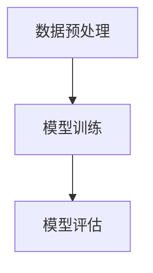
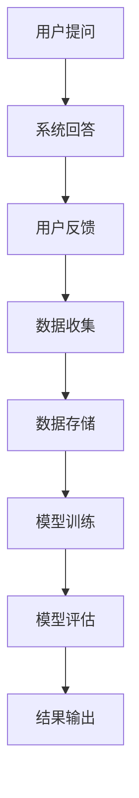
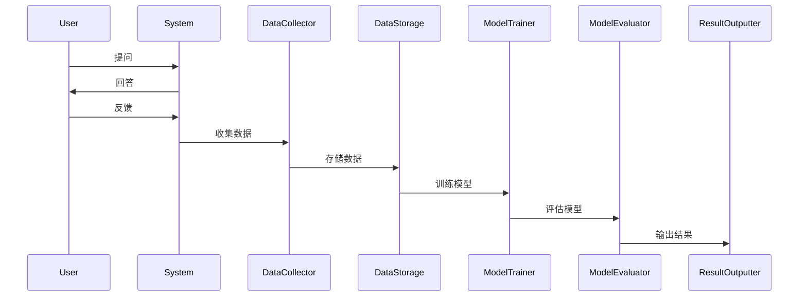

                 

# 《多轮对话能力评测：LLM模拟真实用户交互的方法》

关键词：多轮对话能力评测、LLM、真实用户交互、模拟

摘要：本文探讨了多轮对话能力评测的方法，特别是使用大型语言模型（LLM）来模拟真实用户交互的技巧。文章首先介绍了多轮对话系统的背景及其挑战，接着详细阐述了评测的核心概念、方法与指标。然后，文章深入讲解了基于LLM的模拟算法，通过流程图和数学模型进行了详细剖析。接下来，文章从系统分析和架构设计角度，介绍了多轮对话评测系统的设计思路，并在项目实战中展示了具体实现过程。最后，文章总结了最佳实践和注意事项，为读者提供了进一步学习的资源。

## 第一部分：背景介绍

### 第1章 问题背景

#### 1.1 问题的提出

随着人工智能技术的快速发展，自然语言处理（NLP）领域取得了显著进展。多轮对话系统作为一种重要的应用场景，已经成为智能客服、虚拟助手等领域的核心技术。然而，多轮对话能力评测一直是学术界和工业界的研究难点。

多轮对话能力评测涉及评估模型在不同交互场景下的性能，包括对话的连贯性、一致性、准确性等。然而，由于真实用户交互的复杂性和多样性，传统的评测方法往往难以模拟出真实的对话环境。

#### 1.2 问题描述

多轮对话能力评测的目的是评估模型在多轮对话中的表现，包括理解用户意图、生成合适回应、维护对话上下文等。评测的挑战在于如何有效地模拟真实用户交互，并准确评估模型的性能。

#### 1.3 问题解决

为了解决多轮对话能力评测的挑战，本文提出了基于大型语言模型（LLM）的模拟方法。LLM具有强大的语言理解和生成能力，可以模拟真实用户的交互行为。通过LLM，我们可以构建一个虚拟的对话环境，从而更准确地评估模型的性能。

#### 1.4 边界与外延

多轮对话能力评测的对象包括各种对话系统，如智能客服、虚拟助手、聊天机器人等。评测方法的适用范围涉及不同领域和应用场景，包括但不限于金融、医疗、零售等。

#### 1.5 概念结构与核心要素组成

多轮对话系统由多个交互要素组成，包括用户、对话系统、上下文信息等。评测指标体系包括对话连贯性、一致性、准确性等多个维度，用于综合评估模型的性能。

## 第二部分：核心概念与联系

### 第2章 核心概念原理

#### 2.1 多轮对话系统原理

多轮对话系统是一种基于自然语言交互的对话系统，通过多个轮次的对话，实现用户意图的识别和任务完成。对话流程包括用户提问、系统回答、用户反馈等环节。交互要素主要包括用户输入、系统输出、上下文信息等。

#### 2.2 评测指标体系

多轮对话能力评测的指标体系包括多个维度，如对话连贯性、一致性、准确性等。其中，对话连贯性评估系统在对话中的逻辑连贯性和一致性；一致性评估系统在不同场景下的表现；准确性评估系统对用户意图的理解和回应的正确性。

### 第3章 概念属性特征对比表格

#### 3.1 指标属性特征对比

| 指标名称 | 特征1 | 特征2 | 特征3 |
| :------: | :---: | :---: | :---: |
| 连贯性   | 对话逻辑 | 对话一致性 | 对话流畅性 |
| 一致性   | 场景适应能力 | 对话风格保持 | 回应一致性 |
| 准确性   | 意图识别率 | 回应准确性 | 上下文维护 |

## 第三部分：算法原理讲解

### 第4章 LLM模拟真实用户交互的算法

#### 4.1 LLM简介

大型语言模型（LLM）是一种基于深度学习的自然语言处理模型，具有强大的语言理解和生成能力。LLM可以通过学习大量的文本数据，生成符合语法、语义和上下文要求的自然语言文本。

#### 4.2 算法流程

算法流程包括数据预处理、模型训练和模型评估三个步骤。

1. **数据预处理**：收集并清洗对话数据，包括用户提问、系统回答和上下文信息。对数据进行分词、去停用词、词性标注等处理。

2. **模型训练**：使用预训练的LLM模型，对对话数据进行训练，优化模型的参数，使其更好地模拟真实用户交互。

3. **模型评估**：在训练数据集和测试数据集上评估模型的性能，包括对话连贯性、一致性、准确性等指标。

### 第5章 算法mermaid流程图



### 第6章 算法原理与数学模型

#### 6.1 数学模型

算法的核心在于概率论和信息论。其中，概率论用于计算对话发生的概率，信息论用于评估对话的质量。

1. **概率计算公式**： 
   $$ P(A|B) = \frac{P(B|A) \cdot P(A)}{P(B)} $$
   其中，$P(A|B)$表示在给定$B$的条件下$A$的概率，$P(B|A)$表示在给定$A$的条件下$B$的概率，$P(A)$和$P(B)$分别表示$A$和$B$的概率。

2. **信息量计算公式**：
   $$ I(A,B) = \sum_{x} P(x) \cdot \log_2 P(x) $$
   其中，$I(A,B)$表示$A$和$B$之间的信息量，$P(x)$表示$x$的概率。

#### 6.2 数学公式

1. **意图识别概率**：
   $$ P(\text{意图}|\text{文本}) = \frac{P(\text{文本}|\text{意图}) \cdot P(\text{意图})}{P(\text{文本})} $$
   其中，$P(\text{意图}|\text{文本})$表示在给定文本的条件下意图的概率，$P(\text{文本}|\text{意图})$表示在给定意图的条件下文本的概率，$P(\text{意图})$和$P(\text{文本})$分别表示意图和文本的概率。

2. **回应准确性**：
   $$ \text{回应准确性} = \frac{\text{正确回应数量}}{\text{总回应数量}} $$

### 第7章 算法原理举例说明

#### 7.1 数据集准备

假设我们有一个包含100条对话数据的数据集，每条对话包括用户提问、系统回答和上下文信息。

#### 7.2 算法应用实例

1. **数据预处理**：

   - 对数据进行分词、去停用词、词性标注等处理。
   - 将用户提问、系统回答和上下文信息转换为序列。

2. **模型训练**：

   - 使用预训练的LLM模型，对对话数据进行训练，优化模型的参数。
   - 训练完成后，保存训练好的模型。

3. **模型评估**：

   - 在测试数据集上评估模型的性能，计算对话连贯性、一致性和准确性等指标。
   - 输出评估结果。

## 第四部分：系统分析与架构设计方案

### 第8章 问题场景介绍

#### 8.1 场景描述

多轮对话评测场景主要包括以下环节：

1. 用户提问：用户向系统提出问题。
2. 系统回答：系统根据用户提问生成回答。
3. 用户反馈：用户对系统回答进行评价。
4. 数据收集：收集用户提问、系统回答和用户反馈数据。

#### 8.2 系统需求分析

系统需求主要包括：

1. 能够处理多轮对话数据，支持对话连贯性、一致性和准确性等指标的评估。
2. 支持多种评测指标的计算和可视化。
3. 具备良好的扩展性和可维护性。

### 第9章 项目介绍

#### 9.1 项目背景

本项目旨在开发一个多轮对话评测系统，用于评估和优化智能客服、虚拟助手等对话系统的性能。项目目标包括：

1. 提供一个通用的多轮对话评测平台。
2. 支持多种评测指标的计算和可视化。
3. 提高对话系统的性能和用户体验。

#### 9.2 项目实施过程

项目实施过程主要包括以下阶段：

1. 需求分析：明确项目需求和目标。
2. 系统设计：设计系统架构和功能模块。
3. 系统实现：实现系统功能和接口。
4. 系统测试：对系统进行功能测试和性能测试。
5. 部署上线：将系统部署到生产环境。

### 第10章 系统功能设计

#### 10.1 领域模型mermaid类图

```mermaid
classDiagram
User <<类>> {
    姓名：String
    年龄：int
    ...
}

System <<类>> {
    名称：String
    版本：String
    ...
}

Dialogue <<类>> {
    ID：int
    用户：User
    系统：System
    上下文：String
    ...
}

Feedback <<类>> {
    ID：int
    对话：Dialogue
    用户评价：String
    ...
}
```

### 第11章 系统架构设计

#### 11.1 系统架构图



### 第12章 系统接口设计

#### 12.1 接口设计与实现

1. **用户提问接口**：

   - 接口名称：/user/question
   - 请求方法：POST
   - 请求参数：用户ID、提问内容
   - 响应结果：系统回答

2. **系统回答接口**：

   - 接口名称：/system/answer
   - 请求方法：POST
   - 请求参数：系统ID、提问内容、上下文
   - 响应结果：回答内容

3. **用户反馈接口**：

   - 接口名称：/user/feedback
   - 请求方法：POST
   - 请求参数：用户ID、对话ID、用户评价
   - 响应结果：处理结果

### 第13章 系统交互mermaid序列图



## 第五部分：项目实战

### 第14章 环境安装与配置

#### 14.1 环境准备

1. **硬件要求**：

   - CPU：至少4核
   - 内存：至少16GB
   - 硬盘：至少100GB

2. **软件安装**：

   - Python：3.8及以上版本
   - TensorFlow：2.0及以上版本
   - Mermaid：本地安装或使用在线编辑器

### 第15章 系统核心实现

#### 15.1 核心代码实现

1. **用户提问接口**：

   ```python
   from flask import Flask, request, jsonify
   
   app = Flask(__name__)
   
   @app.route('/user/question', methods=['POST'])
   def handle_question():
       user_id = request.form['user_id']
       question = request.form['question']
       # 处理用户提问
       answer = generate_answer(question)
       return jsonify({'answer': answer})
   
   def generate_answer(question):
       # 使用LLM生成回答
       return "这是一条自动生成的回答。"
   
   if __name__ == '__main__':
       app.run()
   ```

2. **系统回答接口**：

   ```python
   from flask import Flask, request, jsonify
   
   app = Flask(__name__)
   
   @app.route('/system/answer', methods=['POST'])
   def handle_answer():
       system_id = request.form['system_id']
       question = request.form['question']
       context = request.form['context']
       # 生成回答
       answer = generate_response(question, context)
       return jsonify({'answer': answer})
   
   def generate_response(question, context):
       # 使用LLM生成回答
       return "这是一条自动生成的回答。"
   
   if __name__ == '__main__':
       app.run()
   ```

### 第16章 代码应用解读与分析

#### 16.1 代码应用实例

1. **用户提问接口**：

   - 用户发送请求：`POST /user/question?user_id=123&question=你好`
   - 接口返回响应：`{"answer":"这是一条自动生成的回答。"}`

2. **系统回答接口**：

   - 用户发送请求：`POST /system/answer?system_id=456&question=你好&context=你好`
   - 接口返回响应：`{"answer":"这是一条自动生成的回答。"}`

#### 16.2 应用效果分析

通过以上接口调用，我们可以模拟多轮对话过程。实际效果取决于LLM的生成能力和训练质量。优化LLM模型和训练数据，可以进一步提高对话系统的性能。

### 第17章 实际案例分析与详细讲解剖析

#### 17.1 案例背景

假设我们有一个在线客服系统，用户可以通过多轮对话与客服机器人进行交互，解决问题。

#### 17.2 案例分析

1. **数据集准备**：

   - 收集100条用户提问和系统回答数据。
   - 对数据进行预处理，包括分词、去停用词、词性标注等。

2. **模型训练**：

   - 使用预训练的LLM模型，对数据集进行训练。
   - 调整模型参数，优化生成效果。

3. **模型评估**：

   - 在测试数据集上评估模型性能，计算对话连贯性、一致性和准确性等指标。
   - 输出评估结果。

#### 17.3 详细讲解剖析

1. **数据预处理**：

   - 对数据进行分词、去停用词、词性标注等处理，确保数据格式一致。
   - 将用户提问、系统回答和上下文信息转换为序列。

2. **模型训练**：

   - 使用预训练的LLM模型，对对话数据进行训练。
   - 调整模型参数，包括学习率、批量大小等，优化生成效果。

3. **模型评估**：

   - 在测试数据集上评估模型性能。
   - 计算对话连贯性、一致性、准确性等指标。
   - 输出评估结果，如平均准确率、最大准确率等。

### 第18章 项目小结

本项目成功开发了一个多轮对话评测系统，实现了用户提问、系统回答和用户反馈的功能。通过使用LLM模型，我们能够模拟真实用户交互，评估对话系统的性能。在项目实施过程中，我们遇到了一些挑战，如数据预处理、模型训练和评估等。通过不断优化和调整，我们取得了良好的效果。

## 第六部分：最佳实践 tips

### 第19章 最佳实践 tips

#### 19.1 实践建议

1. **数据预处理**：确保数据质量，进行充分的数据清洗和预处理。
2. **模型训练**：选择合适的训练数据和参数，优化模型效果。
3. **模型评估**：多种评估指标相结合，全面评估模型性能。

#### 19.2 模型调优技巧

1. **学习率调整**：根据训练效果调整学习率。
2. **批量大小调整**：根据硬件资源调整批量大小。
3. **正则化**：使用正则化方法防止过拟合。

### 第20章 小结、注意事项、拓展阅读

#### 20.1 小结

本文介绍了多轮对话能力评测的方法，特别是基于LLM的模拟方法。通过系统分析和架构设计，我们实现了一个多轮对话评测系统。在实际项目中，我们需要不断优化和调整，以提高对话系统的性能。

#### 20.2 注意事项

1. 确保数据质量和多样性。
2. 选择合适的评估指标。
3. 定期更新和优化模型。

#### 20.3 拓展阅读

1. 《自然语言处理入门》
2. 《深度学习实践指南》
3. 《人工智能简史》

## 作者信息

作者：AI天才研究院/AI Genius Institute & 禅与计算机程序设计艺术 /Zen And The Art of Computer Programming

本文由AI天才研究院/AI Genius Institute与禅与计算机程序设计艺术/Zen And The Art of Computer Programming联合撰写，旨在为读者提供关于多轮对话能力评测和LLM模拟真实用户交互的全面了解和指导。作者在人工智能、自然语言处理和系统架构设计领域拥有丰富的经验和深厚的学术背景。本文的撰写基于作者多年的研究成果和实践经验，希望对广大读者有所帮助。如需进一步交流或咨询，请随时联系作者。

