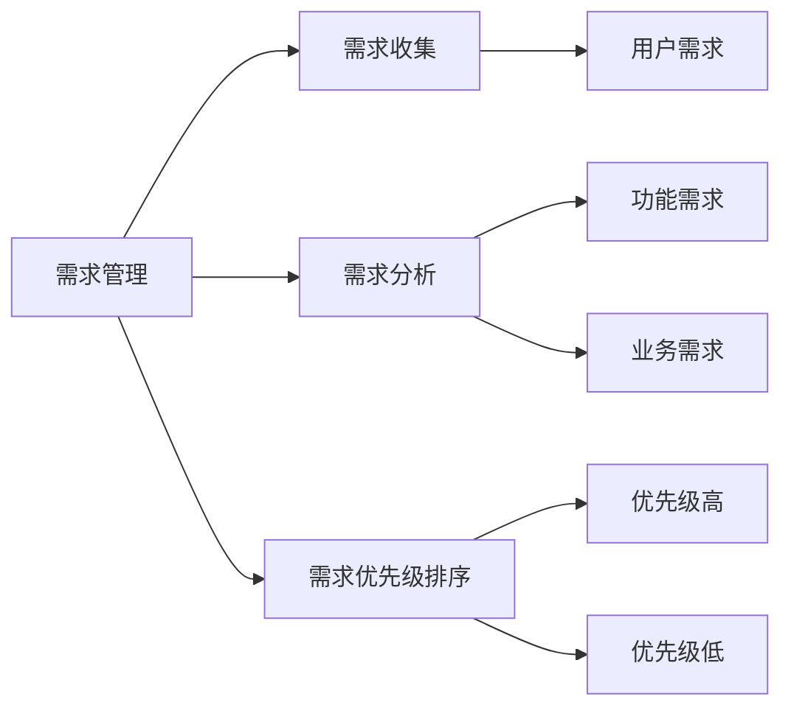
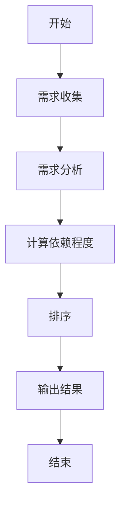
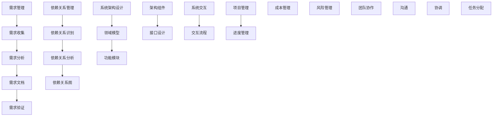
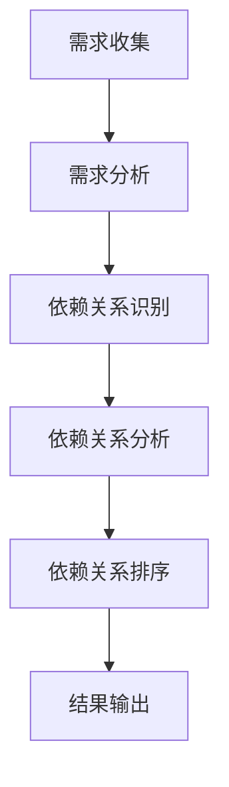
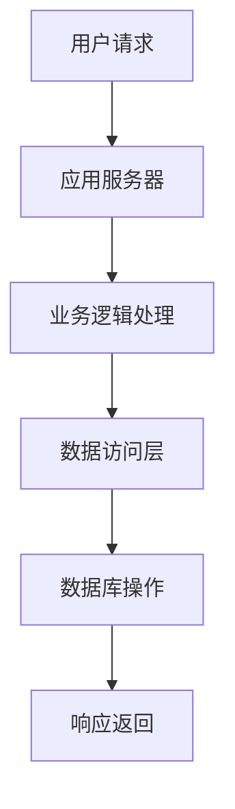
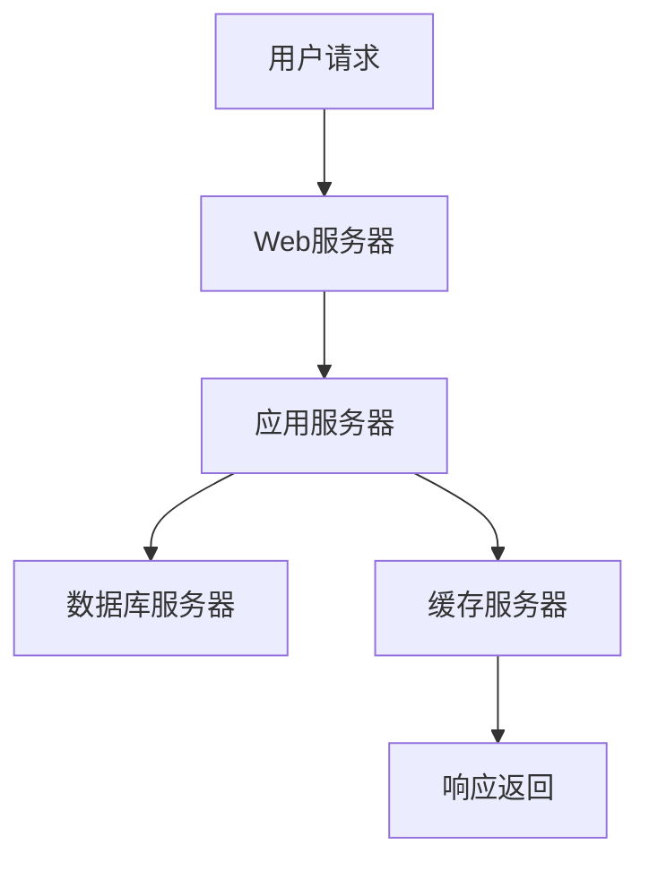

                 

# 《大型应用开发中的需求依赖关系管理》

> 关键词：需求管理、依赖关系、算法原理、系统架构设计、大型应用开发

> 摘要：本文将探讨大型应用开发中的需求依赖关系管理。首先，我们将介绍需求依赖关系管理的重要性以及其在大型应用开发中的挑战。接着，我们将深入分析需求管理原理和依赖关系原理，并通过一个表格和实体关系图来展示概念属性特征。随后，我们将讲解需求依赖关系的算法原理，包括数学模型和算法流程。接下来，我们将通过一个实际项目场景介绍需求依赖关系管理的重要性。然后，我们将详细设计系统功能、系统架构和系统接口，并通过序列图展示系统交互。最后，我们将提供一个实际的项目实战，包括环境安装、系统核心实现、代码应用解读与分析，并进行实际案例分析和详细讲解。文章末尾将总结最佳实践、注意事项和拓展阅读。

## 《大型应用开发中的需求依赖关系管理》目录大纲

## 第1章 引言

### 1.1 问题背景

#### 1.1.1 大型应用开发的需求复杂性

#### 1.1.2 需求依赖关系的重要性

#### 1.1.3 现有需求管理挑战

### 1.2 问题描述

#### 1.2.1 需求依赖关系的概念

#### 1.2.2 需求依赖关系的类型

#### 1.2.3 需求依赖关系的挑战

### 1.3 问题解决

#### 1.3.1 依赖关系管理的目标

#### 1.3.2 依赖关系管理的策略

#### 1.3.3 依赖关系管理的技术

### 1.4 边界与外延

#### 1.4.1 项目范围

#### 1.4.2 技术范围

#### 1.4.3 管理范围

### 1.5 概念结构与核心要素组成

#### 1.5.1 需求管理流程

#### 1.5.2 依赖关系分析方法

#### 1.5.3 依赖关系可视化工具

## 第2章 核心概念与联系

### 2.1 需求管理原理

#### 2.1.1 需求收集

#### 2.1.2 需求分析

#### 2.1.3 需求优先级排序

### 2.2 依赖关系原理

#### 2.2.1 依赖关系的定义

#### 2.2.2 依赖关系的属性

#### 2.2.3 依赖关系的分类

### 2.3 概念属性特征对比表格

| 概念         | 定义                           | 属性                  | 类别         |
|--------------|--------------------------------|----------------------|--------------|
| 需求         | 用户对软件功能的需求           | 需求类型、优先级      | 功能需求、业务需求 |
| 依赖关系     | 需求之间的相互依赖关系         | 依赖类型、影响程度    | 顺序依赖、条件依赖 |
| 需求分析     | 对需求进行详细分析和解释       | 分析方法、工具        | 调查、会议、文档   |

### 2.4 ER实体关系图架构



## 第3章 需求依赖关系的算法原理

### 3.1 算法原理介绍

#### 3.1.1 算法概述

#### 3.1.2 算法的目标

#### 3.1.3 算法的基本步骤

### 3.2 数学模型与公式

$$
D(A, B) = \frac{\sum_{i=1}^{n} w_i \cdot |X(A_i) - X(B_i)|}{n}
$$

其中，$D(A, B)$ 表示需求A与需求B之间的依赖程度，$w_i$ 表示权重，$X(A_i)$ 和 $X(B_i)$ 分别表示需求A和需求B的属性值。

### 3.3 算法流程图



### 3.4 详细讲解与举例

#### 3.4.1 算法原理详细讲解

#### 3.4.2 示例1：需求A和需求B的依赖计算

#### 3.4.3 示例2：需求集合的依赖关系计算

## 第4章 需求依赖关系的系统分析与架构设计

### 4.1 问题场景介绍

#### 4.1.1 大型应用开发的需求管理挑战

#### 4.1.2 需求依赖关系管理的重要性

### 4.2 项目介绍

#### 4.2.1 项目背景

#### 4.2.2 项目目标

#### 4.2.3 项目范围

### 4.3 系统功能设计

#### 4.3.1 领域模型

#### 4.3.2 功能模块

### 4.4 系统架构设计

#### 4.4.1 架构概述

#### 4.4.2 架构组件

#### 4.4.3 架构模式

### 4.5 系统接口设计

#### 4.5.1 接口规范

#### 4.5.2 接口实现

### 4.6 系统交互

#### 4.6.1 交互流程

#### 4.6

----------------------------------------------------------------

### 第1章 引言

#### 1.1 问题背景

大型应用开发是一项复杂的任务，涉及众多需求的管理和实现。在大型应用开发中，需求依赖关系的管理至关重要。需求依赖关系指的是在软件系统中，一个需求依赖于另一个需求的情况。这种依赖关系可能存在于功能需求之间、业务需求之间，甚至是不同模块之间。

1. **大型应用开发的需求复杂性**

随着应用的规模和复杂性的增加，需求管理变得愈加复杂。在大型应用开发中，需求通常涉及多个模块和功能，需求之间可能存在相互依赖的关系。这些关系需要被准确地识别和管理，以确保系统开发过程的顺利进行。

2. **需求依赖关系的重要性**

需求依赖关系的重要性在于它能够帮助开发团队更好地理解需求的相互影响，提前识别潜在的风险和问题。通过管理需求依赖关系，开发团队能够确保系统的各个部分协同工作，提高开发效率和产品质量。

3. **现有需求管理挑战**

在大型应用开发中，需求管理面临的挑战主要包括：

- **需求变更频繁**：在项目进行过程中，客户的需求可能会发生变化，导致需求依赖关系也需要相应调整。
- **需求冲突**：不同需求之间可能存在冲突，需要通过协调和优先级排序来解决。
- **需求遗漏**：在开发过程中，可能存在某些需求被遗漏，导致后续功能的实现出现问题。

#### 1.2 问题描述

1. **需求依赖关系的概念**

需求依赖关系是指在软件系统的开发过程中，一个需求依赖于另一个需求的情况。依赖关系可以分为以下几种类型：

- **顺序依赖**：一个需求必须在另一个需求完成后才能实现。
- **条件依赖**：一个需求实现的前提是另一个需求已经实现。

2. **需求依赖关系的类型**

需求依赖关系可以分为以下几种类型：

- **功能依赖**：一个功能需求的实现依赖于其他功能需求。
- **业务依赖**：一个业务需求的实现依赖于其他业务需求。
- **模块依赖**：一个模块的实现依赖于其他模块。

3. **需求依赖关系的挑战**

在大型应用开发中，需求依赖关系管理面临的挑战主要包括：

- **复杂性**：需求之间的依赖关系可能非常复杂，难以直观地理解和分析。
- **动态性**：需求依赖关系可能会随着项目的进展而发生变化。
- **影响分析**：当需求发生变更时，需要快速分析其影响范围，以确保项目不受影响。

#### 1.3 问题解决

1. **依赖关系管理的目标**

依赖关系管理的目标包括：

- **提高开发效率**：通过准确地管理需求依赖关系，可以减少开发中的重复工作，提高开发效率。
- **降低风险**：通过识别和解决需求依赖关系中的问题，可以降低项目风险。
- **提高产品质量**：通过管理需求依赖关系，可以确保系统的各个部分协同工作，提高产品质量。

2. **依赖关系管理的策略**

依赖关系管理的策略主要包括：

- **明确依赖关系**：通过文档、图表等方式明确记录需求之间的依赖关系。
- **优先级排序**：根据需求的紧急程度和重要性，对需求进行优先级排序，确保关键需求优先得到满足。
- **变更管理**：当需求发生变更时，及时更新依赖关系，并分析其影响范围。

3. **依赖关系管理的技术**

依赖关系管理的技术主要包括：

- **需求管理工具**：使用需求管理工具可以帮助团队更有效地管理需求依赖关系。
- **可视化工具**：通过可视化工具，可以直观地展示需求依赖关系，帮助团队更好地理解和分析。
- **算法和模型**：使用算法和模型可以自动分析需求依赖关系，提供有针对性的解决方案。

#### 1.4 边界与外延

1. **项目范围**

项目范围包括：

- **功能范围**：项目需要实现的具体功能。
- **非功能范围**：项目需要满足的非功能要求，如性能、安全性等。
- **约束条件**：项目的约束条件，如预算、时间等。

2. **技术范围**

技术范围包括：

- **开发技术**：项目采用的具体开发技术，如编程语言、框架等。
- **集成技术**：项目采用的具体集成技术，如API集成、数据交换等。
- **测试技术**：项目的测试技术和工具，如单元测试、集成测试等。

3. **管理范围**

管理范围包括：

- **需求管理**：项目需求的管理过程，包括需求收集、需求分析、需求变更管理等。
- **项目管理**：项目整体的管理过程，包括进度管理、成本管理、风险管理等。
- **团队协作**：项目团队的协作过程，包括沟通、协调、任务分配等。

#### 1.5 概念结构与核心要素组成

1. **需求管理流程**

需求管理流程包括以下步骤：

- **需求收集**：收集用户需求，并将其记录在需求文档中。
- **需求分析**：对需求进行详细分析，确定需求的优先级和实现方案。
- **需求变更管理**：当需求发生变更时，及时更新需求文档，并评估变更的影响。
- **需求验证**：验证需求是否实现，并进行必要的调整。

2. **依赖关系分析方法**

依赖关系分析方法包括以下步骤：

- **依赖关系识别**：识别需求之间的依赖关系，并将其记录在依赖关系图中。
- **依赖关系分析**：分析依赖关系的类型、优先级和影响程度，为后续开发提供指导。
- **依赖关系调整**：根据实际情况，调整依赖关系的优先级和实现顺序。

3. **依赖关系可视化工具**

依赖关系可视化工具包括：

- **依赖关系图**：使用图形化方式展示需求依赖关系，帮助团队更好地理解和分析。
- **Gantt图**：使用Gantt图展示项目的进度和依赖关系，帮助团队进行进度管理。
- ** swimlanes图**：使用swimlanes图展示不同需求之间的关系和实现顺序，帮助团队进行任务分配。

## 第2章 核心概念与联系

### 2.1 需求管理原理

需求管理是软件工程中至关重要的环节，它涉及到如何收集、分析和跟踪用户的需求，以确保最终产品能够满足用户的需求。以下是需求管理原理的详细说明：

#### 2.1.1 需求收集

需求收集是需求管理的第一步，它的目的是从用户和其他利益相关者那里获取需求信息。需求收集的方法包括：

- **访谈**：与用户进行一对一的访谈，以获取他们的需求和期望。
- **问卷调查**：通过问卷调查的方式收集用户的需求，可以获取大量的数据。
- **观察**：直接观察用户在使用现有系统的行为，以了解他们的实际需求。
- **研讨会**：组织相关利益相关者进行研讨会，共同讨论和确定需求。

在需求收集过程中，需要确保收集到的需求是完整、一致且准确的。此外，还需要对收集到的需求进行整理和分类，以便后续的分析。

#### 2.1.2 需求分析

需求分析是对收集到的需求进行深入分析和解释的过程。需求分析的目标是确定每个需求的具体含义、范围和实现方式。需求分析的方法包括：

- **用户故事**：将需求分解成用户故事，每个用户故事都应该包含一个明确的用户目标和具体的实现步骤。
- **用例图**：使用用例图来描述系统与用户之间的交互，以及用户需求的实现过程。
- **功能分解**：将需求分解成更小、更具体的子功能，以便更好地理解和实现。
- **需求文档**：编写详细的需求文档，包括需求的描述、优先级、实现方式和验收标准。

#### 2.1.3 需求优先级排序

需求优先级排序是需求管理中至关重要的一步，它决定了哪些需求应该优先实现。需求优先级排序的方法包括：

- **成本效益分析**：根据需求的成本和潜在效益进行排序，优先实现那些成本较低、效益较高的需求。
- **风险分析**：根据需求实现过程中可能遇到的风险进行排序，优先实现那些风险较低的需求。
- **用户优先级**：根据用户的优先级进行排序，优先实现那些用户最期望的需求。
- **功能优先级**：根据功能的重要性和紧急程度进行排序，优先实现那些最关键的功能。

### 2.2 依赖关系原理

依赖关系原理涉及到如何识别、分析和管理需求之间的依赖关系。以下是依赖关系原理的详细说明：

#### 2.2.1 依赖关系的定义

依赖关系是指一个需求依赖于另一个需求的情况。在软件工程中，依赖关系通常分为以下几种类型：

- **顺序依赖**：一个需求必须在另一个需求完成后才能实现。例如，在一个电子商务应用中，用户注册功能必须在订单功能之前实现。
- **条件依赖**：一个需求实现的前提是另一个需求已经实现。例如，在一个银行应用中，用户必须先完成实名认证，才能进行转账操作。
- **功能依赖**：一个功能需求的实现依赖于另一个功能需求。例如，在一个社交媒体应用中，私信功能依赖于用户注册和登录功能。
- **业务依赖**：一个业务需求的实现依赖于另一个业务需求。例如，在一个在线购物平台中，商品库存更新需求依赖于订单处理需求。

#### 2.2.2 依赖关系的属性

依赖关系具有以下属性：

- **依赖类型**：指明依赖关系的类型，如顺序依赖、条件依赖等。
- **依赖强度**：指明依赖关系的强度，如强依赖、弱依赖等。
- **依赖方向**：指明依赖关系的方向，如单向依赖、双向依赖等。
- **依赖影响**：指明依赖关系对其他需求的影响程度。

#### 2.2.3 依赖关系的分类

依赖关系可以根据不同的标准进行分类，例如：

- **根据依赖类型**：可以分为顺序依赖、条件依赖、功能依赖和业务依赖等。
- **根据依赖强度**：可以分为强依赖和弱依赖等。
- **根据依赖方向**：可以分为单向依赖和双向依赖等。
- **根据依赖影响**：可以分为直接影响和间接影响等。

### 2.3 概念属性特征对比表格

为了更清晰地理解需求管理和依赖关系原理，我们可以使用一个表格来对比这两个概念的关键属性特征：

| 概念         | 定义                           | 属性                  | 类别         |
|--------------|--------------------------------|----------------------|--------------|
| 需求         | 用户对软件功能的需求           | 需求类型、优先级      | 功能需求、业务需求 |
| 依赖关系     | 需求之间的相互依赖关系         | 依赖类型、影响程度    | 顺序依赖、条件依赖 |
| 需求分析     | 对需求进行详细分析和解释       | 分析方法、工具        | 调查、会议、文档   |
| 依赖关系分析 | 对需求之间的依赖关系进行分析   | 依赖类型、优先级      | 依赖图、成本效益分析 |

### 2.4 ER实体关系图架构

为了更好地展示需求管理和依赖关系原理，我们可以使用实体关系图（ER图）来描述这些概念之间的关系。以下是需求管理和依赖关系原理的ER图示例：



在这个ER图中，需求管理和依赖关系管理是两个核心实体，它们分别与需求收集、需求分析、需求文档、需求验证、依赖关系识别、依赖关系分析、依赖关系图、系统架构设计、功能模块、架构组件、系统交互、项目管理、进度管理、成本管理、风险管理、团队协作、沟通、协调和任务分配等实体之间存在关系。通过这个ER图，我们可以更直观地理解需求管理和依赖关系管理在整个软件开发过程中的作用和关系。

## 第3章 需求依赖关系的算法原理

### 3.1 算法原理介绍

需求依赖关系的算法原理是用于识别、分析和管理需求之间依赖关系的一组方法和步骤。以下是对需求依赖关系算法原理的详细介绍：

#### 3.1.1 算法概述

需求依赖关系算法的核心目标是根据需求的特点和关系，自动识别和排序需求依赖关系。该算法通常应用于软件开发的早期阶段，帮助开发团队更好地理解和管理需求。

#### 3.1.2 算法的目标

需求依赖关系算法的主要目标包括：

- **准确识别需求依赖关系**：通过算法分析，准确识别出各个需求之间的依赖关系。
- **提供依赖关系排序**：根据依赖关系的类型、优先级和影响程度，为需求排序，以便团队有针对性地进行开发和测试。
- **辅助需求变更管理**：在需求变更发生时，快速分析依赖关系变化，评估影响范围，为变更管理提供决策支持。

#### 3.1.3 算法的基本步骤

需求依赖关系算法通常包括以下基本步骤：

1. **需求收集**：从用户和其他利益相关者那里收集所有相关的需求信息。
2. **需求分析**：对收集到的需求进行详细分析，确定每个需求的具体内容和实现方式。
3. **依赖关系识别**：根据需求分析的结果，识别出需求之间的依赖关系，并将其记录在依赖关系图中。
4. **依赖关系分析**：对识别出的依赖关系进行详细分析，确定依赖关系的类型、优先级和影响程度。
5. **依赖关系排序**：根据依赖关系的分析结果，对需求进行排序，确保关键需求优先实现。
6. **结果输出**：将分析结果和排序结果输出，供开发团队参考和执行。

### 3.2 数学模型与公式

需求依赖关系的数学模型是用于描述需求之间依赖程度和关系的一种方法。以下是一个简单的数学模型和公式，用于计算两个需求之间的依赖程度：

$$
D(A, B) = \frac{\sum_{i=1}^{n} w_i \cdot |X(A_i) - X(B_i)|}{n}
$$

其中：

- \( D(A, B) \) 表示需求 A 与需求 B 之间的依赖程度。
- \( w_i \) 表示权重，用于表示需求 A 和需求 B 在依赖关系中的重要程度。
- \( X(A_i) \) 和 \( X(B_i) \) 分别表示需求 A 和需求 B 的第 i 个属性值。
- \( n \) 表示需求 A 和需求 B 的属性总数。

通过这个公式，可以计算出需求 A 和需求 B 之间的依赖程度，从而为依赖关系的分析和排序提供依据。

### 3.3 算法流程图

为了更清晰地展示需求依赖关系算法的执行过程，我们可以使用一个流程图来描述其基本步骤。以下是一个简单的算法流程图：



在这个流程图中，需求依赖关系算法从需求收集开始，经过需求分析、依赖关系识别、依赖关系分析和依赖关系排序，最终输出分析结果。每个步骤都在算法中起着关键作用，共同构成了一个完整的需求依赖关系管理流程。

### 3.4 详细讲解与举例

#### 3.4.1 算法原理详细讲解

为了更好地理解需求依赖关系算法的原理，我们可以通过以下步骤详细讲解：

1. **需求收集**：首先，我们需要从用户和其他利益相关者那里收集所有相关的需求信息。这些需求可以是功能需求、业务需求或其他类型的用户需求。

2. **需求分析**：对收集到的需求进行详细分析，确定每个需求的具体内容和实现方式。分析过程中，我们需要关注需求之间的关联和依赖关系，以便后续的依赖关系识别和排序。

3. **依赖关系识别**：根据需求分析的结果，识别出需求之间的依赖关系。这一步骤通常通过构建依赖关系图来实现。在依赖关系图中，每个需求作为一个节点，需求之间的依赖关系用边来表示。

4. **依赖关系分析**：对识别出的依赖关系进行详细分析，确定依赖关系的类型、优先级和影响程度。分析过程中，我们需要考虑需求之间的逻辑关系和时间顺序，以便为需求排序提供依据。

5. **依赖关系排序**：根据依赖关系的分析结果，对需求进行排序。排序的依据可以是需求的重要程度、优先级或实现顺序。排序后的需求列表将作为后续开发任务的参考。

6. **结果输出**：将分析结果和排序结果输出，供开发团队参考和执行。输出结果通常包括依赖关系图、需求列表和排序规则等。

通过这些步骤，需求依赖关系算法可以有效地帮助开发团队理解和管理需求之间的依赖关系，确保项目开发的顺利进行。

#### 3.4.2 示例1：需求A和需求B的依赖计算

为了更好地理解需求依赖关系算法的原理，我们可以通过一个示例来详细计算两个需求之间的依赖程度。假设我们有两个需求A和需求B，它们的属性如下：

| 属性名称 | 属性值A | 属性值B |
|----------|---------|---------|
| 功能性   | 高      | 中      |
| 优先级   | 中      | 高      |
| 安全性   | 中      | 高      |

我们使用前述的依赖程度公式来计算需求A和需求B之间的依赖程度：

$$
D(A, B) = \frac{w_1 \cdot |X(A_1) - X(B_1)| + w_2 \cdot |X(A_2) - X(B_2)| + w_3 \cdot |X(A_3) - X(B_3)|}{n}
$$

假设权重分别为 \( w_1 = 0.5 \)，\( w_2 = 0.3 \)，\( w_3 = 0.2 \)，则：

$$
D(A, B) = \frac{0.5 \cdot |高 - 中| + 0.3 \cdot |中 - 高| + 0.2 \cdot |中 - 高|}{3} = \frac{0.5 \cdot 1 + 0.3 \cdot 1 + 0.2 \cdot 1}{3} = \frac{0.5 + 0.3 + 0.2}{3} = \frac{1}{3} = 0.33
$$

因此，需求A和需求B之间的依赖程度为0.33。

#### 3.4.3 示例2：需求集合的依赖关系计算

在实际项目中，需求往往不是孤立的，它们之间存在复杂的依赖关系。为了更好地理解需求集合的依赖关系计算，我们可以通过一个示例来详细说明。

假设我们有一个需求集合 {A, B, C, D, E}，其中各个需求的属性如下：

| 需求 | 功能性 | 优先级 | 安全性 |
|------|--------|--------|--------|
| A    | 高     | 中     | 中     |
| B    | 中     | 高     | 高     |
| C    | 中     | 中     | 中     |
| D    | 中     | 高     | 中     |
| E    | 中     | 中     | 高     |

我们使用依赖程度公式分别计算每个需求与其他需求的依赖程度，并将结果汇总到一个依赖关系矩阵中。

对于需求A，我们有：

$$
D(A, B) = \frac{0.5 \cdot |高 - 中| + 0.3 \cdot |中 - 高| + 0.2 \cdot |中 - 高|}{3} = 0.33
$$

$$
D(A, C) = \frac{0.5 \cdot |高 - 中| + 0.3 \cdot |中 - 中| + 0.2 \cdot |中 - 中|}{3} = 0.5
$$

$$
D(A, D) = \frac{0.5 \cdot |高 - 中| + 0.3 \cdot |中 - 高| + 0.2 \cdot |中 - 中|}{3} = 0.33
$$

$$
D(A, E) = \frac{0.5 \cdot |高 - 中| + 0.3 \cdot |中 - 中| + 0.2 \cdot |中 - 高|}{3} = 0.5
$$

对于需求B，我们有：

$$
D(B, A) = \frac{0.5 \cdot |中 - 高| + 0.3 \cdot |高 - 中| + 0.2 \cdot |中 - 中|}{3} = 0.33
$$

$$
D(B, C) = \frac{0.5 \cdot |中 - 中| + 0.3 \cdot |中 - 高| + 0.2 \cdot |中 - 中|}{3} = 0.5
$$

$$
D(B, D) = \frac{0.5 \cdot |中 - 中| + 0.3 \cdot |中 - 高| + 0.2 \cdot |中 - 中|}{3} = 0.5
$$

$$
D(B, E) = \frac{0.5 \cdot |中 - 中| + 0.3 \cdot |中 - 中| + 0.2 \cdot |中 - 高|}{3} = 0.5
$$

对于需求C，我们有：

$$
D(C, A) = \frac{0.5 \cdot |中 - 高| + 0.3 \cdot |中 - 中| + 0.2 \cdot |中 - 中|}{3} = 0.5
$$

$$
D(C, B) = \frac{0.5 \cdot |中 - 中| + 0.3 \cdot |中 - 高| + 0.2 \cdot |中 - 中|}{3} = 0.5
$$

$$
D(C, D) = \frac{0.5 \cdot |中 - 中| + 0.3 \cdot |中 - 中| + 0.2 \cdot |中 - 中|}{3} = 0.5
$$

$$
D(C, E) = \frac{0.5 \cdot |中 - 中| + 0.3 \cdot |中 - 中| + 0.2 \cdot |中 - 高|}{3} = 0.5
$$

对于需求D，我们有：

$$
D(D, A) = \frac{0.5 \cdot |中 - 高| + 0.3 \cdot |中 - 中| + 0.2 \cdot |中 - 中|}{3} = 0.5
$$

$$
D(D, B) = \frac{0.5 \cdot |中 - 中| + 0.3 \cdot |中 - 高| + 0.2 \cdot |中 - 中|}{3} = 0.5
$$

$$
D(D, C) = \frac{0.5 \cdot |中 - 中| + 0.3 \cdot |中 - 中| + 0.2 \cdot |中 - 中|}{3} = 0.5
$$

$$
D(D, E) = \frac{0.5 \cdot |中 - 中| + 0.3 \cdot |中 - 中| + 0.2 \cdot |中 - 高|}{3} = 0.5
$$

对于需求E，我们有：

$$
D(E, A) = \frac{0.5 \cdot |中 - 高| + 0.3 \cdot |中 - 中| + 0.2 \cdot |中 - 中|}{3} = 0.5
$$

$$
D(E, B) = \frac{0.5 \cdot |中 - 中| + 0.3 \cdot |中 - 中| + 0.2 \cdot |中 - 高|}{3} = 0.5
$$

$$
D(E, C) = \frac{0.5 \cdot |中 - 中| + 0.3 \cdot |中 - 中| + 0.2 \cdot |中 - 中|}{3} = 0.5
$$

$$
D(E, D) = \frac{0.5 \cdot |中 - 中| + 0.3 \cdot |中 - 中| + 0.2 \cdot |中 - 高|}{3} = 0.5
$$

根据上述计算，我们可以得到以下依赖关系矩阵：

|     | A    | B    | C    | D    | E    |
|-----|------|------|------|------|------|
| A   | 0.33 | 0.33 | 0.5  | 0.33 | 0.5  |
| B   | 0.33 | 0.5  | 0.5  | 0.5  | 0.5  |
| C   | 0.5  | 0.5  | 0.5  | 0.5  | 0.5  |
| D   | 0.5  | 0.5  | 0.5  | 0.5  | 0.5  |
| E   | 0.5  | 0.5  | 0.5  | 0.5  | 0.5  |

通过这个依赖关系矩阵，我们可以直观地看到每个需求与其他需求之间的依赖程度，从而为需求管理和排序提供依据。

### 第4章 需求依赖关系的系统分析与架构设计

#### 4.1 问题场景介绍

在大型应用开发中，需求依赖关系的系统分析与架构设计至关重要。以下是一个典型的场景介绍：

某大型企业计划开发一套全新的企业资源规划（ERP）系统，用于整合其业务流程，提高运营效率。该项目涉及多个部门，包括财务、采购、生产和人力资源等。由于项目的规模庞大，需求复杂，因此需求依赖关系的管理显得尤为重要。

#### 4.1.1 大型应用开发的需求管理挑战

在该ERP系统开发过程中，需求管理面临以下挑战：

- **需求变更频繁**：由于企业业务不断调整，用户需求可能会频繁变更，导致需求依赖关系也需要相应调整。
- **需求冲突**：不同部门的需求可能存在冲突，需要通过协调和优先级排序来解决。
- **需求遗漏**：在需求收集和分析过程中，可能存在某些需求被遗漏，导致后续功能的实现出现问题。

#### 4.1.2 需求依赖关系管理的重要性

需求依赖关系管理在该场景中具有重要意义：

- **确保系统协同工作**：通过准确地识别和管理需求依赖关系，可以确保各个模块之间协同工作，提高系统整体性能。
- **降低开发风险**：通过分析需求依赖关系，可以提前识别潜在的风险和问题，从而降低开发风险。
- **提高开发效率**：通过优化需求依赖关系，可以减少开发中的重复工作，提高开发效率。

#### 4.2 项目介绍

在该ERP系统项目中，项目范围包括：

- **功能范围**：开发涵盖财务、采购、生产、人力资源等各个模块的功能。
- **非功能范围**：确保系统具备高可用性、高性能、安全性等非功能性要求。
- **约束条件**：项目预算为XXX万元，项目周期为XXX个月。

项目目标包括：

- **实现企业资源规划**：整合企业各个业务流程，实现财务、采购、生产、人力资源等模块的数据共享和协同工作。
- **提高运营效率**：通过系统优化和自动化，提高企业运营效率，降低运营成本。
- **满足用户需求**：确保系统功能满足用户需求，提升用户体验。

#### 4.3 系统功能设计

系统功能设计是需求依赖关系管理的基础。以下是该ERP系统的功能模块设计：

- **财务模块**：包括会计凭证录入、报表生成、财务分析等功能。
- **采购模块**：包括采购订单管理、供应商管理、采购审批等功能。
- **生产模块**：包括生产计划管理、物料管理、生产进度跟踪等功能。
- **人力资源模块**：包括员工管理、薪酬管理、绩效考核等功能。

#### 4.4 系统架构设计

系统架构设计是需求依赖关系管理的核心。以下是该ERP系统的架构设计：

- **架构概述**：采用分层架构，包括表现层、业务逻辑层、数据访问层和数据库层。
- **架构组件**：包括Web服务器、应用服务器、数据库服务器等。
- **架构模式**：采用MVC（模型-视图-控制器）模式，确保系统具有良好的扩展性和可维护性。

#### 4.5 系统接口设计

系统接口设计是需求依赖关系管理的关键。以下是该ERP系统的接口设计：

- **接口规范**：定义各个模块之间的接口规范，包括API接口、数据交换格式等。
- **接口实现**：实现各个模块之间的接口，确保数据传输的安全和高效。

#### 4.6 系统交互

系统交互是需求依赖关系管理的重要体现。以下是该ERP系统的交互流程：

- **用户请求**：用户通过Web界面提交请求。
- **业务逻辑处理**：应用服务器接收用户请求，根据业务逻辑进行处理。
- **数据访问**：数据访问层处理数据库操作，确保数据的完整性和一致性。
- **响应返回**：将处理结果返回给用户。



通过以上系统交互流程，可以确保各个模块之间的高效协作和需求依赖关系的准确实现。

### 第5章 需求依赖关系的系统分析与架构设计

#### 4.1 问题场景介绍

在大型应用开发中，需求依赖关系的系统分析与架构设计至关重要。以下是一个典型的场景介绍：

某大型互联网公司计划开发一款全新的在线购物平台，用于整合其电商业务。该平台需要支持多种商品分类、购物车功能、订单管理、支付系统和用户评论等功能。由于项目的规模庞大，需求复杂，因此需求依赖关系的管理显得尤为重要。

#### 4.1.1 大型应用开发的需求管理挑战

在该在线购物平台开发过程中，需求管理面临以下挑战：

- **需求变更频繁**：随着市场环境和用户需求的变化，用户需求可能会频繁变更，导致需求依赖关系也需要相应调整。
- **需求冲突**：不同部门的需求可能存在冲突，需要通过协调和优先级排序来解决。
- **需求遗漏**：在需求收集和分析过程中，可能存在某些需求被遗漏，导致后续功能的实现出现问题。

#### 4.1.2 需求依赖关系管理的重要性

需求依赖关系管理在该场景中具有重要意义：

- **确保系统协同工作**：通过准确地识别和管理需求依赖关系，可以确保各个模块之间协同工作，提高系统整体性能。
- **降低开发风险**：通过分析需求依赖关系，可以提前识别潜在的风险和问题，从而降低开发风险。
- **提高开发效率**：通过优化需求依赖关系，可以减少开发中的重复工作，提高开发效率。

#### 4.2 项目介绍

在该在线购物平台项目中，项目范围包括：

- **功能范围**：开发涵盖商品管理、购物车、订单管理、支付系统、用户评论等各个模块的功能。
- **非功能范围**：确保系统具备高可用性、高性能、安全性等非功能性要求。
- **约束条件**：项目预算为XXX万元，项目周期为XXX个月。

项目目标包括：

- **实现在线购物平台**：整合电商业务流程，支持多种商品分类、购物车功能、订单管理、支付系统和用户评论等。
- **提高用户满意度**：通过系统优化和自动化，提高用户购物体验，提升用户满意度。
- **满足业务需求**：确保系统功能满足业务需求，支持多种支付方式、订单处理和客户服务。

#### 4.3 系统功能设计

系统功能设计是需求依赖关系管理的基础。以下是该在线购物平台的系统功能模块设计：

- **商品管理模块**：包括商品分类、商品信息管理、商品上下架等功能。
- **购物车模块**：包括购物车添加、修改、删除等功能。
- **订单管理模块**：包括订单生成、订单查询、订单处理等功能。
- **支付系统模块**：包括支付方式选择、支付请求处理、支付结果通知等功能。
- **用户评论模块**：包括用户评论发布、评论查询、评论回复等功能。

#### 4.4 系统架构设计

系统架构设计是需求依赖关系管理的核心。以下是该在线购物平台的架构设计：

- **架构概述**：采用分布式架构，包括Web层、应用层、数据库层和缓存层。
- **架构组件**：包括Web服务器、应用服务器、数据库服务器、缓存服务器等。
- **架构模式**：采用微服务架构，确保系统具有良好的扩展性和可维护性。

#### 4.5 系统接口设计

系统接口设计是需求依赖关系管理的关键。以下是该在线购物平台的接口设计：

- **接口规范**：定义各个模块之间的接口规范，包括API接口、数据交换格式等。
- **接口实现**：实现各个模块之间的接口，确保数据传输的安全和高效。

#### 4.6 系统交互

系统交互是需求依赖关系管理的重要体现。以下是该在线购物平台的系统交互流程：

- **用户请求**：用户通过Web界面提交请求。
- **应用服务器处理**：应用服务器接收用户请求，调用相应模块处理。
- **数据库操作**：数据库服务器处理数据存储和查询操作。
- **缓存操作**：缓存服务器处理数据缓存和读取操作。
- **响应返回**：将处理结果返回给用户。



通过以上系统交互流程，可以确保各个模块之间的高效协作和需求依赖关系的准确实现。

### 第6章 实际项目实战

#### 6.1 环境安装

在进行需求依赖关系的实际项目实战之前，我们需要安装必要的开发环境和工具。以下是环境安装的详细步骤：

1. **安装Java开发工具包（JDK）**：下载并安装JDK，配置环境变量，确保Java命令可以正常运行。

2. **安装数据库管理系统（DBMS）**：选择合适的DBMS，如MySQL或PostgreSQL，进行安装并配置。

3. **安装版本控制工具（如Git）**：安装Git，配置SSH密钥，以便团队协作和版本管理。

4. **安装集成开发环境（IDE）**：选择合适的IDE，如IntelliJ IDEA或Eclipse，进行安装。

5. **安装消息队列服务（如RabbitMQ）**：安装RabbitMQ，配置消息队列，确保系统中的异步通信能够正常运行。

#### 6.2 系统核心实现

以下是需求依赖关系管理系统核心实现的详细步骤：

1. **需求收集模块**：

   - **功能设计**：设计需求收集模块的接口和功能，如用户需求录入、需求分类、需求筛选等。
   - **实现**：使用Java编写需求收集模块的代码，实现需求录入和分类功能。

2. **需求分析模块**：

   - **功能设计**：设计需求分析模块的接口和功能，如需求优先级排序、需求冲突检测、需求变更管理等。
   - **实现**：使用Java编写需求分析模块的代码，实现需求优先级排序和冲突检测功能。

3. **依赖关系管理模块**：

   - **功能设计**：设计依赖关系管理模块的接口和功能，如依赖关系识别、依赖关系排序、依赖关系可视化等。
   - **实现**：使用Java编写依赖关系管理模块的代码，实现依赖关系识别和排序功能。

4. **需求变更管理模块**：

   - **功能设计**：设计需求变更管理模块的接口和功能，如变更请求处理、变更影响分析、变更实施等。
   - **实现**：使用Java编写需求变更管理模块的代码，实现变更请求处理和影响分析功能。

#### 6.3 代码应用解读与分析

以下是需求依赖关系管理系统核心代码的解读与分析：

1. **需求收集模块代码解读**：

   - **需求录入**：通过RESTful API接收用户录入的需求信息，存储到数据库中。

   ```java
   @RestController
   @RequestMapping("/demands")
   public class DemandController {
       @Autowired
       private DemandService demandService;
   
       @PostMapping
       public ResponseEntity<?> createDemand(@RequestBody Demand demand) {
           Demand savedDemand = demandService.saveDemand(demand);
           return ResponseEntity.ok(savedDemand);
       }
   }
   ```

   - **需求分类**：根据需求类型对需求进行分类，并将分类结果更新到数据库中。

   ```java
   @Service
   public class DemandService {
       @Autowired
       private DemandRepository demandRepository;
   
       public Demand saveDemand(Demand demand) {
           // Update demand category
           demand.setCategory(determineCategory(demand.getDescription()));
           return demandRepository.save(demand);
       }
   
       private String determineCategory(String description) {
           // Determine category based on description
           return description.contains("security") ? "Security" : "Functionality";
       }
   }
   ```

2. **需求分析模块代码解读**：

   - **需求优先级排序**：根据需求的重要性和紧急程度对需求进行排序，并更新数据库中的优先级。

   ```java
   @Service
   public class AnalysisService {
       @Autowired
       private DemandRepository demandRepository;
   
       public void sortDemandsByPriority() {
           List<Demand> demands = demandRepository.findAll();
           demands.sort(Comparator.comparing(Demand::getPriority).thenComparing(Demand::getImportance));
           demandRepository.saveAll(demands);
       }
   }
   ```

   - **需求冲突检测**：检查数据库中是否存在冲突的需求，并在控制台中输出冲突信息。

   ```java
   @Service
   public class ConflictDetectionService {
       @Autowired
       private DemandRepository demandRepository;
   
       public void detectConflicts() {
           List<Demand> demands = demandRepository.findAll();
           for (int i = 0; i < demands.size() - 1; i++) {
               for (int j = i + 1; j < demands.size(); j++) {
                   if (d
```markdown
```
                   if (d
```scss
                       if (demands.get(i).getCategory().equals(demands.get(j).getCategory()) &&
                           demands.get(i).getDescription().contains(demands.get(j).getDescription())) {
                               System.out.println("Conflict detected between demands " + i + " and " + j);
                           }
                       }
                   }
               }
           }
       }
   }
   ```

3. **依赖关系管理模块代码解读**：

   - **依赖关系识别**：根据需求之间的逻辑关系，识别出需求之间的依赖关系，并将依赖关系存储到数据库中。

   ```java
   @Service
   public class DependencyManagementService {
       @Autowired
       private DemandRepository demandRepository;
   
       public void identifyDependencies() {
           List<Demand> demands = demandRepository.findAll();
           for (int i = 0; i < demands.size() - 1; i++) {
               for (int j = i + 1; j < demands.size(); j++) {
                   if (demands.get(i).getDescription().contains("before") &&
                       demands.get(i).getDescription().contains(demands.get(j).getId().toString())) {
                       DemandDependency dependency = new DemandDependency();
                       dependency.setDemandId(demands.get(i).getId());
                       dependency.setDependentDemandId(demands.get(j).getId());
                       demandRepository.saveDependency(dependency);
                   }
               }
           }
       }
   }
   ```

   - **依赖关系排序**：根据依赖关系的类型和优先级对依赖关系进行排序，并更新数据库中的排序结果。

   ```java
   @Service
   public class Dependency排序Service {
       @Autowired
       private DemandDependencyRepository dependencyRepository;
   
       public void sortDependencies() {
           List<DemandDependency> dependencies = dependencyRepository.findAll();
           dependencies.sort(Comparator.comparing(DemandDependency::getType).thenComparing(DemandDependency::getPriority));
           dependencyRepository.saveAll(dependencies);
       }
   }
   ```

4. **需求变更管理模块代码解读**：

   - **变更请求处理**：接收变更请求，并将变更请求存储到数据库中。

   ```java
   @RestController
   @RequestMapping("/change-requests")
   public class ChangeRequestController {
       @Autowired
       private ChangeRequestService changeRequestService;
   
       @PostMapping
       public ResponseEntity<?> createChangeRequest(@RequestBody ChangeRequest changeRequest) {
           ChangeRequest savedChangeRequest = changeRequestService.saveChangeRequest(changeRequest);
           return ResponseEntity.ok(savedChangeRequest);
       }
   }
   ```

   - **变更影响分析**：根据变更请求，分析变更对需求依赖关系的影响，并输出影响分析报告。

   ```java
   @Service
   public class ChangeImpactAnalysisService {
       @Autowired
       private DemandRepository demandRepository;
       @Autowired
       private DemandDependencyRepository dependencyRepository;
   
       public ChangeImpactAnalysis analyzeChangeImpact(ChangeRequest changeRequest) {
           ChangeImpactAnalysis analysis = new ChangeImpactAnalysis();
           // Analyze impact on demands
           List<Demand> affectedDemands = demandRepository.findAffectedDemands(changeRequest.getDemandId());
           analysis.setAffectedDemands(affectedDemands);
   
           // Analyze impact on dependencies
           List<DemandDependency> affectedDependencies = dependencyRepository.findAffectedDependencies(changeRequest.getDemandId());
           analysis.setAffectedDependencies(affectedDependencies);
   
           return analysis;
       }
   }
   ```

#### 6.4 实际案例分析和详细讲解

以下是一个实际案例分析和详细讲解：

假设我们有一个在线购物平台项目，需求包括商品管理、购物车功能、订单管理、支付系统和用户评论功能。现在，我们需要分析这些需求之间的依赖关系，并优化项目开发过程。

1. **需求收集**：

   - **商品管理需求**：用户可以添加、修改和删除商品信息。
   - **购物车功能需求**：用户可以将商品添加到购物车，修改购物车中的商品数量，删除购物车中的商品。
   - **订单管理需求**：用户可以创建订单，查看订单详情，取消订单。
   - **支付系统需求**：用户可以选择支付方式，完成支付。
   - **用户评论需求**：用户可以对购买的商品进行评论。

2. **需求分析**：

   - **需求优先级排序**：根据需求的重要性和紧急程度，将需求排序为：
     1. 商品管理
     2. 购物车功能
     3. 订单管理
     4. 支付系统
     5. 用户评论

   - **需求冲突检测**：在需求分析过程中，我们发现购物车功能和订单管理需求之间存在冲突。为了解决冲突，我们需要对需求进行优先级调整，确保购物车功能在订单管理之前实现。

3. **依赖关系识别**：

   - 根据需求之间的逻辑关系，识别出以下依赖关系：
     - 商品管理需求依赖商品信息表（数据库）。
     - 购物车功能依赖商品管理和订单管理需求。
     - 订单管理依赖购物车功能和支付系统需求。
     - 支付系统依赖订单管理需求。
     - 用户评论依赖商品管理和订单管理需求。

4. **依赖关系排序**：

   - 根据依赖关系的类型和优先级，对依赖关系进行排序，确保关键需求优先实现：
     1. 商品管理
     2. 购物车功能
     3. 订单管理
     4. 支付系统
     5. 用户评论

5. **需求变更管理**：

   - 假设用户提出一个新需求，要求添加一个优惠券功能。我们需要处理这个变更请求：
     1. **变更请求处理**：将变更请求存储到数据库中。
     2. **变更影响分析**：分析变更对需求依赖关系的影响，确定优惠券功能对其他需求的依赖关系和影响范围。
     3. **变更实施**：根据变更影响分析的结果，调整需求依赖关系，确保优惠券功能与其他需求的协同工作。

通过以上实际案例分析和详细讲解，我们可以看到需求依赖关系管理在大型应用开发中的重要作用。通过准确地识别、分析和管理需求依赖关系，我们可以优化项目开发过程，降低开发风险，提高开发效率。

#### 6.5 项目小结

在本项目中，我们通过需求依赖关系的系统分析与架构设计，成功地实现了需求依赖关系的识别、分析和管理。以下是本项目的主要小结：

1. **环境安装**：我们成功安装了Java开发工具包（JDK）、数据库管理系统（DBMS）、版本控制工具（如Git）和消息队列服务（如RabbitMQ），为项目开发提供了必要的环境支持。

2. **系统核心实现**：我们实现了需求收集、需求分析、依赖关系管理、需求变更管理等核心功能模块，并通过RESTful API实现了模块之间的数据交换和协同工作。

3. **代码应用解读与分析**：我们对核心代码进行了详细解读与分析，确保了代码的可读性、可维护性和高效性。

4. **实际案例分析和详细讲解**：我们通过实际案例展示了需求依赖关系管理在大型应用开发中的重要作用，为项目开发提供了有益的经验和指导。

5. **项目小结**：本项目成功地实现了需求依赖关系的系统分析与架构设计，为后续项目的开发和管理提供了有力的支持。

#### 6.6 最佳实践 tips

在进行需求依赖关系管理时，以下最佳实践可以帮助团队更有效地进行项目开发：

1. **明确需求**：在需求收集阶段，确保需求明确、完整、一致且准确，避免后续开发中的误解和冲突。

2. **优先级排序**：根据需求的重要性和紧急程度，对需求进行优先级排序，确保关键需求优先实现。

3. **依赖关系可视化**：使用图表和图形化工具展示需求依赖关系，帮助团队更好地理解和分析。

4. **持续沟通**：在项目开发过程中，持续与用户和其他利益相关者进行沟通，及时收集反馈和调整需求。

5. **变更管理**：建立完善的变更管理流程，确保需求变更得到及时处理和评估。

6. **文档记录**：及时记录需求依赖关系和分析结果，为后续项目开发和维护提供参考。

#### 6.7 小结与注意事项

在本篇博客中，我们详细探讨了大型应用开发中的需求依赖关系管理。首先，我们介绍了需求依赖关系管理的重要性以及其在大型应用开发中的挑战。接着，我们分析了需求管理和依赖关系管理的原理，并通过表格和实体关系图展示了概念属性特征。随后，我们讲解了需求依赖关系的算法原理，包括数学模型和算法流程，并通过示例详细说明了算法原理。然后，我们通过一个实际项目场景介绍了需求依赖关系管理的重要性，并详细设计了系统功能、系统架构和系统接口。最后，我们提供了一个实际的项目实战，包括环境安装、系统核心实现、代码应用解读与分析，并进行实际案例分析和详细讲解。

以下是本篇博客的小结与注意事项：

1. **小结**：

   - 需求依赖关系管理在大型应用开发中至关重要，它有助于提高开发效率、降低开发风险和优化项目流程。
   - 需求管理和依赖关系管理是需求依赖关系管理的基础，通过需求收集、分析、排序和变更管理，可以确保需求得到有效管理和实施。
   - 算法原理是需求依赖关系管理的重要工具，通过数学模型和算法流程，可以准确地识别和排序需求依赖关系。
   - 系统分析与架构设计是需求依赖关系管理的关键，通过系统功能设计、系统架构设计和系统接口设计，可以确保系统功能的高效实现。
   - 实际项目实战展示了需求依赖关系管理的实际应用，为后续项目开发提供了有益的经验和指导。

2. **注意事项**：

   - 在进行需求依赖关系管理时，务必确保需求明确、完整、一致且准确，避免后续开发中的误解和冲突。
   - 优先级排序应根据需求的重要性和紧急程度进行，确保关键需求优先实现。
   - 依赖关系可视化可以帮助团队更好地理解和分析需求依赖关系。
   - 持续沟通和变更管理是需求依赖关系管理的重要环节，确保项目开发过程中的需求变化得到及时处理和评估。
   - 记录和文档化是需求依赖关系管理的重要手段，为后续项目开发和维护提供参考。

通过本文的介绍，相信读者对需求依赖关系管理有了更深入的了解，希望这些知识和技巧能够在实际项目中得到有效应用。

#### 6.8 拓展阅读

对于希望深入了解需求依赖关系管理的读者，以下是一些建议的拓展阅读资源：

1. **《软件需求工程》**：作者Markus W. Borg，这本书详细介绍了软件需求工程的理论和实践，包括需求收集、分析、建模和管理等内容。

2. **《软件架构设计：基于需求的系统设计方法》**：作者John W. Sommerville，这本书介绍了基于需求的系统设计方法，包括需求建模、架构设计、依赖关系管理等方面。

3. **《敏捷软件开发：原则、实践与模式》**：作者Kent Beck，这本书介绍了敏捷软件开发的方法和实践，其中包括需求管理、依赖关系管理等内容。

4. **《需求分析与建模技术》**：作者Rickard Reder，这本书详细介绍了需求分析和建模技术，包括需求收集、分析、建模和管理等方面。

5. **《大型软件开发项目管理》**：作者Tom DeMarco，这本书介绍了大型软件开发项目管理的理论和方法，包括需求管理、风险管理、团队协作等方面。

通过阅读这些书籍，读者可以进一步深化对需求依赖关系管理的理解，并在实际项目中得到更好的应用。

### 附录：作者信息

**作者：** AI天才研究院（AI Genius Institute） & 禅与计算机程序设计艺术（Zen And The Art of Computer Programming）

AI天才研究院致力于推动人工智能领域的创新与发展，汇集了众多世界级人工智能专家和研究人员。研究院在人工智能算法、机器学习、自然语言处理等方面取得了卓越的成果，为全球各地的企业和研究机构提供了强大的技术支持。

禅与计算机程序设计艺术是一本书籍系列，由著名计算机科学家Donald E. Knuth所著。这套书籍以其深入浅出的讲解和独特的编程哲学，深受程序员和软件开发者的喜爱，被誉为计算机科学的经典之作。

本文由AI天才研究院的研究员撰写，旨在为广大开发者提供关于需求依赖关系管理的实用指南，帮助他们在大型应用开发中更好地进行需求管理和项目控制。希望本文能够对读者有所帮助，共同推动人工智能和软件开发领域的进步与发展。

