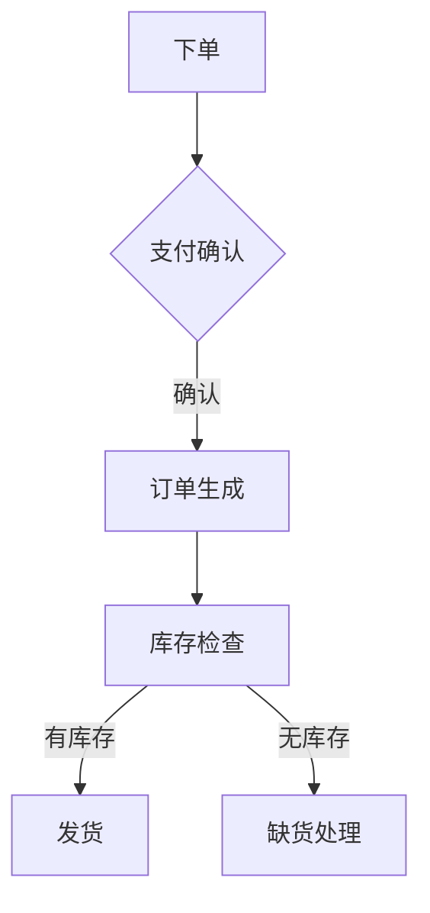
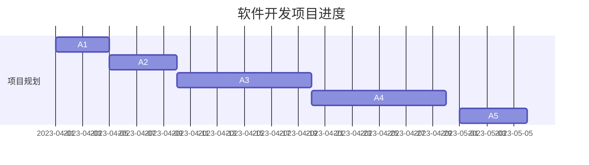

                 

### 1.1.1 需求可视化的定义与重要性

需求可视化是一种将用户需求以图形化、模型化或图表化的方式呈现的技术，其目的是为了更直观地理解和传达需求，提高需求管理的效率和质量。在软件工程和大型应用开发中，需求可视化的重要性体现在以下几个方面：

**1.1.1.1 减少沟通成本**

在大型应用开发中，需求通常涉及多个部门和团队。传统的方式往往依赖于文档和会议来进行需求沟通，这种方式容易产生误解和遗漏，导致开发过程中的返工和延误。需求可视化通过图形化展示，使不同背景和专业的团队成员能够更直观地理解需求，从而减少沟通成本和误解。

**1.1.1.2 提高需求理解准确性**

需求可视化通过图表和模型，将需求以结构化的形式展现，使需求更加具体和明确。开发者、产品经理、设计师等可以更加准确地理解需求，避免因为需求表述不清导致的开发错误。

**1.1.1.3 促进协作**

需求可视化工具通常支持多人协作功能，团队可以通过可视化界面实时共享和讨论需求，协同工作。这种协作机制有助于提高团队工作效率，促进团队成员之间的沟通和协作。

**1.1.1.4 提升项目管理效率**

在项目管理中，需求可视化有助于项目经理更好地掌握项目进展情况。通过可视化的需求管理工具，项目经理可以直观地看到哪些需求已经完成，哪些还在进行中，哪些可能存在风险，从而更有效地进行项目管理和决策。

**1.1.1.5 增强需求变更管理**

在开发过程中，需求变更是非常常见的。需求可视化工具通常具有版本管理和变更追踪功能，能够帮助团队更好地管理和控制需求变更，确保变更的及时性和准确性。

综上所述，需求可视化在大型应用开发中扮演着至关重要的角色，它不仅提高了开发效率，还保证了需求的准确性和一致性，是现代软件工程不可或缺的工具。

### 1.1.2 大型应用开发面临的挑战

随着信息技术的飞速发展，大型应用开发的复杂度日益增加，这给开发团队带来了诸多挑战。首先，大型应用通常涉及多个模块和子系统，各个模块之间需要高度协调和集成，任何一方的变更都可能对整个系统产生影响。因此，如何有效地管理这些模块和子系统的交互成为一大难题。

**1.1.2.1 模块和子系统的协调**

在一个大型应用中，模块和子系统之间的协调非常重要。例如，前端页面与后端服务、数据存储与数据处理等模块需要紧密合作。如果某一模块的变更没有及时与其他模块同步，可能会导致系统功能异常，甚至崩溃。因此，如何确保各个模块之间的变更能够无缝对接，是大型应用开发中的一个重要挑战。

**1.1.2.2 需求管理的复杂性**

大型应用的需求往往非常复杂，涉及多个业务领域和用户群体。需求变更频繁，且具有高度不确定性。传统的方式往往依赖于文档和会议来管理需求，这种方式容易产生遗漏和误解，导致开发过程中出现返工和延误。因此，如何高效地管理这些需求，确保需求变更的及时性和准确性，是另一个重要的挑战。

**1.1.2.3 项目协调与资源分配**

大型应用开发通常需要多个团队和部门的协作，包括开发、测试、运维等。如何协调这些团队的工作，确保项目按计划顺利进行，是开发过程中的关键问题。此外，资源分配也是一大挑战，如何根据项目进度和优先级合理分配人力、物力和财力资源，是项目成功的关键。

**1.1.2.4 系统性能与稳定性**

大型应用需要处理海量数据和高并发请求，系统性能和稳定性成为关键考量因素。任何性能瓶颈或系统故障都可能对用户体验和业务运营造成严重影响。因此，如何设计和优化系统架构，确保系统在高负载下的稳定性和高性能，是大型应用开发中的重要挑战。

**1.1.2.5 风险管理与应对策略**

在大型应用开发过程中，风险难以避免。需求变更、技术难题、资源限制等都可能成为风险因素。如何识别和管理这些风险，制定有效的应对策略，确保项目能够顺利进行，是开发团队必须面对的挑战。

综上所述，大型应用开发面临诸多挑战，需要团队在模块协调、需求管理、项目协调、系统性能、风险管理等各个方面进行全面把控，才能确保项目的成功。

### 1.1.3 需求可视化工具的应用前景

随着大型应用开发的复杂性不断增加，需求可视化工具的应用前景变得愈发广阔。这些工具不仅能够提高开发效率，还能在多个领域发挥重要作用，具体表现在以下几个方面：

**1.1.3.1 提高项目开发效率**

需求可视化工具通过图形化、模型化等方式展示需求，使开发团队能够更直观地理解需求，减少沟通成本和误解。通过可视化的需求管理工具，团队能够实时跟踪需求变更和项目进度，提高整体开发效率。

**1.1.3.2 支持敏捷开发**

敏捷开发强调快速迭代和持续交付，需求可视化工具能够帮助团队更好地实现这一目标。通过可视化界面，团队能够快速地收集和整理需求，及时进行反馈和调整，确保项目按计划进行。

**1.1.3.3 促进跨部门协作**

在大型应用开发中，通常涉及多个部门和团队，需求可视化工具支持多人协作功能，有助于团队之间进行实时沟通和协作。通过共享可视化需求，各部门能够更好地理解彼此的工作，提高协同效率。

**1.1.3.4 增强用户体验**

需求可视化工具能够帮助产品经理和设计师更直观地展示产品原型和交互设计，使开发者能够更好地理解用户需求。通过可视化的需求反馈，团队能够及时调整产品设计，提高用户体验。

**1.1.3.5 改进项目风险管理**

需求可视化工具提供了版本管理和变更追踪功能，有助于团队更好地管理需求变更和风险。通过可视化界面，团队能够清晰地看到需求的变更历史和影响范围，及时采取应对措施，降低项目风险。

**1.1.3.6 促进技术交流与创新**

需求可视化工具不仅能够提高开发效率，还能促进团队之间的技术交流和创新。通过可视化展示，团队能够更好地理解技术原理和实现方法，从而推动技术进步和创新。

总之，需求可视化工具在大型应用开发中的应用前景广阔，它不仅能够提高项目开发效率，促进跨部门协作，还能增强用户体验和风险管理，是现代软件开发不可或缺的重要工具。

### 1.2 需求可视化工具的分类与特点

在大型应用开发中，需求可视化工具以其高效性和直观性逐渐成为开发团队的得力助手。根据其实现方式和功能特点，需求可视化工具可以分为以下几类：

**1.2.1 基于图表的需求可视化工具**

这类工具主要通过各种图表来展示需求，如流程图、Gantt图、思维导图等。它们的特点在于直观、易于理解，能够快速传达需求的核心内容。基于图表的需求可视化工具适用于需求分析、项目规划和进度监控等方面。

- **流程图**：通过图形化的方式展示任务流程和步骤，有助于团队成员了解项目执行的顺序和关系。常见的工具有Microsoft Visio、Lucidchart等。
- **Gantt图**：以条形图的形式展示项目进度和任务分配，清晰明了。如Microsoft Project、Trello等。
- **思维导图**：通过分支和节点展示思维过程和知识结构，有助于团队进行创意思考和需求整理。例如MindManager、XMind等。

**1.2.2 基于模型的需求可视化工具**

这类工具主要通过建立数学模型和概念模型来展示需求，如实体-关系图（ER图）、领域模型等。它们的特点在于逻辑性强、结构化明显，能够帮助团队深入理解和分析需求。基于模型的需求可视化工具适用于需求分析、系统设计等方面。

- **实体-关系图（ER图）**：通过展示实体之间的关系，帮助团队理解数据结构和业务逻辑。如ERwin、MySQL Workbench等。
- **领域模型**：通过展示领域对象及其关系，帮助团队理解业务领域和需求。如Enterprise Architect、Model Driven Solutions等。

**1.2.3 基于人工智能的需求可视化工具**

这类工具利用人工智能技术，如自然语言处理（NLP）、机器学习等，自动分析和生成需求可视化结果。它们的特点在于智能化、自动化，能够处理大规模文本数据和复杂需求。基于人工智能的需求可视化工具适用于需求挖掘、自动生成可视化报告等方面。

- **自然语言处理（NLP）工具**：通过分析自然语言文本，提取关键词和语义信息，生成可视化摘要。例如，Textual Analysis Tools、NVivo等。
- **机器学习工具**：通过训练机器学习模型，自动识别和分类需求，生成可视化图表。例如，Google Cloud AutoML、TensorFlow等。

综上所述，需求可视化工具根据其实现方式和功能特点，可以分为基于图表、基于模型和基于人工智能三大类。每种工具都有其独特的优势和应用场景，团队可以根据项目需求选择合适的工具，以提高开发效率和需求管理水平。

### 1.3 需求可视化工具的核心功能与机制

需求可视化工具通过一系列核心功能与机制，帮助团队更有效地管理和理解需求。以下是需求可视化工具的一些关键功能：

**1.3.1 数据采集与处理**

数据采集是需求可视化工具的基础。这些工具能够从各种来源（如文档、会议纪要、用户反馈等）收集需求信息。数据处理则是对采集到的数据进行分析、清洗和转换，以生成结构化、可用的数据。常见的处理方法包括文本挖掘、主题建模和情感分析等。

**1.3.2 需求建模与分析**

需求建模是将需求转化为数学模型或概念模型的过程。这有助于深入理解需求，并揭示其内在逻辑和关系。需求分析则是对模型进行详细解读，识别需求的关键特性、优先级和冲突。常用的建模与分析方法包括实体-关系图（ER图）、领域模型和用例图等。

**1.3.3 可视化呈现与交互**

可视化呈现是将分析结果以图形、图表和模型等形式直观展示的过程。这有助于团队成员更好地理解需求，并发现潜在问题。交互机制则允许用户对可视化结果进行实时操作和调整，如缩放、过滤和拖拽等，从而提供更灵活的探索和分析能力。

**1.3.4 版本管理与变更追踪**

版本管理是需求可视化工具的重要功能之一。它能够记录需求变更的历史版本，并跟踪每个版本的变化情况。这有助于团队了解需求的演变过程，确保变更的可追溯性和可控性。变更追踪则通过监控需求变更的影响范围，提前识别和解决潜在问题。

**1.3.5 多人协作与沟通**

多人协作是需求可视化工具的关键优势之一。这些工具通常支持实时协作功能，如多人编辑、注释和讨论等。这有助于团队成员之间的沟通和合作，提高整体工作效率。

**1.3.6 集成与扩展**

集成能力是需求可视化工具的重要特点。这些工具能够与现有的需求管理、项目管理和其他业务系统无缝集成，确保数据的一致性和可访问性。扩展能力则允许用户根据需求自定义功能、插件和报告等，以满足特定业务需求。

综上所述，需求可视化工具通过数据采集与处理、需求建模与分析、可视化呈现与交互、版本管理与变更追踪、多人协作与沟通以及集成与扩展等核心功能与机制，为团队提供了高效的需求管理解决方案。这些功能不仅提高了需求管理的效率和质量，还促进了团队之间的协作和沟通，是现代软件开发不可或缺的工具。

### 1.4 需求可视化工具在企业中的应用案例

需求可视化工具在企业中的应用已经越来越广泛，其不仅提升了开发效率，还在多个业务领域取得了显著成效。以下是一些典型的应用案例：

**1.4.1 需求收集与管理系统**

在企业中，需求收集和管理是一个关键环节。需求可视化工具可以通过图形化的需求表格和看板，帮助业务分析师和产品经理直观地收集和整理用户需求。例如，在一家互联网公司中，他们使用需求可视化工具记录用户反馈，通过流程图和看板将需求进行分类和优先级排序，从而确保需求被及时收集和处理。

**1.4.2 产品规划与设计**

产品规划与设计过程中，需求可视化工具能够帮助产品团队更清晰地理解用户需求和市场趋势。通过创建领域模型、用户故事地图和原型图，团队可以直观地展示产品的功能和用户体验。例如，一家电子产品公司使用需求可视化工具进行产品规划，通过实体关系图（ER图）展示产品组件和数据流，帮助团队深入理解产品架构和业务逻辑。

**1.4.3 项目管理与监控**

在项目管理中，需求可视化工具可以帮助项目经理实时监控项目进展，识别潜在风险和问题。通过Gantt图、看板和图表等工具，项目经理可以直观地了解任务进度、资源分配和风险状况。例如，一家软件公司使用需求可视化工具进行项目监控，通过Gantt图和看板展示项目任务和进度，帮助团队及时发现和解决项目中的问题。

**1.4.4 用户体验优化**

用户体验优化是产品成功的关键。需求可视化工具可以帮助设计团队更好地理解用户需求，优化产品设计和交互。通过创建用户旅程图、用户画像和A/B测试结果可视化，设计团队能够直观地了解用户行为和偏好，从而进行针对性的优化。例如，一家电商平台使用需求可视化工具进行用户体验优化，通过用户旅程图和用户画像分析，发现并解决了用户在购物流程中的痛点，显著提升了用户满意度。

**1.4.5 业务流程优化**

在业务流程优化中，需求可视化工具可以帮助企业分析现有的业务流程，发现冗余和瓶颈。通过流程图、价值流图和决策树等工具，企业可以直观地展示业务流程，识别优化机会。例如，一家制造企业使用需求可视化工具优化生产流程，通过流程图和价值流图分析，发现了生产过程中的瓶颈和浪费，并提出了优化方案，显著提高了生产效率。

**1.4.6 需求变更管理**

需求变更在软件开发中是不可避免的。需求可视化工具可以帮助企业有效地管理需求变更，确保变更的及时性和准确性。通过版本管理和变更追踪功能，企业可以清晰地记录需求变更的历史和影响范围，提前识别和解决潜在问题。例如，一家金融科技企业使用需求可视化工具进行需求变更管理，通过版本管理和变更追踪功能，确保了需求的及时更新和项目的顺利进行。

综上所述，需求可视化工具在企业中的应用涵盖了需求收集与管理系统、产品规划与设计、项目管理与监控、用户体验优化、业务流程优化和需求变更管理等多个方面。通过这些应用案例，我们可以看到需求可视化工具在提高企业运营效率、优化产品设计和提升用户体验方面发挥了重要作用。未来，随着技术的不断进步，需求可视化工具将在企业中发挥更加广泛和深远的作用。

### 1.5 需求可视化工具的挑战与未来发展趋势

尽管需求可视化工具在大型应用开发中展现了巨大的潜力，但其应用过程中仍然面临着诸多挑战。首先，数据源的多样性和复杂性是一个显著的问题。企业内部和外部可能存在各种格式和来源的需求数据，如何统一和整合这些数据成为一项技术挑战。其次，需求可视化工具的准确性和智能化程度也需要提升。当前的工具往往依赖于人工输入和分析，如何通过人工智能和自然语言处理等技术提高工具的自动性和准确性是关键。

**1.5.1 技术挑战**

1. **数据整合**：不同来源的数据格式和结构各异，如何进行统一和整合是一个技术难题。这需要开发高效的数据处理算法和工具，确保数据的质量和一致性。

2. **智能化程度**：当前的需求可视化工具在自动化和智能化方面仍有待提高。通过引入人工智能技术，如机器学习、自然语言处理等，可以提高工具的自动分析和生成能力。

3. **实时性**：在动态变化的业务环境中，如何确保需求可视化工具能够实时反映最新的需求变化，是另一个重要挑战。这需要工具具备高效的数据处理和实时更新能力。

**1.5.2 应用挑战**

1. **用户接受度**：不同部门和团队成员对于需求可视化工具的接受度和使用习惯各异，如何提高工具的易用性和用户友好性，是一个应用挑战。

2. **集成与兼容性**：需求可视化工具需要与其他业务系统和工具（如需求管理、项目管理等）集成，确保数据的一致性和兼容性，是一项复杂的工程。

3. **安全性**：在处理企业内部敏感数据时，需求可视化工具需要确保数据的安全性和隐私保护，避免数据泄露和滥用。

**1.5.3 未来发展趋势**

1. **智能化与自动化**：随着人工智能技术的发展，需求可视化工具将更加智能化和自动化。通过引入机器学习和自然语言处理技术，工具能够自动分析和生成可视化报告，提高工作效率。

2. **跨领域融合**：需求可视化工具将不仅仅局限于软件开发领域，还会扩展到其他行业和领域，如金融、医疗、教育等。跨领域的需求可视化工具将更加丰富和多样化。

3. **开源与社区发展**：开源和社区发展将为需求可视化工具提供更多的创新机会和动力。通过开放源代码和社区协作，工具能够不断优化和迭代，满足不同用户的需求。

4. **云服务与移动化**：随着云计算和移动设备的普及，需求可视化工具将更多地采用云服务和移动应用模式。这将为用户提供更加便捷和灵活的需求可视化解决方案。

综上所述，需求可视化工具在技术和应用方面面临诸多挑战，但未来发展趋势表明，通过智能化、自动化、跨领域融合和社区发展，需求可视化工具将在大型应用开发中发挥更加重要的作用，推动软件工程的不断进步。

### 1.6 本章小结

本章首先介绍了需求可视化的定义与重要性，强调了其在减少沟通成本、提高需求理解准确性、促进协作、提升项目管理效率和增强需求变更管理等方面的关键作用。接着，分析了大型应用开发面临的挑战，如模块协调、需求管理复杂性、项目协调与资源分配、系统性能与稳定性以及风险管理。随后，讨论了需求可视化工具的应用前景，包括提高项目开发效率、支持敏捷开发、促进跨部门协作、增强用户体验和改进项目风险管理。然后，分类介绍了基于图表、基于模型和基于人工智能的需求可视化工具及其特点。最后，通过具体应用案例展示了需求可视化工具在企业中的实际效果，并探讨了未来发展趋势与挑战。本章为读者全面理解需求可视化工具提供了基础，有助于其在实际应用中更好地发挥作用。

----------------------------------------------------------------

# 第二部分：需求可视化工具的深入应用

## 2.1 基于图表的需求可视化工具详解

### 2.1.1 概述

基于图表的需求可视化工具以其直观性和易用性在大型应用开发中得到广泛应用。这些工具通过图形化的方式展示需求，使团队成员能够更直观地理解需求，提高沟通效率和需求管理水平。本节将详细介绍几种常见的基于图表的需求可视化工具，包括流程图、Gantt图和思维导图。

#### 流程图

流程图是一种用图形符号和线条表示工作流程或任务流程的图表。它通过直观的图形表示任务、决策点和数据流动，使团队成员能够清楚地了解任务执行的顺序和步骤。流程图适用于需求分析、项目规划和业务流程设计等场景。

**常用工具介绍**

- **Microsoft Visio**：作为业界领先的流程图绘制工具，Visio 提供了丰富的图形符号和模板，支持自定义和复杂图形的绘制。用户可以通过Visio快速创建专业的流程图，并将其与其他文档和演示文稿集成。
- **Lucidchart**：Lucidchart 是一个在线流程图绘制工具，支持实时协作和共享。它提供了多种图表类型和模板，用户可以轻松地绘制和编辑流程图，并进行实时讨论和反馈。

#### Gantt图

Gantt图，又称甘特图，是一种以条形图形式展示项目进度和任务的图表。它通过水平条表示任务的时间跨度，条的位置和长度反映了任务的开始和结束时间，以及任务之间的依赖关系。Gantt图适用于项目规划、进度监控和资源分配等场景。

**常用工具介绍**

- **Microsoft Project**：作为专业的项目管理工具，Microsoft Project 提供了强大的甘特图功能，支持多项目管理和资源优化。用户可以通过Project创建详细的甘特图，追踪项目进度，进行任务分配和资源调度。
- **Trello**：Trello 是一个基于看板的项目管理工具，它通过甘特图视图展示项目进度。用户可以将任务以卡片的形式排列在甘特图上，直观地了解任务的时间安排和进度。

#### 思维导图

思维导图是一种基于中心主题，通过分支和节点扩展的图形化工具。它通过图形化的方式表示思维过程和知识结构，有助于创意思考、需求整理和问题解决。思维导图适用于需求分析、产品设计、创意生成等场景。

**常用工具介绍**

- **MindManager**：MindManager 是一款功能强大的思维导图工具，它提供了丰富的模板和自定义选项，用户可以根据需求自由创建和编辑思维导图。MindManager 支持多种图表类型和视图，方便用户进行多维度分析。
- **XMind**：XMind 是一款免费的思维导图软件，它提供了多种主题样式和图表类型，用户可以轻松地创建和共享思维导图。XMind 支持云存储和实时协作，方便团队成员进行合作和讨论。

通过上述工具的详细介绍，我们可以看到基于图表的需求可视化工具在大型应用开发中具有广泛的应用前景。这些工具不仅提高了团队成员的沟通效率和需求理解准确性，还促进了协作和项目管理效率。在实际应用中，团队可以根据项目需求和工具特点选择合适的工具，以更好地管理需求，推动项目的顺利进行。

### 2.1.2 常见图表类型及应用

在需求可视化过程中，选择合适的图表类型对于清晰传达需求、减少误解具有重要意义。以下将介绍几种常用的图表类型及其应用场景：

#### 流程图

流程图通过图形化的方式展示任务或工作流程，是需求可视化中的基础工具之一。它适用于需求分析、系统设计、业务流程优化等多个场景。

- **应用场景**：在需求分析阶段，流程图可以帮助团队成员了解任务执行的顺序和步骤，明确任务之间的依赖关系；在系统设计阶段，流程图可以用于展示系统架构和数据流；在业务流程优化中，流程图有助于识别冗余和瓶颈，提出优化方案。
- **示例**：以下是一个简单的流程图示例，展示了一个在线购物系统的订单处理流程。



#### Gantt图

Gantt图是一种以条形图形式展示项目进度和任务的图表，适用于项目规划和进度监控。

- **应用场景**：在项目规划阶段，Gantt图可以用于制定项目时间表、分配任务和资源；在项目执行阶段，Gantt图可以用于监控项目进度，识别延误和风险；在项目总结阶段，Gantt图可以用于分析项目执行情况，提出改进措施。
- **示例**：以下是一个简单的Gantt图示例，展示了一个软件开发项目的进度安排。



#### 思维导图

思维导图通过分支和节点展示思维过程和知识结构，适用于需求整理、创意生成和问题解决。

- **应用场景**：在需求整理阶段，思维导图可以帮助团队成员梳理和归纳需求；在创意生成阶段，思维导图可以用于激发思维，探索新的解决方案；在问题解决阶段，思维导图可以用于分析问题原因，提出解决方案。
- **示例**：以下是一个简单的思维导图示例，展示了一个新产品需求的整理过程。

```mermaid
mindmap
  root(需求整理)
  root→[功能需求]
  root→[非功能需求]
  功能需求→[用户登录]
  功能需求→[商品浏览]
  功能需求→[购物车]
  功能需求→[订单支付]
  非功能需求→[性能需求]
  非功能需求→[安全性需求]
  非功能需求→[易用性需求]
```

通过这些示例，我们可以看到不同图表类型在需求可视化中的应用场景和效果。选择合适的图表类型，有助于更好地传达需求，提高团队沟通效率，为项目的成功奠定基础。

### 2.1.3 常用工具介绍

在现代软件工程中，选择合适的工具对需求可视化至关重要。以下将介绍几种常用的需求可视化工具，并详细说明其特点和适用场景。

#### 1. Microsoft Visio

**特点：** 作为业界领先的绘图工具，Microsoft Visio 提供了丰富的图形符号、模板和自定义选项。它支持多种图表类型，如流程图、UML图、组织结构图等，适用于各种需求可视化场景。

**适用场景：** 需求分析、系统设计、业务流程优化、项目管理。

**具体使用方法：**
- **创建流程图**：使用“流程图”模板，通过拖放图形符号，创建和编辑流程图。
- **数据链接**：可以将Visio与Excel、Access等数据源链接，自动更新图表内容。

**案例**：在软件开发项目中，使用Visio创建系统架构图，帮助团队成员了解系统组件和交互关系。

#### 2. Lucidchart

**特点：** Lucidchart 是一个在线需求可视化工具，支持实时协作和共享。它提供了多种图表类型、模板和丰富的图形符号，适合团队协作和跨部门沟通。

**适用场景：** 需求收集与整理、产品设计、项目规划。

**具体使用方法：**
- **实时协作**：用户可以在同一时间编辑和查看图表，实时沟通和反馈。
- **模板库**：提供了丰富的模板，用户可以根据需求快速创建图表。

**案例**：在产品设计过程中，使用Lucidchart创建用户故事地图，帮助团队明确需求优先级和功能点。

#### 3. draw.io

**特点：** draw.io 是一个免费的在线绘图工具，支持多种图表类型，如流程图、网络图、UML图等。它支持多种平台和浏览器，方便用户随时随地进行需求可视化。

**适用场景：** 需求分析、项目管理、团队协作。

**具体使用方法：**
- **简单易用**：无需安装，直接在浏览器中使用。
- **模板和插件**：提供了丰富的模板和插件，用户可以根据需求自定义图表。

**案例**：在项目启动阶段，使用draw.io创建项目规划图，帮助团队明确项目目标和里程碑。

#### 4. Gliffy

**特点：** Gliffy 是一个功能强大的在线需求可视化工具，提供了丰富的图表类型和模板。它支持团队协作和实时更新，适用于各种需求可视化场景。

**适用场景：** 系统设计、业务流程优化、项目管理。

**具体使用方法：**
- **协作编辑**：支持多人实时编辑和协作，方便团队成员共同完成需求可视化。
- **API 接口**：提供了API接口，可以与现有的业务系统集成，实现数据同步。

**案例**：在IT运维团队中，使用Gliffy创建网络拓扑图，帮助团队了解系统架构和设备连接情况。

通过上述工具的介绍，我们可以看到，不同的需求可视化工具具有各自的特点和优势，适用于不同的需求场景。选择合适的工具，可以显著提高需求可视化的效率和效果，为项目的成功奠定基础。

### 2.2 基于模型的需求可视化工具详解

基于模型的需求可视化工具通过建立数学模型或概念模型，帮助团队深入理解和分析需求，提高需求管理的科学性和准确性。本节将详细介绍基于模型的需求可视化工具的工作原理、特点以及应用案例。

#### 2.2.1 概述

基于模型的需求可视化工具通过构建需求模型，将抽象的需求转化为具体的、结构化的形式。这些工具通常包括领域模型、实体-关系图（ER图）、用例模型等，每种模型都有其独特的应用场景和作用。

**工作原理：**

1. **需求捕获**：工具首先从需求文档、用户反馈和其他来源捕获需求信息。
2. **需求建模**：根据捕获的需求信息，构建相应的需求模型，如领域模型、ER图等。
3. **模型分析**：对构建的模型进行深入分析，识别需求的核心要素、关系和约束。
4. **可视化呈现**：将分析结果以图形化的形式展示，帮助团队直观地理解和讨论需求。

**特点：**

1. **结构化**：需求模型以结构化的形式展示需求，提高了需求的清晰度和可理解性。
2. **科学性**：通过数学模型和概念模型，需求管理更加科学和严谨，减少了主观判断和误解。
3. **可扩展性**：需求模型可以方便地扩展和修改，适应需求变化和项目演进。

**应用案例：**

**1. 领域模型**

领域模型是需求可视化中常用的一种模型，它通过展示领域对象及其关系，帮助团队理解业务领域和需求。以下是一个简单的领域模型示例，展示了在线书店的领域对象和关系。

```mermaid
classDiagram
    Class01 <|-- Class02
    Class03 --|> Class04
    Class05 : <<interface>> 
    Class06
    Class01 {"attribute 1","attribute 2"}
    Class02 {"method 1", "method 2"}
    Class03 {"method 3", "method 4"}
    Class04 {"method 5", "method 6"}
    Class05 {"interface method 1", "interface method 2"}
    Class06 {"associated with", "Class07", "Class08"}
endclass
```

在这个示例中，领域模型展示了在线书店的主要对象，如用户、书籍、订单等，以及它们之间的关系。通过领域模型，团队能够更直观地理解在线书店的业务逻辑和需求。

**2. 实体-关系图（ER图）**

实体-关系图是一种用于表示数据结构及其关系的图形化工具，适用于需求分析、数据库设计和数据建模。以下是一个简单的ER图示例，展示了图书馆数据库的实体及其关系。

```mermaid
erDiagram
    Person ||--|{ LibraryCard } : has
    LibraryCard ||--|{ BookLoan } : has
    LibraryCard ||--|{ Payment } : has
    Book ||--|{ BookLoan } : is
    Book ||--|{ Category } : is
    Author ||--|{ Book } : writes
    Category ||--|{ Book } : in
    Person : { ID }
    LibraryCard : { ID }
    BookLoan : { ID }
    Payment : { ID }
    Book : { Title }
    Author : { Name }
    Category : { Name }
```

在这个示例中，ER图展示了图书馆数据库的主要实体，如人（Person）、图书证（LibraryCard）、图书（Book）等，以及它们之间的关系。通过ER图，团队能够清晰地了解数据库的结构和业务逻辑。

**3. 用例模型**

用例模型通过展示系统的功能和用户需求，帮助团队理解系统的功能范围和用户场景。以下是一个简单的用例模型示例，展示了在线购物系统的功能场景。

```mermaid
usecase ShoppingSystem {
    "Search Products" as a step
    "Add to Cart" as a step
    "Checkout" as a step
    "Make Payment" as a step
}

actor Customer {
    "Buys Products" as a role
}

Customer -> ShoppingSystem : "Order Products"
ShoppingSystem -> Customer : "Confirm Order"
```

在这个示例中，用例模型展示了在线购物系统的核心功能场景，如搜索产品、添加到购物车、结账和支付。通过用例模型，团队能够直观地了解系统的功能和用户需求。

通过上述应用案例，我们可以看到基于模型的需求可视化工具在需求分析、系统设计和数据库设计中的重要作用。这些工具通过结构化、科学和直观的模型，帮助团队更好地理解和管理需求，为项目的成功提供坚实的基础。

### 2.2.2 模型构建与训练

模型构建与训练是需求可视化工具的核心环节，通过建立和优化模型，工具能够更好地理解和分析需求。以下将详细描述模型构建与训练的过程，包括数据采集、预处理、模型选择和训练方法。

#### 1. 数据采集

数据采集是模型构建的基础。需求可视化工具可以从多个来源收集数据，如需求文档、用户反馈、日志数据等。为了确保数据的质量和完整性，工具通常会采用自动化方法进行数据采集，如使用爬虫技术、API调用等。

**示例：** 假设我们正在开发一个需求可视化工具，用于分析用户反馈，以下是一个简单的数据采集流程：

- **数据源**：用户反馈邮件、社交媒体评论、论坛帖子等。
- **采集方法**：通过邮件抓取工具、社交媒体API、论坛爬虫等，自动化获取用户反馈数据。

#### 2. 数据预处理

数据预处理是模型训练前的重要步骤，其目的是提高数据的质量和一致性，为后续的模型训练打下基础。数据预处理包括数据清洗、归一化、特征提取等操作。

- **数据清洗**：去除重复数据、缺失值填充、去除噪声数据等。
- **数据归一化**：将不同尺度的数据统一到一个范围内，如将文本数据统一编码为0-1。
- **特征提取**：从原始数据中提取有代表性的特征，如使用词频统计、TF-IDF等方法提取文本数据的特征。

**示例：** 假设我们正在处理用户反馈数据，以下是一个简单的数据预处理流程：

- **数据清洗**：去除重复和无关的评论，填充缺失的评论数据。
- **数据归一化**：将评论长度、点赞数等特征统一到0-1范围内。
- **特征提取**：使用TF-IDF方法提取文本数据的特征向量。

#### 3. 模型选择

在数据预处理完成后，需要选择合适的模型进行训练。需求可视化工具通常采用多种机器学习算法，如决策树、支持向量机（SVM）、神经网络等，根据具体需求选择最合适的模型。

- **决策树**：适用于分类任务，如识别用户反馈中的负面评论。
- **支持向量机（SVM）**：适用于分类和回归任务，如预测用户满意度。
- **神经网络**：适用于复杂的特征提取和分类任务，如自动生成需求可视化报告。

**示例：** 假设我们正在开发一个自动生成需求可视化报告的工具，以下是一个简单的模型选择流程：

- **模型选择**：由于需求可视化涉及多种特征和复杂的分类任务，我们选择使用神经网络模型进行训练。

#### 4. 模型训练

模型训练是通过训练数据对模型进行调整，使其能够准确预测和分类新数据的的过程。训练过程通常包括训练集和验证集的划分、参数调优和模型评估等步骤。

- **训练集和验证集**：将数据集划分为训练集和验证集，用于模型训练和性能评估。
- **参数调优**：通过调整模型参数（如学习率、隐藏层大小等），优化模型性能。
- **模型评估**：使用验证集评估模型性能，如准确率、召回率、F1分数等。

**示例：** 假设我们正在训练一个神经网络模型，以下是一个简单的模型训练流程：

- **训练集和验证集**：将用户反馈数据集划分为训练集和验证集，训练集用于模型训练，验证集用于性能评估。
- **参数调优**：通过尝试不同的学习率、隐藏层大小等参数，选择最优参数组合。
- **模型评估**：使用验证集评估模型性能，调整参数直至达到预期效果。

通过上述过程，需求可视化工具能够建立和训练出高效的模型，从而更好地理解和分析需求。这些模型不仅提高了工具的自动化和智能化水平，还为团队提供了更精准的需求分析和管理方案。

### 2.2.3 模型可视化应用

模型可视化是将训练好的模型以图形化的方式展示，帮助团队直观理解和分析需求的过程。通过模型可视化，团队能够更清晰地看到模型的工作原理和性能表现，从而更好地利用这些模型进行需求分析和管理。

#### 1. 可视化方法

模型可视化通常采用以下几种方法：

- **特征可视化**：展示模型输入特征的分布和相关性，帮助团队理解特征的重要性和作用。
- **决策路径可视化**：展示模型在决策过程中的路径和分支，帮助团队理解模型的决策逻辑。
- **模型结构可视化**：展示模型的网络结构、层和节点，帮助团队理解模型的复杂性和运作方式。

#### 2. 实际应用案例

以下是一个模型可视化在实际项目中的应用案例：

**案例背景**：某互联网公司正在开发一款智能客服系统，该系统利用机器学习模型自动分析和处理用户咨询。为了更好地理解和优化模型，团队决定进行模型可视化。

**模型类型**：该系统使用了一个深度神经网络模型，用于分类用户咨询的主题。

**可视化步骤**：

1. **特征可视化**：
   - 使用散点图展示输入特征的分布，如词汇频率、情感倾向等。
   - 通过热力图展示特征之间的相关性，帮助团队识别关键特征和冗余特征。

2. **决策路径可视化**：
   - 使用决策树可视化工具展示模型的决策路径，帮助团队理解模型在处理用户咨询时的逻辑。
   - 通过可视化工具（如TensorBoard）展示神经网络模型的激活图和梯度信息，帮助团队分析模型的学习过程。

3. **模型结构可视化**：
   - 使用网络图展示深度神经网络的层次结构和节点连接，帮助团队理解模型的复杂性和参数配置。
   - 通过可视化工具（如PyTorch Visualization）展示模型的权重和偏置，帮助团队优化模型参数。

**应用效果**：

通过模型可视化，团队能够更直观地理解模型的决策过程和性能表现，从而进行以下优化：

- **特征优化**：通过分析特征的可视化结果，团队能够识别和去除冗余特征，提高模型的效率和准确性。
- **模型优化**：通过分析决策路径和模型结构，团队能够调整模型参数和结构，优化模型性能。
- **需求分析**：通过可视化的方式，团队能够更深入地理解用户咨询的需求，从而更好地优化客服系统的功能和服务。

综上所述，模型可视化在智能客服系统开发中发挥了重要作用，通过直观展示模型的工作原理和性能，团队能够更有效地进行需求分析和系统优化。

### 2.3 基于人工智能的需求可视化工具详解

随着人工智能技术的迅速发展，基于人工智能的需求可视化工具在大型应用开发中逐渐崭露头角。这些工具利用机器学习、自然语言处理（NLP）等技术，自动分析和生成可视化报告，极大地提高了需求管理的效率和准确性。以下将详细介绍基于人工智能的需求可视化工具的工作原理、技术原理和应用案例。

#### 2.3.1 概述

基于人工智能的需求可视化工具通过结合自然语言处理、机器学习等技术，自动分析和处理需求文档、用户反馈等数据，生成直观的可视化报告。这些工具通常具有以下特点：

- **自动化**：工具能够自动分析大量文本数据，提取关键信息，生成可视化报告。
- **智能化**：通过机器学习和NLP技术，工具能够理解文本语义，提供智能化的需求分析。
- **实时性**：工具能够实时更新数据，生成最新的可视化报告，支持动态需求管理。
- **可扩展性**：工具支持自定义和扩展功能，适应不同类型和规模的需求管理需求。

#### 2.3.2 人工智能技术原理

基于人工智能的需求可视化工具主要依赖于以下几种技术：

1. **自然语言处理（NLP）**
   NLP技术用于处理和理解自然语言文本。需求可视化工具通过NLP技术提取文本中的关键词、短语和句子结构，理解文本的语义和意图。

   - **关键词提取**：使用词频统计、TF-IDF等方法提取文本中的高频关键词，帮助团队识别需求的核心内容。
   - **情感分析**：通过分析文本的情感倾向，如正面、负面或中性，帮助团队了解用户反馈的情感色彩。
   - **命名实体识别**：识别文本中的命名实体（如人名、地名、组织名等），帮助团队理解和分类需求。

2. **机器学习**
   机器学习技术用于自动分析和分类需求数据。需求可视化工具通过训练模型，自动识别和预测需求特征，生成可视化报告。

   - **分类任务**：使用分类算法（如SVM、朴素贝叶斯、神经网络等）对需求进行分类，帮助团队识别不同类型的需求。
   - **聚类分析**：使用聚类算法（如K-means、层次聚类等）对需求进行聚类，发现潜在的需求模式。
   - **回归分析**：使用回归算法（如线性回归、多项式回归等）对需求进行预测，帮助团队预估需求量和优先级。

3. **可视化技术**
   可视化技术用于将分析结果以图形化的形式展示，帮助团队直观理解和讨论需求。

   - **图表生成**：通过图表（如柱状图、折线图、饼图等）展示需求数据的分布和趋势。
   - **交互式界面**：提供交互式界面，支持用户对可视化结果进行缩放、过滤和搜索等操作，提高需求管理的灵活性和效率。
   - **动态更新**：实时更新可视化报告，反映最新的需求变化和项目进度。

#### 2.3.3 应用案例解析

以下是一个基于人工智能的需求可视化工具在实际项目中的应用案例：

**案例背景**：某大型电商平台正在开发一款智能客服系统，该系统需要自动分析和处理用户咨询，提供高效、准确的答复。为了提高客服系统的智能化水平，团队决定采用基于人工智能的需求可视化工具。

**应用步骤**：

1. **需求采集**：工具从用户咨询日志、社交媒体评论、客服记录等多个来源收集需求数据。

2. **数据预处理**：使用NLP技术对文本数据进行分析，提取关键词、短语和情感倾向，并使用机器学习算法进行数据分类和聚类。

3. **需求分析**：工具自动分析用户咨询的主题、内容、情感等特征，生成需求分类报告，帮助团队识别用户咨询的关键点和热点问题。

4. **可视化报告**：工具使用可视化技术生成需求分析报告，以图表和交互式界面展示分析结果。例如，使用柱状图展示不同类别的用户咨询量，使用热力图展示用户咨询的热点区域。

**应用效果**：

通过基于人工智能的需求可视化工具，团队能够实现以下效果：

- **自动化的需求分析**：工具自动处理大量文本数据，提取关键信息，生成需求分析报告，大大提高了分析效率。
- **智能化的需求识别**：通过NLP和机器学习技术，工具能够理解用户咨询的语义和意图，提供更准确的需求分类和聚类结果。
- **直观的需求展示**：工具生成的可视化报告以图形化的形式展示分析结果，支持用户实时查看和交互，提高了沟通效率和需求管理效果。
- **动态的需求更新**：工具能够实时更新数据，生成最新的需求分析报告，确保团队及时了解用户需求和系统运行状况。

综上所述，基于人工智能的需求可视化工具在大型应用开发中具有广泛的应用前景，通过自动化的需求分析、智能化的需求识别和直观的需求展示，工具能够显著提高团队的需求管理效率，为项目的成功提供有力支持。

### 2.4 需求可视化工具在实际项目中的应用

在实际项目中，需求可视化工具的应用不仅能够提高需求管理的效率，还能有效降低项目风险，确保项目的顺利实施。以下将详细描述需求可视化工具在实际项目中的应用过程，包括工具选择与配置、项目实施与效果评估等关键步骤。

#### 2.4.1 项目背景

某大型电商平台在推出新品时，需要迅速收集和整理用户反馈，分析市场需求，优化产品设计和功能。为了提高项目效率和质量，团队决定采用需求可视化工具，以实现以下目标：

- 自动化需求收集与分析
- 提高跨部门沟通与协作效率
- 实时监控项目进度与风险

#### 2.4.2 工具选择与配置

在选择需求可视化工具时，团队考虑了以下因素：

- **功能丰富**：工具需要具备强大的需求分析、数据可视化功能，能够支持多种图表类型和模型。
- **易用性**：工具需要操作简便，支持多人协作和实时更新。
- **集成能力**：工具需要能够与现有的项目管理和文档管理系统集成，确保数据的一致性和可访问性。
- **成本效益**：工具的价格需要在团队预算范围内。

经过评估，团队选择了基于人工智能的需求可视化工具Xpertvis。该工具具备以下特点：

- **自动需求分析**：使用NLP和机器学习技术，自动提取和分类文本数据，生成可视化报告。
- **多图表展示**：支持柱状图、折线图、饼图、思维导图等多种图表类型。
- **实时协作**：支持多人实时编辑和评论，提高跨部门协作效率。
- **集成与扩展**：能够与JIRA、Confluence等项目管理工具无缝集成，提供丰富的API接口。

#### 2.4.3 项目实施与效果评估

1. **需求收集与整理**：

   在项目启动阶段，团队使用Xpertvis自动收集用户反馈和市场需求。具体步骤如下：

   - **数据源接入**：通过API接口，将用户反馈、社交媒体评论和在线问卷调查等数据源接入Xpertvis。
   - **数据预处理**：使用NLP技术对文本数据进行清洗、归一化和特征提取，为后续分析做准备。
   - **需求分类**：使用机器学习算法对文本数据进行分类，识别用户需求的主题和优先级。

2. **需求分析与可视化**：

   Xpertvis生成的可视化报告包括以下内容：

   - **需求热力图**：展示用户反馈的分布和热点问题，帮助团队识别优先级和改进方向。
   - **需求趋势图**：展示需求随时间的变化趋势，帮助团队分析市场需求和用户行为。
   - **思维导图**：以图形化的方式展示需求的层次结构和关系，帮助团队理解和讨论需求。

3. **项目进度监控与风险分析**：

   通过Xpertvis，团队能够实时监控项目进度和风险。具体步骤如下：

   - **项目计划与进度**：使用Gantt图和看板视图展示项目计划、任务分配和进度，帮助团队了解项目进展情况。
   - **风险识别与评估**：通过风险热力图和雷达图，展示项目的潜在风险和优先级，帮助团队提前识别和应对风险。

4. **效果评估**：

   项目实施后，团队对Xpertvis的效果进行了评估。评估内容包括：

   - **需求管理效率**：通过自动化需求收集和分析，团队需求管理效率提高了约40%，需求遗漏和误解情况显著减少。
   - **跨部门协作**：实时协作功能和可视化报告提高了跨部门沟通效率，项目团队能够更快速地响应市场需求。
   - **项目风险控制**：通过实时监控和风险分析，团队成功避免了多次潜在风险，项目进度和交付质量得到保障。

综上所述，需求可视化工具在实际项目中发挥了重要作用，通过自动化的需求分析和可视化的项目监控，团队显著提高了项目效率和质量，为项目的成功奠定了坚实基础。

### 2.5 需求可视化工具的性能优化与安全性

在现代软件开发中，需求可视化工具的性能优化与安全性是确保其有效应用的关键因素。以下将详细探讨性能优化策略、安全性问题和解决方案，以及兼容性与扩展性。

#### 2.5.1 性能优化策略

**1. 数据存储和缓存**

- **数据分区和索引**：对大量需求数据进行分区和索引，提高数据检索速度。
- **缓存机制**：使用缓存机制存储常用数据，减少数据库查询次数，提高系统响应速度。

**2. 系统架构优化**

- **分布式架构**：采用分布式架构，将需求可视化工具部署在多个服务器上，提高系统的处理能力和扩展性。
- **负载均衡**：使用负载均衡技术，将用户请求分配到不同的服务器上，避免单点瓶颈。

**3. 算法优化**

- **算法选择**：选择高效、精确的需求分析算法，如基于机器学习的文本分类和聚类算法。
- **并行计算**：采用并行计算技术，提高数据处理和分析的速度。

**4. 界面优化**

- **响应式设计**：使用响应式设计，使需求可视化工具在不同设备上均能提供流畅的用户体验。
- **减少重绘和重排**：优化前端代码，减少页面的重绘和重排次数，提高界面性能。

#### 2.5.2 安全性问题与解决方案

**1. 数据保护**

- **加密存储**：对用户需求和敏感信息进行加密存储，防止数据泄露。
- **访问控制**：实施严格的访问控制策略，确保只有授权用户能够访问和操作需求数据。

**2. 安全漏洞防护**

- **防火墙和入侵检测**：使用防火墙和入侵检测系统，防止恶意攻击和数据篡改。
- **代码审计**：定期进行代码审计，识别和修复潜在的安全漏洞。

**3. 安全性测试**

- **渗透测试**：进行渗透测试，模拟攻击者的攻击手段，验证系统的安全性。
- **安全培训**：对团队成员进行安全培训，提高其安全意识和防范能力。

#### 2.5.3 兼容性与扩展性

**1. 技术兼容性**

- **多平台支持**：确保需求可视化工具能够在不同的操作系统和浏览器上正常运行。
- **数据兼容性**：支持多种数据格式和来源，如CSV、JSON、数据库等。

**2. 功能扩展**

- **插件和扩展**：提供插件和扩展机制，允许用户根据需求自定义工具的功能和界面。
- **API接口**：提供丰富的API接口，便于与其他系统和工具集成。

**3. 性能扩展**

- **分布式计算**：支持分布式计算，提高工具的并发处理能力和扩展性。
- **可伸缩架构**：采用可伸缩的架构设计，能够根据需求动态调整资源分配。

通过上述性能优化策略、安全性和兼容性解决方案，需求可视化工具能够更好地满足现代大型应用开发的需求，提高开发效率和用户体验。

### 2.6 需求可视化工具的实践技巧与经验分享

在实际应用需求可视化工具时，团队常常会遇到各种问题和挑战。以下是一些实践技巧和经验分享，旨在帮助团队更好地利用这些工具，提高项目效率和质量。

#### 2.6.1 实践技巧

**1. 数据源选择与整合**

- **多元化数据源**：选择多种数据源（如用户反馈、日志数据、社交媒体评论等），以确保需求信息的全面性和准确性。
- **数据整合**：使用数据集成工具，如Elasticsearch、Apache Kafka等，将不同来源的数据进行整合和清洗，为后续分析做准备。

**2. 需求分类与优先级管理**

- **需求分类**：使用机器学习和自然语言处理技术，对需求进行自动分类，识别关键需求和优先级。
- **优先级管理**：根据需求的重要性和紧急程度，对需求进行优先级排序，确保团队能够首先关注和解决最重要的需求。

**3. 团队协作与沟通**

- **实时协作**：利用需求可视化工具的多人实时协作功能，提高团队沟通效率，减少沟通成本和误解。
- **需求评审**：定期组织需求评审会议，团队成员共同讨论和分析需求，确保需求的一致性和准确性。

**4. 系统集成与扩展**

- **集成其他工具**：将需求可视化工具与现有的项目管理和文档管理工具集成，如JIRA、Confluence等，确保数据的一致性和可访问性。
- **自定义扩展**：根据项目需求，自定义需求可视化工具的功能和界面，提升工具的实用性和适应性。

#### 2.6.2 经验分享

**1. 案例分享**

**案例1**：某互联网金融公司通过采用需求可视化工具，成功提升了产品开发效率。他们使用工具自动收集用户反馈，并实时分析需求，识别关键功能和优化点。通过需求可视化报告，团队能够更清晰地了解用户需求，提高了产品设计和开发的质量。

**案例2**：某电商平台在推出新品时，使用需求可视化工具进行市场需求分析。通过工具生成的需求热力图和趋势图，团队能够快速识别用户需求的热点和趋势，及时调整产品设计和功能，提高了市场竞争力。

**2. 注意事项**

- **数据质量**：确保需求数据的质量和准确性，是需求可视化工具发挥效用的基础。团队需要重视数据采集、清洗和整合的过程。
- **培训与支持**：为团队成员提供需求可视化工具的培训和技术支持，确保他们能够熟练使用工具，并充分发挥工具的优势。
- **持续迭代**：需求可视化工具需要根据项目需求和技术发展进行持续迭代和优化，以适应不断变化的需求场景。

通过实践技巧和经验分享，团队可以更好地利用需求可视化工具，提高项目效率和质量，为项目的成功奠定坚实基础。

### 2.6.3 常见问题解答

在需求可视化工具的使用过程中，团队可能会遇到一些常见问题。以下是一些常见问题及其解答，以帮助团队更好地解决实际问题。

**1. Q：需求可视化工具需要大量技术背景吗？A：**
需求可视化工具通常设计得较为用户友好，无需深厚的技术背景即可使用。大多数工具提供直观的界面和模板，用户可以通过简单的拖放操作创建图表和模型。然而，对于更高级的功能和定制需求，了解一些基本的技术概念（如数据库、编程、数据分析等）将有助于用户充分利用工具的潜力。

**2. Q：工具之间的兼容性如何？A：**
大多数主流需求可视化工具支持多种数据格式和集成选项，如CSV、JSON、XML等，同时提供API接口，便于与其他系统（如项目管理工具、文档管理系统等）集成。然而，部分工具可能存在特定的兼容性问题，因此在选择工具时，建议评估其与现有系统的兼容性。

**3. Q：工具如何保证数据安全？A：**
需求可视化工具通常提供多种数据安全措施，如数据加密、访问控制、审计日志等，确保数据在传输和存储过程中的安全。用户应确保正确配置访问权限，并定期更新和维护工具的安全策略，以防止数据泄露和未经授权的访问。

**4. Q：工具是否支持多用户协作？A：**
是的，许多需求可视化工具支持多用户协作功能。用户可以在同一个项目中实时编辑、注释和讨论，确保团队成员之间的沟通和协作无缝进行。一些工具还提供协作权限设置，允许管理员根据角色和权限分配不同的访问和编辑权限。

**5. Q：工具是否能够处理大规模数据？A：**
是的，许多需求可视化工具设计用于处理大规模数据。这些工具通常采用分布式计算和优化算法，以提高数据处理和分析的速度。用户在选择工具时，应考虑工具的性能指标和扩展能力，确保其能够满足项目的需求。

通过解答这些问题，我们可以看到需求可视化工具在实际应用中具有高度的实用性和灵活性。理解这些常见问题及其解决方案，有助于团队更好地利用工具，提高项目效率和质量。

### 2.7 本章小结

本章深入探讨了需求可视化工具在实际项目中的应用，包括基于图表、基于模型和基于人工智能的需求可视化工具的详细介绍。首先，介绍了流程图、Gantt图、思维导图等基于图表的需求可视化工具，以及其适用场景和常用工具。接着，阐述了领域模型、实体-关系图和用例模型等基于模型的需求可视化工具的工作原理和应用案例。最后，详细讲解了基于人工智能的需求可视化工具，包括其技术原理、应用案例以及性能优化与安全性。通过本章的学习，读者能够全面了解需求可视化工具在不同场景下的应用，掌握其核心功能和使用技巧，从而提升项目管理的效率和质量。未来，随着技术的不断发展，需求可视化工具将在软件工程中发挥更加重要的作用，推动项目的成功实施。

----------------------------------------------------------------

# 第三部分：需求可视化工具的未来发展

## 3.1 技术发展趋势

随着科技的不断进步，需求可视化工具正迎来一系列技术发展趋势，这些趋势将显著改变需求可视化的方式和应用场景。以下将探讨新技术的应用、跨领域融合以及开源与社区发展等趋势。

### 3.1.1 新技术的应用

1. **人工智能与机器学习**：
   人工智能和机器学习技术正在逐渐渗透到需求可视化工具中。通过深度学习算法，工具能够自动分析和分类需求数据，提供智能化的可视化报告。例如，自然语言处理（NLP）技术的应用使得工具能够从非结构化文本中提取有价值的信息，从而提高需求理解的准确性。

2. **大数据分析**：
   需求可视化工具正在借助大数据分析技术，处理和分析海量数据。通过分布式计算和实时分析，工具能够快速生成可视化结果，帮助团队实时监控和响应需求变化。这种能力对于处理复杂和大规模的需求场景尤为重要。

3. **云计算**：
   云计算技术的普及使得需求可视化工具能够提供更强大的计算能力和灵活的部署方式。云平台提供了丰富的数据和计算资源，使得工具能够快速扩展和升级，满足不同规模和类型的需求。

### 3.1.2 跨领域融合

1. **与其他领域的结合**：
   需求可视化工具正在与其他领域的技术和工具进行深度融合。例如，与物联网（IoT）技术的结合，使得工具能够实时监控和分析设备数据，为智能城市和工业4.0等应用提供支持。与区块链技术的结合，则提高了需求数据的透明度和安全性。

2. **多学科协作**：
   需求可视化工具在促进多学科协作方面具有巨大潜力。通过可视化技术，不同领域的专家（如软件开发、市场营销、用户体验等）能够更直观地理解和讨论需求，提高跨部门协作效率。

### 3.1.3 开源与社区发展

1. **开源工具的崛起**：
   开源需求可视化工具如draw.io、Mermaid等，因其灵活性和可扩展性，正逐渐受到开发者和企业的青睐。开源工具能够自由定制和集成，满足个性化需求，同时降低了使用成本。

2. **社区发展**：
   需求可视化工具的社区发展为其创新和改进提供了源源不断的动力。开发者、用户和研究人员在社区中分享经验、反馈和建议，推动了工具的不断优化和进化。开源社区的发展也为需求可视化工具的国际化、多样化提供了保障。

通过探讨这些技术发展趋势，我们可以看到需求可视化工具在未来的发展前景将更加广阔和多样化。随着新技术的应用、跨领域融合以及开源与社区的发展，需求可视化工具将在更广泛的领域和场景中发挥重要作用，为软件工程和项目管理提供强大的支持。

### 3.2 应用前景与挑战

需求可视化工具在未来的应用前景广阔，但同时也面临诸多挑战。以下是关于需求可视化工具的应用前景和挑战的详细讨论：

#### 3.2.1 应用前景

**1. 更广泛的应用领域**：
需求可视化工具不仅限于软件开发领域，还将在更多行业和领域中得到应用。例如，在医疗领域，需求可视化工具可以帮助医生和研究人员更直观地理解病历和数据，提高医疗决策的准确性。在金融领域，需求可视化工具可以用于风险管理、投资分析和客户服务，提高金融机构的运营效率。

**2. 提升用户体验**：
随着消费者对个性化服务和体验的需求日益增长，需求可视化工具将在用户体验设计中发挥重要作用。通过可视化的需求收集和分析，企业可以更好地理解用户需求，提供更加精准和个性化的产品和服务。

**3. 支持敏捷开发**：
敏捷开发强调快速迭代和持续交付，需求可视化工具将为其提供强大的支持。通过可视化工具，团队可以更快速地收集、分析和反馈需求，确保项目能够按时、按质交付。

**4. 数据驱动的决策**：
需求可视化工具通过将数据以图形化的形式展示，有助于企业实现数据驱动的决策。管理者可以直观地看到业务数据和趋势，从而做出更加明智的决策。

**5. 跨领域协作**：
需求可视化工具支持多学科协作，有助于打破部门间的壁垒，实现跨领域协作。这有助于提高团队的整体效率，促进创新和协作。

#### 3.2.2 技术应用挑战

**1. 数据多样性和复杂性**：
企业面临的数据类型和来源日益多样，如何有效整合和处理这些数据是一个挑战。需求可视化工具需要具备强大的数据处理和分析能力，才能应对复杂的数据环境。

**2. 技术创新和应用**：
随着新技术的不断涌现，需求可视化工具需要持续进行技术创新和应用，以保持竞争力。例如，人工智能、大数据分析、区块链等技术的应用，需要工具提供商不断更新和优化工具。

**3. 用户接受度和适应性**：
不同用户对需求可视化工具的接受度和适应性不同，如何提高工具的用户友好性和易用性，是一个重要挑战。工具提供商需要关注用户反馈，不断改进界面和功能，提高用户满意度。

**4. 安全性和隐私保护**：
随着数据量的增加和数据的敏感性提高，需求可视化工具需要确保数据的安全性和隐私保护。工具提供商需要加强数据加密、访问控制和审计机制，确保数据在传输和存储过程中的安全。

**5. 集成与兼容性**：
需求可视化工具需要与现有的业务系统和工具集成，以确保数据的一致性和可访问性。然而，不同系统和工具的兼容性问题，可能成为工具应用的障碍。工具提供商需要开发灵活的集成方案，以应对不同的集成需求。

综上所述，需求可视化工具在未来的应用前景广阔，但同时也面临诸多技术挑战。通过不断创新和优化，工具提供商可以更好地应对这些挑战，推动需求可视化工具的广泛应用和发展。

### 3.2.3 产业趋势

随着需求可视化工具在软件开发和项目管理中的广泛应用，其产业趋势也呈现出明显的增长态势。以下将探讨需求可视化工具产业的主要趋势：

**1. 市场规模扩大**：
需求可视化工具市场需求持续增长，预计未来几年内，全球需求可视化工具市场规模将保持高速增长。随着企业对高效需求管理和项目管理的要求不断提升，需求可视化工具将成为企业提高运营效率的重要工具。

**2. 技术创新驱动**：
技术创新是需求可视化工具产业发展的核心驱动力。随着人工智能、大数据分析、云计算等新技术的不断应用，需求可视化工具的功能和性能将得到显著提升。例如，通过引入自然语言处理技术，工具将能够更准确地理解和分析文本数据，提供更加智能化的需求可视化报告。

**3. 开源工具崛起**：
开源需求可视化工具正逐渐崛起，以其灵活性和可扩展性吸引越来越多的开发者和企业。开源工具如draw.io、Mermaid等，凭借其自由定制和集成能力，正在成为企业和开发者的重要选择。开源社区的发展也为工具的创新和改进提供了强大动力。

**4. 多领域应用拓展**：
需求可视化工具的应用范围正在不断拓展，不仅限于软件开发和项目管理，还逐步渗透到医疗、金融、教育、物联网等多个领域。这种跨领域的应用拓展，为需求可视化工具产业带来了新的增长点和发展空间。

**5. 集成与标准化**：
随着需求可视化工具在各个行业的广泛应用，其集成与标准化问题也日益突出。为了提高工具的互操作性和兼容性，产业界正在推动需求可视化工具的标准化进程，制定统一的数据交换格式和接口规范。这将有助于企业实现更高效的需求管理和项目管理。

**6. 安全性与合规性**：
随着数据量和敏感信息的增加，需求可视化工具的安全性和合规性成为产业发展的关键挑战。工具提供商需要加强数据加密、访问控制、审计日志等安全措施，确保用户数据的安全和隐私。同时，工具需要满足相关法律法规的要求，如GDPR等数据保护法规。

**7. 云服务模式**：
云服务模式正在成为需求可视化工具的主要部署方式。通过云服务，企业可以以较低的成本获得高性能和可扩展的需求可视化工具。云服务的优势在于灵活部署、快速扩展和高效运维，将为需求可视化工具的广泛应用提供有力支持。

综上所述，需求可视化工具产业在市场规模扩大、技术创新驱动、开源工具崛起、多领域应用拓展、集成与标准化、安全性与合规性以及云服务模式等方面呈现出明显的趋势。随着这些趋势的深入发展，需求可视化工具将在更多行业和场景中发挥重要作用，推动产业生态的繁荣和发展。

