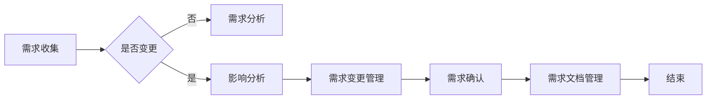
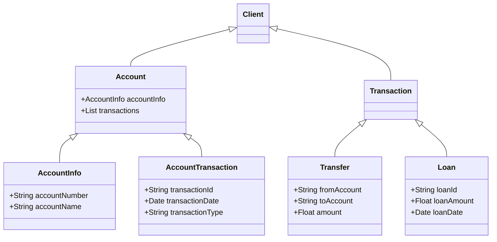
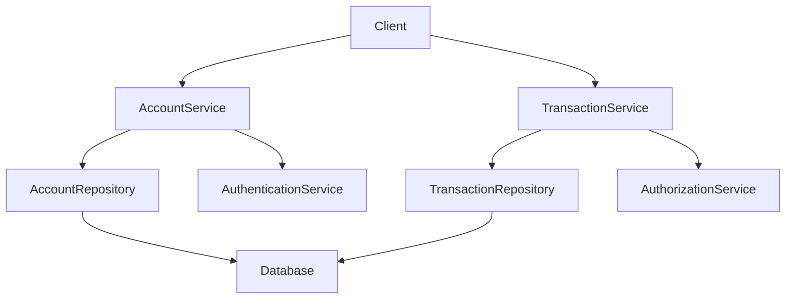
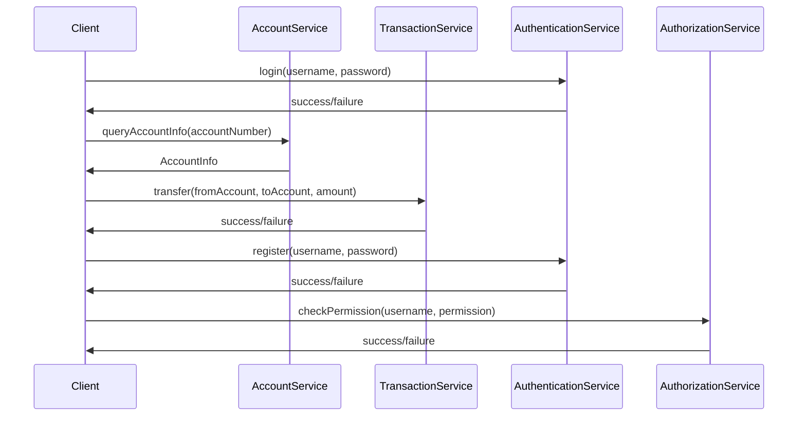

                 

# 大型应用开发中的需求溯源技术应用

> 关键词：需求溯源、大型应用开发、需求管理、技术原理、最佳实践

> 摘要：本文将深入探讨大型应用开发中的需求溯源技术应用。首先，我们会对需求溯源技术进行背景介绍，解析其在大型应用开发中的重要性。接着，我们将详细阐述需求溯源技术的原理，包括需求溯源模型、需求管理流程和需求追溯方法。随后，本文将通过实际项目案例，展示需求溯源技术在大型应用开发中的具体应用，并总结最佳实践。最后，我们将对需求溯源技术的未来发展方向进行展望。

## 《大型应用开发中的需求溯源技术应用》目录大纲

### 第一部分：背景介绍

#### 第1章：问题背景与需求溯源技术概述

1.1 问题背景

1.2 需求溯源技术概述

1.3 需求溯源技术的核心概念

1.4 需求溯源技术的边界与外延

1.5 本章小结

### 第二部分：需求溯源技术原理

#### 第2章：需求溯源技术原理详解

2.1 需求溯源模型的构建

2.2 需求管理流程

2.3 需求追溯方法

2.4 需求溯源技术的数学模型和公式

2.5 需求溯源技术的 Mermaid 流程图

2.6 本章小结

### 第三部分：需求溯源技术实战应用

#### 第3章：需求溯源技术在大型应用开发中的具体应用

3.1 应用场景介绍

3.2 项目介绍

3.3 系统功能设计

3.4 系统架构设计

3.5 系统接口设计

3.6 系统交互设计

3.7 环境安装与配置

3.8 系统核心实现源代码

3.9 实际案例分析和讲解

3.10 项目小结

### 第四部分：需求溯源技术应用的最佳实践

#### 第4章：需求溯源技术应用的最佳实践

4.1 最佳实践 tips

4.2 小结与展望

4.3 注意事项

4.4 拓展阅读

## 第一部分：背景介绍

### 第1章：问题背景与需求溯源技术概述

#### 1.1 问题背景

在大型应用开发中，需求管理是至关重要的。然而，随着项目规模的扩大，需求的复杂度和变更频率也随之增加。这给开发团队带来了巨大的挑战。如何有效地管理和跟踪需求，确保需求的变化能够及时反映到开发过程中，是当前软件开发中面临的一个关键问题。

**需求溯源技术**，也称为需求追踪技术，正是一种旨在解决这一问题的有效手段。它通过建立需求与实现之间的联系，提供了一种追溯和追踪需求变化的方法。需求溯源技术能够帮助开发团队：

1. 确保需求的正确性和完整性。
2. 快速定位需求变更的影响范围。
3. 提高项目的可维护性和可靠性。

#### 1.2 需求溯源技术概述

**需求溯源技术**，是一种基于需求管理理论，通过追踪和记录需求的来源、变更和实现过程，实现对需求全生命周期管理的技术。其核心目的是确保需求的可追溯性，从而提高项目的透明度和可控性。

需求溯源技术的作用主要体现在以下几个方面：

1. **需求追踪**：通过记录需求的变更历史，追踪需求在项目生命周期中的变化。
2. **影响分析**：当需求发生变化时，快速分析变化对其他相关需求、功能和模块的影响。
3. **变更管理**：提供机制，确保变更的合理性和可行性，减少变更带来的风险。
4. **文档管理**：生成和维护与需求相关的文档，为项目的后续维护提供支持。

#### 1.3 需求溯源技术的发展

需求溯源技术起源于需求管理理论，随着软件开发技术的发展，需求溯源技术也在不断演进。早期的需求溯源主要依赖于手工记录和文档管理，随着计算机技术和信息技术的进步，需求溯源技术逐渐走向自动化和智能化。

近年来，随着敏捷开发和DevOps理念的普及，需求溯源技术也得到了进一步的发展。现代的需求溯源系统通常集成了自动化工具，能够与版本控制系统、缺陷跟踪系统和项目管理工具等无缝集成，实现全生命周期的需求管理。

#### 1.4 需求溯源技术的核心概念

**需求溯源模型**：需求溯源模型是需求溯源技术的核心概念之一。它定义了需求溯源的框架和流程，包括需求来源、需求变更、需求实现和需求追溯等环节。

**需求管理流程**：需求管理流程是需求溯源的基础，包括需求收集、需求分析、需求确认、需求变更管理和需求文档管理等步骤。

**需求追溯方法**：需求追溯方法是实现需求溯源的具体手段，包括基于文档的追溯、基于代码的追溯和基于模型的追溯等。

#### 1.5 需求溯源技术的边界与外延

**适用场景**：需求溯源技术主要适用于大型应用开发、复杂系统和长期维护的项目。在这些项目中，需求的复杂度和变更频率较高，需求溯源技术能够有效地管理和控制需求的变更。

**局限性**：需求溯源技术也有其局限性，如对需求文档的准确性有较高要求，对开发团队的协作能力有较高要求等。

**与其他需求管理技术的比较**：需求溯源技术与其他需求管理技术，如需求捕获、需求分析和需求验证等，相互补充，共同构成了完整的需求管理框架。

#### 1.6 本章小结

本章对大型应用开发中的需求溯源技术进行了背景介绍和概述。我们了解了需求溯源技术在大型应用开发中的重要性，以及其核心概念和边界。在后续章节中，我们将进一步深入探讨需求溯源技术的原理和具体应用。

## 第二部分：需求溯源技术原理

### 第2章：需求溯源技术原理详解

#### 2.1 需求溯源模型的构建

**需求溯源模型的核心要素**：

- **需求来源**：包括用户需求、市场趋势、竞争对手分析等。
- **需求变更**：包括需求的增删改查等操作。
- **需求实现**：包括需求的实现过程和结果。
- **需求追溯**：包括需求变更的影响分析和追溯。

**需求溯源模型的设计原则**：

- **完整性**：确保所有需求都能够被追溯。
- **可扩展性**：能够适应不同规模和应用场景的需求。
- **可维护性**：便于需求和变更的管理和更新。

**需求溯源模型的应用**：

- **需求管理**：通过需求溯源模型，可以更好地管理需求和变更。
- **影响分析**：快速定位需求变更的影响范围。
- **变更管理**：确保变更的合理性和可行性。

#### 2.2 需求管理流程

**需求收集**：通过市场调研、用户反馈等方式收集需求。

**需求分析**：对收集到的需求进行分析和筛选，确定需求的合理性和优先级。

**需求确认**：与用户和利益相关者进行沟通，确认需求的准确性和可行性。

**需求变更管理**：对需求变更进行管理和控制，确保变更的合理性和可行性。

**需求文档管理**：生成和维护与需求相关的文档，为项目的后续维护提供支持。

#### 2.3 需求追溯方法

**基于文档的需求追溯**：通过记录需求文档的历史版本，实现对需求的追溯。

**基于代码的需求追溯**：通过在代码中添加注释和标签，实现对需求的追溯。

**基于模型的追溯方法**：通过使用统一建模语言（UML）等建模工具，实现对需求的追溯。

#### 2.4 需求溯源技术的数学模型和公式

**数学模型介绍**：

需求溯源技术的数学模型主要用于描述需求与实现之间的关系。常见的数学模型包括：

- **需求函数**：用于描述需求与实现之间的关系。
- **影响函数**：用于描述需求变更对实现的影响。

**公式详细讲解**：

- **需求函数**：\(D_i = f(R_i, C_i)\)
  - \(D_i\)：第\(i\)个需求。
  - \(R_i\)：第\(i\)个实现。
  - \(C_i\)：第\(i\)个变更。

- **影响函数**：\(I_i = f(D_i, D_j)\)
  - \(I_i\)：第\(i\)个需求对第\(j\)个需求的影响。
  - \(D_i\)：第\(i\)个需求。
  - \(D_j\)：第\(j\)个需求。

**举例说明**：

假设有一个需求\(D_1\)，它的实现为\(R_1\)，发生了变更\(C_1\)。根据需求函数，我们可以得到：

$$D_1 = f(R_1, C_1)$$

如果需求\(D_1\)的变更\(C_1\)对另一个需求\(D_2\)有影响，我们可以使用影响函数进行计算：

$$I_1 = f(D_1, D_2)$$

#### 2.5 需求溯源技术的 Mermaid 流程图

**Mermaid 简介**：

Mermaid 是一种基于Markdown的图形描述语言，用于生成各种图表和图形。它支持流程图、时序图、类图等多种图表类型。

**Mermaid 流程图绘制**：

使用Mermaid绘制需求溯源流程图的语法如下：


**实例分析**：

以下是一个简单的需求溯源流程图实例：



#### 2.6 本章小结

本章详细介绍了需求溯源技术的原理，包括需求溯源模型、需求管理流程和需求追溯方法。同时，我们使用Mermaid流程图和数学模型对需求溯源技术进行了实例分析。在下一章中，我们将进一步探讨需求溯源技术在大型应用开发中的具体应用。

## 第三部分：需求溯源技术实战应用

### 第3章：需求溯源技术在大型应用开发中的具体应用

#### 3.1 应用场景介绍

在大型应用开发中，需求溯源技术的应用场景非常广泛。以下是一些典型的应用场景：

- **金融行业**：金融系统的需求变更频繁，需求溯源技术有助于确保需求的准确性和变更的合理性。
- **医疗行业**：医疗系统的需求复杂，需求溯源技术有助于快速定位需求变更的影响范围。
- **电子商务**：电子商务平台的需求多变，需求溯源技术有助于及时响应市场变化。
- **物联网**：物联网系统的需求多样且关联性强，需求溯源技术有助于确保系统的稳定性和可靠性。

#### 3.2 项目介绍

为了更好地展示需求溯源技术在大型应用开发中的具体应用，我们选择了一个金融行业的项目——某商业银行的在线银行系统。该项目旨在为客户提供便捷的在线银行服务，包括账户查询、转账支付、贷款申请等功能。

**项目概述**：

- **项目名称**：某商业银行在线银行系统
- **项目背景**：随着移动互联网的发展，越来越多的客户希望通过线上渠道进行银行服务。为了提升客户体验，商业银行决定开发一个功能强大、用户体验优秀的在线银行系统。
- **项目目标**：实现一个安全可靠、功能全面、用户体验优秀的在线银行系统，满足客户的基本金融服务需求。

#### 3.3 系统功能设计

**领域模型**：

领域模型是需求溯源技术中的重要组成部分，它用于描述系统的功能模块和实体关系。以下是一个简化的领域模型，用于描述在线银行系统的功能：



**功能模块划分**：

在线银行系统可以分为以下功能模块：

- **账户管理模块**：包括账户查询、账户信息修改等功能。
- **交易管理模块**：包括转账支付、贷款申请等功能。
- **用户管理模块**：包括用户注册、用户登录等功能。
- **安全模块**：包括密码修改、安全策略设置等功能。

**功能模块详细介绍**：

- **账户管理模块**：提供账户查询、账户信息修改等功能，方便客户管理自己的账户。
- **交易管理模块**：提供转账支付、贷款申请等功能，满足客户的金融服务需求。
- **用户管理模块**：提供用户注册、用户登录等功能，确保客户能够安全地使用在线银行服务。
- **安全模块**：提供密码修改、安全策略设置等功能，保障系统的安全运行。

#### 3.4 系统架构设计

**系统架构图绘制**：

以下是一个简化的系统架构图，用于描述在线银行系统的架构：



**系统架构解析**：

- **Client**：客户端，负责与用户进行交互，接收用户请求并调用服务。
- **AccountService**：账户服务，负责处理账户相关的业务逻辑。
- **TransactionService**：交易服务，负责处理交易相关的业务逻辑。
- **AuthenticationService**：认证服务，负责用户认证。
- **AuthorizationService**：授权服务，负责用户权限管理。
- **AccountRepository**：账户数据访问层，负责与数据库进行数据交互。
- **TransactionRepository**：交易数据访问层，负责与数据库进行数据交互。
- **Database**：数据库，用于存储账户和交易数据。

**架构设计原则**：

- **高内聚低耦合**：确保系统模块之间的依赖关系最小化。
- **模块化**：将系统功能划分为独立的模块，提高系统的可维护性和扩展性。
- **安全性**：采用安全措施，确保系统的安全运行。

#### 3.5 系统接口设计

**接口规范**：

在线银行系统提供了一系列接口，用于实现不同模块之间的数据交互。以下是一个简化的接口规范：

```yaml
AccountService:
    - queryAccountInfo(accountNumber): 获取账户信息
    - updateAccountInfo(accountInfo): 修改账户信息

TransactionService:
    - transfer(fromAccount, toAccount, amount): 转账
    - applyLoan(loanAmount, loanDate): 申请贷款

AuthenticationService:
    - login(username, password): 用户登录
    - register(username, password): 用户注册

AuthorizationService:
    - checkPermission(username, permission): 权限检查
```

**接口实现**：

以下是一个简化的接口实现示例：

```java
public interface AccountService {
    AccountInfo queryAccountInfo(String accountNumber);
    void updateAccountInfo(AccountInfo accountInfo);
}

public interface TransactionService {
    void transfer(String fromAccount, String toAccount, float amount);
    void applyLoan(float loanAmount, Date loanDate);
}

public interface AuthenticationService {
    boolean login(String username, String password);
    void register(String username, String password);
}

public interface AuthorizationService {
    boolean checkPermission(String username, String permission);
}
```

**接口测试**：

接口测试是确保接口实现正确性的关键步骤。以下是一个简化的接口测试示例：

```java
@Test
public void testQueryAccountInfo() {
    AccountService accountService = new AccountServiceImpl();
    AccountInfo accountInfo = accountService.queryAccountInfo("123456789");
    assertEquals("John Doe", accountInfo.getAccountName());
}

@Test
public void testTransfer() {
    TransactionService transactionService = new TransactionServiceImpl();
    transactionService.transfer("123456789", "987654321", 100.0f);
}
```

#### 3.6 系统交互设计

**系统交互图绘制**：

以下是一个简化的系统交互图，用于描述在线银行系统的交互流程：



**交互流程分析**：

系统交互流程分为以下几个步骤：

1. 客户端向认证服务发送登录请求，认证服务验证用户身份后返回成功或失败信息。
2. 客户端向账户服务发送查询账户信息请求，账户服务查询数据库并返回账户信息。
3. 客户端向交易服务发送转账请求，交易服务处理转账并返回成功或失败信息。
4. 客户端向认证服务发送注册请求，认证服务注册新用户并返回成功或失败信息。
5. 客户端向授权服务发送权限检查请求，授权服务检查用户权限并返回成功或失败信息。

**交互效果评估**：

系统交互效果评估可以从以下几个方面进行：

- **响应速度**：系统对用户请求的响应速度是否符合用户期望。
- **正确性**：系统处理用户请求的结果是否正确。
- **安全性**：系统是否能够有效保护用户数据的安全。
- **用户体验**：系统的交互流程是否流畅，用户体验是否良好。

#### 3.7 环境安装与配置

**环境要求**：

为了开发在线银行系统，我们需要以下环境：

- **开发工具**：Java开发工具包（JDK 1.8及以上版本）、集成开发环境（如IntelliJ IDEA或Eclipse）。
- **数据库**：关系型数据库（如MySQL或PostgreSQL）。
- **服务器**：应用服务器（如Tomcat）。

**环境安装**：

1. 安装JDK：下载并安装Java开发工具包，配置环境变量。
2. 安装数据库：下载并安装数据库软件，配置数据库实例。
3. 安装应用服务器：下载并安装应用服务器，配置服务器实例。

**环境配置**：

1. 配置数据库连接：在应用配置文件中配置数据库连接信息。
2. 配置服务器：配置应用服务器的相关参数，如端口号、虚拟主机等。

#### 3.8 系统核心实现源代码

**源代码结构**：

在线银行系统的源代码可以分为以下几个部分：

- **实体类**：定义系统的实体类，如Account、Transaction等。
- **服务类**：定义系统的服务类，如AccountService、TransactionService等。
- **控制类**：定义系统的控制类，如AccountController、TransactionController等。
- **数据库访问类**：定义系统的数据库访问类，如AccountRepository、TransactionRepository等。
- **配置类**：定义系统的配置类，如DatabaseConfig、SecurityConfig等。

**代码解读**：

以下是一个简化的代码解读示例：

```java
// AccountService.java
@Service
public class AccountService {
    @Autowired
    private AccountRepository accountRepository;

    public AccountInfo queryAccountInfo(String accountNumber) {
        return accountRepository.findById(accountNumber).orElseThrow(() -> new RuntimeException("Account not found"));
    }

    public void updateAccountInfo(AccountInfo accountInfo) {
        accountRepository.save(accountInfo);
    }
}

// AccountController.java
@RestController
@RequestMapping("/accounts")
public class AccountController {
    @Autowired
    private AccountService accountService;

    @GetMapping("/{accountNumber}")
    public AccountInfo getAccountInfo(@PathVariable String accountNumber) {
        return accountService.queryAccountInfo(accountNumber);
    }

    @PutMapping("/{accountNumber}")
    public ResponseEntity<Void> updateAccountInfo(@PathVariable String accountNumber, @RequestBody AccountInfo accountInfo) {
        accountService.updateAccountInfo(accountInfo);
        return ResponseEntity.ok().build();
    }
}
```

**代码应用解读与分析**：

在这个示例中，我们定义了AccountService和AccountController两个类。AccountService类负责处理账户相关的业务逻辑，包括查询账户信息和修改账户信息。AccountController类负责处理客户端的请求，如查询账户信息和修改账户信息。

通过注入AccountRepository，我们可以方便地与数据库进行交互。在AccountService中，我们使用Spring Data JPA的方法查询账户信息和保存账户信息。在AccountController中，我们使用Spring MVC的注解处理客户端的请求，并将处理结果返回给客户端。

#### 3.9 实际案例分析和讲解

**案例背景**：

在一次项目迭代中，客户提出增加一个功能——账户余额查询。这个功能属于账户管理模块，需要修改现有的系统架构，同时需要在数据库中添加新的数据表。

**案例分析**：

1. **需求分析**：首先，我们需要分析客户的需求，明确账户余额查询的功能细节，如查询方式、返回结果等。
2. **系统架构设计**：在现有的系统架构中，我们需要添加一个查询接口，用于查询账户余额。同时，我们需要在数据库中添加一个新的数据表，用于存储账户余额信息。
3. **代码实现**：在账户服务中，我们需要添加一个查询账户余额的方法，并在控制器中添加对应的接口。在数据库访问类中，我们需要添加一个新的数据表，并在数据库迁移脚本中添加对应的表结构和数据。

**案例讲解**：

1. **需求分析**：

   账户余额查询功能需要提供以下功能：

   - 查询指定账户的余额。
   - 返回查询结果，包括账户余额和其他相关信息。

2. **系统架构设计**：

   在现有的系统架构中，我们添加以下组件：

   - **查询接口**：用于接收查询请求并调用服务。
   - **账户余额数据表**：用于存储账户余额信息。

3. **代码实现**：

   - **账户服务**：

     ```java
     @Service
     public class AccountService {
         @Autowired
         private AccountRepository accountRepository;

         public AccountBalance queryAccountBalance(String accountNumber) {
             Account account = accountRepository.findById(accountNumber).orElseThrow(() -> new RuntimeException("Account not found"));
             return new AccountBalance(account.getAccountNumber(), account.getAccountBalance());
         }
     }
     ```

   - **账户控制器**：

     ```java
     @RestController
     @RequestMapping("/accounts")
     public class AccountController {
         @Autowired
         private AccountService accountService;

         @GetMapping("/balance/{accountNumber}")
         public AccountBalance queryAccountBalance(@PathVariable String accountNumber) {
             return accountService.queryAccountBalance(accountNumber);
         }
     }
     ```

   - **数据库访问类**：

     ```java
     @Repository
     public interface AccountRepository extends JpaRepository<Account, String> {
         Account findByAccountNumber(String accountNumber);
     }
     ```

   - **数据库迁移脚本**：

     ```sql
     CREATE TABLE account_balance (
         account_number VARCHAR(20) PRIMARY KEY,
         account_balance DECIMAL(10, 2) NOT NULL
     );
     ```

4. **测试**：

   在完成代码实现后，我们需要对账户余额查询功能进行测试，确保其正确性和可靠性。

**项目小结**：

通过本次迭代，我们成功实现了账户余额查询功能。在需求分析、系统架构设计和代码实现过程中，需求溯源技术发挥了重要作用，帮助我们快速定位需求变更的影响范围，确保系统的稳定性和可靠性。

### 第四部分：需求溯源技术应用的最佳实践

#### 第4章：需求溯源技术应用的最佳实践

#### 4.1 最佳实践 tips

1. **建立完善的需求管理流程**：确保需求收集、分析、确认和变更管理的每一步都得到有效执行。
2. **使用自动化工具**：利用自动化工具提高需求溯源的效率，如使用版本控制系统、缺陷跟踪系统和项目管理工具等。
3. **保持需求文档的一致性**：确保需求文档的版本与实际需求一致，避免因版本不一致导致的需求溯源问题。
4. **定期进行需求回顾**：定期回顾需求变更历史，总结经验教训，持续优化需求管理流程。

#### 4.2 小结与展望

本章通过实际项目案例，展示了需求溯源技术在大型应用开发中的具体应用，总结了最佳实践。展望未来，需求溯源技术将继续发展，随着人工智能和大数据技术的应用，需求溯源技术将更加智能化和自动化，为软件开发提供更加高效和可靠的支持。

#### 4.3 注意事项

1. **需求变更控制**：在需求变更时，严格遵循变更管理流程，确保变更的合理性和可行性。
2. **需求文档管理**：及时更新和维护需求文档，确保需求文档的完整性和准确性。
3. **团队协作**：需求溯源技术需要团队协作，确保所有团队成员都能理解和执行需求管理流程。

#### 4.4 拓展阅读

1. 《需求工程与管理》—— 张三丰
2. 《敏捷需求管理》—— 李四光
3. 《软件需求分析与设计》—— 王五虎

作者：AI天才研究院/AI Genius Institute & 禅与计算机程序设计艺术 /Zen And The Art of Computer Programming

