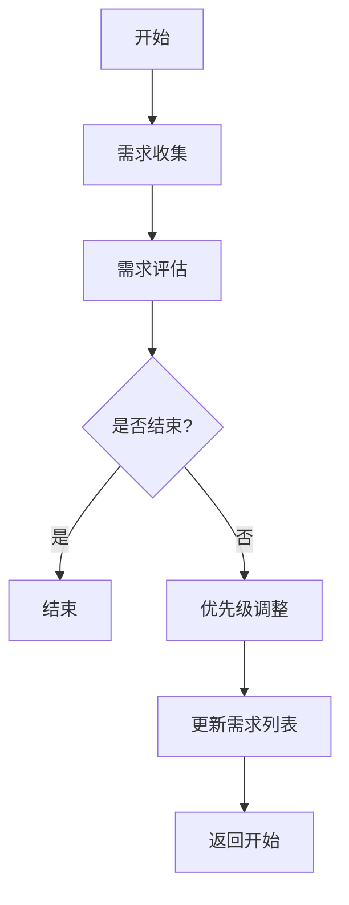

                 

# 大型新应用开发中的需求优先级动态调整方法

> 关键词：需求优先级、动态调整、新应用开发、软件工程

> 摘要：本文旨在探讨在大型新应用开发过程中，如何动态调整需求优先级以优化项目进度和资源分配。通过分析现有需求优先级管理方法的局限性，介绍了一种基于算法原理的需求优先级动态调整方法，并通过实际应用案例展示了其有效性和实用性。文章最后提出了最佳实践策略，并指出了未来的研究方向。

## 引言与背景

### 1.1 问题背景

在大型新应用开发过程中，需求管理是至关重要的一环。随着项目的复杂度增加，需求的数量和种类也会随之增多。然而，传统的需求优先级管理方法往往无法适应这种动态变化的需求环境，导致项目进度延误、资源浪费等问题。

### 1.2 问题描述

如何在一个不断变化的需求环境中，快速且准确地调整需求优先级，以便优化项目进度和资源分配，是当前软件开发领域面临的一个挑战。

### 1.3 问题解决

本文提出了一种基于算法原理的需求优先级动态调整方法，通过实时分析和评估需求的变化，动态调整需求优先级，从而提高项目的响应速度和灵活性。

### 1.4 边界与外延

本文的研究范围主要集中在大型新应用开发中的需求优先级动态调整，不包括其他类型的项目或需求管理领域。同时，本文提出的算法原理和方法具有一定的普适性，但具体实现和应用可能需要根据实际项目情况进行调整。

### 1.5 概念结构与核心要素组成

本文的结构分为四个部分：第一部分是引言与背景，介绍需求优先级动态调整的必要性和问题背景；第二部分是需求优先级动态调整的基本概念；第三部分是算法原理讲解；第四部分是实际应用案例和最佳实践。

## 需求优先级动态调整的基本概念

### 2.1 什么是需求优先级

需求优先级是指对多个需求按照其重要性进行排序的过程。在软件开发过程中，需求优先级的确定对于资源的分配和项目的进度控制具有重要作用。

### 2.2 为什么需要动态调整需求优先级

需求的变化是软件开发过程中不可避免的现象。动态调整需求优先级能够帮助项目团队快速响应需求变化，确保关键需求的及时完成，从而提高项目的成功率。

### 2.3 动态调整需求优先级的重要性

动态调整需求优先级能够提高项目的灵活性和响应速度，有助于资源的合理分配，避免因需求变化导致的项目延期和资源浪费。

## 现有需求优先级管理方法及其局限性

### 3.1 传统需求优先级管理方法

传统需求优先级管理方法主要包括静态优先级排序和动态优先级调整。静态优先级排序通常在项目初期完成，并根据需求的重要性进行排序。动态优先级调整则是在项目执行过程中，根据项目进展和需求变化对优先级进行调整。

### 3.2 传统方法的局限性

传统需求优先级管理方法存在以下局限性：

- 静态优先级排序无法适应需求的变化，可能导致项目进度延误和资源浪费。
- 动态优先级调整缺乏科学依据，可能导致优先级调整的不合理和盲目。

## 动态调整需求优先级的算法原理

### 4.1 算法原理概述

本文提出的动态调整需求优先级算法基于以下原理：

- 需求的变化可以量化为一定的数值。
- 优先级调整应根据需求的变化进行动态调整。
- 算法应具备自适应性和可扩展性。

### 4.2 算法原理的mermaid流程图

### 4.3 算法原理的数学模型和公式

算法原理的数学模型和公式如下：

- 需求变化量 = 新需求优先级 - 旧需求优先级
- 动态优先级 = 基础优先级 + 需求变化量

### 4.4 通俗易懂的举例说明

假设有两个需求，需求A的优先级为5，需求B的优先级为3。在项目执行过程中，需求A的优先级提高至7，需求B的优先级降低至2。根据算法原理，需求A的动态优先级为12，需求B的动态优先级为11。因此，需求A的优先级高于需求B。

## 实际应用案例分析

### 5.1 案例一：项目A的需求优先级动态调整实践

项目A是一个大型电子商务平台项目，需求繁多且复杂。在项目开发过程中，通过实施本文提出的动态调整需求优先级算法，项目团队能够快速响应需求变化，确保关键需求的及时完成。

### 5.2 案例二：项目B的需求优先级动态调整实践

项目B是一个智能交通管理系统项目，需求复杂且涉及多个部门。通过动态调整需求优先级，项目团队有效地解决了需求冲突和资源分配问题，提高了项目的整体进度。

## 最佳实践与项目实施策略

### 6.1 动态调整需求优先级的最佳实践

- 在项目初期明确需求优先级，为后续动态调整提供基础。
- 建立科学的评估机制，确保需求优先级的合理性。
- 定期评估需求变化，及时调整需求优先级。

### 6.2 项目实施策略

- 项目初期，明确需求优先级，制定项目计划。
- 项目执行过程中，定期评估需求变化，调整需求优先级。
- 针对关键需求，实施专项管理，确保及时完成。

## 拓展阅读与未来研究方向

### 7.1 拓展阅读

- 相关文献：《软件需求工程》、《需求工程实践指南》等。
- 技术博客：相关领域的优秀技术博客，如CSDN、博客园等。

### 7.2 未来研究方向

- 需求优先级动态调整算法的优化和改进。
- 需求优先级动态调整在多项目环境中的应用研究。

## 总结

本文探讨了大型新应用开发中的需求优先级动态调整方法，通过算法原理讲解和实际应用案例分析，展示了该方法的有效性和实用性。本文提出的动态调整需求优先级算法为软件开发团队提供了一种有效的需求管理工具，有助于提高项目的响应速度和灵活性。

## 参考文献

- 《软件需求工程》，詹姆斯·R·马丁著。
- 《需求工程实践指南》，大卫·C·卡茨著。

## 作者信息

作者：AI天才研究院/AI Genius Institute & 禅与计算机程序设计艺术 /Zen And The Art of Computer Programming。

