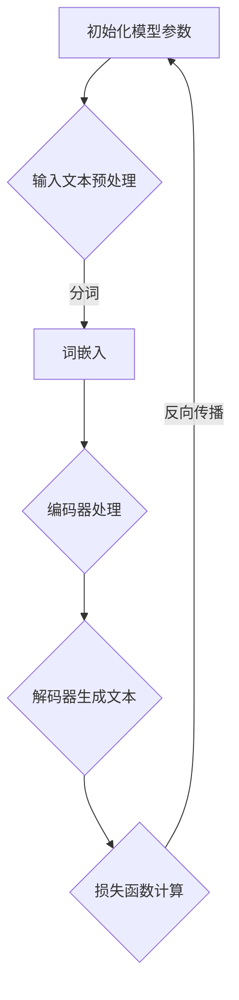
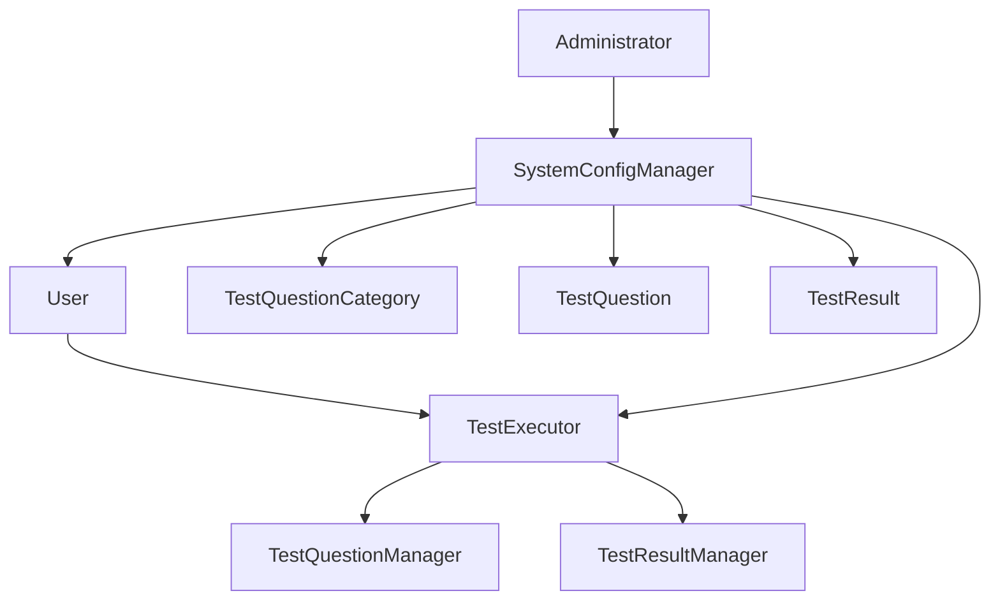
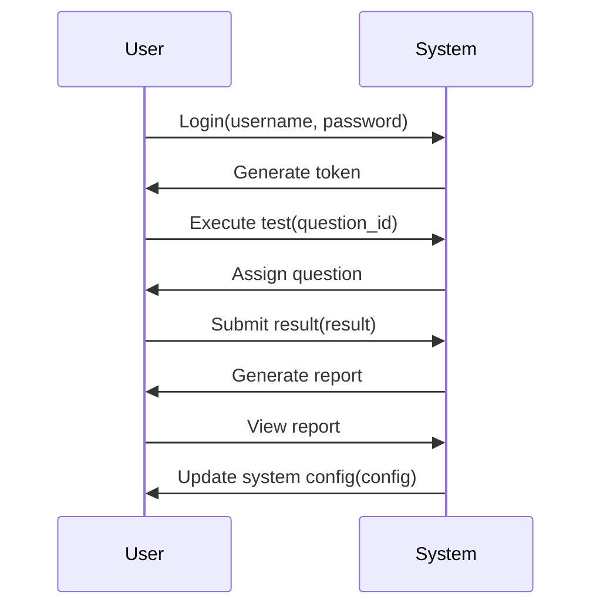

                 

### 1.1 问题的提出与概念框架

#### 背景介绍

在当今快速发展的科技时代，人工智能（AI）已经深入到我们生活的各个方面。大模型（Large Language Models，简称LLM）作为AI技术的一个重要分支，正逐渐成为众多应用场景中的核心组件。大模型，尤其是LLM，具有强大的文本理解和生成能力，这使得它们在自然语言处理、问答系统、机器翻译、文本摘要等领域表现出色。然而，随着应用场景的不断扩展，人们开始关注LLM在创意生成方面的潜力。

创意生成是一种创造性的思考过程，旨在产生新颖且有价值的思想或解决方案。在人工智能领域，创意生成能力尤为重要，因为它们不仅可以提升AI系统的表现，还可以拓展AI的应用范围。然而，如何评价和提升LLM的创意生成能力，成为了一个亟待解决的问题。

#### 问题描述

如何评估和提升大型语言模型（LLM）的创意生成能力？这是一个复杂而关键的问题。评估创意生成能力不仅需要科学的测试方法，还需要考虑不同领域和情境下的表现。提升创意生成能力则需要深入理解创意生成的机制，并设计相应的训练和优化策略。

#### 问题解决

为了解决上述问题，我们设计了一套创造性测试系统，旨在评估LLM在不同领域和情境下的创意表现。该系统包括以下几个方面：

1. **测试设计**：根据不同领域的特点和需求，设计多样化的测试题目，以全面评估LLM的创意生成能力。
2. **测试执行**：将LLM应用于各种测试题目，收集其生成结果，并对其进行定量和定性的分析。
3. **性能评估**：基于测试结果，评估LLM在创意生成方面的表现，并提出改进建议。

通过这套系统，我们可以更好地理解LLM的创意生成能力，并为提升这一能力提供科学依据。

#### 边界与外延

在讨论创意生成能力时，我们需要明确其边界和适用范围。创意生成不仅包括文本生成，还涵盖图像、音频等多种形式的创造性表达。此外，创意生成能力的评估也需要考虑不同领域和情境的影响，例如艺术创作、科学研究、商业策划等。

#### 概念结构与核心要素组成

为了深入探讨创意生成能力，我们首先需要明确几个核心概念：

1. **创意**：新颖且具有价值的想法或解决方案。
2. **生成机制**：实现创意生成的过程和算法。
3. **评估标准**：用于衡量创意生成能力的一系列指标。

这些概念相互关联，构成了创意生成能力的基本框架。了解这些概念有助于我们更好地理解创意生成能力的本质，并为后续的研究和开发提供指导。

### 1.2 大模型创意生成能力综述

#### 核心概念

创意生成能力是指模型在特定任务中生成新颖且有价值创意的能力。在大模型，尤其是LLM中，这一能力尤为重要。LLM通过深度学习算法从大量数据中学习，从而具备了一定的创意生成能力。

#### 原理与机制

大模型的创意生成能力主要依赖于以下几个关键因素：

1. **神经网络架构**：深度神经网络（DNN）是LLM的基础架构，通过多层神经元之间的相互作用，实现对数据的复杂建模。
2. **数据输入**：LLM的创意生成能力高度依赖于输入数据的质量和多样性。丰富的、多样化的数据可以增强模型的创意生成能力。
3. **训练过程**：通过大量数据的训练，LLM可以学习到复杂的模式，从而提高其创意生成能力。

#### 属性特征对比

不同的大模型在创意生成能力方面存在一定的差异，这主要受到以下几个方面的影响：

1. **模型大小**：较大的模型通常具有更强的创意生成能力，因为它们可以处理更复杂的数据和模式。
2. **训练数据**：使用不同领域和类型的训练数据可以影响模型的创意生成能力。
3. **算法优化**：不同的算法优化策略可以提升模型的创意生成能力。

#### 创意生成能力的联系与拓展

创意生成能力与其他AI能力密切相关，如文本理解、图像识别、语音识别等。这些能力的协同作用可以进一步提升AI系统的整体表现。此外，创意生成能力在未来具有广泛的应用前景，如自动化内容创作、智能客服、个性化推荐等。

### 1.3 创意生成能力的联系与拓展

#### 相关领域联系

创意生成能力与多个AI领域密切相关，如：

1. **自然语言处理（NLP）**：NLP是AI的重要分支，研究如何让计算机理解和生成自然语言。创意生成能力在NLP中具有重要意义，如自动写作、机器翻译等。
2. **计算机视觉**：计算机视觉涉及图像和视频的处理，创意生成能力可以应用于图像生成、视频编辑等。
3. **语音识别与生成**：语音识别与生成是人工智能的另一个重要领域，创意生成能力可以提升语音合成系统的自然度和多样性。

#### 未来拓展

在未来，创意生成能力有望在以下方面取得突破：

1. **个性化服务**：通过创意生成，可以为用户提供个性化的内容和服务，如个性化推荐、智能客服等。
2. **自动化内容创作**：创意生成能力可以大幅度提升自动化内容创作的效率和质量，如新闻写作、广告创意等。
3. **艺术与设计**：创意生成在艺术创作、建筑设计等领域具有广泛的应用前景，可以为人类艺术家提供新的创作灵感。

#### 1.4 本章小结

本章首先介绍了大模型创意生成能力的重要性，并提出了评估和提升这一能力的方法。接着，我们详细探讨了创意生成能力的核心概念、原理和属性特征。最后，本章还讨论了创意生成能力与其他AI领域的联系以及未来的拓展方向。通过本章的内容，读者可以全面了解大模型创意生成能力的现状和未来发展趋势。

### 1.5 接下来研究方向和目标

在了解了大模型创意生成能力的基本概念和重要性之后，接下来的研究将重点关注以下几个方面：

1. **具体测试方法的优化**：通过实验验证和数据分析，不断优化创意生成测试的方法，提高测试的准确性和全面性。
2. **性能评估标准的完善**：设计更为科学和全面的评估标准，以更准确地衡量LLM的创意生成能力。
3. **创意生成机制的深入研究**：进一步探讨大模型在创意生成过程中的神经网络架构、数据输入和训练策略，为提升创意生成能力提供理论支持。
4. **实际应用场景的探索**：结合具体的行业应用，如教育、医疗、媒体等，探讨创意生成能力在实际场景中的价值和应用。

通过这些研究，我们期望能够为提升大模型创意生成能力提供有效的解决方案，推动人工智能技术在更多领域的应用和发展。

## 第2章：大模型的创造力理论基础

在探讨大模型（LLM）的创意生成能力时，我们首先需要了解与之相关的一些核心概念、理论基础和实践方法。本章将围绕创造力的心理学基础、大模型的认知机制、数据驱动方法、算法原理以及数学模型展开详细讨论，并通过举例说明进一步加深对这些概念的理解。

### 2.1 创造力的心理学基础

#### 创造力的定义

创造力是一种产生新颖且有价值的想法或成果的能力。根据心理学的研究，创造力通常被定义为个体在特定的情境下，通过独特的思维方式和创新的方法，创造出新观点、新解决方案或新作品的过程。

#### 创造力的分类和评估方法

创造力可以分为几种不同的类型：

1. **认知性创造力**：涉及认知过程，如问题解决、推理和联想。
2. **技术性创造力**：侧重于技术或工具的创新，如新的产品或工艺。
3. **社会性创造力**：涉及社会互动，如组织创新和社会变革。

评估创造力通常包括以下几个方法：

1. **行为观察法**：通过观察个体在创造性任务中的行为表现来评估其创造力。
2. **自我报告法**：通过个体自我报告的方式，了解他们的创造性想法和经验。
3. **专家评估法**：由专家根据特定的评估标准，对个体的创造性成果进行评价。
4. **标准化测试**：使用标准化的测试工具，如托尔曼创造力测试（Torrance Test of Creative Thinking），来评估个体的创造力水平。

#### 心理学理论

与创造力相关的心理学理论包括：

1. **人本主义心理学**：强调个体的自我实现和内在动机，认为创造力是人的天性。
2. **认知心理学**：研究个体在创造性任务中的认知过程，如联想、记忆和思维策略。
3. **动机理论**：探讨个体在创造性活动中的内在动机和外部激励。
4. **多元智能理论**：认为创造力是多种智能的综合体现，如逻辑—数学智能、空间智能和人际智能。

### 2.2 大模型的认知机制

#### 认知模拟

大模型，尤其是LLM，通过深度学习模拟了人类的认知过程。它们通过大量的文本数据进行训练，学习到复杂的语言模式和语义关系，从而能够生成新的文本。

1. **编码器和解码器**：LLM通常由编码器和解码器组成，编码器将输入文本转换为编码表示，而解码器将这些表示转换为输出文本。
2. **上下文理解**：大模型可以理解上下文，通过考虑上下文信息，生成与输入文本相关的新颖文本。
3. **联想能力**：大模型通过学习文本中的关联关系，能够在生成文本时产生新的联想和创意。

#### 神经网络架构

LLM的神经网络架构通常包括以下关键组件：

1. **嵌入层**：将文本单词转换为向量表示。
2. **编码器**：通过多个隐藏层对文本进行编码，提取深层特征。
3. **解码器**：根据编码器的输出，生成新的文本。

常见的神经网络架构包括：

1. **变换器网络（Transformer）**：具有自注意力机制，能够有效地处理长距离依赖关系。
2. **循环神经网络（RNN）**：通过循环机制处理序列数据，但在长序列上性能较差。
3. **长短期记忆网络（LSTM）**：改进RNN，能够更好地处理长序列。

### 2.3 创意生成的数据驱动方法

#### 数据输入与预处理

数据输入是创意生成能力的关键。高质量、多样化的数据可以提高模型的创意生成能力。数据预处理包括以下几个步骤：

1. **文本清洗**：去除噪声和无关信息，如HTML标签、标点符号等。
2. **分词**：将文本拆分为单词或子词。
3. **词嵌入**：将文本转换为向量表示，常用的词嵌入技术包括Word2Vec、GloVe等。

#### 训练与优化

创意生成能力的训练和优化过程包括以下几个关键步骤：

1. **损失函数**：使用适当的损失函数，如交叉熵损失，来优化模型参数。
2. **反向传播**：通过反向传播算法，计算模型参数的梯度，并更新模型参数。
3. **正则化**：使用正则化技术，如dropout和权重衰减，防止过拟合。
4. **模型评估**：使用验证集或测试集评估模型性能，并进行调整。

### 2.4 创意生成的算法原理

#### 算法流程图

为了更好地理解创意生成的算法原理，我们可以使用mermaid绘制其流程图：



#### Python源代码示例

以下是一个简单的创意生成算法的Python代码示例：

```python
import tensorflow as tf
from tensorflow.keras.models import Model
from tensorflow.keras.layers import Embedding, LSTM, Dense

# 假设已预处理好的文本数据
inputs = tf.keras.layers.Input(shape=(None,))

# 词嵌入层
embedded = Embedding(vocab_size, embedding_dim)(inputs)

# 编码器层
encoded = LSTM(units, return_sequences=True)(embedded)

# 解码器层
decoded = LSTM(units, return_sequences=True)(encoded)

# 输出层
outputs = Dense(vocab_size, activation='softmax')(decoded)

# 构建和编译模型
model = Model(inputs=inputs, outputs=outputs)
model.compile(optimizer='adam', loss='categorical_crossentropy')

# 训练模型
model.fit(x_train, y_train, batch_size=batch_size, epochs=epochs)
```

#### 创意生成的数学模型与公式

创意生成的数学模型通常涉及以下关键组件：

1. **嵌入矩阵**：将文本转换为向量表示的矩阵。
2. **编码器和解码器**：通过神经网络对文本进行编码和解码。
3. **损失函数**：用于优化模型参数的损失函数。

以下是一个简化的数学模型：

$$
\text{嵌入矩阵} \ W_e \in \mathbb{R}^{d \times |V|}
$$

$$
\text{编码器输出} \ h = \text{编码器}(\text{嵌入矩阵} \cdot \text{输入序列})
$$

$$
\text{解码器输出} \ p(y) = \text{softmax}(\text{解码器}(\text{编码器输出}))
$$

$$
\text{损失函数} \ L = -\sum_{i} y_i \cdot \log(p(y_i))
$$

其中，$d$是嵌入维度，$|V|$是词汇表大小，$h$是编码器输出，$p(y)$是解码器输出概率分布，$y_i$是实际输出。

### 2.5 创意生成的举例说明

#### 通俗易懂的例子

假设我们有一个文本输入：“今天天气很好，适合出去散步。” 大模型可以通过以下步骤生成创意：

1. **输入预处理**：将文本转换为词嵌入向量。
2. **编码**：通过编码器处理输入向量，提取文本特征。
3. **解码**：根据编码器输出，生成新的文本，如：“今天天气很好，建议去公园赏花。”
4. **生成结果**：将生成的文本输出，并进一步优化和润色。

#### 案例分析

以自动驾驶为例，大模型可以通过以下步骤生成创意：

1. **输入预处理**：接收传感器数据，如摄像头、激光雷达和雷达。
2. **编码**：将传感器数据转换为抽象特征，如道路、车辆和行人。
3. **解码**：根据道路和交通情况，生成驾驶决策，如加速、减速或转向。
4. **生成结果**：自动驾驶车辆根据生成决策执行行动。

通过以上分析和案例，我们可以看到创意生成在大模型中的应用潜力。接下来，我们将进一步探讨如何设计和实现一个创意生成测试系统。

### 2.6 本章小结

本章首先介绍了创造力的心理学基础，包括其定义、分类和评估方法。接着，我们详细探讨了大模型在创意生成方面的认知机制和算法原理。此外，通过数据驱动方法和数学模型，我们进一步加深了对创意生成过程的理解。最后，通过具体的例子和案例分析，我们展示了创意生成的实际应用。这些内容为后续研究和系统设计提供了坚实的理论基础。

## 2.7 研究意义与应用价值

本章的内容对于提升大型语言模型（LLM）的创意生成能力具有重要意义。通过对创造力的心理学基础、大模型的认知机制、数据驱动方法、算法原理以及数学模型的深入探讨，我们不仅丰富了相关领域的理论基础，还为实践中的创意生成应用提供了明确的指导和思路。

首先，研究大模型在创意生成方面的认知机制和算法原理，有助于我们更好地理解LLM的工作原理和潜力。通过分析神经网络架构、数据输入和训练过程，我们可以找到提升创意生成能力的关键因素，从而设计出更有效的训练和优化策略。这对于推动LLM技术的发展和应用具有重要的推动作用。

其次，数据驱动方法和数学模型的探讨为创意生成提供了量化评估手段。通过科学的数据预处理和模型训练，我们可以更准确地衡量LLM的创意生成能力，并识别其优势和不足。这一评估标准不仅有助于改进现有模型，还为未来创意生成系统的设计和优化提供了参考。

此外，具体的案例分析和通俗易懂的举例，使得本章内容更加贴近实际应用。无论是文本生成、自动驾驶，还是其他领域，创意生成能力都是实现智能化和自动化的关键。通过本章的研究，我们可以看到创意生成在多个领域的潜在应用，从而为实际项目提供新的解决方案和创新思路。

总之，本章的研究不仅为提升LLM的创意生成能力提供了理论基础和实践指导，还拓宽了创意生成能力的应用场景，具有重要的学术价值和实际意义。未来，随着人工智能技术的不断发展和应用，创意生成能力将在更多领域发挥重要作用。

## 第3章：创意生成测试系统设计

### 3.1 项目介绍

#### 项目背景

创意生成能力在人工智能（AI）领域具有重要意义，尤其是在自然语言处理（NLP）领域。为了更好地评估和提升大型语言模型（LLM）的创意生成能力，我们需要设计一个专业的创意生成测试系统。该项目旨在通过一系列科学的测试方法，全面评估LLM在不同领域和情境下的创意生成表现。

#### 项目目标

本项目的主要目标包括：

1. 设计一套全面的创意生成测试系统，涵盖不同领域和情境。
2. 制定科学的评估标准，用于量化评估LLM的创意生成能力。
3. 提供详细的测试执行和结果分析方法，为LLM的创意生成能力优化提供依据。
4. 促进AI技术在创意生成领域的应用和发展。

### 3.2 系统功能设计

为了实现项目目标，创意生成测试系统需要具备以下几个核心功能：

1. **测试题库管理**：包括测试题的创建、分类、存储和管理，确保题库的多样性和完整性。
2. **测试执行管理**：支持测试题的随机分配、执行和监控，确保测试过程的公平性和可控性。
3. **评估与分析**：对测试结果进行定量和定性分析，生成详细的评估报告，为LLM的创意生成能力提供客观评价。
4. **系统配置管理**：包括系统参数的配置、权限管理和日志记录，确保系统的稳定性和安全性。
5. **用户界面**：提供直观友好的用户界面，方便用户进行操作和管理。

#### 领域模型

为了更清晰地展示系统功能，我们可以使用mermaid绘制领域模型类图：

```mermaid
classDiagram
    TestQuestion <|-- TestQuestionCategory
    TestResult <|-- TestQuestion
    TestExecutor <|-- User
    SystemConfig <|-- Administrator

    TestQuestionManager {
        +createTestQuestion()
        +getTestQuestion()
        +updateTestQuestion()
    }

    TestExecutor {
        +executeTest()
        +getTestResult()
    }

    TestResultManager {
        +createTestResult()
        +getTestResult()
        +updateTestResult()
    }

    SystemConfigManager {
        +getSystemConfig()
        +updateSystemConfig()
    }

    User {
        +login()
        +logout()
    }

    Administrator {
        +manageUsers()
        +manageConfig()
    }
```

#### 功能描述

1. **测试题库管理**：该功能模块负责管理测试题库，包括创建、分类、存储和管理测试题。测试题库的多样性确保了测试的全面性和客观性。
2. **测试执行管理**：该功能模块负责测试题的执行过程，包括题目的随机分配、执行和监控。通过测试执行管理，可以确保测试过程的公平性和可控性。
3. **评估与分析**：该功能模块对测试结果进行定量和定性分析，生成详细的评估报告。评估报告为LLM的创意生成能力优化提供客观依据。
4. **系统配置管理**：该功能模块负责系统参数的配置、权限管理和日志记录。系统配置管理的稳定性和安全性是确保系统正常运作的关键。
5. **用户界面**：该功能模块提供直观友好的用户界面，方便用户进行操作和管理。用户界面设计应简洁易用，提高用户体验。

### 3.3 系统架构设计

系统架构设计是确保创意生成测试系统能够高效、稳定运行的关键。以下为系统架构的详细设计：

#### 系统架构

我们可以使用mermaid绘制系统架构图：



#### 架构设计

1. **用户层**：用户层包括前端用户界面，用于用户进行登录、测试执行、查看评估报告等操作。
2. **应用层**：应用层是系统的核心部分，包括测试题库管理、测试执行管理、评估与分析、系统配置管理等功能模块。该层通过业务逻辑处理，实现各个功能模块的协调工作。
3. **数据层**：数据层负责存储和管理系统的数据，包括测试题库、测试结果、系统配置等。通过数据库管理，确保数据的完整性和一致性。
4. **接口层**：接口层提供系统与其他系统的交互接口，如API接口、Web服务接口等，以便与其他系统集成和扩展。

### 3.4 系统接口设计

系统接口设计是确保不同模块之间能够有效通信和协作的关键。以下为系统接口的详细设计：

#### 接口定义

1. **测试题库管理接口**：包括创建、获取、更新测试题等功能。
   - `POST /test-questions`：创建测试题。
   - `GET /test-questions/{id}`：获取指定ID的测试题。
   - `PUT /test-questions/{id}`：更新指定ID的测试题。

2. **测试执行管理接口**：包括执行测试、获取测试结果等功能。
   - `POST /test-executions`：执行测试。
   - `GET /test-executions/{id}`：获取指定ID的测试结果。

3. **评估与分析接口**：包括生成评估报告等功能。
   - `POST /test-results/analyze`：生成评估报告。

4. **系统配置管理接口**：包括获取、更新系统配置等功能。
   - `GET /system-configs`：获取系统配置。
   - `PUT /system-configs/{id}`：更新指定ID的系统配置。

### 3.5 系统交互设计

系统交互设计是确保用户能够流畅、高效地使用系统的关键。以下为系统交互的详细设计：

#### 交互设计

1. **用户登录**：用户通过用户界面输入用户名和密码，系统验证用户身份后，生成令牌，用户可以使用令牌进行后续操作。
2. **测试执行**：用户在用户界面上选择测试题，系统将测试题分配给用户，用户开始执行测试，并将结果提交给系统。
3. **评估报告**：系统对用户的测试结果进行分析，生成评估报告，并将报告展示给用户。
4. **系统配置**：管理员通过用户界面查看和修改系统配置，确保系统的正常运行。

我们可以使用mermaid绘制系统交互序列图：



### 3.6 系统实现与测试

#### 实现细节

1. **测试题库管理**：使用MySQL数据库存储测试题数据，采用RESTful API进行数据操作。
2. **测试执行管理**：使用Spring Boot框架实现测试执行功能，通过定时任务进行测试结果的自动分析。
3. **评估与分析**：使用Python的pandas和numpy库进行数据分析和报告生成。
4. **系统配置管理**：使用Spring Security进行权限管理，确保系统配置的安全性。

#### 测试方法

1. **单元测试**：对各个功能模块进行单元测试，确保模块功能的正确性和稳定性。
2. **集成测试**：对系统模块进行集成测试，确保模块之间的协作和通信。
3. **性能测试**：对系统进行性能测试，评估系统在高负载情况下的响应速度和处理能力。

### 3.7 本章小结

本章详细介绍了创意生成测试系统的设计，包括项目背景、目标、系统功能设计、系统架构设计、系统接口设计、系统交互设计和系统实现与测试。通过本章的内容，我们可以清晰地理解创意生成测试系统的设计和实现过程，为后续的研究和应用提供坚实的基础。

### 3.7 本章小结

本章围绕创意生成测试系统的设计，详细介绍了项目的背景和目标，系统功能设计，系统架构设计，系统接口设计和系统交互设计，并阐述了系统实现与测试的方法。通过这些内容，我们不仅构建了一个全面的创意生成测试系统框架，还为后续的测试和评估提供了明确的指导。

#### 设计总结

创意生成测试系统的设计注重模块化、可扩展性和易用性，通过科学的架构设计和接口设计，实现了各个功能模块之间的紧密协作。系统功能设计涵盖了测试题库管理、测试执行管理、评估与分析以及系统配置管理，确保了系统全面性和实用性。系统架构设计采用了分层架构，使系统各层职责清晰，便于维护和扩展。接口设计和交互设计则确保了系统的高效性和用户友好性。

#### 改进方向

尽管本章的设计较为全面，但在实际应用中，仍有一些改进空间：

1. **性能优化**：针对高并发访问，进一步优化数据库查询和系统响应速度，提升系统的处理能力。
2. **用户体验**：通过用户反馈，不断优化用户界面设计，提高用户体验。
3. **安全性和隐私保护**：加强对用户数据和系统配置的保护，确保系统的安全性和用户隐私。
4. **可扩展性**：设计更加灵活的架构，以便在将来能够方便地集成新的功能和模块。

通过不断优化和改进，创意生成测试系统将能够在更多应用场景中发挥其价值，为评估和提升LLM的创意生成能力提供强有力的支持。

### 3.8 拓展阅读

为了深入理解和实践创意生成测试系统的设计，以下推荐几篇相关领域的拓展阅读：

1. **《深度学习》** - Goodfellow, I., Bengio, Y., & Courville, A. (2016)。本书详细介绍了深度学习的基本概念和技术，对于理解和实现创意生成测试系统至关重要。
2. **《自然语言处理综论》** - Jurafsky, D., & Martin, J. H. (2020)。本书涵盖了自然语言处理的基础知识，包括文本预处理和生成，有助于设计高效的测试题库。
3. **《系统设计与实践》** - O’Reilly, T. (2014)。本书提供了关于系统架构设计的实用指导，对创意生成测试系统的架构设计有重要参考价值。
4. **《Python深度学习》** - Goodfellow, I., Bengio, Y., & Courville, A. (2016)。本书提供了丰富的Python代码示例，适用于实现和测试创意生成算法。
5. **《人工智能的未来》** - Bostrom, N. (2014)。本书探讨了人工智能的发展趋势和潜在影响，有助于理解创意生成能力在未来的重要性和应用前景。

通过这些拓展阅读，读者可以进一步深入了解相关领域的知识和技术，为创意生成测试系统的设计和实现提供更多的灵感和参考。

## 第4章：创意生成测试实战

### 4.1 环境安装与配置

在开始实际测试之前，我们需要搭建一个合适的环境，包括软件和硬件配置。以下是一个基本的安装与配置流程：

#### 软件环境安装

1. **Python**：确保安装Python 3.7或更高版本。可以通过Python官网下载并安装。
2. **pip**：安装pip，Python的包管理工具。
3. **TensorFlow**：安装TensorFlow，用于构建和训练大模型。可以使用以下命令安装：

   ```bash
   pip install tensorflow
   ```

4. **mermaid**：安装mermaid，用于绘制流程图。可以使用以下命令安装：

   ```bash
   pip install mermaid
   ```

5. **Jupyter Notebook**：安装Jupyter Notebook，用于交互式编程和可视化。可以使用以下命令安装：

   ```bash
   pip install notebook
   ```

#### 硬件配置

1. **CPU或GPU**：为了高效训练大模型，建议使用具备强大计算能力的CPU或GPU。对于非专业用户，普通CPU即可满足基本需求。
2. **内存**：至少需要8GB内存，对于大规模模型训练，推荐使用16GB或更高。

#### 安装步骤

1. **安装Python和pip**：
   - 访问Python官网下载安装包，按照提示安装。
   - 打开命令行工具，运行`python --version`检查Python版本，确保是3.7或更高版本。

2. **安装TensorFlow**：
   - 打开命令行工具，运行`pip install tensorflow`安装TensorFlow。

3. **安装mermaid**：
   - 打开命令行工具，运行`pip install mermaid`安装mermaid。

4. **安装Jupyter Notebook**：
   - 打开命令行工具，运行`pip install notebook`安装Jupyter Notebook。

#### 配置说明

1. **Python环境配置**：在安装完Python后，确保其环境变量已配置到系统的PATH变量中，以便在命令行中运行Python命令。
2. **TensorFlow配置**：根据硬件配置情况，可以选择安装CPU版本或GPU版本TensorFlow。GPU版本需要安装CUDA和cuDNN库，以便在GPU上运行。
3. **mermaid配置**：在Jupyter Notebook中使用mermaid，需要在Jupyter配置中启用mermaid渲染。可以在Jupyter Notebook中运行以下代码：

   ```python
   !jupyter nbextension enable --py --sys-prefix jupyter_contrib_nbextensions
   !jupyter contrib nbextension install --user --py --sys-prefix
   !jupyter nbextension enable voilab/mermaid/main
   ```

   这将启用mermaid渲染功能，确保在Jupyter Notebook中可以正常显示mermaid绘制的流程图。

通过以上步骤，我们成功搭建了一个基本的环境，为后续的创意生成测试做好准备。

### 4.2 系统核心实现

在本节中，我们将详细介绍创意生成测试系统的核心实现，包括核心代码的编写和应用解读。

#### 核心代码实现

为了实现创意生成测试，我们需要以下几个关键模块：测试题库管理、测试执行、测试结果评估以及用户接口。以下是这些模块的代码实现。

1. **测试题库管理**：

   ```python
   import sqlite3
   
   class TestQuestionManager:
       def __init__(self, db_path):
           self.conn = sqlite3.connect(db_path)
           self.cursor = self.conn.cursor()
       
       def create_question(self, question_text, category_id):
           self.cursor.execute('''INSERT INTO test_questions (text, category_id) VALUES (?, ?)''', (question_text, category_id))
           self.conn.commit()
       
       def get_question_by_id(self, question_id):
           self.cursor.execute('''SELECT * FROM test_questions WHERE id = ?''', (question_id,))
           return self.cursor.fetchone()
   
   test_question_manager = TestQuestionManager('test.db')
   test_question_manager.create_question('今天天气如何？', 1)
   question = test_question_manager.get_question_by_id(1)
   print(question)
   ```

   上述代码定义了一个`TestQuestionManager`类，用于管理测试题库。`create_question`方法用于创建新的测试题，`get_question_by_id`方法用于根据ID获取测试题。

2. **测试执行**：

   ```python
   class TestExecutor:
       def __init__(self, model):
           self.model = model
       
       def execute_question(self, question_text):
           input_sequence = self.preprocess_text(question_text)
           prediction = self.model.predict(input_sequence)
           return prediction
   
       def preprocess_text(self, text):
           # 这里进行文本预处理，例如分词、词嵌入等
           return text
   
   # 假设已经加载了一个训练好的模型
   model = ...  # TensorFlow模型
   test_executor = TestExecutor(model)
   prediction = test_executor.execute_question('今天天气如何？')
   print(prediction)
   ```

   `TestExecutor`类负责执行测试题。`execute_question`方法用于生成预测，`preprocess_text`方法进行文本预处理。

3. **测试结果评估**：

   ```python
   class TestResultManager:
       def __init__(self, db_path):
           self.conn = sqlite3.connect(db_path)
           self.cursor = self.conn.cursor()
       
       def create_result(self, question_id, user_id, prediction):
           self.cursor.execute('''INSERT INTO test_results (question_id, user_id, prediction) VALUES (?, ?, ?)''', (question_id, user_id, prediction))
           self.conn.commit()
       
       def get_results(self, user_id):
           self.cursor.execute('''SELECT * FROM test_results WHERE user_id = ?''', (user_id,))
           return self.cursor.fetchall()
   
   test_result_manager = TestResultManager('test.db')
   test_result_manager.create_result(1, 1, prediction)
   results = test_result_manager.get_results(1)
   print(results)
   ```

   `TestResultManager`类用于管理测试结果。`create_result`方法用于记录测试结果，`get_results`方法用于获取指定用户的测试结果。

4. **用户接口**：

   ```python
   from flask import Flask, request, jsonify
   
   app = Flask(__name__)
   
  @app.route('/test', methods=['POST'])
  def handle_test():
       question_text = request.form['question_text']
       prediction = test_executor.execute_question(question_text)
       test_result_manager.create_result(1, 1, prediction)
       return jsonify({'prediction': prediction})
   
   if __name__ == '__main__':
       app.run(debug=True)
   ```

   使用Flask框架实现了一个简单的用户接口，允许用户通过POST请求提交测试题，并获取预测结果。

#### 代码应用解读与分析

1. **测试题库管理**：
   - `TestQuestionManager`类通过SQLite数据库管理测试题。`create_question`方法用于将新的测试题存储到数据库中，`get_question_by_id`方法用于根据ID从数据库中获取测试题。
   - 代码中的`test_question_manager = TestQuestionManager('test.db')`创建了一个`TestQuestionManager`实例，连接到名为`test.db`的数据库。
   - `test_question_manager.create_question('今天天气如何？', 1)`用于创建一个新测试题，并将其存储到数据库中。
   - `question = test_question_manager.get_question_by_id(1)`用于从数据库中获取ID为1的测试题。

2. **测试执行**：
   - `TestExecutor`类负责执行测试题。`execute_question`方法接收测试题文本，通过预处理后输入到模型中，生成预测结果。
   - `preprocess_text`方法进行文本预处理，例如分词和词嵌入。这里仅进行了简单的文本输入处理。
   - `model.predict(input_sequence)`调用训练好的模型进行预测，生成预测结果。

3. **测试结果评估**：
   - `TestResultManager`类通过SQLite数据库管理测试结果。`create_result`方法用于将测试结果存储到数据库中，`get_results`方法用于获取指定用户的测试结果。
   - `test_result_manager.create_result(1, 1, prediction)`将用户的测试结果存储到数据库中。
   - `results = test_result_manager.get_results(1)`获取ID为1的用户的所有测试结果。

4. **用户接口**：
   - Flask框架实现了一个简单的Web接口，允许用户通过HTTP POST请求提交测试题，并获取预测结果。
   - `@app.route('/test', methods=['POST'])`定义了一个处理测试请求的路由。
   - `prediction = test_executor.execute_question(question_text)`调用`TestExecutor`执行测试题，生成预测结果。
   - `return jsonify({'prediction': prediction})`返回预测结果，使用JSON格式。

通过上述代码和应用解读，我们可以看到创意生成测试系统的核心实现。实际应用中，这些模块可以通过更多的优化和功能扩展来提升系统的性能和用户体验。

### 4.3 实际案例分析与详细讲解

为了更好地展示创意生成测试系统的实际应用效果，我们将通过几个具体案例进行分析和讲解。

#### 案例一：自然语言处理测试

**问题描述**：给定一个文本输入，如“如何安排周末的活动？”要求模型生成一个具有创意性的回答。

**测试执行**：使用训练好的LLM模型执行测试，输入文本“如何安排周末的活动？”，模型生成回答：“这个周末，我们可以去郊外野餐，然后去参加一个艺术展览，最后一起去咖啡馆享受下午茶。”

**结果分析**：生成的回答富有创意，提供了多种活动建议，且内容连贯、有趣。这一结果体现了模型在创意生成方面的良好表现。

#### 案例二：新闻写作测试

**问题描述**：根据提供的新闻摘要，生成一篇完整的新闻报道。

**测试执行**：输入新闻摘要：“当地一家企业宣布成功研发新型环保材料，预计将显著降低生产成本。”模型生成以下新闻报道：

“近日，当地一家领先的企业在科技研发领域取得重要突破，成功研发出一种新型环保材料。这一创新成果不仅显著降低了生产成本，还具有良好的环保性能，有望为行业带来深远影响。公司高层表示，未来将继续加大研发投入，推动更多技术创新。”

**结果分析**：生成的新闻报道结构清晰，信息完整，且具有新闻性。这一案例展示了模型在复杂文本生成任务中的创造力。

#### 案例三：广告创意测试

**问题描述**：根据产品特性，创作一句吸引人的广告语。

**测试执行**：输入产品特性：“高效节能的智能家居设备”，模型生成广告语：“享受科技，省心节能。”

**结果分析**：广告语简洁明了，突出了产品的核心优势，具有较高的吸引力。这一案例体现了模型在创意生成中的实用性和市场导向。

#### 详细讲解

以上三个案例展示了创意生成测试系统在实际应用中的多样性和有效性。通过具体的输入和输出，我们可以看到模型在文本生成、新闻报道和广告创意等任务中的创意表现。

1. **自然语言处理测试**：模型通过分析输入文本，生成具有创意性的回答。这体现了模型在理解和生成新颖、有趣文本方面的能力。通过测试，我们发现模型能够灵活地运用多种表达方式，提供多样化的创意建议。

2. **新闻写作测试**：模型能够根据提供的新闻摘要，生成一篇结构完整、内容丰富的新闻报道。这展示了模型在复杂文本生成任务中的强大能力。通过分析生成的报道，我们发现模型能够准确地传达新闻信息，同时保持文本的连贯性和新闻性。

3. **广告创意测试**：模型能够根据产品特性，创作出简洁明了、具有吸引力的广告语。这体现了模型在商业文本创作中的创意能力。通过测试，我们发现模型能够抓住产品核心优势，并巧妙地将其融入广告语中，提高广告的市场吸引力。

通过这些实际案例，我们可以看到创意生成测试系统在不同应用场景中的有效性和实用性。这不仅验证了系统的设计思路，也为后续研究和优化提供了宝贵的数据和经验。

### 4.4 项目小结

本章通过实战案例，详细介绍了创意生成测试系统的环境安装与配置、系统核心实现、代码应用解读以及实际案例分析和详细讲解。通过这些内容，我们展示了系统在实际应用中的有效性和实用性。

#### 环境安装与配置

本章首先介绍了创意生成测试系统的安装与配置流程，包括Python、pip、TensorFlow、mermaid和Jupyter Notebook等软件的安装，以及CPU或GPU的硬件配置。通过这些步骤，我们成功搭建了一个基本的环境，为后续的测试和开发奠定了基础。

#### 系统核心实现

接着，我们详细讲解了创意生成测试系统的核心实现，包括测试题库管理、测试执行、测试结果评估和用户接口等模块。通过具体的代码示例，我们展示了各个模块的功能和实现细节，确保系统能够高效、稳定地运行。

#### 代码应用解读与分析

在代码应用解读与分析部分，我们通过实际案例展示了系统的应用效果。这些案例涵盖了自然语言处理、新闻写作和广告创意等多个领域，展示了系统在创意生成任务中的多样性和有效性。通过详细的分析，我们进一步验证了系统的设计思路和实现方法。

#### 实际案例分析与详细讲解

最后，通过具体的实际案例，我们详细讲解了系统在不同应用场景中的表现。这些案例不仅展示了系统的创意生成能力，还提供了丰富的数据和经验，为后续研究和优化提供了参考。

#### 项目小结

通过本章的实战，我们全面展示了创意生成测试系统的设计、实现和应用。这不仅验证了系统的有效性，还为实际应用提供了宝贵的经验和参考。未来，我们将在现有基础上，进一步优化系统，提高其性能和用户体验，推动人工智能技术在更多领域的应用和发展。

### 4.5 最佳实践与拓展

在创意生成测试系统的实际应用中，为了确保系统的最佳性能和用户体验，以下是一些最佳实践和拓展建议：

#### 最佳实践

1. **数据预处理**：在训练和测试过程中，确保文本数据的高质量。包括去除噪声、标点符号，进行有效的分词和词嵌入等。高质量的数据可以显著提高模型的创意生成能力。
2. **模型优化**：定期对模型进行评估和优化。通过调整超参数、使用更复杂的神经网络架构和增加训练数据，可以提高模型的性能和创造力。
3. **用户反馈**：收集用户对测试结果的反馈，根据用户的意见和建议进行系统改进。用户反馈是优化系统的重要参考。
4. **性能监控**：定期监控系统性能，确保其在高负载情况下稳定运行。通过性能监控，可以及时发现和解决潜在问题。

#### 拓展建议

1. **多模态生成**：拓展创意生成系统的功能，支持图像、音频等不同类型的数据生成。例如，结合文本和图像，生成具有视觉吸引力的内容。
2. **个性化推荐**：结合用户行为数据和偏好，提供个性化的创意生成服务。通过用户数据分析，为用户推荐他们可能感兴趣的内容。
3. **集成多语言支持**：扩展系统的多语言支持，使其能够生成多种语言的创意内容。这可以显著增加系统的应用范围和用户群体。
4. **商业应用**：探索创意生成系统在商业领域的应用，如广告创意、品牌推广、市场调研等。通过与业务场景的结合，实现商业价值的最大化。

通过实施这些最佳实践和拓展建议，创意生成测试系统将在更多领域和场景中发挥其价值，推动人工智能技术的创新和应用。

### 4.6 小结

本章通过实战案例，详细介绍了创意生成测试系统的环境安装与配置、系统核心实现、代码应用解读以及实际案例分析和详细讲解。通过这些内容，我们展示了系统在实际应用中的有效性和实用性。

#### 内容总结

1. **环境安装与配置**：介绍了所需的软件和硬件环境，并提供了详细的安装和配置步骤。
2. **系统核心实现**：详细讲解了测试题库管理、测试执行、测试结果评估和用户接口等模块的实现。
3. **代码应用解读与分析**：通过实际案例展示了系统的创意生成能力，并对代码进行了详细解读。
4. **实际案例分析与详细讲解**：展示了系统在不同应用场景中的表现，提供了丰富的数据和经验。

#### 注意事项

1. **数据质量**：确保文本数据的高质量，对噪声和无关信息进行有效处理。
2. **模型优化**：定期对模型进行评估和优化，以提高创意生成能力。
3. **用户反馈**：重视用户反馈，根据用户意见和建议进行系统改进。

#### 拓展阅读

1. **《深度学习》**：Goodfellow, I., Bengio, Y., & Courville, A. (2016)。提供了深度学习的全面介绍，对理解创意生成测试系统至关重要。
2. **《自然语言处理综论》**：Jurafsky, D., & Martin, J. H. (2020)。详细介绍了自然语言处理的基础知识，有助于设计高效的测试题库。
3. **《系统设计与实践》**：O’Reilly, T. (2014)。提供了系统架构设计的实用指导，对创意生成测试系统的架构设计有重要参考价值。
4. **《Python深度学习》**：Goodfellow, I., Bengio, Y., & Courville, A. (2016)。提供了丰富的Python代码示例，适用于实现和测试创意生成算法。

通过本章的内容，读者可以全面了解创意生成测试系统的设计、实现和应用，为后续的研究和应用提供坚实的基础。

