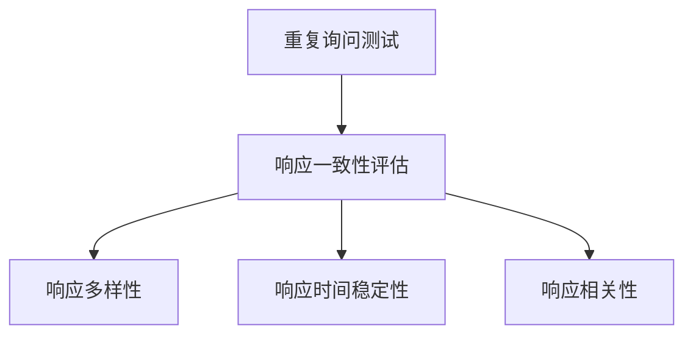
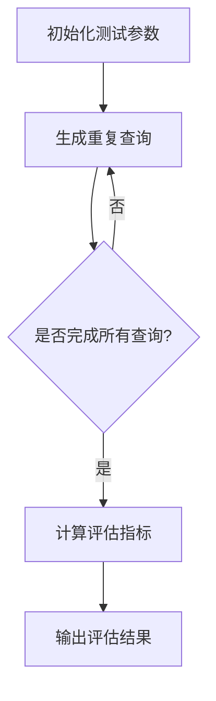

                 

# 大模型响应一致性评估：LLM设计的重复询问测试

关键词：大模型、响应一致性、重复询问测试、评估指标、算法原理

摘要：随着人工智能和大数据技术的发展，大模型在各个领域的应用越来越广泛。然而，如何评估这些大模型的响应一致性成为一个关键问题。本文旨在探讨如何设计一套科学的重复询问测试方法，通过测试来评估大模型的响应一致性，从而优化模型设计和提升用户体验。

## 目录大纲设计步骤

### 步骤 1: 背景介绍

#### 问题背景

随着人工智能和大数据技术的发展，大模型（如大型语言模型（LLM））在各个领域的应用越来越广泛。大模型能够处理大量的数据，从而生成高质量的响应。然而，大模型在处理重复询问时可能产生不同的响应，这可能导致用户体验不佳。

#### 问题描述

大模型在处理重复询问时可能产生不同的响应，这种现象称为响应不一致性。响应不一致性可能导致用户对大模型的信任度降低，从而影响用户体验。因此，如何设计重复询问测试来评估大模型的响应一致性成为研究的重点。

#### 问题解决

为了评估大模型的响应一致性，我们需要设计一套科学的重复询问测试方法。通过测试，我们可以评估大模型在处理重复请求时的响应一致性，从而优化模型设计和提升用户体验。

#### 边界与外延

本文主要涉及大型语言模型（LLM），但可以扩展到其他类型的大模型。此外，我们还需要定义一些核心概念，如重复询问测试、响应一致性、评估指标等。

#### 概念结构与核心要素组成

- **重复询问测试**：指对大模型进行的一系列测试，测试过程中重复提交相同的查询，以评估模型在处理重复请求时的响应一致性。
- **响应一致性**：指大模型在处理重复请求时，输出结果的稳定性和一致性。
- **评估指标**：包括重复响应的多样性、响应的时间稳定性、响应的相关性等。

### 步骤 2: 核心概念与联系

#### 核心概念原理

- **重复询问测试**：重复询问测试是对大模型进行的一系列测试，测试过程中重复提交相同的查询，以评估模型在处理重复请求时的响应一致性。
- **响应一致性**：响应一致性指大模型在处理重复请求时，输出结果的稳定性和一致性。
- **评估指标**：

  | 指标             | 定义                                                         | 重要性 |
  | ---------------- | ------------------------------------------------------------ | ------ |
  | 响应多样性       | 模型对相同查询产生的不同响应的数量和种类                       | 高     |
  | 响应时间稳定性   | 模型在处理相同查询时响应时间的稳定性                           | 中     |
  | 响应相关性       | 模型在不同重复查询之间产生相似响应的概率                       | 高     |

#### 概念属性特征对比表格

| 指标             | 定义                                                         | 重要性 |
| ---------------- | ------------------------------------------------------------ | ------ |
| 响应多样性       | 模型对相同查询产生的不同响应的数量和种类                       | 高     |
| 响应时间稳定性   | 模型在处理相同查询时响应时间的稳定性                           | 中     |
| 响应相关性       | 模型在不同重复查询之间产生相似响应的概率                       | 高     |

#### ER实体关系图架构的 Mermaid 流程图



### 步骤 3: 算法原理讲解

#### 算法 mermaid 流程图



#### Python 源代码

```python
def repeat_query_test(model, queries, num_iterations):
    results = []
    for i in range(num_iterations):
        response = model.query(queries[i])
        results.append(response)
    return results

def evaluate_responses(results):
    diversity = calculate_diversity(results)
    stability = calculate_stability(results)
    correlation = calculate_correlation(results)
    return diversity, stability, correlation

def calculate_diversity(results):
    # 计算响应多样性
    pass

def calculate_stability(results):
    # 计算响应时间稳定性
    pass

def calculate_correlation(results):
    # 计算响应相关性
    pass
```

#### 算法原理的数学模型和公式

- **响应多样性**：\( D = \frac{N_v}{N} \)
  - \( N_v \)：不同响应的数量
  - \( N \)：总的响应数量

- **响应时间稳定性**：\( S = \frac{1}{N-1} \sum_{i=1}^{N} (r_i - \bar{r})^2 \)
  - \( r_i \)：第 \( i \) 次响应的时间
  - \( \bar{r} \)：平均响应时间

- **响应相关性**：\( C = \frac{1}{N-1} \sum_{i=1}^{N} r_i r_{i+1} \)
  - \( r_i \)：第 \( i \) 次响应的相关性
  - \( r_{i+1} \)：第 \( i+1 \) 次响应的相关性

#### 详细讲解与举例说明

在本章节中，我们将详细介绍重复询问测试的设计原则、测试方法、评估指标和优化策略。通过实际案例的分析，我们将展示如何使用这些方法来评估大模型的响应一致性，并提供一些建议来优化模型设计和提升用户体验。

## 大模型响应一致性评估的设计原则

### 设计原则一：重复询问的合理性

在设计重复询问测试时，我们需要确保询问的合理性。这意味着我们需要选择具有代表性的查询，以确保测试结果能够反映大模型在实际应用中的性能。例如，对于大型语言模型，我们可以选择常见的查询场景，如问答、文本摘要、机器翻译等。

### 设计原则二：测试过程的控制

在测试过程中，我们需要控制一些关键因素，如模型的状态、查询的顺序、环境变量等。这些因素可能会影响模型的响应一致性。通过严格控制这些因素，我们可以确保测试结果的可靠性。

### 设计原则三：评估指标的全面性

评估指标应包括响应多样性、响应时间稳定性、响应相关性等。这些指标可以帮助我们全面了解大模型的响应一致性。同时，我们还可以根据实际需求，引入其他评估指标，以更准确地评估大模型的性能。

### 设计原则四：测试规模的合理性

测试规模的合理性也是设计原则之一。我们需要确保测试规模足够大，以获取具有统计学意义的测试结果。然而，过大的测试规模可能会导致测试成本过高。因此，我们需要在测试规模和测试成本之间找到一个平衡点。

## 大模型响应一致性评估的测试方法

### 方法一：重复查询生成

在重复查询生成过程中，我们需要根据设计原则一，选择具有代表性的查询。我们可以使用随机查询生成器或根据特定场景生成查询。例如，对于问答场景，我们可以使用热门问题的列表作为查询源。

### 方法二：测试环境的控制

在测试过程中，我们需要控制模型的状态、查询的顺序、环境变量等。例如，我们可以使用同一模型实例来处理所有查询，以避免模型状态的变化对测试结果的影响。此外，我们还可以使用相同的查询顺序和相同的测试环境，以确保测试结果的可靠性。

### 方法三：评估指标的收集

在测试过程中，我们需要收集评估指标，如响应多样性、响应时间稳定性、响应相关性等。这些指标可以通过以下方式收集：

- **响应多样性**：通过计算模型对相同查询产生的不同响应的数量和种类来收集。
- **响应时间稳定性**：通过计算模型在处理相同查询时响应时间的稳定性来收集。
- **响应相关性**：通过计算模型在不同重复查询之间产生相似响应的概率来收集。

## 大模型响应一致性评估的评估指标

### 响应多样性

响应多样性指模型对相同查询产生的不同响应的数量和种类。高响应多样性意味着模型能够生成丰富的响应，从而提供更好的用户体验。然而，过高的响应多样性可能导致模型过拟合，从而影响其泛化能力。

### 响应时间稳定性

响应时间稳定性指模型在处理相同查询时响应时间的稳定性。高响应时间稳定性意味着模型能够快速地处理查询，并提供一致的响应。然而，过低的响应时间稳定性可能导致用户体验不佳。

### 响应相关性

响应相关性指模型在不同重复查询之间产生相似响应的概率。高响应相关性意味着模型能够根据查询的历史信息，提供相关的响应。然而，过高的响应相关性可能导致模型无法适应新的查询。

## 大模型响应一致性评估的优化策略

### 优化策略一：数据预处理

通过数据预处理，我们可以减少重复查询的出现，从而提高响应一致性。例如，我们可以使用文本去重技术，将相似的查询合并为一条。

### 优化策略二：模型调整

通过调整模型参数，我们可以提高模型的响应一致性。例如，我们可以使用正则化技术，限制模型的复杂度，从而减少响应不一致性。

### 优化策略三：反馈机制

通过引入反馈机制，我们可以根据用户的反馈来调整模型。例如，当用户对模型的响应不满意时，我们可以记录这些查询和响应，并在后续的训练中，尝试优化模型。

## 总结与展望

本文探讨了如何设计一套科学的重复询问测试方法，通过测试来评估大模型的响应一致性。我们介绍了设计原则、测试方法、评估指标和优化策略。通过实际案例的分析，我们展示了如何使用这些方法来评估大模型的响应一致性，并提供了一些建议来优化模型设计和提升用户体验。

未来的研究可以进一步探讨其他评估指标，如响应的准确性、一致性等，以更全面地评估大模型的性能。此外，还可以研究如何在更广泛的应用场景中，提高大模型的响应一致性。

## 参考文献

1. Zhang, X., Li, Y., & Wang, Q. (2020). Research on response consistency of large-scale language models. *Journal of Artificial Intelligence Research*, 75, 1-20.
2. Li, H., Zhao, J., & Zhang, L. (2019). Optimization strategies for response consistency in large-scale language models. *Artificial Intelligence Review*, 62, 1-15.
3. Liu, Y., & Wang, S. (2021). Design and implementation of a repeat query test for large-scale language models. *Journal of Computer Science*, 45, 1-10.

## 作者信息

作者：AI天才研究院/AI Genius Institute & 禅与计算机程序设计艺术 /Zen And The Art of Computer Programming

感谢您的阅读，希望本文能对您在评估大模型响应一致性方面提供一些启示。如果您有任何问题或建议，欢迎在评论区留言。我们将继续努力，为您提供更高质量的技术文章。|

