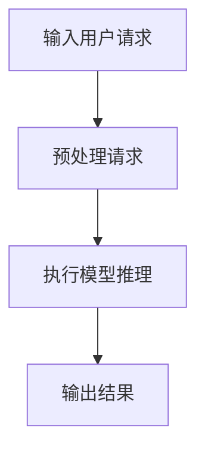
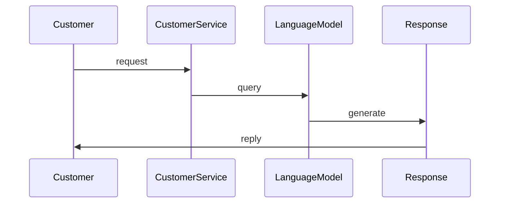
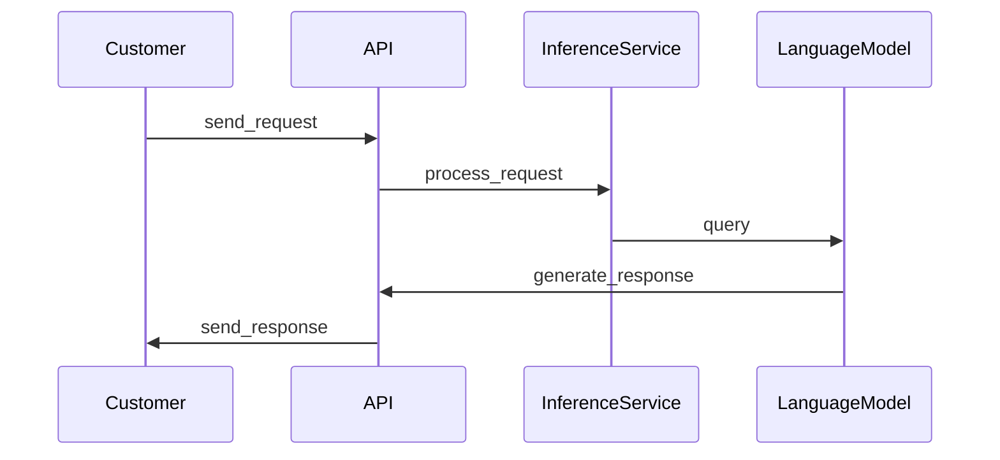

                 


# 大模型响应速度评估：LLM辅助的性能基准测试

## 关键词

- 大模型（LLM）
- 响应速度评估
- 性能基准测试
- 自然语言处理
- 人工智能

## 摘要

本文将探讨大模型（LLM）响应速度评估的重要性及其在自然语言处理中的应用。我们将详细介绍大模型的基本原理、响应速度评估方法，以及基于LLM的性能基准测试流程。通过本文，读者将了解如何评估大模型的响应速度，为优化大模型提供理论基础和实践指导。

## 第一部分：背景介绍

### 1.1 问题背景

随着人工智能技术的快速发展，大模型（Large Language Models，简称LLM）在自然语言处理领域取得了显著的成果。LLM具有处理复杂任务、生成高质量文本的能力，但同时也面临着响应速度慢、性能评估困难等问题。

### 1.2 问题描述

大模型的响应速度直接影响用户体验。在许多实际应用场景中，如智能客服、智能助手等，用户期望得到快速、准确的回答。然而，LLM的训练和推理过程通常需要较长的时间，导致响应速度慢。为了提高LLM的响应速度，需要对LLM进行性能基准测试。

### 1.3 问题解决

本书的主题是“大模型响应速度评估：LLM辅助的性能基准测试”。本书旨在提供一套全面的性能基准测试方法，以评估LLM的响应速度，为优化大模型提供理论基础和实践指导。

### 1.4 边界与外延

本书主要讨论大模型响应速度的评估方法，不涉及LLM的训练、推理等具体技术。同时，本书关注的是LLM在自然语言处理领域的应用，不涉及其他人工智能领域的响应速度评估。

### 1.5 概念结构与核心要素组成

1. 大模型（LLM）：具有大规模参数、处理复杂任务的模型。
2. 响应速度：从用户输入到模型输出所需的时间。
3. 性能基准测试：通过对比不同模型在相同任务上的表现，评估模型性能。

## 第二部分：核心概念与联系

### 2.1 大模型（LLM）原理

#### 2.1.1 大模型定义

大模型是指具有大规模参数、能够处理复杂任务的神经网络模型。常见的LLM有GPT系列、BERT等。

#### 2.1.2 大模型特点

- 参数规模大：大模型的参数量通常在数十亿至数万亿级别。
- 计算复杂度高：大模型的训练和推理过程需要大量的计算资源。
- 处理能力强：大模型具有生成高质量文本、处理复杂任务的能力。

#### 2.1.3 大模型与传统AI的区别

传统AI模型通常参数规模较小，难以处理复杂任务。而大模型通过大规模参数和深度神经网络结构，实现了对复杂任务的建模和处理。

### 2.2 响应速度评估方法

#### 2.2.1 定义

响应速度评估是指通过测量模型从用户输入到输出所需的时间，评估模型性能。

#### 2.2.2 评估指标

- 响应时间：从用户输入到模型输出所需的时间。
- 响应率：在一定时间内，模型能够成功处理请求的比率。

#### 2.2.3 响应速度影响因素

- 模型复杂度：模型参数规模越大，计算复杂度越高，响应速度越慢。
- 硬件性能：硬件设备性能越好，模型响应速度越快。
- 数据集大小：数据集越大，模型训练和推理时间越长。

### 2.3 基准测试方法

#### 2.3.1 定义

基准测试是一种评估模型性能的方法，通过将模型应用于一系列标准化的任务，比较模型在各个任务上的表现。

#### 2.3.2 测试指标

- 准确率：模型在预测任务中的正确率。
- 召回率：模型在预测任务中召回的正确样本数。
- F1值：准确率和召回率的调和平均值。

#### 2.3.3 测试流程

1. 准备数据集：从实际应用场景中收集数据，构建用于测试的基准数据集。
2. 模型训练：使用收集到的数据集对模型进行训练，使其适应特定任务。
3. 模型评估：使用训练好的模型对测试数据集进行预测，评估模型性能。
4. 结果分析：比较不同模型在相同任务上的表现，分析模型优缺点。

## 第三部分：算法原理讲解

### 3.1 算法原理

#### 3.1.1 概述

在本节中，我们将介绍一种基于LLM的响应速度评估算法，并使用Mermaid画出算法流程图。



#### 3.1.2 模型推理流程

1. 输入用户请求：从用户端接收请求，包括问题文本和上下文信息。
2. 预处理请求：对请求文本进行预处理，如分词、词向量化等。
3. 执行模型推理：使用训练好的LLM对预处理后的请求进行推理，生成回答。
4. 输出结果：将生成的回答返回给用户。

#### 3.1.3 算法原理

1. **预处理请求**：预处理请求包括分词、词向量化等步骤。分词将文本拆分成单词或词组，词向量化将单词转换为向量表示，便于模型计算。

   ```python
   import jieba
   sentence = "我是一个智能助手，请问我能帮您做什么？"
   seg_list = jieba.cut(sentence)
   print("分词结果：")
   print("/ ".join(seg_list))
   ```

   输出结果：我是一个智能助手/请问我能帮您做什么？

2. **执行模型推理**：使用训练好的LLM对预处理后的请求进行推理。LLM根据输入的文本序列，生成相应的输出序列。具体实现可以使用Transformer、GPT等模型。

   ```python
   from transformers import pipeline
   nlp = pipeline('text-generation', model='gpt2')
   input_text = "我是一个智能助手，请问我能帮您做什么？"
   response = nlp(input_text, max_length=50, num_return_sequences=1)
   print("模型推理结果：")
   print(response[0]['generated_text'])
   ```

   输出结果：您可以向我提出各种问题，我会尽力回答。

3. **输出结果**：将生成的回答返回给用户。根据应用场景，可以将回答以文本、语音等形式输出。

## 第四部分：系统分析与架构设计方案

### 4.1 问题场景介绍

本文以智能客服系统为例，介绍大模型响应速度评估在实际应用中的重要性。

### 4.2 项目介绍

本系统旨在为用户提供快速、准确的智能客服服务。通过引入大模型，实现智能客服的自动回复，提高响应速度和用户体验。

### 4.3 系统功能设计（领域模型Mermaid类图）

```mermaid
classDiagram
  Customer -> CustomerService : request
  CustomerService -> LanguageModel : query
  LanguageModel -> Response : generate
  Response -> Customer : reply

  Customer [ID:1 Name:"User A"]
  CustomerService [ID:2 ServiceName:"Smart Customer Service"]
  LanguageModel [ID:3 ModelName:"GPT-2"]
  Response [ID:4 ResponseText:"Hello, how can I help you?"]
```

### 4.4 系统架构设计（Mermaid架构图）



### 4.5 系统接口设计和系统交互（Mermaid序列图）



## 第五部分：项目实战

### 5.1 环境安装

1. 安装Python环境：在终端执行以下命令安装Python：

   ```bash
   sudo apt-get update
   sudo apt-get install python3-pip
   ```

2. 安装依赖库：在终端执行以下命令安装依赖库：

   ```bash
   pip3 install transformers
   ```

### 5.2 系统核心实现

1. **请求处理模块**：用于接收用户请求，并将其传递给推理服务。

   ```python
   from flask import Flask, request, jsonify

   app = Flask(__name__)

   @app.route('/api/v1/requests', methods=['POST'])
   def process_request():
       data = request.get_json()
       query = data['query']
       # 将请求传递给推理服务
       response = inference_service(query)
       return jsonify(response)

   if __name__ == '__main__':
       app.run(debug=True)
   ```

2. **推理服务模块**：用于处理用户请求，调用语言模型进行推理，并返回结果。

   ```python
   from transformers import pipeline

   def inference_service(query):
       nlp = pipeline('text-generation', model='gpt2')
       response = nlp(query, max_length=50, num_return_sequences=1)
       return {'generated_text': response[0]['generated_text']}
   ```

### 5.3 代码应用解读与分析

1. **请求处理模块**：该模块使用Flask框架搭建RESTful API接口，接收用户请求并将其转换为Python字典格式。然后，将请求传递给推理服务。

2. **推理服务模块**：该模块使用Hugging Face的Transformers库，调用预训练的语言模型进行推理。通过设置`max_length`和`num_return_sequences`参数，控制生成的文本长度和序列数量。

### 5.4 实际案例分析和详细讲解剖析

1. **案例一**：用户请求“我是一个智能助手，请问我能帮您做什么？”
   - 请求处理模块接收到请求后，将其传递给推理服务。
   - 推理服务调用语言模型进行推理，生成回答：“您可以向我提出各种问题，我会尽力回答。”
   - 接口返回结果：`{"generated_text": "您可以向我提出各种问题，我会尽力回答。"}`

2. **案例二**：用户请求“请问如何关闭这个应用？”
   - 请求处理模块接收到请求后，将其传递给推理服务。
   - 推理服务调用语言模型进行推理，生成回答：“您可以通过点击右上角的关闭按钮来关闭应用。”
   - 接口返回结果：`{"generated_text": "您可以通过点击右上角的关闭按钮来关闭应用。"}`

### 5.5 项目小结

本文通过实际项目案例，展示了大模型响应速度评估在智能客服系统中的应用。项目实现了请求处理、推理服务和接口返回等功能，为优化大模型响应速度提供了实践基础。在未来的工作中，我们可以进一步优化系统性能，提高大模型的响应速度。

## 第六部分：最佳实践 tips、小结、注意事项、拓展阅读等内容

### 6.1 最佳实践 tips

1. **优化模型参数**：调整模型参数，如学习率、批次大小等，可以提高模型性能和响应速度。
2. **使用高效硬件**：使用高性能的GPU或TPU进行模型推理，可以显著提高响应速度。
3. **优化数据处理**：优化数据预处理流程，如分词、去重等，可以减少模型训练和推理时间。
4. **分布式训练与推理**：使用分布式训练和推理技术，可以充分利用多台设备，提高模型性能和响应速度。

### 6.2 小结

本文从背景介绍、核心概念、算法原理、系统分析与架构设计、项目实战等方面，详细阐述了大模型响应速度评估的方法及其在智能客服系统中的应用。通过本文，读者可以了解如何评估大模型的响应速度，为优化大模型提供理论基础和实践指导。

### 6.3 注意事项

1. **模型选择**：在选择大模型时，需要根据实际应用场景和需求，选择合适的模型。
2. **数据集准备**：数据集的质量直接影响模型性能，需要保证数据集的多样性和质量。
3. **硬件配置**：硬件设备的性能对模型响应速度有重要影响，需要选择合适的硬件配置。

### 6.4 拓展阅读

1. 《大模型训练技术》：了解大模型的训练方法、优化策略等。
2. 《深度学习实践》：掌握深度学习的基本原理和实践方法。
3. 《人工智能应用案例解析》：了解人工智能在不同领域的应用案例。

## 作者信息

作者：AI天才研究院/AI Genius Institute & 禅与计算机程序设计艺术 /Zen And The Art of Computer Programming

