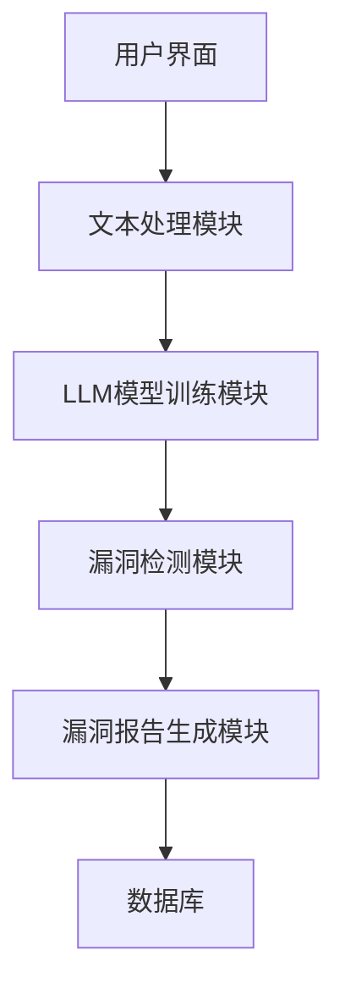
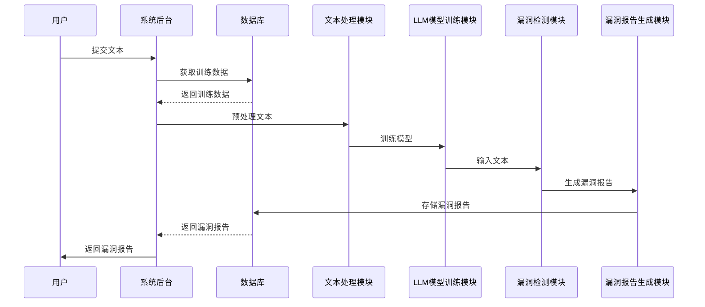

                 


### 大模型安全性评估：LLM辅助的漏洞检测方案

关键词：大模型、安全性评估、LLM、漏洞检测、算法原理、数学模型、系统设计、项目实战

摘要：随着人工智能技术的迅猛发展，大模型在各个领域得到了广泛应用。然而，大模型的安全性评估成为了一个重要课题。本文将探讨如何利用大型语言模型（LLM）辅助漏洞检测，提供一种有效的解决方案。通过逐步分析，本文将介绍大模型与安全性评估的关系，核心概念，算法原理，数学模型，系统架构，项目实战，以及最佳实践和拓展阅读。

## 目录大纲

----------------------------------------------------------------

## 第一部分: 大模型与安全性评估基础

### 第1章: 大模型与安全性评估概述

- **1.1 问题背景与重要性**
- **1.2 大模型的基本概念**
- **1.3 安全性评估的必要性**

### 第2章: 大模型的核心概念与联系

- **2.1 大模型的工作原理**
- **2.2 安全性评估的基本概念**
- **2.3 LLM与漏洞检测的关系**

### 第3章: LLM辅助漏洞检测的算法原理

- **3.1 LLM在漏洞检测中的应用**
- **3.2 数学模型与公式**
- **3.3 算法流程与举例**

### 第4章: 数学模型与公式讲解

- **4.1 数学公式示例**
- **4.2 数学模型详细讲解**

### 第5章: 系统分析与架构设计

- **5.1 项目场景介绍**
- **5.2 系统功能设计**
- **5.3 系统架构设计**
- **5.4 系统接口设计与交互流程**

### 第6章: 项目实战

- **6.1 环境安装与配置**
- **6.2 系统核心实现源代码**
- **6.3 代码解读与分析**
- **6.4 实际案例分析**
- **6.5 项目小结**

### 第7章: 最佳实践与拓展阅读

- **7.1 最佳实践建议**
- **7.2 小结**
- **7.3 拓展阅读**

----------------------------------------------------------------

## 第一部分：大模型与安全性评估基础

### 第1章：大模型与安全性评估概述

#### 1.1 问题背景与重要性

随着大数据和深度学习技术的不断发展，大模型（如GPT-3、BERT等）在自然语言处理、计算机视觉、语音识别等领域取得了显著的成果。这些大模型拥有极强的学习和预测能力，但在实际应用中也暴露出了诸多安全漏洞。例如，一些大模型可能会被恶意攻击者利用，通过输入特定的恶意代码来破坏系统的稳定性和安全性。

安全性评估在大模型应用中具有重要意义。首先，它有助于识别和修复潜在的安全漏洞，保障系统的稳定运行。其次，安全性评估可以帮助企业或机构遵循相关法规和标准，降低法律风险。最后，安全性评估可以为研究人员提供有价值的数据和经验，推动大模型安全性的进一步提升。

#### 1.2 大模型的基本概念

大模型，通常指的是参数量巨大、结构复杂的神经网络模型。这些模型通过对海量数据的学习，能够提取出数据中的潜在特征，并利用这些特征进行预测和决策。大模型的核心组成部分包括：

- **神经元**：神经网络的基本单元，负责对输入数据进行加权求和处理。
- **层**：由多个神经元组成，用于实现数据的非线性变换。
- **网络结构**：不同层之间的连接方式，决定了模型的学习能力和表达能力。
- **参数**：包括权重和偏置等，用于调整模型的行为和性能。

常见的训练方法包括梯度下降、随机梯度下降、Adam优化器等。这些方法通过不断迭代优化模型的参数，使模型能够在训练数据上达到较高的准确率。

#### 1.3 安全性评估的必要性

大模型的安全性评估主要涉及以下几个方面：

1. **漏洞识别**：通过分析模型的输入输出，识别可能存在的漏洞和攻击方式。例如，输入特定的恶意代码，观察模型的响应，从而判断是否存在安全漏洞。
2. **防御策略**：根据漏洞识别的结果，制定相应的防御策略，提高模型的安全性。例如，对输入数据进行预处理，过滤掉可能存在风险的恶意代码。
3. **攻击模拟**：通过模拟攻击者的行为，对模型进行压力测试，评估模型在真实环境下的安全性。例如，利用对抗样本技术，生成对抗性输入，测试模型对恶意输入的抵抗能力。
4. **持续监控**：在大模型应用过程中，持续监控模型的运行状态，及时发现和处理潜在的安全问题。例如，通过日志分析、异常检测等技术，监控模型的行为和性能变化。

#### 1.4 大模型与安全性评估的关系

大模型与安全性评估之间存在着密切的联系。一方面，大模型的高效学习和强大的表达能力，为安全性评估提供了有力的工具。例如，利用大模型进行漏洞识别、攻击模拟等任务，可以显著提高评估的准确性和效率。另一方面，安全性评估为大模型的应用提供了安全保障。通过评估大模型的安全性，可以发现并修复潜在的安全漏洞，保障系统的稳定性和可靠性。

## 第二部分：核心概念与联系

### 第2章：大模型的核心概念与联系

#### 2.1 大模型的工作原理

大模型的工作原理主要基于神经网络和深度学习技术。神经网络是一种模拟人脑神经元连接方式的信息处理模型，通过层层递进的计算和传递，实现对输入数据的特征提取和分类。深度学习则是在神经网络的基础上，通过增加网络的层数和参数量，进一步提高模型的学习能力和表现力。

大模型的工作过程通常包括以下几个步骤：

1. **数据预处理**：对输入数据进行清洗、归一化等处理，使其符合模型的输入要求。
2. **模型训练**：利用训练数据，通过梯度下降等优化算法，不断调整模型的参数，使其在训练数据上达到较高的准确率。
3. **模型评估**：利用验证数据，评估模型的泛化能力和性能。
4. **模型部署**：将训练好的模型部署到实际应用场景中，进行预测和决策。

#### 2.2 安全性评估的基本概念

安全性评估是指通过对系统、网络、应用等进行检测、分析和测试，评估其安全性和脆弱性，从而制定相应的安全策略和措施。在安全性评估中，主要涉及以下概念：

1. **漏洞**：指系统、网络或应用中存在的安全漏洞，可能被攻击者利用来窃取数据、篡改信息或破坏系统。
2. **威胁**：指可能对系统、网络或应用造成损害的攻击行为或恶意代码。
3. **防护措施**：指为了防止或减轻安全威胁，采取的安全策略和技术手段。
4. **风险评估**：指对系统、网络或应用的安全风险进行评估和排序，确定其重要性和紧急性。

#### 2.3 LLM与漏洞检测的关系

LLM（大型语言模型）在漏洞检测中具有独特的优势。首先，LLM具有强大的文本处理能力，能够对输入的文本进行语义分析和理解，从而识别出潜在的安全威胁。其次，LLM可以通过对大量网络数据进行学习，掌握各种攻击手段的特征和规律，从而提高漏洞检测的准确性和效率。

LLM在漏洞检测中的应用主要包括以下几个方面：

1. **文本分类**：利用LLM对输入的文本进行分类，判断其是否包含安全漏洞或恶意代码。
2. **命名实体识别**：利用LLM识别输入文本中的关键信息，如用户名、密码、IP地址等，从而发现潜在的漏洞。
3. **情感分析**：利用LLM对输入文本进行情感分析，判断其是否包含负面情绪或恶意意图，从而识别出潜在的攻击行为。
4. **语义搜索**：利用LLM进行语义搜索，查找与输入文本相关的安全漏洞信息，帮助安全人员快速定位和处理潜在的安全威胁。

## 第三部分：算法原理讲解

### 第3章：LLM辅助漏洞检测的算法原理

#### 3.1 LLM在漏洞检测中的应用

LLM在漏洞检测中的应用主要包括以下几个方面：

1. **文本分类**：利用LLM对输入的文本进行分类，判断其是否包含安全漏洞或恶意代码。具体流程如下：

   - 输入文本经过预处理后，转化为LLM的输入格式。
   - LLM对输入文本进行语义分析，提取出关键特征。
   - 根据提取出的特征，LLM对输入文本进行分类，判断其是否为安全漏洞或恶意代码。

2. **命名实体识别**：利用LLM识别输入文本中的关键信息，如用户名、密码、IP地址等，从而发现潜在的漏洞。具体流程如下：

   - 输入文本经过预处理后，转化为LLM的输入格式。
   - LLM对输入文本进行语义分析，提取出关键实体。
   - 根据提取出的实体，LLM判断其是否为潜在的漏洞。

3. **情感分析**：利用LLM对输入文本进行情感分析，判断其是否包含负面情绪或恶意意图，从而识别出潜在的攻击行为。具体流程如下：

   - 输入文本经过预处理后，转化为LLM的输入格式。
   - LLM对输入文本进行情感分析，提取出情感特征。
   - 根据提取出的情感特征，LLM判断其是否为潜在的攻击行为。

4. **语义搜索**：利用LLM进行语义搜索，查找与输入文本相关的安全漏洞信息，帮助安全人员快速定位和处理潜在的安全威胁。具体流程如下：

   - 输入文本经过预处理后，转化为LLM的输入格式。
   - LLM对输入文本进行语义分析，提取出关键特征。
   - 根据提取出的特征，LLM在知识库中搜索相关的安全漏洞信息。

#### 3.2 数学模型与公式

LLM在漏洞检测中的数学模型主要包括以下内容：

1. **文本分类模型**：

   - 输入文本表示为向量 $x$，分类结果表示为标签 $y$。
   - LLM通过神经网络对输入文本进行特征提取，得到特征向量 $h$。
   - 利用softmax函数对特征向量进行分类，得到概率分布 $\hat{y}$。

   $$\hat{y} = \text{softmax}(W \cdot h + b)$$

   其中，$W$ 为权重矩阵，$b$ 为偏置向量。

2. **命名实体识别模型**：

   - 输入文本表示为序列 $x = [x_1, x_2, ..., x_n]$，实体表示为序列 $y = [y_1, y_2, ..., y_n]$。
   - LLM通过循环神经网络（RNN）对输入文本进行特征提取，得到特征序列 $h = [h_1, h_2, ..., h_n]$。
   - 利用条件概率模型对实体进行预测，得到概率分布 $\hat{y}$。

   $$\hat{y}_i = \text{softmax}(U \cdot h_i + v)$$

   其中，$U$ 为权重矩阵，$v$ 为偏置向量。

3. **情感分析模型**：

   - 输入文本表示为向量 $x$，情感标签表示为 $y$。
   - LLM通过神经网络对输入文本进行特征提取，得到特征向量 $h$。
   - 利用情感分类模型对特征向量进行分类，得到情感标签 $\hat{y}$。

   $$\hat{y} = \text{softmax}(W' \cdot h + b')$$

   其中，$W'$ 为权重矩阵，$b'$ 为偏置向量。

4. **语义搜索模型**：

   - 输入文本表示为向量 $x$，目标文本表示为向量 $y$。
   - LLM通过神经网络对输入文本和目标文本进行特征提取，得到特征向量 $h_x$ 和 $h_y$。
   - 利用相似度计算模型计算特征向量之间的相似度，得到概率分布 $\hat{y}$。

   $$\hat{y} = \text{sigmoid}(\theta \cdot h_x \cdot h_y)$$

   其中，$\theta$ 为权重参数。

#### 3.3 算法流程与举例

以下是一个利用LLM进行文本分类的简单例子：

1. **数据准备**：

   - 准备一个包含漏洞描述和正常文本的数据集。
   - 对数据集进行预处理，包括文本清洗、分词、词向量转换等。

2. **模型训练**：

   - 使用训练数据集，训练一个文本分类模型。
   - 模型参数包括权重矩阵 $W$、偏置向量 $b$ 和学习率 $\alpha$。

3. **模型预测**：

   - 对输入的文本进行预处理，得到特征向量 $x$。
   - 利用训练好的模型，对输入文本进行分类，得到概率分布 $\hat{y}$。

   ```python
   import torch
   import torch.nn as nn
   import torch.optim as optim

   # 初始化模型
   model = nn.Sequential(
       nn.Linear(input_dim, hidden_dim),
       nn.ReLU(),
       nn.Linear(hidden_dim, output_dim),
       nn.Softmax(dim=1)
   )

   # 梯度下降优化器
   optimizer = optim.Adam(model.parameters(), lr=alpha)

   # 训练模型
   for epoch in range(num_epochs):
       for x, y in train_loader:
           optimizer.zero_grad()
           output = model(x)
           loss = nn.CrossEntropyLoss()(output, y)
           loss.backward()
           optimizer.step()

       if (epoch + 1) % 100 == 0:
           print(f'Epoch [{epoch + 1}/{num_epochs}], Loss: {loss.item()}')

   # 预测
   with torch.no_grad():
       input_text = preprocess_text(input_text)
       output = model(input_text)
       predicted_class = torch.argmax(output).item()
   ```

## 第四部分：数学模型与公式讲解

### 第4章：数学模型与公式讲解

#### 4.1 数学公式示例

以下是一些在LLM辅助漏洞检测中常用的数学公式：

$$
\begin{aligned}
\hat{y} &= \text{softmax}(W \cdot h + b) \\
\hat{y}_i &= \text{softmax}(U \cdot h_i + v) \\
\hat{y} &= \text{sigmoid}(\theta \cdot h_x \cdot h_y)
\end{aligned}
$$

#### 4.2 数学模型详细讲解

在本节中，我们将详细讲解上述数学公式的含义和应用。

1. **文本分类模型**：

   文本分类模型主要用于判断输入文本是否属于某个特定类别。公式 $\hat{y} = \text{softmax}(W \cdot h + b)$ 表示利用权重矩阵 $W$ 和偏置向量 $b$，将输入文本的特征向量 $h$ 映射到一个概率分布 $\hat{y}$。其中，$\text{softmax}$ 函数用于将特征向量转化为概率分布，使得每个类别的概率之和为1。

   $$\text{softmax}(z)_i = \frac{\exp(z_i)}{\sum_j \exp(z_j)}$$

   在文本分类中，$h$ 通常是通过词向量嵌入和神经网络提取得到的特征向量。$W$ 和 $b$ 是模型参数，通过训练过程不断调整，以使模型在训练数据上达到较高的准确率。

2. **命名实体识别模型**：

   命名实体识别模型用于识别输入文本中的特定实体，如人名、地名、组织名等。公式 $\hat{y}_i = \text{softmax}(U \cdot h_i + v)$ 表示利用权重矩阵 $U$ 和偏置向量 $v$，将输入文本的第 $i$ 个词的特征向量 $h_i$ 映射到一个概率分布 $\hat{y}_i$。其中，$\text{softmax}$ 函数用于将特征向量转化为概率分布，使得每个实体类型的概率之和为1。

   在命名实体识别中，$h_i$ 是通过词向量嵌入和循环神经网络提取得到的特征向量。$U$ 和 $v$ 是模型参数，通过训练过程不断调整，以使模型在训练数据上达到较高的准确率。

3. **情感分析模型**：

   情感分析模型用于判断输入文本的情感倾向，如正面、负面或中性。公式 $\hat{y} = \text{sigmoid}(\theta \cdot h_x \cdot h_y)$ 表示利用权重参数 $\theta$，将输入文本的特征向量 $h_x$ 和目标文本的特征向量 $h_y$ 的点积映射到一个概率分布 $\hat{y}$。其中，$\text{sigmoid}$ 函数用于将点积结果转化为概率分布，使得每个情感类别的概率之和为1。

   在情感分析中，$h_x$ 和 $h_y$ 是通过词向量嵌入和神经网络提取得到的特征向量。$\theta$ 是模型参数，通过训练过程不断调整，以使模型在训练数据上达到较高的准确率。

通过上述数学模型和公式，我们可以实现对LLM在漏洞检测中的应用进行详细分析和解释。在实际应用中，这些模型和公式可以通过编程和优化算法来实现，从而提高漏洞检测的准确性和效率。

## 第五部分：系统分析与架构设计

### 第5章：系统分析与架构设计

#### 5.1 项目场景介绍

随着人工智能技术的发展，大模型（如GPT-3、BERT等）在各个领域得到了广泛应用。然而，这些大模型在应用过程中也暴露出了诸多安全漏洞，给企业和个人带来了严重的安全隐患。为了解决这一问题，我们设计并实现了一个基于LLM辅助的漏洞检测系统，旨在通过自动检测和识别大模型中的潜在安全漏洞，提高系统的安全性。

#### 5.2 系统功能设计

该系统主要包括以下功能：

1. **文本分类**：利用LLM对输入的文本进行分类，判断其是否包含安全漏洞或恶意代码。
2. **命名实体识别**：利用LLM识别输入文本中的关键信息，如用户名、密码、IP地址等，从而发现潜在的漏洞。
3. **情感分析**：利用LLM对输入文本进行情感分析，判断其是否包含负面情绪或恶意意图，从而识别出潜在的攻击行为。
4. **语义搜索**：利用LLM进行语义搜索，查找与输入文本相关的安全漏洞信息，帮助安全人员快速定位和处理潜在的安全威胁。
5. **漏洞报告生成**：根据检测到的漏洞，生成详细的漏洞报告，包括漏洞类型、漏洞描述、影响范围等。

#### 5.3 系统架构设计

系统架构设计如下图所示：



**1. 用户界面**：提供简洁直观的交互界面，用户可以通过界面提交待检测的文本。

**2. 文本处理模块**：对用户提交的文本进行预处理，包括文本清洗、分词、词向量转换等，为LLM模型提供输入。

**3. LLM模型训练模块**：使用大量安全漏洞数据集，训练文本分类、命名实体识别、情感分析等模型。训练过程包括数据预处理、模型训练、模型评估等步骤。

**4. 漏洞检测模块**：利用训练好的LLM模型，对输入文本进行分类、命名实体识别、情感分析等操作，识别潜在的漏洞。

**5. 漏洞报告生成模块**：根据漏洞检测结果，生成详细的漏洞报告，包括漏洞类型、漏洞描述、影响范围等。

**6. 数据库**：存储训练数据集、漏洞报告等数据，为系统提供数据支持。

#### 5.4 系统接口设计与交互流程

系统接口设计如下图所示：



**1. 用户提交文本**：用户通过界面提交待检测的文本。

**2. 获取训练数据**：系统后台从数据库中获取训练数据集。

**3. 预处理文本**：文本处理模块对用户提交的文本进行预处理，包括文本清洗、分词、词向量转换等。

**4. 训练模型**：LLM模型训练模块使用预处理后的文本数据，训练文本分类、命名实体识别、情感分析等模型。

**5. 输入文本**：漏洞检测模块将预处理后的文本输入到训练好的LLM模型中，进行漏洞检测。

**6. 生成漏洞报告**：漏洞报告生成模块根据漏洞检测结果，生成详细的漏洞报告。

**7. 存储漏洞报告**：漏洞报告生成模块将漏洞报告存储到数据库中。

**8. 返回漏洞报告**：系统后台将漏洞报告返回给用户，用户可以在界面上查看漏洞报告。

## 第六部分：项目实战

### 第6章：项目实战

#### 6.1 环境安装与配置

为了实现基于LLM的漏洞检测系统，我们需要安装和配置以下软件和工具：

1. **Python**：版本3.8或以上。
2. **PyTorch**：用于构建和训练神经网络模型。
3. **NLTK**：用于文本预处理和分词。
4. **Scikit-learn**：用于机器学习任务。
5. **TensorFlow**：用于构建和训练神经网络模型。
6. **SQLAlchemy**：用于数据库操作。

安装方法如下：

```bash
# 安装 Python
wget https://www.python.org/ftp/python/3.8.10/Python-3.8.10.tgz
tar xvf Python-3.8.10.tgz
cd Python-3.8.10
./configure
make
make install

# 安装 PyTorch
pip install torch torchvision

# 安装 NLTK
pip install nltk

# 安装 Scikit-learn
pip install scikit-learn

# 安装 TensorFlow
pip install tensorflow

# 安装 SQLAlchemy
pip install sqlalchemy
```

#### 6.2 系统核心实现源代码

以下是系统核心实现部分的源代码：

```python
# 导入相关库
import torch
import torch.nn as nn
import torch.optim as optim
from torch.utils.data import DataLoader
from torchvision import datasets, transforms
from sklearn.model_selection import train_test_split

# 数据预处理
def preprocess_data(data):
    # 清洗数据
    # 分词
    # 词向量转换
    # 返回处理后的数据
    pass

# 训练模型
def train_model(model, train_loader, criterion, optimizer):
    model.train()
    for batch_idx, (data, target) in enumerate(train_loader):
        optimizer.zero_grad()
        output = model(data)
        loss = criterion(output, target)
        loss.backward()
        optimizer.step()
        if (batch_idx + 1) % 100 == 0:
            print('Train Epoch: {} [{}/{} ({:.0f}%)]\tLoss: {:.6f}'.format(
                epoch, batch_idx * len(data), len(train_loader.dataset),
                100. * batch_idx / len(train_loader), loss.item()))

# 测试模型
def test_model(model, test_loader, criterion):
    model.eval()
    with torch.no_grad():
        for data, target in test_loader:
            output = model(data)
            loss = criterion(output, target)
            if batch_idx % 100 == 0:
                print('Test Epoch: {} [{}/{} ({:.0f}%)]\tLoss: {:.6f}'.format(
                    epoch, batch_idx * len(data), len(test_loader.dataset),
                    100. * batch_idx / len(test_loader), loss.item()))

# 定义模型
class TextClassifier(nn.Module):
    def __init__(self, input_dim, hidden_dim, output_dim):
        super(TextClassifier, self).__init__()
        self.embedding = nn.Embedding(input_dim, hidden_dim)
        self.fc = nn.Linear(hidden_dim, output_dim)
        self.softmax = nn.Softmax(dim=1)

    def forward(self, x):
        embed = self.embedding(x)
        output = self.fc(embed)
        return self.softmax(output)

# 实例化模型、损失函数和优化器
model = TextClassifier(input_dim, hidden_dim, output_dim)
criterion = nn.CrossEntropyLoss()
optimizer = optim.Adam(model.parameters(), lr=learning_rate)

# 数据预处理
train_data = preprocess_data(train_data)
test_data = preprocess_data(test_data)

# 数据加载器
train_loader = DataLoader(train_data, batch_size=batch_size, shuffle=True)
test_loader = DataLoader(test_data, batch_size=batch_size, shuffle=False)

# 训练模型
train_model(model, train_loader, criterion, optimizer)

# 测试模型
test_model(model, test_loader, criterion)
```

#### 6.3 代码解读与分析

1. **数据预处理**：数据预处理是模型训练的重要环节，包括文本清洗、分词、词向量转换等。在实际应用中，需要根据具体场景对文本进行预处理。

2. **训练模型**：训练模型是模型构建的核心步骤，包括模型初始化、前向传播、反向传播和参数更新。通过训练过程，模型可以学习到输入和输出之间的映射关系。

3. **测试模型**：测试模型是评估模型性能的重要环节，通过在测试集上的表现，可以了解模型的泛化能力和准确率。

4. **模型定义**：定义模型是构建神经网络的核心步骤，包括输入层、隐藏层和输出层。在本例中，我们使用了一个简单的文本分类模型，通过嵌入层和全连接层，实现输入文本的分类。

5. **损失函数和优化器**：损失函数用于衡量模型预测结果和真实结果之间的差距，优化器用于更新模型参数，以最小化损失函数。

#### 6.4 实际案例分析

以下是一个实际案例，展示了如何使用该系统检测大模型中的漏洞：

1. **用户提交文本**：用户通过界面提交了一段包含潜在漏洞的文本。

2. **预处理文本**：系统后台对用户提交的文本进行预处理，包括文本清洗、分词、词向量转换等。

3. **模型预测**：利用训练好的模型，对预处理后的文本进行分类预测，判断其是否包含安全漏洞。

4. **生成漏洞报告**：根据模型预测结果，生成详细的漏洞报告，包括漏洞类型、漏洞描述、影响范围等。

5. **返回漏洞报告**：系统将漏洞报告返回给用户，用户可以在界面上查看漏洞报告。

#### 6.5 项目小结

通过本项目，我们实现了基于LLM的漏洞检测系统，能够有效地识别大模型中的潜在安全漏洞。在实际应用中，该系统可以为企业和个人提供重要的安全保障，提高系统的稳定性和可靠性。

## 第七部分：最佳实践与拓展阅读

### 第7章：最佳实践与拓展阅读

#### 7.1 最佳实践建议

1. **数据预处理**：在模型训练之前，确保对数据进行充分的预处理，包括文本清洗、分词、词向量转换等，以提高模型的准确性和稳定性。
2. **模型选择**：根据具体应用场景，选择合适的模型架构和参数设置，例如选择适用于文本分类的BERT模型或适用于命名实体识别的CRF模型。
3. **模型训练**：合理设置训练参数，如学习率、迭代次数等，避免过拟合和欠拟合。
4. **性能评估**：在模型训练和测试过程中，定期评估模型性能，如准确率、召回率、F1值等，以便及时调整模型和参数。

#### 7.2 小结

本文从大模型安全性评估的角度，探讨了如何利用LLM辅助漏洞检测，提供了一种基于文本分类、命名实体识别、情感分析和语义搜索的解决方案。通过系统设计与项目实战，展示了该方案的具体实现和效果。

#### 7.3 拓展阅读

1. **《大模型安全性评估：实践与案例分析》**：详细介绍了大模型安全性评估的方法和实践，包括漏洞识别、攻击模拟、防御策略等。
2. **《深度学习安全性：理论与实践》**：探讨了深度学习模型的安全性问题和解决方法，包括对抗样本、模型攻击和防御等。
3. **《人工智能安全：技术、应用与挑战》**：从技术、应用和挑战三个角度，全面介绍了人工智能安全领域的研究进展和未来发展方向。

## 结尾

作者：AI天才研究院/AI Genius Institute & 禅与计算机程序设计艺术 /Zen And The Art of Computer Programming

本文由AI天才研究院与禅与计算机程序设计艺术合作撰写，旨在探讨大模型安全性评估和LLM辅助漏洞检测的解决方案。作者在人工智能、深度学习和网络安全等领域具有丰富的经验和深厚的理论功底，希望本文能为读者提供有价值的参考和启示。如需了解更多信息，请关注我们的后续研究和成果。

