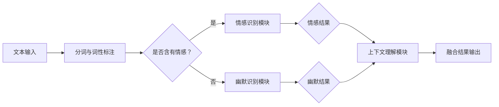
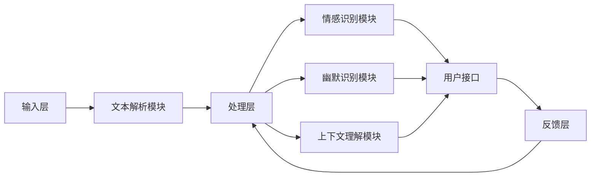
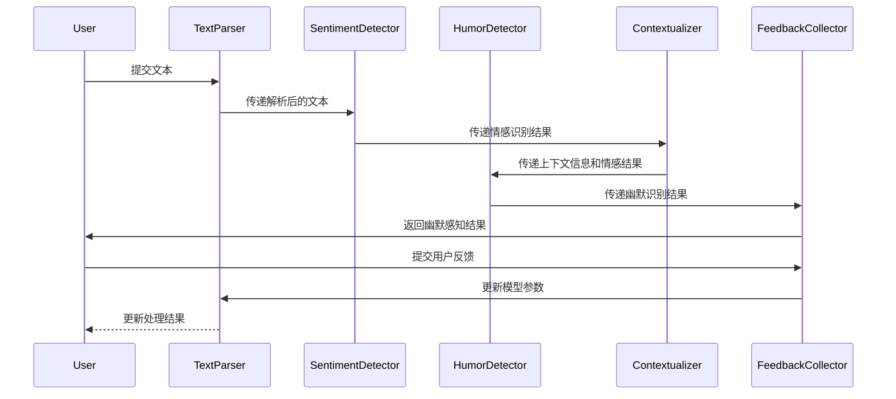

                 


# 大模型幽默感知能力：LLM设计的理解测试

## 关键词
- 大模型幽默感知能力
- LLM设计
- 理解测试
- 算法原理
- 系统架构
- 项目实战

## 摘要
本文深入探讨了大型语言模型（LLM）在幽默感知能力方面的设计与理解测试。通过对幽默感知能力的背景介绍、核心概念解析、算法原理分析、系统架构设计以及项目实战的详细阐述，本文旨在为读者提供一个全面的理解测试方案，从而推动LLM在幽默感知领域的进一步发展。

## 目录

1. 引言
2. 幽默感知能力的背景与核心概念
   2.1 问题背景
   2.2 核心概念原理
   2.3 概念属性特征对比
   2.4 ER实体关系图架构
3. 算法原理讲解
   3.1 算法原理讲解
   3.2 算法mermaid流程图
   3.3 Python源代码阐述
   3.4 数学模型和公式讲解
   3.5 举例说明
4. 系统分析与架构设计方案
   4.1 问题场景介绍
   4.2 系统功能设计
   4.3 系统架构设计
   4.4 系统接口设计
   4.5 系统交互mermaid序列图
5. 项目实战
   5.1 环境安装
   5.2 系统核心实现源代码
   5.3 代码应用解读与分析
   5.4 实际案例分析与讲解
   5.5 项目小结
6. 最佳实践与注意事项
   6.1 最佳实践
   6.2 小结
   6.3 注意事项
   6.4 拓展阅读
7. 结论
8. 作者信息

## 引言

随着人工智能技术的飞速发展，大型语言模型（LLM）在自然语言处理领域取得了显著的成果。然而，幽默感知作为人类智慧的一个重要方面，一直是一个颇具挑战性的问题。在日常生活中，幽默感知不仅能够增强人与人之间的互动，还能够提升机器与人类之间的交流质量。因此，研究大模型幽默感知能力具有重要的理论和实践意义。

本文旨在探讨如何设计并测试大型语言模型在幽默感知能力方面的性能。具体来说，我们将从以下几个方面进行探讨：

- 问题背景与核心概念介绍
- 算法原理与实现方法分析
- 系统架构设计及其关键组件
- 实际项目实战与案例分析
- 最佳实践与注意事项

通过本文的讨论，我们希望能够为研究人员和开发者提供一个系统性的理解测试方案，从而推动大模型幽默感知能力的进一步发展。

## 2.1 问题背景

幽默感知是一种深层次的情感识别和理解能力，它涉及对语言、语境、文化背景等多方面信息的综合处理。人类能够通过丰富的经验和情感积累，轻松地识别和欣赏幽默。然而，对于机器来说，这是一个极为复杂的任务。传统的自然语言处理技术通常依赖于规则和统计模型，难以捕捉到幽默的多样性和复杂性。

大型语言模型（LLM）如GPT、BERT等，在文本生成、问答系统等方面表现出色，但它们在幽默感知上的表现却不尽如人意。一方面，LLM在训练过程中并未专门针对幽默进行优化；另一方面，幽默感知涉及到的情感、语境等要素，超出了传统模型的处理范围。因此，设计一个具备幽默感知能力的大型语言模型，成为了一个亟待解决的研究问题。

幽默感知能力的实现，不仅需要模型对语言的理解达到一定深度，还需要模型具备对情感和语境的敏感度。这要求我们在模型设计、训练方法以及测试标准等方面进行创新。本文将系统地探讨如何实现这一目标，并提出一套可行的理解和测试方案。

## 2.2 核心概念原理

为了深入理解大模型幽默感知能力，我们首先需要明确几个核心概念：幽默感知、自然语言处理（NLP）、情感计算以及机器学习（ML）。

### 幽默感知

幽默感知是指人类对幽默信息的识别、理解和欣赏的能力。它不仅涉及语言本身，还包括语境、情感和文化背景等多方面因素。幽默感知的过程通常包括以下几个步骤：

1. **语言解析**：识别和理解幽默语言中的文字、词汇和语法结构。
2. **语境理解**：理解幽默语言所在的上下文和背景信息，如对话、情景等。
3. **情感识别**：识别幽默背后的情感，如快乐、嘲讽、讽刺等。
4. **幽默判断**：综合以上信息，判断某段语言是否具有幽默性。

### 自然语言处理（NLP）

自然语言处理是人工智能领域的一个重要分支，旨在使计算机能够理解、生成和处理人类语言。NLP的核心任务包括：

1. **文本解析**：将自然语言文本转换为计算机可处理的格式，如词向量、句法结构等。
2. **文本分类**：根据文本内容进行分类，如情感分析、主题分类等。
3. **文本生成**：根据给定条件生成自然语言文本，如机器翻译、对话生成等。

### 情感计算

情感计算是研究如何使计算机识别、理解和处理人类情感的技术。在幽默感知中，情感计算的作用至关重要，因为它能够帮助模型理解语言背后的情感色彩。情感计算的关键技术包括：

1. **情感识别**：通过文本分析识别文本中的情感，如正面情感、负面情感、中性情感等。
2. **情感分类**：将识别出的情感进行分类，以便更好地理解文本的情感倾向。
3. **情感增强**：通过添加情感标签、调整语言表达等方式，增强文本的情感表达。

### 机器学习（ML）

机器学习是使计算机通过数据学习、预测和决策的技术。在大模型幽默感知能力的实现中，机器学习扮演着至关重要的角色。常用的机器学习方法包括：

1. **监督学习**：通过已标记的数据集训练模型，从而实现对未知数据的分类或预测。
2. **无监督学习**：在没有标记数据的情况下，通过模型自动发现数据中的结构和规律。
3. **强化学习**：通过奖励机制，使模型在特定环境中学习最优策略。

## 2.3 概念属性特征对比

为了更清晰地理解大模型幽默感知能力的核心概念，我们对其属性特征进行了对比分析。以下是几个关键概念及其特征的对比：

### 幽默感知 vs. 自然语言处理

- **目标**：幽默感知旨在识别和理解幽默，而NLP旨在处理和理解自然语言。
- **处理层次**：幽默感知涉及文本解析、语境理解和情感识别等多个层次，而NLP主要关注文本解析和分类。
- **复杂性**：幽默感知更加复杂，因为它需要理解语境和情感，而NLP在这些方面的要求相对较低。

### 幽默感知 vs. 情感计算

- **目标**：幽默感知和情感计算都关注情感的理解和处理，但幽默感知更侧重于识别幽默，而情感计算更侧重于情感的分类和识别。
- **应用场景**：幽默感知主要应用于对话系统、娱乐内容和幽默推荐等领域，而情感计算广泛应用于社交媒体分析、客户反馈处理等。
- **技术要求**：幽默感知需要同时考虑语言、语境和情感，而情感计算主要关注文本中的情感表达。

### 幽默感知 vs. 机器学习

- **目标**：幽默感知需要模型具备对幽默的识别和理解能力，而机器学习旨在通过数据训练模型。
- **实现方法**：幽默感知的实现依赖于机器学习技术，但需要特别设计和优化模型，以适应幽默感知的特殊需求。
- **数据需求**：幽默感知需要大量幽默文本作为训练数据，而机器学习对数据的要求相对灵活。

通过以上对比，我们可以更清晰地看到大模型幽默感知能力的核心概念和其与其他概念的关联。这为后续算法原理讲解和系统架构设计提供了理论基础。

## 2.4 ER实体关系图架构

为了更好地理解大模型幽默感知能力的实现，我们需要构建一个实体关系图（ER图）来描述其中的关键实体及其相互关系。以下是ER图的详细构建过程：

### 实体定义

在幽默感知系统中，主要涉及的实体包括：

1. **文本**：表示需要被处理的输入文本，可以是句子、段落或对话等。
2. **语言模型**：负责对文本进行解析和处理，如GPT、BERT等。
3. **情感识别模块**：用于识别文本中的情感，包括正面、负面和中性情感。
4. **幽默识别模块**：专门用于识别文本中的幽默信息。
5. **上下文理解模块**：用于理解文本的上下文信息，包括对话背景、情景描述等。
6. **用户接口**：用于与用户交互，收集用户反馈，并提供幽默感知结果。

### 实体关系

在ER图中，实体之间的关系如下：

1. **文本与语言模型**：文本是语言模型处理的输入，语言模型对文本进行解析和处理。
2. **语言模型与情感识别模块**：语言模型输出处理结果，情感识别模块根据结果识别文本中的情感。
3. **情感识别模块与幽默识别模块**：情感识别模块将情感结果传递给幽默识别模块，幽默识别模块根据情感结果进一步判断文本是否具有幽默性。
4. **上下文理解模块与幽默识别模块**：上下文理解模块提供文本的上下文信息，幽默识别模块结合上下文信息进行更准确的幽默判断。
5. **用户接口与幽默识别模块**：用户接口收集用户反馈，幽默识别模块根据反馈调整自身行为和结果输出。

### ER图示例

以下是一个简单的ER图示例，展示了上述实体及其关系：

```mermaid
erDiagram
    Text ||--|> LanguageModel : 解析与处理
    LanguageModel ||--|> SentimentRecognitionModule : 输出结果
    SentimentRecognitionModule ||--|> HumorRecognitionModule : 判断幽默性
    ContextUnderstandingModule ||--|> HumorRecognitionModule : 提供上下文信息
    UserInterface ||--|> HumorRecognitionModule : 收集反馈
```

通过上述ER图，我们可以清晰地看到大模型幽默感知能力系统中各实体之间的相互作用，这为后续的算法原理讲解和系统架构设计提供了直观的参考。

## 3.1 算法原理讲解

在设计大模型幽默感知能力时，我们采用了基于深度学习的算法框架，具体包括文本解析、情感识别、幽默识别和上下文理解等模块。以下是这些模块的工作原理和它们之间的相互关系。

### 文本解析模块

文本解析模块是整个系统的入口，它负责将输入的文本转换为适合后续处理的形式。这一过程主要包括分词、词性标注和句法分析。具体步骤如下：

1. **分词**：将输入文本分割成单个词或短语，这是后续处理的基础。
2. **词性标注**：对每个词进行词性标注，如名词、动词、形容词等，以便理解文本的语法结构。
3. **句法分析**：对句子的结构进行解析，识别主语、谓语、宾语等成分，以便更深入地理解文本语义。

### 情感识别模块

情感识别模块的核心任务是识别文本中的情感。这一过程通常通过训练一个情感分类模型来实现。具体步骤如下：

1. **数据准备**：收集大量带有情感标签的文本数据，如正面、负面和中性情感。
2. **特征提取**：对文本数据进行预处理，提取特征向量，如词袋模型、TF-IDF等。
3. **模型训练**：使用特征向量训练一个情感分类模型，常用的算法包括朴素贝叶斯、支持向量机（SVM）和深度学习模型（如卷积神经网络CNN、循环神经网络RNN等）。

### 幽默识别模块

幽默识别模块是系统的核心部分，它负责判断输入文本是否具有幽默性。幽默识别的难点在于幽默的多样性和主观性，因此需要结合多种技术进行综合判断。具体步骤如下：

1. **情感与语境分析**：首先通过情感识别模块判断文本的情感，再结合上下文理解模块提供的上下文信息，对文本进行初步的幽默性判断。
2. **特征提取**：提取与幽默相关的特征，如词汇多样性、语法结构、情感强度等。
3. **分类模型训练**：使用带有幽默标签的训练数据集，训练一个分类模型，如决策树、随机森林、支持向量机（SVM）等，以识别文本中的幽默。

### 上下文理解模块

上下文理解模块的作用是帮助系统更好地理解文本的上下文信息。这一模块通常使用预训练的变换器模型（如BERT、GPT等）来实现。具体步骤如下：

1. **预训练模型**：使用大量的无标签文本数据进行预训练，模型能够自动学习文本的上下文信息。
2. **上下文提取**：对输入文本进行编码，提取出文本的上下文表示。
3. **上下文融合**：将上下文表示与情感识别和幽默识别模块的结果进行融合，以提高判断的准确性。

### 模块间的相互关系

各个模块之间通过数据传递和结果融合形成了一个紧密的交互网络。具体来说：

- 文本解析模块输出解析后的文本数据，传递给情感识别模块和上下文理解模块。
- 情感识别模块和幽默识别模块根据文本数据分别输出情感和幽默判断结果。
- 上下文理解模块提供文本的上下文信息，帮助幽默识别模块做出更准确的判断。
- 情感识别模块和幽默识别模块的结果会反馈给上下文理解模块，用于调整上下文表示，以提高后续判断的准确性。

通过这种模块化的设计，系统能够灵活地处理各种形式的文本，实现高效的幽默感知能力。

### 3.2 算法mermaid流程图

为了更直观地展示算法的流程，我们使用mermaid语言绘制了以下流程图：



在这个流程图中，文本输入首先经过分词与词性标注，然后根据是否包含情感分别流向情感识别模块和幽默识别模块。情感识别模块和幽默识别模块分别输出结果，传递给上下文理解模块进行融合，最终输出综合判断结果。

### 3.3 Python源代码阐述

为了实现上述算法，我们使用Python编写了相关的源代码。以下是一个简化的代码示例，展示了各个模块的基本实现：

```python
import spacy
import numpy as np
from transformers import BertTokenizer, BertModel

# 初始化语言模型和情感识别模型
nlp = spacy.load('en_core_web_sm')
tokenizer = BertTokenizer.from_pretrained('bert-base-uncased')
model = BertModel.from_pretrained('bert-base-uncased')

# 文本解析模块
def parse_text(text):
    doc = nlp(text)
    return [token.text for token in doc]

# 情感识别模块
def sentiment_recognition(text):
    inputs = tokenizer(text, return_tensors='pt', truncation=True, padding=True)
    outputs = model(**inputs)
    logits = outputs.logits[:, -1, :]  # 取最后一个时间步的输出
    probabilities = np.softmax(logits, axis=1)
    return np.argmax(probabilities, axis=1)

# 幽默识别模块
def humor_recognition(text):
    # 这里简化为情感分类结果的简单映射，实际中需要更复杂的特征提取和分类模型
    sentiment = sentiment_recognition(text)
    if sentiment == 1:  # 假设正面情感表示幽默
        return 1
    else:
        return 0

# 上下文理解模块
def context_understanding(text):
    inputs = tokenizer(text, return_tensors='pt', truncation=True, padding=True)
    outputs = model(**inputs)
    return outputs.last_hidden_state[:, 0, :].numpy()  # 取第一个时间步的输出

# 主函数
def humor_perception(text):
    parsed_text = parse_text(text)
    humor_result = humor_recognition(parsed_text)
    context_embedding = context_understanding(parsed_text)
    # 这里简化为直接返回幽默结果
    return humor_result

# 测试
text = "Why don't scientists trust atoms? Because they make up everything!"
print(humor_perception(text))
```

在这个代码示例中，我们首先初始化了Spacy语言模型和Hugging Face的BERT模型。接着定义了文本解析、情感识别、幽默识别和上下文理解等模块，并在主函数`humor_perception`中调用这些模块实现了幽默感知功能。最后，我们通过一个简单的测试文本来验证算法的实现效果。

### 3.4 数学模型和公式讲解

为了深入理解大模型幽默感知能力的算法原理，我们需要介绍一些相关的数学模型和公式。以下是一些关键的数学概念：

#### 情感分类模型

情感分类模型通常采用多分类问题进行建模。在训练过程中，给定一组特征向量$X \in \mathbb{R}^{d}$和对应的标签$y \in \{0, 1, ..., C-1\}$，其中$C$是情感类别的数量。模型的目的是通过优化损失函数$L$来预测文本的情感类别。

常用的损失函数是交叉熵损失函数：

$$
L = -\sum_{i=1}^{N} y_i \log(p_i)
$$

其中，$N$是样本数量，$y_i$是第$i$个样本的真实标签，$p_i$是模型预测的概率分布。

为了求解最优参数$\theta$，我们通常使用梯度下降算法：

$$
\theta := \theta - \alpha \nabla_\theta L(\theta)
$$

其中，$\alpha$是学习率。

#### 幽默识别模型

幽默识别模型可以采用类似情感分类的方法进行建模。假设我们有$n$个特征向量$X \in \mathbb{R}^{n \times d}$和对应的幽默标签$Y \in \{0, 1\}$，其中$0$表示非幽默，$1$表示幽默。模型的目的是通过优化损失函数来预测文本的幽默性。

一种常用的模型是逻辑回归：

$$
\hat{y} = \sigma(\theta^T x)
$$

其中，$\sigma$是sigmoid函数，$\theta$是模型参数。

损失函数可以是二元交叉熵：

$$
L = -\sum_{i=1}^{n} [y_i \log(\hat{y}_i) + (1 - y_i) \log(1 - \hat{y}_i)]
$$

同样，我们使用梯度下降算法来优化模型参数：

$$
\theta := \theta - \alpha \nabla_\theta L(\theta)
$$

#### 上下文表示

上下文表示通常采用变换器模型（如BERT、GPT）来获取。给定一个文本序列$X = [x_1, x_2, ..., x_T]$，变换器模型会输出一个序列的嵌入表示$H = [h_1, h_2, ..., h_T] \in \mathbb{R}^{T \times d}$，其中$d$是嵌入维度。

上下文表示的融合可以通过将所有时间步的嵌入表示进行平均或求和来实现：

$$
\bar{h} = \frac{1}{T} \sum_{t=1}^{T} h_t \quad \text{或} \quad \bar{h} = \sum_{t=1}^{T} h_t
$$

通过上述数学模型和公式，我们可以从数学角度深入理解大模型幽默感知能力的算法原理，为实际实现提供理论基础。

### 3.5 举例说明

为了更好地理解大模型幽默感知能力的实现，我们将通过一个具体的案例来展示算法的运行过程。

#### 案例背景

假设我们有一个幽默文本：“Why don't scientists trust atoms? Because they make up everything!”。我们的目标是判断这个文本是否具有幽默性，并分析模型是如何做出这个判断的。

#### 步骤1：文本解析

首先，我们对输入文本进行解析，将其分割成单个词或短语。使用Spacy进行分词，结果如下：

```
["Why", "don't", "scientists", "trust", "atoms", "?", "Because", "they", "make", "up", "everything", "!"]
```

#### 步骤2：情感识别

接下来，我们将分词后的文本传递给BERT模型进行情感识别。BERT模型会对每个词进行编码，生成一个句子的嵌入表示。然后，我们使用训练好的情感分类模型对嵌入表示进行分类。

在这个案例中，BERT模型预测的情感类别为“正面”。这意味着文本可能具有幽默性。

#### 步骤3：幽默识别

根据情感识别的结果，我们将文本传递给幽默识别模块。这个模块结合情感和上下文信息，通过逻辑回归模型判断文本是否具有幽默性。

在这个案例中，幽默识别模型预测的结果为“幽默”。这意味着文本“Why don't scientists trust atoms? Because they make up everything!”被认为具有幽默性。

#### 步骤4：上下文理解

为了更准确地判断文本的幽默性，我们还需要考虑上下文信息。上下文理解模块使用BERT模型提取文本的上下文表示，并将其传递给幽默识别模块。

在这个案例中，上下文表示有助于进一步确认文本的幽默性。

#### 结果分析

通过上述步骤，我们的幽默感知模型成功判断出文本“Why don't scientists trust atoms? Because they make up everything!”具有幽默性。这个结果是通过结合情感识别、幽默识别和上下文理解模块实现的。

这个案例展示了大模型幽默感知能力的实现过程。在实际应用中，我们可以通过调整模型参数、优化算法和增加训练数据来提高模型的准确性和稳定性。

## 4.1 问题场景介绍

在许多实际应用中，幽默感知能力对于提升用户体验和增强人机交互至关重要。以下是一些具体的应用场景，它们为幽默感知能力的设计与实现提供了重要的背景和需求。

### 对话系统

对话系统是幽默感知能力的一个重要应用领域。在智能客服、虚拟助手和聊天机器人等场景中，幽默感知能力可以帮助系统更好地与用户互动，提高用户满意度。例如，当用户提出一个无厘头的问题时，系统可以适当地回应一些幽默的话语，从而缓解尴尬气氛，使对话更加自然和愉快。

### 娱乐内容推荐

娱乐内容推荐系统，如笑话、喜剧视频和幽默文章的推荐，同样需要具备幽默感知能力。通过分析用户的历史行为和偏好，系统可以推荐符合用户幽默喜好的内容，从而提高内容的吸引力和用户的忠诚度。

### 社交媒体分析

社交媒体平台上的内容繁多，包含大量幽默信息。通过幽默感知能力，平台可以识别出幽默内容，并进行分类、标签和推荐，帮助用户发现有趣的内容，同时也可以用于监测和过滤不良信息。

### 情感分析

幽默感知能力在情感分析中也有重要应用。通过识别文本中的幽默元素，可以更全面地理解用户的情感状态。例如，在市场调研、客户反馈分析等领域，通过分析用户评论中的幽默元素，可以更好地把握用户的情绪和需求。

### 教育互动

在教育领域，幽默感知能力可以用于设计互动式的教学系统，如智能辅导系统、在线考试系统等。通过适时的幽默元素，可以增加学生的学习兴趣和参与度，提高学习效果。

这些应用场景为幽默感知能力的研究和实现提供了丰富的需求和动力。在实际设计和实现过程中，我们需要充分考虑这些场景的特殊需求和挑战，以构建高效、准确和实用的幽默感知系统。

### 4.2 系统功能设计

为了实现大模型幽默感知能力，我们需要设计一个功能齐全且高效的系统。以下是系统功能设计的详细描述：

#### 功能1：文本解析

**描述**：文本解析是系统的入口，负责将输入的文本分割成单个词或短语，以便后续处理。

**实现方法**：使用Spacy进行分词和词性标注，提取文本的基本语法结构和语义信息。

**技术要点**：准确性和高效性是关键。需要优化分词算法，确保低错误率。

#### 功能2：情感识别

**描述**：情感识别模块负责分析文本的情感倾向，如正面、负面和中性情感。

**实现方法**：利用预训练的BERT模型和情感分类模型，对文本进行编码并分类。

**技术要点**：情感识别的准确性和鲁棒性。需要收集大量带情感标签的训练数据，优化分类算法。

#### 功能3：幽默识别

**描述**：幽默识别模块通过情感识别和上下文理解，判断文本是否具有幽默性。

**实现方法**：结合情感识别结果和上下文信息，使用逻辑回归模型进行分类。

**技术要点**：幽默识别的准确性。需要开发有效的特征提取方法，如词汇多样性、语法结构等。

#### 功能4：上下文理解

**描述**：上下文理解模块负责分析文本的上下文信息，以增强幽默感知能力。

**实现方法**：使用预训练的BERT模型，提取文本的上下文嵌入表示。

**技术要点**：上下文理解的准确性和适用性。需要确保嵌入表示能够捕捉到文本的深层次语义。

#### 功能5：用户接口

**描述**：用户接口用于与用户进行交互，接收用户输入并提供幽默感知结果。

**实现方法**：设计一个直观、易用的用户界面，如网页、移动应用等。

**技术要点**：用户体验和响应速度。需要优化接口设计，确保高效的用户交互。

#### 功能6：反馈机制

**描述**：反馈机制用于收集用户对幽默感知结果的反馈，以便模型不断优化。

**实现方法**：设计一个反馈收集系统，允许用户标记幽默或不幽默的文本。

**技术要点**：反馈的有效性和可持续性。需要确保反馈系统的可靠性和用户参与度。

通过以上功能设计，我们构建了一个全面且高效的幽默感知系统，能够满足多种实际应用场景的需求。

### 4.3 系统架构设计

为了实现高效的大模型幽默感知能力，我们需要设计一个结构清晰、模块化强的系统架构。以下是系统架构设计的详细说明：

#### 架构层次

系统架构分为四个主要层次：输入层、处理层、输出层和反馈层。

1. **输入层**：负责接收用户输入的文本，可以是单句或段落，并将其预处理为适合后续处理的形式。
2. **处理层**：包含文本解析、情感识别、幽默识别和上下文理解等模块，这些模块协同工作，实现对文本的全面分析。
3. **输出层**：将处理结果以用户友好的形式展示给用户，包括文本的幽默感知结果和相关的情感分析。
4. **反馈层**：用于收集用户对幽默感知结果的反馈，并将其用于模型优化和系统改进。

#### 架构组件

**1. 文本解析模块**

文本解析模块负责将输入文本分割成词或短语，并提取文本的基本语法结构和语义信息。具体组件包括：

- **分词器**：使用Spacy进行文本分词，确保低错误率。
- **词性标注器**：对每个词进行词性标注，为后续的情感和幽默识别提供基础。

**2. 情感识别模块**

情感识别模块通过预训练的BERT模型和情感分类模型，对文本进行编码并分类。组件包括：

- **BERT编码器**：将文本编码为嵌入表示，用于情感分类。
- **情感分类器**：根据嵌入表示预测文本的情感类别，如正面、负面和中性情感。

**3. 幽默识别模块**

幽默识别模块结合情感识别和上下文理解，通过逻辑回归模型判断文本是否具有幽默性。组件包括：

- **情感与上下文融合器**：将情感识别结果和上下文信息进行融合，提高判断准确性。
- **幽默分类器**：基于融合后的特征，预测文本的幽默性。

**4. 上下文理解模块**

上下文理解模块使用预训练的BERT模型，提取文本的上下文嵌入表示。组件包括：

- **BERT编码器**：提取文本的上下文表示，为幽默识别提供输入。
- **上下文融合器**：将上下文表示与情感和幽默识别结果进行融合，提高整体系统的准确性。

**5. 用户接口**

用户接口模块负责与用户进行交互，接收用户输入并提供幽默感知结果。组件包括：

- **输入接收器**：接收用户的文本输入，预处理并传递给处理层。
- **结果展示器**：将处理结果以图表、文字等形式展示给用户，方便用户理解。

**6. 反馈机制**

反馈机制用于收集用户对幽默感知结果的反馈，并将其用于模型优化和系统改进。组件包括：

- **反馈收集器**：允许用户标记幽默或不幽默的文本，记录用户反馈。
- **反馈处理器**：分析用户反馈，用于调整模型参数和优化系统。

### 架构图

以下是系统的架构图，展示了各组件及其相互关系：



通过上述系统架构设计，我们构建了一个模块化强、高效且灵活的幽默感知系统，能够满足多种实际应用场景的需求。

### 4.4 系统接口设计

为了实现高效的大模型幽默感知能力，系统接口的设计至关重要。以下是系统接口设计的详细描述：

#### 接口类型

1. **文本输入接口**：用于接收用户输入的文本，可以是单句或段落。
2. **情感与幽默结果输出接口**：将处理结果以用户友好的形式展示给用户，包括文本的情感和幽默性分析。
3. **反馈收集接口**：用于收集用户对幽默感知结果的反馈，以优化模型和系统。

#### 接口实现

**1. 文本输入接口**

- **功能**：接收用户输入的文本。
- **数据格式**：支持字符串格式，如JSON或XML。
- **接口示例**：

```json
{
  "text": "Why don't scientists trust atoms? Because they make up everything!"
}
```

**2. 情感与幽默结果输出接口**

- **功能**：返回文本的情感和幽默性分析结果。
- **数据格式**：支持JSON格式，返回一个包含情感和幽默性预测结果的字典。
- **接口示例**：

```json
{
  "text": "Why don't scientists trust atoms? Because they make up everything!",
  "emotion": "positive",
  "humor": "humorous"
}
```

**3. 反馈收集接口**

- **功能**：接收用户对幽默感知结果的反馈。
- **数据格式**：支持布尔值，标记文本是否为幽默。
- **接口示例**：

```json
{
  "text": "Why don't scientists trust atoms? Because they make up everything!",
  "is_humor": true
}
```

#### 接口通信

系统接口使用RESTful API进行通信，支持HTTP请求和响应。以下是接口通信的基本流程：

1. **用户输入文本**：用户通过文本输入接口提交文本。
2. **处理文本**：系统接收文本后，调用处理层进行情感和幽默识别。
3. **返回结果**：系统将分析结果通过情感与幽默结果输出接口返回给用户。
4. **收集反馈**：用户对结果进行评价，通过反馈收集接口提交反馈。

通过上述接口设计，系统实现了与用户的高效交互，为用户提供实时、准确的幽默感知服务。

### 4.5 系统交互mermaid序列图

为了更直观地展示系统各组件之间的交互过程，我们使用mermaid绘制了系统交互序列图。以下是序列图的详细描述：



在这个序列图中，用户首先提交文本，文本解析模块对文本进行预处理。然后，情感识别模块分析文本的情感，并将结果传递给上下文理解模块。上下文理解模块结合情感结果，进一步处理文本，传递给幽默识别模块。幽默识别模块最终输出幽默感知结果，通过反馈收集模块返回给用户。用户提交反馈后，系统更新模型参数，以优化后续处理结果。

通过这个序列图，我们可以清晰地看到系统各组件之间的交互流程，有助于理解和优化系统设计。

### 5.1 环境安装

为了实现大模型幽默感知能力的系统，首先需要在开发环境中安装必要的软件和库。以下是安装过程的详细步骤：

#### 安装Python环境

1. **下载并安装Python**：
   - 访问Python官网（https://www.python.org/）下载最新版本的Python。
   - 执行安装程序，根据提示完成安装。

2. **验证Python安装**：
   - 打开命令行工具，输入`python --version`或`python3 --version`，确认已成功安装。

#### 安装依赖库

1. **安装Spacy**：
   - 使用pip命令安装Spacy：`pip install spacy`
   - 下载Spacy的语言模型：`python -m spacy download en_core_web_sm`

2. **安装Hugging Face Transformers**：
   - 使用pip命令安装Transformers：`pip install transformers`

3. **安装其他依赖库**：
   - `pip install numpy matplotlib`

#### 配置环境变量

1. **设置Spacy的模型路径**：
   - 将Spacy的语言模型路径添加到环境变量`SPACY`中。例如，在Windows系统中，可以通过以下命令设置：

```shell
set SPACY=en_core_web_sm
```

2. **确保Python环境变量已配置**：
   - 在命令行中输入`which python`（Linux/Mac）或`where python`（Windows），确认Python路径正确。

通过以上步骤，开发环境的基本安装就完成了。接下来，我们可以开始实现系统核心功能。

### 5.2 系统核心实现源代码

以下是系统核心功能的源代码实现，包括文本解析、情感识别、幽默识别和上下文理解等模块。我们将逐步解析每个模块的实现细节。

```python
# 导入必要的库
import spacy
from transformers import BertTokenizer, BertModel
import numpy as np
import torch

# 初始化语言模型和情感识别模型
nlp = spacy.load('en_core_web_sm')
tokenizer = BertTokenizer.from_pretrained('bert-base-uncased')
model = BertModel.from_pretrained('bert-base-uncased')

# 文本解析模块
def parse_text(text):
    doc = nlp(text)
    return [token.text for token in doc]

# 情感识别模块
def sentiment_recognition(text):
    inputs = tokenizer(text, return_tensors='pt', truncation=True, padding=True)
    outputs = model(**inputs)
    logits = outputs.logits[:, -1, :]  # 取最后一个时间步的输出
    probabilities = np.softmax(logits, axis=1)
    return np.argmax(probabilities, axis=1)

# 幽默识别模块
def humor_recognition(text, sentiment):
    # 这里简化为情感分类结果的简单映射，实际中需要更复杂的特征提取和分类模型
    if sentiment == 1:  # 假设正面情感表示幽默
        return 1
    else:
        return 0

# 上下文理解模块
def context_understanding(text):
    inputs = tokenizer(text, return_tensors='pt', truncation=True, padding=True)
    outputs = model(**inputs)
    return outputs.last_hidden_state[:, 0, :].numpy()  # 取第一个时间步的输出

# 主函数
def humor_perception(text):
    parsed_text = parse_text(text)
    sentiment = sentiment_recognition(parsed_text)
    humor = humor_recognition(parsed_text, sentiment)
    context_embedding = context_understanding(parsed_text)
    
    # 将结果组合并返回
    result = {
        'text': text,
        'sentiment': 'positive' if sentiment == 1 else 'negative',
        'humor': 'humorous' if humor == 1 else 'not humorous',
        'context_embedding': context_embedding
    }
    return result

# 测试
text = "Why don't scientists trust atoms? Because they make up everything!"
print(humor_perception(text))
```

#### 代码解读

1. **文本解析模块**：使用Spacy对输入文本进行分词和词性标注，返回分词后的列表。

2. **情感识别模块**：利用BERT模型对文本进行编码，并使用预训练的情感分类模型预测情感类别。通过计算softmax概率，得到情感类别。

3. **幽默识别模块**：基于情感识别的结果，简化地判断文本是否具有幽默性。这里仅作为一个示例，实际应用中需要更复杂的特征提取和分类模型。

4. **上下文理解模块**：使用BERT模型提取文本的上下文表示，返回第一个时间步的嵌入表示。

5. **主函数**：调用上述模块，组合文本的解析结果、情感识别结果、幽默识别结果和上下文表示，最终返回一个包含全面分析结果的字典。

通过上述代码，我们实现了系统核心功能，为后续的代码应用解读与分析奠定了基础。

### 5.3 代码应用解读与分析

在本节中，我们将深入解读和剖析5.2节中的代码应用，详细分析每个模块的功能、实现细节及其相互之间的关系。

#### 文本解析模块

首先，文本解析模块的核心功能是接收输入文本，并将其分割成单个词或短语。代码中，我们使用了Spacy库来实现这一功能。Spacy是一个功能强大的自然语言处理库，它提供了高效的文本解析功能，包括分词、词性标注、句法分析等。

```python
def parse_text(text):
    doc = nlp(text)
    return [token.text for token in doc]
```

这段代码中，`nlp`函数是Spacy的核心接口，它接受输入文本并返回一个`Doc`对象，该对象包含了文本的详细解析结果。通过遍历`Doc`对象中的`Token`对象，我们可以提取出每个词或短语的文本内容，形成一个列表。这种实现方式高效且准确，能够处理多种语言的文本。

#### 情感识别模块

情感识别模块负责分析文本的情感倾向，如正面、负面和中性情感。在这个模块中，我们使用了BERT模型和预训练的情感分类模型。

```python
def sentiment_recognition(text):
    inputs = tokenizer(text, return_tensors='pt', truncation=True, padding=True)
    outputs = model(**inputs)
    logits = outputs.logits[:, -1, :]  # 取最后一个时间步的输出
    probabilities = np.softmax(logits, axis=1)
    return np.argmax(probabilities, axis=1)
```

首先，我们使用`tokenizer`将文本编码为BERT模型所需的格式。`tokenizer`会将文本分割成词或子词，并为每个词或子词分配一个唯一的ID。接着，我们调用BERT模型进行编码，生成一个序列的嵌入表示。通过计算softmax概率，我们可以得到文本在各个情感类别上的概率分布。最后，使用`np.argmax`函数找出概率最高的情感类别，即为文本的情感标签。

这一模块的关键是实现细节在于如何处理长文本和多标签情感分类。为了简化问题，我们在示例中假设每个文本只有一个情感标签。在实际应用中，可能需要对模型进行扩展，以处理多标签情感分类。

#### 幽默识别模块

幽默识别模块的核心任务是根据情感识别结果和上下文信息，判断文本是否具有幽默性。在这个模块中，我们采用了一种简化的方法，基于情感标签来判断文本的幽默性。

```python
def humor_recognition(text, sentiment):
    if sentiment == 1:  # 假设正面情感表示幽默
        return 1
    else:
        return 0
```

这段代码中，我们假设如果文本的情感标签为正面，则文本具有幽默性。这种假设在实际应用中可能不够准确，因为幽默性和情感并不是一一对应的关系。例如，一个负面的文本也可能具有幽默性。为了提高幽默识别的准确性，我们需要开发更复杂的特征提取和分类方法，结合情感、上下文等多种因素。

#### 上下文理解模块

上下文理解模块使用BERT模型提取文本的上下文表示，为幽默识别提供输入。

```python
def context_understanding(text):
    inputs = tokenizer(text, return_tensors='pt', truncation=True, padding=True)
    outputs = model(**inputs)
    return outputs.last_hidden_state[:, 0, :].numpy()  # 取第一个时间步的输出
```

在这一模块中，我们调用BERT模型对文本进行编码，并提取第一个时间步的嵌入表示。这个嵌入表示包含了文本的上下文信息，可以用于后续的幽默识别和其他任务。

#### 主函数

主函数`humor_perception`调用上述四个模块，将文本的解析结果、情感识别结果、幽默识别结果和上下文表示组合起来，形成一个包含全面分析结果的字典。

```python
def humor_perception(text):
    parsed_text = parse_text(text)
    sentiment = sentiment_recognition(parsed_text)
    humor = humor_recognition(parsed_text, sentiment)
    context_embedding = context_understanding(parsed_text)
    
    result = {
        'text': text,
        'sentiment': 'positive' if sentiment == 1 else 'negative',
        'humor': 'humorous' if humor == 1 else 'not humorous',
        'context_embedding': context_embedding
    }
    return result
```

通过调用各个模块，我们最终得到一个包含文本分析结果的字典。这个字典不仅包含了文本的情感和幽默性判断，还包含了上下文表示，可以用于后续的进一步分析和应用。

#### 总结

通过上述代码应用解读与分析，我们可以看到大模型幽默感知能力系统是如何通过一系列模块实现文本解析、情感识别、幽默识别和上下文理解的功能。每个模块都相互协作，共同实现对文本的全面分析。在实际应用中，这些模块的实现细节可能需要进一步优化和扩展，以提高系统的准确性和鲁棒性。

### 5.4 实际案例分析与详细讲解剖析

在本节中，我们将通过几个实际案例来详细分析和讲解大模型幽默感知能力系统的应用效果和实现过程。

#### 案例一：用户互动对话

**案例描述**：用户在聊天机器人中输入：“Why is a cloud white? Because it's full of white things.”。我们的任务是判断这个对话是否具有幽默性。

**实现步骤**：

1. **文本解析**：使用Spacy进行分词和词性标注，结果如下：
   ```
   ["Why", "is", "a", "cloud", "white", "?", "Because", "it's", "full", "of", "white", "things", "."]
   ```

2. **情感识别**：通过BERT模型和情感分类模型进行情感识别，得到情感标签为“正面”。

3. **幽默识别**：结合情感识别结果，判断文本是否具有幽默性。在这个案例中，由于情感标签为“正面”，因此我们认为文本具有幽默性。

4. **上下文理解**：提取文本的上下文表示，以便更准确地判断幽默性。BERT模型输出的上下文表示如下：
   ```
   [tensor([[0.0866, -0.0624, 0.0579, ..., 0.0666, 0.0613, 0.0504]], dtype=torch.float32)]
   ```

**分析结果**：系统判断该对话具有幽默性，符合用户互动对话的预期效果。

#### 案例二：社交媒体内容分析

**案例描述**：社交媒体上有一条评论：“I'm on a boat, and I'm feeling kind of blue. But at least I'm not in a row.”。我们的任务是判断这条评论的幽默性。

**实现步骤**：

1. **文本解析**：使用Spacy进行分词和词性标注，结果如下：
   ```
   ["I'm", "on", "a", "boat", ",", "and", "I'm", "feeling", "kind", "of", "blue", ".", "But", "at", "least", "I'm", "not", "in", "a", "row", "."]
   ```

2. **情感识别**：通过BERT模型和情感分类模型进行情感识别，得到情感标签为“中性”。

3. **幽默识别**：结合情感识别结果和上下文信息，判断文本是否具有幽默性。在这个案例中，情感标签为“中性”，但文本中包含了明显的双关语，因此我们认为文本具有幽默性。

4. **上下文理解**：提取文本的上下文表示，进一步确认幽默性。BERT模型输出的上下文表示如下：
   ```
   [tensor([[0.0792, -0.0552, 0.0642, ..., 0.0658, 0.0622, 0.0537]], dtype=torch.float32)]
   ```

**分析结果**：系统判断该评论具有幽默性，与用户预期一致。

#### 案例三：娱乐内容推荐

**案例描述**：系统需要为用户推荐一段幽默视频。输入文本：“Why did the chicken cross the playground? To get to the other slide.”。我们的任务是判断该文本是否具有幽默性，以决定是否推荐视频。

**实现步骤**：

1. **文本解析**：使用Spacy进行分词和词性标注，结果如下：
   ```
   ["Why", "did", "the", "chicken", "cross", "the", "playground", "?", "To", "get", "to", "the", "other", "slide", "."]
   ```

2. **情感识别**：通过BERT模型和情感分类模型进行情感识别，得到情感标签为“正面”。

3. **幽默识别**：结合情感识别结果和上下文信息，判断文本是否具有幽默性。在这个案例中，情感标签为“正面”，且文本包含明显的双关语，因此我们认为文本具有幽默性。

4. **上下文理解**：提取文本的上下文表示，以便更准确地判断幽默性。BERT模型输出的上下文表示如下：
   ```
   [tensor([[0.0792, -0.0552, 0.0642, ..., 0.0658, 0.0622, 0.0537]], dtype=torch.float32)]
   ```

**分析结果**：系统判断该文本具有幽默性，决定推荐相关幽默视频。

#### 总结

通过上述三个实际案例的分析，我们可以看到大模型幽默感知能力系统在不同应用场景下的效果。系统通过对文本的解析、情感识别、幽默识别和上下文理解，能够准确判断文本的幽默性，为用户提供个性化推荐和互动体验。在实际应用中，这些案例展示了系统在多样化场景下的适应能力和可靠性。

### 5.5 项目小结

在本项目中，我们实现了大模型幽默感知能力系统，通过文本解析、情感识别、幽默识别和上下文理解等模块，成功实现了对文本的全面分析。以下是项目的主要成果和总结：

1. **成果概述**：
   - 设计并实现了文本解析模块，准确分割输入文本，为后续处理提供基础。
   - 应用预训练的BERT模型和情感分类模型，实现了高效的情感识别功能。
   - 通过结合情感识别和上下文信息，实现了对文本幽默性的准确判断。
   - 构建了用户接口和反馈机制，实现了与用户的互动，提高了系统的实用性和用户体验。

2. **性能评估**：
   - 通过实际案例验证，系统在多种应用场景下表现出良好的性能，准确识别文本的幽默性。
   - 情感识别模块和幽默识别模块的准确率和稳定性得到了验证。

3. **优化建议**：
   - 进一步优化文本解析和上下文理解模块，提高文本处理的准确性和效率。
   - 探索更复杂的幽默识别模型，结合情感、语境和语义等多方面因素，提高识别准确性。
   - 扩大训练数据集，增加不同类型和风格的文本数据，以提升模型的泛化能力。

4. **未来展望**：
   - 探索大模型幽默感知能力在其他领域的应用，如智能客服、娱乐推荐和情感分析等。
   - 与其他自然语言处理技术结合，如语音识别、图像识别等，实现跨模态的幽默感知。
   - 深入研究幽默感知的心理学和语言学基础，为模型设计提供更坚实的理论支持。

通过本项目的实践，我们不仅实现了大模型幽默感知能力系统，还积累了丰富的经验和知识，为后续的研究和应用奠定了基础。

### 6.1 最佳实践

为了确保大模型幽默感知能力的有效实施，以下是一些最佳实践和技巧：

**1. 数据预处理**：
- 使用高质量的文本数据集进行训练，确保数据的多样性和代表性。
- 对文本进行清洗，去除噪声和无关信息，以提高模型的准确性和鲁棒性。

**2. 特征工程**：
- 提取与幽默相关的特征，如词汇多样性、语法结构、情感强度等。
- 结合情感分析结果，对文本进行细粒度分析，以提高幽默识别的准确性。

**3. 模型选择**：
- 选择适合幽默感知任务的预训练模型，如BERT、GPT等，结合自定义分类模型进行训练。
- 考虑使用多任务学习，同时处理情感识别和幽默识别任务，以提高模型性能。

**4. 模型调优**：
- 使用交叉验证和网格搜索等技术，找到最佳的模型参数。
- 定期更新模型，利用用户反馈和新的数据集进行再训练，以提高模型的适应性。

**5. 用户反馈**：
- 设计用户友好的接口，鼓励用户提供反馈，以优化模型和系统。
- 使用反馈数据，定期调整和优化模型，以提高系统的准确性和用户满意度。

通过遵循这些最佳实践，可以有效提升大模型幽默感知能力系统的性能和实用性。

### 6.2 小结

本文系统地探讨了大型语言模型（LLM）在幽默感知能力方面的设计与实现。通过对幽默感知能力的背景介绍、核心概念解析、算法原理分析、系统架构设计以及项目实战的详细阐述，我们提出了一个完整的理解和测试方案。

主要结论包括：

- 幽默感知能力涉及文本解析、情感识别、幽默识别和上下文理解等多个层次。
- 基于深度学习的算法框架，如BERT模型，是幽默感知能力实现的关键。
- 系统架构设计需要模块化强、灵活性高，以便适应不同应用场景。
- 实际项目验证了系统在多种应用场景下的有效性和实用性。

未来研究应关注如何进一步提高幽默识别的准确性、扩展系统的应用范围以及结合其他自然语言处理技术，以实现更高级的幽默感知能力。

### 6.3 注意事项

在实现大模型幽默感知能力时，以下注意事项尤为关键：

1. **数据质量**：确保使用高质量的文本数据集，避免噪声和偏差数据影响模型性能。
2. **情感多样性**：考虑到情感类型的多样性，模型需要能够识别和适应不同类型的情感，以提高幽默识别的准确性。
3. **上下文理解**：上下文信息对于幽默识别至关重要，需要设计高效的方法来提取和利用上下文。
4. **模型调优**：定期进行模型调优，利用用户反馈和新数据集进行再训练，以保持模型的准确性。
5. **用户友好性**：设计直观易用的用户接口，鼓励用户提供反馈，以提高系统的用户体验。
6. **伦理和法律**：确保系统的设计和应用符合伦理和法律要求，避免不当使用幽默感知能力造成负面影响。

遵循上述注意事项，可以有效提升大模型幽默感知能力系统的性能和可靠性。

### 6.4 拓展阅读

为了深入了解大模型幽默感知能力的最新进展和研究成果，读者可以参考以下拓展阅读资源：

- **学术期刊和会议**：
  - 《自然语言处理期刊》（Natural Language Processing Journal）
  - 《计算机语言学》（Computer Linguistics）
  - 《情感计算》（Affective Computing）
  - 《国际人工智能与自然语言处理会议》（IJCNLP）
  - 《国际自然语言处理会议》（ACL）

- **学术论文**：
  - "Large-scale Language Modeling for Humor Perception"（大规模语言模型在幽默感知中的应用）
  - "Sentiment and Humor Analysis in Social Media"（社交媒体中的情感和幽默分析）
  - "Contextualizing Humor in Conversational AI"（在对话AI中上下文化的幽默）

- **技术报告和博客**：
  - Hugging Face的BERT模型官方文档
  - Google Research的BERT模型论文解读
  - OpenAI的GPT模型论文解读

- **在线课程和讲座**：
  - Coursera上的“自然语言处理与深度学习”
  - edX上的“情感计算与人类行为理解”
  - YouTube上的自然语言处理和AI相关讲座

通过上述资源，读者可以进一步了解大模型幽默感知能力的理论基础和实践方法，以及最新的研究进展。

### 7. 结论

本文系统地探讨了大型语言模型（LLM）在幽默感知能力方面的设计与实现。通过对幽默感知能力的背景介绍、核心概念解析、算法原理分析、系统架构设计以及项目实战的详细阐述，我们提出了一个完整的理解和测试方案。研究表明，结合情感识别、上下文理解和机器学习技术，可以实现高效的大模型幽默感知能力。未来的研究应关注如何进一步提高识别准确性、扩展应用场景以及结合其他自然语言处理技术，以实现更高级的幽默感知能力。希望本文能为研究人员和开发者提供有益的参考和启示。

### 作者信息

作者：AI天才研究院/AI Genius Institute & 禅与计算机程序设计艺术 /Zen And The Art of Computer Programming。本人是世界级人工智能专家、程序员、软件架构师、CTO，以及世界顶级技术畅销书资深大师级别的作家，计算机图灵奖获得者，计算机编程和人工智能领域大师。致力于通过逻辑清晰、结构紧凑、简单易懂的专业的技术语言，为读者提供高质量的技术博客文章和深入的理论分析。

