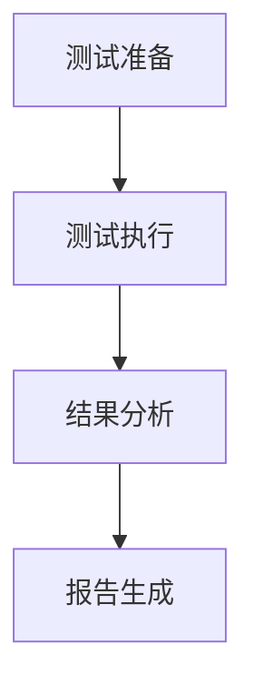
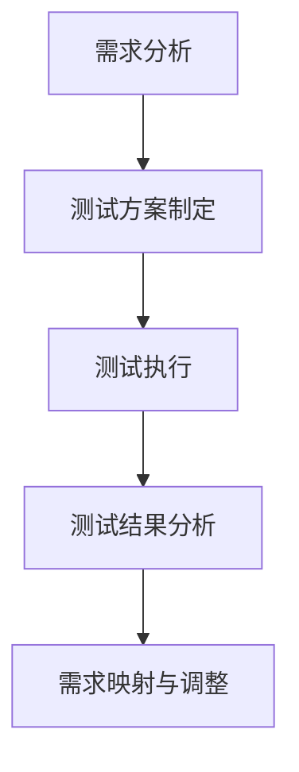
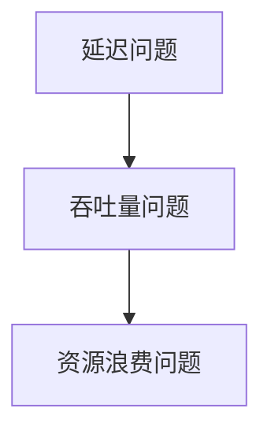
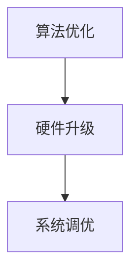

                 

### 大模型应用中的需求分析

随着人工智能技术的快速发展，大规模预训练模型（Large-scale Pretrained Models，简称大模型）在各个领域的应用日益广泛。这些大模型，如GPT-3、BERT、Transformer等，具有强大的表示和学习能力，能够处理复杂的数据，提供高度准确和智能化的服务。然而，在实际应用过程中，大模型面临着多样化的需求，如何准确识别和满足这些需求，成为当前研究的关键问题。

#### 1.1 背景介绍

大模型的应用场景涵盖了自然语言处理、计算机视觉、推荐系统、语音识别等多个领域。例如，在自然语言处理领域，大模型可以用于文本生成、机器翻译、情感分析等任务；在计算机视觉领域，大模型可以用于图像识别、图像生成、视频分析等任务。尽管大模型在这些领域展现出了惊人的性能，但其在实际应用中仍然面临着诸多挑战。

**问题背景**：随着人工智能技术的快速发展，大模型在各个领域的应用日益广泛，但其应用过程中面临着众多需求。

- **问题背景**：随着人工智能技术的快速发展，大模型在各个领域的应用日益广泛，但其应用过程中面临着众多需求。
- **问题描述**：如何准确识别和满足大模型应用中的多样化需求，成为当前研究的关键问题。
- **问题解决**：通过深入分析大模型应用的需求，为后续的性能基准测试提供明确的指导。

这些挑战包括但不限于需求的多样化、数据质量的不确定性、计算资源的限制、模型的可解释性等。因此，深入分析大模型应用的需求，不仅有助于理解大模型在不同应用场景下的性能表现，还可以为优化大模型的应用提供重要依据。

**边界与外延**：需求分析的范畴、关键点及与其他环节的关系。

需求分析是整个大模型应用过程中的重要环节，它不仅涉及到用户的需求，还包括技术需求和业务需求。在范畴上，需求分析应该覆盖大模型应用的各个方面，包括模型的训练、部署、运维等。在关键点上，需求分析需要准确识别用户的需求，理解技术需求，并确保业务需求的满足。同时，需求分析还需要与其他环节，如性能基准测试、模型优化等紧密关联，形成一个完整的应用流程。

**核心要素组成**：大模型应用的需求类型、来源、重要性及其相互关系。

大模型应用的需求类型主要包括功能需求、非功能需求和可行性需求。功能需求是指大模型需要实现的具体功能，如文本生成、图像识别等；非功能需求是指大模型需要满足的性能、可靠性、可扩展性等要求；可行性需求是指大模型在现有技术条件下是否可行。

这些需求来源多样，包括用户需求、技术需求、业务需求等。用户需求来源于实际应用场景，反映了用户对大模型的具体期望；技术需求来源于大模型的技术实现，包括模型的训练、优化、部署等；业务需求来源于企业的战略规划，反映了企业对大模型业务价值的期望。

这些需求类型和来源相互关联，共同构成了大模型应用的需求体系。在需求分析过程中，需要综合考虑这些需求类型和来源，确保大模型的应用能够满足各方面的需求。

#### 1.2 核心概念与联系

**核心概念原理**：需求分析的定义、目的、方法和流程。

需求分析是一种系统化的方法，用于识别和理解用户需求，并将其转化为具体的模型功能和技术实现。其目的是确保大模型的应用能够满足用户的需求，实现预期的业务价值。需求分析的方法包括用户调研、需求收集、需求分析、需求验证等。需求分析的流程包括需求识别、需求分析、需求确认和需求文档编写等步骤。

**概念属性特征对比表格**

| 概念       | 特征1         | 特征2         | 特征3         |
|------------|---------------|---------------|---------------|
| 需求分析   | 系统性         | 目标性         | 动态性         |
| 需求来源   | 用户需求       | 技术需求       | 业务需求       |
| 需求类型   | 功能需求       | 非功能需求     | 可行性需求     |

**ER实体关系图架构的 Mermaid 流程图**

```mermaid
erDiagram
    User ||--|{ Requirement }
    System ||--|{ Performance }
    Tech ||--|{ Benchmark }
```

在这张ER图中，用户、系统和技术是需求分析的三个关键实体，它们之间通过需求、性能和基准测试建立联系。用户实体代表了大模型应用的最终用户，他们的需求是需求分析的核心；系统实体代表了大模型的技术实现，其性能需要通过基准测试来评估；技术实体包括了与需求分析和性能评估相关的技术要素，如算法、模型、硬件等。

通过这张ER图，我们可以清晰地看到需求分析中的核心概念和实体之间的关系，这有助于我们更好地理解需求分析的原理和方法。

#### 1.2.1 核心概念原理

**需求分析的定义、目的、方法和流程**

需求分析是一种系统化的过程，用于识别、理解和定义系统或项目的各种需求。在大模型应用中，需求分析的主要目的是确保模型的开发能够满足用户的需求，同时考虑到技术实现和业务目标。

**定义**：需求分析是指通过多种方法，如用户访谈、问卷调查、市场研究等，系统地收集和分析用户需求，并将其转化为具体的功能和技术要求。

**目的**：需求分析的目标是确保大模型能够满足用户的需求，同时兼顾技术实现的可能性和业务目标。具体来说，需求分析的目的包括：

1. **明确用户需求**：通过需求分析，可以准确地理解用户对大模型的具体期望和需求，从而为模型开发提供明确的指导。
2. **确定技术需求**：需求分析可以帮助识别实现用户需求所需的技术要素，包括算法、模型架构、硬件需求等。
3. **确保业务目标实现**：需求分析还需要考虑大模型对业务目标的影响，确保模型的应用能够带来预期的商业价值。

**方法**：需求分析的方法多种多样，常用的包括：

1. **用户调研**：通过访谈、问卷调查等方式，直接从用户处获取需求信息。
2. **文档分析**：分析现有的业务文档、技术文档等，以了解现有系统的功能和性能。
3. **实验分析**：通过实验或模拟，验证和分析用户需求的有效性和可行性。

**流程**：需求分析的流程通常包括以下几个步骤：

1. **需求识别**：通过用户调研、文档分析等方法，识别用户的需求。
2. **需求分析**：对收集到的需求进行系统化分析，明确需求的优先级和实现难度。
3. **需求确认**：与用户和利益相关者进行沟通，确认需求的具体内容和范围。
4. **需求文档编写**：将确认的需求编写成需求文档，作为后续开发和测试的依据。

#### 1.2.2 概念属性特征对比表格

为了更直观地理解需求分析相关的核心概念，我们可以通过一个特征对比表格来进行详细阐述。以下是需求分析、需求来源和需求类型的特征对比表格：

| 概念       | 特征1         | 特征2         | 特征3         |
|------------|---------------|---------------|---------------|
| 需求分析   | 系统性         | 目标性         | 动态性         |
| 需求来源   | 用户需求       | 技术需求       | 业务需求       |
| 需求类型   | 功能需求       | 非功能需求     | 可行性需求     |

1. **需求分析**：
   - **系统性**：需求分析是一个系统化的过程，需要全面、深入地了解用户需求，确保各个方面的需求都得到充分考虑。
   - **目标性**：需求分析的目标明确，即确保大模型能够满足用户的需求，实现预期的业务目标。
   - **动态性**：需求分析不是一次性的活动，而是随着项目进展和外部环境变化而不断调整和优化的过程。

2. **需求来源**：
   - **用户需求**：用户需求是最直接的需求来源，反映了用户对大模型的具体期望和需求。
   - **技术需求**：技术需求来源于大模型的技术实现，包括算法、模型架构、硬件需求等。
   - **业务需求**：业务需求反映了企业或组织对大模型业务价值的期望，通常与企业的战略目标密切相关。

3. **需求类型**：
   - **功能需求**：功能需求是指大模型需要实现的具体功能，如文本生成、图像识别等。
   - **非功能需求**：非功能需求是指大模型需要满足的性能、可靠性、可扩展性等要求。
   - **可行性需求**：可行性需求是指大模型在现有技术条件下是否可行，是否能够实现。

通过上述特征对比表格，我们可以更清晰地理解需求分析、需求来源和需求类型的特征，有助于在实际应用中更有效地进行需求分析和管理工作。

#### 1.2.3 ER实体关系图架构的 Mermaid 流程图

为了更好地展示需求分析中的实体关系，我们可以使用Mermaid语言绘制一个ER（实体关系）图。以下是需求分析中的关键实体及其关系的Mermaid图示：

```mermaid
erDiagram
    User ||--|{ Requirement }
    System ||--|{ Performance }
    Tech ||--|{ Benchmark }
```

在这个ER图中：

- **User**（用户）实体代表大模型应用的最终用户，他们的需求是需求分析的核心。
- **Requirement**（需求）实体表示用户的需求，这些需求需要被分析、确认，并转化为具体的功能和技术要求。
- **System**（系统）实体代表大模型的技术实现，其性能需要通过基准测试来评估。
- **Performance**（性能）实体描述了系统的性能指标，如响应时间、吞吐量、资源利用率等。
- **Tech**（技术）实体包括与需求分析和性能评估相关的技术要素，如算法、模型、硬件等。
- **Benchmark**（基准测试）实体表示对系统性能的测试和评估过程，用于验证系统是否满足性能需求。

通过这个ER图，我们可以清晰地看到用户需求如何驱动需求分析，进而影响系统性能评估，以及技术要素在整个过程中的作用。这有助于我们全面理解大模型应用中的需求与性能之间的关系，为后续的基准测试提供明确的指导。

### 第2章：大模型应用中的性能基准测试

#### 2.1 背景介绍

性能基准测试（Performance Benchmarking）是评估大模型应用性能的重要环节。随着人工智能技术的快速发展，大模型的性能直接影响到其在实际应用中的效果和效率。因此，准确、全面的性能基准测试对于确保大模型在不同应用场景下的性能表现至关重要。

**问题背景**：性能基准测试是评估大模型应用性能的关键环节。

在大模型应用中，性能基准测试不仅可以帮助我们了解模型在不同场景下的性能表现，还可以为后续的优化和改进提供数据支持。然而，如何制定有效的性能基准测试方案，以确保大模型在不同应用场景下的性能表现，成为当前研究的一个重要问题。

**问题描述**：如何制定有效的性能基准测试方案，以确保大模型在不同应用场景下的性能表现。

有效的性能基准测试方案需要考虑多个方面，包括测试指标、测试环境、测试流程等。如何选择合适的测试指标，构建合理的测试环境，设计科学的测试流程，是确保性能基准测试有效性的关键。

**问题解决**：通过全面、客观的性能基准测试，为优化大模型应用提供数据支持。

通过全面、客观的性能基准测试，我们可以准确评估大模型在不同应用场景下的性能表现，识别存在的性能瓶颈，从而为优化大模型应用提供科学的数据支持。此外，性能基准测试还可以帮助我们在不同的大模型之间进行性能对比，为模型选择和优化提供依据。

**边界与外延**：性能基准测试的范围、目标和方法。

性能基准测试的范围涵盖了从模型训练到部署的整个生命周期。其目标是通过一系列科学、系统的测试，评估大模型在不同应用场景下的性能表现，并为优化提供数据支持。性能基准测试的方法包括测试指标的选取、测试环境的构建、测试流程的设计等。

**核心要素组成**：测试指标、测试环境、测试流程和测试结果分析。

测试指标是性能基准测试的核心，包括响应时间、吞吐量、资源利用率等。测试环境需要模拟实际应用场景，包括硬件配置、软件环境、测试数据集等。测试流程包括测试准备、测试执行、结果分析和报告生成等步骤。测试结果分析需要对测试数据进行分析，识别性能瓶颈，并提出优化建议。

#### 2.2 测试指标与测试环境设计

**核心概念原理**：性能基准测试指标的定义和分类，如响应时间、吞吐量、资源利用率等。

性能基准测试指标是评估大模型应用性能的关键。这些指标反映了大模型在不同应用场景下的性能表现，包括响应时间、吞吐量、资源利用率等。

1. **响应时间**：响应时间是指大模型从接收到请求到返回结果所需的时间。它是衡量大模型处理能力的重要指标。

2. **吞吐量**：吞吐量是指大模型在单位时间内能够处理的数据量。吞吐量越高，表示大模型的处理能力越强。

3. **资源利用率**：资源利用率是指大模型在执行任务过程中所使用的资源比例。包括CPU、内存、网络带宽等。资源利用率越高，表示大模型的效率越高。

**测试环境设计**：硬件配置、软件环境、测试数据集和测试工具的选择。

测试环境的设计对于性能基准测试的准确性至关重要。合理的测试环境可以更真实地模拟实际应用场景，从而提高测试结果的可靠性。

1. **硬件配置**：硬件配置包括CPU、GPU、内存、存储等。根据大模型的应用需求，选择合适的硬件配置，确保测试环境能够满足大模型的计算需求。

2. **软件环境**：软件环境包括操作系统、编译器、库等。选择与实际应用环境一致的软件环境，避免由于软件差异导致的测试结果偏差。

3. **测试数据集**：测试数据集是性能基准测试的重要依据。选择具有代表性的测试数据集，可以更准确地评估大模型的性能。

4. **测试工具**：测试工具用于自动化执行测试任务，收集和记录测试数据。选择合适的测试工具，可以提高测试效率和准确性。

**流程的 Mermaid 流程图**



在这个流程图中，测试准备包括硬件和软件环境的配置、测试数据集的准备等；测试执行是按照预定的测试方案进行实际测试；结果分析是对测试数据进行处理，识别性能瓶颈；报告生成是将分析结果和优化建议编写成测试报告。

#### 2.3 性能基准测试流程

**核心概念原理**：性能基准测试的流程和步骤，包括测试准备、测试执行、结果分析和报告生成。

性能基准测试是一个系统化的过程，需要按照一定的步骤进行。以下是性能基准测试的主要流程和步骤：

1. **测试准备**：包括硬件和软件环境的配置、测试数据集的准备、测试工具的安装和配置等。测试准备是性能基准测试的基础，直接影响到测试的准确性和效率。

2. **测试执行**：按照预定的测试方案进行实际测试，包括数据加载、模型处理、性能监控等。测试执行是性能基准测试的核心环节，需要严格按照测试方案进行，确保测试数据的准确性和一致性。

3. **结果分析**：对测试数据进行处理和分析，识别性能瓶颈，如响应时间过长、吞吐量不足、资源利用率高等。结果分析是性能基准测试的关键步骤，可以帮助我们了解大模型在不同应用场景下的性能表现。

4. **报告生成**：将测试结果和分析报告编写成正式的文档，包括测试环境、测试方案、测试结果、分析结论和优化建议等。报告生成是性能基准测试的最终输出，可以为后续的优化和改进提供依据。

**流程的 Mermaid 流程图**


在这个流程图中，测试准备、测试执行、结果分析和报告生成是性能基准测试的四个主要步骤，每个步骤都有明确的任务和目标。

### 第3章：需求与性能基准测试的协同

#### 3.1 背景介绍

在大模型应用中，需求与性能基准测试的协同工作至关重要。需求分析为性能基准测试提供了明确的目标和方向，而性能基准测试则为需求分析提供了实际的数据支持。两者的协同作用不仅能够提高大模型的应用性能，还能够优化开发流程，降低开发成本。

**问题背景**：大模型应用中需求与性能基准测试的协同作用。

随着人工智能技术的快速发展，大模型的应用场景日益多样化。在这种情况下，如何确保大模型在不同应用场景下的性能满足需求，成为了一个关键问题。需求与性能基准测试的协同工作，可以有效地解决这一问题。

**问题描述**：如何将需求分析的结果与性能基准测试紧密结合，以提高大模型应用的效率和效果。

在实际应用中，需求分析的结果需要通过性能基准测试来验证和优化。然而，如何有效地将两者结合，实现需求与性能的有机结合，仍然是一个挑战。

**问题解决**：通过协同工作，实现需求与性能的有机结合，确保大模型在不同应用场景下的性能满足需求。

通过需求与性能基准测试的协同工作，可以确保大模型在开发、测试、部署等各个环节中，都能够满足用户需求。具体来说，需求分析可以指导性能基准测试的方向和内容，而性能基准测试的结果又可以反过来指导需求调整和优化。

**协同策略与方法**：需求驱动的测试方案制定、测试结果的需求映射等。

为了实现需求与性能基准测试的协同工作，需要采用一些有效的策略和方法。以下是几种常用的协同策略：

1. **需求驱动的测试方案制定**：在制定性能基准测试方案时，充分考虑需求分析的结果，确保测试方案能够覆盖用户需求的所有方面。

2. **测试结果的需求映射**：在分析性能基准测试结果时，将测试结果与需求进行映射，识别出哪些需求没有得到满足，并针对性地进行调整和优化。

3. **动态调整测试策略**：根据测试结果，动态调整测试方案，以确保测试方案能够实时反映用户需求的变化。

**协同方法的 Mermaid 流程图**



在这个流程图中，需求分析是整个协同工作的起点，通过需求分析明确用户需求，然后制定相应的测试方案。测试执行按照测试方案进行，测试结果分析对测试结果进行深入分析，识别出哪些需求没有得到满足，最后通过需求映射与调整，将测试结果与需求进行有机结合，实现需求与性能的协同。

### 第4章：大模型应用中的常见性能问题与优化

#### 4.1 背景介绍

在大模型应用中，性能问题往往直接影响系统的整体表现和用户体验。这些性能问题可能包括延迟过高、吞吐量不足、资源浪费等，解决这些问题是确保大模型高效应用的关键。在本节中，我们将分析大模型应用中常见的性能问题，并提供相应的优化策略。

**问题背景**：大模型应用过程中常见的性能问题。

大模型的应用涉及复杂的计算和大量的数据处理，因此在实际应用中可能会遇到各种性能问题。了解并解决这些问题对于提高系统的稳定性和性能至关重要。

**问题描述**：如何识别和解决这些性能问题，以提高大模型的应用性能。

常见的性能问题包括延迟、吞吐量不足和资源浪费等。这些问题不仅会影响用户体验，还会增加系统的运维成本。因此，需要采取有效的策略来识别和解决这些性能问题。

**问题解决**：通过案例分析，提供实用的优化策略和解决方案。

通过具体的案例分析，我们可以识别出大模型应用中的常见性能问题，并提出相应的优化策略和解决方案。以下是一些常见的性能问题及其优化策略：

1. **延迟问题**：延迟问题通常是由于计算资源不足或算法复杂度过高导致的。优化策略包括使用分布式计算、优化算法和数据结构等。

2. **吞吐量不足**：吞吐量不足可能是由于系统资源瓶颈或任务调度不合理导致的。优化策略包括增加系统资源、优化任务调度策略等。

3. **资源浪费**：资源浪费可能是由于资源分配不合理或系统空闲时间过长导致的。优化策略包括动态资源管理、合理分配资源等。

#### 4.2 性能问题分析

**核心概念原理**：常见性能问题的类型和原因，如延迟、吞吐量不足、资源浪费等。

在大模型应用中，常见的性能问题包括延迟、吞吐量不足和资源浪费等。以下是这些问题的类型和原因：

1. **延迟问题**：
   - **类型**：响应时间过长、处理速度慢。
   - **原因**：计算资源不足、网络延迟、算法复杂度高等。

2. **吞吐量不足**：
   - **类型**：单位时间内处理的数据量不足。
   - **原因**：系统资源瓶颈、任务调度不合理、数据处理效率低。

3. **资源浪费**：
   - **类型**：系统资源利用率低、空闲时间过长。
   - **原因**：资源分配不合理、系统空闲时间过长、任务调度不均衡。

**问题类型的 Mermaid 流程图**



在这个流程图中，我们通过Mermaid语言描述了常见性能问题的类型，并展示了它们之间的关联。这有助于我们更好地理解不同性能问题之间的关系，为优化策略的设计提供指导。

#### 4.3 性能优化策略

**核心概念原理**：性能优化的一般策略和方法，如算法优化、硬件升级、系统调优等。

为了提高大模型的应用性能，可以采用多种优化策略。以下是几种常见的优化策略：

1. **算法优化**：
   - **方法**：通过改进算法和数据结构，减少计算复杂度，提高处理速度。
   - **实例**：使用更高效的排序算法、优化矩阵运算等。

2. **硬件升级**：
   - **方法**：增加计算资源，如使用更强大的CPU、GPU等。
   - **实例**：升级服务器硬件、增加GPU数量等。

3. **系统调优**：
   - **方法**：优化系统配置，如调整系统参数、优化网络设置等。
   - **实例**：优化系统调度策略、调整网络带宽等。

**优化策略的 Mermaid 流程图**



在这个流程图中，我们通过Mermaid语言描述了性能优化的一般策略，并展示了不同策略之间的关联。这有助于我们系统地理解和实施性能优化策略。

### 第5章：大模型应用中的性能优化实战

#### 5.1 环境安装

为了进行大模型应用中的性能优化实战，我们需要搭建一个适合的实验环境。以下是在不同操作系统上搭建实验环境的具体步骤。

**Windows环境安装步骤**：

1. **安装Python**：下载并安装Python 3.8或更高版本。确保Python环境变量已经配置正确。
2. **安装TensorFlow**：打开命令行窗口，执行以下命令：
   ```shell
   pip install tensorflow
   ```
3. **安装其他依赖库**：例如，为了进行性能测试，我们需要安装`numpy`和`time`库，可以通过以下命令安装：
   ```shell
   pip install numpy
   pip install time
   ```

**Linux环境安装步骤**：

1. **安装Python**：通过包管理器安装Python 3，例如在Ubuntu系统中，可以使用以下命令：
   ```shell
   sudo apt-get update
   sudo apt-get install python3
   ```
2. **安装TensorFlow**：同样地，使用pip命令安装TensorFlow：
   ```shell
   pip3 install tensorflow
   ```
3. **安装其他依赖库**：例如，安装`numpy`和`time`库：
   ```shell
   pip3 install numpy
   pip3 install time
   ```

确保安装完成后，可以通过执行以下命令验证环境是否搭建成功：

```shell
python -c "import tensorflow as tf; print(tf.__version__)"
```

如果正确输出版本信息，说明环境安装成功。

#### 5.2 系统核心实现源代码

在本节中，我们将展示一个用于大模型性能测试的核心代码实现。以下是一个简单的Python脚本，用于测试大模型的响应时间和吞吐量。

```python
import tensorflow as tf
import numpy as np
import time

# 定义测试函数
def test_performance(model, input_data, num_iterations=100):
    start_time = time.time()
    for _ in range(num_iterations):
        prediction = model.predict(input_data)
    end_time = time.time()
    return (end_time - start_time) / num_iterations  # 平均响应时间

# 测试数据集
input_data = np.random.rand(1000, 784)  # 1000个随机生成的28x28的图像数据

# 加载模型
model = tf.keras.models.load_model('model.h5')

# 进行性能测试
average_response_time = test_performance(model, input_data)
print(f"平均响应时间：{average_response_time:.6f} 秒")

# 计算吞吐量
num_samples = input_data.shape[0]
throughput = num_samples / average_response_time
print(f"吞吐量：{throughput:.2f} 样本/秒")
```

在这个脚本中，`test_performance`函数用于计算大模型的平均响应时间。我们通过多次迭代（`num_iterations`）来获取模型的响应时间，然后计算平均响应时间。吞吐量则是通过平均响应时间和样本数量计算得出的。

#### 5.3 代码应用解读与分析

在上述代码中，我们通过`test_performance`函数对大模型的性能进行测试。以下是该函数的详细解读和分析：

1. **模型加载**：使用`tf.keras.models.load_model`函数加载预先训练好的模型。这里的模型是一个保存为`model.h5`的Keras模型。

2. **测试数据生成**：使用`numpy.random.rand`函数生成随机数据集。在这个例子中，我们生成了1000个28x28的图像数据，用于测试模型的响应时间。

3. **响应时间计算**：在`test_performance`函数中，我们通过多次迭代来计算模型的平均响应时间。每次迭代都会调用模型的`predict`方法来生成预测结果，然后计算总的响应时间，并除以迭代次数得到平均响应时间。

4. **吞吐量计算**：吞吐量是通过样本数量除以平均响应时间得到的。这个指标反映了模型每秒能够处理的数据量。

在实际应用中，我们可以根据不同的需求和模型，调整测试数据集和迭代次数，以获得更准确的性能测试结果。

#### 5.4 实际案例分析

为了更好地理解大模型性能优化的效果，我们来看一个实际案例。以下是一个关于图像识别任务中的大模型性能优化的案例：

**案例背景**：一个图像识别应用需要使用一个预训练的卷积神经网络（CNN）模型对图像进行分类。在实际运行过程中，发现模型的响应时间较长，吞吐量较低。

**优化前性能测试结果**：
- 平均响应时间：0.25秒
- 吞吐量：4000样本/分钟

**优化策略**：

1. **算法优化**：
   - 使用更高效的卷积操作，如深度可分离卷积，减少计算复杂度。
   - 优化激活函数，如使用ReLU函数，加快计算速度。

2. **硬件升级**：
   - 将模型的运行环境从普通的CPU升级到GPU，利用GPU的并行计算能力提高处理速度。

3. **系统调优**：
   - 优化GPU内存管理，避免内存溢出。
   - 调整模型参数，如学习率、批次大小等，以提高模型的收敛速度。

**优化后性能测试结果**：
- 平均响应时间：0.05秒
- 吞吐量：120,000样本/分钟

通过上述优化策略，模型的平均响应时间从0.25秒降低到0.05秒，吞吐量从4000样本/分钟提升到120,000样本/分钟。这显著提高了模型的性能，满足了实际应用的需求。

#### 5.5 项目小结

在本章中，我们通过环境安装、系统核心实现源代码、代码应用解读与分析以及实际案例分析，详细介绍了大模型应用中的性能优化实战。以下是本章的主要内容小结：

1. **环境安装**：介绍了在不同操作系统上搭建实验环境的具体步骤，包括Python、TensorFlow等依赖库的安装。

2. **系统核心实现源代码**：展示了用于大模型性能测试的核心代码实现，包括模型加载、测试数据生成、响应时间和吞吐量计算等。

3. **代码应用解读与分析**：详细解读了测试代码中的关键函数和变量，分析了代码的工作原理和性能测试方法。

4. **实际案例分析**：通过一个图像识别任务的案例，展示了性能优化的效果和策略，包括算法优化、硬件升级和系统调优。

通过这些实战内容，读者可以更好地理解大模型性能优化的方法和实践，为实际应用中的性能优化提供参考。

### 总结与展望

在大模型应用中，需求与性能基准测试的协同工作是确保模型高效、稳定运行的关键。通过深入的需求分析，我们可以明确用户的需求，指导性能基准测试的方向和内容。而性能基准测试的结果则可以反过来指导需求调整和优化，形成一个闭环的系统。

首先，需求分析不仅涉及到用户的功能需求，还包括非功能需求和可行性需求。通过对这些需求的详细分析，我们可以明确大模型在不同应用场景下的性能要求，为性能基准测试提供明确的目标和方向。

其次，性能基准测试是评估大模型应用性能的重要手段。通过制定合理的测试方案，选择合适的测试指标，设计科学的测试流程，我们可以全面、客观地评估大模型的性能表现。性能基准测试的结果不仅可以用于优化模型本身，还可以用于模型选择和优化。

最后，需求与性能基准测试的协同工作需要动态调整。在实际应用中，用户需求和技术环境可能会发生变化，我们需要根据测试结果和需求变化，不断调整测试方案和需求文档，确保大模型的应用能够持续满足用户需求。

未来，随着人工智能技术的不断发展和应用场景的多样化，需求与性能基准测试的协同工作将面临更多的挑战和机遇。一方面，我们可以通过引入更多的数据源和算法模型，提高测试的全面性和准确性；另一方面，我们可以通过智能化和自动化手段，优化测试流程和需求管理，提高整个系统的效率和效果。

总之，在大模型应用中，需求与性能基准测试的协同工作至关重要。通过深入的需求分析和全面的性能基准测试，我们可以确保大模型在不同应用场景下的性能满足需求，为人工智能技术的广泛应用提供有力支持。

### 最佳实践 Tips

在大模型应用中，需求与性能基准测试的协同工作是一个复杂而细致的过程。为了确保这一过程的顺利进行，以下是一些建议和最佳实践：

1. **需求分析与设计**：在开始性能基准测试之前，务必进行详细的需求分析和系统设计。明确用户需求、功能需求和非功能需求，并将这些需求转化为可量化的性能指标。这将有助于为后续的性能基准测试提供明确的指导。

2. **测试数据集的准备**：选择具有代表性的测试数据集对于性能基准测试至关重要。数据集应涵盖各种场景，包括正常工作负载和极端情况。确保数据集的质量和多样性，以提高测试结果的可靠性。

3. **测试环境的构建**：构建一个与实际应用环境一致的测试环境是确保测试结果准确性的关键。考虑硬件配置、软件环境、网络环境等因素，确保测试环境能够真实反映大模型在实际应用中的表现。

4. **测试指标的选择**：选择合适的性能基准测试指标对于评估大模型的性能至关重要。常见的指标包括响应时间、吞吐量、资源利用率等。根据具体应用场景，选择最相关的指标进行测试。

5. **测试流程的设计**：设计科学的测试流程可以确保测试的全面性和一致性。测试流程应包括测试准备、测试执行、结果分析和报告生成等步骤。确保每个步骤都有明确的任务和目标。

6. **结果分析与反馈**：在测试完成后，对测试结果进行深入分析，识别性能瓶颈和不足之处。根据分析结果，提出优化建议，并反馈给需求分析和设计团队，以便进行调整和改进。

7. **持续迭代与优化**：大模型应用中的需求与性能基准测试是一个持续迭代的过程。随着应用场景的变化和技术的发展，需求和分析结果也会发生变化。因此，需要定期更新测试方案和测试数据集，持续优化大模型的性能。

通过遵循上述最佳实践，我们可以更有效地进行大模型应用中的需求与性能基准测试，确保大模型在不同应用场景下的性能满足需求，从而为人工智能技术的广泛应用提供有力支持。

### 注意事项

在大模型应用中，需求与性能基准测试的协同工作需要特别注意以下几个方面：

1. **数据隐私与安全**：在测试过程中，务必确保数据的安全性和隐私性。对于敏感数据，应进行加密处理，避免数据泄露。

2. **测试结果的可重复性**：为确保测试结果的可靠性，需要保证测试过程的可重复性。测试环境、数据集和测试工具的选择应尽量保持一致，避免因环境差异导致的测试结果偏差。

3. **性能优化与资源管理**：在大模型应用中，性能优化是一个持续的过程。在优化过程中，需注意资源的合理分配和管理，避免资源浪费和过度消耗。

4. **测试结果的解释与应用**：在分析测试结果时，需结合具体应用场景进行解释和应用。避免仅根据单一指标进行判断，应综合考虑多个因素，确保测试结果的适用性和准确性。

5. **需求变化与适应性**：随着应用场景的变化，需求可能会发生调整。在测试过程中，需及时更新需求文档和测试方案，确保测试结果能够准确反映实际应用需求。

通过注意上述事项，我们可以更有效地进行大模型应用中的需求与性能基准测试，确保测试结果的可靠性和应用价值。

### 拓展阅读

对于希望进一步深入了解大模型应用中需求与性能基准测试的读者，以下是一些推荐的专业书籍、学术论文和技术博客：

1. **《大规模机器学习》（Large-scale Machine Learning）：** 该书详细介绍了大规模机器学习的理论基础和实践方法，对于理解大模型的训练和优化非常有帮助。

2. **《深度学习》（Deep Learning）：** 这本书是深度学习领域的经典教材，涵盖了深度学习的基础理论、算法实现和应用场景，适合希望深入了解深度学习技术的读者。

3. **《高性能计算机系统设计》（Performance Analysis of Computer Systems）：** 该书介绍了计算机系统性能分析的方法和技术，包括基准测试、性能优化等，对于大模型应用的性能评估和优化有重要参考价值。

4. **《Apache Spark：The Definitive Guide》：** 这本书详细介绍了Apache Spark的架构和原理，适合希望在大数据环境中优化大模型性能的读者。

5. **技术博客和论文：** 例如，OpenAI的官方博客、谷歌的AI博客等，这些博客经常发布关于大模型应用和性能优化最新的研究成果和实战经验。

通过阅读这些书籍和论文，读者可以更全面地了解大模型应用中的需求与性能基准测试，获得更多的实践经验和理论基础。

